# Case | Button | Case Missing Info

## Flow Diagram [(_View History_)](Missing_Info_Flow-history.md)

```mermaid
%% If you read this, your Markdown visualizer does not handle MermaidJS syntax.
%% - If you are in VS Code, install extension `Markdown Preview Mermaid Support` at https://marketplace.visualstudio.com/items?itemName=bierner.markdown-mermaid
%% - If you are using sfdx-hardis, try to define env variable `MERMAID_MODES=cli,docker` ,then run again the command to regenerate markdown with SVG images.
%% - If you are within mkdocs-material, define mermaid plugin in `mkdocs.yml` as described in https://squidfunk.github.io/mkdocs-material/extensions/mermaid/
%% - As a last resort, you can copy-paste this MermaidJS code into https://mermaid.live/ to see the flow diagram

flowchart TB
START(["START<br/><b>Screen Flow</b>"]):::startClass
click START "#general-information" "2463521588"

Is_this_a_Child_Case{"🔀 <em></em><br/>Is this a Child Case?"}:::decisions
click Is_this_a_Child_Case "#is_this_a_child_case" "3473830308"

Get_Case[("🔍 <em></em><br/>Get Case")]:::recordLookups
click Get_Case "#get_case" "1293687730"

Update_Case[("🛠️ <em></em><br/>Update Case")]:::recordUpdates
click Update_Case "#update_case" "2627453517"

Error(["💻 <em></em><br/>Error"]):::screens
click Error "#error" "923322895"

Is_this_a_Child_Case --> |"Yes"| Update_Case
Is_this_a_Child_Case --> |"No"| Error
Get_Case --> Is_this_a_Child_Case
Update_Case --> END_Update_Case
Error --> END_Error
START -->  Get_Case
END_Update_Case(( END )):::endClass
END_Error(( END )):::endClass


classDef actionCalls fill:#D4E4FC,color:black,text-decoration:none,max-height:100px
classDef assignments fill:#FBEED7,color:black,text-decoration:none,max-height:100px
classDef collectionProcessors fill:#F0E3FA,color:black,text-decoration:none,max-height:100px
classDef customErrors fill:#FFE9E9,color:black,text-decoration:none,max-height:100px
classDef decisions fill:#FDEAF6,color:black,text-decoration:none,max-height:100px
classDef loops fill:#FDEAF6,color:black,text-decoration:none,max-height:100px
classDef recordCreates fill:#FFF8C9,color:black,text-decoration:none,max-height:100px
classDef recordDeletes fill:#FFF8C9,color:black,text-decoration:none,max-height:100px
classDef recordLookups fill:#EDEAFF,color:black,text-decoration:none,max-height:100px
classDef recordUpdates fill:#FFF8C9,color:black,text-decoration:none,max-height:100px
classDef screens fill:#DFF6FF,color:black,text-decoration:none,max-height:100px
classDef subflows fill:#D4E4FC,color:black,text-decoration:none,max-height:100px
classDef startClass fill:#D9F2E6,color:black,text-decoration:none,max-height:100px
classDef endClass fill:#F9BABA,color:black,text-decoration:none,max-height:100px
classDef transforms fill:#FDEAF6,color:black,text-decoration:none,max-height:100px


```

<!-- Flow description -->

## General Information

|<!-- -->|<!-- -->|
|:---|:---|
|Process Type| Flow|
|Label|Case | Button | Case Missing Info|
|Status|Active|
|Description|If Case does not have the necessary data entered, mark status as "Missing Info"|
|Interview Label|Missing Info {!$Flow.CurrentDateTime}|
| Builder Type (PM)|LightningFlowBuilder|
| Origin Builder Type (PM)|LightningFlowBuilder|
|Connector|[Get_Case](#get_case)|
|Next Node|[Get_Case](#get_case)|

## Variables

|Name|Data Type|Is Collection|Is Input|Is Output|Object Type|Description|
|:-- |:--:|:--:|:--:|:--:|:--:|:--  |
|recordId|String|⬜|✅|✅|<!-- -->|<!-- -->|

## Flow Nodes Details

### Is_this_a_Child_Case

|<!-- -->|<!-- -->|
|:---|:---|
|Type|Decision|
|Label|Is this a Child Case?|
|Default Connector|[Error](#error)|
|Default Connector Label|No|

#### Rule Yes (Yes)

|<!-- -->|<!-- -->|
|:---|:---|
|Connector|[Update_Case](#update_case)|
|Condition Logic|and|

|Condition Id|Left Value Reference|Operator|Right Value|
|:-- |:-- |:--:|:--: |
|1|Get_Case.ParentId| Is Null|⬜|

### Get_Case

|<!-- -->|<!-- -->|
|:---|:---|
|Type|Record Lookup|
|Object|Case|
|Label|Get Case|
|Assign Null Values If No Records Found|⬜|
|Get First Record Only|✅|
|Store Output Automatically|✅|
|Connector|[Is_this_a_Child_Case](#is_this_a_child_case)|

#### Filters (logic: **and**)

|Filter Id|Field|Operator|Value|
|:-- |:-- |:--:|:--: |
|1|Id| Equal To|recordId|

### Update_Case

|<!-- -->|<!-- -->|
|:---|:---|
|Type|Record Update|
|Object|Case|
|Label|Update Case|

#### Filters (logic: **and**)

|Filter Id|Field|Operator|Value|
|:-- |:-- |:--:|:--: |
|1|Id| Equal To|recordId|

#### Input Assignments

|Field|Value|
|:-- |:--: |
|Status|Missing Info|

### Error

|<!-- -->|<!-- -->|
|:---|:---|
|Type|Screen|
|Label|[Error](#error)|
|Allow Back|✅|
|Allow Finish|✅|
|Allow Pause|⬜|
|Show Footer|✅|
|Show Header|✅|

#### Not_Child

|<!-- -->|<!-- -->|
|:---|:---|
|Field Text|
"Missing Info" is only available on child cases. Please return to the case page and update info manually.
|
|Field Type| Display Text|
|Style Properties|verticalAlignment: &nbsp;&nbsp;stringValue: top width: &nbsp;&nbsp;stringValue: 12 |

___

_Documentation generated from branch monitoring_myubiquity by [sfdx-hardis](https://sfdx-hardis.cloudity.com), featuring [salesforce-flow-visualiser](https://github.com/toddhalfpenny/salesforce-flow-visualiser)_