# Operations Metrics | Button | Input Weekly Metrics

## Flow Diagram [(_View History_)](Operations_Metrics_Button_Input_Weekly_Metrics-history.md)

```mermaid
%% If you read this, your Markdown visualizer does not handle MermaidJS syntax.
%% - If you are in VS Code, install extension `Markdown Preview Mermaid Support` at https://marketplace.visualstudio.com/items?itemName=bierner.markdown-mermaid
%% - If you are using sfdx-hardis, try to define env variable `MERMAID_MODES=cli,docker` ,then run again the command to regenerate markdown with SVG images.
%% - If you are within mkdocs-material, define mermaid plugin in `mkdocs.yml` as described in https://squidfunk.github.io/mkdocs-material/extensions/mermaid/
%% - As a last resort, you can copy-paste this MermaidJS code into https://mermaid.live/ to see the flow diagram

flowchart TB
START(["START<br/><b>Screen Flow</b>"]):::startClass
click START "#general-information" "4196986129"

Assign_Current_ACH_Pull_Amount[\"🟰 <em></em><br/>Assign Current ACH Pull Amount"/]:::assignments
click Assign_Current_ACH_Pull_Amount "#assign_current_ach_pull_amount" "3744834654"

Assign_Current_Currency_Values[\"🟰 <em></em><br/>Assign Current Currency Values"/]:::assignments
click Assign_Current_Currency_Values "#assign_current_currency_values" "1872887249"

assignWeekEnd[\"🟰 <em></em><br/>assignWeekEnd"/]:::assignments
click assignWeekEnd "#assignweekend" "4035549865"

Copy_1_of_Assign_Current_Currency_Values[\"🟰 <em></em><br/>Copy 1 of Assign Current Currency Values"/]:::assignments
click Copy_1_of_Assign_Current_Currency_Values "#copy_1_of_assign_current_currency_values" "3023534324"

Copy_1_of_assignWeekEnd[\"🟰 <em></em><br/>Copy 1 of assignWeekEnd"/]:::assignments
click Copy_1_of_assignWeekEnd "#copy_1_of_assignweekend" "1111535540"

Payroll_or_R_W{"🔀 <em></em><br/>Payroll or R&W"}:::decisions
click Payroll_or_R_W "#payroll_or_r_w" "3545149460"

Which_Metrics_Chosen{"🔀 <em></em><br/>Which Metrics Chosen?"}:::decisions
click Which_Metrics_Chosen "#which_metrics_chosen" "2371286115"

Copy_1_of_Get_Distro_Metric[("🔍 <em></em><br/>Copy 1 of Get Distro Metric")]:::recordLookups
click Copy_1_of_Get_Distro_Metric "#copy_1_of_get_distro_metric" "791448171"

Copy_1_of_Get_FinOps_Metric[("🔍 <em></em><br/>Copy 1 of Get FinOps Metric")]:::recordLookups
click Copy_1_of_Get_FinOps_Metric "#copy_1_of_get_finops_metric" "2281393959"

Get_Distro_Metric[("🔍 <em></em><br/>Get Distro Metric")]:::recordLookups
click Get_Distro_Metric "#get_distro_metric" "3669729569"

Get_FinOps_Metric[("🔍 <em></em><br/>Get FinOps Metric")]:::recordLookups
click Get_FinOps_Metric "#get_finops_metric" "68767350"

Get_Payroll_Metric[("🔍 <em></em><br/>Get Payroll Metric")]:::recordLookups
click Get_Payroll_Metric "#get_payroll_metric" "1931468565"

Copy_1_of_Update_Distro_Metric[("🛠️ <em></em><br/>Copy 1 of Update Distro Metric")]:::recordUpdates
click Copy_1_of_Update_Distro_Metric "#copy_1_of_update_distro_metric" "715406415"

Copy_1_of_Update_FinOps_Metrics[("🛠️ <em></em><br/>Copy 1 of Update FinOps Metrics")]:::recordUpdates
click Copy_1_of_Update_FinOps_Metrics "#copy_1_of_update_finops_metrics" "2168784231"

Update_Distro_Metric[("🛠️ <em></em><br/>Update Distro Metric")]:::recordUpdates
click Update_Distro_Metric "#update_distro_metric" "1010123882"

Update_FinOps_Metrics[("🛠️ <em></em><br/>Update FinOps Metrics")]:::recordUpdates
click Update_FinOps_Metrics "#update_finops_metrics" "3297051277"

Update_Payroll_Metric[("🛠️ <em></em><br/>Update Payroll Metric")]:::recordUpdates
click Update_Payroll_Metric "#update_payroll_metric" "946762814"

Copy_1_of_Input_Distro_Metrics(["💻 <em></em><br/>Copy 1 of Input Distro Metrics"]):::screens
click Copy_1_of_Input_Distro_Metrics "#copy_1_of_input_distro_metrics" "1996262061"

Copy_1_of_Input_FinOps_Metrics(["💻 <em></em><br/>Copy 1 of Input FinOps Metrics"]):::screens
click Copy_1_of_Input_FinOps_Metrics "#copy_1_of_input_finops_metrics" "3548008068"

Input_Distro_Metrics(["💻 <em></em><br/>Input Distro Metrics"]):::screens
click Input_Distro_Metrics "#input_distro_metrics" "2257882121"

Input_FinOps_Metrics(["💻 <em></em><br/>Input FinOps Metrics"]):::screens
click Input_FinOps_Metrics "#input_finops_metrics" "1420914582"

Input_Payroll_Metrics(["💻 <em></em><br/>Input Payroll Metrics"]):::screens
click Input_Payroll_Metrics "#input_payroll_metrics" "3814902600"

Not_Ops_User(["💻 <em></em><br/>Not Ops User"]):::screens
click Not_Ops_User "#not_ops_user" "4015586804"

Ops_Or_Distros(["💻 <em></em><br/>Ops Or Distros"]):::screens
click Ops_Or_Distros "#ops_or_distros" "4211712708"

Assign_Current_ACH_Pull_Amount --> Input_Payroll_Metrics
Assign_Current_Currency_Values --> Input_FinOps_Metrics
assignWeekEnd --> Input_Distro_Metrics
Copy_1_of_Assign_Current_Currency_Values --> Copy_1_of_Input_FinOps_Metrics
Copy_1_of_assignWeekEnd --> Copy_1_of_Input_Distro_Metrics
Payroll_or_R_W --> |"Payroll"| Get_Payroll_Metric
Payroll_or_R_W --> |"R&W"| Ops_Or_Distros
Payroll_or_R_W --> |"Default Outcome"| Not_Ops_User
Which_Metrics_Chosen --> |"Distros"| Get_Distro_Metric
Which_Metrics_Chosen --> |"FinOps"| Get_FinOps_Metric
Which_Metrics_Chosen --> |"Both"| Copy_1_of_Get_FinOps_Metric
Copy_1_of_Get_Distro_Metric --> Copy_1_of_assignWeekEnd
Copy_1_of_Get_FinOps_Metric --> Copy_1_of_Assign_Current_Currency_Values
Get_Distro_Metric --> assignWeekEnd
Get_FinOps_Metric --> Assign_Current_Currency_Values
Get_Payroll_Metric --> Assign_Current_ACH_Pull_Amount
Copy_1_of_Update_Distro_Metric --> END_Copy_1_of_Update_Distro_Metric
Copy_1_of_Update_FinOps_Metrics --> Copy_1_of_Get_Distro_Metric
Update_Distro_Metric --> END_Update_Distro_Metric
Update_FinOps_Metrics --> END_Update_FinOps_Metrics
Update_Payroll_Metric --> END_Update_Payroll_Metric
Copy_1_of_Input_Distro_Metrics --> Copy_1_of_Update_Distro_Metric
Copy_1_of_Input_FinOps_Metrics --> Copy_1_of_Update_FinOps_Metrics
Input_Distro_Metrics --> Update_Distro_Metric
Input_FinOps_Metrics --> Update_FinOps_Metrics
Input_Payroll_Metrics --> Update_Payroll_Metric
Not_Ops_User --> END_Not_Ops_User
Ops_Or_Distros --> Which_Metrics_Chosen
START -->  Payroll_or_R_W
END_Copy_1_of_Update_Distro_Metric(( END )):::endClass
END_Update_Distro_Metric(( END )):::endClass
END_Update_FinOps_Metrics(( END )):::endClass
END_Update_Payroll_Metric(( END )):::endClass
END_Not_Ops_User(( END )):::endClass


classDef actionCalls fill:#D4E4FC,color:black,text-decoration:none,max-height:100px
classDef assignments fill:#FBEED7,color:black,text-decoration:none,max-height:100px
classDef collectionProcessors fill:#F0E3FA,color:black,text-decoration:none,max-height:100px
classDef customErrors fill:#FFE9E9,color:black,text-decoration:none,max-height:100px
classDef decisions fill:#FDEAF6,color:black,text-decoration:none,max-height:100px
classDef loops fill:#FDEAF6,color:black,text-decoration:none,max-height:100px
classDef recordCreates fill:#FFF8C9,color:black,text-decoration:none,max-height:100px
classDef recordDeletes fill:#FFF8C9,color:black,text-decoration:none,max-height:100px
classDef recordLookups fill:#EDEAFF,color:black,text-decoration:none,max-height:100px
classDef recordUpdates fill:#FFF8C9,color:black,text-decoration:none,max-height:100px
classDef screens fill:#DFF6FF,color:black,text-decoration:none,max-height:100px
classDef subflows fill:#D4E4FC,color:black,text-decoration:none,max-height:100px
classDef startClass fill:#D9F2E6,color:black,text-decoration:none,max-height:100px
classDef endClass fill:#F9BABA,color:black,text-decoration:none,max-height:100px
classDef transforms fill:#FDEAF6,color:black,text-decoration:none,max-height:100px


```

<!-- Flow description -->

## General Information

|<!-- -->|<!-- -->|
|:---|:---|
|Process Type| Flow|
|Label|Operations Metrics | Button | Input Weekly Metrics|
|Status|Active|
|Environments|Default|
|Interview Label|Operations Metrics | Button | Input Weekly Metrics {!$Flow.CurrentDateTime}|
| Builder Type (PM)|LightningFlowBuilder|
| Canvas Mode (PM)|AUTO_LAYOUT_CANVAS|
| Origin Builder Type (PM)|LightningFlowBuilder|
|Connector|[Payroll_or_R_W](#payroll_or_r_w)|
|Next Node|[Payroll_or_R_W](#payroll_or_r_w)|

## Variables

|Name|Data Type|Is Collection|Is Input|Is Output|Object Type|Description|
|:-- |:--:|:--:|:--:|:--:|:--:|:--  |
|advisorFeeProcessingCurrent|Currency|⬜|✅|⬜|<!-- -->|<!-- -->|
|cashOutOfBalancesCurrent|Currency|⬜|✅|⬜|<!-- -->|<!-- -->|
|currentACHPullAmount|Currency|⬜|✅|⬜|<!-- -->|<!-- -->|
|displayWeekEnd1|Date|⬜|✅|⬜|<!-- -->|<!-- -->|
|fundOutOfBalanceCurrent|Currency|⬜|✅|⬜|<!-- -->|<!-- -->|
|oldestUnreconciledCash|String|⬜|✅|⬜|<!-- -->|<!-- -->|
|recordId|String|⬜|✅|⬜|<!-- -->|<!-- -->|
|tpaFeeProcessing|Currency|⬜|✅|⬜|<!-- -->|<!-- -->|
|tradesSubmittedCurrent|Currency|⬜|✅|⬜|<!-- -->|<!-- -->|

## Formulas

|Name|Data Type|Expression|Description|
|:-- |:--:|:-- |:--  |
|WeekEnd|Date|{!Get_Payroll_Metric.Week_End__c}|<!-- -->|

## Flow Nodes Details

### Assign_Current_ACH_Pull_Amount

|<!-- -->|<!-- -->|
|:---|:---|
|Type|Assignment|
|Label|Assign Current ACH Pull Amount|
|Connector|[Input_Payroll_Metrics](#input_payroll_metrics)|

#### Assignments

|Assign To Reference|Operator|Value|
|:-- |:--:|:--: |
|currentACHPullAmount| Assign|Get_Payroll_Metric.ACH_Pulls_Currency__c|
|displayWeekEnd1| Assign|Get_Payroll_Metric.Week_End__c|

### Assign_Current_Currency_Values

|<!-- -->|<!-- -->|
|:---|:---|
|Type|Assignment|
|Label|Assign Current Currency Values|
|Description|Used to display current value in screen since currency is not a supported field.|
|Connector|[Input_FinOps_Metrics](#input_finops_metrics)|

#### Assignments

|Assign To Reference|Operator|Value|
|:-- |:--:|:--: |
|advisorFeeProcessingCurrent| Assign|Get_FinOps_Metric.Advisor_Fee_Processing_Currency__c|
|cashOutOfBalancesCurrent| Assign|Get_FinOps_Metric.Cash_Out_of_Balances_Currency__c|
|fundOutOfBalanceCurrent| Assign|Get_FinOps_Metric.Fund_Out_of_Balances_Currency__c|
|tpaFeeProcessing| Assign|Get_FinOps_Metric.TPA_Fee_Processing_Currency__c|
|tradesSubmittedCurrent| Assign|Get_FinOps_Metric.Trades_Submitted_Currency__c|
|displayWeekEnd1| Assign|Get_FinOps_Metric.Week_End__c|
|oldestUnreconciledCash| Assign|Get_FinOps_Metric.Oldest_Unreconciled_Cash__c|

### assignWeekEnd

|<!-- -->|<!-- -->|
|:---|:---|
|Type|Assignment|
|Label|[assignWeekEnd](#assignweekend)|
|Connector|[Input_Distro_Metrics](#input_distro_metrics)|

#### Assignments

|Assign To Reference|Operator|Value|
|:-- |:--:|:--: |
|displayWeekEnd1| Assign|Get_Distro_Metric.Week_End__c|

### Copy_1_of_Assign_Current_Currency_Values

|<!-- -->|<!-- -->|
|:---|:---|
|Type|Assignment|
|Label|Copy 1 of Assign Current Currency Values|
|Description|Used to display current value in screen since currency is not a supported field.|
|Connector|[Copy_1_of_Input_FinOps_Metrics](#copy_1_of_input_finops_metrics)|

#### Assignments

|Assign To Reference|Operator|Value|
|:-- |:--:|:--: |
|advisorFeeProcessingCurrent| Assign|Get_FinOps_Metric.Advisor_Fee_Processing_Currency__c|
|cashOutOfBalancesCurrent| Assign|Get_FinOps_Metric.Cash_Out_of_Balances_Currency__c|
|fundOutOfBalanceCurrent| Assign|Get_FinOps_Metric.Fund_Out_of_Balances_Currency__c|
|tpaFeeProcessing| Assign|Get_FinOps_Metric.TPA_Fee_Processing_Currency__c|
|tradesSubmittedCurrent| Assign|Get_FinOps_Metric.Trades_Submitted_Currency__c|
|displayWeekEnd1| Assign|Get_FinOps_Metric.Week_End__c|
|oldestUnreconciledCash| Assign|Get_FinOps_Metric.Oldest_Unreconciled_Cash__c|

### Copy_1_of_assignWeekEnd

|<!-- -->|<!-- -->|
|:---|:---|
|Type|Assignment|
|Label|Copy 1 of assignWeekEnd|
|Connector|[Copy_1_of_Input_Distro_Metrics](#copy_1_of_input_distro_metrics)|

#### Assignments

|Assign To Reference|Operator|Value|
|:-- |:--:|:--: |
|displayWeekEnd1| Assign|Get_Distro_Metric.Week_End__c|

### Payroll_or_R_W

|<!-- -->|<!-- -->|
|:---|:---|
|Type|Decision|
|Label|Payroll or R&W|
|Default Connector|[Not_Ops_User](#not_ops_user)|
|Default Connector Label|Default Outcome|

#### Rule Copy_1_of_Payroll (Payroll)

|<!-- -->|<!-- -->|
|:---|:---|
|Connector|[Get_Payroll_Metric](#get_payroll_metric)|
|Condition Logic|or|

|Condition Id|Left Value Reference|Operator|Right Value|
|:-- |:-- |:--:|:--: |
|1|$UserRole.Name| Equal To|Payroll Team|

#### Rule R_W (R&W)

|<!-- -->|<!-- -->|
|:---|:---|
|Connector|[Ops_Or_Distros](#ops_or_distros)|
|Condition Logic|or|

|Condition Id|Left Value Reference|Operator|Right Value|
|:-- |:-- |:--:|:--: |
|1|$UserRole.Name| Equal To|Distributions|
|2|$UserRole.Name| Equal To|Operations|
|3|$UserRole.Name| Contains|Admin|
|4|$User.Id| Equal To|005Ho00000AnvFJ|

### Which_Metrics_Chosen

|<!-- -->|<!-- -->|
|:---|:---|
|Type|Decision|
|Label|Which Metrics Chosen?|
|Default Connector|[Copy_1_of_Get_FinOps_Metric](#copy_1_of_get_finops_metric)|
|Default Connector Label|Both|

#### Rule Distros (Distros)

|<!-- -->|<!-- -->|
|:---|:---|
|Connector|[Get_Distro_Metric](#get_distro_metric)|
|Condition Logic|or|

|Condition Id|Left Value Reference|Operator|Right Value|
|:-- |:-- |:--:|:--: |
|1|Metrics_Type| Equal To|distrosMetric|

#### Rule FinOps (FinOps)

|<!-- -->|<!-- -->|
|:---|:---|
|Connector|[Get_FinOps_Metric](#get_finops_metric)|
|Condition Logic|or|

|Condition Id|Left Value Reference|Operator|Right Value|
|:-- |:-- |:--:|:--: |
|1|Metrics_Type| Equal To|finOpsMetric|

### Copy_1_of_Get_Distro_Metric

|<!-- -->|<!-- -->|
|:---|:---|
|Type|Record Lookup|
|Object|Operations_Metrics__c|
|Label|Copy 1 of Get Distro Metric|
|Assign Null Values If No Records Found|⬜|
|Get First Record Only|✅|
|Sort Field|Week_End__c|
|Sort Order|Desc|
|Store Output Automatically|✅|
|Connector|[Copy_1_of_assignWeekEnd](#copy_1_of_assignweekend)|

#### Filters (logic: **and**)

|Filter Id|Field|Operator|Value|
|:-- |:-- |:--:|:--: |
|1|Type__c| Equal To|Distributions|

### Copy_1_of_Get_FinOps_Metric

|<!-- -->|<!-- -->|
|:---|:---|
|Type|Record Lookup|
|Object|Operations_Metrics__c|
|Label|Copy 1 of Get FinOps Metric|
|Assign Null Values If No Records Found|⬜|
|Get First Record Only|✅|
|Sort Field|Week_End__c|
|Sort Order|Desc|
|Store Output Automatically|✅|
|Connector|[Copy_1_of_Assign_Current_Currency_Values](#copy_1_of_assign_current_currency_values)|

#### Filters (logic: **and**)

|Filter Id|Field|Operator|Value|
|:-- |:-- |:--:|:--: |
|1|Type__c| Equal To|Fin Ops|

### Get_Distro_Metric

|<!-- -->|<!-- -->|
|:---|:---|
|Type|Record Lookup|
|Object|Operations_Metrics__c|
|Label|Get Distro Metric|
|Assign Null Values If No Records Found|⬜|
|Get First Record Only|✅|
|Sort Field|Week_End__c|
|Sort Order|Desc|
|Store Output Automatically|✅|
|Connector|[assignWeekEnd](#assignweekend)|

#### Filters (logic: **and**)

|Filter Id|Field|Operator|Value|
|:-- |:-- |:--:|:--: |
|1|Type__c| Equal To|Distributions|

### Get_FinOps_Metric

|<!-- -->|<!-- -->|
|:---|:---|
|Type|Record Lookup|
|Object|Operations_Metrics__c|
|Label|Get FinOps Metric|
|Assign Null Values If No Records Found|⬜|
|Get First Record Only|✅|
|Sort Field|Week_End__c|
|Sort Order|Desc|
|Store Output Automatically|✅|
|Connector|[Assign_Current_Currency_Values](#assign_current_currency_values)|

#### Filters (logic: **and**)

|Filter Id|Field|Operator|Value|
|:-- |:-- |:--:|:--: |
|1|Type__c| Equal To|Fin Ops|

### Get_Payroll_Metric

|<!-- -->|<!-- -->|
|:---|:---|
|Type|Record Lookup|
|Object|Operations_Metrics__c|
|Label|Get Payroll Metric|
|Assign Null Values If No Records Found|⬜|
|Get First Record Only|✅|
|Sort Field|Week_End__c|
|Sort Order|Desc|
|Store Output Automatically|✅|
|Connector|[Assign_Current_ACH_Pull_Amount](#assign_current_ach_pull_amount)|

#### Filters (logic: **and**)

|Filter Id|Field|Operator|Value|
|:-- |:-- |:--:|:--: |
|1|Type__c| Equal To|Payroll|

### Copy_1_of_Update_Distro_Metric

|<!-- -->|<!-- -->|
|:---|:---|
|Type|Record Update|
|Label|Copy 1 of Update Distro Metric|
|Input Reference|[Get_Distro_Metric](#get_distro_metric)|

### Copy_1_of_Update_FinOps_Metrics

|<!-- -->|<!-- -->|
|:---|:---|
|Type|Record Update|
|Object|Operations_Metrics__c|
|Label|Copy 1 of Update FinOps Metrics|
|Connector|[Copy_1_of_Get_Distro_Metric](#copy_1_of_get_distro_metric)|

#### Filters (logic: **and**)

|Filter Id|Field|Operator|Value|
|:-- |:-- |:--:|:--: |
|1|Id| Equal To|Get_FinOps_Metric.Id|

#### Input Assignments

|Field|Value|
|:-- |:--: |
|Advisor_Fee_Processing_Currency__c|Advisor_Fee_Processing|
|Advisor_Fee_Processing_Number__c|Get_FinOps_Metric.Advisor_Fee_Processing_Number__c|
|Cash_Out_of_Balances_Currency__c|Cash_Out_of_Balances|
|Cash_Out_of_Balances_Number__c|Get_FinOps_Metric.Cash_Out_of_Balances_Number__c|
|Fund_Out_of_Balances_Currency__c|Fund_Out_of_Balances|
|Fund_Out_of_Balances_Number__c|Get_FinOps_Metric.Fund_Out_of_Balances_Number__c|
|Oldest_Unreconciled_Cash__c|Oldest_Unreconciled_Cash|
|Pending_Trading__c|Get_FinOps_Metric.Pending_Trading__c|
|TPA_Fee_Processing_Currency__c|TPA_Fee_Processing|
|TPA_Fee_Processing_Number__c|Get_FinOps_Metric.TPA_Fee_Processing_Number__c|
|Trades_Rejected__c|Get_FinOps_Metric.Trades_Rejected__c|
|Trades_Submitted_Currency__c|Trades_Submitted|
|Trades_Submitted_Number__c|Get_FinOps_Metric.Trades_Submitted_Number__c|

### Update_Distro_Metric

|<!-- -->|<!-- -->|
|:---|:---|
|Type|Record Update|
|Label|Update Distro Metric|
|Input Reference|[Get_Distro_Metric](#get_distro_metric)|

### Update_FinOps_Metrics

|<!-- -->|<!-- -->|
|:---|:---|
|Type|Record Update|
|Object|Operations_Metrics__c|
|Label|Update FinOps Metrics|

#### Filters (logic: **and**)

|Filter Id|Field|Operator|Value|
|:-- |:-- |:--:|:--: |
|1|Id| Equal To|Get_FinOps_Metric.Id|

#### Input Assignments

|Field|Value|
|:-- |:--: |
|Advisor_Fee_Processing_Currency__c|Advisor_Fee_Processing|
|Advisor_Fee_Processing_Number__c|Get_FinOps_Metric.Advisor_Fee_Processing_Number__c|
|Cash_Out_of_Balances_Currency__c|Cash_Out_of_Balances|
|Cash_Out_of_Balances_Number__c|Get_FinOps_Metric.Cash_Out_of_Balances_Number__c|
|Fund_Out_of_Balances_Currency__c|Fund_Out_of_Balances|
|Fund_Out_of_Balances_Number__c|Get_FinOps_Metric.Fund_Out_of_Balances_Number__c|
|Oldest_Unreconciled_Cash__c|Oldest_Unreconciled_Cash|
|Pending_Trading__c|Get_FinOps_Metric.Pending_Trading__c|
|TPA_Fee_Processing_Currency__c|TPA_Fee_Processing|
|TPA_Fee_Processing_Number__c|Get_FinOps_Metric.TPA_Fee_Processing_Number__c|
|Trades_Rejected__c|Get_FinOps_Metric.Trades_Rejected__c|
|Trades_Submitted_Currency__c|Trades_Submitted|
|Trades_Submitted_Number__c|Get_FinOps_Metric.Trades_Submitted_Number__c|

### Update_Payroll_Metric

|<!-- -->|<!-- -->|
|:---|:---|
|Type|Record Update|
|Object|Operations_Metrics__c|
|Label|Update Payroll Metric|

#### Filters (logic: **and**)

|Filter Id|Field|Operator|Value|
|:-- |:-- |:--:|:--: |
|1|Id| Equal To|Get_Payroll_Metric.Id|

#### Input Assignments

|Field|Value|
|:-- |:--: |
|ACH_Pulls_Currency__c|ACH_Pulls|
|ACH_Pulls_Number__c|Get_Payroll_Metric.ACH_Pulls_Number__c|
|ACH_Rejects_Number__c|Get_Payroll_Metric.ACH_Rejects_Number__c|
|Active_Finch__c|Get_Payroll_Metric.Active_Finch__c|
|EPS_Grand_Total_of_Active_plans__c|Get_Payroll_Metric.EPS_Grand_Total_of_Active_plans__c|
|Outstanding_Deposits_Received__c|Get_Payroll_Metric.Outstanding_Deposits_Received__c|
|Payroll_Rejects_Over_3_Days__c|Get_Payroll_Metric.Payroll_Rejects_Over_3_Days__c|
|Payroll_Submission_Tasks_Comleted__c|Get_Payroll_Metric.Payroll_Submission_Tasks_Comleted__c|
|Payrolls_Awaiting_Funding__c|Get_Payroll_Metric.Payrolls_Awaiting_Funding__c|
|Pending_Direct_Integration_Set_Ups__c|Get_Payroll_Metric.Pending_Direct_Integration_Set_Ups__c|
|Rollovers_Awaiting_Funding__c|Get_Payroll_Metric.Rollovers_Awaiting_Funding__c|
|of_Clients_Using_Payroll_Integration__c|Get_Payroll_Metric.of_Clients_Using_Payroll_Integration__c|

### Copy_1_of_Input_Distro_Metrics

|<!-- -->|<!-- -->|
|:---|:---|
|Type|Screen|
|Label|Copy 1 of Input Distro Metrics|
|Allow Back|⬜|
|Allow Finish|✅|
|Allow Pause|⬜|
|Next Or Finish Button Label|Submit|
|Show Footer|✅|
|Show Header|⬜|
|Connector|[Copy_1_of_Update_Distro_Metric](#copy_1_of_update_distro_metric)|

#### Copy_1_of_week2

|<!-- -->|<!-- -->|
|:---|:---|
|Field Text|
<strong style="font-size: 20px;">{!displayWeekEnd1}</strong>
|
|Field Type| Display Text|
|Style Properties|verticalAlignment: &nbsp;&nbsp;stringValue: top width: &nbsp;&nbsp;stringValue: 12 |

#### Copy_1_of_Input_Distro_Metrics_Section1_Column1

|<!-- -->|<!-- -->|
|:---|:---|
|Field Type| Region|
|Is Required|⬜|
|Parent Field|[Copy_1_of_Input_Distro_Metrics_Section1](#copy_1_of_input_distro_metrics_section1)|
|Width (input)|12|

#### Copy_1_of_Input_Distro_Metrics_Section1

|<!-- -->|<!-- -->|
|:---|:---|
|Field Type| Region Container|
|Is Required|⬜|
|Region Container Type| Section Without Header|
|Style Properties|verticalAlignment: &nbsp;&nbsp;stringValue: top width: &nbsp;&nbsp;stringValue: 12 |

#### Get_Distro_Metric.Distros_Completed_Last_Calendar_Week__c

|<!-- -->|<!-- -->|
|:---|:---|
|Field Type| Object Provided|
|Inputs On Next Nav To Assoc Scrn| Use Stored Values|
|Is Required|⬜|
|Object Field Reference|Get_Distro_Metric.Distros_Completed_Last_Calendar_Week__c|
|Style Properties|verticalAlignment: &nbsp;&nbsp;stringValue: top width: &nbsp;&nbsp;stringValue: 12 |
|Parent Field|[Copy_1_of_Input_Distro_Metrics_Section2_Column1](#copy_1_of_input_distro_metrics_section2_column1)|

#### Copy_1_of_Input_Distro_Metrics_Section2_Column1

|<!-- -->|<!-- -->|
|:---|:---|
|Field Type| Region|
|Is Required|⬜|
|Parent Field|[Copy_1_of_Input_Distro_Metrics_Section2](#copy_1_of_input_distro_metrics_section2)|
|Width (input)|6|

#### Get_Distro_Metric.Loans_Completed_Last_Calendar_Week__c

|<!-- -->|<!-- -->|
|:---|:---|
|Field Type| Object Provided|
|Inputs On Next Nav To Assoc Scrn| Use Stored Values|
|Is Required|⬜|
|Object Field Reference|Get_Distro_Metric.Loans_Completed_Last_Calendar_Week__c|
|Style Properties|verticalAlignment: &nbsp;&nbsp;stringValue: top width: &nbsp;&nbsp;stringValue: 12 |
|Parent Field|[Copy_1_of_Input_Distro_Metrics_Section2_Column2](#copy_1_of_input_distro_metrics_section2_column2)|

#### Copy_1_of_Input_Distro_Metrics_Section2_Column2

|<!-- -->|<!-- -->|
|:---|:---|
|Field Type| Region|
|Is Required|⬜|
|Parent Field|[Copy_1_of_Input_Distro_Metrics_Section2](#copy_1_of_input_distro_metrics_section2)|
|Width (input)|6|

#### Copy_1_of_Input_Distro_Metrics_Section2

|<!-- -->|<!-- -->|
|:---|:---|
|Field Type| Region Container|
|Is Required|⬜|
|Region Container Type| Section Without Header|
|Style Properties|verticalAlignment: &nbsp;&nbsp;stringValue: top width: &nbsp;&nbsp;stringValue: 12 |

### Copy_1_of_Input_FinOps_Metrics

|<!-- -->|<!-- -->|
|:---|:---|
|Type|Screen|
|Label|Copy 1 of Input FinOps Metrics|
|Allow Back|⬜|
|Allow Finish|✅|
|Allow Pause|⬜|
|Next Or Finish Button Label|Submit|
|Show Footer|✅|
|Show Header|⬜|
|Connector|[Copy_1_of_Update_FinOps_Metrics](#copy_1_of_update_finops_metrics)|

#### Copy_1_of_week3

|<!-- -->|<!-- -->|
|:---|:---|
|Field Text|
<strong style="font-size: 20px;">{!displayWeekEnd1}</strong>
|
|Field Type| Display Text|
|Style Properties|verticalAlignment: &nbsp;&nbsp;stringValue: top width: &nbsp;&nbsp;stringValue: 12 |

#### Copy_1_of_Input_FinOps_Metrics_Section1_Column1

|<!-- -->|<!-- -->|
|:---|:---|
|Field Type| Region|
|Is Required|⬜|
|Parent Field|[Copy_1_of_Input_FinOps_Metrics_Section1](#copy_1_of_input_finops_metrics_section1)|
|Width (input)|12|

#### Copy_1_of_Input_FinOps_Metrics_Section1

|<!-- -->|<!-- -->|
|:---|:---|
|Field Type| Region Container|
|Is Required|⬜|
|Region Container Type| Section Without Header|
|Style Properties|verticalAlignment: &nbsp;&nbsp;stringValue: top width: &nbsp;&nbsp;stringValue: 12 |

#### Get_FinOps_Metric.Cash_Out_of_Balances_Number__c

|<!-- -->|<!-- -->|
|:---|:---|
|Field Type| Object Provided|
|Inputs On Next Nav To Assoc Scrn| Use Stored Values|
|Is Required|⬜|
|Object Field Reference|Get_FinOps_Metric.Cash_Out_of_Balances_Number__c|
|Style Properties|verticalAlignment: &nbsp;&nbsp;stringValue: top width: &nbsp;&nbsp;stringValue: 12 |
|Parent Field|[Copy_1_of_Input_FinOps_Metrics_Section2_Column1](#copy_1_of_input_finops_metrics_section2_column1)|

#### Get_FinOps_Metric.Advisor_Fee_Processing_Number__c

|<!-- -->|<!-- -->|
|:---|:---|
|Field Type| Object Provided|
|Inputs On Next Nav To Assoc Scrn| Use Stored Values|
|Is Required|⬜|
|Object Field Reference|Get_FinOps_Metric.Advisor_Fee_Processing_Number__c|
|Style Properties|verticalAlignment: &nbsp;&nbsp;stringValue: top width: &nbsp;&nbsp;stringValue: 12 |
|Parent Field|[Copy_1_of_Input_FinOps_Metrics_Section2_Column1](#copy_1_of_input_finops_metrics_section2_column1)|

#### Get_FinOps_Metric.TPA_Fee_Processing_Number__c

|<!-- -->|<!-- -->|
|:---|:---|
|Field Type| Object Provided|
|Inputs On Next Nav To Assoc Scrn| Use Stored Values|
|Is Required|⬜|
|Object Field Reference|Get_FinOps_Metric.TPA_Fee_Processing_Number__c|
|Style Properties|verticalAlignment: &nbsp;&nbsp;stringValue: top width: &nbsp;&nbsp;stringValue: 12 |
|Parent Field|[Copy_1_of_Input_FinOps_Metrics_Section2_Column1](#copy_1_of_input_finops_metrics_section2_column1)|

#### Get_FinOps_Metric.Fund_Out_of_Balances_Number__c

|<!-- -->|<!-- -->|
|:---|:---|
|Field Type| Object Provided|
|Inputs On Next Nav To Assoc Scrn| Use Stored Values|
|Is Required|⬜|
|Object Field Reference|Get_FinOps_Metric.Fund_Out_of_Balances_Number__c|
|Style Properties|verticalAlignment: &nbsp;&nbsp;stringValue: top width: &nbsp;&nbsp;stringValue: 12 |
|Parent Field|[Copy_1_of_Input_FinOps_Metrics_Section2_Column1](#copy_1_of_input_finops_metrics_section2_column1)|

#### Get_FinOps_Metric.Trades_Submitted_Number__c

|<!-- -->|<!-- -->|
|:---|:---|
|Field Type| Object Provided|
|Inputs On Next Nav To Assoc Scrn| Use Stored Values|
|Is Required|⬜|
|Object Field Reference|Get_FinOps_Metric.Trades_Submitted_Number__c|
|Style Properties|verticalAlignment: &nbsp;&nbsp;stringValue: top width: &nbsp;&nbsp;stringValue: 12 |
|Parent Field|[Copy_1_of_Input_FinOps_Metrics_Section2_Column1](#copy_1_of_input_finops_metrics_section2_column1)|

#### Get_FinOps_Metric.Trades_Rejected__c

|<!-- -->|<!-- -->|
|:---|:---|
|Field Type| Object Provided|
|Inputs On Next Nav To Assoc Scrn| Use Stored Values|
|Is Required|⬜|
|Object Field Reference|Get_FinOps_Metric.Trades_Rejected__c|
|Style Properties|verticalAlignment: &nbsp;&nbsp;stringValue: top width: &nbsp;&nbsp;stringValue: 12 |
|Parent Field|[Copy_1_of_Input_FinOps_Metrics_Section2_Column1](#copy_1_of_input_finops_metrics_section2_column1)|

#### Copy_1_of_Oldest_Unreconciled_Cash

|<!-- -->|<!-- -->|
|:---|:---|
|Data Type|String|
|Default Value|oldestUnreconciledCash|
|Field Text|Oldest Unreconciled Cash|
|Field Type| Input Field|
|Inputs On Next Nav To Assoc Scrn| Use Stored Values|
|Is Required|⬜|
|Style Properties|verticalAlignment: &nbsp;&nbsp;stringValue: top width: &nbsp;&nbsp;stringValue: 12 |
|Validation Rule|errorMessage: 
Please enter a 4 digit year.
 formulaExpression: |- &nbsp;&nbsp;ISNUMBER({!Oldest_Unreconciled_Cash})  &nbsp;&nbsp;&& &nbsp;&nbsp;LEN( {!Oldest_Unreconciled_Cash}) = 4 || ISBLANK({!Oldest_Unreconciled_Cash} ) |
|Parent Field|[Copy_1_of_Input_FinOps_Metrics_Section2_Column1](#copy_1_of_input_finops_metrics_section2_column1)|

#### Copy_1_of_Input_FinOps_Metrics_Section2_Column1

|<!-- -->|<!-- -->|
|:---|:---|
|Field Type| Region|
|Is Required|⬜|
|Parent Field|[Copy_1_of_Input_FinOps_Metrics_Section2](#copy_1_of_input_finops_metrics_section2)|
|Width (input)|6|

#### Copy_1_of_Cash_Out_of_Balances

|<!-- -->|<!-- -->|
|:---|:---|
|Data Type|Currency|
|Default Value|cashOutOfBalancesCurrent|
|Field Text|Cash Out of Balances ($)|
|Field Type| Input Field|
|Inputs On Next Nav To Assoc Scrn| Use Stored Values|
|Is Required|⬜|
|Scale|2|
|Style Properties|verticalAlignment: &nbsp;&nbsp;stringValue: top width: &nbsp;&nbsp;stringValue: 12 |
|Parent Field|[Copy_1_of_Input_FinOps_Metrics_Section2_Column2](#copy_1_of_input_finops_metrics_section2_column2)|

#### Copy_1_of_Advisor_Fee_Processing

|<!-- -->|<!-- -->|
|:---|:---|
|Data Type|Currency|
|Default Value|advisorFeeProcessingCurrent|
|Field Text|Advisor Fee Processing ($)|
|Field Type| Input Field|
|Inputs On Next Nav To Assoc Scrn| Use Stored Values|
|Is Required|⬜|
|Scale|2|
|Style Properties|verticalAlignment: &nbsp;&nbsp;stringValue: top width: &nbsp;&nbsp;stringValue: 12 |
|Parent Field|[Copy_1_of_Input_FinOps_Metrics_Section2_Column2](#copy_1_of_input_finops_metrics_section2_column2)|

#### Copy_1_of_TPA_Fee_Processing

|<!-- -->|<!-- -->|
|:---|:---|
|Data Type|Currency|
|Default Value|tpaFeeProcessing|
|Field Text|TPA Fee Processing ($)|
|Field Type| Input Field|
|Inputs On Next Nav To Assoc Scrn| Use Stored Values|
|Is Required|⬜|
|Scale|2|
|Style Properties|verticalAlignment: &nbsp;&nbsp;stringValue: top width: &nbsp;&nbsp;stringValue: 12 |
|Parent Field|[Copy_1_of_Input_FinOps_Metrics_Section2_Column2](#copy_1_of_input_finops_metrics_section2_column2)|

#### Copy_1_of_Fund_Out_of_Balances

|<!-- -->|<!-- -->|
|:---|:---|
|Data Type|Currency|
|Default Value|fundOutOfBalanceCurrent|
|Field Text|Fund Out of Balances ($)|
|Field Type| Input Field|
|Inputs On Next Nav To Assoc Scrn| Use Stored Values|
|Is Required|⬜|
|Scale|2|
|Style Properties|verticalAlignment: &nbsp;&nbsp;stringValue: top width: &nbsp;&nbsp;stringValue: 12 |
|Parent Field|[Copy_1_of_Input_FinOps_Metrics_Section2_Column2](#copy_1_of_input_finops_metrics_section2_column2)|

#### Copy_1_of_Trades_Submitted

|<!-- -->|<!-- -->|
|:---|:---|
|Data Type|Currency|
|Default Value|tradesSubmittedCurrent|
|Field Text|Trades Submitted ($)|
|Field Type| Input Field|
|Inputs On Next Nav To Assoc Scrn| Use Stored Values|
|Is Required|⬜|
|Scale|2|
|Style Properties|verticalAlignment: &nbsp;&nbsp;stringValue: top width: &nbsp;&nbsp;stringValue: 12 |
|Parent Field|[Copy_1_of_Input_FinOps_Metrics_Section2_Column2](#copy_1_of_input_finops_metrics_section2_column2)|

#### Get_FinOps_Metric.Pending_Trading__c

|<!-- -->|<!-- -->|
|:---|:---|
|Field Type| Object Provided|
|Inputs On Next Nav To Assoc Scrn| Use Stored Values|
|Is Required|⬜|
|Object Field Reference|Get_FinOps_Metric.Pending_Trading__c|
|Style Properties|verticalAlignment: &nbsp;&nbsp;stringValue: top width: &nbsp;&nbsp;stringValue: 12 |
|Parent Field|[Copy_1_of_Input_FinOps_Metrics_Section2_Column2](#copy_1_of_input_finops_metrics_section2_column2)|

#### Copy_1_of_Input_FinOps_Metrics_Section2_Column2

|<!-- -->|<!-- -->|
|:---|:---|
|Field Type| Region|
|Is Required|⬜|
|Parent Field|[Copy_1_of_Input_FinOps_Metrics_Section2](#copy_1_of_input_finops_metrics_section2)|
|Width (input)|6|

#### Copy_1_of_Input_FinOps_Metrics_Section2

|<!-- -->|<!-- -->|
|:---|:---|
|Field Type| Region Container|
|Is Required|⬜|
|Region Container Type| Section Without Header|
|Style Properties|verticalAlignment: &nbsp;&nbsp;stringValue: top width: &nbsp;&nbsp;stringValue: 12 |

### Input_Distro_Metrics

|<!-- -->|<!-- -->|
|:---|:---|
|Type|Screen|
|Label|Input Distro Metrics|
|Allow Back|⬜|
|Allow Finish|✅|
|Allow Pause|⬜|
|Next Or Finish Button Label|Submit|
|Show Footer|✅|
|Show Header|⬜|
|Connector|[Update_Distro_Metric](#update_distro_metric)|

#### week2

|<!-- -->|<!-- -->|
|:---|:---|
|Field Text|
<strong style="font-size: 20px;">{!displayWeekEnd1}</strong>
|
|Field Type| Display Text|
|Style Properties|verticalAlignment: &nbsp;&nbsp;stringValue: top width: &nbsp;&nbsp;stringValue: 12 |

#### Input_Distro_Metrics_Section1_Column1

|<!-- -->|<!-- -->|
|:---|:---|
|Field Type| Region|
|Is Required|⬜|
|Parent Field|[Input_Distro_Metrics_Section1](#input_distro_metrics_section1)|
|Width (input)|12|

#### Input_Distro_Metrics_Section1

|<!-- -->|<!-- -->|
|:---|:---|
|Field Type| Region Container|
|Is Required|⬜|
|Region Container Type| Section Without Header|
|Style Properties|verticalAlignment: &nbsp;&nbsp;stringValue: top width: &nbsp;&nbsp;stringValue: 12 |

#### Get_Distro_Metric.Distros_Completed_Last_Calendar_Week__c

|<!-- -->|<!-- -->|
|:---|:---|
|Field Type| Object Provided|
|Inputs On Next Nav To Assoc Scrn| Use Stored Values|
|Is Required|⬜|
|Object Field Reference|Get_Distro_Metric.Distros_Completed_Last_Calendar_Week__c|
|Style Properties|verticalAlignment: &nbsp;&nbsp;stringValue: top width: &nbsp;&nbsp;stringValue: 12 |
|Parent Field|[Input_Distro_Metrics_Section2_Column1](#input_distro_metrics_section2_column1)|

#### Input_Distro_Metrics_Section2_Column1

|<!-- -->|<!-- -->|
|:---|:---|
|Field Type| Region|
|Is Required|⬜|
|Parent Field|[Input_Distro_Metrics_Section2](#input_distro_metrics_section2)|
|Width (input)|6|

#### Get_Distro_Metric.Loans_Completed_Last_Calendar_Week__c

|<!-- -->|<!-- -->|
|:---|:---|
|Field Type| Object Provided|
|Inputs On Next Nav To Assoc Scrn| Use Stored Values|
|Is Required|⬜|
|Object Field Reference|Get_Distro_Metric.Loans_Completed_Last_Calendar_Week__c|
|Style Properties|verticalAlignment: &nbsp;&nbsp;stringValue: top width: &nbsp;&nbsp;stringValue: 12 |
|Parent Field|[Input_Distro_Metrics_Section2_Column2](#input_distro_metrics_section2_column2)|

#### Input_Distro_Metrics_Section2_Column2

|<!-- -->|<!-- -->|
|:---|:---|
|Field Type| Region|
|Is Required|⬜|
|Parent Field|[Input_Distro_Metrics_Section2](#input_distro_metrics_section2)|
|Width (input)|6|

#### Input_Distro_Metrics_Section2

|<!-- -->|<!-- -->|
|:---|:---|
|Field Type| Region Container|
|Is Required|⬜|
|Region Container Type| Section Without Header|
|Style Properties|verticalAlignment: &nbsp;&nbsp;stringValue: top width: &nbsp;&nbsp;stringValue: 12 |

### Input_FinOps_Metrics

|<!-- -->|<!-- -->|
|:---|:---|
|Type|Screen|
|Label|Input FinOps Metrics|
|Allow Back|⬜|
|Allow Finish|✅|
|Allow Pause|⬜|
|Next Or Finish Button Label|Submit|
|Show Footer|✅|
|Show Header|⬜|
|Connector|[Update_FinOps_Metrics](#update_finops_metrics)|

#### week3

|<!-- -->|<!-- -->|
|:---|:---|
|Field Text|
<strong style="font-size: 20px;">{!displayWeekEnd1}</strong>
|
|Field Type| Display Text|
|Style Properties|verticalAlignment: &nbsp;&nbsp;stringValue: top width: &nbsp;&nbsp;stringValue: 12 |

#### Input_FinOps_Metrics_Section1_Column1

|<!-- -->|<!-- -->|
|:---|:---|
|Field Type| Region|
|Is Required|⬜|
|Parent Field|[Input_FinOps_Metrics_Section1](#input_finops_metrics_section1)|
|Width (input)|12|

#### Input_FinOps_Metrics_Section1

|<!-- -->|<!-- -->|
|:---|:---|
|Field Type| Region Container|
|Is Required|⬜|
|Region Container Type| Section Without Header|
|Style Properties|verticalAlignment: &nbsp;&nbsp;stringValue: top width: &nbsp;&nbsp;stringValue: 12 |

#### Get_FinOps_Metric.Cash_Out_of_Balances_Number__c

|<!-- -->|<!-- -->|
|:---|:---|
|Field Type| Object Provided|
|Inputs On Next Nav To Assoc Scrn| Use Stored Values|
|Is Required|⬜|
|Object Field Reference|Get_FinOps_Metric.Cash_Out_of_Balances_Number__c|
|Style Properties|verticalAlignment: &nbsp;&nbsp;stringValue: top width: &nbsp;&nbsp;stringValue: 12 |
|Parent Field|[Input_FinOps_Metrics_Section2_Column1](#input_finops_metrics_section2_column1)|

#### Get_FinOps_Metric.Advisor_Fee_Processing_Number__c

|<!-- -->|<!-- -->|
|:---|:---|
|Field Type| Object Provided|
|Inputs On Next Nav To Assoc Scrn| Use Stored Values|
|Is Required|⬜|
|Object Field Reference|Get_FinOps_Metric.Advisor_Fee_Processing_Number__c|
|Style Properties|verticalAlignment: &nbsp;&nbsp;stringValue: top width: &nbsp;&nbsp;stringValue: 12 |
|Parent Field|[Input_FinOps_Metrics_Section2_Column1](#input_finops_metrics_section2_column1)|

#### Get_FinOps_Metric.TPA_Fee_Processing_Number__c

|<!-- -->|<!-- -->|
|:---|:---|
|Field Type| Object Provided|
|Inputs On Next Nav To Assoc Scrn| Use Stored Values|
|Is Required|⬜|
|Object Field Reference|Get_FinOps_Metric.TPA_Fee_Processing_Number__c|
|Style Properties|verticalAlignment: &nbsp;&nbsp;stringValue: top width: &nbsp;&nbsp;stringValue: 12 |
|Parent Field|[Input_FinOps_Metrics_Section2_Column1](#input_finops_metrics_section2_column1)|

#### Get_FinOps_Metric.Fund_Out_of_Balances_Number__c

|<!-- -->|<!-- -->|
|:---|:---|
|Field Type| Object Provided|
|Inputs On Next Nav To Assoc Scrn| Use Stored Values|
|Is Required|⬜|
|Object Field Reference|Get_FinOps_Metric.Fund_Out_of_Balances_Number__c|
|Style Properties|verticalAlignment: &nbsp;&nbsp;stringValue: top width: &nbsp;&nbsp;stringValue: 12 |
|Parent Field|[Input_FinOps_Metrics_Section2_Column1](#input_finops_metrics_section2_column1)|

#### Get_FinOps_Metric.Trades_Submitted_Number__c

|<!-- -->|<!-- -->|
|:---|:---|
|Field Type| Object Provided|
|Inputs On Next Nav To Assoc Scrn| Use Stored Values|
|Is Required|⬜|
|Object Field Reference|Get_FinOps_Metric.Trades_Submitted_Number__c|
|Style Properties|verticalAlignment: &nbsp;&nbsp;stringValue: top width: &nbsp;&nbsp;stringValue: 12 |
|Parent Field|[Input_FinOps_Metrics_Section2_Column1](#input_finops_metrics_section2_column1)|

#### Get_FinOps_Metric.Trades_Rejected__c

|<!-- -->|<!-- -->|
|:---|:---|
|Field Type| Object Provided|
|Inputs On Next Nav To Assoc Scrn| Use Stored Values|
|Is Required|⬜|
|Object Field Reference|Get_FinOps_Metric.Trades_Rejected__c|
|Style Properties|verticalAlignment: &nbsp;&nbsp;stringValue: top width: &nbsp;&nbsp;stringValue: 12 |
|Parent Field|[Input_FinOps_Metrics_Section2_Column1](#input_finops_metrics_section2_column1)|

#### Oldest_Unreconciled_Cash

|<!-- -->|<!-- -->|
|:---|:---|
|Data Type|String|
|Default Value|oldestUnreconciledCash|
|Field Text|Oldest Unreconciled Cash|
|Field Type| Input Field|
|Inputs On Next Nav To Assoc Scrn| Use Stored Values|
|Is Required|⬜|
|Style Properties|verticalAlignment: &nbsp;&nbsp;stringValue: top width: &nbsp;&nbsp;stringValue: 12 |
|Validation Rule|errorMessage: 
Please enter a 4 digit year.
 formulaExpression: |- &nbsp;&nbsp;ISNUMBER({!Oldest_Unreconciled_Cash})  &nbsp;&nbsp;&& &nbsp;&nbsp;LEN( {!Oldest_Unreconciled_Cash}) = 4 || ISBLANK({!Oldest_Unreconciled_Cash} ) |
|Parent Field|[Input_FinOps_Metrics_Section2_Column1](#input_finops_metrics_section2_column1)|

#### Input_FinOps_Metrics_Section2_Column1

|<!-- -->|<!-- -->|
|:---|:---|
|Field Type| Region|
|Is Required|⬜|
|Parent Field|[Input_FinOps_Metrics_Section2](#input_finops_metrics_section2)|
|Width (input)|6|

#### Cash_Out_of_Balances

|<!-- -->|<!-- -->|
|:---|:---|
|Data Type|Currency|
|Default Value|cashOutOfBalancesCurrent|
|Field Text|Cash Out of Balances ($)|
|Field Type| Input Field|
|Inputs On Next Nav To Assoc Scrn| Use Stored Values|
|Is Required|⬜|
|Scale|2|
|Style Properties|verticalAlignment: &nbsp;&nbsp;stringValue: top width: &nbsp;&nbsp;stringValue: 12 |
|Parent Field|[Input_FinOps_Metrics_Section2_Column2](#input_finops_metrics_section2_column2)|

#### Advisor_Fee_Processing

|<!-- -->|<!-- -->|
|:---|:---|
|Data Type|Currency|
|Default Value|advisorFeeProcessingCurrent|
|Field Text|Advisor Fee Processing ($)|
|Field Type| Input Field|
|Inputs On Next Nav To Assoc Scrn| Use Stored Values|
|Is Required|⬜|
|Scale|2|
|Style Properties|verticalAlignment: &nbsp;&nbsp;stringValue: top width: &nbsp;&nbsp;stringValue: 12 |
|Parent Field|[Input_FinOps_Metrics_Section2_Column2](#input_finops_metrics_section2_column2)|

#### TPA_Fee_Processing

|<!-- -->|<!-- -->|
|:---|:---|
|Data Type|Currency|
|Default Value|tpaFeeProcessing|
|Field Text|TPA Fee Processing ($)|
|Field Type| Input Field|
|Inputs On Next Nav To Assoc Scrn| Use Stored Values|
|Is Required|⬜|
|Scale|2|
|Style Properties|verticalAlignment: &nbsp;&nbsp;stringValue: top width: &nbsp;&nbsp;stringValue: 12 |
|Parent Field|[Input_FinOps_Metrics_Section2_Column2](#input_finops_metrics_section2_column2)|

#### Fund_Out_of_Balances

|<!-- -->|<!-- -->|
|:---|:---|
|Data Type|Currency|
|Default Value|fundOutOfBalanceCurrent|
|Field Text|Fund Out of Balances ($)|
|Field Type| Input Field|
|Inputs On Next Nav To Assoc Scrn| Use Stored Values|
|Is Required|⬜|
|Scale|2|
|Style Properties|verticalAlignment: &nbsp;&nbsp;stringValue: top width: &nbsp;&nbsp;stringValue: 12 |
|Parent Field|[Input_FinOps_Metrics_Section2_Column2](#input_finops_metrics_section2_column2)|

#### Trades_Submitted

|<!-- -->|<!-- -->|
|:---|:---|
|Data Type|Currency|
|Default Value|tradesSubmittedCurrent|
|Field Text|Trades Submitted ($)|
|Field Type| Input Field|
|Inputs On Next Nav To Assoc Scrn| Use Stored Values|
|Is Required|⬜|
|Scale|2|
|Style Properties|verticalAlignment: &nbsp;&nbsp;stringValue: top width: &nbsp;&nbsp;stringValue: 12 |
|Parent Field|[Input_FinOps_Metrics_Section2_Column2](#input_finops_metrics_section2_column2)|

#### Get_FinOps_Metric.Pending_Trading__c

|<!-- -->|<!-- -->|
|:---|:---|
|Field Type| Object Provided|
|Inputs On Next Nav To Assoc Scrn| Use Stored Values|
|Is Required|⬜|
|Object Field Reference|Get_FinOps_Metric.Pending_Trading__c|
|Style Properties|verticalAlignment: &nbsp;&nbsp;stringValue: top width: &nbsp;&nbsp;stringValue: 12 |
|Parent Field|[Input_FinOps_Metrics_Section2_Column2](#input_finops_metrics_section2_column2)|

#### Input_FinOps_Metrics_Section2_Column2

|<!-- -->|<!-- -->|
|:---|:---|
|Field Type| Region|
|Is Required|⬜|
|Parent Field|[Input_FinOps_Metrics_Section2](#input_finops_metrics_section2)|
|Width (input)|6|

#### Input_FinOps_Metrics_Section2

|<!-- -->|<!-- -->|
|:---|:---|
|Field Type| Region Container|
|Is Required|⬜|
|Region Container Type| Section Without Header|
|Style Properties|verticalAlignment: &nbsp;&nbsp;stringValue: top width: &nbsp;&nbsp;stringValue: 12 |

### Input_Payroll_Metrics

|<!-- -->|<!-- -->|
|:---|:---|
|Type|Screen|
|Label|Input Payroll Metrics|
|Allow Back|✅|
|Allow Finish|✅|
|Allow Pause|⬜|
|Show Footer|✅|
|Show Header|⬜|
|Connector|[Update_Payroll_Metric](#update_payroll_metric)|

#### week1

|<!-- -->|<!-- -->|
|:---|:---|
|Field Text|
<strong style="font-size: 20px;">{!displayWeekEnd1}</strong>
|
|Field Type| Display Text|
|Style Properties|verticalAlignment: &nbsp;&nbsp;stringValue: top width: &nbsp;&nbsp;stringValue: 12 |

#### Input_Payroll_Metrics_Section1_Column1

|<!-- -->|<!-- -->|
|:---|:---|
|Field Type| Region|
|Is Required|⬜|
|Parent Field|[Input_Payroll_Metrics_Section1](#input_payroll_metrics_section1)|
|Width (input)|12|

#### Input_Payroll_Metrics_Section1

|<!-- -->|<!-- -->|
|:---|:---|
|Field Type| Region Container|
|Is Required|⬜|
|Region Container Type| Section Without Header|
|Style Properties|verticalAlignment: &nbsp;&nbsp;stringValue: top width: &nbsp;&nbsp;stringValue: 12 |

#### Get_Payroll_Metric.ACH_Pulls_Number__c

|<!-- -->|<!-- -->|
|:---|:---|
|Field Type| Object Provided|
|Inputs On Next Nav To Assoc Scrn| Use Stored Values|
|Is Required|⬜|
|Object Field Reference|Get_Payroll_Metric.ACH_Pulls_Number__c|
|Style Properties|verticalAlignment: &nbsp;&nbsp;stringValue: top width: &nbsp;&nbsp;stringValue: 12 |
|Parent Field|[Input_Payroll_Metrics_Section2_Column1](#input_payroll_metrics_section2_column1)|

#### Get_Payroll_Metric.ACH_Rejects_Number__c

|<!-- -->|<!-- -->|
|:---|:---|
|Field Type| Object Provided|
|Inputs On Next Nav To Assoc Scrn| Use Stored Values|
|Is Required|⬜|
|Object Field Reference|Get_Payroll_Metric.ACH_Rejects_Number__c|
|Style Properties|verticalAlignment: &nbsp;&nbsp;stringValue: top width: &nbsp;&nbsp;stringValue: 12 |
|Parent Field|[Input_Payroll_Metrics_Section2_Column1](#input_payroll_metrics_section2_column1)|

#### Get_Payroll_Metric.Active_Finch__c

|<!-- -->|<!-- -->|
|:---|:---|
|Field Type| Object Provided|
|Inputs On Next Nav To Assoc Scrn| Use Stored Values|
|Is Required|⬜|
|Object Field Reference|Get_Payroll_Metric.Active_Finch__c|
|Style Properties|verticalAlignment: &nbsp;&nbsp;stringValue: top width: &nbsp;&nbsp;stringValue: 12 |
|Parent Field|[Input_Payroll_Metrics_Section2_Column1](#input_payroll_metrics_section2_column1)|

#### Get_Payroll_Metric.Payrolls_Awaiting_Funding__c

|<!-- -->|<!-- -->|
|:---|:---|
|Field Type| Object Provided|
|Inputs On Next Nav To Assoc Scrn| Use Stored Values|
|Is Required|⬜|
|Object Field Reference|Get_Payroll_Metric.Payrolls_Awaiting_Funding__c|
|Style Properties|verticalAlignment: &nbsp;&nbsp;stringValue: top width: &nbsp;&nbsp;stringValue: 12 |
|Parent Field|[Input_Payroll_Metrics_Section2_Column1](#input_payroll_metrics_section2_column1)|

#### Get_Payroll_Metric.Payroll_Submission_Tasks_Comleted__c

|<!-- -->|<!-- -->|
|:---|:---|
|Field Type| Object Provided|
|Inputs On Next Nav To Assoc Scrn| Use Stored Values|
|Is Required|⬜|
|Object Field Reference|Get_Payroll_Metric.Payroll_Submission_Tasks_Comleted__c|
|Style Properties|verticalAlignment: &nbsp;&nbsp;stringValue: top width: &nbsp;&nbsp;stringValue: 12 |
|Parent Field|[Input_Payroll_Metrics_Section2_Column1](#input_payroll_metrics_section2_column1)|

#### Get_Payroll_Metric.of_Clients_Using_Payroll_Integration__c

|<!-- -->|<!-- -->|
|:---|:---|
|Field Type| Object Provided|
|Inputs On Next Nav To Assoc Scrn| Use Stored Values|
|Is Required|⬜|
|Object Field Reference|Get_Payroll_Metric.of_Clients_Using_Payroll_Integration__c|
|Style Properties|verticalAlignment: &nbsp;&nbsp;stringValue: top width: &nbsp;&nbsp;stringValue: 12 |
|Parent Field|[Input_Payroll_Metrics_Section2_Column1](#input_payroll_metrics_section2_column1)|

#### Input_Payroll_Metrics_Section2_Column1

|<!-- -->|<!-- -->|
|:---|:---|
|Field Type| Region|
|Is Required|⬜|
|Parent Field|[Input_Payroll_Metrics_Section2](#input_payroll_metrics_section2)|
|Width (input)|6|

#### ACH_Pulls

|<!-- -->|<!-- -->|
|:---|:---|
|Data Type|Currency|
|Default Value|currentACHPullAmount|
|Field Text|ACH Pulls ($)|
|Field Type| Input Field|
|Inputs On Next Nav To Assoc Scrn| Use Stored Values|
|Is Required|⬜|
|Scale|2|
|Style Properties|verticalAlignment: &nbsp;&nbsp;stringValue: top width: &nbsp;&nbsp;stringValue: 12 |
|Parent Field|[Input_Payroll_Metrics_Section2_Column2](#input_payroll_metrics_section2_column2)|

#### Get_Payroll_Metric.Payroll_Rejects_Over_3_Days__c

|<!-- -->|<!-- -->|
|:---|:---|
|Field Type| Object Provided|
|Inputs On Next Nav To Assoc Scrn| Use Stored Values|
|Is Required|⬜|
|Object Field Reference|Get_Payroll_Metric.Payroll_Rejects_Over_3_Days__c|
|Style Properties|verticalAlignment: &nbsp;&nbsp;stringValue: top width: &nbsp;&nbsp;stringValue: 12 |
|Parent Field|[Input_Payroll_Metrics_Section2_Column2](#input_payroll_metrics_section2_column2)|

#### Get_Payroll_Metric.Outstanding_Deposits_Received__c

|<!-- -->|<!-- -->|
|:---|:---|
|Field Type| Object Provided|
|Inputs On Next Nav To Assoc Scrn| Use Stored Values|
|Is Required|⬜|
|Object Field Reference|Get_Payroll_Metric.Outstanding_Deposits_Received__c|
|Style Properties|verticalAlignment: &nbsp;&nbsp;stringValue: top width: &nbsp;&nbsp;stringValue: 12 |
|Parent Field|[Input_Payroll_Metrics_Section2_Column2](#input_payroll_metrics_section2_column2)|

#### Get_Payroll_Metric.Rollovers_Awaiting_Funding__c

|<!-- -->|<!-- -->|
|:---|:---|
|Field Type| Object Provided|
|Inputs On Next Nav To Assoc Scrn| Use Stored Values|
|Is Required|⬜|
|Object Field Reference|Get_Payroll_Metric.Rollovers_Awaiting_Funding__c|
|Style Properties|verticalAlignment: &nbsp;&nbsp;stringValue: top width: &nbsp;&nbsp;stringValue: 12 |
|Parent Field|[Input_Payroll_Metrics_Section2_Column2](#input_payroll_metrics_section2_column2)|

#### Get_Payroll_Metric.Pending_Direct_Integration_Set_Ups__c

|<!-- -->|<!-- -->|
|:---|:---|
|Field Type| Object Provided|
|Inputs On Next Nav To Assoc Scrn| Use Stored Values|
|Is Required|⬜|
|Object Field Reference|Get_Payroll_Metric.Pending_Direct_Integration_Set_Ups__c|
|Style Properties|verticalAlignment: &nbsp;&nbsp;stringValue: top width: &nbsp;&nbsp;stringValue: 12 |
|Parent Field|[Input_Payroll_Metrics_Section2_Column2](#input_payroll_metrics_section2_column2)|

#### Get_Payroll_Metric.EPS_Grand_Total_of_Active_plans__c

|<!-- -->|<!-- -->|
|:---|:---|
|Field Type| Object Provided|
|Inputs On Next Nav To Assoc Scrn| Use Stored Values|
|Is Required|⬜|
|Object Field Reference|Get_Payroll_Metric.EPS_Grand_Total_of_Active_plans__c|
|Style Properties|verticalAlignment: &nbsp;&nbsp;stringValue: top width: &nbsp;&nbsp;stringValue: 12 |
|Parent Field|[Input_Payroll_Metrics_Section2_Column2](#input_payroll_metrics_section2_column2)|

#### Input_Payroll_Metrics_Section2_Column2

|<!-- -->|<!-- -->|
|:---|:---|
|Field Type| Region|
|Is Required|⬜|
|Parent Field|[Input_Payroll_Metrics_Section2](#input_payroll_metrics_section2)|
|Width (input)|6|

#### Input_Payroll_Metrics_Section2

|<!-- -->|<!-- -->|
|:---|:---|
|Field Type| Region Container|
|Is Required|⬜|
|Region Container Type| Section Without Header|
|Style Properties|verticalAlignment: &nbsp;&nbsp;stringValue: top width: &nbsp;&nbsp;stringValue: 12 |

### Not_Ops_User

|<!-- -->|<!-- -->|
|:---|:---|
|Type|Screen|
|Label|Not Ops User|
|Allow Back|⬜|
|Allow Finish|✅|
|Allow Pause|⬜|
|Next Or Finish Button Label|Finish|
|Show Footer|✅|
|Show Header|⬜|

#### Message

|<!-- -->|<!-- -->|
|:---|:---|
|Field Text|
This button is for Payroll, Distributions, and FinOps users only. Please click "Finish" to exit.
|
|Field Type| Display Text|
|Style Properties|verticalAlignment: &nbsp;&nbsp;stringValue: top width: &nbsp;&nbsp;stringValue: 12 |

### Ops_Or_Distros

|<!-- -->|<!-- -->|
|:---|:---|
|Type|Screen|
|Label|Ops Or Distros|
|Allow Back|✅|
|Allow Finish|✅|
|Allow Pause|⬜|
|Next Or Finish Button Label|Next|
|Show Footer|✅|
|Show Header|⬜|
|Connector|[Which_Metrics_Chosen](#which_metrics_chosen)|

#### whichOpsMetrics

|<!-- -->|<!-- -->|
|:---|:---|
|Field Text|
<strong style="font-size: 18px;">Are you inputting Operations Metrics, Distributions Metrics, or Both?</strong>
|
|Field Type| Display Text|
|Style Properties|verticalAlignment: &nbsp;&nbsp;stringValue: top width: &nbsp;&nbsp;stringValue: 12 |

#### Metrics_Type

|<!-- -->|<!-- -->|
|:---|:---|
|Data Type|String|
|Choice References|- finOpsMetric - distrosMetric - bothMetrics |
|Field Text|Metrics Type|
|Field Type| Dropdown Box|
|Inputs On Next Nav To Assoc Scrn| Use Stored Values|
|Is Required|✅|
|Style Properties|verticalAlignment: &nbsp;&nbsp;stringValue: top width: &nbsp;&nbsp;stringValue: 12 |

___

_Documentation generated from branch monitoring_myubiquity by [sfdx-hardis](https://sfdx-hardis.cloudity.com), featuring [salesforce-flow-visualiser](https://github.com/toddhalfpenny/salesforce-flow-visualiser)_