# Opportunity | Autolaunched | Pricebook Check

## Flow Diagram [(_View History_)](Opportunity_Autolaunched_Pricebook_Check-history.md)

```mermaid
%% If you read this, your Markdown visualizer does not handle MermaidJS syntax.
%% - If you are in VS Code, install extension `Markdown Preview Mermaid Support` at https://marketplace.visualstudio.com/items?itemName=bierner.markdown-mermaid
%% - If you are using sfdx-hardis, try to define env variable `MERMAID_MODES=cli,docker` ,then run again the command to regenerate markdown with SVG images.
%% - If you are within mkdocs-material, define mermaid plugin in `mkdocs.yml` as described in https://squidfunk.github.io/mkdocs-material/extensions/mermaid/
%% - As a last resort, you can copy-paste this MermaidJS code into https://mermaid.live/ to see the flow diagram

flowchart TB
START(["START<br/><b>AutoLaunched Flow</b></br>"]):::startClass
click START "#general-information" "3817470191"

Assign[\"🟰 <em></em><br/>Assign"/]:::assignments
click Assign "#assign" "3723866004"

Assign_Associated_Partner_Error_Msg[\"🟰 <em></em><br/>Assign Associated Partner Error Msg"/]:::assignments
click Assign_Associated_Partner_Error_Msg "#assign_associated_partner_error_msg" "4025407967"

Assign_Lead_Source_Detail_Match_True[\"🟰 <em></em><br/>Assign Lead Source Detail Match True"/]:::assignments
click Assign_Lead_Source_Detail_Match_True "#assign_lead_source_detail_match_true" "368680272"

Assign_lead_source_match_true[\"🟰 <em></em><br/>Assign lead source match true"/]:::assignments
click Assign_lead_source_match_true "#assign_lead_source_match_true" "2107735150"

Assign_missing_op_ID_message[\"🟰 <em></em><br/>Assign missing op ID message"/]:::assignments
click Assign_missing_op_ID_message "#assign_missing_op_id_message" "1192017037"

Assign_new_PB_from_associated_partner[\"🟰 <em></em><br/>Assign new PB from associated partner"/]:::assignments
click Assign_new_PB_from_associated_partner "#assign_new_pb_from_associated_partner" "2984324846"

Assign_no_pricebooks_found_msg[\"🟰 <em></em><br/>Assign no pricebooks found msg"/]:::assignments
click Assign_no_pricebooks_found_msg "#assign_no_pricebooks_found_msg" "758950746"

Assign_PB_change_variable[\"🟰 <em></em><br/>Assign PB change variable"/]:::assignments
click Assign_PB_change_variable "#assign_pb_change_variable" "958454986"

Assign_pricebook_get_error_msg[\"🟰 <em></em><br/>Assign pricebook get error msg"/]:::assignments
click Assign_pricebook_get_error_msg "#assign_pricebook_get_error_msg" "2532223123"

Assign_standard_PB[\"🟰 <em></em><br/>Assign standard PB"/]:::assignments
click Assign_standard_PB "#assign_standard_pb" "2153095881"

Assignment_6[\"🟰 <em></em><br/>Assignment 6"/]:::assignments
click Assignment_6 "#assignment_6" "155910508"

Assignment_7[\"🟰 <em></em><br/>Assignment 7"/]:::assignments
click Assignment_7 "#assignment_7" "1277110903"

Copy_1_of_Assign_Lead_Source_Detail_Match_True[\"🟰 <em></em><br/>Copy 1 of Assign Lead Source Detail Match True"/]:::assignments
click Copy_1_of_Assign_Lead_Source_Detail_Match_True "#copy_1_of_assign_lead_source_detail_match_true" "3017238808"

Copy_1_of_Assign_lead_source_match_true[\"🟰 <em></em><br/>Copy 1 of Assign lead source match true"/]:::assignments
click Copy_1_of_Assign_lead_source_match_true "#copy_1_of_assign_lead_source_match_true" "432525957"

Copy_1_of_Set_partner_match_to_true[\"🟰 <em></em><br/>Copy 1 of Set partner match to true"/]:::assignments
click Copy_1_of_Set_partner_match_to_true "#copy_1_of_set_partner_match_to_true" "822259293"

Define_Lead_Source_Details[\"🟰 <em></em><br/>Define Lead Source Details"/]:::assignments
click Define_Lead_Source_Details "#define_lead_source_details" "1766773689"

Define_new_PB_as_old_one[\"🟰 <em></em><br/>Define new PB as old one"/]:::assignments
click Define_new_PB_as_old_one "#define_new_pb_as_old_one" "4028601012"

Loop_Define_Lead_Source_Details[\"🟰 <em></em><br/>Loop Define Lead Source Details"/]:::assignments
click Loop_Define_Lead_Source_Details "#loop_define_lead_source_details" "3408843498"

Set_partner_match_to_true[\"🟰 <em></em><br/>Set partner match to true"/]:::assignments
click Set_partner_match_to_true "#set_partner_match_to_true" "1581593917"

Set_reason_text_to_lead_source[\"🟰 <em></em><br/>Set reason text to lead source"/]:::assignments
click Set_reason_text_to_lead_source "#set_reason_text_to_lead_source" "2049704546"

Set_reason_text_to_lead_source_detail[\"🟰 <em></em><br/>Set reason text to lead source detail"/]:::assignments
click Set_reason_text_to_lead_source_detail "#set_reason_text_to_lead_source_detail" "167014986"

Set_reason_text_to_partner_match[\"🟰 <em></em><br/>Set reason text to partner match"/]:::assignments
click Set_reason_text_to_partner_match "#set_reason_text_to_partner_match" "1964829907"

Set_reason_text_to_standard[\"🟰 <em></em><br/>Set reason text to standard"/]:::assignments
click Set_reason_text_to_standard "#set_reason_text_to_standard" "2897873774"

Set_reason_text_to_upgrade[\"🟰 <em></em><br/>Set reason text to upgrade"/]:::assignments
click Set_reason_text_to_upgrade "#set_reason_text_to_upgrade" "1982875822"

Filter_Collection_to_Upgrade{{"🔽 <em>Collection Filter</em><br/>Filter Collection to Upgrade"}}:::collectionProcessors
click Filter_Collection_to_Upgrade "#filter_collection_to_upgrade" "3371164270"

Isolate_associated_partner_PB{{"🔽 <em>Collection Filter</em><br/>Isolate associated partner PB"}}:::collectionProcessors
click Isolate_associated_partner_PB "#isolate_associated_partner_pb" "2290319667"

Isolate_standard_PB{{"🔽 <em>Collection Filter</em><br/>Isolate standard PB"}}:::collectionProcessors
click Isolate_standard_PB "#isolate_standard_pb" "1267742718"

Limit_current_PBs_to_ones_with_lead_source_details{{"🔽 <em>Collection Filter</em><br/>Limit active PBs to ones with lead source details"}}:::collectionProcessors
click Limit_current_PBs_to_ones_with_lead_source_details "#limit_current_pbs_to_ones_with_lead_source_details" "3184631972"

Limit_PBs_to_ones_with_lead_sources{{"🔽 <em>Collection Filter</em><br/>Limit PBs to ones with lead sources"}}:::collectionProcessors
click Limit_PBs_to_ones_with_lead_sources "#limit_pbs_to_ones_with_lead_sources" "3850706063"

Check_current_PB_for_lead_source{"🔀 <em></em><br/>Check current PB for lead source"}:::decisions
click Check_current_PB_for_lead_source "#check_current_pb_for_lead_source" "4059413823"

Check_for_lead_source_details{"🔀 <em></em><br/>Check for lead source details"}:::decisions
click Check_for_lead_source_details "#check_for_lead_source_details" "2744106376"

Check_for_PB_lead_source_match{"🔀 <em></em><br/>Check for PB lead source match"}:::decisions
click Check_for_PB_lead_source_match "#check_for_pb_lead_source_match" "1145249307"

Check_for_primary_partner_pricebook{"🔀 <em></em><br/>Check for primary partner pricebook"}:::decisions
click Check_for_primary_partner_pricebook "#check_for_primary_partner_pricebook" "735730887"

Check_if_lead_source_detail_match_resolved{"🔀 <em></em><br/>Check if lead source detail match resolved"}:::decisions
click Check_if_lead_source_detail_match_resolved "#check_if_lead_source_detail_match_resolved" "2915365970"

Check_if_lead_source_match_resolved{"🔀 <em></em><br/>Check if lead source match resolved"}:::decisions
click Check_if_lead_source_match_resolved "#check_if_lead_source_match_resolved" "3777048257"

Is_current_PB_Standard_check{"🔀 <em></em><br/>Is current PB Standard check"}:::decisions
click Is_current_PB_Standard_check "#is_current_pb_standard_check" "3154743733"

Loop_check_for_lead_source_details{"🔀 <em></em><br/>Loop check for lead source details"}:::decisions
click Loop_check_for_lead_source_details "#loop_check_for_lead_source_details" "1458365012"

New_PB_reason_split{"🔀 <em></em><br/>New PB reason split"}:::decisions
click New_PB_reason_split "#new_pb_reason_split" "1711009444"

Run_Context{"🔀 <em></em><br/>Run Context"}:::decisions
click Run_Context "#run_context" "454711243"

Specialized_pricebook_check{"🔀 <em></em><br/>Specialized pricebook check"}:::decisions
click Specialized_pricebook_check "#specialized_pricebook_check" "3088975815"

Other_pricebooks{{"🔁 <em></em><br/>Other pricebooks"}}:::loops
click Other_pricebooks "#other_pricebooks" "1881908330"

PB_Lead_Source_Loop{{"🔁 <em></em><br/>PB Lead Source Loop"}}:::loops
click PB_Lead_Source_Loop "#pb_lead_source_loop" "21559341"

Single_partner_PB_loop{{"🔁 <em></em><br/>Single partner PB loop"}}:::loops
click Single_partner_PB_loop "#single_partner_pb_loop" "2182163064"

Standard_PB_loop{{"🔁 <em></em><br/>Standard PB loop"}}:::loops
click Standard_PB_loop "#standard_pb_loop" "2647558781"

Upgrade_PB_loop{{"🔁 <em></em><br/>Upgrade PB loop"}}:::loops
click Upgrade_PB_loop "#upgrade_pb_loop" "36543104"

Check_for_primary_associated_partner_w_pricebook[("🔍 <em></em><br/>Check for primary associated partner w pricebook")]:::recordLookups
click Check_for_primary_associated_partner_w_pricebook "#check_for_primary_associated_partner_w_pricebook" "2804734702"

Get_all_active_pricebooks[("🔍 <em></em><br/>Get all active pricebooks")]:::recordLookups
click Get_all_active_pricebooks "#get_all_active_pricebooks" "1939968"

Assign --> Upgrade_PB_loop
Assign_Associated_Partner_Error_Msg --> END_Assign_Associated_Partner_Error_Msg
Assign_Lead_Source_Detail_Match_True --> Other_pricebooks
Assign_lead_source_match_true --> PB_Lead_Source_Loop
Assign_missing_op_ID_message --> END_Assign_missing_op_ID_message
Assign_new_PB_from_associated_partner --> Single_partner_PB_loop
Assign_no_pricebooks_found_msg --> END_Assign_no_pricebooks_found_msg
Assign_PB_change_variable --> New_PB_reason_split
Assign_pricebook_get_error_msg --> END_Assign_pricebook_get_error_msg
Assign_standard_PB --> Standard_PB_loop
Assignment_6 --> Check_current_PB_for_lead_source
Assignment_7 --> Check_for_PB_lead_source_match
Copy_1_of_Assign_Lead_Source_Detail_Match_True --> Define_new_PB_as_old_one
Copy_1_of_Assign_lead_source_match_true --> Define_new_PB_as_old_one
Copy_1_of_Set_partner_match_to_true --> Define_new_PB_as_old_one
Define_Lead_Source_Details --> Check_for_lead_source_details
Define_new_PB_as_old_one --> Assign_PB_change_variable
Loop_Define_Lead_Source_Details --> Loop_check_for_lead_source_details
Set_partner_match_to_true --> Assign_PB_change_variable
Set_reason_text_to_lead_source --> END_Set_reason_text_to_lead_source
Set_reason_text_to_lead_source_detail --> END_Set_reason_text_to_lead_source_detail
Set_reason_text_to_partner_match --> END_Set_reason_text_to_partner_match
Set_reason_text_to_standard --> END_Set_reason_text_to_standard
Set_reason_text_to_upgrade --> END_Set_reason_text_to_upgrade
Filter_Collection_to_Upgrade --> Upgrade_PB_loop
Isolate_associated_partner_PB --> Single_partner_PB_loop
Isolate_standard_PB --> Standard_PB_loop
Limit_current_PBs_to_ones_with_lead_source_details --> Other_pricebooks
Limit_PBs_to_ones_with_lead_sources --> PB_Lead_Source_Loop
Check_current_PB_for_lead_source --> |"Lead Source Null"| Check_for_primary_associated_partner_w_pricebook
Check_current_PB_for_lead_source --> |"Lead source match found in current PB"| Copy_1_of_Assign_lead_source_match_true
Check_current_PB_for_lead_source --> |"No match"| Limit_PBs_to_ones_with_lead_sources
Check_for_lead_source_details --> |"Lead source detail null"| Is_current_PB_Standard_check
Check_for_lead_source_details --> |"Current has lead source detail match"| Copy_1_of_Assign_Lead_Source_Detail_Match_True
Check_for_lead_source_details --> |"Default Outcome"| Limit_current_PBs_to_ones_with_lead_source_details
Check_for_PB_lead_source_match --> |"Lead source match found new PB"| Assign_lead_source_match_true
Check_for_PB_lead_source_match --> |"Default Outcome"| PB_Lead_Source_Loop
Check_for_primary_partner_pricebook --> |"Dedicated pricebook found - matches current"| Copy_1_of_Set_partner_match_to_true
Check_for_primary_partner_pricebook --> |"New dedicated price book found"| Isolate_associated_partner_PB
Check_for_primary_partner_pricebook --> |"Default Outcome"| Define_Lead_Source_Details
Check_if_lead_source_detail_match_resolved --> |"Lead source detail match w new"| Assign_PB_change_variable
Check_if_lead_source_detail_match_resolved --> |"No match"| Is_current_PB_Standard_check
Check_if_lead_source_match_resolved --> |"Lead Source Match w New"| Assign_PB_change_variable
Check_if_lead_source_match_resolved --> |"No match"| Check_for_primary_associated_partner_w_pricebook
Is_current_PB_Standard_check --> |"Already using standard"| Define_new_PB_as_old_one
Is_current_PB_Standard_check --> |"Default Outcome"| Isolate_standard_PB
Loop_check_for_lead_source_details --> |"Copy 1 of Current has lead source detail match"| Assign_Lead_Source_Detail_Match_True
Loop_check_for_lead_source_details --> |"Default Outcome"| Other_pricebooks
New_PB_reason_split --> |"Lead source match"| Set_reason_text_to_lead_source
New_PB_reason_split --> |"Lead source detail match"| Set_reason_text_to_lead_source_detail
New_PB_reason_split --> |"Partner match"| Set_reason_text_to_partner_match
New_PB_reason_split --> |"Upgrade"| Set_reason_text_to_upgrade
New_PB_reason_split --> |"Default to Standard"| Set_reason_text_to_standard
Run_Context --> |"No pricebooks found"| Assign_no_pricebooks_found_msg
Run_Context --> |"Proceed w run"| Specialized_pricebook_check
Run_Context --> |"Missing Opp Id"| Assign_missing_op_ID_message
Specialized_pricebook_check --> |"This is an upgrade opp"| Filter_Collection_to_Upgrade
Specialized_pricebook_check --> |"Default Outcome"| Assignment_6
Other_pricebooks --> |"For Each"|Loop_Define_Lead_Source_Details
Other_pricebooks ---> |"After Last"|Check_if_lead_source_detail_match_resolved
PB_Lead_Source_Loop --> |"For Each"|Assignment_7
PB_Lead_Source_Loop ---> |"After Last"|Check_if_lead_source_match_resolved
Single_partner_PB_loop --> |"For Each"|Assign_new_PB_from_associated_partner
Single_partner_PB_loop ---> |"After Last"|Set_partner_match_to_true
Standard_PB_loop --> |"For Each"|Assign_standard_PB
Standard_PB_loop ---> |"After Last"|Assign_PB_change_variable
Upgrade_PB_loop --> |"For Each"|Assign
Upgrade_PB_loop ---> |"After Last"|Assign_PB_change_variable
Check_for_primary_associated_partner_w_pricebook --> Check_for_primary_partner_pricebook
Check_for_primary_associated_partner_w_pricebook -. Fault .->Assign_Associated_Partner_Error_Msg
Get_all_active_pricebooks --> Run_Context
Get_all_active_pricebooks -. Fault .->Assign_pricebook_get_error_msg
START -->  Get_all_active_pricebooks
END_Assign_Associated_Partner_Error_Msg(( END )):::endClass
END_Assign_missing_op_ID_message(( END )):::endClass
END_Assign_no_pricebooks_found_msg(( END )):::endClass
END_Assign_pricebook_get_error_msg(( END )):::endClass
END_Set_reason_text_to_lead_source(( END )):::endClass
END_Set_reason_text_to_lead_source_detail(( END )):::endClass
END_Set_reason_text_to_partner_match(( END )):::endClass
END_Set_reason_text_to_standard(( END )):::endClass
END_Set_reason_text_to_upgrade(( END )):::endClass


classDef actionCalls fill:#D4E4FC,color:black,text-decoration:none,max-height:100px
classDef assignments fill:#FBEED7,color:black,text-decoration:none,max-height:100px
classDef collectionProcessors fill:#F0E3FA,color:black,text-decoration:none,max-height:100px
classDef customErrors fill:#FFE9E9,color:black,text-decoration:none,max-height:100px
classDef decisions fill:#FDEAF6,color:black,text-decoration:none,max-height:100px
classDef loops fill:#FDEAF6,color:black,text-decoration:none,max-height:100px
classDef recordCreates fill:#FFF8C9,color:black,text-decoration:none,max-height:100px
classDef recordDeletes fill:#FFF8C9,color:black,text-decoration:none,max-height:100px
classDef recordLookups fill:#EDEAFF,color:black,text-decoration:none,max-height:100px
classDef recordUpdates fill:#FFF8C9,color:black,text-decoration:none,max-height:100px
classDef screens fill:#DFF6FF,color:black,text-decoration:none,max-height:100px
classDef subflows fill:#D4E4FC,color:black,text-decoration:none,max-height:100px
classDef startClass fill:#D9F2E6,color:black,text-decoration:none,max-height:100px
classDef endClass fill:#F9BABA,color:black,text-decoration:none,max-height:100px
classDef transforms fill:#FDEAF6,color:black,text-decoration:none,max-height:100px


```

<!-- Flow description -->

## General Information

|<!-- -->|<!-- -->|
|:---|:---|
|Process Type| Auto Launched Flow|
|Label|Opportunity | Autolaunched | Pricebook Check|
|Status|⚠️ Draft|
|Description|Added null checks for lead source + lead source detail|
|Environments|Default|
|Interview Label|Opportunity | Autolaunched | Pricebook Check {!$Flow.CurrentDateTime}|
|Run In Mode| System Mode Without Sharing|
| Builder Type (PM)|LightningFlowBuilder|
| Canvas Mode (PM)|AUTO_LAYOUT_CANVAS|
| Origin Builder Type (PM)|LightningFlowBuilder|
|Connector|[Get_all_active_pricebooks](#get_all_active_pricebooks)|
|Next Node|[Get_all_active_pricebooks](#get_all_active_pricebooks)|

## Variables

|Name|Data Type|Is Collection|Is Input|Is Output|Object Type|Description|
|:-- |:--:|:--:|:--:|:--:|:--:|:--  |
|activePricebooks|SObject|✅|⬜|⬜|Pricebook2|<!-- -->|
|contextualName|String|⬜|⬜|⬜|<!-- -->|Used for matches to call out the specific value of the match|
|currentItem_Filter_Collection_to_Upgrade|SObject|⬜|⬜|⬜|Pricebook2|<!-- -->|
|currentItem_Isolate_associated_partner_PB|SObject|⬜|⬜|⬜|Pricebook2|<!-- -->|
|currentItem_Isolate_standard_PB|SObject|⬜|⬜|⬜|Pricebook2|<!-- -->|
|currentItem_Limit_current_PBs_to_ones_with_lead_source_details|SObject|⬜|⬜|⬜|Pricebook2|<!-- -->|
|currentItem_Limit_PBs_to_ones_with_lead_sources|SObject|⬜|⬜|⬜|Pricebook2|<!-- -->|
|customErrorMessage|String|⬜|⬜|✅|<!-- -->|<!-- -->|
|leadSourceDetailMatch|Boolean|⬜|⬜|⬜|<!-- -->|<!-- -->|
|leadSourceDetailOppText|String|⬜|⬜|⬜|<!-- -->|<!-- -->|
|leadSourceDetailPBText|String|⬜|⬜|⬜|<!-- -->|<!-- -->|
|leadSourceMatch|Boolean|⬜|⬜|⬜|<!-- -->|<!-- -->|
|leadSourceOppText|String|⬜|⬜|⬜|<!-- -->|<!-- -->|
|leadSourcePBText|String|⬜|⬜|⬜|<!-- -->|<!-- -->|
|needPriceBookChange|Boolean|⬜|⬜|✅|<!-- -->|<!-- -->|
|newPB|SObject|⬜|⬜|✅|Pricebook2|<!-- -->|
|oldPB|SObject|⬜|✅|⬜|Pricebook2|<!-- -->|
|oppRecord|SObject|⬜|✅|⬜|Opportunity|<!-- -->|
|partnerMatch|Boolean|⬜|⬜|⬜|<!-- -->|<!-- -->|
|reasonText|String|⬜|⬜|✅|<!-- -->|Explanation for how the new PB output was reached|
|standardErrorMessage|String|⬜|⬜|✅|<!-- -->|<!-- -->|

## Formulas

|Name|Data Type|Expression|Description|
|:-- |:--:|:-- |:--  |
|leadSourceDetailOppTextContains|String|";" + {!leadSourceDetailOppText} + ";"|<!-- -->|
|leadSourceDetailOppTextEndsW|String|";" + {!leadSourceDetailOppText}|<!-- -->|
|leadSourceDetailOppTextStartsW|String|{!leadSourceDetailOppText} + ";"|<!-- -->|
|leadSourceOppTextContains|String|";" + {!leadSourceOppText} + ";"|<!-- -->|
|leadSourceOppTextEndsW|String|";" + {!leadSourceOppText}|<!-- -->|
|leadSourceOppTextStartsW|String|{!leadSourceOppText} + ';'|<!-- -->|
|needPriceBookChangeCalc|Boolean|({!oldPB.Id} <> {!newPB.Id})|<!-- -->|
|oldPBMessage|String|"Opportunity's old PB: " + {!oldPB.Name}|is null if there's no old PB, otherwise shows old PB name|

## Flow Nodes Details

### Assign

|<!-- -->|<!-- -->|
|:---|:---|
|Type|Assignment|
|Label|[Assign](#assign)|
|Connector|[Upgrade_PB_loop](#upgrade_pb_loop)|

#### Assignments

|Assign To Reference|Operator|Value|
|:-- |:--:|:--: |
|newPB| Assign|[Upgrade_PB_loop](#upgrade_pb_loop)|

### Assign_Associated_Partner_Error_Msg

|<!-- -->|<!-- -->|
|:---|:---|
|Type|Assignment|
|Label|Assign Associated Partner Error Msg|

#### Assignments

|Assign To Reference|Operator|Value|
|:-- |:--:|:--: |
|standardErrorMessage| Assign|$Flow.FaultMessage|
|customErrorMessage| Assign|Failed to get associated partners - permission issue?|

### Assign_Lead_Source_Detail_Match_True

|<!-- -->|<!-- -->|
|:---|:---|
|Type|Assignment|
|Label|Assign Lead Source Detail Match True|
|Connector|[Other_pricebooks](#other_pricebooks)|

#### Assignments

|Assign To Reference|Operator|Value|
|:-- |:--:|:--: |
|leadSourceDetailMatch| Assign|✅|
|newPB| Assign|[Other_pricebooks](#other_pricebooks)|

### Assign_lead_source_match_true

|<!-- -->|<!-- -->|
|:---|:---|
|Type|Assignment|
|Label|Assign lead source match true|
|Connector|[PB_Lead_Source_Loop](#pb_lead_source_loop)|

#### Assignments

|Assign To Reference|Operator|Value|
|:-- |:--:|:--: |
|leadSourceMatch| Assign|✅|
|newPB| Assign|[PB_Lead_Source_Loop](#pb_lead_source_loop)|

### Assign_missing_op_ID_message

|<!-- -->|<!-- -->|
|:---|:---|
|Type|Assignment|
|Label|Assign missing op ID message|

#### Assignments

|Assign To Reference|Operator|Value|
|:-- |:--:|:--: |
|customErrorMessage| Assign|No opportunity ID found|

### Assign_new_PB_from_associated_partner

|<!-- -->|<!-- -->|
|:---|:---|
|Type|Assignment|
|Label|Assign new PB from associated partner|
|Connector|[Single_partner_PB_loop](#single_partner_pb_loop)|

#### Assignments

|Assign To Reference|Operator|Value|
|:-- |:--:|:--: |
|newPB| Assign|[Single_partner_PB_loop](#single_partner_pb_loop)|

### Assign_no_pricebooks_found_msg

|<!-- -->|<!-- -->|
|:---|:---|
|Type|Assignment|
|Label|Assign no pricebooks found msg|

#### Assignments

|Assign To Reference|Operator|Value|
|:-- |:--:|:--: |
|customErrorMessage| Assign|No active pricebooks found|

### Assign_PB_change_variable

|<!-- -->|<!-- -->|
|:---|:---|
|Type|Assignment|
|Label|Assign PB change variable|
|Description|Sets output variable that indicates whether a pricebook change is necessary|
|Connector|[New_PB_reason_split](#new_pb_reason_split)|

#### Assignments

|Assign To Reference|Operator|Value|
|:-- |:--:|:--: |
|needPriceBookChange| Assign|needPriceBookChangeCalc|

### Assign_pricebook_get_error_msg

|<!-- -->|<!-- -->|
|:---|:---|
|Type|Assignment|
|Label|Assign pricebook get error msg|

#### Assignments

|Assign To Reference|Operator|Value|
|:-- |:--:|:--: |
|standardErrorMessage| Assign|$Flow.FaultMessage|
|customErrorMessage| Assign|Failed to get pricebooks - permission issue?|

### Assign_standard_PB

|<!-- -->|<!-- -->|
|:---|:---|
|Type|Assignment|
|Label|Assign standard PB|
|Connector|[Standard_PB_loop](#standard_pb_loop)|

#### Assignments

|Assign To Reference|Operator|Value|
|:-- |:--:|:--: |
|newPB| Assign|[Standard_PB_loop](#standard_pb_loop)|

### Assignment_6

|<!-- -->|<!-- -->|
|:---|:---|
|Type|Assignment|
|Label|Assignment 6|
|Connector|[Check_current_PB_for_lead_source](#check_current_pb_for_lead_source)|

#### Assignments

|Assign To Reference|Operator|Value|
|:-- |:--:|:--: |
|leadSourcePBText| Assign|oldPB.Lead_Sources__c|
|leadSourceOppText| Assign|oppRecord.LeadSource|

### Assignment_7

|<!-- -->|<!-- -->|
|:---|:---|
|Type|Assignment|
|Label|Assignment 7|
|Connector|[Check_for_PB_lead_source_match](#check_for_pb_lead_source_match)|

#### Assignments

|Assign To Reference|Operator|Value|
|:-- |:--:|:--: |
|leadSourcePBText| Assign|PB_Lead_Source_Loop.Lead_Sources__c|

### Copy_1_of_Assign_Lead_Source_Detail_Match_True

|<!-- -->|<!-- -->|
|:---|:---|
|Type|Assignment|
|Label|Copy 1 of Assign Lead Source Detail Match True|
|Connector|[Define_new_PB_as_old_one](#define_new_pb_as_old_one)|

#### Assignments

|Assign To Reference|Operator|Value|
|:-- |:--:|:--: |
|leadSourceDetailMatch| Assign|✅|

### Copy_1_of_Assign_lead_source_match_true

|<!-- -->|<!-- -->|
|:---|:---|
|Type|Assignment|
|Label|Copy 1 of Assign lead source match true|
|Connector|[Define_new_PB_as_old_one](#define_new_pb_as_old_one)|

#### Assignments

|Assign To Reference|Operator|Value|
|:-- |:--:|:--: |
|leadSourceMatch| Assign|✅|

### Copy_1_of_Set_partner_match_to_true

|<!-- -->|<!-- -->|
|:---|:---|
|Type|Assignment|
|Label|Copy 1 of Set partner match to true|
|Connector|[Define_new_PB_as_old_one](#define_new_pb_as_old_one)|

#### Assignments

|Assign To Reference|Operator|Value|
|:-- |:--:|:--: |
|partnerMatch| Assign|✅|

### Define_Lead_Source_Details

|<!-- -->|<!-- -->|
|:---|:---|
|Type|Assignment|
|Label|Define Lead Source Details|
|Connector|[Check_for_lead_source_details](#check_for_lead_source_details)|

#### Assignments

|Assign To Reference|Operator|Value|
|:-- |:--:|:--: |
|leadSourceDetailOppText| Assign|oppRecord.LeadSourceDetail__c|
|leadSourceDetailPBText| Assign|oldPB.Lead_Source_Details__c|

### Define_new_PB_as_old_one

|<!-- -->|<!-- -->|
|:---|:---|
|Type|Assignment|
|Label|Define new PB as old one|
|Description|Indicates that there was no PB change|
|Connector|[Assign_PB_change_variable](#assign_pb_change_variable)|

#### Assignments

|Assign To Reference|Operator|Value|
|:-- |:--:|:--: |
|newPB| Assign|oldPB|

### Loop_Define_Lead_Source_Details

|<!-- -->|<!-- -->|
|:---|:---|
|Type|Assignment|
|Label|Loop Define Lead Source Details|
|Connector|[Loop_check_for_lead_source_details](#loop_check_for_lead_source_details)|

#### Assignments

|Assign To Reference|Operator|Value|
|:-- |:--:|:--: |
|leadSourceDetailPBText| Assign|Other_pricebooks.Lead_Source_Details__c|

### Set_partner_match_to_true

|<!-- -->|<!-- -->|
|:---|:---|
|Type|Assignment|
|Label|Set partner match to true|
|Connector|isGoTo: true targetReference: Assign_PB_change_variable |

#### Assignments

|Assign To Reference|Operator|Value|
|:-- |:--:|:--: |
|partnerMatch| Assign|✅|

### Set_reason_text_to_lead_source

|<!-- -->|<!-- -->|
|:---|:---|
|Type|Assignment|
|Label|Set reason text to lead source|

#### Assignments

|Assign To Reference|Operator|Value|
|:-- |:--:|:--: |
|reasonText| Add|This is the dedicated pricebook for this lead source,|
|reasonText| Add|leadSourceOppText|

### Set_reason_text_to_lead_source_detail

|<!-- -->|<!-- -->|
|:---|:---|
|Type|Assignment|
|Label|Set reason text to lead source detail|

#### Assignments

|Assign To Reference|Operator|Value|
|:-- |:--:|:--: |
|reasonText| Add|This pricebook matches the opportunity's lead source detail,|
|reasonText| Add|leadSourceDetailOppText|

### Set_reason_text_to_partner_match

|<!-- -->|<!-- -->|
|:---|:---|
|Type|Assignment|
|Label|Set reason text to partner match|

#### Assignments

|Assign To Reference|Operator|Value|
|:-- |:--:|:--: |
|reasonText| Add|The primary partner,|
|reasonText| Add|Check_for_primary_associated_partner_w_pricebook.Account_Name__c|
|reasonText| Add|, has their own pricebook|

### Set_reason_text_to_standard

|<!-- -->|<!-- -->|
|:---|:---|
|Type|Assignment|
|Label|Set reason text to standard|

#### Assignments

|Assign To Reference|Operator|Value|
|:-- |:--:|:--: |
|reasonText| Assign|No other criteria met, default to standard|

### Set_reason_text_to_upgrade

|<!-- -->|<!-- -->|
|:---|:---|
|Type|Assignment|
|Label|Set reason text to upgrade|

#### Assignments

|Assign To Reference|Operator|Value|
|:-- |:--:|:--: |
|reasonText| Assign|All upgrades use the upgrade pricebook|

### Filter_Collection_to_Upgrade

|<!-- -->|<!-- -->|
|:---|:---|
|Type|Collection Processor|
|Label|Filter Collection to Upgrade|
|Element Subtype|FilterCollectionProcessor|
|Assign Next Value To Reference|currentItem_Filter_Collection_to_Upgrade|
|Collection Processor Type|FilterCollectionProcessor|
|Collection Reference|activePricebooks|
|Connector|[Upgrade_PB_loop](#upgrade_pb_loop)|
|Condition Logic|and|

|Condition Id|Left Value Reference|Operator|Right Value|
|:-- |:-- |:--:|:--: |
|1|currentItem_Filter_Collection_to_Upgrade.Name| Contains|Upgrade|

### Isolate_associated_partner_PB

|<!-- -->|<!-- -->|
|:---|:---|
|Type|Collection Processor|
|Label|Isolate associated partner PB|
|Element Subtype|FilterCollectionProcessor|
|Assign Next Value To Reference|currentItem_Isolate_associated_partner_PB|
|Collection Processor Type|FilterCollectionProcessor|
|Collection Reference|activePricebooks|
|Connector|[Single_partner_PB_loop](#single_partner_pb_loop)|
|Condition Logic|and|

|Condition Id|Left Value Reference|Operator|Right Value|
|:-- |:-- |:--:|:--: |
|1|currentItem_Isolate_associated_partner_PB.Id| Equal To|Check_for_primary_associated_partner_w_pricebook.Account__r.Price_Book__c|

### Isolate_standard_PB

|<!-- -->|<!-- -->|
|:---|:---|
|Type|Collection Processor|
|Label|Isolate standard PB|
|Element Subtype|FilterCollectionProcessor|
|Assign Next Value To Reference|currentItem_Isolate_standard_PB|
|Collection Processor Type|FilterCollectionProcessor|
|Collection Reference|activePricebooks|
|Connector|[Standard_PB_loop](#standard_pb_loop)|
|Condition Logic|and|

|Condition Id|Left Value Reference|Operator|Right Value|
|:-- |:-- |:--:|:--: |
|1|currentItem_Isolate_standard_PB.IsStandard| Equal To|✅|

### Limit_current_PBs_to_ones_with_lead_source_details

|<!-- -->|<!-- -->|
|:---|:---|
|Type|Collection Processor|
|Label|Limit active PBs to ones with lead source details|
|Element Subtype|FilterCollectionProcessor|
|Assign Next Value To Reference|currentItem_Limit_current_PBs_to_ones_with_lead_source_details|
|Collection Processor Type|FilterCollectionProcessor|
|Collection Reference|activePricebooks|
|Connector|[Other_pricebooks](#other_pricebooks)|
|Condition Logic|and|

|Condition Id|Left Value Reference|Operator|Right Value|
|:-- |:-- |:--:|:--: |
|1|currentItem_Limit_current_PBs_to_ones_with_lead_source_details.Lead_Source_Details__c| Is Null|⬜|
|2|currentItem_Limit_current_PBs_to_ones_with_lead_source_details.Id| Not Equal To|oldPB.Id|

### Limit_PBs_to_ones_with_lead_sources

|<!-- -->|<!-- -->|
|:---|:---|
|Type|Collection Processor|
|Label|Limit PBs to ones with lead sources|
|Description|A lot of filtering in this flow.  Apparently this is faster than looping through the entire collection every time.  Seems to work well in my testing.|
|Element Subtype|FilterCollectionProcessor|
|Assign Next Value To Reference|currentItem_Limit_PBs_to_ones_with_lead_sources|
|Collection Processor Type|FilterCollectionProcessor|
|Collection Reference|activePricebooks|
|Connector|[PB_Lead_Source_Loop](#pb_lead_source_loop)|
|Condition Logic|and|

|Condition Id|Left Value Reference|Operator|Right Value|
|:-- |:-- |:--:|:--: |
|1|currentItem_Limit_PBs_to_ones_with_lead_sources.Lead_Sources__c| Is Null|⬜|
|2|currentItem_Limit_PBs_to_ones_with_lead_sources.Id| Not Equal To|oldPB.Id|

### Check_current_PB_for_lead_source

|<!-- -->|<!-- -->|
|:---|:---|
|Type|Decision|
|Label|Check current PB for lead source|
|Description|Attempts to match the lead source of opportunity w a lead source in the PB's multiselect picklist.  Is an exact match thanks to the three formulas used.  For example, if "leadSourceOppText" = "exampleOppSource", the flow would check to see if the PB lead source field: Ends with - ";exampleOppSource" Starts with - "exampleOppSource;" Contains - ";exampleOppSource;" Equals - "exampleOppSource"  This ensures only exact matches will return true, whereas a simple "contains" could return a true in the case of:  leadSourceOppText = "exampleOppSource" PB lead source = "exampleOppSourceBad;exampleOppSourceBad2"|
|Default Connector|[Limit_PBs_to_ones_with_lead_sources](#limit_pbs_to_ones_with_lead_sources)|
|Default Connector Label|No match|

#### Rule Lead_Source_Null (Lead Source Null)

|<!-- -->|<!-- -->|
|:---|:---|
|Connector|isGoTo: true targetReference: Check_for_primary_associated_partner_w_pricebook |
|Condition Logic|and|

|Condition Id|Left Value Reference|Operator|Right Value|
|:-- |:-- |:--:|:--: |
|1|oppRecord.LeadSource| Is Null|✅|

#### Rule Lead_source_match_found_in_current_PB (Lead source match found in current PB)

|<!-- -->|<!-- -->|
|:---|:---|
|Connector|[Copy_1_of_Assign_lead_source_match_true](#copy_1_of_assign_lead_source_match_true)|
|Condition Logic|or|

|Condition Id|Left Value Reference|Operator|Right Value|
|:-- |:-- |:--:|:--: |
|1|leadSourcePBText| Starts With|leadSourceOppTextStartsW|
|2|leadSourcePBText| Ends With|leadSourceOppTextEndsW|
|3|leadSourcePBText| Contains|leadSourceOppTextContains|
|4|leadSourcePBText| Equal To|leadSourceOppText|

### Check_for_lead_source_details

|<!-- -->|<!-- -->|
|:---|:---|
|Type|Decision|
|Label|Check for lead source details|
|Description|Similar formulas used as the lead source check above|
|Default Connector|[Limit_current_PBs_to_ones_with_lead_source_details](#limit_current_pbs_to_ones_with_lead_source_details)|
|Default Connector Label|Default Outcome|

#### Rule Lead_source_detail_null (Lead source detail null)

|<!-- -->|<!-- -->|
|:---|:---|
|Connector|isGoTo: true targetReference: Is_current_PB_Standard_check |
|Condition Logic|and|

|Condition Id|Left Value Reference|Operator|Right Value|
|:-- |:-- |:--:|:--: |
|1|oppRecord.LeadSourceDetail__c| Is Null|✅|

#### Rule Current_has_lead_source_detail_match (Current has lead source detail match)

|<!-- -->|<!-- -->|
|:---|:---|
|Connector|[Copy_1_of_Assign_Lead_Source_Detail_Match_True](#copy_1_of_assign_lead_source_detail_match_true)|
|Condition Logic|or|

|Condition Id|Left Value Reference|Operator|Right Value|
|:-- |:-- |:--:|:--: |
|1|leadSourceDetailPBText| Starts With|leadSourceDetailOppTextStartsW|
|2|leadSourceDetailPBText| Ends With|leadSourceDetailOppTextEndsW|
|3|leadSourceDetailPBText| Contains|leadSourceDetailOppTextContains|
|4|leadSourceDetailPBText| Equal To|leadSourceDetailOppText|

### Check_for_PB_lead_source_match

|<!-- -->|<!-- -->|
|:---|:---|
|Type|Decision|
|Label|Check for PB lead source match|
|Description|Second appearance of this check, but applied to a loop instead of the current PB|
|Default Connector|[PB_Lead_Source_Loop](#pb_lead_source_loop)|
|Default Connector Label|Default Outcome|

#### Rule Lead_source_match_found_new_PB (Lead source match found new PB)

|<!-- -->|<!-- -->|
|:---|:---|
|Connector|[Assign_lead_source_match_true](#assign_lead_source_match_true)|
|Condition Logic|or|

|Condition Id|Left Value Reference|Operator|Right Value|
|:-- |:-- |:--:|:--: |
|1|leadSourcePBText| Starts With|leadSourceOppTextStartsW|
|2|leadSourcePBText| Ends With|leadSourceOppTextEndsW|
|3|leadSourcePBText| Contains|leadSourceOppTextContains|
|4|leadSourcePBText| Equal To|leadSourceOppText|

### Check_for_primary_partner_pricebook

|<!-- -->|<!-- -->|
|:---|:---|
|Type|Decision|
|Label|Check for primary partner pricebook|
|Description|Does the current primary partner (if one is found) have a pricebook?  No checks for the case of there being multiple primary partners.  Will go with the first one it finds.|
|Default Connector|[Define_Lead_Source_Details](#define_lead_source_details)|
|Default Connector Label|Default Outcome|

#### Rule Dedicated_pricebook_found_matches_current (Dedicated pricebook found - matches current)

|<!-- -->|<!-- -->|
|:---|:---|
|Connector|[Copy_1_of_Set_partner_match_to_true](#copy_1_of_set_partner_match_to_true)|
|Condition Logic|and|

|Condition Id|Left Value Reference|Operator|Right Value|
|:-- |:-- |:--:|:--: |
|1|Check_for_primary_associated_partner_w_pricebook.Account__r.Price_Book__c| Is Null|⬜|
|2|Check_for_primary_associated_partner_w_pricebook.Account__r.Price_Book__c| Equal To|oldPB.Id|

#### Rule New_dedicated_price_book_found (New dedicated price book found)

|<!-- -->|<!-- -->|
|:---|:---|
|Connector|[Isolate_associated_partner_PB](#isolate_associated_partner_pb)|
|Condition Logic|and|

|Condition Id|Left Value Reference|Operator|Right Value|
|:-- |:-- |:--:|:--: |
|1|Check_for_primary_associated_partner_w_pricebook.Account__r.Price_Book__c| Is Null|⬜|

### Check_if_lead_source_detail_match_resolved

|<!-- -->|<!-- -->|
|:---|:---|
|Type|Decision|
|Label|Check if lead source detail match resolved|
|Default Connector|[Is_current_PB_Standard_check](#is_current_pb_standard_check)|
|Default Connector Label|No match|

#### Rule Lead_source_detail_match_w_new (Lead source detail match w new)

|<!-- -->|<!-- -->|
|:---|:---|
|Connector|isGoTo: true targetReference: Assign_PB_change_variable |
|Condition Logic|and|

|Condition Id|Left Value Reference|Operator|Right Value|
|:-- |:-- |:--:|:--: |
|1|leadSourceDetailMatch| Equal To|✅|
|2|newPB| Is Null|⬜|

### Check_if_lead_source_match_resolved

|<!-- -->|<!-- -->|
|:---|:---|
|Type|Decision|
|Label|Check if lead source match resolved|
|Default Connector|[Check_for_primary_associated_partner_w_pricebook](#check_for_primary_associated_partner_w_pricebook)|
|Default Connector Label|No match|

#### Rule Lead_Source_Match_w_New (Lead Source Match w New)

|<!-- -->|<!-- -->|
|:---|:---|
|Connector|isGoTo: true targetReference: Assign_PB_change_variable |
|Condition Logic|and|

|Condition Id|Left Value Reference|Operator|Right Value|
|:-- |:-- |:--:|:--: |
|1|leadSourceMatch| Equal To|✅|
|2|newPB| Is Null|⬜|

### Is_current_PB_Standard_check

|<!-- -->|<!-- -->|
|:---|:---|
|Type|Decision|
|Label|Is current PB Standard check|
|Default Connector|[Isolate_standard_PB](#isolate_standard_pb)|
|Default Connector Label|Default Outcome|

#### Rule Already_using_standard (Already using standard)

|<!-- -->|<!-- -->|
|:---|:---|
|Connector|[Define_new_PB_as_old_one](#define_new_pb_as_old_one)|
|Condition Logic|and|

|Condition Id|Left Value Reference|Operator|Right Value|
|:-- |:-- |:--:|:--: |
|1|oldPB.IsStandard| Equal To|✅|

### Loop_check_for_lead_source_details

|<!-- -->|<!-- -->|
|:---|:---|
|Type|Decision|
|Label|Loop check for lead source details|
|Description|Similar formulas used as the lead source check above|
|Default Connector|[Other_pricebooks](#other_pricebooks)|
|Default Connector Label|Default Outcome|

#### Rule Copy_1_of_Current_has_lead_source_detail_match (Copy 1 of Current has lead source detail match)

|<!-- -->|<!-- -->|
|:---|:---|
|Connector|[Assign_Lead_Source_Detail_Match_True](#assign_lead_source_detail_match_true)|
|Condition Logic|or|

|Condition Id|Left Value Reference|Operator|Right Value|
|:-- |:-- |:--:|:--: |
|1|leadSourceDetailPBText| Starts With|leadSourceDetailOppTextStartsW|
|2|leadSourceDetailPBText| Ends With|leadSourceDetailOppTextEndsW|
|3|leadSourceDetailPBText| Contains|leadSourceDetailOppTextContains|
|4|leadSourceDetailPBText| Equal To|leadSourceDetailOppText|

### New_PB_reason_split

|<!-- -->|<!-- -->|
|:---|:---|
|Type|Decision|
|Label|New PB reason split|
|Description|By reading a few boolean variables, determine the reason the PB output is what it is.|
|Default Connector|[Set_reason_text_to_standard](#set_reason_text_to_standard)|
|Default Connector Label|Default to Standard|

#### Rule Lead_source_match (Lead source match)

|<!-- -->|<!-- -->|
|:---|:---|
|Connector|[Set_reason_text_to_lead_source](#set_reason_text_to_lead_source)|
|Condition Logic|and|

|Condition Id|Left Value Reference|Operator|Right Value|
|:-- |:-- |:--:|:--: |
|1|leadSourceMatch| Equal To|✅|

#### Rule Lead_source_detail_match (Lead source detail match)

|<!-- -->|<!-- -->|
|:---|:---|
|Connector|[Set_reason_text_to_lead_source_detail](#set_reason_text_to_lead_source_detail)|
|Condition Logic|and|

|Condition Id|Left Value Reference|Operator|Right Value|
|:-- |:-- |:--:|:--: |
|1|leadSourceDetailMatch| Equal To|✅|

#### Rule Partner_match (Partner match)

|<!-- -->|<!-- -->|
|:---|:---|
|Connector|[Set_reason_text_to_partner_match](#set_reason_text_to_partner_match)|
|Condition Logic|and|

|Condition Id|Left Value Reference|Operator|Right Value|
|:-- |:-- |:--:|:--: |
|1|partnerMatch| Equal To|✅|

#### Rule Upgrade (Upgrade)

|<!-- -->|<!-- -->|
|:---|:---|
|Connector|[Set_reason_text_to_upgrade](#set_reason_text_to_upgrade)|
|Condition Logic|and|

|Condition Id|Left Value Reference|Operator|Right Value|
|:-- |:-- |:--:|:--: |
|1|This_is_an_upgrade_opp| Equal To|✅|

### Run_Context

|<!-- -->|<!-- -->|
|:---|:---|
|Type|Decision|
|Label|Run Context|
|Default Connector|[Assign_missing_op_ID_message](#assign_missing_op_id_message)|
|Default Connector Label|Missing Opp Id|

#### Rule No_pricebooks_found (No pricebooks found)

|<!-- -->|<!-- -->|
|:---|:---|
|Connector|[Assign_no_pricebooks_found_msg](#assign_no_pricebooks_found_msg)|
|Condition Logic|and|

|Condition Id|Left Value Reference|Operator|Right Value|
|:-- |:-- |:--:|:--: |
|1|activePricebooks| Is Null|✅|

#### Rule Proceed_w_run (Proceed w run)

|<!-- -->|<!-- -->|
|:---|:---|
|Connector|[Specialized_pricebook_check](#specialized_pricebook_check)|
|Condition Logic|and|

|Condition Id|Left Value Reference|Operator|Right Value|
|:-- |:-- |:--:|:--: |
|1|oppRecord.Id| Is Null|⬜|

### Specialized_pricebook_check

|<!-- -->|<!-- -->|
|:---|:---|
|Type|Decision|
|Label|Specialized pricebook check|
|Description|Basically, is this an upgrade or not.  Could be used for non standard branches in the future.|
|Default Connector|[Assignment_6](#assignment_6)|
|Default Connector Label|Default Outcome|

#### Rule This_is_an_upgrade_opp (This is an upgrade opp)

|<!-- -->|<!-- -->|
|:---|:---|
|Connector|[Filter_Collection_to_Upgrade](#filter_collection_to_upgrade)|
|Condition Logic|and|

|Condition Id|Left Value Reference|Operator|Right Value|
|:-- |:-- |:--:|:--: |
|1|oppRecord.Type| Equal To|Upgrade|

### Other_pricebooks

|<!-- -->|<!-- -->|
|:---|:---|
|Type|Loop|
|Label|Other pricebooks|
|Collection Reference|[Limit_current_PBs_to_ones_with_lead_source_details](#limit_current_pbs_to_ones_with_lead_source_details)|
|Iteration Order|Asc|
|Next Value Connector|[Loop_Define_Lead_Source_Details](#loop_define_lead_source_details)|
|No More Values Connector|[Check_if_lead_source_detail_match_resolved](#check_if_lead_source_detail_match_resolved)|

### PB_Lead_Source_Loop

|<!-- -->|<!-- -->|
|:---|:---|
|Type|Loop|
|Label|PB Lead Source Loop|
|Collection Reference|[Limit_PBs_to_ones_with_lead_sources](#limit_pbs_to_ones_with_lead_sources)|
|Iteration Order|Asc|
|Next Value Connector|[Assignment_7](#assignment_7)|
|No More Values Connector|[Check_if_lead_source_match_resolved](#check_if_lead_source_match_resolved)|

### Single_partner_PB_loop

|<!-- -->|<!-- -->|
|:---|:---|
|Type|Loop|
|Label|Single partner PB loop|
|Collection Reference|[Isolate_associated_partner_PB](#isolate_associated_partner_pb)|
|Iteration Order|Asc|
|Next Value Connector|[Assign_new_PB_from_associated_partner](#assign_new_pb_from_associated_partner)|
|No More Values Connector|[Set_partner_match_to_true](#set_partner_match_to_true)|

### Standard_PB_loop

|<!-- -->|<!-- -->|
|:---|:---|
|Type|Loop|
|Label|Standard PB loop|
|Description|if there's anything other than one record in here, we have a problem|
|Collection Reference|[Isolate_standard_PB](#isolate_standard_pb)|
|Iteration Order|Asc|
|Next Value Connector|[Assign_standard_PB](#assign_standard_pb)|
|No More Values Connector|isGoTo: true targetReference: Assign_PB_change_variable |

### Upgrade_PB_loop

|<!-- -->|<!-- -->|
|:---|:---|
|Type|Loop|
|Label|Upgrade PB loop|
|Collection Reference|[Filter_Collection_to_Upgrade](#filter_collection_to_upgrade)|
|Iteration Order|Asc|
|Next Value Connector|[Assign](#assign)|
|No More Values Connector|[Assign_PB_change_variable](#assign_pb_change_variable)|

### Check_for_primary_associated_partner_w_pricebook

|<!-- -->|<!-- -->|
|:---|:---|
|Type|Record Lookup|
|Object|Associated_Partner__c|
|Label|Check for primary associated partner w pricebook|
|Assign Null Values If No Records Found|⬜|
|Fault Connector|[Assign_Associated_Partner_Error_Msg](#assign_associated_partner_error_msg)|
|Get First Record Only|✅|
|Queried Fields|- Id - Account__c - Name - Account_Name__c |
|Store Output Automatically|✅|
|Connector|[Check_for_primary_partner_pricebook](#check_for_primary_partner_pricebook)|

#### Filters (logic: **and**)

|Filter Id|Field|Operator|Value|
|:-- |:-- |:--:|:--: |
|1|Primary_Partner__c| Equal To|✅|
|2|Opportunity__c| Equal To|oppRecord.Id|

### Get_all_active_pricebooks

|<!-- -->|<!-- -->|
|:---|:---|
|Type|Record Lookup|
|Object|Pricebook2|
|Label|Get all active pricebooks|
|Assign Null Values If No Records Found|✅|
|Fault Connector|[Assign_pricebook_get_error_msg](#assign_pricebook_get_error_msg)|
|Output Reference|activePricebooks|
|Queried Fields|- Id - IsStandard - Name - Partner_Fee__c - Lead_Source_Details__c - Lead_Sources__c - CreatedDate |
|Connector|[Run_Context](#run_context)|

#### Filters (logic: **and**)

|Filter Id|Field|Operator|Value|
|:-- |:-- |:--:|:--: |
|1|IsActive| Equal To|✅|

___

_Documentation generated from branch monitoring_myubiquity by [sfdx-hardis](https://sfdx-hardis.cloudity.com), featuring [salesforce-flow-visualiser](https://github.com/toddhalfpenny/salesforce-flow-visualiser)_

## Dependencies

- [Opportunity_After_Save_Product_Trigger](Opportunity_After_Save_Product_Trigger.md)
- [Opportunity_Screen_Approval_Helper](Opportunity_Screen_Approval_Helper.md)
