# Opportunity | Autolaunched | Product Check

## Flow Diagram [(_View History_)](Opportunity_Autolaunched_Product_Check-history.md)

```mermaid
%% If you read this, your Markdown visualizer does not handle MermaidJS syntax.
%% - If you are in VS Code, install extension `Markdown Preview Mermaid Support` at https://marketplace.visualstudio.com/items?itemName=bierner.markdown-mermaid
%% - If you are using sfdx-hardis, try to define env variable `MERMAID_MODES=cli,docker` ,then run again the command to regenerate markdown with SVG images.
%% - If you are within mkdocs-material, define mermaid plugin in `mkdocs.yml` as described in https://squidfunk.github.io/mkdocs-material/extensions/mermaid/
%% - As a last resort, you can copy-paste this MermaidJS code into https://mermaid.live/ to see the flow diagram

flowchart TB
START(["START<br/><b>AutoLaunched Flow</b></br>"]):::startClass
click START "#general-information" "2893275788"

Add_1_to_loop_count[\"🟰 <em></em><br/>Add 1 to loop count"/]:::assignments
click Add_1_to_loop_count "#add_1_to_loop_count" "936751174"

Add_callout_message_to_line_item_description[\"🟰 <em></em><br/>Add callout message to line item description"/]:::assignments
click Add_callout_message_to_line_item_description "#add_callout_message_to_line_item_description" "2754699786"

Add_child_line_item_to_collection[\"🟰 <em></em><br/>Add child line item to collection"/]:::assignments
click Add_child_line_item_to_collection "#add_child_line_item_to_collection" "212103710"

Add_conversion_item_to_list[\"🟰 <em></em><br/>Add conversion item to list"/]:::assignments
click Add_conversion_item_to_list "#add_conversion_item_to_list" "3375271620"

Add_new_comp_to_opp_product_collection[\"🟰 <em></em><br/>Add new comp to opp product collection"/]:::assignments
click Add_new_comp_to_opp_product_collection "#add_new_comp_to_opp_product_collection" "3408402763"

Add_prev_service_opt_to_line_item_collection[\"🟰 <em></em><br/>Add prev service opt to line item collection"/]:::assignments
click Add_prev_service_opt_to_line_item_collection "#add_prev_service_opt_to_line_item_collection" "1031120522"

Add_primary_to_opp_product_collection[\"🟰 <em></em><br/>Add primary to opp product collection"/]:::assignments
click Add_primary_to_opp_product_collection "#add_primary_to_opp_product_collection" "2608527431"

Add_product_code_s_to_collection[\"🟰 <em></em><br/>Add product code(s) to collection"/]:::assignments
click Add_product_code_s_to_collection "#add_product_code_s_to_collection" "1256859037"

Define_child_opp_line_item[\"🟰 <em></em><br/>Define child opp line item"/]:::assignments
click Define_child_opp_line_item "#define_child_opp_line_item" "3274638014"

Define_Conversion_line_item[\"🟰 <em></em><br/>Define Conversion line item"/]:::assignments
click Define_Conversion_line_item "#define_conversion_line_item" "3736923182"

Define_new_comp_product[\"🟰 <em></em><br/>Define new comp product"/]:::assignments
click Define_new_comp_product "#define_new_comp_product" "1865206128"

Define_opp_prod_and_code[\"🟰 <em></em><br/>Define opp prod and code"/]:::assignments
click Define_opp_prod_and_code "#define_opp_prod_and_code" "2737243883"

Define_previous_service_opt_opp_line_item[\"🟰 <em></em><br/>Define previous service opt opp line item"/]:::assignments
click Define_previous_service_opt_opp_line_item "#define_previous_service_opt_opp_line_item" "1292883039"

Mm_tasty_product_codes[\"🟰 <em></em><br/>Mm tasty product codes"/]:::assignments
click Mm_tasty_product_codes "#mm_tasty_product_codes" "3294181285"

Remove_leftmost_code_from_potential_child[\"🟰 <em></em><br/>Remove leftmost code from potential child"/]:::assignments
click Remove_leftmost_code_from_potential_child "#remove_leftmost_code_from_potential_child" "1780805897"

Remove_non_parent_code[\"🟰 <em></em><br/>Remove non parent code"/]:::assignments
click Remove_non_parent_code "#remove_non_parent_code" "379882586"

Set_employee_count[\"🟰 <em></em><br/>Set employee count"/]:::assignments
click Set_employee_count "#set_employee_count" "4278000467"

Stamp_Standard_Price[\"🟰 <em></em><br/>Stamp Standard Price"/]:::assignments
click Stamp_Standard_Price "#stamp_standard_price" "3493969963"

Filter_entries_to_child_products{{"🔽 <em>Collection Filter</em><br/>Filter entries to child products"}}:::collectionProcessors
click Filter_entries_to_child_products "#filter_entries_to_child_products" "3962656059"

Filter_entries_to_conversion_products{{"🔽 <em>Collection Filter</em><br/>Filter entries to conversion products"}}:::collectionProcessors
click Filter_entries_to_conversion_products "#filter_entries_to_conversion_products" "308141091"

Filter_PB_Entries_to_new_comp{{"🔽 <em>Collection Filter</em><br/>Filter PB Entries to new comp"}}:::collectionProcessors
click Filter_PB_Entries_to_new_comp "#filter_pb_entries_to_new_comp" "2393315109"

Filter_PB_entries_to_relevant_standard{{"🔽 <em>Collection Filter</em><br/>Filter PB entries to relevant standard"}}:::collectionProcessors
click Filter_PB_entries_to_relevant_standard "#filter_pb_entries_to_relevant_standard" "691963224"

Filter_products_to_previous_service_option{{"🔽 <em>Collection Filter</em><br/>Filter products to previous service option"}}:::collectionProcessors
click Filter_products_to_previous_service_option "#filter_products_to_previous_service_option" "1642390807"

Filter_to_entries_that_match_service_option{{"🔽 <em>Collection Filter</em><br/>Filter to entries that match service option"}}:::collectionProcessors
click Filter_to_entries_that_match_service_option "#filter_to_entries_that_match_service_option" "1238298608"

Additional_product_type_split{"🔀 <em></em><br/>Additional product type split"}:::decisions
click Additional_product_type_split "#additional_product_type_split" "1009451213"

Are_there_opp_products_to_create{"🔀 <em></em><br/>Are there opp products to create?"}:::decisions
click Are_there_opp_products_to_create "#are_there_opp_products_to_create" "4106031562"

Check_for_overrides{"🔀 <em></em><br/>Check for overrides"}:::decisions
click Check_for_overrides "#check_for_overrides" "476698941"

Check_for_price_difference_message{"🔀 <em></em><br/>Check for price difference message"}:::decisions
click Check_for_price_difference_message "#check_for_price_difference_message" "1781207852"

Check_if_child_code_in_searchable_collection{"🔀 <em></em><br/>Check if child code in searchable collection"}:::decisions
click Check_if_child_code_in_searchable_collection "#check_if_child_code_in_searchable_collection" "528585883"

Check_primary_for_product_codes{"🔀 <em></em><br/>Check primary for product codes"}:::decisions
click Check_primary_for_product_codes "#check_primary_for_product_codes" "4205279233"

Conversion_Check{"🔀 <em></em><br/>Conversion Check"}:::decisions
click Conversion_Check "#conversion_check" "2687379168"

Is_this_the_standard_PB{"🔀 <em></em><br/>Is this the standard PB"}:::decisions
click Is_this_the_standard_PB "#is_this_the_standard_pb" "3957889909"

New_Comp_Check{"🔀 <em></em><br/>New Comp Check"}:::decisions
click New_Comp_Check "#new_comp_check" "3864123701"

Run_gate_is_there_a_service_option{"🔀 <em></em><br/>Run gate - is there a service option"}:::decisions
click Run_gate_is_there_a_service_option "#run_gate_is_there_a_service_option" "640400413"

Child_product_loop{{"🔁 <em></em><br/>Child product loop"}}:::loops
click Child_product_loop "#child_product_loop" "3786612257"

Conversion_product_loop{{"🔁 <em></em><br/>Conversion product loop"}}:::loops
click Conversion_product_loop "#conversion_product_loop" "2703060180"

New_comp_loop{{"🔁 <em></em><br/>New comp loop"}}:::loops
click New_comp_loop "#new_comp_loop" "3969636229"

Previous_service_option_loop{{"🔁 <em></em><br/>Previous service option loop"}}:::loops
click Previous_service_option_loop "#previous_service_option_loop" "2572146020"

Service_Option_Product_Loop{{"🔁 <em></em><br/>Service Option Product Loop"}}:::loops
click Service_Option_Product_Loop "#service_option_product_loop" "4069180254"

Standard_Entry_Loop{{"🔁 <em></em><br/>Standard Entry Loop"}}:::loops
click Standard_Entry_Loop "#standard_entry_loop" "1075423939"

Standard_Price_Stamp_Loop{{"🔁 <em></em><br/>Standard Price Stamp Loop"}}:::loops
click Standard_Price_Stamp_Loop "#standard_price_stamp_loop" "1330930612"

Get_all_active_pricebook_entries_in_this_PB_and_Standard[("🔍 <em></em><br/>Get all active pricebook entries in this PB and Standard")]:::recordLookups
click Get_all_active_pricebook_entries_in_this_PB_and_Standard "#get_all_active_pricebook_entries_in_this_pb_and_standard" "2309301861"

Add_1_to_loop_count --> Filter_PB_entries_to_relevant_standard
Add_callout_message_to_line_item_description --> Add_primary_to_opp_product_collection
Add_child_line_item_to_collection --> Remove_leftmost_code_from_potential_child
Add_conversion_item_to_list --> Conversion_product_loop
Add_new_comp_to_opp_product_collection --> New_comp_loop
Add_prev_service_opt_to_line_item_collection --> Previous_service_option_loop
Add_primary_to_opp_product_collection --> Check_primary_for_product_codes
Add_product_code_s_to_collection --> Check_primary_for_product_codes
Define_child_opp_line_item --> Add_child_line_item_to_collection
Define_Conversion_line_item --> Add_conversion_item_to_list
Define_new_comp_product --> Add_new_comp_to_opp_product_collection
Define_opp_prod_and_code --> Check_for_price_difference_message
Define_previous_service_opt_opp_line_item --> Add_prev_service_opt_to_line_item_collection
Mm_tasty_product_codes --> Check_if_child_code_in_searchable_collection
Remove_leftmost_code_from_potential_child --> Check_if_child_code_in_searchable_collection
Remove_non_parent_code --> Check_primary_for_product_codes
Set_employee_count --> Get_all_active_pricebook_entries_in_this_PB_and_Standard
Stamp_Standard_Price --> Standard_Entry_Loop
Filter_entries_to_child_products --> Child_product_loop
Filter_entries_to_conversion_products --> Conversion_product_loop
Filter_PB_Entries_to_new_comp --> New_comp_loop
Filter_PB_entries_to_relevant_standard --> Standard_Entry_Loop
Filter_products_to_previous_service_option --> Previous_service_option_loop
Filter_to_entries_that_match_service_option --> Service_Option_Product_Loop
Additional_product_type_split --> |"Needs upgrade additional products"| Filter_products_to_previous_service_option
Additional_product_type_split --> |"Needs typical additional products"| Filter_entries_to_child_products
Additional_product_type_split --> |"Products but no codes"| Conversion_Check
Additional_product_type_split --> |"NO PRODUCTS FOUND"| END_Additional_product_type_split
Are_there_opp_products_to_create --> |"Line items needing insert"| Is_this_the_standard_PB
Are_there_opp_products_to_create --> |"Default Outcome"| END_Are_there_opp_products_to_create
Check_for_overrides --> |"Employee count forced"| Set_employee_count
Check_for_overrides --> |"Default Outcome"| Get_all_active_pricebook_entries_in_this_PB_and_Standard
Check_for_price_difference_message --> |"Message found"| Add_callout_message_to_line_item_description
Check_for_price_difference_message --> |"Default Outcome"| Add_primary_to_opp_product_collection
Check_if_child_code_in_searchable_collection --> |"Child code match"| Define_child_opp_line_item
Check_if_child_code_in_searchable_collection --> |"No match, remaining codes"| Remove_leftmost_code_from_potential_child
Check_if_child_code_in_searchable_collection --> |"Default Outcome"| Child_product_loop
Check_primary_for_product_codes --> |"One or more parent prod codes present"| Add_product_code_s_to_collection
Check_primary_for_product_codes --> |"Non parent code"| Remove_non_parent_code
Check_primary_for_product_codes --> |"Default Outcome"| Service_Option_Product_Loop
Conversion_Check --> |"Needs Conversion Products"| Filter_entries_to_conversion_products
Conversion_Check --> |"Default Outcome"| New_Comp_Check
Is_this_the_standard_PB --> |"Flex potential"| Standard_Price_Stamp_Loop
Is_this_the_standard_PB --> |"Default Outcome"| END_Is_this_the_standard_PB
New_Comp_Check --> |"This is a new comp"| Filter_PB_Entries_to_new_comp
New_Comp_Check --> |"Default Outcome"| END_New_Comp_Check
Run_gate_is_there_a_service_option --> |"Default Outcome"| Check_for_overrides
Child_product_loop --> |"For Each"|Mm_tasty_product_codes
Child_product_loop ---> |"After Last"|Conversion_Check
Conversion_product_loop --> |"For Each"|Define_Conversion_line_item
Conversion_product_loop ---> |"After Last"|New_Comp_Check
New_comp_loop --> |"For Each"|Define_new_comp_product
New_comp_loop ---> |"After Last"|Are_there_opp_products_to_create
Previous_service_option_loop --> |"For Each"|Define_previous_service_opt_opp_line_item
Previous_service_option_loop ---> |"After Last"|New_Comp_Check
Service_Option_Product_Loop --> |"For Each"|Define_opp_prod_and_code
Service_Option_Product_Loop ---> |"After Last"|Additional_product_type_split
Standard_Entry_Loop --> |"For Each"|Stamp_Standard_Price
Standard_Entry_Loop ---> |"After Last"|Standard_Price_Stamp_Loop
Standard_Price_Stamp_Loop --> |"For Each"|Add_1_to_loop_count
Standard_Price_Stamp_Loop ---> |"After Last"|END
Get_all_active_pricebook_entries_in_this_PB_and_Standard --> Filter_to_entries_that_match_service_option
START -->  Run_gate_is_there_a_service_option
END_Additional_product_type_split(( END )):::endClass
END_Are_there_opp_products_to_create(( END )):::endClass
END_Is_this_the_standard_PB(( END )):::endClass
END_New_Comp_Check(( END )):::endClass


classDef actionCalls fill:#D4E4FC,color:black,text-decoration:none,max-height:100px
classDef assignments fill:#FBEED7,color:black,text-decoration:none,max-height:100px
classDef collectionProcessors fill:#F0E3FA,color:black,text-decoration:none,max-height:100px
classDef customErrors fill:#FFE9E9,color:black,text-decoration:none,max-height:100px
classDef decisions fill:#FDEAF6,color:black,text-decoration:none,max-height:100px
classDef loops fill:#FDEAF6,color:black,text-decoration:none,max-height:100px
classDef recordCreates fill:#FFF8C9,color:black,text-decoration:none,max-height:100px
classDef recordDeletes fill:#FFF8C9,color:black,text-decoration:none,max-height:100px
classDef recordLookups fill:#EDEAFF,color:black,text-decoration:none,max-height:100px
classDef recordUpdates fill:#FFF8C9,color:black,text-decoration:none,max-height:100px
classDef screens fill:#DFF6FF,color:black,text-decoration:none,max-height:100px
classDef subflows fill:#D4E4FC,color:black,text-decoration:none,max-height:100px
classDef startClass fill:#D9F2E6,color:black,text-decoration:none,max-height:100px
classDef endClass fill:#F9BABA,color:black,text-decoration:none,max-height:100px
classDef transforms fill:#FDEAF6,color:black,text-decoration:none,max-height:100px


```

<!-- Flow description -->

## General Information

|<!-- -->|<!-- -->|
|:---|:---|
|Process Type| Auto Launched Flow|
|Label|Opportunity | Autolaunched | Product Check|
|Status|⚠️ Draft|
|Environments|Default|
|Interview Label|Opportunity | Autolaunched | Pro {!$Flow.CurrentDateTime}|
|Run In Mode| System Mode Without Sharing|
| Builder Type (PM)|LightningFlowBuilder|
| Canvas Mode (PM)|AUTO_LAYOUT_CANVAS|
| Origin Builder Type (PM)|LightningFlowBuilder|
|Connector|[Run_gate_is_there_a_service_option](#run_gate_is_there_a_service_option)|
|Next Node|[Run_gate_is_there_a_service_option](#run_gate_is_there_a_service_option)|

## Variables

|Name|Data Type|Is Collection|Is Input|Is Output|Object Type|Description|
|:-- |:--:|:--:|:--:|:--:|:--:|:--  |
|currentItem_Filter_entries_to_child_products|SObject|⬜|⬜|⬜|PricebookEntry|<!-- -->|
|currentItem_Filter_entries_to_conversion_products|SObject|⬜|⬜|⬜|PricebookEntry|<!-- -->|
|currentItem_Filter_PB_Entries_to_new_comp|SObject|⬜|⬜|⬜|PricebookEntry|<!-- -->|
|currentItem_Filter_PB_entries_to_relevant_standard|SObject|⬜|⬜|⬜|PricebookEntry|<!-- -->|
|currentItem_Filter_products_to_previous_service_option|SObject|⬜|⬜|⬜|PricebookEntry|<!-- -->|
|currentItem_Filter_to_entries_that_match_service_option|SObject|⬜|⬜|⬜|PricebookEntry|<!-- -->|
|currentPB|SObject|⬜|✅|⬜|Pricebook2|<!-- -->|
|customErrorMessage|String|⬜|⬜|✅|<!-- -->|<!-- -->|
|forceEmployeeCount|Number|⬜|✅|⬜|<!-- -->|<!-- -->|
|loopCount|Number|⬜|⬜|⬜|<!-- -->|for finding collection position|
|newOppProducts|SObject|✅|⬜|✅|OpportunityLineItem|<!-- -->|
|newPBActiveEntries|SObject|✅|⬜|⬜|PricebookEntry|<!-- -->|
|oppLineItem|SObject|⬜|⬜|⬜|OpportunityLineItem|<!-- -->|
|oppRecord|SObject|⬜|✅|⬜|Opportunity|<!-- -->|
|productCodeDigestible|String|⬜|⬜|⬜|<!-- -->|String that's used in loop for product code assignments to collection|
|productCodeSearchableCollection|String|✅|⬜|⬜|<!-- -->|Collection to be used in companion product search|
|standardErrorMessage|String|⬜|⬜|✅|<!-- -->|<!-- -->|

## Formulas

|Name|Data Type|Expression|Description|
|:-- |:--:|:-- |:--  |
|isolatedProductCode|String|IF( FIND(";",{!productCodeDigestible})=0, {!productCodeDigestible}, LEFT({!productCodeDigestible},FIND(";",{!productCodeDigestible}) - 1))|Formula that grabs leftmost product code in a semicolon separated string, or the whole string if no semicolon is present.|
|parent2ChildCode|String|"c" + RIGHT({!isolatedProductCode},LEN({!isolatedProductCode}) - 1)|used for matching|
|productCodeFirstRemoved|String|IF(FIND(";",{!productCodeDigestible}) != 0, MID({!productCodeDigestible},FIND(";",{!productCodeDigestible})+1,1000),"" )|<!-- -->|

## Flow Nodes Details

### Add_1_to_loop_count

|<!-- -->|<!-- -->|
|:---|:---|
|Type|Assignment|
|Label|Add 1 to loop count|
|Connector|[Filter_PB_entries_to_relevant_standard](#filter_pb_entries_to_relevant_standard)|

#### Assignments

|Assign To Reference|Operator|Value|
|:-- |:--:|:--: |
|loopCount| Add|1|

### Add_callout_message_to_line_item_description

|<!-- -->|<!-- -->|
|:---|:---|
|Type|Assignment|
|Label|Add callout message to line item description|
|Connector|[Add_primary_to_opp_product_collection](#add_primary_to_opp_product_collection)|

#### Assignments

|Assign To Reference|Operator|Value|
|:-- |:--:|:--: |
|oppLineItem.Description| Assign|Service_Option_Product_Loop.Price_Difference_Message__c|

### Add_child_line_item_to_collection

|<!-- -->|<!-- -->|
|:---|:---|
|Type|Assignment|
|Label|Add child line item to collection|
|Connector|[Remove_leftmost_code_from_potential_child](#remove_leftmost_code_from_potential_child)|

#### Assignments

|Assign To Reference|Operator|Value|
|:-- |:--:|:--: |
|newOppProducts| Add|oppLineItem|

### Add_conversion_item_to_list

|<!-- -->|<!-- -->|
|:---|:---|
|Type|Assignment|
|Label|Add conversion item to list|
|Connector|[Conversion_product_loop](#conversion_product_loop)|

#### Assignments

|Assign To Reference|Operator|Value|
|:-- |:--:|:--: |
|newOppProducts| Add|oppLineItem|

### Add_new_comp_to_opp_product_collection

|<!-- -->|<!-- -->|
|:---|:---|
|Type|Assignment|
|Label|Add new comp to opp product collection|
|Connector|[New_comp_loop](#new_comp_loop)|

#### Assignments

|Assign To Reference|Operator|Value|
|:-- |:--:|:--: |
|newOppProducts| Add|oppLineItem|

### Add_prev_service_opt_to_line_item_collection

|<!-- -->|<!-- -->|
|:---|:---|
|Type|Assignment|
|Label|Add prev service opt to line item collection|
|Connector|[Previous_service_option_loop](#previous_service_option_loop)|

#### Assignments

|Assign To Reference|Operator|Value|
|:-- |:--:|:--: |
|newOppProducts| Add|oppLineItem|

### Add_primary_to_opp_product_collection

|<!-- -->|<!-- -->|
|:---|:---|
|Type|Assignment|
|Label|Add primary to opp product collection|
|Connector|[Check_primary_for_product_codes](#check_primary_for_product_codes)|

#### Assignments

|Assign To Reference|Operator|Value|
|:-- |:--:|:--: |
|newOppProducts| Add|oppLineItem|

### Add_product_code_s_to_collection

|<!-- -->|<!-- -->|
|:---|:---|
|Type|Assignment|
|Label|Add product code(s) to collection|
|Connector|isGoTo: true targetReference: Check_primary_for_product_codes |

#### Assignments

|Assign To Reference|Operator|Value|
|:-- |:--:|:--: |
|productCodeSearchableCollection| Add|parent2ChildCode|
|productCodeDigestible| Assign|productCodeFirstRemoved|

### Define_child_opp_line_item

|<!-- -->|<!-- -->|
|:---|:---|
|Type|Assignment|
|Label|Define child opp line item|
|Connector|[Add_child_line_item_to_collection](#add_child_line_item_to_collection)|

#### Assignments

|Assign To Reference|Operator|Value|
|:-- |:--:|:--: |
|oppLineItem.Product2Id| Assign|Child_product_loop.Product2Id|
|oppLineItem.OpportunityId| Assign|oppRecord.Id|
|oppLineItem.Description| Assign|Child_product_loop.Price_Difference_Message__c|

### Define_Conversion_line_item

|<!-- -->|<!-- -->|
|:---|:---|
|Type|Assignment|
|Label|Define Conversion line item|
|Connector|[Add_conversion_item_to_list](#add_conversion_item_to_list)|

#### Assignments

|Assign To Reference|Operator|Value|
|:-- |:--:|:--: |
|oppLineItem.Product2Id| Assign|Conversion_product_loop.Product2Id|
|oppLineItem.OpportunityId| Assign|oppRecord.Id|

### Define_new_comp_product

|<!-- -->|<!-- -->|
|:---|:---|
|Type|Assignment|
|Label|Define new comp product|
|Connector|[Add_new_comp_to_opp_product_collection](#add_new_comp_to_opp_product_collection)|

#### Assignments

|Assign To Reference|Operator|Value|
|:-- |:--:|:--: |
|oppLineItem.Product2Id| Assign|New_comp_loop.Product2Id|
|oppLineItem.OpportunityId| Assign|oppRecord.Id|
|oppLineItem.Discount_Percentage__c| Assign|<!-- -->|

### Define_opp_prod_and_code

|<!-- -->|<!-- -->|
|:---|:---|
|Type|Assignment|
|Label|Define opp prod and code|
|Connector|[Check_for_price_difference_message](#check_for_price_difference_message)|

#### Assignments

|Assign To Reference|Operator|Value|
|:-- |:--:|:--: |
|oppLineItem.Product2Id| Assign|Service_Option_Product_Loop.Product2Id|
|oppLineItem.OpportunityId| Assign|oppRecord.Id|
|productCodeDigestible| Assign|Service_Option_Product_Loop.ProductCode|

### Define_previous_service_opt_opp_line_item

|<!-- -->|<!-- -->|
|:---|:---|
|Type|Assignment|
|Label|Define previous service opt opp line item|
|Connector|[Add_prev_service_opt_to_line_item_collection](#add_prev_service_opt_to_line_item_collection)|

#### Assignments

|Assign To Reference|Operator|Value|
|:-- |:--:|:--: |
|oppLineItem.Product2Id| Assign|Previous_service_option_loop.Product2Id|
|oppLineItem.OpportunityId| Assign|oppRecord.Id|
|oppLineItem.Discount_Percentage__c| Assign|200|

### Mm_tasty_product_codes

|<!-- -->|<!-- -->|
|:---|:---|
|Type|Assignment|
|Label|Mm tasty product codes|
|Connector|[Check_if_child_code_in_searchable_collection](#check_if_child_code_in_searchable_collection)|

#### Assignments

|Assign To Reference|Operator|Value|
|:-- |:--:|:--: |
|productCodeDigestible| Assign|Child_product_loop.ProductCode|

### Remove_leftmost_code_from_potential_child

|<!-- -->|<!-- -->|
|:---|:---|
|Type|Assignment|
|Label|Remove leftmost code from potential child|
|Connector|isGoTo: true targetReference: Check_if_child_code_in_searchable_collection |

#### Assignments

|Assign To Reference|Operator|Value|
|:-- |:--:|:--: |
|productCodeDigestible| Assign|productCodeFirstRemoved|

### Remove_non_parent_code

|<!-- -->|<!-- -->|
|:---|:---|
|Type|Assignment|
|Label|Remove non parent code|
|Connector|isGoTo: true targetReference: Check_primary_for_product_codes |

#### Assignments

|Assign To Reference|Operator|Value|
|:-- |:--:|:--: |
|productCodeDigestible| Assign|productCodeFirstRemoved|

### Set_employee_count

|<!-- -->|<!-- -->|
|:---|:---|
|Type|Assignment|
|Label|Set employee count|
|Connector|[Get_all_active_pricebook_entries_in_this_PB_and_Standard](#get_all_active_pricebook_entries_in_this_pb_and_standard)|

#### Assignments

|Assign To Reference|Operator|Value|
|:-- |:--:|:--: |
|oppRecord.Number_of_Employees__c| Assign|forceEmployeeCount|

### Stamp_Standard_Price

|<!-- -->|<!-- -->|
|:---|:---|
|Type|Assignment|
|Label|Stamp Standard Price|
|Connector|[Standard_Entry_Loop](#standard_entry_loop)|

#### Assignments

|Assign To Reference|Operator|Value|
|:-- |:--:|:--: |
|Standard_Price_Stamp_Loop.Standard_Price__c| Assign|Standard_Entry_Loop.UnitPrice|
|newOppProducts| Remove Position|loopCount|
|newOppProducts| Add At Start|[Standard_Price_Stamp_Loop](#standard_price_stamp_loop)|

### Filter_entries_to_child_products

|<!-- -->|<!-- -->|
|:---|:---|
|Type|Collection Processor|
|Label|Filter entries to child products|
|Element Subtype|FilterCollectionProcessor|
|Assign Next Value To Reference|currentItem_Filter_entries_to_child_products|
|Collection Processor Type|FilterCollectionProcessor|
|Collection Reference|newPBActiveEntries|
|Connector|[Child_product_loop](#child_product_loop)|
|Condition Logic|(1 OR 2) AND 3|

|Condition Id|Left Value Reference|Operator|Right Value|
|:-- |:-- |:--:|:--: |
|1|currentItem_Filter_entries_to_child_products.ProductCode| Starts With|c|
|2|currentItem_Filter_entries_to_child_products.ProductCode| Contains|;c|
|3|currentItem_Filter_entries_to_child_products.Pricebook2Id| Equal To|currentPB.Id|

### Filter_entries_to_conversion_products

|<!-- -->|<!-- -->|
|:---|:---|
|Type|Collection Processor|
|Label|Filter entries to conversion products|
|Element Subtype|FilterCollectionProcessor|
|Assign Next Value To Reference|currentItem_Filter_entries_to_conversion_products|
|Collection Processor Type|FilterCollectionProcessor|
|Collection Reference|newPBActiveEntries|
|Connector|[Conversion_product_loop](#conversion_product_loop)|
|Condition Logic|and|

|Condition Id|Left Value Reference|Operator|Right Value|
|:-- |:-- |:--:|:--: |
|1|currentItem_Filter_entries_to_conversion_products.Product_Family__c| Equal To|Conversion|
|2|currentItem_Filter_entries_to_conversion_products.Pricebook2Id| Equal To|oppRecord.Pricebook2Id|

### Filter_PB_Entries_to_new_comp

|<!-- -->|<!-- -->|
|:---|:---|
|Type|Collection Processor|
|Label|Filter PB Entries to new comp|
|Element Subtype|FilterCollectionProcessor|
|Assign Next Value To Reference|currentItem_Filter_PB_Entries_to_new_comp|
|Collection Processor Type|FilterCollectionProcessor|
|Collection Reference|newPBActiveEntries|
|Connector|[New_comp_loop](#new_comp_loop)|
|Condition Logic|and|

|Condition Id|Left Value Reference|Operator|Right Value|
|:-- |:-- |:--:|:--: |
|1|currentItem_Filter_PB_Entries_to_new_comp.Product_Family__c| Equal To|New Comp|
|2|currentItem_Filter_PB_Entries_to_new_comp.Pricebook2Id| Equal To|currentPB.Id|

### Filter_PB_entries_to_relevant_standard

|<!-- -->|<!-- -->|
|:---|:---|
|Type|Collection Processor|
|Label|Filter PB entries to relevant standard|
|Element Subtype|FilterCollectionProcessor|
|Assign Next Value To Reference|currentItem_Filter_PB_entries_to_relevant_standard|
|Collection Processor Type|FilterCollectionProcessor|
|Collection Reference|newPBActiveEntries|
|Connector|[Standard_Entry_Loop](#standard_entry_loop)|
|Condition Logic|and|

|Condition Id|Left Value Reference|Operator|Right Value|
|:-- |:-- |:--:|:--: |
|1|currentItem_Filter_PB_entries_to_relevant_standard.Pricebook2Id| Equal To|01s0000000000doAAA|
|2|currentItem_Filter_PB_entries_to_relevant_standard.Product2Id| Equal To|Standard_Price_Stamp_Loop.Product2Id|

### Filter_products_to_previous_service_option

|<!-- -->|<!-- -->|
|:---|:---|
|Type|Collection Processor|
|Label|Filter products to previous service option|
|Element Subtype|FilterCollectionProcessor|
|Assign Next Value To Reference|currentItem_Filter_products_to_previous_service_option|
|Collection Processor Type|FilterCollectionProcessor|
|Collection Reference|newPBActiveEntries|
|Connector|[Previous_service_option_loop](#previous_service_option_loop)|
|Condition Logic|and|

|Condition Id|Left Value Reference|Operator|Right Value|
|:-- |:-- |:--:|:--: |
|1|currentItem_Filter_products_to_previous_service_option.Service_Option__c| Equal To|oppRecord.Previous_Service_Option__c|
|2|currentItem_Filter_products_to_previous_service_option.Pricebook2Id| Equal To|currentPB.Id|

### Filter_to_entries_that_match_service_option

|<!-- -->|<!-- -->|
|:---|:---|
|Type|Collection Processor|
|Label|Filter to entries that match service option|
|Element Subtype|FilterCollectionProcessor|
|Assign Next Value To Reference|currentItem_Filter_to_entries_that_match_service_option|
|Collection Processor Type|FilterCollectionProcessor|
|Collection Reference|newPBActiveEntries|
|Connector|[Service_Option_Product_Loop](#service_option_product_loop)|
|Condition Logic|and|

|Condition Id|Left Value Reference|Operator|Right Value|
|:-- |:-- |:--:|:--: |
|1|currentItem_Filter_to_entries_that_match_service_option.Service_Option__c| Equal To|oppRecord.Service_Option__c|
|2|currentItem_Filter_to_entries_that_match_service_option.Pricebook2Id| Equal To|currentPB.Id|

### Additional_product_type_split

|<!-- -->|<!-- -->|
|:---|:---|
|Type|Decision|
|Label|Additional product type split|
|Description|Split between upgrade and typical opps|
|Default Connector Label|NO PRODUCTS FOUND|

#### Rule Needs_upgrade_additional_products (Needs upgrade additional products)

|<!-- -->|<!-- -->|
|:---|:---|
|Connector|[Filter_products_to_previous_service_option](#filter_products_to_previous_service_option)|
|Condition Logic|and|

|Condition Id|Left Value Reference|Operator|Right Value|
|:-- |:-- |:--:|:--: |
|1|oppRecord.Type| Equal To|Upgrade|
|2|oppRecord.Previous_Service_Option__c| Is Null|⬜|

#### Rule Needs_typical_additional_products (Needs typical additional products)

|<!-- -->|<!-- -->|
|:---|:---|
|Connector|[Filter_entries_to_child_products](#filter_entries_to_child_products)|
|Condition Logic|and|

|Condition Id|Left Value Reference|Operator|Right Value|
|:-- |:-- |:--:|:--: |
|1|productCodeSearchableCollection| Is Null|⬜|

#### Rule Products_but_no_codes (Products but no codes)

|<!-- -->|<!-- -->|
|:---|:---|
|Connector|[Conversion_Check](#conversion_check)|
|Condition Logic|and|

|Condition Id|Left Value Reference|Operator|Right Value|
|:-- |:-- |:--:|:--: |
|1|newOppProducts| Is Null|⬜|
|2|productCodeSearchableCollection| Is Null|✅|

### Are_there_opp_products_to_create

|<!-- -->|<!-- -->|
|:---|:---|
|Type|Decision|
|Label|Are there opp products to create?|
|Default Connector Label|Default Outcome|

#### Rule Line_items_needing_insert (Line items needing insert)

|<!-- -->|<!-- -->|
|:---|:---|
|Connector|[Is_this_the_standard_PB](#is_this_the_standard_pb)|
|Condition Logic|and|

|Condition Id|Left Value Reference|Operator|Right Value|
|:-- |:-- |:--:|:--: |
|1|newOppProducts| Is Null|⬜|

### Check_for_overrides

|<!-- -->|<!-- -->|
|:---|:---|
|Type|Decision|
|Label|Check for overrides|
|Default Connector|[Get_all_active_pricebook_entries_in_this_PB_and_Standard](#get_all_active_pricebook_entries_in_this_pb_and_standard)|
|Default Connector Label|Default Outcome|

#### Rule Employee_count_forced (Employee count forced)

|<!-- -->|<!-- -->|
|:---|:---|
|Connector|[Set_employee_count](#set_employee_count)|
|Condition Logic|and|

|Condition Id|Left Value Reference|Operator|Right Value|
|:-- |:-- |:--:|:--: |
|1|forceEmployeeCount| Is Null|⬜|

### Check_for_price_difference_message

|<!-- -->|<!-- -->|
|:---|:---|
|Type|Decision|
|Label|Check for price difference message|
|Default Connector|[Add_primary_to_opp_product_collection](#add_primary_to_opp_product_collection)|
|Default Connector Label|Default Outcome|

#### Rule Message_found (Message found)

|<!-- -->|<!-- -->|
|:---|:---|
|Connector|[Add_callout_message_to_line_item_description](#add_callout_message_to_line_item_description)|
|Condition Logic|and|

|Condition Id|Left Value Reference|Operator|Right Value|
|:-- |:-- |:--:|:--: |
|1|Service_Option_Product_Loop.Price_Difference_Message__c| Is Null|⬜|
|2|Service_Option_Product_Loop.Callout_Standard_Price_Difference__c| Equal To|✅|

### Check_if_child_code_in_searchable_collection

|<!-- -->|<!-- -->|
|:---|:---|
|Type|Decision|
|Label|Check if child code in searchable collection|
|Default Connector|isGoTo: true targetReference: Child_product_loop |
|Default Connector Label|Default Outcome|

#### Rule Child_code_match (Child code match)

|<!-- -->|<!-- -->|
|:---|:---|
|Connector|[Define_child_opp_line_item](#define_child_opp_line_item)|
|Condition Logic|and|

|Condition Id|Left Value Reference|Operator|Right Value|
|:-- |:-- |:--:|:--: |
|1|productCodeSearchableCollection| Contains|isolatedProductCode|
|2|productCodeDigestible| Is Null|⬜|

#### Rule No_match_remaining_codes (No match, remaining codes)

|<!-- -->|<!-- -->|
|:---|:---|
|Connector|[Remove_leftmost_code_from_potential_child](#remove_leftmost_code_from_potential_child)|
|Condition Logic|and|

|Condition Id|Left Value Reference|Operator|Right Value|
|:-- |:-- |:--:|:--: |
|1|productCodeDigestible| Is Null|⬜|

### Check_primary_for_product_codes

|<!-- -->|<!-- -->|
|:---|:---|
|Type|Decision|
|Label|Check primary for product codes|
|Default Connector|[Service_Option_Product_Loop](#service_option_product_loop)|
|Default Connector Label|Default Outcome|

#### Rule One_or_more_parent_prod_codes_present (One or more parent prod codes present)

|<!-- -->|<!-- -->|
|:---|:---|
|Connector|[Add_product_code_s_to_collection](#add_product_code_s_to_collection)|
|Condition Logic|and|

|Condition Id|Left Value Reference|Operator|Right Value|
|:-- |:-- |:--:|:--: |
|1|productCodeDigestible| Is Blank|⬜|
|2|productCodeDigestible| Starts With|p|

#### Rule Non_parent_code (Non parent code)

|<!-- -->|<!-- -->|
|:---|:---|
|Connector|[Remove_non_parent_code](#remove_non_parent_code)|
|Condition Logic|and|

|Condition Id|Left Value Reference|Operator|Right Value|
|:-- |:-- |:--:|:--: |
|1|productCodeDigestible| Starts With|c|
|2|productCodeDigestible| Is Null|⬜|

### Conversion_Check

|<!-- -->|<!-- -->|
|:---|:---|
|Type|Decision|
|Label|Conversion Check|
|Default Connector|[New_Comp_Check](#new_comp_check)|
|Default Connector Label|Default Outcome|

#### Rule Needs_Conversion_Products (Needs Conversion Products)

|<!-- -->|<!-- -->|
|:---|:---|
|Connector|[Filter_entries_to_conversion_products](#filter_entries_to_conversion_products)|
|Condition Logic|and|

|Condition Id|Left Value Reference|Operator|Right Value|
|:-- |:-- |:--:|:--: |
|1|oppRecord.Plan_Type__c| Equal To|Conversion Plan|
|2|oppRecord.Product_Type__c| Equal To|401(k)|
|3|oppRecord.Business_Unit__c| Not Equal To|Simply Retirement|

### Is_this_the_standard_PB

|<!-- -->|<!-- -->|
|:---|:---|
|Type|Decision|
|Label|Is this the standard PB|
|Description|or upgrade :^)|
|Default Connector Label|Default Outcome|

#### Rule Flex_potential (Flex potential)

|<!-- -->|<!-- -->|
|:---|:---|
|Connector|[Standard_Price_Stamp_Loop](#standard_price_stamp_loop)|
|Condition Logic|1 AND NOT 2|

|Condition Id|Left Value Reference|Operator|Right Value|
|:-- |:-- |:--:|:--: |
|1|currentPB.IsStandard| Equal To|⬜|
|2|currentPB.Name| Contains|Upgrade|

### New_Comp_Check

|<!-- -->|<!-- -->|
|:---|:---|
|Type|Decision|
|Label|New Comp Check|
|Default Connector Label|Default Outcome|

#### Rule This_is_a_new_comp (This is a new comp)

|<!-- -->|<!-- -->|
|:---|:---|
|Connector|[Filter_PB_Entries_to_new_comp](#filter_pb_entries_to_new_comp)|
|Condition Logic|and|

|Condition Id|Left Value Reference|Operator|Right Value|
|:-- |:-- |:--:|:--: |
|1|oppRecord.Profit_Sharing__c| Equal To|New Comparability|

### Run_gate_is_there_a_service_option

|<!-- -->|<!-- -->|
|:---|:---|
|Type|Decision|
|Label|Run gate - is there a service option|
|Default Connector|[Check_for_overrides](#check_for_overrides)|
|Default Connector Label|Default Outcome|

#### Rule Opp_missing_service_option (Opp missing service option)

|<!-- -->|<!-- -->|
|:---|:---|
|Condition Logic|and|

|Condition Id|Left Value Reference|Operator|Right Value|
|:-- |:-- |:--:|:--: |
|1|oppRecord.Service_Option__c| Is Null|✅|

### Child_product_loop

|<!-- -->|<!-- -->|
|:---|:---|
|Type|Loop|
|Label|Child product loop|
|Collection Reference|[Filter_entries_to_child_products](#filter_entries_to_child_products)|
|Iteration Order|Asc|
|Next Value Connector|[Mm_tasty_product_codes](#mm_tasty_product_codes)|
|No More Values Connector|isGoTo: true targetReference: Conversion_Check |

### Conversion_product_loop

|<!-- -->|<!-- -->|
|:---|:---|
|Type|Loop|
|Label|Conversion product loop|
|Collection Reference|[Filter_entries_to_conversion_products](#filter_entries_to_conversion_products)|
|Iteration Order|Asc|
|Next Value Connector|[Define_Conversion_line_item](#define_conversion_line_item)|
|No More Values Connector|[New_Comp_Check](#new_comp_check)|

### New_comp_loop

|<!-- -->|<!-- -->|
|:---|:---|
|Type|Loop|
|Label|New comp loop|
|Collection Reference|[Filter_PB_Entries_to_new_comp](#filter_pb_entries_to_new_comp)|
|Iteration Order|Asc|
|Next Value Connector|[Define_new_comp_product](#define_new_comp_product)|
|No More Values Connector|[Are_there_opp_products_to_create](#are_there_opp_products_to_create)|

### Previous_service_option_loop

|<!-- -->|<!-- -->|
|:---|:---|
|Type|Loop|
|Label|Previous service option loop|
|Collection Reference|[Filter_products_to_previous_service_option](#filter_products_to_previous_service_option)|
|Iteration Order|Asc|
|Next Value Connector|[Define_previous_service_opt_opp_line_item](#define_previous_service_opt_opp_line_item)|
|No More Values Connector|[New_Comp_Check](#new_comp_check)|

### Service_Option_Product_Loop

|<!-- -->|<!-- -->|
|:---|:---|
|Type|Loop|
|Label|Service Option Product Loop|
|Collection Reference|[Filter_to_entries_that_match_service_option](#filter_to_entries_that_match_service_option)|
|Iteration Order|Asc|
|Next Value Connector|[Define_opp_prod_and_code](#define_opp_prod_and_code)|
|No More Values Connector|[Additional_product_type_split](#additional_product_type_split)|

### Standard_Entry_Loop

|<!-- -->|<!-- -->|
|:---|:---|
|Type|Loop|
|Label|Standard Entry Loop|
|Description|Should only ever be one thing in here|
|Collection Reference|[Filter_PB_entries_to_relevant_standard](#filter_pb_entries_to_relevant_standard)|
|Iteration Order|Asc|
|Next Value Connector|[Stamp_Standard_Price](#stamp_standard_price)|
|No More Values Connector|[Standard_Price_Stamp_Loop](#standard_price_stamp_loop)|

### Standard_Price_Stamp_Loop

|<!-- -->|<!-- -->|
|:---|:---|
|Type|Loop|
|Label|Standard Price Stamp Loop|
|Collection Reference|newOppProducts|
|Iteration Order|Asc|
|Next Value Connector|[Add_1_to_loop_count](#add_1_to_loop_count)|

### Get_all_active_pricebook_entries_in_this_PB_and_Standard

|<!-- -->|<!-- -->|
|:---|:---|
|Type|Record Lookup|
|Object|PricebookEntry|
|Label|Get all active pricebook entries in this PB and Standard|
|Assign Null Values If No Records Found|✅|
|Output Reference|newPBActiveEntries|
|Queried Fields|- Id - Product2Id - Callout_Standard_Price_Difference__c - Price_Difference_Message__c - ProductCode - Partner_Fee__c - UnitPrice - Product_Family__c - Service_Option__c - Pricebook2Id |
|Connector|[Filter_to_entries_that_match_service_option](#filter_to_entries_that_match_service_option)|

#### Filters (logic: **1 AND (2 OR 9) AND ((3 OR 4) AND (5 OR 6) AND (7 OR 8 OR 10))**)

|Filter Id|Field|Operator|Value|
|:-- |:-- |:--:|:--: |
|1|IsActive| Equal To|✅|
|2|Pricebook2Id| Equal To|currentPB.Id|
|3|Employee_Range_Upper__c| Greater Than Or Equal To|oppRecord.Number_of_Employees__c|
|4|Employee_Range_Upper__c| Is Null|<!-- -->|
|5|Employee_Range_Lower__c| Less Than Or Equal To|oppRecord.Number_of_Employees__c|
|6|Employee_Range_Lower__c| Is Null|<!-- -->|
|7|Service_Option__c| Equal To|oppRecord.Service_Option__c|
|8|Service_Option__c| Is Null|<!-- -->|
|9|Pricebook2Id| Equal To|01s0000000000doAAA|
|10|Service_Option__c| Equal To|oppRecord.Previous_Service_Option__c|

___

_Documentation generated from branch monitoring_myubiquity by [sfdx-hardis](https://sfdx-hardis.cloudity.com), featuring [salesforce-flow-visualiser](https://github.com/toddhalfpenny/salesforce-flow-visualiser)_

## Dependencies

- [Opportunity_After_Save_Product_Trigger](Opportunity_After_Save_Product_Trigger.md)
- [Opportunity_Screen_Approval_Helper](Opportunity_Screen_Approval_Helper.md)
