# Opportunity | Before Save | Update Forecast

## Flow Diagram [(_View History_)](Opportunity_Before_Save_Update_Forecast-history.md)

```mermaid
%% If you read this, your Markdown visualizer does not handle MermaidJS syntax.
%% - If you are in VS Code, install extension `Markdown Preview Mermaid Support` at https://marketplace.visualstudio.com/items?itemName=bierner.markdown-mermaid
%% - If you are using sfdx-hardis, try to define env variable `MERMAID_MODES=cli,docker` ,then run again the command to regenerate markdown with SVG images.
%% - If you are within mkdocs-material, define mermaid plugin in `mkdocs.yml` as described in https://squidfunk.github.io/mkdocs-material/extensions/mermaid/
%% - As a last resort, you can copy-paste this MermaidJS code into https://mermaid.live/ to see the flow diagram

flowchart TB
START(["START<br/><b>AutoLaunched Flow</b></br>Type: <b> Record Before Save</b>"]):::startClass
click START "#general-information" "2481887815"

Assign_channel_Id[\"🟰 <em></em><br/>Assign channel Id"/]:::assignments
click Assign_channel_Id "#assign_channel_id" "1023477718"

Assign_Expansion_Count[\"🟰 <em></em><br/>Assign Expansion Count"/]:::assignments
click Assign_Expansion_Count "#assign_expansion_count" "612697557"

Assign_Lead_Source_Detail_Count[\"🟰 <em></em><br/>Assign Lead Source Detail Count"/]:::assignments
click Assign_Lead_Source_Detail_Count "#assign_lead_source_detail_count" "1689269744"

Assign_Lead_Source_filter_count[\"🟰 <em></em><br/>Assign Lead Source filter count"/]:::assignments
click Assign_Lead_Source_filter_count "#assign_lead_source_filter_count" "3556054178"

Assign_Unforecasted_Count[\"🟰 <em></em><br/>Assign Unforecasted Count"/]:::assignments
click Assign_Unforecasted_Count "#assign_unforecasted_count" "2100124652"

Set_forecast_on_Opp[\"🟰 <em></em><br/>Set forecast on Opp"/]:::assignments
click Set_forecast_on_Opp "#set_forecast_on_opp" "3586732640"

Filter_to_Expansion_Channel{{"🔽 <em>Collection Filter</em><br/>Filter to Expansion Channel"}}:::collectionProcessors
click Filter_to_Expansion_Channel "#filter_to_expansion_channel" "3456839650"

Filter_to_Lead_Source{{"🔽 <em>Collection Filter</em><br/>Filter to Lead Source"}}:::collectionProcessors
click Filter_to_Lead_Source "#filter_to_lead_source" "1315255682"

Filter_to_Lead_Source_Detail{{"🔽 <em>Collection Filter</em><br/>Filter to Lead Source Detail"}}:::collectionProcessors
click Filter_to_Lead_Source_Detail "#filter_to_lead_source_detail" "1766322655"

Filter_to_unforecasted{{"🔽 <em>Collection Filter</em><br/>Filter to unforecasted"}}:::collectionProcessors
click Filter_to_unforecasted "#filter_to_unforecasted" "1224418138"

Check_how_many_match_source{"🔀 <em></em><br/>Check how many match source"}:::decisions
click Check_how_many_match_source "#check_how_many_match_source" "892800100"

Check_if_FP_found{"🔀 <em></em><br/>Check if FP found"}:::decisions
click Check_if_FP_found "#check_if_fp_found" "4006751012"

Expansion_split{"🔀 <em></em><br/>Expansion split"}:::decisions
click Expansion_split "#expansion_split" "1867196192"

Failing_to_find_single_match_check{"🔀 <em></em><br/>Failing to find single match check"}:::decisions
click Failing_to_find_single_match_check "#failing_to_find_single_match_check" "780567100"

Forecast_Found_Check{"🔀 <em></em><br/>Forecast Found Check"}:::decisions
click Forecast_Found_Check "#forecast_found_check" "3481499380"

Assign_Forecast_Channel{{"🔁 <em></em><br/>Assign Forecast Channel"}}:::loops
click Assign_Forecast_Channel "#assign_forecast_channel" "135241456"

Copy_1_of_Grab_Monthly_Forecast[("🔍 <em></em><br/>Copy 1 of Grab Monthly Forecast")]:::recordLookups
click Copy_1_of_Grab_Monthly_Forecast "#copy_1_of_grab_monthly_forecast" "3618230476"

Copy_2_of_Grab_Forecast_Plan[("🔍 <em></em><br/>Copy 2 of Grab Forecast Plan")]:::recordLookups
click Copy_2_of_Grab_Forecast_Plan "#copy_2_of_grab_forecast_plan" "3111300896"

Grab_All_Active_FC_Channels[("🔍 <em></em><br/>Grab All Active FC Channels")]:::recordLookups
click Grab_All_Active_FC_Channels "#grab_all_active_fc_channels" "4027316971"

Assign_channel_Id --> Assign_Forecast_Channel
Assign_Expansion_Count --> Check_how_many_match_source
Assign_Lead_Source_Detail_Count --> Check_how_many_match_source
Assign_Lead_Source_filter_count --> Check_how_many_match_source
Assign_Unforecasted_Count --> Check_how_many_match_source
Set_forecast_on_Opp --> END_Set_forecast_on_Opp
Filter_to_Expansion_Channel --> Assign_Expansion_Count
Filter_to_Lead_Source --> Assign_Lead_Source_filter_count
Filter_to_Lead_Source_Detail --> Assign_Lead_Source_Detail_Count
Filter_to_unforecasted --> Assign_Unforecasted_Count
Check_how_many_match_source --> |"None matching lead source"| Filter_to_unforecasted
Check_how_many_match_source --> |"Multiple Matches"| Failing_to_find_single_match_check
Check_how_many_match_source --> |"Single Match"| Assign_Forecast_Channel
Check_how_many_match_source --> |"Default Outcome"| END_Check_how_many_match_source
Check_if_FP_found --> |"FP present"| Copy_1_of_Grab_Monthly_Forecast
Check_if_FP_found --> |"Default Outcome"| END_Check_if_FP_found
Expansion_split --> |"Expansion Opp"| Filter_to_Expansion_Channel
Expansion_split --> |"Default Outcome"| Filter_to_Lead_Source
Failing_to_find_single_match_check --> |"Needs unforecasted default"| Filter_to_unforecasted
Failing_to_find_single_match_check --> |"First attempt"| Filter_to_Lead_Source_Detail
Forecast_Found_Check --> |"Forecast Present"| Set_forecast_on_Opp
Forecast_Found_Check --> |"Default Outcome"| END_Forecast_Found_Check
Assign_Forecast_Channel --> |"For Each"|Assign_channel_Id
Assign_Forecast_Channel ---> |"After Last"|Copy_2_of_Grab_Forecast_Plan
Copy_1_of_Grab_Monthly_Forecast --> Forecast_Found_Check
Copy_2_of_Grab_Forecast_Plan --> Check_if_FP_found
Grab_All_Active_FC_Channels --> Expansion_split
START -->  Grab_All_Active_FC_Channels
END_Set_forecast_on_Opp(( END )):::endClass
END_Check_how_many_match_source(( END )):::endClass
END_Check_if_FP_found(( END )):::endClass
END_Forecast_Found_Check(( END )):::endClass


classDef actionCalls fill:#D4E4FC,color:black,text-decoration:none,max-height:100px
classDef assignments fill:#FBEED7,color:black,text-decoration:none,max-height:100px
classDef collectionProcessors fill:#F0E3FA,color:black,text-decoration:none,max-height:100px
classDef customErrors fill:#FFE9E9,color:black,text-decoration:none,max-height:100px
classDef decisions fill:#FDEAF6,color:black,text-decoration:none,max-height:100px
classDef loops fill:#FDEAF6,color:black,text-decoration:none,max-height:100px
classDef recordCreates fill:#FFF8C9,color:black,text-decoration:none,max-height:100px
classDef recordDeletes fill:#FFF8C9,color:black,text-decoration:none,max-height:100px
classDef recordLookups fill:#EDEAFF,color:black,text-decoration:none,max-height:100px
classDef recordUpdates fill:#FFF8C9,color:black,text-decoration:none,max-height:100px
classDef screens fill:#DFF6FF,color:black,text-decoration:none,max-height:100px
classDef subflows fill:#D4E4FC,color:black,text-decoration:none,max-height:100px
classDef startClass fill:#D9F2E6,color:black,text-decoration:none,max-height:100px
classDef endClass fill:#F9BABA,color:black,text-decoration:none,max-height:100px
classDef transforms fill:#FDEAF6,color:black,text-decoration:none,max-height:100px


```

<!-- Flow description -->

## General Information

|<!-- -->|<!-- -->|
|:---|:---|
|Object|Opportunity|
|Process Type| Auto Launched Flow|
|Trigger Type| Record Before Save|
|Record Trigger Type| Create And Update|
|Label|Opportunity | Before Save | Update Forecast|
|Status|Active|
|Description|Assigns or corrects forecast on opportunity.  Needs close date, amount over 0, lead source, and lead source detail.  If any of these are changed or the forecast is null, flow runs.  Will try to match opp with channel with its lead source.  If multiple are found, will further filter using lead source detail.  If multiple are found still, or no matches are found in the first place, reverts to "Unforecasted".  Except for expansion products, which always go to expansion channel.  Expansion products are upgrades, plan amendments, and add-on products (product type field).  Redesigned Sept 2024|
|Environments|Default|
|Interview Label|Opportunity | Before Save | Update Forecast {!$Flow.CurrentDateTime}|
| Builder Type (PM)|LightningFlowBuilder|
| Canvas Mode (PM)|AUTO_LAYOUT_CANVAS|
| Origin Builder Type (PM)|LightningFlowBuilder|
|Connector|[Grab_All_Active_FC_Channels](#grab_all_active_fc_channels)|
|Next Node|[Grab_All_Active_FC_Channels](#grab_all_active_fc_channels)|

#### Filters (logic: **10 AND 4 AND 6 AND 1 AND NOT 2 AND (3 OR 5 OR 7 OR 8 OR 9)**)

|Filter Id|Field|Operator|Value|
|:-- |:-- |:--:|:--: |
|1|Amount| Greater Than|numberValue: 0 |
|2|Type| Contains|Ancillary|
|3|CloseDate| Is Changed|✅|
|4|LeadSource| Is Null|<!-- -->|
|5|LeadSource| Is Changed|✅|
|6|CloseDate| Is Null|<!-- -->|
|7|Forecast__c| Is Null|<!-- -->|
|8|Product_Type__c| Is Changed|✅|
|9|LeadSourceDetail__c| Is Changed|✅|
|10|LeadSourceDetail__c| Is Null|<!-- -->|

## Variables

|Name|Data Type|Is Collection|Is Input|Is Output|Object Type|Description|
|:-- |:--:|:--:|:--:|:--:|:--:|:--  |
|collectionCount|Number|⬜|⬜|⬜|<!-- -->|<!-- -->|
|currentItem_Filter_to_Expansion_Channel|SObject|⬜|⬜|⬜|Forecast_Channel__c|<!-- -->|
|currentItem_Filter_to_Lead_Source|SObject|⬜|⬜|⬜|Forecast_Channel__c|<!-- -->|
|currentItem_Filter_to_Lead_Source_Detail|SObject|⬜|⬜|⬜|Forecast_Channel__c|<!-- -->|
|currentItem_Filter_to_unforecasted|SObject|⬜|⬜|⬜|Forecast_Channel__c|<!-- -->|
|currentItem_Limit_to_partner_referrals|SObject|⬜|⬜|⬜|Forecast_Channel__c|<!-- -->|
|fcLeadSourceDetail|String|⬜|⬜|⬜|<!-- -->|<!-- -->|
|FCLeadSourceText|String|⬜|⬜|⬜|<!-- -->|<!-- -->|
|FCrecordId|String|⬜|⬜|⬜|<!-- -->|<!-- -->|
|filteredForecastChannels|SObject|✅|⬜|⬜|Forecast_Channel__c|<!-- -->|
|ForecastChannelCollection|SObject|✅|⬜|⬜|Forecast_Channel__c|<!-- -->|
|ForecastRecordID|String|⬜|⬜|⬜|<!-- -->|<!-- -->|
|Forecasts2Update|SObject|✅|⬜|⬜|Forecast__c|<!-- -->|
|FPrecordId|String|⬜|⬜|⬜|<!-- -->|<!-- -->|
|NewForecastRecord|SObject|⬜|⬜|⬜|Forecast__c|<!-- -->|
|OldForecastRecord|SObject|⬜|⬜|⬜|Forecast__c|<!-- -->|
|oppLeadSourceDetailText|String|⬜|⬜|⬜|<!-- -->|<!-- -->|
|OppLeadSourceText|String|⬜|⬜|⬜|<!-- -->|<!-- -->|

## Formulas

|Name|Data Type|Expression|Description|
|:-- |:--:|:-- |:--  |
|ProductTypeBucket|String|IF( ISPICKVAL({!$Record.Product_Type__c}, "Upgrade")||ISPICKVAL({!$Record.Product_Type__c}, "Plan Amendment")||ISPICKVAL({!$Record.Product_Type__c}, "Add-On Product"),"Expansion", IF(ISPICKVAL({!$Record.Product_Type__c,"PEP"}),"401(k)",TEXT({!$Record.Product_Type__c})))|<!-- -->|

## Flow Nodes Details

### Assign_channel_Id

|<!-- -->|<!-- -->|
|:---|:---|
|Type|Assignment|
|Label|Assign channel Id|
|Connector|[Assign_Forecast_Channel](#assign_forecast_channel)|

#### Assignments

|Assign To Reference|Operator|Value|
|:-- |:--:|:--: |
|FCrecordId| Assign|Assign_Forecast_Channel.Id|

### Assign_Expansion_Count

|<!-- -->|<!-- -->|
|:---|:---|
|Type|Assignment|
|Label|Assign Expansion Count|
|Connector|[Check_how_many_match_source](#check_how_many_match_source)|

#### Assignments

|Assign To Reference|Operator|Value|
|:-- |:--:|:--: |
|collectionCount| Assign Count|[Filter_to_Expansion_Channel](#filter_to_expansion_channel)|
|filteredForecastChannels| Assign|[Filter_to_Expansion_Channel](#filter_to_expansion_channel)|

### Assign_Lead_Source_Detail_Count

|<!-- -->|<!-- -->|
|:---|:---|
|Type|Assignment|
|Label|Assign Lead Source Detail Count|
|Connector|isGoTo: true targetReference: Check_how_many_match_source |

#### Assignments

|Assign To Reference|Operator|Value|
|:-- |:--:|:--: |
|collectionCount| Assign Count|[Filter_to_Lead_Source_Detail](#filter_to_lead_source_detail)|
|filteredForecastChannels| Assign|[Filter_to_Lead_Source_Detail](#filter_to_lead_source_detail)|

### Assign_Lead_Source_filter_count

|<!-- -->|<!-- -->|
|:---|:---|
|Type|Assignment|
|Label|Assign Lead Source filter count|
|Connector|[Check_how_many_match_source](#check_how_many_match_source)|

#### Assignments

|Assign To Reference|Operator|Value|
|:-- |:--:|:--: |
|collectionCount| Assign Count|[Filter_to_Lead_Source](#filter_to_lead_source)|
|filteredForecastChannels| Assign|[Filter_to_Lead_Source](#filter_to_lead_source)|

### Assign_Unforecasted_Count

|<!-- -->|<!-- -->|
|:---|:---|
|Type|Assignment|
|Label|Assign Unforecasted Count|
|Connector|isGoTo: true targetReference: Check_how_many_match_source |

#### Assignments

|Assign To Reference|Operator|Value|
|:-- |:--:|:--: |
|collectionCount| Assign Count|[Filter_to_unforecasted](#filter_to_unforecasted)|
|filteredForecastChannels| Assign|[Filter_to_unforecasted](#filter_to_unforecasted)|

### Set_forecast_on_Opp

|<!-- -->|<!-- -->|
|:---|:---|
|Type|Assignment|
|Label|Set forecast on Opp|

#### Assignments

|Assign To Reference|Operator|Value|
|:-- |:--:|:--: |
|$Record.Forecast__c| Assign|ForecastRecordID|

### Filter_to_Expansion_Channel

|<!-- -->|<!-- -->|
|:---|:---|
|Type|Collection Processor|
|Label|Filter to Expansion Channel|
|Element Subtype|FilterCollectionProcessor|
|Assign Next Value To Reference|currentItem_Filter_to_Expansion_Channel|
|Collection Processor Type|FilterCollectionProcessor|
|Collection Reference|ForecastChannelCollection|
|Connector|[Assign_Expansion_Count](#assign_expansion_count)|
|Condition Logic|and|

|Condition Id|Left Value Reference|Operator|Right Value|
|:-- |:-- |:--:|:--: |
|1|currentItem_Filter_to_Expansion_Channel.Name| Contains|Expansion|

### Filter_to_Lead_Source

|<!-- -->|<!-- -->|
|:---|:---|
|Type|Collection Processor|
|Label|Filter to Lead Source|
|Description|Filter collection down to those matching lead source|
|Element Subtype|FilterCollectionProcessor|
|Assign Next Value To Reference|currentItem_Filter_to_Lead_Source|
|Collection Processor Type|FilterCollectionProcessor|
|Collection Reference|ForecastChannelCollection|
|Connector|[Assign_Lead_Source_filter_count](#assign_lead_source_filter_count)|
|Condition Logic|and|

|Condition Id|Left Value Reference|Operator|Right Value|
|:-- |:-- |:--:|:--: |
|1|currentItem_Filter_to_Lead_Source.Lead_Source__c| Contains|$Record.LeadSource|

### Filter_to_Lead_Source_Detail

|<!-- -->|<!-- -->|
|:---|:---|
|Type|Collection Processor|
|Label|Filter to Lead Source Detail|
|Element Subtype|FilterCollectionProcessor|
|Assign Next Value To Reference|currentItem_Filter_to_Lead_Source_Detail|
|Collection Processor Type|FilterCollectionProcessor|
|Collection Reference|[Filter_to_Lead_Source](#filter_to_lead_source)|
|Connector|[Assign_Lead_Source_Detail_Count](#assign_lead_source_detail_count)|
|Condition Logic|and|

|Condition Id|Left Value Reference|Operator|Right Value|
|:-- |:-- |:--:|:--: |
|1|currentItem_Filter_to_Lead_Source_Detail.Lead_Source_Detail__c| Contains|$Record.LeadSourceDetail__c|

### Filter_to_unforecasted

|<!-- -->|<!-- -->|
|:---|:---|
|Type|Collection Processor|
|Label|Filter to unforecasted|
|Element Subtype|FilterCollectionProcessor|
|Assign Next Value To Reference|currentItem_Filter_to_unforecasted|
|Collection Processor Type|FilterCollectionProcessor|
|Collection Reference|ForecastChannelCollection|
|Connector|[Assign_Unforecasted_Count](#assign_unforecasted_count)|
|Condition Logic|and|

|Condition Id|Left Value Reference|Operator|Right Value|
|:-- |:-- |:--:|:--: |
|1|currentItem_Filter_to_unforecasted.Name| Contains|Unforecasted|

### Check_how_many_match_source

|<!-- -->|<!-- -->|
|:---|:---|
|Type|Decision|
|Label|Check how many match source|
|Default Connector Label|Default Outcome|

#### Rule None_matching_lead_source (None matching lead source)

|<!-- -->|<!-- -->|
|:---|:---|
|Connector|[Filter_to_unforecasted](#filter_to_unforecasted)|
|Condition Logic|and|

|Condition Id|Left Value Reference|Operator|Right Value|
|:-- |:-- |:--:|:--: |
|1|collectionCount| Equal To|numberValue: 0 |
|2|[Assign_Unforecasted_Count](#assign_unforecasted_count)| Was Visited|⬜|

#### Rule Multiple_Matches (Multiple Matches)

|<!-- -->|<!-- -->|
|:---|:---|
|Connector|[Failing_to_find_single_match_check](#failing_to_find_single_match_check)|
|Condition Logic|and|

|Condition Id|Left Value Reference|Operator|Right Value|
|:-- |:-- |:--:|:--: |
|1|collectionCount| Greater Than|1|

#### Rule Single_Match (Single Match)

|<!-- -->|<!-- -->|
|:---|:---|
|Connector|[Assign_Forecast_Channel](#assign_forecast_channel)|
|Condition Logic|and|

|Condition Id|Left Value Reference|Operator|Right Value|
|:-- |:-- |:--:|:--: |
|1|collectionCount| Equal To|1|

### Check_if_FP_found

|<!-- -->|<!-- -->|
|:---|:---|
|Type|Decision|
|Label|Check if FP found|
|Default Connector Label|Default Outcome|

#### Rule FP_present (FP present)

|<!-- -->|<!-- -->|
|:---|:---|
|Connector|[Copy_1_of_Grab_Monthly_Forecast](#copy_1_of_grab_monthly_forecast)|
|Condition Logic|and|

|Condition Id|Left Value Reference|Operator|Right Value|
|:-- |:-- |:--:|:--: |
|1|FPrecordId| Is Blank|⬜|

### Expansion_split

|<!-- -->|<!-- -->|
|:---|:---|
|Type|Decision|
|Label|Expansion split|
|Default Connector|[Filter_to_Lead_Source](#filter_to_lead_source)|
|Default Connector Label|Default Outcome|

#### Rule Expansion_Opp (Expansion Opp)

|<!-- -->|<!-- -->|
|:---|:---|
|Connector|[Filter_to_Expansion_Channel](#filter_to_expansion_channel)|
|Condition Logic|and|

|Condition Id|Left Value Reference|Operator|Right Value|
|:-- |:-- |:--:|:--: |
|1|ProductTypeBucket| Equal To|Expansion|

### Failing_to_find_single_match_check

|<!-- -->|<!-- -->|
|:---|:---|
|Type|Decision|
|Label|Failing to find single match check|
|Description|Have I been here before?  That means I can't figure out a single one to go with.  Default to unforecasted.|
|Default Connector|[Filter_to_Lead_Source_Detail](#filter_to_lead_source_detail)|
|Default Connector Label|First attempt|

#### Rule Needs_unforecasted_default (Needs unforecasted default)

|<!-- -->|<!-- -->|
|:---|:---|
|Connector|[Filter_to_unforecasted](#filter_to_unforecasted)|
|Condition Logic|and|

|Condition Id|Left Value Reference|Operator|Right Value|
|:-- |:-- |:--:|:--: |
|1|[Assign_Lead_Source_Detail_Count](#assign_lead_source_detail_count)| Was Visited|✅|

### Forecast_Found_Check

|<!-- -->|<!-- -->|
|:---|:---|
|Type|Decision|
|Label|Forecast Found Check|
|Default Connector Label|Default Outcome|

#### Rule Forecast_Present (Forecast Present)

|<!-- -->|<!-- -->|
|:---|:---|
|Connector|[Set_forecast_on_Opp](#set_forecast_on_opp)|
|Condition Logic|and|

|Condition Id|Left Value Reference|Operator|Right Value|
|:-- |:-- |:--:|:--: |
|1|ForecastRecordID| Is Blank|⬜|

### Assign_Forecast_Channel

|<!-- -->|<!-- -->|
|:---|:---|
|Type|Loop|
|Label|Assign Forecast Channel|
|Collection Reference|filteredForecastChannels|
|Iteration Order|Asc|
|Next Value Connector|[Assign_channel_Id](#assign_channel_id)|
|No More Values Connector|[Copy_2_of_Grab_Forecast_Plan](#copy_2_of_grab_forecast_plan)|

### Copy_1_of_Grab_Monthly_Forecast

|<!-- -->|<!-- -->|
|:---|:---|
|Type|Record Lookup|
|Object|Forecast__c|
|Label|Copy 1 of Grab Monthly Forecast|
|Assign Null Values If No Records Found|✅|
|Output Assignments|assignToReference: ForecastRecordID field: Id |
|Connector|[Forecast_Found_Check](#forecast_found_check)|

#### Filters (logic: **and**)

|Filter Id|Field|Operator|Value|
|:-- |:-- |:--:|:--: |
|1|Forecast_Plan__c| Equal To|FPrecordId|
|2|Start_Date__c| Less Than Or Equal To|$Record.CloseDate|
|3|End_Date__c| Greater Than Or Equal To|$Record.CloseDate|

### Copy_2_of_Grab_Forecast_Plan

|<!-- -->|<!-- -->|
|:---|:---|
|Type|Record Lookup|
|Object|Forecast_Plan__c|
|Label|Copy 2 of Grab Forecast Plan|
|Assign Null Values If No Records Found|✅|
|Output Assignments|assignToReference: FPrecordId field: Id |
|Connector|[Check_if_FP_found](#check_if_fp_found)|

#### Filters (logic: **and**)

|Filter Id|Field|Operator|Value|
|:-- |:-- |:--:|:--: |
|1|Forecast_Start_Date__c| Less Than Or Equal To|$Record.CloseDate|
|2|Forecast_End_Date__c| Greater Than Or Equal To|$Record.CloseDate|
|3|Status__c| Equal To|Approved|
|4|Forecast_Channel__c| Equal To|FCrecordId|
|5|Product__c| Equal To|ProductTypeBucket|

### Grab_All_Active_FC_Channels

|<!-- -->|<!-- -->|
|:---|:---|
|Type|Record Lookup|
|Object|Forecast_Channel__c|
|Label|Grab All Active FC Channels|
|Assign Null Values If No Records Found|✅|
|Output Reference|ForecastChannelCollection|
|Queried Fields|- Id - Status__c - Lead_Source__c - Lead_Source_Detail__c - Partner_Referral_Source__c - Name |
|Connector|[Expansion_split](#expansion_split)|

#### Filters (logic: **and**)

|Filter Id|Field|Operator|Value|
|:-- |:-- |:--:|:--: |
|1|Status__c| Equal To|Active|

___

_Documentation generated from branch monitoring_myubiquity by [sfdx-hardis](https://sfdx-hardis.cloudity.com), featuring [salesforce-flow-visualiser](https://github.com/toddhalfpenny/salesforce-flow-visualiser)_