# Opportunity | Button | 50-50 Split

## Flow Diagram [(_View History_)](Opportunity_Button_50_50_Split-history.md)

```mermaid
%% If you read this, your Markdown visualizer does not handle MermaidJS syntax.
%% - If you are in VS Code, install extension `Markdown Preview Mermaid Support` at https://marketplace.visualstudio.com/items?itemName=bierner.markdown-mermaid
%% - If you are using sfdx-hardis, try to define env variable `MERMAID_MODES=cli,docker` ,then run again the command to regenerate markdown with SVG images.
%% - If you are within mkdocs-material, define mermaid plugin in `mkdocs.yml` as described in https://squidfunk.github.io/mkdocs-material/extensions/mermaid/
%% - As a last resort, you can copy-paste this MermaidJS code into https://mermaid.live/ to see the flow diagram

flowchart TB
START(["START<br/><b>AutoLaunched Flow</b></br>"]):::startClass
click START "#general-information" "4099700445"

Assign_to_Collection[\"🟰 <em></em><br/>Assign to Collection"/]:::assignments
click Assign_to_Collection "#assign_to_collection" "2931099555"

Assign_User_Split[\"🟰 <em></em><br/>Assign User Split"/]:::assignments
click Assign_User_Split "#assign_user_split" "1801277280"

Sole_Revenue_Check{"🔀 <em></em><br/>Sole Revenue Check"}:::decisions
click Sole_Revenue_Check "#sole_revenue_check" "674808810"

Create_Split[("➕ <em></em><br/>Create Split")]:::recordCreates
click Create_Split "#create_split" "2436743916"

Get_Split[("🔍 <em></em><br/>Get Split")]:::recordLookups
click Get_Split "#get_split" "882271752"

Update_Splits[("🛠️ <em></em><br/>Update Splits")]:::recordUpdates
click Update_Splits "#update_splits" "3714625466"

Assign_to_Collection --> Create_Split
Assign_User_Split --> Assign_to_Collection
Sole_Revenue_Check --> |"Eligible for Split"| Assign_User_Split
Sole_Revenue_Check --> |"Ineligible for Split"| END_Sole_Revenue_Check
Create_Split --> Update_Splits
Get_Split --> Sole_Revenue_Check
Update_Splits --> END_Update_Splits
START -->  Get_Split
END_Sole_Revenue_Check(( END )):::endClass
END_Update_Splits(( END )):::endClass


classDef actionCalls fill:#D4E4FC,color:black,text-decoration:none,max-height:100px
classDef assignments fill:#FBEED7,color:black,text-decoration:none,max-height:100px
classDef collectionProcessors fill:#F0E3FA,color:black,text-decoration:none,max-height:100px
classDef customErrors fill:#FFE9E9,color:black,text-decoration:none,max-height:100px
classDef decisions fill:#FDEAF6,color:black,text-decoration:none,max-height:100px
classDef loops fill:#FDEAF6,color:black,text-decoration:none,max-height:100px
classDef recordCreates fill:#FFF8C9,color:black,text-decoration:none,max-height:100px
classDef recordDeletes fill:#FFF8C9,color:black,text-decoration:none,max-height:100px
classDef recordLookups fill:#EDEAFF,color:black,text-decoration:none,max-height:100px
classDef recordUpdates fill:#FFF8C9,color:black,text-decoration:none,max-height:100px
classDef screens fill:#DFF6FF,color:black,text-decoration:none,max-height:100px
classDef subflows fill:#D4E4FC,color:black,text-decoration:none,max-height:100px
classDef startClass fill:#D9F2E6,color:black,text-decoration:none,max-height:100px
classDef endClass fill:#F9BABA,color:black,text-decoration:none,max-height:100px
classDef transforms fill:#FDEAF6,color:black,text-decoration:none,max-height:100px


```

<!-- Flow description -->

## General Information

|<!-- -->|<!-- -->|
|:---|:---|
|Process Type| Auto Launched Flow|
|Label|Opportunity | Button | 50-50 Split|
|Status|Active|
|Interview Label|Opportunity | Button | 50-50 Split {!$Flow.CurrentDateTime}|
|Run In Mode| System Mode Without Sharing|
| Builder Type (PM)|LightningFlowBuilder|
| Canvas Mode (PM)|FREE_FORM_CANVAS|
| Origin Builder Type (PM)|LightningFlowBuilder|
|Connector|[Get_Split](#get_split)|
|Next Node|[Get_Split](#get_split)|

## Variables

|Name|Data Type|Is Collection|Is Input|Is Output|Object Type|Description|
|:-- |:--:|:--:|:--:|:--:|:--:|:--  |
|existingSplit|SObject|⬜|✅|⬜|OpportunitySplit|<!-- -->|
|newSplit|SObject|⬜|✅|⬜|OpportunitySplit|<!-- -->|
|recordId|String|⬜|✅|⬜|<!-- -->|<!-- -->|
|splitCollection|SObject|✅|✅|⬜|OpportunitySplit|<!-- -->|

## Flow Nodes Details

### Assign_to_Collection

|<!-- -->|<!-- -->|
|:---|:---|
|Type|Assignment|
|Label|Assign to Collection|
|Connector|[Create_Split](#create_split)|

#### Assignments

|Assign To Reference|Operator|Value|
|:-- |:--:|:--: |
|splitCollection| Add|newSplit|

### Assign_User_Split

|<!-- -->|<!-- -->|
|:---|:---|
|Type|Assignment|
|Label|Assign User Split|
|Connector|[Assign_to_Collection](#assign_to_collection)|

#### Assignments

|Assign To Reference|Operator|Value|
|:-- |:--:|:--: |
|newSplit.SplitPercentage| Assign|50|
|newSplit.SplitOwnerId| Assign|$User.Id|
|newSplit.Opportunity__c| Assign|existingSplit.OpportunityId|
|existingSplit.SplitPercentage| Assign|50|
|newSplit.OpportunityId| Assign|recordId|

### Sole_Revenue_Check

|<!-- -->|<!-- -->|
|:---|:---|
|Type|Decision|
|Label|Sole Revenue Check|
|Default Connector Label|Ineligible for Split|

#### Rule Eligible_for_Split (Eligible for Split)

|<!-- -->|<!-- -->|
|:---|:---|
|Connector|[Assign_User_Split](#assign_user_split)|
|Condition Logic|and|

|Condition Id|Left Value Reference|Operator|Right Value|
|:-- |:-- |:--:|:--: |
|1|existingSplit.Id| Is Null|⬜|

### Create_Split

|<!-- -->|<!-- -->|
|:---|:---|
|Type|Record Create|
|Label|Create Split|
|Input Reference|newSplit|
|Connector|[Update_Splits](#update_splits)|

### Get_Split

|<!-- -->|<!-- -->|
|:---|:---|
|Type|Record Lookup|
|Object|OpportunitySplit|
|Label|Get Split|
|Assign Null Values If No Records Found|✅|
|Output Reference|existingSplit|
|Queried Fields|- Id - SplitPercentage - OpportunityId |
|Connector|[Sole_Revenue_Check](#sole_revenue_check)|

#### Filters (logic: **and**)

|Filter Id|Field|Operator|Value|
|:-- |:-- |:--:|:--: |
|1|Opportunity__c| Equal To|recordId|
|2|SplitPercentage| Equal To|100|

### Update_Splits

|<!-- -->|<!-- -->|
|:---|:---|
|Type|Record Update|
|Label|Update Splits|
|Input Reference|existingSplit|

___

_Documentation generated from branch monitoring_myubiquity by [sfdx-hardis](https://sfdx-hardis.cloudity.com), featuring [salesforce-flow-visualiser](https://github.com/toddhalfpenny/salesforce-flow-visualiser)_