# Opportunity Product | Before Save | Apply Discount

## Flow Diagram [(_View History_)](Opportunity_Product_Before_Save_Apply_Discount-history.md)

```mermaid
%% If you read this, your Markdown visualizer does not handle MermaidJS syntax.
%% - If you are in VS Code, install extension `Markdown Preview Mermaid Support` at https://marketplace.visualstudio.com/items?itemName=bierner.markdown-mermaid
%% - If you are using sfdx-hardis, try to define env variable `MERMAID_MODES=cli,docker` ,then run again the command to regenerate markdown with SVG images.
%% - If you are within mkdocs-material, define mermaid plugin in `mkdocs.yml` as described in https://squidfunk.github.io/mkdocs-material/extensions/mermaid/
%% - As a last resort, you can copy-paste this MermaidJS code into https://mermaid.live/ to see the flow diagram

flowchart TB
START(["START<br/><b>AutoLaunched Flow</b></br>Type: <b> Record Before Save</b>"]):::startClass
click START "#general-information" "601957789"

Apply_Base_Value[\"🟰 <em></em><br/>Apply Base Value"/]:::assignments
click Apply_Base_Value "#apply_base_value" "1520630821"

Apply_Discount_to_Price[\"🟰 <em></em><br/>Apply Discount to Price"/]:::assignments
click Apply_Discount_to_Price "#apply_discount_to_price" "3837141849"

Set_Discount_Percent[\"🟰 <em></em><br/>Set Discount Percent"/]:::assignments
click Set_Discount_Percent "#set_discount_percent" "219751224"

Set_Dollar_Amount_Discount[\"🟰 <em></em><br/>Set Dollar Amount Discount"/]:::assignments
click Set_Dollar_Amount_Discount "#set_dollar_amount_discount" "1337778871"

Check_for_0{"🔀 <em></em><br/>Check for 0"}:::decisions
click Check_for_0 "#check_for_0" "1777798435"

Check_What_Changed{"🔀 <em></em><br/>Check What Changed"}:::decisions
click Check_What_Changed "#check_what_changed" "3907802452"

Apply_Base_Value --> END_Apply_Base_Value
Apply_Discount_to_Price --> END_Apply_Discount_to_Price
Set_Discount_Percent --> Check_for_0
Set_Dollar_Amount_Discount --> Check_for_0
Check_for_0 --> |"Needs Null"| Apply_Base_Value
Check_for_0 --> |"Default Outcome"| Apply_Discount_to_Price
Check_What_Changed --> |"Amount Changed"| Set_Discount_Percent
Check_What_Changed --> |"Default Outcome"| Set_Dollar_Amount_Discount
START -->  Check_What_Changed
END_Apply_Base_Value(( END )):::endClass
END_Apply_Discount_to_Price(( END )):::endClass


classDef actionCalls fill:#D4E4FC,color:black,text-decoration:none,max-height:100px
classDef assignments fill:#FBEED7,color:black,text-decoration:none,max-height:100px
classDef collectionProcessors fill:#F0E3FA,color:black,text-decoration:none,max-height:100px
classDef customErrors fill:#FFE9E9,color:black,text-decoration:none,max-height:100px
classDef decisions fill:#FDEAF6,color:black,text-decoration:none,max-height:100px
classDef loops fill:#FDEAF6,color:black,text-decoration:none,max-height:100px
classDef recordCreates fill:#FFF8C9,color:black,text-decoration:none,max-height:100px
classDef recordDeletes fill:#FFF8C9,color:black,text-decoration:none,max-height:100px
classDef recordLookups fill:#EDEAFF,color:black,text-decoration:none,max-height:100px
classDef recordUpdates fill:#FFF8C9,color:black,text-decoration:none,max-height:100px
classDef screens fill:#DFF6FF,color:black,text-decoration:none,max-height:100px
classDef subflows fill:#D4E4FC,color:black,text-decoration:none,max-height:100px
classDef startClass fill:#D9F2E6,color:black,text-decoration:none,max-height:100px
classDef endClass fill:#F9BABA,color:black,text-decoration:none,max-height:100px
classDef transforms fill:#FDEAF6,color:black,text-decoration:none,max-height:100px


```

<!-- Flow description -->

## General Information

|<!-- -->|<!-- -->|
|:---|:---|
|Object|OpportunityLineItem|
|Process Type| Auto Launched Flow|
|Trigger Type| Record Before Save|
|Record Trigger Type| Create And Update|
|Label|Opportunity Product | Before Save | Apply Discount|
|Status|Active|
|Filter Formula|(ISNEW() && (NOT(ISBLANK({!$Record.Discount_Percentage__c})) || NOT(ISBLANK({!$Record.Discount__c})))) || ISCHANGED({!$Record.Discount_Percentage__c}) || ISCHANGED({!$Record.Discount__c})|
|Description|Syncs discount percentage w/ dollar amount (and the reverse), then updates sale price.  Runs whenever opp prod is created OR discount is changed|
|Environments|Default|
|Interview Label|Opportunity Product | Before Save | Discount {!$Flow.CurrentDateTime}|
| Builder Type (PM)|LightningFlowBuilder|
| Canvas Mode (PM)|AUTO_LAYOUT_CANVAS|
| Origin Builder Type (PM)|LightningFlowBuilder|
|Connector|[Check_What_Changed](#check_what_changed)|
|Next Node|[Check_What_Changed](#check_what_changed)|

## Variables

|Name|Data Type|Is Collection|Is Input|Is Output|Object Type|Description|
|:-- |:--:|:--:|:--:|:--:|:--:|:--  |
|eeeeee|String|⬜|⬜|⬜|<!-- -->|<!-- -->|
|listPrice|Currency|⬜|⬜|⬜|<!-- -->|<!-- -->|

## Formulas

|Name|Data Type|Expression|Description|
|:-- |:--:|:-- |:--  |
|amountWithDiscount|Currency|{!listPrice} - ({!$Record.Discount__c} / {!$Record.Quantity})|<!-- -->|
|dollarDiscountCalc|Currency|({!$Record.Discount_Percentage__c} / 100) * ({!listPrice} * {!$Record.Quantity})|<!-- -->|
|percentDiscountCalc|Number|(1 - ((({!listPrice} * {!$Record.Quantity}) - {!$Record.Discount__c}) / ({!listPrice} * {!$Record.Quantity}))) * 100|<!-- -->|

## Flow Nodes Details

### Apply_Base_Value

|<!-- -->|<!-- -->|
|:---|:---|
|Type|Assignment|
|Label|Apply Base Value|

#### Assignments

|Assign To Reference|Operator|Value|
|:-- |:--:|:--: |
|$Record.Discount__c| Assign|<!-- -->|
|$Record.Discount_Percentage__c| Assign|<!-- -->|
|$Record.UnitPrice| Assign|listPrice|

### Apply_Discount_to_Price

|<!-- -->|<!-- -->|
|:---|:---|
|Type|Assignment|
|Label|Apply Discount to Price|

#### Assignments

|Assign To Reference|Operator|Value|
|:-- |:--:|:--: |
|$Record.UnitPrice| Assign|amountWithDiscount|

### Set_Discount_Percent

|<!-- -->|<!-- -->|
|:---|:---|
|Type|Assignment|
|Label|Set Discount Percent|
|Connector|[Check_for_0](#check_for_0)|

#### Assignments

|Assign To Reference|Operator|Value|
|:-- |:--:|:--: |
|$Record.Discount_Percentage__c| Assign|percentDiscountCalc|

### Set_Dollar_Amount_Discount

|<!-- -->|<!-- -->|
|:---|:---|
|Type|Assignment|
|Label|Set Dollar Amount Discount|
|Connector|[Check_for_0](#check_for_0)|

#### Assignments

|Assign To Reference|Operator|Value|
|:-- |:--:|:--: |
|$Record.Discount__c| Assign|dollarDiscountCalc|

### Check_for_0

|<!-- -->|<!-- -->|
|:---|:---|
|Type|Decision|
|Label|Check for 0|
|Default Connector|[Apply_Discount_to_Price](#apply_discount_to_price)|
|Default Connector Label|Default Outcome|

#### Rule Needs_Null (Needs Null)

|<!-- -->|<!-- -->|
|:---|:---|
|Connector|[Apply_Base_Value](#apply_base_value)|
|Condition Logic|or|

|Condition Id|Left Value Reference|Operator|Right Value|
|:-- |:-- |:--:|:--: |
|1|$Record.Discount__c| Less Than Or Equal To|numberValue: 0 |
|2|$Record.Discount_Percentage__c| Less Than Or Equal To|numberValue: 0 |

### Check_What_Changed

|<!-- -->|<!-- -->|
|:---|:---|
|Type|Decision|
|Label|Check What Changed|
|Default Connector|[Set_Dollar_Amount_Discount](#set_dollar_amount_discount)|
|Default Connector Label|Default Outcome|

#### Rule Amount_Changed (Amount Changed)

|<!-- -->|<!-- -->|
|:---|:---|
|Connector|[Set_Discount_Percent](#set_discount_percent)|
|Condition Logic|and|

|Condition Id|Left Value Reference|Operator|Right Value|
|:-- |:-- |:--:|:--: |
|1|$Record.Discount__c| Is Changed|✅|

___

_Documentation generated from branch monitoring_myubiquity by [sfdx-hardis](https://sfdx-hardis.cloudity.com), featuring [salesforce-flow-visualiser](https://github.com/toddhalfpenny/salesforce-flow-visualiser)_