# Opportunity | Rec Strategy | Get Recommendations

## Flow Diagram [(_View History_)](Opportunity_Rec_Strategy_Get_Recommendations-history.md)

```mermaid
%% If you read this, your Markdown visualizer does not handle MermaidJS syntax.
%% - If you are in VS Code, install extension `Markdown Preview Mermaid Support` at https://marketplace.visualstudio.com/items?itemName=bierner.markdown-mermaid
%% - If you are using sfdx-hardis, try to define env variable `MERMAID_MODES=cli,docker` ,then run again the command to regenerate markdown with SVG images.
%% - If you are within mkdocs-material, define mermaid plugin in `mkdocs.yml` as described in https://squidfunk.github.io/mkdocs-material/extensions/mermaid/
%% - As a last resort, you can copy-paste this MermaidJS code into https://mermaid.live/ to see the flow diagram

flowchart TB
START(["START"]):::startClass
click START "#general-information" "1870965121"

Add_partner_rec_to_output[\"🟰 <em></em><br/>Add partner rec to output"/]:::assignments
click Add_partner_rec_to_output "#add_partner_rec_to_output" "4192840548"

Filter_Partner_Obj_Recs{{"🔽 <em>Collection Filter</em><br/>Filter Partner Obj Recs"}}:::collectionProcessors
click Filter_Partner_Obj_Recs "#filter_partner_obj_recs" "3846957309"

Partnership_Objective_Rec_Check{"🔀 <em></em><br/>Partnership Objective Rec Check"}:::decisions
click Partnership_Objective_Rec_Check "#partnership_objective_rec_check" "2252561650"

Get_Objective[("🔍 <em></em><br/>Get Objective")]:::recordLookups
click Get_Objective "#get_objective" "564585553"

Get_Opportunity[("🔍 <em></em><br/>Get Opportunity")]:::recordLookups
click Get_Opportunity "#get_opportunity" "1156010323"

Get_Recommendations[("🔍 <em></em><br/>Get Recommendations")]:::recordLookups
click Get_Recommendations "#get_recommendations" "1926037251"

Add_partner_rec_to_output --> END_Add_partner_rec_to_output
Filter_Partner_Obj_Recs --> Add_partner_rec_to_output
Partnership_Objective_Rec_Check --> |"Qualifies for partnership obj rec"| Filter_Partner_Obj_Recs
Partnership_Objective_Rec_Check --> |"Default Outcome"| END_Partnership_Objective_Rec_Check
Get_Objective --> Partnership_Objective_Rec_Check
Get_Opportunity --> Get_Recommendations
Get_Recommendations --> Get_Objective
START -->  Get_Opportunity
END_Add_partner_rec_to_output(( END )):::endClass
END_Partnership_Objective_Rec_Check(( END )):::endClass


classDef actionCalls fill:#D4E4FC,color:black,text-decoration:none,max-height:100px
classDef assignments fill:#FBEED7,color:black,text-decoration:none,max-height:100px
classDef collectionProcessors fill:#F0E3FA,color:black,text-decoration:none,max-height:100px
classDef customErrors fill:#FFE9E9,color:black,text-decoration:none,max-height:100px
classDef decisions fill:#FDEAF6,color:black,text-decoration:none,max-height:100px
classDef loops fill:#FDEAF6,color:black,text-decoration:none,max-height:100px
classDef recordCreates fill:#FFF8C9,color:black,text-decoration:none,max-height:100px
classDef recordDeletes fill:#FFF8C9,color:black,text-decoration:none,max-height:100px
classDef recordLookups fill:#EDEAFF,color:black,text-decoration:none,max-height:100px
classDef recordUpdates fill:#FFF8C9,color:black,text-decoration:none,max-height:100px
classDef screens fill:#DFF6FF,color:black,text-decoration:none,max-height:100px
classDef subflows fill:#D4E4FC,color:black,text-decoration:none,max-height:100px
classDef startClass fill:#D9F2E6,color:black,text-decoration:none,max-height:100px
classDef endClass fill:#F9BABA,color:black,text-decoration:none,max-height:100px
classDef transforms fill:#FDEAF6,color:black,text-decoration:none,max-height:100px


```

<!-- Flow description -->

## General Information

|<!-- -->|<!-- -->|
|:---|:---|
|Process Type| Recommendation Strategy|
|Label|Opportunity | Rec Strategy | Get Recommendations|
|Status|Active|
|Description|Fetches recommendations for opportunity page.  Begins by grabbing all recommendations, then filters + adds to output if criteria is met.|
|Environments|Default|
|Interview Label|Opportunity | Rec Strategy | Get Recommendations {!$Flow.CurrentDateTime}|
| Builder Type (PM)|LightningFlowBuilder|
| Canvas Mode (PM)|AUTO_LAYOUT_CANVAS|
| Origin Builder Type (PM)|LightningFlowBuilder|
|Connector|[Get_Opportunity](#get_opportunity)|
|Next Node|[Get_Opportunity](#get_opportunity)|

## Variables

|Name|Data Type|Is Collection|Is Input|Is Output|Object Type|Description|
|:-- |:--:|:--:|:--:|:--:|:--:|:--  |
|currentItem_eeee|SObject|⬜|⬜|⬜|Opportunity|<!-- -->|
|currentItem_Filter_Approval_Recs|SObject|⬜|⬜|⬜|Recommendation|<!-- -->|
|currentItem_Filter_Partner_Obj_Recs|SObject|⬜|⬜|⬜|Recommendation|<!-- -->|
|outputRecommendations|SObject|✅|⬜|✅|Recommendation|<!-- -->|
|recordId|String|⬜|✅|⬜|<!-- -->|<!-- -->|

## Flow Nodes Details

### Add_partner_rec_to_output

|<!-- -->|<!-- -->|
|:---|:---|
|Type|Assignment|
|Label|Add partner rec to output|

#### Assignments

|Assign To Reference|Operator|Value|
|:-- |:--:|:--: |
|outputRecommendations| Add|[Filter_Partner_Obj_Recs](#filter_partner_obj_recs)|

### Filter_Partner_Obj_Recs

|<!-- -->|<!-- -->|
|:---|:---|
|Type|Collection Processor|
|Label|Filter Partner Obj Recs|
|Element Subtype|FilterCollectionProcessor|
|Assign Next Value To Reference|currentItem_Filter_Partner_Obj_Recs|
|Collection Processor Type|FilterCollectionProcessor|
|Collection Reference|[Get_Recommendations](#get_recommendations)|
|Connector|[Add_partner_rec_to_output](#add_partner_rec_to_output)|
|Condition Logic|and|

|Condition Id|Left Value Reference|Operator|Right Value|
|:-- |:-- |:--:|:--: |
|1|currentItem_Filter_Partner_Obj_Recs.Name| Contains|Objective|
|2|currentItem_Filter_Partner_Obj_Recs.Category__c| Equal To|Partnership Opportunity|

### Partnership_Objective_Rec_Check

|<!-- -->|<!-- -->|
|:---|:---|
|Type|Decision|
|Label|Partnership Objective Rec Check|
|Default Connector Label|Default Outcome|

#### Rule Qualifies_for_partnership_obj_rec (Qualifies for partnership obj rec)

|<!-- -->|<!-- -->|
|:---|:---|
|Connector|[Filter_Partner_Obj_Recs](#filter_partner_obj_recs)|
|Condition Logic|and|

|Condition Id|Left Value Reference|Operator|Right Value|
|:-- |:-- |:--:|:--: |
|1|Get_Opportunity.StageName| Equal To|Closed with Contract|
|2|Get_Opportunity.RecordType.Name| Contains|Biz Dev|
|3|[Get_Objective](#get_objective)| Is Null|✅|

### Get_Objective

|<!-- -->|<!-- -->|
|:---|:---|
|Type|Record Lookup|
|Object|Objective__c|
|Label|Get Objective|
|Assign Null Values If No Records Found|⬜|
|Get First Record Only|✅|
|Store Output Automatically|✅|
|Connector|[Partnership_Objective_Rec_Check](#partnership_objective_rec_check)|

#### Filters (logic: **and**)

|Filter Id|Field|Operator|Value|
|:-- |:-- |:--:|:--: |
|1|Opportunity__c| Equal To|recordId|

### Get_Opportunity

|<!-- -->|<!-- -->|
|:---|:---|
|Type|Record Lookup|
|Object|Opportunity|
|Label|Get Opportunity|
|Assign Null Values If No Records Found|⬜|
|Get First Record Only|✅|
|Store Output Automatically|✅|
|Connector|[Get_Recommendations](#get_recommendations)|

#### Filters (logic: **and**)

|Filter Id|Field|Operator|Value|
|:-- |:-- |:--:|:--: |
|1|Id| Equal To|recordId|

### Get_Recommendations

|<!-- -->|<!-- -->|
|:---|:---|
|Type|Record Lookup|
|Object|Recommendation|
|Label|Get Recommendations|
|Assign Null Values If No Records Found|⬜|
|Get First Record Only|⬜|
|Store Output Automatically|✅|
|Connector|[Get_Objective](#get_objective)|

___

_Documentation generated from branch monitoring_myubiquity by [sfdx-hardis](https://sfdx-hardis.cloudity.com), featuring [salesforce-flow-visualiser](https://github.com/toddhalfpenny/salesforce-flow-visualiser)_