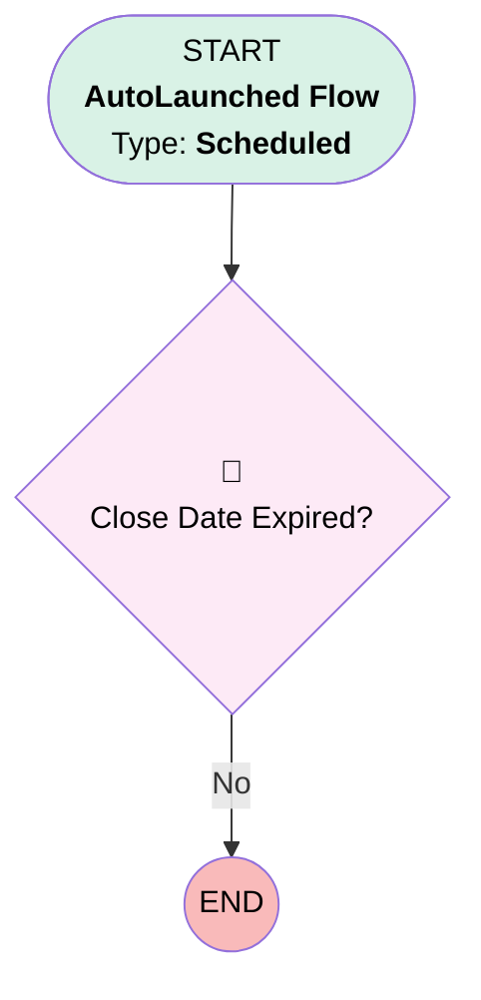

# Opportunity | Scheduled | Expired Close Date Notice

## Flow Diagram [(_View History_)](Opportunity_Scheduled_Expired_Close_Date_Notice-history.md)

<!-- Flow description -->

## General Information

|<!-- -->|<!-- -->|
|:---|:---|
|Object|Opportunity|
|Process Type| Auto Launched Flow|
|Trigger Type| Scheduled|
|Label|Opportunity | Scheduled | Expired Close Date Notice|
|Status|⚠️ Draft|
|Description|Notify Opp Owner if close date is expired.|
|Interview Label|Opportunity | Scheduled | Expired Close Date Notice {!$Flow.CurrentDateTime}|
| Builder Type (PM)|LightningFlowBuilder|
| Canvas Mode (PM)|FREE_FORM_CANVAS|
| Origin Builder Type (PM)|LightningFlowBuilder|
|Connector|[Close_Date_Expired](#close_date_expired)|
|Next Node|[Close_Date_Expired](#close_date_expired)|

#### Schedules

|Frequency|Start Date|Start Time|
|:-- |:--:|:--: |
|Daily|Dec 16, 2020|06:00|

#### Filters (logic: **and**)

|Filter Id|Field|Operator|Value|
|:-- |:-- |:--:|:--: |
|1|IsClosed| Equal To|⬜|

## Formulas

|Name|Data Type|Expression|Description|
|:-- |:--:|:-- |:--  |
|today|Date|TODAY()|<!-- -->|

## Flow Nodes Details

### Close_Date_Expired

|<!-- -->|<!-- -->|
|:---|:---|
|Type|Decision|
|Label|Close Date Expired?|
|Default Connector Label|No|

#### Rule Yes (Yes)

|<!-- -->|<!-- -->|
|:---|:---|
|Condition Logic|and|

|Condition Id|Left Value Reference|Operator|Right Value|
|:-- |:-- |:--:|:--: |
|1|$Record.CloseDate| Less Than|today|

___

_Documentation generated from branch monitoring_myubiquity by [sfdx-hardis](https://sfdx-hardis.cloudity.com), featuring [salesforce-flow-visualiser](https://github.com/toddhalfpenny/salesforce-flow-visualiser)_