# Opportunity | Screen | Create Partner Objective

## Flow Diagram [(_View History_)](Opportunity_Screen_Create_Partner_Objective-history.md)

```mermaid
%% If you read this, your Markdown visualizer does not handle MermaidJS syntax.
%% - If you are in VS Code, install extension `Markdown Preview Mermaid Support` at https://marketplace.visualstudio.com/items?itemName=bierner.markdown-mermaid
%% - If you are using sfdx-hardis, try to define env variable `MERMAID_MODES=cli,docker` ,then run again the command to regenerate markdown with SVG images.
%% - If you are within mkdocs-material, define mermaid plugin in `mkdocs.yml` as described in https://squidfunk.github.io/mkdocs-material/extensions/mermaid/
%% - As a last resort, you can copy-paste this MermaidJS code into https://mermaid.live/ to see the flow diagram

flowchart TB
START(["START<br/><b>Screen Flow</b>"]):::startClass
click START "#general-information" "43041558"

Redirect_to_objective("⚡ <em></em><br/>Redirect to objective"):::actionCalls
click Redirect_to_objective "#redirect_to_objective" "1345696951"

Add_names_to_collection[\"🟰 <em></em><br/>Add names to collection"/]:::assignments
click Add_names_to_collection "#add_names_to_collection" "1176079457"

Add_new_result_to_list[\"🟰 <em></em><br/>Add new result to list"/]:::assignments
click Add_new_result_to_list "#add_new_result_to_list" "3737515716"

Assign_Objective_Defaults[\"🟰 <em></em><br/>Assign Objective Defaults"/]:::assignments
click Assign_Objective_Defaults "#assign_objective_defaults" "1768382240"

Assignment_5[\"🟰 <em></em><br/>Assignment 5"/]:::assignments
click Assignment_5 "#assignment_5" "2423178913"

Assignment_6[\"🟰 <em></em><br/>Assignment 6"/]:::assignments
click Assignment_6 "#assignment_6" "1344502127"

Define_new_result[\"🟰 <em></em><br/>Define new result"/]:::assignments
click Define_new_result "#define_new_result" "2028778163"

Acc_v_Opp_split{"🔀 <em></em><br/>Acc v Opp split"}:::decisions
click Acc_v_Opp_split "#acc_v_opp_split" "176417766"

Result_Builder_Loop{{"🔁 <em></em><br/>Result Builder Loop"}}:::loops
click Result_Builder_Loop "#result_builder_loop" "1001824207"

Create_Objective[("➕ <em></em><br/>Create Objective")]:::recordCreates
click Create_Objective "#create_objective" "959588191"

Create_Results[("➕ <em></em><br/>Create Results")]:::recordCreates
click Create_Results "#create_results" "1354027752"

Find_Owner_Contact[("🔍 <em></em><br/>Find Owner Contact")]:::recordLookups
click Find_Owner_Contact "#find_owner_contact" "187689668"

Get_Account[("🔍 <em></em><br/>Get Account")]:::recordLookups
click Get_Account "#get_account" "2909063309"

Get_Opportunity[("🔍 <em></em><br/>Get Opportunity")]:::recordLookups
click Get_Opportunity "#get_opportunity" "2877496566"

Redirect_to_objective --> END_Redirect_to_objective
Add_names_to_collection --> Result_Builder_Loop
Add_new_result_to_list --> Result_Builder_Loop
Assign_Objective_Defaults --> Create_Objective
Assignment_5 --> Find_Owner_Contact
Assignment_6 --> Find_Owner_Contact
Define_new_result --> Add_new_result_to_list
Acc_v_Opp_split --> |"Acc"| Get_Account
Acc_v_Opp_split --> |"Opp"| Get_Opportunity
Acc_v_Opp_split --> |"Default Outcome"| END_Acc_v_Opp_split
Result_Builder_Loop --> |"For Each"|Define_new_result
Result_Builder_Loop ---> |"After Last"|Create_Results
Create_Objective --> Add_names_to_collection
Create_Results --> Redirect_to_objective
Find_Owner_Contact --> Assign_Objective_Defaults
Get_Account --> Assignment_5
Get_Opportunity --> Assignment_6
START -->  Acc_v_Opp_split
END_Redirect_to_objective(( END )):::endClass
END_Acc_v_Opp_split(( END )):::endClass


classDef actionCalls fill:#D4E4FC,color:black,text-decoration:none,max-height:100px
classDef assignments fill:#FBEED7,color:black,text-decoration:none,max-height:100px
classDef collectionProcessors fill:#F0E3FA,color:black,text-decoration:none,max-height:100px
classDef customErrors fill:#FFE9E9,color:black,text-decoration:none,max-height:100px
classDef decisions fill:#FDEAF6,color:black,text-decoration:none,max-height:100px
classDef loops fill:#FDEAF6,color:black,text-decoration:none,max-height:100px
classDef recordCreates fill:#FFF8C9,color:black,text-decoration:none,max-height:100px
classDef recordDeletes fill:#FFF8C9,color:black,text-decoration:none,max-height:100px
classDef recordLookups fill:#EDEAFF,color:black,text-decoration:none,max-height:100px
classDef recordUpdates fill:#FFF8C9,color:black,text-decoration:none,max-height:100px
classDef screens fill:#DFF6FF,color:black,text-decoration:none,max-height:100px
classDef subflows fill:#D4E4FC,color:black,text-decoration:none,max-height:100px
classDef startClass fill:#D9F2E6,color:black,text-decoration:none,max-height:100px
classDef endClass fill:#F9BABA,color:black,text-decoration:none,max-height:100px
classDef transforms fill:#FDEAF6,color:black,text-decoration:none,max-height:100px


```

<!-- Flow description -->

## General Information

|<!-- -->|<!-- -->|
|:---|:---|
|Process Type| Flow|
|Label|Opportunity | Screen | Create Partner Objective|
|Status|Active|
|Description|Updated to support related list button|
|Environments|Default|
|Interview Label|Opportunity | Screen | Create Partner Objective {!$Flow.CurrentDateTime}|
| Builder Type (PM)|LightningFlowBuilder|
| Canvas Mode (PM)|AUTO_LAYOUT_CANVAS|
| Origin Builder Type (PM)|LightningFlowBuilder|
|Connector|[Acc_v_Opp_split](#acc_v_opp_split)|
|Next Node|[Acc_v_Opp_split](#acc_v_opp_split)|

## Variables

|Name|Data Type|Is Collection|Is Input|Is Output|Object Type|Description|
|:-- |:--:|:--:|:--:|:--:|:--:|:--  |
|contactEmail|String|⬜|⬜|⬜|<!-- -->|<!-- -->|
|keyresultNameList|String|✅|⬜|⬜|<!-- -->|<!-- -->|
|newObjective|SObject|⬜|⬜|⬜|Objective__c|<!-- -->|
|newResult|SObject|⬜|⬜|⬜|Key_Result__c|<!-- -->|
|ownerContactId|String|⬜|⬜|⬜|<!-- -->|<!-- -->|
|ownerId|String|⬜|⬜|⬜|<!-- -->|<!-- -->|
|recordId|String|⬜|✅|⬜|<!-- -->|<!-- -->|
|resultList|SObject|✅|⬜|⬜|Key_Result__c|<!-- -->|

## Flow Nodes Details

### Redirect_to_objective

|<!-- -->|<!-- -->|
|:---|:---|
|Type|Action Call|
|Label|Redirect to objective|
|Action Type|Component|
|Action Name|ecflc:flowIdRedirect|
|Flow Transaction Model|CurrentTransaction|
|Name Segment|ecflc:flowIdRedirect|
|Offset|0|
|Store Output Automatically|✅|
|Record Id (input)|newObjective.Id|

### Add_names_to_collection

|<!-- -->|<!-- -->|
|:---|:---|
|Type|Assignment|
|Label|Add names to collection|
|Connector|[Result_Builder_Loop](#result_builder_loop)|

#### Assignments

|Assign To Reference|Operator|Value|
|:-- |:--:|:--: |
|keyresultNameList| Add|Add Partner Agreement in Box & Salesforce|
|keyresultNameList| Add|Add contacts and all critical information into Salesforce|
|keyresultNameList| Add|Complete Partner Brief|
|keyresultNameList| Add|Add Partner Pricebook to account or request custom pricing from BI|
|keyresultNameList| Add|Schedule Kick-off Call|
|keyresultNameList| Add|Draft Kick-off Call Agenda|
|keyresultNameList| Add|Conduct Kick-off Call|
|keyresultNameList| Add|Distribute Launch Project Plan|
|keyresultNameList| Add|Provide appropriate collateral and resources to Partner (Box Hub Toolkit, ettc.)|
|keyresultNameList| Add|Launch Partnership|

### Add_new_result_to_list

|<!-- -->|<!-- -->|
|:---|:---|
|Type|Assignment|
|Label|Add new result to list|
|Connector|[Result_Builder_Loop](#result_builder_loop)|

#### Assignments

|Assign To Reference|Operator|Value|
|:-- |:--:|:--: |
|resultList| Add|newResult|

### Assign_Objective_Defaults

|<!-- -->|<!-- -->|
|:---|:---|
|Type|Assignment|
|Label|Assign Objective Defaults|
|Connector|[Create_Objective](#create_objective)|

#### Assignments

|Assign To Reference|Operator|Value|
|:-- |:--:|:--: |
|newObjective.OwnerId| Assign|ownerId|
|newObjective.Target_Start_Date__c| Assign|$Flow.CurrentDate|
|newObjective.Department__c| Assign|Business Development|
|newObjective.Priority__c| Assign|Medium|
|newObjective.Status__c| Assign|Planned|
|newObjective.Status__c| Assign|Planned|
|newObjective.Type__c| Assign|Project|
|newObjective.Theme__c| Assign|Growth|
|newObjective.Requesting_Department__c| Assign|Business Development|
|newObjective.Name| Add|stringValue: '' |
|newObjective.Name| Add|Partnership Launch|
|newObjective.Objective_Owner__c| Assign|ownerContactId|
|newObjective.Desired_Goals__c| Assign|Please add a goal|

### Assignment_5

|<!-- -->|<!-- -->|
|:---|:---|
|Type|Assignment|
|Label|Assignment 5|
|Connector|[Find_Owner_Contact](#find_owner_contact)|

#### Assignments

|Assign To Reference|Operator|Value|
|:-- |:--:|:--: |
|newObjective.Name| Assign|Get_Account.Name|
|newObjective.Partner__c| Assign|recordId|
|contactEmail| Assign|Get_Account.Owner.Email|
|ownerId| Assign|Get_Account.OwnerId|

### Assignment_6

|<!-- -->|<!-- -->|
|:---|:---|
|Type|Assignment|
|Label|Assignment 6|
|Connector|[Find_Owner_Contact](#find_owner_contact)|

#### Assignments

|Assign To Reference|Operator|Value|
|:-- |:--:|:--: |
|newObjective.Name| Assign|Get_Account.Name|
|newObjective.Opportunity__c| Assign|recordId|
|newObjective.Partner__c| Assign|Get_Opportunity.AccountId|
|contactEmail| Assign|Get_Opportunity.Owner.Email|
|ownerId| Assign|Get_Opportunity.OwnerId|

### Define_new_result

|<!-- -->|<!-- -->|
|:---|:---|
|Type|Assignment|
|Label|Define new result|
|Connector|[Add_new_result_to_list](#add_new_result_to_list)|

#### Assignments

|Assign To Reference|Operator|Value|
|:-- |:--:|:--: |
|newResult.Name| Assign|[Result_Builder_Loop](#result_builder_loop)|
|newResult.Result_Owner__c| Assign|ownerContactId|
|newResult.Objective__c| Assign|newObjective.Id|

### Acc_v_Opp_split

|<!-- -->|<!-- -->|
|:---|:---|
|Type|Decision|
|Label|Acc v Opp split|
|Default Connector Label|Default Outcome|

#### Rule Acc (Acc)

|<!-- -->|<!-- -->|
|:---|:---|
|Connector|[Get_Account](#get_account)|
|Condition Logic|and|

|Condition Id|Left Value Reference|Operator|Right Value|
|:-- |:-- |:--:|:--: |
|1|recordId| Starts With|1|

#### Rule Opp (Opp)

|<!-- -->|<!-- -->|
|:---|:---|
|Connector|[Get_Opportunity](#get_opportunity)|
|Condition Logic|and|

|Condition Id|Left Value Reference|Operator|Right Value|
|:-- |:-- |:--:|:--: |
|1|recordId| Starts With|6|

### Result_Builder_Loop

|<!-- -->|<!-- -->|
|:---|:---|
|Type|Loop|
|Label|Result Builder Loop|
|Collection Reference|keyresultNameList|
|Iteration Order|Asc|
|Next Value Connector|[Define_new_result](#define_new_result)|
|No More Values Connector|[Create_Results](#create_results)|

### Create_Objective

|<!-- -->|<!-- -->|
|:---|:---|
|Type|Record Create|
|Label|Create Objective|
|Input Reference|newObjective|
|Connector|[Add_names_to_collection](#add_names_to_collection)|

### Create_Results

|<!-- -->|<!-- -->|
|:---|:---|
|Type|Record Create|
|Label|Create Results|
|Input Reference|resultList|
|Connector|[Redirect_to_objective](#redirect_to_objective)|

### Find_Owner_Contact

|<!-- -->|<!-- -->|
|:---|:---|
|Type|Record Lookup|
|Object|Contact|
|Label|Find Owner Contact|
|Assign Null Values If No Records Found|⬜|
|Output Assignments|assignToReference: ownerContactId field: Id |
|Sort Field|CreatedDate|
|Sort Order|Desc|
|Connector|[Assign_Objective_Defaults](#assign_objective_defaults)|

#### Filters (logic: **and**)

|Filter Id|Field|Operator|Value|
|:-- |:-- |:--:|:--: |
|1|Email| Equal To|contactEmail|
|2|Account_Name__c| Contains|Ubiquity|

### Get_Account

|<!-- -->|<!-- -->|
|:---|:---|
|Type|Record Lookup|
|Object|Account|
|Label|Get Account|
|Assign Null Values If No Records Found|⬜|
|Get First Record Only|✅|
|Store Output Automatically|✅|
|Connector|[Assignment_5](#assignment_5)|

#### Filters (logic: **and**)

|Filter Id|Field|Operator|Value|
|:-- |:-- |:--:|:--: |
|1|Id| Equal To|recordId|

### Get_Opportunity

|<!-- -->|<!-- -->|
|:---|:---|
|Type|Record Lookup|
|Object|Opportunity|
|Label|Get Opportunity|
|Assign Null Values If No Records Found|⬜|
|Get First Record Only|✅|
|Store Output Automatically|✅|
|Connector|[Assignment_6](#assignment_6)|

#### Filters (logic: **and**)

|Filter Id|Field|Operator|Value|
|:-- |:-- |:--:|:--: |
|1|Id| Equal To|recordId|

___

_Documentation generated from branch monitoring_myubiquity by [sfdx-hardis](https://sfdx-hardis.cloudity.com), featuring [salesforce-flow-visualiser](https://github.com/toddhalfpenny/salesforce-flow-visualiser)_