# Payroll | Default Team Member

## Flow Diagram [(_View History_)](Payroll_Default_Team_Member-history.md)

```mermaid
%% If you read this, your Markdown visualizer does not handle MermaidJS syntax.
%% - If you are in VS Code, install extension `Markdown Preview Mermaid Support` at https://marketplace.visualstudio.com/items?itemName=bierner.markdown-mermaid
%% - If you are using sfdx-hardis, try to define env variable `MERMAID_MODES=cli,docker` ,then run again the command to regenerate markdown with SVG images.
%% - If you are within mkdocs-material, define mermaid plugin in `mkdocs.yml` as described in https://squidfunk.github.io/mkdocs-material/extensions/mermaid/
%% - As a last resort, you can copy-paste this MermaidJS code into https://mermaid.live/ to see the flow diagram

flowchart TB
START(["START<br/><b>Case</b></br>Type: <b>On Create Only</b>"]):::startClass
click START "#general-information" "3175025829"

START --> myDecision
myDecision{"🔀 <em></em><br/>myDecision"}:::decisions
click myDecision "#mydecision" "2365033744"

myDecision10{"🔀 <em></em><br/>myDecision10"}:::decisions
click myDecision10 "#mydecision10" "2076903679"

myDecision12{"🔀 <em></em><br/>myDecision12"}:::decisions
click myDecision12 "#mydecision12" "1709422012"

myDecision14{"🔀 <em></em><br/>myDecision14"}:::decisions
click myDecision14 "#mydecision14" "3433272158"

myDecision16{"🔀 <em></em><br/>myDecision16"}:::decisions
click myDecision16 "#mydecision16" "576112694"

myDecision18{"🔀 <em></em><br/>myDecision18"}:::decisions
click myDecision18 "#mydecision18" "3790533829"

myDecision2{"🔀 <em></em><br/>myDecision2"}:::decisions
click myDecision2 "#mydecision2" "294686622"

myDecision21{"🔀 <em></em><br/>myDecision21"}:::decisions
click myDecision21 "#mydecision21" "2426591607"

myDecision23{"🔀 <em></em><br/>myDecision23"}:::decisions
click myDecision23 "#mydecision23" "1034713055"

myDecision25{"🔀 <em></em><br/>myDecision25"}:::decisions
click myDecision25 "#mydecision25" "823046897"

myDecision27{"🔀 <em></em><br/>myDecision27"}:::decisions
click myDecision27 "#mydecision27" "364957892"

myDecision29{"🔀 <em></em><br/>myDecision29"}:::decisions
click myDecision29 "#mydecision29" "1359349975"

myDecision31{"🔀 <em></em><br/>myDecision31"}:::decisions
click myDecision31 "#mydecision31" "4034739669"

myDecision4{"🔀 <em></em><br/>myDecision4"}:::decisions
click myDecision4 "#mydecision4" "762186783"

myDecision6{"🔀 <em></em><br/>myDecision6"}:::decisions
click myDecision6 "#mydecision6" "378436294"

myDecision8{"🔀 <em></em><br/>myDecision8"}:::decisions
click myDecision8 "#mydecision8" "3702810735"

myRule_11_A1[("🛠️ <em></em><br/>Team Member Stormy")]:::recordUpdates
click myRule_11_A1 "#myrule_11_a1" "2507361104"

myRule_13_A1[("🛠️ <em></em><br/>Team Member Sonia")]:::recordUpdates
click myRule_13_A1 "#myrule_13_a1" "949819947"

myRule_15_A1[("🛠️ <em></em><br/>Team Member Sue")]:::recordUpdates
click myRule_15_A1 "#myrule_15_a1" "1043375858"

myRule_17_A1[("🛠️ <em></em><br/>Team Member | Cat | SubCat")]:::recordUpdates
click myRule_17_A1 "#myrule_17_a1" "1748406367"

myRule_19_A1[("🛠️ <em></em><br/>Adjustment to Dave Y")]:::recordUpdates
click myRule_19_A1 "#myrule_19_a1" "672423058"

myRule_1_A1[("🛠️ <em></em><br/>Team Member Brian")]:::recordUpdates
click myRule_1_A1 "#myrule_1_a1" "3156342981"

myRule_22_A1[("🛠️ <em></em><br/>Case to Drew")]:::recordUpdates
click myRule_22_A1 "#myrule_22_a1" "1436587810"

myRule_24_A1[("🛠️ <em></em><br/>Case to Brian")]:::recordUpdates
click myRule_24_A1 "#myrule_24_a1" "2636839652"

myRule_26_A1[("🛠️ <em></em><br/>Case to Melissa")]:::recordUpdates
click myRule_26_A1 "#myrule_26_a1" "3059346697"

myRule_28_A1[("🛠️ <em></em><br/>Case to Aaron")]:::recordUpdates
click myRule_28_A1 "#myrule_28_a1" "513210135"

myRule_30_A1[("🛠️ <em></em><br/>Case Update")]:::recordUpdates
click myRule_30_A1 "#myrule_30_a1" "3934763543"

myRule_32_A1[("🛠️ <em></em><br/>Case to Aaron")]:::recordUpdates
click myRule_32_A1 "#myrule_32_a1" "842420741"

myRule_3_A1[("🛠️ <em></em><br/>Team Member Stormy")]:::recordUpdates
click myRule_3_A1 "#myrule_3_a1" "1377162724"

myRule_3_A2[("🛠️ <em></em><br/>Status")]:::recordUpdates
click myRule_3_A2 "#myrule_3_a2" "4263569368"

myRule_3_A3[("🛠️ <em></em><br/>EPS Category")]:::recordUpdates
click myRule_3_A3 "#myrule_3_a3" "210961187"

myRule_5_A1[("🛠️ <em></em><br/>Case to Pattie")]:::recordUpdates
click myRule_5_A1 "#myrule_5_a1" "87864743"

myRule_7_A1[("🛠️ <em></em><br/>Team Member Brian")]:::recordUpdates
click myRule_7_A1 "#myrule_7_a1" "4055595244"

myRule_9_A1[("🛠️ <em></em><br/>Team Member Pattie")]:::recordUpdates
click myRule_9_A1 "#myrule_9_a1" "3077481869"

myDecision --> |"Payroll Case Brian"| myRule_1_A1
myDecision --> |"default"| myDecision2
myDecision10 --> |"Reminder Task Stormy"| myRule_11_A1
myDecision10 --> |"default"| myDecision12
myDecision12 --> |"Reminder Task Sonia"| myRule_13_A1
myDecision12 --> |"default"| myDecision14
myDecision14 --> |"Reminder Task Sue"| myRule_15_A1
myDecision14 --> |"default"| myDecision16
myDecision16 --> |"Funding Account Changed"| myRule_17_A1
myDecision16 --> |"default"| myDecision18
myDecision18 --> |"Adjustment Case"| myRule_19_A1
myDecision18 --> |"default"| myDecision21
myDecision2 --> |"Payroll Case Stormy"| myRule_3_A1
myDecision2 --> |"default"| myDecision4
myDecision21 --> |"Fund Family Change"| myRule_22_A1
myDecision21 --> |"default"| myDecision23
myDecision23 --> |"Pay Kon Future Call"| myRule_24_A1
myDecision23 --> |"default"| myDecision25
myDecision25 --> |"Schedule A Call"| myRule_26_A1
myDecision25 --> |"default"| myDecision27
myDecision27 --> |"PayKon Int Inquiry"| myRule_28_A1
myDecision27 --> |"default"| myDecision29
myDecision29 --> |"PayKon Calendly"| myRule_30_A1
myDecision29 --> |"default"| myDecision31
myDecision31 --> |"Follow Up/1st Payroll Submitted"| myRule_32_A1
myDecision31 --> |"default"| END_myDecision31
myDecision4 --> |"Kotapay Case Received"| myRule_5_A1
myDecision4 --> |"default"| myDecision6
myDecision6 --> |"Reminder Task Brian"| myRule_7_A1
myDecision6 --> |"default"| myDecision8
myDecision8 --> |"Reminder Task Pattie"| myRule_9_A1
myDecision8 --> |"default"| myDecision10
myRule_11_A1 --> END_myRule_11_A1
myRule_13_A1 --> END_myRule_13_A1
myRule_15_A1 --> END_myRule_15_A1
myRule_17_A1 --> END_myRule_17_A1
myRule_19_A1 --> END_myRule_19_A1
myRule_1_A1 --> END_myRule_1_A1
myRule_22_A1 --> END_myRule_22_A1
myRule_24_A1 --> END_myRule_24_A1
myRule_26_A1 --> END_myRule_26_A1
myRule_28_A1 --> END_myRule_28_A1
myRule_30_A1 --> END_myRule_30_A1
myRule_32_A1 --> END_myRule_32_A1
myRule_3_A1 --> myRule_3_A2
myRule_3_A2 --> myRule_3_A3
myRule_3_A3 --> END_myRule_3_A3
myRule_5_A1 --> END_myRule_5_A1
myRule_7_A1 --> END_myRule_7_A1
myRule_9_A1 --> END_myRule_9_A1
END_myDecision31(( END )):::endClass
END_myRule_11_A1(( END )):::endClass
END_myRule_13_A1(( END )):::endClass
END_myRule_15_A1(( END )):::endClass
END_myRule_17_A1(( END )):::endClass
END_myRule_19_A1(( END )):::endClass
END_myRule_1_A1(( END )):::endClass
END_myRule_22_A1(( END )):::endClass
END_myRule_24_A1(( END )):::endClass
END_myRule_26_A1(( END )):::endClass
END_myRule_28_A1(( END )):::endClass
END_myRule_30_A1(( END )):::endClass
END_myRule_32_A1(( END )):::endClass
END_myRule_3_A3(( END )):::endClass
END_myRule_5_A1(( END )):::endClass
END_myRule_7_A1(( END )):::endClass
END_myRule_9_A1(( END )):::endClass


classDef actionCalls fill:#D4E4FC,color:black,text-decoration:none,max-height:100px
classDef assignments fill:#FBEED7,color:black,text-decoration:none,max-height:100px
classDef collectionProcessors fill:#F0E3FA,color:black,text-decoration:none,max-height:100px
classDef customErrors fill:#FFE9E9,color:black,text-decoration:none,max-height:100px
classDef decisions fill:#FDEAF6,color:black,text-decoration:none,max-height:100px
classDef loops fill:#FDEAF6,color:black,text-decoration:none,max-height:100px
classDef recordCreates fill:#FFF8C9,color:black,text-decoration:none,max-height:100px
classDef recordDeletes fill:#FFF8C9,color:black,text-decoration:none,max-height:100px
classDef recordLookups fill:#EDEAFF,color:black,text-decoration:none,max-height:100px
classDef recordUpdates fill:#FFF8C9,color:black,text-decoration:none,max-height:100px
classDef screens fill:#DFF6FF,color:black,text-decoration:none,max-height:100px
classDef subflows fill:#D4E4FC,color:black,text-decoration:none,max-height:100px
classDef startClass fill:#D9F2E6,color:black,text-decoration:none,max-height:100px
classDef endClass fill:#F9BABA,color:black,text-decoration:none,max-height:100px
classDef transforms fill:#FDEAF6,color:black,text-decoration:none,max-height:100px


```

<!-- Flow description -->

## General Information

|<!-- -->|<!-- -->|
|:---|:---|
|Process Type| Workflow|
|Label|Payroll | Default Team Member|
|Status|Obsolete|
|Description|Default Team Member for Payroll & FinOps value based on certain Subject values|
|Interview Label|Payroll_Default_Team_Member-35_InterviewLabel|
|Start Element Reference|[myDecision](#mydecision)|
| Object Type (PM)|Case|
| Object Variable (PM)|myVariable_current|
| Old Object Variable (PM)|myVariable_old|
| Trigger Type (PM)|onCreateOnly|

## Variables

|Name|Data Type|Is Collection|Is Input|Is Output|Object Type|Description|
|:-- |:--:|:--:|:--:|:--:|:--:|:--  |
|myVariable_current|SObject|⬜|✅|✅|Case|<!-- -->|
|myVariable_old|SObject|⬜|✅|⬜|Case|<!-- -->|

## Formulas

|Name|Data Type|Expression|Description|
|:-- |:--:|:-- |:--  |
|formula_20_myRule_19_A1_5979444137|String|"Advisory Fees for " + {!myVariable_current.Account.Name}|<!-- -->|

## Flow Nodes Details

### myDecision

|<!-- -->|<!-- -->|
|:---|:---|
|Type|Decision|
|Label|[myDecision](#mydecision)|
|Default Connector|[myDecision2](#mydecision2)|
|Default Connector Label|default|
|Index (PM)|numberValue: 0 |

#### Rule myRule_1 (Payroll Case Brian)

|<!-- -->|<!-- -->|
|:---|:---|
|Connector|[myRule_1_A1](#myrule_1_a1)|
|Condition Logic|7 AND 9 AND (1 OR 2 OR 3 OR 4 OR 5 OR 6 OR 8)|

|Condition Id|Left Value Reference|Operator|Right Value|
|:-- |:-- |:--:|:--: |
|1|myVariable_current.Subject| Starts With|Payroll Reject - Errors|
|2|myVariable_current.Subject| Starts With|Payroll Reject - Corrections|
|3|myVariable_current.Subject| Starts With|Payroll Reject - Failures|
|4|myVariable_current.Subject| Starts With|Census Reject - Errors|
|5|myVariable_current.Subject| Starts With|Census Reject - Corrections|
|6|myVariable_current.Subject| Starts With|Census Reject - Failures|
|7|myVariable_current.OwnerId| Equal To|00537000002STLDAA4|
|8|myVariable_current.SuppliedEmail| Equal To|SCASCIO@myubiquity.com|
|9|myVariable_current.Team_Member__c| Not Equal To|Patricia Parisi|

### myDecision10

|<!-- -->|<!-- -->|
|:---|:---|
|Type|Decision|
|Label|[myDecision10](#mydecision10)|
|Default Connector|[myDecision12](#mydecision12)|
|Default Connector Label|default|
|Index (PM)|5|

#### Rule myRule_11 (Reminder Task Stormy)

|<!-- -->|<!-- -->|
|:---|:---|
|Connector|[myRule_11_A1](#myrule_11_a1)|
|Condition Logic|and|

|Condition Id|Left Value Reference|Operator|Right Value|
|:-- |:-- |:--:|:--: |
|1|myVariable_current.OwnerId| Equal To|00537000002STLDAA4|
|2|myVariable_current.Subject| Starts With|REMINDER:|
|3|myVariable_current.Description| Contains|Stormy|

### myDecision12

|<!-- -->|<!-- -->|
|:---|:---|
|Type|Decision|
|Label|[myDecision12](#mydecision12)|
|Default Connector|[myDecision14](#mydecision14)|
|Default Connector Label|default|
|Index (PM)|6|

#### Rule myRule_13 (Reminder Task Sonia)

|<!-- -->|<!-- -->|
|:---|:---|
|Connector|[myRule_13_A1](#myrule_13_a1)|
|Condition Logic|and|

|Condition Id|Left Value Reference|Operator|Right Value|
|:-- |:-- |:--:|:--: |
|1|myVariable_current.OwnerId| Equal To|00537000002STLDAA4|
|2|myVariable_current.Subject| Starts With|REMINDER:|
|3|myVariable_current.Description| Contains|Sonia|

### myDecision14

|<!-- -->|<!-- -->|
|:---|:---|
|Type|Decision|
|Label|[myDecision14](#mydecision14)|
|Default Connector|[myDecision16](#mydecision16)|
|Default Connector Label|default|
|Index (PM)|7|

#### Rule myRule_15 (Reminder Task Sue)

|<!-- -->|<!-- -->|
|:---|:---|
|Connector|[myRule_15_A1](#myrule_15_a1)|
|Condition Logic|and|

|Condition Id|Left Value Reference|Operator|Right Value|
|:-- |:-- |:--:|:--: |
|1|myVariable_current.OwnerId| Equal To|00537000002STLDAA4|
|2|myVariable_current.Subject| Starts With|REMINDER:|
|3|myVariable_current.Description| Contains|Sue|

### myDecision16

|<!-- -->|<!-- -->|
|:---|:---|
|Type|Decision|
|Label|[myDecision16](#mydecision16)|
|Default Connector|[myDecision18](#mydecision18)|
|Default Connector Label|default|
|Index (PM)|8|

#### Rule myRule_17 (Funding Account Changed)

|<!-- -->|<!-- -->|
|:---|:---|
|Connector|[myRule_17_A1](#myrule_17_a1)|
|Condition Logic|and|

|Condition Id|Left Value Reference|Operator|Right Value|
|:-- |:-- |:--:|:--: |
|1|myVariable_current.Subject| Starts With|[UBIQUITY]|
|2|myVariable_current.Subject| Ends With|Ticket Opened|
|3|myVariable_current.Description| Contains|Funding|
|4|myVariable_current.OwnerId| Equal To|00537000002STLDAA4|

### myDecision18

|<!-- -->|<!-- -->|
|:---|:---|
|Type|Decision|
|Label|[myDecision18](#mydecision18)|
|Default Connector|[myDecision21](#mydecision21)|
|Default Connector Label|default|
|Index (PM)|9|

#### Rule myRule_19 (Adjustment Case)

|<!-- -->|<!-- -->|
|:---|:---|
|Connector|[myRule_19_A1](#myrule_19_a1)|
|Condition Logic|and|

|Condition Id|Left Value Reference|Operator|Right Value|
|:-- |:-- |:--:|:--: |
|1|myVariable_current.Original_Plan_Year__c| Is Null|⬜|

### myDecision2

|<!-- -->|<!-- -->|
|:---|:---|
|Type|Decision|
|Label|[myDecision2](#mydecision2)|
|Default Connector|[myDecision4](#mydecision4)|
|Default Connector Label|default|
|Index (PM)|1|

#### Rule myRule_3 (Payroll Case Stormy)

|<!-- -->|<!-- -->|
|:---|:---|
|Connector|[myRule_3_A1](#myrule_3_a1)|
|Condition Logic|(1 OR 17) AND 6 AND (2 OR 3 OR 4 OR 5 OR 7 OR 8 OR 9 OR 10 OR 11 OR 12 OR 13 OR 14 OR 15) AND NOT 16|

|Condition Id|Left Value Reference|Operator|Right Value|
|:-- |:-- |:--:|:--: |
|1|myVariable_current.OwnerId| Equal To|00537000002STLD|
|2|myVariable_current.Subject| Starts With|New Enhanced Payroll Service sold to|
|3|myVariable_current.Subject| Starts With|Run ADP Temp Credentials|
|4|myVariable_current.Subject| Starts With|RUN Powered by ADP|
|5|myVariable_current.SuppliedEmail| Equal To|MSRICA@myubiquity.com|
|6|myVariable_current.Team_Member__c| Not Equal To|Stormy Bearry|
|7|myVariable_current.Subject| Contains|Report 'EPS tasks - current week'|
|8|myVariable_current.Subject| Contains|Report 'EPS aged tasks'|
|9|myVariable_current.Subject| Contains|Report 'Closed Won EPS Opportunities'|
|10|myVariable_current.Subject| Contains|Report 'Closed won EPS opp'|
|11|myVariable_current.Subject| Contains|Report 'EPS Aged Tasks'|
|12|myVariable_current.Subject| Contains|Report 'EPS Current Tasks'|
|13|myVariable_current.SuppliedEmail| Ends With|@gusto.com|
|14|myVariable_current.SuppliedEmail| Ends With|@adp.com|
|15|myVariable_current.SuppliedEmail| Ends With|@paychex.com|
|16|myVariable_current.Description| Contains|From: Kotapay|
|17|myVariable_current.OwnerId| Equal To|00537000002STLD|

### myDecision21

|<!-- -->|<!-- -->|
|:---|:---|
|Type|Decision|
|Label|[myDecision21](#mydecision21)|
|Default Connector|[myDecision23](#mydecision23)|
|Default Connector Label|default|
|Index (PM)|10|

#### Rule myRule_22 (Fund Family Change)

|<!-- -->|<!-- -->|
|:---|:---|
|Connector|[myRule_22_A1](#myrule_22_a1)|
|Condition Logic|and|

|Condition Id|Left Value Reference|Operator|Right Value|
|:-- |:-- |:--:|:--: |
|1|myVariable_current.SuppliedEmail| Equal To|mscsfundupdate@broadridge.com|

### myDecision23

|<!-- -->|<!-- -->|
|:---|:---|
|Type|Decision|
|Label|[myDecision23](#mydecision23)|
|Default Connector|[myDecision25](#mydecision25)|
|Default Connector Label|default|
|Index (PM)|11|

#### Rule myRule_24 (Pay Kon Future Call)

|<!-- -->|<!-- -->|
|:---|:---|
|Connector|[myRule_24_A1](#myrule_24_a1)|
|Condition Logic|and|

|Condition Id|Left Value Reference|Operator|Right Value|
|:-- |:-- |:--:|:--: |
|1|myVariable_current.Origin| Equal To|Payroll Koncierge|
|2|myVariable_current.Status| Equal To|Pending Future Call|

### myDecision25

|<!-- -->|<!-- -->|
|:---|:---|
|Type|Decision|
|Label|[myDecision25](#mydecision25)|
|Default Connector|[myDecision27](#mydecision27)|
|Default Connector Label|default|
|Index (PM)|12|

#### Rule myRule_26 (Schedule A Call)

|<!-- -->|<!-- -->|
|:---|:---|
|Connector|[myRule_26_A1](#myrule_26_a1)|
|Condition Logic|and|

|Condition Id|Left Value Reference|Operator|Right Value|
|:-- |:-- |:--:|:--: |
|1|myVariable_current.Origin| Equal To|Payroll Koncierge|
|2|myVariable_current.Subject| Contains|Welcome to Ubiquity’s Payroll (K)oncierge|

### myDecision27

|<!-- -->|<!-- -->|
|:---|:---|
|Type|Decision|
|Label|[myDecision27](#mydecision27)|
|Default Connector|[myDecision29](#mydecision29)|
|Default Connector Label|default|
|Index (PM)|13|

#### Rule myRule_28 (PayKon Int Inquiry)

|<!-- -->|<!-- -->|
|:---|:---|
|Connector|[myRule_28_A1](#myrule_28_a1)|
|Condition Logic|and|

|Condition Id|Left Value Reference|Operator|Right Value|
|:-- |:-- |:--:|:--: |
|1|myVariable_current.Subject| Contains|Payroll Integration Inquiry|
|2|myVariable_current.Origin| Equal To|Payroll Koncierge|
|3|myVariable_current.SuppliedEmail| Contains|@calendly|

### myDecision29

|<!-- -->|<!-- -->|
|:---|:---|
|Type|Decision|
|Label|[myDecision29](#mydecision29)|
|Default Connector|[myDecision31](#mydecision31)|
|Default Connector Label|default|
|Index (PM)|14|

#### Rule myRule_30 (PayKon Calendly)

|<!-- -->|<!-- -->|
|:---|:---|
|Connector|[myRule_30_A1](#myrule_30_a1)|
|Condition Logic|and|

|Condition Id|Left Value Reference|Operator|Right Value|
|:-- |:-- |:--:|:--: |
|1|myVariable_current.Origin| Equal To|Payroll Koncierge|
|2|myVariable_current.SuppliedEmail| Contains|@calendly|

### myDecision31

|<!-- -->|<!-- -->|
|:---|:---|
|Type|Decision|
|Label|[myDecision31](#mydecision31)|
|Default Connector Label|default|
|Index (PM)|15|

#### Rule myRule_32 (Follow Up/1st Payroll Submitted)

|<!-- -->|<!-- -->|
|:---|:---|
|Connector|[myRule_32_A1](#myrule_32_a1)|
|Condition Logic|(1 OR 2) AND 3|

|Condition Id|Left Value Reference|Operator|Right Value|
|:-- |:-- |:--:|:--: |
|1|myVariable_current.Subject| Equal To|1st Payroll Submitted for Implementation|
|2|myVariable_current.Subject| Starts With|Case Follow Up with|
|3|myVariable_current.OwnerId| Equal To|00537000002STLD|

### myDecision4

|<!-- -->|<!-- -->|
|:---|:---|
|Type|Decision|
|Label|[myDecision4](#mydecision4)|
|Default Connector|[myDecision6](#mydecision6)|
|Default Connector Label|default|
|Index (PM)|2|

#### Rule myRule_5 (Kotapay Case Received)

|<!-- -->|<!-- -->|
|:---|:---|
|Connector|[myRule_5_A1](#myrule_5_a1)|
|Condition Logic|and|

|Condition Id|Left Value Reference|Operator|Right Value|
|:-- |:-- |:--:|:--: |
|1|myVariable_current.Description| Contains|From: Kotapay|
|2|myVariable_current.OwnerId| Equal To|00537000002STLDAA4|

### myDecision6

|<!-- -->|<!-- -->|
|:---|:---|
|Type|Decision|
|Label|[myDecision6](#mydecision6)|
|Default Connector|[myDecision8](#mydecision8)|
|Default Connector Label|default|
|Index (PM)|3|

#### Rule myRule_7 (Reminder Task Brian)

|<!-- -->|<!-- -->|
|:---|:---|
|Connector|[myRule_7_A1](#myrule_7_a1)|
|Condition Logic|and|

|Condition Id|Left Value Reference|Operator|Right Value|
|:-- |:-- |:--:|:--: |
|1|myVariable_current.OwnerId| Equal To|00537000002STLDAA4|
|2|myVariable_current.Subject| Starts With|REMINDER:|
|3|myVariable_current.Description| Contains|Brian|

### myDecision8

|<!-- -->|<!-- -->|
|:---|:---|
|Type|Decision|
|Label|[myDecision8](#mydecision8)|
|Default Connector|[myDecision10](#mydecision10)|
|Default Connector Label|default|
|Index (PM)|4|

#### Rule myRule_9 (Reminder Task Pattie)

|<!-- -->|<!-- -->|
|:---|:---|
|Connector|[myRule_9_A1](#myrule_9_a1)|
|Condition Logic|and|

|Condition Id|Left Value Reference|Operator|Right Value|
|:-- |:-- |:--:|:--: |
|1|myVariable_current.OwnerId| Equal To|00537000002STLDAA4|
|2|myVariable_current.Subject| Starts With|REMINDER:|
|3|myVariable_current.Description| Contains|Pattie|

### myRule_11_A1

|<!-- -->|<!-- -->|
|:---|:---|
|Type|Record Update|
|Object|Case|
|Label|Team Member Stormy|
|Evaluation Type (PM)|always|
|Extra Type Info (PM)|<!-- -->|
|Is Child Relationship (PM)|⬜|
|Reference (PM)|[Case]|
|Reference Target Field (PM)|<!-- -->|

#### Filters (logic: **and**)

|Filter Id|Field|Operator|Value|
|:-- |:-- |:--:|:--: |
|1|Id| Equal To|myVariable_current.Id|

#### Input Assignments

|Field|Value|
|:-- |:--: |
|Team_Member__c|Stormy Bearry|

### myRule_13_A1

|<!-- -->|<!-- -->|
|:---|:---|
|Type|Record Update|
|Object|Case|
|Label|Team Member Sonia|
|Evaluation Type (PM)|always|
|Extra Type Info (PM)|<!-- -->|
|Is Child Relationship (PM)|⬜|
|Reference (PM)|[Case]|
|Reference Target Field (PM)|<!-- -->|

#### Filters (logic: **and**)

|Filter Id|Field|Operator|Value|
|:-- |:-- |:--:|:--: |
|1|Id| Equal To|myVariable_current.Id|

#### Input Assignments

|Field|Value|
|:-- |:--: |
|Team_Member__c|Sonia Boily|

### myRule_15_A1

|<!-- -->|<!-- -->|
|:---|:---|
|Type|Record Update|
|Object|Case|
|Label|Team Member Sue|
|Evaluation Type (PM)|always|
|Extra Type Info (PM)|<!-- -->|
|Is Child Relationship (PM)|⬜|
|Reference (PM)|[Case]|
|Reference Target Field (PM)|<!-- -->|

#### Filters (logic: **and**)

|Filter Id|Field|Operator|Value|
|:-- |:-- |:--:|:--: |
|1|Id| Equal To|myVariable_current.Id|

#### Input Assignments

|Field|Value|
|:-- |:--: |
|Team_Member__c|Sue Cascio|

### myRule_17_A1

|<!-- -->|<!-- -->|
|:---|:---|
|Type|Record Update|
|Object|Case|
|Label|Team Member | Cat | SubCat|
|Evaluation Type (PM)|always|
|Extra Type Info (PM)|<!-- -->|
|Is Child Relationship (PM)|⬜|
|Reference (PM)|[Case]|
|Reference Target Field (PM)|<!-- -->|

#### Filters (logic: **and**)

|Filter Id|Field|Operator|Value|
|:-- |:-- |:--:|:--: |
|1|Id| Equal To|myVariable_current.Id|

#### Input Assignments

|Field|Value|
|:-- |:--: |
|Category__c|Deposits|
|Sub_Category__c|Funding Account Updates|
|Team_Member__c|Patricia Parisi|

### myRule_19_A1

|<!-- -->|<!-- -->|
|:---|:---|
|Type|Record Update|
|Object|Case|
|Label|Adjustment to Dave Y|
|Evaluation Type (PM)|criteria|
|Extra Type Info (PM)|<!-- -->|
|Is Child Relationship (PM)|⬜|
|Reference (PM)|[Case]|
|Reference Target Field (PM)|<!-- -->|

#### Filters (logic: **and**)

|Filter Id|Field|Operator|Value|
|:-- |:-- |:--:|:--: |
|1|Id| Equal To|myVariable_current.Id|
|2|Adjustment_Type__c| Equal To|Post Advisor Fees|

#### Input Assignments

|Field|Value|
|:-- |:--: |
|Category__c|Advisor Payments|
|OwnerId|005Ho00000AnvFJ|
|Subject|formula_20_myRule_19_A1_5979444137|
|Team_Member__c|David Yanagita|

### myRule_1_A1

|<!-- -->|<!-- -->|
|:---|:---|
|Type|Record Update|
|Object|Case|
|Label|Team Member Brian|
|Evaluation Type (PM)|always|
|Extra Type Info (PM)|<!-- -->|
|Is Child Relationship (PM)|⬜|
|Reference (PM)|[Case]|
|Reference Target Field (PM)|<!-- -->|

#### Filters (logic: **and**)

|Filter Id|Field|Operator|Value|
|:-- |:-- |:--:|:--: |
|1|Id| Equal To|myVariable_current.Id|

#### Input Assignments

|Field|Value|
|:-- |:--: |
|Team_Member__c|Liz Ohlhausen|

### myRule_22_A1

|<!-- -->|<!-- -->|
|:---|:---|
|Type|Record Update|
|Object|Case|
|Label|Case to Drew|
|Evaluation Type (PM)|always|
|Extra Type Info (PM)|<!-- -->|
|Is Child Relationship (PM)|⬜|
|Reference (PM)|[Case]|
|Reference Target Field (PM)|<!-- -->|

#### Filters (logic: **and**)

|Filter Id|Field|Operator|Value|
|:-- |:-- |:--:|:--: |
|1|Id| Equal To|myVariable_current.Id|

#### Input Assignments

|Field|Value|
|:-- |:--: |
|Team_Member__c|Drew Petit|

### myRule_24_A1

|<!-- -->|<!-- -->|
|:---|:---|
|Type|Record Update|
|Object|Case|
|Label|Case to Brian|
|Evaluation Type (PM)|always|
|Extra Type Info (PM)|<!-- -->|
|Is Child Relationship (PM)|⬜|
|Reference (PM)|[Case]|
|Reference Target Field (PM)|<!-- -->|

#### Filters (logic: **and**)

|Filter Id|Field|Operator|Value|
|:-- |:-- |:--:|:--: |
|1|Id| Equal To|myVariable_current.Id|

#### Input Assignments

|Field|Value|
|:-- |:--: |
|Team_Member__c|Brian Britt|

### myRule_26_A1

|<!-- -->|<!-- -->|
|:---|:---|
|Type|Record Update|
|Object|Case|
|Label|Case to Melissa|
|Evaluation Type (PM)|always|
|Extra Type Info (PM)|<!-- -->|
|Is Child Relationship (PM)|⬜|
|Reference (PM)|[Case]|
|Reference Target Field (PM)|<!-- -->|

#### Filters (logic: **and**)

|Filter Id|Field|Operator|Value|
|:-- |:-- |:--:|:--: |
|1|Id| Equal To|myVariable_current.Id|

#### Input Assignments

|Field|Value|
|:-- |:--: |
|Category__c|Scheduled Calls|
|Sub_Category__c|Initial Call|

### myRule_28_A1

|<!-- -->|<!-- -->|
|:---|:---|
|Type|Record Update|
|Object|Case|
|Label|Case to Aaron|
|Evaluation Type (PM)|always|
|Extra Type Info (PM)|<!-- -->|
|Is Child Relationship (PM)|⬜|
|Reference (PM)|[Case]|
|Reference Target Field (PM)|<!-- -->|

#### Filters (logic: **and**)

|Filter Id|Field|Operator|Value|
|:-- |:-- |:--:|:--: |
|1|Id| Equal To|myVariable_current.Id|

#### Input Assignments

|Field|Value|
|:-- |:--: |
|Category__c|FYI|
|Status|Assigned|
|Team_Member__c|Aaron Fekete|

### myRule_30_A1

|<!-- -->|<!-- -->|
|:---|:---|
|Type|Record Update|
|Object|Case|
|Label|Case Update|
|Evaluation Type (PM)|always|
|Extra Type Info (PM)|<!-- -->|
|Is Child Relationship (PM)|⬜|
|Reference (PM)|[Case]|
|Reference Target Field (PM)|<!-- -->|

#### Filters (logic: **and**)

|Filter Id|Field|Operator|Value|
|:-- |:-- |:--:|:--: |
|1|Id| Equal To|myVariable_current.Id|

#### Input Assignments

|Field|Value|
|:-- |:--: |
|Category__c|FYI|
|Status|Pending Future Call|
|Team_Member__c|Aaron Fekete|

### myRule_32_A1

|<!-- -->|<!-- -->|
|:---|:---|
|Type|Record Update|
|Object|Case|
|Label|Case to Aaron|
|Evaluation Type (PM)|always|
|Extra Type Info (PM)|<!-- -->|
|Is Child Relationship (PM)|⬜|
|Reference (PM)|[Case]|
|Reference Target Field (PM)|<!-- -->|

#### Filters (logic: **and**)

|Filter Id|Field|Operator|Value|
|:-- |:-- |:--:|:--: |
|1|Id| Equal To|myVariable_current.Id|

#### Input Assignments

|Field|Value|
|:-- |:--: |
|Team_Member__c|Aaron Fekete|

### myRule_3_A1

|<!-- -->|<!-- -->|
|:---|:---|
|Type|Record Update|
|Object|Case|
|Label|Team Member Stormy|
|Evaluation Type (PM)|always|
|Extra Type Info (PM)|<!-- -->|
|Is Child Relationship (PM)|⬜|
|Reference (PM)|[Case]|
|Reference Target Field (PM)|<!-- -->|
|Connector|[myRule_3_A2](#myrule_3_a2)|

#### Filters (logic: **and**)

|Filter Id|Field|Operator|Value|
|:-- |:-- |:--:|:--: |
|1|Id| Equal To|myVariable_current.Id|

#### Input Assignments

|Field|Value|
|:-- |:--: |
|Team_Member__c|Stormy Bearry|

### myRule_3_A2

|<!-- -->|<!-- -->|
|:---|:---|
|Type|Record Update|
|Object|Case|
|Label|Status|
|Evaluation Type (PM)|always|
|Extra Type Info (PM)|<!-- -->|
|Is Child Relationship (PM)|⬜|
|Reference (PM)|[Case]|
|Reference Target Field (PM)|<!-- -->|
|Connector|[myRule_3_A3](#myrule_3_a3)|

#### Filters (logic: **and**)

|Filter Id|Field|Operator|Value|
|:-- |:-- |:--:|:--: |
|1|Id| Equal To|myVariable_current.Id|

#### Input Assignments

|Field|Value|
|:-- |:--: |
|Status|Assigned|

### myRule_3_A3

|<!-- -->|<!-- -->|
|:---|:---|
|Type|Record Update|
|Object|Case|
|Label|EPS Category|
|Evaluation Type (PM)|criteria|
|Extra Type Info (PM)|<!-- -->|
|Is Child Relationship (PM)|⬜|
|Reference (PM)|[Case]|
|Reference Target Field (PM)|<!-- -->|

#### Filters (logic: **1 AND (2 OR 3 OR 4)**)

|Filter Id|Field|Operator|Value|
|:-- |:-- |:--:|:--: |
|1|Id| Equal To|myVariable_current.Id|
|2|Subject| Equal To|Report 'EPS Current Tasks'|
|3|Subject| Equal To|Report 'EPS Aged Tasks'|
|4|Subject| Equal To|Report 'closed won EPS opp'|

#### Input Assignments

|Field|Value|
|:-- |:--: |
|Category__c|Enhanced Payroll Services|

### myRule_5_A1

|<!-- -->|<!-- -->|
|:---|:---|
|Type|Record Update|
|Object|Case|
|Label|Case to Pattie|
|Evaluation Type (PM)|always|
|Extra Type Info (PM)|<!-- -->|
|Is Child Relationship (PM)|⬜|
|Reference (PM)|[Case]|
|Reference Target Field (PM)|<!-- -->|

#### Filters (logic: **and**)

|Filter Id|Field|Operator|Value|
|:-- |:-- |:--:|:--: |
|1|Id| Equal To|myVariable_current.Id|

#### Input Assignments

|Field|Value|
|:-- |:--: |
|Team_Member__c|Patricia Parisi|

### myRule_7_A1

|<!-- -->|<!-- -->|
|:---|:---|
|Type|Record Update|
|Object|Case|
|Label|Team Member Brian|
|Evaluation Type (PM)|always|
|Extra Type Info (PM)|<!-- -->|
|Is Child Relationship (PM)|⬜|
|Reference (PM)|[Case]|
|Reference Target Field (PM)|<!-- -->|

#### Filters (logic: **and**)

|Filter Id|Field|Operator|Value|
|:-- |:-- |:--:|:--: |
|1|Id| Equal To|myVariable_current.Id|

#### Input Assignments

|Field|Value|
|:-- |:--: |
|Team_Member__c|Brian Britt|

### myRule_9_A1

|<!-- -->|<!-- -->|
|:---|:---|
|Type|Record Update|
|Object|Case|
|Label|Team Member Pattie|
|Evaluation Type (PM)|always|
|Extra Type Info (PM)|<!-- -->|
|Is Child Relationship (PM)|⬜|
|Reference (PM)|[Case]|
|Reference Target Field (PM)|<!-- -->|

#### Filters (logic: **and**)

|Filter Id|Field|Operator|Value|
|:-- |:-- |:--:|:--: |
|1|Id| Equal To|myVariable_current.Id|

#### Input Assignments

|Field|Value|
|:-- |:--: |
|Team_Member__c|Patricia Parisi|

___

_Documentation generated from branch monitoring_myubiquity by [sfdx-hardis](https://sfdx-hardis.cloudity.com), featuring [salesforce-flow-visualiser](https://github.com/toddhalfpenny/salesforce-flow-visualiser)_