# Plan | Button | Transition Plan

## Flow Diagram [(_View History_)](Plan_Button_Transition_Plan-history.md)

```mermaid
%% If you read this, your Markdown visualizer does not handle MermaidJS syntax.
%% - If you are in VS Code, install extension `Markdown Preview Mermaid Support` at https://marketplace.visualstudio.com/items?itemName=bierner.markdown-mermaid
%% - If you are using sfdx-hardis, try to define env variable `MERMAID_MODES=cli,docker` ,then run again the command to regenerate markdown with SVG images.
%% - If you are within mkdocs-material, define mermaid plugin in `mkdocs.yml` as described in https://squidfunk.github.io/mkdocs-material/extensions/mermaid/
%% - As a last resort, you can copy-paste this MermaidJS code into https://mermaid.live/ to see the flow diagram

flowchart TB
START(["START<br/><b>Screen Flow</b>"]):::startClass
click START "#general-information" "2915309993"

Alert_Billing_of_Contract_Term("📧 <em></em><br/>Alert Billing of Contract Term"):::actionCalls
click Alert_Billing_of_Contract_Term "#alert_billing_of_contract_term" "2063836700"

Copy_1_of_Go_To_Open_Transition("⚡ <em></em><br/>Copy 1 of Go To Open Transition"):::actionCalls
click Copy_1_of_Go_To_Open_Transition "#copy_1_of_go_to_open_transition" "548412506"

Go_To_Open_Transition("⚡ <em></em><br/>Go To Open Transition"):::actionCalls
click Go_To_Open_Transition "#go_to_open_transition" "1461675518"

Send_Form_Link("📧 <em></em><br/>Send Form Link"):::actionCalls
click Send_Form_Link "#send_form_link" "736687351"

Assign_Defaults[\"🟰 <em></em><br/>Assign Defaults"/]:::assignments
click Assign_Defaults "#assign_defaults" "695325166"

Assign_to_Transitions_To_Begin_Work[\"🟰 <em></em><br/>Assign to Transitions To Begin Work"/]:::assignments
click Assign_to_Transitions_To_Begin_Work "#assign_to_transitions_to_begin_work" "3347706598"

Assign_Transition_Main_Point_of_Contact[\"🟰 <em></em><br/>Assign Transition Main Point of Contact"/]:::assignments
click Assign_Transition_Main_Point_of_Contact "#assign_transition_main_point_of_contact" "932338549"

Copy_1_of_Copy_1_of_Assign_Record_Type[\"🟰 <em></em><br/>Assign Term/Merger Record Type"/]:::assignments
click Copy_1_of_Copy_1_of_Assign_Record_Type "#copy_1_of_copy_1_of_assign_record_type" "481207931"

Copy_1_of_Copy_1_of_Copy_1_of_Assign_Record_Type1[\"🟰 <em></em><br/>Assign Abandon Record Type"/]:::assignments
click Copy_1_of_Copy_1_of_Copy_1_of_Assign_Record_Type1 "#copy_1_of_copy_1_of_copy_1_of_assign_record_type1" "46148965"

Copy_1_of_Copy_1_of_Copy_1_of_Copy_1_of_Assign_Record_Type1[\"🟰 <em></em><br/>Assign Contract Term Record Type"/]:::assignments
click Copy_1_of_Copy_1_of_Copy_1_of_Copy_1_of_Assign_Record_Type1 "#copy_1_of_copy_1_of_copy_1_of_copy_1_of_assign_record_type1" "1162534731"

Copy_1_of_Copy_1_of_Copy_2_of_Assign_Record_Type1[\"🟰 <em></em><br/>Assign Decon Record Type"/]:::assignments
click Copy_1_of_Copy_1_of_Copy_2_of_Assign_Record_Type1 "#copy_1_of_copy_1_of_copy_2_of_assign_record_type1" "4091694717"

Copy_1_of_Copy_1_of_Copy_3_of_Assign_Record_Type[\"🟰 <em></em><br/>Assign Termination Record Type"/]:::assignments
click Copy_1_of_Copy_1_of_Copy_3_of_Assign_Record_Type "#copy_1_of_copy_1_of_copy_3_of_assign_record_type" "1578294534"

Copy_2_of_Copy_1_of_Copy_4_of_Assign_Record_Type1[\"🟰 <em></em><br/>Assign SK Record Type"/]:::assignments
click Copy_2_of_Copy_1_of_Copy_4_of_Assign_Record_Type1 "#copy_2_of_copy_1_of_copy_4_of_assign_record_type1" "1634998941"

Default_to_Termination[\"🟰 <em></em><br/>Default to Termination"/]:::assignments
click Default_to_Termination "#default_to_termination" "4277116114"

Check_Reason_Before_Sending_Jotform{"🔀 <em></em><br/>Check Reason Before Sending Jotform"}:::decisions
click Check_Reason_Before_Sending_Jotform "#check_reason_before_sending_jotform" "939796177"

Copy_1_of_Copy_1_of_Transition_Type{"🔀 <em></em><br/>Copy 1 of Copy 1 of Transition Type"}:::decisions
click Copy_1_of_Copy_1_of_Transition_Type "#copy_1_of_copy_1_of_transition_type" "985232513"

Open_Transitions_Found{"🔀 <em></em><br/>Open Transitions Found"}:::decisions
click Open_Transitions_Found "#open_transitions_found" "1185279588"

Send_Form_Link_Email{"🔀 <em></em><br/>Send Form Link Email"}:::decisions
click Send_Form_Link_Email "#send_form_link_email" "854467325"

Create_Transition[("➕ <em></em><br/>Create Transition")]:::recordCreates
click Create_Transition "#create_transition" "1134261538"

Check_for_Open_Transitions[("🔍 <em></em><br/>Check for Open Transitions")]:::recordLookups
click Check_for_Open_Transitions "#check_for_open_transitions" "1401924723"

Get_Contacts[("🔍 <em></em><br/>Get Contacts")]:::recordLookups
click Get_Contacts "#get_contacts" "3703169227"

Get_Plan[("🔍 <em></em><br/>Get Plan")]:::recordLookups
click Get_Plan "#get_plan" "1876707673"

Copy_1_of_Second_Screen(["💻 <em></em><br/>Copy 1 of Second Screen"]):::screens
click Copy_1_of_Second_Screen "#copy_1_of_second_screen" "3611648455"

Email_for_Form_Link(["💻 <em></em><br/>Email for Form Link"]):::screens
click Email_for_Form_Link "#email_for_form_link" "3116052322"

existingTransitionScreen(["💻 <em></em><br/>existingTransitionScreen"]):::screens
click existingTransitionScreen "#existingtransitionscreen" "104183102"

Alert_Billing_of_Contract_Term --> Check_Reason_Before_Sending_Jotform
Copy_1_of_Go_To_Open_Transition --> END_Copy_1_of_Go_To_Open_Transition
Go_To_Open_Transition --> END_Go_To_Open_Transition
Send_Form_Link --> Copy_1_of_Go_To_Open_Transition
Assign_Defaults --> Copy_1_of_Copy_1_of_Transition_Type
Assign_to_Transitions_To_Begin_Work --> Get_Contacts
Assign_Transition_Main_Point_of_Contact --> Create_Transition
Copy_1_of_Copy_1_of_Assign_Record_Type --> Check_Reason_Before_Sending_Jotform
Copy_1_of_Copy_1_of_Copy_1_of_Assign_Record_Type1 --> Check_Reason_Before_Sending_Jotform
Copy_1_of_Copy_1_of_Copy_1_of_Copy_1_of_Assign_Record_Type1 --> Alert_Billing_of_Contract_Term
Copy_1_of_Copy_1_of_Copy_2_of_Assign_Record_Type1 --> Check_Reason_Before_Sending_Jotform
Copy_1_of_Copy_1_of_Copy_3_of_Assign_Record_Type --> Check_Reason_Before_Sending_Jotform
Copy_2_of_Copy_1_of_Copy_4_of_Assign_Record_Type1 --> Check_Reason_Before_Sending_Jotform
Default_to_Termination --> Check_Reason_Before_Sending_Jotform
Check_Reason_Before_Sending_Jotform --> |"Don't Send Jotform"| Assign_to_Transitions_To_Begin_Work
Check_Reason_Before_Sending_Jotform --> |"Default Outcome"| Get_Contacts
Copy_1_of_Copy_1_of_Transition_Type --> |"Termination"| Copy_1_of_Copy_1_of_Copy_3_of_Assign_Record_Type
Copy_1_of_Copy_1_of_Transition_Type --> |"Deconversion"| Copy_1_of_Copy_1_of_Copy_2_of_Assign_Record_Type1
Copy_1_of_Copy_1_of_Transition_Type --> |"Abandonment"| Copy_1_of_Copy_1_of_Copy_1_of_Assign_Record_Type1
Copy_1_of_Copy_1_of_Transition_Type --> |"Contract Termination"| Copy_1_of_Copy_1_of_Copy_1_of_Copy_1_of_Assign_Record_Type1
Copy_1_of_Copy_1_of_Transition_Type --> |"Moving to Ubiquity"| Copy_2_of_Copy_1_of_Copy_4_of_Assign_Record_Type1
Copy_1_of_Copy_1_of_Transition_Type --> |"Term/Merger"| Copy_1_of_Copy_1_of_Assign_Record_Type
Copy_1_of_Copy_1_of_Transition_Type --> |"Default"| Default_to_Termination
Open_Transitions_Found --> |"Yes, Open Transitions Found"| existingTransitionScreen
Open_Transitions_Found --> |"Default Outcome"| Copy_1_of_Second_Screen
Send_Form_Link_Email --> |"No, No Form for These"| Copy_1_of_Go_To_Open_Transition
Send_Form_Link_Email --> |"Default Outcome"| Send_Form_Link
Create_Transition --> Send_Form_Link_Email
Check_for_Open_Transitions --> Open_Transitions_Found
Get_Contacts --> Email_for_Form_Link
Get_Plan --> Check_for_Open_Transitions
Copy_1_of_Second_Screen --> Assign_Defaults
Email_for_Form_Link --> Assign_Transition_Main_Point_of_Contact
existingTransitionScreen --> Go_To_Open_Transition
START -->  Get_Plan
END_Copy_1_of_Go_To_Open_Transition(( END )):::endClass
END_Go_To_Open_Transition(( END )):::endClass


classDef actionCalls fill:#D4E4FC,color:black,text-decoration:none,max-height:100px
classDef assignments fill:#FBEED7,color:black,text-decoration:none,max-height:100px
classDef collectionProcessors fill:#F0E3FA,color:black,text-decoration:none,max-height:100px
classDef customErrors fill:#FFE9E9,color:black,text-decoration:none,max-height:100px
classDef decisions fill:#FDEAF6,color:black,text-decoration:none,max-height:100px
classDef loops fill:#FDEAF6,color:black,text-decoration:none,max-height:100px
classDef recordCreates fill:#FFF8C9,color:black,text-decoration:none,max-height:100px
classDef recordDeletes fill:#FFF8C9,color:black,text-decoration:none,max-height:100px
classDef recordLookups fill:#EDEAFF,color:black,text-decoration:none,max-height:100px
classDef recordUpdates fill:#FFF8C9,color:black,text-decoration:none,max-height:100px
classDef screens fill:#DFF6FF,color:black,text-decoration:none,max-height:100px
classDef subflows fill:#D4E4FC,color:black,text-decoration:none,max-height:100px
classDef startClass fill:#D9F2E6,color:black,text-decoration:none,max-height:100px
classDef endClass fill:#F9BABA,color:black,text-decoration:none,max-height:100px
classDef transforms fill:#FDEAF6,color:black,text-decoration:none,max-height:100px


```

<!-- Flow description -->

## General Information

|<!-- -->|<!-- -->|
|:---|:---|
|Process Type| Flow|
|Label|Plan | Button | Transition Plan|
|Status|Active|
|Environments|Default|
|Interview Label|Plan | Button | Transition Plan {!$Flow.CurrentDateTime}|
|Run In Mode| Default Mode|
| Builder Type (PM)|LightningFlowBuilder|
| Canvas Mode (PM)|AUTO_LAYOUT_CANVAS|
| Origin Builder Type (PM)|LightningFlowBuilder|
|Connector|[Get_Plan](#get_plan)|
|Next Node|[Get_Plan](#get_plan)|

## Variables

|Name|Data Type|Is Collection|Is Input|Is Output|Object Type|Description|
|:-- |:--:|:--:|:--:|:--:|:--:|:--  |
|emailFromScreen|String|⬜|✅|⬜|<!-- -->|<!-- -->|
|errorCount|Number|⬜|✅|⬜|<!-- -->|<!-- -->|
|existingTransitions|SObject|✅|✅|⬜|Transition__c|<!-- -->|
|recordId|String|⬜|✅|✅|<!-- -->|<!-- -->|
|sendFormLink|Boolean|⬜|✅|⬜|<!-- -->|Send form link if TRUE, default is TRUE|
|showError|Boolean|⬜|✅|⬜|<!-- -->|<!-- -->|
|sponsorId|String|⬜|✅|⬜|<!-- -->|<!-- -->|
|terminatingPlan|SObject|⬜|✅|⬜|Plan__c|<!-- -->|
|transitionToCreate|SObject|⬜|✅|⬜|Transition__c|<!-- -->|
|whoToSendTo|SObject|✅|✅|⬜|Contact|<!-- -->|

## Text Templates

|Name|Text|Description|
|:-- |:-- |:--  |
|contractTermAlertBody|
Hello,

 

{!terminatingPlan.Name} has terminated their contract with $0 in assets.  Please review and determine if there will be any chargebacks to sales.  The original plan sold date was {!terminatingPlan.Plan_Sold_Date__c}.

Plan Link: https://myubiquity.lightning.force.com/lightning/r/Plan__c/{!recordId}/view

 

Thanks!

{!$User.FirstName} {!$User.LastName}
|<!-- -->|
|contractTermAlertSubj|{!terminatingPlan.Name} Contract Termination|<!-- -->|
|transitionReasonErrorText|
<strong style="color: rgb(255, 255, 255); font-size: 18px;">Must Enter a Transition Reason</strong>
|<!-- -->|
|transitionTypeErrorText|
<strong style="font-size: 18px; color: rgb(255, 255, 255);">Must Choose a Transition Type</strong>
|<!-- -->|

## Flow Nodes Details

### Alert_Billing_of_Contract_Term

|<!-- -->|<!-- -->|
|:---|:---|
|Type|Action Call|
|Label|Alert Billing of Contract Term|
|Action Type|Email Simple|
|Action Name|emailSimple|
|Flow Transaction Model|CurrentTransaction|
|Name Segment|emailSimple|
|Offset|0|
|Email Addresses (input)|billing@myubiquity.com|
|Sender Type (input)|CurrentUser|
|Email Subject (input)|contractTermAlertSubj|
|Email Body (input)|contractTermAlertBody|
|Send Rich Body (input)|✅|
|Connector|[Check_Reason_Before_Sending_Jotform](#check_reason_before_sending_jotform)|

### Copy_1_of_Go_To_Open_Transition

|<!-- -->|<!-- -->|
|:---|:---|
|Type|Action Call|
|Label|Copy 1 of Go To Open Transition|
|Action Type|Component|
|Action Name|ecflc:flowIdRedirect|
|Flow Transaction Model|CurrentTransaction|
|Name Segment|ecflc:flowIdRedirect|
|Offset|0|
|Store Output Automatically|✅|
|Record Id (input)|transitionToCreate.Id|

### Go_To_Open_Transition

|<!-- -->|<!-- -->|
|:---|:---|
|Type|Action Call|
|Label|Go To Open Transition|
|Action Type|Component|
|Action Name|ecflc:flowIdRedirect|
|Flow Transaction Model|CurrentTransaction|
|Name Segment|ecflc:flowIdRedirect|
|Offset|0|
|Store Output Automatically|✅|
|Record Id (input)|existingTransitionsTable.firstSelectedRow.Id|

### Send_Form_Link

|<!-- -->|<!-- -->|
|:---|:---|
|Type|Action Call|
|Label|Send Form Link|
|Action Type|Email Simple|
|Action Name|emailSimple|
|Flow Transaction Model|CurrentTransaction|
|Name Segment|emailSimple|
|Offset|0|
|Sender Type (input)|OrgWideEmailAddress|
|Sender Address (input)|support@myubiquity.com|
|Email Template Id (input)|00XUo0000028j8UMAQ|
|Recipient Id (input)|chooseRecipient.firstSelectedRow.Id|
|Related Record Id (input)|transitionToCreate.Id|
|Log Email On Send (input)|✅|
|Connector|[Copy_1_of_Go_To_Open_Transition](#copy_1_of_go_to_open_transition)|

### Assign_Defaults

|<!-- -->|<!-- -->|
|:---|:---|
|Type|Assignment|
|Label|Assign Defaults|
|Connector|[Copy_1_of_Copy_1_of_Transition_Type](#copy_1_of_copy_1_of_transition_type)|

#### Assignments

|Assign To Reference|Operator|Value|
|:-- |:--:|:--: |
|transitionToCreate.Account__c| Assign|terminatingPlan.Account__c|
|transitionToCreate.Plan__c| Assign|terminatingPlan.Id|
|transitionToCreate.OwnerId| Assign|00GUo000002I8Qz|
|transitionToCreate.Status__c| Assign|Initial_Questionnaire_Sent|
|transitionToCreate.Inquiry_Date__c| Assign|$Flow.CurrentDate|

### Assign_to_Transitions_To_Begin_Work

|<!-- -->|<!-- -->|
|:---|:---|
|Type|Assignment|
|Label|Assign to Transitions To Begin Work|
|Connector|[Get_Contacts](#get_contacts)|

#### Assignments

|Assign To Reference|Operator|Value|
|:-- |:--:|:--: |
|transitionToCreate.Status__c| Assign|DocuSign in Progress|
|sendFormLink| Assign|⬜|
|transitionToCreate.OwnerId| Assign|00500000006xUkf|

### Assign_Transition_Main_Point_of_Contact

|<!-- -->|<!-- -->|
|:---|:---|
|Type|Assignment|
|Label|Assign Transition Main Point of Contact|
|Connector|[Create_Transition](#create_transition)|

#### Assignments

|Assign To Reference|Operator|Value|
|:-- |:--:|:--: |
|transitionToCreate.Contact__c| Assign|chooseRecipient.firstSelectedRow.Id|

### Copy_1_of_Copy_1_of_Assign_Record_Type

|<!-- -->|<!-- -->|
|:---|:---|
|Type|Assignment|
|Label|Assign Term/Merger Record Type|
|Connector|[Check_Reason_Before_Sending_Jotform](#check_reason_before_sending_jotform)|

#### Assignments

|Assign To Reference|Operator|Value|
|:-- |:--:|:--: |
|transitionToCreate.RecordTypeId| Assign|01237000000EyYDAA0|

### Copy_1_of_Copy_1_of_Copy_1_of_Assign_Record_Type1

|<!-- -->|<!-- -->|
|:---|:---|
|Type|Assignment|
|Label|Assign Abandon Record Type|
|Connector|[Check_Reason_Before_Sending_Jotform](#check_reason_before_sending_jotform)|

#### Assignments

|Assign To Reference|Operator|Value|
|:-- |:--:|:--: |
|transitionToCreate.RecordTypeId| Assign|01237000000EyYIAA0|
|transitionToCreate.Status__c| Assign|DocuSign in Progress|
|sendFormLink| Assign|⬜|

### Copy_1_of_Copy_1_of_Copy_1_of_Copy_1_of_Assign_Record_Type1

|<!-- -->|<!-- -->|
|:---|:---|
|Type|Assignment|
|Label|Assign Contract Term Record Type|
|Connector|[Alert_Billing_of_Contract_Term](#alert_billing_of_contract_term)|

#### Assignments

|Assign To Reference|Operator|Value|
|:-- |:--:|:--: |
|transitionToCreate.RecordTypeId| Assign|0121G000000bquUQAQ|
|transitionToCreate.Status__c| Assign|DocuSign in Progress|
|sendFormLink| Assign|⬜|

### Copy_1_of_Copy_1_of_Copy_2_of_Assign_Record_Type1

|<!-- -->|<!-- -->|
|:---|:---|
|Type|Assignment|
|Label|Assign Decon Record Type|
|Connector|[Check_Reason_Before_Sending_Jotform](#check_reason_before_sending_jotform)|

#### Assignments

|Assign To Reference|Operator|Value|
|:-- |:--:|:--: |
|transitionToCreate.RecordTypeId| Assign|01237000000XwaeAAC|

### Copy_1_of_Copy_1_of_Copy_3_of_Assign_Record_Type

|<!-- -->|<!-- -->|
|:---|:---|
|Type|Assignment|
|Label|Assign Termination Record Type|
|Connector|[Check_Reason_Before_Sending_Jotform](#check_reason_before_sending_jotform)|

#### Assignments

|Assign To Reference|Operator|Value|
|:-- |:--:|:--: |
|transitionToCreate.RecordTypeId| Assign|01237000000XwajAAC|

### Copy_2_of_Copy_1_of_Copy_4_of_Assign_Record_Type1

|<!-- -->|<!-- -->|
|:---|:---|
|Type|Assignment|
|Label|Assign SK Record Type|
|Connector|[Check_Reason_Before_Sending_Jotform](#check_reason_before_sending_jotform)|

#### Assignments

|Assign To Reference|Operator|Value|
|:-- |:--:|:--: |
|transitionToCreate.RecordTypeId| Assign|01237000000Eyo1AAC|
|transitionToCreate.Status__c| Assign|DocuSign in Progress|
|sendFormLink| Assign|⬜|

### Default_to_Termination

|<!-- -->|<!-- -->|
|:---|:---|
|Type|Assignment|
|Label|Default to Termination|
|Connector|[Check_Reason_Before_Sending_Jotform](#check_reason_before_sending_jotform)|

#### Assignments

|Assign To Reference|Operator|Value|
|:-- |:--:|:--: |
|transitionToCreate.RecordTypeId| Assign|01237000000XwajAAC|

### Check_Reason_Before_Sending_Jotform

|<!-- -->|<!-- -->|
|:---|:---|
|Type|Decision|
|Label|Check Reason Before Sending Jotform|
|Default Connector|[Get_Contacts](#get_contacts)|
|Default Connector Label|Default Outcome|

#### Rule Don_t_Send_Jotform (Don't Send Jotform)

|<!-- -->|<!-- -->|
|:---|:---|
|Connector|[Assign_to_Transitions_To_Begin_Work](#assign_to_transitions_to_begin_work)|
|Condition Logic|or|

|Condition Id|Left Value Reference|Operator|Right Value|
|:-- |:-- |:--:|:--: |
|1|transitionToCreate.Transition_Reason__c| Equal To|Switched to Another Ubiquity Plan|

### Copy_1_of_Copy_1_of_Transition_Type

|<!-- -->|<!-- -->|
|:---|:---|
|Type|Decision|
|Label|Copy 1 of Copy 1 of Transition Type|
|Default Connector|[Default_to_Termination](#default_to_termination)|
|Default Connector Label|Default|

#### Rule Copy_1_of_Copy_1_of_Termination (Termination)

|<!-- -->|<!-- -->|
|:---|:---|
|Connector|[Copy_1_of_Copy_1_of_Copy_3_of_Assign_Record_Type](#copy_1_of_copy_1_of_copy_3_of_assign_record_type)|
|Condition Logic|and|

|Condition Id|Left Value Reference|Operator|Right Value|
|:-- |:-- |:--:|:--: |
|1|transitionToCreate.Transition_Type__c| Equal To|Termination|

#### Rule Copy_1_of_Copy_1_of_Deconversion (Deconversion)

|<!-- -->|<!-- -->|
|:---|:---|
|Connector|[Copy_1_of_Copy_1_of_Copy_2_of_Assign_Record_Type1](#copy_1_of_copy_1_of_copy_2_of_assign_record_type1)|
|Condition Logic|and|

|Condition Id|Left Value Reference|Operator|Right Value|
|:-- |:-- |:--:|:--: |
|1|transitionToCreate.Transition_Type__c| Equal To|Deconversion|

#### Rule Copy_1_of_Copy_1_of_Abandonment (Abandonment)

|<!-- -->|<!-- -->|
|:---|:---|
|Connector|[Copy_1_of_Copy_1_of_Copy_1_of_Assign_Record_Type1](#copy_1_of_copy_1_of_copy_1_of_assign_record_type1)|
|Condition Logic|and|

|Condition Id|Left Value Reference|Operator|Right Value|
|:-- |:-- |:--:|:--: |
|1|transitionToCreate.Transition_Type__c| Equal To|Abandonment|

#### Rule Copy_1_of_Copy_1_of_Contract_Termination (Contract Termination)

|<!-- -->|<!-- -->|
|:---|:---|
|Connector|[Copy_1_of_Copy_1_of_Copy_1_of_Copy_1_of_Assign_Record_Type1](#copy_1_of_copy_1_of_copy_1_of_copy_1_of_assign_record_type1)|
|Condition Logic|and|

|Condition Id|Left Value Reference|Operator|Right Value|
|:-- |:-- |:--:|:--: |
|1|transitionToCreate.Transition_Type__c| Equal To|Contract Termination|

#### Rule Moving_to_Ubiquity (Moving to Ubiquity)

|<!-- -->|<!-- -->|
|:---|:---|
|Connector|[Copy_2_of_Copy_1_of_Copy_4_of_Assign_Record_Type1](#copy_2_of_copy_1_of_copy_4_of_assign_record_type1)|
|Condition Logic|or|

|Condition Id|Left Value Reference|Operator|Right Value|
|:-- |:-- |:--:|:--: |
|1|transitionToCreate.Transition_Type__c| Equal To|Full Service to Ubiquity Single(k)|
|2|transitionToCreate.Transition_Type__c| Equal To|Full Service to Ubiquity Single(k) Plus|

#### Rule Term_Merger (Term/Merger)

|<!-- -->|<!-- -->|
|:---|:---|
|Connector|[Copy_1_of_Copy_1_of_Assign_Record_Type](#copy_1_of_copy_1_of_assign_record_type)|
|Condition Logic|and|

|Condition Id|Left Value Reference|Operator|Right Value|
|:-- |:-- |:--:|:--: |
|1|transitionToCreate.Transition_Type__c| Equal To|Termination/Merger|

### Open_Transitions_Found

|<!-- -->|<!-- -->|
|:---|:---|
|Type|Decision|
|Label|Open Transitions Found|
|Default Connector|[Copy_1_of_Second_Screen](#copy_1_of_second_screen)|
|Default Connector Label|Default Outcome|

#### Rule Yes_Open_Transitions_Found (Yes, Open Transitions Found)

|<!-- -->|<!-- -->|
|:---|:---|
|Connector|[existingTransitionScreen](#existingtransitionscreen)|
|Condition Logic|and|

|Condition Id|Left Value Reference|Operator|Right Value|
|:-- |:-- |:--:|:--: |
|1|existingTransitions| Is Null|⬜|

### Send_Form_Link_Email

|<!-- -->|<!-- -->|
|:---|:---|
|Type|Decision|
|Label|Send Form Link Email|
|Description|sendFormLink is boolean variable with default set to TRUE. It is only set false in the flow for types/reasons that are not getting the link.|
|Default Connector|[Send_Form_Link](#send_form_link)|
|Default Connector Label|Default Outcome|

#### Rule No_No_Form_for_These (No, No Form for These)

|<!-- -->|<!-- -->|
|:---|:---|
|Connector|[Copy_1_of_Go_To_Open_Transition](#copy_1_of_go_to_open_transition)|
|Condition Logic|or|

|Condition Id|Left Value Reference|Operator|Right Value|
|:-- |:-- |:--:|:--: |
|1|sendFormLink| Equal To|⬜|

### Create_Transition

|<!-- -->|<!-- -->|
|:---|:---|
|Type|Record Create|
|Label|Create Transition|
|Input Reference|transitionToCreate|
|Connector|[Send_Form_Link_Email](#send_form_link_email)|

### Check_for_Open_Transitions

|<!-- -->|<!-- -->|
|:---|:---|
|Type|Record Lookup|
|Object|Transition__c|
|Label|Check for Open Transitions|
|Assign Null Values If No Records Found|✅|
|Output Reference|existingTransitions|
|Queried Fields|- Id - Status__c - Plan__c - CreatedDate - Service_Option__c - Name - Inquiry_Date__c |
|Connector|[Open_Transitions_Found](#open_transitions_found)|

#### Filters (logic: **and**)

|Filter Id|Field|Operator|Value|
|:-- |:-- |:--:|:--: |
|1|Plan__c| Equal To|terminatingPlan.Id|
|2|Status__c| Not Equal To|Saved|
|3|Status__c| Not Equal To|Complete|
|4|Status__c| Not Equal To|Cancelled|

### Get_Contacts

|<!-- -->|<!-- -->|
|:---|:---|
|Type|Record Lookup|
|Object|Contact|
|Label|Get Contacts|
|Assign Null Values If No Records Found|✅|
|Output Reference|whoToSendTo|
|Queried Fields|- Id - Role__c - Name - Email |
|Connector|[Email_for_Form_Link](#email_for_form_link)|

#### Filters (logic: **1 AND (2 OR 3)**)

|Filter Id|Field|Operator|Value|
|:-- |:-- |:--:|:--: |
|1|AccountId| Equal To|terminatingPlan.Account__c|
|2|Role__c| Contains|Plan Sponsor|
|3|Role__c| Contains|Trustee|

### Get_Plan

|<!-- -->|<!-- -->|
|:---|:---|
|Type|Record Lookup|
|Object|Plan__c|
|Label|Get Plan|
|Assign Null Values If No Records Found|✅|
|Output Reference|terminatingPlan|
|Queried Fields|- Id - Service_Option__c - Status__c - Account__c - Connected_Partner__c - Name - Plan_Sold_Date__c |
|Connector|[Check_for_Open_Transitions](#check_for_open_transitions)|

#### Filters (logic: **and**)

|Filter Id|Field|Operator|Value|
|:-- |:-- |:--:|:--: |
|1|Id| Equal To|recordId|

### Copy_1_of_Second_Screen

|<!-- -->|<!-- -->|
|:---|:---|
|Type|Screen|
|Label|Copy 1 of Second Screen|
|Allow Back|⬜|
|Allow Finish|✅|
|Allow Pause|⬜|
|Next Or Finish Button Label|Next|
|Show Footer|✅|
|Show Header|⬜|
|Connector|[Assign_Defaults](#assign_defaults)|

#### Copy_1_of_Copy_1_of_initialScreenDisplay

|<!-- -->|<!-- -->|
|:---|:---|
|Field Text|
<strong style="font-size: 18px;">Create Transition for {!terminatingPlan.Name}'s {!terminatingPlan.Service_Option__c} Plan</strong>

 

<strong style="font-size: 18px;">Ôªø</strong>

 

<strong style="font-size: 18px;">Please Verify the Plan Sponsor Recieving the Transition Inquiry Form Link is Listed as a Sponsor or Trustee on the Account before Entering this Information</strong>
|
|Field Type| Display Text|
|Style Properties|verticalAlignment: &nbsp;&nbsp;stringValue: top width: &nbsp;&nbsp;stringValue: 12 |

#### transitionToCreate.Transition_Type__c

|<!-- -->|<!-- -->|
|:---|:---|
|Field Type| Object Provided|
|Inputs On Next Nav To Assoc Scrn| Use Stored Values|
|Is Required|⬜|
|Object Field Reference|transitionToCreate.Transition_Type__c|
|Style Properties|verticalAlignment: &nbsp;&nbsp;stringValue: top width: &nbsp;&nbsp;stringValue: 12 |

#### transitionToCreate.Transition_Reason__c

|<!-- -->|<!-- -->|
|:---|:---|
|Field Type| Object Provided|
|Inputs On Next Nav To Assoc Scrn| Use Stored Values|
|Is Required|⬜|
|Object Field Reference|transitionToCreate.Transition_Reason__c|
|Style Properties|verticalAlignment: &nbsp;&nbsp;stringValue: top width: &nbsp;&nbsp;stringValue: 12 |

#### transitionToCreate.Saved_Notes__c

|<!-- -->|<!-- -->|
|:---|:---|
|Field Type| Object Provided|
|Inputs On Next Nav To Assoc Scrn| Use Stored Values|
|Is Required|⬜|
|Object Field Reference|transitionToCreate.Saved_Notes__c|
|Style Properties|verticalAlignment: &nbsp;&nbsp;stringValue: top width: &nbsp;&nbsp;stringValue: 12 |
|Visibility Rule|conditionLogic: and conditions: &nbsp;&nbsp;- leftValueReference: transitionToCreate.Transition_Reason__c &nbsp;&nbsp;&nbsp;&nbsp;operator: NotEqualTo &nbsp;&nbsp;&nbsp;&nbsp;rightValue: &nbsp;&nbsp;&nbsp;&nbsp;&nbsp;&nbsp;stringValue: Company Closing &nbsp;&nbsp;- leftValueReference: transitionToCreate.Transition_Type__c &nbsp;&nbsp;&nbsp;&nbsp;operator: NotEqualTo &nbsp;&nbsp;&nbsp;&nbsp;rightValue: &nbsp;&nbsp;&nbsp;&nbsp;&nbsp;&nbsp;stringValue: Termination/Merger &nbsp;&nbsp;- leftValueReference: transitionToCreate.Transition_Type__c &nbsp;&nbsp;&nbsp;&nbsp;operator: NotEqualTo &nbsp;&nbsp;&nbsp;&nbsp;rightValue: &nbsp;&nbsp;&nbsp;&nbsp;&nbsp;&nbsp;stringValue: Abandonment &nbsp;&nbsp;- leftValueReference: transitionToCreate.Transition_Type__c &nbsp;&nbsp;&nbsp;&nbsp;operator: NotEqualTo &nbsp;&nbsp;&nbsp;&nbsp;rightValue: &nbsp;&nbsp;&nbsp;&nbsp;&nbsp;&nbsp;stringValue: Contract Termination &nbsp;&nbsp;- leftValueReference: transitionToCreate.Transition_Type__c &nbsp;&nbsp;&nbsp;&nbsp;operator: NotEqualTo &nbsp;&nbsp;&nbsp;&nbsp;rightValue: &nbsp;&nbsp;&nbsp;&nbsp;&nbsp;&nbsp;stringValue: Full Service to Ubiquity Single(k) &nbsp;&nbsp;- leftValueReference: transitionToCreate.Transition_Type__c &nbsp;&nbsp;&nbsp;&nbsp;operator: NotEqualTo &nbsp;&nbsp;&nbsp;&nbsp;rightValue: &nbsp;&nbsp;&nbsp;&nbsp;&nbsp;&nbsp;stringValue: Full Service to Ubiquity Single(k) Plus |

### Email_for_Form_Link

|<!-- -->|<!-- -->|
|:---|:---|
|Type|Screen|
|Label|Email for Form Link|
|Allow Back|✅|
|Allow Finish|✅|
|Allow Pause|✅|
|Show Footer|✅|
|Show Header|⬜|
|Connector|[Assign_Transition_Main_Point_of_Contact](#assign_transition_main_point_of_contact)|

#### choiceDisplay

|<!-- -->|<!-- -->|
|:---|:---|
|Field Text|
<strong style="color: rgb(7, 86, 67); font-size: 20px;">Who is the main point of contact for the Transition?</strong>

 

<strong style="color: rgb(7, 86, 67); font-size: 20px;">This person will receive the Jotform and the Docusign Package (if applicable). If the correct contact is not listed, close out this page, create a new contact, then recreate the transition record.</strong>

 
|
|Field Type| Display Text|
|Style Properties|verticalAlignment: &nbsp;&nbsp;stringValue: top width: &nbsp;&nbsp;stringValue: 12 |

#### chooseRecipient

|<!-- -->|<!-- -->|
|:---|:---|
|Data Type Mappings|typeName: T typeValue: Contact |
|Extension Name|flowruntime:datatable|
|Field Type| Component Instance|
|Inputs On Next Nav To Assoc Scrn| Use Stored Values|
|Is Required|✅|
|Store Output Automatically|✅|
|Style Properties|verticalAlignment: &nbsp;&nbsp;stringValue: top width: &nbsp;&nbsp;stringValue: 12 |
|Label (input)|Data Table|
|Selection Mode (input)|SINGLE_SELECT|
|Min Row Selection (input)|1|
|Table Data (input)|whoToSendTo|
|Is Show Search Bar (input)|✅|
|Columns (input)|[{"apiName":"Name","guid":"column-1888","editable":false,"hasCustomHeaderLabel":false,"customHeaderLabel":"","wrapText":true,"order":0,"label":"Full Name","type":"text"},{"apiName":"Role__c","guid":"column-589d","editable":false,"hasCustomHeaderLabel":false,"customHeaderLabel":"","wrapText":true,"order":1,"label":"Contact Role","type":"text"},{"apiName":"Email","guid":"column-2d96","editable":false,"hasCustomHeaderLabel":false,"customHeaderLabel":"","wrapText":true,"order":2,"label":"Email","type":"email"}]|
|Max Row Selection (input)|1|

### existingTransitionScreen

|<!-- -->|<!-- -->|
|:---|:---|
|Type|Screen|
|Label|[existingTransitionScreen](#existingtransitionscreen)|
|Allow Back|⬜|
|Allow Finish|✅|
|Allow Pause|⬜|
|Next Or Finish Button Label|Go to Transition Record|
|Show Footer|✅|
|Show Header|⬜|
|Connector|[Go_To_Open_Transition](#go_to_open_transition)|

#### existingTransitionsMessage

|<!-- -->|<!-- -->|
|:---|:---|
|Field Text|
<strong style="font-size: 18px;">Open Transition(s) Record Found. To View Existing Transition, Select the Record and Click "Next"</strong>
|
|Field Type| Display Text|
|Style Properties|verticalAlignment: &nbsp;&nbsp;stringValue: top width: &nbsp;&nbsp;stringValue: 12 |

#### existingTransitionsTable

|<!-- -->|<!-- -->|
|:---|:---|
|Data Type Mappings|typeName: T typeValue: Transition__c |
|Extension Name|flowruntime:datatable|
|Field Type| Component Instance|
|Inputs On Next Nav To Assoc Scrn| Use Stored Values|
|Is Required|✅|
|Store Output Automatically|✅|
|Style Properties|verticalAlignment: &nbsp;&nbsp;stringValue: top width: &nbsp;&nbsp;stringValue: 12 |
|Selection Mode (input)|SINGLE_SELECT|
|Min Row Selection (input)|numberValue: 0 |
|Label (input)|Open Transitions|
|Should Display Label (input)|✅|
|Table Data (input)|existingTransitions|
|Columns (input)|[{"apiName":"Name","guid":"column-316d","editable":false,"hasCustomHeaderLabel":false,"customHeaderLabel":"","wrapText":true,"order":0,"label":"Transition Name","type":"text"},{"apiName":"Status__c","guid":"column-c33a","editable":false,"hasCustomHeaderLabel":false,"customHeaderLabel":"","wrapText":true,"order":1,"label":"Status","type":"text"},{"apiName":"Service_Option__c","guid":"column-629c","editable":false,"hasCustomHeaderLabel":false,"customHeaderLabel":"","wrapText":true,"order":2,"label":"Service Option","type":"text"},{"apiName":"","guid":"column-a8a4","editable":false,"hasCustomHeaderLabel":false,"customHeaderLabel":"","wrapText":true,"order":3}]|
|Max Row Selection (input)|1|

___

_Documentation generated from branch monitoring_myubiquity by [sfdx-hardis](https://sfdx-hardis.cloudity.com), featuring [salesforce-flow-visualiser](https://github.com/toddhalfpenny/salesforce-flow-visualiser)_