# Project Task | Before Trigger | Update Ownership

## Flow Diagram [(_View History_)](Project_Task_Before_Trigger_Update_Ownership-history.md)

```mermaid
%% If you read this, your Markdown visualizer does not handle MermaidJS syntax.
%% - If you are in VS Code, install extension `Markdown Preview Mermaid Support` at https://marketplace.visualstudio.com/items?itemName=bierner.markdown-mermaid
%% - If you are using sfdx-hardis, try to define env variable `MERMAID_MODES=cli,docker` ,then run again the command to regenerate markdown with SVG images.
%% - If you are within mkdocs-material, define mermaid plugin in `mkdocs.yml` as described in https://squidfunk.github.io/mkdocs-material/extensions/mermaid/
%% - As a last resort, you can copy-paste this MermaidJS code into https://mermaid.live/ to see the flow diagram

flowchart TB
START(["START<br/><b>AutoLaunched Flow</b></br>Type: <b> Record Before Save</b>"]):::startClass
click START "#general-information" "3688287376"

Assigned_Owned{"🔀 <em></em><br/>Assigned/Owned"}:::decisions
click Assigned_Owned "#assigned_owned" "1181541914"

Stamp_Start_Date{"🔀 <em></em><br/>Stamp Start Date"}:::decisions
click Stamp_Start_Date "#stamp_start_date" "2929252534"

Task_Eligible_for_Skip{"🔀 <em></em><br/>Task Eligible for Skip"}:::decisions
click Task_Eligible_for_Skip "#task_eligible_for_skip" "704138187"

Mark_Task_as_Not_Needed[("🛠️ <em></em><br/>Mark Task as "Not Needed"")]:::recordUpdates
click Mark_Task_as_Not_Needed "#mark_task_as_not_needed" "3592888765"

Stamp_Date_Time_for_Task_Start[("🛠️ <em></em><br/>Stamp Date/Time for Task Start")]:::recordUpdates
click Stamp_Date_Time_for_Task_Start "#stamp_date_time_for_task_start" "1470207072"

Update_Ownership[("🛠️ <em></em><br/>Update Ownership")]:::recordUpdates
click Update_Ownership "#update_ownership" "783156140"

Update_Ownership_0[("🛠️ <em></em><br/>Update Ownership")]:::recordUpdates
click Update_Ownership_0 "#update_ownership_0" "4270490441"

Assigned_Owned --> |"Assignment Changed"| Update_Ownership
Assigned_Owned --> |"Owner Changed"| Update_Ownership_0
Assigned_Owned --> |"Default Outcome"| Stamp_Start_Date
Stamp_Start_Date --> |"In Progress"| Stamp_Date_Time_for_Task_Start
Stamp_Start_Date --> |"Default Outcome"| Task_Eligible_for_Skip
Task_Eligible_for_Skip --> |"Task Not Needed"| Mark_Task_as_Not_Needed
Task_Eligible_for_Skip --> |"Task Required"| END_Task_Eligible_for_Skip
Mark_Task_as_Not_Needed --> END_Mark_Task_as_Not_Needed
Stamp_Date_Time_for_Task_Start --> Task_Eligible_for_Skip
Update_Ownership --> Stamp_Start_Date
Update_Ownership_0 --> Stamp_Start_Date
START -->  Assigned_Owned
END_Task_Eligible_for_Skip(( END )):::endClass
END_Mark_Task_as_Not_Needed(( END )):::endClass


classDef actionCalls fill:#D4E4FC,color:black,text-decoration:none,max-height:100px
classDef assignments fill:#FBEED7,color:black,text-decoration:none,max-height:100px
classDef collectionProcessors fill:#F0E3FA,color:black,text-decoration:none,max-height:100px
classDef customErrors fill:#FFE9E9,color:black,text-decoration:none,max-height:100px
classDef decisions fill:#FDEAF6,color:black,text-decoration:none,max-height:100px
classDef loops fill:#FDEAF6,color:black,text-decoration:none,max-height:100px
classDef recordCreates fill:#FFF8C9,color:black,text-decoration:none,max-height:100px
classDef recordDeletes fill:#FFF8C9,color:black,text-decoration:none,max-height:100px
classDef recordLookups fill:#EDEAFF,color:black,text-decoration:none,max-height:100px
classDef recordUpdates fill:#FFF8C9,color:black,text-decoration:none,max-height:100px
classDef screens fill:#DFF6FF,color:black,text-decoration:none,max-height:100px
classDef subflows fill:#D4E4FC,color:black,text-decoration:none,max-height:100px
classDef startClass fill:#D9F2E6,color:black,text-decoration:none,max-height:100px
classDef endClass fill:#F9BABA,color:black,text-decoration:none,max-height:100px
classDef transforms fill:#FDEAF6,color:black,text-decoration:none,max-height:100px


```

<!-- Flow description -->

## General Information

|<!-- -->|<!-- -->|
|:---|:---|
|Object|Project_Task__c|
|Process Type| Auto Launched Flow|
|Trigger Type| Record Before Save|
|Record Trigger Type| Create And Update|
|Label|Project Task | Before Trigger | Update Ownership|
|Status|Active|
|Environments|Default|
|Interview Label|Project Task | Before Trigger | Update Ownership {!$Flow.CurrentDateTime}|
| Builder Type (PM)|LightningFlowBuilder|
| Canvas Mode (PM)|FREE_FORM_CANVAS|
| Origin Builder Type (PM)|LightningFlowBuilder|
|Connector|[Assigned_Owned](#assigned_owned)|
|Next Node|[Assigned_Owned](#assigned_owned)|

## Formulas

|Name|Data Type|Expression|Description|
|:-- |:--:|:-- |:--  |
|now|DateTime|NOW()|<!-- -->|

## Flow Nodes Details

### Assigned_Owned

|<!-- -->|<!-- -->|
|:---|:---|
|Type|Decision|
|Label|Assigned/Owned|
|Default Connector|[Stamp_Start_Date](#stamp_start_date)|
|Default Connector Label|Default Outcome|

#### Rule Assignment_Changed (Assignment Changed)

|<!-- -->|<!-- -->|
|:---|:---|
|Connector|[Update_Ownership](#update_ownership)|
|Condition Logic|and|

|Condition Id|Left Value Reference|Operator|Right Value|
|:-- |:-- |:--:|:--: |
|1|$Record.Assigned_To__c| Not Equal To|$Record.OwnerId|
|2|$Record.Assigned_To__c| Is Changed|✅|

#### Rule Owner_Changed (Owner Changed)

|<!-- -->|<!-- -->|
|:---|:---|
|Connector|[Update_Ownership_0](#update_ownership_0)|
|Condition Logic|and|

|Condition Id|Left Value Reference|Operator|Right Value|
|:-- |:-- |:--:|:--: |
|1|$Record.Assigned_To__c| Not Equal To|$Record.OwnerId|
|2|$Record.OwnerId| Is Changed|✅|

### Stamp_Start_Date

|<!-- -->|<!-- -->|
|:---|:---|
|Type|Decision|
|Label|Stamp Start Date|
|Default Connector|[Task_Eligible_for_Skip](#task_eligible_for_skip)|
|Default Connector Label|Default Outcome|

#### Rule In_Progress (In Progress)

|<!-- -->|<!-- -->|
|:---|:---|
|Connector|[Stamp_Date_Time_for_Task_Start](#stamp_date_time_for_task_start)|
|Condition Logic|and|

|Condition Id|Left Value Reference|Operator|Right Value|
|:-- |:-- |:--:|:--: |
|1|$Record.Status__c| Equal To|In Progress|
|2|$Record.Actual_Start_Date__c| Is Null|✅|

### Task_Eligible_for_Skip

|<!-- -->|<!-- -->|
|:---|:---|
|Type|Decision|
|Label|Task Eligible for Skip|
|Default Connector Label|Task Required|

#### Rule Task_Not_Needed (Task Not Needed)

|<!-- -->|<!-- -->|
|:---|:---|
|Connector|[Mark_Task_as_Not_Needed](#mark_task_as_not_needed)|
|Condition Logic|and|

|Condition Id|Left Value Reference|Operator|Right Value|
|:-- |:-- |:--:|:--: |
|1|$Record.Project_Deliverable__r.Service_Option_s_Ineligible__c| Contains|$Record.Implementation__r.Service_Option__c|
|2|$Record.Implementation__c| Is Null|⬜|
|3|$Record.Actual_Completion_Date__c| Is Null|✅|

### Mark_Task_as_Not_Needed

|<!-- -->|<!-- -->|
|:---|:---|
|Type|Record Update|
|Label|Mark Task as "Not Needed"|
|Input Reference|$Record|

#### Input Assignments

|Field|Value|
|:-- |:--: |
|Actual_Completion_Date__c|now|
|Assigned_To__c|00500000006xUkg|
|OwnerId|00500000006xUkg|
|Status__c|Not Needed|

### Stamp_Date_Time_for_Task_Start

|<!-- -->|<!-- -->|
|:---|:---|
|Type|Record Update|
|Label|Stamp Date/Time for Task Start|
|Input Reference|$Record|
|Connector|[Task_Eligible_for_Skip](#task_eligible_for_skip)|

#### Input Assignments

|Field|Value|
|:-- |:--: |
|Actual_Start_Date__c|now|

### Update_Ownership

|<!-- -->|<!-- -->|
|:---|:---|
|Type|Record Update|
|Label|Update Ownership|
|Input Reference|$Record|
|Connector|[Stamp_Start_Date](#stamp_start_date)|

#### Input Assignments

|Field|Value|
|:-- |:--: |
|OwnerId|$Record.Assigned_To__c|

### Update_Ownership_0

|<!-- -->|<!-- -->|
|:---|:---|
|Type|Record Update|
|Label|Update Ownership|
|Input Reference|$Record|
|Connector|[Stamp_Start_Date](#stamp_start_date)|

#### Input Assignments

|Field|Value|
|:-- |:--: |
|Assigned_To__c|$Record.OwnerId|

___

_Documentation generated from branch monitoring_myubiquity by [sfdx-hardis](https://sfdx-hardis.cloudity.com), featuring [salesforce-flow-visualiser](https://github.com/toddhalfpenny/salesforce-flow-visualiser)_