# Project Task | Button / Process | Complete Tasks

## Flow Diagram [(_View History_)](Project_Task_Button_Process_Complete_Tasks-history.md)

```mermaid
%% If you read this, your Markdown visualizer does not handle MermaidJS syntax.
%% - If you are in VS Code, install extension `Markdown Preview Mermaid Support` at https://marketplace.visualstudio.com/items?itemName=bierner.markdown-mermaid
%% - If you are using sfdx-hardis, try to define env variable `MERMAID_MODES=cli,docker` ,then run again the command to regenerate markdown with SVG images.
%% - If you are within mkdocs-material, define mermaid plugin in `mkdocs.yml` as described in https://squidfunk.github.io/mkdocs-material/extensions/mermaid/
%% - As a last resort, you can copy-paste this MermaidJS code into https://mermaid.live/ to see the flow diagram

flowchart TB
START(["START<br/><b>AutoLaunched Flow</b></br>"]):::startClass
click START "#general-information" "1434565660"

Add_Group_to_List[\"🟰 <em></em><br/>Add Group to List"/]:::assignments
click Add_Group_to_List "#add_group_to_list" "1392105040"

Add_On_Owner[\"🟰 <em></em><br/>Add-On Owner"/]:::assignments
click Add_On_Owner "#add_on_owner" "3321038411"

Add_On_Owner_0[\"🟰 <em></em><br/>Add-On Owner"/]:::assignments
click Add_On_Owner_0 "#add_on_owner_0" "1949748946"

Add_to_Collection[\"🟰 <em></em><br/>Add to Collection"/]:::assignments
click Add_to_Collection "#add_to_collection" "1625659100"

Add_to_Collection_0_0[\"🟰 <em></em><br/>Add to Collection"/]:::assignments
click Add_to_Collection_0_0 "#add_to_collection_0_0" "1923179625"

Assign_Completion_Date[\"🟰 <em></em><br/>Assign Completion Date"/]:::assignments
click Assign_Completion_Date "#assign_completion_date" "3041904623"

Assign_Current_User[\"🟰 <em></em><br/>Assign Current User"/]:::assignments
click Assign_Current_User "#assign_current_user" "2877944160"

Assign_Imp_Owner_0[\"🟰 <em></em><br/>Assign Imp Owner"/]:::assignments
click Assign_Imp_Owner_0 "#assign_imp_owner_0" "2597228380"

Assign_New_Values[\"🟰 <em></em><br/>Assign New Values"/]:::assignments
click Assign_New_Values "#assign_new_values" "723814802"

Assign_New_Values_0[\"🟰 <em></em><br/>Assign New Values"/]:::assignments
click Assign_New_Values_0 "#assign_new_values_0" "3446907533"

Assign_New_Values_0_0[\"🟰 <em></em><br/>Assign New Values"/]:::assignments
click Assign_New_Values_0_0 "#assign_new_values_0_0" "2567865226"

Assign_Record_to_Variable[\"🟰 <em></em><br/>Assign Record to Variable"/]:::assignments
click Assign_Record_to_Variable "#assign_record_to_variable" "3763531730"

Assign_Static_Owner[\"🟰 <em></em><br/>Assign Static Owner"/]:::assignments
click Assign_Static_Owner "#assign_static_owner" "3688766011"

Creation_Collection[\"🟰 <em></em><br/>Creation Collection"/]:::assignments
click Creation_Collection "#creation_collection" "2326611067"

Imp_Owner[\"🟰 <em></em><br/>Imp Owner"/]:::assignments
click Imp_Owner "#imp_owner" "3557489953"

Imp_Owner_0[\"🟰 <em></em><br/>Imp Owner"/]:::assignments
click Imp_Owner_0 "#imp_owner_0" "2849365518"

Opp_Owner[\"🟰 <em></em><br/>Opp Owner"/]:::assignments
click Opp_Owner "#opp_owner" "2485574811"

Opp_Owner_0[\"🟰 <em></em><br/>Opp Owner"/]:::assignments
click Opp_Owner_0 "#opp_owner_0" "2136712429"

Trans_Owner[\"🟰 <em></em><br/>Trans Owner"/]:::assignments
click Trans_Owner "#trans_owner" "124357399"

Trans_Owner_0[\"🟰 <em></em><br/>Trans Owner"/]:::assignments
click Trans_Owner_0 "#trans_owner_0" "2680362316"

Update_Collection[\"🟰 <em></em><br/>Update Collection"/]:::assignments
click Update_Collection "#update_collection" "2011991994"

Are_there_tasks_to_create_or_update{"🔀 <em></em><br/>Are there tasks to create or update?"}:::decisions
click Are_there_tasks_to_create_or_update "#are_there_tasks_to_create_or_update" "2549561348"

Assign_Owner_of_Current_Controlling_Record{"🔀 <em></em><br/>Assign Owner of Current Controlling Record?"}:::decisions
click Assign_Owner_of_Current_Controlling_Record "#assign_owner_of_current_controlling_record" "1278159733"

Connected_Object{"🔀 <em></em><br/>Connected Object"}:::decisions
click Connected_Object "#connected_object" "1877284324"

Connected_Object_0_0{"🔀 <em></em><br/>Connected Object"}:::decisions
click Connected_Object_0_0 "#connected_object_0_0" "880860034"

Create_Empty{"🔀 <em></em><br/>Create Empty?"}:::decisions
click Create_Empty "#create_empty" "4260985023"

Dupe_Found{"🔀 <em></em><br/>Dupe Found?"}:::decisions
click Dupe_Found "#dupe_found" "3060410297"

Existing_Task_Completed{"🔀 <em></em><br/>Existing Task Completed?"}:::decisions
click Existing_Task_Completed "#existing_task_completed" "3920719814"

Existing_Task_or_New_Task{"🔀 <em></em><br/>Existing Task or New Task?"}:::decisions
click Existing_Task_or_New_Task "#existing_task_or_new_task" "4162590509"

Next_Action_is_Null{"🔀 <em></em><br/>Next Action is Null"}:::decisions
click Next_Action_is_Null "#next_action_is_null" "1623829124"

Owned_by_Queue_0{"🔀 <em></em><br/>Owned by Queue"}:::decisions
click Owned_by_Queue_0 "#owned_by_queue_0" "893864036"

Part_of_a_Non_Linear_Progression_Group{"🔀 <em></em><br/>Part of a Non-Linear Progression Group"}:::decisions
click Part_of_a_Non_Linear_Progression_Group "#part_of_a_non_linear_progression_group" "3870718250"

Ready_or_In_Progress_Upon_Activation{"🔀 <em></em><br/>Ready or In Progress Upon Activation?"}:::decisions
click Ready_or_In_Progress_Upon_Activation "#ready_or_in_progress_upon_activation" "1479930876"

Record_Missing{"🔀 <em></em><br/>Record Missing?"}:::decisions
click Record_Missing "#record_missing" "137806376"

Update_Empty{"🔀 <em></em><br/>Update Empty?"}:::decisions
click Update_Empty "#update_empty" "2237687314"

Affected_Deliverable_Loop{{"🔁 <em></em><br/>Affected Deliverable Loop"}}:::loops
click Affected_Deliverable_Loop "#affected_deliverable_loop" "1820763878"

Find_Duplicate_Task{{"🔁 <em></em><br/>Find Duplicate Task"}}:::loops
click Find_Duplicate_Task "#find_duplicate_task" "1805071504"

Find_Tasks{{"🔁 <em></em><br/>Find Tasks"}}:::loops
click Find_Tasks "#find_tasks" "1838058218"

Get_Tasks_to_Activate{{"🔁 <em></em><br/>Get Tasks to Activate"}}:::loops
click Get_Tasks_to_Activate "#get_tasks_to_activate" "2281112846"

Loop_through_PT_Ids{{"🔁 <em></em><br/>Loop through PT Ids"}}:::loops
click Loop_through_PT_Ids "#loop_through_pt_ids" "3275802632"

Loop_through_PT_Ids_0{{"🔁 <em></em><br/>Loop through PT Ids"}}:::loops
click Loop_through_PT_Ids_0 "#loop_through_pt_ids_0" "4086553938"

Create_Tasks[("➕ <em></em><br/>Create Tasks")]:::recordCreates
click Create_Tasks "#create_tasks" "747308403"

Get_Existing_Task[("🔍 <em></em><br/>Get Existing Task")]:::recordLookups
click Get_Existing_Task "#get_existing_task" "987610930"

Get_Grouped_PDs[("🔍 <em></em><br/>Get Grouped PDs")]:::recordLookups
click Get_Grouped_PDs "#get_grouped_pds" "845850504"

Get_Grouped_Tasks[("🔍 <em></em><br/>Get Grouped Tasks")]:::recordLookups
click Get_Grouped_Tasks "#get_grouped_tasks" "2640016807"

Get_PD[("🔍 <em></em><br/>Get PD")]:::recordLookups
click Get_PD "#get_pd" "1892793509"

Get_PDs_to_Activate[("🔍 <em></em><br/>Get PDs to Activate")]:::recordLookups
click Get_PDs_to_Activate "#get_pds_to_activate" "485967599"

Get_PDs_to_Activate_0[("🔍 <em></em><br/>Get PDs to Activate")]:::recordLookups
click Get_PDs_to_Activate_0 "#get_pds_to_activate_0" "3542518978"

Get_Task[("🔍 <em></em><br/>Get Task")]:::recordLookups
click Get_Task "#get_task" "3297441987"

Complete_Tasks[("🛠️ <em></em><br/>Complete Tasks")]:::recordUpdates
click Complete_Tasks "#complete_tasks" "1869762247"

Update_Existing[("🛠️ <em></em><br/>Update Existing")]:::recordUpdates
click Update_Existing "#update_existing" "3736929931"

Add_Group_to_List --> Find_Tasks
Add_On_Owner --> Owned_by_Queue_0
Add_On_Owner_0 --> Ready_or_In_Progress_Upon_Activation
Add_to_Collection --> Get_Tasks_to_Activate
Add_to_Collection_0_0 --> Loop_through_PT_Ids
Assign_Completion_Date --> Add_to_Collection_0_0
Assign_Current_User --> Ready_or_In_Progress_Upon_Activation
Assign_Imp_Owner_0 --> Ready_or_In_Progress_Upon_Activation
Assign_New_Values --> Find_Duplicate_Task
Assign_New_Values_0 --> Find_Duplicate_Task
Assign_New_Values_0_0 --> Find_Duplicate_Task
Assign_Record_to_Variable --> Assign_Completion_Date
Assign_Static_Owner --> Connected_Object_0_0
Creation_Collection --> Affected_Deliverable_Loop
Imp_Owner --> Owned_by_Queue_0
Imp_Owner_0 --> Ready_or_In_Progress_Upon_Activation
Opp_Owner --> Owned_by_Queue_0
Opp_Owner_0 --> Ready_or_In_Progress_Upon_Activation
Trans_Owner --> Owned_by_Queue_0
Trans_Owner_0 --> Ready_or_In_Progress_Upon_Activation
Update_Collection --> Affected_Deliverable_Loop
Are_there_tasks_to_create_or_update --> |"Yes"| Affected_Deliverable_Loop
Are_there_tasks_to_create_or_update --> |"No"| END_Are_there_tasks_to_create_or_update
Assign_Owner_of_Current_Controlling_Record --> |"Yes"| Connected_Object
Assign_Owner_of_Current_Controlling_Record --> |"No"| Assign_Static_Owner
Connected_Object --> |"Transition"| Trans_Owner
Connected_Object --> |"Implementation"| Imp_Owner
Connected_Object --> |"Add-On Product"| Add_On_Owner
Connected_Object --> |"Opportunity"| Opp_Owner
Connected_Object --> |"Default Outcome"| END_Connected_Object
Connected_Object_0_0 --> |"Transition"| Trans_Owner_0
Connected_Object_0_0 --> |"Implementation"| Imp_Owner_0
Connected_Object_0_0 --> |"Add-On Product"| Add_On_Owner_0
Connected_Object_0_0 --> |"Opportunity"| Opp_Owner_0
Connected_Object_0_0 --> |"Default Outcome"| END_Connected_Object_0_0
Create_Empty --> |"No"| Create_Tasks
Dupe_Found --> |"Yes"| Get_Tasks_to_Activate
Dupe_Found --> |"No"| Find_Duplicate_Task
Existing_Task_Completed --> |"Yes"| Get_Tasks_to_Activate
Existing_Task_Completed --> |"No"| Assign_Owner_of_Current_Controlling_Record
Existing_Task_or_New_Task --> |"Existing"| Update_Collection
Existing_Task_or_New_Task --> |"New"| Creation_Collection
Next_Action_is_Null --> |"Yes"| Loop_through_PT_Ids_0
Next_Action_is_Null --> |"No"| Get_Tasks_to_Activate
Owned_by_Queue_0 --> |"Yes"| Assign_Current_User
Owned_by_Queue_0 --> |"No"| Assign_Imp_Owner_0
Part_of_a_Non_Linear_Progression_Group --> |"Yes, but already evaluated"| Get_PDs_to_Activate_0
Part_of_a_Non_Linear_Progression_Group --> |"Yes"| Get_Grouped_PDs
Part_of_a_Non_Linear_Progression_Group --> |"No"| Get_PDs_to_Activate
Ready_or_In_Progress_Upon_Activation --> |"Not Needed/Declined"| Assign_New_Values_0
Ready_or_In_Progress_Upon_Activation --> |"Ready"| Assign_New_Values_0_0
Ready_or_In_Progress_Upon_Activation --> |"In Progress"| Assign_New_Values
Ready_or_In_Progress_Upon_Activation --> |"Skip Task"| Find_Duplicate_Task
Record_Missing --> |"Missing"| Get_PDs_to_Activate_0
Record_Missing --> |"Found"| Find_Tasks
Update_Empty --> |"Yes"| Create_Empty
Update_Empty --> |"No"| Update_Existing
Affected_Deliverable_Loop --> |"For Each"|Existing_Task_or_New_Task
Affected_Deliverable_Loop ---> |"After Last"|Update_Empty
Find_Duplicate_Task --> |"For Each"|Dupe_Found
Find_Duplicate_Task ---> |"After Last"|Add_to_Collection
Find_Tasks --> |"For Each"|Get_Grouped_Tasks
Find_Tasks ---> |"After Last"|Get_PDs_to_Activate
Get_Tasks_to_Activate --> |"For Each"|Get_PD
Get_Tasks_to_Activate ---> |"After Last"|Loop_through_PT_Ids_0
Loop_through_PT_Ids --> |"For Each"|Assign_Record_to_Variable
Loop_through_PT_Ids ---> |"After Last"|Complete_Tasks
Loop_through_PT_Ids_0 --> |"For Each"|Get_Task
Loop_through_PT_Ids_0 ---> |"After Last"|Are_there_tasks_to_create_or_update
Create_Tasks --> END_Create_Tasks
Get_Existing_Task --> Existing_Task_Completed
Get_Grouped_PDs --> Add_Group_to_List
Get_Grouped_Tasks --> Record_Missing
Get_PD --> Get_Existing_Task
Get_PDs_to_Activate --> Next_Action_is_Null
Get_PDs_to_Activate_0 --> Next_Action_is_Null
Get_Task --> Part_of_a_Non_Linear_Progression_Group
Complete_Tasks --> Loop_through_PT_Ids_0
Update_Existing --> Create_Empty
START -->  Loop_through_PT_Ids
END_Are_there_tasks_to_create_or_update(( END )):::endClass
END_Connected_Object(( END )):::endClass
END_Connected_Object_0_0(( END )):::endClass
END_Create_Tasks(( END )):::endClass


classDef actionCalls fill:#D4E4FC,color:black,text-decoration:none,max-height:100px
classDef assignments fill:#FBEED7,color:black,text-decoration:none,max-height:100px
classDef collectionProcessors fill:#F0E3FA,color:black,text-decoration:none,max-height:100px
classDef customErrors fill:#FFE9E9,color:black,text-decoration:none,max-height:100px
classDef decisions fill:#FDEAF6,color:black,text-decoration:none,max-height:100px
classDef loops fill:#FDEAF6,color:black,text-decoration:none,max-height:100px
classDef recordCreates fill:#FFF8C9,color:black,text-decoration:none,max-height:100px
classDef recordDeletes fill:#FFF8C9,color:black,text-decoration:none,max-height:100px
classDef recordLookups fill:#EDEAFF,color:black,text-decoration:none,max-height:100px
classDef recordUpdates fill:#FFF8C9,color:black,text-decoration:none,max-height:100px
classDef screens fill:#DFF6FF,color:black,text-decoration:none,max-height:100px
classDef subflows fill:#D4E4FC,color:black,text-decoration:none,max-height:100px
classDef startClass fill:#D9F2E6,color:black,text-decoration:none,max-height:100px
classDef endClass fill:#F9BABA,color:black,text-decoration:none,max-height:100px
classDef transforms fill:#FDEAF6,color:black,text-decoration:none,max-height:100px


```

<!-- Flow description -->

## General Information

|<!-- -->|<!-- -->|
|:---|:---|
|Process Type| Auto Launched Flow|
|Label|Project Task | Button / Process | Complete Tasks|
|Status|Active|
|Interview Label|Project Task | Button / Process | Complete Tasks {!$Flow.CurrentDateTime}|
| Builder Type (PM)|LightningFlowBuilder|
| Canvas Mode (PM)|FREE_FORM_CANVAS|
| Origin Builder Type (PM)|LightningFlowBuilder|
|Connector|[Loop_through_PT_Ids](#loop_through_pt_ids)|
|Next Node|[Loop_through_PT_Ids](#loop_through_pt_ids)|

## Variables

|Name|Data Type|Is Collection|Is Input|Is Output|Object Type|Description|
|:-- |:--:|:--:|:--:|:--:|:--:|:--  |
|completedTask|SObject|⬜|✅|✅|Project_Task__c|<!-- -->|
|completedTasks|SObject|✅|✅|✅|Project_Task__c|<!-- -->|
|CreationCollection|SObject|✅|✅|✅|Project_Task__c|<!-- -->|
|existingTask|SObject|⬜|✅|✅|Project_Task__c|<!-- -->|
|ids|String|✅|✅|✅|<!-- -->|<!-- -->|
|incompleteTask|SObject|⬜|✅|✅|Project_Task__c|<!-- -->|
|loopVar|SObject|⬜|✅|✅|Project_Task__c|<!-- -->|
|newTask|SObject|⬜|✅|✅|Project_Task__c|<!-- -->|
|newTaskCollection|SObject|✅|✅|✅|Project_Task__c|<!-- -->|
|nextActions|SObject|✅|✅|✅|Required_Action__c|<!-- -->|
|nonLinearGroupId|String|✅|✅|✅|<!-- -->|<!-- -->|
|ownerId|String|⬜|✅|✅|<!-- -->|<!-- -->|
|recordId|String|⬜|✅|✅|<!-- -->|<!-- -->|
|taskCollection|SObject|✅|✅|✅|Project_Task__c|<!-- -->|
|taskGroupValidation|SObject|⬜|✅|✅|Project_Task__c|<!-- -->|
|toUpdate|SObject|✅|✅|✅|Project_Task__c|<!-- -->|
|updateCollection|SObject|✅|✅|✅|Project_Task__c|<!-- -->|
|updateIds|SObject|✅|✅|✅|Project_Task__c|<!-- -->|

## Formulas

|Name|Data Type|Expression|Description|
|:-- |:--:|:-- |:--  |
|expectedEnd|Date|{!expectedStart}+{!Get_PD.Days_to_Complete__c}|<!-- -->|
|expectedStart|Date|{!Get_Task.Implementation__r.CreatedDate}+{!Get_PD.Expected_Start_Days_from_Creation__c}|<!-- -->|
|now|DateTime|NOW()|<!-- -->|

## Flow Nodes Details

### Add_Group_to_List

|<!-- -->|<!-- -->|
|:---|:---|
|Type|Assignment|
|Label|Add Group to List|
|Connector|[Find_Tasks](#find_tasks)|

#### Assignments

|Assign To Reference|Operator|Value|
|:-- |:--:|:--: |
|nonLinearGroupId| Add|Get_Task.Non_Linear_Progression_Group__c|

### Add_On_Owner

|<!-- -->|<!-- -->|
|:---|:---|
|Type|Assignment|
|Label|Add-On Owner|
|Connector|[Owned_by_Queue_0](#owned_by_queue_0)|

#### Assignments

|Assign To Reference|Operator|Value|
|:-- |:--:|:--: |
|ownerId| Assign|Get_Task.Add_On_Product__r.OwnerId|
|newTask.RecordTypeId| Assign|0121G000000TjhAQAS|

### Add_On_Owner_0

|<!-- -->|<!-- -->|
|:---|:---|
|Type|Assignment|
|Label|Add-On Owner|
|Connector|[Ready_or_In_Progress_Upon_Activation](#ready_or_in_progress_upon_activation)|

#### Assignments

|Assign To Reference|Operator|Value|
|:-- |:--:|:--: |
|newTask.RecordTypeId| Assign|0121G000000TjhAQAS|

### Add_to_Collection

|<!-- -->|<!-- -->|
|:---|:---|
|Type|Assignment|
|Label|Add to Collection|
|Connector|[Get_Tasks_to_Activate](#get_tasks_to_activate)|

#### Assignments

|Assign To Reference|Operator|Value|
|:-- |:--:|:--: |
|newTaskCollection| Add|newTask|

### Add_to_Collection_0_0

|<!-- -->|<!-- -->|
|:---|:---|
|Type|Assignment|
|Label|Add to Collection|
|Connector|[Loop_through_PT_Ids](#loop_through_pt_ids)|

#### Assignments

|Assign To Reference|Operator|Value|
|:-- |:--:|:--: |
|completedTasks| Add|completedTask|

### Assign_Completion_Date

|<!-- -->|<!-- -->|
|:---|:---|
|Type|Assignment|
|Label|Assign Completion Date|
|Connector|[Add_to_Collection_0_0](#add_to_collection_0_0)|

#### Assignments

|Assign To Reference|Operator|Value|
|:-- |:--:|:--: |
|completedTask.Actual_Completion_Date__c| Assign|now|
|completedTask.Status__c| Assign|Completed|
|completedTask.Closed_via_Button__c| Assign|✅|

### Assign_Current_User

|<!-- -->|<!-- -->|
|:---|:---|
|Type|Assignment|
|Label|Assign Current User|
|Connector|[Ready_or_In_Progress_Upon_Activation](#ready_or_in_progress_upon_activation)|

#### Assignments

|Assign To Reference|Operator|Value|
|:-- |:--:|:--: |
|newTask.OwnerId| Assign|$User.Id|
|newTask.Assigned_To__c| Assign|$User.Id|

### Assign_Imp_Owner_0

|<!-- -->|<!-- -->|
|:---|:---|
|Type|Assignment|
|Label|Assign Imp Owner|
|Connector|[Ready_or_In_Progress_Upon_Activation](#ready_or_in_progress_upon_activation)|

#### Assignments

|Assign To Reference|Operator|Value|
|:-- |:--:|:--: |
|newTask.OwnerId| Assign|ownerId|
|newTask.Assigned_To__c| Assign|ownerId|

### Assign_New_Values

|<!-- -->|<!-- -->|
|:---|:---|
|Type|Assignment|
|Label|Assign New Values|
|Connector|[Find_Duplicate_Task](#find_duplicate_task)|

#### Assignments

|Assign To Reference|Operator|Value|
|:-- |:--:|:--: |
|newTask.Status__c| Assign|Get_PD.Status_Upon_Activation__c|
|newTask.Actual_Start_Date__c| Assign|Get_Task.Actual_Completion_Date__c|
|newTask.Name| Assign|Get_PD.Name|
|newTask.Implementation__c| Assign|Get_Task.Implementation__c|
|newTask.KPI_Milestone__c| Assign|Get_PD.KPI_Milestone__c|
|newTask.Responsible_Party__c| Assign|Get_PD.Responsible_Party__c|
|newTask.Order_Number__c| Assign|Get_PD.Order_Number__c|
|newTask.Project_Deliverable__c| Assign|Get_PD.Id|
|newTask.Expected_Start_Date__c| Assign|expectedStart|
|newTask.Expected_Completion_Date__c| Assign|expectedEnd|
|newTask.Transition__c| Assign|Get_Task.Transition__c|
|newTask.Team_Member__c| Assign|Get_PD.Team_Member__c|

### Assign_New_Values_0

|<!-- -->|<!-- -->|
|:---|:---|
|Type|Assignment|
|Label|Assign New Values|
|Connector|[Find_Duplicate_Task](#find_duplicate_task)|

#### Assignments

|Assign To Reference|Operator|Value|
|:-- |:--:|:--: |
|newTask.Status__c| Assign|Get_Task.Status__c|
|newTask.Actual_Start_Date__c| Assign|Get_Task.Actual_Completion_Date__c|
|newTask.Name| Assign|Get_PD.Name|
|newTask.Implementation__c| Assign|Get_Task.Implementation__c|
|newTask.KPI_Milestone__c| Assign|Get_PD.KPI_Milestone__c|
|newTask.Responsible_Party__c| Assign|Get_PD.Responsible_Party__c|
|newTask.Order_Number__c| Assign|Get_PD.Order_Number__c|
|newTask.Project_Deliverable__c| Assign|Get_PD.Id|
|newTask.Expected_Start_Date__c| Assign|expectedStart|
|newTask.Expected_Completion_Date__c| Assign|expectedEnd|
|newTask.Actual_Completion_Date__c| Assign|Get_Task.Actual_Completion_Date__c|
|newTask.Transition__c| Assign|Get_Task.Transition__c|

### Assign_New_Values_0_0

|<!-- -->|<!-- -->|
|:---|:---|
|Type|Assignment|
|Label|Assign New Values|
|Connector|[Find_Duplicate_Task](#find_duplicate_task)|

#### Assignments

|Assign To Reference|Operator|Value|
|:-- |:--:|:--: |
|newTask.Status__c| Assign|Get_PD.Status_Upon_Activation__c|
|newTask.Name| Assign|Get_PD.Name|
|newTask.Implementation__c| Assign|Get_Task.Implementation__c|
|newTask.KPI_Milestone__c| Assign|Get_PD.KPI_Milestone__c|
|newTask.Responsible_Party__c| Assign|Get_PD.Responsible_Party__c|
|newTask.Order_Number__c| Assign|Get_PD.Order_Number__c|
|newTask.Project_Deliverable__c| Assign|Get_PD.Id|
|newTask.Expected_Start_Date__c| Assign|expectedStart|
|newTask.Expected_Completion_Date__c| Assign|expectedEnd|
|newTask.Actual_Start_Date__c| Assign|<!-- -->|
|newTask.Transition__c| Assign|Get_Task.Transition__c|
|newTask.Team_Member__c| Assign|Get_PD.Team_Member__c|

### Assign_Record_to_Variable

|<!-- -->|<!-- -->|
|:---|:---|
|Type|Assignment|
|Label|Assign Record to Variable|
|Connector|[Assign_Completion_Date](#assign_completion_date)|

#### Assignments

|Assign To Reference|Operator|Value|
|:-- |:--:|:--: |
|completedTask.Id| Assign|[Loop_through_PT_Ids](#loop_through_pt_ids)|

### Assign_Static_Owner

|<!-- -->|<!-- -->|
|:---|:---|
|Type|Assignment|
|Label|Assign Static Owner|
|Connector|[Connected_Object_0_0](#connected_object_0_0)|

#### Assignments

|Assign To Reference|Operator|Value|
|:-- |:--:|:--: |
|newTask.OwnerId| Assign|Get_PD.Assigned_To__c|
|newTask.Assigned_To__c| Assign|Get_PD.Assigned_To__c|

### Creation_Collection

|<!-- -->|<!-- -->|
|:---|:---|
|Type|Assignment|
|Label|Creation Collection|
|Connector|[Affected_Deliverable_Loop](#affected_deliverable_loop)|

#### Assignments

|Assign To Reference|Operator|Value|
|:-- |:--:|:--: |
|CreationCollection| Add|[Affected_Deliverable_Loop](#affected_deliverable_loop)|

### Imp_Owner

|<!-- -->|<!-- -->|
|:---|:---|
|Type|Assignment|
|Label|Imp Owner|
|Connector|[Owned_by_Queue_0](#owned_by_queue_0)|

#### Assignments

|Assign To Reference|Operator|Value|
|:-- |:--:|:--: |
|ownerId| Assign|Get_Task.Implementation__r.OwnerId|
|newTask.RecordTypeId| Assign|0121G000000TjhAQAS|

### Imp_Owner_0

|<!-- -->|<!-- -->|
|:---|:---|
|Type|Assignment|
|Label|Imp Owner|
|Connector|[Ready_or_In_Progress_Upon_Activation](#ready_or_in_progress_upon_activation)|

#### Assignments

|Assign To Reference|Operator|Value|
|:-- |:--:|:--: |
|newTask.RecordTypeId| Assign|0121G000000TjhAQAS|

### Opp_Owner

|<!-- -->|<!-- -->|
|:---|:---|
|Type|Assignment|
|Label|Opp Owner|
|Connector|[Owned_by_Queue_0](#owned_by_queue_0)|

#### Assignments

|Assign To Reference|Operator|Value|
|:-- |:--:|:--: |
|ownerId| Assign|Get_Task.Opportunity__r.OwnerId|
|newTask.RecordTypeId| Assign|0121G000000TjhAQAS|

### Opp_Owner_0

|<!-- -->|<!-- -->|
|:---|:---|
|Type|Assignment|
|Label|Opp Owner|
|Connector|[Ready_or_In_Progress_Upon_Activation](#ready_or_in_progress_upon_activation)|

#### Assignments

|Assign To Reference|Operator|Value|
|:-- |:--:|:--: |
|newTask.RecordTypeId| Assign|0121G000000TjhAQAS|

### Trans_Owner

|<!-- -->|<!-- -->|
|:---|:---|
|Type|Assignment|
|Label|Trans Owner|
|Connector|[Owned_by_Queue_0](#owned_by_queue_0)|

#### Assignments

|Assign To Reference|Operator|Value|
|:-- |:--:|:--: |
|ownerId| Assign|Get_Task.Transition__r.OwnerId|
|newTask.RecordTypeId| Assign|0121G000000RlRgQAK|

### Trans_Owner_0

|<!-- -->|<!-- -->|
|:---|:---|
|Type|Assignment|
|Label|Trans Owner|
|Connector|[Ready_or_In_Progress_Upon_Activation](#ready_or_in_progress_upon_activation)|

#### Assignments

|Assign To Reference|Operator|Value|
|:-- |:--:|:--: |
|newTask.RecordTypeId| Assign|0121G000000RlRgQAK|

### Update_Collection

|<!-- -->|<!-- -->|
|:---|:---|
|Type|Assignment|
|Label|Update Collection|
|Connector|[Affected_Deliverable_Loop](#affected_deliverable_loop)|

#### Assignments

|Assign To Reference|Operator|Value|
|:-- |:--:|:--: |
|updateCollection| Add|[Affected_Deliverable_Loop](#affected_deliverable_loop)|

### Are_there_tasks_to_create_or_update

|<!-- -->|<!-- -->|
|:---|:---|
|Type|Decision|
|Label|Are there tasks to create or update?|
|Default Connector Label|No|

#### Rule YesCreate (Yes)

|<!-- -->|<!-- -->|
|:---|:---|
|Connector|[Affected_Deliverable_Loop](#affected_deliverable_loop)|
|Condition Logic|and|

|Condition Id|Left Value Reference|Operator|Right Value|
|:-- |:-- |:--:|:--: |
|1|newTaskCollection| Is Null|⬜|

### Assign_Owner_of_Current_Controlling_Record

|<!-- -->|<!-- -->|
|:---|:---|
|Type|Decision|
|Label|Assign Owner of Current Controlling Record?|
|Default Connector|[Assign_Static_Owner](#assign_static_owner)|
|Default Connector Label|No|

#### Rule YesCurrent (Yes)

|<!-- -->|<!-- -->|
|:---|:---|
|Connector|[Connected_Object](#connected_object)|
|Condition Logic|and|

|Condition Id|Left Value Reference|Operator|Right Value|
|:-- |:-- |:--:|:--: |
|1|Get_PD.Assign_to_Current_Owner__c| Equal To|✅|

### Connected_Object

|<!-- -->|<!-- -->|
|:---|:---|
|Type|Decision|
|Label|Connected Object|
|Default Connector Label|Default Outcome|

#### Rule Transition (Transition)

|<!-- -->|<!-- -->|
|:---|:---|
|Connector|[Trans_Owner](#trans_owner)|
|Condition Logic|and|

|Condition Id|Left Value Reference|Operator|Right Value|
|:-- |:-- |:--:|:--: |
|1|Get_Task.Transition__c| Is Null|⬜|
|2|Get_Task.Implementation__c| Is Null|✅|

#### Rule Implementation (Implementation)

|<!-- -->|<!-- -->|
|:---|:---|
|Connector|[Imp_Owner](#imp_owner)|
|Condition Logic|and|

|Condition Id|Left Value Reference|Operator|Right Value|
|:-- |:-- |:--:|:--: |
|1|Get_Task.Implementation__c| Is Null|⬜|
|2|Get_Task.Transition__c| Is Null|✅|

#### Rule Add_On_Product (Add-On Product)

|<!-- -->|<!-- -->|
|:---|:---|
|Connector|[Add_On_Owner](#add_on_owner)|
|Condition Logic|and|

|Condition Id|Left Value Reference|Operator|Right Value|
|:-- |:-- |:--:|:--: |
|1|Get_Task.Add_On_Product__c| Is Null|⬜|

#### Rule Opportunity (Opportunity)

|<!-- -->|<!-- -->|
|:---|:---|
|Connector|[Opp_Owner](#opp_owner)|
|Condition Logic|and|

|Condition Id|Left Value Reference|Operator|Right Value|
|:-- |:-- |:--:|:--: |
|1|Get_Task.Opportunity__c| Is Null|⬜|

### Connected_Object_0_0

|<!-- -->|<!-- -->|
|:---|:---|
|Type|Decision|
|Label|Connected Object|
|Default Connector Label|Default Outcome|

#### Rule Transition_0_0 (Transition)

|<!-- -->|<!-- -->|
|:---|:---|
|Connector|[Trans_Owner_0](#trans_owner_0)|
|Condition Logic|and|

|Condition Id|Left Value Reference|Operator|Right Value|
|:-- |:-- |:--:|:--: |
|1|Get_Task.Transition__c| Is Null|⬜|
|2|Get_Task.Implementation__c| Is Null|✅|

#### Rule Implementation_0_0 (Implementation)

|<!-- -->|<!-- -->|
|:---|:---|
|Connector|[Imp_Owner_0](#imp_owner_0)|
|Condition Logic|and|

|Condition Id|Left Value Reference|Operator|Right Value|
|:-- |:-- |:--:|:--: |
|1|Get_Task.Implementation__c| Is Null|⬜|
|2|Get_Task.Transition__c| Is Null|✅|

#### Rule Add_On_Product_0 (Add-On Product)

|<!-- -->|<!-- -->|
|:---|:---|
|Connector|[Add_On_Owner_0](#add_on_owner_0)|
|Condition Logic|and|

|Condition Id|Left Value Reference|Operator|Right Value|
|:-- |:-- |:--:|:--: |
|1|Get_Task.Add_On_Product__c| Is Null|⬜|

#### Rule Opportunity_0 (Opportunity)

|<!-- -->|<!-- -->|
|:---|:---|
|Connector|[Opp_Owner_0](#opp_owner_0)|
|Condition Logic|and|

|Condition Id|Left Value Reference|Operator|Right Value|
|:-- |:-- |:--:|:--: |
|1|Get_Task.Opportunity__c| Is Null|⬜|

### Create_Empty

|<!-- -->|<!-- -->|
|:---|:---|
|Type|Decision|
|Label|Create Empty?|
|Default Connector|[Create_Tasks](#create_tasks)|
|Default Connector Label|No|

#### Rule YesEmpty_0 (Yes)

|<!-- -->|<!-- -->|
|:---|:---|
|Condition Logic|and|

|Condition Id|Left Value Reference|Operator|Right Value|
|:-- |:-- |:--:|:--: |
|1|CreationCollection| Is Null|✅|

### Dupe_Found

|<!-- -->|<!-- -->|
|:---|:---|
|Type|Decision|
|Label|Dupe Found?|
|Default Connector|[Find_Duplicate_Task](#find_duplicate_task)|
|Default Connector Label|No|

#### Rule YesDupe (Yes)

|<!-- -->|<!-- -->|
|:---|:---|
|Connector|[Get_Tasks_to_Activate](#get_tasks_to_activate)|
|Condition Logic|1 AND ((2 AND 3) OR (4 AND 5))|

|Condition Id|Left Value Reference|Operator|Right Value|
|:-- |:-- |:--:|:--: |
|1|Find_Duplicate_Task.Project_Deliverable__c| Equal To|newTask.Project_Deliverable__c|
|2|Find_Duplicate_Task.Implementation__c| Equal To|newTask.Implementation__c|
|3|Find_Duplicate_Task.Implementation__c| Is Null|⬜|
|4|Find_Duplicate_Task.Transition__c| Equal To|newTask.Transition__c|
|5|Find_Duplicate_Task.Transition__c| Is Null|⬜|

### Existing_Task_Completed

|<!-- -->|<!-- -->|
|:---|:---|
|Type|Decision|
|Label|Existing Task Completed?|
|Default Connector|[Assign_Owner_of_Current_Controlling_Record](#assign_owner_of_current_controlling_record)|
|Default Connector Label|No|

#### Rule YesCompleted (Yes)

|<!-- -->|<!-- -->|
|:---|:---|
|Connector|[Get_Tasks_to_Activate](#get_tasks_to_activate)|
|Condition Logic|or|

|Condition Id|Left Value Reference|Operator|Right Value|
|:-- |:-- |:--:|:--: |
|1|newTask.Status__c| Equal To|Completed|
|2|newTask.Status__c| Equal To|Not Needed|
|3|newTask.Status__c| Equal To|Declined|

### Existing_Task_or_New_Task

|<!-- -->|<!-- -->|
|:---|:---|
|Type|Decision|
|Label|Existing Task or New Task?|
|Default Connector|[Creation_Collection](#creation_collection)|
|Default Connector Label|New|

#### Rule Existing (Existing)

|<!-- -->|<!-- -->|
|:---|:---|
|Connector|[Update_Collection](#update_collection)|
|Condition Logic|1 AND NOT 2|

|Condition Id|Left Value Reference|Operator|Right Value|
|:-- |:-- |:--:|:--: |
|1|Affected_Deliverable_Loop.Id| Is Null|⬜|
|2|updateCollection| Contains|[Affected_Deliverable_Loop](#affected_deliverable_loop)|

### Next_Action_is_Null

|<!-- -->|<!-- -->|
|:---|:---|
|Type|Decision|
|Label|Next Action is Null|
|Default Connector|[Get_Tasks_to_Activate](#get_tasks_to_activate)|
|Default Connector Label|No|

#### Rule YesNull (Yes)

|<!-- -->|<!-- -->|
|:---|:---|
|Connector|[Loop_through_PT_Ids_0](#loop_through_pt_ids_0)|
|Condition Logic|and|

|Condition Id|Left Value Reference|Operator|Right Value|
|:-- |:-- |:--:|:--: |
|1|nextActions| Is Null|✅|

### Owned_by_Queue_0

|<!-- -->|<!-- -->|
|:---|:---|
|Type|Decision|
|Label|Owned by Queue|
|Default Connector|[Assign_Imp_Owner_0](#assign_imp_owner_0)|
|Default Connector Label|No|

#### Rule YesQueue_0 (Yes)

|<!-- -->|<!-- -->|
|:---|:---|
|Connector|[Assign_Current_User](#assign_current_user)|
|Condition Logic|and|

|Condition Id|Left Value Reference|Operator|Right Value|
|:-- |:-- |:--:|:--: |
|1|ownerId| Starts With|00G|

### Part_of_a_Non_Linear_Progression_Group

|<!-- -->|<!-- -->|
|:---|:---|
|Type|Decision|
|Label|Part of a Non-Linear Progression Group|
|Default Connector|[Get_PDs_to_Activate](#get_pds_to_activate)|
|Default Connector Label|No|

#### Rule Yes_but_already_evaluated (Yes, but already evaluated)

|<!-- -->|<!-- -->|
|:---|:---|
|Connector|[Get_PDs_to_Activate_0](#get_pds_to_activate_0)|
|Condition Logic|and|

|Condition Id|Left Value Reference|Operator|Right Value|
|:-- |:-- |:--:|:--: |
|1|Get_Task.Non_Linear_Progression_Group__c| Is Null|⬜|
|2|nonLinearGroupId| Contains|Get_Task.Non_Linear_Progression_Group__c|

#### Rule YesNonLinear (Yes)

|<!-- -->|<!-- -->|
|:---|:---|
|Connector|[Get_Grouped_PDs](#get_grouped_pds)|
|Condition Logic|and|

|Condition Id|Left Value Reference|Operator|Right Value|
|:-- |:-- |:--:|:--: |
|1|Get_Task.Non_Linear_Progression_Group__c| Is Null|⬜|

### Ready_or_In_Progress_Upon_Activation

|<!-- -->|<!-- -->|
|:---|:---|
|Type|Decision|
|Label|Ready or In Progress Upon Activation?|
|Default Connector|[Find_Duplicate_Task](#find_duplicate_task)|
|Default Connector Label|Skip Task|

#### Rule Not_Needed_Declined (Not Needed/Declined)

|<!-- -->|<!-- -->|
|:---|:---|
|Connector|[Assign_New_Values_0](#assign_new_values_0)|
|Condition Logic|(1 OR 2) AND 3 AND 4 AND 5 AND 6|

|Condition Id|Left Value Reference|Operator|Right Value|
|:-- |:-- |:--:|:--: |
|1|Get_Task.Status__c| Equal To|Not Needed|
|2|Get_Task.Status__c| Equal To|Declined|
|3|Get_Tasks_to_Activate.Not_Needed_Declined_at_Creation__c| Equal To|✅|
|4|newTask.Status__c| Not Equal To|Completed|
|5|newTask.Status__c| Not Equal To|Not Needed|
|6|newTask.Status__c| Not Equal To|Declined|

#### Rule Ready (Ready)

|<!-- -->|<!-- -->|
|:---|:---|
|Connector|[Assign_New_Values_0_0](#assign_new_values_0_0)|
|Condition Logic|and|

|Condition Id|Left Value Reference|Operator|Right Value|
|:-- |:-- |:--:|:--: |
|1|Get_PD.Status_Upon_Activation__c| Equal To|Ready|
|2|newTask.Status__c| Not Equal To|Completed|
|3|newTask.Status__c| Not Equal To|Declined|
|4|newTask.Status__c| Not Equal To|Not Needed|

#### Rule In_Progress (In Progress)

|<!-- -->|<!-- -->|
|:---|:---|
|Connector|[Assign_New_Values](#assign_new_values)|
|Condition Logic|and|

|Condition Id|Left Value Reference|Operator|Right Value|
|:-- |:-- |:--:|:--: |
|1|Get_PD.Status_Upon_Activation__c| Equal To|In Progress|
|2|newTask.Status__c| Not Equal To|Completed|
|3|newTask.Status__c| Not Equal To|Not Needed|
|4|newTask.Status__c| Not Equal To|Declined|

### Record_Missing

|<!-- -->|<!-- -->|
|:---|:---|
|Type|Decision|
|Label|Record Missing?|
|Default Connector|[Find_Tasks](#find_tasks)|
|Default Connector Label|Found|

#### Rule Missing (Missing)

|<!-- -->|<!-- -->|
|:---|:---|
|Connector|[Get_PDs_to_Activate_0](#get_pds_to_activate_0)|
|Condition Logic|and|

|Condition Id|Left Value Reference|Operator|Right Value|
|:-- |:-- |:--:|:--: |
|1|taskGroupValidation.Id| Is Null|✅|

### Update_Empty

|<!-- -->|<!-- -->|
|:---|:---|
|Type|Decision|
|Label|Update Empty?|
|Default Connector|[Update_Existing](#update_existing)|
|Default Connector Label|No|

#### Rule YesEmpty (Yes)

|<!-- -->|<!-- -->|
|:---|:---|
|Connector|[Create_Empty](#create_empty)|
|Condition Logic|and|

|Condition Id|Left Value Reference|Operator|Right Value|
|:-- |:-- |:--:|:--: |
|1|updateCollection| Is Null|✅|

### Affected_Deliverable_Loop

|<!-- -->|<!-- -->|
|:---|:---|
|Type|Loop|
|Label|Affected Deliverable Loop|
|Collection Reference|newTaskCollection|
|Iteration Order|Asc|
|Next Value Connector|[Existing_Task_or_New_Task](#existing_task_or_new_task)|
|No More Values Connector|[Update_Empty](#update_empty)|

### Find_Duplicate_Task

|<!-- -->|<!-- -->|
|:---|:---|
|Type|Loop|
|Label|Find Duplicate Task|
|Collection Reference|newTaskCollection|
|Iteration Order|Asc|
|Next Value Connector|[Dupe_Found](#dupe_found)|
|No More Values Connector|[Add_to_Collection](#add_to_collection)|

### Find_Tasks

|<!-- -->|<!-- -->|
|:---|:---|
|Type|Loop|
|Label|Find Tasks|
|Collection Reference|[Get_Grouped_PDs](#get_grouped_pds)|
|Iteration Order|Asc|
|Next Value Connector|[Get_Grouped_Tasks](#get_grouped_tasks)|
|No More Values Connector|[Get_PDs_to_Activate](#get_pds_to_activate)|

### Get_Tasks_to_Activate

|<!-- -->|<!-- -->|
|:---|:---|
|Type|Loop|
|Label|Get Tasks to Activate|
|Collection Reference|nextActions|
|Iteration Order|Asc|
|Next Value Connector|[Get_PD](#get_pd)|
|No More Values Connector|[Loop_through_PT_Ids_0](#loop_through_pt_ids_0)|

### Loop_through_PT_Ids

|<!-- -->|<!-- -->|
|:---|:---|
|Type|Loop|
|Label|Loop through PT Ids|
|Collection Reference|ids|
|Iteration Order|Asc|
|Next Value Connector|[Assign_Record_to_Variable](#assign_record_to_variable)|
|No More Values Connector|[Complete_Tasks](#complete_tasks)|

### Loop_through_PT_Ids_0

|<!-- -->|<!-- -->|
|:---|:---|
|Type|Loop|
|Label|Loop through PT Ids|
|Collection Reference|completedTasks|
|Iteration Order|Asc|
|Next Value Connector|[Get_Task](#get_task)|
|No More Values Connector|[Are_there_tasks_to_create_or_update](#are_there_tasks_to_create_or_update)|

### Create_Tasks

|<!-- -->|<!-- -->|
|:---|:---|
|Type|Record Create|
|Label|Create Tasks|
|Input Reference|CreationCollection|

### Get_Existing_Task

|<!-- -->|<!-- -->|
|:---|:---|
|Type|Record Lookup|
|Object|Project_Task__c|
|Label|Get Existing Task|
|Assign Null Values If No Records Found|✅|
|Output Assignments|- assignToReference: newTask.Id &nbsp;&nbsp;field: Id - assignToReference: newTask.Project_Deliverable__c &nbsp;&nbsp;field: Project_Deliverable__c - assignToReference: newTask.Status__c &nbsp;&nbsp;field: Status__c |
|Connector|[Existing_Task_Completed](#existing_task_completed)|

#### Filters (logic: **1 AND ((2 AND 3) OR (4 AND 5))**)

|Filter Id|Field|Operator|Value|
|:-- |:-- |:--:|:--: |
|1|Project_Deliverable__c| Equal To|Get_PD.Id|
|2|Implementation__c| Equal To|Get_Task.Implementation__c|
|3|Implementation__c| Is Null|<!-- -->|
|4|Transition__c| Equal To|Get_Task.Transition__c|
|5|Transition__c| Is Null|<!-- -->|

### Get_Grouped_PDs

|<!-- -->|<!-- -->|
|:---|:---|
|Type|Record Lookup|
|Object|Project_Deliverables__c|
|Label|Get Grouped PDs|
|Assign Null Values If No Records Found|⬜|
|Get First Record Only|⬜|
|Store Output Automatically|✅|
|Connector|[Add_Group_to_List](#add_group_to_list)|

#### Filters (logic: **and**)

|Filter Id|Field|Operator|Value|
|:-- |:-- |:--:|:--: |
|1|Non_Linear_Progression_Group__c| Equal To|Get_Task.Project_Deliverable__r.Non_Linear_Progression_Group__c|
|2|Non_Linear_Progression_Group__c| Is Null|<!-- -->|

### Get_Grouped_Tasks

|<!-- -->|<!-- -->|
|:---|:---|
|Type|Record Lookup|
|Object|Project_Task__c|
|Label|Get Grouped Tasks|
|Assign Null Values If No Records Found|✅|
|Output Assignments|assignToReference: taskGroupValidation.Id field: Id |
|Connector|[Record_Missing](#record_missing)|

#### Filters (logic: **(1 OR 2 OR 3) AND 4 AND ((5 AND 6) OR (7 AND 8))**)

|Filter Id|Field|Operator|Value|
|:-- |:-- |:--:|:--: |
|1|Status__c| Equal To|Completed|
|2|Status__c| Equal To|Not Needed|
|3|Status__c| Equal To|Declined|
|4|Project_Deliverable__c| Equal To|Find_Tasks.Id|
|5|Implementation__c| Equal To|Get_Task.Implementation__c|
|6|Implementation__c| Is Null|<!-- -->|
|7|Transition__c| Equal To|Get_Task.Transition__c|
|8|Transition__c| Is Null|<!-- -->|

### Get_PD

|<!-- -->|<!-- -->|
|:---|:---|
|Type|Record Lookup|
|Object|Project_Deliverables__c|
|Label|Get PD|
|Assign Null Values If No Records Found|⬜|
|Get First Record Only|✅|
|Store Output Automatically|✅|
|Connector|[Get_Existing_Task](#get_existing_task)|

#### Filters (logic: **and**)

|Filter Id|Field|Operator|Value|
|:-- |:-- |:--:|:--: |
|1|Id| Equal To|Get_Tasks_to_Activate.Affected_Deliverable__c|

### Get_PDs_to_Activate

|<!-- -->|<!-- -->|
|:---|:---|
|Type|Record Lookup|
|Object|Required_Action__c|
|Label|Get PDs to Activate|
|Assign Null Values If No Records Found|✅|
|Output Reference|nextActions|
|Queried Fields|- Id - Affected_Deliverable__c - Not_Needed_Declined_at_Creation__c |
|Connector|[Next_Action_is_Null](#next_action_is_null)|

#### Filters (logic: **1 OR (2 AND 3)**)

|Filter Id|Field|Operator|Value|
|:-- |:-- |:--:|:--: |
|1|Finish_before_Activation__c| Equal To|Get_Task.Project_Deliverable__c|
|2|Non_Linear_Progression_Trigger__c| Equal To|Get_Task.Non_Linear_Progression_Group__c|
|3|Non_Linear_Progression_Trigger__c| Is Null|<!-- -->|

### Get_PDs_to_Activate_0

|<!-- -->|<!-- -->|
|:---|:---|
|Type|Record Lookup|
|Object|Required_Action__c|
|Label|Get PDs to Activate|
|Assign Null Values If No Records Found|✅|
|Output Reference|nextActions|
|Queried Fields|- Id - Affected_Deliverable__c |
|Connector|[Next_Action_is_Null](#next_action_is_null)|

#### Filters (logic: **and**)

|Filter Id|Field|Operator|Value|
|:-- |:-- |:--:|:--: |
|1|Finish_before_Activation__c| Equal To|Get_Task.Project_Deliverable__c|
|2|Non_Linear_Progression_Trigger__c| Is Null|<!-- -->|

### Get_Task

|<!-- -->|<!-- -->|
|:---|:---|
|Type|Record Lookup|
|Object|Project_Task__c|
|Label|Get Task|
|Assign Null Values If No Records Found|⬜|
|Get First Record Only|✅|
|Store Output Automatically|✅|
|Connector|[Part_of_a_Non_Linear_Progression_Group](#part_of_a_non_linear_progression_group)|

#### Filters (logic: **and**)

|Filter Id|Field|Operator|Value|
|:-- |:-- |:--:|:--: |
|1|Id| Equal To|Loop_through_PT_Ids_0.Id|

### Complete_Tasks

|<!-- -->|<!-- -->|
|:---|:---|
|Type|Record Update|
|Label|Complete Tasks|
|Input Reference|completedTasks|
|Connector|[Loop_through_PT_Ids_0](#loop_through_pt_ids_0)|

### Update_Existing

|<!-- -->|<!-- -->|
|:---|:---|
|Type|Record Update|
|Label|Update Existing|
|Input Reference|updateCollection|
|Connector|[Create_Empty](#create_empty)|

___

_Documentation generated from branch monitoring_myubiquity by [sfdx-hardis](https://sfdx-hardis.cloudity.com), featuring [salesforce-flow-visualiser](https://github.com/toddhalfpenny/salesforce-flow-visualiser)_

## Dependencies

- [Case_Process_Complete_Connected_Tasks](Case_Process_Complete_Connected_Tasks.md)
