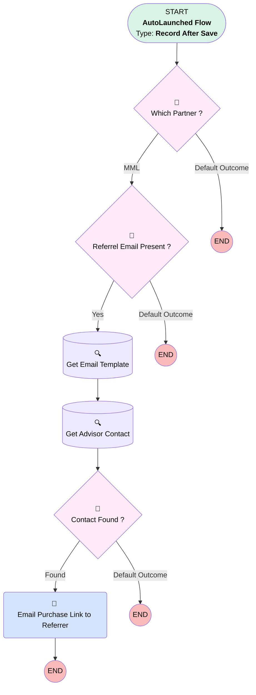

# Proposal | After Trigger | Send Purchase Link to Partners

## Flow Diagram [(_View History_)](Proposal_After_Trigger_Send_Purchase_Link_to_Partners-history.md)

<!-- Flow description -->

## General Information

|<!-- -->|<!-- -->|
|:---|:---|
|Object|Proposal__c|
|Process Type| Auto Launched Flow|
|Trigger Type| Record After Save|
|Record Trigger Type| Create And Update|
|Label|Proposal | After Trigger | Send Purchase Link to Partners|
|Status|Active|
|Description|Changing "Send Email Address" to dontrespond@ Adding Anne-Marie to email recipient list|
|Environments|Default|
|Interview Label|Proposal | After Trigger | Send Purchase Link to Partners {!$Flow.CurrentDateTime}|
| Builder Type (PM)|LightningFlowBuilder|
| Canvas Mode (PM)|AUTO_LAYOUT_CANVAS|
| Origin Builder Type (PM)|LightningFlowBuilder|
|Connector|[Which_Partner](#which_partner)|
|Next Node|[Which_Partner](#which_partner)|

#### Filters (logic: **and**)

|Filter Id|Field|Operator|Value|
|:-- |:-- |:--:|:--: |
|1|RecordTypeId| Equal To|0121G000000AjeLQAS|
|2|Paradigm_Purchase_Link__c| Is Changed|✅|

## Variables

|Name|Data Type|Is Collection|Is Input|Is Output|Object Type|Description|
|:-- |:--:|:--:|:--:|:--:|:--:|:--  |
|recipientId|String|⬜|⬜|⬜|<!-- -->|<!-- -->|

## Flow Nodes Details

### Email_Purchase_Link_to_Referrer

|<!-- -->|<!-- -->|
|:---|:---|
|Type|Action Call|
|Label|Email Purchase Link to Referrer|
|Action Type|Email Simple|
|Action Name|emailSimple|
|Flow Transaction Model|CurrentTransaction|
|Name Segment|emailSimple|
|Offset|0|
|Email Addresses (input)|ademartini@myubiquity.com|
|Sender Type (input)|OrgWideEmailAddress|
|Sender Address (input)|dontrespond@myubiquity.com|
|Related Record Id (input)|$Record.Id|
|Recipient Id (input)|Get_Advisor_Contact.Id|
|Log Email On Send (input)|✅|
|Email Template Id (input)|Get_Email_Template.Id|

### Contact_Found

|<!-- -->|<!-- -->|
|:---|:---|
|Type|Decision|
|Label|Contact Found ?|
|Default Connector Label|Default Outcome|

#### Rule Found (Found)

|<!-- -->|<!-- -->|
|:---|:---|
|Connector|[Email_Purchase_Link_to_Referrer](#email_purchase_link_to_referrer)|
|Condition Logic|and|

|Condition Id|Left Value Reference|Operator|Right Value|
|:-- |:-- |:--:|:--: |
|1|Get_Advisor_Contact.Id| Is Null|⬜|

### Referrel_Email_Present

|<!-- -->|<!-- -->|
|:---|:---|
|Type|Decision|
|Label|Referrel Email Present ?|
|Default Connector Label|Default Outcome|

#### Rule Yes (Yes)

|<!-- -->|<!-- -->|
|:---|:---|
|Connector|[Get_Email_Template](#get_email_template)|
|Condition Logic|and|

|Condition Id|Left Value Reference|Operator|Right Value|
|:-- |:-- |:--:|:--: |
|1|$Record.Referrer_Email__c| Is Null|⬜|

### Which_Partner

|<!-- -->|<!-- -->|
|:---|:---|
|Type|Decision|
|Label|Which Partner ?|
|Default Connector Label|Default Outcome|

#### Rule MML (MML)

|<!-- -->|<!-- -->|
|:---|:---|
|Connector|[Referrel_Email_Present](#referrel_email_present)|
|Condition Logic|and|

|Condition Id|Left Value Reference|Operator|Right Value|
|:-- |:-- |:--:|:--: |
|1|$Record.Lead_Source__c| Equal To|MML|
|2|$Record__Prior.Paradigm_Purchase_Link__c| Is Null|✅|
|3|$Record.Paradigm_Purchase_Link__c| Is Null|⬜|

### Get_Advisor_Contact

|<!-- -->|<!-- -->|
|:---|:---|
|Type|Record Lookup|
|Object|Contact|
|Label|Get Advisor Contact|
|Assign Null Values If No Records Found|⬜|
|Get First Record Only|✅|
|Store Output Automatically|✅|
|Connector|[Contact_Found](#contact_found)|

#### Filters (logic: **and**)

|Filter Id|Field|Operator|Value|
|:-- |:-- |:--:|:--: |
|1|Email| Equal To|$Record.Referrer_Email__c|

### Get_Email_Template

|<!-- -->|<!-- -->|
|:---|:---|
|Type|Record Lookup|
|Object|EmailTemplate|
|Label|Get Email Template|
|Assign Null Values If No Records Found|⬜|
|Get First Record Only|✅|
|Store Output Automatically|✅|
|Connector|[Get_Advisor_Contact](#get_advisor_contact)|

#### Filters (logic: **and**)

|Filter Id|Field|Operator|Value|
|:-- |:-- |:--:|:--: |
|1|Name| Equal To|MML Form Autoresponder|

___

_Documentation generated from branch monitoring_myubiquity by [sfdx-hardis](https://sfdx-hardis.cloudity.com), featuring [salesforce-flow-visualiser](https://github.com/toddhalfpenny/salesforce-flow-visualiser)_