# Proposal | Autolaunched | Assign Lead Values From Proposal

## Flow Diagram [(_View History_)](Proposal_Autolaunched_Assign_Lead_Values_From_Proposal-history.md)

```mermaid
%% If you read this, your Markdown visualizer does not handle MermaidJS syntax.
%% - If you are in VS Code, install extension `Markdown Preview Mermaid Support` at https://marketplace.visualstudio.com/items?itemName=bierner.markdown-mermaid
%% - If you are using sfdx-hardis, try to define env variable `MERMAID_MODES=cli,docker` ,then run again the command to regenerate markdown with SVG images.
%% - If you are within mkdocs-material, define mermaid plugin in `mkdocs.yml` as described in https://squidfunk.github.io/mkdocs-material/extensions/mermaid/
%% - As a last resort, you can copy-paste this MermaidJS code into https://mermaid.live/ to see the flow diagram

flowchart TB
START(["START<br/><b>AutoLaunched Flow</b></br>"]):::startClass
click START "#general-information" "3212327928"

Assign_Advisor_State_Var[\"🟰 <em></em><br/>Assign Advisor State Var"/]:::assignments
click Assign_Advisor_State_Var "#assign_advisor_state_var" "414478025"

Assign_assigned_status[\"🟰 <em></em><br/>Assign assigned status"/]:::assignments
click Assign_assigned_status "#assign_assigned_status" "743112743"

Assign_Employer_State_Var[\"🟰 <em></em><br/>Assign Employer State Var"/]:::assignments
click Assign_Employer_State_Var "#assign_employer_state_var" "2312613561"

Assign_LSD_from_proposal[\"🟰 <em></em><br/>Assign LSD from proposal"/]:::assignments
click Assign_LSD_from_proposal "#assign_lsd_from_proposal" "1717422299"

Assign_open_status[\"🟰 <em></em><br/>Assign open status"/]:::assignments
click Assign_open_status "#assign_open_status" "617675040"

Assign_Simply_Advisor_Referred_Values[\"🟰 <em></em><br/>Assign Simply Advisor Referred Values"/]:::assignments
click Assign_Simply_Advisor_Referred_Values "#assign_simply_advisor_referred_values" "3038291266"

Assign_Simply_Direct_Referred_Values[\"🟰 <em></em><br/>Assign Simply Direct Referred Values"/]:::assignments
click Assign_Simply_Direct_Referred_Values "#assign_simply_direct_referred_values" "525641011"

Assign_Simply_TPA_Referred_Values[\"🟰 <em></em><br/>Assign Simply TPA Referred Values"/]:::assignments
click Assign_Simply_TPA_Referred_Values "#assign_simply_tpa_referred_values" "521060345"

Assign_state_code_field[\"🟰 <em></em><br/>Assign state code field"/]:::assignments
click Assign_state_code_field "#assign_state_code_field" "2060748055"

Assign_state_field[\"🟰 <em></em><br/>Assign state field"/]:::assignments
click Assign_state_field "#assign_state_field" "1444749379"

Assign_TPA_State_Var[\"🟰 <em></em><br/>Assign TPA State Var"/]:::assignments
click Assign_TPA_State_Var "#assign_tpa_state_var" "1431790550"

Define_Advisor_AC[\"🟰 <em></em><br/>Define Advisor AC"/]:::assignments
click Define_Advisor_AC "#define_advisor_ac" "1227155123"

Define_Principal_Advisor[\"🟰 <em></em><br/>Define Principal Advisor"/]:::assignments
click Define_Principal_Advisor "#define_principal_advisor" "121490946"

Define_Principal_Employer[\"🟰 <em></em><br/>Define Principal Employer"/]:::assignments
click Define_Principal_Employer "#define_principal_employer" "2195809370"

Define_Principal_TPA[\"🟰 <em></em><br/>Define Principal TPA"/]:::assignments
click Define_Principal_TPA "#define_principal_tpa" "2141355304"

Define_Sallus_Employer[\"🟰 <em></em><br/>Define Sallus Employer"/]:::assignments
click Define_Sallus_Employer "#define_sallus_employer" "1754483099"

Define_Ubiquity_Advisor[\"🟰 <em></em><br/>Define Ubiquity Advisor"/]:::assignments
click Define_Ubiquity_Advisor "#define_ubiquity_advisor" "1718534307"

Define_Ubiquity_Employer[\"🟰 <em></em><br/>Define Ubiquity Employer"/]:::assignments
click Define_Ubiquity_Employer "#define_ubiquity_employer" "2453284370"

Check_for_potential_AC{"🔀 <em></em><br/>Check for potential AC"}:::decisions
click Check_for_potential_AC "#check_for_potential_ac" "2692595342"

Check_for_Specified_LSD{"🔀 <em></em><br/>Check for Specified LSD"}:::decisions
click Check_for_Specified_LSD "#check_for_specified_lsd" "1917028031"

Check_State_Name_vs_Code{"🔀 <em></em><br/>Check State Name vs Code"}:::decisions
click Check_State_Name_vs_Code "#check_state_name_vs_code" "3114094278"

Lead_Type_Check{"🔀 <em></em><br/>Lead Type Check"}:::decisions
click Lead_Type_Check "#lead_type_check" "3143624429"

Principal_Referral_Split{"🔀 <em></em><br/>Principal Referral Split"}:::decisions
click Principal_Referral_Split "#principal_referral_split" "817652997"

Record_Type_Check{"🔀 <em></em><br/>Record Type Check"}:::decisions
click Record_Type_Check "#record_type_check" "1842018159"

Status_Split{"🔀 <em></em><br/>Status Split"}:::decisions
click Status_Split "#status_split" "2576207831"

Get_Default_Record_Type[("🔍 <em></em><br/>Get Default Record Type")]:::recordLookups
click Get_Default_Record_Type "#get_default_record_type" "4278337229"

Get_Partner_Record_Type[("🔍 <em></em><br/>Get Partner Record Type")]:::recordLookups
click Get_Partner_Record_Type "#get_partner_record_type" "2658151705"

Assign_Advisor_State_Var --> Check_State_Name_vs_Code
Assign_assigned_status --> END_Assign_assigned_status
Assign_Employer_State_Var --> Check_State_Name_vs_Code
Assign_LSD_from_proposal --> Assign_Employer_State_Var
Assign_open_status --> END_Assign_open_status
Assign_Simply_Advisor_Referred_Values --> Check_for_Specified_LSD
Assign_Simply_Direct_Referred_Values --> Check_for_Specified_LSD
Assign_Simply_TPA_Referred_Values --> Check_for_Specified_LSD
Assign_state_code_field --> Status_Split
Assign_state_field --> Status_Split
Assign_TPA_State_Var --> Check_State_Name_vs_Code
Define_Advisor_AC --> Assign_Employer_State_Var
Define_Principal_Advisor --> Assign_Advisor_State_Var
Define_Principal_Employer --> Principal_Referral_Split
Define_Principal_TPA --> Assign_TPA_State_Var
Define_Sallus_Employer --> Assign_Employer_State_Var
Define_Ubiquity_Advisor --> Assign_Advisor_State_Var
Define_Ubiquity_Employer --> Check_for_potential_AC
Check_for_potential_AC --> |"Advisor AC"| Define_Advisor_AC
Check_for_potential_AC --> |"Default Outcome"| Assign_Employer_State_Var
Check_for_Specified_LSD --> |"Proposal Set LSD"| Assign_LSD_from_proposal
Check_for_Specified_LSD --> |"Default Outcome"| Assign_Employer_State_Var
Check_State_Name_vs_Code --> |"Use state field"| Assign_state_field
Check_State_Name_vs_Code --> |"State code or none"| Assign_state_code_field
Lead_Type_Check --> |"Ubiquity Advisor"| Define_Ubiquity_Advisor
Lead_Type_Check --> |"Ubiquity Employer"| Define_Ubiquity_Employer
Lead_Type_Check --> |"Principal Advisor"| Define_Principal_Advisor
Lead_Type_Check --> |"Principal TPA"| Define_Principal_TPA
Lead_Type_Check --> |"Principal Employer"| Define_Principal_Employer
Lead_Type_Check --> |"Sallus Employer"| Define_Sallus_Employer
Lead_Type_Check --> |"Default Outcome"| END_Lead_Type_Check
Principal_Referral_Split --> |"Principal Advisor Referred"| Assign_Simply_Advisor_Referred_Values
Principal_Referral_Split --> |"Principal TPA Referred"| Assign_Simply_TPA_Referred_Values
Principal_Referral_Split --> |"Principal Direct"| Assign_Simply_Direct_Referred_Values
Record_Type_Check --> |"Default Type"| Get_Default_Record_Type
Record_Type_Check --> |"Partner Type"| Get_Partner_Record_Type
Status_Split --> |"User"| Assign_assigned_status
Status_Split --> |"Queue"| Assign_open_status
Status_Split --> |"Default Outcome"| END_Status_Split
Get_Default_Record_Type --> Lead_Type_Check
Get_Partner_Record_Type --> Lead_Type_Check
START -->  Record_Type_Check
END_Assign_assigned_status(( END )):::endClass
END_Assign_open_status(( END )):::endClass
END_Lead_Type_Check(( END )):::endClass
END_Status_Split(( END )):::endClass


classDef actionCalls fill:#D4E4FC,color:black,text-decoration:none,max-height:100px
classDef assignments fill:#FBEED7,color:black,text-decoration:none,max-height:100px
classDef collectionProcessors fill:#F0E3FA,color:black,text-decoration:none,max-height:100px
classDef customErrors fill:#FFE9E9,color:black,text-decoration:none,max-height:100px
classDef decisions fill:#FDEAF6,color:black,text-decoration:none,max-height:100px
classDef loops fill:#FDEAF6,color:black,text-decoration:none,max-height:100px
classDef recordCreates fill:#FFF8C9,color:black,text-decoration:none,max-height:100px
classDef recordDeletes fill:#FFF8C9,color:black,text-decoration:none,max-height:100px
classDef recordLookups fill:#EDEAFF,color:black,text-decoration:none,max-height:100px
classDef recordUpdates fill:#FFF8C9,color:black,text-decoration:none,max-height:100px
classDef screens fill:#DFF6FF,color:black,text-decoration:none,max-height:100px
classDef subflows fill:#D4E4FC,color:black,text-decoration:none,max-height:100px
classDef startClass fill:#D9F2E6,color:black,text-decoration:none,max-height:100px
classDef endClass fill:#F9BABA,color:black,text-decoration:none,max-height:100px
classDef transforms fill:#FDEAF6,color:black,text-decoration:none,max-height:100px


```

<!-- Flow description -->

## General Information

|<!-- -->|<!-- -->|
|:---|:---|
|Process Type| Auto Launched Flow|
|Label|Proposal | Autolaunched | Assign Lead Values From Proposal|
|Status|Active|
|Description|Added support for principal advisors, TPAs, and employers.|
|Environments|Default|
|Interview Label|Proposal | Autolaunched | Lead Values From Proposal {!$Flow.CurrentDateTime}|
| Builder Type (PM)|LightningFlowBuilder|
| Canvas Mode (PM)|AUTO_LAYOUT_CANVAS|
| Origin Builder Type (PM)|LightningFlowBuilder|
|Connector|[Record_Type_Check](#record_type_check)|
|Next Node|[Record_Type_Check](#record_type_check)|

## Variables

|Name|Data Type|Is Collection|Is Input|Is Output|Object Type|Description|
|:-- |:--:|:--:|:--:|:--:|:--:|:--  |
|leadType|String|⬜|✅|⬜|<!-- -->|<!-- -->|
|newLead|SObject|⬜|⬜|✅|Lead|<!-- -->|
|proposalRecord|SObject|⬜|✅|⬜|Proposal__c|<!-- -->|
|stateVar|String|⬜|⬜|⬜|<!-- -->|<!-- -->|

## Formulas

|Name|Data Type|Expression|Description|
|:-- |:--:|:-- |:--  |
|tpaState|String|BLANKVALUE({!proposalRecord.Financial_Professional_State__c}, {!proposalRecord.Company_State__c})|<!-- -->|
|useFullStateName|Boolean|LEN({!stateVar}) > 2|If true, a full state name is present.  Otherwise use state code field|

## Flow Nodes Details

### Assign_Advisor_State_Var

|<!-- -->|<!-- -->|
|:---|:---|
|Type|Assignment|
|Label|Assign Advisor State Var|
|Connector|[Check_State_Name_vs_Code](#check_state_name_vs_code)|

#### Assignments

|Assign To Reference|Operator|Value|
|:-- |:--:|:--: |
|stateVar| Assign|proposalRecord.Financial_Professional_State__c|

### Assign_assigned_status

|<!-- -->|<!-- -->|
|:---|:---|
|Type|Assignment|
|Label|Assign assigned status|

#### Assignments

|Assign To Reference|Operator|Value|
|:-- |:--:|:--: |
|newLead.Status| Assign|Assigned|

### Assign_Employer_State_Var

|<!-- -->|<!-- -->|
|:---|:---|
|Type|Assignment|
|Label|Assign Employer State Var|
|Connector|[Check_State_Name_vs_Code](#check_state_name_vs_code)|

#### Assignments

|Assign To Reference|Operator|Value|
|:-- |:--:|:--: |
|stateVar| Assign|proposalRecord.Company_State__c|

### Assign_LSD_from_proposal

|<!-- -->|<!-- -->|
|:---|:---|
|Type|Assignment|
|Label|Assign LSD from proposal|
|Connector|isGoTo: true targetReference: Assign_Employer_State_Var |

#### Assignments

|Assign To Reference|Operator|Value|
|:-- |:--:|:--: |
|newLead.LeadSourceDetail__c| Assign|proposalRecord.Lead_Source_Detail__c|

### Assign_open_status

|<!-- -->|<!-- -->|
|:---|:---|
|Type|Assignment|
|Label|Assign open status|

#### Assignments

|Assign To Reference|Operator|Value|
|:-- |:--:|:--: |
|newLead.Status| Assign|Open|

### Assign_Simply_Advisor_Referred_Values

|<!-- -->|<!-- -->|
|:---|:---|
|Type|Assignment|
|Label|Assign Simply Advisor Referred Values|
|Connector|[Check_for_Specified_LSD](#check_for_specified_lsd)|

#### Assignments

|Assign To Reference|Operator|Value|
|:-- |:--:|:--: |
|newLead.LeadSourceDetail__c| Assign|Simply Advisor|
|newLead.Associated_Contact__c| Assign|proposalRecord.Advisor_Contact__c|
|newLead.Associated_Partner__c| Assign|proposalRecord.Advisor_Account__c|
|newLead.Associated_Contact_Role__c| Assign|Financial Advisor|
|newLead.Associated_Partner_Role__c| Assign|Financial Advisory Firm|
|newLead.Advisor_State__c| Assign|proposalRecord.Financial_Professional_State__c|
|newLead.Referrer_s_Email__c| Assign|proposalRecord.Financial_Professional_Email__c|

### Assign_Simply_Direct_Referred_Values

|<!-- -->|<!-- -->|
|:---|:---|
|Type|Assignment|
|Label|Assign Simply Direct Referred Values|
|Connector|[Check_for_Specified_LSD](#check_for_specified_lsd)|

#### Assignments

|Assign To Reference|Operator|Value|
|:-- |:--:|:--: |
|newLead.LeadSourceDetail__c| Assign|Simply Direct|

### Assign_Simply_TPA_Referred_Values

|<!-- -->|<!-- -->|
|:---|:---|
|Type|Assignment|
|Label|Assign Simply TPA Referred Values|
|Connector|[Check_for_Specified_LSD](#check_for_specified_lsd)|

#### Assignments

|Assign To Reference|Operator|Value|
|:-- |:--:|:--: |
|newLead.LeadSourceDetail__c| Assign|Simply TPA|
|newLead.Associated_Contact__c| Assign|proposalRecord.TPA_Contact__c|
|newLead.Associated_Partner__c| Assign|proposalRecord.TPA_Account__c|
|newLead.Referrer_s_Email__c| Assign|proposalRecord.TPA_Sales_Email__c|

### Assign_state_code_field

|<!-- -->|<!-- -->|
|:---|:---|
|Type|Assignment|
|Label|Assign state code field|
|Connector|[Status_Split](#status_split)|

#### Assignments

|Assign To Reference|Operator|Value|
|:-- |:--:|:--: |
|newLead.StateCode| Assign|stateVar|

### Assign_state_field

|<!-- -->|<!-- -->|
|:---|:---|
|Type|Assignment|
|Label|Assign state field|
|Connector|[Status_Split](#status_split)|

#### Assignments

|Assign To Reference|Operator|Value|
|:-- |:--:|:--: |
|newLead.State| Assign|stateVar|

### Assign_TPA_State_Var

|<!-- -->|<!-- -->|
|:---|:---|
|Type|Assignment|
|Label|Assign TPA State Var|
|Connector|[Check_State_Name_vs_Code](#check_state_name_vs_code)|

#### Assignments

|Assign To Reference|Operator|Value|
|:-- |:--:|:--: |
|stateVar| Assign|tpaState|

### Define_Advisor_AC

|<!-- -->|<!-- -->|
|:---|:---|
|Type|Assignment|
|Label|Define Advisor AC|
|Connector|[Assign_Employer_State_Var](#assign_employer_state_var)|

#### Assignments

|Assign To Reference|Operator|Value|
|:-- |:--:|:--: |
|newLead.Associated_Contact__c| Assign|proposalRecord.Advisor_Contact__c|
|newLead.Associated_Partner__c| Assign|proposalRecord.Advisor_Account__c|
|newLead.Associated_Contact_Role__c| Assign|Financial Advisor|
|newLead.Associated_Partner_Role__c| Assign|Financial Advisory Firm|

### Define_Principal_Advisor

|<!-- -->|<!-- -->|
|:---|:---|
|Type|Assignment|
|Label|Define Principal Advisor|
|Connector|isGoTo: true targetReference: Assign_Advisor_State_Var |

#### Assignments

|Assign To Reference|Operator|Value|
|:-- |:--:|:--: |
|newLead.Email| Assign|proposalRecord.Financial_Professional_Email__c|
|newLead.FirstName| Assign|proposalRecord.Financial_Professional_First_Name__c|
|newLead.LastName| Assign|proposalRecord.Financial_Professional_Last_Name__c|
|newLead.Phone| Assign|proposalRecord.Financial_Professional_Phone__c|
|newLead.Company| Assign|proposalRecord.Firm_Name__c|
|newLead.Product_Type__c| Assign|401(k)|
|newLead.Business_Unit__c| Assign|Simply Retirement|
|newLead.Territory__c| Assign|Major Partner|
|newLead.Lead_Type__c| Assign|Advisor|
|newLead.Role__c| Assign|Advisor|
|newLead.LeadSource| Assign|Simply Retirement|
|newLead.LeadSourceDetail__c| Assign|Simply Advisor|
|newLead.Method_of_First_Contact__c| Assign|Partner Referral|
|newLead.OwnerId| Assign|proposalRecord.OwnerId|
|newLead.Lead_Origin__c| Assign|Ubiquity Generated|
|newLead.Connected_Partner__c| Assign|Simply Retirement|
|newLead.Business_Industry__c| Assign|Finance|
|newLead.IsConvertedOnCreate__c| Assign|✅|

### Define_Principal_Employer

|<!-- -->|<!-- -->|
|:---|:---|
|Type|Assignment|
|Label|Define Principal Employer|
|Connector|[Principal_Referral_Split](#principal_referral_split)|

#### Assignments

|Assign To Reference|Operator|Value|
|:-- |:--:|:--: |
|newLead.FirstName| Assign|proposalRecord.Company_Contact_First_Name__c|
|newLead.LastName| Assign|proposalRecord.Company_Contact_Last_Name__c|
|newLead.Business_Unit__c| Assign|Simply Retirement|
|newLead.LeadSource| Assign|Simply Retirement|
|newLead.Method_of_First_Contact__c| Assign|Partner Referral|
|newLead.Lead_Type__c| Assign|Employer|
|newLead.OwnerId| Assign|proposalRecord.OwnerId|
|newLead.PostalCode| Assign|proposalRecord.Company_Zip_Code__c|
|newLead.Email| Assign|proposalRecord.Company_Email__c|
|newLead.Lead_Origin__c| Assign|Ubiquity Generated|
|newLead.Business_Industry__c| Assign|Not Yet Known|
|newLead.Product_Type__c| Assign|proposalRecord.Product_Type__c|
|newLead.Phone| Assign|proposalRecord.Contact_Phone_Number__c|
|newLead.Plan_Type__c| Assign|proposalRecord.Plan_Type__c|
|newLead.Company| Assign|proposalRecord.Client_Company_Name__c|
|newLead.NumberOfEmployees| Assign|proposalRecord.Number_of_Employees__c|
|newLead.Service_Option__c| Assign|proposalRecord.Service_Option__c|
|newLead.Safe_Harbor__c| Assign|proposalRecord.Safe_Harbor__c|
|newLead.Plan_Eligibility__c| Assign|proposalRecord.Plan_Eligibility__c|
|newLead.Auto_Enrollment__c| Assign|proposalRecord.Auto_Enrollment__c|
|newLead.X3_38__c| Assign|proposalRecord.X3_38__c|
|newLead.Fund_List__c| Assign|proposalRecord.Fund_List__c|
|newLead.Current_401_k_provider__c| Assign|proposalRecord.Current_401_k_provider__c|
|newLead.minimumAutoDeferralPercentage__c| Assign|proposalRecord.Min_Auto_Deferral_Percentage__c|
|newLead.maxAutoDeferralPercentage__c| Assign|proposalRecord.Max_Auto_Deferral_Percentage__c|
|newLead.Title| Assign|proposalRecord.Contact_Job_Title__c|
|newLead.Connected_Partner__c| Assign|Simply Retirement|

### Define_Principal_TPA

|<!-- -->|<!-- -->|
|:---|:---|
|Type|Assignment|
|Label|Define Principal TPA|
|Connector|[Assign_TPA_State_Var](#assign_tpa_state_var)|

#### Assignments

|Assign To Reference|Operator|Value|
|:-- |:--:|:--: |
|newLead.Email| Assign|proposalRecord.TPA_Sales_Email__c|
|newLead.FirstName| Assign|proposalRecord.TPA_Sales_First_Name__c|
|newLead.LastName| Assign|proposalRecord.TPA_Sales_Last_Name__c|
|newLead.Company| Assign|proposalRecord.TPA_Firm_Name__c|
|newLead.Product_Type__c| Assign|401(k)|
|newLead.Business_Unit__c| Assign|Simply Retirement|
|newLead.Territory__c| Assign|Major Partner|
|newLead.Lead_Type__c| Assign|TPA|
|newLead.Role__c| Assign|TPA - Sales|
|newLead.LeadSource| Assign|Simply Retirement|
|newLead.LeadSourceDetail__c| Assign|Simply TPA|
|newLead.Method_of_First_Contact__c| Assign|Partner Referral|
|newLead.OwnerId| Assign|proposalRecord.OwnerId|
|newLead.Lead_Origin__c| Assign|Ubiquity Generated|
|newLead.Connected_Partner__c| Assign|Simply Retirement|
|newLead.Business_Industry__c| Assign|Finance|
|newLead.Company_FEIN__c| Assign|proposalRecord.TPA_EIN__c|
|newLead.IsConvertedOnCreate__c| Assign|✅|

### Define_Sallus_Employer

|<!-- -->|<!-- -->|
|:---|:---|
|Type|Assignment|
|Label|Define Sallus Employer|
|Connector|isGoTo: true targetReference: Assign_Employer_State_Var |

#### Assignments

|Assign To Reference|Operator|Value|
|:-- |:--:|:--: |
|newLead.FirstName| Assign|proposalRecord.Company_Contact_First_Name__c|
|newLead.LastName| Assign|proposalRecord.Company_Contact_Last_Name__c|
|newLead.Company| Assign|proposalRecord.Client_Company_Name__c|
|newLead.Email| Assign|proposalRecord.Company_Email__c|
|newLead.Lead_Type__c| Assign|Employer|
|newLead.Method_of_First_Contact__c| Assign|Partner Referral|
|newLead.Title| Assign|proposalRecord.Contact_Job_Title__c|
|newLead.Service_Option__c| Assign|proposalRecord.Service_Option__c|
|newLead.NumberOfEmployees| Assign|proposalRecord.Number_of_Employees__c|
|newLead.Phone| Assign|proposalRecord.Contact_Phone_Number__c|
|newLead.Lead_Origin__c| Assign|Ubiquity Generated|
|newLead.OwnerId| Assign|proposalRecord.OwnerId|
|newLead.Status| Assign|Assigned|
|newLead.Plan_Type__c| Assign|proposalRecord.Plan_Type__c|
|newLead.Associated_Contact__c| Assign|proposalRecord.Advisor_Contact__c|
|newLead.Associated_Contact_Role__c| Assign|Financial Advisor|
|newLead.Associated_Partner__c| Assign|proposalRecord.Advisor_Account__c|
|newLead.Associated_Partner_Role__c| Assign|Financial Advisory Firm|
|newLead.LeadSource| Assign|Sallus|
|newLead.LeadSourceDetail__c| Assign|proposalRecord.X3_38__c|
|newLead.Business_Unit__c| Assign|Ubiquity|
|newLead.Connected_Partner__c| Assign|Sallus|
|newLead.Product_Type__c| Assign|PEP|

### Define_Ubiquity_Advisor

|<!-- -->|<!-- -->|
|:---|:---|
|Type|Assignment|
|Label|Define Ubiquity Advisor|
|Connector|[Assign_Advisor_State_Var](#assign_advisor_state_var)|

#### Assignments

|Assign To Reference|Operator|Value|
|:-- |:--:|:--: |
|newLead.FirstName| Assign|proposalRecord.Financial_Professional_First_Name__c|
|newLead.LastName| Assign|proposalRecord.Financial_Professional_Last_Name__c|
|newLead.Business_Unit__c| Assign|Ubiquity|
|newLead.LeadSource| Assign|proposalRecord.Lead_Source__c|
|newLead.LeadSourceDetail__c| Assign|proposalRecord.Lead_Source_Detail__c|
|newLead.Method_of_First_Contact__c| Assign|Partner Referral|
|newLead.Role__c| Assign|Advisor|
|newLead.Lead_Type__c| Assign|Advisor|
|newLead.Channel__c| Assign|Advisors|
|newLead.OwnerId| Assign|proposalRecord.OwnerId|
|newLead.StateCode| Assign|proposalRecord.Financial_Professional_State__c|
|newLead.PostalCode| Assign|proposalRecord.Financial_Professional_Zip_Code__c|
|newLead.Email| Assign|proposalRecord.Financial_Professional_Email__c|
|newLead.Territory__c| Assign|Standard|
|newLead.RecordTypeId| Assign|012000000000n0fAAA|
|newLead.Lead_Origin__c| Assign|Ubiquity Generated|
|newLead.Business_Industry__c| Assign|Finance|
|newLead.Product_Type__c| Assign|proposalRecord.Product_Type__c|
|newLead.Phone| Assign|proposalRecord.Financial_Professional_Phone__c|
|newLead.Company| Assign|proposalRecord.Firm_Name__c|
|newLead.IsConvertedOnCreate__c| Assign|✅|

### Define_Ubiquity_Employer

|<!-- -->|<!-- -->|
|:---|:---|
|Type|Assignment|
|Label|Define Ubiquity Employer|
|Connector|[Check_for_potential_AC](#check_for_potential_ac)|

#### Assignments

|Assign To Reference|Operator|Value|
|:-- |:--:|:--: |
|newLead.FirstName| Assign|proposalRecord.Company_Contact_First_Name__c|
|newLead.LastName| Assign|proposalRecord.Company_Contact_Last_Name__c|
|newLead.Business_Unit__c| Assign|Ubiquity|
|newLead.LeadSource| Assign|proposalRecord.Lead_Source__c|
|newLead.LeadSourceDetail__c| Assign|proposalRecord.Lead_Source_Detail__c|
|newLead.Method_of_First_Contact__c| Assign|Partner Referral|
|newLead.Role__c| Assign|Plan Sponsor|
|newLead.Lead_Type__c| Assign|Employer|
|newLead.OwnerId| Assign|proposalRecord.OwnerId|
|newLead.PostalCode| Assign|proposalRecord.Company_Zip_Code__c|
|newLead.Email| Assign|proposalRecord.Company_Email__c|
|newLead.RecordTypeId| Assign|012000000000n0kAAA|
|newLead.Lead_Origin__c| Assign|Ubiquity Generated|
|newLead.Business_Industry__c| Assign|Not Yet Known|
|newLead.Product_Type__c| Assign|proposalRecord.Product_Type__c|
|newLead.Phone| Assign|proposalRecord.Contact_Phone_Number__c|
|newLead.Plan_Type__c| Assign|proposalRecord.Plan_Type__c|
|newLead.Company| Assign|proposalRecord.Client_Company_Name__c|
|newLead.NumberOfEmployees| Assign|proposalRecord.Number_of_Employees__c|
|newLead.Service_Option__c| Assign|proposalRecord.Service_Option__c|
|newLead.Safe_Harbor__c| Assign|proposalRecord.Safe_Harbor__c|
|newLead.Plan_Eligibility__c| Assign|proposalRecord.Plan_Eligibility__c|
|newLead.Auto_Enrollment__c| Assign|proposalRecord.Auto_Enrollment__c|
|newLead.X3_38__c| Assign|proposalRecord.X3_38__c|
|newLead.Fund_List__c| Assign|proposalRecord.Fund_List__c|
|newLead.Current_401_k_provider__c| Assign|proposalRecord.Current_401_k_provider__c|
|newLead.minimumAutoDeferralPercentage__c| Assign|proposalRecord.Min_Auto_Deferral_Percentage__c|
|newLead.maxAutoDeferralPercentage__c| Assign|proposalRecord.Max_Auto_Deferral_Percentage__c|

### Check_for_potential_AC

|<!-- -->|<!-- -->|
|:---|:---|
|Type|Decision|
|Label|Check for potential AC|
|Default Connector|[Assign_Employer_State_Var](#assign_employer_state_var)|
|Default Connector Label|Default Outcome|

#### Rule Advisor_AC (Advisor AC)

|<!-- -->|<!-- -->|
|:---|:---|
|Connector|[Define_Advisor_AC](#define_advisor_ac)|
|Condition Logic|and|

|Condition Id|Left Value Reference|Operator|Right Value|
|:-- |:-- |:--:|:--: |
|1|proposalRecord.Advisor_Contact__c| Is Blank|⬜|

### Check_for_Specified_LSD

|<!-- -->|<!-- -->|
|:---|:---|
|Type|Decision|
|Label|Check for Specified LSD|
|Default Connector|isGoTo: true targetReference: Assign_Employer_State_Var |
|Default Connector Label|Default Outcome|

#### Rule Proposal_Set_LSD (Proposal Set LSD)

|<!-- -->|<!-- -->|
|:---|:---|
|Connector|[Assign_LSD_from_proposal](#assign_lsd_from_proposal)|
|Condition Logic|and|

|Condition Id|Left Value Reference|Operator|Right Value|
|:-- |:-- |:--:|:--: |
|1|proposalRecord.Lead_Source_Detail__c| Is Blank|⬜|

### Check_State_Name_vs_Code

|<!-- -->|<!-- -->|
|:---|:---|
|Type|Decision|
|Label|Check State Name vs Code|
|Description|Deciding whether to use the statecode field or state field based on length of input|
|Default Connector|[Assign_state_code_field](#assign_state_code_field)|
|Default Connector Label|State code or none|

#### Rule Use_state_field (Use state field)

|<!-- -->|<!-- -->|
|:---|:---|
|Connector|[Assign_state_field](#assign_state_field)|
|Condition Logic|and|

|Condition Id|Left Value Reference|Operator|Right Value|
|:-- |:-- |:--:|:--: |
|1|useFullStateName| Equal To|✅|

### Lead_Type_Check

|<!-- -->|<!-- -->|
|:---|:---|
|Type|Decision|
|Label|Lead Type Check|
|Default Connector Label|Default Outcome|

#### Rule Ubiquity_Advisor (Ubiquity Advisor)

|<!-- -->|<!-- -->|
|:---|:---|
|Connector|[Define_Ubiquity_Advisor](#define_ubiquity_advisor)|
|Condition Logic|and|

|Condition Id|Left Value Reference|Operator|Right Value|
|:-- |:-- |:--:|:--: |
|1|leadType| Equal To|Ubiquity Advisor|

#### Rule Ubiquity_Employer (Ubiquity Employer)

|<!-- -->|<!-- -->|
|:---|:---|
|Connector|[Define_Ubiquity_Employer](#define_ubiquity_employer)|
|Condition Logic|and|

|Condition Id|Left Value Reference|Operator|Right Value|
|:-- |:-- |:--:|:--: |
|1|leadType| Equal To|Ubiquity Employer|

#### Rule Principal_Advisor (Principal Advisor)

|<!-- -->|<!-- -->|
|:---|:---|
|Connector|[Define_Principal_Advisor](#define_principal_advisor)|
|Condition Logic|and|

|Condition Id|Left Value Reference|Operator|Right Value|
|:-- |:-- |:--:|:--: |
|1|leadType| Equal To|Principal Advisor|

#### Rule Principal_TPA (Principal TPA)

|<!-- -->|<!-- -->|
|:---|:---|
|Connector|[Define_Principal_TPA](#define_principal_tpa)|
|Condition Logic|and|

|Condition Id|Left Value Reference|Operator|Right Value|
|:-- |:-- |:--:|:--: |
|1|leadType| Equal To|Principal TPA|

#### Rule Principal_Employer (Principal Employer)

|<!-- -->|<!-- -->|
|:---|:---|
|Connector|[Define_Principal_Employer](#define_principal_employer)|
|Condition Logic|and|

|Condition Id|Left Value Reference|Operator|Right Value|
|:-- |:-- |:--:|:--: |
|1|leadType| Equal To|Principal Employer|

#### Rule Sallus_Employer (Sallus Employer)

|<!-- -->|<!-- -->|
|:---|:---|
|Connector|[Define_Sallus_Employer](#define_sallus_employer)|
|Condition Logic|and|

|Condition Id|Left Value Reference|Operator|Right Value|
|:-- |:-- |:--:|:--: |
|1|leadType| Equal To|Sallus Employer|

### Principal_Referral_Split

|<!-- -->|<!-- -->|
|:---|:---|
|Type|Decision|
|Label|Principal Referral Split|
|Default Connector|[Assign_Simply_Direct_Referred_Values](#assign_simply_direct_referred_values)|
|Default Connector Label|Principal Direct|

#### Rule Principal_Advisor_Referred (Principal Advisor Referred)

|<!-- -->|<!-- -->|
|:---|:---|
|Connector|[Assign_Simply_Advisor_Referred_Values](#assign_simply_advisor_referred_values)|
|Condition Logic|and|

|Condition Id|Left Value Reference|Operator|Right Value|
|:-- |:-- |:--:|:--: |
|1|proposalRecord.Referrer_Type__c| Equal To|Advisor|

#### Rule Principal_TPA_Referred (Principal TPA Referred)

|<!-- -->|<!-- -->|
|:---|:---|
|Connector|[Assign_Simply_TPA_Referred_Values](#assign_simply_tpa_referred_values)|
|Condition Logic|and|

|Condition Id|Left Value Reference|Operator|Right Value|
|:-- |:-- |:--:|:--: |
|1|proposalRecord.Referrer_Type__c| Equal To|TPA|

### Record_Type_Check

|<!-- -->|<!-- -->|
|:---|:---|
|Type|Decision|
|Label|Record Type Check|
|Default Connector|[Get_Partner_Record_Type](#get_partner_record_type)|
|Default Connector Label|Partner Type|

#### Rule Default_Type (Default Type)

|<!-- -->|<!-- -->|
|:---|:---|
|Connector|[Get_Default_Record_Type](#get_default_record_type)|
|Condition Logic|and|

|Condition Id|Left Value Reference|Operator|Right Value|
|:-- |:-- |:--:|:--: |
|1|leadType| Contains|Employer|

### Status_Split

|<!-- -->|<!-- -->|
|:---|:---|
|Type|Decision|
|Label|Status Split|
|Description|If owner is user, status = assigned.  Queue owner = open status|
|Default Connector Label|Default Outcome|

#### Rule User (User)

|<!-- -->|<!-- -->|
|:---|:---|
|Connector|[Assign_assigned_status](#assign_assigned_status)|
|Condition Logic|and|

|Condition Id|Left Value Reference|Operator|Right Value|
|:-- |:-- |:--:|:--: |
|1|newLead.OwnerId| Starts With|5|

#### Rule Queue (Queue)

|<!-- -->|<!-- -->|
|:---|:---|
|Connector|[Assign_open_status](#assign_open_status)|
|Condition Logic|and|

|Condition Id|Left Value Reference|Operator|Right Value|
|:-- |:-- |:--:|:--: |
|1|newLead.OwnerId| Starts With|00G|

### Get_Default_Record_Type

|<!-- -->|<!-- -->|
|:---|:---|
|Type|Record Lookup|
|Object|RecordType|
|Label|Get Default Record Type|
|Assign Null Values If No Records Found|⬜|
|Output Assignments|assignToReference: newLead.RecordTypeId field: Id |
|Connector|[Lead_Type_Check](#lead_type_check)|

#### Filters (logic: **and**)

|Filter Id|Field|Operator|Value|
|:-- |:-- |:--:|:--: |
|1|SobjectType| Equal To|Lead|
|2|DeveloperName| Equal To|Ubiquity_Lead|

### Get_Partner_Record_Type

|<!-- -->|<!-- -->|
|:---|:---|
|Type|Record Lookup|
|Object|RecordType|
|Label|Get Partner Record Type|
|Assign Null Values If No Records Found|⬜|
|Output Assignments|assignToReference: newLead.RecordTypeId field: Id |
|Connector|[Lead_Type_Check](#lead_type_check)|

#### Filters (logic: **and**)

|Filter Id|Field|Operator|Value|
|:-- |:-- |:--:|:--: |
|1|SobjectType| Equal To|Lead|
|2|DeveloperName| Equal To|Business_Development|

___

_Documentation generated from branch monitoring_myubiquity by [sfdx-hardis](https://sfdx-hardis.cloudity.com), featuring [salesforce-flow-visualiser](https://github.com/toddhalfpenny/salesforce-flow-visualiser)_

## Dependencies

- [Proposal_After_Save_Create_Principal_Adv_n_TPA](Proposal_After_Save_Create_Principal_Adv_n_TPA.md)
- [Proposal_After_Save_Related_People](Proposal_After_Save_Related_People.md)
- [Proposal_Button_Generate_Simply_Lead](Proposal_Button_Generate_Simply_Lead.md)
- [Proposal_Trigger_Build_Sallus_Lead_when_Submitted_for_Purchase](Proposal_Trigger_Build_Sallus_Lead_when_Submitted_for_Purchase.md)
