# Proposal Delayed Assignment

## Flow Diagram [(_View History_)](Proposal_Delayed_Assignment-history.md)

```mermaid
%% If you read this, your Markdown visualizer does not handle MermaidJS syntax.
%% - If you are in VS Code, install extension `Markdown Preview Mermaid Support` at https://marketplace.visualstudio.com/items?itemName=bierner.markdown-mermaid
%% - If you are using sfdx-hardis, try to define env variable `MERMAID_MODES=cli,docker` ,then run again the command to regenerate markdown with SVG images.
%% - If you are within mkdocs-material, define mermaid plugin in `mkdocs.yml` as described in https://squidfunk.github.io/mkdocs-material/extensions/mermaid/
%% - As a last resort, you can copy-paste this MermaidJS code into https://mermaid.live/ to see the flow diagram

flowchart TB
START(["START<br/><b>AutoLaunched Flow</b></br>"]):::startClass
click START "#general-information" "1450419475"

Send_Sallus_Prop_Alert("📧 <em></em><br/>Send Sallus Prop Alert"):::actionCalls
click Send_Sallus_Prop_Alert "#send_sallus_prop_alert" "562827176"

Assign_Prop_To_New_Owner[\"🟰 <em></em><br/>Assign Prop To New Owner"/]:::assignments
click Assign_Prop_To_New_Owner "#assign_prop_to_new_owner" "1357012164"

Is_Alyssa_Active{"🔀 <em></em><br/>Is Alyssa Active?"}:::decisions
click Is_Alyssa_Active "#is_alyssa_active" "2038762573"

Proposal_Found{"🔀 <em></em><br/>Proposal Found?"}:::decisions
click Proposal_Found "#proposal_found" "1328860295"

Was_Advisor_Found{"🔀 <em></em><br/>Was Advisor Found"}:::decisions
click Was_Advisor_Found "#was_advisor_found" "796580203"

Create_Task[("➕ <em></em><br/>Create Task")]:::recordCreates
click Create_Task "#create_task" "3167168698"

Find_Advisor[("🔍 <em></em><br/>Find Advisor")]:::recordLookups
click Find_Advisor "#find_advisor" "4108600078"

Find_Alyssa[("🔍 <em></em><br/>Find Alyssa")]:::recordLookups
click Find_Alyssa "#find_alyssa" "2705947550"

Find_other_partnership_support[("🔍 <em></em><br/>Find other partnership support")]:::recordLookups
click Find_other_partnership_support "#find_other_partnership_support" "242345773"

Grab_Proposal[("🔍 <em></em><br/>Grab Proposal")]:::recordLookups
click Grab_Proposal "#grab_proposal" "1611578677"

Send_Sallus_Prop_Alert --> END_Send_Sallus_Prop_Alert
Assign_Prop_To_New_Owner --> Create_Task
Is_Alyssa_Active --> |"Alyssa Valid"| Assign_Prop_To_New_Owner
Is_Alyssa_Active --> |"Default Outcome"| Find_other_partnership_support
Proposal_Found --> |"Proposal Valid"| Find_Advisor
Proposal_Found --> |"Default Outcome"| END_Proposal_Found
Was_Advisor_Found --> |"Advisor Located"| Assign_Prop_To_New_Owner
Was_Advisor_Found --> |"Default Outcome"| Find_Alyssa
Create_Task --> Send_Sallus_Prop_Alert
Find_Advisor --> Was_Advisor_Found
Find_Alyssa --> Is_Alyssa_Active
Find_other_partnership_support --> Assign_Prop_To_New_Owner
Grab_Proposal --> Proposal_Found
START -->  Pause_for_5
END_Send_Sallus_Prop_Alert(( END )):::endClass
END_Proposal_Found(( END )):::endClass


classDef actionCalls fill:#D4E4FC,color:black,text-decoration:none,max-height:100px
classDef assignments fill:#FBEED7,color:black,text-decoration:none,max-height:100px
classDef collectionProcessors fill:#F0E3FA,color:black,text-decoration:none,max-height:100px
classDef customErrors fill:#FFE9E9,color:black,text-decoration:none,max-height:100px
classDef decisions fill:#FDEAF6,color:black,text-decoration:none,max-height:100px
classDef loops fill:#FDEAF6,color:black,text-decoration:none,max-height:100px
classDef recordCreates fill:#FFF8C9,color:black,text-decoration:none,max-height:100px
classDef recordDeletes fill:#FFF8C9,color:black,text-decoration:none,max-height:100px
classDef recordLookups fill:#EDEAFF,color:black,text-decoration:none,max-height:100px
classDef recordUpdates fill:#FFF8C9,color:black,text-decoration:none,max-height:100px
classDef screens fill:#DFF6FF,color:black,text-decoration:none,max-height:100px
classDef subflows fill:#D4E4FC,color:black,text-decoration:none,max-height:100px
classDef startClass fill:#D9F2E6,color:black,text-decoration:none,max-height:100px
classDef endClass fill:#F9BABA,color:black,text-decoration:none,max-height:100px
classDef transforms fill:#FDEAF6,color:black,text-decoration:none,max-height:100px


```

<!-- Flow description -->

## General Information

|<!-- -->|<!-- -->|
|:---|:---|
|Process Type| Auto Launched Flow|
|Label|Proposal Delayed Assignment|
|Status|⚠️ Draft|
|Description|Originally designed to account for when Sallus proposals come in with an advisor lead.  Waits 5 minutes for the lead to auto convert, matches it to proposal.|
|Environments|Default|
|Interview Label|Proposal Delayed Assignment {!$Flow.CurrentDateTime}|
| Builder Type (PM)|LightningFlowBuilder|
| Canvas Mode (PM)|AUTO_LAYOUT_CANVAS|
| Origin Builder Type (PM)|LightningFlowBuilder|
|Connector|Pause_for_5|
|Next Node|Pause_for_5|

## Variables

|Name|Data Type|Is Collection|Is Input|Is Output|Object Type|Description|
|:-- |:--:|:--:|:--:|:--:|:--:|:--  |
|Advisor|SObject|⬜|⬜|⬜|Contact|<!-- -->|
|NewOwner|SObject|⬜|⬜|⬜|User|<!-- -->|
|Proposal|SObject|⬜|⬜|⬜|Proposal__c|<!-- -->|
|recordId|String|⬜|✅|⬜|<!-- -->|<!-- -->|

## Formulas

|Name|Data Type|Expression|Description|
|:-- |:--:|:-- |:--  |
|ContextualTaskSubject|String|"New Sallus Proposal" + " " + IF(NOT(ISNULL({!Advisor.Id})),"- No Advisor Found","From " + {!Advisor.Full_Name__c})|<!-- -->|
|x55MinutesAgo|DateTime|{!$Flow.CurrentDateTime}-(55/60/24)|<!-- -->|

## Flow Nodes Details

### Send_Sallus_Prop_Alert

|<!-- -->|<!-- -->|
|:---|:---|
|Type|Action Call|
|Label|Send Sallus Prop Alert|
|Action Type|Email Alert|
|Action Name|Proposal__c.Sallus_Proposal_Generated|
|Flow Transaction Model|CurrentTransaction|
|Name Segment|Proposal__c.Sallus_Proposal_Generated|
| SObject Row Id (input)|recordId|

### Assign_Prop_To_New_Owner

|<!-- -->|<!-- -->|
|:---|:---|
|Type|Assignment|
|Label|Assign Prop To New Owner|
|Connector|[Create_Task](#create_task)|

#### Assignments

|Assign To Reference|Operator|Value|
|:-- |:--:|:--: |
|Proposal.OwnerId| Assign|NewOwner.Id|
|Proposal.Advisor_Contact__c| Assign|Advisor.Id|
|Proposal.Advisor_Account__c| Assign|Advisor.AccountId|

### Is_Alyssa_Active

|<!-- -->|<!-- -->|
|:---|:---|
|Type|Decision|
|Label|Is Alyssa Active?|
|Default Connector|[Find_other_partnership_support](#find_other_partnership_support)|
|Default Connector Label|Default Outcome|

#### Rule Alyssa_Valid (Alyssa Valid)

|<!-- -->|<!-- -->|
|:---|:---|
|Connector|[Assign_Prop_To_New_Owner](#assign_prop_to_new_owner)|
|Condition Logic|and|

|Condition Id|Left Value Reference|Operator|Right Value|
|:-- |:-- |:--:|:--: |
|1|NewOwner.Id| Is Null|⬜|
|2|NewOwner.IsActive| Equal To|✅|

### Proposal_Found

|<!-- -->|<!-- -->|
|:---|:---|
|Type|Decision|
|Label|Proposal Found?|
|Default Connector Label|Default Outcome|

#### Rule Proposal_Valid (Proposal Valid)

|<!-- -->|<!-- -->|
|:---|:---|
|Connector|[Find_Advisor](#find_advisor)|
|Condition Logic|and|

|Condition Id|Left Value Reference|Operator|Right Value|
|:-- |:-- |:--:|:--: |
|1|Proposal.Id| Is Null|⬜|
|2|Proposal.Advisor_Contact__c| Is Null|✅|

### Was_Advisor_Found

|<!-- -->|<!-- -->|
|:---|:---|
|Type|Decision|
|Label|Was Advisor Found|
|Default Connector|[Find_Alyssa](#find_alyssa)|
|Default Connector Label|Default Outcome|

#### Rule Advisor_Located (Advisor Located)

|<!-- -->|<!-- -->|
|:---|:---|
|Connector|[Assign_Prop_To_New_Owner](#assign_prop_to_new_owner)|
|Condition Logic|and|

|Condition Id|Left Value Reference|Operator|Right Value|
|:-- |:-- |:--:|:--: |
|1|Advisor.Id| Is Null|⬜|

### Create_Task

|<!-- -->|<!-- -->|
|:---|:---|
|Type|Record Create|
|Object|Task|
|Label|Create Task|
|Store Output Automatically|✅|
|Connector|[Send_Sallus_Prop_Alert](#send_sallus_prop_alert)|

#### Input Assignments

|Field|Value|
|:-- |:--: |
|ActivityDate|$Flow.CurrentDateTime|
|OwnerId|NewOwner.Id|
|Priority|Normal|
|Status|Not Started|
|Subject|ContextualTaskSubject|
|WhatId|recordId|
|WhoId|Advisor.Id|

### Find_Advisor

|<!-- -->|<!-- -->|
|:---|:---|
|Type|Record Lookup|
|Object|Contact|
|Label|Find Advisor|
|Assign Null Values If No Records Found|✅|
|Output Assignments|- assignToReference: Advisor.AccountId &nbsp;&nbsp;field: AccountId - assignToReference: Advisor.Full_Name__c &nbsp;&nbsp;field: Full_Name__c - assignToReference: Advisor.Id &nbsp;&nbsp;field: Id - assignToReference: NewOwner.Id &nbsp;&nbsp;field: OwnerId |
|Connector|[Was_Advisor_Found](#was_advisor_found)|

#### Filters (logic: **and**)

|Filter Id|Field|Operator|Value|
|:-- |:-- |:--:|:--: |
|1|Email| Equal To|Proposal.Referrer_Email__c|
|2|CRD_Number__c| Is Null|<!-- -->|
|3|CRD_Number__c| Equal To|Proposal.Advisor_CRD__c|

### Find_Alyssa

|<!-- -->|<!-- -->|
|:---|:---|
|Type|Record Lookup|
|Object|User|
|Label|Find Alyssa|
|Assign Null Values If No Records Found|✅|
|Output Reference|NewOwner|
|Queried Fields|- Id - IsActive |
|Connector|[Is_Alyssa_Active](#is_alyssa_active)|

#### Filters (logic: **and**)

|Filter Id|Field|Operator|Value|
|:-- |:-- |:--:|:--: |
|1|Id| Equal To|00537000000jWLj|

### Find_other_partnership_support

|<!-- -->|<!-- -->|
|:---|:---|
|Type|Record Lookup|
|Object|User|
|Label|Find other partnership support|
|Assign Null Values If No Records Found|✅|
|Output Reference|NewOwner|
|Queried Fields|- Id - IsActive |
|Connector|[Assign_Prop_To_New_Owner](#assign_prop_to_new_owner)|

#### Filters (logic: **and**)

|Filter Id|Field|Operator|Value|
|:-- |:-- |:--:|:--: |
|1|UserRoleId| Equal To|00E37000000l8w5EAA|
|2|IsActive| Equal To|✅|

### Grab_Proposal

|<!-- -->|<!-- -->|
|:---|:---|
|Type|Record Lookup|
|Object|Proposal__c|
|Label|Grab Proposal|
|Assign Null Values If No Records Found|⬜|
|Output Reference|Proposal|
|Queried Fields|- Id - Advisor_Contact__c - Advisor_CRD__c - Referrer_Email__c |
|Connector|[Proposal_Found](#proposal_found)|

#### Filters (logic: **and**)

|Filter Id|Field|Operator|Value|
|:-- |:-- |:--:|:--: |
|1|Id| Equal To|recordId|

___

_Documentation generated from branch monitoring_myubiquity by [sfdx-hardis](https://sfdx-hardis.cloudity.com), featuring [salesforce-flow-visualiser](https://github.com/toddhalfpenny/salesforce-flow-visualiser)_