# Proposal | Trigger | Quick Quote Handler

## Flow Diagram [(_View History_)](Proposal_Trigger_Quick_Quote_Handler-history.md)

```mermaid
%% If you read this, your Markdown visualizer does not handle MermaidJS syntax.
%% - If you are in VS Code, install extension `Markdown Preview Mermaid Support` at https://marketplace.visualstudio.com/items?itemName=bierner.markdown-mermaid
%% - If you are using sfdx-hardis, try to define env variable `MERMAID_MODES=cli,docker` ,then run again the command to regenerate markdown with SVG images.
%% - If you are within mkdocs-material, define mermaid plugin in `mkdocs.yml` as described in https://squidfunk.github.io/mkdocs-material/extensions/mermaid/
%% - As a last resort, you can copy-paste this MermaidJS code into https://mermaid.live/ to see the flow diagram

flowchart TB
START(["START<br/><b>AutoLaunched Flow</b></br>Type: <b> Record After Save</b>"]):::startClass
click START "#general-information" "4056630108"

Send_QQ_Karen_Alert("📧 <em></em><br/>Send QQ Karen Alert"):::actionCalls
click Send_QQ_Karen_Alert "#send_qq_karen_alert" "1690673825"

Send_Quick_Quote_Alert("📧 <em></em><br/>Send Quick Quote Alert"):::actionCalls
click Send_Quick_Quote_Alert "#send_quick_quote_alert" "3755501987"

Add_Advisor_to_Lead_Collection[\"🟰 <em></em><br/>Add Advisor to Lead Collection"/]:::assignments
click Add_Advisor_to_Lead_Collection "#add_advisor_to_lead_collection" "1067457165"

Add_TPA_Phone[\"🟰 <em></em><br/>Add TPA Phone #"/]:::assignments
click Add_TPA_Phone "#add_tpa_phone" "3372800464"

Add_TPA_to_Collection[\"🟰 <em></em><br/>Add TPA to Collection"/]:::assignments
click Add_TPA_to_Collection "#add_tpa_to_collection" "1924719762"

Assign_Advisor_Values_to_Proposal[\"🟰 <em></em><br/>Assign Advisor Values to Proposal"/]:::assignments
click Assign_Advisor_Values_to_Proposal "#assign_advisor_values_to_proposal" "2753960881"

Assign_TPA_Values_to_Proposal[\"🟰 <em></em><br/>Assign TPA Values to Proposal"/]:::assignments
click Assign_TPA_Values_to_Proposal "#assign_tpa_values_to_proposal" "2072038301"

Copy_1_of_Assign_Advisor_Values_to_Proposal[\"🟰 <em></em><br/>Copy 1 of Assign Advisor Values to Proposal"/]:::assignments
click Copy_1_of_Assign_Advisor_Values_to_Proposal "#copy_1_of_assign_advisor_values_to_proposal" "2769726434"

Copy_1_of_Assign_TPA_Values_to_Proposal[\"🟰 <em></em><br/>Copy 1 of Assign TPA Values to Proposal"/]:::assignments
click Copy_1_of_Assign_TPA_Values_to_Proposal "#copy_1_of_assign_tpa_values_to_proposal" "2891448498"

Define_Advisor_Lead[\"🟰 <em></em><br/>Define Advisor Lead"/]:::assignments
click Define_Advisor_Lead "#define_advisor_lead" "1217278400"

Define_TPA_Lead[\"🟰 <em></em><br/>Define TPA Lead"/]:::assignments
click Define_TPA_Lead "#define_tpa_lead" "2274110210"

Record_Owner_Var[\"🟰 <em></em><br/>Record Owner Var"/]:::assignments
click Record_Owner_Var "#record_owner_var" "3339091405"

Second_Run_True[\"🟰 <em></em><br/>Second Run True"/]:::assignments
click Second_Run_True "#second_run_true" "3169906327"

Set_Service_Option_to_Bundled[\"🟰 <em></em><br/>Set Service Option to Bundled"/]:::assignments
click Set_Service_Option_to_Bundled "#set_service_option_to_bundled" "3136810273"

Set_Service_Option_to_Unbundled[\"🟰 <em></em><br/>Set Service Option to Unbundled"/]:::assignments
click Set_Service_Option_to_Unbundled "#set_service_option_to_unbundled" "3706576887"

Advisor_Found_Check{"🔀 <em></em><br/>Advisor Found Check"}:::decisions
click Advisor_Found_Check "#advisor_found_check" "2545417190"

Advisor_Needed_Check{"🔀 <em></em><br/>Advisor Needed Check"}:::decisions
click Advisor_Needed_Check "#advisor_needed_check" "4059067155"

Are_there_leads_to_create{"🔀 <em></em><br/>Are there leads to create"}:::decisions
click Are_there_leads_to_create "#are_there_leads_to_create" "161238075"

Contact_Type_Check{"🔀 <em></em><br/>Contact Type Check"}:::decisions
click Contact_Type_Check "#contact_type_check" "241934850"

Is_this_a_TPA_referral{"🔀 <em></em><br/>Is this a TPA referral"}:::decisions
click Is_this_a_TPA_referral "#is_this_a_tpa_referral" "1195628361"

Reach_out_Needed_Check{"🔀 <em></em><br/>Reach out Needed Check"}:::decisions
click Reach_out_Needed_Check "#reach_out_needed_check" "473655976"

Referrer_ID_null_check{"🔀 <em></em><br/>Referrer ID null check"}:::decisions
click Referrer_ID_null_check "#referrer_id_null_check" "2230504756"

TPA_Found_Check{"🔀 <em></em><br/>TPA Found Check"}:::decisions
click TPA_Found_Check "#tpa_found_check" "3975148795"

TPA_Needed_Check{"🔀 <em></em><br/>TPA Needed Check"}:::decisions
click TPA_Needed_Check "#tpa_needed_check" "2490414684"

VALIDATE_SERVICE_OPTION{"🔀 <em></em><br/>VALIDATE SERVICE OPTION"}:::decisions
click VALIDATE_SERVICE_OPTION "#validate_service_option" "2154426206"

Were_the_expected_contacts_found{"🔀 <em></em><br/>Were the expected contacts found"}:::decisions
click Were_the_expected_contacts_found "#were_the_expected_contacts_found" "3270218613"

Which_Contacts_to_Look_For{"🔀 <em></em><br/>Which Contacts to Look For"}:::decisions
click Which_Contacts_to_Look_For "#which_contacts_to_look_for" "3585511262"

Prop_Value_Assignment_Loop{{"🔁 <em></em><br/>Prop Value Assignment Loop"}}:::loops
click Prop_Value_Assignment_Loop "#prop_value_assignment_loop" "1324818071"

Create_Leads[("➕ <em></em><br/>Create Leads")]:::recordCreates
click Create_Leads "#create_leads" "3371586554"

Create_Reach_Out[("➕ <em></em><br/>Create Reach Out")]:::recordCreates
click Create_Reach_Out "#create_reach_out" "1185127031"

Find_Both_New_Contacts[("🔍 <em></em><br/>Find Both New Contacts")]:::recordLookups
click Find_Both_New_Contacts "#find_both_new_contacts" "2232987395"

Find_New_Advisor_Contact[("🔍 <em></em><br/>Find New Advisor Contact")]:::recordLookups
click Find_New_Advisor_Contact "#find_new_advisor_contact" "2918456635"

Find_New_TPA_Contact[("🔍 <em></em><br/>Find New TPA Contact")]:::recordLookups
click Find_New_TPA_Contact "#find_new_tpa_contact" "2114469471"

Locate_Advisor[("🔍 <em></em><br/>Locate Advisor")]:::recordLookups
click Locate_Advisor "#locate_advisor" "3509340810"

Locate_TPA[("🔍 <em></em><br/>Locate TPA")]:::recordLookups
click Locate_TPA "#locate_tpa" "317088116"

Commit_Proposal_Updates[("🛠️ <em></em><br/>Commit Proposal Updates")]:::recordUpdates
click Commit_Proposal_Updates "#commit_proposal_updates" "670965460"

Update_Owner_to_Karen[("🛠️ <em></em><br/>Update Owner to Karen")]:::recordUpdates
click Update_Owner_to_Karen "#update_owner_to_karen" "1134948354"

Send_QQ_Karen_Alert --> Update_Owner_to_Karen
Send_Quick_Quote_Alert --> Referrer_ID_null_check
Add_Advisor_to_Lead_Collection --> TPA_Needed_Check
Add_TPA_Phone --> Add_TPA_to_Collection
Add_TPA_to_Collection --> Are_there_leads_to_create
Assign_Advisor_Values_to_Proposal --> TPA_Needed_Check
Assign_TPA_Values_to_Proposal --> Are_there_leads_to_create
Copy_1_of_Assign_Advisor_Values_to_Proposal --> Prop_Value_Assignment_Loop
Copy_1_of_Assign_TPA_Values_to_Proposal --> Prop_Value_Assignment_Loop
Define_Advisor_Lead --> Add_Advisor_to_Lead_Collection
Define_TPA_Lead --> Is_this_a_TPA_referral
Record_Owner_Var --> Advisor_Needed_Check
Second_Run_True --> Which_Contacts_to_Look_For
Set_Service_Option_to_Bundled --> Commit_Proposal_Updates
Set_Service_Option_to_Unbundled --> Commit_Proposal_Updates
Advisor_Found_Check --> |"Advisor Exists"| Assign_Advisor_Values_to_Proposal
Advisor_Found_Check --> |"Not Enough Advisor Info"| TPA_Needed_Check
Advisor_Found_Check --> |"Default Outcome"| Define_Advisor_Lead
Advisor_Needed_Check --> |"QQ Needs Advisor"| Locate_Advisor
Advisor_Needed_Check --> |"Default Outcome"| TPA_Needed_Check
Are_there_leads_to_create --> |"Lead collection not empty"| Create_Leads
Are_there_leads_to_create --> |"Default Outcome"| Which_Contacts_to_Look_For
Contact_Type_Check --> |"TPA"| Copy_1_of_Assign_TPA_Values_to_Proposal
Contact_Type_Check --> |"Advisor"| Copy_1_of_Assign_Advisor_Values_to_Proposal
Contact_Type_Check --> |"Default Outcome"| Prop_Value_Assignment_Loop
Is_this_a_TPA_referral --> |"QQ From TPA"| Add_TPA_Phone
Is_this_a_TPA_referral --> |"Default Outcome"| Add_TPA_to_Collection
Reach_out_Needed_Check --> |"Owner Changed"| Send_Quick_Quote_Alert
Reach_out_Needed_Check --> |"Owner Changed - Alert Karen"| Send_QQ_Karen_Alert
Reach_out_Needed_Check --> |"Default Outcome"| END_Reach_out_Needed_Check
Referrer_ID_null_check --> |"Referrer ID Exists"| Create_Reach_Out
Referrer_ID_null_check --> |"Default Outcome"| END_Referrer_ID_null_check
TPA_Found_Check --> |"TPA Exists"| Assign_TPA_Values_to_Proposal
TPA_Found_Check --> |"Not Enough TPA Info"| Are_there_leads_to_create
TPA_Found_Check --> |"Default Outcome"| Define_TPA_Lead
TPA_Needed_Check --> |"QQ Needs TPA"| Locate_TPA
TPA_Needed_Check --> |"Default Outcome"| Are_there_leads_to_create
VALIDATE_SERVICE_OPTION --> |"Need unbundled correction"| Set_Service_Option_to_Unbundled
VALIDATE_SERVICE_OPTION --> |"Needs bundled correction"| Set_Service_Option_to_Bundled
VALIDATE_SERVICE_OPTION --> |"Default Outcome"| Commit_Proposal_Updates
Were_the_expected_contacts_found --> |"Proceed with Assignment"| Prop_Value_Assignment_Loop
Were_the_expected_contacts_found --> |"Default Outcome"| VALIDATE_SERVICE_OPTION
Which_Contacts_to_Look_For --> |"Need Advisor Only"| Find_New_Advisor_Contact
Which_Contacts_to_Look_For --> |"Need TPA Only"| Find_New_TPA_Contact
Which_Contacts_to_Look_For --> |"Need Both"| Find_Both_New_Contacts
Which_Contacts_to_Look_For --> |"Default Outcome"| Commit_Proposal_Updates
Prop_Value_Assignment_Loop --> |"For Each"|Contact_Type_Check
Prop_Value_Assignment_Loop ---> |"After Last"|VALIDATE_SERVICE_OPTION
Create_Leads --> Commit_Proposal_Updates
Create_Reach_Out --> END_Create_Reach_Out
Find_Both_New_Contacts --> Were_the_expected_contacts_found
Find_New_Advisor_Contact --> Were_the_expected_contacts_found
Find_New_TPA_Contact --> Were_the_expected_contacts_found
Locate_Advisor --> Advisor_Found_Check
Locate_TPA --> TPA_Found_Check
Commit_Proposal_Updates --> Reach_out_Needed_Check
Update_Owner_to_Karen --> END_Update_Owner_to_Karen
START --> |"Run Immediately"| Record_Owner_Var
START --> |"Conversion and Distribution Time"| Second_Run_True
END_Reach_out_Needed_Check(( END )):::endClass
END_Referrer_ID_null_check(( END )):::endClass
END_Create_Reach_Out(( END )):::endClass
END_Update_Owner_to_Karen(( END )):::endClass


classDef actionCalls fill:#D4E4FC,color:black,text-decoration:none,max-height:100px
classDef assignments fill:#FBEED7,color:black,text-decoration:none,max-height:100px
classDef collectionProcessors fill:#F0E3FA,color:black,text-decoration:none,max-height:100px
classDef customErrors fill:#FFE9E9,color:black,text-decoration:none,max-height:100px
classDef decisions fill:#FDEAF6,color:black,text-decoration:none,max-height:100px
classDef loops fill:#FDEAF6,color:black,text-decoration:none,max-height:100px
classDef recordCreates fill:#FFF8C9,color:black,text-decoration:none,max-height:100px
classDef recordDeletes fill:#FFF8C9,color:black,text-decoration:none,max-height:100px
classDef recordLookups fill:#EDEAFF,color:black,text-decoration:none,max-height:100px
classDef recordUpdates fill:#FFF8C9,color:black,text-decoration:none,max-height:100px
classDef screens fill:#DFF6FF,color:black,text-decoration:none,max-height:100px
classDef subflows fill:#D4E4FC,color:black,text-decoration:none,max-height:100px
classDef startClass fill:#D9F2E6,color:black,text-decoration:none,max-height:100px
classDef endClass fill:#F9BABA,color:black,text-decoration:none,max-height:100px
classDef transforms fill:#FDEAF6,color:black,text-decoration:none,max-height:100px


```

<!-- Flow description -->

## General Information

|<!-- -->|<!-- -->|
|:---|:---|
|Object|Proposal__c|
|Process Type| Auto Launched Flow|
|Trigger Type| Record After Save|
|Record Trigger Type| Create And Update|
|Label|Proposal | Trigger | Quick Quote Handler|
|Status|Obsolete|
|Does Require Record Changed To Meet Criteria|✅|
|Description|Added DC|
|Environments|Default|
|Interview Label|Proposal | Trigger | Quick Quote Handler {!$Flow.CurrentDateTime}|
| Builder Type (PM)|LightningFlowBuilder|
| Canvas Mode (PM)|AUTO_LAYOUT_CANVAS|
| Origin Builder Type (PM)|LightningFlowBuilder|
|Connector|[Record_Owner_Var](#record_owner_var)|
|Next Node|[Record_Owner_Var](#record_owner_var)|

#### Scheduled Paths

|Label|Name|Offset Number|Offset Unit|Record Field|Time Source|Connector|
|:-- |:-- |:-- |:-- |:-- |:-- |:--  |
|Conversion and Distribution Time|Conversion_and_Distribution_Time|2|Minutes|<!-- -->|RecordTriggerEvent|[Second_Run_True](#second_run_true)|

#### Filters (logic: **1 AND 2 AND 3 AND ((4 AND 6) OR (5 AND 7) OR (NOT 8 AND NOT 9))**)

|Filter Id|Field|Operator|Value|
|:-- |:-- |:--:|:--: |
|1|Stage_Flag__c| Equal To|Quick Quote|
|2|Principal_Id__c| Is Null|<!-- -->|
|3|Referrer_Email__c| Is Null|<!-- -->|
|4|TPA_Sales_Email__c| Is Null|<!-- -->|
|5|Financial_Professional_Email__c| Is Null|<!-- -->|
|6|TPA_Contact__c| Is Null|<!-- -->|
|7|Advisor_Contact__c| Is Null|<!-- -->|
|8|OwnerId| Contains|00500000006vlyn|
|9|OwnerId| Contains|00500000006olCp|

## Variables

|Name|Data Type|Is Collection|Is Input|Is Output|Object Type|Description|
|:-- |:--:|:--:|:--:|:--:|:--:|:--  |
|advisorContact|SObject|⬜|⬜|⬜|Contact|<!-- -->|
|contacts2Attach|SObject|✅|⬜|⬜|Contact|<!-- -->|
|incomingOwner|String|⬜|⬜|⬜|<!-- -->|<!-- -->|
|leads2Convert|SObject|✅|⬜|⬜|Lead|<!-- -->|
|leads2ConvertIds|String|✅|⬜|⬜|<!-- -->|<!-- -->|
|leads2Create|SObject|✅|⬜|⬜|Lead|<!-- -->|
|newAdvisorLead|SObject|⬜|⬜|⬜|Lead|<!-- -->|
|newTPALead|SObject|⬜|⬜|⬜|Lead|<!-- -->|
|secondaryContact|SObject|⬜|⬜|⬜|Contact|<!-- -->|
|secondRun|Boolean|⬜|⬜|⬜|<!-- -->|<!-- -->|
|tpaContact|SObject|⬜|⬜|⬜|Contact|<!-- -->|

## Formulas

|Name|Data Type|Expression|Description|
|:-- |:--:|:-- |:--  |
|formattedState|String|CASE({!$Record.Financial_Professional_State__c},'AL','Alabama', 'AK','Alaska', 'AZ','Arizona', 'AR','Arkansas', 'CA','California', 'CO','Colorado', 'CT','Connecticut', 'DE','Delaware', 'FL','Florida', 'GA','Georgia', 'HI','Hawaii', 'ID','Idaho', 'IL','Illinois', 'IN','Indiana', 'IA','Iowa', 'KS','Kansas', 'KY','Kentucky', 'LA','Louisiana', 'ME','Maine', 'MD','Maryland', 'MA','Massachusetts', 'MI','Michigan', 'MN','Minnesota', 'MS','Mississippi', 'MO','Missouri', 'MT','Montana', 'NE','Nebraska', 'NV','Nevada', 'NH','New Hampshire', 'NJ','New Jersey', 'NM','New Mexico', 'NY','New York', 'NC','North Carolina', 'ND','North Dakota', 'OH','Ohio', 'OK','Oklahoma', 'OR','Oregon', 'PA','Pennsylvania', 'RI','Rhode Island', 'SC','South Carolina', 'SD','South Dakota', 'TN','Tennessee', 'TX','Texas', 'UT','Utah', 'VT','Vermont', 'VA','Virginia', 'WA','Washington', 'WV','West Virginia', 'WI','Wisconsin', 'WY','Wyoming', 'DC','District of Columbia', 'Other')|<!-- -->|
|newRecord|Boolean|ISNEW()|<!-- -->|
|referrerId|String|IF(ISPICKVAL({!$Record.Referrer_Type__c},"Advisor"),{!$Record.Advisor_Contact__c},{!$Record.TPA_Contact__c})|<!-- -->|

## Flow Nodes Details

### Send_QQ_Karen_Alert

|<!-- -->|<!-- -->|
|:---|:---|
|Type|Action Call|
|Label|Send QQ Karen Alert|
|Action Type|Email Alert|
|Action Name|Proposal__c.Quick_Quote_Generated_bad_owner|
|Flow Transaction Model|CurrentTransaction|
|Name Segment|Proposal__c.Quick_Quote_Generated_bad_owner|
| SObject Row Id (input)|$Record.Id|
|Connector|[Update_Owner_to_Karen](#update_owner_to_karen)|

### Send_Quick_Quote_Alert

|<!-- -->|<!-- -->|
|:---|:---|
|Type|Action Call|
|Label|Send Quick Quote Alert|
|Action Type|Email Alert|
|Action Name|Proposal__c.Quick_Quote_Generated|
|Flow Transaction Model|CurrentTransaction|
|Name Segment|Proposal__c.Quick_Quote_Generated|
| SObject Row Id (input)|$Record.Id|
|Connector|[Referrer_ID_null_check](#referrer_id_null_check)|

### Add_Advisor_to_Lead_Collection

|<!-- -->|<!-- -->|
|:---|:---|
|Type|Assignment|
|Label|Add Advisor to Lead Collection|
|Connector|[TPA_Needed_Check](#tpa_needed_check)|

#### Assignments

|Assign To Reference|Operator|Value|
|:-- |:--:|:--: |
|leads2Create| Add|newAdvisorLead|

### Add_TPA_Phone

|<!-- -->|<!-- -->|
|:---|:---|
|Type|Assignment|
|Label|Add TPA Phone #|
|Connector|[Add_TPA_to_Collection](#add_tpa_to_collection)|

#### Assignments

|Assign To Reference|Operator|Value|
|:-- |:--:|:--: |
|newTPALead.Phone| Assign|$Record.Contact_Phone_Number__c|

### Add_TPA_to_Collection

|<!-- -->|<!-- -->|
|:---|:---|
|Type|Assignment|
|Label|Add TPA to Collection|
|Connector|[Are_there_leads_to_create](#are_there_leads_to_create)|

#### Assignments

|Assign To Reference|Operator|Value|
|:-- |:--:|:--: |
|leads2Create| Add|newTPALead|

### Assign_Advisor_Values_to_Proposal

|<!-- -->|<!-- -->|
|:---|:---|
|Type|Assignment|
|Label|Assign Advisor Values to Proposal|
|Connector|[TPA_Needed_Check](#tpa_needed_check)|

#### Assignments

|Assign To Reference|Operator|Value|
|:-- |:--:|:--: |
|$Record.Advisor_Account__c| Assign|advisorContact.AccountId|
|$Record.Advisor_Contact__c| Assign|advisorContact.Id|
|$Record.Advisor_CRD__c| Assign|advisorContact.CRD_Number__c|
|$Record.Advisor_NPN__c| Assign|advisorContact.NPN_Number__c|
|$Record.OwnerId| Assign|advisorContact.OwnerId|

### Assign_TPA_Values_to_Proposal

|<!-- -->|<!-- -->|
|:---|:---|
|Type|Assignment|
|Label|Assign TPA Values to Proposal|
|Connector|[Are_there_leads_to_create](#are_there_leads_to_create)|

#### Assignments

|Assign To Reference|Operator|Value|
|:-- |:--:|:--: |
|$Record.TPA_Contact__c| Assign|tpaContact.Id|
|$Record.TPA_Account__c| Assign|tpaContact.AccountId|
|$Record.TPA_EIN__c| Assign|tpaContact.Account.Employer_Identification_Number_EIN__c|

### Copy_1_of_Assign_Advisor_Values_to_Proposal

|<!-- -->|<!-- -->|
|:---|:---|
|Type|Assignment|
|Label|Copy 1 of Assign Advisor Values to Proposal|
|Connector|[Prop_Value_Assignment_Loop](#prop_value_assignment_loop)|

#### Assignments

|Assign To Reference|Operator|Value|
|:-- |:--:|:--: |
|$Record.Advisor_Account__c| Assign|Prop_Value_Assignment_Loop.AccountId|
|$Record.Advisor_Contact__c| Assign|Prop_Value_Assignment_Loop.Id|
|$Record.Advisor_CRD__c| Assign|Prop_Value_Assignment_Loop.CRD_Number__c|
|$Record.Advisor_NPN__c| Assign|Prop_Value_Assignment_Loop.NPN_Number__c|
|$Record.OwnerId| Assign|Prop_Value_Assignment_Loop.OwnerId|

### Copy_1_of_Assign_TPA_Values_to_Proposal

|<!-- -->|<!-- -->|
|:---|:---|
|Type|Assignment|
|Label|Copy 1 of Assign TPA Values to Proposal|
|Connector|[Prop_Value_Assignment_Loop](#prop_value_assignment_loop)|

#### Assignments

|Assign To Reference|Operator|Value|
|:-- |:--:|:--: |
|$Record.TPA_Contact__c| Assign|Prop_Value_Assignment_Loop.Id|
|$Record.TPA_Account__c| Assign|Prop_Value_Assignment_Loop.AccountId|
|$Record.TPA_EIN__c| Assign|Prop_Value_Assignment_Loop.Account.Employer_Identification_Number_EIN__c|

### Define_Advisor_Lead

|<!-- -->|<!-- -->|
|:---|:---|
|Type|Assignment|
|Label|Define Advisor Lead|
|Connector|[Add_Advisor_to_Lead_Collection](#add_advisor_to_lead_collection)|

#### Assignments

|Assign To Reference|Operator|Value|
|:-- |:--:|:--: |
|newAdvisorLead.Email| Assign|$Record.Financial_Professional_Email__c|
|newAdvisorLead.FirstName| Assign|$Record.Financial_Professional_First_Name__c|
|newAdvisorLead.LastName| Assign|$Record.Financial_Professional_Last_Name__c|
|newAdvisorLead.Phone| Assign|$Record.Financial_Professional_Phone__c|
|newAdvisorLead.Company| Assign|$Record.Firm_Name__c|
|newAdvisorLead.Product_Type__c| Assign|401(k)|
|newAdvisorLead.Business_Unit__c| Assign|Simply Retirement|
|newAdvisorLead.Territory__c| Assign|Major Partner|
|newAdvisorLead.Lead_Type__c| Assign|Advisor|
|newAdvisorLead.Role__c| Assign|Advisor|
|newAdvisorLead.State| Assign|formattedState|
|newAdvisorLead.LeadSource| Assign|Simply Retirement|
|newAdvisorLead.LeadSourceDetail__c| Assign|Simply Advisor|
|newAdvisorLead.Method_of_First_Contact__c| Assign|Partner Referral|
|newAdvisorLead.OwnerId| Assign|00G1G000001ZWmt|

### Define_TPA_Lead

|<!-- -->|<!-- -->|
|:---|:---|
|Type|Assignment|
|Label|Define TPA Lead|
|Connector|[Is_this_a_TPA_referral](#is_this_a_tpa_referral)|

#### Assignments

|Assign To Reference|Operator|Value|
|:-- |:--:|:--: |
|newTPALead.Email| Assign|$Record.TPA_Sales_Email__c|
|newTPALead.FirstName| Assign|$Record.TPA_Sales_First_Name__c|
|newTPALead.LastName| Assign|$Record.TPA_Sales_Last_Name__c|
|newTPALead.Company| Assign|$Record.TPA_Firm_Name__c|
|newAdvisorLead.Product_Type__c| Assign|401(k)|
|newAdvisorLead.Business_Unit__c| Assign|Simply Retirement|
|newAdvisorLead.Lead_Type__c| Assign|TPA|
|newAdvisorLead.Role__c| Assign|TPA - Sales|
|newTPALead.LeadSource| Assign|Simply Retirement|
|newTPALead.LeadSourceDetail__c| Assign|Simply TPA|
|newTPALead.Method_of_First_Contact__c| Assign|Partner Referral|
|newTPALead.OwnerId| Assign|00G1G000001ZWmt|

### Record_Owner_Var

|<!-- -->|<!-- -->|
|:---|:---|
|Type|Assignment|
|Label|Record Owner Var|
|Connector|[Advisor_Needed_Check](#advisor_needed_check)|

#### Assignments

|Assign To Reference|Operator|Value|
|:-- |:--:|:--: |
|incomingOwner| Assign|$Record.OwnerId|

### Second_Run_True

|<!-- -->|<!-- -->|
|:---|:---|
|Type|Assignment|
|Label|Second Run True|
|Connector|[Which_Contacts_to_Look_For](#which_contacts_to_look_for)|

#### Assignments

|Assign To Reference|Operator|Value|
|:-- |:--:|:--: |
|secondRun| Assign|✅|
|incomingOwner| Assign|$Record.OwnerId|

### Set_Service_Option_to_Bundled

|<!-- -->|<!-- -->|
|:---|:---|
|Type|Assignment|
|Label|Set Service Option to Bundled|
|Connector|[Commit_Proposal_Updates](#commit_proposal_updates)|

#### Assignments

|Assign To Reference|Operator|Value|
|:-- |:--:|:--: |
|$Record.Service_Option__c| Assign|Simply Retirement Bundled|

### Set_Service_Option_to_Unbundled

|<!-- -->|<!-- -->|
|:---|:---|
|Type|Assignment|
|Label|Set Service Option to Unbundled|
|Connector|[Commit_Proposal_Updates](#commit_proposal_updates)|

#### Assignments

|Assign To Reference|Operator|Value|
|:-- |:--:|:--: |
|$Record.Service_Option__c| Assign|Simply Retirement Unbundled|

### Advisor_Found_Check

|<!-- -->|<!-- -->|
|:---|:---|
|Type|Decision|
|Label|Advisor Found Check|
|Default Connector|[Define_Advisor_Lead](#define_advisor_lead)|
|Default Connector Label|Default Outcome|

#### Rule Advisor_Exists (Advisor Exists)

|<!-- -->|<!-- -->|
|:---|:---|
|Connector|[Assign_Advisor_Values_to_Proposal](#assign_advisor_values_to_proposal)|
|Condition Logic|and|

|Condition Id|Left Value Reference|Operator|Right Value|
|:-- |:-- |:--:|:--: |
|1|advisorContact.Id| Is Null|⬜|

#### Rule Not_Enough_Advisor_Info (Not Enough Advisor Info)

|<!-- -->|<!-- -->|
|:---|:---|
|Connector|[TPA_Needed_Check](#tpa_needed_check)|
|Condition Logic|or|

|Condition Id|Left Value Reference|Operator|Right Value|
|:-- |:-- |:--:|:--: |
|1|$Record.Financial_Professional_First_Name__c| Is Null|✅|
|2|$Record.Financial_Professional_Last_Name__c| Is Null|✅|
|3|$Record.Financial_Professional_Email__c| Is Null|✅|
|4|$Record.Firm_Name__c| Is Null|✅|
|5|$Record.Financial_Professional_State__c| Is Null|✅|

### Advisor_Needed_Check

|<!-- -->|<!-- -->|
|:---|:---|
|Type|Decision|
|Label|Advisor Needed Check|
|Default Connector|[TPA_Needed_Check](#tpa_needed_check)|
|Default Connector Label|Default Outcome|

#### Rule QQ_Needs_Advisor (QQ Needs Advisor)

|<!-- -->|<!-- -->|
|:---|:---|
|Connector|[Locate_Advisor](#locate_advisor)|
|Condition Logic|and|

|Condition Id|Left Value Reference|Operator|Right Value|
|:-- |:-- |:--:|:--: |
|1|$Record.Financial_Professional_Email__c| Is Null|⬜|
|2|$Record.Financial_Professional_First_Name__c| Is Null|⬜|
|3|$Record.Financial_Professional_Last_Name__c| Is Null|⬜|
|4|$Record.Advisor_Contact__c| Is Null|✅|

### Are_there_leads_to_create

|<!-- -->|<!-- -->|
|:---|:---|
|Type|Decision|
|Label|Are there leads to create|
|Default Connector|[Which_Contacts_to_Look_For](#which_contacts_to_look_for)|
|Default Connector Label|Default Outcome|

#### Rule Lead_collection_not_empty (Lead collection not empty)

|<!-- -->|<!-- -->|
|:---|:---|
|Connector|[Create_Leads](#create_leads)|
|Condition Logic|and|

|Condition Id|Left Value Reference|Operator|Right Value|
|:-- |:-- |:--:|:--: |
|1|leads2Create| Is Null|⬜|

### Contact_Type_Check

|<!-- -->|<!-- -->|
|:---|:---|
|Type|Decision|
|Label|Contact Type Check|
|Default Connector|[Prop_Value_Assignment_Loop](#prop_value_assignment_loop)|
|Default Connector Label|Default Outcome|

#### Rule TPA (TPA)

|<!-- -->|<!-- -->|
|:---|:---|
|Connector|[Copy_1_of_Assign_TPA_Values_to_Proposal](#copy_1_of_assign_tpa_values_to_proposal)|
|Condition Logic|and|

|Condition Id|Left Value Reference|Operator|Right Value|
|:-- |:-- |:--:|:--: |
|1|Prop_Value_Assignment_Loop.Role__c| Contains|TPA|

#### Rule Advisor (Advisor)

|<!-- -->|<!-- -->|
|:---|:---|
|Connector|[Copy_1_of_Assign_Advisor_Values_to_Proposal](#copy_1_of_assign_advisor_values_to_proposal)|
|Condition Logic|and|

|Condition Id|Left Value Reference|Operator|Right Value|
|:-- |:-- |:--:|:--: |
|1|Prop_Value_Assignment_Loop.Role__c| Contains|Advisor|

### Is_this_a_TPA_referral

|<!-- -->|<!-- -->|
|:---|:---|
|Type|Decision|
|Label|Is this a TPA referral|
|Default Connector|[Add_TPA_to_Collection](#add_tpa_to_collection)|
|Default Connector Label|Default Outcome|

#### Rule QQ_From_TPA (QQ From TPA)

|<!-- -->|<!-- -->|
|:---|:---|
|Connector|[Add_TPA_Phone](#add_tpa_phone)|
|Condition Logic|and|

|Condition Id|Left Value Reference|Operator|Right Value|
|:-- |:-- |:--:|:--: |
|1|$Record.Referrer_Type__c| Equal To|TPA|

### Reach_out_Needed_Check

|<!-- -->|<!-- -->|
|:---|:---|
|Type|Decision|
|Label|Reach out Needed Check|
|Default Connector Label|Default Outcome|

#### Rule Owner_Changed (Owner Changed)

|<!-- -->|<!-- -->|
|:---|:---|
|Connector|[Send_Quick_Quote_Alert](#send_quick_quote_alert)|
|Condition Logic|(1 OR 3 OR (4 AND 5)) AND NOT 2 AND (6 OR 7)|

|Condition Id|Left Value Reference|Operator|Right Value|
|:-- |:-- |:--:|:--: |
|1|$Record.OwnerId| Not Equal To|incomingOwner|
|2|$Record.OwnerId| Contains|0051G0000069uOp|
|3|newRecord| Equal To|✅|
|4|secondRun| Equal To|✅|
|5|[Copy_1_of_Assign_Advisor_Values_to_Proposal](#copy_1_of_assign_advisor_values_to_proposal)| Was Visited|✅|
|6|$Record.OwnerId| Contains|00500000006olCp|
|7|$Record.OwnerId| Contains|00500000006vlyn|

#### Rule Owner_Changed_Alert_Karen (Owner Changed - Alert Karen)

|<!-- -->|<!-- -->|
|:---|:---|
|Connector|[Send_QQ_Karen_Alert](#send_qq_karen_alert)|
|Condition Logic|1 AND 2 AND ((3 AND 4) OR (5 AND ((6 AND 7) OR 8))) AND (9 OR 10)|

|Condition Id|Left Value Reference|Operator|Right Value|
|:-- |:-- |:--:|:--: |
|1|$Record.OwnerId| Not Equal To|00500000006vlyn|
|2|$Record.OwnerId| Not Equal To|00500000006olCp|
|3|newRecord| Equal To|✅|
|4|[Create_Leads](#create_leads)| Equal To|⬜|
|5|secondRun| Equal To|✅|
|6|[Copy_1_of_Assign_Advisor_Values_to_Proposal](#copy_1_of_assign_advisor_values_to_proposal)| Was Visited|✅|
|7|$Record.Advisor_Contact__c| Is Null|⬜|
|8|$Record.Advisor_Contact__c| Is Null|✅|
|9|incomingOwner| Not Equal To|$Record.OwnerId|
|10|$Record.OwnerId| Contains|0051G0000069uOp|

### Referrer_ID_null_check

|<!-- -->|<!-- -->|
|:---|:---|
|Type|Decision|
|Label|Referrer ID null check|
|Default Connector Label|Default Outcome|

#### Rule Referrer_ID_Exists (Referrer ID Exists)

|<!-- -->|<!-- -->|
|:---|:---|
|Connector|[Create_Reach_Out](#create_reach_out)|
|Condition Logic|and|

|Condition Id|Left Value Reference|Operator|Right Value|
|:-- |:-- |:--:|:--: |
|1|referrerId| Is Null|⬜|
|2|referrerId| Not Equal To|stringValue: '' |

### TPA_Found_Check

|<!-- -->|<!-- -->|
|:---|:---|
|Type|Decision|
|Label|TPA Found Check|
|Default Connector|[Define_TPA_Lead](#define_tpa_lead)|
|Default Connector Label|Default Outcome|

#### Rule TPA_Exists (TPA Exists)

|<!-- -->|<!-- -->|
|:---|:---|
|Connector|[Assign_TPA_Values_to_Proposal](#assign_tpa_values_to_proposal)|
|Condition Logic|and|

|Condition Id|Left Value Reference|Operator|Right Value|
|:-- |:-- |:--:|:--: |
|1|tpaContact| Is Null|⬜|

#### Rule Not_Enough_TPA_Info (Not Enough TPA Info)

|<!-- -->|<!-- -->|
|:---|:---|
|Connector|[Are_there_leads_to_create](#are_there_leads_to_create)|
|Condition Logic|or|

|Condition Id|Left Value Reference|Operator|Right Value|
|:-- |:-- |:--:|:--: |
|1|$Record.TPA_Firm_Name__c| Is Null|✅|
|2|$Record.TPA_Sales_First_Name__c| Is Null|✅|
|3|$Record.TPA_Sales_Last_Name__c| Is Null|✅|
|4|$Record.TPA_Sales_Email__c| Is Null|✅|

### TPA_Needed_Check

|<!-- -->|<!-- -->|
|:---|:---|
|Type|Decision|
|Label|TPA Needed Check|
|Default Connector|[Are_there_leads_to_create](#are_there_leads_to_create)|
|Default Connector Label|Default Outcome|

#### Rule QQ_Needs_TPA (QQ Needs TPA)

|<!-- -->|<!-- -->|
|:---|:---|
|Connector|[Locate_TPA](#locate_tpa)|
|Condition Logic|and|

|Condition Id|Left Value Reference|Operator|Right Value|
|:-- |:-- |:--:|:--: |
|1|$Record.TPA_Sales_Email__c| Is Null|⬜|
|2|$Record.TPA_Sales_First_Name__c| Is Null|⬜|
|3|$Record.TPA_Sales_Last_Name__c| Is Null|⬜|
|4|$Record.TPA_Contact__c| Is Null|✅|

### VALIDATE_SERVICE_OPTION

|<!-- -->|<!-- -->|
|:---|:---|
|Type|Decision|
|Label|VALIDATE SERVICE OPTION|
|Default Connector|[Commit_Proposal_Updates](#commit_proposal_updates)|
|Default Connector Label|Default Outcome|

#### Rule Need_unbundled_correction (Need unbundled correction)

|<!-- -->|<!-- -->|
|:---|:---|
|Connector|[Set_Service_Option_to_Unbundled](#set_service_option_to_unbundled)|
|Condition Logic|1 AND (2 OR 3)|

|Condition Id|Left Value Reference|Operator|Right Value|
|:-- |:-- |:--:|:--: |
|1|$Record.Service_Option__c| Equal To|Simply Retirement Bundled|
|2|$Record.TPA_Sales_Email__c| Is Null|⬜|
|3|$Record.Referrer_Type__c| Equal To|TPA|

#### Rule Needs_bundled_correction (Needs bundled correction)

|<!-- -->|<!-- -->|
|:---|:---|
|Connector|[Set_Service_Option_to_Bundled](#set_service_option_to_bundled)|
|Condition Logic|and|

|Condition Id|Left Value Reference|Operator|Right Value|
|:-- |:-- |:--:|:--: |
|1|$Record.Service_Option__c| Equal To|Simply Retirement Unbundled|
|2|$Record.TPA_Sales_Email__c| Is Null|✅|
|3|$Record.Referrer_Type__c| Not Equal To|TPA|

### Were_the_expected_contacts_found

|<!-- -->|<!-- -->|
|:---|:---|
|Type|Decision|
|Label|Were the expected contacts found|
|Default Connector|[VALIDATE_SERVICE_OPTION](#validate_service_option)|
|Default Connector Label|Default Outcome|

#### Rule Proceed_with_Assignment (Proceed with Assignment)

|<!-- -->|<!-- -->|
|:---|:---|
|Connector|[Prop_Value_Assignment_Loop](#prop_value_assignment_loop)|
|Condition Logic|and|

|Condition Id|Left Value Reference|Operator|Right Value|
|:-- |:-- |:--:|:--: |
|1|contacts2Attach| Is Null|⬜|

### Which_Contacts_to_Look_For

|<!-- -->|<!-- -->|
|:---|:---|
|Type|Decision|
|Label|Which Contacts to Look For|
|Default Connector|isGoTo: true targetReference: Commit_Proposal_Updates |
|Default Connector Label|Default Outcome|

#### Rule Need_Advisor_Only (Need Advisor Only)

|<!-- -->|<!-- -->|
|:---|:---|
|Connector|[Find_New_Advisor_Contact](#find_new_advisor_contact)|
|Condition Logic|1 AND 2 AND (3 OR 4)|

|Condition Id|Left Value Reference|Operator|Right Value|
|:-- |:-- |:--:|:--: |
|1|$Record.Advisor_Contact__c| Is Null|✅|
|2|$Record.Financial_Professional_Email__c| Is Null|⬜|
|3|$Record.TPA_Sales_Email__c| Is Null|✅|
|4|$Record.TPA_Contact__c| Is Null|⬜|

#### Rule Need_TPA_Only (Need TPA Only)

|<!-- -->|<!-- -->|
|:---|:---|
|Connector|[Find_New_TPA_Contact](#find_new_tpa_contact)|
|Condition Logic|1 AND 2 AND (3 OR 4)|

|Condition Id|Left Value Reference|Operator|Right Value|
|:-- |:-- |:--:|:--: |
|1|$Record.TPA_Contact__c| Is Null|✅|
|2|$Record.TPA_Sales_Email__c| Is Null|⬜|
|3|$Record.Financial_Professional_Email__c| Is Null|✅|
|4|$Record.Advisor_Contact__c| Is Null|⬜|

#### Rule Need_Both (Need Both)

|<!-- -->|<!-- -->|
|:---|:---|
|Connector|[Find_Both_New_Contacts](#find_both_new_contacts)|
|Condition Logic|and|

|Condition Id|Left Value Reference|Operator|Right Value|
|:-- |:-- |:--:|:--: |
|1|$Record.Advisor_Contact__c| Is Null|✅|
|2|$Record.TPA_Contact__c| Is Null|✅|
|3|$Record.Financial_Professional_Email__c| Is Null|⬜|
|4|$Record.TPA_Sales_Email__c| Is Null|⬜|

#### Rule X2nd_Run_Not_Needed (2nd Run Not Needed)

|<!-- -->|<!-- -->|
|:---|:---|
|Condition Logic|1 AND ((2 OR 5) AND (3 OR 4)) AND 6 AND 7 AND 8|

|Condition Id|Left Value Reference|Operator|Right Value|
|:-- |:-- |:--:|:--: |
|1|secondRun| Equal To|✅|
|2|$Record.TPA_Contact__c| Is Null|⬜|
|3|$Record.Advisor_Contact__c| Is Null|⬜|
|4|$Record.Financial_Professional_Email__c| Is Null|✅|
|5|$Record.TPA_Sales_Email__c| Is Null|✅|
|6|$Record.OwnerId| Contains|00500000006olCp|
|7|$Record.OwnerId| Contains|00500000006vlyn|
|8|$Record.OwnerId| Contains|0051G0000069AXb|

### Prop_Value_Assignment_Loop

|<!-- -->|<!-- -->|
|:---|:---|
|Type|Loop|
|Label|Prop Value Assignment Loop|
|Collection Reference|contacts2Attach|
|Iteration Order|Asc|
|Next Value Connector|[Contact_Type_Check](#contact_type_check)|
|No More Values Connector|[VALIDATE_SERVICE_OPTION](#validate_service_option)|

### Create_Leads

|<!-- -->|<!-- -->|
|:---|:---|
|Type|Record Create|
|Label|Create Leads|
|Input Reference|leads2Create|
|Connector|isGoTo: true targetReference: Commit_Proposal_Updates |

### Create_Reach_Out

|<!-- -->|<!-- -->|
|:---|:---|
|Type|Record Create|
|Object|Task|
|Label|Create Reach Out|
|Store Output Automatically|✅|

#### Input Assignments

|Field|Value|
|:-- |:--: |
|ActivityDate|$Flow.CurrentDate|
|OwnerId|$Record.OwnerId|
|Priority|Normal|
|Status|Not Started|
|Subject|New Simply Quick Quote - Reach Out to Referrer|
|Type|Outbound Call|
|WhatId|$Record.Id|
|WhoId|referrerId|

### Find_Both_New_Contacts

|<!-- -->|<!-- -->|
|:---|:---|
|Type|Record Lookup|
|Object|Contact|
|Label|Find Both New Contacts|
|Assign Null Values If No Records Found|✅|
|Output Reference|contacts2Attach|
|Queried Fields|- Id - AccountId - NPN_Number__c - CRD_Number__c - Role__c - OwnerId |
|Connector|[Were_the_expected_contacts_found](#were_the_expected_contacts_found)|

#### Filters (logic: **or**)

|Filter Id|Field|Operator|Value|
|:-- |:-- |:--:|:--: |
|1|Email| Equal To|$Record.TPA_Sales_Email__c|
|2|Email| Equal To|$Record.Financial_Professional_Email__c|

### Find_New_Advisor_Contact

|<!-- -->|<!-- -->|
|:---|:---|
|Type|Record Lookup|
|Object|Contact|
|Label|Find New Advisor Contact|
|Assign Null Values If No Records Found|✅|
|Output Reference|contacts2Attach|
|Queried Fields|- Id - AccountId - NPN_Number__c - CRD_Number__c - Role__c - OwnerId |
|Connector|[Were_the_expected_contacts_found](#were_the_expected_contacts_found)|

#### Filters (logic: **and**)

|Filter Id|Field|Operator|Value|
|:-- |:-- |:--:|:--: |
|1|Email| Equal To|$Record.Financial_Professional_Email__c|

### Find_New_TPA_Contact

|<!-- -->|<!-- -->|
|:---|:---|
|Type|Record Lookup|
|Object|Contact|
|Label|Find New TPA Contact|
|Assign Null Values If No Records Found|✅|
|Output Reference|contacts2Attach|
|Queried Fields|- Id - AccountId - NPN_Number__c - CRD_Number__c - Role__c - OwnerId |
|Connector|[Were_the_expected_contacts_found](#were_the_expected_contacts_found)|

#### Filters (logic: **and**)

|Filter Id|Field|Operator|Value|
|:-- |:-- |:--:|:--: |
|1|Email| Equal To|$Record.TPA_Sales_Email__c|

### Locate_Advisor

|<!-- -->|<!-- -->|
|:---|:---|
|Type|Record Lookup|
|Object|Contact|
|Label|Locate Advisor|
|Assign Null Values If No Records Found|✅|
|Output Reference|advisorContact|
|Queried Fields|- Id - AccountId - CRD_Number__c - NPN_Number__c - OwnerId |
|Sort Field|CreatedDate|
|Sort Order|Desc|
|Connector|[Advisor_Found_Check](#advisor_found_check)|

#### Filters (logic: **and**)

|Filter Id|Field|Operator|Value|
|:-- |:-- |:--:|:--: |
|1|Email| Equal To|$Record.Financial_Professional_Email__c|

### Locate_TPA

|<!-- -->|<!-- -->|
|:---|:---|
|Type|Record Lookup|
|Object|Contact|
|Label|Locate TPA|
|Assign Null Values If No Records Found|✅|
|Output Reference|tpaContact|
|Queried Fields|- Id - AccountId - OwnerId |
|Sort Field|CreatedDate|
|Sort Order|Desc|
|Connector|[TPA_Found_Check](#tpa_found_check)|

#### Filters (logic: **and**)

|Filter Id|Field|Operator|Value|
|:-- |:-- |:--:|:--: |
|1|Email| Equal To|$Record.TPA_Sales_Email__c|

### Commit_Proposal_Updates

|<!-- -->|<!-- -->|
|:---|:---|
|Type|Record Update|
|Label|Commit Proposal Updates|
|Input Reference|$Record|
|Connector|[Reach_out_Needed_Check](#reach_out_needed_check)|

### Update_Owner_to_Karen

|<!-- -->|<!-- -->|
|:---|:---|
|Type|Record Update|
|Label|Update Owner to Karen|
|Input Reference|$Record|

#### Input Assignments

|Field|Value|
|:-- |:--: |
|OwnerId|0051G0000069AXb|

___

_Documentation generated from branch monitoring_myubiquity by [sfdx-hardis](https://sfdx-hardis.cloudity.com), featuring [salesforce-flow-visualiser](https://github.com/toddhalfpenny/salesforce-flow-visualiser)_