# QA Design | After Save | Validation

## Flow Diagram [(_View History_)](QA_Design_After_Save_Validation-history.md)

```mermaid
%% If you read this, your Markdown visualizer does not handle MermaidJS syntax.
%% - If you are in VS Code, install extension `Markdown Preview Mermaid Support` at https://marketplace.visualstudio.com/items?itemName=bierner.markdown-mermaid
%% - If you are using sfdx-hardis, try to define env variable `MERMAID_MODES=cli,docker` ,then run again the command to regenerate markdown with SVG images.
%% - If you are within mkdocs-material, define mermaid plugin in `mkdocs.yml` as described in https://squidfunk.github.io/mkdocs-material/extensions/mermaid/
%% - As a last resort, you can copy-paste this MermaidJS code into https://mermaid.live/ to see the flow diagram

flowchart TB
START(["START<br/><b>AutoLaunched Flow</b></br>Type: <b> Record After Save</b>"]):::startClass
click START "#general-information" "2920409332"

Assign_next_expected_order_value[\"🟰 <em></em><br/>Assign next expected order value"/]:::assignments
click Assign_next_expected_order_value "#assign_next_expected_order_value" "1133545769"

Active_Version_Error("🚫 <em></em><br/>Active Version Error"):::customErrors
click Active_Version_Error "#active_version_error" "1954960209"

Invalid_Order_Error("🚫 <em></em><br/>Invalid Order Error"):::customErrors
click Invalid_Order_Error "#invalid_order_error" "251862458"

Unresolved_QA_Error("🚫 <em></em><br/>Unresolved QA Error"):::customErrors
click Unresolved_QA_Error "#unresolved_qa_error" "2802288791"

Activation_vs_Deactivation_Check{"🔀 <em></em><br/>Activation vs Deactivation Check"}:::decisions
click Activation_vs_Deactivation_Check "#activation_vs_deactivation_check" "1395573127"

Check_if_dangling_forms_present{"🔀 <em></em><br/>Check if dangling forms present"}:::decisions
click Check_if_dangling_forms_present "#check_if_dangling_forms_present" "13970656"

Check_if_order_sequential{"🔀 <em></em><br/>Check if order sequential"}:::decisions
click Check_if_order_sequential "#check_if_order_sequential" "507270171"

Check_if_other_active_design_found{"🔀 <em></em><br/>Check if other active design found"}:::decisions
click Check_if_other_active_design_found "#check_if_other_active_design_found" "3548445764"

First_Info_Loop{{"🔁 <em></em><br/>First Info Loop"}}:::loops
click First_Info_Loop "#first_info_loop" "3787171950"

Check_for_other_active_versions[("🔍 <em></em><br/>Check for other active versions")]:::recordLookups
click Check_for_other_active_versions "#check_for_other_active_versions" "275881103"

Check_Question_Info[("🔍 <em></em><br/>Check Question Info")]:::recordLookups
click Check_Question_Info "#check_question_info" "589466181"

Find_related_but_incomplete_qa_forms[("🔍 <em></em><br/>Find related but incomplete qa forms")]:::recordLookups
click Find_related_but_incomplete_qa_forms "#find_related_but_incomplete_qa_forms" "3052338733"

Assign_next_expected_order_value --> First_Info_Loop
Active_Version_Error --> Check_Question_Info
Invalid_Order_Error --> END_Invalid_Order_Error
Unresolved_QA_Error --> END_Unresolved_QA_Error
Activation_vs_Deactivation_Check --> |"Newly Activated"| Check_for_other_active_versions
Activation_vs_Deactivation_Check --> |"Newly Deactivated"| Find_related_but_incomplete_qa_forms
Activation_vs_Deactivation_Check --> |"Default Outcome"| END_Activation_vs_Deactivation_Check
Check_if_dangling_forms_present --> |"Danglers present"| Unresolved_QA_Error
Check_if_dangling_forms_present --> |"Default Outcome"| END_Check_if_dangling_forms_present
Check_if_order_sequential --> |"Order Valid"| Assign_next_expected_order_value
Check_if_order_sequential --> |"Default Outcome"| Invalid_Order_Error
Check_if_other_active_design_found --> |"Conflicting design error"| Active_Version_Error
Check_if_other_active_design_found --> |"Default Outcome"| Check_Question_Info
First_Info_Loop --> |"For Each"|Check_if_order_sequential
First_Info_Loop ---> |"After Last"|END
Check_for_other_active_versions --> Check_if_other_active_design_found
Check_Question_Info --> First_Info_Loop
Find_related_but_incomplete_qa_forms --> Check_if_dangling_forms_present
START -->  Activation_vs_Deactivation_Check
END_Invalid_Order_Error(( END )):::endClass
END_Unresolved_QA_Error(( END )):::endClass
END_Activation_vs_Deactivation_Check(( END )):::endClass
END_Check_if_dangling_forms_present(( END )):::endClass


classDef actionCalls fill:#D4E4FC,color:black,text-decoration:none,max-height:100px
classDef assignments fill:#FBEED7,color:black,text-decoration:none,max-height:100px
classDef collectionProcessors fill:#F0E3FA,color:black,text-decoration:none,max-height:100px
classDef customErrors fill:#FFE9E9,color:black,text-decoration:none,max-height:100px
classDef decisions fill:#FDEAF6,color:black,text-decoration:none,max-height:100px
classDef loops fill:#FDEAF6,color:black,text-decoration:none,max-height:100px
classDef recordCreates fill:#FFF8C9,color:black,text-decoration:none,max-height:100px
classDef recordDeletes fill:#FFF8C9,color:black,text-decoration:none,max-height:100px
classDef recordLookups fill:#EDEAFF,color:black,text-decoration:none,max-height:100px
classDef recordUpdates fill:#FFF8C9,color:black,text-decoration:none,max-height:100px
classDef screens fill:#DFF6FF,color:black,text-decoration:none,max-height:100px
classDef subflows fill:#D4E4FC,color:black,text-decoration:none,max-height:100px
classDef startClass fill:#D9F2E6,color:black,text-decoration:none,max-height:100px
classDef endClass fill:#F9BABA,color:black,text-decoration:none,max-height:100px
classDef transforms fill:#FDEAF6,color:black,text-decoration:none,max-height:100px


```

<!-- Flow description -->

## General Information

|<!-- -->|<!-- -->|
|:---|:---|
|Object|QA_Design_Version__c|
|Process Type| Auto Launched Flow|
|Trigger Type| Record After Save|
|Record Trigger Type| Create And Update|
|Label|QA Design | After Save | Validation|
|Status|Active|
|Environments|Default|
|Interview Label|QA Design | After Save | Validation {!$Flow.CurrentDateTime}|
| Builder Type (PM)|LightningFlowBuilder|
| Canvas Mode (PM)|AUTO_LAYOUT_CANVAS|
| Origin Builder Type (PM)|LightningFlowBuilder|
|Connector|[Activation_vs_Deactivation_Check](#activation_vs_deactivation_check)|
|Next Node|[Activation_vs_Deactivation_Check](#activation_vs_deactivation_check)|

## Variables

|Name|Data Type|Is Collection|Is Input|Is Output|Object Type|Description|
|:-- |:--:|:--:|:--:|:--:|:--:|:--  |
|childQuestionInfo|SObject|✅|⬜|⬜|QA_Question_Info__c|<!-- -->|
|conflictingDesignVersion|SObject|⬜|⬜|⬜|QA_Design_Version__c|<!-- -->|
|expectedOrder|Number|⬜|⬜|⬜|<!-- -->|<!-- -->|

## Formulas

|Name|Data Type|Expression|Description|
|:-- |:--:|:-- |:--  |
|conflictLink|String|LEFT({!$Api.Partner_Server_URL_340}, FIND( '/services', {!$Api.Partner_Server_URL_340}))+"lightning/r/QA_Design__c/"+{!conflictingDesignVersion.Id}+"/view"|<!-- -->|
|isNew|Boolean|ISNEW()|<!-- -->|

## Flow Nodes Details

### Assign_next_expected_order_value

|<!-- -->|<!-- -->|
|:---|:---|
|Type|Assignment|
|Label|Assign next expected order value|
|Connector|[First_Info_Loop](#first_info_loop)|

#### Assignments

|Assign To Reference|Operator|Value|
|:-- |:--:|:--: |
|expectedOrder| Add|1|

### Active_Version_Error

|<!-- -->|<!-- -->|
|:---|:---|
|Type|Custom Error|
|Label|Active Version Error|
|Description|This version tried to activate while another version is still active|
|Custom Error Messages|errorMessage: >- &nbsp;&nbsp;Another version of this design is currently active!  Please deactivate version &nbsp;&nbsp;{!conflictingDesignVersion.Version__c}: {!conflictLink} isFieldError: false |
|Connector|[Check_Question_Info](#check_question_info)|

### Invalid_Order_Error

|<!-- -->|<!-- -->|
|:---|:---|
|Type|Custom Error|
|Label|Invalid Order Error|
|Custom Error Messages|errorMessage: >- &nbsp;&nbsp;Problem with question order!  Each question info must have a unique, &nbsp;&nbsp;sequential order number starting at 1. isFieldError: false |

### Unresolved_QA_Error

|<!-- -->|<!-- -->|
|:---|:---|
|Type|Custom Error|
|Label|Unresolved QA Error|
|Custom Error Messages|errorMessage: >- &nbsp;&nbsp;Incomplete QA forms present!  Please complete or delete all incomplete QA &nbsp;&nbsp;forms before deactivating QA design. isFieldError: false |

### Activation_vs_Deactivation_Check

|<!-- -->|<!-- -->|
|:---|:---|
|Type|Decision|
|Label|Activation vs Deactivation Check|
|Default Connector Label|Default Outcome|

#### Rule Newly_Activated (Newly Activated)

|<!-- -->|<!-- -->|
|:---|:---|
|Does Require Record Changed To Meet Criteria|✅|
|Connector|[Check_for_other_active_versions](#check_for_other_active_versions)|
|Condition Logic|and|

|Condition Id|Left Value Reference|Operator|Right Value|
|:-- |:-- |:--:|:--: |
|1|$Record.isActive__c| Equal To|✅|

#### Rule Newly_Deactivated (Newly Deactivated)

|<!-- -->|<!-- -->|
|:---|:---|
|Does Require Record Changed To Meet Criteria|✅|
|Connector|[Find_related_but_incomplete_qa_forms](#find_related_but_incomplete_qa_forms)|
|Condition Logic|and|

|Condition Id|Left Value Reference|Operator|Right Value|
|:-- |:-- |:--:|:--: |
|1|$Record.isActive__c| Equal To|⬜|

### Check_if_dangling_forms_present

|<!-- -->|<!-- -->|
|:---|:---|
|Type|Decision|
|Label|Check if dangling forms present|
|Default Connector Label|Default Outcome|

#### Rule Danglers_present (Danglers present)

|<!-- -->|<!-- -->|
|:---|:---|
|Connector|[Unresolved_QA_Error](#unresolved_qa_error)|
|Condition Logic|and|

|Condition Id|Left Value Reference|Operator|Right Value|
|:-- |:-- |:--:|:--: |
|1|[Find_related_but_incomplete_qa_forms](#find_related_but_incomplete_qa_forms)| Is Empty|⬜|

### Check_if_order_sequential

|<!-- -->|<!-- -->|
|:---|:---|
|Type|Decision|
|Label|Check if order sequential|
|Default Connector|[Invalid_Order_Error](#invalid_order_error)|
|Default Connector Label|Default Outcome|

#### Rule Order_Valid (Order Valid)

|<!-- -->|<!-- -->|
|:---|:---|
|Connector|[Assign_next_expected_order_value](#assign_next_expected_order_value)|
|Condition Logic|and|

|Condition Id|Left Value Reference|Operator|Right Value|
|:-- |:-- |:--:|:--: |
|1|First_Info_Loop.Order__c| Equal To|expectedOrder|

### Check_if_other_active_design_found

|<!-- -->|<!-- -->|
|:---|:---|
|Type|Decision|
|Label|Check if other active design found|
|Default Connector|[Check_Question_Info](#check_question_info)|
|Default Connector Label|Default Outcome|

#### Rule Conflicting_design_error (Conflicting design error)

|<!-- -->|<!-- -->|
|:---|:---|
|Connector|[Active_Version_Error](#active_version_error)|
|Condition Logic|and|

|Condition Id|Left Value Reference|Operator|Right Value|
|:-- |:-- |:--:|:--: |
|1|conflictingDesignVersion| Is Null|⬜|

### First_Info_Loop

|<!-- -->|<!-- -->|
|:---|:---|
|Type|Loop|
|Label|First Info Loop|
|Collection Reference|childQuestionInfo|
|Iteration Order|Asc|
|Next Value Connector|[Check_if_order_sequential](#check_if_order_sequential)|

### Check_for_other_active_versions

|<!-- -->|<!-- -->|
|:---|:---|
|Type|Record Lookup|
|Object|QA_Design_Version__c|
|Label|Check for other active versions|
|Description|Search for other active versions under same design.  If the "Toggle Activation" button is being used, this shouldn't be the case.|
|Assign Null Values If No Records Found|✅|
|Output Reference|conflictingDesignVersion|
|Queried Fields|- Id - Name - Version__c |
|Connector|[Check_if_other_active_design_found](#check_if_other_active_design_found)|

#### Filters (logic: **and**)

|Filter Id|Field|Operator|Value|
|:-- |:-- |:--:|:--: |
|1|QA_Design__c| Equal To|$Record.QA_Design__c|
|2|isActive__c| Equal To|✅|
|3|Id| Not Equal To|$Record.Id|

### Check_Question_Info

|<!-- -->|<!-- -->|
|:---|:---|
|Type|Record Lookup|
|Object|QA_Question_Info__c|
|Label|Check Question Info|
|Assign Null Values If No Records Found|✅|
|Output Reference|childQuestionInfo|
|Queried Fields|- Id - Order__c |
|Sort Field|Order__c|
|Sort Order|Asc|
|Connector|[First_Info_Loop](#first_info_loop)|

#### Filters (logic: **and**)

|Filter Id|Field|Operator|Value|
|:-- |:-- |:--:|:--: |
|1|QA_Design__c| Equal To|$Record.Id|

### Find_related_but_incomplete_qa_forms

|<!-- -->|<!-- -->|
|:---|:---|
|Type|Record Lookup|
|Object|Quality_Assurance_QA__c|
|Label|Find related but incomplete qa forms|
|Assign Null Values If No Records Found|⬜|
|Get First Record Only|⬜|
|Store Output Automatically|✅|
|Connector|[Check_if_dangling_forms_present](#check_if_dangling_forms_present)|

#### Filters (logic: **and**)

|Filter Id|Field|Operator|Value|
|:-- |:-- |:--:|:--: |
|1|QA_Design_Version__c| Equal To|$Record.Id|
|2|QA_Completion__c| Not Equal To|Complete|

___

_Documentation generated from branch monitoring_myubiquity by [sfdx-hardis](https://sfdx-hardis.cloudity.com), featuring [salesforce-flow-visualiser](https://github.com/toddhalfpenny/salesforce-flow-visualiser)_