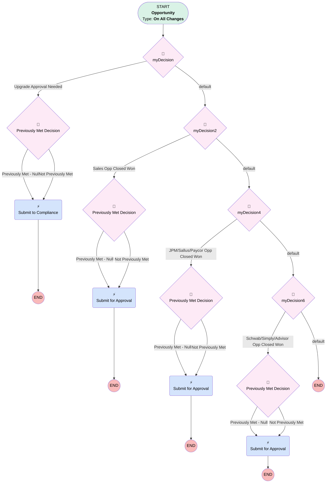

# Sales | Closure Approval Process Automation

## Flow Diagram [(_View History_)](Sales_Closure_Approval_Process_Automation-history.md)

<!-- Flow description -->

## General Information

|<!-- -->|<!-- -->|
|:---|:---|
|Process Type| Workflow|
|Label|Sales | Closure Approval Process Automation|
|Status|Obsolete|
|Description|Used to Automatically enter Opp into Approval Process|
|Interview Label|Sales_Closure_Approval_Process_Automation-14_InterviewLabel|
|Start Element Reference|[myDecision](#mydecision)|
| Object Type (PM)|Opportunity|
| Object Variable (PM)|myVariable_current|
| Old Object Variable (PM)|myVariable_old|
| Trigger Type (PM)|onAllChanges|

## Variables

|Name|Data Type|Is Collection|Is Input|Is Output|Object Type|Description|
|:-- |:--:|:--:|:--:|:--:|:--:|:--  |
|myVariable_current|SObject|⬜|✅|✅|Opportunity|<!-- -->|
|myVariable_old|SObject|⬜|✅|⬜|Opportunity|<!-- -->|

## Flow Nodes Details

### myRule_1_A1

|<!-- -->|<!-- -->|
|:---|:---|
|Type|Action Call|
|Label|Submit to Compliance|
|Action Type|Submit|
|Action Name|submit|
|Flow Transaction Model|CurrentTransaction|
|Name Segment|submit|
|Process Selection (PM)|Compliance Upgrade/Downgrade Approval - Compliance_Upgrade_Downgrade_Approval|
|Selection Type (PM)|selectedProcess|
|Submitter Type (PM)|reference|
|Object Id (input)|myVariable_current.Id|
|Comment (input)|<!-- -->|
|Process Definition Name Or Id (input)|Compliance_Upgrade_Downgrade_Approval|
|Skip Entry Criteria (input)|⬜|
|Submitter Id (input)|myVariable_current.Owner.Id|

### myRule_3_A1

|<!-- -->|<!-- -->|
|:---|:---|
|Type|Action Call|
|Label|Submit for Approval|
|Action Type|Submit|
|Action Name|submit|
|Flow Transaction Model|CurrentTransaction|
|Name Segment|submit|
|Process Selection (PM)|Opportunity Close Approval - Opportunity_Close_Approval|
|Selection Type (PM)|selectedProcess|
|Submitter Type (PM)|reference|
|Object Id (input)|myVariable_current.Id|
|Comment (input)|<!-- -->|
|Process Definition Name Or Id (input)|Opportunity_Close_Approval|
|Skip Entry Criteria (input)|⬜|
|Submitter Id (input)|myVariable_current.Owner.Id|

### myRule_5_A1

|<!-- -->|<!-- -->|
|:---|:---|
|Type|Action Call|
|Label|Submit for Approval|
|Action Type|Submit|
|Action Name|submit|
|Flow Transaction Model|CurrentTransaction|
|Name Segment|submit|
|Process Selection (PM)|JPM/Sallus/PC Opportunity Close Approval - JPM_Opportunity_Close_Approval|
|Selection Type (PM)|selectedProcess|
|Submitter Type (PM)|reference|
|Object Id (input)|myVariable_current.Id|
|Comment (input)|<!-- -->|
|Process Definition Name Or Id (input)|JPM_Opportunity_Close_Approval|
|Skip Entry Criteria (input)|⬜|
|Submitter Id (input)|myVariable_current.Owner.Id|

### myRule_7_A1

|<!-- -->|<!-- -->|
|:---|:---|
|Type|Action Call|
|Label|Submit for Approval|
|Action Type|Submit|
|Action Name|submit|
|Flow Transaction Model|CurrentTransaction|
|Name Segment|submit|
|Process Selection (PM)|Schwab/Simply/Advisor Opp Close Approval - Schwab_Simply_Opportunity_Close_Approval|
|Selection Type (PM)|selectedProcess|
|Submitter Type (PM)|reference|
|Object Id (input)|myVariable_current.Id|
|Comment (input)|<!-- -->|
|Process Definition Name Or Id (input)|Schwab_Simply_Opportunity_Close_Approval|
|Skip Entry Criteria (input)|⬜|
|Submitter Id (input)|myVariable_current.Owner.Id|

### myDecision

|<!-- -->|<!-- -->|
|:---|:---|
|Type|Decision|
|Label|[myDecision](#mydecision)|
|Default Connector|[myDecision2](#mydecision2)|
|Default Connector Label|default|
|Index (PM)|numberValue: 0 |

#### Rule myRule_1 (Upgrade Approval Needed)

|<!-- -->|<!-- -->|
|:---|:---|
|Connector|[myRule_1_pmetdec](#myrule_1_pmetdec)|
|Condition Logic|and|

|Condition Id|Left Value Reference|Operator|Right Value|
|:-- |:-- |:--:|:--: |
|1|myVariable_current.StageName| Equal To|Verbal Commitment|
|2|myVariable_current.Type| Equal To|Upgrade|

### myDecision2

|<!-- -->|<!-- -->|
|:---|:---|
|Type|Decision|
|Label|[myDecision2](#mydecision2)|
|Default Connector|[myDecision4](#mydecision4)|
|Default Connector Label|default|
|Index (PM)|1|

#### Rule myRule_3 (Sales Opp Closed Won)

|<!-- -->|<!-- -->|
|:---|:---|
|Connector|[myRule_3_pmetdec](#myrule_3_pmetdec)|
|Condition Logic|and|

|Condition Id|Left Value Reference|Operator|Right Value|
|:-- |:-- |:--:|:--: |
|1|myVariable_current.StageName| Equal To|Closed Won|
|2|myVariable_current.RecordTypeId| Not Equal To|01237000000RiRo|
|3|myVariable_current.Owner.Team__c| Equal To|Sales|
|4|myVariable_current.LeadSourceDetail__c| Not Equal To|JPM|
|5|myVariable_current.LeadSourceDetail__c| Not Equal To|Schwab|
|6|myVariable_current.LeadSourceDetail__c| Not Equal To|Schwab-CC|
|7|myVariable_current.LeadSourceDetail__c| Not Equal To|Simply Direct|
|8|myVariable_current.LeadSourceDetail__c| Not Equal To|Simply Advisor|
|9|myVariable_current.LeadSource| Not Equal To|Advisor|
|10|myVariable_current.LeadSourceDetail__c| Not Equal To|Sallus|
|11|myVariable_current.LeadSourceDetail__c| Not Equal To|Simply TPA|

### myDecision4

|<!-- -->|<!-- -->|
|:---|:---|
|Type|Decision|
|Label|[myDecision4](#mydecision4)|
|Default Connector|[myDecision6](#mydecision6)|
|Default Connector Label|default|
|Index (PM)|2|

#### Rule myRule_5 (JPM/Sallus/Paycor Opp Closed Won)

|<!-- -->|<!-- -->|
|:---|:---|
|Connector|[myRule_5_pmetdec](#myrule_5_pmetdec)|
|Condition Logic|1 and 2 and 3 and (4 or 5 or 6)|

|Condition Id|Left Value Reference|Operator|Right Value|
|:-- |:-- |:--:|:--: |
|1|myVariable_current.StageName| Equal To|Closed Won|
|2|myVariable_current.RecordTypeId| Not Equal To|01237000000RiRo|
|3|myVariable_current.Owner.Team__c| Equal To|Sales|
|4|myVariable_current.LeadSourceDetail__c| Equal To|JPM|
|5|myVariable_current.LeadSourceDetail__c| Equal To|Sallus|
|6|myVariable_current.LeadSourceDetail__c| Equal To|Paycor|

### myDecision6

|<!-- -->|<!-- -->|
|:---|:---|
|Type|Decision|
|Label|[myDecision6](#mydecision6)|
|Default Connector Label|default|
|Index (PM)|3|

#### Rule myRule_7 (Schwab/Simply/Advisor Opp Closed Won)

|<!-- -->|<!-- -->|
|:---|:---|
|Connector|[myRule_7_pmetdec](#myrule_7_pmetdec)|
|Condition Logic|1 AND (2 OR 3 OR 4 OR 5 OR 8 OR 9) AND 6 AND 7|

|Condition Id|Left Value Reference|Operator|Right Value|
|:-- |:-- |:--:|:--: |
|1|myVariable_current.RecordTypeId| Not Equal To|01237000000RiRo|
|2|myVariable_current.LeadSourceDetail__c| Equal To|Schwab|
|3|myVariable_current.LeadSourceDetail__c| Equal To|Schwab-CC|
|4|myVariable_current.LeadSourceDetail__c| Contains|Simply Direct|
|5|myVariable_current.LeadSourceDetail__c| Equal To|Simply Advisor|
|6|myVariable_current.Owner.Team__c| Equal To|Sales|
|7|myVariable_current.StageName| Equal To|Closed Won|
|8|myVariable_current.LeadSource| Contains|Advisor|
|9|myVariable_current.LeadSourceDetail__c| Equal To|Simply TPA|

### myRule_1_pmetdec

|<!-- -->|<!-- -->|
|:---|:---|
|Type|Decision|
|Label|Previously Met Decision|
|Default Connector|[myRule_1_A1](#myrule_1_a1)|
|Default Connector Label|Not Previously Met|

#### Rule myRule_1_pmetnullrule (Previously Met - Null)

|<!-- -->|<!-- -->|
|:---|:---|
|Connector|[myRule_1_A1](#myrule_1_a1)|
|Condition Logic|or|

|Condition Id|Left Value Reference|Operator|Right Value|
|:-- |:-- |:--:|:--: |
|1|myVariable_old| Is Null|✅|

#### Rule myRule_1_pmetrule (Previously Met - Prev)

|<!-- -->|<!-- -->|
|:---|:---|
|Condition Logic|and|

|Condition Id|Left Value Reference|Operator|Right Value|
|:-- |:-- |:--:|:--: |
|1|myVariable_old.StageName| Equal To|Verbal Commitment|
|2|myVariable_old.Type| Equal To|Upgrade|

### myRule_3_pmetdec

|<!-- -->|<!-- -->|
|:---|:---|
|Type|Decision|
|Label|Previously Met Decision|
|Default Connector|[myRule_3_A1](#myrule_3_a1)|
|Default Connector Label|Not Previously Met|

#### Rule myRule_3_pmetnullrule (Previously Met - Null)

|<!-- -->|<!-- -->|
|:---|:---|
|Connector|[myRule_3_A1](#myrule_3_a1)|
|Condition Logic|or|

|Condition Id|Left Value Reference|Operator|Right Value|
|:-- |:-- |:--:|:--: |
|1|myVariable_old| Is Null|✅|

#### Rule myRule_3_pmetrule (Previously Met - Prev)

|<!-- -->|<!-- -->|
|:---|:---|
|Condition Logic|and|

|Condition Id|Left Value Reference|Operator|Right Value|
|:-- |:-- |:--:|:--: |
|1|myVariable_old.StageName| Equal To|Closed Won|
|2|myVariable_old.RecordTypeId| Not Equal To|01237000000RiRo|
|3|myVariable_old.Owner.Team__c| Equal To|Sales|
|4|myVariable_old.LeadSourceDetail__c| Not Equal To|JPM|
|5|myVariable_old.LeadSourceDetail__c| Not Equal To|Schwab|
|6|myVariable_old.LeadSourceDetail__c| Not Equal To|Schwab-CC|
|7|myVariable_old.LeadSourceDetail__c| Not Equal To|Simply Direct|
|8|myVariable_old.LeadSourceDetail__c| Not Equal To|Simply Advisor|
|9|myVariable_old.LeadSource| Not Equal To|Advisor|
|10|myVariable_old.LeadSourceDetail__c| Not Equal To|Sallus|
|11|myVariable_old.LeadSourceDetail__c| Not Equal To|Simply TPA|

### myRule_5_pmetdec

|<!-- -->|<!-- -->|
|:---|:---|
|Type|Decision|
|Label|Previously Met Decision|
|Default Connector|[myRule_5_A1](#myrule_5_a1)|
|Default Connector Label|Not Previously Met|

#### Rule myRule_5_pmetnullrule (Previously Met - Null)

|<!-- -->|<!-- -->|
|:---|:---|
|Connector|[myRule_5_A1](#myrule_5_a1)|
|Condition Logic|or|

|Condition Id|Left Value Reference|Operator|Right Value|
|:-- |:-- |:--:|:--: |
|1|myVariable_old| Is Null|✅|

#### Rule myRule_5_pmetrule (Previously Met - Prev)

|<!-- -->|<!-- -->|
|:---|:---|
|Condition Logic|1 and 2 and 3 and (4 or 5 or 6)|

|Condition Id|Left Value Reference|Operator|Right Value|
|:-- |:-- |:--:|:--: |
|1|myVariable_old.StageName| Equal To|Closed Won|
|2|myVariable_old.RecordTypeId| Not Equal To|01237000000RiRo|
|3|myVariable_old.Owner.Team__c| Equal To|Sales|
|4|myVariable_old.LeadSourceDetail__c| Equal To|JPM|
|5|myVariable_old.LeadSourceDetail__c| Equal To|Sallus|
|6|myVariable_old.LeadSourceDetail__c| Equal To|Paycor|

### myRule_7_pmetdec

|<!-- -->|<!-- -->|
|:---|:---|
|Type|Decision|
|Label|Previously Met Decision|
|Default Connector|[myRule_7_A1](#myrule_7_a1)|
|Default Connector Label|Not Previously Met|

#### Rule myRule_7_pmetnullrule (Previously Met - Null)

|<!-- -->|<!-- -->|
|:---|:---|
|Connector|[myRule_7_A1](#myrule_7_a1)|
|Condition Logic|or|

|Condition Id|Left Value Reference|Operator|Right Value|
|:-- |:-- |:--:|:--: |
|1|myVariable_old| Is Null|✅|

#### Rule myRule_7_pmetrule (Previously Met - Prev)

|<!-- -->|<!-- -->|
|:---|:---|
|Condition Logic|1 AND (2 OR 3 OR 4 OR 5 OR 8 OR 9) AND 6 AND 7|

|Condition Id|Left Value Reference|Operator|Right Value|
|:-- |:-- |:--:|:--: |
|1|myVariable_old.RecordTypeId| Not Equal To|01237000000RiRo|
|2|myVariable_old.LeadSourceDetail__c| Equal To|Schwab|
|3|myVariable_old.LeadSourceDetail__c| Equal To|Schwab-CC|
|4|myVariable_old.LeadSourceDetail__c| Contains|Simply Direct|
|5|myVariable_old.LeadSourceDetail__c| Equal To|Simply Advisor|
|6|myVariable_old.Owner.Team__c| Equal To|Sales|
|7|myVariable_old.StageName| Equal To|Closed Won|
|8|myVariable_old.LeadSource| Contains|Advisor|
|9|myVariable_old.LeadSourceDetail__c| Equal To|Simply TPA|

___

_Documentation generated from branch monitoring_myubiquity by [sfdx-hardis](https://sfdx-hardis.cloudity.com), featuring [salesforce-flow-visualiser](https://github.com/toddhalfpenny/salesforce-flow-visualiser)_