# Send Better Email Testflow

## Flow Diagram [(_View History_)](Send_Better_Email_Testflow-history.md)

```mermaid
%% If you read this, your Markdown visualizer does not handle MermaidJS syntax.
%% - If you are in VS Code, install extension `Markdown Preview Mermaid Support` at https://marketplace.visualstudio.com/items?itemName=bierner.markdown-mermaid
%% - If you are using sfdx-hardis, try to define env variable `MERMAID_MODES=cli,docker` ,then run again the command to regenerate markdown with SVG images.
%% - If you are within mkdocs-material, define mermaid plugin in `mkdocs.yml` as described in https://squidfunk.github.io/mkdocs-material/extensions/mermaid/
%% - As a last resort, you can copy-paste this MermaidJS code into https://mermaid.live/ to see the flow diagram

flowchart TB
START(["START<br/><b>Screen Flow</b>"]):::startClass
click START "#general-information" "345845728"

Bulk_Request_Setup("⚙️ <em></em><br/>Test Request Setup for Bulk"):::actionCalls
click Bulk_Request_Setup "#bulk_request_setup" "3570224187"

X1_Simplest_Better_Email("⚙️ <em></em><br/>1. Simplest Better Email"):::actionCalls
click X1_Simplest_Better_Email "#x1_simplest_better_email" "3106097091"

X2_Simple_Email_with_Address_Collections_Wit_Collections("⚙️ <em></em><br/>2. Simple Email with Address Collections - With Address Collections"):::actionCalls
click X2_Simple_Email_with_Address_Collections_Wit_Collections "#x2_simple_email_with_address_collections_wit_collections" "656601421"

X3_Email_with_Attachments("⚙️ <em></em><br/>3. Email with Attachments"):::actionCalls
click X3_Email_with_Attachments "#x3_email_with_attachments" "3349612501"

X4_Email_Using_Template_Action("⚙️ <em></em><br/>4. Email Using Template Action"):::actionCalls
click X4_Email_Using_Template_Action "#x4_email_using_template_action" "1965426675"

X5_Multi_Lingual_Using_Email_Templates_Action("⚙️ <em></em><br/>5. Multi-Lingual Using Email Templates"):::actionCalls
click X5_Multi_Lingual_Using_Email_Templates_Action "#x5_multi_lingual_using_email_templates_action" "1369404335"

X6_Send_Better_Email_Mass("⚙️ <em></em><br/>6. Send Better Email - Mass"):::actionCalls
click X6_Send_Better_Email_Mass "#x6_send_better_email_mass" "2916322240"

X7_BulkSendBetterEmail_Action("⚙️ <em></em><br/>7. SendBetterEmail Bulk"):::actionCalls
click X7_BulkSendBetterEmail_Action "#x7_bulksendbetteremail_action" "2944659389"

X8_Email_Using_Template_Action("⚙️ <em></em><br/>8. Email Using Template, Recipient, Target, WhatId"):::actionCalls
click X8_Email_Using_Template_Action "#x8_email_using_template_action" "3735588984"

Add_All_Attached_Files[\"🟰 <em></em><br/>Add All Attached Files"/]:::assignments
click Add_All_Attached_Files "#add_all_attached_files" "722725029"

Add_CDL_in_Filtered_List[\"🟰 <em></em><br/>Add CDL in Filtered List"/]:::assignments
click Add_CDL_in_Filtered_List "#add_cdl_in_filtered_list" "927671695"

Add_MessageId_to_Collection[\"🟰 <em></em><br/>Add MessageId to Collection"/]:::assignments
click Add_MessageId_to_Collection "#add_messageid_to_collection" "3812528996"

Assign_User_ID_for_TargetIds[\"🟰 <em></em><br/>Assign User ID for TargetIds"/]:::assignments
click Assign_User_ID_for_TargetIds "#assign_user_id_for_targetids" "1741928920"

Bulk_Add_To_List_of_Requests[\"🟰 <em></em><br/>Add To List of Requests"/]:::assignments
click Bulk_Add_To_List_of_Requests "#bulk_add_to_list_of_requests" "510083986"

Email_1_to_Collection[\"🟰 <em></em><br/>Email 1 to Collection"/]:::assignments
click Email_1_to_Collection "#email_1_to_collection" "936747006"

Email_2_to_Collection[\"🟰 <em></em><br/>Email 2 to Collection"/]:::assignments
click Email_2_to_Collection "#email_2_to_collection" "3514791663"

X1_Assignments[\"🟰 <em></em><br/>X1_Assignments"/]:::assignments
click X1_Assignments "#x1_assignments" "2431098758"

X2_Assignments[\"🟰 <em></em><br/>X2_Assignments"/]:::assignments
click X2_Assignments "#x2_assignments" "3054539715"

X3_Assignments[\"🟰 <em></em><br/>X3_Assignments"/]:::assignments
click X3_Assignments "#x3_assignments" "1590499905"

X4_Assign_from_Screen[\"🟰 <em></em><br/>4. Assign from Screen"/]:::assignments
click X4_Assign_from_Screen "#x4_assign_from_screen" "1621741596"

X4_Assign_Template[\"🟰 <em></em><br/>4. Assign Template"/]:::assignments
click X4_Assign_Template "#x4_assign_template" "1100790371"

X5_Assign_from_Screen[\"🟰 <em></em><br/>5. Assign from Screen"/]:::assignments
click X5_Assign_from_Screen "#x5_assign_from_screen" "2274621409"

X6_Assign_from_Screen[\"🟰 <em></em><br/>6. Assign from Screen"/]:::assignments
click X6_Assign_from_Screen "#x6_assign_from_screen" "3421658818"

X7_Bulk_Set_Up_Text_Subjects[\"🟰 <em></em><br/>7. Set Up Text Subjects"/]:::assignments
click X7_Bulk_Set_Up_Text_Subjects "#x7_bulk_set_up_text_subjects" "1072468985"

X8_Assign_from_Screen[\"🟰 <em></em><br/>8. Assign from Screen"/]:::assignments
click X8_Assign_from_Screen "#x8_assign_from_screen" "1993056474"

X8_Assign_Template[\"🟰 <em></em><br/>8. Assign Template"/]:::assignments
click X8_Assign_Template "#x8_assign_template" "1098316989"

Any_Files_Uploaded{"🔀 <em></em><br/>Any Files Uploaded?"}:::decisions
click Any_Files_Uploaded "#any_files_uploaded" "837092247"

CDL_In_Just_Uploaded_Files{"🔀 <em></em><br/>CDL In Just Uploaded Files"}:::decisions
click CDL_In_Just_Uploaded_Files "#cdl_in_just_uploaded_files" "909119558"

Email_Addr_1{"🔀 <em></em><br/>Email Addr 1"}:::decisions
click Email_Addr_1 "#email_addr_1" "3188321070"

Email_Addr_2{"🔀 <em></em><br/>Email Addr 2"}:::decisions
click Email_Addr_2 "#email_addr_2" "3970257253"

InReplyTo{"🔀 <em></em><br/>InReplyTo MessageId Given?"}:::decisions
click InReplyTo "#inreplyto" "2022729545"

Which_Choice{"🔀 <em></em><br/>Which Choice"}:::decisions
click Which_Choice "#which_choice" "2575471652"

X4_TemplateID_Identified{"🔀 <em></em><br/>4. TemplateID Provided"}:::decisions
click X4_TemplateID_Identified "#x4_templateid_identified" "1003125643"

X8_TemplateID_Identified{"🔀 <em></em><br/>8. TemplateID Provided"}:::decisions
click X8_TemplateID_Identified "#x8_templateid_identified" "1918887324"

All_CDL{{"🔁 <em></em><br/>All CDL"}}:::loops
click All_CDL "#all_cdl" "1387730424"

All_Uploaded_CD_Ids{{"🔁 <em></em><br/>All Uploaded CD Ids"}}:::loops
click All_Uploaded_CD_Ids "#all_uploaded_cd_ids" "745145086"

Bulk_Set_up_Test_Requests{{"🔁 <em></em><br/>7. Set up Test Requests"}}:::loops
click Bulk_Set_up_Test_Requests "#bulk_set_up_test_requests" "718015198"

Get_Contacts[("🔍 <em></em><br/>Get Contacts")]:::recordLookups
click Get_Contacts "#get_contacts" "1923652379"

Get_Content_Document_Links[("🔍 <em></em><br/>Get Content Document Links")]:::recordLookups
click Get_Content_Document_Links "#get_content_document_links" "1735020399"

Get_Users[("🔍 <em></em><br/>Get Users")]:::recordLookups
click Get_Users "#get_users" "2164067416"

X4_Get_Id_From_TemplateName[("🔍 <em></em><br/>4. Get Id From TemplateName")]:::recordLookups
click X4_Get_Id_From_TemplateName "#x4_get_id_from_templatename" "1748039556"

X8_Get_Id_From_TemplateName[("🔍 <em></em><br/>8. Get Id From TemplateName")]:::recordLookups
click X8_Get_Id_From_TemplateName "#x8_get_id_from_templatename" "1839073525"

Choose_Example_Screen(["💻 <em></em><br/>Choose Example"]):::screens
click Choose_Example_Screen "#choose_example_screen" "407471226"

File_Upload_to_Attach(["💻 <em></em><br/>Upload Files to Attach"]):::screens
click File_Upload_to_Attach "#file_upload_to_attach" "1545696063"

Get_Simple_Email_Fields_Attachments(["💻 <em></em><br/>3. Get Simple Email Fields For Attachments"]):::screens
click Get_Simple_Email_Fields_Attachments "#get_simple_email_fields_attachments" "2143861622"

ScreenConsole1(["💻 <em></em><br/>ScreenConsole1"]):::screens
click ScreenConsole1 "#screenconsole1" "3061923795"

X1_Get_Simple_Email_Fields(["💻 <em></em><br/>1. Get Simple Email Fields"]):::screens
click X1_Get_Simple_Email_Fields "#x1_get_simple_email_fields" "1548279603"

X2_Get_Simple_Email_Fields_Collections(["💻 <em></em><br/>2. Get Simple Email Fields & Collections"]):::screens
click X2_Get_Simple_Email_Fields_Collections "#x2_get_simple_email_fields_collections" "522567247"

X4_Email_Using_Template(["💻 <em></em><br/>4. Email Using Template"]):::screens
click X4_Email_Using_Template "#x4_email_using_template" "3322470307"

X5_Multi_Lingual_Using_Email_Templates(["💻 <em></em><br/>5. Multi-Lingual Using Email Templates"]):::screens
click X5_Multi_Lingual_Using_Email_Templates "#x5_multi_lingual_using_email_templates" "101205153"

X6_Mass_Email(["💻 <em></em><br/>6. Mass Email Test Flow"]):::screens
click X6_Mass_Email "#x6_mass_email" "1266355805"

X7_Bulk_email_using_request_collection(["💻 <em></em><br/>7. Bulk email using request collection"]):::screens
click X7_Bulk_email_using_request_collection "#x7_bulk_email_using_request_collection" "2110912085"

X8_Email_Using_Template(["💻 <em></em><br/>8. Email Using Template (Recipient and Target)"]):::screens
click X8_Email_Using_Template "#x8_email_using_template" "481505906"

X4_Create_Test_Templates_if_Needed[["🔗 <em>Subflow</em><br/>4. Create Test Templates if Needed"]]:::subflows
click X4_Create_Test_Templates_if_Needed "#x4_create_test_templates_if_needed" "3922282197"

X5_Create_Test_Templates_if_Needed[["🔗 <em>Subflow</em><br/>5. Create Test Templates if Needed"]]:::subflows
click X5_Create_Test_Templates_if_Needed "#x5_create_test_templates_if_needed" "421404558"

X6_Create_Mass_Email_Test_Templates_If_Needed[["🔗 <em>Subflow</em><br/>6. Create Mass Email Test Templates If Needed"]]:::subflows
click X6_Create_Mass_Email_Test_Templates_If_Needed "#x6_create_mass_email_test_templates_if_needed" "3479110287"

X8_Create_Test_Templates_if_Needed[["🔗 <em>Subflow</em><br/>8. Create Test Templates if Needed"]]:::subflows
click X8_Create_Test_Templates_if_Needed "#x8_create_test_templates_if_needed" "815495330"

Bulk_Request_Setup --> Bulk_Add_To_List_of_Requests
X1_Simplest_Better_Email --> ScreenConsole1
X2_Simple_Email_with_Address_Collections_Wit_Collections --> ScreenConsole1
X3_Email_with_Attachments --> ScreenConsole1
X4_Email_Using_Template_Action --> ScreenConsole1
X5_Multi_Lingual_Using_Email_Templates_Action --> ScreenConsole1
X6_Send_Better_Email_Mass --> ScreenConsole1
X7_BulkSendBetterEmail_Action --> ScreenConsole1
X8_Email_Using_Template_Action --> ScreenConsole1
Add_All_Attached_Files --> X3_Email_with_Attachments
Add_CDL_in_Filtered_List --> All_Uploaded_CD_Ids
Add_MessageId_to_Collection --> X8_Email_Using_Template_Action
Assign_User_ID_for_TargetIds --> X6_Send_Better_Email_Mass
Bulk_Add_To_List_of_Requests --> Bulk_Set_up_Test_Requests
Email_1_to_Collection --> Email_Addr_2
Email_2_to_Collection --> Get_Users
X1_Assignments --> X1_Simplest_Better_Email
X2_Assignments --> Email_Addr_1
X3_Assignments --> File_Upload_to_Attach
X4_Assign_from_Screen --> X4_Email_Using_Template_Action
X4_Assign_Template --> X4_Assign_from_Screen
X5_Assign_from_Screen --> X5_Create_Test_Templates_if_Needed
X6_Assign_from_Screen --> X6_Create_Mass_Email_Test_Templates_If_Needed
X7_Bulk_Set_Up_Text_Subjects --> Bulk_Set_up_Test_Requests
X8_Assign_from_Screen --> InReplyTo
X8_Assign_Template --> X8_Assign_from_Screen
Any_Files_Uploaded --> |"Yes"| X3_Email_with_Attachments
Any_Files_Uploaded --> |"No"| Add_All_Attached_Files
CDL_In_Just_Uploaded_Files --> |"Yes"| Add_CDL_in_Filtered_List
CDL_In_Just_Uploaded_Files --> |"No"| All_Uploaded_CD_Ids
Email_Addr_1 --> |"No Email 1?"| Email_Addr_2
Email_Addr_1 --> |"Email 1"| Email_1_to_Collection
Email_Addr_2 --> |"No Email 2?"| Get_Users
Email_Addr_2 --> |"Email 2"| Email_2_to_Collection
InReplyTo --> |"Yes"| Add_MessageId_to_Collection
InReplyTo --> |"No InReplyTo"| X8_Email_Using_Template_Action
Which_Choice --> |"1 Simple Email"| X1_Get_Simple_Email_Fields
Which_Choice --> |"2. Simple Email with Address Collection"| X2_Get_Simple_Email_Fields_Collections
Which_Choice --> |"3. Email with Attachments"| Get_Simple_Email_Fields_Attachments
Which_Choice --> |"4. Email Using Template"| X4_Email_Using_Template
Which_Choice --> |"5. Multi-Lingual Using Email Templates"| X5_Multi_Lingual_Using_Email_Templates
Which_Choice --> |"6. Mass Email"| X6_Mass_Email
Which_Choice --> |"7, Bulk Email - Send bulk email using request collections"| X7_Bulk_email_using_request_collection
Which_Choice --> |"8. Email Template Target Not Recipient"| X8_Email_Using_Template
Which_Choice --> |"Default Outcome"| END_Which_Choice
X4_TemplateID_Identified --> |"Yes"| X4_Assign_Template
X4_TemplateID_Identified --> |"Check to Add"| X4_Create_Test_Templates_if_Needed
X8_TemplateID_Identified --> |"Yes"| X8_Assign_Template
X8_TemplateID_Identified --> |"Check to Add"| X8_Create_Test_Templates_if_Needed
All_CDL --> |"For Each"|All_Uploaded_CD_Ids
All_CDL ---> |"After Last"|Any_Files_Uploaded
All_Uploaded_CD_Ids --> |"For Each"|CDL_In_Just_Uploaded_Files
All_Uploaded_CD_Ids ---> |"After Last"|All_CDL
Bulk_Set_up_Test_Requests --> |"For Each"|Bulk_Request_Setup
Bulk_Set_up_Test_Requests ---> |"After Last"|X7_BulkSendBetterEmail_Action
Get_Contacts --> X2_Simple_Email_with_Address_Collections_Wit_Collections
Get_Contacts -. Fault .->X2_Simple_Email_with_Address_Collections_Wit_Collections
Get_Content_Document_Links --> All_CDL
Get_Users --> Get_Contacts
Get_Users -. Fault .->Get_Contacts
X4_Get_Id_From_TemplateName --> X4_Assign_from_Screen
X8_Get_Id_From_TemplateName --> X8_Assign_from_Screen
Choose_Example_Screen --> Which_Choice
File_Upload_to_Attach --> Get_Content_Document_Links
Get_Simple_Email_Fields_Attachments --> X3_Assignments
ScreenConsole1 --> END_ScreenConsole1
X1_Get_Simple_Email_Fields --> X1_Assignments
X2_Get_Simple_Email_Fields_Collections --> X2_Assignments
X4_Email_Using_Template --> X4_TemplateID_Identified
X5_Multi_Lingual_Using_Email_Templates --> X5_Assign_from_Screen
X6_Mass_Email --> X6_Assign_from_Screen
X7_Bulk_email_using_request_collection --> X7_Bulk_Set_Up_Text_Subjects
X8_Email_Using_Template --> X8_TemplateID_Identified
START -->  Choose_Example_Screen
X4_Create_Test_Templates_if_Needed --> X4_Get_Id_From_TemplateName
X5_Create_Test_Templates_if_Needed --> X5_Multi_Lingual_Using_Email_Templates_Action
X6_Create_Mass_Email_Test_Templates_If_Needed --> Assign_User_ID_for_TargetIds
X8_Create_Test_Templates_if_Needed --> X8_Get_Id_From_TemplateName
END_Which_Choice(( END )):::endClass
END_ScreenConsole1(( END )):::endClass


classDef actionCalls fill:#D4E4FC,color:black,text-decoration:none,max-height:100px
classDef assignments fill:#FBEED7,color:black,text-decoration:none,max-height:100px
classDef collectionProcessors fill:#F0E3FA,color:black,text-decoration:none,max-height:100px
classDef customErrors fill:#FFE9E9,color:black,text-decoration:none,max-height:100px
classDef decisions fill:#FDEAF6,color:black,text-decoration:none,max-height:100px
classDef loops fill:#FDEAF6,color:black,text-decoration:none,max-height:100px
classDef recordCreates fill:#FFF8C9,color:black,text-decoration:none,max-height:100px
classDef recordDeletes fill:#FFF8C9,color:black,text-decoration:none,max-height:100px
classDef recordLookups fill:#EDEAFF,color:black,text-decoration:none,max-height:100px
classDef recordUpdates fill:#FFF8C9,color:black,text-decoration:none,max-height:100px
classDef screens fill:#DFF6FF,color:black,text-decoration:none,max-height:100px
classDef subflows fill:#D4E4FC,color:black,text-decoration:none,max-height:100px
classDef startClass fill:#D9F2E6,color:black,text-decoration:none,max-height:100px
classDef endClass fill:#F9BABA,color:black,text-decoration:none,max-height:100px
classDef transforms fill:#FDEAF6,color:black,text-decoration:none,max-height:100px


```

<!-- Flow description -->

## General Information

|<!-- -->|<!-- -->|
|:---|:---|
|Process Type| Flow|
|Label|Send Better Email Testflow|
|Status|⚠️ Draft|
|Description|A series of 5 examples for testing and demonstrating Send Better Email Action Component|
|Interview Label|Send Better Email Testflow {!$Flow.CurrentDateTime}|
| Builder Type (PM)|LightningFlowBuilder|
| Canvas Mode (PM)|FREE_FORM_CANVAS|
| Origin Builder Type (PM)|LightningFlowBuilder|
|Connector|[Choose_Example_Screen](#choose_example_screen)|
|Next Node|[Choose_Example_Screen](#choose_example_screen)|

## Variables

|Name|Data Type|Is Collection|Is Input|Is Output|Object Type|Description|
|:-- |:--:|:--:|:--:|:--:|:--:|:--  |
|bulk_counter|Number|⬜|⬜|⬜|<!-- -->|Counter for number of bulk items in loop|
|bulkSendBetterEmailRequest|Apex|✅|⬜|⬜|<!-- -->|<!-- -->|
|bulkSubjectNames|String|✅|⬜|⬜|<!-- -->|A collection of subject names for bulkification testing|
|bulkThisSendBetterEmailRequest|Apex|✅|⬜|⬜|<!-- -->|<!-- -->|
|bulkThisSubject|String|⬜|⬜|⬜|<!-- -->|<!-- -->|
|bulkThisSubjectLine|String|⬜|⬜|⬜|<!-- -->|<!-- -->|
|cd_counter|Number|⬜|⬜|✅|<!-- -->|<!-- -->|
|content_document_ids|String|✅|⬜|✅|<!-- -->|<!-- -->|
|cur_cd_id|String|⬜|⬜|✅|<!-- -->|<!-- -->|
|cur_cdl|SObject|⬜|⬜|✅|ContentDocumentLink|<!-- -->|
|curAttachments|SObject|✅|⬜|⬜|Attachment|<!-- -->|
|curContacts|SObject|✅|⬜|⬜|Contact|<!-- -->|
|curLeads|SObject|✅|✅|⬜|Lead|<!-- -->|
|curUsers|SObject|✅|⬜|⬜|User|<!-- -->|
|errorsFromEmail|String|⬜|⬜|⬜|<!-- -->|<!-- -->|
|filtered_cdls|SObject|✅|⬜|✅|ContentDocumentLink|<!-- -->|
|isSuccess|Boolean|⬜|⬜|⬜|<!-- -->|<!-- -->|
|ListOfInReplyToEmailMessageIds|String|✅|⬜|⬜|<!-- -->|List of MessageIds of existing email if this is InReplyTo|
|massEmailUserCollection|SObject|✅|⬜|⬜|User|<!-- -->|
|recordId|String|⬜|✅|⬜|<!-- -->|<!-- -->|
|RelatedRecordType|String|⬜|⬜|⬜|<!-- -->|The related record (versus the TargetObject) which can be used for merge fields in the email templates. The value must be one of the following types: · Account · Asset · Campaign · Case · Contract · Opportunity · Order · Product · Solution · Custom|
|send_Email_To|String|⬜|⬜|⬜|<!-- -->|<!-- -->|
|sendSubject|String|⬜|⬜|⬜|<!-- -->|For adding sender name to emails|
|stringCollectionEmailAddresses|String|✅|✅|⬜|<!-- -->|<!-- -->|
|templateRecipientId|String|⬜|⬜|⬜|<!-- -->|<!-- -->|
|templateTargetId|String|⬜|⬜|⬜|<!-- -->|<!-- -->|
|templateWhatId|String|⬜|⬜|⬜|<!-- -->|used for testing email merges|
|testContactContains|String|⬜|⬜|⬜|<!-- -->|<!-- -->|
|testEmailAddress1|String|⬜|⬜|⬜|<!-- -->|A test email address for checking if an email is actually sent.|
|testEmailAddress2|String|⬜|⬜|⬜|<!-- -->|A second email address  for testing actual sends if desired|
|testMassEmailFinishedMessage|String|⬜|⬜|⬜|<!-- -->|The message sent to the originator when all emails have been attempted|
|testPlainTextBody|String|⬜|⬜|⬜|<!-- -->|<!-- -->|
|testReturnAddress|String|⬜|⬜|⬜|<!-- -->|A return address if an actual email is requested|
|testSenderName|String|⬜|⬜|⬜|<!-- -->|<!-- -->|
|testSubject|String|⬜|⬜|⬜|<!-- -->|<!-- -->|
|testTemplateId|String|⬜|⬜|⬜|<!-- -->|The template Id to be used in the action|
|testTemplateLanguage|String|⬜|⬜|⬜|<!-- -->|The specific language to send the email in|
|testTemplateName|String|⬜|⬜|⬜|<!-- -->|The name of the template from which to search for language|
|testUserContains|String|⬜|⬜|⬜|<!-- -->|For testing list/collection of recipients if the user name contains this value|
|UserListForMassMail|String|✅|⬜|⬜|<!-- -->|Create a user list for mass email|
|x1_HTML_Body|String|⬜|⬜|⬜|<!-- -->|Plain Text for Body 1|
|x2_HTML_Body|String|⬜|⬜|⬜|<!-- -->|Plain Text Body for example 2|

## Formulas

|Name|Data Type|Expression|Description|
|:-- |:--:|:-- |:--  |
|BulkSubject|String|{!testSubject} + ": Request #: " + text({!bulk_counter})|Create a unique bulk subject name for each request|
|TestFlowMassSubject|String|'Finished Mass Email Send: sendBetterEmail Test:  Flow Example  ' + text({!Choose_Example})|The subject for the mass email finished notification|
|TestFlowSubject|String|'sendBetterEmail Test:  Flow Example  ' + text({!Choose_Example})|Create a test flow subject for the appropriate flow|
|testPlainTextLineFeeds|String|'Plaintext Line 1'&BR()&'Plaintext Line 2'&BR()&'Plaintext Line 3'|Create a plaintext message with line feeds|
|UserIdRunningFlow|String|{!$User.Id}|The user ID of the user running the flow|

## Constants

|Name|Data Type|Value|Description|
|:-- |:--:|:--:|:--  |
|DefaultMassEmailTemplateName|String|sendMassBetterEmailTest|The Default Mass Email Template Name|
|DefaultRecipientEmailAddress1|String|john.doe@example.com.invalid|<!-- -->|
|DefaultRecipientEmailAddress2|String|jane.roe@example.com.invalid|<!-- -->|
|DefaultRecipientRecordType|String|Contact|The default Recipient Record Type for Recipient Addresses and Fields used in Template Merges|
|DefaultRelatedRecordType|String|Account|The default Related Record type for template related record field merges|
|DefaultReplyToEmail|String|DoNotReply@example.com.invalid|<!-- -->|
|DefaultSenderEmailAddress|String|donotreply@example.com.invalid|The default sender email address for test examples|
|DefaultSenderName|String|DoNotReply|Default sender name for examples|
|DefaultTemplateLanguage|String|es_MX|The default test Language for examples|
|DefaultTemplateName|String|sendBetterEmailTest|Default Name for Email Template|

## Text Templates

|Name|Text|Description|
|:-- |:-- |:--  |
|HTMLTextTemplate|
This is some body text created using the rich text editor in the <b>Text Template</b> resource in <u style="font-size: 22px;">Flow</u>.
|<!-- -->|
|plainTextBody|
This is some body text created using the rich text editor in the Text Template resource in Flow.

 

This email is being sent to this set of email addresses that came from a string collection:

{!stringCollectionEmailAddresses}
|<!-- -->|

## Flow Nodes Details

### Bulk_Request_Setup

|<!-- -->|<!-- -->|
|:---|:---|
|Type|Action Call|
|Label|Test Request Setup for Bulk|
|Action Type|Apex|
|Action Name|SendBetterEmailBulkRequestSetup|
|Flow Transaction Model|CurrentTransaction|
|Name Segment|SendBetterEmailBulkRequestSetup|
|Output Parameters|assignToReference: bulkThisSendBetterEmailRequest name: output |
| H T M Lbody (input)|x1_HTML_Body|
|Reply Email Address (input)|testReturnAddress|
|Sender Display Name (input)|testSenderName|
| Send T Othis One Email Address (input)|send_Email_To|
|Subject (input)|BulkSubject|
|Connector|[Bulk_Add_To_List_of_Requests](#bulk_add_to_list_of_requests)|

### X1_Simplest_Better_Email

|<!-- -->|<!-- -->|
|:---|:---|
|Type|Action Call|
|Label|1. Simplest Better Email|
|Action Type|Apex|
|Action Name|SendBetterEmail|
|Flow Transaction Model|CurrentTransaction|
|Name Segment|SendBetterEmail|
|Output Parameters|- assignToReference: errorsFromEmail &nbsp;&nbsp;name: errors - assignToReference: isSuccess &nbsp;&nbsp;name: isSuccess |
| H T M Lbody (input)|x1_HTML_Body|
|Reply Email Address (input)|testReturnAddress|
|Sender Display Name (input)|testSenderName|
| Send T Othis One Email Address (input)|send_Email_To|
|Subject (input)|sendSubject|
| Use Salesforce Signature (input)|⬜|
|Connector|[ScreenConsole1](#screenconsole1)|

### X2_Simple_Email_with_Address_Collections_Wit_Collections

|<!-- -->|<!-- -->|
|:---|:---|
|Type|Action Call|
|Label|2. Simple Email with Address Collections - With Address Collections|
|Action Type|Apex|
|Action Name|SendBetterEmail|
|Flow Transaction Model|CurrentTransaction|
|Name Segment|SendBetterEmail|
|Output Parameters|- assignToReference: errorsFromEmail &nbsp;&nbsp;name: errors - assignToReference: isSuccess &nbsp;&nbsp;name: isSuccess |
| H T M Lbody (input)|x2_HTML_Body|
|Reply Email Address (input)|testReturnAddress|
| Send B C Cthe Email Addresses From This Collection Of Users (input)|curUsers|
| Send C Cthe Email Addresses From This Collection Of Contacts (input)|curContacts|
|Sender Display Name (input)|testSenderName|
| Send T Othis String Collection Of Email Addresses (input)|stringCollectionEmailAddresses|
|Subject (input)|sendSubject|
|Connector|[ScreenConsole1](#screenconsole1)|

### X3_Email_with_Attachments

|<!-- -->|<!-- -->|
|:---|:---|
|Type|Action Call|
|Label|3. Email with Attachments|
|Action Type|Apex|
|Action Name|SendBetterEmail|
|Flow Transaction Model|CurrentTransaction|
|Name Segment|SendBetterEmail|
|Output Parameters|- assignToReference: errorsFromEmail &nbsp;&nbsp;name: errors - assignToReference: isSuccess &nbsp;&nbsp;name: isSuccess |
|Content Document Attachments (input)|filtered_cdls|
| H T M Lbody (input)|HTMLTextTemplate|
|Reply Email Address (input)|testReturnAddress|
|Save As Activity (input)|✅|
|Sender Display Name (input)|testSenderName|
| Send T Othis One Email Address (input)|send_Email_To|
|Subject (input)|sendSubject|
| Use Salesforce Signature (input)|⬜|
|Connector|[ScreenConsole1](#screenconsole1)|

### X4_Email_Using_Template_Action

|<!-- -->|<!-- -->|
|:---|:---|
|Type|Action Call|
|Label|4. Email Using Template Action|
|Action Type|Apex|
|Action Name|SendBetterEmail|
|Description|Email Using Template - An email using a Lightning EmailTemplate|
|Flow Transaction Model|CurrentTransaction|
|Name Segment|SendBetterEmail|
|Output Parameters|- assignToReference: errorsFromEmail &nbsp;&nbsp;name: errors - assignToReference: isSuccess &nbsp;&nbsp;name: isSuccess |
|Record Id (input)|templateWhatId|
|Reply Email Address (input)|testReturnAddress|
|Save As Activity (input)|✅|
|Save As Task (input)|✅|
|Sender Display Name (input)|testSenderName|
|Template Target Object Id (input)|templateTargetId|
|Template I D (input)|testTemplateId|
| Use Salesforce Signature (input)|⬜|
|Connector|[ScreenConsole1](#screenconsole1)|

### X5_Multi_Lingual_Using_Email_Templates_Action

|<!-- -->|<!-- -->|
|:---|:---|
|Type|Action Call|
|Label|5. Multi-Lingual Using Email Templates|
|Action Type|Apex|
|Action Name|SendBetterEmail|
|Description|Multi-Lingual Using Email Templates - An email using a Lightning EmailTemplate selected by language|
|Flow Transaction Model|CurrentTransaction|
|Name Segment|SendBetterEmail|
|Output Parameters|- assignToReference: errorsFromEmail &nbsp;&nbsp;name: errors - assignToReference: isSuccess &nbsp;&nbsp;name: isSuccess |
|Record Id (input)|templateWhatId|
|Reply Email Address (input)|testReturnAddress|
|Save As Activity (input)|✅|
|Sender Display Name (input)|testSenderName|
|Template Language (input)|testTemplateLanguage|
|Template Name (input)|testTemplateName|
|Template Target Object Id (input)|templateTargetId|
|Connector|[ScreenConsole1](#screenconsole1)|

### X6_Send_Better_Email_Mass

|<!-- -->|<!-- -->|
|:---|:---|
|Type|Action Call|
|Label|6. Send Better Email - Mass|
|Action Type|Apex|
|Action Name|SendBetterEmail|
|Description|Testing Send Better Email - Mass Email|
|Flow Transaction Model|CurrentTransaction|
|Name Segment|SendBetterEmail|
|Description (input)|testMassEmailFinishedMessage|
|Email Message Type (input)|massEmail|
|Target Object Ids (input)|UserListForMassMail|
|Template Name (input)|testTemplateName|
|Connector|[ScreenConsole1](#screenconsole1)|

### X7_BulkSendBetterEmail_Action

|<!-- -->|<!-- -->|
|:---|:---|
|Type|Action Call|
|Label|7. SendBetterEmail Bulk|
|Action Type|Apex|
|Action Name|SendBetterEmailBulk|
|Description|Use the SendBetterEmail Action with a collection of requests|
|Flow Transaction Model|CurrentTransaction|
|Name Segment|SendBetterEmailBulk|
|Store Output Automatically|✅|
|Email Requests (input)|bulkSendBetterEmailRequest|
|Connector|[ScreenConsole1](#screenconsole1)|

### X8_Email_Using_Template_Action

|<!-- -->|<!-- -->|
|:---|:---|
|Type|Action Call|
|Label|8. Email Using Template, Recipient, Target, WhatId|
|Action Type|Apex|
|Action Name|SendBetterEmail|
|Description|Email Using Template - An email using a Lightning EmailTemplate|
|Flow Transaction Model|CurrentTransaction|
|Name Segment|SendBetterEmail|
|Output Parameters|- assignToReference: errorsFromEmail &nbsp;&nbsp;name: errors - assignToReference: isSuccess &nbsp;&nbsp;name: isSuccess |
|Cb_set Treat Target Object As Recipient (input)|CB_FALSE|
| In Reply To (input)|ListOfInReplyToEmailMessageIds|
|Record Id (input)|templateWhatId|
|Reply Email Address (input)|testReturnAddress|
|Save As Activity (input)|⬜|
|Save As Task (input)|⬜|
|Sender Display Name (input)|testSenderName|
| Send T Othis One Email Address (input)|templateRecipientId|
|Set Treat Target Object As Recipient (input)|⬜|
|Template Target Object Id (input)|templateTargetId|
|Template I D (input)|testTemplateId|
| Use Salesforce Signature (input)|⬜|
|Connector|[ScreenConsole1](#screenconsole1)|

### Add_All_Attached_Files

|<!-- -->|<!-- -->|
|:---|:---|
|Type|Assignment|
|Label|Add All Attached Files|
|Connector|[X3_Email_with_Attachments](#x3_email_with_attachments)|

#### Assignments

|Assign To Reference|Operator|Value|
|:-- |:--:|:--: |
|filtered_cdls| Assign|[Get_Content_Document_Links](#get_content_document_links)|

### Add_CDL_in_Filtered_List

|<!-- -->|<!-- -->|
|:---|:---|
|Type|Assignment|
|Label|Add CDL in Filtered List|
|Connector|[All_Uploaded_CD_Ids](#all_uploaded_cd_ids)|

#### Assignments

|Assign To Reference|Operator|Value|
|:-- |:--:|:--: |
|filtered_cdls| Add|cur_cdl|
|cd_counter| Add|1|

### Add_MessageId_to_Collection

|<!-- -->|<!-- -->|
|:---|:---|
|Type|Assignment|
|Label|Add MessageId to Collection|
|Description|Add the messageId to the InReplyTo collection if given|
|Connector|[X8_Email_Using_Template_Action](#x8_email_using_template_action)|

#### Assignments

|Assign To Reference|Operator|Value|
|:-- |:--:|:--: |
|ListOfInReplyToEmailMessageIds| Add|MessageId_of_existing_email_if_this_is_InReplyTo|

### Assign_User_ID_for_TargetIds

|<!-- -->|<!-- -->|
|:---|:---|
|Type|Assignment|
|Label|Assign User ID for TargetIds|
|Connector|[X6_Send_Better_Email_Mass](#x6_send_better_email_mass)|

#### Assignments

|Assign To Reference|Operator|Value|
|:-- |:--:|:--: |
|UserListForMassMail| Add|UserIdRunningFlow|

### Bulk_Add_To_List_of_Requests

|<!-- -->|<!-- -->|
|:---|:---|
|Type|Assignment|
|Label|Add To List of Requests|
|Connector|[Bulk_Set_up_Test_Requests](#bulk_set_up_test_requests)|

#### Assignments

|Assign To Reference|Operator|Value|
|:-- |:--:|:--: |
|bulkSendBetterEmailRequest| Add|bulkThisSendBetterEmailRequest|
|bulk_counter| Add|1|

### Email_1_to_Collection

|<!-- -->|<!-- -->|
|:---|:---|
|Type|Assignment|
|Label|Email 1 to Collection|
|Description|Add the first email to the string collection|
|Connector|[Email_Addr_2](#email_addr_2)|

#### Assignments

|Assign To Reference|Operator|Value|
|:-- |:--:|:--: |
|stringCollectionEmailAddresses| Add|testEmailAddress1|

### Email_2_to_Collection

|<!-- -->|<!-- -->|
|:---|:---|
|Type|Assignment|
|Label|Email 2 to Collection|
|Connector|[Get_Users](#get_users)|

#### Assignments

|Assign To Reference|Operator|Value|
|:-- |:--:|:--: |
|stringCollectionEmailAddresses| Add|testEmailAddress2|

### X1_Assignments

|<!-- -->|<!-- -->|
|:---|:---|
|Type|Assignment|
|Label|[X1_Assignments](#x1_assignments)|
|Description|You can't use a screen input component directly unless that component has an output assignment in it (Winter '21, but possibly Summer '21 will change that [safe harbor]), so this captures the output from the components and manually puts them into a usable variable.|
|Connector|[X1_Simplest_Better_Email](#x1_simplest_better_email)|

#### Assignments

|Assign To Reference|Operator|Value|
|:-- |:--:|:--: |
|sendSubject| Assign|X1_Screen_Subject|
|testSenderName| Assign|X1_Screen_Sender_Name|
|x1_HTML_Body| Assign|X1_Screen_HTML_Body|

### X2_Assignments

|<!-- -->|<!-- -->|
|:---|:---|
|Type|Assignment|
|Label|[X2_Assignments](#x2_assignments)|
|Description|You can't use a screen input component directly unless that component has an output assignment in it (Winter '21, but possibly Summer '21 will change that [safe harbor]), so this captures the output from the components and manually puts them into a usable variable.  Also create an empty string collection of email addresses|
|Connector|[Email_Addr_1](#email_addr_1)|

#### Assignments

|Assign To Reference|Operator|Value|
|:-- |:--:|:--: |
|sendSubject| Assign|X2_Screen_Subject|
|testSenderName| Assign|X2_Screen_Sender_Name|
|stringCollectionEmailAddresses| Assign|<!-- -->|
|x2_HTML_Body| Assign|X2_Screen_HTML_Body|

### X3_Assignments

|<!-- -->|<!-- -->|
|:---|:---|
|Type|Assignment|
|Label|[X3_Assignments](#x3_assignments)|
|Description|You can't use a screen input component directly unless that component has an output assignment in it (Winter '21, but possibly Summer '21 will change that [safe harbor]), so this captures the output from the components and manually puts them into a usable variable.|
|Connector|[File_Upload_to_Attach](#file_upload_to_attach)|

#### Assignments

|Assign To Reference|Operator|Value|
|:-- |:--:|:--: |
|sendSubject| Assign|X3_Screen_Subject|
|testSenderName| Assign|X3_Screen_Sender_Name|

### X4_Assign_from_Screen

|<!-- -->|<!-- -->|
|:---|:---|
|Type|Assignment|
|Label|4. Assign from Screen|
|Description|Assign variables from screen|
|Connector|[X4_Email_Using_Template_Action](#x4_email_using_template_action)|

#### Assignments

|Assign To Reference|Operator|Value|
|:-- |:--:|:--: |
|testSenderName| Assign|X4_Screen_Sender_Name|
|templateTargetId| Assign|X4_Screen_Template_Target_Record_Id|
|templateWhatId| Assign|X4_Screen_Related_RecordId|

### X4_Assign_Template

|<!-- -->|<!-- -->|
|:---|:---|
|Type|Assignment|
|Label|4. Assign Template|
|Connector|[X4_Assign_from_Screen](#x4_assign_from_screen)|

#### Assignments

|Assign To Reference|Operator|Value|
|:-- |:--:|:--: |
|testTemplateId| Assign|X4_Screen_Template_RecordId|

### X5_Assign_from_Screen

|<!-- -->|<!-- -->|
|:---|:---|
|Type|Assignment|
|Label|5. Assign from Screen|
|Description|Assign variables from screen|
|Connector|[X5_Create_Test_Templates_if_Needed](#x5_create_test_templates_if_needed)|

#### Assignments

|Assign To Reference|Operator|Value|
|:-- |:--:|:--: |
|testSenderName| Assign|X5_Screen_Sender_Name|
|templateTargetId| Assign|X5_Screen_Template_Target_Record_Id|
|templateWhatId| Assign|X5_Screen_Related_Record_Id_for_testing_merge_fields_5|
|testTemplateName| Assign|X5_Screen_Template_Name|
|testTemplateLanguage| Assign|X5_Screen_Template_Language|

### X6_Assign_from_Screen

|<!-- -->|<!-- -->|
|:---|:---|
|Type|Assignment|
|Label|6. Assign from Screen|
|Description|Assign screen input to variables|
|Connector|[X6_Create_Mass_Email_Test_Templates_If_Needed](#x6_create_mass_email_test_templates_if_needed)|

#### Assignments

|Assign To Reference|Operator|Value|
|:-- |:--:|:--: |
|testTemplateName| Assign|X6_Template_Name_Mass_Email|
|testMassEmailFinishedMessage| Assign|X6_Finished_Message_Description|

### X7_Bulk_Set_Up_Text_Subjects

|<!-- -->|<!-- -->|
|:---|:---|
|Type|Assignment|
|Label|7. Set Up Text Subjects|
|Description|Set Up the Text Subjects|
|Connector|[Bulk_Set_up_Test_Requests](#bulk_set_up_test_requests)|

#### Assignments

|Assign To Reference|Operator|Value|
|:-- |:--:|:--: |
|bulk_counter| Assign|1|
|testSenderName| Assign|X7_Screen_Sender_Name|
|testSubject| Assign|X7_Screen_Subject|
|x1_HTML_Body| Assign|X7_Screen_HTML_Body|
|bulkSubjectNames| Add|Temp Subject 1|
|bulkSubjectNames| Add|Temp Subject 2|

### X8_Assign_from_Screen

|<!-- -->|<!-- -->|
|:---|:---|
|Type|Assignment|
|Label|8. Assign from Screen|
|Description|Assign variables from screen|
|Connector|[InReplyTo](#inreplyto)|

#### Assignments

|Assign To Reference|Operator|Value|
|:-- |:--:|:--: |
|testSenderName| Assign|X8_Screen_Sender_Name|
|templateTargetId| Assign|X8_Screen_Template_Target_Record_Id|
|templateWhatId| Assign|X8_Screen_Related_RecordId|
|templateRecipientId| Assign|X8_Screen_Recipient_Record_ID|

### X8_Assign_Template

|<!-- -->|<!-- -->|
|:---|:---|
|Type|Assignment|
|Label|8. Assign Template|
|Connector|[X8_Assign_from_Screen](#x8_assign_from_screen)|

#### Assignments

|Assign To Reference|Operator|Value|
|:-- |:--:|:--: |
|testTemplateId| Assign|X8_Screen_Template_RecordId|

### Any_Files_Uploaded

|<!-- -->|<!-- -->|
|:---|:---|
|Type|Decision|
|Label|Any Files Uploaded?|
|Default Connector|[Add_All_Attached_Files](#add_all_attached_files)|
|Default Connector Label|No|

#### Rule Any_Files_Uploaded_yes (Yes)

|<!-- -->|<!-- -->|
|:---|:---|
|Connector|[X3_Email_with_Attachments](#x3_email_with_attachments)|
|Condition Logic|and|

|Condition Id|Left Value Reference|Operator|Right Value|
|:-- |:-- |:--:|:--: |
|1|cd_counter| Greater Than|numberValue: 0 |

### CDL_In_Just_Uploaded_Files

|<!-- -->|<!-- -->|
|:---|:---|
|Type|Decision|
|Label|CDL In Just Uploaded Files|
|Default Connector|[All_Uploaded_CD_Ids](#all_uploaded_cd_ids)|
|Default Connector Label|No|

#### Rule CDL_In_Just_Uploaded_Files_yes (Yes)

|<!-- -->|<!-- -->|
|:---|:---|
|Connector|[Add_CDL_in_Filtered_List](#add_cdl_in_filtered_list)|
|Condition Logic|and|

|Condition Id|Left Value Reference|Operator|Right Value|
|:-- |:-- |:--:|:--: |
|1|cur_cdl.ContentDocumentId| Equal To|cur_cd_id|

### Email_Addr_1

|<!-- -->|<!-- -->|
|:---|:---|
|Type|Decision|
|Label|Email Addr 1|
|Default Connector|[Email_1_to_Collection](#email_1_to_collection)|
|Default Connector Label|Email 1|

#### Rule No_Email_1 (No Email 1?)

|<!-- -->|<!-- -->|
|:---|:---|
|Connector|[Email_Addr_2](#email_addr_2)|
|Condition Logic|or|

|Condition Id|Left Value Reference|Operator|Right Value|
|:-- |:-- |:--:|:--: |
|1|testEmailAddress1| Equal To|<!-- -->|
|2|testEmailAddress1| Equal To|stringValue: '' |

### Email_Addr_2

|<!-- -->|<!-- -->|
|:---|:---|
|Type|Decision|
|Label|Email Addr 2|
|Default Connector|[Email_2_to_Collection](#email_2_to_collection)|
|Default Connector Label|Email 2|

#### Rule No_Email_2 (No Email 2?)

|<!-- -->|<!-- -->|
|:---|:---|
|Connector|[Get_Users](#get_users)|
|Condition Logic|or|

|Condition Id|Left Value Reference|Operator|Right Value|
|:-- |:-- |:--:|:--: |
|1|testEmailAddress2| Equal To|<!-- -->|
|2|testEmailAddress2| Equal To|stringValue: '' |

### InReplyTo

|<!-- -->|<!-- -->|
|:---|:---|
|Type|Decision|
|Label|InReplyTo MessageId Given?|
|Description|Was an InReplyTo Message ID entered?|
|Default Connector|[X8_Email_Using_Template_Action](#x8_email_using_template_action)|
|Default Connector Label|No InReplyTo|

#### Rule InReplyTo_MessageId_Entered (Yes)

|<!-- -->|<!-- -->|
|:---|:---|
|Connector|[Add_MessageId_to_Collection](#add_messageid_to_collection)|
|Condition Logic|and|

|Condition Id|Left Value Reference|Operator|Right Value|
|:-- |:-- |:--:|:--: |
|1|MessageId_of_existing_email_if_this_is_InReplyTo| Is Null|⬜|

### Which_Choice

|<!-- -->|<!-- -->|
|:---|:---|
|Type|Decision|
|Label|Which Choice|
|Default Connector Label|Default Outcome|

#### Rule Ex_1 (1 Simple Email)

|<!-- -->|<!-- -->|
|:---|:---|
|Connector|[X1_Get_Simple_Email_Fields](#x1_get_simple_email_fields)|
|Condition Logic|or|

|Condition Id|Left Value Reference|Operator|Right Value|
|:-- |:-- |:--:|:--: |
|1|Choose_Example| Equal To|whichExampleChoice1|

#### Rule Ex_2 (2. Simple Email with Address Collection)

|<!-- -->|<!-- -->|
|:---|:---|
|Connector|[X2_Get_Simple_Email_Fields_Collections](#x2_get_simple_email_fields_collections)|
|Condition Logic|and|

|Condition Id|Left Value Reference|Operator|Right Value|
|:-- |:-- |:--:|:--: |
|1|Choose_Example| Equal To|whichExampleChoice2|

#### Rule Ex_3 (3. Email with Attachments)

|<!-- -->|<!-- -->|
|:---|:---|
|Connector|[Get_Simple_Email_Fields_Attachments](#get_simple_email_fields_attachments)|
|Condition Logic|and|

|Condition Id|Left Value Reference|Operator|Right Value|
|:-- |:-- |:--:|:--: |
|1|Choose_Example| Equal To|whichExampleChoice3|

#### Rule Ex_4 (4. Email Using Template)

|<!-- -->|<!-- -->|
|:---|:---|
|Connector|[X4_Email_Using_Template](#x4_email_using_template)|
|Condition Logic|and|

|Condition Id|Left Value Reference|Operator|Right Value|
|:-- |:-- |:--:|:--: |
|1|Choose_Example| Equal To|whichExampleChoice4|

#### Rule Ex_5 (5. Multi-Lingual Using Email Templates)

|<!-- -->|<!-- -->|
|:---|:---|
|Connector|[X5_Multi_Lingual_Using_Email_Templates](#x5_multi_lingual_using_email_templates)|
|Condition Logic|and|

|Condition Id|Left Value Reference|Operator|Right Value|
|:-- |:-- |:--:|:--: |
|1|Choose_Example| Equal To|whichExampleChoice5|

#### Rule Ex_6 (6. Mass Email)

|<!-- -->|<!-- -->|
|:---|:---|
|Connector|[X6_Mass_Email](#x6_mass_email)|
|Condition Logic|and|

|Condition Id|Left Value Reference|Operator|Right Value|
|:-- |:-- |:--:|:--: |
|1|Choose_Example| Equal To|whichExampleChoice6|

#### Rule X7_Bulk_Email_Send_bulk_email_using_request_collections (7, Bulk Email - Send bulk email using request collections)

|<!-- -->|<!-- -->|
|:---|:---|
|Connector|[X7_Bulk_email_using_request_collection](#x7_bulk_email_using_request_collection)|
|Condition Logic|and|

|Condition Id|Left Value Reference|Operator|Right Value|
|:-- |:-- |:--:|:--: |
|1|Choose_Example| Equal To|whichExampleChoice7|

#### Rule X8_Email_Template_Target_Not_Recipient (8. Email Template Target Not Recipient)

|<!-- -->|<!-- -->|
|:---|:---|
|Connector|[X8_Email_Using_Template](#x8_email_using_template)|
|Condition Logic|and|

|Condition Id|Left Value Reference|Operator|Right Value|
|:-- |:-- |:--:|:--: |
|1|Choose_Example| Equal To|whichExampleChoice8|

### X4_TemplateID_Identified

|<!-- -->|<!-- -->|
|:---|:---|
|Type|Decision|
|Label|4. TemplateID Provided|
|Default Connector|[X4_Create_Test_Templates_if_Needed](#x4_create_test_templates_if_needed)|
|Default Connector Label|Check to Add|

#### Rule X4_TID_Provided (Yes)

|<!-- -->|<!-- -->|
|:---|:---|
|Connector|[X4_Assign_Template](#x4_assign_template)|
|Condition Logic|and|

|Condition Id|Left Value Reference|Operator|Right Value|
|:-- |:-- |:--:|:--: |
|1|X4_Screen_Template_RecordId| Is Null|⬜|
|2|X4_Screen_Template_RecordId| Not Equal To|stringValue: '' |

### X8_TemplateID_Identified

|<!-- -->|<!-- -->|
|:---|:---|
|Type|Decision|
|Label|8. TemplateID Provided|
|Default Connector|[X8_Create_Test_Templates_if_Needed](#x8_create_test_templates_if_needed)|
|Default Connector Label|Check to Add|

#### Rule X8_TID_Provided (Yes)

|<!-- -->|<!-- -->|
|:---|:---|
|Connector|[X8_Assign_Template](#x8_assign_template)|
|Condition Logic|and|

|Condition Id|Left Value Reference|Operator|Right Value|
|:-- |:-- |:--:|:--: |
|1|X8_Screen_Template_RecordId| Is Null|⬜|
|2|X8_Screen_Template_RecordId| Not Equal To|stringValue: '' |

### All_CDL

|<!-- -->|<!-- -->|
|:---|:---|
|Type|Loop|
|Label|All CDL|
|Assign Next Value To Reference|cur_cdl|
|Collection Reference|[Get_Content_Document_Links](#get_content_document_links)|
|Iteration Order|Asc|
|Next Value Connector|[All_Uploaded_CD_Ids](#all_uploaded_cd_ids)|
|No More Values Connector|[Any_Files_Uploaded](#any_files_uploaded)|

### All_Uploaded_CD_Ids

|<!-- -->|<!-- -->|
|:---|:---|
|Type|Loop|
|Label|All Uploaded CD Ids|
|Assign Next Value To Reference|cur_cd_id|
|Collection Reference|content_document_ids|
|Iteration Order|Asc|
|Next Value Connector|[CDL_In_Just_Uploaded_Files](#cdl_in_just_uploaded_files)|
|No More Values Connector|[All_CDL](#all_cdl)|

### Bulk_Set_up_Test_Requests

|<!-- -->|<!-- -->|
|:---|:---|
|Type|Loop|
|Label|7. Set up Test Requests|
|Description|Loop through for each of the subjects|
|Collection Reference|bulkSubjectNames|
|Iteration Order|Asc|
|Next Value Connector|[Bulk_Request_Setup](#bulk_request_setup)|
|No More Values Connector|[X7_BulkSendBetterEmail_Action](#x7_bulksendbetteremail_action)|

### Get_Contacts

|<!-- -->|<!-- -->|
|:---|:---|
|Type|Record Lookup|
|Object|Contact|
|Label|Get Contacts|
|Assign Null Values If No Records Found|⬜|
|Fault Connector|[X2_Simple_Email_with_Address_Collections_Wit_Collections](#x2_simple_email_with_address_collections_wit_collections)|
|Output Reference|curContacts|
|Queried Fields|- Id - Email - FirstName - LastName |
|Connector|[X2_Simple_Email_with_Address_Collections_Wit_Collections](#x2_simple_email_with_address_collections_wit_collections)|

#### Filters (logic: **and**)

|Filter Id|Field|Operator|Value|
|:-- |:-- |:--:|:--: |
|1|Name| Contains|X2_Screen_Test_Contact_Recipient_Contains|

### Get_Content_Document_Links

|<!-- -->|<!-- -->|
|:---|:---|
|Type|Record Lookup|
|Object|ContentDocumentLink|
|Label|Get Content Document Links|
|Assign Null Values If No Records Found|⬜|
|Get First Record Only|⬜|
|Queried Fields|- Id - ContentDocumentId |
|Store Output Automatically|✅|
|Connector|[All_CDL](#all_cdl)|

#### Filters (logic: **and**)

|Filter Id|Field|Operator|Value|
|:-- |:-- |:--:|:--: |
|1|LinkedEntityId| Equal To|$User.Id|

### Get_Users

|<!-- -->|<!-- -->|
|:---|:---|
|Type|Record Lookup|
|Object|User|
|Label|Get Users|
|Assign Null Values If No Records Found|⬜|
|Fault Connector|[Get_Contacts](#get_contacts)|
|Output Reference|curUsers|
|Queried Fields|- Id - Email - FirstName - LastName |
|Connector|[Get_Contacts](#get_contacts)|

#### Filters (logic: **and**)

|Filter Id|Field|Operator|Value|
|:-- |:-- |:--:|:--: |
|1|Username| Contains|X2_Screen_Test_User_Recipient_Contains|

### X4_Get_Id_From_TemplateName

|<!-- -->|<!-- -->|
|:---|:---|
|Type|Record Lookup|
|Object|EmailTemplate|
|Label|4. Get Id From TemplateName|
|Assign Null Values If No Records Found|⬜|
|Output Assignments|assignToReference: testTemplateId field: Id |
|Connector|[X4_Assign_from_Screen](#x4_assign_from_screen)|

#### Filters (logic: **and**)

|Filter Id|Field|Operator|Value|
|:-- |:-- |:--:|:--: |
|1|Name| Equal To|X4_Screen_Email_Template_Name|

### X8_Get_Id_From_TemplateName

|<!-- -->|<!-- -->|
|:---|:---|
|Type|Record Lookup|
|Object|EmailTemplate|
|Label|8. Get Id From TemplateName|
|Assign Null Values If No Records Found|⬜|
|Output Assignments|assignToReference: testTemplateId field: Id |
|Connector|[X8_Assign_from_Screen](#x8_assign_from_screen)|

#### Filters (logic: **and**)

|Filter Id|Field|Operator|Value|
|:-- |:-- |:--:|:--: |
|1|Name| Equal To|X8_Screen_Email_Template_Name|

### Choose_Example_Screen

|<!-- -->|<!-- -->|
|:---|:---|
|Type|Screen|
|Label|Choose Example|
|Allow Back|⬜|
|Allow Finish|✅|
|Allow Pause|⬜|
|Show Footer|✅|
|Show Header|✅|
|Connector|[Which_Choice](#which_choice)|

#### SelectExampleInstructions

|<!-- -->|<!-- -->|
|:---|:---|
|Field Text|
Select the example/test you would like to execute.  For examples 3-5, you will need to do some prior setup of records and/or templates as described in the instructions for each when selected.  The choices are:

<b style="background-color: rgba(25, 30, 35, 0.2);">1) Simple Email Text</b> - Sends a simple better text email

<b>2) Simple Email with Address Collections</b> - Send an email using collections of recipients.

<b>3) Email with Attachments</b> - Attachments and Signature

<b>4) Email Using Template</b> -Single Mail Template with merge fields from Recipient Record, Related To Record, Activity to Recipient and Task to Related To

<b>5) Multi-Lingual Using Email Templates</b> - Sending Multi-Lingual with Email Templates

<b>6) Mass Email</b> - Send an email using MassEmail messaging

<b>7) Bulk Email </b>- Send bulk email using request collections

<b style="background-color: rgb(255, 255, 255); color: rgb(62, 62, 60);">8) Email Using Template Target Not Recipient</b> -Single Mail Template with merge fields from Target Record, Related To Record, Different Recipient

 

<b>NOTE</b>:  By default, UseSalesforceSignature and saveAsActivity are set to true if unspecified.  This often has unintended consequences, so  explicitly setting these variables is best practice - especially if they are not desired features.
|
|Field Type| Display Text|
|Style Properties|verticalAlignment: &nbsp;&nbsp;stringValue: top width: &nbsp;&nbsp;stringValue: 12 |

#### Choose_Example

|<!-- -->|<!-- -->|
|:---|:---|
|Data Type|Number|
|Choice References|- whichExampleChoice1 - whichExampleChoice2 - whichExampleChoice3 - whichExampleChoice4 - whichExampleChoice5 - whichExampleChoice6 - whichExampleChoice7 - whichExampleChoice8 |
|Field Text|Choose Example|
|Field Type| Dropdown Box|
|Is Required|✅|
|Scale|0|
|Style Properties|verticalAlignment: &nbsp;&nbsp;stringValue: top width: &nbsp;&nbsp;stringValue: 12 |

### File_Upload_to_Attach

|<!-- -->|<!-- -->|
|:---|:---|
|Type|Screen|
|Label|Upload Files to Attach|
|Allow Back|✅|
|Allow Finish|✅|
|Allow Pause|✅|
|Show Footer|✅|
|Show Header|✅|
|Connector|[Get_Content_Document_Links](#get_content_document_links)|

#### file_apload_sc

|<!-- -->|<!-- -->|
|:---|:---|
|Extension Name|forceContent:fileUpload|
|Field Type| Component Instance|
|Is Required|✅|
|Output Parameters|assignToReference: content_document_ids name: contentDocIds |
|Style Properties|verticalAlignment: &nbsp;&nbsp;stringValue: top width: &nbsp;&nbsp;stringValue: 12 |
|Label (input)|File Upload|
|Record Id (input)|$User.Id|
|Multiple (input)|✅|

### Get_Simple_Email_Fields_Attachments

|<!-- -->|<!-- -->|
|:---|:---|
|Type|Screen|
|Label|3. Get Simple Email Fields For Attachments|
|Allow Back|⬜|
|Allow Finish|✅|
|Allow Pause|⬜|
|Show Footer|✅|
|Show Header|✅|
|Connector|[X3_Assignments](#x3_assignments)|

#### Example3Details

|<!-- -->|<!-- -->|
|:---|:---|
|Field Text|
<b style="font-size: 10.5pt; font-family: Arial, sans-serif; color: rgb(62, 62, 60);">Flow Example 3</b> Attachments and Signature.

 

This example illustrates how to upload and send attachments using Content Document Links

 

Send the attachments added in the flow (related record == current user).&nbsp;It also tests using the signature of the running user.&nbsp;Parameters are:
<ul><li>to the addressee in [<b style="font-size: 10pt; font-family: Arial, sans-serif;">TO(</b>send_Email_To<b style="font-size: 10pt; font-family: Arial, sans-serif;">)</b>]</li><li>content predefined in the resource [<b style="font-size: 10pt; font-family: Arial, sans-serif;">HTMLTextTemplate]</b></li><li>from[<b style="font-size: 10pt; font-family: Arial, sans-serif;">Reply Email Address(TestReturnAddress)</b>]</li><li>with the name [<b style="font-size: 10pt; font-family: Arial, sans-serif;">Sender Display Name(sendSender)</b>]</li><li>using [<b style="font-size: 10pt; font-family: Arial, sans-serif;">Subject(sendSubject)</b>]</li><li>and [<b style="font-size: 10pt; font-family: Arial, sans-serif;">Body(</b><b style="font-size: 10pt; font-family: Arial, sans-serif; background-color: white;">HTML_Body_3</b><b style="font-size: 10pt; font-family: Arial, sans-serif;">)</b>]</li><li>with attachments <b style="font-size: 10pt; font-family: Arial, sans-serif;">[</b><b style="font-size: 9pt; font-family: Arial, sans-serif; background-color: white;">Attach which Content Document Links</b><b style="font-size: 10pt; font-family: Arial, sans-serif;"> (filtered_cdls)]</b>(Created using document upload then converting documents to Document Versions and Content Document Links to those versions</li></ul>
All of the above are flow resource variables.
|
|Field Type| Display Text|
|Style Properties|verticalAlignment: &nbsp;&nbsp;stringValue: top width: &nbsp;&nbsp;stringValue: 12 |

#### X3_ToEmailaAdress

|<!-- -->|<!-- -->|
|:---|:---|
|Extension Name|flowruntime:email|
|Field Type| Component Instance|
|Is Required|✅|
|Output Parameters|assignToReference: send_Email_To name: value |
|Style Properties|verticalAlignment: &nbsp;&nbsp;stringValue: top width: &nbsp;&nbsp;stringValue: 12 |
|Label (input)|Recipient Email Address|
|Placeholder (input)|testEmailAddress1|
|Value (input)|testEmailAddress1|
|Disabled (input)|⬜|
|Readonly (input)|⬜|
|Required (input)|✅|

#### X3_Reply_To_Email_Address

|<!-- -->|<!-- -->|
|:---|:---|
|Extension Name|flowruntime:email|
|Field Type| Component Instance|
|Is Required|✅|
|Output Parameters|assignToReference: testReturnAddress name: value |
|Style Properties|verticalAlignment: &nbsp;&nbsp;stringValue: top width: &nbsp;&nbsp;stringValue: 12 |
|Label (input)|ReplyTo Email Address|
|Placeholder (input)|testReturnAddress|
|Required (input)|✅|
|Value (input)|testReturnAddress|

#### X3_Screen_Sender_Name

|<!-- -->|<!-- -->|
|:---|:---|
|Data Type|String|
|Default Value|testSenderName|
|Field Text|Sender Name|
|Field Type| Input Field|
|Is Required|✅|
|Style Properties|verticalAlignment: &nbsp;&nbsp;stringValue: top width: &nbsp;&nbsp;stringValue: 12 |

#### X3_Screen_Subject

|<!-- -->|<!-- -->|
|:---|:---|
|Data Type|String|
|Default Value|TestFlowSubject|
|Field Text|Subject|
|Field Type| Input Field|
|Is Required|✅|
|Style Properties|verticalAlignment: &nbsp;&nbsp;stringValue: top width: &nbsp;&nbsp;stringValue: 12 |

### ScreenConsole1

|<!-- -->|<!-- -->|
|:---|:---|
|Type|Screen|
|Label|[ScreenConsole1](#screenconsole1)|
|Allow Back|✅|
|Allow Finish|✅|
|Allow Pause|✅|
|Show Footer|✅|
|Show Header|✅|

#### dispResults

|<!-- -->|<!-- -->|
|:---|:---|
|Field Text|
Email Send Results:

IsSuccess: {!isSuccess}

Errors: 
|
|Field Type| Display Text|
|Style Properties|verticalAlignment: &nbsp;&nbsp;stringValue: top width: &nbsp;&nbsp;stringValue: 12 |

### X1_Get_Simple_Email_Fields

|<!-- -->|<!-- -->|
|:---|:---|
|Type|Screen|
|Label|1. Get Simple Email Fields|
|Allow Back|⬜|
|Allow Finish|✅|
|Allow Pause|⬜|
|Show Footer|✅|
|Show Header|✅|
|Connector|[X1_Assignments](#x1_assignments)|

#### Example1Details

|<!-- -->|<!-- -->|
|:---|:---|
|Field Text|
<b style="font-size: 10.5pt; color: rgb(62, 62, 60); font-family: Arial, sans-serif;">Flow Example 1</b> Sends a rich text email with:
<ul><li>content predefined in the resource <b style="font-size: 10pt; font-family: Arial, sans-serif;">HTMLTextTemplate</b></li><li>to the addressee in [<b style="font-size: 10pt; font-family: Arial, sans-serif;">TO(</b><b style="background-color: rgb(255, 255, 255);">send_Email_To</b><b style="font-size: 10pt; font-family: Arial, sans-serif;">)</b>]</li><li>from[<b style="font-size: 10pt; font-family: Arial, sans-serif;">Reply to Email</b><b style="font-size: 9pt; font-family: Arial, sans-serif; background-color: white;">(</b><b style="font-size: 10pt; font-family: Arial, sans-serif;">TestReturnAddress)</b>]</li><li>with the name [<b style="font-size: 10pt; font-family: Arial, sans-serif;">Sender Display Name(testSenderName)</b>]</li><li>using [<b style="font-size: 10pt; font-family: Arial, sans-serif;">Subject(testSubject)</b>]</li><li>and [<b style="font-size: 10pt; font-family: Arial, sans-serif;">Body(</b><b style="font-size: 10pt; font-family: Arial, sans-serif; background-color: white;">x1_HTML_Body</b><b style="font-size: 10pt; font-family: Arial, sans-serif;">)</b>]</li></ul>
 

All of the above are flow resource variables. To create a body with line breaks, use a formula variable (see example resource variable testPlainTextLineFeeds)

 

<b style="font-size: 10pt; color: rgb(62, 62, 60); font-family: Arial, sans-serif;">Note</b>: To get the full effect of rich text, edit the flow resource formula <b style="font-size: 10pt; color: rgb(62, 62, 60); font-family: Arial, sans-serif;">HTMLTextTemplate</b> resource instead of modifying the field on this screen.
|
|Field Type| Display Text|
|Style Properties|verticalAlignment: &nbsp;&nbsp;stringValue: top width: &nbsp;&nbsp;stringValue: 12 |

#### X1_Screen_Email_To

|<!-- -->|<!-- -->|
|:---|:---|
|Extension Name|flowruntime:email|
|Field Type| Component Instance|
|Is Required|✅|
|Output Parameters|assignToReference: send_Email_To name: value |
|Style Properties|verticalAlignment: &nbsp;&nbsp;stringValue: top width: &nbsp;&nbsp;stringValue: 12 |
|Label (input)|Recipient Email Address|
|Placeholder (input)|testEmailAddress1|
|Value (input)|testEmailAddress1|
|Disabled (input)|⬜|
|Readonly (input)|⬜|
|Required (input)|✅|

#### X1_Screen_Reply_To_Email_Address

|<!-- -->|<!-- -->|
|:---|:---|
|Extension Name|flowruntime:email|
|Field Type| Component Instance|
|Is Required|✅|
|Output Parameters|assignToReference: testReturnAddress name: value |
|Style Properties|verticalAlignment: &nbsp;&nbsp;stringValue: top width: &nbsp;&nbsp;stringValue: 12 |
|Label (input)|ReplyTo Email Address|
|Placeholder (input)|testReturnAddress|
|Required (input)|✅|
|Value (input)|testReturnAddress|

#### X1_Screen_Sender_Name

|<!-- -->|<!-- -->|
|:---|:---|
|Data Type|String|
|Default Value|testSenderName|
|Field Text|Sender Name|
|Field Type| Input Field|
|Is Required|✅|
|Style Properties|verticalAlignment: &nbsp;&nbsp;stringValue: top width: &nbsp;&nbsp;stringValue: 12 |

#### X1_Screen_Subject

|<!-- -->|<!-- -->|
|:---|:---|
|Data Type|String|
|Default Value|TestFlowSubject|
|Field Text|Subject|
|Field Type| Input Field|
|Is Required|✅|
|Style Properties|verticalAlignment: &nbsp;&nbsp;stringValue: top width: &nbsp;&nbsp;stringValue: 12 |

#### X1_Screen_HTML_Body

|<!-- -->|<!-- -->|
|:---|:---|
|Data Type|String|
|Default Value|HTMLTextTemplate|
|Field Text|HTML Body|
|Field Type| Input Field|
|Is Required|⬜|
|Style Properties|verticalAlignment: &nbsp;&nbsp;stringValue: top width: &nbsp;&nbsp;stringValue: 12 |

### X2_Get_Simple_Email_Fields_Collections

|<!-- -->|<!-- -->|
|:---|:---|
|Type|Screen|
|Label|2. Get Simple Email Fields & Collections|
|Allow Back|⬜|
|Allow Finish|✅|
|Allow Pause|⬜|
|Show Footer|✅|
|Show Header|✅|
|Connector|[X2_Assignments](#x2_assignments)|

#### Example2Details

|<!-- -->|<!-- -->|
|:---|:---|
|Field Text|
<b style="font-size: 10.5pt; font-family: Arial, sans-serif; color: rgb(62, 62, 60);">Flow Example 2</b> Send an email using collections of recipients.

 

The collections are defined by:
<ol><li>To: A collection of strings</li><li>CC: A collection of Contact Ids derived from pre-existing Contacts selected via a “contains” configuration</li><li>BCC: A collection of User Ids selected via a “contains” configuration</li></ol>
 

If you want to test the Contact Collection, you must specify pre-created contacts using “contains” which looks for contact names containing the specified string.

If you want to test the User Collection, you must specify existing users using “contains” which looks for user names containing the specified string.

 

In the flow, the following are constructed and used for the action:
<ul><li>TO (stringCollectionEmailAddresses) [from ToEmailAddress_2_1 &amp; ToEmailAddress_2_2]</li><li>CC (curContacts) [from Test_Contact_Recipient_Contains_2]</li><li>BCC (curUsers) [from Test_User_Recipient_Contains_2]</li><li>from[<b style="font-size: 10pt; font-family: Arial, sans-serif;">Reply Email Address(testReturnAddress)</b>]</li><li>with the name [<b style="font-size: 10pt; font-family: Arial, sans-serif;">Sender Display Name(testSenderName)</b>]</li><li>using [<b style="font-size: 10pt; font-family: Arial, sans-serif;">Subject(testSendSubject)</b>]</li><li>and [<b style="font-size: 10pt; font-family: Arial, sans-serif;">Body(</b><b style="font-size: 10pt; font-family: Arial, sans-serif; background-color: white;">x2_HTML_Body</b><b style="font-size: 10pt; font-family: Arial, sans-serif;">)</b>]</li></ul>
All of the above are flow resource variables.
|
|Field Type| Display Text|
|Style Properties|verticalAlignment: &nbsp;&nbsp;stringValue: top width: &nbsp;&nbsp;stringValue: 12 |

#### X2_Screen_EmailAddress_1

|<!-- -->|<!-- -->|
|:---|:---|
|Extension Name|flowruntime:email|
|Field Type| Component Instance|
|Is Required|✅|
|Output Parameters|assignToReference: testEmailAddress1 name: value |
|Style Properties|verticalAlignment: &nbsp;&nbsp;stringValue: top width: &nbsp;&nbsp;stringValue: 12 |
|Label (input)|Recipient Email Address|
|Placeholder (input)|testEmailAddress1|
|Value (input)|testEmailAddress1|
|Disabled (input)|⬜|
|Readonly (input)|⬜|
|Required (input)|⬜|

#### X2_Screen_ToEmailAddress2

|<!-- -->|<!-- -->|
|:---|:---|
|Extension Name|flowruntime:email|
|Field Type| Component Instance|
|Is Required|✅|
|Output Parameters|assignToReference: testEmailAddress2 name: value |
|Style Properties|verticalAlignment: &nbsp;&nbsp;stringValue: top width: &nbsp;&nbsp;stringValue: 12 |
|Label (input)|Recipient Email Addr 2|
|Placeholder (input)|testEmailAddress2|
|Readonly (input)|⬜|
|Value (input)|testEmailAddress2|
|Required (input)|⬜|

#### X2_Reply_To_Email_Address

|<!-- -->|<!-- -->|
|:---|:---|
|Extension Name|flowruntime:email|
|Field Type| Component Instance|
|Is Required|✅|
|Output Parameters|assignToReference: testReturnAddress name: value |
|Style Properties|verticalAlignment: &nbsp;&nbsp;stringValue: top width: &nbsp;&nbsp;stringValue: 12 |
|Label (input)|ReplyTo Email Address|
|Placeholder (input)|testReturnAddress|
|Required (input)|⬜|
|Value (input)|testReturnAddress|

#### X2_Screen_Sender_Name

|<!-- -->|<!-- -->|
|:---|:---|
|Data Type|String|
|Default Value|testSenderName|
|Field Text|Sender Name|
|Field Type| Input Field|
|Is Required|✅|
|Style Properties|verticalAlignment: &nbsp;&nbsp;stringValue: top width: &nbsp;&nbsp;stringValue: 12 |

#### X2_Screen_Subject

|<!-- -->|<!-- -->|
|:---|:---|
|Data Type|String|
|Default Value|TestFlowSubject|
|Field Text|Subject|
|Field Type| Input Field|
|Is Required|✅|
|Style Properties|verticalAlignment: &nbsp;&nbsp;stringValue: top width: &nbsp;&nbsp;stringValue: 12 |

#### X2_Screen_HTML_Body

|<!-- -->|<!-- -->|
|:---|:---|
|Default Value|{!HTMLTextTemplate}|
|Field Text|Body|
|Field Type| Large Text Area|
|Is Required|⬜|
|Style Properties|verticalAlignment: &nbsp;&nbsp;stringValue: top width: &nbsp;&nbsp;stringValue: 12 |

#### X2_Screen_Test_Contact_Recipient_Contains

|<!-- -->|<!-- -->|
|:---|:---|
|Data Type|String|
|Default Value|testContactContains|
|Field Text|Test Contact Recipient Contains|
|Field Type| Input Field|
|Is Required|⬜|
|Style Properties|verticalAlignment: &nbsp;&nbsp;stringValue: top width: &nbsp;&nbsp;stringValue: 12 |

#### X2_Screen_Test_User_Recipient_Contains

|<!-- -->|<!-- -->|
|:---|:---|
|Data Type|String|
|Default Value|testContactContains|
|Field Text|Test User Recipient Contains|
|Field Type| Input Field|
|Is Required|⬜|
|Style Properties|verticalAlignment: &nbsp;&nbsp;stringValue: top width: &nbsp;&nbsp;stringValue: 12 |

### X4_Email_Using_Template

|<!-- -->|<!-- -->|
|:---|:---|
|Type|Screen|
|Label|4. Email Using Template|
|Allow Back|⬜|
|Allow Finish|✅|
|Allow Pause|⬜|
|Show Footer|✅|
|Show Header|✅|
|Connector|[X4_TemplateID_Identified](#x4_templateid_identified)|

#### Example4Details

|<!-- -->|<!-- -->|
|:---|:---|
|Field Text|
<b style="font-size: 10.5pt; font-family: Arial, sans-serif; color: rgb(62, 62, 60);">Flow Example 4</b> Single Mail Template with merge fields from Recipient Record, Related To Record, Activity to Recipient and Task to Related To

 

<b style="font-size: 10pt; font-family: Arial, sans-serif; color: rgb(62, 62, 60); background-color: white;"><i>NOTE: Before running this example flow, you must create record(s) for both the Recipient (a contact by default) and the Related Record (an Account Record by default) and have the Record Ids available</i></b><i style="font-size: 10pt; font-family: Arial, sans-serif; color: rgb(62, 62, 60); background-color: white;">.</i>

 

This sends out an email using a specified Email Template with the addressee specified through the Recipient Record Id (TargetObjectId) and optionally (dependent on your Template) merge fields with an associated object record (WhatId).

 

Parameters used:
<ul><li>sender [<b style="font-size: 10pt; font-family: Arial, sans-serif;">Sender Display Name(sendSender)</b>]</li><li>reply to <b style="font-size: 9pt; font-family: Arial, sans-serif; color: black; background-color: white;">[Reply Email Address</b><b>(testReturnAddress)]</b></li><li>with&nbsp;[<b style="font-size: 10pt; font-family: Arial, sans-serif;">Email Template Id(</b><b style="font-size: 10pt; font-family: Arial, sans-serif; color: black; background-color: white;">templateId</b><b style="font-size: 10pt; font-family: Arial, sans-serif;">)</b>] (looked up or created if specified by name)</li><li>sent to <b style="font-size: 10pt; font-family: Arial, sans-serif;">[</b><b style="font-size: 9pt; font-family: Arial, sans-serif; color: black; background-color: white;">Recipient Record Id</b><b>(templateTargetId)]</b></li><li>with related record <b style="font-size: 9pt; font-family: Arial, sans-serif; color: black; background-color: white;">[Related Record Id(templateWhatId)]</b></li><li>Save Email as Activity on Recipient Record(s)[true]</li><li>Save Email as Task on recipient related record(s)[true]</li></ul>
 

For this example, you will need to create or use a template. Templates also require that you have a recipient record (targetObjectId) (e.g., Contact, User, . . .) which must also pre-exist.

 

You will be required enter the ID for that record as the Recipient Record Id. Additionally if you intend to test merge fields (RelatedTo) with your template, You must also pre-create the related object record and have available the Id for that record as the Record Object Id (RecordId).

 

If you are using the defaults, you will also need to:
<ol><li>Create a Contact (for Recipient Object) and/or have the Id available.</li><li>Create an Account (for Related Record) and/or have the Id available.</li></ol>
 

This example also creates an activity for the email which will be assigned to the Recipient Record Id and a task related to the Related Record Id.

 

Note: These are independently settable in the Action.

 

If you specify template by name and the templates do not exist, they will be created using Contact for the Recipient RecordType and Account for the Related RecordType.

 

If you use the default test templates (sendBetterEmailTest) the Target ID should be a ContactId and the Related Record should be an AccountId.
|
|Field Type| Display Text|
|Style Properties|verticalAlignment: &nbsp;&nbsp;stringValue: top width: &nbsp;&nbsp;stringValue: 12 |

#### X4_Screen_Template_RecordId

|<!-- -->|<!-- -->|
|:---|:---|
|Data Type|String|
|Field Text|Email Template Id (If Preferred)|
|Field Type| Input Field|
|Is Required|⬜|
|Style Properties|verticalAlignment: &nbsp;&nbsp;stringValue: top width: &nbsp;&nbsp;stringValue: 12 |

#### X4_Screen_Email_Template_Name

|<!-- -->|<!-- -->|
|:---|:---|
|Data Type|String|
|Default Value|DefaultTemplateName|
|Field Text|Email Template Name|
|Field Type| Input Field|
|Is Required|⬜|
|Style Properties|verticalAlignment: &nbsp;&nbsp;stringValue: top width: &nbsp;&nbsp;stringValue: 12 |

#### X4_Screen_Template_Target_Record_Id

|<!-- -->|<!-- -->|
|:---|:---|
|Data Type|String|
|Field Text|Recipient Record Id (also for template merge fields and recording related Email as an activity)|
|Field Type| Input Field|
|Help Text|
This must be an existing record.  If you are using the default test templates (sendBetterEmailTest), it should be a ContactId
|
|Is Required|✅|
|Style Properties|verticalAlignment: &nbsp;&nbsp;stringValue: top width: &nbsp;&nbsp;stringValue: 12 |

#### X4_Screen_Related_RecordId

|<!-- -->|<!-- -->|
|:---|:---|
|Data Type|String|
|Field Text|Related Record Id (also for template merge fields for related record and creating task on same)|
|Field Type| Input Field|
|Is Required|✅|
|Style Properties|verticalAlignment: &nbsp;&nbsp;stringValue: top width: &nbsp;&nbsp;stringValue: 12 |
|Validation Rule|errorMessage: >- &nbsp;&nbsp;
Related Record Id and Related Record Type both must either be used or &nbsp;&nbsp;blank.   One of them is blank.
 formulaExpression: ISBLANK({!X4_Related_RecordType}) == ISBLANK({!X4_Screen_Related_RecordId}) |

#### X4_Related_RecordType

|<!-- -->|<!-- -->|
|:---|:---|
|Data Type|String|
|Default Value|RelatedRecordType|
|Field Text|Related Record Type|
|Field Type| Input Field|
|Help Text|
This must be an existing record of a type that allows File Attachments.  If you are using the default test templates (sendBetterEmailTest), it should be an Accoun
|
|Is Required|⬜|
|Style Properties|verticalAlignment: &nbsp;&nbsp;stringValue: top width: &nbsp;&nbsp;stringValue: 12 |
|Validation Rule|errorMessage: >- &nbsp;&nbsp;
Related Record Id and Related Record Type both must either be used or &nbsp;&nbsp;blank.   One of them is blank.
 formulaExpression: ISBLANK({!X4_Related_RecordType}) == ISBLANK({!X4_Screen_Related_RecordId}) |

#### X4_Screen_Reply_To_Email_Address

|<!-- -->|<!-- -->|
|:---|:---|
|Extension Name|flowruntime:email|
|Field Type| Component Instance|
|Is Required|✅|
|Output Parameters|assignToReference: testReturnAddress name: value |
|Style Properties|verticalAlignment: &nbsp;&nbsp;stringValue: top width: &nbsp;&nbsp;stringValue: 12 |
|Label (input)|ReplyTo Email Address|
|Placeholder (input)|testReturnAddress|
|Required (input)|✅|
|Value (input)|testReturnAddress|

#### X4_Screen_Sender_Name

|<!-- -->|<!-- -->|
|:---|:---|
|Data Type|String|
|Default Value|testSenderName|
|Field Text|Sender Name|
|Field Type| Input Field|
|Is Required|✅|
|Style Properties|verticalAlignment: &nbsp;&nbsp;stringValue: top width: &nbsp;&nbsp;stringValue: 12 |

### X5_Multi_Lingual_Using_Email_Templates

|<!-- -->|<!-- -->|
|:---|:---|
|Type|Screen|
|Label|5. Multi-Lingual Using Email Templates|
|Allow Back|⬜|
|Allow Finish|✅|
|Allow Pause|⬜|
|Show Footer|✅|
|Show Header|✅|
|Connector|[X5_Assign_from_Screen](#x5_assign_from_screen)|

#### Example5Details

|<!-- -->|<!-- -->|
|:---|:---|
|Field Text|
<b style="font-size: 10.5pt; font-family: Arial, sans-serif; color: rgb(62, 62, 60);">Flow Example 5</b> Multi-Lingual with Email Templates

 

<b style="background-color: white; font-size: 10pt; font-family: Arial, sans-serif; color: rgb(62, 62, 60);"><i>NOTE: Before running this example flow, you must create record(s) for both the Recipient (a contact by default) and the Related Record (an Account Record by default) and have the Record Ids available</i></b><i style="background-color: white; font-size: 10pt; font-family: Arial, sans-serif; color: rgb(62, 62, 60);">.</i>

 

SendBetterEmail provides multi-lingual support within the same flow by allowing the language to be specified, then selecting the appropriate template for that language.&nbsp;For this functionality, each language localization has its own template with all localizations sharing a common EmailTemplate.Name. To differentiate the localizations, add a tag to the Email Template Description field in the format: ‘Language=”en_US”‘ (or whatever corresponding to your organization localizations)

 

This example sends out an email using an Email Template with multiple language versions selected by using the language identifier for a set of specified Email Templates with the language tagged in the description.&nbsp;It uses the Recipient Record Id (Recipient Id) and optionally (dependent on your Template) merge fields with a related object record (What/About Id) in merge fields to customize the email for each recipient/related object.

 

Parameters used:
<ul><li>description [<b style="font-size: 10pt; font-family: Arial, sans-serif;">Sender Display Name(sendSender)</b>]</li><li>reply to <b style="background-color: white; font-size: 9pt; font-family: Arial, sans-serif; color: black;">[Reply Email Address</b><b style="font-size: 10pt; font-family: Arial, sans-serif;">(testReturnAddress)]</b></li><li>with&nbsp;[<b style="font-size: 10pt; font-family: Arial, sans-serif;">Template Name(</b><b style="font-size: 10pt; font-family: Arial, sans-serif; background-color: white; color: black;">testTemplateName</b><b style="font-size: 10pt; font-family: Arial, sans-serif;">)</b>] (looked up or created if specified by name) (Default: sendBetterEmailTest)</li><li>selecting <b style="font-size: 10pt; font-family: Arial, sans-serif;">[Template Language(testTemplateLanguage)]</b>(Default: es_MX)</li><li>sent to <b style="font-size: 10pt; font-family: Arial, sans-serif;">[</b><b style="font-size: 9pt; font-family: Arial, sans-serif; background-color: white; color: black;">Recipient Record Id</b><b style="font-size: 10pt; font-family: Arial, sans-serif;">(templateTargetId)]</b></li><li>with related record <b style="background-color: white; font-size: 9pt; font-family: Arial, sans-serif; color: black;">[Related Record Id(templateWhatId)]</b></li></ul>
If you are using the defaults, prior to running this example, you must:
<ol><li style="text-align: justify;">Create a Contact (for Recipient Object) and/or have the Id available.</li><li>Create an Account (for Related Record) and/or have the Id available.</li></ol>
If you have not already created the Named Template, this example will create an English and Spanish(Mexican) version of that template for you.

 

You can, of course, vary the templates and object records to reflect your organization's needs.

 

This sends out an email using a specified EmailTemplate with the addressee specified through the TargetObjectId and optionally (dependent on your Template) merge fields with an associated object record using that record's Id.

 

For this example, you will need to create or use one or more templates. Templates also require that you have a recipient record (targetObjectId) (e.g., Contact, User, . . .) which must also pre-exist. You will be required enter the ID for that record as the (targetObjectId). 

 

Additionally if you intend to test merge fields (RelatedTo) with your template, you must also pre-create the related object record and have available the Id for that record as an ID for the Record Object Id (RecordId).

 

ÔªøIf you use the default test templates (sendBetterEmailTest) the Target ID should be a ContactId and the Related Record should be an AccountId
|
|Field Type| Display Text|
|Style Properties|verticalAlignment: &nbsp;&nbsp;stringValue: top width: &nbsp;&nbsp;stringValue: 12 |

#### X5_Screen_Template_Name

|<!-- -->|<!-- -->|
|:---|:---|
|Data Type|String|
|Default Value|DefaultTemplateName|
|Field Text|Template Name|
|Field Type| Input Field|
|Help Text|
Used&nbsp;in&nbsp;conjunction&nbsp;with&nbsp;Template&nbsp;Language.&nbsp;Finds&nbsp;templates&nbsp;with&nbsp;the&nbsp;name&nbsp;matching&nbsp;Template&nbsp;Name&nbsp;for&nbsp;'Language="xxx_YY"'&nbsp;in&nbsp;the&nbsp;Description.

 
|
|Is Required|✅|
|Style Properties|verticalAlignment: &nbsp;&nbsp;stringValue: top width: &nbsp;&nbsp;stringValue: 12 |

#### X5_Screen_Template_Language

|<!-- -->|<!-- -->|
|:---|:---|
|Data Type|String|
|Default Value|DefaultTemplateLanguage|
|Field Text|Template Language|
|Field Type| Input Field|
|Help Text|
Will be in the format lang_Local(e.g. "en_US") Used&nbsp;in&nbsp;conjunction&nbsp;with&nbsp;Template&nbsp;Name,&nbsp;Finds&nbsp;templates&nbsp;with&nbsp;the&nbsp;name&nbsp;matching&nbsp;Template&nbsp;Name&nbsp;for&nbsp;'Language="xxx_YY"'&nbsp;in&nbsp;the&nbsp;Description.&nbsp;&nbsp;Template&nbsp;Selection&nbsp;criteria&nbsp;order&nbsp;first&nbsp;found&nbsp;Name&nbsp;with:&nbsp;1)If&nbsp;empty,&nbsp;Org&nbsp;LanguageLocaleKey&nbsp;2)Language&nbsp;found&nbsp;in&nbsp;Description&nbsp;3)First&nbsp;without&nbsp;'Language="'

 
|
|Is Required|⬜|
|Style Properties|verticalAlignment: &nbsp;&nbsp;stringValue: top width: &nbsp;&nbsp;stringValue: 12 |

#### X5_Screen_Template_Target_Record_Id

|<!-- -->|<!-- -->|
|:---|:---|
|Data Type|String|
|Field Text|Template Target Record Id|
|Field Type| Input Field|
|Help Text|
This must be an existing record.  If you are using the default test Template set (sendBetterEmailTest), this should be a ContactId.
|
|Is Required|✅|
|Style Properties|verticalAlignment: &nbsp;&nbsp;stringValue: top width: &nbsp;&nbsp;stringValue: 12 |

#### X5_Screen_Related_Record_Id_for_testing_merge_fields_5

|<!-- -->|<!-- -->|
|:---|:---|
|Data Type|String|
|Field Text|Related Record Id (for testing merge fields)|
|Field Type| Input Field|
|Help Text|
This must be an existing record.  If you are using the default test Template set (sendBetterEmailTest), this should be a AccountId.
|
|Is Required|⬜|
|Style Properties|verticalAlignment: &nbsp;&nbsp;stringValue: top width: &nbsp;&nbsp;stringValue: 12 |

#### X5_Screen_Related_Record_Type

|<!-- -->|<!-- -->|
|:---|:---|
|Data Type|String|
|Default Value|RelatedRecordType|
|Field Text|Related Record Type|
|Field Type| Input Field|
|Is Required|⬜|
|Style Properties|verticalAlignment: &nbsp;&nbsp;stringValue: top width: &nbsp;&nbsp;stringValue: 12 |

#### X5_Reply_To_Email_Address

|<!-- -->|<!-- -->|
|:---|:---|
|Extension Name|flowruntime:email|
|Field Type| Component Instance|
|Is Required|✅|
|Output Parameters|assignToReference: testReturnAddress name: value |
|Style Properties|verticalAlignment: &nbsp;&nbsp;stringValue: top width: &nbsp;&nbsp;stringValue: 12 |
|Label (input)|ReplyTo Email Address|
|Placeholder (input)|testReturnAddress|
|Required (input)|✅|
|Value (input)|testReturnAddress|

#### X5_Screen_Sender_Name

|<!-- -->|<!-- -->|
|:---|:---|
|Data Type|String|
|Default Value|testSenderName|
|Field Text|Sender Name|
|Field Type| Input Field|
|Is Required|✅|
|Style Properties|verticalAlignment: &nbsp;&nbsp;stringValue: top width: &nbsp;&nbsp;stringValue: 12 |

### X6_Mass_Email

|<!-- -->|<!-- -->|
|:---|:---|
|Type|Screen|
|Label|6. Mass Email Test Flow|
|Allow Back|⬜|
|Allow Finish|✅|
|Allow Pause|⬜|
|Help Text|
The message sent to the originator when all messages have been sent - with status.
|
|Show Footer|✅|
|Show Header|✅|
|Connector|[X6_Assign_from_Screen](#x6_assign_from_screen)|

#### Example6Details

|<!-- -->|<!-- -->|
|:---|:---|
|Field Text|
<b style="font-size: 10.5pt; font-family: Arial, sans-serif; color: rgb(62, 62, 60);">Flow Example 6</b> Send an email using MassEmail message

 

SendBetterEmail can also be used to send Mass Emails. Mass Emails are far more limited in functionality that Single Emails, though both can be bulked as a single send (up to 10) in this action. Mass emails cannot have language localization by target for obvious reasons (one template for a list of targets), so the selected language will apply to the entire list.

 

Since this is simply demonstrating the MassEmail functionality, only a single email is sent using the running user as the Recipient Record Id.

 

Parameters used:
<ul><li>description [<b style="font-size: 10pt; font-family: Arial, sans-serif;">Description(testMassEmailFinishedMessage)</b>](sent in internal email with status after action completes)</li><li>with&nbsp;[<b style="font-size: 10pt; font-family: Arial, sans-serif;">Template Name(</b><b style="font-size: 10pt; font-family: Arial, sans-serif; color: black; background-color: white;">testTemplateName</b><b style="font-size: 10pt; font-family: Arial, sans-serif;">)</b>] (looked up or created if specified by name) (Default: sendBetterEmailTest)</li><li>with related record id collection <b style="font-size: 9pt; font-family: Arial, sans-serif; color: black; background-color: white;">[Recipient Record Id Collection(UserListForMassMail)]</b>(consists of a single record, the user running the example)</li></ul>
You can, of course, vary the templates and object records to reflect your organization's needs.
|
|Field Type| Display Text|
|Style Properties|verticalAlignment: &nbsp;&nbsp;stringValue: top width: &nbsp;&nbsp;stringValue: 12 |

#### X6_Finished_Message_Description

|<!-- -->|<!-- -->|
|:---|:---|
|Data Type|String|
|Default Value|TestFlowMassSubject|
|Field Text|Finished Message - Description|
|Field Type| Input Field|
|Help Text|
The message sent via email to the originator when all of the emails have been sent (or at least attempted to be sent); with status.
|
|Is Required|⬜|
|Style Properties|verticalAlignment: &nbsp;&nbsp;stringValue: top width: &nbsp;&nbsp;stringValue: 12 |

#### X6_Template_Name_Mass_Email

|<!-- -->|<!-- -->|
|:---|:---|
|Data Type|String|
|Default Value|DefaultMassEmailTemplateName|
|Field Text|Template Name|
|Field Type| Input Field|
|Help Text|
Used&nbsp;in&nbsp;conjunction&nbsp;with&nbsp;Template&nbsp;Language.&nbsp;Finds&nbsp;templates&nbsp;with&nbsp;the&nbsp;name&nbsp;matching&nbsp;Template&nbsp;Name&nbsp;for&nbsp;'Language="xxx_YY"'&nbsp;in&nbsp;the&nbsp;Description.

 
|
|Is Required|✅|
|Style Properties|verticalAlignment: &nbsp;&nbsp;stringValue: top width: &nbsp;&nbsp;stringValue: 12 |

### X7_Bulk_email_using_request_collection

|<!-- -->|<!-- -->|
|:---|:---|
|Type|Screen|
|Label|7. Bulk email using request collection|
|Allow Back|⬜|
|Allow Finish|✅|
|Allow Pause|⬜|
|Show Footer|✅|
|Show Header|✅|
|Connector|[X7_Bulk_Set_Up_Text_Subjects](#x7_bulk_set_up_text_subjects)|

#### Example1Details_0

|<!-- -->|<!-- -->|
|:---|:---|
|Field Text|
<b style="font-size: 10.5pt; color: rgb(62, 62, 60); font-family: Arial, sans-serif;">Flow Example 7</b> - Send bulk email using request collections

 

<b style="font-size: 10pt; color: rgb(62, 62, 60); font-family: Arial, sans-serif;">This is a complex, advanced functionality that should be used only when needed.</b>&nbsp;&nbsp;You are much better off using the standard functionality unless you have bulk requests that cannot be satisfied with the single SendBetterEmail request.

 

SendBetterEmail can be used to send bulk email using <i style="font-size: 10pt; color: rgb(62, 62, 60); font-family: Arial, sans-serif;">collections</i> of; 1) Single Email Requests, 2) Mass Email Requests, or 3) a blend of both.&nbsp;All requests are (of course) subject to organization limits.&nbsp;While this example just shows how to create a collection of requests using the "Send Better Email Bulk Request Setup" Apex action where each request is a single email, each request in the collection could send as many as the request type allows (subject to limits of course).&nbsp;Consequently, if you create individual requests for the collection that each have a target object list (Recipient Records), each target will receive an email.

 

Parameters for sendBetterEmail Action (actually send the request collection):
<ul><li>Collection of sendBetterEmail Requests <b style="font-size: 10pt; font-family: Arial, sans-serif;">[</b><b style="font-size: 9pt; font-family: Arial, sans-serif; background-color: white;">emailRequests</b><b style="font-size: 10pt; font-family: Arial, sans-serif;">(bulkSendBetterEmailRequest)]</b></li></ul>
Parameters for 'Send Better Email Bulk Request Setup' (create a Single Email request)
<ul><li>to the addressee in [<b style="font-size: 10pt; font-family: Arial, sans-serif;">TO(</b><b style="font-size: 10pt; font-family: Arial, sans-serif; background-color: white;">send_Email_To</b><b style="font-size: 10pt; font-family: Arial, sans-serif;">)</b>]</li><li>from[<b style="font-size: 10pt; font-family: Arial, sans-serif;">Reply to Email</b><b style="font-size: 9pt; font-family: Arial, sans-serif; background-color: white;">(</b><b style="font-size: 10pt; font-family: Arial, sans-serif;">TestReturnAddress)</b>]</li><li>with the name [<b style="font-size: 10pt; font-family: Arial, sans-serif;">Sender Display Name(testSenderName)</b>]</li><li>using [<b style="font-size: 10pt; font-family: Arial, sans-serif;">Subject(BulkSubject)</b>] (formula)</li><li>and [<b style="font-size: 10pt; font-family: Arial, sans-serif;">Body(</b><b style="font-size: 10pt; font-family: Arial, sans-serif; background-color: white;">x1_HTML_Body</b><b style="font-size: 10pt; font-family: Arial, sans-serif;">)</b>]</li></ul>
The flow works by creating a collection of requests, then send that collection to the sendBetterEmail action.&nbsp;There can be no more than 10 of each request type (Single, Mass) in a collection.&nbsp;The results of the collection request are returned as a collection of SendBetterEmailResponse, so if you want to check the results, you will need to loop through that response in the order of the original request collection.
|
|Field Type| Display Text|
|Style Properties|verticalAlignment: &nbsp;&nbsp;stringValue: top width: &nbsp;&nbsp;stringValue: 12 |

#### X7_Screen_Email_To

|<!-- -->|<!-- -->|
|:---|:---|
|Extension Name|flowruntime:email|
|Field Type| Component Instance|
|Is Required|✅|
|Output Parameters|assignToReference: send_Email_To name: value |
|Style Properties|verticalAlignment: &nbsp;&nbsp;stringValue: top width: &nbsp;&nbsp;stringValue: 12 |
|Label (input)|Recipient Email Address|
|Placeholder (input)|testEmailAddress1|
|Value (input)|testEmailAddress1|
|Disabled (input)|⬜|
|Readonly (input)|⬜|
|Required (input)|✅|

#### X7_Screen_Sender_Name

|<!-- -->|<!-- -->|
|:---|:---|
|Data Type|String|
|Default Value|testSenderName|
|Field Text|Sender Name|
|Field Type| Input Field|
|Is Required|✅|
|Style Properties|verticalAlignment: &nbsp;&nbsp;stringValue: top width: &nbsp;&nbsp;stringValue: 12 |

#### X7_Screen_Subject

|<!-- -->|<!-- -->|
|:---|:---|
|Data Type|String|
|Default Value|TestFlowSubject|
|Field Text|Subject|
|Field Type| Input Field|
|Is Required|✅|
|Style Properties|verticalAlignment: &nbsp;&nbsp;stringValue: top width: &nbsp;&nbsp;stringValue: 12 |

#### X7_Screen_HTML_Body

|<!-- -->|<!-- -->|
|:---|:---|
|Data Type|String|
|Default Value|HTMLTextTemplate|
|Field Text|HTML Body|
|Field Type| Input Field|
|Is Required|⬜|
|Style Properties|verticalAlignment: &nbsp;&nbsp;stringValue: top width: &nbsp;&nbsp;stringValue: 12 |

### X8_Email_Using_Template

|<!-- -->|<!-- -->|
|:---|:---|
|Type|Screen|
|Label|8. Email Using Template (Recipient and Target)|
|Allow Back|⬜|
|Allow Finish|✅|
|Allow Pause|⬜|
|Show Footer|✅|
|Show Header|✅|
|Connector|[X8_TemplateID_Identified](#x8_templateid_identified)|

#### Example8Details

|<!-- -->|<!-- -->|
|:---|:---|
|Field Text|
<b style="font-size: 10.5pt; font-family: Arial, sans-serif; color: rgb(62, 62, 60);">Flow Example 8</b> Single Mail Template with merge fields from Recipient Record, Related To Record, Activity to Recipient and Task to Related To and a different Recipient

 

<b style="font-size: 10pt; font-family: Arial, sans-serif; color: rgb(62, 62, 60); background-color: white;"><i>NOTE: Before running this example flow, you must create record(s) for both the Recipient (a contact by default) and the Related Record (an Account Record by default) and have the Record Ids available</i></b><i style="font-size: 10pt; font-family: Arial, sans-serif; color: rgb(62, 62, 60); background-color: white;">.</i>

 

This sends out an email using a specified Email Template with the addressee specified through the Recipient Record Id (TargetObjectId) and optionally (dependent on your Template) merge fields with an associated object record (WhatId).

 

Parameters used:
<ul><li>sender [<b style="font-size: 10pt; font-family: Arial, sans-serif;">Sender Display Name(sendSender)</b>]</li><li>reply to <b style="font-size: 9pt; font-family: Arial, sans-serif; color: black; background-color: white;">[Reply Email Address</b><b>(testReturnAddress)]</b></li><li>with&nbsp;[<b style="font-size: 10pt; font-family: Arial, sans-serif;">Email Template Id(</b><b style="font-size: 10pt; font-family: Arial, sans-serif; color: black; background-color: white;">templateId</b><b style="font-size: 10pt; font-family: Arial, sans-serif;">)</b>] (looked up or created if specified by name)</li><li>sent to <b style="font-size: 10pt; font-family: Arial, sans-serif;">[</b><b style="font-size: 9pt; font-family: Arial, sans-serif; color: black; background-color: white;">Recipient Record Id</b><b>(templateTargetId)]</b></li><li>with related record <b style="font-size: 9pt; font-family: Arial, sans-serif; color: black; background-color: white;">[Related Record Id(templateWhatId)]</b></li><li>Save Email as Activity on Recipient Record(s)[true]</li><li>Save Email as Task on recipient related record(s)[true]</li></ul>
 

For this example, you will need to create or use a template. Templates also require that you have a recipient record (targetObjectId) (e.g., Contact, User, . . .) which must also pre-exist.

 

You will be required enter the ID for that record as the Recipient Record Id. Additionally if you intend to test merge fields (RelatedTo) with your template, You must also pre-create the related object record and have available the Id for that record as the Record Object Id (RecordId).

 

If you are using the defaults, you will also need to:
<ol><li>Create a Contact (for Recipient Object) and/or have the Id available.</li><li>Create an Account (for Related Record) and/or have the Id available.</li></ol>
 

This example also creates an activity for the email which will be assigned to the Recipient Record Id and a task related to the Related Record Id.

 

Note: These are independently settable in the Action.

 

If you specify template by name and the templates do not exist, they will be created using Contact for the Recipient RecordType and Account for the Related RecordType.

 

If you use the default test templates (sendBetterEmailTest) the Target ID should be a ContactId and the Related Record should be an AccountId.
|
|Field Type| Display Text|
|Style Properties|verticalAlignment: &nbsp;&nbsp;stringValue: top width: &nbsp;&nbsp;stringValue: 12 |

#### X8_Screen_Template_RecordId

|<!-- -->|<!-- -->|
|:---|:---|
|Data Type|String|
|Field Text|Email Template Id (If Preferred)|
|Field Type| Input Field|
|Is Required|⬜|
|Style Properties|verticalAlignment: &nbsp;&nbsp;stringValue: top width: &nbsp;&nbsp;stringValue: 12 |

#### X8_Screen_Email_Template_Name

|<!-- -->|<!-- -->|
|:---|:---|
|Data Type|String|
|Default Value|DefaultTemplateName|
|Field Text|Email Template Name|
|Field Type| Input Field|
|Is Required|⬜|
|Style Properties|verticalAlignment: &nbsp;&nbsp;stringValue: top width: &nbsp;&nbsp;stringValue: 12 |

#### X8_Screen_Recipient_Record_ID

|<!-- -->|<!-- -->|
|:---|:---|
|Data Type|String|
|Field Text|Recipient Record Id (Send to this record)|
|Field Type| Input Field|
|Is Required|✅|
|Style Properties|verticalAlignment: &nbsp;&nbsp;stringValue: top width: &nbsp;&nbsp;stringValue: 12 |

#### X8_Screen_Template_Target_Record_Id

|<!-- -->|<!-- -->|
|:---|:---|
|Data Type|String|
|Field Text|Target Record Id (also for template merge fields and recording related Email as an activity)|
|Field Type| Input Field|
|Help Text|
This must be an existing record.  If you are using the default test templates (sendBetterEmailTest), it should be a ContactId
|
|Is Required|✅|
|Style Properties|verticalAlignment: &nbsp;&nbsp;stringValue: top width: &nbsp;&nbsp;stringValue: 12 |

#### X8_Screen_Related_RecordId

|<!-- -->|<!-- -->|
|:---|:---|
|Data Type|String|
|Field Text|Related Record Id (also for template merge fields for related record and creating task on same)|
|Field Type| Input Field|
|Is Required|✅|
|Style Properties|verticalAlignment: &nbsp;&nbsp;stringValue: top width: &nbsp;&nbsp;stringValue: 12 |
|Validation Rule|errorMessage: >- &nbsp;&nbsp;
Related Record Id and Related Record Type both must either be used or &nbsp;&nbsp;blank.   One of them is blank.
 formulaExpression: ISBLANK({!X4_Related_RecordType}) == ISBLANK({!X4_Screen_Related_RecordId}) |

#### X8_Screen_Related_RecordType

|<!-- -->|<!-- -->|
|:---|:---|
|Data Type|String|
|Default Value|RelatedRecordType|
|Field Text|Related Record Type|
|Field Type| Input Field|
|Help Text|
This must be an existing record of a type that allows File Attachments.  If you are using the default test templates (sendBetterEmailTest), it should be an Accoun
|
|Is Required|⬜|
|Style Properties|verticalAlignment: &nbsp;&nbsp;stringValue: top width: &nbsp;&nbsp;stringValue: 12 |
|Validation Rule|errorMessage: >- &nbsp;&nbsp;
Related Record Id and Related Record Type both must either be used or &nbsp;&nbsp;blank.   One of them is blank.
 formulaExpression: ISBLANK({!X4_Related_RecordType}) == ISBLANK({!X4_Screen_Related_RecordId}) |

#### MessageId_of_existing_email_if_this_is_InReplyTo

|<!-- -->|<!-- -->|
|:---|:---|
|Data Type|String|
|Field Text|MessageId of existing email if this is InReplyTo|
|Field Type| Input Field|
|Help Text|
Use the MessageId of an existing email to add this message to that email thread
|
|Is Required|⬜|
|Style Properties|verticalAlignment: &nbsp;&nbsp;stringValue: top width: &nbsp;&nbsp;stringValue: 12 |

#### X8_Screen_Reply_To_Email_Address

|<!-- -->|<!-- -->|
|:---|:---|
|Extension Name|flowruntime:email|
|Field Type| Component Instance|
|Is Required|✅|
|Output Parameters|assignToReference: testReturnAddress name: value |
|Style Properties|verticalAlignment: &nbsp;&nbsp;stringValue: top width: &nbsp;&nbsp;stringValue: 12 |
|Label (input)|ReplyTo Email Address|
|Placeholder (input)|testReturnAddress|
|Required (input)|✅|
|Value (input)|testReturnAddress|

#### X8_Screen_Sender_Name

|<!-- -->|<!-- -->|
|:---|:---|
|Data Type|String|
|Default Value|testSenderName|
|Field Text|Sender Name|
|Field Type| Input Field|
|Is Required|✅|
|Style Properties|verticalAlignment: &nbsp;&nbsp;stringValue: top width: &nbsp;&nbsp;stringValue: 12 |

### X4_Create_Test_Templates_if_Needed

|<!-- -->|<!-- -->|
|:---|:---|
|Type|Subflow|
|Label|4. Create Test Templates if Needed|
|Description|sendBetterEmail Test - Create Test Templates if Needed|
|Flow Name|sendBetterEmail_Test_Create_Test_Templates_if_needed|
|Connector|[X4_Get_Id_From_TemplateName](#x4_get_id_from_templatename)|

#### Input Assignments

|Field|Value|
|:-- |:--: |
|<!-- -->|X4_Screen_Email_Template_Name|

### X5_Create_Test_Templates_if_Needed

|<!-- -->|<!-- -->|
|:---|:---|
|Type|Subflow|
|Label|5. Create Test Templates if Needed|
|Description|sendBetterEmail Test - Create Test Templates if Needed|
|Flow Name|sendBetterEmail_Test_Create_Test_Templates_if_needed|
|Connector|[X5_Multi_Lingual_Using_Email_Templates_Action](#x5_multi_lingual_using_email_templates_action)|

#### Input Assignments

|Field|Value|
|:-- |:--: |
|<!-- -->|X5_Screen_Template_Name|
|<!-- -->|X5_Screen_Related_Record_Type|

### X6_Create_Mass_Email_Test_Templates_If_Needed

|<!-- -->|<!-- -->|
|:---|:---|
|Type|Subflow|
|Label|6. Create Mass Email Test Templates If Needed|
|Description|sendBetterEmail Test - Create Mass Email Test Templates If Needed|
|Flow Name|sendBetterEmail_Test_Create_Test_Templates_if_needed|
|Connector|[Assign_User_ID_for_TargetIds](#assign_user_id_for_targetids)|

#### Input Assignments

|Field|Value|
|:-- |:--: |
|<!-- -->|X6_Template_Name_Mass_Email|
|<!-- -->|MassEmail|

### X8_Create_Test_Templates_if_Needed

|<!-- -->|<!-- -->|
|:---|:---|
|Type|Subflow|
|Label|8. Create Test Templates if Needed|
|Description|sendBetterEmail Test - Create Test Templates if Needed|
|Flow Name|sendBetterEmail_Test_Create_Test_Templates_if_needed|
|Connector|[X8_Get_Id_From_TemplateName](#x8_get_id_from_templatename)|

#### Input Assignments

|Field|Value|
|:-- |:--: |
|<!-- -->|X8_Screen_Email_Template_Name|

___

_Documentation generated from branch monitoring_myubiquity by [sfdx-hardis](https://sfdx-hardis.cloudity.com), featuring [salesforce-flow-visualiser](https://github.com/toddhalfpenny/salesforce-flow-visualiser)_