# Support | Assign Business Hours on Case Creation

## Flow Diagram [(_View History_)](Support_Assign_Business_Hours_on_Case_Creation-history.md)

```mermaid
%% If you read this, your Markdown visualizer does not handle MermaidJS syntax.
%% - If you are in VS Code, install extension `Markdown Preview Mermaid Support` at https://marketplace.visualstudio.com/items?itemName=bierner.markdown-mermaid
%% - If you are using sfdx-hardis, try to define env variable `MERMAID_MODES=cli,docker` ,then run again the command to regenerate markdown with SVG images.
%% - If you are within mkdocs-material, define mermaid plugin in `mkdocs.yml` as described in https://squidfunk.github.io/mkdocs-material/extensions/mermaid/
%% - As a last resort, you can copy-paste this MermaidJS code into https://mermaid.live/ to see the flow diagram

flowchart TB
START(["START<br/><b>Case</b></br>Type: <b>On Create Only</b>"]):::startClass
click START "#general-information" "3444072048"

START --> myDecision
myDecision{"🔀 <em></em><br/>myDecision"}:::decisions
click myDecision "#mydecision" "22768405"

myDecision10{"🔀 <em></em><br/>myDecision10"}:::decisions
click myDecision10 "#mydecision10" "2262836796"

myDecision12{"🔀 <em></em><br/>myDecision12"}:::decisions
click myDecision12 "#mydecision12" "14167054"

myDecision14{"🔀 <em></em><br/>myDecision14"}:::decisions
click myDecision14 "#mydecision14" "1596180088"

myDecision16{"🔀 <em></em><br/>myDecision16"}:::decisions
click myDecision16 "#mydecision16" "2734338714"

myDecision18{"🔀 <em></em><br/>myDecision18"}:::decisions
click myDecision18 "#mydecision18" "3157111292"

myDecision2{"🔀 <em></em><br/>myDecision2"}:::decisions
click myDecision2 "#mydecision2" "2330616748"

myDecision20{"🔀 <em></em><br/>myDecision20"}:::decisions
click myDecision20 "#mydecision20" "3186096318"

myDecision22{"🔀 <em></em><br/>myDecision22"}:::decisions
click myDecision22 "#mydecision22" "3296481967"

myDecision24{"🔀 <em></em><br/>myDecision24"}:::decisions
click myDecision24 "#mydecision24" "2696226020"

myDecision26{"🔀 <em></em><br/>myDecision26"}:::decisions
click myDecision26 "#mydecision26" "2573040886"

myDecision28{"🔀 <em></em><br/>myDecision28"}:::decisions
click myDecision28 "#mydecision28" "609318892"

myDecision30{"🔀 <em></em><br/>myDecision30"}:::decisions
click myDecision30 "#mydecision30" "3199524065"

myDecision32{"🔀 <em></em><br/>myDecision32"}:::decisions
click myDecision32 "#mydecision32" "3715844729"

myDecision34{"🔀 <em></em><br/>myDecision34"}:::decisions
click myDecision34 "#mydecision34" "1166285617"

myDecision36{"🔀 <em></em><br/>myDecision36"}:::decisions
click myDecision36 "#mydecision36" "3667319143"

myDecision38{"🔀 <em></em><br/>myDecision38"}:::decisions
click myDecision38 "#mydecision38" "1190858233"

myDecision4{"🔀 <em></em><br/>myDecision4"}:::decisions
click myDecision4 "#mydecision4" "496590878"

myDecision40{"🔀 <em></em><br/>myDecision40"}:::decisions
click myDecision40 "#mydecision40" "3657789651"

myDecision42{"🔀 <em></em><br/>myDecision42"}:::decisions
click myDecision42 "#mydecision42" "2314146360"

myDecision44{"🔀 <em></em><br/>myDecision44"}:::decisions
click myDecision44 "#mydecision44" "653075362"

myDecision46{"🔀 <em></em><br/>myDecision46"}:::decisions
click myDecision46 "#mydecision46" "522605399"

myDecision48{"🔀 <em></em><br/>myDecision48"}:::decisions
click myDecision48 "#mydecision48" "3567304244"

myDecision50{"🔀 <em></em><br/>myDecision50"}:::decisions
click myDecision50 "#mydecision50" "2295699328"

myDecision52{"🔀 <em></em><br/>myDecision52"}:::decisions
click myDecision52 "#mydecision52" "3542237072"

myDecision54{"🔀 <em></em><br/>myDecision54"}:::decisions
click myDecision54 "#mydecision54" "2307556583"

myDecision56{"🔀 <em></em><br/>myDecision56"}:::decisions
click myDecision56 "#mydecision56" "209483740"

myDecision58{"🔀 <em></em><br/>myDecision58"}:::decisions
click myDecision58 "#mydecision58" "883160410"

myDecision6{"🔀 <em></em><br/>myDecision6"}:::decisions
click myDecision6 "#mydecision6" "90798490"

myDecision60{"🔀 <em></em><br/>myDecision60"}:::decisions
click myDecision60 "#mydecision60" "1687896179"

myDecision62{"🔀 <em></em><br/>myDecision62"}:::decisions
click myDecision62 "#mydecision62" "3246064138"

myDecision8{"🔀 <em></em><br/>myDecision8"}:::decisions
click myDecision8 "#mydecision8" "3788313938"

myRule_11_A1[("🛠️ <em></em><br/>Business Hours")]:::recordUpdates
click myRule_11_A1 "#myrule_11_a1" "3914525160"

myRule_13_A1[("🛠️ <em></em><br/>Business Hours")]:::recordUpdates
click myRule_13_A1 "#myrule_13_a1" "3734862963"

myRule_15_A1[("🛠️ <em></em><br/>Business Hours")]:::recordUpdates
click myRule_15_A1 "#myrule_15_a1" "4096202143"

myRule_17_A1[("🛠️ <em></em><br/>Business Hours")]:::recordUpdates
click myRule_17_A1 "#myrule_17_a1" "3868267216"

myRule_19_A1[("🛠️ <em></em><br/>Business Hours")]:::recordUpdates
click myRule_19_A1 "#myrule_19_a1" "358160806"

myRule_1_A1[("🛠️ <em></em><br/>Business Hours")]:::recordUpdates
click myRule_1_A1 "#myrule_1_a1" "2411480133"

myRule_21_A1[("🛠️ <em></em><br/>Business Hours")]:::recordUpdates
click myRule_21_A1 "#myrule_21_a1" "2154337072"

myRule_23_A1[("🛠️ <em></em><br/>Business Hours")]:::recordUpdates
click myRule_23_A1 "#myrule_23_a1" "2218219516"

myRule_25_A1[("🛠️ <em></em><br/>Business Hours")]:::recordUpdates
click myRule_25_A1 "#myrule_25_a1" "2925993630"

myRule_27_A1[("🛠️ <em></em><br/>Business Hours")]:::recordUpdates
click myRule_27_A1 "#myrule_27_a1" "2662368068"

myRule_29_A1[("🛠️ <em></em><br/>Business Hours")]:::recordUpdates
click myRule_29_A1 "#myrule_29_a1" "1436494164"

myRule_31_A1[("🛠️ <em></em><br/>Business Hours")]:::recordUpdates
click myRule_31_A1 "#myrule_31_a1" "1667886423"

myRule_33_A1[("🛠️ <em></em><br/>Business Hours")]:::recordUpdates
click myRule_33_A1 "#myrule_33_a1" "721220865"

myRule_35_A1[("🛠️ <em></em><br/>Business Hours")]:::recordUpdates
click myRule_35_A1 "#myrule_35_a1" "1947855273"

myRule_37_A1[("🛠️ <em></em><br/>Business Hours")]:::recordUpdates
click myRule_37_A1 "#myrule_37_a1" "1261954968"

myRule_39_A1[("🛠️ <em></em><br/>Business Hours")]:::recordUpdates
click myRule_39_A1 "#myrule_39_a1" "1097905942"

myRule_3_A1[("🛠️ <em></em><br/>Business Hours")]:::recordUpdates
click myRule_3_A1 "#myrule_3_a1" "1556576282"

myRule_41_A1[("🛠️ <em></em><br/>Business Hours")]:::recordUpdates
click myRule_41_A1 "#myrule_41_a1" "275773776"

myRule_43_A1[("🛠️ <em></em><br/>Business Hours")]:::recordUpdates
click myRule_43_A1 "#myrule_43_a1" "3112093157"

myRule_45_A1[("🛠️ <em></em><br/>Business Hours")]:::recordUpdates
click myRule_45_A1 "#myrule_45_a1" "433454874"

myRule_47_A1[("🛠️ <em></em><br/>Business Hours")]:::recordUpdates
click myRule_47_A1 "#myrule_47_a1" "2877079062"

myRule_49_A1[("🛠️ <em></em><br/>Business Hours")]:::recordUpdates
click myRule_49_A1 "#myrule_49_a1" "516074135"

myRule_51_A1[("🛠️ <em></em><br/>Business Hours")]:::recordUpdates
click myRule_51_A1 "#myrule_51_a1" "3883442379"

myRule_53_A1[("🛠️ <em></em><br/>Business Hours")]:::recordUpdates
click myRule_53_A1 "#myrule_53_a1" "2663066166"

myRule_55_A1[("🛠️ <em></em><br/>Business Hours")]:::recordUpdates
click myRule_55_A1 "#myrule_55_a1" "1392010961"

myRule_57_A1[("🛠️ <em></em><br/>Business Hours")]:::recordUpdates
click myRule_57_A1 "#myrule_57_a1" "3047312943"

myRule_59_A1[("🛠️ <em></em><br/>Business Hours")]:::recordUpdates
click myRule_59_A1 "#myrule_59_a1" "2454318433"

myRule_5_A1[("🛠️ <em></em><br/>Business Hours")]:::recordUpdates
click myRule_5_A1 "#myrule_5_a1" "2182476638"

myRule_61_A1[("🛠️ <em></em><br/>Business Hours")]:::recordUpdates
click myRule_61_A1 "#myrule_61_a1" "2672245915"

myRule_63_A1[("🛠️ <em></em><br/>Business Hours")]:::recordUpdates
click myRule_63_A1 "#myrule_63_a1" "4058076881"

myRule_7_A1[("🛠️ <em></em><br/>Business Hours")]:::recordUpdates
click myRule_7_A1 "#myrule_7_a1" "3585878265"

myRule_9_A1[("🛠️ <em></em><br/>Business Hours")]:::recordUpdates
click myRule_9_A1 "#myrule_9_a1" "4247657285"

myDecision --> |"Billing Origin"| myRule_1_A1
myDecision --> |"default"| myDecision2
myDecision10 --> |"Implementations Origin"| myRule_11_A1
myDecision10 --> |"default"| myDecision12
myDecision12 --> |"Transitions Origin"| myRule_13_A1
myDecision12 --> |"default"| myDecision14
myDecision14 --> |"Operations Origin"| myRule_15_A1
myDecision14 --> |"default"| myDecision16
myDecision16 --> |"Distributions Origin"| myRule_17_A1
myDecision16 --> |"default"| myDecision18
myDecision18 --> |"Payroll Origin"| myRule_19_A1
myDecision18 --> |"default"| myDecision20
myDecision2 --> |"Compliance Origin"| myRule_3_A1
myDecision2 --> |"default"| myDecision4
myDecision20 --> |"Payroll Concierge"| myRule_21_A1
myDecision20 --> |"default"| myDecision22
myDecision22 --> |"Servicing Team Assignments"| myRule_23_A1
myDecision22 --> |"default"| myDecision24
myDecision24 --> |"Product Innovation"| myRule_25_A1
myDecision24 --> |"default"| myDecision26
myDecision26 --> |"Past Due Payroll"| myRule_27_A1
myDecision26 --> |"default"| myDecision28
myDecision28 --> |"Product Innovation Team"| myRule_29_A1
myDecision28 --> |"default"| myDecision30
myDecision30 --> |"BI Team"| myRule_31_A1
myDecision30 --> |"default"| myDecision32
myDecision32 --> |"Payroll Koncierge Team"| myRule_33_A1
myDecision32 --> |"default"| myDecision34
myDecision34 --> |"Implementation Team"| myRule_35_A1
myDecision34 --> |"default"| myDecision36
myDecision36 --> |"Client Support Team"| myRule_37_A1
myDecision36 --> |"default"| myDecision38
myDecision38 --> |"Compliance Team"| myRule_39_A1
myDecision38 --> |"default"| myDecision40
myDecision4 --> |"Servicing Origins"| myRule_5_A1
myDecision4 --> |"default"| myDecision6
myDecision40 --> |"Platinum Team"| myRule_41_A1
myDecision40 --> |"default"| myDecision42
myDecision42 --> |"Saver Team"| myRule_43_A1
myDecision42 --> |"default"| myDecision44
myDecision44 --> |"Distribution Team"| myRule_45_A1
myDecision44 --> |"default"| myDecision46
myDecision46 --> |"Transitions Team"| myRule_47_A1
myDecision46 --> |"default"| myDecision48
myDecision48 --> |"Operations Team"| myRule_49_A1
myDecision48 --> |"default"| myDecision50
myDecision50 --> |"Payroll Team"| myRule_51_A1
myDecision50 --> |"default"| myDecision52
myDecision52 --> |"Billing Team"| myRule_53_A1
myDecision52 --> |"default"| myDecision54
myDecision54 --> |"Marketing Team"| myRule_55_A1
myDecision54 --> |"default"| myDecision56
myDecision56 --> |"SingleK"| myRule_57_A1
myDecision56 --> |"default"| myDecision58
myDecision58 --> |"Enrollment Team"| myRule_59_A1
myDecision58 --> |"default"| myDecision60
myDecision6 --> |"Web Employee"| myRule_7_A1
myDecision6 --> |"default"| myDecision8
myDecision60 --> |"Partner Team"| myRule_61_A1
myDecision60 --> |"default"| myDecision62
myDecision62 --> |"Simply TPA Origin"| myRule_63_A1
myDecision62 --> |"default"| END_myDecision62
myDecision8 --> |"Partnership Origin"| myRule_9_A1
myDecision8 --> |"default"| myDecision10
myRule_11_A1 --> END_myRule_11_A1
myRule_13_A1 --> END_myRule_13_A1
myRule_15_A1 --> END_myRule_15_A1
myRule_17_A1 --> END_myRule_17_A1
myRule_19_A1 --> END_myRule_19_A1
myRule_1_A1 --> END_myRule_1_A1
myRule_21_A1 --> END_myRule_21_A1
myRule_23_A1 --> END_myRule_23_A1
myRule_25_A1 --> END_myRule_25_A1
myRule_27_A1 --> END_myRule_27_A1
myRule_29_A1 --> END_myRule_29_A1
myRule_31_A1 --> END_myRule_31_A1
myRule_33_A1 --> END_myRule_33_A1
myRule_35_A1 --> END_myRule_35_A1
myRule_37_A1 --> END_myRule_37_A1
myRule_39_A1 --> END_myRule_39_A1
myRule_3_A1 --> END_myRule_3_A1
myRule_41_A1 --> END_myRule_41_A1
myRule_43_A1 --> END_myRule_43_A1
myRule_45_A1 --> END_myRule_45_A1
myRule_47_A1 --> END_myRule_47_A1
myRule_49_A1 --> END_myRule_49_A1
myRule_51_A1 --> END_myRule_51_A1
myRule_53_A1 --> END_myRule_53_A1
myRule_55_A1 --> END_myRule_55_A1
myRule_57_A1 --> END_myRule_57_A1
myRule_59_A1 --> END_myRule_59_A1
myRule_5_A1 --> END_myRule_5_A1
myRule_61_A1 --> END_myRule_61_A1
myRule_63_A1 --> END_myRule_63_A1
myRule_7_A1 --> END_myRule_7_A1
myRule_9_A1 --> END_myRule_9_A1
END_myDecision62(( END )):::endClass
END_myRule_11_A1(( END )):::endClass
END_myRule_13_A1(( END )):::endClass
END_myRule_15_A1(( END )):::endClass
END_myRule_17_A1(( END )):::endClass
END_myRule_19_A1(( END )):::endClass
END_myRule_1_A1(( END )):::endClass
END_myRule_21_A1(( END )):::endClass
END_myRule_23_A1(( END )):::endClass
END_myRule_25_A1(( END )):::endClass
END_myRule_27_A1(( END )):::endClass
END_myRule_29_A1(( END )):::endClass
END_myRule_31_A1(( END )):::endClass
END_myRule_33_A1(( END )):::endClass
END_myRule_35_A1(( END )):::endClass
END_myRule_37_A1(( END )):::endClass
END_myRule_39_A1(( END )):::endClass
END_myRule_3_A1(( END )):::endClass
END_myRule_41_A1(( END )):::endClass
END_myRule_43_A1(( END )):::endClass
END_myRule_45_A1(( END )):::endClass
END_myRule_47_A1(( END )):::endClass
END_myRule_49_A1(( END )):::endClass
END_myRule_51_A1(( END )):::endClass
END_myRule_53_A1(( END )):::endClass
END_myRule_55_A1(( END )):::endClass
END_myRule_57_A1(( END )):::endClass
END_myRule_59_A1(( END )):::endClass
END_myRule_5_A1(( END )):::endClass
END_myRule_61_A1(( END )):::endClass
END_myRule_63_A1(( END )):::endClass
END_myRule_7_A1(( END )):::endClass
END_myRule_9_A1(( END )):::endClass


classDef actionCalls fill:#D4E4FC,color:black,text-decoration:none,max-height:100px
classDef assignments fill:#FBEED7,color:black,text-decoration:none,max-height:100px
classDef collectionProcessors fill:#F0E3FA,color:black,text-decoration:none,max-height:100px
classDef customErrors fill:#FFE9E9,color:black,text-decoration:none,max-height:100px
classDef decisions fill:#FDEAF6,color:black,text-decoration:none,max-height:100px
classDef loops fill:#FDEAF6,color:black,text-decoration:none,max-height:100px
classDef recordCreates fill:#FFF8C9,color:black,text-decoration:none,max-height:100px
classDef recordDeletes fill:#FFF8C9,color:black,text-decoration:none,max-height:100px
classDef recordLookups fill:#EDEAFF,color:black,text-decoration:none,max-height:100px
classDef recordUpdates fill:#FFF8C9,color:black,text-decoration:none,max-height:100px
classDef screens fill:#DFF6FF,color:black,text-decoration:none,max-height:100px
classDef subflows fill:#D4E4FC,color:black,text-decoration:none,max-height:100px
classDef startClass fill:#D9F2E6,color:black,text-decoration:none,max-height:100px
classDef endClass fill:#F9BABA,color:black,text-decoration:none,max-height:100px
classDef transforms fill:#FDEAF6,color:black,text-decoration:none,max-height:100px


```

<!-- Flow description -->

## General Information

|<!-- -->|<!-- -->|
|:---|:---|
|Process Type| Workflow|
|Label|Support | Assign Business Hours on Case Creation|
|Status|Obsolete|
|Description|Set Business Hours on Case Creation|
|Interview Label|Support_Assign_Business_Hours_on_Case_Creation-10_InterviewLabel|
|Start Element Reference|[myDecision](#mydecision)|
| Object Type (PM)|Case|
| Object Variable (PM)|myVariable_current|
| Old Object Variable (PM)|myVariable_old|
| Trigger Type (PM)|onCreateOnly|

## Variables

|Name|Data Type|Is Collection|Is Input|Is Output|Object Type|Description|
|:-- |:--:|:--:|:--:|:--:|:--:|:--  |
|myVariable_current|SObject|⬜|✅|✅|Case|<!-- -->|
|myVariable_old|SObject|⬜|✅|⬜|Case|<!-- -->|

## Flow Nodes Details

### myDecision

|<!-- -->|<!-- -->|
|:---|:---|
|Type|Decision|
|Label|[myDecision](#mydecision)|
|Default Connector|[myDecision2](#mydecision2)|
|Default Connector Label|default|
|Index (PM)|numberValue: 0 |

#### Rule myRule_1 (Billing Origin)

|<!-- -->|<!-- -->|
|:---|:---|
|Connector|[myRule_1_A1](#myrule_1_a1)|
|Condition Logic|and|

|Condition Id|Left Value Reference|Operator|Right Value|
|:-- |:-- |:--:|:--: |
|1|myVariable_current.Origin| Equal To|Billing Inbox|

### myDecision10

|<!-- -->|<!-- -->|
|:---|:---|
|Type|Decision|
|Label|[myDecision10](#mydecision10)|
|Default Connector|[myDecision12](#mydecision12)|
|Default Connector Label|default|
|Index (PM)|5|

#### Rule myRule_11 (Implementations Origin)

|<!-- -->|<!-- -->|
|:---|:---|
|Connector|[myRule_11_A1](#myrule_11_a1)|
|Condition Logic|and|

|Condition Id|Left Value Reference|Operator|Right Value|
|:-- |:-- |:--:|:--: |
|1|myVariable_current.Origin| Contains|Implementations Inbox|

### myDecision12

|<!-- -->|<!-- -->|
|:---|:---|
|Type|Decision|
|Label|[myDecision12](#mydecision12)|
|Default Connector|[myDecision14](#mydecision14)|
|Default Connector Label|default|
|Index (PM)|6|

#### Rule myRule_13 (Transitions Origin)

|<!-- -->|<!-- -->|
|:---|:---|
|Connector|[myRule_13_A1](#myrule_13_a1)|
|Condition Logic|and|

|Condition Id|Left Value Reference|Operator|Right Value|
|:-- |:-- |:--:|:--: |
|1|myVariable_current.Origin| Equal To|Transitions Inbox|

### myDecision14

|<!-- -->|<!-- -->|
|:---|:---|
|Type|Decision|
|Label|[myDecision14](#mydecision14)|
|Default Connector|[myDecision16](#mydecision16)|
|Default Connector Label|default|
|Index (PM)|7|

#### Rule myRule_15 (Operations Origin)

|<!-- -->|<!-- -->|
|:---|:---|
|Connector|[myRule_15_A1](#myrule_15_a1)|
|Condition Logic|or|

|Condition Id|Left Value Reference|Operator|Right Value|
|:-- |:-- |:--:|:--: |
|1|myVariable_current.Origin| Equal To|Operations Inbox|
|2|myVariable_current.Origin| Equal To|RW Inbox|

### myDecision16

|<!-- -->|<!-- -->|
|:---|:---|
|Type|Decision|
|Label|[myDecision16](#mydecision16)|
|Default Connector|[myDecision18](#mydecision18)|
|Default Connector Label|default|
|Index (PM)|8|

#### Rule myRule_17 (Distributions Origin)

|<!-- -->|<!-- -->|
|:---|:---|
|Connector|[myRule_17_A1](#myrule_17_a1)|
|Condition Logic|and|

|Condition Id|Left Value Reference|Operator|Right Value|
|:-- |:-- |:--:|:--: |
|1|myVariable_current.Origin| Equal To|Distributions Inbox|

### myDecision18

|<!-- -->|<!-- -->|
|:---|:---|
|Type|Decision|
|Label|[myDecision18](#mydecision18)|
|Default Connector|[myDecision20](#mydecision20)|
|Default Connector Label|default|
|Index (PM)|9|

#### Rule myRule_19 (Payroll Origin)

|<!-- -->|<!-- -->|
|:---|:---|
|Connector|[myRule_19_A1](#myrule_19_a1)|
|Condition Logic|and|

|Condition Id|Left Value Reference|Operator|Right Value|
|:-- |:-- |:--:|:--: |
|1|myVariable_current.Origin| Equal To|Payroll Inbox|

### myDecision2

|<!-- -->|<!-- -->|
|:---|:---|
|Type|Decision|
|Label|[myDecision2](#mydecision2)|
|Default Connector|[myDecision4](#mydecision4)|
|Default Connector Label|default|
|Index (PM)|1|

#### Rule myRule_3 (Compliance Origin)

|<!-- -->|<!-- -->|
|:---|:---|
|Connector|[myRule_3_A1](#myrule_3_a1)|
|Condition Logic|and|

|Condition Id|Left Value Reference|Operator|Right Value|
|:-- |:-- |:--:|:--: |
|1|myVariable_current.Origin| Equal To|Compliance Inbox|

### myDecision20

|<!-- -->|<!-- -->|
|:---|:---|
|Type|Decision|
|Label|[myDecision20](#mydecision20)|
|Default Connector|[myDecision22](#mydecision22)|
|Default Connector Label|default|
|Index (PM)|10|

#### Rule myRule_21 (Payroll Concierge)

|<!-- -->|<!-- -->|
|:---|:---|
|Connector|[myRule_21_A1](#myrule_21_a1)|
|Condition Logic|and|

|Condition Id|Left Value Reference|Operator|Right Value|
|:-- |:-- |:--:|:--: |
|1|myVariable_current.Origin| Equal To|Payroll Koncierge|

### myDecision22

|<!-- -->|<!-- -->|
|:---|:---|
|Type|Decision|
|Label|[myDecision22](#mydecision22)|
|Default Connector|[myDecision24](#mydecision24)|
|Default Connector Label|default|
|Index (PM)|11|

#### Rule myRule_23 (Servicing Team Assignments)

|<!-- -->|<!-- -->|
|:---|:---|
|Connector|[myRule_23_A1](#myrule_23_a1)|
|Condition Logic|(1 OR 2) AND 3|

|Condition Id|Left Value Reference|Operator|Right Value|
|:-- |:-- |:--:|:--: |
|1|myVariable_current.Origin| Equal To|Support Inbox|
|2|myVariable_current.Origin| Equal To|Web|
|3|myVariable_current.OwnerId| Equal To|00G1G000001N3PAUA0|

### myDecision24

|<!-- -->|<!-- -->|
|:---|:---|
|Type|Decision|
|Label|[myDecision24](#mydecision24)|
|Default Connector|[myDecision26](#mydecision26)|
|Default Connector Label|default|
|Index (PM)|12|

#### Rule myRule_25 (Product Innovation)

|<!-- -->|<!-- -->|
|:---|:---|
|Connector|[myRule_25_A1](#myrule_25_a1)|
|Condition Logic|and|

|Condition Id|Left Value Reference|Operator|Right Value|
|:-- |:-- |:--:|:--: |
|1|myVariable_current.Origin| Equal To|Product Innovation|

### myDecision26

|<!-- -->|<!-- -->|
|:---|:---|
|Type|Decision|
|Label|[myDecision26](#mydecision26)|
|Default Connector|[myDecision28](#mydecision28)|
|Default Connector Label|default|
|Index (PM)|13|

#### Rule myRule_27 (Past Due Payroll)

|<!-- -->|<!-- -->|
|:---|:---|
|Connector|[myRule_27_A1](#myrule_27_a1)|
|Condition Logic|and|

|Condition Id|Left Value Reference|Operator|Right Value|
|:-- |:-- |:--:|:--: |
|1|myVariable_current.Subject| Equal To|Past Due Payroll|
|2|myVariable_current.RecordTypeId| Equal To|01237000000Aho7AAC|

### myDecision28

|<!-- -->|<!-- -->|
|:---|:---|
|Type|Decision|
|Label|[myDecision28](#mydecision28)|
|Default Connector|[myDecision30](#mydecision30)|
|Default Connector Label|default|
|Index (PM)|14|

#### Rule myRule_29 (Product Innovation Team)

|<!-- -->|<!-- -->|
|:---|:---|
|Connector|[myRule_29_A1](#myrule_29_a1)|
|Condition Logic|and|

|Condition Id|Left Value Reference|Operator|Right Value|
|:-- |:-- |:--:|:--: |
|1|myVariable_current.OwnerId| Starts With|5|
|2|myVariable_current.Owner:User.Team__c| Equal To|Product Innovation|
|3|myVariable_current.Origin| Not Equal To|Product Innovation|

### myDecision30

|<!-- -->|<!-- -->|
|:---|:---|
|Type|Decision|
|Label|[myDecision30](#mydecision30)|
|Default Connector|[myDecision32](#mydecision32)|
|Default Connector Label|default|
|Index (PM)|15|

#### Rule myRule_31 (BI Team)

|<!-- -->|<!-- -->|
|:---|:---|
|Connector|[myRule_31_A1](#myrule_31_a1)|
|Condition Logic|and|

|Condition Id|Left Value Reference|Operator|Right Value|
|:-- |:-- |:--:|:--: |
|1|myVariable_current.OwnerId| Starts With|5|
|2|myVariable_current.Owner:User.Team__c| Equal To|Business Intelligence|
|3|myVariable_current.Origin| Not Equal To|BI Inbox|

### myDecision32

|<!-- -->|<!-- -->|
|:---|:---|
|Type|Decision|
|Label|[myDecision32](#mydecision32)|
|Default Connector|[myDecision34](#mydecision34)|
|Default Connector Label|default|
|Index (PM)|16|

#### Rule myRule_33 (Payroll Koncierge Team)

|<!-- -->|<!-- -->|
|:---|:---|
|Connector|[myRule_33_A1](#myrule_33_a1)|
|Condition Logic|and|

|Condition Id|Left Value Reference|Operator|Right Value|
|:-- |:-- |:--:|:--: |
|1|myVariable_current.OwnerId| Starts With|5|
|2|myVariable_current.Owner:User.Team__c| Equal To|Payroll Koncierge|
|3|myVariable_current.Origin| Not Equal To|Payroll Koncierge|

### myDecision34

|<!-- -->|<!-- -->|
|:---|:---|
|Type|Decision|
|Label|[myDecision34](#mydecision34)|
|Default Connector|[myDecision36](#mydecision36)|
|Default Connector Label|default|
|Index (PM)|17|

#### Rule myRule_35 (Implementation Team)

|<!-- -->|<!-- -->|
|:---|:---|
|Connector|[myRule_35_A1](#myrule_35_a1)|
|Condition Logic|and|

|Condition Id|Left Value Reference|Operator|Right Value|
|:-- |:-- |:--:|:--: |
|1|myVariable_current.OwnerId| Starts With|5|
|2|myVariable_current.Owner:User.Team__c| Equal To|Client Onboarding|
|3|myVariable_current.Origin| Not Equal To|Implementations Inbox|
|4|myVariable_current.Origin| Not Equal To|Implementations|

### myDecision36

|<!-- -->|<!-- -->|
|:---|:---|
|Type|Decision|
|Label|[myDecision36](#mydecision36)|
|Default Connector|[myDecision38](#mydecision38)|
|Default Connector Label|default|
|Index (PM)|18|

#### Rule myRule_37 (Client Support Team)

|<!-- -->|<!-- -->|
|:---|:---|
|Connector|[myRule_37_A1](#myrule_37_a1)|
|Condition Logic|1 AND (2 OR 3) AND 4|

|Condition Id|Left Value Reference|Operator|Right Value|
|:-- |:-- |:--:|:--: |
|1|myVariable_current.OwnerId| Starts With|5|
|2|myVariable_current.Owner:User.Team__c| Equal To|Client Support|
|3|myVariable_current.Owner:User.Team__c| Equal To|Servicing Management|
|4|myVariable_current.Origin| Not Equal To|Support Inbox|

### myDecision38

|<!-- -->|<!-- -->|
|:---|:---|
|Type|Decision|
|Label|[myDecision38](#mydecision38)|
|Default Connector|[myDecision40](#mydecision40)|
|Default Connector Label|default|
|Index (PM)|19|

#### Rule myRule_39 (Compliance Team)

|<!-- -->|<!-- -->|
|:---|:---|
|Connector|[myRule_39_A1](#myrule_39_a1)|
|Condition Logic|and|

|Condition Id|Left Value Reference|Operator|Right Value|
|:-- |:-- |:--:|:--: |
|1|myVariable_current.OwnerId| Starts With|5|
|2|myVariable_current.Owner:User.Team__c| Equal To|Compliance|
|3|myVariable_current.Origin| Not Equal To|Compliance|

### myDecision4

|<!-- -->|<!-- -->|
|:---|:---|
|Type|Decision|
|Label|[myDecision4](#mydecision4)|
|Default Connector|[myDecision6](#mydecision6)|
|Default Connector Label|default|
|Index (PM)|2|

#### Rule myRule_5 (Servicing Origins)

|<!-- -->|<!-- -->|
|:---|:---|
|Connector|[myRule_5_A1](#myrule_5_a1)|
|Condition Logic|or|

|Condition Id|Left Value Reference|Operator|Right Value|
|:-- |:-- |:--:|:--: |
|1|myVariable_current.Origin| Equal To|Zenefits Inbox|
|2|myVariable_current.Origin| Equal To|Platinum Inbox|
|3|myVariable_current.Origin| Equal To|Partnership Support Inbox|
|4|myVariable_current.Origin| Equal To|Saver Inbox|
|5|myVariable_current.Owner:Queue.DeveloperName| Equal To|Saver_Queue|

### myDecision40

|<!-- -->|<!-- -->|
|:---|:---|
|Type|Decision|
|Label|[myDecision40](#mydecision40)|
|Default Connector|[myDecision42](#mydecision42)|
|Default Connector Label|default|
|Index (PM)|20|

#### Rule myRule_41 (Platinum Team)

|<!-- -->|<!-- -->|
|:---|:---|
|Connector|[myRule_41_A1](#myrule_41_a1)|
|Condition Logic|and|

|Condition Id|Left Value Reference|Operator|Right Value|
|:-- |:-- |:--:|:--: |
|1|myVariable_current.OwnerId| Starts With|5|
|2|myVariable_current.Owner:User.Team__c| Equal To|Platinum Servicing|
|3|myVariable_current.Origin| Not Equal To|Platinum Inbox|

### myDecision42

|<!-- -->|<!-- -->|
|:---|:---|
|Type|Decision|
|Label|[myDecision42](#mydecision42)|
|Default Connector|[myDecision44](#mydecision44)|
|Default Connector Label|default|
|Index (PM)|21|

#### Rule myRule_43 (Saver Team)

|<!-- -->|<!-- -->|
|:---|:---|
|Connector|[myRule_43_A1](#myrule_43_a1)|
|Condition Logic|and|

|Condition Id|Left Value Reference|Operator|Right Value|
|:-- |:-- |:--:|:--: |
|1|myVariable_current.OwnerId| Starts With|5|
|2|myVariable_current.Owner:User.Team__c| Equal To|Saver Success|
|3|myVariable_current.Origin| Not Equal To|Saver Inbox|

### myDecision44

|<!-- -->|<!-- -->|
|:---|:---|
|Type|Decision|
|Label|[myDecision44](#mydecision44)|
|Default Connector|[myDecision46](#mydecision46)|
|Default Connector Label|default|
|Index (PM)|22|

#### Rule myRule_45 (Distribution Team)

|<!-- -->|<!-- -->|
|:---|:---|
|Connector|[myRule_45_A1](#myrule_45_a1)|
|Condition Logic|and|

|Condition Id|Left Value Reference|Operator|Right Value|
|:-- |:-- |:--:|:--: |
|1|myVariable_current.OwnerId| Starts With|5|
|2|myVariable_current.Owner:User.Team__c| Equal To|Distributions|
|3|myVariable_current.Origin| Not Equal To|Distributions Inbox|
|4|myVariable_current.Origin| Not Equal To|Distributions|

### myDecision46

|<!-- -->|<!-- -->|
|:---|:---|
|Type|Decision|
|Label|[myDecision46](#mydecision46)|
|Default Connector|[myDecision48](#mydecision48)|
|Default Connector Label|default|
|Index (PM)|23|

#### Rule myRule_47 (Transitions Team)

|<!-- -->|<!-- -->|
|:---|:---|
|Connector|[myRule_47_A1](#myrule_47_a1)|
|Condition Logic|and|

|Condition Id|Left Value Reference|Operator|Right Value|
|:-- |:-- |:--:|:--: |
|1|myVariable_current.OwnerId| Starts With|5|
|2|myVariable_current.Owner:User.Team__c| Equal To|Transitions|
|3|myVariable_current.Origin| Not Equal To|Transitions Inbox|
|4|myVariable_current.Origin| Not Equal To|Transitions|

### myDecision48

|<!-- -->|<!-- -->|
|:---|:---|
|Type|Decision|
|Label|[myDecision48](#mydecision48)|
|Default Connector|[myDecision50](#mydecision50)|
|Default Connector Label|default|
|Index (PM)|24|

#### Rule myRule_49 (Operations Team)

|<!-- -->|<!-- -->|
|:---|:---|
|Connector|[myRule_49_A1](#myrule_49_a1)|
|Condition Logic|and|

|Condition Id|Left Value Reference|Operator|Right Value|
|:-- |:-- |:--:|:--: |
|1|myVariable_current.OwnerId| Starts With|5|
|2|myVariable_current.Owner:User.Team__c| Equal To|Operations|
|3|myVariable_current.Origin| Not Equal To|Operations Inbox|
|4|myVariable_current.Origin| Not Equal To|Ops Inbox|

### myDecision50

|<!-- -->|<!-- -->|
|:---|:---|
|Type|Decision|
|Label|[myDecision50](#mydecision50)|
|Default Connector|[myDecision52](#mydecision52)|
|Default Connector Label|default|
|Index (PM)|25|

#### Rule myRule_51 (Payroll Team)

|<!-- -->|<!-- -->|
|:---|:---|
|Connector|[myRule_51_A1](#myrule_51_a1)|
|Condition Logic|and|

|Condition Id|Left Value Reference|Operator|Right Value|
|:-- |:-- |:--:|:--: |
|1|myVariable_current.OwnerId| Starts With|5|
|2|myVariable_current.Owner:User.Team__c| Equal To|Payroll|
|3|myVariable_current.Origin| Not Equal To|Payroll|
|4|myVariable_current.Origin| Equal To|Payroll Inbox|

### myDecision52

|<!-- -->|<!-- -->|
|:---|:---|
|Type|Decision|
|Label|[myDecision52](#mydecision52)|
|Default Connector|[myDecision54](#mydecision54)|
|Default Connector Label|default|
|Index (PM)|26|

#### Rule myRule_53 (Billing Team)

|<!-- -->|<!-- -->|
|:---|:---|
|Connector|[myRule_53_A1](#myrule_53_a1)|
|Condition Logic|and|

|Condition Id|Left Value Reference|Operator|Right Value|
|:-- |:-- |:--:|:--: |
|1|myVariable_current.OwnerId| Starts With|5|
|2|myVariable_current.Owner:User.Team__c| Equal To|Billing|
|3|myVariable_current.Origin| Not Equal To|Billing Inbox|
|4|myVariable_current.Origin| Not Equal To|Billing|

### myDecision54

|<!-- -->|<!-- -->|
|:---|:---|
|Type|Decision|
|Label|[myDecision54](#mydecision54)|
|Default Connector|[myDecision56](#mydecision56)|
|Default Connector Label|default|
|Index (PM)|27|

#### Rule myRule_55 (Marketing Team)

|<!-- -->|<!-- -->|
|:---|:---|
|Connector|[myRule_55_A1](#myrule_55_a1)|
|Condition Logic|and|

|Condition Id|Left Value Reference|Operator|Right Value|
|:-- |:-- |:--:|:--: |
|1|myVariable_current.OwnerId| Starts With|5|
|2|myVariable_current.Owner:User.Team__c| Equal To|Marketing|

### myDecision56

|<!-- -->|<!-- -->|
|:---|:---|
|Type|Decision|
|Label|[myDecision56](#mydecision56)|
|Default Connector|[myDecision58](#mydecision58)|
|Default Connector Label|default|
|Index (PM)|28|

#### Rule myRule_57 (SingleK)

|<!-- -->|<!-- -->|
|:---|:---|
|Connector|[myRule_57_A1](#myrule_57_a1)|
|Condition Logic|and|

|Condition Id|Left Value Reference|Operator|Right Value|
|:-- |:-- |:--:|:--: |
|1|myVariable_current.OwnerId| Starts With|5|
|2|myVariable_current.Owner:User.Team__c| Equal To|Consumer Solutions|

### myDecision58

|<!-- -->|<!-- -->|
|:---|:---|
|Type|Decision|
|Label|[myDecision58](#mydecision58)|
|Default Connector|[myDecision60](#mydecision60)|
|Default Connector Label|default|
|Index (PM)|29|

#### Rule myRule_59 (Enrollment Team)

|<!-- -->|<!-- -->|
|:---|:---|
|Connector|[myRule_59_A1](#myrule_59_a1)|
|Condition Logic|and|

|Condition Id|Left Value Reference|Operator|Right Value|
|:-- |:-- |:--:|:--: |
|1|myVariable_current.OwnerId| Starts With|5|
|2|myVariable_current.Owner:User.Team__c| Equal To|Enrollment|

### myDecision6

|<!-- -->|<!-- -->|
|:---|:---|
|Type|Decision|
|Label|[myDecision6](#mydecision6)|
|Default Connector|[myDecision8](#mydecision8)|
|Default Connector Label|default|
|Index (PM)|3|

#### Rule myRule_7 (Web Employee)

|<!-- -->|<!-- -->|
|:---|:---|
|Connector|[myRule_7_A1](#myrule_7_a1)|
|Condition Logic|and|

|Condition Id|Left Value Reference|Operator|Right Value|
|:-- |:-- |:--:|:--: |
|1|myVariable_current.Origin| Equal To|Web|
|2|myVariable_current.Web_Form_Role__c| Equal To|Employee|

### myDecision60

|<!-- -->|<!-- -->|
|:---|:---|
|Type|Decision|
|Label|[myDecision60](#mydecision60)|
|Default Connector|[myDecision62](#mydecision62)|
|Default Connector Label|default|
|Index (PM)|30|

#### Rule myRule_61 (Partner Team)

|<!-- -->|<!-- -->|
|:---|:---|
|Connector|[myRule_61_A1](#myrule_61_a1)|
|Condition Logic|and|

|Condition Id|Left Value Reference|Operator|Right Value|
|:-- |:-- |:--:|:--: |
|1|myVariable_current.OwnerId| Starts With|5|
|2|myVariable_current.Owner:User.Team__c| Equal To|Partnerships|

### myDecision62

|<!-- -->|<!-- -->|
|:---|:---|
|Type|Decision|
|Label|[myDecision62](#mydecision62)|
|Default Connector Label|default|
|Index (PM)|31|

#### Rule myRule_63 (Simply TPA Origin)

|<!-- -->|<!-- -->|
|:---|:---|
|Connector|[myRule_63_A1](#myrule_63_a1)|
|Condition Logic|and|

|Condition Id|Left Value Reference|Operator|Right Value|
|:-- |:-- |:--:|:--: |
|1|myVariable_current.Origin| Equal To|Simply TPA|

### myDecision8

|<!-- -->|<!-- -->|
|:---|:---|
|Type|Decision|
|Label|[myDecision8](#mydecision8)|
|Default Connector|[myDecision10](#mydecision10)|
|Default Connector Label|default|
|Index (PM)|4|

#### Rule myRule_9 (Partnership Origin)

|<!-- -->|<!-- -->|
|:---|:---|
|Connector|[myRule_9_A1](#myrule_9_a1)|
|Condition Logic|or|

|Condition Id|Left Value Reference|Operator|Right Value|
|:-- |:-- |:--:|:--: |
|1|myVariable_current.Origin| Equal To|Partnerships|

### myRule_11_A1

|<!-- -->|<!-- -->|
|:---|:---|
|Type|Record Update|
|Object|Case|
|Label|Business Hours|
|Evaluation Type (PM)|always|
|Extra Type Info (PM)|<!-- -->|
|Is Child Relationship (PM)|⬜|
|Reference (PM)|[Case]|
|Reference Target Field (PM)|<!-- -->|

#### Filters (logic: **and**)

|Filter Id|Field|Operator|Value|
|:-- |:-- |:--:|:--: |
|1|Id| Equal To|myVariable_current.Id|

#### Input Assignments

|Field|Value|
|:-- |:--: |
|BusinessHoursId|01m1G000000XaE1|

### myRule_13_A1

|<!-- -->|<!-- -->|
|:---|:---|
|Type|Record Update|
|Object|Case|
|Label|Business Hours|
|Evaluation Type (PM)|always|
|Extra Type Info (PM)|<!-- -->|
|Is Child Relationship (PM)|⬜|
|Reference (PM)|[Case]|
|Reference Target Field (PM)|<!-- -->|

#### Filters (logic: **and**)

|Filter Id|Field|Operator|Value|
|:-- |:-- |:--:|:--: |
|1|Id| Equal To|myVariable_current.Id|

#### Input Assignments

|Field|Value|
|:-- |:--: |
|BusinessHoursId|01m37000000L07P|

### myRule_15_A1

|<!-- -->|<!-- -->|
|:---|:---|
|Type|Record Update|
|Object|Case|
|Label|Business Hours|
|Evaluation Type (PM)|always|
|Extra Type Info (PM)|<!-- -->|
|Is Child Relationship (PM)|⬜|
|Reference (PM)|[Case]|
|Reference Target Field (PM)|<!-- -->|

#### Filters (logic: **and**)

|Filter Id|Field|Operator|Value|
|:-- |:-- |:--:|:--: |
|1|Id| Equal To|myVariable_current.Id|

#### Input Assignments

|Field|Value|
|:-- |:--: |
|BusinessHoursId|01m37000000L07U|

### myRule_17_A1

|<!-- -->|<!-- -->|
|:---|:---|
|Type|Record Update|
|Object|Case|
|Label|Business Hours|
|Evaluation Type (PM)|always|
|Extra Type Info (PM)|<!-- -->|
|Is Child Relationship (PM)|⬜|
|Reference (PM)|[Case]|
|Reference Target Field (PM)|<!-- -->|

#### Filters (logic: **and**)

|Filter Id|Field|Operator|Value|
|:-- |:-- |:--:|:--: |
|1|Id| Equal To|myVariable_current.Id|

#### Input Assignments

|Field|Value|
|:-- |:--: |
|BusinessHoursId|01m37000000L07P|

### myRule_19_A1

|<!-- -->|<!-- -->|
|:---|:---|
|Type|Record Update|
|Object|Case|
|Label|Business Hours|
|Evaluation Type (PM)|always|
|Extra Type Info (PM)|<!-- -->|
|Is Child Relationship (PM)|⬜|
|Reference (PM)|[Case]|
|Reference Target Field (PM)|<!-- -->|

#### Filters (logic: **and**)

|Filter Id|Field|Operator|Value|
|:-- |:-- |:--:|:--: |
|1|Id| Equal To|myVariable_current.Id|

#### Input Assignments

|Field|Value|
|:-- |:--: |
|BusinessHoursId|01m37000000L07Z|

### myRule_1_A1

|<!-- -->|<!-- -->|
|:---|:---|
|Type|Record Update|
|Object|Case|
|Label|Business Hours|
|Evaluation Type (PM)|always|
|Extra Type Info (PM)|<!-- -->|
|Is Child Relationship (PM)|⬜|
|Reference (PM)|[Case]|
|Reference Target Field (PM)|<!-- -->|

#### Filters (logic: **and**)

|Filter Id|Field|Operator|Value|
|:-- |:-- |:--:|:--: |
|1|Id| Equal To|myVariable_current.Id|

#### Input Assignments

|Field|Value|
|:-- |:--: |
|BusinessHoursId|01m37000000PC36|

### myRule_21_A1

|<!-- -->|<!-- -->|
|:---|:---|
|Type|Record Update|
|Object|Case|
|Label|Business Hours|
|Evaluation Type (PM)|always|
|Extra Type Info (PM)|<!-- -->|
|Is Child Relationship (PM)|⬜|
|Reference (PM)|[Case]|
|Reference Target Field (PM)|<!-- -->|

#### Filters (logic: **and**)

|Filter Id|Field|Operator|Value|
|:-- |:-- |:--:|:--: |
|1|Id| Equal To|myVariable_current.Id|

#### Input Assignments

|Field|Value|
|:-- |:--: |
|BusinessHoursId|01m37000000L07Z|

### myRule_23_A1

|<!-- -->|<!-- -->|
|:---|:---|
|Type|Record Update|
|Object|Case|
|Label|Business Hours|
|Evaluation Type (PM)|always|
|Extra Type Info (PM)|<!-- -->|
|Is Child Relationship (PM)|⬜|
|Reference (PM)|[Case]|
|Reference Target Field (PM)|<!-- -->|

#### Filters (logic: **and**)

|Filter Id|Field|Operator|Value|
|:-- |:-- |:--:|:--: |
|1|Id| Equal To|myVariable_current.Id|

#### Input Assignments

|Field|Value|
|:-- |:--: |
|BusinessHoursId|01m1G000000XaE6|

### myRule_25_A1

|<!-- -->|<!-- -->|
|:---|:---|
|Type|Record Update|
|Object|Case|
|Label|Business Hours|
|Evaluation Type (PM)|always|
|Extra Type Info (PM)|<!-- -->|
|Is Child Relationship (PM)|⬜|
|Reference (PM)|[Case]|
|Reference Target Field (PM)|<!-- -->|

#### Filters (logic: **and**)

|Filter Id|Field|Operator|Value|
|:-- |:-- |:--:|:--: |
|1|Id| Equal To|myVariable_current.Id|

#### Input Assignments

|Field|Value|
|:-- |:--: |
|BusinessHoursId|01m1G000000IF1c|

### myRule_27_A1

|<!-- -->|<!-- -->|
|:---|:---|
|Type|Record Update|
|Object|Case|
|Label|Business Hours|
|Evaluation Type (PM)|always|
|Extra Type Info (PM)|<!-- -->|
|Is Child Relationship (PM)|⬜|
|Reference (PM)|[Case]|
|Reference Target Field (PM)|<!-- -->|

#### Filters (logic: **and**)

|Filter Id|Field|Operator|Value|
|:-- |:-- |:--:|:--: |
|1|Id| Equal To|myVariable_current.Id|

#### Input Assignments

|Field|Value|
|:-- |:--: |
|BusinessHoursId|01m1G000000XaE6|

### myRule_29_A1

|<!-- -->|<!-- -->|
|:---|:---|
|Type|Record Update|
|Object|Case|
|Label|Business Hours|
|Evaluation Type (PM)|always|
|Extra Type Info (PM)|<!-- -->|
|Is Child Relationship (PM)|⬜|
|Reference (PM)|[Case]|
|Reference Target Field (PM)|<!-- -->|

#### Filters (logic: **and**)

|Filter Id|Field|Operator|Value|
|:-- |:-- |:--:|:--: |
|1|Id| Equal To|myVariable_current.Id|

#### Input Assignments

|Field|Value|
|:-- |:--: |
|BusinessHoursId|01m1G000000IF1c|

### myRule_31_A1

|<!-- -->|<!-- -->|
|:---|:---|
|Type|Record Update|
|Object|Case|
|Label|Business Hours|
|Evaluation Type (PM)|always|
|Extra Type Info (PM)|<!-- -->|
|Is Child Relationship (PM)|⬜|
|Reference (PM)|[Case]|
|Reference Target Field (PM)|<!-- -->|

#### Filters (logic: **and**)

|Filter Id|Field|Operator|Value|
|:-- |:-- |:--:|:--: |
|1|Id| Equal To|myVariable_current.Id|

#### Input Assignments

|Field|Value|
|:-- |:--: |
|BusinessHoursId|01m1G000000IF1r|

### myRule_33_A1

|<!-- -->|<!-- -->|
|:---|:---|
|Type|Record Update|
|Object|Case|
|Label|Business Hours|
|Evaluation Type (PM)|always|
|Extra Type Info (PM)|<!-- -->|
|Is Child Relationship (PM)|⬜|
|Reference (PM)|[Case]|
|Reference Target Field (PM)|<!-- -->|

#### Filters (logic: **and**)

|Filter Id|Field|Operator|Value|
|:-- |:-- |:--:|:--: |
|1|Id| Equal To|myVariable_current.Id|

#### Input Assignments

|Field|Value|
|:-- |:--: |
|BusinessHoursId|01m1G000000IF1X|

### myRule_35_A1

|<!-- -->|<!-- -->|
|:---|:---|
|Type|Record Update|
|Object|Case|
|Label|Business Hours|
|Evaluation Type (PM)|always|
|Extra Type Info (PM)|<!-- -->|
|Is Child Relationship (PM)|⬜|
|Reference (PM)|[Case]|
|Reference Target Field (PM)|<!-- -->|

#### Filters (logic: **and**)

|Filter Id|Field|Operator|Value|
|:-- |:-- |:--:|:--: |
|1|Id| Equal To|myVariable_current.Id|

#### Input Assignments

|Field|Value|
|:-- |:--: |
|BusinessHoursId|01m1G000000XaE1|

### myRule_37_A1

|<!-- -->|<!-- -->|
|:---|:---|
|Type|Record Update|
|Object|Case|
|Label|Business Hours|
|Evaluation Type (PM)|always|
|Extra Type Info (PM)|<!-- -->|
|Is Child Relationship (PM)|⬜|
|Reference (PM)|[Case]|
|Reference Target Field (PM)|<!-- -->|

#### Filters (logic: **and**)

|Filter Id|Field|Operator|Value|
|:-- |:-- |:--:|:--: |
|1|Id| Equal To|myVariable_current.Id|

#### Input Assignments

|Field|Value|
|:-- |:--: |
|BusinessHoursId|01m1G000000XaE6|

### myRule_39_A1

|<!-- -->|<!-- -->|
|:---|:---|
|Type|Record Update|
|Object|Case|
|Label|Business Hours|
|Evaluation Type (PM)|always|
|Extra Type Info (PM)|<!-- -->|
|Is Child Relationship (PM)|⬜|
|Reference (PM)|[Case]|
|Reference Target Field (PM)|<!-- -->|

#### Filters (logic: **and**)

|Filter Id|Field|Operator|Value|
|:-- |:-- |:--:|:--: |
|1|Id| Equal To|myVariable_current.Id|

#### Input Assignments

|Field|Value|
|:-- |:--: |
|BusinessHoursId|01m37000000L06l|

### myRule_3_A1

|<!-- -->|<!-- -->|
|:---|:---|
|Type|Record Update|
|Object|Case|
|Label|Business Hours|
|Evaluation Type (PM)|always|
|Extra Type Info (PM)|<!-- -->|
|Is Child Relationship (PM)|⬜|
|Reference (PM)|[Case]|
|Reference Target Field (PM)|<!-- -->|

#### Filters (logic: **and**)

|Filter Id|Field|Operator|Value|
|:-- |:-- |:--:|:--: |
|1|Id| Equal To|myVariable_current.Id|

#### Input Assignments

|Field|Value|
|:-- |:--: |
|BusinessHoursId|01m37000000L06l|

### myRule_41_A1

|<!-- -->|<!-- -->|
|:---|:---|
|Type|Record Update|
|Object|Case|
|Label|Business Hours|
|Evaluation Type (PM)|always|
|Extra Type Info (PM)|<!-- -->|
|Is Child Relationship (PM)|⬜|
|Reference (PM)|[Case]|
|Reference Target Field (PM)|<!-- -->|

#### Filters (logic: **and**)

|Filter Id|Field|Operator|Value|
|:-- |:-- |:--:|:--: |
|1|Id| Equal To|myVariable_current.Id|

#### Input Assignments

|Field|Value|
|:-- |:--: |
|BusinessHoursId|01m1G000000XaE6|

### myRule_43_A1

|<!-- -->|<!-- -->|
|:---|:---|
|Type|Record Update|
|Object|Case|
|Label|Business Hours|
|Evaluation Type (PM)|always|
|Extra Type Info (PM)|<!-- -->|
|Is Child Relationship (PM)|⬜|
|Reference (PM)|[Case]|
|Reference Target Field (PM)|<!-- -->|

#### Filters (logic: **and**)

|Filter Id|Field|Operator|Value|
|:-- |:-- |:--:|:--: |
|1|Id| Equal To|myVariable_current.Id|

#### Input Assignments

|Field|Value|
|:-- |:--: |
|BusinessHoursId|01m1G000000XaE6|

### myRule_45_A1

|<!-- -->|<!-- -->|
|:---|:---|
|Type|Record Update|
|Object|Case|
|Label|Business Hours|
|Evaluation Type (PM)|always|
|Extra Type Info (PM)|<!-- -->|
|Is Child Relationship (PM)|⬜|
|Reference (PM)|[Case]|
|Reference Target Field (PM)|<!-- -->|

#### Filters (logic: **and**)

|Filter Id|Field|Operator|Value|
|:-- |:-- |:--:|:--: |
|1|Id| Equal To|myVariable_current.Id|

#### Input Assignments

|Field|Value|
|:-- |:--: |
|BusinessHoursId|01m37000000L07P|

### myRule_47_A1

|<!-- -->|<!-- -->|
|:---|:---|
|Type|Record Update|
|Object|Case|
|Label|Business Hours|
|Evaluation Type (PM)|always|
|Extra Type Info (PM)|<!-- -->|
|Is Child Relationship (PM)|⬜|
|Reference (PM)|[Case]|
|Reference Target Field (PM)|<!-- -->|

#### Filters (logic: **and**)

|Filter Id|Field|Operator|Value|
|:-- |:-- |:--:|:--: |
|1|Id| Equal To|myVariable_current.Id|

#### Input Assignments

|Field|Value|
|:-- |:--: |
|BusinessHoursId|01m37000000L07P|

### myRule_49_A1

|<!-- -->|<!-- -->|
|:---|:---|
|Type|Record Update|
|Object|Case|
|Label|Business Hours|
|Evaluation Type (PM)|always|
|Extra Type Info (PM)|<!-- -->|
|Is Child Relationship (PM)|⬜|
|Reference (PM)|[Case]|
|Reference Target Field (PM)|<!-- -->|

#### Filters (logic: **and**)

|Filter Id|Field|Operator|Value|
|:-- |:-- |:--:|:--: |
|1|Id| Equal To|myVariable_current.Id|

#### Input Assignments

|Field|Value|
|:-- |:--: |
|BusinessHoursId|01m37000000L07U|

### myRule_51_A1

|<!-- -->|<!-- -->|
|:---|:---|
|Type|Record Update|
|Object|Case|
|Label|Business Hours|
|Evaluation Type (PM)|always|
|Extra Type Info (PM)|<!-- -->|
|Is Child Relationship (PM)|⬜|
|Reference (PM)|[Case]|
|Reference Target Field (PM)|<!-- -->|

#### Filters (logic: **and**)

|Filter Id|Field|Operator|Value|
|:-- |:-- |:--:|:--: |
|1|Id| Equal To|myVariable_current.Id|

#### Input Assignments

|Field|Value|
|:-- |:--: |
|BusinessHoursId|01m37000000L07Z|

### myRule_53_A1

|<!-- -->|<!-- -->|
|:---|:---|
|Type|Record Update|
|Object|Case|
|Label|Business Hours|
|Evaluation Type (PM)|always|
|Extra Type Info (PM)|<!-- -->|
|Is Child Relationship (PM)|⬜|
|Reference (PM)|[Case]|
|Reference Target Field (PM)|<!-- -->|

#### Filters (logic: **and**)

|Filter Id|Field|Operator|Value|
|:-- |:-- |:--:|:--: |
|1|Id| Equal To|myVariable_current.Id|

#### Input Assignments

|Field|Value|
|:-- |:--: |
|BusinessHoursId|01m37000000PC36|

### myRule_55_A1

|<!-- -->|<!-- -->|
|:---|:---|
|Type|Record Update|
|Object|Case|
|Label|Business Hours|
|Evaluation Type (PM)|always|
|Extra Type Info (PM)|<!-- -->|
|Is Child Relationship (PM)|⬜|
|Reference (PM)|[Case]|
|Reference Target Field (PM)|<!-- -->|

#### Filters (logic: **and**)

|Filter Id|Field|Operator|Value|
|:-- |:-- |:--:|:--: |
|1|Id| Equal To|myVariable_current.Id|

#### Input Assignments

|Field|Value|
|:-- |:--: |
|BusinessHoursId|01m1G000000IF1w|

### myRule_57_A1

|<!-- -->|<!-- -->|
|:---|:---|
|Type|Record Update|
|Object|Case|
|Label|Business Hours|
|Evaluation Type (PM)|always|
|Extra Type Info (PM)|<!-- -->|
|Is Child Relationship (PM)|⬜|
|Reference (PM)|[Case]|
|Reference Target Field (PM)|<!-- -->|

#### Filters (logic: **and**)

|Filter Id|Field|Operator|Value|
|:-- |:-- |:--:|:--: |
|1|Id| Equal To|myVariable_current.Id|

#### Input Assignments

|Field|Value|
|:-- |:--: |
|BusinessHoursId|01m1G000000XaE6|

### myRule_59_A1

|<!-- -->|<!-- -->|
|:---|:---|
|Type|Record Update|
|Object|Case|
|Label|Business Hours|
|Evaluation Type (PM)|always|
|Extra Type Info (PM)|<!-- -->|
|Is Child Relationship (PM)|⬜|
|Reference (PM)|[Case]|
|Reference Target Field (PM)|<!-- -->|

#### Filters (logic: **and**)

|Filter Id|Field|Operator|Value|
|:-- |:-- |:--:|:--: |
|1|Id| Equal To|myVariable_current.Id|

#### Input Assignments

|Field|Value|
|:-- |:--: |
|BusinessHoursId|01m1G000000IF2B|

### myRule_5_A1

|<!-- -->|<!-- -->|
|:---|:---|
|Type|Record Update|
|Object|Case|
|Label|Business Hours|
|Evaluation Type (PM)|always|
|Extra Type Info (PM)|<!-- -->|
|Is Child Relationship (PM)|⬜|
|Reference (PM)|[Case]|
|Reference Target Field (PM)|<!-- -->|

#### Filters (logic: **and**)

|Filter Id|Field|Operator|Value|
|:-- |:-- |:--:|:--: |
|1|Id| Equal To|myVariable_current.Id|

#### Input Assignments

|Field|Value|
|:-- |:--: |
|BusinessHoursId|01m1G000000XaE6|

### myRule_61_A1

|<!-- -->|<!-- -->|
|:---|:---|
|Type|Record Update|
|Object|Case|
|Label|Business Hours|
|Evaluation Type (PM)|always|
|Extra Type Info (PM)|<!-- -->|
|Is Child Relationship (PM)|⬜|
|Reference (PM)|[Case]|
|Reference Target Field (PM)|<!-- -->|

#### Filters (logic: **and**)

|Filter Id|Field|Operator|Value|
|:-- |:-- |:--:|:--: |
|1|Id| Equal To|myVariable_current.Id|

#### Input Assignments

|Field|Value|
|:-- |:--: |
|BusinessHoursId|01m1G000000IF26|

### myRule_63_A1

|<!-- -->|<!-- -->|
|:---|:---|
|Type|Record Update|
|Object|Case|
|Label|Business Hours|
|Evaluation Type (PM)|always|
|Extra Type Info (PM)|<!-- -->|
|Is Child Relationship (PM)|⬜|
|Reference (PM)|[Case]|
|Reference Target Field (PM)|<!-- -->|

#### Filters (logic: **and**)

|Filter Id|Field|Operator|Value|
|:-- |:-- |:--:|:--: |
|1|Id| Equal To|myVariable_current.Id|

#### Input Assignments

|Field|Value|
|:-- |:--: |
|BusinessHoursId|01m1G000000XaE6|

### myRule_7_A1

|<!-- -->|<!-- -->|
|:---|:---|
|Type|Record Update|
|Object|Case|
|Label|Business Hours|
|Evaluation Type (PM)|always|
|Extra Type Info (PM)|<!-- -->|
|Is Child Relationship (PM)|⬜|
|Reference (PM)|[Case]|
|Reference Target Field (PM)|<!-- -->|

#### Filters (logic: **and**)

|Filter Id|Field|Operator|Value|
|:-- |:-- |:--:|:--: |
|1|Id| Equal To|myVariable_current.Id|

#### Input Assignments

|Field|Value|
|:-- |:--: |
|BusinessHoursId|01m1G000000XaE6|

### myRule_9_A1

|<!-- -->|<!-- -->|
|:---|:---|
|Type|Record Update|
|Object|Case|
|Label|Business Hours|
|Evaluation Type (PM)|always|
|Extra Type Info (PM)|<!-- -->|
|Is Child Relationship (PM)|⬜|
|Reference (PM)|[Case]|
|Reference Target Field (PM)|<!-- -->|

#### Filters (logic: **and**)

|Filter Id|Field|Operator|Value|
|:-- |:-- |:--:|:--: |
|1|Id| Equal To|myVariable_current.Id|

#### Input Assignments

|Field|Value|
|:-- |:--: |
|BusinessHoursId|01m1G000000IF26|

___

_Documentation generated from branch monitoring_myubiquity by [sfdx-hardis](https://sfdx-hardis.cloudity.com), featuring [salesforce-flow-visualiser](https://github.com/toddhalfpenny/salesforce-flow-visualiser)_