# Support | Child Case Closed/Reopened/Edit

## Flow Diagram [(_View History_)](Support_Child_Case_Closed_Reopened_Edit-history.md)

```mermaid
%% If you read this, your Markdown visualizer does not handle MermaidJS syntax.
%% - If you are in VS Code, install extension `Markdown Preview Mermaid Support` at https://marketplace.visualstudio.com/items?itemName=bierner.markdown-mermaid
%% - If you are using sfdx-hardis, try to define env variable `MERMAID_MODES=cli,docker` ,then run again the command to regenerate markdown with SVG images.
%% - If you are within mkdocs-material, define mermaid plugin in `mkdocs.yml` as described in https://squidfunk.github.io/mkdocs-material/extensions/mermaid/
%% - As a last resort, you can copy-paste this MermaidJS code into https://mermaid.live/ to see the flow diagram

flowchart TB
START(["START<br/><b>Case</b></br>Type: <b>On All Changes</b>"]):::startClass
click START "#general-information" "2784772701"

START --> isChangedDecision4_myRule_3_Status
isChangedDecision10_myRule_8_IsClosed{"🔀 <em></em><br/>isChangedDecision10_myRule_8_IsClosed"}:::decisions
click isChangedDecision10_myRule_8_IsClosed "#ischangeddecision10_myrule_8_isclosed" "2155356891"

isChangedDecision14_myRule_13_Status{"🔀 <em></em><br/>isChangedDecision14_myRule_13_Status"}:::decisions
click isChangedDecision14_myRule_13_Status "#ischangeddecision14_myrule_13_status" "2744103323"

isChangedDecision17_myRule_16_Status{"🔀 <em></em><br/>isChangedDecision17_myRule_16_Status"}:::decisions
click isChangedDecision17_myRule_16_Status "#ischangeddecision17_myrule_16_status" "2194632548"

isChangedDecision4_myRule_3_Status{"🔀 <em></em><br/>isChangedDecision4_myRule_3_Status"}:::decisions
click isChangedDecision4_myRule_3_Status "#ischangeddecision4_myrule_3_status" "1175638165"

isChangedDecision5_myRule_3_IsClosed{"🔀 <em></em><br/>isChangedDecision5_myRule_3_IsClosed"}:::decisions
click isChangedDecision5_myRule_3_IsClosed "#ischangeddecision5_myrule_3_isclosed" "3924081536"

isChangedDecision9_myRule_8_Status{"🔀 <em></em><br/>isChangedDecision9_myRule_8_Status"}:::decisions
click isChangedDecision9_myRule_8_Status "#ischangeddecision9_myrule_8_status" "4053750575"

myDecision{"🔀 <em></em><br/>myDecision"}:::decisions
click myDecision "#mydecision" "3244586761"

myDecision12{"🔀 <em></em><br/>myDecision12"}:::decisions
click myDecision12 "#mydecision12" "770132567"

myDecision15{"🔀 <em></em><br/>myDecision15"}:::decisions
click myDecision15 "#mydecision15" "1187114946"

myDecision18{"🔀 <em></em><br/>myDecision18"}:::decisions
click myDecision18 "#mydecision18" "3627476813"

myDecision2{"🔀 <em></em><br/>myDecision2"}:::decisions
click myDecision2 "#mydecision2" "3309516721"

myDecision7{"🔀 <em></em><br/>myDecision7"}:::decisions
click myDecision7 "#mydecision7" "3127825363"

myRule_1_pmetdec{"🔀 <em></em><br/>Previously Met Decision"}:::decisions
click myRule_1_pmetdec "#myrule_1_pmetdec" "3241067781"

myRule_13_A1[("🛠️ <em></em><br/>Child Case Missing Info")]:::recordUpdates
click myRule_13_A1 "#myrule_13_a1" "1711327195"

myRule_16_A1[("🛠️ <em></em><br/>Child Case Response Received")]:::recordUpdates
click myRule_16_A1 "#myrule_16_a1" "3417817034"

myRule_19_A1[("🛠️ <em></em><br/>Child Case Pending")]:::recordUpdates
click myRule_19_A1 "#myrule_19_a1" "1115637670"

myRule_1_A1[("🛠️ <em></em><br/>Status Update")]:::recordUpdates
click myRule_1_A1 "#myrule_1_a1" "1822552364"

myRule_3_A1[("🛠️ <em></em><br/>Child Case Pending")]:::recordUpdates
click myRule_3_A1 "#myrule_3_a1" "993292079"

myRule_3_A2[("🛠️ <em></em><br/>ForceDist Counter -1")]:::recordUpdates
click myRule_3_A2 "#myrule_3_a2" "1878396008"

myRule_8_A1[("🛠️ <em></em><br/>Status Update")]:::recordUpdates
click myRule_8_A1 "#myrule_8_a1" "3775839683"

myRule_8_A2[("🛠️ <em></em><br/>ForceDist Counter +1")]:::recordUpdates
click myRule_8_A2 "#myrule_8_a2" "3999653323"

isChangedDecision10_myRule_8_IsClosed --> |"isChangedRule_10_myRule_8_IsClosed"| isChangedDecision14_myRule_13_Status
isChangedDecision10_myRule_8_IsClosed --> |"default"| isChangedDecision14_myRule_13_Status
isChangedDecision14_myRule_13_Status --> |"isChangedRule_14_myRule_13_Status"| isChangedDecision17_myRule_16_Status
isChangedDecision14_myRule_13_Status --> |"default"| isChangedDecision17_myRule_16_Status
isChangedDecision17_myRule_16_Status --> |"isChangedRule_17_myRule_16_Status"| myDecision
isChangedDecision17_myRule_16_Status --> |"default"| myDecision
isChangedDecision4_myRule_3_Status --> |"isChangedRule_4_myRule_3_Status"| isChangedDecision5_myRule_3_IsClosed
isChangedDecision4_myRule_3_Status --> |"default"| isChangedDecision5_myRule_3_IsClosed
isChangedDecision5_myRule_3_IsClosed --> |"isChangedRule_5_myRule_3_IsClosed"| isChangedDecision9_myRule_8_Status
isChangedDecision5_myRule_3_IsClosed --> |"default"| isChangedDecision9_myRule_8_Status
isChangedDecision9_myRule_8_Status --> |"isChangedRule_9_myRule_8_Status"| isChangedDecision10_myRule_8_IsClosed
isChangedDecision9_myRule_8_Status --> |"default"| isChangedDecision10_myRule_8_IsClosed
myDecision --> |"Missing Info to Resolved"| myRule_1_pmetdec
myDecision --> |"default"| myDecision2
myDecision12 --> |"Missing Info"| myRule_13_A1
myDecision12 --> |"default"| myDecision15
myDecision15 --> |"Response to Parent"| myRule_16_A1
myDecision15 --> |"default"| myDecision18
myDecision18 --> |"Response verified"| myRule_19_A1
myDecision18 --> |"default"| END_myDecision18
myDecision2 --> |"Child Case Reopened"| myRule_3_A1
myDecision2 --> |"default"| myDecision7
myDecision7 --> |"Child Case Resolved"| myRule_8_A1
myDecision7 --> |"default"| myDecision12
myRule_1_pmetdec --> |"Previously Met - Null"| myRule_1_A1
myRule_1_pmetdec --> |"Not Previously Met"| myRule_1_A1
myRule_13_A1 --> END_myRule_13_A1
myRule_16_A1 --> END_myRule_16_A1
myRule_19_A1 --> END_myRule_19_A1
myRule_1_A1 --> END_myRule_1_A1
myRule_3_A1 --> myRule_3_A2
myRule_3_A2 --> END_myRule_3_A2
myRule_8_A1 --> myRule_8_A2
myRule_8_A2 --> END_myRule_8_A2
END_myDecision18(( END )):::endClass
END_myRule_13_A1(( END )):::endClass
END_myRule_16_A1(( END )):::endClass
END_myRule_19_A1(( END )):::endClass
END_myRule_1_A1(( END )):::endClass
END_myRule_3_A2(( END )):::endClass
END_myRule_8_A2(( END )):::endClass


classDef actionCalls fill:#D4E4FC,color:black,text-decoration:none,max-height:100px
classDef assignments fill:#FBEED7,color:black,text-decoration:none,max-height:100px
classDef collectionProcessors fill:#F0E3FA,color:black,text-decoration:none,max-height:100px
classDef customErrors fill:#FFE9E9,color:black,text-decoration:none,max-height:100px
classDef decisions fill:#FDEAF6,color:black,text-decoration:none,max-height:100px
classDef loops fill:#FDEAF6,color:black,text-decoration:none,max-height:100px
classDef recordCreates fill:#FFF8C9,color:black,text-decoration:none,max-height:100px
classDef recordDeletes fill:#FFF8C9,color:black,text-decoration:none,max-height:100px
classDef recordLookups fill:#EDEAFF,color:black,text-decoration:none,max-height:100px
classDef recordUpdates fill:#FFF8C9,color:black,text-decoration:none,max-height:100px
classDef screens fill:#DFF6FF,color:black,text-decoration:none,max-height:100px
classDef subflows fill:#D4E4FC,color:black,text-decoration:none,max-height:100px
classDef startClass fill:#D9F2E6,color:black,text-decoration:none,max-height:100px
classDef endClass fill:#F9BABA,color:black,text-decoration:none,max-height:100px
classDef transforms fill:#FDEAF6,color:black,text-decoration:none,max-height:100px


```

<!-- Flow description -->

## General Information

|<!-- -->|<!-- -->|
|:---|:---|
|Process Type| Workflow|
|Label|Support | Child Case Closed/Reopened/Edit|
|Status|Active|
|Description|Updates Parent Cases when child case is closed/reopened/edited|
|Interview Label|Support_Child_Case_Closed_Reopened_Edit-15_InterviewLabel|
|Start Element Reference|[isChangedDecision4_myRule_3_Status](#ischangeddecision4_myrule_3_status)|
| Object Type (PM)|Case|
| Object Variable (PM)|myVariable_current|
| Old Object Variable (PM)|myVariable_old|
| Trigger Type (PM)|onAllChanges|

## Variables

|Name|Data Type|Is Collection|Is Input|Is Output|Object Type|Description|
|:-- |:--:|:--:|:--:|:--:|:--:|:--  |
|myVariable_current|SObject|⬜|✅|✅|Case|<!-- -->|
|myVariable_old|SObject|⬜|✅|⬜|Case|<!-- -->|

## Formulas

|Name|Data Type|Expression|Description|
|:-- |:--:|:-- |:--  |
|formula_11_myRule_8_A2_6649365856|Number|{!myVariable_current.Parent.Number_of_Child_Cases_Closed__c}  + 1|<!-- -->|
|formula_6_myRule_3_A2_4661003496|Number|{!myVariable_current.Parent.Number_of_Child_Cases_Closed__c}  - 1|<!-- -->|
|formula_myRule_1|Boolean|AND(  ISPICKVAL(PRIORVALUE({!myVariable_current.Status}) , "Missing Info"), ISPICKVAL({!myVariable_current.Status}, "Resolved") )|<!-- -->|
|formula_myRule_19|Boolean|NOT(ISBLANK({!myVariable_current.ParentId}) ) && ISCHANGED({!myVariable_current.Status} )  && ISPICKVAL(PRIORVALUE({!myVariable_current.Status}), 'Response To Parent Case')|<!-- -->|
|formula_myRule_1_pmetrule|Boolean|AND(  ISPICKVAL(PRIORVALUE({!myVariable_old.Status}) , "Missing Info"), ISPICKVAL({!myVariable_old.Status}, "Resolved") )|<!-- -->|

## Flow Nodes Details

### isChangedDecision10_myRule_8_IsClosed

|<!-- -->|<!-- -->|
|:---|:---|
|Type|Decision|
|Label|[isChangedDecision10_myRule_8_IsClosed](#ischangeddecision10_myrule_8_isclosed)|
|Default Connector|[isChangedDecision14_myRule_13_Status](#ischangeddecision14_myrule_13_status)|
|Default Connector Label|default|

#### Rule isChangedRule_10_myRule_8_IsClosed (isChangedRule_10_myRule_8_IsClosed)

|<!-- -->|<!-- -->|
|:---|:---|
|Connector|[isChangedDecision14_myRule_13_Status](#ischangeddecision14_myrule_13_status)|
|Condition Logic|and|

|Condition Id|Left Value Reference|Operator|Right Value|
|:-- |:-- |:--:|:--: |
|1|myVariable_old| Is Null|⬜|
|2|myVariable_old.IsClosed| Not Equal To|myVariable_current.IsClosed|

### isChangedDecision14_myRule_13_Status

|<!-- -->|<!-- -->|
|:---|:---|
|Type|Decision|
|Label|[isChangedDecision14_myRule_13_Status](#ischangeddecision14_myrule_13_status)|
|Default Connector|[isChangedDecision17_myRule_16_Status](#ischangeddecision17_myrule_16_status)|
|Default Connector Label|default|

#### Rule isChangedRule_14_myRule_13_Status (isChangedRule_14_myRule_13_Status)

|<!-- -->|<!-- -->|
|:---|:---|
|Connector|[isChangedDecision17_myRule_16_Status](#ischangeddecision17_myrule_16_status)|
|Condition Logic|and|

|Condition Id|Left Value Reference|Operator|Right Value|
|:-- |:-- |:--:|:--: |
|1|myVariable_old| Is Null|⬜|
|2|myVariable_old.Status| Not Equal To|myVariable_current.Status|

### isChangedDecision17_myRule_16_Status

|<!-- -->|<!-- -->|
|:---|:---|
|Type|Decision|
|Label|[isChangedDecision17_myRule_16_Status](#ischangeddecision17_myrule_16_status)|
|Default Connector|[myDecision](#mydecision)|
|Default Connector Label|default|

#### Rule isChangedRule_17_myRule_16_Status (isChangedRule_17_myRule_16_Status)

|<!-- -->|<!-- -->|
|:---|:---|
|Connector|[myDecision](#mydecision)|
|Condition Logic|and|

|Condition Id|Left Value Reference|Operator|Right Value|
|:-- |:-- |:--:|:--: |
|1|myVariable_old| Is Null|⬜|
|2|myVariable_old.Status| Not Equal To|myVariable_current.Status|

### isChangedDecision4_myRule_3_Status

|<!-- -->|<!-- -->|
|:---|:---|
|Type|Decision|
|Label|[isChangedDecision4_myRule_3_Status](#ischangeddecision4_myrule_3_status)|
|Default Connector|[isChangedDecision5_myRule_3_IsClosed](#ischangeddecision5_myrule_3_isclosed)|
|Default Connector Label|default|

#### Rule isChangedRule_4_myRule_3_Status (isChangedRule_4_myRule_3_Status)

|<!-- -->|<!-- -->|
|:---|:---|
|Connector|[isChangedDecision5_myRule_3_IsClosed](#ischangeddecision5_myrule_3_isclosed)|
|Condition Logic|and|

|Condition Id|Left Value Reference|Operator|Right Value|
|:-- |:-- |:--:|:--: |
|1|myVariable_old| Is Null|⬜|
|2|myVariable_old.Status| Not Equal To|myVariable_current.Status|

### isChangedDecision5_myRule_3_IsClosed

|<!-- -->|<!-- -->|
|:---|:---|
|Type|Decision|
|Label|[isChangedDecision5_myRule_3_IsClosed](#ischangeddecision5_myrule_3_isclosed)|
|Default Connector|[isChangedDecision9_myRule_8_Status](#ischangeddecision9_myrule_8_status)|
|Default Connector Label|default|

#### Rule isChangedRule_5_myRule_3_IsClosed (isChangedRule_5_myRule_3_IsClosed)

|<!-- -->|<!-- -->|
|:---|:---|
|Connector|[isChangedDecision9_myRule_8_Status](#ischangeddecision9_myrule_8_status)|
|Condition Logic|and|

|Condition Id|Left Value Reference|Operator|Right Value|
|:-- |:-- |:--:|:--: |
|1|myVariable_old| Is Null|⬜|
|2|myVariable_old.IsClosed| Not Equal To|myVariable_current.IsClosed|

### isChangedDecision9_myRule_8_Status

|<!-- -->|<!-- -->|
|:---|:---|
|Type|Decision|
|Label|[isChangedDecision9_myRule_8_Status](#ischangeddecision9_myrule_8_status)|
|Default Connector|[isChangedDecision10_myRule_8_IsClosed](#ischangeddecision10_myrule_8_isclosed)|
|Default Connector Label|default|

#### Rule isChangedRule_9_myRule_8_Status (isChangedRule_9_myRule_8_Status)

|<!-- -->|<!-- -->|
|:---|:---|
|Connector|[isChangedDecision10_myRule_8_IsClosed](#ischangeddecision10_myrule_8_isclosed)|
|Condition Logic|and|

|Condition Id|Left Value Reference|Operator|Right Value|
|:-- |:-- |:--:|:--: |
|1|myVariable_old| Is Null|⬜|
|2|myVariable_old.Status| Not Equal To|myVariable_current.Status|

### myDecision

|<!-- -->|<!-- -->|
|:---|:---|
|Type|Decision|
|Label|[myDecision](#mydecision)|
|Default Connector|[myDecision2](#mydecision2)|
|Default Connector Label|default|
|Index (PM)|numberValue: 0 |

#### Rule myRule_1 (Missing Info to Resolved)

|<!-- -->|<!-- -->|
|:---|:---|
|Connector|[myRule_1_pmetdec](#myrule_1_pmetdec)|
|Condition Logic|and|

|Condition Id|Left Value Reference|Operator|Right Value|
|:-- |:-- |:--:|:--: |
|1|formula_myRule_1| Equal To|✅|

### myDecision12

|<!-- -->|<!-- -->|
|:---|:---|
|Type|Decision|
|Label|[myDecision12](#mydecision12)|
|Default Connector|[myDecision15](#mydecision15)|
|Default Connector Label|default|
|Index (PM)|3|

#### Rule myRule_13 (Missing Info)

|<!-- -->|<!-- -->|
|:---|:---|
|Connector|[myRule_13_A1](#myrule_13_a1)|
|Condition Logic|and|

|Condition Id|Left Value Reference|Operator|Right Value|
|:-- |:-- |:--:|:--: |
|1|myVariable_current.ParentId| Is Null|⬜|
|2|isChangedRule_14_myRule_13_Status| Equal To|✅|
|3|myVariable_current.Status| Equal To|Missing Info|

### myDecision15

|<!-- -->|<!-- -->|
|:---|:---|
|Type|Decision|
|Label|[myDecision15](#mydecision15)|
|Default Connector|[myDecision18](#mydecision18)|
|Default Connector Label|default|
|Index (PM)|4|

#### Rule myRule_16 (Response to Parent)

|<!-- -->|<!-- -->|
|:---|:---|
|Connector|[myRule_16_A1](#myrule_16_a1)|
|Condition Logic|and|

|Condition Id|Left Value Reference|Operator|Right Value|
|:-- |:-- |:--:|:--: |
|1|myVariable_current.ParentId| Is Null|⬜|
|2|isChangedRule_17_myRule_16_Status| Equal To|✅|
|3|myVariable_current.Status| Equal To|Response to Parent Case|

### myDecision18

|<!-- -->|<!-- -->|
|:---|:---|
|Type|Decision|
|Label|[myDecision18](#mydecision18)|
|Default Connector Label|default|
|Index (PM)|5|

#### Rule myRule_19 (Response verified)

|<!-- -->|<!-- -->|
|:---|:---|
|Connector|[myRule_19_A1](#myrule_19_a1)|
|Condition Logic|and|

|Condition Id|Left Value Reference|Operator|Right Value|
|:-- |:-- |:--:|:--: |
|1|formula_myRule_19| Equal To|✅|

### myDecision2

|<!-- -->|<!-- -->|
|:---|:---|
|Type|Decision|
|Label|[myDecision2](#mydecision2)|
|Default Connector|[myDecision7](#mydecision7)|
|Default Connector Label|default|
|Index (PM)|1|

#### Rule myRule_3 (Child Case Reopened)

|<!-- -->|<!-- -->|
|:---|:---|
|Connector|[myRule_3_A1](#myrule_3_a1)|
|Condition Logic|and|

|Condition Id|Left Value Reference|Operator|Right Value|
|:-- |:-- |:--:|:--: |
|1|myVariable_current.ParentId| Is Null|⬜|
|2|isChangedRule_4_myRule_3_Status| Equal To|✅|
|3|isChangedRule_5_myRule_3_IsClosed| Equal To|✅|
|4|myVariable_current.IsClosed| Equal To|⬜|
|5|myVariable_current.RecordTypeId| Not Equal To|012Ho000000YDkIIAW|

### myDecision7

|<!-- -->|<!-- -->|
|:---|:---|
|Type|Decision|
|Label|[myDecision7](#mydecision7)|
|Default Connector|[myDecision12](#mydecision12)|
|Default Connector Label|default|
|Index (PM)|2|

#### Rule myRule_8 (Child Case Resolved)

|<!-- -->|<!-- -->|
|:---|:---|
|Connector|[myRule_8_A1](#myrule_8_a1)|
|Condition Logic|and|

|Condition Id|Left Value Reference|Operator|Right Value|
|:-- |:-- |:--:|:--: |
|1|myVariable_current.ParentId| Is Null|⬜|
|2|isChangedRule_9_myRule_8_Status| Equal To|✅|
|3|myVariable_current.Parent.IsClosed| Equal To|⬜|
|4|isChangedRule_10_myRule_8_IsClosed| Equal To|✅|
|5|myVariable_current.IsClosed| Equal To|✅|
|6|myVariable_current.Status| Not Equal To|Closed as Duplicate|
|7|myVariable_current.Status| Not Equal To|Missing Info|
|8|myVariable_current.RecordTypeId| Not Equal To|012Ho000000YDkIIAW|

### myRule_1_pmetdec

|<!-- -->|<!-- -->|
|:---|:---|
|Type|Decision|
|Label|Previously Met Decision|
|Default Connector|[myRule_1_A1](#myrule_1_a1)|
|Default Connector Label|Not Previously Met|

#### Rule myRule_1_pmetnullrule (Previously Met - Null)

|<!-- -->|<!-- -->|
|:---|:---|
|Connector|[myRule_1_A1](#myrule_1_a1)|
|Condition Logic|or|

|Condition Id|Left Value Reference|Operator|Right Value|
|:-- |:-- |:--:|:--: |
|1|myVariable_old| Is Null|✅|

#### Rule myRule_1_pmetrule (Previously Met - Prev)

|<!-- -->|<!-- -->|
|:---|:---|
|Condition Logic|and|

|Condition Id|Left Value Reference|Operator|Right Value|
|:-- |:-- |:--:|:--: |
|1|formula_myRule_1_pmetrule| Equal To|✅|

### myRule_13_A1

|<!-- -->|<!-- -->|
|:---|:---|
|Type|Record Update|
|Object|Case|
|Label|Child Case Missing Info|
|Evaluation Type (PM)|always|
|Extra Type Info (PM)|<!-- -->|
|Is Child Relationship (PM)|⬜|
|Reference (PM)|[Case].Parent Case ID|
|Reference Target Field (PM)|<!-- -->|

#### Filters (logic: **and**)

|Filter Id|Field|Operator|Value|
|:-- |:-- |:--:|:--: |
|1|Id| Equal To|myVariable_current.ParentId|

#### Input Assignments

|Field|Value|
|:-- |:--: |
|Status|Child Case Missing Info|

### myRule_16_A1

|<!-- -->|<!-- -->|
|:---|:---|
|Type|Record Update|
|Object|Case|
|Label|Child Case Response Received|
|Evaluation Type (PM)|always|
|Extra Type Info (PM)|<!-- -->|
|Is Child Relationship (PM)|⬜|
|Reference (PM)|[Case].Parent Case ID|
|Reference Target Field (PM)|<!-- -->|

#### Filters (logic: **and**)

|Filter Id|Field|Operator|Value|
|:-- |:-- |:--:|:--: |
|1|Id| Equal To|myVariable_current.ParentId|

#### Input Assignments

|Field|Value|
|:-- |:--: |
|Status|Child Case Response Received|

### myRule_19_A1

|<!-- -->|<!-- -->|
|:---|:---|
|Type|Record Update|
|Object|Case|
|Label|Child Case Pending|
|Evaluation Type (PM)|always|
|Extra Type Info (PM)|<!-- -->|
|Is Child Relationship (PM)|⬜|
|Reference (PM)|[Case].Parent Case ID|
|Reference Target Field (PM)|<!-- -->|

#### Filters (logic: **and**)

|Filter Id|Field|Operator|Value|
|:-- |:-- |:--:|:--: |
|1|Id| Equal To|myVariable_current.ParentId|

#### Input Assignments

|Field|Value|
|:-- |:--: |
|Status|Child Case Pending|

### myRule_1_A1

|<!-- -->|<!-- -->|
|:---|:---|
|Type|Record Update|
|Object|Case|
|Label|Status Update|
|Evaluation Type (PM)|always|
|Extra Type Info (PM)|<!-- -->|
|Is Child Relationship (PM)|⬜|
|Reference (PM)|[Case].Parent Case ID|
|Reference Target Field (PM)|<!-- -->|

#### Filters (logic: **and**)

|Filter Id|Field|Operator|Value|
|:-- |:-- |:--:|:--: |
|1|Id| Equal To|myVariable_current.ParentId|

#### Input Assignments

|Field|Value|
|:-- |:--: |
|Status|Child Case Resolved|

### myRule_3_A1

|<!-- -->|<!-- -->|
|:---|:---|
|Type|Record Update|
|Object|Case|
|Label|Child Case Pending|
|Evaluation Type (PM)|always|
|Extra Type Info (PM)|<!-- -->|
|Is Child Relationship (PM)|⬜|
|Reference (PM)|[Case].Parent Case ID|
|Reference Target Field (PM)|<!-- -->|
|Connector|[myRule_3_A2](#myrule_3_a2)|

#### Filters (logic: **and**)

|Filter Id|Field|Operator|Value|
|:-- |:-- |:--:|:--: |
|1|Id| Equal To|myVariable_current.ParentId|

#### Input Assignments

|Field|Value|
|:-- |:--: |
|Status|Child Case Pending|

### myRule_3_A2

|<!-- -->|<!-- -->|
|:---|:---|
|Type|Record Update|
|Object|Case|
|Label|ForceDist Counter -1|
|Evaluation Type (PM)|criteria|
|Extra Type Info (PM)|<!-- -->|
|Is Child Relationship (PM)|⬜|
|Reference (PM)|[Case].Parent Case ID|
|Reference Target Field (PM)|<!-- -->|

#### Filters (logic: **and**)

|Filter Id|Field|Operator|Value|
|:-- |:-- |:--:|:--: |
|1|Id| Equal To|myVariable_current.ParentId|
|2|RecordTypeId| Equal To|0121G000000g1ZpQAI|

#### Input Assignments

|Field|Value|
|:-- |:--: |
|Number_of_Child_Cases_Closed__c|formula_6_myRule_3_A2_4661003496|

### myRule_8_A1

|<!-- -->|<!-- -->|
|:---|:---|
|Type|Record Update|
|Object|Case|
|Label|Status Update|
|Evaluation Type (PM)|always|
|Extra Type Info (PM)|<!-- -->|
|Is Child Relationship (PM)|⬜|
|Reference (PM)|[Case].Parent Case ID|
|Reference Target Field (PM)|<!-- -->|
|Connector|[myRule_8_A2](#myrule_8_a2)|

#### Filters (logic: **and**)

|Filter Id|Field|Operator|Value|
|:-- |:-- |:--:|:--: |
|1|Id| Equal To|myVariable_current.ParentId|

#### Input Assignments

|Field|Value|
|:-- |:--: |
|Status|Child Case Resolved|

### myRule_8_A2

|<!-- -->|<!-- -->|
|:---|:---|
|Type|Record Update|
|Object|Case|
|Label|ForceDist Counter +1|
|Evaluation Type (PM)|criteria|
|Extra Type Info (PM)|<!-- -->|
|Is Child Relationship (PM)|⬜|
|Reference (PM)|[Case].Parent Case ID|
|Reference Target Field (PM)|<!-- -->|

#### Filters (logic: **and**)

|Filter Id|Field|Operator|Value|
|:-- |:-- |:--:|:--: |
|1|Id| Equal To|myVariable_current.ParentId|
|2|RecordTypeId| Equal To|0121G000000g1ZpQAI|

#### Input Assignments

|Field|Value|
|:-- |:--: |
|Number_of_Child_Cases_Closed__c|formula_11_myRule_8_A2_6649365856|

___

_Documentation generated from branch monitoring_myubiquity by [sfdx-hardis](https://sfdx-hardis.cloudity.com), featuring [salesforce-flow-visualiser](https://github.com/toddhalfpenny/salesforce-flow-visualiser)_