# Support | Review and Referral Tracking from Cases

## Flow Diagram [(_View History_)](Support_Review_and_Referral_Tracking_from_Cases-history.md)

```mermaid
%% If you read this, your Markdown visualizer does not handle MermaidJS syntax.
%% - If you are in VS Code, install extension `Markdown Preview Mermaid Support` at https://marketplace.visualstudio.com/items?itemName=bierner.markdown-mermaid
%% - If you are using sfdx-hardis, try to define env variable `MERMAID_MODES=cli,docker` ,then run again the command to regenerate markdown with SVG images.
%% - If you are within mkdocs-material, define mermaid plugin in `mkdocs.yml` as described in https://squidfunk.github.io/mkdocs-material/extensions/mermaid/
%% - As a last resort, you can copy-paste this MermaidJS code into https://mermaid.live/ to see the flow diagram

flowchart TB
START(["START<br/><b>Case</b></br>Type: <b>On All Changes</b>"]):::startClass
click START "#general-information" "2096491297"

START --> myVariable_waitStartTimeAssignment
myVariable_waitStartTimeAssignment[\"🟰 <em></em><br/>myVariable_waitStartTimeAssignment"/]:::assignments
click myVariable_waitStartTimeAssignment "#myvariable_waitstarttimeassignment" "4106229118"

isChangedDecision10_myRule_9_Asked_for_Referral_c{"🔀 <em></em><br/>isChangedDecision10_myRule_9_Asked_for_Referral_c"}:::decisions
click isChangedDecision10_myRule_9_Asked_for_Referral_c "#ischangeddecision10_myrule_9_asked_for_referral_c" "612531576"

isChangedDecision15_myRule_14_Asked_for_Review_c{"🔀 <em></em><br/>isChangedDecision15_myRule_14_Asked_for_Review_c"}:::decisions
click isChangedDecision15_myRule_14_Asked_for_Review_c "#ischangeddecision15_myrule_14_asked_for_review_c" "3329737175"

isChangedDecision2_myRule_1_Asked_for_Referral_c{"🔀 <em></em><br/>isChangedDecision2_myRule_1_Asked_for_Referral_c"}:::decisions
click isChangedDecision2_myRule_1_Asked_for_Referral_c "#ischangeddecision2_myrule_1_asked_for_referral_c" "1773331822"

isChangedDecision6_myRule_5_Asked_for_Review_c{"🔀 <em></em><br/>isChangedDecision6_myRule_5_Asked_for_Review_c"}:::decisions
click isChangedDecision6_myRule_5_Asked_for_Review_c "#ischangeddecision6_myrule_5_asked_for_review_c" "893797485"

myDecision{"🔀 <em></em><br/>myDecision"}:::decisions
click myDecision "#mydecision" "1095348817"

myDecision13{"🔀 <em></em><br/>myDecision13"}:::decisions
click myDecision13 "#mydecision13" "2290479527"

myDecision4{"🔀 <em></em><br/>myDecision4"}:::decisions
click myDecision4 "#mydecision4" "655852548"

myDecision8{"🔀 <em></em><br/>myDecision8"}:::decisions
click myDecision8 "#mydecision8" "1671734360"

myRule_14_A1[("🛠️ <em></em><br/>Update Contact Record")]:::recordUpdates
click myRule_14_A1 "#myrule_14_a1" "113861443"

myRule_1_A1[("🛠️ <em></em><br/>Referral Request Date")]:::recordUpdates
click myRule_1_A1 "#myrule_1_a1" "198053188"

myRule_5_A1[("🛠️ <em></em><br/>Review Request Date")]:::recordUpdates
click myRule_5_A1 "#myrule_5_a1" "909171283"

myRule_9_A1[("🛠️ <em></em><br/>Update Contact Record")]:::recordUpdates
click myRule_9_A1 "#myrule_9_a1" "2626567630"

myVariable_waitStartTimeAssignment --> isChangedDecision2_myRule_1_Asked_for_Referral_c
isChangedDecision10_myRule_9_Asked_for_Referral_c --> |"isChangedRule_10_myRule_9_Asked_for_Referral_c"| isChangedDecision15_myRule_14_Asked_for_Review_c
isChangedDecision10_myRule_9_Asked_for_Referral_c --> |"default"| isChangedDecision15_myRule_14_Asked_for_Review_c
isChangedDecision15_myRule_14_Asked_for_Review_c --> |"isChangedRule_15_myRule_14_Asked_for_Review_c"| myDecision
isChangedDecision15_myRule_14_Asked_for_Review_c --> |"default"| myDecision
isChangedDecision2_myRule_1_Asked_for_Referral_c --> |"isChangedRule_2_myRule_1_Asked_for_Referral_c"| isChangedDecision6_myRule_5_Asked_for_Review_c
isChangedDecision2_myRule_1_Asked_for_Referral_c --> |"default"| isChangedDecision6_myRule_5_Asked_for_Review_c
isChangedDecision6_myRule_5_Asked_for_Review_c --> |"isChangedRule_6_myRule_5_Asked_for_Review_c"| isChangedDecision10_myRule_9_Asked_for_Referral_c
isChangedDecision6_myRule_5_Asked_for_Review_c --> |"default"| isChangedDecision10_myRule_9_Asked_for_Referral_c
myDecision --> |"Referral Date on Case"| myRule_1_A1
myDecision --> |"default"| myDecision4
myDecision13 --> |"Contact is Asked for Review"| myRule_14_A1
myDecision13 --> |"default"| END_myDecision13
myDecision4 --> |"Review Date on Case"| myRule_5_A1
myDecision4 --> |"default"| myDecision8
myDecision8 --> |"Contact is Asked for a Referral"| myRule_9_A1
myDecision8 --> |"default"| myDecision13
myRule_14_A1 --> END_myRule_14_A1
myRule_1_A1 --> myDecision4
myRule_5_A1 --> myDecision8
myRule_9_A1 --> END_myRule_9_A1
END_myDecision13(( END )):::endClass
END_myRule_14_A1(( END )):::endClass
END_myRule_9_A1(( END )):::endClass


classDef actionCalls fill:#D4E4FC,color:black,text-decoration:none,max-height:100px
classDef assignments fill:#FBEED7,color:black,text-decoration:none,max-height:100px
classDef collectionProcessors fill:#F0E3FA,color:black,text-decoration:none,max-height:100px
classDef customErrors fill:#FFE9E9,color:black,text-decoration:none,max-height:100px
classDef decisions fill:#FDEAF6,color:black,text-decoration:none,max-height:100px
classDef loops fill:#FDEAF6,color:black,text-decoration:none,max-height:100px
classDef recordCreates fill:#FFF8C9,color:black,text-decoration:none,max-height:100px
classDef recordDeletes fill:#FFF8C9,color:black,text-decoration:none,max-height:100px
classDef recordLookups fill:#EDEAFF,color:black,text-decoration:none,max-height:100px
classDef recordUpdates fill:#FFF8C9,color:black,text-decoration:none,max-height:100px
classDef screens fill:#DFF6FF,color:black,text-decoration:none,max-height:100px
classDef subflows fill:#D4E4FC,color:black,text-decoration:none,max-height:100px
classDef startClass fill:#D9F2E6,color:black,text-decoration:none,max-height:100px
classDef endClass fill:#F9BABA,color:black,text-decoration:none,max-height:100px
classDef transforms fill:#FDEAF6,color:black,text-decoration:none,max-height:100px


```

<!-- Flow description -->

## General Information

|<!-- -->|<!-- -->|
|:---|:---|
|Process Type| Workflow|
|Label|Support | Review and Referral Tracking from Cases|
|Status|Active|
|Description|Used to track who is asking for reviews and referral and when|
|Interview Label|Support_Review_and_Referral_Tracking_from_Cases-2_InterviewLabel|
|Start Element Reference|[myVariable_waitStartTimeAssignment](#myvariable_waitstarttimeassignment)|
| Object Type (PM)|Case|
| Object Variable (PM)|myVariable_current|
| Old Object Variable (PM)|myVariable_old|
| Trigger Type (PM)|onAllChanges|

## Variables

|Name|Data Type|Is Collection|Is Input|Is Output|Object Type|Description|
|:-- |:--:|:--:|:--:|:--:|:--:|:--  |
|myVariable_current|SObject|⬜|✅|✅|Case|<!-- -->|
|myVariable_old|SObject|⬜|✅|⬜|Case|<!-- -->|
|myVariable_waitStartTimeVariable|DateTime|⬜|⬜|⬜|<!-- -->|<!-- -->|

## Formulas

|Name|Data Type|Expression|Description|
|:-- |:--:|:-- |:--  |
|formula_11_myRule_9_A1_6743047873|String|{!myVariable_current.Owner:User.FirstName} + " " + {!myVariable_current.Owner:User.LastName} + " " + TEXT({!myVariable_current.Team_Member__c} )|<!-- -->|
|formula_12_myRule_9_A1_3898670362|Date|TODAY()|<!-- -->|
|formula_16_myRule_14_A1_2515356866|Date|TODAY()|<!-- -->|
|formula_17_myRule_14_A1_3501507740|String|{!myVariable_current.Owner:User.FirstName} + " " + {!myVariable_current.Owner:User.LastName} + " " + TEXT({!myVariable_current.Team_Member__c} )|<!-- -->|
|formula_3_myRule_1_A1_5062807162|DateTime|NOW()|<!-- -->|
|formula_7_myRule_5_A1_1770435544|DateTime|NOW()|<!-- -->|

## Flow Nodes Details

### myVariable_waitStartTimeAssignment

|<!-- -->|<!-- -->|
|:---|:---|
|Type|Assignment|
|Label|[myVariable_waitStartTimeAssignment](#myvariable_waitstarttimeassignment)|
|Connector|[isChangedDecision2_myRule_1_Asked_for_Referral_c](#ischangeddecision2_myrule_1_asked_for_referral_c)|

#### Assignments

|Assign To Reference|Operator|Value|
|:-- |:--:|:--: |
|myVariable_waitStartTimeVariable| Assign|$Flow.CurrentDateTime|

### isChangedDecision10_myRule_9_Asked_for_Referral_c

|<!-- -->|<!-- -->|
|:---|:---|
|Type|Decision|
|Label|[isChangedDecision10_myRule_9_Asked_for_Referral_c](#ischangeddecision10_myrule_9_asked_for_referral_c)|
|Default Connector|[isChangedDecision15_myRule_14_Asked_for_Review_c](#ischangeddecision15_myrule_14_asked_for_review_c)|
|Default Connector Label|default|

#### Rule isChangedRule_10_myRule_9_Asked_for_Referral_c (isChangedRule_10_myRule_9_Asked_for_Referral_c)

|<!-- -->|<!-- -->|
|:---|:---|
|Connector|[isChangedDecision15_myRule_14_Asked_for_Review_c](#ischangeddecision15_myrule_14_asked_for_review_c)|
|Condition Logic|and|

|Condition Id|Left Value Reference|Operator|Right Value|
|:-- |:-- |:--:|:--: |
|1|myVariable_old| Is Null|⬜|
|2|myVariable_old.Asked_for_Referral__c| Not Equal To|myVariable_current.Asked_for_Referral__c|

### isChangedDecision15_myRule_14_Asked_for_Review_c

|<!-- -->|<!-- -->|
|:---|:---|
|Type|Decision|
|Label|[isChangedDecision15_myRule_14_Asked_for_Review_c](#ischangeddecision15_myrule_14_asked_for_review_c)|
|Default Connector|[myDecision](#mydecision)|
|Default Connector Label|default|

#### Rule isChangedRule_15_myRule_14_Asked_for_Review_c (isChangedRule_15_myRule_14_Asked_for_Review_c)

|<!-- -->|<!-- -->|
|:---|:---|
|Connector|[myDecision](#mydecision)|
|Condition Logic|and|

|Condition Id|Left Value Reference|Operator|Right Value|
|:-- |:-- |:--:|:--: |
|1|myVariable_old| Is Null|⬜|
|2|myVariable_old.Asked_for_Review__c| Not Equal To|myVariable_current.Asked_for_Review__c|

### isChangedDecision2_myRule_1_Asked_for_Referral_c

|<!-- -->|<!-- -->|
|:---|:---|
|Type|Decision|
|Label|[isChangedDecision2_myRule_1_Asked_for_Referral_c](#ischangeddecision2_myrule_1_asked_for_referral_c)|
|Default Connector|[isChangedDecision6_myRule_5_Asked_for_Review_c](#ischangeddecision6_myrule_5_asked_for_review_c)|
|Default Connector Label|default|

#### Rule isChangedRule_2_myRule_1_Asked_for_Referral_c (isChangedRule_2_myRule_1_Asked_for_Referral_c)

|<!-- -->|<!-- -->|
|:---|:---|
|Connector|[isChangedDecision6_myRule_5_Asked_for_Review_c](#ischangeddecision6_myrule_5_asked_for_review_c)|
|Condition Logic|and|

|Condition Id|Left Value Reference|Operator|Right Value|
|:-- |:-- |:--:|:--: |
|1|myVariable_old| Is Null|⬜|
|2|myVariable_old.Asked_for_Referral__c| Not Equal To|myVariable_current.Asked_for_Referral__c|

### isChangedDecision6_myRule_5_Asked_for_Review_c

|<!-- -->|<!-- -->|
|:---|:---|
|Type|Decision|
|Label|[isChangedDecision6_myRule_5_Asked_for_Review_c](#ischangeddecision6_myrule_5_asked_for_review_c)|
|Default Connector|[isChangedDecision10_myRule_9_Asked_for_Referral_c](#ischangeddecision10_myrule_9_asked_for_referral_c)|
|Default Connector Label|default|

#### Rule isChangedRule_6_myRule_5_Asked_for_Review_c (isChangedRule_6_myRule_5_Asked_for_Review_c)

|<!-- -->|<!-- -->|
|:---|:---|
|Connector|[isChangedDecision10_myRule_9_Asked_for_Referral_c](#ischangeddecision10_myrule_9_asked_for_referral_c)|
|Condition Logic|and|

|Condition Id|Left Value Reference|Operator|Right Value|
|:-- |:-- |:--:|:--: |
|1|myVariable_old| Is Null|⬜|
|2|myVariable_old.Asked_for_Review__c| Not Equal To|myVariable_current.Asked_for_Review__c|

### myDecision

|<!-- -->|<!-- -->|
|:---|:---|
|Type|Decision|
|Label|[myDecision](#mydecision)|
|Default Connector|[myDecision4](#mydecision4)|
|Default Connector Label|default|
|Index (PM)|numberValue: 0 |

#### Rule myRule_1 (Referral Date on Case)

|<!-- -->|<!-- -->|
|:---|:---|
|Connector|[myRule_1_A1](#myrule_1_a1)|
|Condition Logic|and|

|Condition Id|Left Value Reference|Operator|Right Value|
|:-- |:-- |:--:|:--: |
|1|isChangedRule_2_myRule_1_Asked_for_Referral_c| Equal To|✅|
|2|myVariable_current.Asked_for_Referral__c| Equal To|✅|

### myDecision13

|<!-- -->|<!-- -->|
|:---|:---|
|Type|Decision|
|Label|[myDecision13](#mydecision13)|
|Default Connector Label|default|
|Index (PM)|3|

#### Rule myRule_14 (Contact is Asked for Review)

|<!-- -->|<!-- -->|
|:---|:---|
|Connector|[myRule_14_A1](#myrule_14_a1)|
|Condition Logic|and|

|Condition Id|Left Value Reference|Operator|Right Value|
|:-- |:-- |:--:|:--: |
|1|isChangedRule_15_myRule_14_Asked_for_Review_c| Equal To|✅|
|2|myVariable_current.Asked_for_Review__c| Equal To|✅|
|3|myVariable_current.ContactId| Is Null|⬜|

### myDecision4

|<!-- -->|<!-- -->|
|:---|:---|
|Type|Decision|
|Label|[myDecision4](#mydecision4)|
|Default Connector|[myDecision8](#mydecision8)|
|Default Connector Label|default|
|Index (PM)|1|

#### Rule myRule_5 (Review Date on Case)

|<!-- -->|<!-- -->|
|:---|:---|
|Connector|[myRule_5_A1](#myrule_5_a1)|
|Condition Logic|and|

|Condition Id|Left Value Reference|Operator|Right Value|
|:-- |:-- |:--:|:--: |
|1|isChangedRule_6_myRule_5_Asked_for_Review_c| Equal To|✅|
|2|myVariable_current.Asked_for_Review__c| Equal To|✅|

### myDecision8

|<!-- -->|<!-- -->|
|:---|:---|
|Type|Decision|
|Label|[myDecision8](#mydecision8)|
|Default Connector|[myDecision13](#mydecision13)|
|Default Connector Label|default|
|Index (PM)|2|

#### Rule myRule_9 (Contact is Asked for a Referral)

|<!-- -->|<!-- -->|
|:---|:---|
|Connector|[myRule_9_A1](#myrule_9_a1)|
|Condition Logic|and|

|Condition Id|Left Value Reference|Operator|Right Value|
|:-- |:-- |:--:|:--: |
|1|isChangedRule_10_myRule_9_Asked_for_Referral_c| Equal To|✅|
|2|myVariable_current.Asked_for_Referral__c| Equal To|✅|
|3|myVariable_current.ContactId| Is Null|⬜|

### myRule_14_A1

|<!-- -->|<!-- -->|
|:---|:---|
|Type|Record Update|
|Object|Contact|
|Label|Update Contact Record|
|Evaluation Type (PM)|always|
|Is Child Relationship (PM)|⬜|
|Reference (PM)|[Case].Contact ID|

#### Filters (logic: **and**)

|Filter Id|Field|Operator|Value|
|:-- |:-- |:--:|:--: |
|1|Id| Equal To|myVariable_current.ContactId|

#### Input Assignments

|Field|Value|
|:-- |:--: |
|Last_Asked_for_Review_Date__c|formula_16_myRule_14_A1_2515356866|
|Last_Asked_for_a_Review_By__c|formula_17_myRule_14_A1_3501507740|

### myRule_1_A1

|<!-- -->|<!-- -->|
|:---|:---|
|Type|Record Update|
|Object|Case|
|Label|Referral Request Date|
|Evaluation Type (PM)|always|
|Is Child Relationship (PM)|⬜|
|Reference (PM)|[Case]|
|Connector|[myDecision4](#mydecision4)|

#### Filters (logic: **and**)

|Filter Id|Field|Operator|Value|
|:-- |:-- |:--:|:--: |
|1|Id| Equal To|myVariable_current.Id|

#### Input Assignments

|Field|Value|
|:-- |:--: |
|Asked_for_Referral_Date__c|formula_3_myRule_1_A1_5062807162|

### myRule_5_A1

|<!-- -->|<!-- -->|
|:---|:---|
|Type|Record Update|
|Object|Case|
|Label|Review Request Date|
|Evaluation Type (PM)|always|
|Is Child Relationship (PM)|⬜|
|Reference (PM)|[Case]|
|Connector|[myDecision8](#mydecision8)|

#### Filters (logic: **and**)

|Filter Id|Field|Operator|Value|
|:-- |:-- |:--:|:--: |
|1|Id| Equal To|myVariable_current.Id|

#### Input Assignments

|Field|Value|
|:-- |:--: |
|Asked_for_Review_Date__c|formula_7_myRule_5_A1_1770435544|

### myRule_9_A1

|<!-- -->|<!-- -->|
|:---|:---|
|Type|Record Update|
|Object|Contact|
|Label|Update Contact Record|
|Evaluation Type (PM)|always|
|Is Child Relationship (PM)|⬜|
|Reference (PM)|[Case].Contact ID|

#### Filters (logic: **and**)

|Filter Id|Field|Operator|Value|
|:-- |:-- |:--:|:--: |
|1|Id| Equal To|myVariable_current.ContactId|

#### Input Assignments

|Field|Value|
|:-- |:--: |
|Last_Asked_for_Referral_By__c|formula_11_myRule_9_A1_6743047873|
|Last_Asked_for_Referral_Date__c|formula_12_myRule_9_A1_3898670362|

___

_Documentation generated from branch monitoring_myubiquity by [sfdx-hardis](https://sfdx-hardis.cloudity.com), featuring [salesforce-flow-visualiser](https://github.com/toddhalfpenny/salesforce-flow-visualiser)_