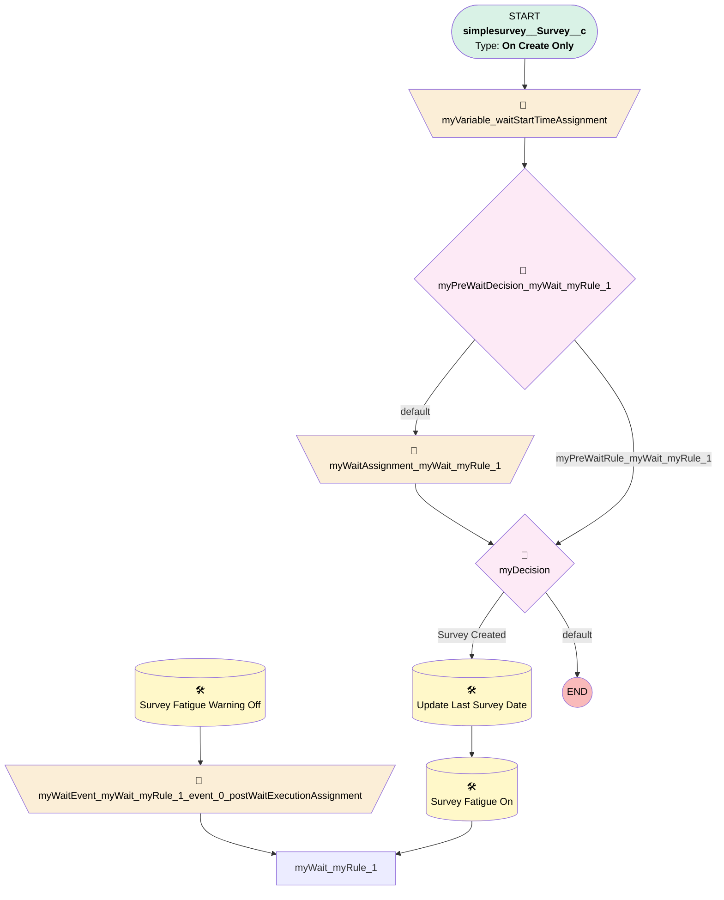

# Survey | Survey Fatigue Warning On/Off

## Flow Diagram [(_View History_)](Survey_Last_Created_Survey_Date-history.md)

<!-- Flow description -->

## General Information

|<!-- -->|<!-- -->|
|:---|:---|
|Process Type| Workflow|
|Label|Survey | Survey Fatigue Warning On/Off|
|Status|Obsolete|
|Description|1) Last Survey Date 2) Fatigue Warning ON 3) Fatigue Warning Off in 60 Days|
|Interview Label|Survey_Last_Created_Survey_Date-4_InterviewLabel|
|Start Element Reference|[myVariable_waitStartTimeAssignment](#myvariable_waitstarttimeassignment)|
| Object Type (PM)|simplesurvey__Survey__c|
| Object Variable (PM)|myVariable_current|
| Old Object Variable (PM)|myVariable_old|
| Trigger Type (PM)|onCreateOnly|

## Variables

|Name|Data Type|Is Collection|Is Input|Is Output|Object Type|Description|
|:-- |:--:|:--:|:--:|:--:|:--:|:--  |
|cancelWaits|String|✅|⬜|✅|<!-- -->|<!-- -->|
|myVariable_current|SObject|⬜|✅|✅|simplesurvey__Survey__c|<!-- -->|
|myVariable_old|SObject|⬜|✅|⬜|simplesurvey__Survey__c|<!-- -->|
|myVariable_waitStartTimeVariable|DateTime|⬜|⬜|⬜|<!-- -->|<!-- -->|
|myWaitEvent_myWait_myRule_1_event_0_postActionExecutionVariable|Boolean|⬜|⬜|⬜|<!-- -->|<!-- -->|

## Formulas

|Name|Data Type|Expression|Description|
|:-- |:--:|:-- |:--  |
|formula_2_myRule_1_A1_1002530607|Date|DATEVALUE({!myVariable_current.CreatedDate} )|<!-- -->|

## Flow Nodes Details

### myVariable_waitStartTimeAssignment

|<!-- -->|<!-- -->|
|:---|:---|
|Type|Assignment|
|Label|[myVariable_waitStartTimeAssignment](#myvariable_waitstarttimeassignment)|
|Connector|[myPreWaitDecision_myWait_myRule_1](#myprewaitdecision_mywait_myrule_1)|

#### Assignments

|Assign To Reference|Operator|Value|
|:-- |:--:|:--: |
|myVariable_waitStartTimeVariable| Assign|$Flow.CurrentDateTime|

### myWaitAssignment_myWait_myRule_1

|<!-- -->|<!-- -->|
|:---|:---|
|Type|Assignment|
|Label|[myWaitAssignment_myWait_myRule_1](#mywaitassignment_mywait_myrule_1)|
|Connector|[myDecision](#mydecision)|

#### Assignments

|Assign To Reference|Operator|Value|
|:-- |:--:|:--: |
|cancelWaits| Add|myWait_myRule_1|

### myWaitEvent_myWait_myRule_1_event_0_postWaitExecutionAssignment

|<!-- -->|<!-- -->|
|:---|:---|
|Type|Assignment|
|Label|[myWaitEvent_myWait_myRule_1_event_0_postWaitExecutionAssignment](#mywaitevent_mywait_myrule_1_event_0_postwaitexecutionassignment)|
|Connector|myWait_myRule_1|

#### Assignments

|Assign To Reference|Operator|Value|
|:-- |:--:|:--: |
|myWaitEvent_myWait_myRule_1_event_0_postActionExecutionVariable| Assign|✅|

### myDecision

|<!-- -->|<!-- -->|
|:---|:---|
|Type|Decision|
|Label|[myDecision](#mydecision)|
|Default Connector Label|default|
|Index (PM)|numberValue: 0 |

#### Rule myRule_1 (Survey Created)

|<!-- -->|<!-- -->|
|:---|:---|
|Connector|[myRule_1_A1](#myrule_1_a1)|
|Condition Logic|and|

|Condition Id|Left Value Reference|Operator|Right Value|
|:-- |:-- |:--:|:--: |
|1|myVariable_current.CreatedDate| Is Null|⬜|

### myPreWaitDecision_myWait_myRule_1

|<!-- -->|<!-- -->|
|:---|:---|
|Type|Decision|
|Label|[myPreWaitDecision_myWait_myRule_1](#myprewaitdecision_mywait_myrule_1)|
|Default Connector|[myWaitAssignment_myWait_myRule_1](#mywaitassignment_mywait_myrule_1)|
|Default Connector Label|default|

#### Rule myPreWaitRule_myWait_myRule_1 (myPreWaitRule_myWait_myRule_1)

|<!-- -->|<!-- -->|
|:---|:---|
|Connector|[myDecision](#mydecision)|
|Condition Logic|and|

|Condition Id|Left Value Reference|Operator|Right Value|
|:-- |:-- |:--:|:--: |
|1|myVariable_current.CreatedDate| Is Null|⬜|

### myRule_1_A1

|<!-- -->|<!-- -->|
|:---|:---|
|Type|Record Update|
|Object|Contact|
|Label|Update Last Survey Date|
|Evaluation Type (PM)|always|
|Extra Type Info (PM)|<!-- -->|
|Is Child Relationship (PM)|⬜|
|Reference (PM)|[simplesurvey__Survey__c].Contact|
|Reference Target Field (PM)|<!-- -->|
|Connector|[myRule_1_A2](#myrule_1_a2)|

#### Filters (logic: **and**)

|Filter Id|Field|Operator|Value|
|:-- |:-- |:--:|:--: |
|1|Id| Equal To|myVariable_current.simplesurvey__Contact__c|

#### Input Assignments

|Field|Value|
|:-- |:--: |
|Last_Created_Survey_Date__c|formula_2_myRule_1_A1_1002530607|

### myRule_1_A2

|<!-- -->|<!-- -->|
|:---|:---|
|Type|Record Update|
|Object|Contact|
|Label|Survey Fatigue On|
|Evaluation Type (PM)|always|
|Extra Type Info (PM)|<!-- -->|
|Is Child Relationship (PM)|⬜|
|Reference (PM)|[simplesurvey__Survey__c].Contact|
|Reference Target Field (PM)|<!-- -->|
|Connector|myWait_myRule_1|

#### Filters (logic: **and**)

|Filter Id|Field|Operator|Value|
|:-- |:-- |:--:|:--: |
|1|Id| Equal To|myVariable_current.simplesurvey__Contact__c|

#### Input Assignments

|Field|Value|
|:-- |:--: |
|Survey_Fatigue_Warning__c|✅|

### myWaitEvent_myWait_myRule_1_event_0_SA1

|<!-- -->|<!-- -->|
|:---|:---|
|Type|Record Update|
|Object|Contact|
|Label|Survey Fatigue Warning Off|
|Evaluation Type (PM)|always|
|Extra Type Info (PM)|<!-- -->|
|Is Child Relationship (PM)|⬜|
|Reference (PM)|[simplesurvey__Survey__c].Contact|
|Reference Target Field (PM)|<!-- -->|
|Connector|[myWaitEvent_myWait_myRule_1_event_0_postWaitExecutionAssignment](#mywaitevent_mywait_myrule_1_event_0_postwaitexecutionassignment)|

#### Filters (logic: **and**)

|Filter Id|Field|Operator|Value|
|:-- |:-- |:--:|:--: |
|1|Id| Equal To|myVariable_current.simplesurvey__Contact__c|

#### Input Assignments

|Field|Value|
|:-- |:--: |
|Survey_Fatigue_Warning__c|⬜|

___

_Documentation generated from branch monitoring_myubiquity by [sfdx-hardis](https://sfdx-hardis.cloudity.com), featuring [salesforce-flow-visualiser](https://github.com/toddhalfpenny/salesforce-flow-visualiser)_