# Plan | Process | Update Partner Client Status

## Flow Diagram [(_View History_)](Update_Partner_Client_Status-history.md)

```mermaid
%% If you read this, your Markdown visualizer does not handle MermaidJS syntax.
%% - If you are in VS Code, install extension `Markdown Preview Mermaid Support` at https://marketplace.visualstudio.com/items?itemName=bierner.markdown-mermaid
%% - If you are using sfdx-hardis, try to define env variable `MERMAID_MODES=cli,docker` ,then run again the command to regenerate markdown with SVG images.
%% - If you are within mkdocs-material, define mermaid plugin in `mkdocs.yml` as described in https://squidfunk.github.io/mkdocs-material/extensions/mermaid/
%% - As a last resort, you can copy-paste this MermaidJS code into https://mermaid.live/ to see the flow diagram

flowchart TB
START(["START<br/><b>AutoLaunched Flow</b></br>"]):::startClass
click START "#general-information" "1450656666"

Email_Sales("📧 <em></em><br/>Email Sales"):::actionCalls
click Email_Sales "#email_sales" "1171440408"

Assign_Client_Status[\"🟰 <em></em><br/>Assign Client Status"/]:::assignments
click Assign_Client_Status "#assign_client_status" "2718422569"

Does_Association_Exist{"🔀 <em></em><br/>Does Association Exist?"}:::decisions
click Does_Association_Exist "#does_association_exist" "4125810902"

Grandfathered_Partner{"🔀 <em></em><br/>Grandfathered Partner?"}:::decisions
click Grandfathered_Partner "#grandfathered_partner" "158717866"

Has_Active_Clients{"🔀 <em></em><br/>Has Active Clients"}:::decisions
click Has_Active_Clients "#has_active_clients" "1711584295"

Opportunity_is_Active{"🔀 <em></em><br/>Opportunity is Active"}:::decisions
click Opportunity_is_Active "#opportunity_is_active" "878723885"

Update_Account_Past_Clients{"🔀 <em></em><br/>Update Account?"}:::decisions
click Update_Account_Past_Clients "#update_account_past_clients" "1579281297"

Check_for_Active_Clients{{"🔁 <em></em><br/>Check for Active Clients"}}:::loops
click Check_for_Active_Clients "#check_for_active_clients" "2049732710"

Loop_Through_ACs{{"🔁 <em></em><br/>Loop Through ACs"}}:::loops
click Loop_Through_ACs "#loop_through_acs" "1598078227"

Get_All_Associates[("🔍 <em></em><br/>Get All Associates")]:::recordLookups
click Get_All_Associates "#get_all_associates" "3743061483"

Get_All_Associations[("🔍 <em></em><br/>Get All Associations")]:::recordLookups
click Get_All_Associations "#get_all_associations" "72766452"

Get_Association[("🔍 <em></em><br/>Get Association")]:::recordLookups
click Get_Association "#get_association" "265350635"

Get_Contact[("🔍 <em></em><br/>Get Contact")]:::recordLookups
click Get_Contact "#get_contact" "909116092"

Update_Account[("🛠️ <em></em><br/>Update Account")]:::recordUpdates
click Update_Account "#update_account" "2865741973"

Update_Advisor[("🛠️ <em></em><br/>Update Advisor")]:::recordUpdates
click Update_Advisor "#update_advisor" "1425222742"

Email_Sales --> END_Email_Sales
Assign_Client_Status --> Check_for_Active_Clients
Does_Association_Exist --> |"Yes"| Get_Contact
Does_Association_Exist --> |"No"| END_Does_Association_Exist
Grandfathered_Partner --> |"Yes"| Email_Sales
Grandfathered_Partner --> |"No"| END_Grandfathered_Partner
Has_Active_Clients --> |"No"| Assign_Client_Status
Has_Active_Clients --> |"Yes"| Check_for_Active_Clients
Opportunity_is_Active --> |"No"| Loop_Through_ACs
Update_Account_Past_Clients --> |"Update"| Update_Account
Update_Account_Past_Clients --> |"No"| END_Update_Account_Past_Clients
Check_for_Active_Clients --> |"For Each"|Has_Active_Clients
Check_for_Active_Clients ---> |"After Last"|Update_Account_Past_Clients
Loop_Through_ACs --> |"For Each"|Opportunity_is_Active
Loop_Through_ACs ---> |"After Last"|Update_Advisor
Get_All_Associates --> Check_for_Active_Clients
Get_All_Associations --> Loop_Through_ACs
Get_Association --> Does_Association_Exist
Get_Contact --> Get_All_Associations
Update_Account --> Grandfathered_Partner
Update_Advisor --> Get_All_Associates
START -->  Get_Association
END_Email_Sales(( END )):::endClass
END_Does_Association_Exist(( END )):::endClass
END_Grandfathered_Partner(( END )):::endClass
END_Update_Account_Past_Clients(( END )):::endClass


classDef actionCalls fill:#D4E4FC,color:black,text-decoration:none,max-height:100px
classDef assignments fill:#FBEED7,color:black,text-decoration:none,max-height:100px
classDef collectionProcessors fill:#F0E3FA,color:black,text-decoration:none,max-height:100px
classDef customErrors fill:#FFE9E9,color:black,text-decoration:none,max-height:100px
classDef decisions fill:#FDEAF6,color:black,text-decoration:none,max-height:100px
classDef loops fill:#FDEAF6,color:black,text-decoration:none,max-height:100px
classDef recordCreates fill:#FFF8C9,color:black,text-decoration:none,max-height:100px
classDef recordDeletes fill:#FFF8C9,color:black,text-decoration:none,max-height:100px
classDef recordLookups fill:#EDEAFF,color:black,text-decoration:none,max-height:100px
classDef recordUpdates fill:#FFF8C9,color:black,text-decoration:none,max-height:100px
classDef screens fill:#DFF6FF,color:black,text-decoration:none,max-height:100px
classDef subflows fill:#D4E4FC,color:black,text-decoration:none,max-height:100px
classDef startClass fill:#D9F2E6,color:black,text-decoration:none,max-height:100px
classDef endClass fill:#F9BABA,color:black,text-decoration:none,max-height:100px
classDef transforms fill:#FDEAF6,color:black,text-decoration:none,max-height:100px


```

<!-- Flow description -->

## General Information

|<!-- -->|<!-- -->|
|:---|:---|
|Process Type| Auto Launched Flow|
|Label|Plan | Process | Update Partner Client Status|
|Status|Active|
|Description|Update Partner Client Status on Contact if all Plans are Inactive|
|Interview Label|Update Partner Client Status {!$Flow.CurrentDateTime}|
| Builder Type (PM)|LightningFlowBuilder|
| Canvas Mode (PM)|FREE_FORM_CANVAS|
| Origin Builder Type (PM)|LightningFlowBuilder|
|Connector|[Get_Association](#get_association)|
|Next Node|[Get_Association](#get_association)|

## Variables

|Name|Data Type|Is Collection|Is Input|Is Output|Object Type|Description|
|:-- |:--:|:--:|:--:|:--:|:--:|:--  |
|ACLoop|SObject|⬜|✅|✅|Associated_Contact__c|<!-- -->|
|ACRecord|SObject|⬜|✅|✅|Associated_Contact__c|<!-- -->|
|LeadLoop|SObject|⬜|✅|✅|Lead|<!-- -->|
|NewCollection|SObject|✅|✅|✅|Lead|<!-- -->|
|partnerClientStatus|String|⬜|✅|✅|<!-- -->|<!-- -->|
|recordId|String|⬜|✅|✅|<!-- -->|<!-- -->|

## Flow Nodes Details

### Email_Sales

|<!-- -->|<!-- -->|
|:---|:---|
|Type|Action Call|
|Label|Email Sales|
|Action Type|Email Alert|
|Action Name|Contact.Grandfathered_Partner_No_Longer_Active|
|Name Segment|Contact.Grandfathered_Partner_No_Longer_Active|
| SObject Row Id (input)|Get_Contact.Id|

### Assign_Client_Status

|<!-- -->|<!-- -->|
|:---|:---|
|Type|Assignment|
|Label|Assign Client Status|
|Connector|[Check_for_Active_Clients](#check_for_active_clients)|

#### Assignments

|Assign To Reference|Operator|Value|
|:-- |:--:|:--: |
|partnerClientStatus| Assign|Check_for_Active_Clients.Partner_Client_Status__c|

### Does_Association_Exist

|<!-- -->|<!-- -->|
|:---|:---|
|Type|Decision|
|Label|Does Association Exist?|
|Default Connector Label|No|

#### Rule Yes (Yes)

|<!-- -->|<!-- -->|
|:---|:---|
|Connector|[Get_Contact](#get_contact)|
|Condition Logic|and|

|Condition Id|Left Value Reference|Operator|Right Value|
|:-- |:-- |:--:|:--: |
|1|ACRecord.Id| Is Null|⬜|

### Grandfathered_Partner

|<!-- -->|<!-- -->|
|:---|:---|
|Type|Decision|
|Label|Grandfathered Partner?|
|Default Connector Label|No|

#### Rule YesGFP (Yes)

|<!-- -->|<!-- -->|
|:---|:---|
|Connector|[Email_Sales](#email_sales)|
|Condition Logic|and|

|Condition Id|Left Value Reference|Operator|Right Value|
|:-- |:-- |:--:|:--: |
|1|Get_Contact.Territory__c| Equal To|Grandfathered|

### Has_Active_Clients

|<!-- -->|<!-- -->|
|:---|:---|
|Type|Decision|
|Label|Has Active Clients|
|Default Connector|[Check_for_Active_Clients](#check_for_active_clients)|
|Default Connector Label|Yes|

#### Rule NoActiveClients (No)

|<!-- -->|<!-- -->|
|:---|:---|
|Connector|[Assign_Client_Status](#assign_client_status)|
|Condition Logic|and|

|Condition Id|Left Value Reference|Operator|Right Value|
|:-- |:-- |:--:|:--: |
|1|Check_for_Active_Clients.Partner_Client_Status__c| Equal To|Past Client(s)|

### Opportunity_is_Active

|<!-- -->|<!-- -->|
|:---|:---|
|Type|Decision|
|Label|Opportunity is Active|
|Default Connector|[Loop_Through_ACs](#loop_through_acs)|
|Default Connector Label|No|

#### Rule YesActive (Yes)

|<!-- -->|<!-- -->|
|:---|:---|
|Condition Logic|and|

|Condition Id|Left Value Reference|Operator|Right Value|
|:-- |:-- |:--:|:--: |
|1|ACLoop.Plan_Status__c| Equal To|Active|

### Update_Account_Past_Clients

|<!-- -->|<!-- -->|
|:---|:---|
|Type|Decision|
|Label|Update Account?|
|Default Connector Label|No|

#### Rule Update (Update)

|<!-- -->|<!-- -->|
|:---|:---|
|Connector|[Update_Account](#update_account)|
|Condition Logic|and|

|Condition Id|Left Value Reference|Operator|Right Value|
|:-- |:-- |:--:|:--: |
|1|partnerClientStatus| Equal To|Past Client(s)|

### Check_for_Active_Clients

|<!-- -->|<!-- -->|
|:---|:---|
|Type|Loop|
|Label|Check for Active Clients|
|Collection Reference|[Get_All_Associates](#get_all_associates)|
|Iteration Order|Asc|
|Next Value Connector|[Has_Active_Clients](#has_active_clients)|
|No More Values Connector|[Update_Account_Past_Clients](#update_account_past_clients)|

### Loop_Through_ACs

|<!-- -->|<!-- -->|
|:---|:---|
|Type|Loop|
|Label|Loop Through ACs|
|Assign Next Value To Reference|ACLoop|
|Collection Reference|[Get_All_Associations](#get_all_associations)|
|Iteration Order|Asc|
|Next Value Connector|[Opportunity_is_Active](#opportunity_is_active)|
|No More Values Connector|[Update_Advisor](#update_advisor)|

### Get_All_Associates

|<!-- -->|<!-- -->|
|:---|:---|
|Type|Record Lookup|
|Object|Contact|
|Label|Get All Associates|
|Assign Null Values If No Records Found|⬜|
|Get First Record Only|⬜|
|Store Output Automatically|✅|
|Connector|[Check_for_Active_Clients](#check_for_active_clients)|

#### Filters (logic: **and**)

|Filter Id|Field|Operator|Value|
|:-- |:-- |:--:|:--: |
|1|AccountId| Equal To|Get_Contact.AccountId|

### Get_All_Associations

|<!-- -->|<!-- -->|
|:---|:---|
|Type|Record Lookup|
|Object|Associated_Contact__c|
|Label|Get All Associations|
|Assign Null Values If No Records Found|⬜|
|Get First Record Only|⬜|
|Store Output Automatically|✅|
|Connector|[Loop_Through_ACs](#loop_through_acs)|

#### Filters (logic: **and**)

|Filter Id|Field|Operator|Value|
|:-- |:-- |:--:|:--: |
|1|Contact__c| Equal To|Get_Contact.Id|

### Get_Association

|<!-- -->|<!-- -->|
|:---|:---|
|Type|Record Lookup|
|Object|Associated_Contact__c|
|Label|Get Association|
|Assign Null Values If No Records Found|✅|
|Output Assignments|- assignToReference: ACRecord.Contact__c &nbsp;&nbsp;field: Contact__c - assignToReference: ACRecord.Id &nbsp;&nbsp;field: Id |
|Connector|[Does_Association_Exist](#does_association_exist)|

#### Filters (logic: **and**)

|Filter Id|Field|Operator|Value|
|:-- |:-- |:--:|:--: |
|1|Contact_Role__c| Equal To|Financial Advisor|
|2|Plan__c| Equal To|recordId|

### Get_Contact

|<!-- -->|<!-- -->|
|:---|:---|
|Type|Record Lookup|
|Object|Contact|
|Label|Get Contact|
|Assign Null Values If No Records Found|⬜|
|Get First Record Only|✅|
|Store Output Automatically|✅|
|Connector|[Get_All_Associations](#get_all_associations)|

#### Filters (logic: **and**)

|Filter Id|Field|Operator|Value|
|:-- |:-- |:--:|:--: |
|1|Id| Equal To|ACRecord.Contact__c|

### Update_Account

|<!-- -->|<!-- -->|
|:---|:---|
|Type|Record Update|
|Object|Account|
|Label|Update Account|
|Connector|[Grandfathered_Partner](#grandfathered_partner)|

#### Filters (logic: **and**)

|Filter Id|Field|Operator|Value|
|:-- |:-- |:--:|:--: |
|1|Id| Equal To|Get_Contact.AccountId|

#### Input Assignments

|Field|Value|
|:-- |:--: |
|Partner_Client_Status__c|Past Client(s)|

### Update_Advisor

|<!-- -->|<!-- -->|
|:---|:---|
|Type|Record Update|
|Object|Contact|
|Label|Update Advisor|
|Connector|[Get_All_Associates](#get_all_associates)|

#### Filters (logic: **and**)

|Filter Id|Field|Operator|Value|
|:-- |:-- |:--:|:--: |
|1|Id| Equal To|Get_Contact.Id|

#### Input Assignments

|Field|Value|
|:-- |:--: |
|Partner_Client_Status__c|Past Client(s)|

___

_Documentation generated from branch monitoring_myubiquity by [sfdx-hardis](https://sfdx-hardis.cloudity.com), featuring [salesforce-flow-visualiser](https://github.com/toddhalfpenny/salesforce-flow-visualiser)_

## Dependencies

- [Associate_Contact_After_Trigger](Associate_Contact_After_Trigger.md)
