---
hide:
  - path
---

<!-- This file is auto-generated. if you do not want it to be overwritten, set TRUE in the line below -->
<!-- DO_NOT_OVERWRITE_DOC=FALSE -->

## Schema

```mermaid
graph LR
Vendor_Review__c["Vendor Review"]:::customObject
click Vendor_Review__c "/objects/Vendor_Review__c/"
Transition__c["Transition"]:::customObject
click Transition__c "/objects/Transition__c/"
Reviews__c["Review"]:::customObject
click Reviews__c "/objects/Reviews__c/"
Proposal__c["Proposal"]:::customObject
click Proposal__c "/objects/Proposal__c/"
Products_Services__c["Products & Services"]:::customObject
click Products_Services__c "/objects/Products_Services__c/"
Product_Subscription__c["Product/Subscription"]:::customObject
click Product_Subscription__c "/objects/Product_Subscription__c/"
Product_Pricing__c["Product Price"]:::customObject
click Product_Pricing__c "/objects/Product_Pricing__c/"
Pricebook2["Pricebook2"]:::object
click Pricebook2 "/objects/Pricebook2/"
Plan__c["Plan"]:::customObject
click Plan__c "/objects/Plan__c/"
Partner_Resource_Request__c["Partner Resource Request"]:::customObject
click Partner_Resource_Request__c "/objects/Partner_Resource_Request__c/"
Partner_Partner_Association__c["Account Partner Association"]:::customObject
click Partner_Partner_Association__c "/objects/Partner_Partner_Association__c/"
Partner_Evaluation__c["Partner Evaluation"]:::customObject
click Partner_Evaluation__c "/objects/Partner_Evaluation__c/"
Partner_Add_On_Association__c["Partner Add-On Association"]:::customObject
click Partner_Add_On_Association__c "/objects/Partner_Add_On_Association__c/"
OpportunityLineItem["OpportunityLineItem"]:::object
click OpportunityLineItem "/objects/OpportunityLineItem/"
Opportunity["Opportunity"]:::object
click Opportunity "/objects/Opportunity/"
Objective__c["Objective"]:::customObject
click Objective__c "/objects/Objective__c/"
Lead["Lead"]:::object
click Lead "/objects/Lead/"
Invoice__c["Invoice"]:::customObject
click Invoice__c "/objects/Invoice__c/"
Implementation__c["Implementation"]:::customObject
click Implementation__c "/objects/Implementation__c/"
Fund_List__c["Fund List"]:::customObject
click Fund_List__c "/objects/Fund_List__c/"
Fund_Lineup_Change__c["Fund Lineup Change"]:::customObject
click Fund_Lineup_Change__c "/objects/Fund_Lineup_Change__c/"
Forecast_Plan__c["Forecast Plan"]:::customObject
click Forecast_Plan__c "/objects/Forecast_Plan__c/"
Forecast_Channel__c["Forecast Channel"]:::customObject
click Forecast_Channel__c "/objects/Forecast_Channel__c/"
Fee_Waiver__c["Fee Waiver"]:::customObject
click Fee_Waiver__c "/objects/Fee_Waiver__c/"
Escalation__c["Escalation"]:::customObject
click Escalation__c "/objects/Escalation__c/"
EmailMessage["EmailMessage"]:::object
click EmailMessage "/objects/EmailMessage/"
Contact["Contact"]:::object
click Contact "/objects/Contact/"
Compliance__c["Compliance"]:::customObject
click Compliance__c "/objects/Compliance__c/"
Complaint_Form__c["Complaint Form"]:::customObject
click Complaint_Form__c "/objects/Complaint_Form__c/"
Client_Health_Check__c["Client Health Check"]:::customObject
click Client_Health_Check__c "/objects/Client_Health_Check__c/"
Calculation__c["Calculation"]:::customObject
click Calculation__c "/objects/Calculation__c/"
Associated_Partner__c["Associated Partner"]:::customObject
click Associated_Partner__c "/objects/Associated_Partner__c/"
Associated_Contact__c["Associated Contact"]:::customObject
click Associated_Contact__c "/objects/Associated_Contact__c/"
Add_On_Products__c["Add-On Product"]:::customObject
click Add_On_Products__c "/objects/Add_On_Products__c/"
Activity["Activity"]:::object
click Activity "/objects/Activity/"
Account_Snapshot__c["Account Snapshot"]:::customObject
click Account_Snapshot__c "/objects/Account_Snapshot__c/"
Account["Account"]:::mainObject
click Account "/objects/Account/"
n2de__Distribution_engine_details__c["n2de__Distribution_engine_details__c"]:::customObjectManaged

Vendor_Review__c -->|Vendor__c| Account
Transition__c -->|Decon_Provider__c| Account
Transition__c -->|Account__c| Account
Reviews__c -->|Account__c| Account
Proposal__c -->|TPA_Account__c| Account
Proposal__c -->|Advisor_Account__c| Account
Products_Services__c -->|Account__c| Account
Product_Subscription__c -->|Account__c| Account
Product_Pricing__c -->|Account__c| Account
Plan__c -->|Account__c| Account
Partner_Resource_Request__c -->|Partner_Account__c| Account
Partner_Partner_Association__c -->|Partner__c| Account
Partner_Partner_Association__c ==>|Partner_Competitor__c| Account
Partner_Evaluation__c -->|Account__c| Account
Partner_Add_On_Association__c ==>|Partner_Account__c| Account
OpportunityLineItem -->|Account__c| Account
Opportunity -->|Lost_to_Competitor__c| Account
Opportunity -->|Associated_Partner__c| Account
Objective__c -->|Partner__c| Account
Lead -->|Associated_Partner__c| Account
Invoice__c ==>|Account__c| Account
Implementation__c -->|Account__c| Account
Fund_List__c -->|Advisor_Account__c| Account
Fund_List__c -->|Account__c| Account
Fund_Lineup_Change__c -->|Account__c| Account
Forecast_Plan__c -->|Partner__c| Account
Fee_Waiver__c ==>|Account__c| Account
Escalation__c -->|Escalated_Account__c| Account
EmailMessage -->|Account__c| Account
Compliance__c -->|Account__c| Account
Complaint_Form__c -->|Account__c| Account
Client_Health_Check__c -->|Account__c| Account
Calculation__c -->|Account__c| Account
Associated_Partner__c ==>|Account__c| Account
Associated_Contact__c -->|Account__c| Account
Add_On_Products__c -->|Account__c| Account
Activity -->|Account__c| Account
Account_Snapshot__c ==>|Account__c| Account
Account -->|n2de__Distribution_engine_details__c| n2de__Distribution_engine_details__c
Account -->|Price_Book__c| Pricebook2
Account -->|Linked_Company__c| Account
Account -->|Forecast_Channel__c| Forecast_Channel__c
Account -->|Connected_Partner_Rep__c| Contact
Account -->|BD_Parent__c| Account

classDef object fill:#D6E9FF,stroke:#0070D2,stroke-width:3px,rx:12px,ry:12px,shadow:drop,color:#333;
classDef customObject fill:#FFF4C2,stroke:#CCAA00,stroke-width:3px,rx:12px,ry:12px,shadow:drop,color:#333;
classDef customObjectManaged fill:#FFD8B2,stroke:#CC5500,stroke-width:3px,rx:12px,ry:12px,shadow:drop,color:#333;
classDef mainObject fill:#FFB3B3,stroke:#A94442,stroke-width:4px,rx:14px,ry:14px,shadow:drop,color:#333,font-weight:bold;
linkStyle 12,14,20,26,33,37 stroke:#4C9F70,stroke-width:4px;
linkStyle 0,1,2,3,4,5,6,7,8,9,10,11,13,15,16,17,18,19,21,22,23,24,25,27,28,29,30,31,32,34,35,36,38,39,40,41,42,43 stroke:#A6A6A6,stroke-width:2px;

```

<!-- Object description -->

## Fields

| Name      | Label | Type | Description |
| :-------- | :---- | :--: | :---------- | 
| Account_ID_18_Char__c | Account ID (18 Char) | Text | undefined |
| AccountNumber |  |  | undefined |
| Accounts__c | Accounts | Number | Power of One Account count field |
| AccountSource |  | Picklist | undefined |
| Admin_Fee__c | Admin Fee | Currency | Average Competitor Administrative Fees. Use annualized amount for a 15 person plan |
| Advisory_Firm__c | Advisory Firm | Text | undefined |
| affectlayer__AffectLayer_Notes__c | AffectLayer | Text | undefined |
| affectlayer__IsCreatedByChorusZI__c | Created by ChorusZI | Checkbox | This field indicates whether the account was created by Chorus or Zoominfo. |
| All_Traffic_Sources__c | All Traffic Sources | LongTextArea | undefined |
| Amount_Due_on_Invoices__c | Amount Due on Invoices | Summary | Total of all open invoice amounts |
| Anniversary__c | Anniversary | Text | undefined |
| AnnualRevenue |  |  | undefined |
| Asset_Based_Fees__c | Asset Based Fees | Checkbox | Does this provider charge asset based fees. |
| Asset_Fee_Amount__c | Asset Fee Amount | Number | In basis points (bps) |
| Asset_Manager__c | Asset Manager | Picklist | undefined |
| AUM_Assets_Under_Management_in_millions__c | AUM(Assets Under Management in millions) | Currency | Assets under management or recordkeeping. Record in millions. |
| Auto_Enrollment__c | Auto Enrollment | Checkbox | This plan has selected Auto Enrollment. |
| BD_Parent__c | BD Parent | Lookup | undefined |
| BD_Type__c | BD Type | Picklist | undefined |
| Billed_Employee_Tier__c | Billed Employee Tier | Text | Employee pricing tier from most recent invoice item |
| Billed_Service_Option__c | Billed Service Option | Text | Most recent service option pulled from invoice line items |
| Billing_Status__c | Billing Status | Picklist | As of Sep 2020- If any invoices are open 20+ days, Account is "Behind" on billing status.   This will auto update with nightly invoice updates from NetSuite.   This will also push to Plan object and will continue to be a part of the client health score. |
| BillingAddress |  |  | undefined |
| BizIndustryUpdate__c | BizIndustryUpdate | Text | Hidden field used for Account List View/InLine Editing |
| Box_Docusign_Folder_Id__c | Box Docusign Folder Id | Text | The subfolder under the account's folder for docusign records auto migrated from salesforce |
| Box_Folder_Id__c | Box Folder Id | Text | Used to link box folders to accounts |
| Box_Folder_Linked__c | Box Folder Linked | Checkbox | This field is updated when an account is linked to the client folder in box. |
| Brand__c | Brand | Picklist | undefined |
| Broker_CRD__c | Broker CRD | Text | undefined |
| Business_Entity__c | Business Entity | Picklist | Imported from FT Williams Doc System Sep 2020 |
| Business_Entity_PRKS__c | Business Entity PRKS | Text | Business Entity input from Paradigm |
| Business_Industry__c | Business/Industry | Picklist | undefined |
| Business_Start_Date__c | Business Start Date | Date | undefined |
| Business_Unit__c | Business Unit | Picklist | undefined |
| Campaign_code__c | Campaign code | Text | undefined |
| Census_Complete__c | Census Complete % | Percent | Calculates the percentage of employees who have been entered for census. |
| Channel__c | Channel | Picklist | Type of Partner |
| ChannelProgramLevelName |  |  | undefined |
| ChannelProgramName |  |  | undefined |
| Client__c | Client | Checkbox | undefined |
| Client_Sentiment__c | Client Sentiment | Number | The vibe of this account using the combined averages of recent NPS, CSAT, and review scores. |
| Client_Support_Teams__c | CST (Client Support Team) | Picklist | Here is where we list which of our internal service teams handle this account. |
| CloudingoAgent__BAR__c | Billing Address Record Type | Text | undefined |
| CloudingoAgent__BAS__c | Billing Address Status | Number | undefined |
| CloudingoAgent__BAV__c | Billing Address Vacancy | Text | undefined |
| CloudingoAgent__BRDI__c | Billing Residential Delivery Indicator | Text | undefined |
| CloudingoAgent__BTZ__c | Billing Timezone | Text | undefined |
| CloudingoAgent__SAR__c | Shipping Address Record Type | Text | undefined |
| CloudingoAgent__SAS__c | Shipping Address Status | Number | undefined |
| CloudingoAgent__SAV__c | Shipping Address Vacancy | Text | undefined |
| CloudingoAgent__SRDI__c | Shipping Residential Delivery Indicator | Text | undefined |
| CloudingoAgent__STZ__c | Shipping Timezone | Text | undefined |
| Company_size__c | Company size | Picklist | undefined |
| Competitive_Summary__c | Competitive Summary | LongTextArea | undefined |
| Competitive_Threat_Level__c | Competitive Threat Level | Picklist | How much of threat is this competitor to Ubiquity? |
| Competitor__c | Competitor | Checkbox | When checked will show the competitor details fields on account page |
| Connected_Partner__c | Connected Partner | Picklist | Partner with shared SLAs |
| Connected_Partner_Rep__c | Connected Partner Rep | Lookup | undefined |
| Controlled_Affiliated_Group__c | Controlled/Affiliated Group | Checkbox | Is this company part of a controlled/affiliated group? Please add any relevant notes in the notes field. |
| Costco_Member_ID__c | Costco Member ID | Text | undefined |
| Costco_Member_Level__c | Costco Member Level | Text | undefined |
| Count_of_Employees_Census__c | Count of Employees (Census) | Number | undefined |
| Count1__c | Count | Number | undefined |
| CRD_Number__c | CRD Number | Text | Central Registration Depository Number for broker/advisory firm. |
| CSAT_Average__c | CSAT Average | Number | The average CSAT score from the past 6 months. |
| Current_Google_Review_Rating__c | Current Google Review Rating | Number | Google Review rating at time of last shopping. |
| Current_Plan__c | Current Plan | Picklist | undefined |
| Custodian__c | Custodian | Picklist | undefined |
| Customer_Lost_Date__c | Customer Lost Date | Date | undefined |
| Customer_Won_Date__c | Customer Won Date | Summary | undefined |
| Date_last_shopped__c | Date last shopped | Date | Date this competitor was last shopped for competitive analysis. |
| Deferral_Integration_Enabled__c | Deferral Integration Enabled | Date | undefined |
| Description |  |  | undefined |
| DesiredPlanStartDate__c | Desired Plan Start Date | Date | undefined |
| Docs_Signed_for_PRKS__c | Docs Signed for PRK | Checkbox | Box gets checked when Imp Stage hits "Docs Signed" Imp Stage. Field can be deleted after PRKS process is ironed out. |
| DOZISF__ZoomInfo_Enrich_Status__c | ZoomInfo Enrich Status | Picklist | undefined |
| DOZISF__ZoomInfo_First_Updated__c | ZoomInfo First Updated | DateTime | Date and time when the record was first created or updated by ZoomInfo. |
| DOZISF__ZoomInfo_Id__c | ZoomInfo Company ID | Text | undefined |
| DOZISF__ZoomInfo_InboxAI_ID__c | ZoomInfo InboxAI ID | Text | undefined |
| DOZISF__ZoomInfo_Last_Updated__c | ZoomInfo Last Updated | DateTime | Date and time when the record was last created or updated by ZoomInfo |
| Email_Recipients__c | Email Recipients | LongTextArea | undefined |
| Employer_Identification_Number_EIN__c | Employer Identification Number (EIN) | Text | Enter the EIN |
| Escalated__c | Escalated | Checkbox | undefined |
| Estimated_1st_Year_Total_Conv_Plan_Cost__c | Estimated 1st Year Total Conv. Plan Cost | Currency | Estimated cost of 1st year of service by the provider. Assumes a 15 participant, conversion plan with and average of $20k in assets per participant. |
| Estimated_Integration_Completion__c | Estimated Integration Completion | Date | undefined |
| Estimated_Total__c | Estimated 1st Year Total New Plan Cost | Currency | Estimated cost of 1st year of service by the provider. Assumes 15 participants and startup plan. |
| External_ID__c | NetSuite Id | Text | undefined |
| Fax |  |  | undefined |
| Fee_Notes__c | Fee Detail | LongTextArea | Detail on competitor fees being charged. |
| Finch_Credential_Status__c | Finch Credential Status | Picklist | undefined |
| Finch_Implementation__c | Finch Implementation | Checkbox | If Finch T&C has a date and the Finch Opt-Out is FALSE, it is a Finch Imp |
| Finch_Opt_Out__c | Finch Opt Out | Picklist | Using Finch eligible payroll provider but isn't interested |
| Finch_T_C__c | Finch T&C | Date | Date Finch Terms and Conditions were signed by client |
| Firm_Type__c | Firm Type | Picklist | undefined |
| Fiscal_Year_End_MMDD__c | Fiscal Year End (MMDD) | Text | undefined |
| Fiscal_Year_End_PRKS__c | Fiscal Year End PRKS | Text | Fiscal Year End in PRKS Format |
| Forecast_Channel__c | Forecast Channel | Lookup | What Forecast Channel does this partner fall into? |
| Fund_List__c | Fund List | Picklist | undefined |
| GA_Client_ID_Formula__c | GA Client ID (Formula) | Text | undefined |
| gaconnector_Browser__c | Browser | Text | undefined |
| gaconnector_City__c | City | Text | undefined |
| gaconnector_Country__c | Country | Text | undefined |
| gaconnector_Device__c | Device | Text | undefined |
| gaconnector_First_Click_Campaign__c | First Click Campaign | Text | undefined |
| gaconnector_First_Click_Channel__c | First Click Channel | Text | undefined |
| gaconnector_First_Click_Content__c | First Click Content | Text | undefined |
| gaconnector_First_Click_Landing_Page__c | First Click Landing Page | Text | undefined |
| gaconnector_First_Click_Medium__c | First Click Medium | Text | undefined |
| gaconnector_First_Click_Referrer__c | First Click Referrer | Text | undefined |
| gaconnector_First_Click_Source__c | First Click Source | Text | undefined |
| gaconnector_First_Click_Term__c | First Click Term | Text | undefined |
| gaconnector_GCLID__c | GCLID | Text | undefined |
| gaconnector_Google_Analytics_Client_ID__c | Google Analytics Client ID | Text | undefined |
| gaconnector_Google_Analytics_Link__c | Google Analytics Link | Text | undefined |
| gaconnector_IP_Address__c | IP Address | Text | undefined |
| gaconnector_Last_Click_Campaign__c | Last Click Campaign | Text | undefined |
| gaconnector_Last_Click_Channel__c | Last Click Channel | Text | undefined |
| gaconnector_Last_Click_Content__c | Last Click Content | Text | undefined |
| gaconnector_Last_Click_Landing_Page__c | Last Click Landing Page | Text | undefined |
| gaconnector_Last_Click_Medium__c | Last Click Medium | Text | undefined |
| gaconnector_Last_Click_Referrer__c | Last Click Referrer | Text | undefined |
| gaconnector_Last_Click_Source__c | Last Click Source | Text | undefined |
| gaconnector_Last_Click_Term__c | Last Click Term | Text | undefined |
| gaconnector_Latitude_from_IP__c | Latitude | Text | undefined |
| gaconnector_Location_approx__c | Location (approx.) | Text | undefined |
| gaconnector_Longitude__c | Longitude | Text | undefined |
| gaconnector_Number_of_Website_Visits__c | Number of Website Visits | Text | undefined |
| gaconnector_Operating_System__c | Operating System | Text | undefined |
| gaconnector_Pages_visited__c | Pages visited | LongTextArea | undefined |
| gaconnector_Time_Spent_on_Website__c | Time Spent on Website | Number | undefined |
| gaconnector_Time_Spent_on_Website_formul__c | Time Spent on Website | Text | undefined |
| gaconnector_Time_Zone__c | Time Zone | Text | undefined |
| How_did_you_hear_about_us__c | How did you hear about us? | Picklist | undefined |
| How_did_you_hear_about_us_details__c | 'Other' detail | TextArea | undefined |
| Industry |  | Picklist | undefined |
| Industry_NAICS__c | Industry (NAICS) | Text | undefined |
| Integrated_Payroll__c | Integrated Payroll | Checkbox | Does this partner or competitor offer integrated payroll services? |
| Integration_Options_Received__c | Integration Options Received | Date | undefined |
| Integration_Options_Sent__c | Integration Options Sent | Date | undefined |
| Integration_Setup_Complete__c | Integration Setup Complete | Date | undefined |
| Integration_Submissions__c | Integration Submissions | MultiselectPicklist | undefined |
| Integration_Type__c | Integration Type | Picklist | undefined |
| Interested_After_Aborting_Finch_Cred__c | Interested After Aborting Finch Cred | Picklist | Client initially expressed interest in Finch but abandoned process during setup |
| Investment_selection__c | Investment selection | TextArea | undefined |
| Investments__c | Investments | Picklist | undefined |
| Invoices_Paid_Since_2018__c | Invoices Paid Since 2018 | Summary | Total invoices paid since 2018 |
| IsCustomerPortal |  |  | undefined |
| IsExcludedFromRealign |  |  | undefined |
| IsPartner |  |  | undefined |
| Jigsaw |  |  | undefined |
| Knows_Rep__c | Knows Rep | Picklist | Does the client know who their designated service representative is? |
| Last_Activity_Date__c | Last Activity Date - DEPRECATED | Date | undefined |
| Last_Payment_Date__c | Last Payment Date | Summary | Date of most recent payment |
| Last_Referral_Given__c | Last Referral Given | Date | Date Last Lead was referred by account. |
| Last_Shopped_By__c | Last Shopped By | Text | Name a individual who last shopped competitor on Ubiquity's behalf |
| LID__LinkedIn_Company_Id__c | LinkedIn Company Id | Text | LinkedIn Id of the company/Account |
| Linked_Company__c | Linked Company | Lookup | To be used when companies are linked through ownership like control groups, etc. |
| LLC_Taxed_As_PRKS__c | LLC Taxed As PRKS | Text | Business Entity Taxed As input from Paradigm |
| Major_Partner__c | Major Partner | Checkbox | undefined |
| Master_Account_Name__c | Master Account Name | Text | undefined |
| Matrix_07C_Account__c | Matrix 07C Account # | Text | Completed by Implementations team before implementation was completed |
| Message_from_Lead__c | Message from Lead | TextArea | The notes in this box come directly from the lead when they submit their contact information on the Starter(k) quote page. |
| Most_Recent_Fee_Waiver__c | Most Recent Fee Waiver | Summary | undefined |
| Motivation_to_Partner_with_Ubiquity__c | Motivation to Partner with Ubiquity | LongTextArea | What is motivating or will motivate this partner to enter a partnership with Ubiquity? |
| Multiple_Business__c | Multiple Business | Picklist | undefined |
| n2de__DE_Status__c | DE Classifier Status | Text | undefined |
| n2de__DE_Territory__c | DE Territory (Deprecated) | Text | Deprecated, use Distribution_engine_details__c.Territory__c instead |
| n2de__Distribution_count__c | Distribution count | Number | The number of times this record has been assigned via Distribution Engine |
| n2de__Distribution_engine_details__c | Distribution Engine details | Lookup | undefined |
| n2de__Is_distributed__c | Is distributed | Checkbox | undefined |
| n2de__Is_reassigned__c | Is reassigned | Checkbox | undefined |
| n2de__Last_distributed__c | Date last distributed to user | DateTime | undefined |
| n2de__Last_reassigned__c | Date last auto reassigned | DateTime | undefined |
| n2de__Time_to_action_mins__c | Time to action (mins) | Number | undefined |
| NAICS_Code__c | NAICS Code (Business Code) | Text | undefined |
| NAICS_Description__c | NAICS Description | Text | undefined |
| Name |  |  | undefined |
| NetSuite_Sync_Error__c | NetSuite Sync Error | Text | Used by the Jitterbit Account/Customer integration with NetSuite. Holds any sync errors encountered during the integration. |
| New_Comp__c | New Comp | Checkbox | This plan has the New Comparability feature. |
| Notes__c | Notes | LongTextArea | Account Notes |
| NPS_Average__c | NPS Average | Number | The average NPS score from the past 6 months. |
| NumberOfEmployees |  |  | Employees on Census (Active + Terminated) |
| of_Add_On_Products__c | # of Add On Products | Number | undefined |
| of_Current_Plans__c | # of Current Plans | Number | undefined |
| Offered_Finch__c | Offered Finch | Checkbox | Is client presented finch as an option in onboarding workflow |
| Ongoing_Service_Issues__c | Ongoing Service Issues | Picklist | undefined |
| OperatingHoursId |  | Lookup | undefined |
| Other__c | Other | Text | undefined |
| Other_Payroll_Provider__c | Other Payroll Provider (write in) | Text | undefined |
| Owner_Full_Name__c | Owner Full Name | Text | undefined |
| OwnerId |  | Lookup | undefined |
| Ownership |  | Picklist | undefined |
| Parent_Account_Owner__c | Parent Account Owner | Text | Used for reporting |
| ParentId |  | Hierarchy | undefined |
| Participant_Fee__c | Participant Fee | Currency | Use annualized amount. |
| Partner__c | Partner | Checkbox | When checked, show the partner details fields on the account page |
| Partner_Classification__c | Partner Classification | Picklist | undefined |
| Partner_Client_Status__c | Partner Client Status | Picklist | No Clients = Partner & Ubiquity have no mutual clients Active Clients = Partner & Ubiquity have mutual active client(s) Past Clients = Partner & Ubiquity have had mutual client(s) in the past |
| Partner_Integration_Type__c | Partner Integration Type | Picklist | What type of integration(s) does the partner have with Ubiquity? |
| Partner_Landing_Page__c | Partner Landing Page | Url | Link to a partner's landing page.  Used by Biz dev |
| Partner_Landing_Page_Code__c | Partner Landing Page Code | Text | Code used to connect this account to new leads created through calendly |
| Partner_Logo__c | Partner Logo | Text | Clients with shared SLAs will appear here. |
| Partner_Resource_Center__c | Partner Resource Center | Url | Link to a partner's resource center.  Used by Biz dev |
| Partner_Starter_Guide__c | Partner Starter Guide | Url | Link to a partner's "Starter Guide" page.  Used by biz dev |
| Partner_Status__c | Partner Status | Picklist | Prospect = Evaluating partnership with Ubiquity. Active Referrer = Leads referred in the last 12 months. Past Referrer = Has referred leads 12 months ago or more. |
| Partner_Training_Complete__c | Partner Training Complete | Date | undefined |
| Partner_Training_Scheduled__c | Partner Training Scheduled | Date | undefined |
| Partner_User_Registered__c | Partner User Registered | Date | undefined |
| Partnership_Type__c | Partnership Type | Picklist | What type of partnership is this relationship? |
| PayPartner__c | Pay Partner? | Picklist | undefined |
| Payroll_partner_notes__c | Partner notes | TextArea | undefined |
| Payroll_Provider__c | Payroll Provider | Picklist | If Payroll Providers are in dropdown they integrate with Ubiquity. |
| Payroll_Submission_Type__c | Payroll Submission Type | Picklist | How does the client submit their Payrolls? |
| PCRAAnnualFee__c | PCRA Annual Fee | Picklist | undefined |
| Phone |  |  | This is the master phone number for this company. Individual contact numbers may differ. |
| Physical_Address_Same_as_Billing__c | Physical Address Same as Billing | Checkbox | undefined |
| Physical_City__c | Physical City | Text | Enter only if Billing Address is a PO Box |
| Physical_State__c | Physical State | Picklist | Enter only if Billing Address is a PO Box |
| Physical_Street_Address__c | Physical Street Address | Text | Enter only if Billing Address is a PO Box |
| Physical_Zip_Code__c | Physical Zip Code | Text | Enter only if Billing Address is a PO Box |
| Plan_Sold_Date__c | Plan Sold Date | Date | undefined |
| Plan_Status__c | Plan Status | TextArea | Status of Plan(s) connected to Account. Active Status overrides any others. |
| Plan_Value__c | Plan Value | Picklist | Plan value based on employee count and service option |
| Price_Book__c | Price Book | Lookup | undefined |
| Priority__c | Priority | Picklist | undefined |
| Priority_Service__c | Priority Service | Checkbox | Does the plan require priority service? This is updated on the plan record then a flow checks/unchecks this box. |
| Products_Offered__c | Products Offered | MultiselectPicklist | What types of products does the competitor offer? |
| R2R_Federated__c | Federated Advisor? | Picklist | undefined |
| Rating |  | Picklist | undefined |
| Record_Keeping_System__c | Recordkeeping Platform | Picklist | What type of RK Platform do they currently use |
| Relationship_Manager__c | Relationship Manager | Picklist | undefined |
| Request_Date__c | Request Date | Date | undefined |
| Revenue_Share_Option__c | Revenue Share Option | Picklist | undefined |
| Review_Average__c | Review Average | Number | The average review score from the past 6 months. |
| Safe_Harbor__c | Safe Harbor | Checkbox | This plan has selected the Safe Harbor feature. |
| Safe_Harbor_Formula__c | Safe Harbor Formula | TextArea | Used for Client Marketing purposes in MC. |
| Sales_Notes__c | Sales Notes | LongTextArea | Use for competitors to indicate best practices for selling against or preventing transitions to this competitor. |
| Service_Option__c | Service Option | Picklist | undefined |
| Setup_fee__c | Setup fee | Currency | Competitor set up fee |
| SFTP_Login_Cred_Requested__c | SFTP Login Cred Requested | Date | undefined |
| SFTP_Login_Cred_Sent__c | SFTP Login Cred Sent | Date | undefined |
| ShippingAddress |  |  | undefined |
| Sic |  |  | undefined |
| SicDesc |  |  | undefined |
| Single_Bank_and_Payroll_Schedule__c | Single Bank and Payroll Schedule | Picklist | For Finch |
| Site |  |  | undefined |
| SOC_Required__c | SOC Required | Picklist | Is a SOC required for this vendor? |
| Software_Vendor_Payroll__c | Payroll Software Vendor | Text | undefined |
| SourceSystemIdentifier |  |  | undefined |
| SpecialFees__c | Special Fees | Picklist | undefined |
| Strategic_Partner__c | Strategic Partner | Picklist | undefined |
| Target_Market__c | Target Market | LongTextArea | In a sentence or two describe the competitors target market. |
| Test_Files_Received__c | Test Files Received | Date | undefined |
| Test_Files_Requested__c | Test Files Requested | Date | undefined |
| Test_Files_Reviewed__c | Test Files Reviewed | Date | undefined |
| TickerSymbol |  |  | undefined |
| Tier |  |  | undefined |
| Timeframe__c | Timeframe | Picklist | undefined |
| Timezone__c | Timezone | Text | undefined |
| TimezoneDELETE__c | TimezoneDELETE | Picklist | Timezone for primary location for company. |
| Total_Amount_of_Fee_Waivers__c | Total Amount of Fee Waivers | Summary | undefined |
| Total_Number_of_Fee_Waivers__c | Total Number of Fee Waivers | Summary | undefined |
| Transmission_Method__c | Transmission Method | Picklist | undefined |
| Type |  | Picklist | undefined |
| TypeofBusiness__c | Plan Type | Picklist | undefined |
| Vendor__c | Vendor | Checkbox | When checked, show the vendor details section on account page |
| Vendor_Configured_in_Paradigm__c | Vendor Configured in Paradigm | Date | undefined |
| Vendor_Policies__c | Vendor Policies | Url | Box link that stores vendor policies |
| Vendor_Risk__c | Vendor Risk | Picklist | Level of risk in the relationship |
| Vendor_Status__c | Vendor Status | Picklist | Is this a current vendor, past vendor, or one that is under review |
| Vendor_Tier__c | Vendor Tier | Picklist | What tier is this vendor? Vendor tier correlates to level of scrutiny/oversight required |
| Vendor_Type__c | Vendor Type | Picklist | What type of vendor are they? What service do they provide us? |
| Volume_Level__c | Volume Level | Picklist | undefined |
| Website |  |  | undefined |
| X1st_Invoice_Date__c | 1st Invoice Date | Date | Date client is first invoiced in Netsuite |
| X1st_Year_Ubiquity_Fees_New_Plan__c | 1st Year Ubiquity Fees New Plan | Currency | What Client pays in first year for Express(k) with 15 Employees. |
| x1stbilldate__c | 1st bill date | Date | undefined |
| X2nd_Year_Ubiquity_Fees_New_Plan__c | 2nd Year Ubiquity Fees New Plan | Currency | Total client has payed after second year for Express(k) with 15 Employees. |
| X3_16__c | 3(16) | Checkbox | Does this partner or competitor offer 3(16) services? |
| X3_38__c | 3(38) | Checkbox | Does this partner or competitor offer 3(38) services? |
| X3rd_Year_Ubiquity_Fees_New_Plan__c | 3rd Year Ubiquity Fees New Plan | Currency | Total client has payed after third year for Express(k) with 15 Employees. |
| x401kProvider__c | 401(k) Provider | Text | undefined |
| X4th_Year_Ubiquity_Fees_New_Plan__c | 4th Year Ubiquity Fees New Plan | Currency | Total client has payed after fourth year for Express(k) with 15 Employees. |
| X5th_Year_Ubiquity_Fees_New_Plan__c | 5th Year Ubiquity Fees New Plan | Currency | Total client has payed after fifth year for Express(k) with 15 Employees. |
| Years_Active__c | Years Active | Number | undefined |
| zzCONVERSIONFEE__c | zzCONVERSION FEE | Picklist | undefined |

## Validation Rules

| Rule      | Active | Description | Formula |
| :-------- | :---- | :---------- | :------ |
| EIN_9_Digits | No ⚠️ |  | IF (  	NOT(ISBLANK( Employer_Identification_Number_EIN__c )), OR(LEN( Employer_Identification_Number_EIN__c ) <>9, NOT(          ISNUMBER( Employer_Identification_Number_EIN__c ))), false ) |
| EIN_XXXXXXXXX | Yes | EIN is 9 digits without hyphen or space. | CONTAINS(Employer_Identification_Number_EIN__c, "-")  CONTAINS(Employer_Identification_Number_EIN__c, " ") |
| LID__Check_CompanyId_Value | Yes | Throws an exception message if the company id contains non-numerics | AND( 	(LID__LinkedIn_Company_Id__c <> NULL), 	NOT(ISNUMBER(LID__LinkedIn_Company_Id__c)) ) |
| Number_of_Employees | Yes | Must be Null or zero | NumberOfEmployees = 0 && PRIORVALUE(NumberOfEmployees)!=0 |
| Prevent_Account_Creation_on_Upsert | Yes | Prevents creating new accounts from new Upsert action on EIN. Add alias for every new user that will be performing Upserts. | AND(   ISNEW(),   $User.Alias = "sbula" ) |
| Prevent_Send_to_Paradigm_for_Simply | Yes |  | AND ( RecordTypeId = "01237000000XwVt",  ISPICKVAL(Business_Unit__c, "Simply Retirement") ) |

## Related Flows

| Object | Name      | Type | Description |
| :----  | :-------- | :--: | :---------- | 
| 💻 | [Account_Anniversary_Validation_Flow](../flows/Account_Anniversary_Validation_Flow.md) [🕒](../flows/Account_Anniversary_Validation_Flow-history.md) |  Auto Launched Flow | Stamps Plan Sold Date onto Account to calculate Anniversary formulas |
| 💻 | [Account_Button_Create_Account_Screen](../flows/Account_Button_Create_Account_Screen.md) [🕒](../flows/Account_Button_Create_Account_Screen-history.md) |  Screen Flow | <!-- --> |
| 💻 | [Account_Screen_Create_Box_Folder](../flows/Account_Screen_Create_Box_Folder.md) [🕒](../flows/Account_Screen_Create_Box_Folder-history.md) |  Screen Flow | Manually creates box folder in proper subfolder w/ template options. |
| 💻 | [Add_On_to_Plan](../flows/Add_On_to_Plan.md) [🕒](../flows/Add_On_to_Plan-history.md) |  Screen Flow | Creates an Add-On Opportunity for an existing plan and assigns to Payroll team |
| 💻 | [Box_Autolaunched_Batchable_create_folder_assoc](../flows/Box_Autolaunched_Batchable_create_folder_assoc.md) [🕒](../flows/Box_Autolaunched_Batchable_create_folder_assoc-history.md) |  Auto Launched Flow | <!-- --> |
| 💻 | [Box_Scheduled_Create_FRUP_Records](../flows/Box_Scheduled_Create_FRUP_Records.md) [🕒](../flows/Box_Scheduled_Create_FRUP_Records-history.md) |  Scheduled | Schedules box batch (batch management) |
| 💻 | [Case_Button_Create_Jira_Case](../flows/Case_Button_Create_Jira_Case.md) [🕒](../flows/Case_Button_Create_Jira_Case-history.md) |  Screen Flow | Updated to move "Check Groups" action and approval logic into subflow so it can be called from apex. |
| 💻 | [Case_Button_New_Close_Case](../flows/Case_Button_New_Close_Case.md) [🕒](../flows/Case_Button_New_Close_Case-history.md) |  Screen Flow | Updated to show unresolved child case and calc info |
| 💻 | [Close_Case](../flows/Close_Case.md) [🕒](../flows/Close_Case-history.md) |  Screen Flow | Modified case close screen to add "subject" as an editable field for CO cases  Surfaces required fields before closing case, depending on case type and user requirements. Added checkbox to allow users to close other peoples' cases. |
| 💻 | [Contact_Button_Create_Lead](../flows/Contact_Button_Create_Lead.md) [🕒](../flows/Contact_Button_Create_Lead-history.md) |  Screen Flow | Defaults Referral info for Advisor Leads. Added criteria to allow sales coordinator use the button. |
| 💻 | [Contact_Process_Assign_Territory](../flows/Contact_Process_Assign_Territory.md) [🕒](../flows/Contact_Process_Assign_Territory-history.md) |  Auto Launched Flow | When Contact or Account are Updated, Evaluate Territory Assignment |
| 💻 | [CreateEvent](../flows/CreateEvent.md) [🕒](../flows/CreateEvent-history.md) |  Auto Launched Flow | Updated to act as a general "catch all" for partners.  If partner utm fields are found on calendlyaction, look for partner with a code that matches utm_source.  Creates event for new "invitee.created" calendlyactions.  Connects to lead or contact if found.  If no person found, creates new lead. |
| 💻 | [Create_Partner_After_Conversion](../flows/Create_Partner_After_Conversion.md) [🕒](../flows/Create_Partner_After_Conversion-history.md) |  Auto Launched Flow | Creates Associated Partner Junction if needed when Lead is Converted |
| 💻 | [DocuSign_Recipient_Process_Associate_Key_Records](../flows/DocuSign_Recipient_Process_Associate_Key_Records.md) [🕒](../flows/DocuSign_Recipient_Process_Associate_Key_Records-history.md) |  Auto Launched Flow | <!-- --> |
| 💻 | [DocuSign_Related_Record_Mapping](../flows/DocuSign_Related_Record_Mapping.md) [🕒](../flows/DocuSign_Related_Record_Mapping-history.md) |  Auto Launched Flow | Links records related to the Document, based on recipient information. |
| 💻 | [Docusign_Process_Map_After_Signing](../flows/Docusign_Process_Map_After_Signing.md) [🕒](../flows/Docusign_Process_Map_After_Signing-history.md) |  Auto Launched Flow | To be used as a precautionary flow if docusign record is created after the would-be associated records. ***TEST VERSION*** |
| 💻 | [Escalation_Button_De_Escalate_Account](../flows/Escalation_Button_De_Escalate_Account.md) [🕒](../flows/Escalation_Button_De_Escalate_Account-history.md) |  Screen Flow | <!-- --> |
| 💻 | [Escalation_Button_Escalate_Account](../flows/Escalation_Button_Escalate_Account.md) [🕒](../flows/Escalation_Button_Escalate_Account-history.md) |  Screen Flow | Updated routing.  - If created by someone outside of CE, owner and manager are Meli - If created by anyone in CE besides Meli, owner is their team lead and manager is Meli |
| 💻 | [Lead_Process_Assign_TPA_Ownership](../flows/Lead_Process_Assign_TPA_Ownership.md) [🕒](../flows/Lead_Process_Assign_TPA_Ownership-history.md) |  Auto Launched Flow | <!-- --> |
| 💻 | [Map_Advisor_Based_on_NPN](../flows/Map_Advisor_Based_on_NPN.md) [🕒](../flows/Map_Advisor_Based_on_NPN-history.md) |  Auto Launched Flow | When a new Simply Lead is created, assess whether to Convert Advisor, or Link Advisor to Employer Lead. Removed NPN Without Advisor email alert from Employer Lead path. |
| 💻 | [Nano_Banc_Single_k_Flow](../flows/Nano_Banc_Single_k_Flow.md) [🕒](../flows/Nano_Banc_Single_k_Flow-history.md) |  Auto Launched Flow | <!-- --> |
| 💻 | [Opportunity_Button_New_OPD_Flow](../flows/Opportunity_Button_New_OPD_Flow.md) [🕒](../flows/Opportunity_Button_New_OPD_Flow-history.md) |  Screen Flow | <!-- --> |
| 💻 | [Opportunity_Closure_Validation](../flows/Opportunity_Closure_Validation.md) [🕒](../flows/Opportunity_Closure_Validation-history.md) |  Screen Flow | <!-- --> |
| 💻 | [Opportunity_Screen_Approval_Helper](../flows/Opportunity_Screen_Approval_Helper.md) [🕒](../flows/Opportunity_Screen_Approval_Helper-history.md) |  Screen Flow | <!-- --> |
| 💻 | [Opportunity_Screen_Create_Partner_Objective](../flows/Opportunity_Screen_Create_Partner_Objective.md) [🕒](../flows/Opportunity_Screen_Create_Partner_Objective-history.md) |  Screen Flow | Updated to support related list button |
| 💻 | [Plan_Button_Downgrade_Plan](../flows/Plan_Button_Downgrade_Plan.md) [🕒](../flows/Plan_Button_Downgrade_Plan-history.md) |  Screen Flow | <!-- --> |
| 💻 | [Proposal_Autolaunched_Create_leads_from_proposal](../flows/Proposal_Autolaunched_Create_leads_from_proposal.md) [🕒](../flows/Proposal_Autolaunched_Create_leads_from_proposal-history.md) |  Auto Launched Flow | Adding AC and AP roles |
| 💻 | [RewardJet_401_k_Flow](../flows/RewardJet_401_k_Flow.md) [🕒](../flows/RewardJet_401_k_Flow-history.md) |  Auto Launched Flow | <!-- --> |
| 💻 | [RewardJet_Single_k_Flow](../flows/RewardJet_Single_k_Flow.md) [🕒](../flows/RewardJet_Single_k_Flow-history.md) |  Auto Launched Flow | <!-- --> |
| 💻 | [Send_Better_Email_Testflow](../flows/Send_Better_Email_Testflow.md) [🕒](../flows/Send_Better_Email_Testflow-history.md) |  Screen Flow | A series of 5 examples for testing and demonstrating Send Better Email Action Component |
| 💻 | [Sponsor_Trustee_Junction](../flows/Sponsor_Trustee_Junction.md) [🕒](../flows/Sponsor_Trustee_Junction-history.md) |  Auto Launched Flow | Create Associated Contacts when a Sponsor &/or Trustee is added to an Account with an active Plan |
| 💻 | [Update_Partner_Client_Status](../flows/Update_Partner_Client_Status.md) [🕒](../flows/Update_Partner_Client_Status-history.md) |  Auto Launched Flow | Update Partner Client Status on Contact if all Plans are Inactive |
| 💻 | [Update_Partner_Status](../flows/Update_Partner_Status.md) [🕒](../flows/Update_Partner_Status-history.md) |  Auto Launched Flow | Update Partner Status on Contact if all Associated Leads are older than 1 year. |
| 💻 | [sendBetterEmail_Test_Create_Test_Templates_if_needed](../flows/sendBetterEmail_Test_Create_Test_Templates_if_needed.md) [🕒](../flows/sendBetterEmail_Test_Create_Test_Templates_if_needed-history.md) |  Screen Flow | Flow to test if the templates named sendBetterEmaiTest have been created, and if not, create them |
| Account | [Account_After_Trigger_Master_Flow](../flows/Account_After_Trigger_Master_Flow.md) [🕒](../flows/Account_After_Trigger_Master_Flow-history.md) |  Record After Save | <!-- --> |
| Account | [Account_After_Trigger_Send_New_Vendor_Email_Alert](../flows/Account_After_Trigger_Send_New_Vendor_Email_Alert.md) [🕒](../flows/Account_After_Trigger_Send_New_Vendor_Email_Alert-history.md) |  Record After Save | When new vendor account is created, send email alert to Bobby, Vince, and Compliance Manager |
| Account | [Account_After_Trigger_Update_Imp_and_Plan_EIN](../flows/Account_After_Trigger_Update_Imp_and_Plan_EIN.md) [🕒](../flows/Account_After_Trigger_Update_Imp_and_Plan_EIN-history.md) |  Record After Save | When Account is updated and EIN changes, update Plan and Imp EIN. |
| Account | [Account_After_Update_Sync_to_Five9](../flows/Account_After_Update_Sync_to_Five9.md) [🕒](../flows/Account_After_Update_Sync_to_Five9-history.md) |  Record After Save | If the Account's Plan Value changes, re-sync contacts to Five9 |
| Account | [Account_Before_Update_Physical_Address_Same_as_Billing](../flows/Account_Before_Update_Physical_Address_Same_as_Billing.md) [🕒](../flows/Account_Before_Update_Physical_Address_Same_as_Billing-history.md) |  Record Before Save | <!-- --> |
| Account | [Account_Snapshot_Scheduled_Monthly_Insert](../flows/Account_Snapshot_Scheduled_Monthly_Insert.md) [🕒](../flows/Account_Snapshot_Scheduled_Monthly_Insert-history.md) |  Scheduled | Monthly creation of account snapshot records for all non inactive clients |
| Associated_Contact__c | [Associate_Contact_After_Trigger](../flows/Associate_Contact_After_Trigger.md) [🕒](../flows/Associate_Contact_After_Trigger-history.md) |  Record After Save | Removed "update contact links" portion of flow.  Was causing issues AND all those links are useless now anyway soo |
| Associated_Contact__c | [Junction_Update_Lifecycle_Stage](../flows/Junction_Update_Lifecycle_Stage.md) [🕒](../flows/Junction_Update_Lifecycle_Stage-history.md) |  Workflow | <!-- --> |
| Calculation__c | [Calculation_Sales_Calc_Request](../flows/Calculation_Sales_Calc_Request.md) [🕒](../flows/Calculation_Sales_Calc_Request-history.md) |  Workflow | Automations for sales creating a Calc request for Compliance |
| Calculation__c | [Compliance_Calculation_Case_Counter](../flows/Compliance_Calculation_Case_Counter.md) [🕒](../flows/Compliance_Calculation_Case_Counter-history.md) |  Workflow | Increases/Decreases Case Counter based on Calc object status |
| Case | [Case_Company_Name_Address_Update](../flows/Case_Company_Name_Address_Update.md) [🕒](../flows/Case_Company_Name_Address_Update-history.md) |  Workflow | Creates 3 child cases for Address Update Cases |
| Case | [Case_Entitlement_Selecion](../flows/Case_Entitlement_Selecion.md) [🕒](../flows/Case_Entitlement_Selecion-history.md) |  Workflow | Add cases to Entitlement Process Names for specific Entitlement Processes.  Also defaults BizIntel Acct/Plan values. |
| Case | [Case_New_Case_Created_Upon_Resolve](../flows/Case_New_Case_Created_Upon_Resolve.md) [🕒](../flows/Case_New_Case_Created_Upon_Resolve-history.md) |  Workflow | When Case is resolved, create follow up case for team related to the process |
| Case | [Compliance_Auto_Reply_on_Case_Creation](../flows/Compliance_Auto_Reply_on_Case_Creation.md) [🕒](../flows/Compliance_Auto_Reply_on_Case_Creation-history.md) |  Workflow | Auto Reply When Case is Created |
| Case | [Compliance_ForceDist_Final_Distributions](../flows/Compliance_ForceDist_Final_Distributions.md) [🕒](../flows/Compliance_ForceDist_Final_Distributions-history.md) |  Workflow | Sets case for Final Force Out Distributions 30 days after Certified Notice Case is completed |
| Case | [Compliance_ForceDist_Notice_Case](../flows/Compliance_ForceDist_Notice_Case.md) [🕒](../flows/Compliance_ForceDist_Notice_Case-history.md) |  Workflow | Creates Send Cert Notice Case when Plan Amendment and/or Locate Cases are Done |
| Case | [Compliance_ForceDist_Status_Changes](../flows/Compliance_ForceDist_Status_Changes.md) [🕒](../flows/Compliance_ForceDist_Status_Changes-history.md) |  Workflow | Updates statuses of ForceDist Cases |
| Case | [Implementations_Mark_Cases_as_Spam](../flows/Implementations_Mark_Cases_as_Spam.md) [🕒](../flows/Implementations_Mark_Cases_as_Spam-history.md) |  Workflow | Mark emails confirming document signing as Spam when owned by Implementations |
| Case | [Support_Abandoned_Plan_Notice_to_Billing_Transitions](../flows/Support_Abandoned_Plan_Notice_to_Billing_Transitions.md) [🕒](../flows/Support_Abandoned_Plan_Notice_to_Billing_Transitions-history.md) |  Workflow | Creates cases for billing and transitions when abandoned plan review case = Potentially Abandoned |
| Case | [Support_Priority_Changes](../flows/Support_Priority_Changes.md) [🕒](../flows/Support_Priority_Changes-history.md) |  Workflow | Makes priority changes to certain cases that meet criteria ( i.e. sets all Schwab cases to High Priority) |
| Case | [Transitions_Blackout_Today_Case](../flows/Transitions_Blackout_Today_Case.md) [🕒](../flows/Transitions_Blackout_Today_Case-history.md) |  Workflow | Updates case created for Billing when a plan has a Blackout Date = Today |
| Case | [Transitions_Liquidation_Today_Case](../flows/Transitions_Liquidation_Today_Case.md) [🕒](../flows/Transitions_Liquidation_Today_Case-history.md) |  Workflow | Updates case created for billing when Abandoned or Termination Transition has Liquidation Date = Today |
| Case | [Update_Account_on_Case_from_Plan_Object](../flows/Update_Account_on_Case_from_Plan_Object.md) [🕒](../flows/Update_Account_on_Case_from_Plan_Object-history.md) |  Workflow | Updates "Account" when Plan is entered & Updates Account & Plan when Imp is entered |
| Contact | [Contact_Match_Account_to_AC_Record](../flows/Contact_Match_Account_to_AC_Record.md) [🕒](../flows/Contact_Match_Account_to_AC_Record-history.md) |  Workflow | If Contact is moved to another Account, change their Account lookup in all related Associated Contacts |
| Enrollment_Meeting__c | [Enrollment_Notify_Mich](../flows/Enrollment_Notify_Mich.md) [🕒](../flows/Enrollment_Notify_Mich-history.md) |  Workflow | Notifies Mich and Enroll Team of new enrollment meeting object |
| Fund_List__c | [Fund_List_Custom_List_Confirmation](../flows/Fund_List_Custom_List_Confirmation.md) [🕒](../flows/Fund_List_Custom_List_Confirmation-history.md) |  Workflow | Update fields on Opp for validation when Custom List is created |
| Implementation__c | [Implementation_After_Trigger_Update_Docs_Signed_for_PRKS](../flows/Implementation_After_Trigger_Update_Docs_Signed_for_PRKS.md) [🕒](../flows/Implementation_After_Trigger_Update_Docs_Signed_for_PRKS-history.md) |  Record After Save | Flow that updates Docs Signed for PRKS checkbox on account so PRKS knows when to start working on Project Tasks |
| Implementation__c | [Implementation_Create_Plan](../flows/Implementation_Create_Plan.md) [🕒](../flows/Implementation_Create_Plan-history.md) |  Workflow | Creates Plan object on Creation of Implementation - One Team Update - |
| Implementation__c | [Implementations_Stage_Updates_Workflow_3](../flows/Implementations_Stage_Updates_Workflow_3.md) [🕒](../flows/Implementations_Stage_Updates_Workflow_3-history.md) |  Workflow | added step for complete wo funding. Removed node to create CST Handoff case per Cristina 6/7/23. Removed node to create conversion assets received compliance case, 7/6/23 |
| Invoice_Line_Items__c | [Invoice_Line_Item_After_Save_Update_Parent_Account](../flows/Invoice_Line_Item_After_Save_Update_Parent_Account.md) [🕒](../flows/Invoice_Line_Item_After_Save_Update_Parent_Account-history.md) |  Record After Save | <!-- --> |
| Invoice__c | [Invoice_After_Save_Set_1st_Invoice_Date](../flows/Invoice_After_Save_Set_1st_Invoice_Date.md) [🕒](../flows/Invoice_After_Save_Set_1st_Invoice_Date-history.md) |  Record After Save | Updates parent account's 1st invoice date if null. |
| Lead | [Contact_Update_Partner_Status](../flows/Contact_Update_Partner_Status.md) [🕒](../flows/Contact_Update_Partner_Status-history.md) |  Workflow | Update Partner Status if all Leads are over 1 year old |
| Lead | [Lead_After_Create_or_Update_Master_Flow](../flows/Lead_After_Create_or_Update_Master_Flow.md) [🕒](../flows/Lead_After_Create_or_Update_Master_Flow-history.md) |  Record After Save | Updated for new lead source/partner build.  Trimmed off "direct referrer" stamp so that this will only run ONCE for newly converted leads. |
| Lead | [Lead_Map_Defaults_Upon_Conversion](../flows/Lead_Map_Defaults_Upon_Conversion.md) [🕒](../flows/Lead_Map_Defaults_Upon_Conversion-history.md) |  Workflow | Map Account and Contact Field Defaults Based on conditional Lead data |
| Lead | [Lead_Map_Defaults_Upon_Conversion_1](../flows/Lead_Map_Defaults_Upon_Conversion_1.md) [🕒](../flows/Lead_Map_Defaults_Upon_Conversion_1-history.md) |  Record After Save | Added fix for 0 employees simply sales.  Syncs employee count from lead to account.  Migrated from the Lead  Map Defaults Upon Conversion process using multiple criteria. Map Account and Contact Opportunity Field Defaults Based on conditional Lead data. |
| Opportunity | [Opportunity_After_Trigger_Update_3_16_on_Account](../flows/Opportunity_After_Trigger_Update_3_16_on_Account.md) [🕒](../flows/Opportunity_After_Trigger_Update_3_16_on_Account-history.md) |  Record After Save | Updated to avoid flipping connected partner back and forth, noticed for simply accounts.  If product type = PEP or service option = Reserve(k), check the 3(16) box on the account. Also update Connected Partner from Lead Source |
| Opportunity | [Opportunity_Before_Trigger_Add_AC_AP_Simply_and_Sallus_defaults](../flows/Opportunity_Before_Trigger_Add_AC_AP_Simply_and_Sallus_defaults.md) [🕒](../flows/Opportunity_Before_Trigger_Add_AC_AP_Simply_and_Sallus_defaults-history.md) |  Record Before Save | Fixed bug where Roth was being set to "true" not "yes"  Update/Add Associated Contact and Associated Partner, map default fields for Simply, Sallus, Express(k), Saver(k) w/ Safe Harbor, and Saver(k) w/o Safe Harbor |
| Opportunity | [Sales_Simply_Default_Fields](../flows/Sales_Simply_Default_Fields.md) [🕒](../flows/Sales_Simply_Default_Fields-history.md) |  Workflow | Default Fields on Simply and Sallus Opportunities |
| Plan__c | [Box_Account_Folder_Template](../flows/Box_Account_Folder_Template.md) [🕒](../flows/Box_Account_Folder_Template-history.md) |  Record After Save | Creates a folder in Box for this Account with the specified Template Folder |
| Plan__c | [Payroll_Submission_Type](../flows/Payroll_Submission_Type.md) [🕒](../flows/Payroll_Submission_Type-history.md) |  Workflow | Populates field on Account object when Plan object field is populated |
| Plan__c | [Plan_After_Save_Create_or_Remove_Box_Folder](../flows/Plan_After_Save_Create_or_Remove_Box_Folder.md) [🕒](../flows/Plan_After_Save_Create_or_Remove_Box_Folder-history.md) |  Record After Save | Creates box folder for new plan creation.  Removes current box folder if an account gets a second plan at least a month after the first. |
| Plan__c | [Plan_After_Update_Update_Priority_Service_on_Acct](../flows/Plan_After_Update_Update_Priority_Service_on_Acct.md) [🕒](../flows/Plan_After_Update_Update_Priority_Service_on_Acct-history.md) |  Record After Save | <!-- --> |
| Plan__c | [Plan_CST_Change](../flows/Plan_CST_Change.md) [🕒](../flows/Plan_CST_Change-history.md) |  Workflow | Updates account when CST changes on the plan |
| Plan__c | [Plan_Connected_Partner](../flows/Plan_Connected_Partner.md) [🕒](../flows/Plan_Connected_Partner-history.md) |  Workflow | Updates Connected Partner on Account when plan custodian is changed |
| Plan__c | [Plan_Map_Sold_Date_Onto_Account](../flows/Plan_Map_Sold_Date_Onto_Account.md) [🕒](../flows/Plan_Map_Sold_Date_Onto_Account-history.md) |  Workflow | For Anniversary Email Merge Fields - Map Plan Sold Date Onto Account If Plan Is Active |
| Plan__c | [Plan_Payroll_Submissions](../flows/Plan_Payroll_Submissions.md) [🕒](../flows/Plan_Payroll_Submissions-history.md) |  Workflow | Process that Updates Plan Payroll submission status and alerts CE when action is needed |
| Plan__c | [Support_100_Client_Review](../flows/Support_100_Client_Review.md) [🕒](../flows/Support_100_Client_Review-history.md) |  Workflow | Creates a case when billable headcount on a plan changes from under 100 to over 100 |
| Plan__c | [Support_Abandoned_Plan_Review](../flows/Support_Abandoned_Plan_Review.md) [🕒](../flows/Support_Abandoned_Plan_Review-history.md) |  Workflow | Creates At Risk Abandoned Plan Review case when Payroll & 1099 are 9+ months old |
| Proposal__c | [Proposal_After_Trigger_Paradigm_Purchase_Api](../flows/Proposal_After_Trigger_Paradigm_Purchase_Api.md) [🕒](../flows/Proposal_After_Trigger_Paradigm_Purchase_Api-history.md) |  Record Before Save | Removed Auto_Enrollment_Deferral_Escalation_Rate__c references |
| Proposal__c | [Proposal_After_Update_Add_Update_Purchase_Contacts](../flows/Proposal_After_Update_Add_Update_Purchase_Contacts.md) [🕒](../flows/Proposal_After_Update_Add_Update_Purchase_Contacts-history.md) |  Record After Save | <!-- --> |
| Proposal__c | [Proposal_Trigger_Connect_to_Referrer](../flows/Proposal_Trigger_Connect_to_Referrer.md) [🕒](../flows/Proposal_Trigger_Connect_to_Referrer-history.md) |  Record After Save | Excluded expired proposals |
| Proposal__c | [Proposal_Update_Reassign_Ownership](../flows/Proposal_Update_Reassign_Ownership.md) [🕒](../flows/Proposal_Update_Reassign_Ownership-history.md) |  Record After Save | Updated to replace "Lead  Process  Assign TPA Ownership" - now updates account owner to proposal owner IF no advisor is present and the proposal owner is an RPC  Sets TPA owner as proposal owner when attached to one. |
| Saver_Rate__c | [Support_Saver_Rates](../flows/Support_Saver_Rates.md) [🕒](../flows/Support_Saver_Rates-history.md) |  Workflow | Copies saver rate object details to Plan and Account |
| Transition__c | [Transition_After_Trigger_Remove_Contacts_from_MC](../flows/Transition_After_Trigger_Remove_Contacts_from_MC.md) [🕒](../flows/Transition_After_Trigger_Remove_Contacts_from_MC-history.md) |  Record After Save | When Transition Complete is entered, find contacts on account and set MC Removal to "True" |
| Transition__c | [Transitions_Final_5500_Termination_Process](../flows/Transitions_Final_5500_Termination_Process.md) [🕒](../flows/Transitions_Final_5500_Termination_Process-history.md) |  Workflow | <!-- --> |
| Transition__c | [Transitions_Master_Workflow](../flows/Transitions_Master_Workflow.md) [🕒](../flows/Transitions_Master_Workflow-history.md) |  Workflow | Steps to take when Transitions are created, saved and completed. Changed Inquiry Date node to Notification Date |
| dsfs__DocuSign_Recipient_Status__c | [DocuSign_Recipient_After_Trigger_Associate_Key_Records](../flows/DocuSign_Recipient_After_Trigger_Associate_Key_Records.md) [🕒](../flows/DocuSign_Recipient_After_Trigger_Associate_Key_Records-history.md) |  Record After Save | Updated to add error handling to lead conversions + opp closure.  Emails owner of errored record + BI to resolve. |
| dsfs__DocuSign_Status__c | [Compliance_ForceDist_Cases_After_Docusign](../flows/Compliance_ForceDist_Cases_After_Docusign.md) [🕒](../flows/Compliance_ForceDist_Cases_After_Docusign-history.md) |  Workflow | Creates appropriate cases when Force Out Distribution Docusigns are complete |
| simplesurvey__Survey__c | [Survey_Force_Dist_Request](../flows/Survey_Force_Dist_Request.md) [🕒](../flows/Survey_Force_Dist_Request-history.md) |  Workflow | Creates Case for Distribution team when new Force Dist Survey is completed |
| simplesurvey__Survey__c | [Survey_Physical_Address_Update](../flows/Survey_Physical_Address_Update.md) [🕒](../flows/Survey_Physical_Address_Update-history.md) |  Workflow | Update physical address from survey to account |
| simplesurvey__Survey__c | [Survey_VBALX_Update](../flows/Survey_VBALX_Update.md) [🕒](../flows/Survey_VBALX_Update-history.md) |  Workflow | VBALX Fund update request sent via survey |

## Related Apex Classes

| Apex Class | Type |
| :----      | :--: | 
| [AccountClientSentimentBatch](../apex/AccountClientSentimentBatch.md) | Batch |
| [AccountClientSentimentBatch_TEST](../apex/AccountClientSentimentBatch_TEST.md) | Test |
| [AccountHierarchyController](../apex/AccountHierarchyController.md) | Lightning Controller |
| [AccountHierarchyControllerTest](../apex/AccountHierarchyControllerTest.md) | Test |
| [DataFactory](../apex/DataFactory.md) | Test |
| [DocusignToBoxBatch](../apex/DocusignToBoxBatch.md) | Batch |
| [DocusignToBoxBatch_TEST](../apex/DocusignToBoxBatch_TEST.md) | Test |
| [EscalationController](../apex/EscalationController.md) | Lightning Controller |
| [EscalationControllerTest](../apex/EscalationControllerTest.md) | Test |
| [InvoiceLineItemsTriggerTest](../apex/InvoiceLineItemsTriggerTest.md) | Test |
| [LCC_JSMQueryResultServiceTest](../apex/LCC_JSMQueryResultServiceTest.md) | Test |
| [LogEntryEventBuilder](../apex/LogEntryEventBuilder.md) | Class |
| [LogEntryEventBuilder_Tests](../apex/LogEntryEventBuilder_Tests.md) | Test |
| [LogEntryHandler](../apex/LogEntryHandler.md) | Class |
| [LoggerCache_Tests](../apex/LoggerCache_Tests.md) | Test |
| [LoggerMockDataCreator](../apex/LoggerMockDataCreator.md) | Test |
| [MicrobatchSelfRegController](../apex/MicrobatchSelfRegController.md) | Visualforce Controller |
| [ModularAutoConvertLead](../apex/ModularAutoConvertLead.md) | Invocable |
| [ModularAutoConvertLead_TEST](../apex/ModularAutoConvertLead_TEST.md) | Test |
| [ParadigmCalloutControllerTest](../apex/ParadigmCalloutControllerTest.md) | Test |
| [PaycorEmailHandlerNew](../apex/PaycorEmailHandlerNew.md) | Class |
| [PlanTriggerController](../apex/PlanTriggerController.md) | Class |
| [PlanTriggerControllerTest](../apex/PlanTriggerControllerTest.md) | Test |
| [PlanTriggerHandler](../apex/PlanTriggerHandler.md) | Trigger Handler |
| [ProposalTriggerTest](../apex/ProposalTriggerTest.md) | Test |
| [PurchaseAPIController](../apex/PurchaseAPIController.md) | Lightning Controller |
| [PurchaseAPIHandler](../apex/PurchaseAPIHandler.md) | Class |
| [SendBetterEmailTest](../apex/SendBetterEmailTest.md) | Test |
| [SimplyCallout](../apex/SimplyCallout.md) | Callout |
| [SimplyCalloutBatchService](../apex/SimplyCalloutBatchService.md) | Callout |
| [SimplyCalloutBatchTest](../apex/SimplyCalloutBatchTest.md) | Test |
| [SpecialInstructionsControllerTest](../apex/SpecialInstructionsControllerTest.md) | Test |
| [StampDateTest](../apex/StampDateTest.md) | Test |
| [StampImpTest](../apex/StampImpTest.md) | Test |
| [TestAutoConvertLeads](../apex/TestAutoConvertLeads.md) | Test |
| [TestAutoConvertLeadsNoOpp](../apex/TestAutoConvertLeadsNoOpp.md) | Test |
| [UpdateAccountFieldsFromPlanBatch](../apex/UpdateAccountFieldsFromPlanBatch.md) | Batch |
| [UpdateAccountFieldsFromPlanBatchTest](../apex/UpdateAccountFieldsFromPlanBatchTest.md) | Test |
| [StampDate](../apex/StampDate.md) | Class |

## Related Lightning Pages

| Lightning Page | Type |
| :----      | :--: | 
| [Abandoned_Plan_Review](../pages/Abandoned_Plan_Review.md) |  Record Page |
| [Alt_Opportunity_Layout](../pages/Alt_Opportunity_Layout.md) |  Record Page |
| [Call_Center_Page](../pages/Call_Center_Page.md) |  Record Page |
| [Case_QA](../pages/Case_QA.md) |  Record Page |
| [Competitor_Account_Layout](../pages/Competitor_Account_Layout.md) |  Record Page |
| [Compliance_Case_Page](../pages/Compliance_Case_Page.md) |  Record Page |
| [Default_Account_Layout](../pages/Default_Account_Layout.md) |  Record Page |
| [Default_Contact_Layout](../pages/Default_Contact_Layout.md) |  Record Page |
| [Default_Opportunity_Layout](../pages/Default_Opportunity_Layout.md) |  Record Page |
| [Dynamic_Account_Page](../pages/Dynamic_Account_Page.md) |  Record Page |
| [Dynamic_Case_Page](../pages/Dynamic_Case_Page.md) |  Record Page |
| [Dynamic_Imp_Record_Page](../pages/Dynamic_Imp_Record_Page.md) |  Record Page |
| [Dynamic_Opp_Page](../pages/Dynamic_Opp_Page.md) |  Record Page |
| [Dynamic_Plan_Page](../pages/Dynamic_Plan_Page.md) |  Record Page |
| [Dynamic_Transitions_Lighting_Page](../pages/Dynamic_Transitions_Lighting_Page.md) |  Record Page |
| [EasyAccounts_UtilityBar](../pages/EasyAccounts_UtilityBar.md) |  Utility Bar |
| [Escalation_Record_Page](../pages/Escalation_Record_Page.md) |  Record Page |
| [Implementation_Conversion](../pages/Implementation_Conversion.md) |  Record Page |
| [Implementation_Record_Page1](../pages/Implementation_Record_Page1.md) |  Record Page |
| [New_3_Region_CE_Case_Page](../pages/New_3_Region_CE_Case_Page.md) |  Record Page |
| [OPD_Page1](../pages/OPD_Page1.md) |  Record Page |
| [Partner_Account_Layout](../pages/Partner_Account_Layout.md) |  Record Page |
| [Partner_Proposal](../pages/Partner_Proposal.md) |  Record Page |
| [Payroll_Integration](../pages/Payroll_Integration.md) |  Record Page |
| [Plan_Record_Page](../pages/Plan_Record_Page.md) |  Record Page |
| [Sales_Lightning_Account_Record](../pages/Sales_Lightning_Account_Record.md) |  Record Page |
| [Starter_Account_Record_Page](../pages/Starter_Account_Record_Page.md) |  Record Page |
| [Vendor_Account](../pages/Vendor_Account.md) |  Record Page |

## Related Profiles

| Profile | User License |
| :----      | :--: | 
| [Admin](../profiles/Admin.md) |  Salesforce |
| [Analytics Cloud Integration User](../profiles/Analytics%20Cloud%20Integration%20User.md) |  Analytics  Cloud  Integration  User |
| [Analytics Cloud Security User](../profiles/Analytics%20Cloud%20Security%20User.md) |  Analytics  Cloud  Integration  User |
| [Anypoint Integration](../profiles/Anypoint%20Integration.md) |  Identity |
| [B2BMA Integration User](../profiles/B2BMA%20Integration%20User.md) |  B2 B M A  Integration  User |
| [Billing User](../profiles/Billing%20User.md) |  Salesforce |
| [Bot Profile](../profiles/Bot%20Profile.md) |  Salesforce |
| [Business Development](../profiles/Business%20Development.md) |  Salesforce |
| [Call Center](../profiles/Call%20Center.md) |  Salesforce |
| [Chatter External User](../profiles/Chatter%20External%20User.md) |  Chatter  External |
| [Chatter Free User](../profiles/Chatter%20Free%20User.md) |  Chatter  Free |
| [Chatter Moderator User](../profiles/Chatter%20Moderator%20User.md) |  Chatter  Free |
| [Client Onboarding - Admin](../profiles/Client%20Onboarding%20-%20Admin.md) |  Salesforce |
| [Client Onboarding - RM](../profiles/Client%20Onboarding%20-%20RM.md) |  Salesforce |
| [Client Servicing Team](../profiles/Client%20Servicing%20Team.md) |  Salesforce |
| [Compliance Manager](../profiles/Compliance%20Manager.md) |  Salesforce |
| [ContractManager](../profiles/ContractManager.md) |  Salesforce |
| [Director of Operations](../profiles/Director%20of%20Operations.md) |  Salesforce |
| [Director of Sales](../profiles/Director%20of%20Sales.md) |  Salesforce |
| [Distributions](../profiles/Distributions.md) |  Salesforce |
| [Einstein Agent User](../profiles/Einstein%20Agent%20User.md) |  Einstein  Agent |
| [ESW_Agentforce_MIAW_1748035300267 Profile](../profiles/ESW_Agentforce_MIAW_1748035300267%20Profile.md) |  Guest  User  License |
| [ESW_Agentforce_MIAW_1748385215843 Profile](../profiles/ESW_Agentforce_MIAW_1748385215843%20Profile.md) |  Guest  User  License |
| [ESW_CE_Chat_1692890394498 Profile](../profiles/ESW_CE_Chat_1692890394498%20Profile.md) |  Guest  User  License |
| [ESW_CE_Chat_Moe_1693182845676 Profile](../profiles/ESW_CE_Chat_Moe_1693182845676%20Profile.md) |  Guest  User  License |
| [ESW_Login_Help_1697133738638 Profile](../profiles/ESW_Login_Help_1697133738638%20Profile.md) |  Guest  User  License |
| [ESW_Login_Help_Simply_1700075140889 Profile](../profiles/ESW_Login_Help_Simply_1700075140889%20Profile.md) |  Guest  User  License |
| [ESW_Omni_Messaging_1694183770479 Profile](../profiles/ESW_Omni_Messaging_1694183770479%20Profile.md) |  Guest  User  License |
| [ESW_Omni_Messaging_CO_1696448547822 Profile](../profiles/ESW_Omni_Messaging_CO_1696448547822%20Profile.md) |  Guest  User  License |
| [ESW_Omni_Messaging_Sallus_1700075448386 Profile](../profiles/ESW_Omni_Messaging_Sallus_1700075448386%20Profile.md) |  Guest  User  License |
| [ESW_Omni_Messaging_Simply_1700076370188 Profile](../profiles/ESW_Omni_Messaging_Simply_1700076370188%20Profile.md) |  Guest  User  License |
| [ESW_QA_Login_1699666348585 Profile](../profiles/ESW_QA_Login_1699666348585%20Profile.md) |  Guest  User  License |
| [ESW_QA_Messaging_1699974036493 Profile](../profiles/ESW_QA_Messaging_1699974036493%20Profile.md) |  Guest  User  License |
| [ESW_Sales_Chat_1697460991337 Profile](../profiles/ESW_Sales_Chat_1697460991337%20Profile.md) |  Guest  User  License |
| [ESW_Sallus_Login_Chat_1700072925200 Profile](../profiles/ESW_Sallus_Login_Chat_1700072925200%20Profile.md) |  Guest  User  License |
| [External Apps Login User](../profiles/External%20Apps%20Login%20User.md) |  External  Apps  Login |
| [Finance Manager Lightning](../profiles/Finance%20Manager%20Lightning.md) |  Salesforce |
| [Guest License User](../profiles/Guest%20License%20User.md) |  Guest  User  License |
| [Help Center Profile](../profiles/Help%20Center%20Profile.md) |  Guest  User  License |
| [Identity User](../profiles/Identity%20User.md) |  Identity |
| [Incoming_SMS Profile](../profiles/Incoming_SMS%20Profile.md) |  Guest  User  License |
| [IT](../profiles/IT.md) |  Salesforce |
| [Leadership Lightning](../profiles/Leadership%20Lightning.md) |  Salesforce |
| [Leadership](../profiles/Leadership.md) |  Salesforce |
| [Learning %26 Development](../profiles/Learning%20%2526%20Development.md) |  Salesforce |
| [Lightning Client Onboarding](../profiles/Lightning%20Client%20Onboarding.md) |  Salesforce |
| [Lightning Compliance](../profiles/Lightning%20Compliance.md) |  Salesforce |
| [Lightning Saver User](../profiles/Lightning%20Saver%20User.md) |  Salesforce |
| [Lightning Service Manager](../profiles/Lightning%20Service%20Manager.md) |  Salesforce |
| [Lightning Service User](../profiles/Lightning%20Service%20User.md) |  Salesforce |
| [Marketing Team](../profiles/Marketing%20Team.md) |  Salesforce |
| [MarketingProfile](../profiles/MarketingProfile.md) |  Salesforce |
| [Master Administrator](../profiles/Master%20Administrator.md) |  Salesforce |
| [Minimum Access - API Only Integrations](../profiles/Minimum%20Access%20-%20API%20Only%20Integrations.md) |  Salesforce  Integration |
| [Minimum Access - Salesforce](../profiles/Minimum%20Access%20-%20Salesforce.md) |  Salesforce |
| [myubiquity Profile](../profiles/myubiquity%20Profile.md) |  Guest  User  License |
| [Operations VP](../profiles/Operations%20VP.md) |  Salesforce |
| [Operations](../profiles/Operations.md) |  Salesforce |
| [Paradigm Help Center Profile](../profiles/Paradigm%20Help%20Center%20Profile.md) |  Guest  User  License |
| [Payroll Koncierge](../profiles/Payroll%20Koncierge.md) |  Salesforce |
| [Payroll Team](../profiles/Payroll%20Team.md) |  Salesforce |
| [People %26 Culture](../profiles/People%20%2526%20Culture.md) |  Salesforce |
| [Pre-chat Site Profile](../profiles/Pre-chat%20Site%20Profile.md) |  Guest  User  License |
| [Product Innovation Leadership](../profiles/Product%20Innovation%20Leadership.md) |  Salesforce |
| [Product Innovation User](../profiles/Product%20Innovation%20User.md) |  Salesforce |
| [PSM Team](../profiles/PSM%20Team.md) |  Salesforce |
| [R%26W](../profiles/R%2526W.md) |  Salesforce |
| [Read Only](../profiles/Read%20Only.md) |  Salesforce |
| [Sales Administrator](../profiles/Sales%20Administrator.md) |  Salesforce |
| [Sales Coordinator](../profiles/Sales%20Coordinator.md) |  Salesforce |
| [Sales Insights Integration User](../profiles/Sales%20Insights%20Integration%20User.md) |  Sales  Insights  Integration  User |
| [Sales Team - Limited](../profiles/Sales%20Team%20-%20Limited.md) |  Salesforce |
| [Sales Team](../profiles/Sales%20Team.md) |  Salesforce |
| [Salesforce API Only System Integrations](../profiles/Salesforce%20API%20Only%20System%20Integrations.md) |  Salesforce  Integration |
| [SalesforceIQ Integration User](../profiles/SalesforceIQ%20Integration%20User.md) |  Salesforce I Q  Integration  User |
| [Saver Manager](../profiles/Saver%20Manager.md) |  Salesforce |
| [Simple Survey Profile](../profiles/Simple%20Survey%20Profile.md) |  Guest  User  License |
| [Simply Help Center Profile](../profiles/Simply%20Help%20Center%20Profile.md) |  Guest  User  License |
| [SolutionManager](../profiles/SolutionManager.md) |  Salesforce |
| [Standard](../profiles/Standard.md) |  Salesforce |
| [StandardAul](../profiles/StandardAul.md) |  Salesforce  Platform |
| [Super System Administrator](../profiles/Super%20System%20Administrator.md) |  Salesforce |
| [Sys Dev Admin](../profiles/Sys%20Dev%20Admin.md) |  Salesforce |
| [Transitions Team](../profiles/Transitions%20Team.md) |  Salesforce |
| [Ubiquity Help Center Profile](../profiles/Ubiquity%20Help%20Center%20Profile.md) |  Guest  User  License |
| [Zoom Webhooks Profile](../profiles/Zoom%20Webhooks%20Profile.md) |  Guest  User  License |

## Related Permission Sets

| Permission Set | User License |
| :----      | :--: | 
| [Administrator](../permissionsets/Administrator.md) | None |
| [Attachments_and_Notes_Migrator](../permissionsets/Attachments_and_Notes_Migrator.md) | None |
| [Automation_Team_Imp_Project_Tasks](../permissionsets/Automation_Team_Imp_Project_Tasks.md) | None |
| [Box_Fields](../permissionsets/Box_Fields.md) | None |
| [Call_Center_Client_Onboarding](../permissionsets/Call_Center_Client_Onboarding.md) | None |
| [Compliance_Edit](../permissionsets/Compliance_Edit.md) | None |
| [Data_Loader](../permissionsets/Data_Loader.md) | None |
| [DataServicesPS_Editable](../permissionsets/DataServicesPS_Editable.md) | None |
| [Developer](../permissionsets/Developer.md) | None |
| [Ephibian_API_Access](../permissionsets/Ephibian_API_Access.md) | None |
| [ExactTarget_Integration_Admin](../permissionsets/ExactTarget_Integration_Admin.md) | None |
| [ExactTarget_Integration_Editable](../permissionsets/ExactTarget_Integration_Editable.md) | None |
| [Invoice_Access](../permissionsets/Invoice_Access.md) | None |
| [MagicMover](../permissionsets/MagicMover.md) | None |
| [Manager](../permissionsets/Manager.md) | None |
| [Marketing_Cloud_Connect_App](../permissionsets/Marketing_Cloud_Connect_App.md) | None |
| [Marketing_Cloud_System_User](../permissionsets/Marketing_Cloud_System_User.md) | None |
| [Master](../permissionsets/Master.md) | None |
| [Modify_All](../permissionsets/Modify_All.md) | None |
| [Omni_Messaging](../permissionsets/Omni_Messaging.md) | None |
| [Power_User](../permissionsets/Power_User.md) | None |
| [Purchase_Api](../permissionsets/Purchase_Api.md) | None |
| [sfdc_chatbot_service_permset](../permissionsets/sfdc_chatbot_service_permset.md) | None |
| [sfdcInternalInt__sfdc_a360_sfcrm_data_extract](../permissionsets/sfdcInternalInt__sfdc_a360_sfcrm_data_extract.md) | None |
| [sfdcInternalInt__sfdc_a360](../permissionsets/sfdcInternalInt__sfdc_a360.md) | None |
| [sfdcInternalInt__sfdc_articlerecommendations](../permissionsets/sfdcInternalInt__sfdc_articlerecommendations.md) | None |
| [sfdcInternalInt__sfdc_einsteinagent](../permissionsets/sfdcInternalInt__sfdc_einsteinagent.md) | None |
| [sfdcInternalInt__sfdc_replyrecommendations](../permissionsets/sfdcInternalInt__sfdc_replyrecommendations.md) | None |
| [sfdcInternalInt__sfdc_slack](../permissionsets/sfdcInternalInt__sfdc_slack.md) | None |
| [Simply_Retirement_Min_Access](../permissionsets/Simply_Retirement_Min_Access.md) | None |
| [Standard_User](../permissionsets/Standard_User.md) | None |
| [Transitions_Admin_Updated_2024](../permissionsets/Transitions_Admin_Updated_2024.md) | None |
| [Ubiquity_Service_Agent_Permissions](../permissionsets/Ubiquity_Service_Agent_Permissions.md) | None |
| [Vendor_Review](../permissionsets/Vendor_Review.md) | None |
| [View_All](../permissionsets/View_All.md) | None |
| [View_Partner_Account_Defaults](../permissionsets/View_Partner_Account_Defaults.md) | None |

_Documentation generated with [sfdx-hardis](https://sfdx-hardis.cloudity.com), by [Cloudity](https://www.cloudity.com/) & [friends](https://github.com/hardisgroupcom/sfdx-hardis/graphs/contributors)_
