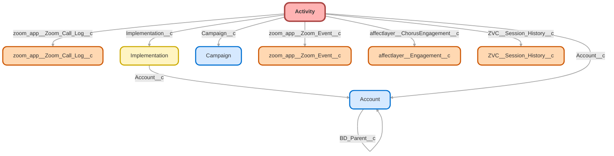

---
hide:
  - path
---

<!-- This file is auto-generated. if you do not want it to be overwritten, set TRUE in the line below -->
<!-- DO_NOT_OVERWRITE_DOC=FALSE -->

## Schema

<!-- Object description -->

## Fields

| Name      | Label | Type | Description |
| :-------- | :---- | :--: | :---------- | 
| Account__c | Account | Lookup | Link Account activity is related to |
| Activities__c | Activities | Number | undefined |
| Activity_Type__c | Activity Type | Picklist | undefined |
| Activity_Type_OS__c | Activity Type OS | Text | Reads the Activity.Subject line and returns an Activity Type based on standardized text (i.e. Call No Answer, Call Connect, etc.) |
| Advisor_Relationship__c | Advisor Relationship | Picklist | undefined |
| affectlayer__AffectLayer_Call_Id__c | AffectLayer Call Id | Text | undefined |
| affectlayer__Chorus_Call_Id__c | Chorus_Call_Id | Text | undefined |
| affectlayer__ChorusEngagement__c | Engagement | Lookup | undefined |
| Bureau__c | Bureau | Text | undefined |
| Business_Unit__c | Business Unit | Text | undefined |
| Calendly_Call_Type__c | Calendly Call Type | Text | Displays the type of Calendly Call for Imps team |
| Calendly_Event_Slug__c | Calendly Event Slug | Text | Calendly Event Slug / end of unique Calendly URL |
| Call_Connect__c | Call Connect | Checkbox | Checks to see if Activity/Subject contains a connected call disposition and returns TRUE if it does. |
| Call_Duration_Hours__c | Call Duration Hours | Text | undefined |
| Call_Duration_Minutes__c | Call Duration Minutes | Text | undefined |
| Call_Duration_Seconds__c | Call Duration Seconds | Text | undefined |
| Call_Duration_Time__c | Call Duration Time | Text | undefined |
| Campaign__c | Campaign | Lookup | Campaign which this specific activity is associated with. |
| Case_Team__c | Case Team | Text | The Team that the owner of the activity is on |
| Comment_Catch_for_Mass_Mail_Type__c | Comment Catch for Mass Mail Type | TextArea | Catches the first 245 characters of the Activity.Comments field when created via a workflow rule, in order to determine mass emails / mail merge from Yesware.) |
| Complete_Task_By__c | Complete Task By: | Date | undefined |
| Completed__c | Completed | Checkbox | undefined |
| Contact_Role__c | Contact Role | Picklist | For CST Calls |
| Created_By_Assignee__c | Created By Assignee | Checkbox | Returns "true" if the activity was created by its owner |
| Created_Date_Time__c | Created Date/Time | DateTime | Custom Formula Field to return Created Date & Time on Activities and Events |
| Current_MStar_Fees__c | Current MStar Fees | Currency | Current MStar fee estimate as of July 2019 |
| Current_User__c | Current User | Number | Used to filter reports for activities owned by the User viewing the report |
| DateSent__c | Date Sent | DateTime | undefined |
| Demo_Completed__c | Demo Completed | Checkbox | undefined |
| Department__c | Department | Picklist | undefined |
| Discovery_Completed__c | Discovery Completed | Checkbox | undefined |
| Dispostion__c | Dispostion | Text | undefined |
| Email__c | Email | Email | undefined |
| EmailName__c | Email Name | Text | undefined |
| EmailSubject__c | Email Subject | Text | undefined |
| EndDate__c | End Date | DateTime | undefined |
| Enroll_Participation_Rate__c | Enroll Participation Rate | Percent | # of Employees w/ balances / # of Eligible Employees |
| Escalated__c | Escalated | Checkbox | undefined |
| Estimated_CY_Fees__c | Estimated CY Fees | Currency | Estimated fees if move to Censibly Yours (as of July 2019) |
| Event_Completed__c | Event Completed | Checkbox | undefined |
| Event_Result__c | Event Result | Picklist | What was the result of the event? |
| Expected_Check_Date__c | Expected Check Date | Date | undefined |
| Five9__Five9SessionId__c | Five9 Session Id | Text | undefined |
| Five9__Five9TaskType__c | Five9 Task Type | Picklist | undefined |
| Five9_Handle_Time_Sec__c | Five9 Handle Time (Sec) | Number | undefined |
| Five9_Wrap_Time_Sec__c | Five9 Wrap Time (Sec) | Number | undefined |
| Five9Agent__c | Five9Agent | Text | undefined |
| Five9AgentExtension__c | Five9AgentExtension | Text | undefined |
| Five9AgentName__c | Five9AgentName | Text | undefined |
| Five9ANI__c | Five9ANI | Text | undefined |
| Five9CallType__c | Five9CallType | Text | undefined |
| Five9Campaign__c | Five9Campaign | Text | undefined |
| Five9DistributionMode__c | Five9DistributionMode | Text | undefined |
| Five9DNIS__c | Five9DNIS | Text | undefined |
| Five9EscalatedCallID__c | Five9EscalatedCallID | Text | undefined |
| Five9HandleTime__c | Five9HandleTime | Text | undefined |
| Five9InteractionDuration__c | Five9InteractionDuration | Text | undefined |
| Five9MediaSubtype__c | Five9MediaSubtype | Text | undefined |
| Five9Queue__c | Five9Queue | Text | undefined |
| Five9TalkAndHoldTimeInSeconds__c | Five9TalkAndHoldTimeInSeconds | Number | undefined |
| Five9WrapTime__c | Five9WrapTime | Text | undefined |
| Imp_Call_Complete__c | Imp Call Complete | Checkbox | Checks related Implementation to see if the call has been completed. |
| Implementation__c | Implementation | Lookup | Implementation the Event is relate to |
| Implementation_Dashboard_Link__c | Implementation Dashboard Link | Text | Link to Implementation Dashboard from related Imp record. |
| InviteeUuid__c | InviteeUuid | Text | undefined |
| LID__Date_Sent__c | Date Sent | DateTime | undefined |
| LID__URL__c | URL | Url | undefined |
| Link1__c | Link 1 | Text | undefined |
| Link2__c | Link 2 | Text | undefined |
| Link3__c | Link 3 | Text | undefined |
| Link4__c | Link 4 | Text | undefined |
| Number_of_Eligible_Participants__c | Number of Eligible Participants | Number | The number of employees that are eligible to participate in the plan |
| Number_of_Employees__c | Number of Employees | Number | Number of Employees at Company |
| Number_of_Participants_Currently_Saving__c | Number of Participants Currently Saving | Number | Confirm # of eligible participants who are actively contributing to the plan from payroll |
| Number_of_Participants_with_a_Balance__c | Number of Participants with a Balance | Number | Number of active participants in the plan with a balance. |
| Open_Event__c | Open Event | Checkbox | For reporting on open events. |
| OpenDate__c | Open Date | DateTime | undefined |
| Paradigm_Company_URL__c | Paradigm Company URL | Text | Copy of Paradigm Company Link from Implementation |
| Partner__c | Partner | Picklist | This field should be used when logging a referral from a PayChoice rep. |
| Payroll_ID__c | Payroll ID | Number | Payroll ID Number |
| Payroll_Platform__c | Payroll Platform | Picklist | undefined |
| Payroll_Schedule__c | Payroll Schedule | Picklist | undefined |
| Payroll_Submission_Date__c | Payroll Submission Date | Date | Date Payroll is Submitted |
| Phone__c | Phone | Phone | undefined |
| Referral_Update__c | Referral Update | Text | This field can be used to track any major changes or updates for a lead that has been referred to us by a partner sales rep. |
| Reminder_Activity__c | Reminder Activity | Checkbox | undefined |
| Safe_Harbor_Notice__c | Safe Harbor Notice | Checkbox | undefined |
| Saving_Move_to_CY__c | Savings from Moving to CY | Currency | MStar Fees - Estimated CY Fees |
| Service_Plan_Type__c | Service/Plan Type | Text | Service Option & Plan Type from Implementation |
| Stamped_Complete__c | Stamped Complete | DateTime | Field stamped the moment the task is marked as complete by a member of the sales team |
| Start_Time__c | Start Time | Text | Call Start Time formula |
| StartDate__c | Start Date | DateTime | undefined |
| Task_ID_18_Char__c | Task ID (18 Char) | Text | undefined |
| Team_Member__c | Team Member | Picklist | What team member is logging this activity? |
| Time_of_Day__c | Time of Day | Time | undefined |
| Total_Plan_Balance__c | Total Plan Balance | Currency | Total Plan Balance as of July 2019 |
| ViewasaWebPage__c | View as a Web Page | Url | undefined |
| Weekday__c | Weekday | Text | Formula Field that returns Weekday based on Created Date |
| zoom_app__Additional_Emails__c | Enter Email Address of Attendees | TextArea | undefined |
| zoom_app__Customer_Duration_of_Meeting__c | Customer Meeting Duration | Number | undefined |
| zoom_app__Customer_Start_Time__c | Customer Start Time | DateTime | undefined |
| zoom_app__Customer_Time_Zone__c | Customer Time Zone | Picklist | undefined |
| zoom_app__ICS_Sequence__c | ICS_Sequence | Number | Sequence of ICS file for invitation email |
| zoom_app__Join_before_host__c | Enable Join Before Host | Checkbox | undefined |
| zoom_app__Make_it_Zoom_Meeting__c | Schedule a Zoom Meeting | Checkbox | undefined |
| zoom_app__Use_personal_Zoom_meeting_Id__c | Use Personal Meeting ID | Checkbox | It's a setting of Zoom meeting. |
| zoom_app__Zoom_Call_Log__c | Zoom Call Log | Lookup | undefined |
| zoom_app__Zoom_Event__c | Zoom Event | Lookup | undefined |
| ZVC__Session_History__c | Session History | Lookup | undefined |

## Related Flows

| Object | Name      | Type | Description |
| :----  | :-------- | :--: | :---------- | 
| 💻 | [QA_Button_Create_QA](../flows/QA_Button_Create_QA.md) [🕒](../flows/QA_Button_Create_QA-history.md) |  Auto Launched Flow | Switched "Floating QA" check from "recordId is null" to being the default outcome Used from multiple objects of origin to create a QA record |
| 💻 | [QA_Screen_Better_Create_QA](../flows/QA_Screen_Better_Create_QA.md) [🕒](../flows/QA_Screen_Better_Create_QA-history.md) |  Screen Flow | <!-- --> |

## Related Apex Classes

| Apex Class | Type |
| :----      | :--: | 
| [LoggerEmailSender](../apex/LoggerEmailSender.md) | Class |
| [SendBetterEmail](../apex/SendBetterEmail.md) | Invocable |
| [SendBetterEmailAddTasksToEmail](../apex/SendBetterEmailAddTasksToEmail.md) | Class |
| [SendBetterEmailRequest](../apex/SendBetterEmailRequest.md) | Lightning Controller |
| [SendBetterEmailTest](../apex/SendBetterEmailTest.md) | Test |

## Related Lightning Pages

| Lightning Page | Type |
| :----      | :--: | 
| [Abandoned_Plan_Review](../pages/Abandoned_Plan_Review.md) |  Record Page |
| [Alt_Opportunity_Layout](../pages/Alt_Opportunity_Layout.md) |  Record Page |
| [Call_QA](../pages/Call_QA.md) |  Record Page |
| [Campaign_Record_Page_BizDev](../pages/Campaign_Record_Page_BizDev.md) |  Record Page |
| [Campaign_Record_Page_BizDev1](../pages/Campaign_Record_Page_BizDev1.md) |  Record Page |
| [Case_QA](../pages/Case_QA.md) |  Record Page |
| [Chat_Transcript_Record_Page1](../pages/Chat_Transcript_Record_Page1.md) |  Record Page |
| [Competitor_Account_Layout](../pages/Competitor_Account_Layout.md) |  Record Page |
| [Complex_Project_Record_Page](../pages/Complex_Project_Record_Page.md) |  Record Page |
| [Console_Case_Layout_Marketing](../pages/Console_Case_Layout_Marketing.md) |  Record Page |
| [Console_Case_Layout_Payroll](../pages/Console_Case_Layout_Payroll.md) |  Record Page |
| [Default_Account_Layout](../pages/Default_Account_Layout.md) |  Record Page |
| [Default_Contact_Layout](../pages/Default_Contact_Layout.md) |  Record Page |
| [Default_Lead_Layout](../pages/Default_Lead_Layout.md) |  Record Page |
| [Default_Opportunity_Layout](../pages/Default_Opportunity_Layout.md) |  Record Page |
| [Dynamic_Account_Page](../pages/Dynamic_Account_Page.md) |  Record Page |
| [Dynamic_Case_Page](../pages/Dynamic_Case_Page.md) |  Record Page |
| [Dynamic_Imp_Record_Page](../pages/Dynamic_Imp_Record_Page.md) |  Record Page |
| [Dynamic_Lead_Page](../pages/Dynamic_Lead_Page.md) |  Record Page |
| [Dynamic_Opp_Page](../pages/Dynamic_Opp_Page.md) |  Record Page |
| [Dynamic_Plan_Page](../pages/Dynamic_Plan_Page.md) |  Record Page |
| [Dynamic_QA](../pages/Dynamic_QA.md) |  Record Page |
| [Dynamic_Transitions_Lighting_Page](../pages/Dynamic_Transitions_Lighting_Page.md) |  Record Page |
| [Imp_Case_Layout](../pages/Imp_Case_Layout.md) |  Record Page |
| [Implementation_Conversion](../pages/Implementation_Conversion.md) |  Record Page |
| [Implementation_Record_Page1](../pages/Implementation_Record_Page1.md) |  Record Page |
| [OPD_Page1](../pages/OPD_Page1.md) |  Record Page |
| [Partner_Account_Layout](../pages/Partner_Account_Layout.md) |  Record Page |
| [Partner_Proposal](../pages/Partner_Proposal.md) |  Record Page |
| [Payroll_Integration](../pages/Payroll_Integration.md) |  Record Page |
| [Plan_Record_Page](../pages/Plan_Record_Page.md) |  Record Page |
| [Quality_Assurance_QA_Record_Page](../pages/Quality_Assurance_QA_Record_Page.md) |  Record Page |
| [Sales_Home](../pages/Sales_Home.md) |  Home Page |
| [Sales_Lightning_Account_Record](../pages/Sales_Lightning_Account_Record.md) |  Record Page |
| [Transition_Record_Page1](../pages/Transition_Record_Page1.md) |  Record Page |
| [Vendor_Account](../pages/Vendor_Account.md) |  Record Page |

## Related Profiles

| Profile | User License |
| :----      | :--: | 
| [Admin](../profiles/Admin.md) |  Salesforce |
| [Analytics Cloud Integration User](../profiles/Analytics%20Cloud%20Integration%20User.md) |  Analytics  Cloud  Integration  User |
| [Analytics Cloud Security User](../profiles/Analytics%20Cloud%20Security%20User.md) |  Analytics  Cloud  Integration  User |
| [Anypoint Integration](../profiles/Anypoint%20Integration.md) |  Identity |
| [B2BMA Integration User](../profiles/B2BMA%20Integration%20User.md) |  B2 B M A  Integration  User |
| [Billing User](../profiles/Billing%20User.md) |  Salesforce |
| [Bot Profile](../profiles/Bot%20Profile.md) |  Salesforce |
| [Business Development](../profiles/Business%20Development.md) |  Salesforce |
| [Call Center](../profiles/Call%20Center.md) |  Salesforce |
| [Chatter External User](../profiles/Chatter%20External%20User.md) |  Chatter  External |
| [Chatter Free User](../profiles/Chatter%20Free%20User.md) |  Chatter  Free |
| [Chatter Moderator User](../profiles/Chatter%20Moderator%20User.md) |  Chatter  Free |
| [Client Onboarding - Admin](../profiles/Client%20Onboarding%20-%20Admin.md) |  Salesforce |
| [Client Onboarding - RM](../profiles/Client%20Onboarding%20-%20RM.md) |  Salesforce |
| [Client Servicing Team](../profiles/Client%20Servicing%20Team.md) |  Salesforce |
| [Compliance Manager](../profiles/Compliance%20Manager.md) |  Salesforce |
| [ContractManager](../profiles/ContractManager.md) |  Salesforce |
| [Director of Operations](../profiles/Director%20of%20Operations.md) |  Salesforce |
| [Director of Sales](../profiles/Director%20of%20Sales.md) |  Salesforce |
| [Distributions](../profiles/Distributions.md) |  Salesforce |
| [Einstein Agent User](../profiles/Einstein%20Agent%20User.md) |  Einstein  Agent |
| [ESW_Agentforce_MIAW_1748035300267 Profile](../profiles/ESW_Agentforce_MIAW_1748035300267%20Profile.md) |  Guest  User  License |
| [ESW_Agentforce_MIAW_1748385215843 Profile](../profiles/ESW_Agentforce_MIAW_1748385215843%20Profile.md) |  Guest  User  License |
| [ESW_CE_Chat_1692890394498 Profile](../profiles/ESW_CE_Chat_1692890394498%20Profile.md) |  Guest  User  License |
| [ESW_CE_Chat_Moe_1693182845676 Profile](../profiles/ESW_CE_Chat_Moe_1693182845676%20Profile.md) |  Guest  User  License |
| [ESW_Login_Help_1697133738638 Profile](../profiles/ESW_Login_Help_1697133738638%20Profile.md) |  Guest  User  License |
| [ESW_Login_Help_Simply_1700075140889 Profile](../profiles/ESW_Login_Help_Simply_1700075140889%20Profile.md) |  Guest  User  License |
| [ESW_Omni_Messaging_1694183770479 Profile](../profiles/ESW_Omni_Messaging_1694183770479%20Profile.md) |  Guest  User  License |
| [ESW_Omni_Messaging_CO_1696448547822 Profile](../profiles/ESW_Omni_Messaging_CO_1696448547822%20Profile.md) |  Guest  User  License |
| [ESW_Omni_Messaging_Sallus_1700075448386 Profile](../profiles/ESW_Omni_Messaging_Sallus_1700075448386%20Profile.md) |  Guest  User  License |
| [ESW_Omni_Messaging_Simply_1700076370188 Profile](../profiles/ESW_Omni_Messaging_Simply_1700076370188%20Profile.md) |  Guest  User  License |
| [ESW_QA_Login_1699666348585 Profile](../profiles/ESW_QA_Login_1699666348585%20Profile.md) |  Guest  User  License |
| [ESW_QA_Messaging_1699974036493 Profile](../profiles/ESW_QA_Messaging_1699974036493%20Profile.md) |  Guest  User  License |
| [ESW_Sales_Chat_1697460991337 Profile](../profiles/ESW_Sales_Chat_1697460991337%20Profile.md) |  Guest  User  License |
| [ESW_Sallus_Login_Chat_1700072925200 Profile](../profiles/ESW_Sallus_Login_Chat_1700072925200%20Profile.md) |  Guest  User  License |
| [External Apps Login User](../profiles/External%20Apps%20Login%20User.md) |  External  Apps  Login |
| [Finance Manager Lightning](../profiles/Finance%20Manager%20Lightning.md) |  Salesforce |
| [Guest License User](../profiles/Guest%20License%20User.md) |  Guest  User  License |
| [Help Center Profile](../profiles/Help%20Center%20Profile.md) |  Guest  User  License |
| [Identity User](../profiles/Identity%20User.md) |  Identity |
| [Incoming_SMS Profile](../profiles/Incoming_SMS%20Profile.md) |  Guest  User  License |
| [IT](../profiles/IT.md) |  Salesforce |
| [Leadership Lightning](../profiles/Leadership%20Lightning.md) |  Salesforce |
| [Leadership](../profiles/Leadership.md) |  Salesforce |
| [Learning %26 Development](../profiles/Learning%20%2526%20Development.md) |  Salesforce |
| [Lightning Client Onboarding](../profiles/Lightning%20Client%20Onboarding.md) |  Salesforce |
| [Lightning Compliance](../profiles/Lightning%20Compliance.md) |  Salesforce |
| [Lightning Saver User](../profiles/Lightning%20Saver%20User.md) |  Salesforce |
| [Lightning Service Manager](../profiles/Lightning%20Service%20Manager.md) |  Salesforce |
| [Lightning Service User](../profiles/Lightning%20Service%20User.md) |  Salesforce |
| [Marketing Team](../profiles/Marketing%20Team.md) |  Salesforce |
| [MarketingProfile](../profiles/MarketingProfile.md) |  Salesforce |
| [Master Administrator](../profiles/Master%20Administrator.md) |  Salesforce |
| [Minimum Access - API Only Integrations](../profiles/Minimum%20Access%20-%20API%20Only%20Integrations.md) |  Salesforce  Integration |
| [Minimum Access - Salesforce](../profiles/Minimum%20Access%20-%20Salesforce.md) |  Salesforce |
| [myubiquity Profile](../profiles/myubiquity%20Profile.md) |  Guest  User  License |
| [Operations VP](../profiles/Operations%20VP.md) |  Salesforce |
| [Operations](../profiles/Operations.md) |  Salesforce |
| [Paradigm Help Center Profile](../profiles/Paradigm%20Help%20Center%20Profile.md) |  Guest  User  License |
| [Payroll Koncierge](../profiles/Payroll%20Koncierge.md) |  Salesforce |
| [Payroll Team](../profiles/Payroll%20Team.md) |  Salesforce |
| [People %26 Culture](../profiles/People%20%2526%20Culture.md) |  Salesforce |
| [Pre-chat Site Profile](../profiles/Pre-chat%20Site%20Profile.md) |  Guest  User  License |
| [Product Innovation Leadership](../profiles/Product%20Innovation%20Leadership.md) |  Salesforce |
| [Product Innovation User](../profiles/Product%20Innovation%20User.md) |  Salesforce |
| [PSM Team](../profiles/PSM%20Team.md) |  Salesforce |
| [R%26W](../profiles/R%2526W.md) |  Salesforce |
| [Read Only](../profiles/Read%20Only.md) |  Salesforce |
| [Sales Administrator](../profiles/Sales%20Administrator.md) |  Salesforce |
| [Sales Coordinator](../profiles/Sales%20Coordinator.md) |  Salesforce |
| [Sales Insights Integration User](../profiles/Sales%20Insights%20Integration%20User.md) |  Sales  Insights  Integration  User |
| [Sales Team - Limited](../profiles/Sales%20Team%20-%20Limited.md) |  Salesforce |
| [Sales Team](../profiles/Sales%20Team.md) |  Salesforce |
| [Salesforce API Only System Integrations](../profiles/Salesforce%20API%20Only%20System%20Integrations.md) |  Salesforce  Integration |
| [SalesforceIQ Integration User](../profiles/SalesforceIQ%20Integration%20User.md) |  Salesforce I Q  Integration  User |
| [Saver Manager](../profiles/Saver%20Manager.md) |  Salesforce |
| [Simple Survey Profile](../profiles/Simple%20Survey%20Profile.md) |  Guest  User  License |
| [Simply Help Center Profile](../profiles/Simply%20Help%20Center%20Profile.md) |  Guest  User  License |
| [SolutionManager](../profiles/SolutionManager.md) |  Salesforce |
| [Standard](../profiles/Standard.md) |  Salesforce |
| [StandardAul](../profiles/StandardAul.md) |  Salesforce  Platform |
| [Super System Administrator](../profiles/Super%20System%20Administrator.md) |  Salesforce |
| [Sys Dev Admin](../profiles/Sys%20Dev%20Admin.md) |  Salesforce |
| [Transitions Team](../profiles/Transitions%20Team.md) |  Salesforce |
| [Ubiquity Help Center Profile](../profiles/Ubiquity%20Help%20Center%20Profile.md) |  Guest  User  License |
| [Zoom Webhooks Profile](../profiles/Zoom%20Webhooks%20Profile.md) |  Guest  User  License |

## Related Permission Sets

| Permission Set | User License |
| :----      | :--: | 
| [Attachments_and_Notes_Migrator](../permissionsets/Attachments_and_Notes_Migrator.md) | None |
| [Automation_Team_Imp_Project_Tasks](../permissionsets/Automation_Team_Imp_Project_Tasks.md) | None |
| [Call_Center_Client_Onboarding](../permissionsets/Call_Center_Client_Onboarding.md) | None |
| [Data_Loader](../permissionsets/Data_Loader.md) | None |
| [Developer](../permissionsets/Developer.md) | None |
| [ExactTarget_Integration_Admin](../permissionsets/ExactTarget_Integration_Admin.md) | None |
| [ExactTarget_Integration_Editable](../permissionsets/ExactTarget_Integration_Editable.md) | None |
| [MagicMover](../permissionsets/MagicMover.md) | None |
| [Manager](../permissionsets/Manager.md) | None |
| [Marketing_Cloud_System_User](../permissionsets/Marketing_Cloud_System_User.md) | None |
| [Master](../permissionsets/Master.md) | None |
| [Modify_All](../permissionsets/Modify_All.md) | None |
| [QA_Access_Dynamic](../permissionsets/QA_Access_Dynamic.md) | None |
| [QA_Access](../permissionsets/QA_Access.md) | None |
| [QA_Manage_Designs](../permissionsets/QA_Manage_Designs.md) | None |
| [sfdcInternalInt__sfdc_a360_sfcrm_data_extract](../permissionsets/sfdcInternalInt__sfdc_a360_sfcrm_data_extract.md) | None |
| [sfdcInternalInt__sfdc_activityplatform](../permissionsets/sfdcInternalInt__sfdc_activityplatform.md) | None |
| [sfdcInternalInt__sfdc_articlerecommendations](../permissionsets/sfdcInternalInt__sfdc_articlerecommendations.md) | None |
| [sfdcInternalInt__sfdc_einsteinagent](../permissionsets/sfdcInternalInt__sfdc_einsteinagent.md) | None |
| [sfdcInternalInt__sfdc_replyrecommendations](../permissionsets/sfdcInternalInt__sfdc_replyrecommendations.md) | None |
| [sfdcInternalInt__sfdc_slack](../permissionsets/sfdcInternalInt__sfdc_slack.md) | None |
| [Ubiquity_Service_Agent_Permissions](../permissionsets/Ubiquity_Service_Agent_Permissions.md) | None |
| [View_All](../permissionsets/View_All.md) | None |
| [View_QA_Records](../permissionsets/View_QA_Records.md) | None |

_Documentation generated with [sfdx-hardis](https://sfdx-hardis.cloudity.com), by [Cloudity](https://www.cloudity.com/) & [friends](https://github.com/hardisgroupcom/sfdx-hardis/graphs/contributors)_
