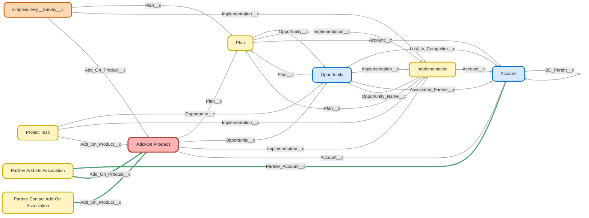

---
hide:
  - path
---

<!-- This file is auto-generated. if you do not want it to be overwritten, set TRUE in the line below -->
<!-- DO_NOT_OVERWRITE_DOC=FALSE -->

## Schema

<!-- Object description -->

## Fields

| Name      | Label | Type | Description |
| :-------- | :---- | :--: | :---------- | 
| Account__c | Account | Lookup | Account associated with Add-On Product |
| ACH_Enabled__c | ACH Enabled | Picklist | Does the client have ACH enabled for Payroll submissions? |
| Add_Payroll__c | Add Payroll | Date | undefined |
| Added_Payroll_Vendor_to_Paradigm__c | Added Payroll Vendor to Paradigm | Date | undefined |
| Agreement_for_Services__c | Agreement for Services | Checkbox | Agreement for Services Received |
| Agreement_Received__c | Agreement Received | Date | Date Agreement for Services was signed |
| Amendment_Needed__c | Amendment Needed | Date | Date client notifies Ubiquity amendment is needed (if applicable) |
| Amount__c | Amount | Currency | undefined |
| Amount_Before_Discount__c | Amount Before Discount | Currency | Amount before discount is applied |
| Approval_Requested__c | Approval Requested | Checkbox | undefined |
| Audit_Package_Fees_Billed__c | Audit Package Fees Billed | Date | Date Audit Package Fees were billed |
| Audit_Package_Sent__c | Audit Package Sent | Date | Date complete Audit Package is sent to client |
| Authorization_Form_Received__c | Authorization Form Received | Date | undefined |
| Basic_Match_Source_Header_Name__c | Basic Match Source Header Name | Text | undefined |
| Client_Stage__c | Client Stage | Picklist | undefined |
| Client_Success_Teams__c | Client Success Teams | Text | undefined |
| Compensation_Header_Name__c | Compensation Header Name | Text | Name of Compensation Header in client file |
| Created_Support_Tasks__c | Created Support Tasks | Date | undefined |
| Current_Payroll_Provider__c | Current Payroll Provider | Text | Current Payroll Provider |
| Custodian__c | Custodian | Text | Client's Custodian |
| Data_Cleaning_Method__c | Data Cleaning Method | Picklist | What method is used to clean the file prior to uploading? |
| Date_Given_To_Third_Party_Integrator__c | Date Given To Third Party Integrator | Date | undefined |
| Date_Transferred_to_Finch__c | Date Transferred to Finch | Date | undefined |
| Discount__c | Discount | Currency | Opportunity Discount |
| Discount_Notes__c | Discount Notes | Text | Opportunity Discount Notes |
| Discretionary_Match_Frequency__c | Discretionary Match Frequency | Picklist | EPS data from EPS Survey |
| Downloadable_SOC_1_Approved__c | Downloadable SOC-1 Approved | Checkbox | undefined |
| Downloadable_SOC_1_Requested__c | Downloadable SOC-1 Requested | Date | undefined |
| Draft_5500_Complete__c | Draft 5500 Complete | Date | Draft 5500 Complete for package (Compliance) |
| Employee_Detail_Report_Name__c | Employee Detail Report Name | Text | EPS Add on Product field - updated from EPS Survey |
| Enhanced_Payroll_Services_Type__c | Enhanced Payroll Services Type | Picklist | Level of Enhanced Payroll Services |
| Estimated_Integration_Completion_Date__c | Estimated Integration Completion Date | Date | Date the integration is expected to be completed. Typically 2 - 6 weeks from request date. |
| Fee_Waive_Date__c | Fee Waive Date | Date | Date the fee for manual eps was waived |
| File_Submission_Method__c | File Submission Method | Picklist | How will Ubiquity receive files? |
| File_Upload_Method__c | File Upload Method | Picklist | How is the file uploaded to Paradigm? |
| First_Year_Audit__c | First Year Audit | Checkbox | Indicates Client is completing Audit with Ubiquity for the first time |
| Form_5500_Extension__c | Form 5500 Extension | Date | Date extension for Form 5500 is requested |
| Hold_Expected_End_Date__c | Hold Expected End Date | Date | Date the Hold is expected to end. |
| Hold_Reason__c | Hold Reason | Text | Reason integration was put on hold. |
| Hold_Release_Date__c | Hold Release Date | Date | Date Hold was released |
| Hold_Start_Date__c | Hold Start Date | Date | Date the Hold started |
| Hours_Header_Name__c | Hours Header Name | Text | Name of Hours Column in client file |
| Hours_Worked__c | Hours Worked | Number | Hours worked on project |
| Implementation__c | Implementation | Lookup | undefined |
| Implementation_Status__c | Implementation Status | Text | undefined |
| Integration_Authorization_Received__c | Integration Authorization Received | Date | Confirms whether the form was received from the client to begin the integration set up. |
| Integration_Completed__c | Integration Setup Completed | Date | Date integration is completed. |
| Integration_Live_Date__c | Integration Live Date | Date | When this date is filled out it sets the Add-On Stage to "Completed Setup" |
| Integration_Submissions__c | Integration Submissions | MultiselectPicklist | What is submitted with the integration? |
| Integration_Type__c | Integration Type | Picklist | What type of integration do they have? |
| Last_Stage_Change__c | Last Stage Change | Date | undefined |
| Loan_Source_Header_Name__c | Loan Source Header Name | Text | undefined |
| Login_Credentials_Received__c | Login Credentials Received | Date | Date Login Credentials from third party is received |
| Login_Credentials_Requested__c | Login Credentials Requested | Date | undefined |
| Matrix_Fees_Billed__c | Matrix Fees Billed | Date | Date Matrix Fees were billed (Matrix plans only) |
| Multiple_Funding_Accounts__c | Multiple Funding Accounts | Picklist | Does the Plan have multiple funding accounts? |
| Multiple_Locations__c | Multiple Locations | Picklist | Does the Plan have multiple locations? |
| Multiple_Payroll_Schedules__c | Multiple Payroll Schedules | Picklist | Does the Plan have multiple payroll schedules? |
| Needs_Form_5500__c | Needs Form 5500 | Picklist | Does Audit need Form 5500? Clients who have Deconverted in the prior year do not need a Form 5500. |
| Next_Payroll_Check_Date__c | Next Payroll Check Date | Date | EPS Add On Product field from EPS Survey |
| No_Start_Date__c | No-Start Date | Date | Date Product No-Starts |
| Notes__c | Notes | LongTextArea | Used for notes. |
| Off_Cycle_Contact__c | Off Cycle Notification | Picklist | EPS Add on Product field - updated from EPS Survey |
| Off_Cycle_Payrolls__c | Off Cycle Payrolls | Picklist | EPS Add on Product field - updated from EPS Survey |
| Opinion_Letter_Received__c | Opinion Letter Received | Date | Date opinion letter received from auditor |
| Opportunity__c | Opportunity | Lookup | Opportunity the Add-On Product is sold from |
| Opportunity_Notes__c | Opportunity Notes | LongTextArea | Notes from Opportunity Page |
| Opportunity_Owner__c | Opportunity Owner | Text | Opportunity Owner |
| Paradigm_Confirmation_Sent__c | Paradigm Confirmation Sent | Date | Date confirmation of successful payroll submission email sent |
| Passed_Validation_Check__c | Passed Validation Check | Picklist | Did Payroll file pass all validation checks? |
| Payroll_Integration__c | Payroll Integration | Picklist | Does the client have direct integration through their Payroll Provider? |
| Payroll_Provider__c | Payroll Provider | Text | Payroll provider from the Opportunity |
| Payroll_Reconciliation_Frequency__c | Payroll Reconciliation Frequency | Picklist | Payroll reconciliation frequency |
| Payroll_Report_Name__c | Payroll Report Name | Text | EPS Add on Product field - updated from EPS Survey |
| Payroll_Vendor__c | Payroll Vendor | Picklist | Payroll Vendor used by EPS clients |
| Payroll_Vendor_Email__c | Payroll Vendor Email | Email | undefined |
| Payroll_Vendor_Fees__c | Payroll Vendor Fees | Currency | Fees charged by payroll vendor for EPS clients |
| Plan__c | Plan | Lookup | Plan associated with the Add-On Product |
| Platform_Username__c | Platform Username | Text | undefined |
| Pretax_Catchup__c | Pretax Catchup Source Header Name | Text | EPS Add on Product field - updated from EPS Survey |
| Pretax_Source_Header_Name__c | Pretax Source Header Name | Text | undefined |
| Primary_Payroll_Offset_Days__c | Primary Payroll Offset Days | Number | undefined |
| Primary_Payroll_Schedule__c | Primary Payroll Schedule | Text | This is the Payroll Schedule in Paradigm |
| Product_Effective_Date__c | Product Effective Date | Date | Date Add-On Product is effective |
| Product_End_Reason__c | Product End Reason | Picklist | Reason Client is ending Product |
| Product_Notes__c | Product Notes | LongTextArea | undefined |
| Product_Saved_Date__c | Product Saved Date | Date | Date Product is saved after it has been Stalled |
| Product_Saved_Notes__c | Product Saved Notes | LongTextArea | Add notes from un-stalling the integration. |
| Product_Stage__c | Product Stage | Picklist | undefined |
| Product_Stall_Date__c | Product Stall Date | Date | Date Product is identified as being Stalled |
| Product_Stall_Notes__c | Product Stall Notes | LongTextArea | undefined |
| Product_Stalled_Reason__c | Product Stalled Reason | Picklist | Reason for Product stall |
| Product_Status__c | Product Status | Picklist | Various stages of Add-On Product |
| Product_Termination_Complete__c | Product Termination Complete | Date | Date Product Termination is complete |
| Product_Termination_Notes__c | Product Termination Notes | LongTextArea | undefined |
| Product_Type__c | Product Type | Picklist | undefined |
| Profit_Sharing_in_Payroll__c | Profit Sharing in Payroll | Picklist | Survey data from EPS Survey |
| Profit_Sharing_Source_Header_Name__c | Profit Sharing Source Header Name | Text | undefined |
| QA_Check_Completed__c | QA Check Completed | Date | undefined |
| Qualified_for_Third_Party_Integration__c | Qualified for Third Party Integration | Picklist | undefined |
| Request_Date__c | Request Date | Date | Date Product is requested to start (may be different from final Effective Date) |
| Requested_Revised_Test_Files__c | Requested Revised Test Files | Date | undefined |
| Requested_Source_Mapping__c | Requested Source Mapping | Date | undefined |
| Reviewed_Test_File__c | Reviewed Test File | Date | undefined |
| ROTH_Catchup_Source_Header_Name__c | ROTH Catchup Source Header Name | Text | EPS Add on Product field - updated from EPS Survey |
| Roth_Source_Header_Name__c | Roth Source Header Name | Text | undefined |
| Safe_Harbor_Frequency__c | Safe Harbor Frequency | Picklist | EPS data from EPS Survey |
| Salesforce_Plan_Status__c | Salesforce Plan Status | Text | Plan Status in Salesforce |
| Sampling_Followup_Needed__c | Sampling Followup Needed | Picklist | Was additional followup needed after initial sampling documents sent? |
| Sampling_Requested__c | Sampling Requested | Date | Date audit sampling is requested |
| Sampling_Sent__c | Sampling Sent | Date | Date Sampling is sent back to client |
| Scheduled_Product_End_Date__c | Scheduled Product End Date | Date | Date the Product use is scheduled to end |
| Secondary_Payroll_Offset_Days__c | Secondary Payroll Offset Days | Number | Number of Secondary Payroll Offset Days |
| Secondary_Payroll_Schedule__c | Secondary Payroll Schedule | Picklist | Secondary Payroll Schedule |
| Secure_Files_Received__c | Secure Files Received | Date | Files received using secure file transmission (payroll, census) |
| Sent_Completion_Email__c | Sent Completion Email | Date | undefined |
| Sent_Login_Test_Results__c | Sent Login Test Results | Date | undefined |
| Service_Option__c | Service Option | Picklist | undefined |
| SH_Match_Source_Field_Name__c | Safe Harbor Match Source Header Name | Text | undefined |
| Source_Mapping_Received__c | Source Mapping Received | Date | undefined |
| Taken_Back_From_3rd_Party_Integrator__c | Taken Back From 3rd Party Integrator | Date | undefined |
| Team_Member__c | Team Member | Picklist | undefined |
| Tertiary_Payroll_Offset_Days__c | Tertiary Payroll Offset Days | Number | Number of Offset Days for tertiary Payroll schedule |
| Tertiary_Payroll_Schedule__c | Tertiary Payroll Schedule | Picklist | Third Payroll Schedule |
| Test_File_Received__c | Test File Received | Date | Test File from Partner received |
| Test_File_Review_Date__c | Test File Review Date | Date | Date Test File is reviewed |
| Test_Files_Failed__c | Test Files Failed | Date | undefined |
| Test_Files_Passed__c | Test Files Passed | Date | Date that the test files were confirmed Passed. |
| Tested_Login_Credentials__c | Tested Login Credentials | Date | undefined |
| Third_Party_Integrator__c | Third Party Integrator | Picklist | Name of Third Party Integrator (not direct Integration through Payroll Provider) |
| Third_Party_Integrator_Fees__c | Third Party Integrator Fees | Currency | undefined |
| Timezone__c | Timezone | Text | undefined |
| TPI_Removal_Notes__c | TPI Removal Notes | LongTextArea | undefined |
| Transmission_Method__c | Transmission Method | Picklist | How is the file transmitted? |
| Trust_Report_Fee__c | Trust Report Fee | Picklist | Indicates that client needs to pay additional Trust Report fee (Matrix only) |
| Trust_Report_Received__c | Trust Report Received | Date | Date Trust Report is received (Matrix plans only) |
| Trust_Report_Requested__c | Trust Report Requested | Date | Date Trust Report is requested (Matrix plans only) |
| Ubiquity_Plan_Effective_Date__c | Ubiquity Plan Effective Date | Date | undefined |
| Update_Add_On_Product__c | Update Add-On Product | Date | undefined |
| Vendor_Contract_Received__c | Vendor Contract Received | Date | undefined |
| Verified_1st_Payroll_Processed__c | Verified 1st Payroll Processed | Date | undefined |
| Verify_Data_Point_Accuracy__c | Verify Data Point Accuracy | Picklist | Data from EPS Survey |
| Welcome_Email_Sent__c | Welcome Email Sent | Date | Date Welcome Email with instructional PDF sent to Sponsor |
| X1st_Bill_Date__c | 1st Bill Date | Date | Date client will be billed for first time |
| X1st_Payroll_Expected__c | 1st Payroll Expected | Date | Date first Payroll is expected after new product or integration is established. |
| X1st_Payroll_Funded__c | 1st Payroll Funded | Picklist | Did the first Payroll successfully fund? |
| X1st_Payroll_Funded_Date__c | 1st Payroll Funded Date | Date | Date that 1st payroll funded |
| X1st_Payroll_Uploaded__c | 1st Payroll Uploaded | Date | Date 1st Payroll Uploaded into Paradigm after new product or integration is established. |
| X2nd_Payroll_Funded__c | 2nd Payroll Funded | Picklist | Did the second Payroll successfully fund? |
| X2nd_Payroll_Next_Check_Date__c | 2nd Payroll Next Check Date | Date | EPS Add on Product field - updated from EPS Survey |
| X2nd_Payroll_Uploaded__c | 2nd Payroll Uploaded | Date | Date 2nd Payroll Uploaded into Paradigm |
| X360_Attribute_turned_off__c | 360 Attribute turned off | Date | undefined |
| X360_Attribute_turned_on__c | 360 Attribute turned on | Date | undefined |
| X360_File_to_Provider__c | 360 File to Provider | Date | Date test file is sent to provider for 360 Integration |
| X360_File_to_Provider_Box__c | 360 File to Provider | Checkbox | undefined |
| X3rd_Payroll_Next_Check_Date__c | 3rd Payroll Next Check Date | Date | EPS Add on Product field - updated from EPS Survey |
| X5500_Sent__c | 5500 Sent | Date | Form 5500 sent to client for signature |
| X5500_Signed__c | 5500 Signed | Date | Date 5500 signed by client |

## Related Flows

| Object | Name      | Type | Description |
| :----  | :-------- | :--: | :---------- | 
| 💻 | [Docusign_Autolaunched_Send_Transition_Docusign](../flows/Docusign_Autolaunched_Send_Transition_Docusign.md) [🕒](../flows/Docusign_Autolaunched_Send_Transition_Docusign-history.md) |  Auto Launched Flow | <!-- --> |
| 💻 | [Payroll_Integration_Button_Create_Payroll_Opp_and_Add_On](../flows/Payroll_Integration_Button_Create_Payroll_Opp_and_Add_On.md) [🕒](../flows/Payroll_Integration_Button_Create_Payroll_Opp_and_Add_On-history.md) |  Screen Flow | <!-- --> |
| Add_On_Products__c | [Add_On_After_Trigger_Payroll_Master](../flows/Add_On_After_Trigger_Payroll_Master.md) [🕒](../flows/Add_On_After_Trigger_Payroll_Master-history.md) |  Record After Save | <!-- --> |
| Add_On_Products__c | [Add_On_After_Trigger_Send_Payroll_Integration_Email](../flows/Add_On_After_Trigger_Send_Payroll_Integration_Email.md) [🕒](../flows/Add_On_After_Trigger_Send_Payroll_Integration_Email-history.md) |  Record After Save | <!-- --> |
| Add_On_Products__c | [Add_On_Before_Save_Payroll_Master](../flows/Add_On_Before_Save_Payroll_Master.md) [🕒](../flows/Add_On_Before_Save_Payroll_Master-history.md) |  Record Before Save | Master flow for before-save updates |
| Add_On_Products__c | [Add_On_Product_After_Close_Unused_Tasks](../flows/Add_On_Product_After_Close_Unused_Tasks.md) [🕒](../flows/Add_On_Product_After_Close_Unused_Tasks-history.md) |  Record After Save | <!-- --> |
| Add_On_Products__c | [Add_On_Product_After_Update_Create_Project_Tasks](../flows/Add_On_Product_After_Update_Create_Project_Tasks.md) [🕒](../flows/Add_On_Product_After_Update_Create_Project_Tasks-history.md) |  Record After Save | 10/7/22- Removed lookup to Opportunity |
| Add_On_Products__c | [Add_On_Product_After_Update_Creation_Point_Project_Tasks](../flows/Add_On_Product_After_Update_Creation_Point_Project_Tasks.md) [🕒](../flows/Add_On_Product_After_Update_Creation_Point_Project_Tasks-history.md) |  Record After Save | Used to build Source Mapping Task when Survey is Received. Removed check for duplicate emails because it wasn't preventing other duplications. 10/7/22- Removed lookup to Opportunity. |
| Add_On_Products__c | [Add_On_Product_After_Update_Master_Flow](../flows/Add_On_Product_After_Update_Master_Flow.md) [🕒](../flows/Add_On_Product_After_Update_Master_Flow-history.md) |  Record After Save | Included Approval Process Name in Submit for Approval action to prevent flow erroring. JI 10/13/23  Changed Imp Request Cases to go to PK team. 9/14 Changed Login Requested and Received decision elements to send payroll case to payroll instead of PK. 10/27- Removed Implementation Request Date entered decision path to create case for PK, Melissa said no longer necessary. Removed Login Credentials Requested case and Login Credentials received case per Stormy's request 1/31/23. 6/29/23- Removed Product End Date case for PK team based on Aaron's request. |
| Add_On_Products__c | [Add_On_Product_Before_Trigger_Master_Flow](../flows/Add_On_Product_Before_Trigger_Master_Flow.md) [🕒](../flows/Add_On_Product_Before_Trigger_Master_Flow-history.md) |  Record Before Save | Removed the step that adds opportunity notes, that happens when Add-On is created |
| Add_On_Products__c | [Add_On_Product_Before_Update_Stage_Updates](../flows/Add_On_Product_Before_Update_Stage_Updates.md) [🕒](../flows/Add_On_Product_Before_Update_Stage_Updates-history.md) |  Record Before Save | Made updates based on Melissa's spreadsheet. 9/8- Added new add-on stages and statuses |
| Add_On_Products__c | [Add_On_Scheduled_Send_Auto_Emails](../flows/Add_On_Scheduled_Send_Auto_Emails.md) [🕒](../flows/Add_On_Scheduled_Send_Auto_Emails-history.md) |  Scheduled | This flow runs daily and checks the difference between the current date and the last time the add-on stage was changed, then sends the corresponding auto-email |
| Opportunity | [Opportunity_After_Update_Create_Add_On_Product](../flows/Opportunity_After_Update_Create_Add_On_Product.md) [🕒](../flows/Opportunity_After_Update_Create_Add_On_Product-history.md) |  Record After Save | When opp is marked closed/won, create related add-on product record. |
| Opportunity | [Sales_Opportunity_Won_Next_Steps](../flows/Sales_Opportunity_Won_Next_Steps.md) [🕒](../flows/Sales_Opportunity_Won_Next_Steps-history.md) |  Record After Save | Added validation for partnership opportunities with an associated objective.  Prevents closure with an incomplete objective |
| Transition__c | [Transition_After_Trigger_Create_Case_for_Payroll](../flows/Transition_After_Trigger_Create_Case_for_Payroll.md) [🕒](../flows/Transition_After_Trigger_Create_Case_for_Payroll-history.md) |  Record After Save | When a Termination or Deconversion Transition record is created, create case for Payroll team if there is an EPS or DI Add-On/Opp. Checks to see if there is an open or closed/won opp, then checks to see if there is an add-on record. If there is no add-on or if the add-on isn't terminated, create the case. |
| Transition__c | [Transition_After_Update_Scheduled_Create_Last_Payroll_Case](../flows/Transition_After_Update_Scheduled_Create_Last_Payroll_Case.md) [🕒](../flows/Transition_After_Update_Scheduled_Create_Last_Payroll_Case-history.md) |  Record After Save | <!-- --> |
| Transition__c | [Transition_Scheduled_Update_Statuses_and_Create_Cases](../flows/Transition_Scheduled_Update_Statuses_and_Create_Cases.md) [🕒](../flows/Transition_Scheduled_Update_Statuses_and_Create_Cases-history.md) |  Scheduled | <!-- --> |
| Transition__c | [Transitions_After_Trigger_Automated_Cases_and_Emails](../flows/Transitions_After_Trigger_Automated_Cases_and_Emails.md) [🕒](../flows/Transitions_After_Trigger_Automated_Cases_and_Emails-history.md) |  Record After Save | Replaced compliance shared user with new compliance queue |
| simplesurvey__Survey__c | [Payroll_EPS_Survey](../flows/Payroll_EPS_Survey.md) [🕒](../flows/Payroll_EPS_Survey-history.md) |  Workflow | Updates EPS Object with Survey Answers |

## Related Apex Classes

| Apex Class | Type |
| :----      | :--: | 
| [StampDateTest](../apex/StampDateTest.md) | Test |
| [StampDate](../apex/StampDate.md) | Class |

## Related Lightning Pages

| Lightning Page | Type |
| :----      | :--: | 
| [Add_On_Product_Record_Page](../pages/Add_On_Product_Record_Page.md) |  Record Page |
| [Add_On_Product_Record_Page1](../pages/Add_On_Product_Record_Page1.md) |  Record Page |
| [Payroll_Integration](../pages/Payroll_Integration.md) |  Record Page |

## Related Profiles

| Profile | User License |
| :----      | :--: | 
| [Admin](../profiles/Admin.md) |  Salesforce |
| [Analytics Cloud Integration User](../profiles/Analytics%20Cloud%20Integration%20User.md) |  Analytics  Cloud  Integration  User |
| [Analytics Cloud Security User](../profiles/Analytics%20Cloud%20Security%20User.md) |  Analytics  Cloud  Integration  User |
| [Anypoint Integration](../profiles/Anypoint%20Integration.md) |  Identity |
| [B2BMA Integration User](../profiles/B2BMA%20Integration%20User.md) |  B2 B M A  Integration  User |
| [Billing User](../profiles/Billing%20User.md) |  Salesforce |
| [Bot Profile](../profiles/Bot%20Profile.md) |  Salesforce |
| [Business Development](../profiles/Business%20Development.md) |  Salesforce |
| [Call Center](../profiles/Call%20Center.md) |  Salesforce |
| [Chatter External User](../profiles/Chatter%20External%20User.md) |  Chatter  External |
| [Chatter Free User](../profiles/Chatter%20Free%20User.md) |  Chatter  Free |
| [Chatter Moderator User](../profiles/Chatter%20Moderator%20User.md) |  Chatter  Free |
| [Client Onboarding - Admin](../profiles/Client%20Onboarding%20-%20Admin.md) |  Salesforce |
| [Client Onboarding - RM](../profiles/Client%20Onboarding%20-%20RM.md) |  Salesforce |
| [Client Servicing Team](../profiles/Client%20Servicing%20Team.md) |  Salesforce |
| [Compliance Manager](../profiles/Compliance%20Manager.md) |  Salesforce |
| [ContractManager](../profiles/ContractManager.md) |  Salesforce |
| [Director of Operations](../profiles/Director%20of%20Operations.md) |  Salesforce |
| [Director of Sales](../profiles/Director%20of%20Sales.md) |  Salesforce |
| [Distributions](../profiles/Distributions.md) |  Salesforce |
| [Einstein Agent User](../profiles/Einstein%20Agent%20User.md) |  Einstein  Agent |
| [ESW_Agentforce_MIAW_1748035300267 Profile](../profiles/ESW_Agentforce_MIAW_1748035300267%20Profile.md) |  Guest  User  License |
| [ESW_Agentforce_MIAW_1748385215843 Profile](../profiles/ESW_Agentforce_MIAW_1748385215843%20Profile.md) |  Guest  User  License |
| [ESW_CE_Chat_1692890394498 Profile](../profiles/ESW_CE_Chat_1692890394498%20Profile.md) |  Guest  User  License |
| [ESW_CE_Chat_Moe_1693182845676 Profile](../profiles/ESW_CE_Chat_Moe_1693182845676%20Profile.md) |  Guest  User  License |
| [ESW_Login_Help_1697133738638 Profile](../profiles/ESW_Login_Help_1697133738638%20Profile.md) |  Guest  User  License |
| [ESW_Login_Help_Simply_1700075140889 Profile](../profiles/ESW_Login_Help_Simply_1700075140889%20Profile.md) |  Guest  User  License |
| [ESW_Omni_Messaging_1694183770479 Profile](../profiles/ESW_Omni_Messaging_1694183770479%20Profile.md) |  Guest  User  License |
| [ESW_Omni_Messaging_CO_1696448547822 Profile](../profiles/ESW_Omni_Messaging_CO_1696448547822%20Profile.md) |  Guest  User  License |
| [ESW_Omni_Messaging_Sallus_1700075448386 Profile](../profiles/ESW_Omni_Messaging_Sallus_1700075448386%20Profile.md) |  Guest  User  License |
| [ESW_Omni_Messaging_Simply_1700076370188 Profile](../profiles/ESW_Omni_Messaging_Simply_1700076370188%20Profile.md) |  Guest  User  License |
| [ESW_QA_Login_1699666348585 Profile](../profiles/ESW_QA_Login_1699666348585%20Profile.md) |  Guest  User  License |
| [ESW_QA_Messaging_1699974036493 Profile](../profiles/ESW_QA_Messaging_1699974036493%20Profile.md) |  Guest  User  License |
| [ESW_Sales_Chat_1697460991337 Profile](../profiles/ESW_Sales_Chat_1697460991337%20Profile.md) |  Guest  User  License |
| [ESW_Sallus_Login_Chat_1700072925200 Profile](../profiles/ESW_Sallus_Login_Chat_1700072925200%20Profile.md) |  Guest  User  License |
| [External Apps Login User](../profiles/External%20Apps%20Login%20User.md) |  External  Apps  Login |
| [Finance Manager Lightning](../profiles/Finance%20Manager%20Lightning.md) |  Salesforce |
| [Guest License User](../profiles/Guest%20License%20User.md) |  Guest  User  License |
| [Help Center Profile](../profiles/Help%20Center%20Profile.md) |  Guest  User  License |
| [Identity User](../profiles/Identity%20User.md) |  Identity |
| [Incoming_SMS Profile](../profiles/Incoming_SMS%20Profile.md) |  Guest  User  License |
| [IT](../profiles/IT.md) |  Salesforce |
| [Leadership Lightning](../profiles/Leadership%20Lightning.md) |  Salesforce |
| [Leadership](../profiles/Leadership.md) |  Salesforce |
| [Learning %26 Development](../profiles/Learning%20%2526%20Development.md) |  Salesforce |
| [Lightning Client Onboarding](../profiles/Lightning%20Client%20Onboarding.md) |  Salesforce |
| [Lightning Compliance](../profiles/Lightning%20Compliance.md) |  Salesforce |
| [Lightning Saver User](../profiles/Lightning%20Saver%20User.md) |  Salesforce |
| [Lightning Service Manager](../profiles/Lightning%20Service%20Manager.md) |  Salesforce |
| [Lightning Service User](../profiles/Lightning%20Service%20User.md) |  Salesforce |
| [Marketing Team](../profiles/Marketing%20Team.md) |  Salesforce |
| [MarketingProfile](../profiles/MarketingProfile.md) |  Salesforce |
| [Master Administrator](../profiles/Master%20Administrator.md) |  Salesforce |
| [Minimum Access - API Only Integrations](../profiles/Minimum%20Access%20-%20API%20Only%20Integrations.md) |  Salesforce  Integration |
| [Minimum Access - Salesforce](../profiles/Minimum%20Access%20-%20Salesforce.md) |  Salesforce |
| [myubiquity Profile](../profiles/myubiquity%20Profile.md) |  Guest  User  License |
| [Operations VP](../profiles/Operations%20VP.md) |  Salesforce |
| [Operations](../profiles/Operations.md) |  Salesforce |
| [Paradigm Help Center Profile](../profiles/Paradigm%20Help%20Center%20Profile.md) |  Guest  User  License |
| [Payroll Koncierge](../profiles/Payroll%20Koncierge.md) |  Salesforce |
| [Payroll Team](../profiles/Payroll%20Team.md) |  Salesforce |
| [People %26 Culture](../profiles/People%20%2526%20Culture.md) |  Salesforce |
| [Pre-chat Site Profile](../profiles/Pre-chat%20Site%20Profile.md) |  Guest  User  License |
| [Product Innovation Leadership](../profiles/Product%20Innovation%20Leadership.md) |  Salesforce |
| [Product Innovation User](../profiles/Product%20Innovation%20User.md) |  Salesforce |
| [PSM Team](../profiles/PSM%20Team.md) |  Salesforce |
| [R%26W](../profiles/R%2526W.md) |  Salesforce |
| [Read Only](../profiles/Read%20Only.md) |  Salesforce |
| [Sales Administrator](../profiles/Sales%20Administrator.md) |  Salesforce |
| [Sales Coordinator](../profiles/Sales%20Coordinator.md) |  Salesforce |
| [Sales Insights Integration User](../profiles/Sales%20Insights%20Integration%20User.md) |  Sales  Insights  Integration  User |
| [Sales Team - Limited](../profiles/Sales%20Team%20-%20Limited.md) |  Salesforce |
| [Sales Team](../profiles/Sales%20Team.md) |  Salesforce |
| [Salesforce API Only System Integrations](../profiles/Salesforce%20API%20Only%20System%20Integrations.md) |  Salesforce  Integration |
| [SalesforceIQ Integration User](../profiles/SalesforceIQ%20Integration%20User.md) |  Salesforce I Q  Integration  User |
| [Saver Manager](../profiles/Saver%20Manager.md) |  Salesforce |
| [Simple Survey Profile](../profiles/Simple%20Survey%20Profile.md) |  Guest  User  License |
| [Simply Help Center Profile](../profiles/Simply%20Help%20Center%20Profile.md) |  Guest  User  License |
| [SolutionManager](../profiles/SolutionManager.md) |  Salesforce |
| [Standard](../profiles/Standard.md) |  Salesforce |
| [StandardAul](../profiles/StandardAul.md) |  Salesforce  Platform |
| [Super System Administrator](../profiles/Super%20System%20Administrator.md) |  Salesforce |
| [Sys Dev Admin](../profiles/Sys%20Dev%20Admin.md) |  Salesforce |
| [Transitions Team](../profiles/Transitions%20Team.md) |  Salesforce |
| [Ubiquity Help Center Profile](../profiles/Ubiquity%20Help%20Center%20Profile.md) |  Guest  User  License |
| [Zoom Webhooks Profile](../profiles/Zoom%20Webhooks%20Profile.md) |  Guest  User  License |

## Related Permission Sets

| Permission Set | User License |
| :----      | :--: | 
| [Attachments_and_Notes_Migrator](../permissionsets/Attachments_and_Notes_Migrator.md) | None |
| [Automation_Team_Imp_Project_Tasks](../permissionsets/Automation_Team_Imp_Project_Tasks.md) | None |
| [Data_Loader](../permissionsets/Data_Loader.md) | None |
| [Developer](../permissionsets/Developer.md) | None |
| [MagicMover](../permissionsets/MagicMover.md) | None |
| [Manager](../permissionsets/Manager.md) | None |
| [Master](../permissionsets/Master.md) | None |
| [Modify_All](../permissionsets/Modify_All.md) | None |
| [sfdcInternalInt__sfdc_a360_sfcrm_data_extract](../permissionsets/sfdcInternalInt__sfdc_a360_sfcrm_data_extract.md) | None |
| [sfdcInternalInt__sfdc_articlerecommendations](../permissionsets/sfdcInternalInt__sfdc_articlerecommendations.md) | None |
| [sfdcInternalInt__sfdc_einsteinagent](../permissionsets/sfdcInternalInt__sfdc_einsteinagent.md) | None |
| [sfdcInternalInt__sfdc_replyrecommendations](../permissionsets/sfdcInternalInt__sfdc_replyrecommendations.md) | None |
| [sfdcInternalInt__sfdc_slack](../permissionsets/sfdcInternalInt__sfdc_slack.md) | None |
| [Ubiquity_Service_Agent_Permissions](../permissionsets/Ubiquity_Service_Agent_Permissions.md) | None |
| [View_All](../permissionsets/View_All.md) | None |

_Documentation generated with [sfdx-hardis](https://sfdx-hardis.cloudity.com), by [Cloudity](https://www.cloudity.com/) & [friends](https://github.com/hardisgroupcom/sfdx-hardis/graphs/contributors)_
