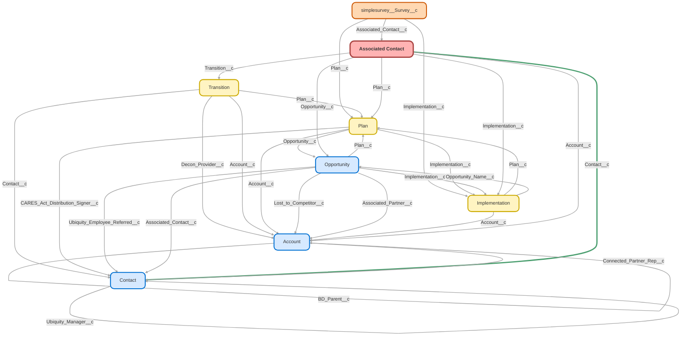

---
hide:
  - path
---

<!-- This file is auto-generated. if you do not want it to be overwritten, set TRUE in the line below -->
<!-- DO_NOT_OVERWRITE_DOC=FALSE -->

## Schema

<!-- Object description -->

## Fields

| Name      | Label | Type | Description |
| :-------- | :---- | :--: | :---------- | 
| AC_Temp_List__c | AC Temp List | Checkbox | undefined |
| Account__c | Account | Lookup | undefined |
| Account_State__c | Account State | Text | undefined |
| Additional_Trustee_Email__c | Additional Trustee Email | Email | undefined |
| Advisor_Communication__c | Advisor Communication | Picklist | undefined |
| Anniversary__c | Anniversary | Number | undefined |
| Annual_Recurring_Revenue__c | Annual Recurring Revenue | Currency | Annual recurring revenue from plan |
| Brand__c | Brand | Text | undefined |
| Business_Unit__c | Business Unit | Picklist | undefined |
| Calendly_Census_Call__c | Calendly Census Call | Text | undefined |
| Calendly_Final_Review_and_Funding_Call__c | Calendly Final Review and Funding Call | Text | undefined |
| Calendly_Introductory_Call__c | Calendly Introductory Call | Text | undefined |
| Census_and_Eligibility_Uploaded__c | Census and Eligibility Uploaded | Date | undefined |
| Census_and_Payroll_Instructions_Sent__c | Census and Payroll Instructions Sent | Date | undefined |
| Client_Dashboard_Link__c | Client Dashboard Link | Text | undefined |
| Comments__c | Comments | LongTextArea | undefined |
| Contact__c | Contact | MasterDetail | undefined |
| Contact_Role__c | Contact Role | Picklist | undefined |
| Count_of_Employees_Census__c | Count of Employees Census | Number | Count of Employees added to census from Imp Record |
| CSAT_Survey_Field__c | CSAT Survey Fieldset | Text | undefined |
| Current_Client_Stage__c | Current Client Stage | Picklist | undefined |
| Current_Year__c | Current Year | Text | undefined |
| Email__c | Email | Text | undefined |
| Email_Recipients__c | Email Recipients | LongTextArea | undefined |
| Full_Name__c | Full Name | Text | undefined |
| Funding_Account_Confirmed__c | Funding Account Confirmed | Date | undefined |
| Funding_Call_Date_Time__c | Funding Call Date/Time | DateTime | undefined |
| How_Did_You_Hear_About_Ubiquity__c | How Did You Hear About Ubiquity? | Text | undefined |
| Implementation__c | Implementation | Lookup | undefined |
| Implementation_Completion_Date__c | Implementation Completion Date | Date | undefined |
| Implementation_Name__c | Implementation Name | Text | undefined |
| Implementation_Owner__c | Implementation Owner | Text | undefined |
| Implementation_Owner_Calendly__c | Implementation Owner Calendly | Text | Calendly link from user record to merge into RPC welcome email |
| Implementation_Owner_Email__c | Implementation Owner Email | Text | undefined |
| Implementation_Owner_Full_Name__c | Implementation Owner Full Name | Text | undefined |
| Implementation_Owner_Phone__c | Implementation Owner Phone | Text | undefined |
| Implementation_Owner_Time_Zone__c | Implementation Owner Time Zone | Text | undefined |
| Implementation_Owner_Title__c | Implementation Owner Title | Text | undefined |
| Implementation_Stage__c | Implementation Stage | Text | undefined |
| Implementation_Status__c | Implementation Status | Text | undefined |
| Implementation_Updated__c | Implementation Updated | Date | undefined |
| Implementation_Updated_Date_Time__c | Implementation Updated (Date & Time) | DateTime | undefined |
| Intro_to_K_oncierge_Complete__c | Intro to (K)oncierge Complete | Date | undefined |
| Intro_to_K_oncierge_CST__c | Intro to (K)oncierge & CST | Date | undefined |
| K_oncierge_Initial_Call__c | (K)oncierge Initial Call | Date | undefined |
| Kotapay_Survey_Link__c | Kotapay Survey Link | Text | undefined |
| Lead_Source__c | Lead Source | Text | undefined |
| Lead_Source_Detail__c | Lead Source Detail | Text | undefined |
| Master_Account_Name__c | Master Account Name | Text | undefined |
| Meeting_Link__c | Meeting Link | Text | undefined |
| New_Opportunity_Stage__c | New Opportunity Stage | Text | undefined |
| Number_of_Employees__c | Number of Employees | Number | Number of Employees from Account |
| OPD_PRR_Complete__c | OPD/PRR Complete | Date | undefined |
| Opportunity__c | Opportunity | Lookup | undefined |
| Opportunity_Closed_Date__c | Opportunity Closed Date | Date | undefined |
| Opportunity_Owner_Full_Name__c | Opportunity Owner Full Name | Text | undefined |
| Opportunity_Record_Type__c | Opportunity Record Type | Text | undefined |
| Opportunity_Stage__c | Opportunity Stage | Text | undefined |
| Parent_Account_Name__c | Parent Account Name | Text | undefined |
| Partner_Client_Status__c | Partner Client Status | Picklist | undefined |
| Partner_Status__c | Partner Status | Picklist | undefined |
| PayKon_Welcome_Survey__c | PayKon Welcome Survey | Text | Survey link for Payroll Koncierge Welcome Email |
| Payroll_Schedule_Confirmed__c | Payroll Schedule Confirmed | Date | undefined |
| Phone__c | Phone | Text | undefined |
| Plan__c | Plan | Lookup | undefined |
| Plan_Account_ID__c | Plan Account ID | Text | undefined |
| Plan_Anniversary_Date__c | Plan Anniversary Date | Date | undefined |
| Plan_Effective_Date__c | Plan Effective Date | Date | undefined |
| Plan_Sold_Date__c | Plan Sold Date | Date | undefined |
| Plan_Status__c | Plan Status | Text | undefined |
| Plan_Type__c | Plan Type | Text | undefined |
| Post_OPD_PRR_Docs_Sent__c | Post OPD/PRR Docs Sent | Date | undefined |
| Primary__c | Primary | Checkbox | undefined |
| Primary_Advisor_Email__c | Primary Advisor Email | Email | undefined |
| Referral_Partner__c | Referral Partner | Text | undefined |
| Secondary_Advisor_Email__c | Secondary Advisor Email | Email | undefined |
| Service_Option__c | Service Option | Text | undefined |
| Special_Instructions__c | Special Instructions | Checkbox | undefined |
| Suppress_All_Emails__c | Suppress All Emails | Checkbox | undefined |
| Temp_List__c | Temp List | Checkbox | undefined |
| Tertiary_Advisor_Email__c | Tertiary Advisor Email | Email | undefined |
| Text_Opt_Survey__c | Text Opt Survey | Text | Survey link for opting into Text Message Updates |
| Title__c | Title | Text | undefined |
| TPA_Documents_Uploaded__c | TPA Documents Uploaded | Date | undefined |
| TPA_Operational_Email__c | TPA Operational Email | Email | undefined |
| Transition__c | Transition | Lookup | undefined |
| Transition_Complete__c | Transition Complete | Date | undefined |
| Transition_Status__c | Transition Status | Text | undefined |
| Transition_Type__c | Transition Type | Text | undefined |
| Ubiquity_Plan_Documents_Signed__c | Ubiquity Plan Documents Signed | Date | undefined |
| Useable_Email__c | Useable Email | Email | undefined |
| X1st_Call_Time__c | 1st Call Time | Text | undefined |
| X1st_Payroll_Date__c | 1st Payroll Date | Date | undefined |
| X1st_Plan_Sold_Date__c | 1st Plan Sold Date | Date | undefined |
| X2nd_Call_Time__c | 2nd Call Time | Text | undefined |
| X3rd_Call_Time__c | 3rd Call Time | Text | undefined |

## Validation Rules

| Rule      | Active | Description | Formula |
| :-------- | :---- | :---------- | :------ |
| Related_Objects_Requred | No ⚠️ |  | ((NOT(ISBLANK( Implementation__c )) && ISBLANK( Opportunity__c ))  (NOT(ISBLANK( Implementation__c )) && ISBLANK( Plan__c ))) && ISNEW() |

## Related Flows

| Object | Name      | Type | Description |
| :----  | :-------- | :--: | :---------- | 
| 💻 | [Account_Partner_Association_Process_Assign_Territory](../flows/Account_Partner_Association_Process_Assign_Territory.md) [🕒](../flows/Account_Partner_Association_Process_Assign_Territory-history.md) |  Auto Launched Flow | <!-- --> |
| 💻 | [Add_On_to_Plan](../flows/Add_On_to_Plan.md) [🕒](../flows/Add_On_to_Plan-history.md) |  Screen Flow | Creates an Add-On Opportunity for an existing plan and assigns to Payroll team |
| 💻 | [Assign_Imp_to_Junction](../flows/Assign_Imp_to_Junction.md) [🕒](../flows/Assign_Imp_to_Junction-history.md) |  Auto Launched Flow | Maps Implementation record to any relevant Associated Contact Junction upon creation |
| 💻 | [Assign_Imp_to_Partner](../flows/Assign_Imp_to_Partner.md) [🕒](../flows/Assign_Imp_to_Partner-history.md) |  Auto Launched Flow | Maps Implementation record to any relevant Associated Partner Junction upon creation |
| 💻 | [Assign_Plan_to_Junction](../flows/Assign_Plan_to_Junction.md) [🕒](../flows/Assign_Plan_to_Junction-history.md) |  Auto Launched Flow | Updated "is opp null" decision element for single(k) - was erroring when opp is null.  Maps Plan record to any relevant Associated Contact Junction upon creation |
| 💻 | [Assign_Plan_to_Partner](../flows/Assign_Plan_to_Partner.md) [🕒](../flows/Assign_Plan_to_Partner-history.md) |  Auto Launched Flow | Added "opp present" check to avoid error if opp is missing  Maps Plan record to any relevant Associated Junction upon creation |
| 💻 | [Assign_Transition_to_Junction](../flows/Assign_Transition_to_Junction.md) [🕒](../flows/Assign_Transition_to_Junction-history.md) |  Auto Launched Flow | Maps Transition record to any relevant Associated Contact Junction upon creation |
| 💻 | [Assign_Transition_to_Partner](../flows/Assign_Transition_to_Partner.md) [🕒](../flows/Assign_Transition_to_Partner-history.md) |  Auto Launched Flow | Maps Transition record to any relevant Associated Partner Junction upon creation |
| 💻 | [Contact_Process_Send_Reach_Out_Case](../flows/Contact_Process_Send_Reach_Out_Case.md) [🕒](../flows/Contact_Process_Send_Reach_Out_Case-history.md) |  Auto Launched Flow | Sends email to Imps if contact has received final reminder email for their current stage. |
| 💻 | [Contact_Uncredentialed_Advisor_Upon_Purchase](../flows/Contact_Uncredentialed_Advisor_Upon_Purchase.md) [🕒](../flows/Contact_Uncredentialed_Advisor_Upon_Purchase-history.md) |  Auto Launched Flow | Verifies Advisor's credential status upon Simply plan sold |
| 💻 | [Contact_Update_Credential_Status_on_Leads](../flows/Contact_Update_Credential_Status_on_Leads.md) [🕒](../flows/Contact_Update_Credential_Status_on_Leads-history.md) |  Auto Launched Flow | When Credential Status changes on Advisor Contact, update any unconverted Leads to reflect the status change. |
| 💻 | [Create_Follow_Up_Task_if_Opp_is_not_Closed](../flows/Create_Follow_Up_Task_if_Opp_is_not_Closed.md) [🕒](../flows/Create_Follow_Up_Task_if_Opp_is_not_Closed-history.md) |  Auto Launched Flow | Create Follow-Up Task if Opp is not Closed |
| 💻 | [Create_Junction_After_Conversion](../flows/Create_Junction_After_Conversion.md) [🕒](../flows/Create_Junction_After_Conversion-history.md) |  Auto Launched Flow | Updated to use ac and ap roles from lead on new ac and ap records (rather than defaulting to "referrer" generic values)  Creates Associated Contact Junction if needed when Lead is Converted |
| 💻 | [Create_Partner_After_Conversion](../flows/Create_Partner_After_Conversion.md) [🕒](../flows/Create_Partner_After_Conversion-history.md) |  Auto Launched Flow | Creates Associated Partner Junction if needed when Lead is Converted |
| 💻 | [Create_Upgrade_from_Plan](../flows/Create_Upgrade_from_Plan.md) [🕒](../flows/Create_Upgrade_from_Plan-history.md) |  Screen Flow | Updated to replace sales director userId fallback w/ search for user with that role, THEN svp strategy.  Finally it will just assign to running user rather than throwing an error.  Creates an Upgrade Opportunity for an existing plan, and assigns to most relevant RPC. |
| 💻 | [DocuSign_Recipient_Process_Associate_Key_Records](../flows/DocuSign_Recipient_Process_Associate_Key_Records.md) [🕒](../flows/DocuSign_Recipient_Process_Associate_Key_Records-history.md) |  Auto Launched Flow | <!-- --> |
| 💻 | [DocuSign_Related_Record_Mapping](../flows/DocuSign_Related_Record_Mapping.md) [🕒](../flows/DocuSign_Related_Record_Mapping-history.md) |  Auto Launched Flow | Links records related to the Document, based on recipient information. |
| 💻 | [Docusign_Button_Find_A4S](../flows/Docusign_Button_Find_A4S.md) [🕒](../flows/Docusign_Button_Find_A4S-history.md) |  Screen Flow | <!-- --> |
| 💻 | [Docusign_Process_Map_After_Signing](../flows/Docusign_Process_Map_After_Signing.md) [🕒](../flows/Docusign_Process_Map_After_Signing-history.md) |  Auto Launched Flow | To be used as a precautionary flow if docusign record is created after the would-be associated records. ***TEST VERSION*** |
| 💻 | [Event_Process_Call_Scheduled](../flows/Event_Process_Call_Scheduled.md) [🕒](../flows/Event_Process_Call_Scheduled-history.md) |  Auto Launched Flow | <!-- --> |
| 💻 | [Implementation_Button_Create_Add_On_Opp](../flows/Implementation_Button_Create_Add_On_Opp.md) [🕒](../flows/Implementation_Button_Create_Add_On_Opp-history.md) |  Screen Flow | This step no longer triggers the Implementation  After Update  Create Add-On Opp flow, it creates the Opp and AC again and updates the Payroll Provider on the created Opp. It also sends the initial EPS email- 7/8/24 JI  Added step at the end to update the initiating Imp.Payroll_Integration field to "Yes". Removed create Opp and AC elements, this button now triggers Implementation  After Update  Create Add-On Opp |
| 💻 | [Implementation_ONETIME_Update_Active_Imps_List](../flows/Implementation_ONETIME_Update_Active_Imps_List.md) [🕒](../flows/Implementation_ONETIME_Update_Active_Imps_List-history.md) |  Auto Launched Flow | <!-- --> |
| 💻 | [Junction_Autolaunched_Sync_Imp_Plan_Opp_Trans_Ids](../flows/Junction_Autolaunched_Sync_Imp_Plan_Opp_Trans_Ids.md) [🕒](../flows/Junction_Autolaunched_Sync_Imp_Plan_Opp_Trans_Ids-history.md) |  Auto Launched Flow | Compares input ACs and/or APs to one or more ref Id inputs.  If a record is missing the corresponding field of an Id input, that Id is assigned to it and it's added to the outputs. |
| 💻 | [Map_Advisor_Based_on_NPN](../flows/Map_Advisor_Based_on_NPN.md) [🕒](../flows/Map_Advisor_Based_on_NPN-history.md) |  Auto Launched Flow | When a new Simply Lead is created, assess whether to Convert Advisor, or Link Advisor to Employer Lead. Removed NPN Without Advisor email alert from Employer Lead path. |
| 💻 | [Opportunity_Process_Send_Welcome_Email](../flows/Opportunity_Process_Send_Welcome_Email.md) [🕒](../flows/Opportunity_Process_Send_Welcome_Email-history.md) |  Auto Launched Flow | Deleted Pause Element (as of 15:00 pm 11/21/23) |
| 💻 | [Opportunity_Screen_Approval_Helper](../flows/Opportunity_Screen_Approval_Helper.md) [🕒](../flows/Opportunity_Screen_Approval_Helper-history.md) |  Screen Flow | <!-- --> |
| 💻 | [Payroll_Integration_Button_Create_Payroll_Opp_and_Add_On](../flows/Payroll_Integration_Button_Create_Payroll_Opp_and_Add_On.md) [🕒](../flows/Payroll_Integration_Button_Create_Payroll_Opp_and_Add_On-history.md) |  Screen Flow | <!-- --> |
| 💻 | [Plan_Button_Create_Add_On_Opp](../flows/Plan_Button_Create_Add_On_Opp.md) [🕒](../flows/Plan_Button_Create_Add_On_Opp-history.md) |  Screen Flow | <!-- --> |
| 💻 | [Plan_Button_Create_Payroll_Integration_Opp](../flows/Plan_Button_Create_Payroll_Integration_Opp.md) [🕒](../flows/Plan_Button_Create_Payroll_Integration_Opp-history.md) |  Screen Flow | <!-- --> |
| 💻 | [Plan_Button_Downgrade_Plan](../flows/Plan_Button_Downgrade_Plan.md) [🕒](../flows/Plan_Button_Downgrade_Plan-history.md) |  Screen Flow | <!-- --> |
| 💻 | [Project_Task_Process_Send_Email_Alert](../flows/Project_Task_Process_Send_Email_Alert.md) [🕒](../flows/Project_Task_Process_Send_Email_Alert-history.md) |  Auto Launched Flow | Flow built to trigger auto email when Project Task is created or updated. |
| 💻 | [Sponsor_Trustee_Junction](../flows/Sponsor_Trustee_Junction.md) [🕒](../flows/Sponsor_Trustee_Junction-history.md) |  Auto Launched Flow | Create Associated Contacts when a Sponsor &/or Trustee is added to an Account with an active Plan |
| 💻 | [Transition_Deconversion_Completed](../flows/Transition_Deconversion_Completed.md) [🕒](../flows/Transition_Deconversion_Completed-history.md) |  Auto Launched Flow | <!-- --> |
| 💻 | [Update_Email_Recipients](../flows/Update_Email_Recipients.md) [🕒](../flows/Update_Email_Recipients-history.md) |  Auto Launched Flow | Updates text field with list of associated contacts and their email addresses. |
| 💻 | [Update_Partner_Client_Status](../flows/Update_Partner_Client_Status.md) [🕒](../flows/Update_Partner_Client_Status-history.md) |  Auto Launched Flow | Update Partner Client Status on Contact if all Plans are Inactive |
| 💻 | [Update_Partner_Status](../flows/Update_Partner_Status.md) [🕒](../flows/Update_Partner_Status-history.md) |  Auto Launched Flow | Update Partner Status on Contact if all Associated Leads are older than 1 year. |
| Add_On_Products__c | [Add_On_After_Trigger_Payroll_Master](../flows/Add_On_After_Trigger_Payroll_Master.md) [🕒](../flows/Add_On_After_Trigger_Payroll_Master-history.md) |  Record After Save | <!-- --> |
| Add_On_Products__c | [Add_On_After_Trigger_Send_Payroll_Integration_Email](../flows/Add_On_After_Trigger_Send_Payroll_Integration_Email.md) [🕒](../flows/Add_On_After_Trigger_Send_Payroll_Integration_Email-history.md) |  Record After Save | <!-- --> |
| Add_On_Products__c | [Add_On_Scheduled_Send_Auto_Emails](../flows/Add_On_Scheduled_Send_Auto_Emails.md) [🕒](../flows/Add_On_Scheduled_Send_Auto_Emails-history.md) |  Scheduled | This flow runs daily and checks the difference between the current date and the last time the add-on stage was changed, then sends the corresponding auto-email |
| Associated_Contact__c | [Associate_Contact_After_Trigger](../flows/Associate_Contact_After_Trigger.md) [🕒](../flows/Associate_Contact_After_Trigger-history.md) |  Record After Save | Removed "update contact links" portion of flow.  Was causing issues AND all those links are useless now anyway soo |
| Associated_Contact__c | [Associated_Contact_After_Trigger_Update_Useable_Emails](../flows/Associated_Contact_After_Trigger_Update_Useable_Emails.md) [🕒](../flows/Associated_Contact_After_Trigger_Update_Useable_Emails-history.md) |  Record After Save | <!-- --> |
| Associated_Contact__c | [Associated_Contact_After_Update_Master_Flow](../flows/Associated_Contact_After_Update_Master_Flow.md) [🕒](../flows/Associated_Contact_After_Update_Master_Flow-history.md) |  Record After Save | <!-- --> |
| Associated_Contact__c | [Associated_Contact_Before_Trigger](../flows/Associated_Contact_Before_Trigger.md) [🕒](../flows/Associated_Contact_Before_Trigger-history.md) |  Record Before Save | This flow replaces the first node in the PB "Populate Stage on AC". When the AC is created/updated and the Imp is attached, populate the Imp Stage on the AC record. The second node of the original PB was added to an after save flow. |
| Associated_Contact__c | [Associated_Contact_Before_Trigger_Update_Useable_Email](../flows/Associated_Contact_Before_Trigger_Update_Useable_Email.md) [🕒](../flows/Associated_Contact_Before_Trigger_Update_Useable_Email-history.md) |  Record Before Save | <!-- --> |
| Associated_Contact__c | [Associated_Contact_ONETIME_Update_Useable_Emails](../flows/Associated_Contact_ONETIME_Update_Useable_Emails.md) [🕒](../flows/Associated_Contact_ONETIME_Update_Useable_Emails-history.md) |  Record After Save | <!-- --> |
| Associated_Contact__c | [Associated_Contact_ONETIME_Update_Useable_Emails1](../flows/Associated_Contact_ONETIME_Update_Useable_Emails1.md) [🕒](../flows/Associated_Contact_ONETIME_Update_Useable_Emails1-history.md) |  Record After Save | <!-- --> |
| Associated_Contact__c | [Associated_Contact_ONE_TIME_SCHEDULED_Email_Imp_2_0_Rollout](../flows/Associated_Contact_ONE_TIME_SCHEDULED_Email_Imp_2_0_Rollout.md) [🕒](../flows/Associated_Contact_ONE_TIME_SCHEDULED_Email_Imp_2_0_Rollout-history.md) |  Scheduled | <!-- --> |
| Associated_Contact__c | [Implementations_Welcome_Email](../flows/Implementations_Welcome_Email.md) [🕒](../flows/Implementations_Welcome_Email-history.md) |  Workflow | Send welcome email when opportunity is marked closed won |
| Associated_Contact__c | [Junction_Update_Lifecycle_Stage](../flows/Junction_Update_Lifecycle_Stage.md) [🕒](../flows/Junction_Update_Lifecycle_Stage-history.md) |  Workflow | <!-- --> |
| Associated_Contact__c | [Opportunity_Trigger_Advisor_1st_Plan_Sold_Date_Stamping](../flows/Opportunity_Trigger_Advisor_1st_Plan_Sold_Date_Stamping.md) [🕒](../flows/Opportunity_Trigger_Advisor_1st_Plan_Sold_Date_Stamping-history.md) |  Record After Save | When Advisor Plan is sold, stamp 1st plan sold date on Advisor Contact |
| Associated_Contact__c | [TEST](../flows/TEST.md) [🕒](../flows/TEST-history.md) |  Record After Save | <!-- --> |
| Contact | [Contact_After_Trigger_Updated_AC_Auth_Buyer](../flows/Contact_After_Trigger_Updated_AC_Auth_Buyer.md) [🕒](../flows/Contact_After_Trigger_Updated_AC_Auth_Buyer-history.md) |  Record After Save | Changes the Authorized Buyer AC record's Contact Role to match the Contact's Role. |
| Contact | [Contact_Match_Account_to_AC_Record](../flows/Contact_Match_Account_to_AC_Record.md) [🕒](../flows/Contact_Match_Account_to_AC_Record-history.md) |  Workflow | If Contact is moved to another Account, change their Account lookup in all related Associated Contacts |
| Contact | [Contact_Trigger_Terminated_Participant_List](../flows/Contact_Trigger_Terminated_Participant_List.md) [🕒](../flows/Contact_Trigger_Terminated_Participant_List-history.md) |  Record After Save | Add to an Advisor's Terminated Participant List when active client's participant is terminated |
| Enrollment_Meeting__c | [Enrollment_Record](../flows/Enrollment_Record.md) [🕒](../flows/Enrollment_Record-history.md) |  Record After Save | When Enrollment meeting is created, stamp record with Advisor Contact lookup |
| Implementation__c | [Implementation_After_Trigger_Send_Client_Emails](../flows/Implementation_After_Trigger_Send_Client_Emails.md) [🕒](../flows/Implementation_After_Trigger_Send_Client_Emails-history.md) |  Record After Save | Update SImply Welcome Email to Self Service Email. Changed introductory call conditions from "Intro_Call_Complete__c" to "Introductory_Call__c" to better mesh with changes to Implementation  After Trigger  Update Imp Call Steps with new validations |
| Implementation__c | [Implementation_After_Trigger_Send_Pre_Call_Emails](../flows/Implementation_After_Trigger_Send_Pre_Call_Emails.md) [🕒](../flows/Implementation_After_Trigger_Send_Pre_Call_Emails-history.md) |  Scheduled | Updated Finch API name(s) |
| Implementation__c | [Implementation_After_Trigger_Update_Useable_Emails](../flows/Implementation_After_Trigger_Update_Useable_Emails.md) [🕒](../flows/Implementation_After_Trigger_Update_Useable_Emails-history.md) |  Record After Save | <!-- --> |
| Implementation__c | [Implementation_After_Update_Create_Add_On_Product](../flows/Implementation_After_Update_Create_Add_On_Product.md) [🕒](../flows/Implementation_After_Update_Create_Add_On_Product-history.md) |  Record After Save | <!-- --> |
| Implementation__c | [Implementation_ONE_TIME_Follow_Up_Correction](../flows/Implementation_ONE_TIME_Follow_Up_Correction.md) [🕒](../flows/Implementation_ONE_TIME_Follow_Up_Correction-history.md) |  Scheduled | <!-- --> |
| Implementation__c | [Implementation_ONE_TIME_Ownership_Transfer](../flows/Implementation_ONE_TIME_Ownership_Transfer.md) [🕒](../flows/Implementation_ONE_TIME_Ownership_Transfer-history.md) |  Scheduled | <!-- --> |
| Implementation__c | [Implementation_ONE_TIME_Send_Welcome_Email](../flows/Implementation_ONE_TIME_Send_Welcome_Email.md) [🕒](../flows/Implementation_ONE_TIME_Send_Welcome_Email-history.md) |  Scheduled | <!-- --> |
| Implementation__c | [Implementation_On_Creation_Send_Advisor_Onboarding_Welcome_Email](../flows/Implementation_On_Creation_Send_Advisor_Onboarding_Welcome_Email.md) [🕒](../flows/Implementation_On_Creation_Send_Advisor_Onboarding_Welcome_Email-history.md) |  Record After Save | Gave "Stop" variable a default value of false - was null and breaking decision in contact loop |
| Implementation__c | [Implementation_Update_Update_Active_Imps_List](../flows/Implementation_Update_Update_Active_Imps_List.md) [🕒](../flows/Implementation_Update_Update_Active_Imps_List-history.md) |  Record After Save | <!-- --> |
| Implementation__c | [Implementations_Stage_Date_Recorded](../flows/Implementations_Stage_Date_Recorded.md) [🕒](../flows/Implementations_Stage_Date_Recorded-history.md) |  Workflow | When Implementation Stage is updated, record the date on Associated Contact |
| Lead | [Lead_After_Trigger](../flows/Lead_After_Trigger.md) [🕒](../flows/Lead_After_Trigger-history.md) |  Record After Save | <!-- --> |
| Lead | [Lead_Assign_Territory_1](../flows/Lead_Assign_Territory_1.md) [🕒](../flows/Lead_Assign_Territory_1-history.md) |  Record Before Save | Migrated from the Lead  Assign Territory process using Advisor-Sourced Lead criteria. Assign Lead Territory Upon Creation |
| Lead | [Lead_Simply_Lead_Created_1](../flows/Lead_Simply_Lead_Created_1.md) [🕒](../flows/Lead_Simply_Lead_Created_1-history.md) |  Record After Save | Adjusted to compensate for if the new lead has been deleted/converted by DE |
| Opportunity | [Email_Accounting_if_Referral_Opp_is_Closed_Won](../flows/Email_Accounting_if_Referral_Opp_is_Closed_Won.md) [🕒](../flows/Email_Accounting_if_Referral_Opp_is_Closed_Won-history.md) |  Record After Save | If referral Opportunity is Closed Won, notify Accounting |
| Opportunity | [Opportunity_After_Save_Advisor_Onboarding_Flow](../flows/Opportunity_After_Save_Advisor_Onboarding_Flow.md) [🕒](../flows/Opportunity_After_Save_Advisor_Onboarding_Flow-history.md) |  Record After Save | <!-- --> |
| Opportunity | [Opportunity_After_Trigger_Create_AC_and_AP](../flows/Opportunity_After_Trigger_Create_AC_and_AP.md) [🕒](../flows/Opportunity_After_Trigger_Create_AC_and_AP-history.md) |  Record After Save | Updated so generated AP is always primary, with role "referring partner"  Creates AC and AP Junctions from Opp Values |
| Opportunity | [Opportunity_After_Trigger_Send_Payroll_Integration_Emails](../flows/Opportunity_After_Trigger_Send_Payroll_Integration_Emails.md) [🕒](../flows/Opportunity_After_Trigger_Send_Payroll_Integration_Emails-history.md) |  Record After Save | <!-- --> |
| Opportunity | [Opportunity_After_Update_Complex_Email_Alerts](../flows/Opportunity_After_Update_Complex_Email_Alerts.md) [🕒](../flows/Opportunity_After_Update_Complex_Email_Alerts-history.md) |  Record After Save | correcting typo in new principal address |
| Opportunity | [Opportunity_After_Update_Create_Add_On_Product](../flows/Opportunity_After_Update_Create_Add_On_Product.md) [🕒](../flows/Opportunity_After_Update_Create_Add_On_Product-history.md) |  Record After Save | When opp is marked closed/won, create related add-on product record. |
| Opportunity | [Opportunity_Scheduled_7_days_to_close](../flows/Opportunity_Scheduled_7_days_to_close.md) [🕒](../flows/Opportunity_Scheduled_7_days_to_close-history.md) |  Scheduled | Added check for primary AC along with authorized buyer.  Fixed contact link showing up when no contact found. |
| Opportunity | [Sales_Simply_Default_Fields](../flows/Sales_Simply_Default_Fields.md) [🕒](../flows/Sales_Simply_Default_Fields-history.md) |  Workflow | Default Fields on Simply and Sallus Opportunities |
| Partner_Partner_Association__c | [Account_Partner_Association_After_Trigger_Assign_Territory](../flows/Account_Partner_Association_After_Trigger_Assign_Territory.md) [🕒](../flows/Account_Partner_Association_After_Trigger_Assign_Territory-history.md) |  Record After Save | <!-- --> |
| Plan__c | [Plan_After_Save_Master_Flow](../flows/Plan_After_Save_Master_Flow.md) [🕒](../flows/Plan_After_Save_Master_Flow-history.md) |  Record After Save | After save flow that always runs.  What it does: - Updates any and all associated contacts + associated partners with the plan, imp, opp, and transition Ids if applicable.  No overwrites. |
| Plan__c | [Plan_After_Trigger_Close_Imp](../flows/Plan_After_Trigger_Close_Imp.md) [🕒](../flows/Plan_After_Trigger_Close_Imp-history.md) |  Record After Save | If Payroll Submitted, Close Imp.  If Imp fails to close from missing data, alert imp owner.  Added check so plans are eligible for completion with EITHER a funding call OR self service |
| Plan__c | [Plan_Update_Partner_Client_Status](../flows/Plan_Update_Partner_Client_Status.md) [🕒](../flows/Plan_Update_Partner_Client_Status-history.md) |  Workflow | When Plan is Activated, Mark Financial Advisor Partner Client Status |
| Proposal__c | [Proposal_After_Trigger_Paradigm_Purchase_Api](../flows/Proposal_After_Trigger_Paradigm_Purchase_Api.md) [🕒](../flows/Proposal_After_Trigger_Paradigm_Purchase_Api-history.md) |  Record Before Save | Removed Auto_Enrollment_Deferral_Escalation_Rate__c references |
| Task | [Task_Trigger_Update_Imp_Outbound_Activity](../flows/Task_Trigger_Update_Imp_Outbound_Activity.md) [🕒](../flows/Task_Trigger_Update_Imp_Outbound_Activity-history.md) |  Record After Save | <!-- --> |
| dsfs__DocuSign_Recipient_Status__c | [DocuSign_Recipient_After_Trigger_Associate_Key_Records](../flows/DocuSign_Recipient_After_Trigger_Associate_Key_Records.md) [🕒](../flows/DocuSign_Recipient_After_Trigger_Associate_Key_Records-history.md) |  Record After Save | Updated to add error handling to lead conversions + opp closure.  Emails owner of errored record + BI to resolve. |

## Related Apex Classes

| Apex Class | Type |
| :----      | :--: | 
| [ParadigmCalloutControllerTest](../apex/ParadigmCalloutControllerTest.md) | Test |
| [PurchaseAPIController](../apex/PurchaseAPIController.md) | Lightning Controller |
| [PurchaseAPIHandler](../apex/PurchaseAPIHandler.md) | Class |
| [SpecialInstructionsController](../apex/SpecialInstructionsController.md) | Lightning Controller |
| [SpecialInstructionsControllerTest](../apex/SpecialInstructionsControllerTest.md) | Test |

## Related Lightning Pages

| Lightning Page | Type |
| :----      | :--: | 
| [Dynamic_Lead_Page](../pages/Dynamic_Lead_Page.md) |  Record Page |
| [Dynamic_Opp_Page](../pages/Dynamic_Opp_Page.md) |  Record Page |

## Related Profiles

| Profile | User License |
| :----      | :--: | 
| [Admin](../profiles/Admin.md) |  Salesforce |
| [Analytics Cloud Integration User](../profiles/Analytics%20Cloud%20Integration%20User.md) |  Analytics  Cloud  Integration  User |
| [Analytics Cloud Security User](../profiles/Analytics%20Cloud%20Security%20User.md) |  Analytics  Cloud  Integration  User |
| [Anypoint Integration](../profiles/Anypoint%20Integration.md) |  Identity |
| [B2BMA Integration User](../profiles/B2BMA%20Integration%20User.md) |  B2 B M A  Integration  User |
| [Billing User](../profiles/Billing%20User.md) |  Salesforce |
| [Bot Profile](../profiles/Bot%20Profile.md) |  Salesforce |
| [Business Development](../profiles/Business%20Development.md) |  Salesforce |
| [Call Center](../profiles/Call%20Center.md) |  Salesforce |
| [Chatter External User](../profiles/Chatter%20External%20User.md) |  Chatter  External |
| [Chatter Free User](../profiles/Chatter%20Free%20User.md) |  Chatter  Free |
| [Chatter Moderator User](../profiles/Chatter%20Moderator%20User.md) |  Chatter  Free |
| [Client Onboarding - Admin](../profiles/Client%20Onboarding%20-%20Admin.md) |  Salesforce |
| [Client Onboarding - RM](../profiles/Client%20Onboarding%20-%20RM.md) |  Salesforce |
| [Client Servicing Team](../profiles/Client%20Servicing%20Team.md) |  Salesforce |
| [Compliance Manager](../profiles/Compliance%20Manager.md) |  Salesforce |
| [ContractManager](../profiles/ContractManager.md) |  Salesforce |
| [Director of Operations](../profiles/Director%20of%20Operations.md) |  Salesforce |
| [Director of Sales](../profiles/Director%20of%20Sales.md) |  Salesforce |
| [Distributions](../profiles/Distributions.md) |  Salesforce |
| [Einstein Agent User](../profiles/Einstein%20Agent%20User.md) |  Einstein  Agent |
| [ESW_Agentforce_MIAW_1748035300267 Profile](../profiles/ESW_Agentforce_MIAW_1748035300267%20Profile.md) |  Guest  User  License |
| [ESW_Agentforce_MIAW_1748385215843 Profile](../profiles/ESW_Agentforce_MIAW_1748385215843%20Profile.md) |  Guest  User  License |
| [ESW_CE_Chat_1692890394498 Profile](../profiles/ESW_CE_Chat_1692890394498%20Profile.md) |  Guest  User  License |
| [ESW_CE_Chat_Moe_1693182845676 Profile](../profiles/ESW_CE_Chat_Moe_1693182845676%20Profile.md) |  Guest  User  License |
| [ESW_Login_Help_1697133738638 Profile](../profiles/ESW_Login_Help_1697133738638%20Profile.md) |  Guest  User  License |
| [ESW_Login_Help_Simply_1700075140889 Profile](../profiles/ESW_Login_Help_Simply_1700075140889%20Profile.md) |  Guest  User  License |
| [ESW_Omni_Messaging_1694183770479 Profile](../profiles/ESW_Omni_Messaging_1694183770479%20Profile.md) |  Guest  User  License |
| [ESW_Omni_Messaging_CO_1696448547822 Profile](../profiles/ESW_Omni_Messaging_CO_1696448547822%20Profile.md) |  Guest  User  License |
| [ESW_Omni_Messaging_Sallus_1700075448386 Profile](../profiles/ESW_Omni_Messaging_Sallus_1700075448386%20Profile.md) |  Guest  User  License |
| [ESW_Omni_Messaging_Simply_1700076370188 Profile](../profiles/ESW_Omni_Messaging_Simply_1700076370188%20Profile.md) |  Guest  User  License |
| [ESW_QA_Login_1699666348585 Profile](../profiles/ESW_QA_Login_1699666348585%20Profile.md) |  Guest  User  License |
| [ESW_QA_Messaging_1699974036493 Profile](../profiles/ESW_QA_Messaging_1699974036493%20Profile.md) |  Guest  User  License |
| [ESW_Sales_Chat_1697460991337 Profile](../profiles/ESW_Sales_Chat_1697460991337%20Profile.md) |  Guest  User  License |
| [ESW_Sallus_Login_Chat_1700072925200 Profile](../profiles/ESW_Sallus_Login_Chat_1700072925200%20Profile.md) |  Guest  User  License |
| [External Apps Login User](../profiles/External%20Apps%20Login%20User.md) |  External  Apps  Login |
| [Finance Manager Lightning](../profiles/Finance%20Manager%20Lightning.md) |  Salesforce |
| [Guest License User](../profiles/Guest%20License%20User.md) |  Guest  User  License |
| [Help Center Profile](../profiles/Help%20Center%20Profile.md) |  Guest  User  License |
| [Identity User](../profiles/Identity%20User.md) |  Identity |
| [Incoming_SMS Profile](../profiles/Incoming_SMS%20Profile.md) |  Guest  User  License |
| [IT](../profiles/IT.md) |  Salesforce |
| [Leadership Lightning](../profiles/Leadership%20Lightning.md) |  Salesforce |
| [Leadership](../profiles/Leadership.md) |  Salesforce |
| [Learning %26 Development](../profiles/Learning%20%2526%20Development.md) |  Salesforce |
| [Lightning Client Onboarding](../profiles/Lightning%20Client%20Onboarding.md) |  Salesforce |
| [Lightning Compliance](../profiles/Lightning%20Compliance.md) |  Salesforce |
| [Lightning Saver User](../profiles/Lightning%20Saver%20User.md) |  Salesforce |
| [Lightning Service Manager](../profiles/Lightning%20Service%20Manager.md) |  Salesforce |
| [Lightning Service User](../profiles/Lightning%20Service%20User.md) |  Salesforce |
| [Marketing Team](../profiles/Marketing%20Team.md) |  Salesforce |
| [MarketingProfile](../profiles/MarketingProfile.md) |  Salesforce |
| [Master Administrator](../profiles/Master%20Administrator.md) |  Salesforce |
| [Minimum Access - API Only Integrations](../profiles/Minimum%20Access%20-%20API%20Only%20Integrations.md) |  Salesforce  Integration |
| [Minimum Access - Salesforce](../profiles/Minimum%20Access%20-%20Salesforce.md) |  Salesforce |
| [myubiquity Profile](../profiles/myubiquity%20Profile.md) |  Guest  User  License |
| [Operations VP](../profiles/Operations%20VP.md) |  Salesforce |
| [Operations](../profiles/Operations.md) |  Salesforce |
| [Paradigm Help Center Profile](../profiles/Paradigm%20Help%20Center%20Profile.md) |  Guest  User  License |
| [Payroll Koncierge](../profiles/Payroll%20Koncierge.md) |  Salesforce |
| [Payroll Team](../profiles/Payroll%20Team.md) |  Salesforce |
| [People %26 Culture](../profiles/People%20%2526%20Culture.md) |  Salesforce |
| [Pre-chat Site Profile](../profiles/Pre-chat%20Site%20Profile.md) |  Guest  User  License |
| [Product Innovation Leadership](../profiles/Product%20Innovation%20Leadership.md) |  Salesforce |
| [Product Innovation User](../profiles/Product%20Innovation%20User.md) |  Salesforce |
| [PSM Team](../profiles/PSM%20Team.md) |  Salesforce |
| [R%26W](../profiles/R%2526W.md) |  Salesforce |
| [Read Only](../profiles/Read%20Only.md) |  Salesforce |
| [Sales Administrator](../profiles/Sales%20Administrator.md) |  Salesforce |
| [Sales Coordinator](../profiles/Sales%20Coordinator.md) |  Salesforce |
| [Sales Insights Integration User](../profiles/Sales%20Insights%20Integration%20User.md) |  Sales  Insights  Integration  User |
| [Sales Team - Limited](../profiles/Sales%20Team%20-%20Limited.md) |  Salesforce |
| [Sales Team](../profiles/Sales%20Team.md) |  Salesforce |
| [Salesforce API Only System Integrations](../profiles/Salesforce%20API%20Only%20System%20Integrations.md) |  Salesforce  Integration |
| [SalesforceIQ Integration User](../profiles/SalesforceIQ%20Integration%20User.md) |  Salesforce I Q  Integration  User |
| [Saver Manager](../profiles/Saver%20Manager.md) |  Salesforce |
| [Simple Survey Profile](../profiles/Simple%20Survey%20Profile.md) |  Guest  User  License |
| [Simply Help Center Profile](../profiles/Simply%20Help%20Center%20Profile.md) |  Guest  User  License |
| [SolutionManager](../profiles/SolutionManager.md) |  Salesforce |
| [Standard](../profiles/Standard.md) |  Salesforce |
| [StandardAul](../profiles/StandardAul.md) |  Salesforce  Platform |
| [Super System Administrator](../profiles/Super%20System%20Administrator.md) |  Salesforce |
| [Sys Dev Admin](../profiles/Sys%20Dev%20Admin.md) |  Salesforce |
| [Transitions Team](../profiles/Transitions%20Team.md) |  Salesforce |
| [Ubiquity Help Center Profile](../profiles/Ubiquity%20Help%20Center%20Profile.md) |  Guest  User  License |
| [Zoom Webhooks Profile](../profiles/Zoom%20Webhooks%20Profile.md) |  Guest  User  License |

## Related Permission Sets

| Permission Set | User License |
| :----      | :--: | 
| [Attachments_and_Notes_Migrator](../permissionsets/Attachments_and_Notes_Migrator.md) | None |
| [Call_Center_Client_Onboarding](../permissionsets/Call_Center_Client_Onboarding.md) | None |
| [Data_Loader](../permissionsets/Data_Loader.md) | None |
| [Developer](../permissionsets/Developer.md) | None |
| [MagicMover](../permissionsets/MagicMover.md) | None |
| [Manager](../permissionsets/Manager.md) | None |
| [Master](../permissionsets/Master.md) | None |
| [Modify_All](../permissionsets/Modify_All.md) | None |
| [sfdcInternalInt__sfdc_a360_sfcrm_data_extract](../permissionsets/sfdcInternalInt__sfdc_a360_sfcrm_data_extract.md) | None |
| [sfdcInternalInt__sfdc_articlerecommendations](../permissionsets/sfdcInternalInt__sfdc_articlerecommendations.md) | None |
| [sfdcInternalInt__sfdc_einsteinagent](../permissionsets/sfdcInternalInt__sfdc_einsteinagent.md) | None |
| [sfdcInternalInt__sfdc_replyrecommendations](../permissionsets/sfdcInternalInt__sfdc_replyrecommendations.md) | None |
| [sfdcInternalInt__sfdc_slack](../permissionsets/sfdcInternalInt__sfdc_slack.md) | None |
| [View_All](../permissionsets/View_All.md) | None |

_Documentation generated with [sfdx-hardis](https://sfdx-hardis.cloudity.com), by [Cloudity](https://www.cloudity.com/) & [friends](https://github.com/hardisgroupcom/sfdx-hardis/graphs/contributors)_
