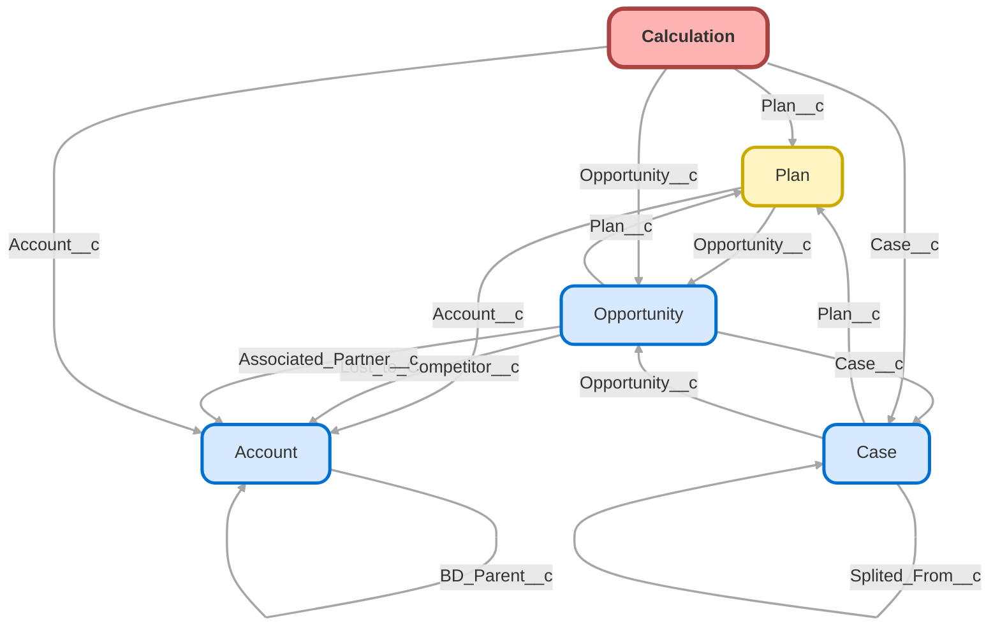

---
hide:
  - path
---

<!-- This file is auto-generated. if you do not want it to be overwritten, set TRUE in the line below -->
<!-- DO_NOT_OVERWRITE_DOC=FALSE -->

## Schema

<!-- Object description -->

## Fields

| Name      | Label | Type | Description |
| :-------- | :---- | :--: | :---------- | 
| Account__c | Account | Lookup | Account the Calculation is for |
| Are_there_5_Owners__c | Are there 5%+ Owners? | Picklist | Indicate whether or not there are employees who own more than 5% of the company |
| Calculation_Formula__c | Calculation Formula | LongTextArea | Provide calculation formula client would like us to use for the discretionary profit sharing or match calculation. Example: 2% of Compensation |
| Calculation_Type__c | Calculation Type | MultiselectPicklist | Please select all contribution sources that the client has requested a calculation for |
| Calculations__c | Calculations | Number | undefined |
| Case__c | Case | Lookup | Case that Calculation was originally created from. |
| Census__c | Census | Checkbox | Is the census attached to this object? Compliance cannot proceed until this occurs. |
| Company_Entity_Type__c | Company Entity Type | Picklist | Please confirm the company entity type with client as this can directly effect the compensation used to calculation the contribution |
| Contribution_Budget__c | Contribution Budget | LongTextArea | If applicable please provide client's contribution budget. Example: Maximize owners or contribute $25,000 total |
| Conv_Safe_Harbor_Eligibility_Details__c | Conv Safe Harbor| Eligibility Details | TextArea | Safe Harbor and/or Eligibility details for Conversion Plans |
| Date_Needed__c | Date Needed | Date | Date calculation is due by |
| Eligibility__c | Eligibility | Picklist | Plan Eligibility |
| Has_the_client_requested_a_special__c | Special Calculation Formula? | Picklist | Has the client given us a formula that they would like to be used to calculate their discretionary profit sharing or match contribution? |
| Notes__c | Notes | TextArea | Calculation Notes - Editable by Compliance Only |
| Number_of_Calculations__c | Number of Calculations | Number | Number of unique calculations per calc object |
| Opportunity__c | Opportunity | Lookup | undefined |
| Other_Calculation_Type__c | Other Calculation Type | LongTextArea | undefined |
| Owners__c | Owners' Compensation Reporting | Picklist | Please indicate how the owners compensation is reported as this can directly effect the compensation amount used to calculation the contribution |
| Owners_through_Attribution__c | Owners through Attribution? | Picklist | Indicate whether or not there are employees who are the grandparents, parents, spouse or children of the more than 5% owners |
| Owners_through_Attribution_on_Census__c | Owners through Attribution ID'd Census? | Picklist | Please review the census provided to ensure the owners through attribution have been identified |
| Plan__c | Plan | Lookup | Plan that calculation is related to. |
| Plan_Type__c | Plan Type | Picklist | Confirm New or Conversion |
| Plan_Year_Request__c | Plan Year | Text | Please indicate the plan year the contribution calculation request applies to. |
| RPC_Box_Link__c | RPC Box Link | Url | Box link for Compliance to deliver calculation requests to |
| Sales_Notes__c | Sales Notes | LongTextArea | undefined |
| Service_Option__c | Service Option | Picklist | Service Option for Calculation |
| Status__c | Status | Picklist | Opened = Gathering data for calc   Requested = all data gathered and sent to Compliance  Completed = Compliance finished calculation  Delivered = CST delivered calculation back to client |
| Top_Heavy__c | Top Heavy | Picklist | Completed by Compliance - |
| Verified_Census__c | Verified Census | Picklist | Please make sure that the client has either provided a census in our upload format or has confirmed the information in the Employee Demographic report |
| X5_Owners_On_Census__c | 5% owners ID'd on census? | Picklist | Please review the census provided to ensure the 5%+ owners have been identified |

## Validation Rules

| Rule      | Active | Description | Formula |
| :-------- | :---- | :---------- | :------ |
| Calculation_Delivered_to_Close_Parent | Yes | Calculation must be in 'Delivered' status in order for the Parent Case it's tied to to be closed | NOT(ISPICKVAL( Status__c , "Delivered")) && NOT(ISPICKVAL(PRIORVALUE( Status__c) , "Delivered")) && ISPICKVAL( Case__r.Status , "Resolved") |
| ID_5_Owners_on_Census | Yes |  | ISPICKVAL( Status__c , "Requested") && ISPICKVAL( Are_there_5_Owners__c , "YES") && ISPICKVAL( X5_Owners_On_Census__c , "NO") |
| ID_Attribution_Owners_on_Census | Yes |  | ISPICKVAL( Status__c , "Requested") && ISPICKVAL(  Owners_through_Attribution__c  , "YES") && ISPICKVAL(  Owners_through_Attribution_on_Census__c , "NO") |
| Other_Calc_Type_Missing | Yes | If "Other" selected on Calculation Type, must enter Other description | AND (INCLUDES( Calculation_Type__c , "Other"),    ISBLANK( Other_Calculation_Type__c )) |
| Status_Requested_Missing_Data | Yes | Prevents Compliance Child Case from being created if data is missing | ISPICKVAL( Status__c , "Requested") &&  RecordTypeId = "0121G000000RlLiQAK" &&  ( Calculation_Formula__c = ""   ISPICKVAL( Are_there_5_Owners__c , "")   ISPICKVAL( X5_Owners_On_Census__c , "")   ISPICKVAL( Owners_through_Attribution__c , "")   ISPICKVAL( Owners_through_Attribution_on_Census__c , "")    ISPICKVAL( Has_the_client_requested_a_special__c  , "")    ISBLANK( Calculation_Type__c ) = TRUE    Census__c = False    ISPICKVAL(Company_Entity_Type__c, "")     Contribution_Budget__c = ""    ISPICKVAL(Owners__c, "")    Plan_Year_Request__c = ""    ISPICKVAL(Verified_Census__c, "")) |
| Status_Requested_Missing_Data_Sales | Yes | Prevents Compliance Child Case from being created if data is missing for Sales | ISPICKVAL( Status__c , "Requested") &&  RecordTypeId = "0121G000000RlLnQAK" &&  ( Calculation_Formula__c = ""   ISPICKVAL( Are_there_5_Owners__c , "")   ISPICKVAL( X5_Owners_On_Census__c , "")   ISPICKVAL( Owners_through_Attribution__c , "")   ISPICKVAL( Owners_through_Attribution_on_Census__c , "")   ISBLANK( Calculation_Type__c ) = TRUE    Census__c = False    Plan_Year_Request__c = ""    ISPICKVAL(Verified_Census__c, "")) |
| Top_Heavy_Yes_or_No | Yes | Top Heavy field must be Yes or No | ISPICKVAL( Status__c , "Completed") && ISBLANK (TEXT( Top_Heavy__c )) &&  RecordTypeId = "0121G000000RlLiQAK" |
| Year_Must_Be_4_Digits | Yes | Please input 4 digit year | LEN( Plan_Year_Request__c )  <> 4 |

## Related Flows

| Object | Name      | Type | Description |
| :----  | :-------- | :--: | :---------- | 
| 💻 | [Case_Button_New_Close_Case](../flows/Case_Button_New_Close_Case.md) [🕒](../flows/Case_Button_New_Close_Case-history.md) |  Screen Flow | Updated to show unresolved child case and calc info |
| 💻 | [Close_Case](../flows/Close_Case.md) [🕒](../flows/Close_Case-history.md) |  Screen Flow | Modified case close screen to add "subject" as an editable field for CO cases  Surfaces required fields before closing case, depending on case type and user requirements. Added checkbox to allow users to close other peoples' cases. |
| Calculation__c | [Calculation_After_Trigger_Create_Cases_for_Compliance_and_Increment_Counters](../flows/Calculation_After_Trigger_Create_Cases_for_Compliance_and_Increment_Counters.md) [🕒](../flows/Calculation_After_Trigger_Create_Cases_for_Compliance_and_Increment_Counters-history.md) |  Record After Save | Updated to get rid of child case |
| Calculation__c | [Calculation_Sales_Calc_Request](../flows/Calculation_Sales_Calc_Request.md) [🕒](../flows/Calculation_Sales_Calc_Request-history.md) |  Workflow | Automations for sales creating a Calc request for Compliance |
| Calculation__c | [Compliance_Calculation_Case_Counter](../flows/Compliance_Calculation_Case_Counter.md) [🕒](../flows/Compliance_Calculation_Case_Counter-history.md) |  Workflow | Increases/Decreases Case Counter based on Calc object status |

## Related Lightning Pages

| Lightning Page | Type |
| :----      | :--: | 
| [Calculation_Record_Page](../pages/Calculation_Record_Page.md) |  Record Page |
| [Calculation_Record_Page1](../pages/Calculation_Record_Page1.md) |  Record Page |

## Related Profiles

| Profile | User License |
| :----      | :--: | 
| [Admin](../profiles/Admin.md) |  Salesforce |
| [Analytics Cloud Integration User](../profiles/Analytics%20Cloud%20Integration%20User.md) |  Analytics  Cloud  Integration  User |
| [Analytics Cloud Security User](../profiles/Analytics%20Cloud%20Security%20User.md) |  Analytics  Cloud  Integration  User |
| [Anypoint Integration](../profiles/Anypoint%20Integration.md) |  Identity |
| [B2BMA Integration User](../profiles/B2BMA%20Integration%20User.md) |  B2 B M A  Integration  User |
| [Billing User](../profiles/Billing%20User.md) |  Salesforce |
| [Bot Profile](../profiles/Bot%20Profile.md) |  Salesforce |
| [Business Development](../profiles/Business%20Development.md) |  Salesforce |
| [Call Center](../profiles/Call%20Center.md) |  Salesforce |
| [Chatter External User](../profiles/Chatter%20External%20User.md) |  Chatter  External |
| [Chatter Free User](../profiles/Chatter%20Free%20User.md) |  Chatter  Free |
| [Chatter Moderator User](../profiles/Chatter%20Moderator%20User.md) |  Chatter  Free |
| [Client Onboarding - Admin](../profiles/Client%20Onboarding%20-%20Admin.md) |  Salesforce |
| [Client Onboarding - RM](../profiles/Client%20Onboarding%20-%20RM.md) |  Salesforce |
| [Client Servicing Team](../profiles/Client%20Servicing%20Team.md) |  Salesforce |
| [Compliance Manager](../profiles/Compliance%20Manager.md) |  Salesforce |
| [ContractManager](../profiles/ContractManager.md) |  Salesforce |
| [Director of Operations](../profiles/Director%20of%20Operations.md) |  Salesforce |
| [Director of Sales](../profiles/Director%20of%20Sales.md) |  Salesforce |
| [Distributions](../profiles/Distributions.md) |  Salesforce |
| [Einstein Agent User](../profiles/Einstein%20Agent%20User.md) |  Einstein  Agent |
| [ESW_Agentforce_MIAW_1748035300267 Profile](../profiles/ESW_Agentforce_MIAW_1748035300267%20Profile.md) |  Guest  User  License |
| [ESW_Agentforce_MIAW_1748385215843 Profile](../profiles/ESW_Agentforce_MIAW_1748385215843%20Profile.md) |  Guest  User  License |
| [ESW_CE_Chat_1692890394498 Profile](../profiles/ESW_CE_Chat_1692890394498%20Profile.md) |  Guest  User  License |
| [ESW_CE_Chat_Moe_1693182845676 Profile](../profiles/ESW_CE_Chat_Moe_1693182845676%20Profile.md) |  Guest  User  License |
| [ESW_Login_Help_1697133738638 Profile](../profiles/ESW_Login_Help_1697133738638%20Profile.md) |  Guest  User  License |
| [ESW_Login_Help_Simply_1700075140889 Profile](../profiles/ESW_Login_Help_Simply_1700075140889%20Profile.md) |  Guest  User  License |
| [ESW_Omni_Messaging_1694183770479 Profile](../profiles/ESW_Omni_Messaging_1694183770479%20Profile.md) |  Guest  User  License |
| [ESW_Omni_Messaging_CO_1696448547822 Profile](../profiles/ESW_Omni_Messaging_CO_1696448547822%20Profile.md) |  Guest  User  License |
| [ESW_Omni_Messaging_Sallus_1700075448386 Profile](../profiles/ESW_Omni_Messaging_Sallus_1700075448386%20Profile.md) |  Guest  User  License |
| [ESW_Omni_Messaging_Simply_1700076370188 Profile](../profiles/ESW_Omni_Messaging_Simply_1700076370188%20Profile.md) |  Guest  User  License |
| [ESW_QA_Login_1699666348585 Profile](../profiles/ESW_QA_Login_1699666348585%20Profile.md) |  Guest  User  License |
| [ESW_QA_Messaging_1699974036493 Profile](../profiles/ESW_QA_Messaging_1699974036493%20Profile.md) |  Guest  User  License |
| [ESW_Sales_Chat_1697460991337 Profile](../profiles/ESW_Sales_Chat_1697460991337%20Profile.md) |  Guest  User  License |
| [ESW_Sallus_Login_Chat_1700072925200 Profile](../profiles/ESW_Sallus_Login_Chat_1700072925200%20Profile.md) |  Guest  User  License |
| [External Apps Login User](../profiles/External%20Apps%20Login%20User.md) |  External  Apps  Login |
| [Finance Manager Lightning](../profiles/Finance%20Manager%20Lightning.md) |  Salesforce |
| [Guest License User](../profiles/Guest%20License%20User.md) |  Guest  User  License |
| [Help Center Profile](../profiles/Help%20Center%20Profile.md) |  Guest  User  License |
| [Identity User](../profiles/Identity%20User.md) |  Identity |
| [Incoming_SMS Profile](../profiles/Incoming_SMS%20Profile.md) |  Guest  User  License |
| [IT](../profiles/IT.md) |  Salesforce |
| [Leadership Lightning](../profiles/Leadership%20Lightning.md) |  Salesforce |
| [Leadership](../profiles/Leadership.md) |  Salesforce |
| [Learning %26 Development](../profiles/Learning%20%2526%20Development.md) |  Salesforce |
| [Lightning Client Onboarding](../profiles/Lightning%20Client%20Onboarding.md) |  Salesforce |
| [Lightning Compliance](../profiles/Lightning%20Compliance.md) |  Salesforce |
| [Lightning Saver User](../profiles/Lightning%20Saver%20User.md) |  Salesforce |
| [Lightning Service Manager](../profiles/Lightning%20Service%20Manager.md) |  Salesforce |
| [Lightning Service User](../profiles/Lightning%20Service%20User.md) |  Salesforce |
| [Marketing Team](../profiles/Marketing%20Team.md) |  Salesforce |
| [MarketingProfile](../profiles/MarketingProfile.md) |  Salesforce |
| [Master Administrator](../profiles/Master%20Administrator.md) |  Salesforce |
| [Minimum Access - API Only Integrations](../profiles/Minimum%20Access%20-%20API%20Only%20Integrations.md) |  Salesforce  Integration |
| [Minimum Access - Salesforce](../profiles/Minimum%20Access%20-%20Salesforce.md) |  Salesforce |
| [myubiquity Profile](../profiles/myubiquity%20Profile.md) |  Guest  User  License |
| [Operations VP](../profiles/Operations%20VP.md) |  Salesforce |
| [Operations](../profiles/Operations.md) |  Salesforce |
| [Paradigm Help Center Profile](../profiles/Paradigm%20Help%20Center%20Profile.md) |  Guest  User  License |
| [Payroll Koncierge](../profiles/Payroll%20Koncierge.md) |  Salesforce |
| [Payroll Team](../profiles/Payroll%20Team.md) |  Salesforce |
| [People %26 Culture](../profiles/People%20%2526%20Culture.md) |  Salesforce |
| [Pre-chat Site Profile](../profiles/Pre-chat%20Site%20Profile.md) |  Guest  User  License |
| [Product Innovation Leadership](../profiles/Product%20Innovation%20Leadership.md) |  Salesforce |
| [Product Innovation User](../profiles/Product%20Innovation%20User.md) |  Salesforce |
| [PSM Team](../profiles/PSM%20Team.md) |  Salesforce |
| [R%26W](../profiles/R%2526W.md) |  Salesforce |
| [Read Only](../profiles/Read%20Only.md) |  Salesforce |
| [Sales Administrator](../profiles/Sales%20Administrator.md) |  Salesforce |
| [Sales Coordinator](../profiles/Sales%20Coordinator.md) |  Salesforce |
| [Sales Insights Integration User](../profiles/Sales%20Insights%20Integration%20User.md) |  Sales  Insights  Integration  User |
| [Sales Team - Limited](../profiles/Sales%20Team%20-%20Limited.md) |  Salesforce |
| [Sales Team](../profiles/Sales%20Team.md) |  Salesforce |
| [Salesforce API Only System Integrations](../profiles/Salesforce%20API%20Only%20System%20Integrations.md) |  Salesforce  Integration |
| [SalesforceIQ Integration User](../profiles/SalesforceIQ%20Integration%20User.md) |  Salesforce I Q  Integration  User |
| [Saver Manager](../profiles/Saver%20Manager.md) |  Salesforce |
| [Simple Survey Profile](../profiles/Simple%20Survey%20Profile.md) |  Guest  User  License |
| [Simply Help Center Profile](../profiles/Simply%20Help%20Center%20Profile.md) |  Guest  User  License |
| [SolutionManager](../profiles/SolutionManager.md) |  Salesforce |
| [Standard](../profiles/Standard.md) |  Salesforce |
| [StandardAul](../profiles/StandardAul.md) |  Salesforce  Platform |
| [Super System Administrator](../profiles/Super%20System%20Administrator.md) |  Salesforce |
| [Sys Dev Admin](../profiles/Sys%20Dev%20Admin.md) |  Salesforce |
| [Transitions Team](../profiles/Transitions%20Team.md) |  Salesforce |
| [Ubiquity Help Center Profile](../profiles/Ubiquity%20Help%20Center%20Profile.md) |  Guest  User  License |
| [Zoom Webhooks Profile](../profiles/Zoom%20Webhooks%20Profile.md) |  Guest  User  License |

## Related Permission Sets

| Permission Set | User License |
| :----      | :--: | 
| [Attachments_and_Notes_Migrator](../permissionsets/Attachments_and_Notes_Migrator.md) | None |
| [Data_Loader](../permissionsets/Data_Loader.md) | None |
| [Developer](../permissionsets/Developer.md) | None |
| [MagicMover](../permissionsets/MagicMover.md) | None |
| [Manager](../permissionsets/Manager.md) | None |
| [Master](../permissionsets/Master.md) | None |
| [Modify_All](../permissionsets/Modify_All.md) | None |
| [sfdcInternalInt__sfdc_a360_sfcrm_data_extract](../permissionsets/sfdcInternalInt__sfdc_a360_sfcrm_data_extract.md) | None |
| [sfdcInternalInt__sfdc_articlerecommendations](../permissionsets/sfdcInternalInt__sfdc_articlerecommendations.md) | None |
| [sfdcInternalInt__sfdc_einsteinagent](../permissionsets/sfdcInternalInt__sfdc_einsteinagent.md) | None |
| [sfdcInternalInt__sfdc_replyrecommendations](../permissionsets/sfdcInternalInt__sfdc_replyrecommendations.md) | None |
| [sfdcInternalInt__sfdc_slack](../permissionsets/sfdcInternalInt__sfdc_slack.md) | None |
| [View_All](../permissionsets/View_All.md) | None |

_Documentation generated with [sfdx-hardis](https://sfdx-hardis.cloudity.com), by [Cloudity](https://www.cloudity.com/) & [friends](https://github.com/hardisgroupcom/sfdx-hardis/graphs/contributors)_
