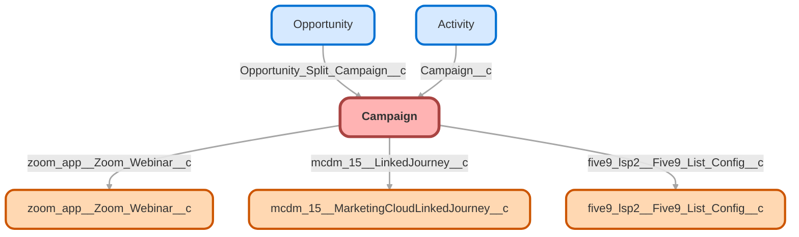

---
hide:
  - path
---

<!-- This file is auto-generated. if you do not want it to be overwritten, set TRUE in the line below -->
<!-- DO_NOT_OVERWRITE_DOC=FALSE -->

## Schema

<!-- Object description -->

## Fields

| Name      | Label | Type | Description |
| :-------- | :---- | :--: | :---------- | 
| ActualCost |  |  | undefined |
| Airfare__c | Airfare | Currency | undefined |
| AmountAllOpportunities |  |  | undefined |
| AmountWonOpportunities |  |  | undefined |
| Attendance_Cost__c | Attendance Cost | Currency | undefined |
| Attendance_Exhibit_Cost__c | Exhibit Cost | Currency | undefined |
| Attendees__c | TOK Attendee(s) | Text | undefined |
| Booth_Costs__c | Booth Costs | Currency | Furniture, carpeting, etc. |
| BudgetedCost |  |  | undefined |
| Business_Unit__c | Business Unit | Picklist | undefined |
| BusinessUnitId |  | Lookup | undefined |
| CampaignImageId |  | Lookup | undefined |
| CampaignMemberRecordTypeId |  | Lookup | undefined |
| Conference_Type__c | Channel | Picklist | undefined |
| Contact_Email__c | Contact Email | Email | undefined |
| Contact_Name__c | Contact Name | Text | undefined |
| Contact_Phone__c | Contact Phone | Phone | undefined |
| Conversion_Rate__c | Conversion Rate | Percent | Number of Converted Leads Divided by Total Number of Leads |
| Cost_details__c | Cost details | Text | undefined |
| Description |  |  | undefined |
| EndDate |  |  | undefined |
| Estimated_Cost__c | Estimated Cost | Currency | undefined |
| ExpectedResponse |  |  | undefined |
| ExpectedRevenue |  |  | undefined |
| Five9__Five9CallNow__c | Five9 Call Now | Checkbox | Sets Five9 callNowMode to 'ANY' |
| Five9__Five9Endpoint__c | Five9 WS Endpoint | Url | undefined |
| Five9__Five9list__c | Five9list | Text | Five9 dialing list name |
| Five9__Five9Password__c | Five9 User Password | EncryptedText | undefined |
| Five9__Five9ReportEmail__c | Five9 Report Email | Email | undefined |
| Five9__Five9User__c | Five9 User | Text | undefined |
| five9_lsp2__Five9_List_Config__c | Five9 List Config | Lookup | undefined |
| Goal__c | Goal | Text | undefined |
| HierarchyActualCost |  |  | undefined |
| HierarchyAmountAllOpportunities |  |  | undefined |
| HierarchyAmountWonOpportunities |  |  | undefined |
| HierarchyBudgetedCost |  |  | undefined |
| HierarchyExpectedRevenue |  |  | undefined |
| HierarchyNumberOfContacts |  |  | undefined |
| HierarchyNumberOfConvertedLeads |  |  | undefined |
| HierarchyNumberOfLeads |  |  | undefined |
| HierarchyNumberOfOpportunities |  |  | undefined |
| HierarchyNumberOfResponses |  |  | undefined |
| HierarchyNumberOfWonOpportunities |  |  | undefined |
| HierarchyNumberSent |  |  | undefined |
| Hotel_Cost__c | Hotel Cost | Currency | undefined |
| IsActive |  |  | undefined |
| Location__c | Location | Text | undefined |
| Materials__c | Materials Sent | LongTextArea | undefined |
| Materials_Cost__c | Materials Cost | Currency | undefined |
| Materials_Used__c | Materials Used | LongTextArea | undefined |
| mcdm_15__DM_Approval_Mode__c | DM Approval Mode | Picklist | undefined |
| mcdm_15__DM_Manual_Approval_Threshold__c | DM Manual Approval Threshold | Number | undefined |
| mcdm_15__LinkedBusinessUnit__c | Linked Business Unit | Text | The Name corresponding to the the Display Name of the Business Unit that this Campaign is Linked to |
| mcdm_15__LinkedJourney__c | Linked Journey | Lookup | undefined |
| Misc_Cost__c | Misc Cost | Currency | undefined |
| Name |  |  | undefined |
| Networking_Events__c | Networking Events | Text | undefined |
| NumberOfContacts |  |  | undefined |
| NumberOfConvertedLeads |  |  | undefined |
| NumberOfLeads |  |  | undefined |
| NumberOfOpportunities |  |  | undefined |
| NumberOfResponses |  |  | undefined |
| NumberOfWonOpportunities |  |  | undefined |
| NumberSent |  |  | undefined |
| of_attendees__c | # of attendees | Number | undefined |
| of_exhibitors__c | # of exhibitors | Number | undefined |
| Overall_Close_Rate__c | Overall Close Rate | Percent | Number of Won Opportunities divided by the Number of Leads |
| OwnerId |  | Lookup | undefined |
| ParentId |  | Lookup | undefined |
| Per_Diem__c | T&E | Currency | undefined |
| Pre_conference_activity__c | Pre-Conference Activity (if applicable) | Text | undefined |
| S_H__c | S&H | Currency | undefined |
| Sponsorship_Cost__c | Sponsorship Cost | Currency | undefined |
| Stage |  |  | undefined |
| StartDate |  |  | undefined |
| Status |  | Picklist | undefined |
| Type |  | Picklist | undefined |
| Website__c | Website | Url | undefined |
| zoom_app__Zoom_Webinar__c | Zoom Webinar | Lookup | undefined |

## Validation Rules

| Rule      | Active | Description | Formula |
| :-------- | :---- | :---------- | :------ |
| mcdm_15__threshold_values | Yes | Ensures the threshold value is valid based on the DM Approval mode. Only allowed when approval mode is set to target audience size and must be set to 2 or above. | OR (   AND(     ISPICKVAL(mcdm_15__DM_Approval_Mode__c, "nRecipients"),     OR(       mcdm_15__DM_Manual_Approval_Threshold__c < 2,       mcdm_15__DM_Manual_Approval_Threshold__c > 100000,       ISBLANK(mcdm_15__DM_Manual_Approval_Threshold__c)     )   ),    AND (     NOT(ISPICKVAL(mcdm_15__DM_Approval_Mode__c, "nRecipients")),     NOT(ISBLANK(mcdm_15__DM_Manual_Approval_Threshold__c))   ) ) |

## Related Flows

| Object | Name      | Type | Description |
| :----  | :-------- | :--: | :---------- | 
| 💻 | [Nano_Banc_Single_k_Flow](../flows/Nano_Banc_Single_k_Flow.md) [🕒](../flows/Nano_Banc_Single_k_Flow-history.md) |  Auto Launched Flow | <!-- --> |
| 💻 | [RewardJet_401_k_Flow](../flows/RewardJet_401_k_Flow.md) [🕒](../flows/RewardJet_401_k_Flow-history.md) |  Auto Launched Flow | <!-- --> |
| 💻 | [RewardJet_Single_k_Flow](../flows/RewardJet_Single_k_Flow.md) [🕒](../flows/RewardJet_Single_k_Flow-history.md) |  Auto Launched Flow | <!-- --> |

## Related Lightning Pages

| Lightning Page | Type |
| :----      | :--: | 
| [Campaign_Record_Page_BizDev](../pages/Campaign_Record_Page_BizDev.md) |  Record Page |
| [Campaign_Record_Page_BizDev1](../pages/Campaign_Record_Page_BizDev1.md) |  Record Page |
| [Default_Account_Layout](../pages/Default_Account_Layout.md) |  Record Page |
| [Default_Opportunity_Layout](../pages/Default_Opportunity_Layout.md) |  Record Page |
| [Dynamic_Account_Page](../pages/Dynamic_Account_Page.md) |  Record Page |
| [Dynamic_Lead_Page](../pages/Dynamic_Lead_Page.md) |  Record Page |
| [Dynamic_Opp_Page](../pages/Dynamic_Opp_Page.md) |  Record Page |
| [Partner_Account_Layout](../pages/Partner_Account_Layout.md) |  Record Page |
| [Sales_Lightning_Account_Record](../pages/Sales_Lightning_Account_Record.md) |  Record Page |

## Related Profiles

| Profile | User License |
| :----      | :--: | 
| [Admin](../profiles/Admin.md) |  Salesforce |
| [Analytics Cloud Integration User](../profiles/Analytics%20Cloud%20Integration%20User.md) |  Analytics  Cloud  Integration  User |
| [Analytics Cloud Security User](../profiles/Analytics%20Cloud%20Security%20User.md) |  Analytics  Cloud  Integration  User |
| [Anypoint Integration](../profiles/Anypoint%20Integration.md) |  Identity |
| [B2BMA Integration User](../profiles/B2BMA%20Integration%20User.md) |  B2 B M A  Integration  User |
| [Billing User](../profiles/Billing%20User.md) |  Salesforce |
| [Bot Profile](../profiles/Bot%20Profile.md) |  Salesforce |
| [Business Development](../profiles/Business%20Development.md) |  Salesforce |
| [Call Center](../profiles/Call%20Center.md) |  Salesforce |
| [Chatter External User](../profiles/Chatter%20External%20User.md) |  Chatter  External |
| [Chatter Free User](../profiles/Chatter%20Free%20User.md) |  Chatter  Free |
| [Chatter Moderator User](../profiles/Chatter%20Moderator%20User.md) |  Chatter  Free |
| [Client Onboarding - Admin](../profiles/Client%20Onboarding%20-%20Admin.md) |  Salesforce |
| [Client Onboarding - RM](../profiles/Client%20Onboarding%20-%20RM.md) |  Salesforce |
| [Client Servicing Team](../profiles/Client%20Servicing%20Team.md) |  Salesforce |
| [Compliance Manager](../profiles/Compliance%20Manager.md) |  Salesforce |
| [ContractManager](../profiles/ContractManager.md) |  Salesforce |
| [Director of Operations](../profiles/Director%20of%20Operations.md) |  Salesforce |
| [Director of Sales](../profiles/Director%20of%20Sales.md) |  Salesforce |
| [Distributions](../profiles/Distributions.md) |  Salesforce |
| [Einstein Agent User](../profiles/Einstein%20Agent%20User.md) |  Einstein  Agent |
| [ESW_Agentforce_MIAW_1748035300267 Profile](../profiles/ESW_Agentforce_MIAW_1748035300267%20Profile.md) |  Guest  User  License |
| [ESW_Agentforce_MIAW_1748385215843 Profile](../profiles/ESW_Agentforce_MIAW_1748385215843%20Profile.md) |  Guest  User  License |
| [ESW_CE_Chat_1692890394498 Profile](../profiles/ESW_CE_Chat_1692890394498%20Profile.md) |  Guest  User  License |
| [ESW_CE_Chat_Moe_1693182845676 Profile](../profiles/ESW_CE_Chat_Moe_1693182845676%20Profile.md) |  Guest  User  License |
| [ESW_Login_Help_1697133738638 Profile](../profiles/ESW_Login_Help_1697133738638%20Profile.md) |  Guest  User  License |
| [ESW_Login_Help_Simply_1700075140889 Profile](../profiles/ESW_Login_Help_Simply_1700075140889%20Profile.md) |  Guest  User  License |
| [ESW_Omni_Messaging_1694183770479 Profile](../profiles/ESW_Omni_Messaging_1694183770479%20Profile.md) |  Guest  User  License |
| [ESW_Omni_Messaging_CO_1696448547822 Profile](../profiles/ESW_Omni_Messaging_CO_1696448547822%20Profile.md) |  Guest  User  License |
| [ESW_Omni_Messaging_Sallus_1700075448386 Profile](../profiles/ESW_Omni_Messaging_Sallus_1700075448386%20Profile.md) |  Guest  User  License |
| [ESW_Omni_Messaging_Simply_1700076370188 Profile](../profiles/ESW_Omni_Messaging_Simply_1700076370188%20Profile.md) |  Guest  User  License |
| [ESW_QA_Login_1699666348585 Profile](../profiles/ESW_QA_Login_1699666348585%20Profile.md) |  Guest  User  License |
| [ESW_QA_Messaging_1699974036493 Profile](../profiles/ESW_QA_Messaging_1699974036493%20Profile.md) |  Guest  User  License |
| [ESW_Sales_Chat_1697460991337 Profile](../profiles/ESW_Sales_Chat_1697460991337%20Profile.md) |  Guest  User  License |
| [ESW_Sallus_Login_Chat_1700072925200 Profile](../profiles/ESW_Sallus_Login_Chat_1700072925200%20Profile.md) |  Guest  User  License |
| [External Apps Login User](../profiles/External%20Apps%20Login%20User.md) |  External  Apps  Login |
| [Finance Manager Lightning](../profiles/Finance%20Manager%20Lightning.md) |  Salesforce |
| [Guest License User](../profiles/Guest%20License%20User.md) |  Guest  User  License |
| [Help Center Profile](../profiles/Help%20Center%20Profile.md) |  Guest  User  License |
| [Identity User](../profiles/Identity%20User.md) |  Identity |
| [Incoming_SMS Profile](../profiles/Incoming_SMS%20Profile.md) |  Guest  User  License |
| [IT](../profiles/IT.md) |  Salesforce |
| [Leadership Lightning](../profiles/Leadership%20Lightning.md) |  Salesforce |
| [Leadership](../profiles/Leadership.md) |  Salesforce |
| [Learning %26 Development](../profiles/Learning%20%2526%20Development.md) |  Salesforce |
| [Lightning Client Onboarding](../profiles/Lightning%20Client%20Onboarding.md) |  Salesforce |
| [Lightning Compliance](../profiles/Lightning%20Compliance.md) |  Salesforce |
| [Lightning Saver User](../profiles/Lightning%20Saver%20User.md) |  Salesforce |
| [Lightning Service Manager](../profiles/Lightning%20Service%20Manager.md) |  Salesforce |
| [Lightning Service User](../profiles/Lightning%20Service%20User.md) |  Salesforce |
| [Marketing Team](../profiles/Marketing%20Team.md) |  Salesforce |
| [MarketingProfile](../profiles/MarketingProfile.md) |  Salesforce |
| [Master Administrator](../profiles/Master%20Administrator.md) |  Salesforce |
| [Minimum Access - API Only Integrations](../profiles/Minimum%20Access%20-%20API%20Only%20Integrations.md) |  Salesforce  Integration |
| [Minimum Access - Salesforce](../profiles/Minimum%20Access%20-%20Salesforce.md) |  Salesforce |
| [myubiquity Profile](../profiles/myubiquity%20Profile.md) |  Guest  User  License |
| [Operations VP](../profiles/Operations%20VP.md) |  Salesforce |
| [Operations](../profiles/Operations.md) |  Salesforce |
| [Paradigm Help Center Profile](../profiles/Paradigm%20Help%20Center%20Profile.md) |  Guest  User  License |
| [Payroll Koncierge](../profiles/Payroll%20Koncierge.md) |  Salesforce |
| [Payroll Team](../profiles/Payroll%20Team.md) |  Salesforce |
| [People %26 Culture](../profiles/People%20%2526%20Culture.md) |  Salesforce |
| [Pre-chat Site Profile](../profiles/Pre-chat%20Site%20Profile.md) |  Guest  User  License |
| [Product Innovation Leadership](../profiles/Product%20Innovation%20Leadership.md) |  Salesforce |
| [Product Innovation User](../profiles/Product%20Innovation%20User.md) |  Salesforce |
| [PSM Team](../profiles/PSM%20Team.md) |  Salesforce |
| [R%26W](../profiles/R%2526W.md) |  Salesforce |
| [Read Only](../profiles/Read%20Only.md) |  Salesforce |
| [Sales Administrator](../profiles/Sales%20Administrator.md) |  Salesforce |
| [Sales Coordinator](../profiles/Sales%20Coordinator.md) |  Salesforce |
| [Sales Insights Integration User](../profiles/Sales%20Insights%20Integration%20User.md) |  Sales  Insights  Integration  User |
| [Sales Team - Limited](../profiles/Sales%20Team%20-%20Limited.md) |  Salesforce |
| [Sales Team](../profiles/Sales%20Team.md) |  Salesforce |
| [Salesforce API Only System Integrations](../profiles/Salesforce%20API%20Only%20System%20Integrations.md) |  Salesforce  Integration |
| [SalesforceIQ Integration User](../profiles/SalesforceIQ%20Integration%20User.md) |  Salesforce I Q  Integration  User |
| [Saver Manager](../profiles/Saver%20Manager.md) |  Salesforce |
| [Simple Survey Profile](../profiles/Simple%20Survey%20Profile.md) |  Guest  User  License |
| [Simply Help Center Profile](../profiles/Simply%20Help%20Center%20Profile.md) |  Guest  User  License |
| [SolutionManager](../profiles/SolutionManager.md) |  Salesforce |
| [Standard](../profiles/Standard.md) |  Salesforce |
| [StandardAul](../profiles/StandardAul.md) |  Salesforce  Platform |
| [Super System Administrator](../profiles/Super%20System%20Administrator.md) |  Salesforce |
| [Sys Dev Admin](../profiles/Sys%20Dev%20Admin.md) |  Salesforce |
| [Transitions Team](../profiles/Transitions%20Team.md) |  Salesforce |
| [Ubiquity Help Center Profile](../profiles/Ubiquity%20Help%20Center%20Profile.md) |  Guest  User  License |
| [Zoom Webhooks Profile](../profiles/Zoom%20Webhooks%20Profile.md) |  Guest  User  License |

## Related Permission Sets

| Permission Set | User License |
| :----      | :--: | 
| [Attachments_and_Notes_Migrator](../permissionsets/Attachments_and_Notes_Migrator.md) | None |
| [Automation_Team_Imp_Project_Tasks](../permissionsets/Automation_Team_Imp_Project_Tasks.md) | None |
| [Campaign_Influence](../permissionsets/Campaign_Influence.md) | None |
| [Data_Loader](../permissionsets/Data_Loader.md) | None |
| [Developer](../permissionsets/Developer.md) | None |
| [ExactTarget_Integration_Admin](../permissionsets/ExactTarget_Integration_Admin.md) | None |
| [ExactTarget_Integration_Editable](../permissionsets/ExactTarget_Integration_Editable.md) | None |
| [MagicMover](../permissionsets/MagicMover.md) | None |
| [Manager](../permissionsets/Manager.md) | None |
| [Marketing_Cloud_System_User](../permissionsets/Marketing_Cloud_System_User.md) | None |
| [Master](../permissionsets/Master.md) | None |
| [Modify_All](../permissionsets/Modify_All.md) | None |
| [sfdcInternalInt__sfdc_a360_sfcrm_data_extract](../permissionsets/sfdcInternalInt__sfdc_a360_sfcrm_data_extract.md) | None |
| [sfdcInternalInt__sfdc_a360](../permissionsets/sfdcInternalInt__sfdc_a360.md) | None |
| [sfdcInternalInt__sfdc_articlerecommendations](../permissionsets/sfdcInternalInt__sfdc_articlerecommendations.md) | None |
| [sfdcInternalInt__sfdc_einsteinagent](../permissionsets/sfdcInternalInt__sfdc_einsteinagent.md) | None |
| [sfdcInternalInt__sfdc_replyrecommendations](../permissionsets/sfdcInternalInt__sfdc_replyrecommendations.md) | None |
| [sfdcInternalInt__sfdc_slack](../permissionsets/sfdcInternalInt__sfdc_slack.md) | None |
| [Ubiquity_Service_Agent_Permissions](../permissionsets/Ubiquity_Service_Agent_Permissions.md) | None |
| [View_All](../permissionsets/View_All.md) | None |
| [Zoom_Admin_Webinar](../permissionsets/Zoom_Admin_Webinar.md) | None |
| [Zoom_User_Webinar](../permissionsets/Zoom_User_Webinar.md) | None |

_Documentation generated with [sfdx-hardis](https://sfdx-hardis.cloudity.com), by [Cloudity](https://www.cloudity.com/) & [friends](https://github.com/hardisgroupcom/sfdx-hardis/graphs/contributors)_
