---
hide:
  - path
---

<!-- This file is auto-generated. if you do not want it to be overwritten, set TRUE in the line below -->
<!-- DO_NOT_OVERWRITE_DOC=FALSE -->

## Schema

```mermaid
graph TD
Transition__c["Transition"]:::customObject
Quality_Assurance_QA__c["Quality Assurance (QA)"]:::customObject
Project_Task__c["Project Task"]:::customObject
Project_Deliverables__c["Project Deliverable"]:::customObject
Plan__c["Plan"]:::customObject
Person__c["Person"]:::customObject
Opportunity["Opportunity"]:::object
Objective__c["Objective"]:::customObject
Implementation__c["Implementation"]:::customObject
Fund_List__c["Fund List"]:::customObject
Fee_Waiver__c["Fee Waiver"]:::customObject
Escalation__c["Escalation"]:::customObject
Contact["Contact"]:::object
Complex_Project__c["Complex Project"]:::customObject
Complaint_Form__c["Complaint Form"]:::customObject
Case["Case"]:::mainObject
click Case "/objects/Case/"
Calculation__c["Calculation"]:::customObject
click Calculation__c "/objects/Calculation__c/"
n2de__Distribution_engine_details__c["n2de__Distribution_engine_details__c"]:::customObjectManaged

Quality_Assurance_QA__c -->|Case__c| Case
Project_Task__c -->|Connected_Case__c| Case
Opportunity -->|Case__c| Case
Objective__c -->|Case__c| Case
Fee_Waiver__c -->|Case__c| Case
Escalation__c -->|Case__c| Case
Complaint_Form__c -->|Case__c| Case
Case -->|n2de__Distribution_engine_details__c| n2de__Distribution_engine_details__c
Case -->|lntcss__Splited_From__c| Case
Case -->|Transition__c| Transition__c
Case -->|Splited_From__c| Case
Case -->|ReAmParticipant__c| Contact
Case -->|Project_Deliverable__c| Project_Deliverables__c
Case -->|Plan__c| Plan__c
Case -->|Person__c| Person__c
Case -->|Opportunity__c| Opportunity
Case -->|Implementation__c| Implementation__c
Case -->|Fund_List__c| Fund_List__c
Case -->|Complex_Project__c| Complex_Project__c
Calculation__c -->|Case__c| Case

classDef object fill:#D6E9FF,stroke:#0070D2,stroke-width:3px,rx:12px,ry:12px,shadow:drop,color:#333;
classDef customObject fill:#FFF4C2,stroke:#CCAA00,stroke-width:3px,rx:12px,ry:12px,shadow:drop,color:#333;
classDef customObjectManaged fill:#FFD8B2,stroke:#CC5500,stroke-width:3px,rx:12px,ry:12px,shadow:drop,color:#333;
classDef mainObject fill:#FFB3B3,stroke:#A94442,stroke-width:4px,rx:14px,ry:14px,shadow:drop,color:#333,font-weight:bold;
linkStyle 0,1,2,3,4,5,6,7,8,9,10,11,12,13,14,15,16,17,18,19 stroke:#A6A6A6,stroke-width:2px;

```

<!-- Object description -->

## Fields

| Name      | Label | Type | Description |
| :-------- | :---- | :--: | :---------- | 
| Abandoned_Review_Result__c | Abandoned Review Result | Picklist | Abandoned Plan Review - verify final result of review.   Selecting Potentially Abandoned will trigger cases for Billing and Transitions. |
| Abandoned_Review_Type__c | Abandoned Review Type | Picklist | At Risk = Payroll and/or 1099 timing are at least 9-12 months behind. Potential Abandon = Payroll and 1099 timing are 12+ months behind. |
| AccountId |  | Lookup | Account the contact on the case is with |
| Activity_Checkbox__c | Activity Checkbox | Checkbox | undefined |
| Address_Name_Change_Child_Cases__c | Address|Name Change Child Cases | Date | Triggers address/name child case flow |
| Adjustment_Reason__c | Adjustment Reason | TextArea | For Fee Reimbursement or Gain/Loss Calc, reason is required. |
| Adjustment_Spreadsheet_Attached__c | Adjustment Spreadsheet Attached? | Checkbox | Check to confirm that the adjustment spreadsheet approved by Operations will be attached to the child case |
| Adjustment_Type__c | Adjustment Type | Picklist | Verify the type of adjustment being requested |
| Aged_Payroll_Amount__c | Aged Payroll Amount | Currency | undefined |
| Aged_Payroll_As_Of_Date__c | Aged Payroll As Of Date | Date | undefined |
| Aged_Payroll_Check_Date__c | Aged Payroll Check Date | Date | undefined |
| Aged_Payroll_ID__c | Aged Payroll ID | Text | undefined |
| Alert_Email__c | Alert Email | Email | Used for sending email alert to case team |
| All_Fund_Change_Docs_Attached__c | All Fund Change Docs Attached | Checkbox | All needed documents have been attached: Fund Change Form, QDIA Change Form, Model Portfolio Change Form. |
| Ancillary_Billing_Amount__c | Ancillary Billing Amount | Number | Amount of Ancillary Billing (Used by Billing Only) |
| Approval_Status__c | Approval Status | Picklist | Used for Reissue Fee WaiverPayment approval process |
| Asked_for_Referral__c | Asked for Referral | Checkbox | Check this box when you ask contact on this case to provide a new plan referral. |
| Asked_for_Referral_Date__c | Asked for Referral Date | DateTime | Date a referral was asked for |
| Asked_for_Review__c | Asked for Review | Checkbox | Check this box when you ask contact on this case to provide a review. |
| Asked_for_Review_Date__c | Asked for Review Date | DateTime | Date a review was asked for |
| AssetId |  | Lookup | undefined |
| Assign_Client_to_Existing_Portfolio__c | Assign Client to Existing Portfolio | Checkbox | Used by Fin Ops for Fund Change Cases |
| Billing_ForceDist_Amount__c | Billing ForceDist Amount | Currency | Amount to collect for Force Out Distribution Billing Work |
| Blackout_Start_Date__c | Blackout Start Date | Date | undefined |
| Bounced_Sponsor_Trustee_Emails__c | Bounced Sponsor/Trustee Emails | Picklist | Abandoned Plan Review - are there any bounced emails for sponsors or trustees? |
| Box_LOI_Link__c | Box LOI Link | Url | Link to address/name change LOI |
| BusinessHoursId |  | Lookup | undefined |
| Case_Age__c | Case Age (Days) | Number | undefined |
| Case_Age_In_Business_Hours__c | Hours to Resolve Case | Number | Total Hours a case was worked by our support teams.   Time spent in "Closed" Statuses is excluded in instances where clients/teams reopen cases at a later date |
| Case_Close_SLA_Met__c | Case Close SLA Met | Checkbox | undefined |
| Case_Close_SLA_Violation__c | Case Close SLA Violation | Checkbox | undefined |
| Case_Closed__c | Case Closed | Checkbox | Used to help close closure milestone. |
| Case_Complexity__c | Case Complexity | Picklist | Used for tagging complexity of cases for analytics. |
| Case_Email_ForceDisto__c | Case Email ForceDisto | Email | Used only for Force Distribution Survey Process to merge emails into Docusign |
| Case_Flag__c | Case Flag | Text | undefined |
| Case_ID_18_Char__c | Case ID (18 Char) | Text | 18 Character Case ID |
| Case_Next_Steps__c | Case Next Steps | LongTextArea | What are the next steps to resolve this case? |
| Case_notes_new__c | Case Notes | LongTextArea | undefined |
| Case_Owner_Name__c | Case Owner Name | Text | undefined |
| Case_Owner_Role__c | Case Owner Role | Text | undefined |
| Case_Resolution_CSAT__c | Case Resolution CSAT | Number | CSAT from Case Resolution CSAT Survey |
| Case_Sent_to_External_Team__c | Case Sent to External Team | MultiselectPicklist | If case needs to be sent to another team for assistance in resolution, indicate which team it was sent to. |
| Case_Sentiment__c | Case Sentiment | Picklist | Your perception of how you think the client felt the interaction went. |
| Case_Source__c | Case Source | Picklist | Source of inquiry |
| Case_Team__c | Case Team | Text | Used for backend Flows and Reporting |
| Case_Team_New__c | Case Team New | Text | Team the case owner belongs to - locks in when the case is closed. |
| Case_Type__c | Case Type | Picklist | This field helps user to distinguish the type of case and existing relationships. |
| Cases__c | Cases | Number | undefined |
| CaseTimer19__Cumulative_Time__c | Cumulative Time (Seconds) | Summary | undefined |
| Category__c | Category | Picklist | undefined |
| Certified_Notice_Count__c | Certified Notice Count | Number | Number of ex-employee(s) client wants Ubiquity to send Certified Notices to for Force Out Distributions |
| Certified_Notice_Name_List__c | Certified Notice Name List | LongTextArea | List of ex-employee(s) client requested Ubiquity send certified notices to before Force Out Distribution |
| Certified_Notice_Sent__c | Certified Notice Sent | Date | Date client confirmed they finished sending certified notices |
| Child_Case_Instructions__c | Child Case Instructions | LongTextArea | Used only when creating child cases for other teams - this is where you'll instruct owner of child case what is needed |
| Client_Satisfaction_CSAT__c | Client Satisfaction (CSAT) | Picklist | Client Satisfaction Score of 1-5. 1 being the lowest and 5 the highest. |
| Client_Sentiment__c | Client Sentiment | Number | undefined |
| Client_Support_Team_CST__c | Client Support Team (CST) | Text | This is the Client Success Team based on Product, location and company size. |
| Closed_Date_Delay__c | Closed Date Delay | DateTime | Date/Time field that logs a time in the past.   This time is then used + one hour to hack Process Builder to build in Delay Actions in minutes. |
| Closed_Status__c | Closed Status | Picklist | undefined |
| ClosedDate |  |  | undefined |
| Comments |  |  | undefined |
| Complaint__c | Complaint | Checkbox | Identifies cases where a client requested to file a complaint |
| Complaint_Tier__c | Complaint Tier | Picklist | undefined |
| Complex_Project__c | Complex Project | Lookup | undefined |
| Compliance_Review__c | Compliance Review | Picklist | undefined |
| Connected_Partner__c | Connected Partner | Text | Partner with shared SLAs - Set on Account |
| Connected_to_Project__c | Connected to Project | Checkbox | undefined |
| Contact_Role__c | Contact Role | Text | undefined |
| ContactEmail |  |  | undefined |
| ContactFax |  |  | undefined |
| ContactId |  | Lookup | undefined |
| ContactMobile |  |  | undefined |
| ContactPhone |  |  | undefined |
| Control_2_4_1_Findings__c | Control 2.4.1 Findings | LongTextArea | undefined |
| Control_2_4_1_Situation__c | Control 2.4.1 Situation | MultiselectPicklist | undefined |
| Control_2_4_1_Summary__c | Control 2.4.1 Summary | LongTextArea | undefined |
| Correct_Plan_Year__c | Correct Plan Year | Text | Plan year (YYYY) funds will be in when adjustment is complete |
| Created_By_Role__c | Created By Role | Text | undefined |
| Current_Threshold__c | Current Threshold | Text | Current force out threshold ($1k or $5k) before Force Out Survey is sent |
| Custodian_Account_Id__c | Custodian Account Id | Text | undefined |
| Custom_SLA_Active__c | Custom SLA Active | Checkbox | undefined |
| Customer_Re_Opened_Case__c | Customer Re-Opened Case | DateTime | Date/Time that the customer re-engaged and re-opened case. |
| Dashes_to_add_Case_to_Subject__c | Dashes to add Case # to Subject | Text | Hidden field used to include dashes between Subject and Case Number in Cases |
| Date_Requested__c | Date Requested | Date | undefined |
| Days_Behind_On_Payroll__c | Days Behind On Payroll | Number | Copied from Plan Record - Used on Late Payroll Cases to ID those that can be closed |
| Days_Since_Last_Activity__c | Days Since Last Activity | Number | undefined |
| Department__c | Department | Picklist | Requestor's department |
| Description |  |  | undefined |
| Document_Link__c | Document Link | Url | undefined |
| Dollar_Amount_of_Adjustment__c | Dollar Amount of Adjustment | Currency | Entered by Operations - verifies dollar amount included in an adjustment operation |
| Eligible_for_Archive__c | Eligible for Archive | Checkbox | undefined |
| Enhancement_Status__c | Enhancement Status | Picklist | undefined |
| Enhancement_System__c | Enhancement System | Picklist | undefined |
| EntitlementId |  | Lookup | undefined |
| Escalated__c | Account Escalated | Checkbox | undefined |
| escalatedImg__c | Escalated | Text | undefined |
| Estimated_Due_Date__c | Estimated Due Date | Date | Estimated Due Date of project |
| EvenOdd__c | EvenOdd | Text | undefined |
| Excess_Cash_Amount__c | Excess Cash Amount | Currency | Amount of excess cash at the time the case was created |
| Excess_Cash_Date__c | Excess Cash Date | Date | Date Excess Cash Amount is recorded |
| Expected_Days_to_Close__c | Expected Days to Close | Number | Calculated from case's SLA and communicated to clients when case is transferred to an ops team (Compliance, Payroll, R&W, A&F). |
| Feedback_Category__c | Feedback Category | Picklist | Used to categorize client feedback cases |
| Final_Notice_Sent__c | Final Notice Sent | Date | Date final notice was sent to client for payroll rejects, aged cash, unidentified deposit, etc. |
| First_Response__c | First Response | DateTime | Tracks first email sent on a given case. |
| First_Response_SLA_Met__c | First Response SLA Met | Checkbox | undefined |
| First_Response_SLA_Violation__c | First Response SLA Violation | Checkbox | undefined |
| Follow_Up_Date__c | Follow Up Date | Date | Date you want to follow up on the Case with the Client |
| Force_Out_Count__c | Force Out Count | Number | Number of term employees forced out of the plan |
| Force_Out_Name_List__c | Force Out Name List | LongTextArea | List of individuals to be forced out of plan |
| Force_Out_Threshold_Increase_Fee__c | Force Out Threshold Increase Fee | Currency | Fee Amount charged for Amending Plan to increase Force Out Threshold |
| ForceDist_Address__c | ForceDist Address | Text | Used in ForceDist Cases for Docusign Merge |
| ForceDist_Billing_Amount__c | ForceDist Billing Amount | Currency | (Cert Notice Count * $10) + (Look Up Names Count * $25) |
| ForceDist_CityStateZip__c | ForceDist CityStateZip | TextArea | Used for Force Dist Cases |
| ForceDist_Email_Date__c | ForceDist Email Date | Date | Date Force Dist Survey Email  Sent |
| ForceDist_Phone__c | ForceDist Phone | Phone | Phone number that will be merged into the FPS Trust Agreement |
| ForceDist_Plan_Name__c | ForceDist Plan Name | Text | Plan name that will merge into the FPS Trust Agreement |
| ForceOut_Threshold_Fee__c | ForceOut Threshold Fee | Currency | Hidden Report field |
| Forfeiture_Plan_Asset_Amount__c | Forfeiture/Plan Asset amount | Currency | Amount in Forfeiture for Operations to Liquidate |
| FPS_EIN__c | FPS EIN | Text | EIN used to merge into FPS Trust Agree DocuSign for force out distribution cases |
| FPS_Required__c | FPS Required | Picklist | Confirms if FPS Trust Agree is required for 2021 Force Out Distribution Process |
| Full_Case_Archive__c | Full Case Archive | Checkbox | undefined |
| Fund_Change_Effective_Date__c | Fund Change Effective Date | Date | For FIn Ops, Date Fund Change Takes Effect |
| Fund_List__c | Fund List | Lookup | Fund List Case is associated with. |
| Funding_Information__c | Funding Information | Picklist | Verify funding information for adjustment |
| Funds_Vetted__c | Funds Vetted | Checkbox | undefined |
| Future_Review_Date__c | Future Review Date | Date | Once case is closed, reminder case is created on this date to verify work is complete. |
| gaconnector_Browser__c | Browser | Text | undefined |
| gaconnector_City__c | City | Text | undefined |
| gaconnector_Country__c | Country | Text | undefined |
| gaconnector_Device__c | Device | Text | undefined |
| gaconnector_First_Click_Campaign__c | First Click Campaign | Text | undefined |
| gaconnector_First_Click_Channel__c | First Click Channel | Text | undefined |
| gaconnector_First_Click_Content__c | First Click Content | Text | undefined |
| gaconnector_First_Click_Landing_Page__c | First Click Landing Page | Text | undefined |
| gaconnector_First_Click_Medium__c | First Click Medium | Text | undefined |
| gaconnector_First_Click_Referrer__c | First Click Referrer | Text | undefined |
| gaconnector_First_Click_Source__c | First Click Source | Text | undefined |
| gaconnector_First_Click_Term__c | First Click Term | Text | undefined |
| gaconnector_GCLID__c | GCLID | Text | undefined |
| gaconnector_Google_Analytics_Client_ID__c | Google Analytics Client ID | Text | undefined |
| gaconnector_Google_Analytics_Link__c | Google Analytics Link | Text | undefined |
| gaconnector_IP_Address__c | IP Address | Text | undefined |
| gaconnector_Last_Click_Campaign__c | Last Click Campaign | Text | undefined |
| gaconnector_Last_Click_Channel__c | Last Click Channel | Text | undefined |
| gaconnector_Last_Click_Content__c | Last Click Content | Text | undefined |
| gaconnector_Last_Click_Landing_Page__c | Last Click Landing Page | Text | undefined |
| gaconnector_Last_Click_Medium__c | Last Click Medium | Text | undefined |
| gaconnector_Last_Click_Referrer__c | Last Click Referrer | Text | undefined |
| gaconnector_Last_Click_Source__c | Last Click Source | Text | undefined |
| gaconnector_Last_Click_Term__c | Last Click Term | Text | undefined |
| gaconnector_Latitude_from_IP__c | Latitude (from IP) | Number | undefined |
| gaconnector_Location_approx__c | Location (approx.) | Text | undefined |
| gaconnector_Longitude__c | Longitude | Number | undefined |
| gaconnector_Number_of_Website_Visits__c | Number of Website Visits | Text | undefined |
| gaconnector_Operating_System__c | Operating System | Text | undefined |
| gaconnector_Pages_visited__c | Pages visited | LongTextArea | undefined |
| gaconnector_Time_Spent_on_Website__c | Time Spent on Website | Number | undefined |
| gaconnector_Time_Spent_on_Website_formul__c | Time Spent on Website | Text | undefined |
| gaconnector_Time_Zone__c | Time Zone | Text | undefined |
| Goal_Close_DT_Stamp__c | Goal Close DT Stamp | DateTime | undefined |
| Goal_Close_Formatted__c | Goal Close Formatted | Text | Formats closure goal for external email templates as "Month Day".  Example: September 4th |
| Goal_FR_DT_Stamp__c | Goal FR DT Stamp | DateTime | undefined |
| Gross_Amount__c | Gross Amount | Currency | Reissue Request field |
| Implementation__c | Implementation | Lookup | Implementation that Case is associated with |
| Implementation_Owner_Full_Name__c | Implementation Owner Full Name | Text | undefined |
| Implementation_Owner_Phone__c | Implementation Owner Phone | Text | undefined |
| Implementation_Owner_Title__c | Implementation Owner Title | Text | undefined |
| Inquiry_Source__c | Inquiry Source | Picklist | May be replaced by Inquiry Source Team - this was update by process where Inquiry Source Team is a formula field.   This field has data missing for 2+ years.   Process Builder was looking to "Owner ID = Compliance" which never ran. |
| Inquiry_Source_Team__c | Inquiry Source Team | Text | Used for detailing team (CST) that created this case for the cases' owner |
| Is_Ancillary_Billing_Needed__c | Is Ancillary Billing Needed? | Picklist | Is Ancillary Billing Needed for this case request? If yes please navigate to the Case Feed View and create an ancillary billing opportunity. |
| IsClosedOnCreate |  |  | undefined |
| IsEscalated |  |  | This will auto check/uncheck based on "Priority" |
| IsSelfServiceClosed |  |  | undefined |
| IsStopped |  |  | undefined |
| IsVisibleInSelfService |  |  | undefined |
| JIRA_Component__c | Component | MultiselectPicklist | undefined |
| JIRA_End_User_Type__c | End User Type | MultiselectPicklist | undefined |
| JIRA_Priority__c | JIRA Priority | Picklist | High = 1 Plan affected Medium = 1 Participant affected Low = Not Plan or participant dependent |
| JIRA_Severity__c | Severity | Picklist | undefined |
| JIRA_Status__c | JIRA Status | Picklist | Status in JIRA |
| JIRA_Ticket_Number__c | JIRA Ticket Number | Text | JIRA Ticket Number |
| JIRA_Ticket_Owner__c | JIRA Ticket Owner | Picklist | Ticket Owner in JIRA |
| Language |  |  | undefined |
| Last_Activity_Date__c | Last Activity Date | DateTime | Date of Last Activity on the Case |
| Last_Health_Check_Date__c | Last Health Check Date | Date | Most recent client health check date for plan linked to this case |
| Last_Health_Check_Type__c | Last Health Check Type | Text | Most recent client health check type for plan linked to this case |
| Last_Inbound_Activity__c | Last Inbound Activity | Date | Date of last inbound activity on this case |
| Last_Outbound_Activity__c | Last Outbound Activity | Date | Date of last outbound activity on a case related to this Plan |
| Last_Status_Change__c | Last Status Change | DateTime | Stores the last time the status changed -- used by the Case Business Hours Tools package. |
| Liquidate_Forfeitures__c | Liquidate Forfeitures? | Picklist | Verify if forfeitures should be liquidated and if so, should they move to cash or be used to pay invoices. |
| List_Link__c | List Link | Url | Link for list requests |
| List_Source__c | List Source | Picklist | undefined |
| lntcss__Splited_From__c | Splited From | Lookup | undefined |
| Look_Up_Name_Count__c | Look Up Name Count | Number | Number of ex-employee(s) client wants Ubiquity to locate addresses for before forcing out distributions |
| Look_Up_Name_List__c | Look Up Name List | LongTextArea | List of ex-employee(s) client requested locate services for |
| Marketing_Stage__c | Marketing Stage | Picklist | undefined |
| MilestoneStatus |  |  | undefined |
| MilestoneStatusIcon |  |  | undefined |
| Most_Recent_1099R__c | Most Recent 1099R | Date | Date of most recent distribution for abandoned plan risk review.   If blank, the plan has no record of a 1099R in the past 12 months. |
| Most_Recent_Payroll__c | Most Recent Payroll | Date | undefined |
| Most_Recent_Payroll_Submitted__c | Most Recent Payroll Submitted | Date | Date of most recent payroll submission in Paradigm |
| n2de__Action__c | Distribution action | Picklist | undefined |
| n2de__DE_Status__c | DE Classifier Status | Text | undefined |
| n2de__DE_Territory__c | DE Territory (Deprecated) | Text | Deprecated, use Distribution_engine_details__c.Territory__c instead |
| n2de__Distribution_count__c | Distribution count | Number | The number of times this record has been assigned via Distribution Engine |
| n2de__Distribution_engine_details__c | Distribution Engine details | Lookup | undefined |
| n2de__Is_archived__c | Is archived | Checkbox | undefined |
| n2de__Is_distributed__c | Is distributed | Checkbox | undefined |
| n2de__Is_reassigned__c | Is auto reassigned | Checkbox | undefined |
| n2de__Is_trigger_enabled__c | Trigger enabled | Checkbox | undefined |
| n2de__Is_triggered__c | Is triggered | Checkbox | undefined |
| n2de__Last_archive_date__c | Last archive date | DateTime | undefined |
| n2de__Last_distributed__c | Date last distributed to user | DateTime | undefined |
| n2de__Last_reassigned__c | Date last auto reassigned | DateTime | undefined |
| n2de__Source_queue__c | Source queue | Text | undefined |
| n2de__Time_to_action_mins__c | Time to action (mins) | Number | undefined |
| Number_of_Child_Cases_Closed__c | Number of Child Cases Closed | Number | This field counts the number of Child Cases Closed. |
| Number_of_Child_Cases_Open__c | Number of Child Cases Opened | Number | This field counts the number of Child Cases Opened. |
| Number_of_Participants_to_Adjust__c | Number of Participants to Adjust | Number | Entered by Operations - verifies number of participants included in an adjustment operation |
| of_Activities_Emails__c | # of Activities/Emails | Number | undefined |
| Opportunity__c | Opportunity | Lookup | Link to Opportunity for Compliance Calculation cases from Sales |
| Origin |  | Picklist | undefined |
| Original_Check_Date__c | Original Check Date | Date | Reissue request field |
| Original_Close_Date_Time__c | Original Close Date Time | DateTime | Created for SLA calculation |
| original_number__c | Original Number | Text | Used to preserve original case number for ownbackup |
| Original_Plan_Year__c | Original Plan Year | Text | Plan year (YYYY) funds are currently in for adjustments |
| Overnight_check_detail__c | Overnight check detail | Text | Reissue request field |
| Owner_s_Manager__c | Owner's Manager | Text | undefined |
| OwnerId |  | Lookup | undefined |
| Paradigm_Plan_Link__c | Paradigm Plan Link | Text | undefined |
| ParentId |  | Lookup | undefined |
| Partner__c | Partner | Text | Clients with shared SLAs will appear here. |
| Past_Due_5500__c | Past Due 5500 | Picklist | For Abandoned Plan Review cases - are there any older 5500s that haven't been filed? |
| Past_Due_Payroll_Survey_Link__c | Past Due Payroll Survey Link | Text | Hidden field to generate URL for unique Past Due Payroll Survey |
| Past_Due_Survey_Received__c | Past Due Survey Received | Date | Date past due payroll survey was received |
| Past_Due_Survey_Sent__c | Past Due Survey Sent | Date | Date Past Due survey email was sent |
| Payroll_ID__c | Payroll ID | Text | Enter Payroll ID if there is one - if not, enter "N/A" |
| Payroll_Schedule__c | Payroll Schedule | Text | undefined |
| Person__c | Person | Lookup | undefined |
| Plan__c | Plan | Lookup | Plan this case is associated with.   Select "Multiple Plans/Unidentified Plan" if the case is regarding more than one plan or a not a specific plan. |
| Plan_over_125_EEs__c | Plan over 125 EEs? | Picklist | Verify if the plan is over 125 Employees as it will impact the adjustment process |
| Plan_Payroll_Status__c | Plan Payroll Status | Text | undefined |
| Plan_Value__c | Plan Value | Text | Plan value based on employee count and service option.  Prefers tunneling through plan to account b/c of cases where "account" is an advisor/other account besides plan owner. |
| Plan07CNumber__c | Plan07CNumber | Text | undefined |
| PlanAccountNumber__c | PlanAccountNumber | Text | Hidden field to pull in CustID Number for Rollover Merge Templates |
| Portfolio_Name__c | Portfolio Name | Text | Used by Fin Ops for Fund Change cases |
| Preferred_Completion_Date__c | Preferred Completion Date | Date | Date the requestor would like the request by. |
| Primary_Audience__c | Primary Audience | Picklist | Primary audience of marketing cases. |
| Priority |  | Picklist | undefined |
| Priority_Service__c | Priority Service | Checkbox | undefined |
| ProductId |  | Lookup | undefined |
| Project_Deliverable__c | Project Deliverable | Lookup | undefined |
| QA_Status__c | QA Status | Picklist | undefined |
| ReAm__c | ReAm total loan term (Months) | Number | Used for Reamortization case requests to Distributions. |
| ReAm_confirm_timeline__c | ReAm confirm timeline | Checkbox | Check box to verify you confirmed with client that new payment may not be up to 30 days after reamortization is complete. |
| ReAm_Fee__c | ReAm Fee | Picklist | Used for Reamortization case requests to Distributions |
| ReAm_Loan_type__c | ReAm loan type | Picklist | Used for Reamortization case requests to Distributions |
| ReAm_Waiver_Reason__c | ReAm waiver reason | Picklist | Used for Reamortization case requests to Distributions.   Required if ReAm Fee = Waived. |
| ReAmParticipant__c | ReAm Participant | Lookup | Look up the contact record in Salesforce for the Participant ReAmortizing their loan |
| Reason |  | Picklist | undefined |
| ref_Id__c | ref Id | Text | undefined |
| Reference_Memo_Line__c | Reference # / Memo Line | Text | Reference number / memo line for check or wire reissue |
| Reissue_Address__c | Reissue Address | TextArea | Reissue request field |
| Reissue_Custodian__c | Reissue Custodian | Picklist | undefined |
| Reissue_Fee__c | Reissue Fee | Picklist | Reissue request field |
| Reissue_Method__c | Reissue Method | Picklist | Reissue request field |
| Reissue_Payee_Wire_Info__c | Reissue Payee|Wire Info | TextArea | Reissue request field |
| Reissue_Reason__c | Reissue Reason | Picklist | Reissue request field |
| Reopened_Count__c | Reopened Count | Number | Counts the number of times a case is reopened (Changed from Closed=True to Closed=False) |
| Request_Level__c | Request Level | Picklist | undefined |
| Request_Reason__c | Request Reason | Picklist | - Product not working = “Tried to submit form on Paradigm and got error message” - How to use/how to update info  = “How to add new census information?”, “How do I change my funds?” - What is this?  = “Why are you sending me this form?”, “What is a Roth IRA? - Advice = “What funds should I select?”,“Is my fund portfolio appropriate?” |
| Requestor_s_Department__c | Requestor's Department | Text | undefined |
| RKO_Plan__c | RKO Plan | Checkbox | If the case's plan's service option is RK Only or Simply Retirement Unbundled, this box will be checked. |
| ROI_Touched_Case__c | ROI Touched Case | Checkbox | Indicates that someone in ROI / the call center owned the case at some point. |
| RPC_Request__c | RPC Request | Checkbox | Used by CO team when they need to ask RPCs questions or need them to clarify something. |
| Sender_Role__c | Sender Role | Picklist | Used in case detail LWC and picklist filter metadata to filter which categories and sub-categories are available when categorizing cases. |
| Sentiment_Score__c | Sentiment Score | Number | Used to give numerical score to case sentiment. |
| Service_Option__c | Service Option | Text | Service Option from connected plan |
| ServiceContractId |  | Lookup | undefined |
| simplesurvey__Survey_Sent__c | Survey Sent | DateTime | undefined |
| SlaExitDate |  |  | undefined |
| SlaStartDate |  |  | undefined |
| SMS_Opt_In__c | SMS Opt In | Checkbox | undefined |
| SourceId |  | Lookup | undefined |
| Splited_From__c | Splited From | Lookup | undefined |
| Status |  | Picklist | undefined |
| StopStartDate |  |  | undefined |
| Sub_Category__c | Sub-Category | Picklist | Sub-categories for case categories. |
| Subject |  |  | undefined |
| SuppliedCompany |  |  | undefined |
| SuppliedEmail |  |  | undefined |
| SuppliedName |  |  | undefined |
| SuppliedPhone |  |  | undefined |
| Surface_to_Ubiquity__c | Surface to Ubiquity | Checkbox | undefined |
| Survey_Other_Response__c | Survey "Other" Response | TextArea | Past Due Payroll Survey "Other" Response |
| Survey_Response__c | Survey Response | Picklist | This is the answer from the client on the Past Due Payroll Survey |
| Team_Member__c | Team Member | Picklist | Used only by teams that share a login - not used by CST or Savers |
| Team_Member_Phone__c | Team Member Phone | Text | Phone Number for Implementations team member to pull into standard reply template |
| Team_Member_Title__c | Team Member Title | Text | Title of Implementations team member to pull into email closings |
| Terminated_Sponsor_Trustee__c | Terminated Sponsor/Trustee | Picklist | Abandoned Plan Review - Are there any sponsors or trustees who with termination dates? |
| Time_Open__c | Time Open (Days) | Number | Calculates number of days case has been open if not yet closed. |
| Time_to_Action__c | Time to Action (Hours) | Number | First Response minus date/time opened |
| Time_to_Action_SLA_Met__c | Time to Action SLA Met | Checkbox | undefined |
| Time_to_Close__c | Time to Close | Text | undefined |
| Time_to_Resolve__c | Time to Resolve (Biz Hours) | Number | Uses business hours - stamped by automation |
| Time_to_Respond__c | Time to Respond (Biz Hours) | Number | Response time in business hours - auto stamped |
| Time_With_Customer__c | Time With Customer | Number | The time in business hours that this case spent in the hands of the customer. |
| Time_With_Support__c | Time With Support | Number | The time in business hours that this case spent with support. |
| Timezone__c | Timezone | Text | Timezone Field pulled from linked account |
| Transition__c | Transition | Lookup | undefined |
| Trigger_Milestones__c | Trigger Milestones | Checkbox | undefined |
| Type |  | Picklist | undefined |
| Ubiquity_Admin__c | Ubiquity Admin | Picklist | Name of submitter |
| Ubiquity_Leader__c | Ubiquity Leader | Picklist | Your Ubiquity leader |
| Unique_Flow_Identifier__c | Unique Flow Identifier | Text | undefined |
| Unknown_Deposit_Amount__c | Unknown Deposit Amount | Currency | Used only Unknown Deposit cases.   This $ amount is merged into the "Unknown Deposit Received" email template automatically. |
| Unknown_Deposit_Date__c | Unknown Deposit Date | Date | Used only in Unknown Deposit cases - this date is merged into the "Unknown Deposit Received" email template automatically. |
| Unknown_Deposit_Name__c | Unknown Deposit Name | Text | Name of the employee the unknown deposit is for |
| Web_First_Name__c | Web Form First Name | Text | Client first name entered on web form |
| Web_Form_Category__c | Web Form Category | Picklist | Category entered by support requestor on Ubiquity case submission page |
| Web_Form_Role__c | Web Form Role | Picklist | Web2Case Form Role entered by client |
| Web_Last_Name__c | Web Form Last Name | Text | Client last name entered on web form |
| Work_Metric__c | Work Metric | Number | Tracks amount of work put towards a case.  At the time of writing this, it tracks a case's outgoing emails, chat sessions, and child cases. |
| X3_16__c | 3(16) | Checkbox | If checked, this client utilizes 3(16) services |
| Yearly_Hours__c | Yearly Hours | Number | For automation/productivity cases and improvements.  Tracks hours saved when a task is automated |

## Validation Rules

| Rule      | Active | Description | Formula |
| :-------- | :---- | :---------- | :------ |
| Abandoned_Plan_Review | No ⚠️ | Required Fields to Close out Abandoned Plan Review Case | RecordTypeId = "0121G000000Rl9rQAC" &&  ISPICKVAL( Status , "Resolved") &&    (   ISBLANK(TEXT(  Abandoned_Review_Result__c  ))   ISBLANK(TEXT(   Bounced_Sponsor_Trustee_Emails__c   ))   ISBLANK(TEXT(   Terminated_Sponsor_Trustee__c  ))   ISBLANK(TEXT(   Past_Due_5500__c  )) ) |
| Account_and_Implementation_on_Resolve | Yes | Account and Implementation are required on Resolved for Implementations | ((ISNEW() = TRUE)  ISCHANGED(Status) )  &&  ISPICKVAL( Status , "Resolved")  && (   $Profile.Name = 'Implementations'   $Profile.Name = 'Lightning Implementations'  ) && (  ISBLANK( AccountId )    ISBLANK( Implementation__c ) ) |
| Account_and_Plan_on_Resolve | Yes | Account and Plan are required on Resolved Cases EXCEPT for Implementations and Product Success JIRA Cases. | ((ISNEW() = TRUE)  ISCHANGED(Status) ) &&  ISPICKVAL( Status , "Resolved")  &&  NOT($Profile.Name = 'Implementations')  &&  NOT($Profile.Name = 'Lightning Implementations')  &&  NOT( OwnerId = '00500000006wpUQ') && (  ISBLANK( AccountId )    ISBLANK(  Plan__c  ) ) |
| Account_and_Plan_on_Resolve_Lightning | No ⚠️ | Account and Plan are required on Resolved Cases EXCEPT for Implementations and Product Success JIRA Cases. | ((ISNEW() = TRUE)  ISCHANGED(Status) ) &&  ISPICKVAL( Status , "Resolved")  &&  NOT($Profile.Id = '00e1G0000011hjw')  &&  NOT( OwnerId = '00500000006wpUQ') && (  ISBLANK( AccountId )    ISBLANK(  Plan__c  ) ) |
| Address_Name_Change_LOI | Yes | Verifies Address / Name Change LOI link is in case | Address_Name_Change_Child_Cases__c > DATE(1900,01,01) && ISBLANK (Box_LOI_Link__c) |
| Adjustment_Case | Yes | Update number of participants and $ amount before closing adjustment case | ISCHANGED(Status) && ISPICKVAL( Status , "Resolved") && NOT(ISBLANK(TEXT( Adjustment_Type__c ))) && ( ISBLANK(  Dollar_Amount_of_Adjustment__c )  ISBLANK(  Number_of_Participants_to_Adjust__c  ) ) |
| Adjustment_Reason | Yes | Adjust Reason reqd if Type = Gain/Loss Calc or Fee Reimbursement | (ISPICKVAL( Adjustment_Type__c , "Gain/Loss Calc")  ISPICKVAL( Adjustment_Type__c , "Fee Reimbursement")) && ISNULL (Adjustment_Reason__c) |
| At_Risk_Closed_Status | Yes | Peggy in CE requested an additional status field to track what was offered during an at-risk client reach out case. This rule makes sure the field is used. | RecordType.Name = "At Risk Client" && ISPICKVAL(Status, "Resolved") && ISCHANGED(Status) && ISBLANK(TEXT(Closed_Status__c)) |
| Billing_Invoice_Queue | Yes | Only Billing Team User can assign cases to Billing Invoices Queue | AND(          Owner:Queue.Id = "00G370000014vWS",     (PRIORVALUE(  OwnerId  ) <> "00500000006yEak" &&     $User.Alias != "adepa") ) |
| Case_Sentiment_On_Resolve | No ⚠️ | Case Sentiment are required on Resolved Cases for Service and Saver teams | ((ISNEW() = TRUE)  ISCHANGED(Status)  ) &&  ISPICKVAL( Status , "Resolved")  && (  $Profile.Name = 'Saver Manager'   $Profile.Name = 'Saver User'   $Profile.Name = 'Service Manager'   $Profile.Name = 'Service User'   $Profile.Name = 'Lightning Service User'   $Profile.Name = 'Lightning Saver User'   $Profile.Name = 'Lightning Service Manager' ) &&  ISBLANK(TEXT(  Case_Sentiment__c  )) |
| ceToCompNeedCategory | Yes | Requires a case category to be entered before CE can transfer a case to the compliance queue | ISPICKVAL( $User.Team__c , 'Client Support' ) &&  Owner:Queue.DeveloperName = 'Compliance' &&  ISCHANGED( OwnerId ) &&  ISPICKVAL( Category__c , '' ) |
| ceToCompNeedContact | Yes | Requires a contact to be present on the case to transfer to Compliance | ISPICKVAL( $User.Team__c , 'Client Support' ) && Owner:Queue.DeveloperName = 'Compliance' && ISCHANGED( OwnerId ) && ISBLANK( ContactId ) |
| ceToCompSpecificCategory | Yes | Transfers from CE to Compliance are only allowed for specific categories. | ISPICKVAL( $User.Team__c , 'Client Support' ) && Owner:Queue.DeveloperName = 'Compliance' && ISCHANGED( OwnerId ) && NOT(ISPICKVAL(Category__c, 'New Comp')) && NOT(ISPICKVAL(Category__c, '5500')) && NOT(ISPICKVAL(Category__c, 'Plan Compliance')) && NOT(ISPICKVAL(Category__c, 'Plan Update')) && NOT(ISPICKVAL(Category__c, '')) |
| Child_Case_Missing_Info_Parent_Only | Yes | Child Case Missing Info - not allowed on Child Cases | AND ( ISCHANGED( Status ) , ISPICKVAL(Status, "Child Case Missing Info"), ISPICKVAL(Case_Type__c, "Child Case")) |
| Child_Case_Non_Duplicate_Status | No ⚠️ | Don't allow a Child Case to be marked as Duplicate or Merged | AND(   NOT(ISBLANK( ParentId )) ,  ISPICKVAL( Status , "Duplicate")) |
| Child_Case_Non_SPAM | No ⚠️ | Don't allow a Child Case to be moved to SPAM | AND(   NOT(ISBLANK( ParentId )) ,  OwnerId = "00G37000000prxX") |
| Child_Case_Response_Received_Parent_Only | Yes | Child Case Response Received - not allowed on Child Cases | AND ( ISCHANGED( Status ) , ISPICKVAL(Status, "Child Case Response Received"), ISPICKVAL(Case_Type__c, "Child Case")) |
| Complaint_Needs_Tier | Yes |  | Complaint__c  &&  ISBLANK(TEXT(Complaint_Tier__c)) |
| Implementation_with_CST_for_30_Days | Yes | Requires case with CST to stay open at least 30 days to finish Phase 2 of Implementation | AND  (CONTAINS(Subject, "Phase 2 Implementation"),  Case_Age__c < 30, ISBLANK( ParentId ),  OR(  ISPICKVAL(Implementation__r.Implementation_Status__c, "In Progress"),  ISPICKVAL(Implementation__r.Implementation_Status__c, "In Progress - Census & Payroll"),   ISPICKVAL(Implementation__r.Implementation_Status__c, "In Progress - Plan Creation"))) |
| JIRA_Case_Description | Yes | Forces user to change default help text in Description line to actual data Product Success can use | Description  = "This is the description section. Please describe the issue you are encountering. Is something not functioning as expected, does data need to be corrected, or any other issues. Provide any research done to determine the cause of the issue and any steps take to attempt to resolve it if possible. Any links can be included here as will. Images or files can be added as attachments." |
| JIRA_Case_Subject | Yes | Forces user to change deftault help text in Subject line to actual data Product Success can use | Subject = "1 Line Description - Company Name - Impacted Participant" |
| Late_Payroll_Request_Reason | No ⚠️ | Request Reason is required on At Risk cases if Late Payroll is the subcategory.
De-Activated 3.18.20 per Boris - no longer requiring this field. | RecordTypeId = "01237000000Aho7" &&  ISPICKVAL(Sub_Category__c, "Late Payroll") &&   ISBLANK(TEXT( Request_Reason__c )) &&  ISPICKVAL( Status , "Resolved") |
| Late_Payroll_Submission_Status | Yes | Prevents closure of Late Payroll cases if the Payroll Submission status is left at "Behind" | RecordTypeId = "01237000000Aho7" &&  ISPICKVAL(Sub_Category__c, "Late Payroll") &&  ISPICKVAL(  Plan__r.Payroll_Submission_Status__c , "Behind") &&  ISPICKVAL( Status , "Resolved") |
| Missing_Info_Child_Cases_only | Yes | Missing Info status used on Child Cases only | AND ( ISCHANGED( Status ) , ISPICKVAL(Status, "Missing Info"), (ISBLANK( ParentId ))) |
| Multiple_Plans_Unidentified_Plan | Yes | Turn on/off manually if team needs to link cases to our plan | CONTAINS(  Plan__r.Name  , "Decimal") && NOT(CONTAINS(Account.Name, "Decimal")) &&  ISCHANGED( Plan__c ) |
| noCEtoCompUserTransfer | Yes | Prevents CE users from transferring cases directly to someone in Compliance.  They should use the queue instead. | ISPICKVAL( $User.Team__c , 'Client Support' ) &&  Case_Team_New__c = 'Compliance' &&  ISCHANGED( Case_Team_New__c ) |
| Notes_Edited_by_Child_Case_Creator_Only | Yes | Only Case Creator can Edit the Notes Field on Child Cases | $User.Id <>  CreatedById  && NOT(ISBLANK(ParentId)) && ISCHANGED(Child_Case_Instructions__c) && Subject  = "Help Test Case JH" |
| Parent_Case_Close_Validation | No ⚠️ | Child Cases need to be resolved & Calculation Objects Delivered before Parent can be resolved | AND ( ISCHANGED( Status ) ,  ISPICKVAL(Status, "Resolved"),  (Number_of_Child_Cases_Open__c  >  Number_of_Child_Cases_Closed__c )) |
| Parent_Case_Missing_Info | Yes | Prevents closure of parent case in "Child Case Missing Info" status - even though the Child Case Opened/Closed counters may have equal values. | AND ( ISCHANGED( Status ) ,  ISPICKVAL(Status, "Resolved"), (ISPICKVAL(PRIORVALUE(Status), "Child Case Missing Info"))) |
| Product_Success_Cant_Own_JIRA_Parent | Yes | Prevents users from setting their JIRA Parent case to Product Success | (  TEXT(Case_Type__c )= 'Parent Case w/ JIRA Child Case'   TEXT(Case_Type__c )= 'Child Case w/ JIRA Grandchild Case' ) && ( OwnerId = '00500000006wpUQ') |
| Reamortization_Fee_Waiver_Reason | Yes | requires fee waiver reason if ream fee = waived | ISPICKVAL(ReAm_Fee__c , "Waived") &&  ISBLANK (TEXT( ReAm_Waiver_Reason__c )) |
| Response_To_Parent_Child_Cases_only | Yes | Response to Parent status used on Child Cases only | AND ( ISCHANGED( Status ) , ISPICKVAL(Status, "Response to Parent Case"), (ISBLANK( ParentId ))) |
| Team_Member | No ⚠️ | Shared login users must verify Team Member on edit | ($Profile.Name = 'Transitions Team'  $Profile.Name = 'Compliance'  $Profile.Name = 'Compliance Manager'  $Profile.Name = 'Operations'  $Profile.Name = 'Operations Manager'  $Profile.Name = 'Payroll Team'  $Profile.Name = 'Distributions'  $Profile.Name = 'Billing User' ) && ( OwnerId = '00500000006xUkf'   OwnerId = '00537000001tb5H'   OwnerId = '00537000002SL2S'   OwnerId = '00537000002STLD'   OwnerId = '005370000039BHY'   OwnerId = '00500000006yEak' ) && ISBLANK(TEXT( Team_Member__c )) |

## Related Flows

| Object | Name      | Type | Description |
| :----  | :-------- | :--: | :---------- | 
| 💻 | [Accept_Case](../flows/Accept_Case.md) [🕒](../flows/Accept_Case-history.md) |  Auto Launched Flow | Change owner of case to current user |
| 💻 | [Automation_Intake_Form](../flows/Automation_Intake_Form.md) [🕒](../flows/Automation_Intake_Form-history.md) |  Screen Flow | Modified link and screen buttons |
| 💻 | [BI_Scheduled_Launch_Monthly_Flow](../flows/BI_Scheduled_Launch_Monthly_Flow.md) [🕒](../flows/BI_Scheduled_Launch_Monthly_Flow-history.md) |  Scheduled | Updated to replace hardcoded compliance userId with compliance queue.  Falls back to compliance userId if queue isn't found  This flow runs daily to check if is the first of the month, if yes, launch subflow to create a BI case to delete spam records and a BI case to perform monthly data sync. (Monthly data sync article in screensteps.)  Expanded flow to create compliance cases based on cadence in case #01144416 |
| 💻 | [Case_Autolaunched_Need_Approval_For_Jira](../flows/Case_Autolaunched_Need_Approval_For_Jira.md) [🕒](../flows/Case_Autolaunched_Need_Approval_For_Jira-history.md) |  Auto Launched Flow | Checks if a case needs to be "approved" for syncing to Jira |
| 💻 | [Case_Autolaunched_Omni_Routing](../flows/Case_Autolaunched_Omni_Routing.md) [🕒](../flows/Case_Autolaunched_Omni_Routing-history.md) |  Routing Flow | <!-- --> |
| 💻 | [Case_Button_Create_At_Risk_Case](../flows/Case_Button_Create_At_Risk_Case.md) [🕒](../flows/Case_Button_Create_At_Risk_Case-history.md) |  Screen Flow | <!-- --> |
| 💻 | [Case_Button_Create_Fee_Waiver](../flows/Case_Button_Create_Fee_Waiver.md) [🕒](../flows/Case_Button_Create_Fee_Waiver-history.md) |  Screen Flow | Removed hard coded approval process Ids from flow.  Approval process entry criteria will handle logic |
| 💻 | [Case_Button_Create_Jira_Case](../flows/Case_Button_Create_Jira_Case.md) [🕒](../flows/Case_Button_Create_Jira_Case-history.md) |  Screen Flow | Updated to move "Check Groups" action and approval logic into subflow so it can be called from apex. |
| 💻 | [Case_Button_New_Close_Case](../flows/Case_Button_New_Close_Case.md) [🕒](../flows/Case_Button_New_Close_Case-history.md) |  Screen Flow | Updated to show unresolved child case and calc info |
| 💻 | [Case_Button_New_Complaint_Form](../flows/Case_Button_New_Complaint_Form.md) [🕒](../flows/Case_Button_New_Complaint_Form-history.md) |  Screen Flow | Button on case record page to create new complaint form |
| 💻 | [Case_Process_Agentforce_Case_Creation](../flows/Case_Process_Agentforce_Case_Creation.md) [🕒](../flows/Case_Process_Agentforce_Case_Creation-history.md) |  Auto Launched Flow | Adding additional logic for single contact found from prechat values |
| 💻 | [Case_Scheduled_Create_Case_for_Data_Loader_Upload](../flows/Case_Scheduled_Create_Case_for_Data_Loader_Upload.md) [🕒](../flows/Case_Scheduled_Create_Case_for_Data_Loader_Upload-history.md) |  Scheduled | Creates a daily case for Suzanne to complete the data loader uploads for Accounts, Imps, and Plans. |
| 💻 | [Case_Scheduled_Create_Case_for_Data_Source_Doc_Update](../flows/Case_Scheduled_Create_Case_for_Data_Source_Doc_Update.md) [🕒](../flows/Case_Scheduled_Create_Case_for_Data_Source_Doc_Update-history.md) |  Scheduled | Every monday, create a case for BI to update data source doc. |
| 💻 | [Case_Scheduled_Create_Monthly_Spam_and_Data_Sync_Cases](../flows/Case_Scheduled_Create_Monthly_Spam_and_Data_Sync_Cases.md) [🕒](../flows/Case_Scheduled_Create_Monthly_Spam_and_Data_Sync_Cases-history.md) |  Auto Launched Flow | Updated to remove entitlements |
| 💻 | [Case_Scheduled_Create_Weekly_3_16_Compliance_Case](../flows/Case_Scheduled_Create_Weekly_3_16_Compliance_Case.md) [🕒](../flows/Case_Scheduled_Create_Weekly_3_16_Compliance_Case-history.md) |  Scheduled | Updated to create cases for compliance queue, not shared user  Creates case every monday based on criteria in case #01144416 |
| 💻 | [Case_Split](../flows/Case_Split.md) [🕒](../flows/Case_Split-history.md) |  Screen Flow | Splits selected details and assets of current case into a new case |
| 💻 | [Case_Tab_Email_List_Sourcing_Request](../flows/Case_Tab_Email_List_Sourcing_Request.md) [🕒](../flows/Case_Tab_Email_List_Sourcing_Request-history.md) |  Screen Flow | Creates a case for Marketing and BI when user submits Email List Sourcing Request |
| 💻 | [Case_Tab_L_D_Request](../flows/Case_Tab_L_D_Request.md) [🕒](../flows/Case_Tab_L_D_Request-history.md) |  Screen Flow | <!-- --> |
| 💻 | [Case_Tab_Marketing_Request](../flows/Case_Tab_Marketing_Request.md) [🕒](../flows/Case_Tab_Marketing_Request-history.md) |  Screen Flow | Updated to run in system context to fix access issues popping up for certain profiles. |
| 💻 | [Clone_Parent_Details](../flows/Clone_Parent_Details.md) [🕒](../flows/Clone_Parent_Details-history.md) |  Screen Flow | Related List button that clones parent details when creating a child case |
| 💻 | [Close_Case](../flows/Close_Case.md) [🕒](../flows/Close_Case-history.md) |  Screen Flow | Modified case close screen to add "subject" as an editable field for CO cases  Surfaces required fields before closing case, depending on case type and user requirements. Added checkbox to allow users to close other peoples' cases. |
| 💻 | [Contact_Process_Send_Reach_Out_Case](../flows/Contact_Process_Send_Reach_Out_Case.md) [🕒](../flows/Contact_Process_Send_Reach_Out_Case-history.md) |  Auto Launched Flow | Sends email to Imps if contact has received final reminder email for their current stage. |
| 💻 | [Create_Upgrade_from_Plan](../flows/Create_Upgrade_from_Plan.md) [🕒](../flows/Create_Upgrade_from_Plan-history.md) |  Screen Flow | Updated to replace sales director userId fallback w/ search for user with that role, THEN svp strategy.  Finally it will just assign to running user rather than throwing an error.  Creates an Upgrade Opportunity for an existing plan, and assigns to most relevant RPC. |
| 💻 | [Docusign_Autolaunched_Send_Transition_Docusign](../flows/Docusign_Autolaunched_Send_Transition_Docusign.md) [🕒](../flows/Docusign_Autolaunched_Send_Transition_Docusign-history.md) |  Auto Launched Flow | <!-- --> |
| 💻 | [Escalation_Button_De_Escalate_Account](../flows/Escalation_Button_De_Escalate_Account.md) [🕒](../flows/Escalation_Button_De_Escalate_Account-history.md) |  Screen Flow | <!-- --> |
| 💻 | [Escalation_Button_Escalate_Account](../flows/Escalation_Button_Escalate_Account.md) [🕒](../flows/Escalation_Button_Escalate_Account-history.md) |  Screen Flow | Updated routing.  - If created by someone outside of CE, owner and manager are Meli - If created by anyone in CE besides Meli, owner is their team lead and manager is Meli |
| 💻 | [Implementation_Button_Create_Add_On_Opp](../flows/Implementation_Button_Create_Add_On_Opp.md) [🕒](../flows/Implementation_Button_Create_Add_On_Opp-history.md) |  Screen Flow | This step no longer triggers the Implementation  After Update  Create Add-On Opp flow, it creates the Opp and AC again and updates the Payroll Provider on the created Opp. It also sends the initial EPS email- 7/8/24 JI  Added step at the end to update the initiating Imp.Payroll_Integration field to "Yes". Removed create Opp and AC elements, this button now triggers Implementation  After Update  Create Add-On Opp |
| 💻 | [Late_Payroll_Cases_to_Close](../flows/Late_Payroll_Cases_to_Close.md) [🕒](../flows/Late_Payroll_Cases_to_Close-history.md) |  Scheduled | Identifies and closes Late Payroll Cases for cases that are no longer behind on payroll |
| 💻 | [Missing_Info_Flow](../flows/Missing_Info_Flow.md) [🕒](../flows/Missing_Info_Flow-history.md) |  Screen Flow | If Case does not have the necessary data entered, mark status as "Missing Info" |
| 💻 | [Monthly_Metrics_Autolaunched_Create_Monthly_Metric_Records](../flows/Monthly_Metrics_Autolaunched_Create_Monthly_Metric_Records.md) [🕒](../flows/Monthly_Metrics_Autolaunched_Create_Monthly_Metric_Records-history.md) |  Auto Launched Flow | <!-- --> |
| 💻 | [Nano_Banc_Single_k_Flow](../flows/Nano_Banc_Single_k_Flow.md) [🕒](../flows/Nano_Banc_Single_k_Flow-history.md) |  Auto Launched Flow | <!-- --> |
| 💻 | [Payroll_Integration_Button_Create_Payroll_Opp_and_Add_On](../flows/Payroll_Integration_Button_Create_Payroll_Opp_and_Add_On.md) [🕒](../flows/Payroll_Integration_Button_Create_Payroll_Opp_and_Add_On-history.md) |  Screen Flow | <!-- --> |
| 💻 | [Plan_Button_Create_Payroll_Integration_Opp](../flows/Plan_Button_Create_Payroll_Integration_Opp.md) [🕒](../flows/Plan_Button_Create_Payroll_Integration_Opp-history.md) |  Screen Flow | <!-- --> |
| 💻 | [Plan_Button_Downgrade_Plan](../flows/Plan_Button_Downgrade_Plan.md) [🕒](../flows/Plan_Button_Downgrade_Plan-history.md) |  Screen Flow | <!-- --> |
| 💻 | [Plan_Scheduled_Send_Bond_Expiry_Email](../flows/Plan_Scheduled_Send_Bond_Expiry_Email.md) [🕒](../flows/Plan_Scheduled_Send_Bond_Expiry_Email-history.md) |  Scheduled | Updated to replace compliance shared user with queue |
| 💻 | [Project_Task_Process_Send_Email_Alert](../flows/Project_Task_Process_Send_Email_Alert.md) [🕒](../flows/Project_Task_Process_Send_Email_Alert-history.md) |  Auto Launched Flow | Flow built to trigger auto email when Project Task is created or updated. |
| 💻 | [QA_Button_Create_QA](../flows/QA_Button_Create_QA.md) [🕒](../flows/QA_Button_Create_QA-history.md) |  Auto Launched Flow | Switched "Floating QA" check from "recordId is null" to being the default outcome Used from multiple objects of origin to create a QA record |
| 💻 | [QA_Screen_Better_Create_QA](../flows/QA_Screen_Better_Create_QA.md) [🕒](../flows/QA_Screen_Better_Create_QA-history.md) |  Screen Flow | <!-- --> |
| 💻 | [RewardJet_401_k_Flow](../flows/RewardJet_401_k_Flow.md) [🕒](../flows/RewardJet_401_k_Flow-history.md) |  Auto Launched Flow | <!-- --> |
| 💻 | [RewardJet_Single_k_Flow](../flows/RewardJet_Single_k_Flow.md) [🕒](../flows/RewardJet_Single_k_Flow-history.md) |  Auto Launched Flow | <!-- --> |
| 💻 | [Support_Case_Team_Flow](../flows/Support_Case_Team_Flow.md) [🕒](../flows/Support_Case_Team_Flow-history.md) |  Auto Launched Flow | Updates Related Record Activity and Case Team when Case is Updated - Updated to split Imp and Plan Case Activity Dates by Inbound  Outbound |
| 💻 | [Support_First_Milestone_Completed](../flows/Support_First_Milestone_Completed.md) [🕒](../flows/Support_First_Milestone_Completed-history.md) |  Auto Launched Flow | When an email or task related to a case is marked sent or completed, close the first response milestone. |
| 💻 | [System_Enhancement_Form](../flows/System_Enhancement_Form.md) [🕒](../flows/System_Enhancement_Form-history.md) |  Screen Flow | Updated to run in system context with sharing.  Getting issues with random profiles not having access to this record type.  Making submitter field dynamic, providing redirect to case, and confirmation message that it was submitted |
| Add_On_Products__c | [Add_On_After_Trigger_Payroll_Master](../flows/Add_On_After_Trigger_Payroll_Master.md) [🕒](../flows/Add_On_After_Trigger_Payroll_Master-history.md) |  Record After Save | <!-- --> |
| Add_On_Products__c | [Add_On_After_Trigger_Send_Payroll_Integration_Email](../flows/Add_On_After_Trigger_Send_Payroll_Integration_Email.md) [🕒](../flows/Add_On_After_Trigger_Send_Payroll_Integration_Email-history.md) |  Record After Save | <!-- --> |
| Add_On_Products__c | [Add_On_Scheduled_Send_Auto_Emails](../flows/Add_On_Scheduled_Send_Auto_Emails.md) [🕒](../flows/Add_On_Scheduled_Send_Auto_Emails-history.md) |  Scheduled | This flow runs daily and checks the difference between the current date and the last time the add-on stage was changed, then sends the corresponding auto-email |
| AgentWork | [Case_After_Save_Case_Transfer_Alert](../flows/Case_After_Save_Case_Transfer_Alert.md) [🕒](../flows/Case_After_Save_Case_Transfer_Alert-history.md) |  Record After Save | <!-- --> |
| Calculation__c | [Calculation_After_Trigger_Create_Cases_for_Compliance_and_Increment_Counters](../flows/Calculation_After_Trigger_Create_Cases_for_Compliance_and_Increment_Counters.md) [🕒](../flows/Calculation_After_Trigger_Create_Cases_for_Compliance_and_Increment_Counters-history.md) |  Record After Save | Updated to get rid of child case |
| Calculation__c | [Calculation_Sales_Calc_Request](../flows/Calculation_Sales_Calc_Request.md) [🕒](../flows/Calculation_Sales_Calc_Request-history.md) |  Workflow | Automations for sales creating a Calc request for Compliance |
| Calculation__c | [Compliance_Calculation_Case_Counter](../flows/Compliance_Calculation_Case_Counter.md) [🕒](../flows/Compliance_Calculation_Case_Counter-history.md) |  Workflow | Increases/Decreases Case Counter based on Calc object status |
| Case | [Case](../flows/Case.md) [🕒](../flows/Case-history.md) |  Workflow | Resolve Case when Project Stage Updated |
| Case | [Case_Action_Default_Owners](../flows/Case_Action_Default_Owners.md) [🕒](../flows/Case_Action_Default_Owners-history.md) |  Workflow | Sets default owner for case action buttons |
| Case | [Case_After_Insert_Register_Case_In_Omni](../flows/Case_After_Insert_Register_Case_In_Omni.md) [🕒](../flows/Case_After_Insert_Register_Case_In_Omni-history.md) |  Record After Save | Creates pending omni routing for cases manually created by omni case user. |
| Case | [Case_After_Save_CE_to_Ops_Transfer](../flows/Case_After_Save_CE_to_Ops_Transfer.md) [🕒](../flows/Case_After_Save_CE_to_Ops_Transfer-history.md) |  Record After Save | Sends email alert to case contact when case is transferred from CE to back office team with an SLA update. |
| Case | [Case_After_Save_Case_Closed_Actions](../flows/Case_After_Save_Case_Closed_Actions.md) [🕒](../flows/Case_After_Save_Case_Closed_Actions-history.md) |  Record After Save | Created for survey send |
| Case | [Case_After_Save_Invoke_Omni_Routing](../flows/Case_After_Save_Invoke_Omni_Routing.md) [🕒](../flows/Case_After_Save_Invoke_Omni_Routing-history.md) |  Record After Save | <!-- --> |
| Case | [Case_After_Save_Reassign_Finch_Error_to_Liz](../flows/Case_After_Save_Reassign_Finch_Error_to_Liz.md) [🕒](../flows/Case_After_Save_Reassign_Finch_Error_to_Liz-history.md) |  Record After Save | <!-- --> |
| Case | [Case_After_Save_Stamp_BH_calculations](../flows/Case_After_Save_Stamp_BH_calculations.md) [🕒](../flows/Case_After_Save_Stamp_BH_calculations-history.md) |  Record After Save | Used to stamp time to respond and time to resolve.  Uses business hours on case or default bh if none exist |
| Case | [Case_After_Trigger_Alert_Karen_and_Bill_about_New_TPA_Case](../flows/Case_After_Trigger_Alert_Karen_and_Bill_about_New_TPA_Case.md) [🕒](../flows/Case_After_Trigger_Alert_Karen_and_Bill_about_New_TPA_Case-history.md) |  Record After Save | <!-- --> |
| Case | [Case_After_Trigger_Associate_related_Messaging_Session](../flows/Case_After_Trigger_Associate_related_Messaging_Session.md) [🕒](../flows/Case_After_Trigger_Associate_related_Messaging_Session-history.md) |  Record After Save | <!-- --> |
| Case | [Case_After_Trigger_Create_Complaint_Form](../flows/Case_After_Trigger_Create_Complaint_Form.md) [🕒](../flows/Case_After_Trigger_Create_Complaint_Form-history.md) |  Record After Save | Added step to auto create QA |
| Case | [Case_After_Trigger_Create_New_Case_from_Response_to_Old_Case](../flows/Case_After_Trigger_Create_New_Case_from_Response_to_Old_Case.md) [🕒](../flows/Case_After_Trigger_Create_New_Case_from_Response_to_Old_Case-history.md) |  Record After Save | <!-- --> |
| Case | [Case_After_Trigger_Send_CST_Auto_Reply](../flows/Case_After_Trigger_Send_CST_Auto_Reply.md) [🕒](../flows/Case_After_Trigger_Send_CST_Auto_Reply-history.md) |  Record After Save | Updated email body per Peggy's request.  Adding some additional formatting + links to help center topics. |
| Case | [Case_After_Trigger_Send_Email_Alert_to_RPC](../flows/Case_After_Trigger_Send_Email_Alert_to_RPC.md) [🕒](../flows/Case_After_Trigger_Send_Email_Alert_to_RPC-history.md) |  Record After Save | <!-- --> |
| Case | [Case_After_Trigger_Update_Old_CE_Queue_Cases_to_Tier_1](../flows/Case_After_Trigger_Update_Old_CE_Queue_Cases_to_Tier_1.md) [🕒](../flows/Case_After_Trigger_Update_Old_CE_Queue_Cases_to_Tier_1-history.md) |  Record After Save | Fixed critical bug in entry criteria  Flow only updates the original record but it has to be after save to allow for case assignment rules. After we sort through case origin issues(lol), we can update case assignment rules and delete this flow. |
| Case | [Case_After_Update_Assign_Deliverable_SLA](../flows/Case_After_Update_Assign_Deliverable_SLA.md) [🕒](../flows/Case_After_Update_Assign_Deliverable_SLA-history.md) |  Record After Save | Modified entry conditions to better fit CST cases (basically just adding isnew()) |
| Case | [Case_After_Update_Delete_Pending_Routing](../flows/Case_After_Update_Delete_Pending_Routing.md) [🕒](../flows/Case_After_Update_Delete_Pending_Routing-history.md) |  Record After Save | Deletes any PendingServiceRouting records created by "Register Case In Omni" flow when owner is changed.  Useful for when an inbound phone call case is created, then transferred to another user or non omni (slow, bad) queue. |
| Case | [Case_Before_Insert_Assign_Business_Hours_and_Department](../flows/Case_Before_Insert_Assign_Business_Hours_and_Department.md) [🕒](../flows/Case_Before_Insert_Assign_Business_Hours_and_Department-history.md) |  Record Before Save | Remove exception for simply tpa, they get servicing recordtype now.  Migrated from the Support  Assign Business Hours on Case Creation process using multiple criteria. Set Business Hours on Case Creation |
| Case | [Case_Before_Insert_Case_Action_Default_Owners](../flows/Case_Before_Insert_Case_Action_Default_Owners.md) [🕒](../flows/Case_Before_Insert_Case_Action_Default_Owners-history.md) |  Record Before Save | Replaced PB - Sets owner to R&W for reissue, ream, and adjustment cases |
| Case | [Case_Before_Save_Assign_Finch_Payroll_2_Liz](../flows/Case_Before_Save_Assign_Finch_Payroll_2_Liz.md) [🕒](../flows/Case_Before_Save_Assign_Finch_Payroll_2_Liz-history.md) |  Record Before Save | <!-- --> |
| Case | [Case_Before_Save_Case_Team_New](../flows/Case_Before_Save_Case_Team_New.md) [🕒](../flows/Case_Before_Save_Case_Team_New-history.md) |  Record Before Save | <!-- --> |
| Case | [Case_Before_Trigger_Add_Acct_and_Plan_to_Internal_Team_Cases](../flows/Case_Before_Trigger_Add_Acct_and_Plan_to_Internal_Team_Cases.md) [🕒](../flows/Case_Before_Trigger_Add_Acct_and_Plan_to_Internal_Team_Cases-history.md) |  Record Before Save | <!-- --> |
| Case | [Case_Before_Trigger_Reassign_Owner_to_CA_Queue](../flows/Case_Before_Trigger_Reassign_Owner_to_CA_Queue.md) [🕒](../flows/Case_Before_Trigger_Reassign_Owner_to_CA_Queue-history.md) |  Record Before Save | <!-- --> |
| Case | [Case_Before_Trigger_Update_Account_Based_on_Contact](../flows/Case_Before_Trigger_Update_Account_Based_on_Contact.md) [🕒](../flows/Case_Before_Trigger_Update_Account_Based_on_Contact-history.md) |  Record Before Save | Updated to "on create" only for performance reasons  When the contact on a case is changed and the account in null, update the account field with the new contact's account. |
| Case | [Case_Before_Trigger_Update_Account_Plan_Based_on_Imp_Plan](../flows/Case_Before_Trigger_Update_Account_Plan_Based_on_Imp_Plan.md) [🕒](../flows/Case_Before_Trigger_Update_Account_Plan_Based_on_Imp_Plan-history.md) |  Record Before Save | <!-- --> |
| Case | [Case_Before_Trigger_Update_Child_Department](../flows/Case_Before_Trigger_Update_Child_Department.md) [🕒](../flows/Case_Before_Trigger_Update_Child_Department-history.md) |  Record Before Save | <!-- --> |
| Case | [Case_Before_Update_Master_Flow](../flows/Case_Before_Update_Master_Flow.md) [🕒](../flows/Case_Before_Update_Master_Flow-history.md) |  Record Before Save | Updated to remove case team new check and assignment.  Split into other flow to change run order |
| Case | [Case_Company_Name_Address_Update](../flows/Case_Company_Name_Address_Update.md) [🕒](../flows/Case_Company_Name_Address_Update-history.md) |  Workflow | Creates 3 child cases for Address Update Cases |
| Case | [Case_Email_Child_Case_Resolved](../flows/Case_Email_Child_Case_Resolved.md) [🕒](../flows/Case_Email_Child_Case_Resolved-history.md) |  Record After Save | Migrated from the: Case - Email - Child Case Resolved workflow rule Workflow rule description: Email Parent Owner with Case # and Account Name with notice that Child Case is Resolved" |
| Case | [Case_Entitlement_Selecion](../flows/Case_Entitlement_Selecion.md) [🕒](../flows/Case_Entitlement_Selecion-history.md) |  Workflow | Add cases to Entitlement Process Names for specific Entitlement Processes.  Also defaults BizIntel Acct/Plan values. |
| Case | [Case_New_Case_Created_Upon_Resolve](../flows/Case_New_Case_Created_Upon_Resolve.md) [🕒](../flows/Case_New_Case_Created_Upon_Resolve-history.md) |  Workflow | When Case is resolved, create follow up case for team related to the process |
| Case | [Case_Scheduled_Follow_Up_Date_Reached](../flows/Case_Scheduled_Follow_Up_Date_Reached.md) [🕒](../flows/Case_Scheduled_Follow_Up_Date_Reached-history.md) |  Scheduled | <!-- --> |
| Case | [Case_Type_Labeling](../flows/Case_Type_Labeling.md) [🕒](../flows/Case_Type_Labeling-history.md) |  Workflow | Used to add case type to records. |
| Case | [Compliance_Auto_Reply_on_Case_Creation](../flows/Compliance_Auto_Reply_on_Case_Creation.md) [🕒](../flows/Compliance_Auto_Reply_on_Case_Creation-history.md) |  Workflow | Auto Reply When Case is Created |
| Case | [Compliance_ForceDist_Final_Distributions](../flows/Compliance_ForceDist_Final_Distributions.md) [🕒](../flows/Compliance_ForceDist_Final_Distributions-history.md) |  Workflow | Sets case for Final Force Out Distributions 30 days after Certified Notice Case is completed |
| Case | [Compliance_ForceDist_Notice_Case](../flows/Compliance_ForceDist_Notice_Case.md) [🕒](../flows/Compliance_ForceDist_Notice_Case-history.md) |  Workflow | Creates Send Cert Notice Case when Plan Amendment and/or Locate Cases are Done |
| Case | [Compliance_ForceDist_Status_Changes](../flows/Compliance_ForceDist_Status_Changes.md) [🕒](../flows/Compliance_ForceDist_Status_Changes-history.md) |  Workflow | Updates statuses of ForceDist Cases |
| Case | [Implementations_Assigned_Status_Update](../flows/Implementations_Assigned_Status_Update.md) [🕒](../flows/Implementations_Assigned_Status_Update-history.md) |  Workflow | Changes status of case for Implementations from New to Assigned when case changed from Queue to User |
| Case | [Implementations_Mark_Cases_as_Spam](../flows/Implementations_Mark_Cases_as_Spam.md) [🕒](../flows/Implementations_Mark_Cases_as_Spam-history.md) |  Workflow | Mark emails confirming document signing as Spam when owned by Implementations |
| Case | [JIRA_Case_Status_Changes](../flows/JIRA_Case_Status_Changes.md) [🕒](../flows/JIRA_Case_Status_Changes-history.md) |  Workflow | Changes Salesforce Case Status based on JIRA Status change |
| Case | [Payroll_Assigned_Status_Update](../flows/Payroll_Assigned_Status_Update.md) [🕒](../flows/Payroll_Assigned_Status_Update-history.md) |  Workflow | Updates Payroll Team Cases to 'Assigned' when Team Member is added |
| Case | [Payroll_Default_Team_Member](../flows/Payroll_Default_Team_Member.md) [🕒](../flows/Payroll_Default_Team_Member-history.md) |  Workflow | Default Team Member for Payroll & FinOps value based on certain Subject values |
| Case | [Payroll_Default_Team_Member_1](../flows/Payroll_Default_Team_Member_1.md) [🕒](../flows/Payroll_Default_Team_Member_1-history.md) |  Record After Save | Migrated from the Payroll  Default Team Member process using multiple criteria. Default Team Member for Payroll & FinOps value based on certain Subject values |
| Case | [Support_Abandoned_Plan_Notice_to_Billing_Transitions](../flows/Support_Abandoned_Plan_Notice_to_Billing_Transitions.md) [🕒](../flows/Support_Abandoned_Plan_Notice_to_Billing_Transitions-history.md) |  Workflow | Creates cases for billing and transitions when abandoned plan review case = Potentially Abandoned |
| Case | [Support_Assign_Business_Hours_on_Case_Creation](../flows/Support_Assign_Business_Hours_on_Case_Creation.md) [🕒](../flows/Support_Assign_Business_Hours_on_Case_Creation-history.md) |  Workflow | Set Business Hours on Case Creation |
| Case | [Support_Assign_Department_on_Case_Creation](../flows/Support_Assign_Department_on_Case_Creation.md) [🕒](../flows/Support_Assign_Department_on_Case_Creation-history.md) |  Workflow | Assign department based on owner when case is created |
| Case | [Support_Case_Sentiment_To_Plan](../flows/Support_Case_Sentiment_To_Plan.md) [🕒](../flows/Support_Case_Sentiment_To_Plan-history.md) |  Workflow | Copies Case Sentiment to Plan on Creation and Wipes Case Sentiment on Reopen |
| Case | [Support_Case_Team](../flows/Support_Case_Team.md) [🕒](../flows/Support_Case_Team-history.md) |  Workflow | Updates Related Record Activity and Case Team when Case is Updated |
| Case | [Support_Child_Case_Category_Wipe](../flows/Support_Child_Case_Category_Wipe.md) [🕒](../flows/Support_Child_Case_Category_Wipe-history.md) |  Workflow | Blanks out the category and sub-category fields and team member after child case creation. |
| Case | [Support_Child_Case_Closed_Reopened_Edit](../flows/Support_Child_Case_Closed_Reopened_Edit.md) [🕒](../flows/Support_Child_Case_Closed_Reopened_Edit-history.md) |  Workflow | Updates Parent Cases when child case is closed/reopened/edited |
| Case | [Support_Child_Case_Created](../flows/Support_Child_Case_Created.md) [🕒](../flows/Support_Child_Case_Created-history.md) |  Workflow | Actions taken when child cases are created |
| Case | [Support_Department_Record_Type_Biz_Hours_on_Edit](../flows/Support_Department_Record_Type_Biz_Hours_on_Edit.md) [🕒](../flows/Support_Department_Record_Type_Biz_Hours_on_Edit-history.md) |  Workflow | Updates Department, Record Type and Business Hours on Edit |
| Case | [Support_Escalation_Pathway](../flows/Support_Escalation_Pathway.md) [🕒](../flows/Support_Escalation_Pathway-history.md) |  Workflow | Checks/Unchecks "Escalated" checkbox based on Priority Changes |
| Case | [Support_Priority_Changes](../flows/Support_Priority_Changes.md) [🕒](../flows/Support_Priority_Changes-history.md) |  Workflow | Makes priority changes to certain cases that meet criteria ( i.e. sets all Schwab cases to High Priority) |
| Case | [Support_Reassign_Reopened_Case_to_Old_Team](../flows/Support_Reassign_Reopened_Case_to_Old_Team.md) [🕒](../flows/Support_Reassign_Reopened_Case_to_Old_Team-history.md) |  Workflow | Reassigns reopened cases to original team queue if Case Owner is no longer on the Service Team that closed the case. Updated 10-23-23 to send all the reopened support cases to Tier 1 Support queue |
| Case | [Support_Review_and_Referral_Tracking_from_Cases](../flows/Support_Review_and_Referral_Tracking_from_Cases.md) [🕒](../flows/Support_Review_and_Referral_Tracking_from_Cases-history.md) |  Workflow | Used to track who is asking for reviews and referral and when |
| Case | [Support_Simple_vs_Complex_Cases](../flows/Support_Simple_vs_Complex_Cases.md) [🕒](../flows/Support_Simple_vs_Complex_Cases-history.md) |  Workflow | Used to identify whether a case is simple or complex in nature. |
| Case | [Support_Test_AncillBill_Opp_Update](../flows/Support_Test_AncillBill_Opp_Update.md) [🕒](../flows/Support_Test_AncillBill_Opp_Update-history.md) |  Workflow | Update Ancill Bill Opp Stage to "Billing Complete" or "Closed Won" |
| Case | [Support_Web2Case_Updates](../flows/Support_Web2Case_Updates.md) [🕒](../flows/Support_Web2Case_Updates-history.md) |  Workflow | Makes auto updates to Web2Case Cases on creation |
| Case | [Transitions_After_Trigger_Send_Auto_Reply_on_Case_Creation](../flows/Transitions_After_Trigger_Send_Auto_Reply_on_Case_Creation.md) [🕒](../flows/Transitions_After_Trigger_Send_Auto_Reply_on_Case_Creation-history.md) |  Record After Save | Changed Entry Criteria to not run if Splited_From__c is NULL instead of Intcss_Splited_From__c. -JI 7-2-24  Added entry gate to ensure that when a case is created from the ubiquity domain "@myubiquity.com" it doesn't reply.  Fixing response loop from 11/10/23  When Transition case is created and Case Origin is "Transition Inbox", send an auto-reply email. |
| Case | [Transitions_Blackout_Today_Case](../flows/Transitions_Blackout_Today_Case.md) [🕒](../flows/Transitions_Blackout_Today_Case-history.md) |  Workflow | Updates case created for Billing when a plan has a Blackout Date = Today |
| Case | [Transitions_Liquidation_Today_Case](../flows/Transitions_Liquidation_Today_Case.md) [🕒](../flows/Transitions_Liquidation_Today_Case-history.md) |  Workflow | Updates case created for billing when Abandoned or Termination Transition has Liquidation Date = Today |
| Case | [Update_Account_on_Case_from_Plan_Object](../flows/Update_Account_on_Case_from_Plan_Object.md) [🕒](../flows/Update_Account_on_Case_from_Plan_Object-history.md) |  Workflow | Updates "Account" when Plan is entered & Updates Account & Plan when Imp is entered |
| CaseComment | [Case_Comment_After_Create_New_Comment_Alert_to_PRKS](../flows/Case_Comment_After_Create_New_Comment_Alert_to_PRKS.md) [🕒](../flows/Case_Comment_After_Create_New_Comment_Alert_to_PRKS-history.md) |  Record After Save | <!-- --> |
| CaseComment | [Case_Comment_After_Trigger_Update_Status_JIRA_Comment](../flows/Case_Comment_After_Trigger_Update_Status_JIRA_Comment.md) [🕒](../flows/Case_Comment_After_Trigger_Update_Status_JIRA_Comment-history.md) |  Record After Save | Updated to include sending alerts to PRKS and update case status when submitter comments on jira case |
| Compliance__c | [Compliance_After_Trigger_Create_Refund_Case_for_Distro_and](../flows/Compliance_After_Trigger_Create_Refund_Case_for_Distro_and.md) [🕒](../flows/Compliance_After_Trigger_Create_Refund_Case_for_Distro_and-history.md) |  Record After Save | If Correction Method Chosen = "Refund", create case for Distributions, and if there is a dollar value greater than $0 in Attributable Match also create a case for Ops. |
| EmailMessage | [Email_Message_After_Save_Notify_BI_on_Response](../flows/Email_Message_After_Save_Notify_BI_on_Response.md) [🕒](../flows/Email_Message_After_Save_Notify_BI_on_Response-history.md) |  Record After Save | Sends a custom notif to case owner when a new email is received/attached to the case.  Currently only for BI cases/users  Opted myself out- JI 10/11/23 |
| EmailMessage | [Email_Message_After_Trigger_Update_Case_Activity_Dates](../flows/Email_Message_After_Trigger_Update_Case_Activity_Dates.md) [🕒](../flows/Email_Message_After_Trigger_Update_Case_Activity_Dates-history.md) |  Record After Save | Sets values for last inbound, last outbound, and last activity date when an email is sent or received on a case.  Also creates new case if email is received on a case that's been closed for 30+ days. |
| EmailMessage | [Re_Opened_Case](../flows/Re_Opened_Case.md) [🕒](../flows/Re_Opened_Case-history.md) |  Workflow | Sets cases to "Response Received" when external email is received from client on Closed or Opened Cases |
| EmailMessage | [Reopen_Closed_Case](../flows/Reopen_Closed_Case.md) [🕒](../flows/Reopen_Closed_Case-history.md) |  Workflow | Attempting to Reopen child cases when an email is sent via the "Feed" view from one team to another |
| EmailMessage | [Support_Case_Last_Activity_Email](../flows/Support_Case_Last_Activity_Email.md) [🕒](../flows/Support_Case_Last_Activity_Email-history.md) |  Workflow | When an email is created on a case, stamp the Last Activity Date on the Case |
| Enrollment_Meeting__c | [Enrollment_Notify_Mich](../flows/Enrollment_Notify_Mich.md) [🕒](../flows/Enrollment_Notify_Mich-history.md) |  Workflow | Notifies Mich and Enroll Team of new enrollment meeting object |
| Fee_Waiver__c | [Fee_Waiver_After_Update_Approval_Rejection_Steps](../flows/Fee_Waiver_After_Update_Approval_Rejection_Steps.md) [🕒](../flows/Fee_Waiver_After_Update_Approval_Rejection_Steps-history.md) |  Record After Save | <!-- --> |
| FeedItem | [JIRA_Product_Success_Comment](../flows/JIRA_Product_Success_Comment.md) [🕒](../flows/JIRA_Product_Success_Comment-history.md) |  Workflow | <!-- --> |
| Implementation__c | [Case_After_Trigger_Create_3_16_Case](../flows/Case_After_Trigger_Create_3_16_Case.md) [🕒](../flows/Case_After_Trigger_Create_3_16_Case-history.md) |  Record After Save | Updated to add compliance queue  When Census and Eligibility Uploaded date is entered on Reserve(k) or Sallus Imp, create a case for Compliance |
| Implementation__c | [Implementation_After_Trigger_Holds_Stalls_and_Unresponsive](../flows/Implementation_After_Trigger_Holds_Stalls_and_Unresponsive.md) [🕒](../flows/Implementation_After_Trigger_Holds_Stalls_and_Unresponsive-history.md) |  Record After Save | Migrated from the Implementations  Stage Updates 6/22 process using multiple criteria. This flow handles what happens when an imp is stalled, on hold, unresponsive, or comes back from one of those statuses |
| Implementation__c | [Implementation_After_Trigger_Notices_to_A_F](../flows/Implementation_After_Trigger_Notices_to_A_F.md) [🕒](../flows/Implementation_After_Trigger_Notices_to_A_F-history.md) |  Record After Save | <!-- --> |
| Implementation__c | [Implementation_After_Trigger_Single_k_Alert](../flows/Implementation_After_Trigger_Single_k_Alert.md) [🕒](../flows/Implementation_After_Trigger_Single_k_Alert-history.md) |  Record After Save | <!-- --> |
| Implementation__c | [Implementation_Plan_Hold_14_Day_Reminder](../flows/Implementation_Plan_Hold_14_Day_Reminder.md) [🕒](../flows/Implementation_Plan_Hold_14_Day_Reminder-history.md) |  Scheduled | Triggers checkbox/process to create Implementations case when a plan that is "On Hold" is within 14 days of the Expected Plan Hold Release date. |
| Implementation__c | [Implementations_Stage_Updates_Workflow_3](../flows/Implementations_Stage_Updates_Workflow_3.md) [🕒](../flows/Implementations_Stage_Updates_Workflow_3-history.md) |  Workflow | added step for complete wo funding. Removed node to create CST Handoff case per Cristina 6/7/23. Removed node to create conversion assets received compliance case, 7/6/23 |
| Opportunity | [Opportunity_After_Trigger_Ancillary_Billing_Master](../flows/Opportunity_After_Trigger_Ancillary_Billing_Master.md) [🕒](../flows/Opportunity_After_Trigger_Ancillary_Billing_Master-history.md) |  Record After Save | Flow replaces 3 PBs that deal with ancillary billing opps being created or edited. |
| Opportunity | [Opportunity_After_Trigger_Send_Payroll_Integration_Emails](../flows/Opportunity_After_Trigger_Send_Payroll_Integration_Emails.md) [🕒](../flows/Opportunity_After_Trigger_Send_Payroll_Integration_Emails-history.md) |  Record After Save | <!-- --> |
| Plan_Amendment__c | [Plan_Amendment_After_Insert_Create_Case_for_Compliance](../flows/Plan_Amendment_After_Insert_Create_Case_for_Compliance.md) [🕒](../flows/Plan_Amendment_After_Insert_Create_Case_for_Compliance-history.md) |  Record After Save | <!-- --> |
| Plan_Amendment__c | [Plan_Amendment_After_Update_Create_Cases](../flows/Plan_Amendment_After_Update_Create_Cases.md) [🕒](../flows/Plan_Amendment_After_Update_Create_Cases-history.md) |  Record After Save | <!-- --> |
| Plan__c | [Plan_Payroll_Submissions](../flows/Plan_Payroll_Submissions.md) [🕒](../flows/Plan_Payroll_Submissions-history.md) |  Workflow | Process that Updates Plan Payroll submission status and alerts CE when action is needed |
| Plan__c | [Support_100_Client_Review](../flows/Support_100_Client_Review.md) [🕒](../flows/Support_100_Client_Review-history.md) |  Workflow | Creates a case when billable headcount on a plan changes from under 100 to over 100 |
| Plan__c | [Support_Abandoned_Plan_Review](../flows/Support_Abandoned_Plan_Review.md) [🕒](../flows/Support_Abandoned_Plan_Review-history.md) |  Workflow | Creates At Risk Abandoned Plan Review case when Payroll & 1099 are 9+ months old |
| Project_Task__c | [Project_Task_After_Trigger_Create_Case_for_Billing](../flows/Project_Task_After_Trigger_Create_Case_for_Billing.md) [🕒](../flows/Project_Task_After_Trigger_Create_Case_for_Billing-history.md) |  Record After Save | <!-- --> |
| Quality_Assurance_QA__c | [Sync_QA_Status](../flows/Sync_QA_Status.md) [🕒](../flows/Sync_QA_Status-history.md) |  Record After Save | Removed renaming and migrated it to before save  Syncs a QA's completion status with record being reviewed |
| Task | [Support_Activity_Call_Update](../flows/Support_Activity_Call_Update.md) [🕒](../flows/Support_Activity_Call_Update-history.md) |  Workflow | Updates "Activity" checkbox if a call is the first activity on a case |
| Task | [Support_Case_Last_Activity_Task](../flows/Support_Case_Last_Activity_Task.md) [🕒](../flows/Support_Case_Last_Activity_Task-history.md) |  Workflow | When a task is closed on a case, stamp the Last Activity Date on the Case or Implementation |
| Task | [Task_Before_Update_Account_Link](../flows/Task_Before_Update_Account_Link.md) [🕒](../flows/Task_Before_Update_Account_Link-history.md) |  Record Before Save | Updated to mirror standard field first, and removed unnecessary decision conditions |
| Task | [Task_Before_Update_Activity_Type_Email](../flows/Task_Before_Update_Activity_Type_Email.md) [🕒](../flows/Task_Before_Update_Activity_Type_Email-history.md) |  Record After Save | If Task includes Email in the subject, change the activity type to Email. |
| Transition__c | [Transition_After_Trigger_Create_Case_for_Payroll](../flows/Transition_After_Trigger_Create_Case_for_Payroll.md) [🕒](../flows/Transition_After_Trigger_Create_Case_for_Payroll-history.md) |  Record After Save | When a Termination or Deconversion Transition record is created, create case for Payroll team if there is an EPS or DI Add-On/Opp. Checks to see if there is an open or closed/won opp, then checks to see if there is an add-on record. If there is no add-on or if the add-on isn't terminated, create the case. |
| Transition__c | [Transition_After_Trigger_Create_Single_k_Case_for_Product_Change](../flows/Transition_After_Trigger_Create_Single_k_Case_for_Product_Change.md) [🕒](../flows/Transition_After_Trigger_Create_Single_k_Case_for_Product_Change-history.md) |  Record After Save | <!-- --> |
| Transition__c | [Transition_After_Trigger_Update_Plan_w_Transition_Info](../flows/Transition_After_Trigger_Update_Plan_w_Transition_Info.md) [🕒](../flows/Transition_After_Trigger_Update_Plan_w_Transition_Info-history.md) |  Record After Save | Added case creation for billing in the case of one not already existing  When a Transition Status is set to "Complete", update the plan with the Transition Complete Date and set Status to "Inactive". Note: If the formula for Transition Complete Date is null (no value in Liquidation Date or Final Valuation Date), it will be set to null on the Plan. There isn't anything that requires a value in that field on the Transition record. |
| Transition__c | [Transition_After_Update_Save_Attempts_Exhausted](../flows/Transition_After_Update_Save_Attempts_Exhausted.md) [🕒](../flows/Transition_After_Update_Save_Attempts_Exhausted-history.md) |  Record After Save | <!-- --> |
| Transition__c | [Transition_After_Update_Scheduled_Create_Last_Payroll_Case](../flows/Transition_After_Update_Scheduled_Create_Last_Payroll_Case.md) [🕒](../flows/Transition_After_Update_Scheduled_Create_Last_Payroll_Case-history.md) |  Record After Save | <!-- --> |
| Transition__c | [Transition_Scheduled_Update_Statuses_and_Create_Cases](../flows/Transition_Scheduled_Update_Statuses_and_Create_Cases.md) [🕒](../flows/Transition_Scheduled_Update_Statuses_and_Create_Cases-history.md) |  Scheduled | <!-- --> |
| Transition__c | [Transitions_After_Trigger_Automated_Cases_and_Emails](../flows/Transitions_After_Trigger_Automated_Cases_and_Emails.md) [🕒](../flows/Transitions_After_Trigger_Automated_Cases_and_Emails-history.md) |  Record After Save | Replaced compliance shared user with new compliance queue |
| Transition__c | [Transitions_After_Update_Send_Decon_Email](../flows/Transitions_After_Update_Send_Decon_Email.md) [🕒](../flows/Transitions_After_Update_Send_Decon_Email-history.md) |  Record After Save | <!-- --> |
| Transition__c | [Transitions_Final_5500_Termination_Process](../flows/Transitions_Final_5500_Termination_Process.md) [🕒](../flows/Transitions_Final_5500_Termination_Process-history.md) |  Workflow | <!-- --> |
| Transition__c | [Transitions_Final_5500_Termination_Process_1](../flows/Transitions_Final_5500_Termination_Process_1.md) [🕒](../flows/Transitions_Final_5500_Termination_Process_1-history.md) |  Record After Save | Migrated from the Transitions  Final 5500 Termination Process process using Final Census & Last Payroll criteria. |
| Transition__c | [Transitions_Final_5500_Termination_Process_2](../flows/Transitions_Final_5500_Termination_Process_2.md) [🕒](../flows/Transitions_Final_5500_Termination_Process_2-history.md) |  Record After Save | Migrated from the Transitions  Final 5500 Termination Process process using Final 5500 Plan Year End criteria. |
| Transition__c | [Transitions_Master_Workflow](../flows/Transitions_Master_Workflow.md) [🕒](../flows/Transitions_Master_Workflow-history.md) |  Workflow | Steps to take when Transitions are created, saved and completed. Changed Inquiry Date node to Notification Date |
| dsfs__DocuSign_Status__c | [Compliance_ForceDist_Cases_After_Docusign](../flows/Compliance_ForceDist_Cases_After_Docusign.md) [🕒](../flows/Compliance_ForceDist_Cases_After_Docusign-history.md) |  Workflow | Creates appropriate cases when Force Out Distribution Docusigns are complete |
| dsfs__DocuSign_Status__c | [Compliance_ForceDist_DocuSign_Sent](../flows/Compliance_ForceDist_DocuSign_Sent.md) [🕒](../flows/Compliance_ForceDist_DocuSign_Sent-history.md) |  Workflow | Updates Case Status when Docusign is Sent |
| dsfs__DocuSign_Status__c | [DocuSign_CARES_Act_Update](../flows/DocuSign_CARES_Act_Update.md) [🕒](../flows/DocuSign_CARES_Act_Update-history.md) |  Workflow | Reopens Distribution Child Case when CARES Act Distribution DocuSign is complete |
| simplesurvey__Survey__c | [Compliance_ForceDist_Case_Subcat_Set](../flows/Compliance_ForceDist_Case_Subcat_Set.md) [🕒](../flows/Compliance_ForceDist_Case_Subcat_Set-history.md) |  Workflow | Sets Subcategory of Force Out Distribution Cases When A Survey Is Received |
| simplesurvey__Survey__c | [Simple_Survey_After_Save_Low_CSAT_Auto_Reply](../flows/Simple_Survey_After_Save_Low_CSAT_Auto_Reply.md) [🕒](../flows/Simple_Survey_After_Save_Low_CSAT_Auto_Reply-history.md) |  Record After Save | Updated email template used for 5 star reply |
| simplesurvey__Survey__c | [Support_Case_Resolution_CSAT](../flows/Support_Case_Resolution_CSAT.md) [🕒](../flows/Support_Case_Resolution_CSAT-history.md) |  Workflow | Populate CSAT Score from Survey Object to Case Object when survey is complete |
| simplesurvey__Survey__c | [Survey_Case_Plan_into_Survey](../flows/Survey_Case_Plan_into_Survey.md) [🕒](../flows/Survey_Case_Plan_into_Survey-history.md) |  Workflow | For Surveys from Cases, copy Plan linked to Case into Survey |
| simplesurvey__Survey__c | [Survey_Force_Dist_Request](../flows/Survey_Force_Dist_Request.md) [🕒](../flows/Survey_Force_Dist_Request-history.md) |  Workflow | Creates Case for Distribution team when new Force Dist Survey is completed |
| simplesurvey__Survey__c | [Survey_Past_Due_Payroll](../flows/Survey_Past_Due_Payroll.md) [🕒](../flows/Survey_Past_Due_Payroll-history.md) |  Workflow | Updates Past Due Payroll cases when survey response is received |
| simplesurvey__Survey__c | [Survey_VBALX_Update](../flows/Survey_VBALX_Update.md) [🕒](../flows/Survey_VBALX_Update-history.md) |  Workflow | VBALX Fund update request sent via survey |

## Related Apex Classes

| Apex Class | Type |
| :----      | :--: | 
| [CalculateBusinessHoursAgesTest](../apex/CalculateBusinessHoursAgesTest.md) | Test |
| [CallableLogger_Tests](../apex/CallableLogger_Tests.md) | Test |
| [CaseSLA](../apex/CaseSLA.md) | Class |
| [CaseSLA_TEST](../apex/CaseSLA_TEST.md) | Test |
| [CaseTriggerHandler](../apex/CaseTriggerHandler.md) | Trigger Handler |
| [CaseTriggerTest](../apex/CaseTriggerTest.md) | Test |
| [Case_Invocable_Thread_Token](../apex/Case_Invocable_Thread_Token.md) | Invocable |
| [Case_Invocable_Thread_Token_TEST](../apex/Case_Invocable_Thread_Token_TEST.md) | Test |
| [Case_SLA_Invocable_Stamp](../apex/Case_SLA_Invocable_Stamp.md) | Invocable |
| [Case_SLA_Invocable_Stamp_TEST](../apex/Case_SLA_Invocable_Stamp_TEST.md) | Test |
| [Case_SLA_Milestone_Screen_Ext](../apex/Case_SLA_Milestone_Screen_Ext.md) | Visualforce Controller |
| [Case_SLA_Milestone_Screen_Ext_TEST](../apex/Case_SLA_Milestone_Screen_Ext_TEST.md) | Test |
| [CloneDocuments](../apex/CloneDocuments.md) | Invocable |
| [CloneDocumentsTest](../apex/CloneDocumentsTest.md) | Test |
| [HM_Tests](../apex/HM_Tests.md) | Test |
| [InvoiceLineItemsTriggerHelper](../apex/InvoiceLineItemsTriggerHelper.md) | Class |
| [JiraCaseSync](../apex/JiraCaseSync.md) | Class |
| [LogEntryEventBuilder](../apex/LogEntryEventBuilder.md) | Class |
| [LogEntryEventBuilder_Tests](../apex/LogEntryEventBuilder_Tests.md) | Test |
| [LogEntryEventHandler](../apex/LogEntryEventHandler.md) | Class |
| [LogEntryHandler](../apex/LogEntryHandler.md) | Class |
| [LogEntryHandler_Tests](../apex/LogEntryHandler_Tests.md) | Test |
| [Logger](../apex/Logger.md) | Invocable |
| [LoggerSObjectMetadata](../apex/LoggerSObjectMetadata.md) | Lightning Controller |
| [LoggerSObjectMetadata_Tests](../apex/LoggerSObjectMetadata_Tests.md) | Test |
| [MilestoneUtils](../apex/MilestoneUtils.md) | Class |
| [PicklistFilterVizier_TEST](../apex/PicklistFilterVizier_TEST.md) | Test |
| [PurchaseAPIHelper](../apex/PurchaseAPIHelper.md) | Class |
| [QaFormController_TEST](../apex/QaFormController_TEST.md) | Test |
| [RelatedLogEntriesController](../apex/RelatedLogEntriesController.md) | Lightning Controller |
| [SendBetterEmailTest](../apex/SendBetterEmailTest.md) | Test |
| [SpecialInstructionsController](../apex/SpecialInstructionsController.md) | Lightning Controller |
| [SpecialInstructionsControllerTest](../apex/SpecialInstructionsControllerTest.md) | Test |
| [Team_Member_EXT_TEST](../apex/Team_Member_EXT_TEST.md) | Test |
| [Team_Member_Ext](../apex/Team_Member_Ext.md) | Visualforce Controller |
| [ZoomUserInfosRecordCreatorBatch](../apex/ZoomUserInfosRecordCreatorBatch.md) | Batch |
| [ZoomUserInfosRecordCreatorBatchService](../apex/ZoomUserInfosRecordCreatorBatchService.md) | Callout |
| [CalculateBusinessHoursAges](../apex/CalculateBusinessHoursAges.md) | Class |
| [CaseTrigger](../apex/CaseTrigger.md) | Trigger Handler |
| [CompleteClosureMilestone](../apex/CompleteClosureMilestone.md) | Class |

## Related Lightning Pages

| Lightning Page | Type |
| :----      | :--: | 
| [Abandoned_Plan_Review](../pages/Abandoned_Plan_Review.md) |  Record Page |
| [BI_Team](../pages/BI_Team.md) |  Home Page |
| [BI_Test_Layout](../pages/BI_Test_Layout.md) |  Record Page |
| [CE_Page_2025](../pages/CE_Page_2025.md) |  Record Page |
| [CO_Messaging_Session1](../pages/CO_Messaging_Session1.md) |  Record Page |
| [Call_Center_Page](../pages/Call_Center_Page.md) |  Record Page |
| [Call_QA](../pages/Call_QA.md) |  Record Page |
| [Case_QA](../pages/Case_QA.md) |  Record Page |
| [Chat_Transcript_Record_Page](../pages/Chat_Transcript_Record_Page.md) |  Record Page |
| [Competitor_Account_Layout](../pages/Competitor_Account_Layout.md) |  Record Page |
| [Compliance_Case_Page](../pages/Compliance_Case_Page.md) |  Record Page |
| [Compliance_Home_Page](../pages/Compliance_Home_Page.md) |  Home Page |
| [Console_Case_Layout](../pages/Console_Case_Layout.md) |  Record Page |
| [Console_Case_Layout_Marketing](../pages/Console_Case_Layout_Marketing.md) |  Record Page |
| [Console_Case_Layout_Payroll](../pages/Console_Case_Layout_Payroll.md) |  Record Page |
| [Default_Account_Layout](../pages/Default_Account_Layout.md) |  Record Page |
| [Default_Contact_Layout](../pages/Default_Contact_Layout.md) |  Record Page |
| [Default_Opportunity_Layout](../pages/Default_Opportunity_Layout.md) |  Record Page |
| [Dynamic_Account_Page](../pages/Dynamic_Account_Page.md) |  Record Page |
| [Dynamic_Case_Page](../pages/Dynamic_Case_Page.md) |  Record Page |
| [Dynamic_Imp_Record_Page](../pages/Dynamic_Imp_Record_Page.md) |  Record Page |
| [Dynamic_Plan_Page](../pages/Dynamic_Plan_Page.md) |  Record Page |
| [Dynamic_QA](../pages/Dynamic_QA.md) |  Record Page |
| [Escalation_Record_Page](../pages/Escalation_Record_Page.md) |  Record Page |
| [Force_Out_Distribution](../pages/Force_Out_Distribution.md) |  Record Page |
| [Hub_Marketing](../pages/Hub_Marketing.md) |  App Page |
| [Hub_PRKS](../pages/Hub_PRKS.md) |  App Page |
| [Imp_Case_Layout](../pages/Imp_Case_Layout.md) |  Record Page |
| [Implementations](../pages/Implementations.md) |  Home Page |
| [JIRA_Case_Layout](../pages/JIRA_Case_Layout.md) |  Record Page |
| [Knowledge_Record_Page](../pages/Knowledge_Record_Page.md) |  Record Page |
| [Marketing_Home_Page](../pages/Marketing_Home_Page.md) |  Home Page |
| [Messaging_Session](../pages/Messaging_Session.md) |  Record Page |
| [Messaging_Session_Record_Page](../pages/Messaging_Session_Record_Page.md) |  Record Page |
| [Monthly_Metrics_Record_Page](../pages/Monthly_Metrics_Record_Page.md) |  Record Page |
| [New_3_Region_CE_Case_Page](../pages/New_3_Region_CE_Case_Page.md) |  Record Page |
| [New_A_F_Homepage](../pages/New_A_F_Homepage.md) |  Home Page |
| [New_CST_Home_Page](../pages/New_CST_Home_Page.md) |  Home Page |
| [New_Compliance_Homepage](../pages/New_Compliance_Homepage.md) |  Home Page |
| [New_Distributions_Homepage](../pages/New_Distributions_Homepage.md) |  Home Page |
| [New_FinOps_Home_Page](../pages/New_FinOps_Home_Page.md) |  Home Page |
| [New_L_D_Home_Page](../pages/New_L_D_Home_Page.md) |  Home Page |
| [New_Payroll_Homepage](../pages/New_Payroll_Homepage.md) |  Home Page |
| [New_RW_Home_Page1](../pages/New_RW_Home_Page1.md) |  Home Page |
| [New_Transitions_Homepage](../pages/New_Transitions_Homepage.md) |  Home Page |
| [Objective](../pages/Objective.md) |  Record Page |
| [Ops_Director_Home_Page](../pages/Ops_Director_Home_Page.md) |  Home Page |
| [Partner_Account_Layout](../pages/Partner_Account_Layout.md) |  Record Page |
| [Payroll_Team_Page](../pages/Payroll_Team_Page.md) |  Record Page |
| [RM_Home_Page](../pages/RM_Home_Page.md) |  Home Page |
| [Sales_Lightning_Account_Record](../pages/Sales_Lightning_Account_Record.md) |  Record Page |
| [Starter_Account_Record_Page](../pages/Starter_Account_Record_Page.md) |  Record Page |
| [Starter_Contact_Record_Page](../pages/Starter_Contact_Record_Page.md) |  Record Page |
| [Testing_Home_Page](../pages/Testing_Home_Page.md) |  Home Page |

## Related Profiles

| Profile | User License |
| :----      | :--: | 
| [Admin](../profiles/Admin.md) |  Salesforce |
| [Analytics Cloud Integration User](../profiles/Analytics%20Cloud%20Integration%20User.md) |  Analytics  Cloud  Integration  User |
| [Analytics Cloud Security User](../profiles/Analytics%20Cloud%20Security%20User.md) |  Analytics  Cloud  Integration  User |
| [Anypoint Integration](../profiles/Anypoint%20Integration.md) |  Identity |
| [B2BMA Integration User](../profiles/B2BMA%20Integration%20User.md) |  B2 B M A  Integration  User |
| [Billing User](../profiles/Billing%20User.md) |  Salesforce |
| [Bot Profile](../profiles/Bot%20Profile.md) |  Salesforce |
| [Business Development](../profiles/Business%20Development.md) |  Salesforce |
| [Call Center](../profiles/Call%20Center.md) |  Salesforce |
| [Chatter External User](../profiles/Chatter%20External%20User.md) |  Chatter  External |
| [Chatter Free User](../profiles/Chatter%20Free%20User.md) |  Chatter  Free |
| [Chatter Moderator User](../profiles/Chatter%20Moderator%20User.md) |  Chatter  Free |
| [Client Onboarding - Admin](../profiles/Client%20Onboarding%20-%20Admin.md) |  Salesforce |
| [Client Onboarding - RM](../profiles/Client%20Onboarding%20-%20RM.md) |  Salesforce |
| [Client Servicing Team](../profiles/Client%20Servicing%20Team.md) |  Salesforce |
| [Compliance Manager](../profiles/Compliance%20Manager.md) |  Salesforce |
| [ContractManager](../profiles/ContractManager.md) |  Salesforce |
| [Director of Operations](../profiles/Director%20of%20Operations.md) |  Salesforce |
| [Director of Sales](../profiles/Director%20of%20Sales.md) |  Salesforce |
| [Distributions](../profiles/Distributions.md) |  Salesforce |
| [Einstein Agent User](../profiles/Einstein%20Agent%20User.md) |  Einstein  Agent |
| [ESW_Agentforce_MIAW_1748035300267 Profile](../profiles/ESW_Agentforce_MIAW_1748035300267%20Profile.md) |  Guest  User  License |
| [ESW_Agentforce_MIAW_1748385215843 Profile](../profiles/ESW_Agentforce_MIAW_1748385215843%20Profile.md) |  Guest  User  License |
| [ESW_CE_Chat_1692890394498 Profile](../profiles/ESW_CE_Chat_1692890394498%20Profile.md) |  Guest  User  License |
| [ESW_CE_Chat_Moe_1693182845676 Profile](../profiles/ESW_CE_Chat_Moe_1693182845676%20Profile.md) |  Guest  User  License |
| [ESW_Login_Help_1697133738638 Profile](../profiles/ESW_Login_Help_1697133738638%20Profile.md) |  Guest  User  License |
| [ESW_Login_Help_Simply_1700075140889 Profile](../profiles/ESW_Login_Help_Simply_1700075140889%20Profile.md) |  Guest  User  License |
| [ESW_Omni_Messaging_1694183770479 Profile](../profiles/ESW_Omni_Messaging_1694183770479%20Profile.md) |  Guest  User  License |
| [ESW_Omni_Messaging_CO_1696448547822 Profile](../profiles/ESW_Omni_Messaging_CO_1696448547822%20Profile.md) |  Guest  User  License |
| [ESW_Omni_Messaging_Sallus_1700075448386 Profile](../profiles/ESW_Omni_Messaging_Sallus_1700075448386%20Profile.md) |  Guest  User  License |
| [ESW_Omni_Messaging_Simply_1700076370188 Profile](../profiles/ESW_Omni_Messaging_Simply_1700076370188%20Profile.md) |  Guest  User  License |
| [ESW_QA_Login_1699666348585 Profile](../profiles/ESW_QA_Login_1699666348585%20Profile.md) |  Guest  User  License |
| [ESW_QA_Messaging_1699974036493 Profile](../profiles/ESW_QA_Messaging_1699974036493%20Profile.md) |  Guest  User  License |
| [ESW_Sales_Chat_1697460991337 Profile](../profiles/ESW_Sales_Chat_1697460991337%20Profile.md) |  Guest  User  License |
| [ESW_Sallus_Login_Chat_1700072925200 Profile](../profiles/ESW_Sallus_Login_Chat_1700072925200%20Profile.md) |  Guest  User  License |
| [External Apps Login User](../profiles/External%20Apps%20Login%20User.md) |  External  Apps  Login |
| [Finance Manager Lightning](../profiles/Finance%20Manager%20Lightning.md) |  Salesforce |
| [Guest License User](../profiles/Guest%20License%20User.md) |  Guest  User  License |
| [Help Center Profile](../profiles/Help%20Center%20Profile.md) |  Guest  User  License |
| [Identity User](../profiles/Identity%20User.md) |  Identity |
| [Incoming_SMS Profile](../profiles/Incoming_SMS%20Profile.md) |  Guest  User  License |
| [IT](../profiles/IT.md) |  Salesforce |
| [Leadership Lightning](../profiles/Leadership%20Lightning.md) |  Salesforce |
| [Leadership](../profiles/Leadership.md) |  Salesforce |
| [Learning %26 Development](../profiles/Learning%20%2526%20Development.md) |  Salesforce |
| [Lightning Client Onboarding](../profiles/Lightning%20Client%20Onboarding.md) |  Salesforce |
| [Lightning Compliance](../profiles/Lightning%20Compliance.md) |  Salesforce |
| [Lightning Saver User](../profiles/Lightning%20Saver%20User.md) |  Salesforce |
| [Lightning Service Manager](../profiles/Lightning%20Service%20Manager.md) |  Salesforce |
| [Lightning Service User](../profiles/Lightning%20Service%20User.md) |  Salesforce |
| [Marketing Team](../profiles/Marketing%20Team.md) |  Salesforce |
| [MarketingProfile](../profiles/MarketingProfile.md) |  Salesforce |
| [Master Administrator](../profiles/Master%20Administrator.md) |  Salesforce |
| [Minimum Access - API Only Integrations](../profiles/Minimum%20Access%20-%20API%20Only%20Integrations.md) |  Salesforce  Integration |
| [Minimum Access - Salesforce](../profiles/Minimum%20Access%20-%20Salesforce.md) |  Salesforce |
| [myubiquity Profile](../profiles/myubiquity%20Profile.md) |  Guest  User  License |
| [Operations VP](../profiles/Operations%20VP.md) |  Salesforce |
| [Operations](../profiles/Operations.md) |  Salesforce |
| [Paradigm Help Center Profile](../profiles/Paradigm%20Help%20Center%20Profile.md) |  Guest  User  License |
| [Payroll Koncierge](../profiles/Payroll%20Koncierge.md) |  Salesforce |
| [Payroll Team](../profiles/Payroll%20Team.md) |  Salesforce |
| [People %26 Culture](../profiles/People%20%2526%20Culture.md) |  Salesforce |
| [Pre-chat Site Profile](../profiles/Pre-chat%20Site%20Profile.md) |  Guest  User  License |
| [Product Innovation Leadership](../profiles/Product%20Innovation%20Leadership.md) |  Salesforce |
| [Product Innovation User](../profiles/Product%20Innovation%20User.md) |  Salesforce |
| [PSM Team](../profiles/PSM%20Team.md) |  Salesforce |
| [R%26W](../profiles/R%2526W.md) |  Salesforce |
| [Read Only](../profiles/Read%20Only.md) |  Salesforce |
| [Sales Administrator](../profiles/Sales%20Administrator.md) |  Salesforce |
| [Sales Coordinator](../profiles/Sales%20Coordinator.md) |  Salesforce |
| [Sales Insights Integration User](../profiles/Sales%20Insights%20Integration%20User.md) |  Sales  Insights  Integration  User |
| [Sales Team - Limited](../profiles/Sales%20Team%20-%20Limited.md) |  Salesforce |
| [Sales Team](../profiles/Sales%20Team.md) |  Salesforce |
| [Salesforce API Only System Integrations](../profiles/Salesforce%20API%20Only%20System%20Integrations.md) |  Salesforce  Integration |
| [SalesforceIQ Integration User](../profiles/SalesforceIQ%20Integration%20User.md) |  Salesforce I Q  Integration  User |
| [Saver Manager](../profiles/Saver%20Manager.md) |  Salesforce |
| [Simple Survey Profile](../profiles/Simple%20Survey%20Profile.md) |  Guest  User  License |
| [Simply Help Center Profile](../profiles/Simply%20Help%20Center%20Profile.md) |  Guest  User  License |
| [SolutionManager](../profiles/SolutionManager.md) |  Salesforce |
| [Standard](../profiles/Standard.md) |  Salesforce |
| [StandardAul](../profiles/StandardAul.md) |  Salesforce  Platform |
| [Super System Administrator](../profiles/Super%20System%20Administrator.md) |  Salesforce |
| [Sys Dev Admin](../profiles/Sys%20Dev%20Admin.md) |  Salesforce |
| [Transitions Team](../profiles/Transitions%20Team.md) |  Salesforce |
| [Ubiquity Help Center Profile](../profiles/Ubiquity%20Help%20Center%20Profile.md) |  Guest  User  License |
| [Zoom Webhooks Profile](../profiles/Zoom%20Webhooks%20Profile.md) |  Guest  User  License |

## Related Permission Sets

| Permission Set | User License |
| :----      | :--: | 
| [Administrator](../permissionsets/Administrator.md) | None |
| [Attachments_and_Notes_Migrator](../permissionsets/Attachments_and_Notes_Migrator.md) | None |
| [Automation_Team_Imp_Project_Tasks](../permissionsets/Automation_Team_Imp_Project_Tasks.md) | None |
| [Call_Center_Client_Onboarding](../permissionsets/Call_Center_Client_Onboarding.md) | None |
| [Child_Case_Counters](../permissionsets/Child_Case_Counters.md) | None |
| [Client_Feedback](../permissionsets/Client_Feedback.md) | None |
| [Complaint_Form_Management](../permissionsets/Complaint_Form_Management.md) | None |
| [Complaint_Form](../permissionsets/Complaint_Form.md) | None |
| [Data_Loader](../permissionsets/Data_Loader.md) | None |
| [Developer](../permissionsets/Developer.md) | None |
| [MagicMover](../permissionsets/MagicMover.md) | None |
| [Manager](../permissionsets/Manager.md) | None |
| [Marketing_Request_Tab](../permissionsets/Marketing_Request_Tab.md) | None |
| [Master](../permissionsets/Master.md) | None |
| [Modify_All](../permissionsets/Modify_All.md) | None |
| [Monthly_Metrics](../permissionsets/Monthly_Metrics.md) | None |
| [Omni_Channel_Case_User](../permissionsets/Omni_Channel_Case_User.md) | None |
| [Omni_Channel_Messaging_and_Case_Status](../permissionsets/Omni_Channel_Messaging_and_Case_Status.md) | None |
| [Omni_Messaging](../permissionsets/Omni_Messaging.md) | None |
| [Omni_Setup_Flow](../permissionsets/Omni_Setup_Flow.md) | None |
| [Power_User](../permissionsets/Power_User.md) | None |
| [Project_Task_Manager](../permissionsets/Project_Task_Manager.md) | None |
| [QA_Access_Dynamic](../permissionsets/QA_Access_Dynamic.md) | None |
| [QA_Access](../permissionsets/QA_Access.md) | None |
| [QA_Manage_Designs](../permissionsets/QA_Manage_Designs.md) | None |
| [QA_Manager](../permissionsets/QA_Manager.md) | None |
| [sfdc_chatbot_service_permset](../permissionsets/sfdc_chatbot_service_permset.md) | None |
| [sfdcInternalInt__sfdc_a360_sfcrm_data_extract](../permissionsets/sfdcInternalInt__sfdc_a360_sfcrm_data_extract.md) | None |
| [sfdcInternalInt__sfdc_a360](../permissionsets/sfdcInternalInt__sfdc_a360.md) | None |
| [sfdcInternalInt__sfdc_articlerecommendations](../permissionsets/sfdcInternalInt__sfdc_articlerecommendations.md) | None |
| [sfdcInternalInt__sfdc_einsteinagent](../permissionsets/sfdcInternalInt__sfdc_einsteinagent.md) | None |
| [sfdcInternalInt__sfdc_replyrecommendations](../permissionsets/sfdcInternalInt__sfdc_replyrecommendations.md) | None |
| [sfdcInternalInt__sfdc_scrt2](../permissionsets/sfdcInternalInt__sfdc_scrt2.md) | None |
| [sfdcInternalInt__sfdc_slack](../permissionsets/sfdcInternalInt__sfdc_slack.md) | None |
| [Standard_User](../permissionsets/Standard_User.md) | None |
| [View_All](../permissionsets/View_All.md) | None |
| [View_QA_Records](../permissionsets/View_QA_Records.md) | None |
| [Work_Breakdown_Structure_Access](../permissionsets/Work_Breakdown_Structure_Access.md) | None |
| [Zoom_Admin_Webinar](../permissionsets/Zoom_Admin_Webinar.md) | None |
| [Zoom_User_Webinar](../permissionsets/Zoom_User_Webinar.md) | None |

_Documentation generated with [sfdx-hardis](https://sfdx-hardis.cloudity.com), by [Cloudity](https://www.cloudity.com/) & [friends](https://github.com/hardisgroupcom/sfdx-hardis/graphs/contributors)_
