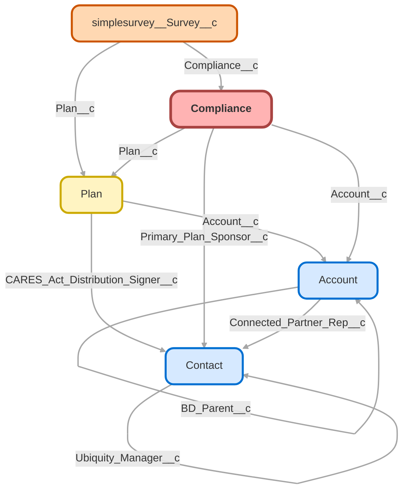

---
hide:
  - path
---

<!-- This file is auto-generated. if you do not want it to be overwritten, set TRUE in the line below -->
<!-- DO_NOT_OVERWRITE_DOC=FALSE -->

## Schema

<!-- Object description -->

## Fields

| Name      | Label | Type | Description |
| :-------- | :---- | :--: | :---------- | 
| Account__c | Account | Lookup | Account Compliance Documents are associated with |
| Acquisition_Merger_Survey_Link__c | Acquisition Merger Survey Link | LongTextArea | Link for mail merge to create unique Acquisition/Merger survey to go out with Census Verification emails |
| Administrative_service_providers_8f__c | Administrative Service Providers (8f) | Number | Administrative services providers (salaries, fees, commissions) |
| ADP_ACP_Testing_for_Non_HCE_15c__c | ADP/ACP Testing for Non HCE (15c) | Picklist | If the ADP/ACP test is used, did the 401(k) plan perform ADP/ACP testing for the plan year using the "current year testing method" for nonhighly compensated employees (Treas. Reg sections 1.401(k)-2(a)(2)(ii) and 1.401(m)- 2(a)(2)(ii))? |
| Advisor_Email__c | Advisor Email | Email | Callie requested new field to track advisor emails for failed adp/acp testing notices |
| Advisor_Email_2__c | Advisor Email 2 | Email | undefined |
| Advisor_Email_3__c | Advisor Email 3 | Email | undefined |
| Advisor_Email_4__c | Advisor Email 4 | Email | undefined |
| Advisor_Email_5__c | Advisor Email 5 | Email | undefined |
| Advisor_Email_6__c | Advisor Email 6 | Email | undefined |
| Advisor_Email_7__c | Advisor Email 7 | Email | undefined |
| Advisor_Email_8__c | Advisor Email 8 | Email | undefined |
| Amended_Return_Date__c | Amended Return Date | Date | Used for auto-email send |
| AmendedInd__c | AmendedInd | Checkbox | Amended filing |
| Amount_of_Loans_at_Year_End_10g_part_2__c | Amount of Loans at Year End (10g part 2) | Number | If the answer to 10g was 'Yes', please enter the loan amount as of year end. |
| ASC_URL_Link__c | ASC URL Link | Url | undefined |
| ASC_URL_Link_Final__c | ASC URL Link_Final | Url | ASC URL for Final Year 5500 |
| Attributable_Match__c | Attributable Match | Currency | Dollar amount of attributable match |
| Attributable_Match_Processed__c | Attributable Match Processed | Date | undefined |
| Audit_Package_Box_Link__c | Audit Package Box Link | Url | undefined |
| Audit_Package_Sent__c | Audit Package Sent | Date | undefined |
| Auditor_Email__c | Auditor Email | Email | undefined |
| Auditor_Info__c | Auditor Info | Text | undefined |
| Auto_Enrollment__c | Auto Enrollment | Picklist | Did the plan have Auto Enrollment? |
| Benefits_commissions_paid_10e__c | Benefits Commissions Paid (10e) | Picklist | Were any fees or commissions paid to any brokers, agents, or other persons by an insurance carrier, insurance service, or other organization that provides some or all of the benefits under the plan? |
| Benefits_paid__c | Benefits Paid (8d) | Number | Benefits paid (including direct rollovers and insurance premiums to provide benefits) |
| Billing_City__c | Billing City | Text | undefined |
| Billing_State__c | Billing State | Text | undefined |
| Billing_Street__c | Billing Street | Text | undefined |
| Billing_Zip_Code__c | Billing Zip Code | Text | undefined |
| Blackout_period_10h__c | Blackout period (10h) | Picklist | If this is an individual account plan, was there a blackout period? |
| Business_Code_NAICS__c | Business Code (NAICS) | Text | undefined |
| Census_Last_Received__c | Census Last Received | Date | Date Census was last received. |
| Census_Verification_Email_Reminder__c | Census Verification Email Reminder | Date | Entering a date will send the ADP/ACP Census Verification email |
| Census_Verification_Email_Sent__c | Census Verification Email Sent | Date | Date census verification instructions were sent via email |
| Client_Success_Team__c | Client Success Team | Text | undefined |
| Compliance_Notes__c | Compliance Notes | LongTextArea | undefined |
| Confirmation_ID__c | Confirmation ID | Text | undefined |
| Confirmation_ID_Final__c | Confirmation ID_Final | Text | Confirmation ID for Final Year 5500 |
| Contextual_Currency__c | Contextual Currency | Currency | For auto emails |
| Contextual_Date__c | Contextual Date | Date | For automated emails - date to be included in body of email that isn't covered by existing fields |
| Contributions_rcvd_from_employers_8a1__c | Contributions Rcvd From Employers (8a1) | Number | Contributions received or receivable from employers |
| Contributions_rcvd_from_others_8a3__c | Contributions Rcvd From Others (8a3) | Number | Contributions received or receivable from others (including rollovers) |
| Contributions_rcvd_from_ppts_8a2__c | Contributions Rcvd From Ppts (8a2) | Number | Contributions received or receivable from participants |
| Correction_Method_Selected__c | Correction Method Selected | Picklist | Method Client has selected to to fix testing results. |
| Corrective_Distribution_Match__c | Corrective Distribution_Match | Currency | undefined |
| Corrective_Distribution_Pre_Tax__c | Corrective Distribution_Pre-Tax | Currency | undefined |
| Corrective_Distribution_Roth__c | Corrective Distribution_Roth | Currency | undefined |
| Corrective_Distributions_8e__c | Corrective Distributions (8e) | Number | Certain deemed and/or corrective distributions) |
| Create_Ancillary_Billing__c | Create Ancillary Billing | Date | undefined |
| Current_Status_Timestamp__c | Current Status Timestamp | Text | undefined |
| Date_of_Last_Favorable_Det_Letter_17d__c | Date of Last Favorable Det. Letter (17d) | Date | If the plan is an individually-designed plan and received a favorable determination letter from the IRS, enter the date of the plan’s last favorable determination letter |
| Date_of_Last_Required_Amendment_17b__c | Date of Last Required Amendment (17b) | Date | Date the last plan amendment/restatement for the required tax law changes was adopted |
| DB_Plan_minimum_funding_412_or_302__c | DB Plan Minimum Funding 412 or 302 (12) | Picklist | Is this a defined contribution plan subject to the minimum funding requirements of section 412 of the Code or section 302 of ERISA? |
| DB_Plan_subject_to_minimum_funding_11a__c | DB Plan Subject to Minimum Funding (11a) | Picklist | Is this a defined benefit plan subject to minimum funding requirements? |
| DBA_Name__c | DBA Name | Text | Enter DBA name |
| Determination_Date__c | Determination Date | Date | Date of Determination |
| DFVC_Filing__c | DFVC Filing | Date | undefined |
| DOL_Filing_Status__c | DOL Filing Status | Picklist | DOL Filing Status |
| DOL_Filing_Status_Final__c | DOL Filing Status Final | Picklist | undefined |
| DOL_Status__c | DOL Status | Text | DOL Status for Prior Year 5500 |
| DOL_Status_Final__c | DOL Status _ Final | Text | DOL Filing Status for Final 5500 |
| Draft_Form_5500__c | Draft Form 5500 | Date | undefined |
| Due_Date__c | Due Date | Date | Date 5500 is due - used for merge templates |
| Due_Date_Final__c | Due Date Final | Date | Date Final 5500 is due - used for merge templates |
| Email_Date__c | Email Date | Date | For scheduled email sends |
| Email_Template__c | Email Template | Picklist | undefined |
| Employer_Identification_Number_EIN__c | EIN | Text | undefined |
| End_of_Year_Participant_Loan_Amount__c | End of Year Participant Loan Amount | Number | Enter the total of participant loans at the end of the year |
| Excludable_ACP_P_F__c | Excludable ACP P/F | Picklist | undefined |
| Excludable_ADP_P_F__c | Excludable ADP P/F | Picklist | undefined |
| Failure_to_provide_due_benefits_10f__c | Failure to Provide Due Benefits (10f) | Picklist | Has the plan failed to provide any benefit when due under the plan? |
| Fidelity_Bond_10c__c | Fidelity Bond (10c) | Checkbox | Did the plan have a fidelity bond? |
| Filing_Complete__c | Filing Complete | Date | undefined |
| Filing_Record_ID__c | Filing Record ID | Number | Filing Record ID number |
| FinalFilingInd__c | FinalFilingInd | Checkbox | Final filing; company terminated |
| First_Year_Audit__c | First Year Audit | Checkbox | undefined |
| Forfeiture_Balance__c | Forfeiture Balance | Currency | undefined |
| Form_5500EZ_Delivered__c | Form 5500EZ Delivered | Date | Date 5500EZ was delivered to client |
| Form_5558__c | Form 5558 | Picklist | undefined |
| Form_5558_Fee__c | Form 5558 Fee | Currency | undefined |
| Form_5558_Final__c | Form 5558_Final | Picklist | undefined |
| Form_Identifier__c | Form Identifier | Text | Form identifier |
| Form_Identifier_Final__c | Form Identifier_Final | Text | Form Identifier for Final 5500 |
| Form_Year__c | Form Year | Text | Merge field to confirm year the 5500 is for in email templates |
| Form_Year_Final__c | Form Year Final | Text | Merge field to confirm year the final 5500 is for in email templates |
| Fraud_or_dishonesty_loss_10d__c | Fraud or Dishonesty Loss (10d) | Picklist | Did the plan have a loss, whether or not reimbursed by the plan's fidelity bond, that was caused by fraud or dishonesty? |
| HCE_ACP_Excludable__c | HCE ACP Excludable | Percent | undefined |
| HCE_ACP_Non_Excludable__c | HCE ACP Non-Excludable | Percent | undefined |
| HCE_ADP_Excludable__c | HCE ADP Excludable | Percent | undefined |
| HCE_ADP_Non_Excludable__c | HCE ADP Non-Excludable | Percent | undefined |
| Initial_Audit_Email__c | Initial Audit Email | Date | undefined |
| Initial_Notice_Sent__c | Initial Notice Sent | Date | Date initial notification email was sent |
| InitialFilingInd__c | InitialFilingInd | Checkbox | Initial filing if it's the first plan year |
| Invitation_to_File_Sent__c | Invitation to File Sent | Date | Initial invitation to file with ASC link sent to contacts |
| Late_contributions_10a__c | Late Contributions (10a) | Picklist | Was there a failure to transmit to the plan any participant contributions within the time period described in 29 CFR 2510.3-102? |
| Late_Deferral_Amount__c | Late Deferral Amount | Number | Total amount of late deferrals for plan year |
| M_P_Letter_Date_17c__c | M&P Letter Date (17c) | Date | If the plan sponsor is an adopter of a pre-approved master and prototype (M&P) or volume submitter plan that is subject to a favorable IRS opinion or advisory letter, enter the date of that favorable letter |
| M_P_Letter_Serial_Number_17c__c | M&P Letter Serial Number (17c) | Number | If the plan sponsor is an adopter of a pre-approved master and prototype (M&P) or volume submitter plan that is subject to a favorable IRS opinion or advisory letter, enter the letter's serial number. |
| Net_Income_loss_8i__c | Net Income (Loss) (8i) | Number | Net income (loss) (subtract 8h from 8c) |
| Net_plan_assets_beginning_of_year_7c__c | Net Plan Assets Beginning of Year(7c) | Number | Net plan assets (7a - 7b) |
| Net_Plan_Assets_End_of_Year_7c__c | Net Plan Assets End of Year (7c) | Number | undefined |
| NHCE_ACP_Excludable__c | NHCE ACP Excludable | Percent | undefined |
| NHCE_ACP_Non_Excludable__c | NHCE ACP Non-Excludable | Percent | undefined |
| NHCE_ADP_Excludable__c | NHCE ADP Excludable | Percent | undefined |
| NHCE_ADP_Non_Excludable__c | NHCE ADP Non-Excludable | Percent | undefined |
| No_Active_Participants_at_End_PY_5d1__c | No. Active Participants at End PY (5d1) | Number | Total number of active participants at the beginning of the plan year |
| Non_Excludable_ACP_P_F__c | Non-Excludable ACP P/F | Picklist | undefined |
| Non_Excludable_ADP_P_F__c | Non-Excludable ADP P/F | Picklist | undefined |
| Nonexempt_transactions_10b__c | Nonexempt transactions (10b) | Picklist | Were there any nonexempt transactions with any party-in-interest (do not include transactions from 10a) |
| Original_Plan_Effective_Date__c | Original Plan Effective Date | Date | undefined |
| Other_expenses_8g__c | Other expenses (8g) | Number | Other expenses |
| Other_income_loss_8b__c | Other income (loss) (8b) | Number | Other income (loss) |
| PartcpAccountBalCnt__c | PartcpAccountBalCnt | Number | Number of participants with an account balance on 12/31 |
| Participant_loans_10g__c | Participant loans (10g) | Picklist | Did the plan have any participant loans? (If yes, enter amount as of year end) |
| Participants_at_Start_of_Year__c | Participants at Start of Year | Number | Total number of participants at the beginning of the plan year |
| PBGC__c | Assets Distributed or Transferred (13b) | Picklist | Were all the plan assets distributed to participants or beneficiaries, transferred to another plan, or brought under the control of the PBGC? |
| Pl__c | Plan in U.S. Territory (18) | Picklist | Is the Plan maintained in a U.S. territory (i.e., Puerto Rico (if no election under ERISA section 1022(i)(2) has been made), American Samoa, Guam, the Commonwealth of the Northern Mariana Islands or the U.S. Virgin Islands)?. |
| Plan__c | Plan | Lookup | Plan Document is associated with |
| Plan_Amendment_Code_17b__c | Plan Amendment Code (17b) | Number | Enter the applicable code for last plan amendment/restatement for the required tax law changes |
| Plan_assets__c | Plan assets invested (6a) | Picklist | All plan assets during the plan year were invested in eligible assets |
| Plan_Characteristics__c | Plan Characteristics (9a) | Picklist | If Custom(K) is true: 2E   2F   2G   2J   2K   2T   3D If Custom(K) is true AND New Comp is true: 2A   2E   2F   2G   2J   2K   2T   3D  If Custom(K) is true AND PCRAs are true: 2E   2F   2G   2J   2K   2R   2T   3D If Custom(K) is true AND New Comp is true AND PCRAs are true: 2A   2E   2F   2G   2J   2K   2R   2T   3D If Express(K) is true: 2E   2F   2G   2J   2T   3D |
| Plan_Effective_Date__c | Plan Effective Date | Date | undefined |
| Plan_Fidelity_Bond_Amount__c | Plan Fidelity Bond Amount | Number | If the plan has a Fidelity Bond, enter amount. |
| Plan_Id_18_Char__c | Plan Id (18 Char) | Text | undefined |
| Plan_Number__c | Plan Number | Text | undefined |
| Plan_Sponsor_Phone_Number__c | Plan Sponsor Phone Number | Text | undefined |
| Plan_termination_resolution_13a__c | Plan termination resolution (13a) | Picklist | Has a resolution to terminate the plan been adopted in any plan year? |
| Plan_Year_End__c | Plan Year End | Date | Date of Plan Year End for Prior Year 5500 |
| Plan_Year_End_Final__c | Plan Year End - Final | Date | Plan Year End for Final 5500 |
| Primary_Plan_Sponsor__c | Primary Plan Sponsor | Lookup | Who is the primary Plan sponsor on the plan? |
| Primary_Plan_Sponsor_Email__c | Primary Plan Sponsor Email | Email | undefined |
| QNEC_Contributions__c | QNEC Contributions | Currency | undefined |
| QNEC_Funded_Date__c | QNEC Funded Date | Date | Date QNEC is Funded |
| Refund_Calc_Box_Link__c | Refund Calc Box Link | Url | Link to refund calculation in Box.com |
| Refunds_Processed__c | Refunds Processed | Date | undefined |
| ResTermPlanAdptAmt__c | ResTermPlanAdptAmt | Checkbox | If the plan had a resolution to terminate, did any amount go back to the employer? |
| Restructure_Method__c | Restructure Method | Picklist | undefined |
| Safe_Harbor__c | Safe Harbor | Picklist | undefined |
| Safe_Harbor_Formula__c | Safe Harbor Formula | Picklist | Safe Harbor formula for plan year |
| SAR_1_Date__c | SAR #1 Date | Date | Date Summary Annual Report Email 1 was sent |
| SAR_2_Date__c | SAR #2 Date | Date | Date Summary Annual Report Email 2 was sent |
| Saver_Addresses__c | Saver Addresses | LongTextArea | undefined |
| SepPartcpPardIVVstdCnt__c | SepPartcpPardIVVstdCnt | Number | Separated participants not 100% vested |
| ShortPlanYrInd__c | ShortPlanYrInd | Checkbox | Check if plan is on a short plan year |
| Sponsor__c | Sponsor | Text | Name of Sponsor of the Plan |
| Sponsor_Email_2__c | Sponsor Email 2 | Email | undefined |
| Sponsor_Email_3__c | Sponsor Email 3 | Email | undefined |
| Sponsor_Email_4__c | Sponsor Email 4 | Email | undefined |
| Sponsor_Email_5__c | Sponsor Email 5 | Email | undefined |
| Sponsor_Email_6__c | Sponsor Email 6 | Email | undefined |
| Sponsor_Email_7__c | Sponsor Email 7 | Email | undefined |
| Status__c | Status | Picklist | undefined |
| Status_Final__c | Status_Final | Picklist | Final Year 5500 Status |
| Submission_Type__c | Submission Type | Picklist | How was the census submitted? |
| Tax_Law_Amends_17a__c | Tax Law Amends (17a) | Picklist | Has the plan been timely amended for all required tax law changes?. |
| Test_Method_for_410b_16a__c | Test Method for 410b (16a) | Picklist | Select choice to indicate the method used by the plan to satisfy the coverage requirements under section 410(b) |
| Testing_Method__c | Testing Method | Picklist | undefined |
| Testing_Year__c | Year | Text | Year which plan document is for (i.e. 2015) |
| This_return_report_is_for__c | This return/report is for: | Picklist | This return/report is for single employer, multiple employer, one participant, or foreign plans |
| Top_Heavy_Ratio__c | Top Heavy Ratio | Number | undefined |
| Top_Heavy_Resend__c | Top Heavy Resend | Date | undefined |
| Top_Heavy_Result__c | Top Heavy Result | Picklist | Used to merge into Testing Results email |
| Top_Paid_Group__c | Top Paid Group | Picklist | undefined |
| TotActRtdSepBenefCnt__c | TotActRtdSepBenefCnt | Number | Total number of eligible participants at beginning of year. |
| Total_expenses_8h__c | Total expenses (8h) | Number | Total expenses (add 8d, 8e, 8f, 8g) |
| Total_income_8c__c | Total income (8c) | Number | Total income (add lines 8a(1), 8a(2), 8a(3), and 8b) |
| Total_Plan_Assets_Beginning_of_Year_7a__c | Total Plan Assets Beginning of Year (7a) | Number | Total plan assets at the beginning of the Year |
| Total_Plan_Assets_End_of_Year_7a__c | Total Plan Assets End of Year (7a) | Number | Total Plan Assets at the End of the Year |
| Total_Plan_Liabilities_Beg_of_Year_7b__c | Total Plan Liabilities Beg. of Year (7b) | Number | Total plan liabilities at the Beginning of Year |
| Total_Plan_Liabilities_End_of_Year_7b__c | Total Plan Liabilities End of Year (7b) | Number | Total Plan Liabilities at the end of year |
| TotalActPartcpBOYCnt__c | TotalActPartcpBOYCnt | Number | Total number of active eligible participants in the beginning of the year |
| TotPartcpBoyCnt__c | TotPartcpBoyCnt | Number | Total number of eligible participants at the beginning of the year. |
| Trustee__c | Trustee | Email | undefined |
| Trustee_Email_1__c | Trustee Email 1 | Email | undefined |
| Trustee_Email_2__c | Trustee Email 2 | Email | undefined |
| Trustee2__c | Trustee2 | Email | undefined |
| Type__c | Form Type | Picklist | undefined |
| Valid__c | Valid | Picklist | Has the 5500 been validated? |
| Valid_Final__c | Valid_Final | Picklist | Has Final Year 5500 been validated? |
| X15a_Is_the_Plan_401_k__c | Is the Plan 401(k) (15a) | Checkbox | Is the plan a 401(k) plan? |
| X15b__c | Nondescrimination Requirements (15b) | Picklist | If “Yes,” how does the 401(k) plan satisfy the nondiscrimination requirements for employee deferrals and employer matching contributions (as applicable) under sections 401(k)(3) and 401(m)(2)?. |
| X1st_Reminder_Sent__c | 1st Reminder Sent | Date | Date first reminder email was sent |
| X29_CFR_2520_104_46_Waiver__c | 29 CFR 2520.104-46 Waiver (6b) | Picklist | Claiming a waiver of the annual examination and report of an independent qualified public accountant (IQPA) under 29 CFR 2520.104-46 |
| X2nd_Reminder_Sent__c | 2nd Reminder Sent | Date | undefined |
| X3rd_Reminder_Sent__c | 3rd Reminder Sent | Date | Date third reminder is sent |
| X4th_Reminder_Sent__c | 4th Reminder Sent | Date | undefined |
| X5500_Plan_Name__c | 5500 Plan Name | Text | 5500 Plan Name (example: Decimal, Inc Retirement Trust) |
| X5500_Reporting_Method__c | 5500 Reporting Method | Picklist | undefined |
| X5500_Situation__c | 5500 Situation | Picklist | Verifies if Compliance object has Prior Year 5500, Final 5500 or Both |
| X5th_Reminder_Sent__c | 5th Reminder Sent | Date | undefined |
| X6th_Reminder_Sent__c | 6th Reminder Sent | Date | undefined |
| X7th_Reminder_Sent__c | 7th Reminder Sent | Date | undefined |
| X8th_Reminder_Sent__c | 8th Reminder Sent | Date | undefined |
| xPlan_Effective_Date__c | Plan Effective Date | Date | undefined |

## Validation Rules

| Rule      | Active | Description | Formula |
| :-------- | :---- | :---------- | :------ |
| x5500_Basic_Fields | Yes | Required fields when creating any 5500 | RecordTypeId = '01237000000N0lp' && ( ISBLANK( Testing_Year__c )  ISPICKVAL( Type__c , "")  ISBLANK(  Primary_Plan_Sponsor_Email__c  ) ) |
| x5500_Data_Not_Matching | Yes | Identifies situations where "5500 Situation" doesn't match data entered in Prior Year & Final 5500 Sections 1 of 2 | RecordTypeId = '01237000000N0lp' && ISPICKVAL(X5500_Situation__c, 'Prior Year Only') && ( NOT(ISBLANK( Plan_Year_End_Final__c ))  NOT(ISBLANK( Form_Year_Final__c ))  NOT(ISBLANK( ASC_URL_Link_Final__c ))  NOT(ISBLANK( Due_Date_Final__c )) ) |
| x5500_Data_Not_Matching2 | Yes | Identifies situations where "5500 Situation" doesn't match data entered in Prior Year & Final 5500 Sections 2 of 2 | RecordTypeId = '01237000000N0lp' && ISPICKVAL(X5500_Situation__c, 'Final 5500 Only') && ( NOT(ISBLANK( Plan_Year_End__c ))  NOT(ISBLANK( Form_Year__c ))  NOT(ISBLANK( ASC_URL_Link__c ))  NOT(ISBLANK( Due_Date__c )) ) |
| x5500_Final_ASC_link | Yes | Require ASC link when Notification Date is entered | RecordTypeId = '01237000000N0lp' &&  ISPICKVAL(X5500_Situation__c, 'Final 5500 Only') &&  NOT(ISBLANK( Invitation_to_File_Sent__c )) &&  ISBLANK( ASC_URL_Link_Final__c ) |
| x5500_Final_Reqd_Fields_Creation | Yes | Required fields when creating Final 5500 | RecordTypeId = '01237000000N0lp' &&  ISPICKVAL(X5500_Situation__c, 'Final 5500 Only') && ( ISBLANK( Plan_Year_End_Final__c )  ISBLANK( Form_Year_Final__c )  ISBLANK( Due_Date_Final__c ) ) |
| x5500_Prior_ASC_link | Yes | Require ASC link when Notification Date is entered | RecordTypeId = '01237000000N0lp' &&  ISPICKVAL(X5500_Situation__c, 'Prior Year Only') &&  NOT(ISBLANK( Invitation_to_File_Sent__c )) &&  ISBLANK( ASC_URL_Link__c ) |
| x5500_Prior_Final_ASC_link | Yes | Require ASC link when Notification Date is entered | RecordTypeId = '01237000000N0lp' &&  ISPICKVAL(X5500_Situation__c, 'Prior + Final 5500') && NOT(ISBLANK( Invitation_to_File_Sent__c )) && ( ISBLANK( ASC_URL_Link_Final__c )  ISBLANK( ASC_URL_Link_Final__c ) ) |
| x5500_Prior_Final_Reqd_Fields_Creation | Yes | Required fields when creating Prior+Final 5500 | RecordTypeId = '01237000000N0lp' &&  ISPICKVAL(X5500_Situation__c, 'Prior + Final 5500') && ( ISBLANK( Plan_Year_End__c )  ISBLANK( Plan_Year_End_Final__c )  ISBLANK( Form_Year__c )  ISBLANK( Form_Year_Final__c )  ISBLANK( Due_Date__c )  ISBLANK( Due_Date_Final__c )  ISBLANK( Testing_Year__c )  ISPICKVAL( Type__c , "")  ISBLANK(  Primary_Plan_Sponsor_Email__c  ) ) |
| x5500_Prior_Reqd_Fields_Creation | Yes | Required fields when creating Prior 5500 | RecordTypeId = '01237000000N0lp' &&  ISPICKVAL(X5500_Situation__c, 'Prior Year Only') && ( ISBLANK( Plan_Year_End__c )  ISBLANK( Form_Year__c )  ISBLANK( Due_Date__c ) ) |

## Related Flows

| Object | Name      | Type | Description |
| :----  | :-------- | :--: | :---------- | 
| Compliance__c | [Compliance_ADP_ACP_Testing_Alerts](../flows/Compliance_ADP_ACP_Testing_Alerts.md) [🕒](../flows/Compliance_ADP_ACP_Testing_Alerts-history.md) |  Workflow | Triggers ADP & ACP Email Results and Census Verification Emails |
| Compliance__c | [Compliance_ADP_ACP_Testing_Alerts_1](../flows/Compliance_ADP_ACP_Testing_Alerts_1.md) [🕒](../flows/Compliance_ADP_ACP_Testing_Alerts_1-history.md) |  Record After Save | Moved PB to flow changes are a basic entry condition, and logging email using template body w/ backup (lower maintenance)  Migrated from the Compliance  ADP ACP Testing Alerts process using multiple criteria. Triggers ADP & ACP Email Results and Census Verification Emails |
| Compliance__c | [Compliance_After_Trigger_Create_Refund_Case_for_Distro_and](../flows/Compliance_After_Trigger_Create_Refund_Case_for_Distro_and.md) [🕒](../flows/Compliance_After_Trigger_Create_Refund_Case_for_Distro_and-history.md) |  Record After Save | If Correction Method Chosen = "Refund", create case for Distributions, and if there is a dollar value greater than $0 in Attributable Match also create a case for Ops. |
| Compliance__c | [Compliance_After_Trigger_Send_5500_Audit_Emails](../flows/Compliance_After_Trigger_Send_5500_Audit_Emails.md) [🕒](../flows/Compliance_After_Trigger_Send_5500_Audit_Emails-history.md) |  Record After Save | <!-- --> |
| Compliance__c | [Compliance_Company_Name_Map_1](../flows/Compliance_Company_Name_Map_1.md) [🕒](../flows/Compliance_Company_Name_Map_1-history.md) |  Record After Save | Migrated from the Compliance  Company Name Map process using Compliance Record is Updated criteria. Maps Account, Year & Form Type to Standardize Naming Convention |
| Compliance__c | [Compliance_Filing_Date_1](../flows/Compliance_Filing_Date_1.md) [🕒](../flows/Compliance_Filing_Date_1-history.md) |  Record After Save | Migrated from the Compliance  Filing Date process using Confirm ID criteria. Updates Filing Complete Date when Confirmation is entered |
| Compliance__c | [Compliance_Form_5500_Alerts](../flows/Compliance_Form_5500_Alerts.md) [🕒](../flows/Compliance_Form_5500_Alerts-history.md) |  Workflow | Process running Form 5500 notification emails |
| Compliance__c | [Compliance_Form_5500_Alerts_1](../flows/Compliance_Form_5500_Alerts_1.md) [🕒](../flows/Compliance_Form_5500_Alerts_1-history.md) |  Record After Save | Updated for new email templates being used for prior 5500 alerts Process running Form 5500 notification emails |
| Compliance__c | [Compliance_Scheduled_Top_Heavy_Emails](../flows/Compliance_Scheduled_Top_Heavy_Emails.md) [🕒](../flows/Compliance_Scheduled_Top_Heavy_Emails-history.md) |  Scheduled | Updating Sender Email Address from donotrespond --> dontrespond - MC 04.04.25 For scheduled sends to support compliance - updated to add proper one time send support |

## Related Lightning Pages

| Lightning Page | Type |
| :----      | :--: | 
| [Compliance_Record_Page](../pages/Compliance_Record_Page.md) |  Record Page |
| [New_Compliance_Homepage](../pages/New_Compliance_Homepage.md) |  Home Page |

## Related Profiles

| Profile | User License |
| :----      | :--: | 
| [Admin](../profiles/Admin.md) |  Salesforce |
| [Analytics Cloud Integration User](../profiles/Analytics%20Cloud%20Integration%20User.md) |  Analytics  Cloud  Integration  User |
| [Analytics Cloud Security User](../profiles/Analytics%20Cloud%20Security%20User.md) |  Analytics  Cloud  Integration  User |
| [Anypoint Integration](../profiles/Anypoint%20Integration.md) |  Identity |
| [B2BMA Integration User](../profiles/B2BMA%20Integration%20User.md) |  B2 B M A  Integration  User |
| [Billing User](../profiles/Billing%20User.md) |  Salesforce |
| [Bot Profile](../profiles/Bot%20Profile.md) |  Salesforce |
| [Business Development](../profiles/Business%20Development.md) |  Salesforce |
| [Call Center](../profiles/Call%20Center.md) |  Salesforce |
| [Chatter External User](../profiles/Chatter%20External%20User.md) |  Chatter  External |
| [Chatter Free User](../profiles/Chatter%20Free%20User.md) |  Chatter  Free |
| [Chatter Moderator User](../profiles/Chatter%20Moderator%20User.md) |  Chatter  Free |
| [Client Onboarding - Admin](../profiles/Client%20Onboarding%20-%20Admin.md) |  Salesforce |
| [Client Onboarding - RM](../profiles/Client%20Onboarding%20-%20RM.md) |  Salesforce |
| [Client Servicing Team](../profiles/Client%20Servicing%20Team.md) |  Salesforce |
| [Compliance Manager](../profiles/Compliance%20Manager.md) |  Salesforce |
| [ContractManager](../profiles/ContractManager.md) |  Salesforce |
| [Director of Operations](../profiles/Director%20of%20Operations.md) |  Salesforce |
| [Director of Sales](../profiles/Director%20of%20Sales.md) |  Salesforce |
| [Distributions](../profiles/Distributions.md) |  Salesforce |
| [Einstein Agent User](../profiles/Einstein%20Agent%20User.md) |  Einstein  Agent |
| [ESW_Agentforce_MIAW_1748035300267 Profile](../profiles/ESW_Agentforce_MIAW_1748035300267%20Profile.md) |  Guest  User  License |
| [ESW_Agentforce_MIAW_1748385215843 Profile](../profiles/ESW_Agentforce_MIAW_1748385215843%20Profile.md) |  Guest  User  License |
| [ESW_CE_Chat_1692890394498 Profile](../profiles/ESW_CE_Chat_1692890394498%20Profile.md) |  Guest  User  License |
| [ESW_CE_Chat_Moe_1693182845676 Profile](../profiles/ESW_CE_Chat_Moe_1693182845676%20Profile.md) |  Guest  User  License |
| [ESW_Login_Help_1697133738638 Profile](../profiles/ESW_Login_Help_1697133738638%20Profile.md) |  Guest  User  License |
| [ESW_Login_Help_Simply_1700075140889 Profile](../profiles/ESW_Login_Help_Simply_1700075140889%20Profile.md) |  Guest  User  License |
| [ESW_Omni_Messaging_1694183770479 Profile](../profiles/ESW_Omni_Messaging_1694183770479%20Profile.md) |  Guest  User  License |
| [ESW_Omni_Messaging_CO_1696448547822 Profile](../profiles/ESW_Omni_Messaging_CO_1696448547822%20Profile.md) |  Guest  User  License |
| [ESW_Omni_Messaging_Sallus_1700075448386 Profile](../profiles/ESW_Omni_Messaging_Sallus_1700075448386%20Profile.md) |  Guest  User  License |
| [ESW_Omni_Messaging_Simply_1700076370188 Profile](../profiles/ESW_Omni_Messaging_Simply_1700076370188%20Profile.md) |  Guest  User  License |
| [ESW_QA_Login_1699666348585 Profile](../profiles/ESW_QA_Login_1699666348585%20Profile.md) |  Guest  User  License |
| [ESW_QA_Messaging_1699974036493 Profile](../profiles/ESW_QA_Messaging_1699974036493%20Profile.md) |  Guest  User  License |
| [ESW_Sales_Chat_1697460991337 Profile](../profiles/ESW_Sales_Chat_1697460991337%20Profile.md) |  Guest  User  License |
| [ESW_Sallus_Login_Chat_1700072925200 Profile](../profiles/ESW_Sallus_Login_Chat_1700072925200%20Profile.md) |  Guest  User  License |
| [External Apps Login User](../profiles/External%20Apps%20Login%20User.md) |  External  Apps  Login |
| [Finance Manager Lightning](../profiles/Finance%20Manager%20Lightning.md) |  Salesforce |
| [Guest License User](../profiles/Guest%20License%20User.md) |  Guest  User  License |
| [Help Center Profile](../profiles/Help%20Center%20Profile.md) |  Guest  User  License |
| [Identity User](../profiles/Identity%20User.md) |  Identity |
| [Incoming_SMS Profile](../profiles/Incoming_SMS%20Profile.md) |  Guest  User  License |
| [IT](../profiles/IT.md) |  Salesforce |
| [Leadership Lightning](../profiles/Leadership%20Lightning.md) |  Salesforce |
| [Leadership](../profiles/Leadership.md) |  Salesforce |
| [Learning %26 Development](../profiles/Learning%20%2526%20Development.md) |  Salesforce |
| [Lightning Client Onboarding](../profiles/Lightning%20Client%20Onboarding.md) |  Salesforce |
| [Lightning Compliance](../profiles/Lightning%20Compliance.md) |  Salesforce |
| [Lightning Saver User](../profiles/Lightning%20Saver%20User.md) |  Salesforce |
| [Lightning Service Manager](../profiles/Lightning%20Service%20Manager.md) |  Salesforce |
| [Lightning Service User](../profiles/Lightning%20Service%20User.md) |  Salesforce |
| [Marketing Team](../profiles/Marketing%20Team.md) |  Salesforce |
| [MarketingProfile](../profiles/MarketingProfile.md) |  Salesforce |
| [Master Administrator](../profiles/Master%20Administrator.md) |  Salesforce |
| [Minimum Access - API Only Integrations](../profiles/Minimum%20Access%20-%20API%20Only%20Integrations.md) |  Salesforce  Integration |
| [Minimum Access - Salesforce](../profiles/Minimum%20Access%20-%20Salesforce.md) |  Salesforce |
| [myubiquity Profile](../profiles/myubiquity%20Profile.md) |  Guest  User  License |
| [Operations VP](../profiles/Operations%20VP.md) |  Salesforce |
| [Operations](../profiles/Operations.md) |  Salesforce |
| [Paradigm Help Center Profile](../profiles/Paradigm%20Help%20Center%20Profile.md) |  Guest  User  License |
| [Payroll Koncierge](../profiles/Payroll%20Koncierge.md) |  Salesforce |
| [Payroll Team](../profiles/Payroll%20Team.md) |  Salesforce |
| [People %26 Culture](../profiles/People%20%2526%20Culture.md) |  Salesforce |
| [Pre-chat Site Profile](../profiles/Pre-chat%20Site%20Profile.md) |  Guest  User  License |
| [Product Innovation Leadership](../profiles/Product%20Innovation%20Leadership.md) |  Salesforce |
| [Product Innovation User](../profiles/Product%20Innovation%20User.md) |  Salesforce |
| [PSM Team](../profiles/PSM%20Team.md) |  Salesforce |
| [R%26W](../profiles/R%2526W.md) |  Salesforce |
| [Read Only](../profiles/Read%20Only.md) |  Salesforce |
| [Sales Administrator](../profiles/Sales%20Administrator.md) |  Salesforce |
| [Sales Coordinator](../profiles/Sales%20Coordinator.md) |  Salesforce |
| [Sales Insights Integration User](../profiles/Sales%20Insights%20Integration%20User.md) |  Sales  Insights  Integration  User |
| [Sales Team - Limited](../profiles/Sales%20Team%20-%20Limited.md) |  Salesforce |
| [Sales Team](../profiles/Sales%20Team.md) |  Salesforce |
| [Salesforce API Only System Integrations](../profiles/Salesforce%20API%20Only%20System%20Integrations.md) |  Salesforce  Integration |
| [SalesforceIQ Integration User](../profiles/SalesforceIQ%20Integration%20User.md) |  Salesforce I Q  Integration  User |
| [Saver Manager](../profiles/Saver%20Manager.md) |  Salesforce |
| [Simple Survey Profile](../profiles/Simple%20Survey%20Profile.md) |  Guest  User  License |
| [Simply Help Center Profile](../profiles/Simply%20Help%20Center%20Profile.md) |  Guest  User  License |
| [SolutionManager](../profiles/SolutionManager.md) |  Salesforce |
| [Standard](../profiles/Standard.md) |  Salesforce |
| [StandardAul](../profiles/StandardAul.md) |  Salesforce  Platform |
| [Super System Administrator](../profiles/Super%20System%20Administrator.md) |  Salesforce |
| [Sys Dev Admin](../profiles/Sys%20Dev%20Admin.md) |  Salesforce |
| [Transitions Team](../profiles/Transitions%20Team.md) |  Salesforce |
| [Ubiquity Help Center Profile](../profiles/Ubiquity%20Help%20Center%20Profile.md) |  Guest  User  License |
| [Zoom Webhooks Profile](../profiles/Zoom%20Webhooks%20Profile.md) |  Guest  User  License |

## Related Permission Sets

| Permission Set | User License |
| :----      | :--: | 
| [Attachments_and_Notes_Migrator](../permissionsets/Attachments_and_Notes_Migrator.md) | None |
| [Compliance_Edit](../permissionsets/Compliance_Edit.md) | None |
| [Data_Loader](../permissionsets/Data_Loader.md) | None |
| [Developer](../permissionsets/Developer.md) | None |
| [MagicMover](../permissionsets/MagicMover.md) | None |
| [Manager](../permissionsets/Manager.md) | None |
| [Master](../permissionsets/Master.md) | None |
| [Modify_All](../permissionsets/Modify_All.md) | None |
| [sfdcInternalInt__sfdc_a360_sfcrm_data_extract](../permissionsets/sfdcInternalInt__sfdc_a360_sfcrm_data_extract.md) | None |
| [sfdcInternalInt__sfdc_articlerecommendations](../permissionsets/sfdcInternalInt__sfdc_articlerecommendations.md) | None |
| [sfdcInternalInt__sfdc_einsteinagent](../permissionsets/sfdcInternalInt__sfdc_einsteinagent.md) | None |
| [sfdcInternalInt__sfdc_replyrecommendations](../permissionsets/sfdcInternalInt__sfdc_replyrecommendations.md) | None |
| [sfdcInternalInt__sfdc_slack](../permissionsets/sfdcInternalInt__sfdc_slack.md) | None |
| [View_All](../permissionsets/View_All.md) | None |

_Documentation generated with [sfdx-hardis](https://sfdx-hardis.cloudity.com), by [Cloudity](https://www.cloudity.com/) & [friends](https://github.com/hardisgroupcom/sfdx-hardis/graphs/contributors)_
