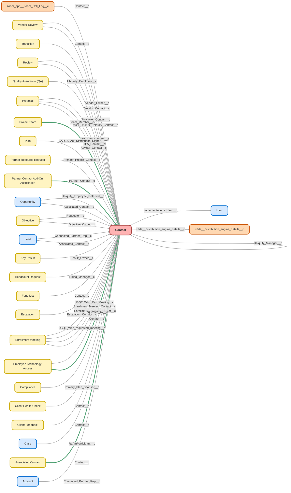

---
hide:
  - path
---

<!-- This file is auto-generated. if you do not want it to be overwritten, set TRUE in the line below -->
<!-- DO_NOT_OVERWRITE_DOC=FALSE -->

## Schema

<!-- Object description -->

## Fields

| Name      | Label | Type | Description |
| :-------- | :---- | :--: | :---------- | 
| Account_Name__c | Account Name | Text | undefined |
| AccountId |  | Lookup | undefined |
| ActionCadenceAssigneeId |  | Lookup | undefined |
| ActionCadenceId |  | Lookup | undefined |
| ActionCadenceState |  |  | undefined |
| ActiveTrackerCount |  |  | undefined |
| Add_to_f9list_id__c | Add to f9list id | Text | Used to sync contacts to Five9 |
| Advisor_Annual_Recurring_Revenue__c | Advisor - Annual Recurring Revenue | Currency | Declarative rollup from associated contacts where role = "Financial Advisor" |
| Advisor_Broker_Dealer__c | Advisor Broker Dealer | Text | undefined |
| Advisor_Email__c | Advisor Email | Text | undefined |
| Advisor_Interest__c | Advisor Interest | Picklist | undefined |
| Advisor_Name__c | Advisor Name | Text | undefined |
| Advisor_Onboarding_Call__c | Advisor Onboarding Call | DateTime | undefined |
| Advisor_Onboarding_Status__c | Advisor Onboarding Status | Picklist | undefined |
| Advisor_Phone__c | Advisor Phone | Phone | undefined |
| Advisor_State__c | Advisor State | Picklist | undefined |
| Advisory_Firm__c | Advisory Firm | Text | undefined |
| affectlayer__AffectLayer_Notes__c | AffectLayer | Text | undefined |
| affectlayer__IsCreatedByChorusZI__c | Created by ChorusZI | Checkbox | This field indicates whether the contact was created by Chorus or Zoominfo. |
| All_Traffic_Sources__c | All Traffic Sources | LongTextArea | undefined |
| Assigned_User__c | Assigned User | Text | undefined |
| AssistantName |  |  | undefined |
| AssistantPhone |  |  | undefined |
| Associated_Active_Plans__c | Advisor - Active Plans | Number | Calculated using declarative rollup summary.  Count of associated contacts on plans where status != inactive and role = financial advisor |
| Birthdate |  |  | undefined |
| Brand__c | Brand | Picklist | undefined |
| Business_Unit__c | Business Unit | Picklist | undefined |
| BuyerAttributes |  | Picklist | undefined |
| Called_Sales_For_Safe_Harbor__c | Called Sales For Safe Harbor? | Picklist | undefined |
| Campaign_code__c | Campaign code | Text | Carried over from converted lead's campaign |
| CloudingoAgent__CES__c | Contact Email Status | Number | undefined |
| CloudingoAgent__MAR__c | Mailing Address Record Type | Text | undefined |
| CloudingoAgent__MAS__c | Mailing Address Status | Number | undefined |
| CloudingoAgent__MAV__c | Mailing Address Vacancy | Text | undefined |
| CloudingoAgent__MRDI__c | Mailing Residential Delivery Indicator | Text | undefined |
| CloudingoAgent__MTZ__c | Mailing Timezone | Text | undefined |
| CloudingoAgent__OAR__c | Other Address Record Type | Text | undefined |
| CloudingoAgent__OAS__c | Other Address Status | Number | undefined |
| CloudingoAgent__OAV__c | Other Address Vacancy | Text | undefined |
| CloudingoAgent__ORDI__c | Other Residential Delivery Indicator | Text | undefined |
| CloudingoAgent__OTZ__c | Other Timezone | Text | undefined |
| Company_Size__c | Company Size | Number | undefined |
| Conference_name__c | Conference name | Picklist | undefined |
| Connected_Partner__c | Connected Partner | Text | References connected partner from account |
| Contact_ID_18_Char__c | Contact ID (18 Char) | Text | undefined |
| Contacts__c | Contacts | Number | undefined |
| ContactSource |  |  | undefined |
| CRD_Number__c | CRD Number | Text | Central Registration Depository Number for advisor. |
| Credentialed_Advisor__c | Credentialed Advisor | Checkbox | undefined |
| Current_Active_Clients__c | Current Active Clients | LongTextArea | undefined |
| Current_Client__c | Current Client | Text | undefined |
| delete_from_f9list_id__c | delete_from_f9list_id | Text | Used to de-sync from Five9 |
| Department |  |  | undefined |
| DepartmentGroup |  |  | undefined |
| Description |  |  | undefined |
| Device__c | Device | Text | undefined |
| Direct_Mail_Opt_Out__c | Direct Mail Opt Out | Checkbox | Check when client does not wish to receive direct mail. |
| DO_NOT_USE__c | DO NOT USE | Checkbox | undefined |
| DoNotCall |  |  | undefined |
| DOZISF__ZoomInfo_Company_ID__c | ZoomInfo Company ID | Text | undefined |
| DOZISF__ZoomInfo_Enrich_Status__c | ZoomInfo Enrich Status | Picklist | undefined |
| DOZISF__ZoomInfo_First_Updated__c | ZoomInfo First Updated | DateTime | Date and time when the record was first created or updated by ZoomInfo |
| DOZISF__ZoomInfo_Id__c | ZoomInfo Contact ID | Text | undefined |
| DOZISF__ZoomInfo_InboxAI_ID__c | ZoomInfo InboxAI ID | Text | undefined |
| DOZISF__ZoomInfo_Last_Updated__c | ZoomInfo Last Updated | DateTime | Date and time when the record was last created or updated by ZoomInfo |
| DOZISF__ZoomInfo_Non_Matched_Reason__c | ZoomInfo Non-Matched Reason | Text | undefined |
| Electronic_Statement_Notice__c | Electronic Statement Notice | Date | Date the required electronic statement delivery notification was sent |
| Email |  |  | undefined |
| Employee_Email__c | Employee Email | Text | Used for Ubiquity Employee Email Addresses only |
| Employment_Status__c | Employment Status | Picklist | Is employee active or inactive? |
| Escalated__c | Escalated | Checkbox | undefined |
| Estimated_Pay__c | Estimated Pay | Number | undefined |
| et4ae5__HasOptedOutOfMobile__c | Mobile Opt Out | Checkbox | undefined |
| et4ae5__Mobile_Country_Code__c | Mobile Country Code | Picklist | undefined |
| EvergageEngagement__c | Evergage Engagement | Percent | Engagement score based on activity |
| EvergageEngagementTrend__c | Evergage Eng. Trend | Percent | Engagement trend based on activity |
| EvergageFilters__c | Evergage Filters | LongTextArea | Evergage matching filters |
| EvergageFirstActivity__c | Evergage First Visit | DateTime | First activity with application |
| EvergageLastActivity__c | Evergage Last Visit | DateTime | Last activity with application |
| EvergageLink__c | Evergage Link | Url | Link to the Evergage page |
| External_ID__c | NetSuite Id | Text | undefined |
| Fax |  |  | undefined |
| Financial_Professional_Role__c | Financial Professional Role | Picklist | This field has a corresponding field on Proposal. This field is updated via flow to match what is on the proposal. If you add/remove a value here, do the same for the Proposal field. |
| FirstCallDateTime |  |  | undefined |
| FirstEmailDateTime |  |  | undefined |
| Full_Name__c | Full Name | Text | Full Name |
| GA_Client_ID_Formula__c | GA Client ID (Formula) | Text | undefined |
| gaconnector_Browser__c | Browser | Text | undefined |
| gaconnector_City__c | City | Text | undefined |
| gaconnector_Country__c | Country | Text | undefined |
| gaconnector_First_Click_Campaign__c | First Click Campaign | Text | undefined |
| gaconnector_First_Click_Channel__c | First Click Channel | Text | undefined |
| gaconnector_First_Click_Content__c | First Click Content | Text | undefined |
| gaconnector_First_Click_Landing_Page__c | First Click Landing Page | Text | undefined |
| gaconnector_First_Click_Medium__c | First Click Medium | Text | undefined |
| gaconnector_First_Click_Referrer__c | First Click Referrer | Text | undefined |
| gaconnector_First_Click_Source__c | First Click Source | Text | undefined |
| gaconnector_First_Click_Term__c | First Click Term | Text | undefined |
| gaconnector_GCLID__c | GCLID | Text | undefined |
| gaconnector_Google_Analytics_Client_ID__c | Google Analytics Client ID | Text | undefined |
| gaconnector_Google_Analytics_Link__c | Google Analytics Link | Text | undefined |
| gaconnector_IP_Address__c | IP Address | Text | undefined |
| gaconnector_Last_Click_Campaign__c | Last Click Campaign | Text | undefined |
| gaconnector_Last_Click_Channel__c | Last Click Channel | Text | undefined |
| gaconnector_Last_Click_Content__c | Last Click Content | Text | undefined |
| gaconnector_Last_Click_Landing_Page__c | Last Click Landing Page | Text | undefined |
| gaconnector_Last_Click_Medium__c | Last Click Medium | Text | undefined |
| gaconnector_Last_Click_Referrer__c | Last Click Referrer | Text | undefined |
| gaconnector_Last_Click_Source__c | Last Click Source | Text | undefined |
| gaconnector_Last_Click_Term__c | Last Click Term | Text | undefined |
| gaconnector_Latitude_from_IP__c | Latitude | Text | undefined |
| gaconnector_Location_approx__c | Location (approx.) | Text | undefined |
| gaconnector_Longitude__c | Longitude | Text | undefined |
| gaconnector_Number_of_Website_Visits__c | Number of Website Visits | Text | undefined |
| gaconnector_Operating_System__c | Operating System | Text | undefined |
| gaconnector_Pages_visited__c | Pages visited | LongTextArea | undefined |
| gaconnector_Time_Spent_on_Website__c | Time Spent on Website | Number | undefined |
| gaconnector_Time_Spent_on_Website_formul__c | Time Spent on Website | Text | undefined |
| gaconnector_Time_Zone__c | Time Zone | Text | undefined |
| Gender__c | Gender | Picklist | What is this contacts gender? |
| GenderIdentity |  | Picklist | undefined |
| HasOptedOutOfEmail |  |  | undefined |
| HasOptedOutOfFax |  |  | undefined |
| Hire_Date__c | Hire Date | Date | Date employee was hired |
| HomePhone |  |  | undefined |
| Imp_Stage_Changed__c | Imp Stage Changed | Date | undefined |
| Implementation_User_Name__c | Implementation User Name | Text | undefined |
| Implementations_User__c | Implementations User | Lookup | Owner of Imp for email automation |
| Import_for_Oregon_State_Mandate__c | Import for Oregon State Mandate | Checkbox | undefined |
| IndividualId |  | Lookup | undefined |
| Jigsaw |  |  | undefined |
| Kotapay_Survey_Link__c | Kotapay Survey Link | LongTextArea | undefined |
| Last_Activity_Date_Range__c | Last Activity Date Range | Text | undefined |
| Last_Asked_for_a_Review_By__c | Last Asked for a Review By | Text | Who last asked the contact to provide a review. |
| Last_Asked_for_Referral_By__c | Last Asked for Referral By | Text | Who last asked contact to provide a new plan referral? |
| Last_Asked_for_Referral_Date__c | Last Asked for Referral Date | Date | Date that contact was last asked to provide a new plan referral to Ubiquity. |
| Last_Asked_for_Review_Date__c | Last Asked for Review Date | Date | Date the contact was last asked to provide a review. |
| Last_Created_Survey_Date__c | Last Created Survey Date | Date | Last Date a Survey object was attached to the contact |
| Last_CSAT_Reply__c | Last CSAT Reply | Date | undefined |
| Last_Simply_Proposal_Run__c | Last Simply Proposal Run | Date | undefined |
| LastCURequestDate |  |  | undefined |
| LastCUUpdateDate |  |  | undefined |
| Latest_Lead_Referred_Date__c | Latest Lead Referred Date | Date | undefined |
| Lead_Nurture_Opt_Out__c | Lead Nurture Opt Out | Checkbox | If checked, contact will not be added to lead nurturing progam. |
| Lead_Origin__c | Lead Origin | Picklist | undefined |
| leadScoring__Campaign_Score__c | Campaign Score | Number | Value from the converted lead |
| leadScoring__Lead_Score__c | Lead Score | Number | Value from the converted lead |
| leadScoring__Total_Lead_Score__c | Total Lead Score | Number | Value from the converted lead |
| LeadSource |  | Picklist | undefined |
| lep360learning__creation_date__c | 360Learning creation date | Date | undefined |
| lep360learning__user_deletion_date__c | 360Learning user deletion date | Date | undefined |
| lep360learning__User_id__c | 360Learning User id | Text | undefined |
| lep360learning__X360Learning_user_deletion_date__c | deprecated | Date | undefined |
| LID__LinkedIn_Company_Id__c | LinkedIn Company Id | Text | LinkedIn Id of the company |
| LID__LinkedIn_Member_Token__c | LinkedIn Member Token | Text | LinkedIn Id of the contact |
| LinkedIn__c | LinkedIn | Url | undefined |
| MailingAddress |  |  | undefined |
| MC_Removal__c | MC Removal | Checkbox | Check box to delete contact from marketing cloud |
| MobilePhone |  |  | undefined |
| n2de__DE_Account_match_domain__c | DE Account Match Email Domain | Text | The domain extracted from the email address used by Lead-to-Account matching by domain |
| n2de__DE_Status__c | DE Classifier Status | Text | undefined |
| n2de__DE_Territory__c | DE Territory (Deprecated) | Text | Deprecated, use Distribution_engine_details__c.Territory__c instead |
| n2de__Distribution_count__c | Distribution count | Number | The number of times this record has been assigned via Distribution Engine |
| n2de__Distribution_engine_details__c | Distribution Engine details | Lookup | undefined |
| n2de__Is_distributed__c | Is distributed | Checkbox | undefined |
| n2de__Is_reassigned__c | Is reassigned | Checkbox | undefined |
| n2de__Last_distributed__c | Date last distributed to user | DateTime | undefined |
| n2de__Last_reassigned__c | Date last auto reassigned | DateTime | undefined |
| n2de__Time_to_action_mins__c | Time to action (mins) | Number | undefined |
| Name |  |  | undefined |
| Newsletter_Email_Opt_Out__c | Newsletter Email Opt Out | Checkbox | Client has opted out of quarterly client newsletter emails from Ubiquity. |
| No_Contact__c | No Contact | Checkbox | undefined |
| NPN_Number__c | National Producer Number (NPN) | Text | undefined |
| Offer_Opt_Out__c | Offer Opt Out | Checkbox | For contacts that should not receive offers but should receive Vitamin(k) |
| Operational_Email_Opt_Out__c | Operational Email Opt-Out | Checkbox | undefined |
| Opt_In__c | Opt In | Checkbox | Client has opted in to Marketing Campaigns |
| Opt_Out_Reason__c | Opt Out Reason | Text | undefined |
| OtherAddress |  |  | undefined |
| OtherPhone |  |  | undefined |
| Owner_Full_Name__c | Owner Full Name | Text | undefined |
| OwnerId |  | Lookup | undefined |
| Pardot_Sender_Calendly_Link__c | Pardot Sender Calendly Link | Text | undefined |
| Pardot_Sender_Name__c | Pardot Sender Name | Text | undefined |
| Pardot_Sender_Phone__c | Pardot Sender Phone | Text | undefined |
| Pardot_Sender_Title__c | Pardot Sender Title | Text | undefined |
| Participant_Balance__c | Participant Balance | Currency | Participant balance in Paradigm |
| Partner_Client_Status__c | Partner Client Status | Picklist | No Clients = Partner & Ubiquity have no mutual clients Active Clients = Partner & Ubiquity have mutual active client(s) Past Clients = Partner & Ubiquity have had mutual client(s) in the past |
| Partner_Status__c | Partner Status | Picklist | Prospect = Evaluating partnership with Ubiquity. Active Referrer = Leads referred in the last 12 months. Past Referrer = Has referred leads 12 months ago or more. |
| PayKon_Welcome_Survey__c | PayKon Welcome Survey | LongTextArea | Copied from Associated Contact |
| Phone |  |  | undefined |
| Plan_ID__c | Plan ID | Text | undefined |
| Plan_Status__c | Plan Status | Text | Plan Status from Account |
| Plan_Type__c | Plan Type | Picklist | undefined |
| Plan_Value__c | Plan Value | Text | undefined |
| PostCostcoOptIN__c | PostCostcoOptIN | Checkbox | Contact Record PostCostcoOpt |
| Preferred_Method_of_Communication__c | Preferred Method of Communication | Picklist | Does the contact have a preferred method of communicating with Ubiquity? |
| Primary_Plan_Sponsor__c | Primary Plan Sponsor | Checkbox | Is the Contact the Primary Plan Sponsor? |
| Promotional_Email_Opt_Out__c | Promotional Email Opt Out | Checkbox | Client has opted out of promotional emails from Ubiquity. |
| Pronouns |  | Picklist | undefined |
| QA_Eligible__c | QA Eligible | Checkbox | Is this person eligible for QA in their current role? Used for tracking QA adoption rates. |
| Reach_Out_Required__c | Reach Out Required | Checkbox | Triggered via Pardot if final reminder email is sent. Originally built for Simply Implementations Flow |
| ReportsToId |  | Lookup | undefined |
| Role__c | Contact Role | Picklist | undefined |
| Saver_ID__c | Saver ID | TextArea | Individual Paradigm ID for Saver |
| ScheduledResumeDateTime |  |  | undefined |
| Secondary_Email__c | Secondary Email | Email | If the contact has a secondary email associated with the account. |
| Secondary_Phone__c | Secondary Phone | Phone | undefined |
| Service_Option__c | Service Option | Text | undefined |
| Simple_Survey_Campaign__c | Simple Survey Campaign | Text | Flag Field to create a "View" to mass add existing contacts to Simple Survey Campaign |
| simplesurvey__Survey_Last_Requested_On__c | Survey Last Requested On | DateTime | undefined |
| Simply_Proposal_Count__c | Simply Proposal Count | Number | undefined |
| SMS_Opt_In__c | SMS Opt in | Checkbox | undefined |
| Sponsor_Trustee_ID__c | Sponsor/Trustee ID | TextArea | Paradigm Individual ID for Sponsor/Trustee |
| Stage_Flag__c | Stage Flag | Picklist | undefined |
| Subscription_Snooze__c | Subscription Snooze | Checkbox | undefined |
| Survey_Fatigue_Warning__c | Survey Fatigue Warning | Checkbox | If checked, have a look at recent surveys to determine if additional surveys are appropriate. |
| Survey_Opt_Out__c | CSAT Survey Opt Out | Checkbox | undefined |
| System_Update_Email_Opt_Out__c | System Update Email Opt Out | Checkbox | Client has opted out of system update emails from Ubiquity. |
| Team__c | Team | Picklist | Internal team name for referral tracking. |
| Temp_List__c | Temp List | Checkbox | undefined |
| Terminated_Plan_Participants__c | Terminated Plan Participants | LongTextArea | List of plan participants terminated in the last 24 hours with a balance over 5k. |
| Termination_Date__c | Termination Date | Date | Date of employee termination |
| Territory__c | Territory | Picklist | undefined |
| Text_Opt_In__c | Text Opt In | Checkbox | Check = Contact is currently opted in to text messaging |
| Text_Opt_In_Date__c | Text Opt In Date | Date | Date contact most recently opted into text messages |
| Text_Opt_In_Survey_Link__c | Text Opt In Survey Link | LongTextArea | undefined |
| Text_Opt_Out_Date__c | Text Opt Out Date | Date | Date contact most recently opted out of text messages |
| Title |  |  | undefined |
| TitleType |  |  | undefined |
| Ubiquity_Manager__c | Ubiquity Manager | Lookup | undefined |
| X1st_Plan_Sold_Date__c | 1st Plan Sold Date | Date | undefined |

## Validation Rules

| Rule      | Active | Description | Formula |
| :-------- | :---- | :---------- | :------ |
| Account_Required | Yes |  | ISNULL(AccountId) |
| LID__Check_CompanyId_Value | Yes | Throws an exception message if the company id contains non-numerics | AND( 	(LID__LinkedIn_Company_Id__c <> NULL), 	NOT(ISNUMBER(LID__LinkedIn_Company_Id__c)) ) |
| Plan_Participant_Record_Type_Check | Yes | Confirm proper record type is selected on creation of contact | NOT(ISPICKVAL( Role__c , "Saver")) &&  BEGINS(RecordTypeId , "01237000000TgxQ") &&   ISNEW() |
| Ubiquity_Contact_Record_Type_Check | Yes | Confirm proper record type is selected on creation of contact | (ISPICKVAL( Role__c , "Saver")) &&  BEGINS(RecordTypeId , "01237000000TgxL") &&   ISNEW() |

## Related Flows

| Object | Name      | Type | Description |
| :----  | :-------- | :--: | :---------- | 
| 💻 | [Account_Partner_Association_Process_Assign_Territory](../flows/Account_Partner_Association_Process_Assign_Territory.md) [🕒](../flows/Account_Partner_Association_Process_Assign_Territory-history.md) |  Auto Launched Flow | <!-- --> |
| 💻 | [Add_On_to_Plan](../flows/Add_On_to_Plan.md) [🕒](../flows/Add_On_to_Plan-history.md) |  Screen Flow | Creates an Add-On Opportunity for an existing plan and assigns to Payroll team |
| 💻 | [Assign_Imp_to_Junction](../flows/Assign_Imp_to_Junction.md) [🕒](../flows/Assign_Imp_to_Junction-history.md) |  Auto Launched Flow | Maps Implementation record to any relevant Associated Contact Junction upon creation |
| 💻 | [Assign_Imp_to_Partner](../flows/Assign_Imp_to_Partner.md) [🕒](../flows/Assign_Imp_to_Partner-history.md) |  Auto Launched Flow | Maps Implementation record to any relevant Associated Partner Junction upon creation |
| 💻 | [Assign_Plan_to_Junction](../flows/Assign_Plan_to_Junction.md) [🕒](../flows/Assign_Plan_to_Junction-history.md) |  Auto Launched Flow | Updated "is opp null" decision element for single(k) - was erroring when opp is null.  Maps Plan record to any relevant Associated Contact Junction upon creation |
| 💻 | [Assign_Plan_to_Partner](../flows/Assign_Plan_to_Partner.md) [🕒](../flows/Assign_Plan_to_Partner-history.md) |  Auto Launched Flow | Added "opp present" check to avoid error if opp is missing  Maps Plan record to any relevant Associated Junction upon creation |
| 💻 | [Assign_Transition_to_Junction](../flows/Assign_Transition_to_Junction.md) [🕒](../flows/Assign_Transition_to_Junction-history.md) |  Auto Launched Flow | Maps Transition record to any relevant Associated Contact Junction upon creation |
| 💻 | [Assign_Transition_to_Partner](../flows/Assign_Transition_to_Partner.md) [🕒](../flows/Assign_Transition_to_Partner-history.md) |  Auto Launched Flow | Maps Transition record to any relevant Associated Partner Junction upon creation |
| 💻 | [Associated_Contact_Process_Update_Pardot_Sender_Info](../flows/Associated_Contact_Process_Update_Pardot_Sender_Info.md) [🕒](../flows/Associated_Contact_Process_Update_Pardot_Sender_Info-history.md) |  Auto Launched Flow | <!-- --> |
| 💻 | [Automation_Intake_Form](../flows/Automation_Intake_Form.md) [🕒](../flows/Automation_Intake_Form-history.md) |  Screen Flow | Modified link and screen buttons |
| 💻 | [Case_Process_Agentforce_Case_Creation](../flows/Case_Process_Agentforce_Case_Creation.md) [🕒](../flows/Case_Process_Agentforce_Case_Creation-history.md) |  Auto Launched Flow | Adding additional logic for single contact found from prechat values |
| 💻 | [Clone_Parent_Details](../flows/Clone_Parent_Details.md) [🕒](../flows/Clone_Parent_Details-history.md) |  Screen Flow | Related List button that clones parent details when creating a child case |
| 💻 | [Contact_Button_Create_Lead](../flows/Contact_Button_Create_Lead.md) [🕒](../flows/Contact_Button_Create_Lead-history.md) |  Screen Flow | Defaults Referral info for Advisor Leads. Added criteria to allow sales coordinator use the button. |
| 💻 | [Contact_Process_Assign_Territory](../flows/Contact_Process_Assign_Territory.md) [🕒](../flows/Contact_Process_Assign_Territory-history.md) |  Auto Launched Flow | When Contact or Account are Updated, Evaluate Territory Assignment |
| 💻 | [Contact_Process_Send_Reach_Out_Case](../flows/Contact_Process_Send_Reach_Out_Case.md) [🕒](../flows/Contact_Process_Send_Reach_Out_Case-history.md) |  Auto Launched Flow | Sends email to Imps if contact has received final reminder email for their current stage. |
| 💻 | [Contact_Update_Credential_Status_on_Leads](../flows/Contact_Update_Credential_Status_on_Leads.md) [🕒](../flows/Contact_Update_Credential_Status_on_Leads-history.md) |  Auto Launched Flow | When Credential Status changes on Advisor Contact, update any unconverted Leads to reflect the status change. |
| 💻 | [Contact_Upsert_Assign_Territory](../flows/Contact_Upsert_Assign_Territory.md) [🕒](../flows/Contact_Upsert_Assign_Territory-history.md) |  Auto Launched Flow | <!-- --> |
| 💻 | [CreateEvent](../flows/CreateEvent.md) [🕒](../flows/CreateEvent-history.md) |  Auto Launched Flow | Updated to act as a general "catch all" for partners.  If partner utm fields are found on calendlyaction, look for partner with a code that matches utm_source.  Creates event for new "invitee.created" calendlyactions.  Connects to lead or contact if found.  If no person found, creates new lead. |
| 💻 | [Create_Follow_Up_Task_if_Opp_is_not_Closed](../flows/Create_Follow_Up_Task_if_Opp_is_not_Closed.md) [🕒](../flows/Create_Follow_Up_Task_if_Opp_is_not_Closed-history.md) |  Auto Launched Flow | Create Follow-Up Task if Opp is not Closed |
| 💻 | [Create_Junction_After_Conversion](../flows/Create_Junction_After_Conversion.md) [🕒](../flows/Create_Junction_After_Conversion-history.md) |  Auto Launched Flow | Updated to use ac and ap roles from lead on new ac and ap records (rather than defaulting to "referrer" generic values)  Creates Associated Contact Junction if needed when Lead is Converted |
| 💻 | [Create_Partner_After_Conversion](../flows/Create_Partner_After_Conversion.md) [🕒](../flows/Create_Partner_After_Conversion-history.md) |  Auto Launched Flow | Creates Associated Partner Junction if needed when Lead is Converted |
| 💻 | [Create_Upgrade_from_Plan](../flows/Create_Upgrade_from_Plan.md) [🕒](../flows/Create_Upgrade_from_Plan-history.md) |  Screen Flow | Updated to replace sales director userId fallback w/ search for user with that role, THEN svp strategy.  Finally it will just assign to running user rather than throwing an error.  Creates an Upgrade Opportunity for an existing plan, and assigns to most relevant RPC. |
| 💻 | [DocuSign_Recipient_Process_Associate_Key_Records](../flows/DocuSign_Recipient_Process_Associate_Key_Records.md) [🕒](../flows/DocuSign_Recipient_Process_Associate_Key_Records-history.md) |  Auto Launched Flow | <!-- --> |
| 💻 | [DocuSign_Related_Record_Mapping](../flows/DocuSign_Related_Record_Mapping.md) [🕒](../flows/DocuSign_Related_Record_Mapping-history.md) |  Auto Launched Flow | Links records related to the Document, based on recipient information. |
| 💻 | [Docusign_Button_Find_A4S](../flows/Docusign_Button_Find_A4S.md) [🕒](../flows/Docusign_Button_Find_A4S-history.md) |  Screen Flow | <!-- --> |
| 💻 | [Docusign_Process_Map_After_Signing](../flows/Docusign_Process_Map_After_Signing.md) [🕒](../flows/Docusign_Process_Map_After_Signing-history.md) |  Auto Launched Flow | To be used as a precautionary flow if docusign record is created after the would-be associated records. ***TEST VERSION*** |
| 💻 | [Escalation_Button_De_Escalate_Account](../flows/Escalation_Button_De_Escalate_Account.md) [🕒](../flows/Escalation_Button_De_Escalate_Account-history.md) |  Screen Flow | <!-- --> |
| 💻 | [Escalation_Button_Escalate_Account](../flows/Escalation_Button_Escalate_Account.md) [🕒](../flows/Escalation_Button_Escalate_Account-history.md) |  Screen Flow | Updated routing.  - If created by someone outside of CE, owner and manager are Meli - If created by anyone in CE besides Meli, owner is their team lead and manager is Meli |
| 💻 | [Headcount_Request_Screen_Submit_New_Request](../flows/Headcount_Request_Screen_Submit_New_Request.md) [🕒](../flows/Headcount_Request_Screen_Submit_New_Request-history.md) |  Screen Flow | <!-- --> |
| 💻 | [Implementation_ONETIME_Update_Active_Imps_List](../flows/Implementation_ONETIME_Update_Active_Imps_List.md) [🕒](../flows/Implementation_ONETIME_Update_Active_Imps_List-history.md) |  Auto Launched Flow | <!-- --> |
| 💻 | [Lead_Process_Assign_TPA_Ownership](../flows/Lead_Process_Assign_TPA_Ownership.md) [🕒](../flows/Lead_Process_Assign_TPA_Ownership-history.md) |  Auto Launched Flow | <!-- --> |
| 💻 | [Map_Advisor_Based_on_NPN](../flows/Map_Advisor_Based_on_NPN.md) [🕒](../flows/Map_Advisor_Based_on_NPN-history.md) |  Auto Launched Flow | When a new Simply Lead is created, assess whether to Convert Advisor, or Link Advisor to Employer Lead. Removed NPN Without Advisor email alert from Employer Lead path. |
| 💻 | [Message_Test_Pre_Chat_Form](../flows/Message_Test_Pre_Chat_Form.md) [🕒](../flows/Message_Test_Pre_Chat_Form-history.md) |  Routing Flow | <!-- --> |
| 💻 | [Messaging_Route_Route_Messages_to_Queues](../flows/Messaging_Route_Route_Messages_to_Queues.md) [🕒](../flows/Messaging_Route_Route_Messages_to_Queues-history.md) |  Routing Flow | Change routing to Agentforce - Moe 06.16.25 |
| 💻 | [Messaging_Route_Route_SMS_to_CO](../flows/Messaging_Route_Route_SMS_to_CO.md) [🕒](../flows/Messaging_Route_Route_SMS_to_CO-history.md) |  Routing Flow | <!-- --> |
| 💻 | [Messaging_Route_Route_SMS_to_CO_Queue](../flows/Messaging_Route_Route_SMS_to_CO_Queue.md) [🕒](../flows/Messaging_Route_Route_SMS_to_CO_Queue-history.md) |  Routing Flow | <!-- --> |
| 💻 | [Messaging_Route_Route_to_CO_Queue](../flows/Messaging_Route_Route_to_CO_Queue.md) [🕒](../flows/Messaging_Route_Route_to_CO_Queue-history.md) |  Routing Flow | Adding "Company" and "What can we help you?" variables for Pre-Chat Form Capture |
| 💻 | [Messaging_Route_Route_to_Test_Bot](../flows/Messaging_Route_Route_to_Test_Bot.md) [🕒](../flows/Messaging_Route_Route_to_Test_Bot-history.md) |  Routing Flow | <!-- --> |
| 💻 | [Monthly_Metrics_Autolaunched_Create_Monthly_Metric_Records](../flows/Monthly_Metrics_Autolaunched_Create_Monthly_Metric_Records.md) [🕒](../flows/Monthly_Metrics_Autolaunched_Create_Monthly_Metric_Records-history.md) |  Auto Launched Flow | <!-- --> |
| 💻 | [Nano_Banc_Single_k_Flow](../flows/Nano_Banc_Single_k_Flow.md) [🕒](../flows/Nano_Banc_Single_k_Flow-history.md) |  Auto Launched Flow | <!-- --> |
| 💻 | [Opportunity_Screen_Approval_Helper](../flows/Opportunity_Screen_Approval_Helper.md) [🕒](../flows/Opportunity_Screen_Approval_Helper-history.md) |  Screen Flow | <!-- --> |
| 💻 | [Opportunity_Screen_Create_Partner_Objective](../flows/Opportunity_Screen_Create_Partner_Objective.md) [🕒](../flows/Opportunity_Screen_Create_Partner_Objective-history.md) |  Screen Flow | Updated to support related list button |
| 💻 | [Plan_Button_Create_Payroll_Integration_Opp](../flows/Plan_Button_Create_Payroll_Integration_Opp.md) [🕒](../flows/Plan_Button_Create_Payroll_Integration_Opp-history.md) |  Screen Flow | <!-- --> |
| 💻 | [Plan_Button_Downgrade_Plan](../flows/Plan_Button_Downgrade_Plan.md) [🕒](../flows/Plan_Button_Downgrade_Plan-history.md) |  Screen Flow | <!-- --> |
| 💻 | [Plan_Button_Transition_Plan](../flows/Plan_Button_Transition_Plan.md) [🕒](../flows/Plan_Button_Transition_Plan-history.md) |  Screen Flow | <!-- --> |
| 💻 | [Plan_Scheduled_Send_Bond_Expiry_Email](../flows/Plan_Scheduled_Send_Bond_Expiry_Email.md) [🕒](../flows/Plan_Scheduled_Send_Bond_Expiry_Email-history.md) |  Scheduled | Updated to replace compliance shared user with queue |
| 💻 | [Proposal_Autolaunched_Create_leads_from_proposal](../flows/Proposal_Autolaunched_Create_leads_from_proposal.md) [🕒](../flows/Proposal_Autolaunched_Create_leads_from_proposal-history.md) |  Auto Launched Flow | Adding AC and AP roles |
| 💻 | [Proposal_Delayed_Assignment](../flows/Proposal_Delayed_Assignment.md) [🕒](../flows/Proposal_Delayed_Assignment-history.md) |  Auto Launched Flow | Originally designed to account for when Sallus proposals come in with an advisor lead.  Waits 5 minutes for the lead to auto convert, matches it to proposal. |
| 💻 | [QA_Button_Create_QA](../flows/QA_Button_Create_QA.md) [🕒](../flows/QA_Button_Create_QA-history.md) |  Auto Launched Flow | Switched "Floating QA" check from "recordId is null" to being the default outcome Used from multiple objects of origin to create a QA record |
| 💻 | [QA_Screen_Better_Create_QA](../flows/QA_Screen_Better_Create_QA.md) [🕒](../flows/QA_Screen_Better_Create_QA-history.md) |  Screen Flow | <!-- --> |
| 💻 | [RewardJet_401_k_Flow](../flows/RewardJet_401_k_Flow.md) [🕒](../flows/RewardJet_401_k_Flow-history.md) |  Auto Launched Flow | <!-- --> |
| 💻 | [RewardJet_Single_k_Flow](../flows/RewardJet_Single_k_Flow.md) [🕒](../flows/RewardJet_Single_k_Flow-history.md) |  Auto Launched Flow | <!-- --> |
| 💻 | [Route_to_UBQT_PW](../flows/Route_to_UBQT_PW.md) [🕒](../flows/Route_to_UBQT_PW-history.md) |  Routing Flow | <!-- --> |
| 💻 | [Send_Better_Email_Testflow](../flows/Send_Better_Email_Testflow.md) [🕒](../flows/Send_Better_Email_Testflow-history.md) |  Screen Flow | A series of 5 examples for testing and demonstrating Send Better Email Action Component |
| 💻 | [Sponsor_Trustee_Junction](../flows/Sponsor_Trustee_Junction.md) [🕒](../flows/Sponsor_Trustee_Junction-history.md) |  Auto Launched Flow | Create Associated Contacts when a Sponsor &/or Trustee is added to an Account with an active Plan |
| 💻 | [System_Enhancement_Form](../flows/System_Enhancement_Form.md) [🕒](../flows/System_Enhancement_Form-history.md) |  Screen Flow | Updated to run in system context with sharing.  Getting issues with random profiles not having access to this record type.  Making submitter field dynamic, providing redirect to case, and confirmation message that it was submitted |
| 💻 | [Update_Email_Phone](../flows/Update_Email_Phone.md) [🕒](../flows/Update_Email_Phone-history.md) |  Auto Launched Flow | Updates Email & Phone on Task depending on the record type of the associated client. |
| 💻 | [Update_Email_Phone_on_Event](../flows/Update_Email_Phone_on_Event.md) [🕒](../flows/Update_Email_Phone_on_Event-history.md) |  Auto Launched Flow | <!-- --> |
| 💻 | [Update_Partner_Client_Status](../flows/Update_Partner_Client_Status.md) [🕒](../flows/Update_Partner_Client_Status-history.md) |  Auto Launched Flow | Update Partner Client Status on Contact if all Plans are Inactive |
| 💻 | [Update_Partner_Status](../flows/Update_Partner_Status.md) [🕒](../flows/Update_Partner_Status-history.md) |  Auto Launched Flow | Update Partner Status on Contact if all Associated Leads are older than 1 year. |
| Account | [Account_After_Trigger_Master_Flow](../flows/Account_After_Trigger_Master_Flow.md) [🕒](../flows/Account_After_Trigger_Master_Flow-history.md) |  Record After Save | <!-- --> |
| Account | [Account_After_Update_Sync_to_Five9](../flows/Account_After_Update_Sync_to_Five9.md) [🕒](../flows/Account_After_Update_Sync_to_Five9-history.md) |  Record After Save | If the Account's Plan Value changes, re-sync contacts to Five9 |
| Add_On_Products__c | [Add_On_After_Trigger_Send_Payroll_Integration_Email](../flows/Add_On_After_Trigger_Send_Payroll_Integration_Email.md) [🕒](../flows/Add_On_After_Trigger_Send_Payroll_Integration_Email-history.md) |  Record After Save | <!-- --> |
| Associated_Contact__c | [Associate_Contact_After_Trigger](../flows/Associate_Contact_After_Trigger.md) [🕒](../flows/Associate_Contact_After_Trigger-history.md) |  Record After Save | Removed "update contact links" portion of flow.  Was causing issues AND all those links are useless now anyway soo |
| Associated_Contact__c | [Associated_Contact_After_Update_Master_Flow](../flows/Associated_Contact_After_Update_Master_Flow.md) [🕒](../flows/Associated_Contact_After_Update_Master_Flow-history.md) |  Record After Save | <!-- --> |
| Associated_Contact__c | [Junction_Update_Lifecycle_Stage](../flows/Junction_Update_Lifecycle_Stage.md) [🕒](../flows/Junction_Update_Lifecycle_Stage-history.md) |  Workflow | <!-- --> |
| Associated_Contact__c | [Opportunity_Trigger_Advisor_1st_Plan_Sold_Date_Stamping](../flows/Opportunity_Trigger_Advisor_1st_Plan_Sold_Date_Stamping.md) [🕒](../flows/Opportunity_Trigger_Advisor_1st_Plan_Sold_Date_Stamping-history.md) |  Record After Save | When Advisor Plan is sold, stamp 1st plan sold date on Advisor Contact |
| Associated_Contact__c | [TEST](../flows/TEST.md) [🕒](../flows/TEST-history.md) |  Record After Save | <!-- --> |
| Case | [Case_Before_Trigger_Update_Account_Based_on_Contact](../flows/Case_Before_Trigger_Update_Account_Based_on_Contact.md) [🕒](../flows/Case_Before_Trigger_Update_Account_Based_on_Contact-history.md) |  Record Before Save | Updated to "on create" only for performance reasons  When the contact on a case is changed and the account in null, update the account field with the new contact's account. |
| Case | [Case_Company_Name_Address_Update](../flows/Case_Company_Name_Address_Update.md) [🕒](../flows/Case_Company_Name_Address_Update-history.md) |  Workflow | Creates 3 child cases for Address Update Cases |
| Case | [Case_New_Case_Created_Upon_Resolve](../flows/Case_New_Case_Created_Upon_Resolve.md) [🕒](../flows/Case_New_Case_Created_Upon_Resolve-history.md) |  Workflow | When Case is resolved, create follow up case for team related to the process |
| Case | [Compliance_Auto_Reply_on_Case_Creation](../flows/Compliance_Auto_Reply_on_Case_Creation.md) [🕒](../flows/Compliance_Auto_Reply_on_Case_Creation-history.md) |  Workflow | Auto Reply When Case is Created |
| Case | [Compliance_ForceDist_Final_Distributions](../flows/Compliance_ForceDist_Final_Distributions.md) [🕒](../flows/Compliance_ForceDist_Final_Distributions-history.md) |  Workflow | Sets case for Final Force Out Distributions 30 days after Certified Notice Case is completed |
| Case | [Compliance_ForceDist_Notice_Case](../flows/Compliance_ForceDist_Notice_Case.md) [🕒](../flows/Compliance_ForceDist_Notice_Case-history.md) |  Workflow | Creates Send Cert Notice Case when Plan Amendment and/or Locate Cases are Done |
| Case | [Compliance_ForceDist_Status_Changes](../flows/Compliance_ForceDist_Status_Changes.md) [🕒](../flows/Compliance_ForceDist_Status_Changes-history.md) |  Workflow | Updates statuses of ForceDist Cases |
| Case | [Support_Case_Sentiment_To_Plan](../flows/Support_Case_Sentiment_To_Plan.md) [🕒](../flows/Support_Case_Sentiment_To_Plan-history.md) |  Workflow | Copies Case Sentiment to Plan on Creation and Wipes Case Sentiment on Reopen |
| Case | [Support_Review_and_Referral_Tracking_from_Cases](../flows/Support_Review_and_Referral_Tracking_from_Cases.md) [🕒](../flows/Support_Review_and_Referral_Tracking_from_Cases-history.md) |  Workflow | Used to track who is asking for reviews and referral and when |
| Contact | [Contact_After_Insert_Create_Message_User_for_SMS](../flows/Contact_After_Insert_Create_Message_User_for_SMS.md) [🕒](../flows/Contact_After_Insert_Create_Message_User_for_SMS-history.md) |  Record After Save | Delete after |
| Contact | [Contact_After_Save_Send_Advisor_Onboarding_Complete_Email](../flows/Contact_After_Save_Send_Advisor_Onboarding_Complete_Email.md) [🕒](../flows/Contact_After_Save_Send_Advisor_Onboarding_Complete_Email-history.md) |  Record After Save | <!-- --> |
| Contact | [Contact_After_Trigger_Assign_Territory](../flows/Contact_After_Trigger_Assign_Territory.md) [🕒](../flows/Contact_After_Trigger_Assign_Territory-history.md) |  Record After Save | <!-- --> |
| Contact | [Contact_After_Trigger_Email_PRKS_to_Add_New_Employee_to_Admin_List](../flows/Contact_After_Trigger_Email_PRKS_to_Add_New_Employee_to_Admin_List.md) [🕒](../flows/Contact_After_Trigger_Email_PRKS_to_Add_New_Employee_to_Admin_List-history.md) |  Record After Save | <!-- --> |
| Contact | [Contact_After_Trigger_HR_Email_Manager](../flows/Contact_After_Trigger_HR_Email_Manager.md) [🕒](../flows/Contact_After_Trigger_HR_Email_Manager-history.md) |  Record After Save | When a new contact of record type "Ubiquity Employee" is created, notify a contact's manger via email alert. |
| Contact | [Contact_After_Trigger_Match_Account_to_AC_and_Update_Advisor_Credentialing](../flows/Contact_After_Trigger_Match_Account_to_AC_and_Update_Advisor_Credentialing.md) [🕒](../flows/Contact_After_Trigger_Match_Account_to_AC_and_Update_Advisor_Credentialing-history.md) |  Record After Save | When Account changes, update AC record or when credentialed Advisor is changed, update it on the related Leads. |
| Contact | [Contact_After_Trigger_Partner_Advisor_Alerts](../flows/Contact_After_Trigger_Partner_Advisor_Alerts.md) [🕒](../flows/Contact_After_Trigger_Partner_Advisor_Alerts-history.md) |  Record After Save | <!-- --> |
| Contact | [Contact_After_Trigger_Sync_to_Five9](../flows/Contact_After_Trigger_Sync_to_Five9.md) [🕒](../flows/Contact_After_Trigger_Sync_to_Five9-history.md) |  Record Before Save | <!-- --> |
| Contact | [Contact_After_Trigger_Update_ETA_Records_when_Termination_Date_is_Entered](../flows/Contact_After_Trigger_Update_ETA_Records_when_Termination_Date_is_Entered.md) [🕒](../flows/Contact_After_Trigger_Update_ETA_Records_when_Termination_Date_is_Entered-history.md) |  Record After Save | <!-- --> |
| Contact | [Contact_After_Trigger_Updated_AC_Auth_Buyer](../flows/Contact_After_Trigger_Updated_AC_Auth_Buyer.md) [🕒](../flows/Contact_After_Trigger_Updated_AC_Auth_Buyer-history.md) |  Record After Save | Changes the Authorized Buyer AC record's Contact Role to match the Contact's Role. |
| Contact | [Contact_After_Update_Temp_List_Send](../flows/Contact_After_Update_Temp_List_Send.md) [🕒](../flows/Contact_After_Update_Temp_List_Send-history.md) |  Record After Save | <!-- --> |
| Contact | [Contact_Assign_Territory](../flows/Contact_Assign_Territory.md) [🕒](../flows/Contact_Assign_Territory-history.md) |  Workflow | Re-Evaluate Ownership of Advisor Contact based on Mailing State |
| Contact | [Contact_Before_Insert_Initial_Five9_Sync](../flows/Contact_Before_Insert_Initial_Five9_Sync.md) [🕒](../flows/Contact_Before_Insert_Initial_Five9_Sync-history.md) |  Record Before Save | <!-- --> |
| Contact | [Contact_Before_Trigger_Remove_from_MC](../flows/Contact_Before_Trigger_Remove_from_MC.md) [🕒](../flows/Contact_Before_Trigger_Remove_from_MC-history.md) |  Record Before Save | Exclude contacts from MC when they're missing an email, role, or role = saver |
| Contact | [Contact_Before_Trigger_Send_New_Advisor_Contact_through_DE](../flows/Contact_Before_Trigger_Send_New_Advisor_Contact_through_DE.md) [🕒](../flows/Contact_Before_Trigger_Send_New_Advisor_Contact_through_DE-history.md) |  Record After Save | When someone who is not an RPC creates and advisor contact, assign the API Integration user as the owner so it sends the contact through DE. |
| Contact | [Contact_Before_Trigger_Update_Paradigm_URL_and_Record_Type](../flows/Contact_Before_Trigger_Update_Paradigm_URL_and_Record_Type.md) [🕒](../flows/Contact_Before_Trigger_Update_Paradigm_URL_and_Record_Type-history.md) |  Record Before Save | Updates Paradigm Contact URL and Record Type based on the contact role |
| Contact | [Contact_Match_Account_to_AC_Record](../flows/Contact_Match_Account_to_AC_Record.md) [🕒](../flows/Contact_Match_Account_to_AC_Record-history.md) |  Workflow | If Contact is moved to another Account, change their Account lookup in all related Associated Contacts |
| Contact | [Contact_Paradigm_URL_Update](../flows/Contact_Paradigm_URL_Update.md) [🕒](../flows/Contact_Paradigm_URL_Update-history.md) |  Workflow | Moves Paradigm URL between SaverID and SponsorTrusteeID when Roles change |
| Contact | [Contact_Scheduled_Remove_Terminated_Emp_From_MC](../flows/Contact_Scheduled_Remove_Terminated_Emp_From_MC.md) [🕒](../flows/Contact_Scheduled_Remove_Terminated_Emp_From_MC-history.md) |  Scheduled | <!-- --> |
| Contact | [Contact_Simply_Advisor_Touch_Points](../flows/Contact_Simply_Advisor_Touch_Points.md) [🕒](../flows/Contact_Simply_Advisor_Touch_Points-history.md) |  Workflow | When a Simply Advisor is Created, Notify RPC and assign Task |
| Contact | [Contact_Trigger_Terminated_Participant_List](../flows/Contact_Trigger_Terminated_Participant_List.md) [🕒](../flows/Contact_Trigger_Terminated_Participant_List-history.md) |  Record After Save | Add to an Advisor's Terminated Participant List when active client's participant is terminated |
| Contact | [Contact_Triggered_Update_Account_Name](../flows/Contact_Triggered_Update_Account_Name.md) [🕒](../flows/Contact_Triggered_Update_Account_Name-history.md) |  Record Before Save | Removed all the outdated junk, moved to before save, and added entry criteria.  Updates BU to match account. |
| Contact | [Contact_Verify_Advisor_Credentialing](../flows/Contact_Verify_Advisor_Credentialing.md) [🕒](../flows/Contact_Verify_Advisor_Credentialing-history.md) |  Workflow | Update Leads associated with Advisor when Credentialing Status changes |
| Contact | [HR_New_Salesforce_Contact_Created](../flows/HR_New_Salesforce_Contact_Created.md) [🕒](../flows/HR_New_Salesforce_Contact_Created-history.md) |  Workflow | <!-- --> |
| Contact | [Support_Contact_Record_Type](../flows/Support_Contact_Record_Type.md) [🕒](../flows/Support_Contact_Record_Type-history.md) |  Workflow | Change Contact RT between Plan Participant and Ubiquity Contact when 'Contact Role' is updated |
| Headcount_Request__c | [Headcount_Request_Scheduled_Create_Employee_Access_on_Start_Date](../flows/Headcount_Request_Scheduled_Create_Employee_Access_on_Start_Date.md) [🕒](../flows/Headcount_Request_Scheduled_Create_Employee_Access_on_Start_Date-history.md) |  Scheduled | <!-- --> |
| Implementation__c | [Implementation_On_Creation_Send_Advisor_Onboarding_Welcome_Email](../flows/Implementation_On_Creation_Send_Advisor_Onboarding_Welcome_Email.md) [🕒](../flows/Implementation_On_Creation_Send_Advisor_Onboarding_Welcome_Email-history.md) |  Record After Save | Gave "Stop" variable a default value of false - was null and breaking decision in contact loop |
| Implementation__c | [Implementation_Update_Update_Active_Imps_List](../flows/Implementation_Update_Update_Active_Imps_List.md) [🕒](../flows/Implementation_Update_Update_Active_Imps_List-history.md) |  Record After Save | <!-- --> |
| Lead | [Contact_Update_Partner_Status](../flows/Contact_Update_Partner_Status.md) [🕒](../flows/Contact_Update_Partner_Status-history.md) |  Workflow | Update Partner Status if all Leads are over 1 year old |
| Lead | [Lead_After_Trigger](../flows/Lead_After_Trigger.md) [🕒](../flows/Lead_After_Trigger-history.md) |  Record After Save | <!-- --> |
| Lead | [Lead_Map_Defaults_Upon_Conversion](../flows/Lead_Map_Defaults_Upon_Conversion.md) [🕒](../flows/Lead_Map_Defaults_Upon_Conversion-history.md) |  Workflow | Map Account and Contact Field Defaults Based on conditional Lead data |
| Lead | [Lead_Map_Defaults_Upon_Conversion_1](../flows/Lead_Map_Defaults_Upon_Conversion_1.md) [🕒](../flows/Lead_Map_Defaults_Upon_Conversion_1-history.md) |  Record After Save | Added fix for 0 employees simply sales.  Syncs employee count from lead to account.  Migrated from the Lead  Map Defaults Upon Conversion process using multiple criteria. Map Account and Contact Opportunity Field Defaults Based on conditional Lead data. |
| Lead | [Lead_NPN_Assignment](../flows/Lead_NPN_Assignment.md) [🕒](../flows/Lead_NPN_Assignment-history.md) |  Workflow | Find relevant advisor to either assign to employer lead, or update with new advisor lead info |
| Lead | [Lead_Update_Partner_Status_on_Contact](../flows/Lead_Update_Partner_Status_on_Contact.md) [🕒](../flows/Lead_Update_Partner_Status_on_Contact-history.md) |  Workflow | Updates Partner Status Field Based on "Latest Lead Referred Date" |
| Lead | [Lead_Update_Partner_Status_on_Contact_1](../flows/Lead_Update_Partner_Status_on_Contact_1.md) [🕒](../flows/Lead_Update_Partner_Status_on_Contact_1-history.md) |  Record After Save | Migrated from the Lead  Update Partner Status on Contact process using multiple criteria. Updates Partner Status Field Based on "Latest Lead Referred Date" |
| MessagingSession | [Messaging_Session_After_Save_Send_Chat_Survey](../flows/Messaging_Session_After_Save_Send_Chat_Survey.md) [🕒](../flows/Messaging_Session_After_Save_Send_Chat_Survey-history.md) |  Record After Save | <!-- --> |
| Opportunity | [Opportunity_After_Save_Advisor_Onboarding_Flow](../flows/Opportunity_After_Save_Advisor_Onboarding_Flow.md) [🕒](../flows/Opportunity_After_Save_Advisor_Onboarding_Flow-history.md) |  Record After Save | <!-- --> |
| Opportunity | [Opportunity_After_Trigger_Send_Payroll_Integration_Emails](../flows/Opportunity_After_Trigger_Send_Payroll_Integration_Emails.md) [🕒](../flows/Opportunity_After_Trigger_Send_Payroll_Integration_Emails-history.md) |  Record After Save | <!-- --> |
| Opportunity | [Opportunity_Before_Create_Add_Employee_Referrer](../flows/Opportunity_Before_Create_Add_Employee_Referrer.md) [🕒](../flows/Opportunity_Before_Create_Add_Employee_Referrer-history.md) |  Record Before Save | <!-- --> |
| Opportunity | [Opportunity_Before_Trigger_Add_AC_AP_Simply_and_Sallus_defaults](../flows/Opportunity_Before_Trigger_Add_AC_AP_Simply_and_Sallus_defaults.md) [🕒](../flows/Opportunity_Before_Trigger_Add_AC_AP_Simply_and_Sallus_defaults-history.md) |  Record Before Save | Fixed bug where Roth was being set to "true" not "yes"  Update/Add Associated Contact and Associated Partner, map default fields for Simply, Sallus, Express(k), Saver(k) w/ Safe Harbor, and Saver(k) w/o Safe Harbor |
| Opportunity | [Sales_Simply_Default_Fields](../flows/Sales_Simply_Default_Fields.md) [🕒](../flows/Sales_Simply_Default_Fields-history.md) |  Workflow | Default Fields on Simply and Sallus Opportunities |
| Partner_Partner_Association__c | [Account_Partner_Association_After_Trigger_Assign_Territory](../flows/Account_Partner_Association_After_Trigger_Assign_Territory.md) [🕒](../flows/Account_Partner_Association_After_Trigger_Assign_Territory-history.md) |  Record After Save | <!-- --> |
| Project_Team__c | [Project_Team_Assign_Record_Name](../flows/Project_Team_Assign_Record_Name.md) [🕒](../flows/Project_Team_Assign_Record_Name-history.md) |  Workflow | When Project Team Record is Created, Default Name |
| Proposal__c | [Proposal_After_Trigger](../flows/Proposal_After_Trigger.md) [🕒](../flows/Proposal_After_Trigger-history.md) |  Record After Save | Removed advisor lead creation for Sallus (covered by their api connection, leads created directly), adjusted formatted state formula to return null instead of 'Other' when it can't find a match.  Handles proposals before distribution via DE.  Creates partner lead(s), connects contacts to proposal, assigns it to staging user/queue.  After assignment from DE this also sends alert and creates reach out task |
| Proposal__c | [Proposal_After_Trigger_Match_Fin_Prof_Role_to_Advisor_Contact](../flows/Proposal_After_Trigger_Match_Fin_Prof_Role_to_Advisor_Contact.md) [🕒](../flows/Proposal_After_Trigger_Match_Fin_Prof_Role_to_Advisor_Contact-history.md) |  Record After Save | When a proposal is created or edited, update the advisor contact record with the financial professional role from the proposal. |
| Proposal__c | [Proposal_After_Trigger_Paradigm_Purchase_Api](../flows/Proposal_After_Trigger_Paradigm_Purchase_Api.md) [🕒](../flows/Proposal_After_Trigger_Paradigm_Purchase_Api-history.md) |  Record Before Save | Removed Auto_Enrollment_Deferral_Escalation_Rate__c references |
| Proposal__c | [Proposal_After_Trigger_Send_Purchase_Link_to_Partners](../flows/Proposal_After_Trigger_Send_Purchase_Link_to_Partners.md) [🕒](../flows/Proposal_After_Trigger_Send_Purchase_Link_to_Partners-history.md) |  Record After Save | Changing "Send Email Address" to dontrespond@ Adding Anne-Marie to email recipient list |
| Proposal__c | [Proposal_After_Update_Add_Update_Purchase_Contacts](../flows/Proposal_After_Update_Add_Update_Purchase_Contacts.md) [🕒](../flows/Proposal_After_Update_Add_Update_Purchase_Contacts-history.md) |  Record After Save | <!-- --> |
| Proposal__c | [Proposal_Before_Save_Find_Advisor](../flows/Proposal_Before_Save_Find_Advisor.md) [🕒](../flows/Proposal_Before_Save_Find_Advisor-history.md) |  Record Before Save | Fixed whoopsie doopsie removal of internal form support |
| Proposal__c | [Proposal_Status_Workflow](../flows/Proposal_Status_Workflow.md) [🕒](../flows/Proposal_Status_Workflow-history.md) |  Workflow | added QQ status |
| Proposal__c | [Proposal_Trigger_Connect_to_Referrer](../flows/Proposal_Trigger_Connect_to_Referrer.md) [🕒](../flows/Proposal_Trigger_Connect_to_Referrer-history.md) |  Record After Save | Excluded expired proposals |
| Proposal__c | [Proposal_Trigger_Quick_Quote_Handler](../flows/Proposal_Trigger_Quick_Quote_Handler.md) [🕒](../flows/Proposal_Trigger_Quick_Quote_Handler-history.md) |  Record After Save | Added DC |
| Proposal__c | [Proposal_Update_Reassign_Ownership](../flows/Proposal_Update_Reassign_Ownership.md) [🕒](../flows/Proposal_Update_Reassign_Ownership-history.md) |  Record After Save | Updated to replace "Lead  Process  Assign TPA Ownership" - now updates account owner to proposal owner IF no advisor is present and the proposal owner is an RPC  Sets TPA owner as proposal owner when attached to one. |
| Reviews__c | [Review_Before_Trigger_Add_Contact_and_Account_to_Review](../flows/Review_Before_Trigger_Add_Contact_and_Account_to_Review.md) [🕒](../flows/Review_Before_Trigger_Add_Contact_and_Account_to_Review-history.md) |  Record Before Save | When Review record is created and Email is not blank, find the contact that matches based on Email and add them and their account to the Review record. |
| Task | [Task_Before_Save_Add_Phone_Email](../flows/Task_Before_Save_Add_Phone_Email.md) [🕒](../flows/Task_Before_Save_Add_Phone_Email-history.md) |  Record Before Save | <!-- --> |
| Task | [Task_Before_Update_Account_Link](../flows/Task_Before_Update_Account_Link.md) [🕒](../flows/Task_Before_Update_Account_Link-history.md) |  Record Before Save | Updated to mirror standard field first, and removed unnecessary decision conditions |
| Task | [Task_Before_Update_Activity_Type_Email](../flows/Task_Before_Update_Activity_Type_Email.md) [🕒](../flows/Task_Before_Update_Activity_Type_Email-history.md) |  Record After Save | If Task includes Email in the subject, change the activity type to Email. |
| Transition__c | [Transition_After_Trigger_Remove_Contacts_from_MC](../flows/Transition_After_Trigger_Remove_Contacts_from_MC.md) [🕒](../flows/Transition_After_Trigger_Remove_Contacts_from_MC-history.md) |  Record After Save | When Transition Complete is entered, find contacts on account and set MC Removal to "True" |
| dsfs__DocuSign_Recipient_Status__c | [DocuSign_Recipient_After_Trigger_Associate_Key_Records](../flows/DocuSign_Recipient_After_Trigger_Associate_Key_Records.md) [🕒](../flows/DocuSign_Recipient_After_Trigger_Associate_Key_Records-history.md) |  Record After Save | Updated to add error handling to lead conversions + opp closure.  Emails owner of errored record + BI to resolve. |
| dsfs__DocuSign_Status__c | [Compliance_ForceDist_Cases_After_Docusign](../flows/Compliance_ForceDist_Cases_After_Docusign.md) [🕒](../flows/Compliance_ForceDist_Cases_After_Docusign-history.md) |  Workflow | Creates appropriate cases when Force Out Distribution Docusigns are complete |
| simplesurvey__Survey__c | [Simple_Survey_After_Save_Low_CSAT_Auto_Reply](../flows/Simple_Survey_After_Save_Low_CSAT_Auto_Reply.md) [🕒](../flows/Simple_Survey_After_Save_Low_CSAT_Auto_Reply-history.md) |  Record After Save | Updated email template used for 5 star reply |
| simplesurvey__Survey__c | [Support_Case_Resolution_CSAT](../flows/Support_Case_Resolution_CSAT.md) [🕒](../flows/Support_Case_Resolution_CSAT-history.md) |  Workflow | Populate CSAT Score from Survey Object to Case Object when survey is complete |
| simplesurvey__Survey__c | [Survey_Force_Dist_Request](../flows/Survey_Force_Dist_Request.md) [🕒](../flows/Survey_Force_Dist_Request-history.md) |  Workflow | Creates Case for Distribution team when new Force Dist Survey is completed |
| simplesurvey__Survey__c | [Survey_Last_Created_Survey_Date](../flows/Survey_Last_Created_Survey_Date.md) [🕒](../flows/Survey_Last_Created_Survey_Date-history.md) |  Workflow | 1) Last Survey Date 2) Fatigue Warning ON 3) Fatigue Warning Off in 60 Days |
| simplesurvey__Survey__c | [Survey_VBALX_Update](../flows/Survey_VBALX_Update.md) [🕒](../flows/Survey_VBALX_Update-history.md) |  Workflow | VBALX Fund update request sent via survey |

## Related Apex Classes

| Apex Class | Type |
| :----      | :--: | 
| [AccountClientSentimentBatch](../apex/AccountClientSentimentBatch.md) | Batch |
| [AccountClientSentimentBatch_TEST](../apex/AccountClientSentimentBatch_TEST.md) | Test |
| [DataFactory](../apex/DataFactory.md) | Test |
| [EscalationController](../apex/EscalationController.md) | Lightning Controller |
| [EscalationControllerTest](../apex/EscalationControllerTest.md) | Test |
| [LogEntryEventBuilder](../apex/LogEntryEventBuilder.md) | Class |
| [LogEntryHandler](../apex/LogEntryHandler.md) | Class |
| [MicrobatchSelfRegController](../apex/MicrobatchSelfRegController.md) | Visualforce Controller |
| [ModularAutoConvertLead](../apex/ModularAutoConvertLead.md) | Invocable |
| [ModularAutoConvertLead_TEST](../apex/ModularAutoConvertLead_TEST.md) | Test |
| [MyProfilePageController](../apex/MyProfilePageController.md) | Visualforce Controller |
| [MyProfilePageControllerTest](../apex/MyProfilePageControllerTest.md) | Test (See All Data) |
| [ParadigmCalloutControllerTest](../apex/ParadigmCalloutControllerTest.md) | Test |
| [PaycorEmailHandlerNew](../apex/PaycorEmailHandlerNew.md) | Class |
| [PaycorEmailHandlerNewTest](../apex/PaycorEmailHandlerNewTest.md) | Test |
| [ProposalTriggerTest](../apex/ProposalTriggerTest.md) | Test |
| [PurchaseAPIController](../apex/PurchaseAPIController.md) | Lightning Controller |
| [PurchaseAPIHandler](../apex/PurchaseAPIHandler.md) | Class |
| [SendBetterEmail](../apex/SendBetterEmail.md) | Invocable |
| [SendBetterEmailRequest](../apex/SendBetterEmailRequest.md) | Lightning Controller |
| [SendBetterEmailTest](../apex/SendBetterEmailTest.md) | Test |
| [SendBetterEmailUtil](../apex/SendBetterEmailUtil.md) | Class |
| [SimplyCallout](../apex/SimplyCallout.md) | Callout |
| [SimplyCalloutBatch](../apex/SimplyCalloutBatch.md) | Batch |
| [SimplyCalloutBatchService](../apex/SimplyCalloutBatchService.md) | Callout |
| [SimplyCalloutBatchTest](../apex/SimplyCalloutBatchTest.md) | Test |
| [SpecialInstructionsController](../apex/SpecialInstructionsController.md) | Lightning Controller |
| [SpecialInstructionsControllerTest](../apex/SpecialInstructionsControllerTest.md) | Test |
| [StampDateTest](../apex/StampDateTest.md) | Test |
| [TestAutoConvertLeads](../apex/TestAutoConvertLeads.md) | Test |
| [TestAutoConvertLeadsNoOpp](../apex/TestAutoConvertLeadsNoOpp.md) | Test |
| [ZoomCallCenterService](../apex/ZoomCallCenterService.md) | Callout |
| [ZoomTestDataFactory](../apex/ZoomTestDataFactory.md) | Test |
| [ZoomUserInfosRecordCreatorBatch](../apex/ZoomUserInfosRecordCreatorBatch.md) | Batch |
| [ZoomUsersInfoTriggerController](../apex/ZoomUsersInfoTriggerController.md) | Class |
| [ZoomWebhookControllerTest](../apex/ZoomWebhookControllerTest.md) | Test |
| [ZoomWebhookHelper](../apex/ZoomWebhookHelper.md) | Class |

## Related Lightning Pages

| Lightning Page | Type |
| :----      | :--: | 
| [CE_Page_2025](../pages/CE_Page_2025.md) |  Record Page |
| [Call_QA](../pages/Call_QA.md) |  Record Page |
| [Campaign_Record_Page_BizDev](../pages/Campaign_Record_Page_BizDev.md) |  Record Page |
| [Campaign_Record_Page_BizDev1](../pages/Campaign_Record_Page_BizDev1.md) |  Record Page |
| [Chat_Transcript_Record_Page1](../pages/Chat_Transcript_Record_Page1.md) |  Record Page |
| [Compliance_Case_Page](../pages/Compliance_Case_Page.md) |  Record Page |
| [ContactCenter_UtilityBar](../pages/ContactCenter_UtilityBar.md) |  Utility Bar |
| [Default_Contact_Layout](../pages/Default_Contact_Layout.md) |  Record Page |
| [Dynamic_Case_Page](../pages/Dynamic_Case_Page.md) |  Record Page |
| [Dynamic_Imp_Record_Page](../pages/Dynamic_Imp_Record_Page.md) |  Record Page |
| [Dynamic_Lead_Page](../pages/Dynamic_Lead_Page.md) |  Record Page |
| [Dynamic_Opp_Page](../pages/Dynamic_Opp_Page.md) |  Record Page |
| [Dynamic_Transitions_Lighting_Page](../pages/Dynamic_Transitions_Lighting_Page.md) |  Record Page |
| [EasyContacts_UtilityBar](../pages/EasyContacts_UtilityBar.md) |  Utility Bar |
| [Escalation_Record_Page](../pages/Escalation_Record_Page.md) |  Record Page |
| [Implementations](../pages/Implementations.md) |  Home Page |
| [Monthly_Metrics_Record_Page](../pages/Monthly_Metrics_Record_Page.md) |  Record Page |
| [New_3_Region_CE_Case_Page](../pages/New_3_Region_CE_Case_Page.md) |  Record Page |
| [OPD_Page1](../pages/OPD_Page1.md) |  Record Page |
| [Partner_Proposal](../pages/Partner_Proposal.md) |  Record Page |
| [Payroll_Integration](../pages/Payroll_Integration.md) |  Record Page |
| [Sales_Home](../pages/Sales_Home.md) |  Home Page |
| [Sales_Lightning_Account_Record](../pages/Sales_Lightning_Account_Record.md) |  Record Page |
| [Starter_Account_Record_Page](../pages/Starter_Account_Record_Page.md) |  Record Page |
| [Starter_Contact_Record_Page](../pages/Starter_Contact_Record_Page.md) |  Record Page |
| [Vendor_Review_Record_Page](../pages/Vendor_Review_Record_Page.md) |  Record Page |

## Related Profiles

| Profile | User License |
| :----      | :--: | 
| [Admin](../profiles/Admin.md) |  Salesforce |
| [Analytics Cloud Integration User](../profiles/Analytics%20Cloud%20Integration%20User.md) |  Analytics  Cloud  Integration  User |
| [Analytics Cloud Security User](../profiles/Analytics%20Cloud%20Security%20User.md) |  Analytics  Cloud  Integration  User |
| [Anypoint Integration](../profiles/Anypoint%20Integration.md) |  Identity |
| [B2BMA Integration User](../profiles/B2BMA%20Integration%20User.md) |  B2 B M A  Integration  User |
| [Billing User](../profiles/Billing%20User.md) |  Salesforce |
| [Bot Profile](../profiles/Bot%20Profile.md) |  Salesforce |
| [Business Development](../profiles/Business%20Development.md) |  Salesforce |
| [Call Center](../profiles/Call%20Center.md) |  Salesforce |
| [Chatter External User](../profiles/Chatter%20External%20User.md) |  Chatter  External |
| [Chatter Free User](../profiles/Chatter%20Free%20User.md) |  Chatter  Free |
| [Chatter Moderator User](../profiles/Chatter%20Moderator%20User.md) |  Chatter  Free |
| [Client Onboarding - Admin](../profiles/Client%20Onboarding%20-%20Admin.md) |  Salesforce |
| [Client Onboarding - RM](../profiles/Client%20Onboarding%20-%20RM.md) |  Salesforce |
| [Client Servicing Team](../profiles/Client%20Servicing%20Team.md) |  Salesforce |
| [Compliance Manager](../profiles/Compliance%20Manager.md) |  Salesforce |
| [ContractManager](../profiles/ContractManager.md) |  Salesforce |
| [Director of Operations](../profiles/Director%20of%20Operations.md) |  Salesforce |
| [Director of Sales](../profiles/Director%20of%20Sales.md) |  Salesforce |
| [Distributions](../profiles/Distributions.md) |  Salesforce |
| [Einstein Agent User](../profiles/Einstein%20Agent%20User.md) |  Einstein  Agent |
| [ESW_Agentforce_MIAW_1748035300267 Profile](../profiles/ESW_Agentforce_MIAW_1748035300267%20Profile.md) |  Guest  User  License |
| [ESW_Agentforce_MIAW_1748385215843 Profile](../profiles/ESW_Agentforce_MIAW_1748385215843%20Profile.md) |  Guest  User  License |
| [ESW_CE_Chat_1692890394498 Profile](../profiles/ESW_CE_Chat_1692890394498%20Profile.md) |  Guest  User  License |
| [ESW_CE_Chat_Moe_1693182845676 Profile](../profiles/ESW_CE_Chat_Moe_1693182845676%20Profile.md) |  Guest  User  License |
| [ESW_Login_Help_1697133738638 Profile](../profiles/ESW_Login_Help_1697133738638%20Profile.md) |  Guest  User  License |
| [ESW_Login_Help_Simply_1700075140889 Profile](../profiles/ESW_Login_Help_Simply_1700075140889%20Profile.md) |  Guest  User  License |
| [ESW_Omni_Messaging_1694183770479 Profile](../profiles/ESW_Omni_Messaging_1694183770479%20Profile.md) |  Guest  User  License |
| [ESW_Omni_Messaging_CO_1696448547822 Profile](../profiles/ESW_Omni_Messaging_CO_1696448547822%20Profile.md) |  Guest  User  License |
| [ESW_Omni_Messaging_Sallus_1700075448386 Profile](../profiles/ESW_Omni_Messaging_Sallus_1700075448386%20Profile.md) |  Guest  User  License |
| [ESW_Omni_Messaging_Simply_1700076370188 Profile](../profiles/ESW_Omni_Messaging_Simply_1700076370188%20Profile.md) |  Guest  User  License |
| [ESW_QA_Login_1699666348585 Profile](../profiles/ESW_QA_Login_1699666348585%20Profile.md) |  Guest  User  License |
| [ESW_QA_Messaging_1699974036493 Profile](../profiles/ESW_QA_Messaging_1699974036493%20Profile.md) |  Guest  User  License |
| [ESW_Sales_Chat_1697460991337 Profile](../profiles/ESW_Sales_Chat_1697460991337%20Profile.md) |  Guest  User  License |
| [ESW_Sallus_Login_Chat_1700072925200 Profile](../profiles/ESW_Sallus_Login_Chat_1700072925200%20Profile.md) |  Guest  User  License |
| [External Apps Login User](../profiles/External%20Apps%20Login%20User.md) |  External  Apps  Login |
| [Finance Manager Lightning](../profiles/Finance%20Manager%20Lightning.md) |  Salesforce |
| [Guest License User](../profiles/Guest%20License%20User.md) |  Guest  User  License |
| [Help Center Profile](../profiles/Help%20Center%20Profile.md) |  Guest  User  License |
| [Identity User](../profiles/Identity%20User.md) |  Identity |
| [Incoming_SMS Profile](../profiles/Incoming_SMS%20Profile.md) |  Guest  User  License |
| [IT](../profiles/IT.md) |  Salesforce |
| [Leadership Lightning](../profiles/Leadership%20Lightning.md) |  Salesforce |
| [Leadership](../profiles/Leadership.md) |  Salesforce |
| [Learning %26 Development](../profiles/Learning%20%2526%20Development.md) |  Salesforce |
| [Lightning Client Onboarding](../profiles/Lightning%20Client%20Onboarding.md) |  Salesforce |
| [Lightning Compliance](../profiles/Lightning%20Compliance.md) |  Salesforce |
| [Lightning Saver User](../profiles/Lightning%20Saver%20User.md) |  Salesforce |
| [Lightning Service Manager](../profiles/Lightning%20Service%20Manager.md) |  Salesforce |
| [Lightning Service User](../profiles/Lightning%20Service%20User.md) |  Salesforce |
| [Marketing Team](../profiles/Marketing%20Team.md) |  Salesforce |
| [MarketingProfile](../profiles/MarketingProfile.md) |  Salesforce |
| [Master Administrator](../profiles/Master%20Administrator.md) |  Salesforce |
| [Minimum Access - API Only Integrations](../profiles/Minimum%20Access%20-%20API%20Only%20Integrations.md) |  Salesforce  Integration |
| [Minimum Access - Salesforce](../profiles/Minimum%20Access%20-%20Salesforce.md) |  Salesforce |
| [myubiquity Profile](../profiles/myubiquity%20Profile.md) |  Guest  User  License |
| [Operations VP](../profiles/Operations%20VP.md) |  Salesforce |
| [Operations](../profiles/Operations.md) |  Salesforce |
| [Paradigm Help Center Profile](../profiles/Paradigm%20Help%20Center%20Profile.md) |  Guest  User  License |
| [Payroll Koncierge](../profiles/Payroll%20Koncierge.md) |  Salesforce |
| [Payroll Team](../profiles/Payroll%20Team.md) |  Salesforce |
| [People %26 Culture](../profiles/People%20%2526%20Culture.md) |  Salesforce |
| [Pre-chat Site Profile](../profiles/Pre-chat%20Site%20Profile.md) |  Guest  User  License |
| [Product Innovation Leadership](../profiles/Product%20Innovation%20Leadership.md) |  Salesforce |
| [Product Innovation User](../profiles/Product%20Innovation%20User.md) |  Salesforce |
| [PSM Team](../profiles/PSM%20Team.md) |  Salesforce |
| [R%26W](../profiles/R%2526W.md) |  Salesforce |
| [Read Only](../profiles/Read%20Only.md) |  Salesforce |
| [Sales Administrator](../profiles/Sales%20Administrator.md) |  Salesforce |
| [Sales Coordinator](../profiles/Sales%20Coordinator.md) |  Salesforce |
| [Sales Insights Integration User](../profiles/Sales%20Insights%20Integration%20User.md) |  Sales  Insights  Integration  User |
| [Sales Team - Limited](../profiles/Sales%20Team%20-%20Limited.md) |  Salesforce |
| [Sales Team](../profiles/Sales%20Team.md) |  Salesforce |
| [Salesforce API Only System Integrations](../profiles/Salesforce%20API%20Only%20System%20Integrations.md) |  Salesforce  Integration |
| [SalesforceIQ Integration User](../profiles/SalesforceIQ%20Integration%20User.md) |  Salesforce I Q  Integration  User |
| [Saver Manager](../profiles/Saver%20Manager.md) |  Salesforce |
| [Simple Survey Profile](../profiles/Simple%20Survey%20Profile.md) |  Guest  User  License |
| [Simply Help Center Profile](../profiles/Simply%20Help%20Center%20Profile.md) |  Guest  User  License |
| [SolutionManager](../profiles/SolutionManager.md) |  Salesforce |
| [Standard](../profiles/Standard.md) |  Salesforce |
| [StandardAul](../profiles/StandardAul.md) |  Salesforce  Platform |
| [Super System Administrator](../profiles/Super%20System%20Administrator.md) |  Salesforce |
| [Sys Dev Admin](../profiles/Sys%20Dev%20Admin.md) |  Salesforce |
| [Transitions Team](../profiles/Transitions%20Team.md) |  Salesforce |
| [Ubiquity Help Center Profile](../profiles/Ubiquity%20Help%20Center%20Profile.md) |  Guest  User  License |
| [Zoom Webhooks Profile](../profiles/Zoom%20Webhooks%20Profile.md) |  Guest  User  License |

## Related Permission Sets

| Permission Set | User License |
| :----      | :--: | 
| [Administrator](../permissionsets/Administrator.md) | None |
| [Attachments_and_Notes_Migrator](../permissionsets/Attachments_and_Notes_Migrator.md) | None |
| [Automation_Team_Imp_Project_Tasks](../permissionsets/Automation_Team_Imp_Project_Tasks.md) | None |
| [Call_Center_Client_Onboarding](../permissionsets/Call_Center_Client_Onboarding.md) | None |
| [Data_Loader](../permissionsets/Data_Loader.md) | None |
| [DataServicesPS_Editable](../permissionsets/DataServicesPS_Editable.md) | None |
| [Developer](../permissionsets/Developer.md) | None |
| [Ephibian_API_Access](../permissionsets/Ephibian_API_Access.md) | None |
| [ETA_Manager](../permissionsets/ETA_Manager.md) | None |
| [ExactTarget_Integration_Admin](../permissionsets/ExactTarget_Integration_Admin.md) | None |
| [ExactTarget_Integration_Editable](../permissionsets/ExactTarget_Integration_Editable.md) | None |
| [Lead_Cleanup](../permissionsets/Lead_Cleanup.md) | None |
| [MagicMover](../permissionsets/MagicMover.md) | None |
| [Manager](../permissionsets/Manager.md) | None |
| [Marketing_Cloud_System_User](../permissionsets/Marketing_Cloud_System_User.md) | None |
| [Master](../permissionsets/Master.md) | None |
| [Modify_All](../permissionsets/Modify_All.md) | None |
| [Monthly_Metrics](../permissionsets/Monthly_Metrics.md) | None |
| [Omni_Messaging](../permissionsets/Omni_Messaging.md) | None |
| [Power_User](../permissionsets/Power_User.md) | None |
| [Purchase_Api](../permissionsets/Purchase_Api.md) | None |
| [QA_Access_Dynamic](../permissionsets/QA_Access_Dynamic.md) | None |
| [QA_Access](../permissionsets/QA_Access.md) | None |
| [sfdc_chatbot_service_permset](../permissionsets/sfdc_chatbot_service_permset.md) | None |
| [sfdcInternalInt__sfdc_a360_sfcrm_data_extract](../permissionsets/sfdcInternalInt__sfdc_a360_sfcrm_data_extract.md) | None |
| [sfdcInternalInt__sfdc_a360](../permissionsets/sfdcInternalInt__sfdc_a360.md) | None |
| [sfdcInternalInt__sfdc_activityplatform](../permissionsets/sfdcInternalInt__sfdc_activityplatform.md) | None |
| [sfdcInternalInt__sfdc_articlerecommendations](../permissionsets/sfdcInternalInt__sfdc_articlerecommendations.md) | None |
| [sfdcInternalInt__sfdc_einsteinagent](../permissionsets/sfdcInternalInt__sfdc_einsteinagent.md) | None |
| [sfdcInternalInt__sfdc_replyrecommendations](../permissionsets/sfdcInternalInt__sfdc_replyrecommendations.md) | None |
| [sfdcInternalInt__sfdc_slack](../permissionsets/sfdcInternalInt__sfdc_slack.md) | None |
| [Simply_Retirement_Min_Access](../permissionsets/Simply_Retirement_Min_Access.md) | None |
| [Standard_User](../permissionsets/Standard_User.md) | None |
| [Transitions_Admin_Updated_2024](../permissionsets/Transitions_Admin_Updated_2024.md) | None |
| [Vendor_Review](../permissionsets/Vendor_Review.md) | None |
| [View_All](../permissionsets/View_All.md) | None |
| [View_QA_Records](../permissionsets/View_QA_Records.md) | None |
| [Zoom_Admin_Webinar](../permissionsets/Zoom_Admin_Webinar.md) | None |
| [Zoom_Integration_Admin_Permission_Set](../permissionsets/Zoom_Integration_Admin_Permission_Set.md) | None |
| [Zoom_Integration_Call_Center_User_Permission_Set](../permissionsets/Zoom_Integration_Call_Center_User_Permission_Set.md) | None |
| [Zoom_Integration_Manager_Permission_Set](../permissionsets/Zoom_Integration_Manager_Permission_Set.md) | None |
| [Zoom_User_Webinar](../permissionsets/Zoom_User_Webinar.md) | None |

_Documentation generated with [sfdx-hardis](https://sfdx-hardis.cloudity.com), by [Cloudity](https://www.cloudity.com/) & [friends](https://github.com/hardisgroupcom/sfdx-hardis/graphs/contributors)_
