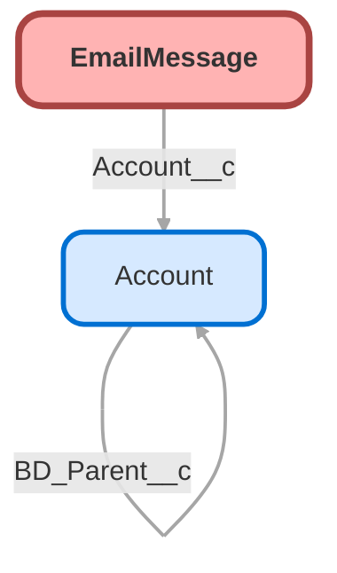

---
hide:
  - path
---

<!-- This file is auto-generated. if you do not want it to be overwritten, set TRUE in the line below -->
<!-- DO_NOT_OVERWRITE_DOC=FALSE -->

## Schema

<!-- Object description -->

## Fields

| Name      | Label | Type | Description |
| :-------- | :---- | :--: | :---------- | 
| Account__c | Account | Lookup | undefined |
| Account_Name__c | Account Name | Text | undefined |
| AutomationType |  |  | undefined |
| BccAddress |  |  | undefined |
| CcAddress |  |  | undefined |
| Details__c | Details | Text | undefined |
| Email_Type__c | Email Type | Text | Stamps Email with 'Inbound' or 'Outbound' |
| Emails__c | Emails | Number | undefined |
| FirstOpenedDate |  |  | undefined |
| FromAddress |  |  | undefined |
| FromName |  |  | undefined |
| HasAttachment |  |  | undefined |
| Headers |  |  | undefined |
| HtmlBody |  |  | undefined |
| Incoming |  |  | undefined |
| IsExternallyVisible |  |  | undefined |
| IsPrivateDraft |  |  | undefined |
| LastOpenedDate |  |  | undefined |
| Message_Size_MB__c | Message Size (MB) | Number | Email msg size in MB |
| MessageDate |  |  | undefined |
| MessageSize |  |  | undefined |
| ParentId |  | Lookup | undefined |
| RelatedToId |  | Lookup | undefined |
| Reminder__c | Reminder | Checkbox | undefined |
| Source |  |  | undefined |
| Status |  |  | undefined |
| Subject |  |  | undefined |
| TextBody |  |  | undefined |
| ToAddress |  |  | undefined |
| ValidatedFromAddress |  |  | undefined |

## Validation Rules

| Rule      | Active | Description | Formula |
| :-------- | :---- | :---------- | :------ |
| Restrict_Sending_from_Billing | Yes |  | AND ($Profile.Id  <> "00e37000000hZbo", FromAddress = "billing@myubiquity.com") |
| Restrict_Sending_from_Compliance | Yes |  | AND ($Profile.Id  <> "00e1G0000011hkz", $Profile.Id  <> "00e37000000ZOlm", FromAddress = "compliance@myubiquity.com", $Profile.Id  <> "00e00000006ohd0", $Profile.Id  <> "00e1G0000011hdP") |
| Restrict_Sending_from_Implementation | Yes |  | AND ($Profile.Id  <> "00e1G0000011hjw", FromAddress = "newplan@myubiquity.com", ISNULL(Parent.lntcss__Splited_From__c )) |
| Ubiquity_Email_On_Child_Case | No ⚠️ | Doesn't currently work - Salesforce can't check CreatedBy vs ParentOwner.
Idea was to allow non UBQT emails on child cases ONLY if creator of email = owner of case | NOT(ISBLANK( Parent.ParentId )) &&  (  CreatedById  <> Parent.OwnerId  )   && ( (NOT(CONTAINS( ToAddress , 'ubiquity.com')) && NOT(ISBLANK( ToAddress )))  (NOT(CONTAINS(  CcAddress , 'ubiquity.com')) && NOT(ISBLANK( CcAddress)))  (NOT(CONTAINS( BccAddress , 'ubiquity.com')) && NOT(ISBLANK( BccAddress))) ) |

## Related Flows

| Object | Name      | Type | Description |
| :----  | :-------- | :--: | :---------- | 
| 💻 | [Case_Split](../flows/Case_Split.md) [🕒](../flows/Case_Split-history.md) |  Screen Flow | Splits selected details and assets of current case into a new case |
| 💻 | [Support_First_Milestone_Completed](../flows/Support_First_Milestone_Completed.md) [🕒](../flows/Support_First_Milestone_Completed-history.md) |  Auto Launched Flow | When an email or task related to a case is marked sent or completed, close the first response milestone. |
| Case | [Case_After_Trigger_Send_CST_Auto_Reply](../flows/Case_After_Trigger_Send_CST_Auto_Reply.md) [🕒](../flows/Case_After_Trigger_Send_CST_Auto_Reply-history.md) |  Record After Save | Updated email body per Peggy's request.  Adding some additional formatting + links to help center topics. |
| Case | [Case_Before_Trigger_Update_Account_Based_on_Contact](../flows/Case_Before_Trigger_Update_Account_Based_on_Contact.md) [🕒](../flows/Case_Before_Trigger_Update_Account_Based_on_Contact-history.md) |  Record Before Save | Updated to "on create" only for performance reasons  When the contact on a case is changed and the account in null, update the account field with the new contact's account. |
| Case | [Case_Before_Update_Master_Flow](../flows/Case_Before_Update_Master_Flow.md) [🕒](../flows/Case_Before_Update_Master_Flow-history.md) |  Record Before Save | Updated to remove case team new check and assignment.  Split into other flow to change run order |
| Compliance__c | [Compliance_ADP_ACP_Testing_Alerts](../flows/Compliance_ADP_ACP_Testing_Alerts.md) [🕒](../flows/Compliance_ADP_ACP_Testing_Alerts-history.md) |  Workflow | Triggers ADP & ACP Email Results and Census Verification Emails |
| Compliance__c | [Compliance_ADP_ACP_Testing_Alerts_1](../flows/Compliance_ADP_ACP_Testing_Alerts_1.md) [🕒](../flows/Compliance_ADP_ACP_Testing_Alerts_1-history.md) |  Record After Save | Moved PB to flow changes are a basic entry condition, and logging email using template body w/ backup (lower maintenance)  Migrated from the Compliance  ADP ACP Testing Alerts process using multiple criteria. Triggers ADP & ACP Email Results and Census Verification Emails |
| Compliance__c | [Compliance_After_Trigger_Send_5500_Audit_Emails](../flows/Compliance_After_Trigger_Send_5500_Audit_Emails.md) [🕒](../flows/Compliance_After_Trigger_Send_5500_Audit_Emails-history.md) |  Record After Save | <!-- --> |
| Compliance__c | [Compliance_Form_5500_Alerts](../flows/Compliance_Form_5500_Alerts.md) [🕒](../flows/Compliance_Form_5500_Alerts-history.md) |  Workflow | Process running Form 5500 notification emails |
| Compliance__c | [Compliance_Form_5500_Alerts_1](../flows/Compliance_Form_5500_Alerts_1.md) [🕒](../flows/Compliance_Form_5500_Alerts_1-history.md) |  Record After Save | Updated for new email templates being used for prior 5500 alerts Process running Form 5500 notification emails |
| Compliance__c | [Compliance_Scheduled_Top_Heavy_Emails](../flows/Compliance_Scheduled_Top_Heavy_Emails.md) [🕒](../flows/Compliance_Scheduled_Top_Heavy_Emails-history.md) |  Scheduled | Updating Sender Email Address from donotrespond --> dontrespond - MC 04.04.25 For scheduled sends to support compliance - updated to add proper one time send support |
| EmailMessage | [Email_After_Trigger_Create_Task_for_Diana](../flows/Email_After_Trigger_Create_Task_for_Diana.md) [🕒](../flows/Email_After_Trigger_Create_Task_for_Diana-history.md) |  Record After Save | <!-- --> |
| EmailMessage | [Email_Message_After_Save_Notify_BI_on_Response](../flows/Email_Message_After_Save_Notify_BI_on_Response.md) [🕒](../flows/Email_Message_After_Save_Notify_BI_on_Response-history.md) |  Record After Save | Sends a custom notif to case owner when a new email is received/attached to the case.  Currently only for BI cases/users  Opted myself out- JI 10/11/23 |
| EmailMessage | [Email_Message_After_Trigger_Update_Case_Activity_Dates](../flows/Email_Message_After_Trigger_Update_Case_Activity_Dates.md) [🕒](../flows/Email_Message_After_Trigger_Update_Case_Activity_Dates-history.md) |  Record After Save | Sets values for last inbound, last outbound, and last activity date when an email is sent or received on a case.  Also creates new case if email is received on a case that's been closed for 30+ days. |
| EmailMessage | [Re_Opened_Case](../flows/Re_Opened_Case.md) [🕒](../flows/Re_Opened_Case-history.md) |  Workflow | Sets cases to "Response Received" when external email is received from client on Closed or Opened Cases |
| EmailMessage | [Reopen_Closed_Case](../flows/Reopen_Closed_Case.md) [🕒](../flows/Reopen_Closed_Case-history.md) |  Workflow | Attempting to Reopen child cases when an email is sent via the "Feed" view from one team to another |
| EmailMessage | [Support_Activity_Update_Email](../flows/Support_Activity_Update_Email.md) [🕒](../flows/Support_Activity_Update_Email-history.md) |  Record After Save | Migrated from the Support  Activity Update Email process using multiple criteria. Checks "Activity" checkbox on cases when an email is sent.   Used to flag Activity Yes/No. |
| EmailMessage | [Support_Case_Last_Activity_Email](../flows/Support_Case_Last_Activity_Email.md) [🕒](../flows/Support_Case_Last_Activity_Email-history.md) |  Workflow | When an email is created on a case, stamp the Last Activity Date on the Case |

## Related Apex Classes

| Apex Class | Type |
| :----      | :--: | 
| [Case_Invocable_Thread_Token](../apex/Case_Invocable_Thread_Token.md) | Invocable |
| [CloneDocuments](../apex/CloneDocuments.md) | Invocable |
| [CloneDocumentsTest](../apex/CloneDocumentsTest.md) | Test |
| [LogEntryHandler](../apex/LogEntryHandler.md) | Class |
| [LoggerEmailSender](../apex/LoggerEmailSender.md) | Class |
| [PaycorEmailHandlerNew](../apex/PaycorEmailHandlerNew.md) | Class |
| [PurchaseAPIHelper](../apex/PurchaseAPIHelper.md) | Class |
| [SendBetterEmail](../apex/SendBetterEmail.md) | Invocable |
| [SendBetterEmailAddAttachmentToEmail](../apex/SendBetterEmailAddAttachmentToEmail.md) | Class |
| [SendBetterEmailRequest](../apex/SendBetterEmailRequest.md) | Lightning Controller |
| [SendBetterEmailTest](../apex/SendBetterEmailTest.md) | Test |
| [SimplyCallout](../apex/SimplyCallout.md) | Callout |
| [SimplyCalloutBatch](../apex/SimplyCalloutBatch.md) | Batch |
| [SimplyCalloutBatchService](../apex/SimplyCalloutBatchService.md) | Callout |

## Related Lightning Pages

| Lightning Page | Type |
| :----      | :--: | 
| [Abandoned_Plan_Review](../pages/Abandoned_Plan_Review.md) |  Record Page |
| [BI_Test_Layout](../pages/BI_Test_Layout.md) |  Record Page |
| [CE_Page_2025](../pages/CE_Page_2025.md) |  Record Page |
| [Call_Center_Page](../pages/Call_Center_Page.md) |  Record Page |
| [Compliance_Case_Page](../pages/Compliance_Case_Page.md) |  Record Page |
| [Console_Case_Layout](../pages/Console_Case_Layout.md) |  Record Page |
| [Console_Case_Layout_Payroll](../pages/Console_Case_Layout_Payroll.md) |  Record Page |
| [Dynamic_Account_Page](../pages/Dynamic_Account_Page.md) |  Record Page |
| [Dynamic_Case_Page](../pages/Dynamic_Case_Page.md) |  Record Page |
| [Imp_Case_Layout](../pages/Imp_Case_Layout.md) |  Record Page |
| [New_3_Region_CE_Case_Page](../pages/New_3_Region_CE_Case_Page.md) |  Record Page |

## Related Profiles

| Profile | User License |
| :----      | :--: | 
| [Admin](../profiles/Admin.md) |  Salesforce |
| [Analytics Cloud Integration User](../profiles/Analytics%20Cloud%20Integration%20User.md) |  Analytics  Cloud  Integration  User |
| [Analytics Cloud Security User](../profiles/Analytics%20Cloud%20Security%20User.md) |  Analytics  Cloud  Integration  User |
| [Anypoint Integration](../profiles/Anypoint%20Integration.md) |  Identity |
| [B2BMA Integration User](../profiles/B2BMA%20Integration%20User.md) |  B2 B M A  Integration  User |
| [Billing User](../profiles/Billing%20User.md) |  Salesforce |
| [Bot Profile](../profiles/Bot%20Profile.md) |  Salesforce |
| [Business Development](../profiles/Business%20Development.md) |  Salesforce |
| [Call Center](../profiles/Call%20Center.md) |  Salesforce |
| [Chatter External User](../profiles/Chatter%20External%20User.md) |  Chatter  External |
| [Chatter Free User](../profiles/Chatter%20Free%20User.md) |  Chatter  Free |
| [Chatter Moderator User](../profiles/Chatter%20Moderator%20User.md) |  Chatter  Free |
| [Client Onboarding - Admin](../profiles/Client%20Onboarding%20-%20Admin.md) |  Salesforce |
| [Client Onboarding - RM](../profiles/Client%20Onboarding%20-%20RM.md) |  Salesforce |
| [Client Servicing Team](../profiles/Client%20Servicing%20Team.md) |  Salesforce |
| [Compliance Manager](../profiles/Compliance%20Manager.md) |  Salesforce |
| [ContractManager](../profiles/ContractManager.md) |  Salesforce |
| [Director of Operations](../profiles/Director%20of%20Operations.md) |  Salesforce |
| [Director of Sales](../profiles/Director%20of%20Sales.md) |  Salesforce |
| [Distributions](../profiles/Distributions.md) |  Salesforce |
| [Einstein Agent User](../profiles/Einstein%20Agent%20User.md) |  Einstein  Agent |
| [ESW_Agentforce_MIAW_1748035300267 Profile](../profiles/ESW_Agentforce_MIAW_1748035300267%20Profile.md) |  Guest  User  License |
| [ESW_Agentforce_MIAW_1748385215843 Profile](../profiles/ESW_Agentforce_MIAW_1748385215843%20Profile.md) |  Guest  User  License |
| [ESW_CE_Chat_1692890394498 Profile](../profiles/ESW_CE_Chat_1692890394498%20Profile.md) |  Guest  User  License |
| [ESW_CE_Chat_Moe_1693182845676 Profile](../profiles/ESW_CE_Chat_Moe_1693182845676%20Profile.md) |  Guest  User  License |
| [ESW_Login_Help_1697133738638 Profile](../profiles/ESW_Login_Help_1697133738638%20Profile.md) |  Guest  User  License |
| [ESW_Login_Help_Simply_1700075140889 Profile](../profiles/ESW_Login_Help_Simply_1700075140889%20Profile.md) |  Guest  User  License |
| [ESW_Omni_Messaging_1694183770479 Profile](../profiles/ESW_Omni_Messaging_1694183770479%20Profile.md) |  Guest  User  License |
| [ESW_Omni_Messaging_CO_1696448547822 Profile](../profiles/ESW_Omni_Messaging_CO_1696448547822%20Profile.md) |  Guest  User  License |
| [ESW_Omni_Messaging_Sallus_1700075448386 Profile](../profiles/ESW_Omni_Messaging_Sallus_1700075448386%20Profile.md) |  Guest  User  License |
| [ESW_Omni_Messaging_Simply_1700076370188 Profile](../profiles/ESW_Omni_Messaging_Simply_1700076370188%20Profile.md) |  Guest  User  License |
| [ESW_QA_Login_1699666348585 Profile](../profiles/ESW_QA_Login_1699666348585%20Profile.md) |  Guest  User  License |
| [ESW_QA_Messaging_1699974036493 Profile](../profiles/ESW_QA_Messaging_1699974036493%20Profile.md) |  Guest  User  License |
| [ESW_Sales_Chat_1697460991337 Profile](../profiles/ESW_Sales_Chat_1697460991337%20Profile.md) |  Guest  User  License |
| [ESW_Sallus_Login_Chat_1700072925200 Profile](../profiles/ESW_Sallus_Login_Chat_1700072925200%20Profile.md) |  Guest  User  License |
| [External Apps Login User](../profiles/External%20Apps%20Login%20User.md) |  External  Apps  Login |
| [Finance Manager Lightning](../profiles/Finance%20Manager%20Lightning.md) |  Salesforce |
| [Guest License User](../profiles/Guest%20License%20User.md) |  Guest  User  License |
| [Help Center Profile](../profiles/Help%20Center%20Profile.md) |  Guest  User  License |
| [Identity User](../profiles/Identity%20User.md) |  Identity |
| [Incoming_SMS Profile](../profiles/Incoming_SMS%20Profile.md) |  Guest  User  License |
| [IT](../profiles/IT.md) |  Salesforce |
| [Leadership Lightning](../profiles/Leadership%20Lightning.md) |  Salesforce |
| [Leadership](../profiles/Leadership.md) |  Salesforce |
| [Learning %26 Development](../profiles/Learning%20%2526%20Development.md) |  Salesforce |
| [Lightning Client Onboarding](../profiles/Lightning%20Client%20Onboarding.md) |  Salesforce |
| [Lightning Compliance](../profiles/Lightning%20Compliance.md) |  Salesforce |
| [Lightning Saver User](../profiles/Lightning%20Saver%20User.md) |  Salesforce |
| [Lightning Service Manager](../profiles/Lightning%20Service%20Manager.md) |  Salesforce |
| [Lightning Service User](../profiles/Lightning%20Service%20User.md) |  Salesforce |
| [Marketing Team](../profiles/Marketing%20Team.md) |  Salesforce |
| [MarketingProfile](../profiles/MarketingProfile.md) |  Salesforce |
| [Master Administrator](../profiles/Master%20Administrator.md) |  Salesforce |
| [Minimum Access - API Only Integrations](../profiles/Minimum%20Access%20-%20API%20Only%20Integrations.md) |  Salesforce  Integration |
| [Minimum Access - Salesforce](../profiles/Minimum%20Access%20-%20Salesforce.md) |  Salesforce |
| [myubiquity Profile](../profiles/myubiquity%20Profile.md) |  Guest  User  License |
| [Operations VP](../profiles/Operations%20VP.md) |  Salesforce |
| [Operations](../profiles/Operations.md) |  Salesforce |
| [Paradigm Help Center Profile](../profiles/Paradigm%20Help%20Center%20Profile.md) |  Guest  User  License |
| [Payroll Koncierge](../profiles/Payroll%20Koncierge.md) |  Salesforce |
| [Payroll Team](../profiles/Payroll%20Team.md) |  Salesforce |
| [People %26 Culture](../profiles/People%20%2526%20Culture.md) |  Salesforce |
| [Pre-chat Site Profile](../profiles/Pre-chat%20Site%20Profile.md) |  Guest  User  License |
| [Product Innovation Leadership](../profiles/Product%20Innovation%20Leadership.md) |  Salesforce |
| [Product Innovation User](../profiles/Product%20Innovation%20User.md) |  Salesforce |
| [PSM Team](../profiles/PSM%20Team.md) |  Salesforce |
| [R%26W](../profiles/R%2526W.md) |  Salesforce |
| [Read Only](../profiles/Read%20Only.md) |  Salesforce |
| [Sales Administrator](../profiles/Sales%20Administrator.md) |  Salesforce |
| [Sales Coordinator](../profiles/Sales%20Coordinator.md) |  Salesforce |
| [Sales Insights Integration User](../profiles/Sales%20Insights%20Integration%20User.md) |  Sales  Insights  Integration  User |
| [Sales Team - Limited](../profiles/Sales%20Team%20-%20Limited.md) |  Salesforce |
| [Sales Team](../profiles/Sales%20Team.md) |  Salesforce |
| [Salesforce API Only System Integrations](../profiles/Salesforce%20API%20Only%20System%20Integrations.md) |  Salesforce  Integration |
| [SalesforceIQ Integration User](../profiles/SalesforceIQ%20Integration%20User.md) |  Salesforce I Q  Integration  User |
| [Saver Manager](../profiles/Saver%20Manager.md) |  Salesforce |
| [Simple Survey Profile](../profiles/Simple%20Survey%20Profile.md) |  Guest  User  License |
| [Simply Help Center Profile](../profiles/Simply%20Help%20Center%20Profile.md) |  Guest  User  License |
| [SolutionManager](../profiles/SolutionManager.md) |  Salesforce |
| [Standard](../profiles/Standard.md) |  Salesforce |
| [StandardAul](../profiles/StandardAul.md) |  Salesforce  Platform |
| [Super System Administrator](../profiles/Super%20System%20Administrator.md) |  Salesforce |
| [Sys Dev Admin](../profiles/Sys%20Dev%20Admin.md) |  Salesforce |
| [Transitions Team](../profiles/Transitions%20Team.md) |  Salesforce |
| [Ubiquity Help Center Profile](../profiles/Ubiquity%20Help%20Center%20Profile.md) |  Guest  User  License |
| [Zoom Webhooks Profile](../profiles/Zoom%20Webhooks%20Profile.md) |  Guest  User  License |

## Related Permission Sets

| Permission Set | User License |
| :----      | :--: | 
| [Master](../permissionsets/Master.md) | None |
| [sfdcInternalInt__sfdc_slack](../permissionsets/sfdcInternalInt__sfdc_slack.md) | None |

_Documentation generated with [sfdx-hardis](https://sfdx-hardis.cloudity.com), by [Cloudity](https://www.cloudity.com/) & [friends](https://github.com/hardisgroupcom/sfdx-hardis/graphs/contributors)_
