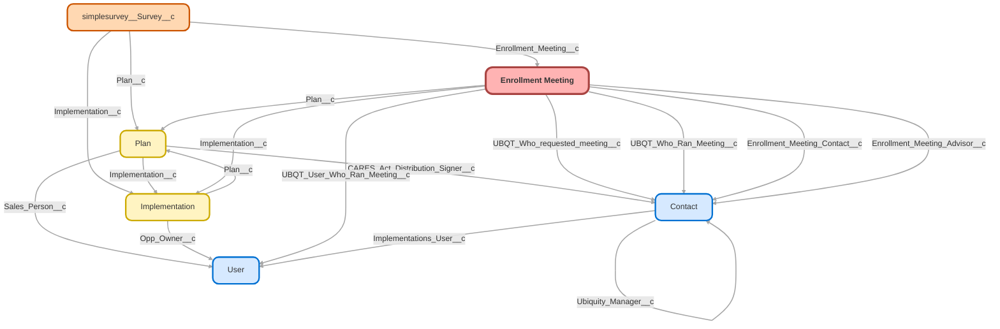

---
hide:
  - path
---

<!-- This file is auto-generated. if you do not want it to be overwritten, set TRUE in the line below -->
<!-- DO_NOT_OVERWRITE_DOC=FALSE -->

## Schema

<!-- Object description -->

## Fields

| Name      | Label | Type | Description |
| :-------- | :---- | :--: | :---------- | 
| Auto_Enroll__c | Auto Enroll | Picklist | Copied from Plan or Implementation when Enroll Meeting created.   Can be edited until Enrollment Meeting completed and then is locked. |
| Auto_Enrollment_Deferral_Escalation_Rate__c | Auto-Enrollment Deferral/Escalation Rate | Picklist | undefined |
| Brokerage_Accounts__c | Brokerage Accounts | Picklist | Copied from Plan or Implementation when Enroll Meeting created.   Can be edited until Enrollment Meeting completed and then is locked. |
| Business_Industry__c | Business/Industry | Picklist | Business/Industry from Account record |
| Census_and_Eligibility_Uploaded__c | Census and Eligibility Uploaded | Date | undefined |
| Client_Location__c | Client Location | Text | undefined |
| Contact_First_Name__c | Contact First Name | Text | Used for auto-email template |
| Contact_Phone__c | Contact Phone | Text | undefined |
| Deferral_Change_Frequency__c | Deferral Change Frequency | Picklist | undefined |
| Discretionary_Match__c | Discretionary Match | Picklist | Copied from Plan or Implementation when Enroll Meeting created.   Can be edited until Enrollment Meeting completed and then is locked. |
| Discretionary_Match_Notes__c | Discretionary Match Notes | TextArea | Copied from Plan or Implementation when Enroll Meeting created.   Can be edited until Enrollment Meeting completed and then is locked. |
| Eligibility__c | Eligibility | Picklist | Copied from Plan or Implementation when Enroll Meeting created.   Can be edited until Enrollment Meeting completed and then is locked. |
| Eligibility_Age__c | Eligibility Age | Picklist | Copied from Plan or Implementation when Enroll Meeting created.   Can be edited until Enrollment Meeting completed and then is locked. |
| Employee_Contribution_Percent__c | Employee Contribution Percent | Percent | Contributing Employees / Eligible Employees |
| Employees_Balance_Percent__c | Employees Balance Percent | Percent | Number of balances / Number of eligible employees |
| Enroll_Meeting_Notes__c | Enroll Meeting Notes | LongTextArea | undefined |
| Enrollment_Meeting_Advisor__c | Enrollment Meeting Advisor | Lookup | Advisor to be included in the enrollment meeting communication |
| Enrollment_Meeting_Contact__c | Enrollment Meeting Contact | Lookup | Contact to coordinate meeting with |
| Expected_1st_Payroll__c | Expected 1st Payroll | Date | undefined |
| Implementation__c | Implementation | Lookup | Implementation that is in progress when enrollment meeting is conducted. Only needs to be linked if the plan is in the implementation stage. |
| Industry__c | Industry | Text | undefined |
| Loans__c | Loans | Picklist | Copied from Plan or Implementation when Enroll Meeting created.   Can be edited until Enrollment Meeting completed and then is locked. |
| Meeting_Date__c | Meeting Date | Date | Date meeting took place |
| Meeting_Recording_URL__c | Meeting Recording URL | Url | undefined |
| Meeting_Time__c | Meeting Time | Time | Time meeting started |
| Meeting_Type__c | Meeting Type | MultiselectPicklist | undefined |
| Number_of_Eligible_Employees__c | Number of Eligible Employees | Number | undefined |
| Number_of_Employees__c | Number of Employees | Number | Total number of employees on census (Eligible or Ineligible - Active or Terminated) |
| Number_of_employees_contributing__c | Number of employees contributing | Number | undefined |
| Number_of_employees_with_a_balance__c | Number of employees with a balance | Number | undefined |
| Plan__c | Plan | Lookup | Plan the enrollment meeting is for |
| Plan_Age_at_Meeting_Date__c | Plan Age (Yrs) | Number | Plan age at date of the meeting |
| Plan_Entry_Frequency__c | Plan Entry Frequency | Picklist | Copied from Plan or Implementation when Enroll Meeting created.   Can be edited until Enrollment Meeting completed and then is locked. |
| Plan_Sponsor_Tour_Completed__c | Plan Sponsor Tour Completed | Date | undefined |
| Plan_Sponsor_Tour_Requested__c | Plan Sponsor Tour Requested | Date | undefined |
| Plan_Sponsor_Tour_Scheduled__c | Plan Sponsor Tour Scheduled | Date | undefined |
| Profit_Sharing__c | Profit Sharing | Picklist | Copied from Plan or Implementation when Enroll Meeting created.   Can be edited until Enrollment Meeting completed and then is locked. |
| QACA_Safe_Harbor_Vesting_Schedule__c | QACA Safe Harbor Vesting Schedule | Picklist | undefined |
| ROTH__c | ROTH | Picklist | Copied from Plan or Implementation when Enroll Meeting created.   Can be edited until Enrollment Meeting completed and then is locked. |
| Safe_Harbor__c | Safe Harbor | Picklist | Copied from Plan or Implementation when Enroll Meeting created.   Can be edited until Enrollment Meeting completed and then is locked. |
| Service_Option__c | Service Option | Picklist | From Plan object.   If not completed in Plan, then from Implementation |
| Stage__c | Stage | Picklist | undefined |
| Stage_Reasons__c | Stage Reasons | MultiselectPicklist | undefined |
| Status__c | Status | Picklist | undefined |
| Terminated_Employees__c | Terminated Employees | Number | Number of Terminated Employees on Census |
| Terminated_w_Balance__c | Terminated w Balance | Number | Number of Terminated Employees with a Balance |
| Time_Zone__c | Time Zone | Text | undefined |
| UBQT_User_Who_Ran_Meeting__c | UBQT User Who Ran Meeting | Lookup | undefined |
| UBQT_Who_Ran_Meeting__c | UBQT: Who Ran Meeting | Lookup | Identify UBQT contact who ran the meeting |
| UBQT_Who_requested_meeting__c | UBQT: Who requested meeting | Lookup | If UBQT contact requested meeting, add them here |
| Vesting_Schedule__c | Vesting Schedule | Picklist | Copied from Plan or Implementation when Enroll Meeting created.   Can be edited until Enrollment Meeting completed and then is locked. |
| What_Was_Unclear_Missing__c | What Was Unclear/Missing? | TextArea | What was unclear to client during meeting - what was missing that would have been good to have? |
| What_Went_Well__c | What Went Well? | TextArea | Confirm what went well during the enrollment / education meeting |
| X1st_Payroll_Uploaded__c | 1st Payroll Uploaded | Date | undefined |

## Validation Rules

| Rule      | Active | Description | Formula |
| :-------- | :---- | :---------- | :------ |
| Lock_Plan_Provisions_when_Complete | Yes | Prevents edits to Plan Provisions after meeting is complete - this allows us to lock in the values at the time of the meeting. | AND   (ISPICKVAL( Status__c , "Completed") , TEXT(PRIORVALUE(Status__c)) = TEXT(Status__c),  (OR( ISCHANGED( Auto_Enroll__c ),  ISCHANGED( Brokerage_Accounts__c ),  ISCHANGED( Discretionary_Match__c ),  ISCHANGED( Discretionary_Match_Notes__c ),  ISCHANGED( Eligibility__c ),  ISCHANGED( Eligibility_Age__c ),  ISCHANGED( Loans__c ), ISCHANGED( Plan_Entry_Frequency__c ), ISCHANGED( Profit_Sharing__c ), ISCHANGED( ROTH__c ), ISCHANGED( Safe_Harbor__c ), ISCHANGED( Service_Option__c ), ISCHANGED( Vesting_Schedule__c )))) |
| Meeting_Date_Required | Yes | Must enter date for Meeting Date | AND ( ISPICKVAL( Status__c , "Completed"), ISPICKVAL( Stage__c, "Completed"),  (OR( ISBLANK(  Meeting_Date__c  )))) |
| Require_Meeting_Type_URL_Complete | Yes | Require Meeting Type and URL when Meeting = Completed | AND  (NOT(ISPICKVAL( Stage__c , "Declined")),  NOT(INCLUDES( Meeting_Type__c , "Enrollment Kit only")), (ISPICKVAL( Status__c , "Completed")),  (OR( ISBLANK(  What_Was_Unclear_Missing__c  ), ISBLANK(  What_Went_Well__c  ), ISBLANK(  Meeting_Recording_URL__c ), ISBLANK(  Meeting_Type__c  )))) |
| Require_Saver_Rate_Data_Completed | Yes | Require Saver Rate Data when Stage/Status = Completed OR Status = Completed w/ Meeting Type = Enrollment Kit Only | AND ( ISPICKVAL( Status__c , "Completed"), NOT(INCLUDES( Meeting_Type__c , "Enrollment Kit only")), ISPICKVAL( Stage__c, "Completed"),  (OR( ISBLANK( Number_of_Employees__c ), ISBLANK( Number_of_Eligible_Employees__c ), ISBLANK( Number_of_employees_contributing__c ), ISBLANK( Number_of_employees_with_a_balance__c ), ISBLANK( Terminated_Employees__c ), ISBLANK( Terminated_w_Balance__c )))) |
| Require_Saver_Rate_Data_Kit_Delivered | Yes | Require Saver Rate Data when Stage/Status = Completed OR Status = Completed w/ Meeting Type = Enrollment Kit Only | AND ( ISPICKVAL( Status__c , "Completed"), NOT(INCLUDES( Meeting_Type__c , "Enrollment Kit only")),  (OR( ISBLANK( Number_of_Employees__c ), ISBLANK( Number_of_Eligible_Employees__c ), ISBLANK( Number_of_employees_contributing__c ), ISBLANK( Number_of_employees_with_a_balance__c ), ISBLANK( Terminated_Employees__c ), ISBLANK( Terminated_w_Balance__c )))) |

## Related Flows

| Object | Name      | Type | Description |
| :----  | :-------- | :--: | :---------- | 
| Enrollment_Meeting__c | [Enrollment_Copy_Plan_Provisions](../flows/Enrollment_Copy_Plan_Provisions.md) [🕒](../flows/Enrollment_Copy_Plan_Provisions-history.md) |  Workflow | Copies plan provisions from Plan or Implementations to get most current data stamped at time of meeting |
| Enrollment_Meeting__c | [Enrollment_Create_Saver_Rate_Object](../flows/Enrollment_Create_Saver_Rate_Object.md) [🕒](../flows/Enrollment_Create_Saver_Rate_Object-history.md) |  Workflow | Creates Saver rate object when meeting is Completed OR when Enrollment Kit is delivered |
| Enrollment_Meeting__c | [Enrollment_Notify_Mich](../flows/Enrollment_Notify_Mich.md) [🕒](../flows/Enrollment_Notify_Mich-history.md) |  Workflow | Notifies Mich and Enroll Team of new enrollment meeting object |
| Enrollment_Meeting__c | [Enrollment_Record](../flows/Enrollment_Record.md) [🕒](../flows/Enrollment_Record-history.md) |  Record After Save | When Enrollment meeting is created, stamp record with Advisor Contact lookup |
| Enrollment_Meeting__c | [Enrollment_Survey](../flows/Enrollment_Survey.md) [🕒](../flows/Enrollment_Survey-history.md) |  Workflow | Send Survey after enrollment meeting is completed |

## Related Lightning Pages

| Lightning Page | Type |
| :----      | :--: | 
| [Dynamic_Imp_Record_Page](../pages/Dynamic_Imp_Record_Page.md) |  Record Page |
| [Enrollment_Meeting_Record_Page](../pages/Enrollment_Meeting_Record_Page.md) |  Record Page |

## Related Profiles

| Profile | User License |
| :----      | :--: | 
| [Admin](../profiles/Admin.md) |  Salesforce |
| [Analytics Cloud Integration User](../profiles/Analytics%20Cloud%20Integration%20User.md) |  Analytics  Cloud  Integration  User |
| [Analytics Cloud Security User](../profiles/Analytics%20Cloud%20Security%20User.md) |  Analytics  Cloud  Integration  User |
| [Anypoint Integration](../profiles/Anypoint%20Integration.md) |  Identity |
| [B2BMA Integration User](../profiles/B2BMA%20Integration%20User.md) |  B2 B M A  Integration  User |
| [Billing User](../profiles/Billing%20User.md) |  Salesforce |
| [Bot Profile](../profiles/Bot%20Profile.md) |  Salesforce |
| [Business Development](../profiles/Business%20Development.md) |  Salesforce |
| [Call Center](../profiles/Call%20Center.md) |  Salesforce |
| [Chatter External User](../profiles/Chatter%20External%20User.md) |  Chatter  External |
| [Chatter Free User](../profiles/Chatter%20Free%20User.md) |  Chatter  Free |
| [Chatter Moderator User](../profiles/Chatter%20Moderator%20User.md) |  Chatter  Free |
| [Client Onboarding - Admin](../profiles/Client%20Onboarding%20-%20Admin.md) |  Salesforce |
| [Client Onboarding - RM](../profiles/Client%20Onboarding%20-%20RM.md) |  Salesforce |
| [Client Servicing Team](../profiles/Client%20Servicing%20Team.md) |  Salesforce |
| [Compliance Manager](../profiles/Compliance%20Manager.md) |  Salesforce |
| [ContractManager](../profiles/ContractManager.md) |  Salesforce |
| [Director of Operations](../profiles/Director%20of%20Operations.md) |  Salesforce |
| [Director of Sales](../profiles/Director%20of%20Sales.md) |  Salesforce |
| [Distributions](../profiles/Distributions.md) |  Salesforce |
| [Einstein Agent User](../profiles/Einstein%20Agent%20User.md) |  Einstein  Agent |
| [ESW_Agentforce_MIAW_1748035300267 Profile](../profiles/ESW_Agentforce_MIAW_1748035300267%20Profile.md) |  Guest  User  License |
| [ESW_Agentforce_MIAW_1748385215843 Profile](../profiles/ESW_Agentforce_MIAW_1748385215843%20Profile.md) |  Guest  User  License |
| [ESW_CE_Chat_1692890394498 Profile](../profiles/ESW_CE_Chat_1692890394498%20Profile.md) |  Guest  User  License |
| [ESW_CE_Chat_Moe_1693182845676 Profile](../profiles/ESW_CE_Chat_Moe_1693182845676%20Profile.md) |  Guest  User  License |
| [ESW_Login_Help_1697133738638 Profile](../profiles/ESW_Login_Help_1697133738638%20Profile.md) |  Guest  User  License |
| [ESW_Login_Help_Simply_1700075140889 Profile](../profiles/ESW_Login_Help_Simply_1700075140889%20Profile.md) |  Guest  User  License |
| [ESW_Omni_Messaging_1694183770479 Profile](../profiles/ESW_Omni_Messaging_1694183770479%20Profile.md) |  Guest  User  License |
| [ESW_Omni_Messaging_CO_1696448547822 Profile](../profiles/ESW_Omni_Messaging_CO_1696448547822%20Profile.md) |  Guest  User  License |
| [ESW_Omni_Messaging_Sallus_1700075448386 Profile](../profiles/ESW_Omni_Messaging_Sallus_1700075448386%20Profile.md) |  Guest  User  License |
| [ESW_Omni_Messaging_Simply_1700076370188 Profile](../profiles/ESW_Omni_Messaging_Simply_1700076370188%20Profile.md) |  Guest  User  License |
| [ESW_QA_Login_1699666348585 Profile](../profiles/ESW_QA_Login_1699666348585%20Profile.md) |  Guest  User  License |
| [ESW_QA_Messaging_1699974036493 Profile](../profiles/ESW_QA_Messaging_1699974036493%20Profile.md) |  Guest  User  License |
| [ESW_Sales_Chat_1697460991337 Profile](../profiles/ESW_Sales_Chat_1697460991337%20Profile.md) |  Guest  User  License |
| [ESW_Sallus_Login_Chat_1700072925200 Profile](../profiles/ESW_Sallus_Login_Chat_1700072925200%20Profile.md) |  Guest  User  License |
| [External Apps Login User](../profiles/External%20Apps%20Login%20User.md) |  External  Apps  Login |
| [Finance Manager Lightning](../profiles/Finance%20Manager%20Lightning.md) |  Salesforce |
| [Guest License User](../profiles/Guest%20License%20User.md) |  Guest  User  License |
| [Help Center Profile](../profiles/Help%20Center%20Profile.md) |  Guest  User  License |
| [Identity User](../profiles/Identity%20User.md) |  Identity |
| [Incoming_SMS Profile](../profiles/Incoming_SMS%20Profile.md) |  Guest  User  License |
| [IT](../profiles/IT.md) |  Salesforce |
| [Leadership Lightning](../profiles/Leadership%20Lightning.md) |  Salesforce |
| [Leadership](../profiles/Leadership.md) |  Salesforce |
| [Learning %26 Development](../profiles/Learning%20%2526%20Development.md) |  Salesforce |
| [Lightning Client Onboarding](../profiles/Lightning%20Client%20Onboarding.md) |  Salesforce |
| [Lightning Compliance](../profiles/Lightning%20Compliance.md) |  Salesforce |
| [Lightning Saver User](../profiles/Lightning%20Saver%20User.md) |  Salesforce |
| [Lightning Service Manager](../profiles/Lightning%20Service%20Manager.md) |  Salesforce |
| [Lightning Service User](../profiles/Lightning%20Service%20User.md) |  Salesforce |
| [Marketing Team](../profiles/Marketing%20Team.md) |  Salesforce |
| [MarketingProfile](../profiles/MarketingProfile.md) |  Salesforce |
| [Master Administrator](../profiles/Master%20Administrator.md) |  Salesforce |
| [Minimum Access - API Only Integrations](../profiles/Minimum%20Access%20-%20API%20Only%20Integrations.md) |  Salesforce  Integration |
| [Minimum Access - Salesforce](../profiles/Minimum%20Access%20-%20Salesforce.md) |  Salesforce |
| [myubiquity Profile](../profiles/myubiquity%20Profile.md) |  Guest  User  License |
| [Operations VP](../profiles/Operations%20VP.md) |  Salesforce |
| [Operations](../profiles/Operations.md) |  Salesforce |
| [Paradigm Help Center Profile](../profiles/Paradigm%20Help%20Center%20Profile.md) |  Guest  User  License |
| [Payroll Koncierge](../profiles/Payroll%20Koncierge.md) |  Salesforce |
| [Payroll Team](../profiles/Payroll%20Team.md) |  Salesforce |
| [People %26 Culture](../profiles/People%20%2526%20Culture.md) |  Salesforce |
| [Pre-chat Site Profile](../profiles/Pre-chat%20Site%20Profile.md) |  Guest  User  License |
| [Product Innovation Leadership](../profiles/Product%20Innovation%20Leadership.md) |  Salesforce |
| [Product Innovation User](../profiles/Product%20Innovation%20User.md) |  Salesforce |
| [PSM Team](../profiles/PSM%20Team.md) |  Salesforce |
| [R%26W](../profiles/R%2526W.md) |  Salesforce |
| [Read Only](../profiles/Read%20Only.md) |  Salesforce |
| [Sales Administrator](../profiles/Sales%20Administrator.md) |  Salesforce |
| [Sales Coordinator](../profiles/Sales%20Coordinator.md) |  Salesforce |
| [Sales Insights Integration User](../profiles/Sales%20Insights%20Integration%20User.md) |  Sales  Insights  Integration  User |
| [Sales Team - Limited](../profiles/Sales%20Team%20-%20Limited.md) |  Salesforce |
| [Sales Team](../profiles/Sales%20Team.md) |  Salesforce |
| [Salesforce API Only System Integrations](../profiles/Salesforce%20API%20Only%20System%20Integrations.md) |  Salesforce  Integration |
| [SalesforceIQ Integration User](../profiles/SalesforceIQ%20Integration%20User.md) |  Salesforce I Q  Integration  User |
| [Saver Manager](../profiles/Saver%20Manager.md) |  Salesforce |
| [Simple Survey Profile](../profiles/Simple%20Survey%20Profile.md) |  Guest  User  License |
| [Simply Help Center Profile](../profiles/Simply%20Help%20Center%20Profile.md) |  Guest  User  License |
| [SolutionManager](../profiles/SolutionManager.md) |  Salesforce |
| [Standard](../profiles/Standard.md) |  Salesforce |
| [StandardAul](../profiles/StandardAul.md) |  Salesforce  Platform |
| [Super System Administrator](../profiles/Super%20System%20Administrator.md) |  Salesforce |
| [Sys Dev Admin](../profiles/Sys%20Dev%20Admin.md) |  Salesforce |
| [Transitions Team](../profiles/Transitions%20Team.md) |  Salesforce |
| [Ubiquity Help Center Profile](../profiles/Ubiquity%20Help%20Center%20Profile.md) |  Guest  User  License |
| [Zoom Webhooks Profile](../profiles/Zoom%20Webhooks%20Profile.md) |  Guest  User  License |

## Related Permission Sets

| Permission Set | User License |
| :----      | :--: | 
| [Attachments_and_Notes_Migrator](../permissionsets/Attachments_and_Notes_Migrator.md) | None |
| [Automation_Team_Imp_Project_Tasks](../permissionsets/Automation_Team_Imp_Project_Tasks.md) | None |
| [Data_Loader](../permissionsets/Data_Loader.md) | None |
| [Developer](../permissionsets/Developer.md) | None |
| [MagicMover](../permissionsets/MagicMover.md) | None |
| [Manager](../permissionsets/Manager.md) | None |
| [Master](../permissionsets/Master.md) | None |
| [Modify_All](../permissionsets/Modify_All.md) | None |
| [sfdcInternalInt__sfdc_a360_sfcrm_data_extract](../permissionsets/sfdcInternalInt__sfdc_a360_sfcrm_data_extract.md) | None |
| [sfdcInternalInt__sfdc_articlerecommendations](../permissionsets/sfdcInternalInt__sfdc_articlerecommendations.md) | None |
| [sfdcInternalInt__sfdc_einsteinagent](../permissionsets/sfdcInternalInt__sfdc_einsteinagent.md) | None |
| [sfdcInternalInt__sfdc_replyrecommendations](../permissionsets/sfdcInternalInt__sfdc_replyrecommendations.md) | None |
| [sfdcInternalInt__sfdc_slack](../permissionsets/sfdcInternalInt__sfdc_slack.md) | None |
| [View_All](../permissionsets/View_All.md) | None |

_Documentation generated with [sfdx-hardis](https://sfdx-hardis.cloudity.com), by [Cloudity](https://www.cloudity.com/) & [friends](https://github.com/hardisgroupcom/sfdx-hardis/graphs/contributors)_
