---
hide:
  - path
---

<!-- This file is auto-generated. if you do not want it to be overwritten, set TRUE in the line below -->
<!-- DO_NOT_OVERWRITE_DOC=FALSE -->

## Schema

```mermaid
graph TD
Event["Event"]:::mainObject
click Event "/objects/Event/"


classDef object fill:#D6E9FF,stroke:#0070D2,stroke-width:3px,rx:12px,ry:12px,shadow:drop,color:#333;
classDef customObject fill:#FFF4C2,stroke:#CCAA00,stroke-width:3px,rx:12px,ry:12px,shadow:drop,color:#333;
classDef customObjectManaged fill:#FFD8B2,stroke:#CC5500,stroke-width:3px,rx:12px,ry:12px,shadow:drop,color:#333;
classDef mainObject fill:#FFB3B3,stroke:#A94442,stroke-width:4px,rx:14px,ry:14px,shadow:drop,color:#333,font-weight:bold;

```

<!-- Object description -->

## Related Flows

| Object | Name      | Type | Description |
| :----  | :-------- | :--: | :---------- | 
| 💻 | [CancelEvent](../flows/CancelEvent.md) [🕒](../flows/CancelEvent-history.md) |  Auto Launched Flow | Marks Event record as Canceled - updated to show time as free/open |
| 💻 | [Close_Create_Follow_Up_Event](../flows/Close_Create_Follow_Up_Event.md) [🕒](../flows/Close_Create_Follow_Up_Event-history.md) |  Screen Flow | Closes event while cloning details for follow-up |
| 💻 | [CreateEvent](../flows/CreateEvent.md) [🕒](../flows/CreateEvent-history.md) |  Auto Launched Flow | Updated to act as a general "catch all" for partners.  If partner utm fields are found on calendlyaction, look for partner with a code that matches utm_source.  Creates event for new "invitee.created" calendlyactions.  Connects to lead or contact if found.  If no person found, creates new lead. |
| 💻 | [Create_Follow_Up_Task_from_Event](../flows/Create_Follow_Up_Task_from_Event.md) [🕒](../flows/Create_Follow_Up_Task_from_Event-history.md) |  Screen Flow | Create follow up Task from Event record |
| 💻 | [Event_Process_Call_Scheduled](../flows/Event_Process_Call_Scheduled.md) [🕒](../flows/Event_Process_Call_Scheduled-history.md) |  Auto Launched Flow | <!-- --> |
| 💻 | [Nano_Banc_Single_k_Flow](../flows/Nano_Banc_Single_k_Flow.md) [🕒](../flows/Nano_Banc_Single_k_Flow-history.md) |  Auto Launched Flow | <!-- --> |
| 💻 | [RewardJet_401_k_Flow](../flows/RewardJet_401_k_Flow.md) [🕒](../flows/RewardJet_401_k_Flow-history.md) |  Auto Launched Flow | <!-- --> |
| 💻 | [RewardJet_Single_k_Flow](../flows/RewardJet_Single_k_Flow.md) [🕒](../flows/RewardJet_Single_k_Flow-history.md) |  Auto Launched Flow | <!-- --> |
| 💻 | [Update_Email_Phone_on_Event](../flows/Update_Email_Phone_on_Event.md) [🕒](../flows/Update_Email_Phone_on_Event-history.md) |  Auto Launched Flow | <!-- --> |
| Event | [Event_After_Trigger_Update_Call_Date_Time](../flows/Event_After_Trigger_Update_Call_Date_Time.md) [🕒](../flows/Event_After_Trigger_Update_Call_Date_Time-history.md) |  Record After Save | <!-- --> |
| Event | [Event_Stamp_Imp_w_Scheduled_Date](../flows/Event_Stamp_Imp_w_Scheduled_Date.md) [🕒](../flows/Event_Stamp_Imp_w_Scheduled_Date-history.md) |  Workflow | When Calendly Event is Created, Stamp Relevant Record Field |
| Event | [Implementations_Calendly_Event_Assignment](../flows/Implementations_Calendly_Event_Assignment.md) [🕒](../flows/Implementations_Calendly_Event_Assignment-history.md) |  Workflow | Assigns Calendly Event to owner of Implementation and Sets Calendly Call Dates in Implementation |

## Related Apex Classes

| Apex Class | Type |
| :----      | :--: | 
| [AnyEventCalCtrl](../apex/AnyEventCalCtrl.md) | Lightning Controller |
| [AnyEventCalCtrlTest](../apex/AnyEventCalCtrlTest.md) | Test (See All Data) |
| [CallableLogger](../apex/CallableLogger.md) | Class |
| [CallableLogger_Tests](../apex/CallableLogger_Tests.md) | Test |
| [ComponentLogger](../apex/ComponentLogger.md) | Lightning Controller |
| [ComponentLogger_Tests](../apex/ComponentLogger_Tests.md) | Test |
| [FlowCollectionLogEntry](../apex/FlowCollectionLogEntry.md) | Invocable |
| [FlowCollectionLogEntry_Tests](../apex/FlowCollectionLogEntry_Tests.md) | Test |
| [FlowLogEntry](../apex/FlowLogEntry.md) | Invocable |
| [FlowLogEntry_Tests](../apex/FlowLogEntry_Tests.md) | Test |
| [FlowLogger](../apex/FlowLogger.md) | Class |
| [FlowLogger_Tests](../apex/FlowLogger_Tests.md) | Test |
| [FlowRecordLogEntry](../apex/FlowRecordLogEntry.md) | Invocable |
| [FlowRecordLogEntry_Tests](../apex/FlowRecordLogEntry_Tests.md) | Test |
| [LogEntryEventBuilder](../apex/LogEntryEventBuilder.md) | Class |
| [LogEntryEventBuilder_Tests](../apex/LogEntryEventBuilder_Tests.md) | Test |
| [LogEntryEventHandler](../apex/LogEntryEventHandler.md) | Class |
| [LogEntryEventHandler_Tests](../apex/LogEntryEventHandler_Tests.md) | Test |
| [LogEntryEventStreamController](../apex/LogEntryEventStreamController.md) | Lightning Controller |
| [LogEntryEventStreamController_Tests](../apex/LogEntryEventStreamController_Tests.md) | Test |
| [LogEntryHandler](../apex/LogEntryHandler.md) | Class |
| [LogManagementDataSelector](../apex/LogManagementDataSelector.md) | Class |
| [LogManagementDataSelector_Tests](../apex/LogManagementDataSelector_Tests.md) | Test |
| [LogMessage](../apex/LogMessage.md) | Class |
| [Logger](../apex/Logger.md) | Invocable |
| [LoggerBatchableContext_Tests](../apex/LoggerBatchableContext_Tests.md) | Test |
| [LoggerDataStore](../apex/LoggerDataStore.md) | Class |
| [LoggerDataStore_Tests](../apex/LoggerDataStore_Tests.md) | Test |
| [LoggerFieldMapper](../apex/LoggerFieldMapper.md) | Class |
| [LoggerFieldMapper_Tests](../apex/LoggerFieldMapper_Tests.md) | Test |
| [LoggerMockDataStore](../apex/LoggerMockDataStore.md) | Test |
| [LoggerParameter](../apex/LoggerParameter.md) | Class |
| [LoggerParameter_Tests](../apex/LoggerParameter_Tests.md) | Test |
| [LoggerSObjectHandler](../apex/LoggerSObjectHandler.md) | Class |
| [LoggerSObjectHandler_Tests](../apex/LoggerSObjectHandler_Tests.md) | Test |
| [LoggerSettingsController](../apex/LoggerSettingsController.md) | Lightning Controller |
| [LoggerSettingsController_Tests](../apex/LoggerSettingsController_Tests.md) | Test |
| [LoggerTestConfigurator](../apex/LoggerTestConfigurator.md) | Test |
| [Logger_Tests](../apex/Logger_Tests.md) | Test |
| [WebhookController](../apex/WebhookController.md) | REST |
| [ZoomTestDataFactory](../apex/ZoomTestDataFactory.md) | Test |
| [ZoomUserInfosRecordCreatorBatch](../apex/ZoomUserInfosRecordCreatorBatch.md) | Batch |
| [ZoomUsersInfoTriggerController](../apex/ZoomUsersInfoTriggerController.md) | Class |
| [ZoomUsersInfoTriggerControllerTest](../apex/ZoomUsersInfoTriggerControllerTest.md) | Test |
| [ZoomWebhookController](../apex/ZoomWebhookController.md) | Class |
| [ZoomWebhookControllerTest](../apex/ZoomWebhookControllerTest.md) | Test |
| [LogEntryEvent](../apex/LogEntryEvent.md) | Class |

## Related Lightning Pages

| Lightning Page | Type |
| :----      | :--: | 
| [CE_Page_2025](../pages/CE_Page_2025.md) |  Record Page |
| [Chat_Transcript_Record_Page](../pages/Chat_Transcript_Record_Page.md) |  Record Page |
| [Chat_Transcript_Record_Page1](../pages/Chat_Transcript_Record_Page1.md) |  Record Page |
| [Default_Account_Layout](../pages/Default_Account_Layout.md) |  Record Page |
| [Default_Contact_Layout](../pages/Default_Contact_Layout.md) |  Record Page |
| [Dynamic_Opp_Page](../pages/Dynamic_Opp_Page.md) |  Record Page |
| [Dynamic_Plan_Page](../pages/Dynamic_Plan_Page.md) |  Record Page |
| [Dynamic_Transitions_Lighting_Page](../pages/Dynamic_Transitions_Lighting_Page.md) |  Record Page |
| [Event_Page](../pages/Event_Page.md) |  Record Page |
| [Implementation_Conversion](../pages/Implementation_Conversion.md) |  Record Page |
| [Implementation_Default_Record_Layout](../pages/Implementation_Default_Record_Layout.md) |  Record Page |
| [Implementation_Record_Page](../pages/Implementation_Record_Page.md) |  Record Page |
| [Implementation_Record_Page1](../pages/Implementation_Record_Page1.md) |  Record Page |
| [JIRA_Case_Layout](../pages/JIRA_Case_Layout.md) |  Record Page |
| [LogEntryRecordPage](../pages/LogEntryRecordPage.md) |  Record Page |
| [LoggerHomePage](../pages/LoggerHomePage.md) |  Home Page |
| [Partner_Account_Layout](../pages/Partner_Account_Layout.md) |  Record Page |
| [Plan_Record_Page](../pages/Plan_Record_Page.md) |  Record Page |
| [RM_Home_Page](../pages/RM_Home_Page.md) |  Home Page |
| [Sales_Home](../pages/Sales_Home.md) |  Home Page |
| [Sales_Lightning_Account_Record](../pages/Sales_Lightning_Account_Record.md) |  Record Page |
| [Scheduled_Calls](../pages/Scheduled_Calls.md) |  App Page |
| [Task_Lightning_Page](../pages/Task_Lightning_Page.md) |  Record Page |

## Related Profiles

| Profile | User License |
| :----      | :--: | 
| [Admin](../profiles/Admin.md) |  Salesforce |
| [Analytics Cloud Integration User](../profiles/Analytics%20Cloud%20Integration%20User.md) |  Analytics  Cloud  Integration  User |
| [Analytics Cloud Security User](../profiles/Analytics%20Cloud%20Security%20User.md) |  Analytics  Cloud  Integration  User |
| [Anypoint Integration](../profiles/Anypoint%20Integration.md) |  Identity |
| [B2BMA Integration User](../profiles/B2BMA%20Integration%20User.md) |  B2 B M A  Integration  User |
| [Billing User](../profiles/Billing%20User.md) |  Salesforce |
| [Bot Profile](../profiles/Bot%20Profile.md) |  Salesforce |
| [Business Development](../profiles/Business%20Development.md) |  Salesforce |
| [Call Center](../profiles/Call%20Center.md) |  Salesforce |
| [Chatter External User](../profiles/Chatter%20External%20User.md) |  Chatter  External |
| [Chatter Free User](../profiles/Chatter%20Free%20User.md) |  Chatter  Free |
| [Chatter Moderator User](../profiles/Chatter%20Moderator%20User.md) |  Chatter  Free |
| [Client Onboarding - Admin](../profiles/Client%20Onboarding%20-%20Admin.md) |  Salesforce |
| [Client Onboarding - RM](../profiles/Client%20Onboarding%20-%20RM.md) |  Salesforce |
| [Client Servicing Team](../profiles/Client%20Servicing%20Team.md) |  Salesforce |
| [Compliance Manager](../profiles/Compliance%20Manager.md) |  Salesforce |
| [ContractManager](../profiles/ContractManager.md) |  Salesforce |
| [Director of Operations](../profiles/Director%20of%20Operations.md) |  Salesforce |
| [Director of Sales](../profiles/Director%20of%20Sales.md) |  Salesforce |
| [Distributions](../profiles/Distributions.md) |  Salesforce |
| [Einstein Agent User](../profiles/Einstein%20Agent%20User.md) |  Einstein  Agent |
| [ESW_Agentforce_MIAW_1748035300267 Profile](../profiles/ESW_Agentforce_MIAW_1748035300267%20Profile.md) |  Guest  User  License |
| [ESW_Agentforce_MIAW_1748385215843 Profile](../profiles/ESW_Agentforce_MIAW_1748385215843%20Profile.md) |  Guest  User  License |
| [ESW_CE_Chat_1692890394498 Profile](../profiles/ESW_CE_Chat_1692890394498%20Profile.md) |  Guest  User  License |
| [ESW_CE_Chat_Moe_1693182845676 Profile](../profiles/ESW_CE_Chat_Moe_1693182845676%20Profile.md) |  Guest  User  License |
| [ESW_Login_Help_1697133738638 Profile](../profiles/ESW_Login_Help_1697133738638%20Profile.md) |  Guest  User  License |
| [ESW_Login_Help_Simply_1700075140889 Profile](../profiles/ESW_Login_Help_Simply_1700075140889%20Profile.md) |  Guest  User  License |
| [ESW_Omni_Messaging_1694183770479 Profile](../profiles/ESW_Omni_Messaging_1694183770479%20Profile.md) |  Guest  User  License |
| [ESW_Omni_Messaging_CO_1696448547822 Profile](../profiles/ESW_Omni_Messaging_CO_1696448547822%20Profile.md) |  Guest  User  License |
| [ESW_Omni_Messaging_Sallus_1700075448386 Profile](../profiles/ESW_Omni_Messaging_Sallus_1700075448386%20Profile.md) |  Guest  User  License |
| [ESW_Omni_Messaging_Simply_1700076370188 Profile](../profiles/ESW_Omni_Messaging_Simply_1700076370188%20Profile.md) |  Guest  User  License |
| [ESW_QA_Login_1699666348585 Profile](../profiles/ESW_QA_Login_1699666348585%20Profile.md) |  Guest  User  License |
| [ESW_QA_Messaging_1699974036493 Profile](../profiles/ESW_QA_Messaging_1699974036493%20Profile.md) |  Guest  User  License |
| [ESW_Sales_Chat_1697460991337 Profile](../profiles/ESW_Sales_Chat_1697460991337%20Profile.md) |  Guest  User  License |
| [ESW_Sallus_Login_Chat_1700072925200 Profile](../profiles/ESW_Sallus_Login_Chat_1700072925200%20Profile.md) |  Guest  User  License |
| [External Apps Login User](../profiles/External%20Apps%20Login%20User.md) |  External  Apps  Login |
| [Finance Manager Lightning](../profiles/Finance%20Manager%20Lightning.md) |  Salesforce |
| [Guest License User](../profiles/Guest%20License%20User.md) |  Guest  User  License |
| [Help Center Profile](../profiles/Help%20Center%20Profile.md) |  Guest  User  License |
| [Identity User](../profiles/Identity%20User.md) |  Identity |
| [Incoming_SMS Profile](../profiles/Incoming_SMS%20Profile.md) |  Guest  User  License |
| [IT](../profiles/IT.md) |  Salesforce |
| [Leadership Lightning](../profiles/Leadership%20Lightning.md) |  Salesforce |
| [Leadership](../profiles/Leadership.md) |  Salesforce |
| [Learning %26 Development](../profiles/Learning%20%2526%20Development.md) |  Salesforce |
| [Lightning Client Onboarding](../profiles/Lightning%20Client%20Onboarding.md) |  Salesforce |
| [Lightning Compliance](../profiles/Lightning%20Compliance.md) |  Salesforce |
| [Lightning Saver User](../profiles/Lightning%20Saver%20User.md) |  Salesforce |
| [Lightning Service Manager](../profiles/Lightning%20Service%20Manager.md) |  Salesforce |
| [Lightning Service User](../profiles/Lightning%20Service%20User.md) |  Salesforce |
| [Marketing Team](../profiles/Marketing%20Team.md) |  Salesforce |
| [MarketingProfile](../profiles/MarketingProfile.md) |  Salesforce |
| [Master Administrator](../profiles/Master%20Administrator.md) |  Salesforce |
| [Minimum Access - API Only Integrations](../profiles/Minimum%20Access%20-%20API%20Only%20Integrations.md) |  Salesforce  Integration |
| [Minimum Access - Salesforce](../profiles/Minimum%20Access%20-%20Salesforce.md) |  Salesforce |
| [myubiquity Profile](../profiles/myubiquity%20Profile.md) |  Guest  User  License |
| [Operations VP](../profiles/Operations%20VP.md) |  Salesforce |
| [Operations](../profiles/Operations.md) |  Salesforce |
| [Paradigm Help Center Profile](../profiles/Paradigm%20Help%20Center%20Profile.md) |  Guest  User  License |
| [Payroll Koncierge](../profiles/Payroll%20Koncierge.md) |  Salesforce |
| [Payroll Team](../profiles/Payroll%20Team.md) |  Salesforce |
| [People %26 Culture](../profiles/People%20%2526%20Culture.md) |  Salesforce |
| [Pre-chat Site Profile](../profiles/Pre-chat%20Site%20Profile.md) |  Guest  User  License |
| [Product Innovation Leadership](../profiles/Product%20Innovation%20Leadership.md) |  Salesforce |
| [Product Innovation User](../profiles/Product%20Innovation%20User.md) |  Salesforce |
| [PSM Team](../profiles/PSM%20Team.md) |  Salesforce |
| [R%26W](../profiles/R%2526W.md) |  Salesforce |
| [Read Only](../profiles/Read%20Only.md) |  Salesforce |
| [Sales Administrator](../profiles/Sales%20Administrator.md) |  Salesforce |
| [Sales Coordinator](../profiles/Sales%20Coordinator.md) |  Salesforce |
| [Sales Insights Integration User](../profiles/Sales%20Insights%20Integration%20User.md) |  Sales  Insights  Integration  User |
| [Sales Team - Limited](../profiles/Sales%20Team%20-%20Limited.md) |  Salesforce |
| [Sales Team](../profiles/Sales%20Team.md) |  Salesforce |
| [Salesforce API Only System Integrations](../profiles/Salesforce%20API%20Only%20System%20Integrations.md) |  Salesforce  Integration |
| [SalesforceIQ Integration User](../profiles/SalesforceIQ%20Integration%20User.md) |  Salesforce I Q  Integration  User |
| [Saver Manager](../profiles/Saver%20Manager.md) |  Salesforce |
| [Simple Survey Profile](../profiles/Simple%20Survey%20Profile.md) |  Guest  User  License |
| [Simply Help Center Profile](../profiles/Simply%20Help%20Center%20Profile.md) |  Guest  User  License |
| [SolutionManager](../profiles/SolutionManager.md) |  Salesforce |
| [Standard](../profiles/Standard.md) |  Salesforce |
| [StandardAul](../profiles/StandardAul.md) |  Salesforce  Platform |
| [Super System Administrator](../profiles/Super%20System%20Administrator.md) |  Salesforce |
| [Sys Dev Admin](../profiles/Sys%20Dev%20Admin.md) |  Salesforce |
| [Transitions Team](../profiles/Transitions%20Team.md) |  Salesforce |
| [Ubiquity Help Center Profile](../profiles/Ubiquity%20Help%20Center%20Profile.md) |  Guest  User  License |
| [Zoom Webhooks Profile](../profiles/Zoom%20Webhooks%20Profile.md) |  Guest  User  License |

## Related Permission Sets

| Permission Set | User License |
| :----      | :--: | 
| [Administrator](../permissionsets/Administrator.md) | None |
| [Attachments_and_Notes_Migrator](../permissionsets/Attachments_and_Notes_Migrator.md) | None |
| [Automation_Team_Imp_Project_Tasks](../permissionsets/Automation_Team_Imp_Project_Tasks.md) | None |
| [Data_Loader](../permissionsets/Data_Loader.md) | None |
| [Developer](../permissionsets/Developer.md) | None |
| [ExactTarget_Integration_Admin](../permissionsets/ExactTarget_Integration_Admin.md) | None |
| [ExactTarget_Integration_Editable](../permissionsets/ExactTarget_Integration_Editable.md) | None |
| [LoggerAdmin](../permissionsets/LoggerAdmin.md) | None |
| [LoggerEndUser](../permissionsets/LoggerEndUser.md) | None |
| [LoggerLogCreator](../permissionsets/LoggerLogCreator.md) | None |
| [LoggerLogViewer](../permissionsets/LoggerLogViewer.md) | None |
| [MagicMover](../permissionsets/MagicMover.md) | None |
| [Manager](../permissionsets/Manager.md) | None |
| [Marketing_Cloud_System_User](../permissionsets/Marketing_Cloud_System_User.md) | None |
| [Master](../permissionsets/Master.md) | None |
| [Modify_All](../permissionsets/Modify_All.md) | None |
| [sfdcInternalInt__sfdc_a360_sfcrm_data_extract](../permissionsets/sfdcInternalInt__sfdc_a360_sfcrm_data_extract.md) | None |
| [sfdcInternalInt__sfdc_articlerecommendations](../permissionsets/sfdcInternalInt__sfdc_articlerecommendations.md) | None |
| [sfdcInternalInt__sfdc_einsteinagent](../permissionsets/sfdcInternalInt__sfdc_einsteinagent.md) | None |
| [sfdcInternalInt__sfdc_replyrecommendations](../permissionsets/sfdcInternalInt__sfdc_replyrecommendations.md) | None |
| [sfdcInternalInt__sfdc_slack](../permissionsets/sfdcInternalInt__sfdc_slack.md) | None |
| [Standard_User](../permissionsets/Standard_User.md) | None |
| [Transitions_Admin_Updated_2024](../permissionsets/Transitions_Admin_Updated_2024.md) | None |
| [View_All](../permissionsets/View_All.md) | None |
| [Zoom_Admin_Webinar](../permissionsets/Zoom_Admin_Webinar.md) | None |
| [Zoom_Integration_Admin_Permission_Set](../permissionsets/Zoom_Integration_Admin_Permission_Set.md) | None |
| [Zoom_Integration_Call_Center_User_Permission_Set](../permissionsets/Zoom_Integration_Call_Center_User_Permission_Set.md) | None |
| [Zoom_Integration_Manager_Permission_Set](../permissionsets/Zoom_Integration_Manager_Permission_Set.md) | None |
| [Zoom_User_Webinar](../permissionsets/Zoom_User_Webinar.md) | None |

_Documentation generated with [sfdx-hardis](https://sfdx-hardis.cloudity.com), by [Cloudity](https://www.cloudity.com/) & [friends](https://github.com/hardisgroupcom/sfdx-hardis/graphs/contributors)_
