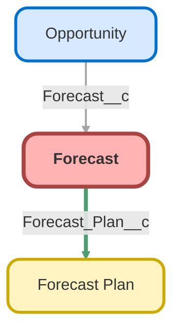

---
hide:
  - path
---

<!-- This file is auto-generated. if you do not want it to be overwritten, set TRUE in the line below -->
<!-- DO_NOT_OVERWRITE_DOC=FALSE -->

## Schema

<!-- Object description -->

## Fields

| Name      | Label | Type | Description |
| :-------- | :---- | :--: | :---------- | 
| Actual_Plan_Sales__c | Actual Plan Sales | Number | Actual plans sold. Sum of opportunities added to this forecast. |
| Actual_Price_Per_Plan__c | Actual Price Per Plan | Currency | undefined |
| Actual_Revenue__c | Actual Revenue | Currency | undefined |
| Actual_v_Forecast_Plans_Sold__c | Actual v Forecast Plans Sold | Percent | undefined |
| Actual_v_Forecast_Revenue__c | Actual v Forecast Revenue | Percent | undefined |
| End_Date__c | End Date | Date | End date of forecast |
| Forecast_Plan__c | Forecast Plan | MasterDetail | Forecast plan that forecast is built from |
| Forecast_Type__c | Forecast Type | Text | Forecast type from master forecast plan |
| Lead_to_Close_Rate__c | Lead-to-Close Rate | Percent | Plans divided by leads |
| Leads__c | Leads | Number | Number of leads expected in timeframe |
| Month__c | Month | Number | Month Forecast |
| Notes__c | Notes | LongTextArea | Notes on this forecast |
| Plan_Sales__c | Plan Sales | Number | # of plans sold in timeframe |
| Price_per_plan__c | Price per plan | Currency | Average price per plan for forecast |
| Product__c | Product | Text | Product from Forecast Plan |
| Revenue__c | Revenue | Currency | Revenue attached to this forecast. |
| Start_Date__c | Start Date | Date | Start date of forecast |
| Status__c | Status | Text | Status from Forecast Plan |

## Related Flows

| Object | Name      | Type | Description |
| :----  | :-------- | :--: | :---------- | 
| 💻 | [Forecast_Autolaunched_Calculate_Actuals](../flows/Forecast_Autolaunched_Calculate_Actuals.md) [🕒](../flows/Forecast_Autolaunched_Calculate_Actuals-history.md) |  Auto Launched Flow | Takes input opp collection or grabs all won opps attached to it (the forecast).  Assigns totals for actual plan sales and actual revenue, then outputs the forecast with its updated values + a "needs update" variable to whatever called it can manage the update in bulk.  Redesigned Sept 2024 |
| Forecast_Plan__c | [Forecast_Plan_After_Trigger_Generate_Forecasts](../flows/Forecast_Plan_After_Trigger_Generate_Forecasts.md) [🕒](../flows/Forecast_Plan_After_Trigger_Generate_Forecasts-history.md) |  Record After Save | <!-- --> |
| Forecast__c | [Forecast_ONE_TIME_SCHEDULED_Sync_Actual_Numbers](../flows/Forecast_ONE_TIME_SCHEDULED_Sync_Actual_Numbers.md) [🕒](../flows/Forecast_ONE_TIME_SCHEDULED_Sync_Actual_Numbers-history.md) |  Scheduled | <!-- --> |
| Forecast__c | [Forecast_ONE_TIME_SCHEDULED_Sync_Actual_Numbers2](../flows/Forecast_ONE_TIME_SCHEDULED_Sync_Actual_Numbers2.md) [🕒](../flows/Forecast_ONE_TIME_SCHEDULED_Sync_Actual_Numbers2-history.md) |  Scheduled | <!-- --> |
| Forecast__c | [Forecast_Scheduled_ONE_TIME_Sync_Actual_Numbers3](../flows/Forecast_Scheduled_ONE_TIME_Sync_Actual_Numbers3.md) [🕒](../flows/Forecast_Scheduled_ONE_TIME_Sync_Actual_Numbers3-history.md) |  Scheduled | :^( |
| Forecast__c | [Forecast_Scheduled_Sync_Actual_Numbers](../flows/Forecast_Scheduled_Sync_Actual_Numbers.md) [🕒](../flows/Forecast_Scheduled_Sync_Actual_Numbers-history.md) |  Scheduled | Grabs won opps attached to forecast, loops through and removes them if they don't belong.  Forecast is recalculated with correct opps.  If there are any bad opps, they're reset at the end.  Redesigned Sept 2024 |
| Opportunity | [Opportunity_After_Trigger_Update_Forecast](../flows/Opportunity_After_Trigger_Update_Forecast.md) [🕒](../flows/Opportunity_After_Trigger_Update_Forecast-history.md) |  Record After Save | If an opp is newly closed won, or the forecast is changed on a closed won opp, this recalculates and updates actual values for any affected forecasts.  Redesigned Sept 2024 |
| Opportunity | [Opportunity_Before_Delete_Update_Forecast](../flows/Opportunity_Before_Delete_Update_Forecast.md) [🕒](../flows/Opportunity_Before_Delete_Update_Forecast-history.md) |  Record Before Delete | <!-- --> |
| Opportunity | [Opportunity_Before_Save_Update_Forecast](../flows/Opportunity_Before_Save_Update_Forecast.md) [🕒](../flows/Opportunity_Before_Save_Update_Forecast-history.md) |  Record Before Save | Assigns or corrects forecast on opportunity.  Needs close date, amount over 0, lead source, and lead source detail.  If any of these are changed or the forecast is null, flow runs.  Will try to match opp with channel with its lead source.  If multiple are found, will further filter using lead source detail.  If multiple are found still, or no matches are found in the first place, reverts to "Unforecasted".  Except for expansion products, which always go to expansion channel.  Expansion products are upgrades, plan amendments, and add-on products (product type field).  Redesigned Sept 2024 |

## Related Profiles

| Profile | User License |
| :----      | :--: | 
| [Admin](../profiles/Admin.md) |  Salesforce |
| [Analytics Cloud Integration User](../profiles/Analytics%20Cloud%20Integration%20User.md) |  Analytics  Cloud  Integration  User |
| [Analytics Cloud Security User](../profiles/Analytics%20Cloud%20Security%20User.md) |  Analytics  Cloud  Integration  User |
| [Anypoint Integration](../profiles/Anypoint%20Integration.md) |  Identity |
| [B2BMA Integration User](../profiles/B2BMA%20Integration%20User.md) |  B2 B M A  Integration  User |
| [Billing User](../profiles/Billing%20User.md) |  Salesforce |
| [Bot Profile](../profiles/Bot%20Profile.md) |  Salesforce |
| [Business Development](../profiles/Business%20Development.md) |  Salesforce |
| [Call Center](../profiles/Call%20Center.md) |  Salesforce |
| [Chatter External User](../profiles/Chatter%20External%20User.md) |  Chatter  External |
| [Chatter Free User](../profiles/Chatter%20Free%20User.md) |  Chatter  Free |
| [Chatter Moderator User](../profiles/Chatter%20Moderator%20User.md) |  Chatter  Free |
| [Client Onboarding - Admin](../profiles/Client%20Onboarding%20-%20Admin.md) |  Salesforce |
| [Client Onboarding - RM](../profiles/Client%20Onboarding%20-%20RM.md) |  Salesforce |
| [Client Servicing Team](../profiles/Client%20Servicing%20Team.md) |  Salesforce |
| [Compliance Manager](../profiles/Compliance%20Manager.md) |  Salesforce |
| [ContractManager](../profiles/ContractManager.md) |  Salesforce |
| [Director of Operations](../profiles/Director%20of%20Operations.md) |  Salesforce |
| [Director of Sales](../profiles/Director%20of%20Sales.md) |  Salesforce |
| [Distributions](../profiles/Distributions.md) |  Salesforce |
| [Einstein Agent User](../profiles/Einstein%20Agent%20User.md) |  Einstein  Agent |
| [ESW_Agentforce_MIAW_1748035300267 Profile](../profiles/ESW_Agentforce_MIAW_1748035300267%20Profile.md) |  Guest  User  License |
| [ESW_Agentforce_MIAW_1748385215843 Profile](../profiles/ESW_Agentforce_MIAW_1748385215843%20Profile.md) |  Guest  User  License |
| [ESW_CE_Chat_1692890394498 Profile](../profiles/ESW_CE_Chat_1692890394498%20Profile.md) |  Guest  User  License |
| [ESW_CE_Chat_Moe_1693182845676 Profile](../profiles/ESW_CE_Chat_Moe_1693182845676%20Profile.md) |  Guest  User  License |
| [ESW_Login_Help_1697133738638 Profile](../profiles/ESW_Login_Help_1697133738638%20Profile.md) |  Guest  User  License |
| [ESW_Login_Help_Simply_1700075140889 Profile](../profiles/ESW_Login_Help_Simply_1700075140889%20Profile.md) |  Guest  User  License |
| [ESW_Omni_Messaging_1694183770479 Profile](../profiles/ESW_Omni_Messaging_1694183770479%20Profile.md) |  Guest  User  License |
| [ESW_Omni_Messaging_CO_1696448547822 Profile](../profiles/ESW_Omni_Messaging_CO_1696448547822%20Profile.md) |  Guest  User  License |
| [ESW_Omni_Messaging_Sallus_1700075448386 Profile](../profiles/ESW_Omni_Messaging_Sallus_1700075448386%20Profile.md) |  Guest  User  License |
| [ESW_Omni_Messaging_Simply_1700076370188 Profile](../profiles/ESW_Omni_Messaging_Simply_1700076370188%20Profile.md) |  Guest  User  License |
| [ESW_QA_Login_1699666348585 Profile](../profiles/ESW_QA_Login_1699666348585%20Profile.md) |  Guest  User  License |
| [ESW_QA_Messaging_1699974036493 Profile](../profiles/ESW_QA_Messaging_1699974036493%20Profile.md) |  Guest  User  License |
| [ESW_Sales_Chat_1697460991337 Profile](../profiles/ESW_Sales_Chat_1697460991337%20Profile.md) |  Guest  User  License |
| [ESW_Sallus_Login_Chat_1700072925200 Profile](../profiles/ESW_Sallus_Login_Chat_1700072925200%20Profile.md) |  Guest  User  License |
| [External Apps Login User](../profiles/External%20Apps%20Login%20User.md) |  External  Apps  Login |
| [Finance Manager Lightning](../profiles/Finance%20Manager%20Lightning.md) |  Salesforce |
| [Guest License User](../profiles/Guest%20License%20User.md) |  Guest  User  License |
| [Help Center Profile](../profiles/Help%20Center%20Profile.md) |  Guest  User  License |
| [Identity User](../profiles/Identity%20User.md) |  Identity |
| [Incoming_SMS Profile](../profiles/Incoming_SMS%20Profile.md) |  Guest  User  License |
| [IT](../profiles/IT.md) |  Salesforce |
| [Leadership Lightning](../profiles/Leadership%20Lightning.md) |  Salesforce |
| [Leadership](../profiles/Leadership.md) |  Salesforce |
| [Learning %26 Development](../profiles/Learning%20%2526%20Development.md) |  Salesforce |
| [Lightning Client Onboarding](../profiles/Lightning%20Client%20Onboarding.md) |  Salesforce |
| [Lightning Compliance](../profiles/Lightning%20Compliance.md) |  Salesforce |
| [Lightning Saver User](../profiles/Lightning%20Saver%20User.md) |  Salesforce |
| [Lightning Service Manager](../profiles/Lightning%20Service%20Manager.md) |  Salesforce |
| [Lightning Service User](../profiles/Lightning%20Service%20User.md) |  Salesforce |
| [Marketing Team](../profiles/Marketing%20Team.md) |  Salesforce |
| [MarketingProfile](../profiles/MarketingProfile.md) |  Salesforce |
| [Master Administrator](../profiles/Master%20Administrator.md) |  Salesforce |
| [Minimum Access - API Only Integrations](../profiles/Minimum%20Access%20-%20API%20Only%20Integrations.md) |  Salesforce  Integration |
| [Minimum Access - Salesforce](../profiles/Minimum%20Access%20-%20Salesforce.md) |  Salesforce |
| [myubiquity Profile](../profiles/myubiquity%20Profile.md) |  Guest  User  License |
| [Operations VP](../profiles/Operations%20VP.md) |  Salesforce |
| [Operations](../profiles/Operations.md) |  Salesforce |
| [Paradigm Help Center Profile](../profiles/Paradigm%20Help%20Center%20Profile.md) |  Guest  User  License |
| [Payroll Koncierge](../profiles/Payroll%20Koncierge.md) |  Salesforce |
| [Payroll Team](../profiles/Payroll%20Team.md) |  Salesforce |
| [People %26 Culture](../profiles/People%20%2526%20Culture.md) |  Salesforce |
| [Pre-chat Site Profile](../profiles/Pre-chat%20Site%20Profile.md) |  Guest  User  License |
| [Product Innovation Leadership](../profiles/Product%20Innovation%20Leadership.md) |  Salesforce |
| [Product Innovation User](../profiles/Product%20Innovation%20User.md) |  Salesforce |
| [PSM Team](../profiles/PSM%20Team.md) |  Salesforce |
| [R%26W](../profiles/R%2526W.md) |  Salesforce |
| [Read Only](../profiles/Read%20Only.md) |  Salesforce |
| [Sales Administrator](../profiles/Sales%20Administrator.md) |  Salesforce |
| [Sales Coordinator](../profiles/Sales%20Coordinator.md) |  Salesforce |
| [Sales Insights Integration User](../profiles/Sales%20Insights%20Integration%20User.md) |  Sales  Insights  Integration  User |
| [Sales Team - Limited](../profiles/Sales%20Team%20-%20Limited.md) |  Salesforce |
| [Sales Team](../profiles/Sales%20Team.md) |  Salesforce |
| [Salesforce API Only System Integrations](../profiles/Salesforce%20API%20Only%20System%20Integrations.md) |  Salesforce  Integration |
| [SalesforceIQ Integration User](../profiles/SalesforceIQ%20Integration%20User.md) |  Salesforce I Q  Integration  User |
| [Saver Manager](../profiles/Saver%20Manager.md) |  Salesforce |
| [Simple Survey Profile](../profiles/Simple%20Survey%20Profile.md) |  Guest  User  License |
| [Simply Help Center Profile](../profiles/Simply%20Help%20Center%20Profile.md) |  Guest  User  License |
| [SolutionManager](../profiles/SolutionManager.md) |  Salesforce |
| [Standard](../profiles/Standard.md) |  Salesforce |
| [StandardAul](../profiles/StandardAul.md) |  Salesforce  Platform |
| [Super System Administrator](../profiles/Super%20System%20Administrator.md) |  Salesforce |
| [Sys Dev Admin](../profiles/Sys%20Dev%20Admin.md) |  Salesforce |
| [Transitions Team](../profiles/Transitions%20Team.md) |  Salesforce |
| [Ubiquity Help Center Profile](../profiles/Ubiquity%20Help%20Center%20Profile.md) |  Guest  User  License |
| [Zoom Webhooks Profile](../profiles/Zoom%20Webhooks%20Profile.md) |  Guest  User  License |

## Related Permission Sets

| Permission Set | User License |
| :----      | :--: | 
| [Attachments_and_Notes_Migrator](../permissionsets/Attachments_and_Notes_Migrator.md) | None |
| [Data_Loader](../permissionsets/Data_Loader.md) | None |
| [Developer](../permissionsets/Developer.md) | None |
| [Forecast_Management](../permissionsets/Forecast_Management.md) | None |
| [MagicMover](../permissionsets/MagicMover.md) | None |
| [Manager](../permissionsets/Manager.md) | None |
| [Master](../permissionsets/Master.md) | None |
| [Modify_All](../permissionsets/Modify_All.md) | None |
| [sfdcInternalInt__sfdc_a360_sfcrm_data_extract](../permissionsets/sfdcInternalInt__sfdc_a360_sfcrm_data_extract.md) | None |
| [sfdcInternalInt__sfdc_articlerecommendations](../permissionsets/sfdcInternalInt__sfdc_articlerecommendations.md) | None |
| [sfdcInternalInt__sfdc_einsteinagent](../permissionsets/sfdcInternalInt__sfdc_einsteinagent.md) | None |
| [sfdcInternalInt__sfdc_replyrecommendations](../permissionsets/sfdcInternalInt__sfdc_replyrecommendations.md) | None |
| [sfdcInternalInt__sfdc_slack](../permissionsets/sfdcInternalInt__sfdc_slack.md) | None |
| [View_All](../permissionsets/View_All.md) | None |

_Documentation generated with [sfdx-hardis](https://sfdx-hardis.cloudity.com), by [Cloudity](https://www.cloudity.com/) & [friends](https://github.com/hardisgroupcom/sfdx-hardis/graphs/contributors)_
