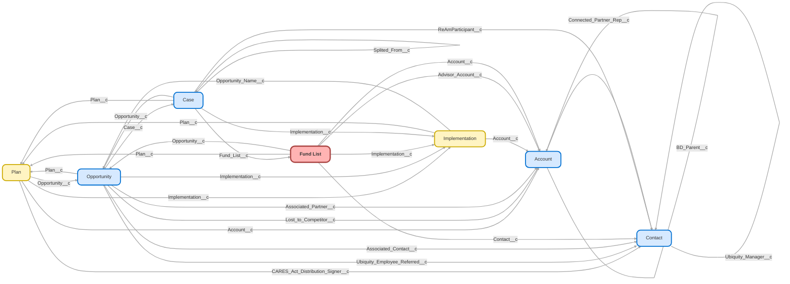

---
hide:
  - path
---

<!-- This file is auto-generated. if you do not want it to be overwritten, set TRUE in the line below -->
<!-- DO_NOT_OVERWRITE_DOC=FALSE -->

## Schema

<!-- Object description -->

## Fields

| Name      | Label | Type | Description |
| :-------- | :---- | :--: | :---------- | 
| Account__c | Account | Lookup | undefined |
| Advisor_Account__c | Advisor Account | Lookup | Advisor Account |
| Advisor_Added_in_Paradigm__c | Advisor Added in Paradigm | Checkbox | Has the advisor been added in Paradigm? Fund list cannot be created until the advisor has been added. |
| Asset_Allocation_Funds__c | Asset Allocation Funds | MultiselectPicklist | undefined |
| Asset_Allocation_Funds_Text__c | Asset Allocation Funds Text | LongTextArea | Used for total fund creation |
| Billing_Notes__c | Billing Notes | LongTextArea | undefined |
| Build_Requested__c | Build Requested | Date | undefined |
| Comments__c | Comments | LongTextArea | undefined |
| Completion_Date__c | Completion Date | Date | undefined |
| Contact__c | Contact | Lookup | Contact, most likely the advisor, that is creating the custom fund list |
| Custodian__c | Custodian | Picklist | undefined |
| Custom_Fund_List_Attached__c | Custom Fund List Attached | Checkbox | undefined |
| Default_Investment__c | Default Investment | Text | undefined |
| Fixed_Income_Taxable_Funds__c | Fixed Income Taxable Funds | MultiselectPicklist | undefined |
| Fixed_Income_Taxable_Funds_Text__c | Fixed Income Taxable Funds Text | LongTextArea | undefined |
| Fund_List_Status__c | Fund List Status | Picklist | Status of fund list |
| Funds_Deleted__c | Funds Deleted | Text | undefined |
| Funds_to_be_Mapped__c | Funds to be Mapped | Text | undefined |
| Implementation__c | Implementation | Lookup | undefined |
| International_Equity_Funds__c | International Equity Funds | MultiselectPicklist | undefined |
| International_Equity_Funds_Text__c | International Equity Funds Text | LongTextArea | undefined |
| List_of_Funds__c | List of Funds | LongTextArea | undefined |
| Money_Market_Funds__c | Money Market Funds | MultiselectPicklist | undefined |
| Money_Market_Funds_Text__c | Money Market Funds Text | LongTextArea | undefined |
| Notes__c | Notes | LongTextArea | Notes on fund list |
| Opportunity__c | Opportunity | Lookup | Opportunity that fund list is tied to. |
| Plan__c | Plan | Lookup | Plan the Fund List is being created for. |
| QDIA_Investment_Strategy__c | QDIA Investment Strategy | Picklist | Used for JPM Target Date Investments |
| QDIA_Schedule__c | QDIA Schedule | LongTextArea | undefined |
| Share_Class__c | Share Class | Picklist | Share class fund is in |
| SmartRetirement_Blend_Funds__c | SmartRetirement Blend Funds | MultiselectPicklist | undefined |
| SmartRetirement_Blend_Funds_Text__c | SmartRetirement Blend Funds Text | LongTextArea | undefined |
| SmartRetirement_Funds__c | SmartRetirement Funds | MultiselectPicklist | undefined |
| SmartRetirement_Funds_Text__c | SmartRetirement Funds Text | LongTextArea | undefined |
| SmartRetirement_Income_Funds__c | SmartRetirement Income Funds | MultiselectPicklist | undefined |
| SmartRetirement_Income_Funds_Text__c | SmartRetirement Income Funds Text | LongTextArea | undefined |
| Team_Member__c | Team Member | Picklist | undefined |
| Total_Fund_List__c | Total Fund List | LongTextArea | All funds from different asset classes combined into one list. |
| Upfront_Fees__c | Upfront Fees | Text | undefined |
| US_Equity_Funds__c | US Equity Funds | MultiselectPicklist | undefined |
| US_Equity_Funds_Text__c | US Equity Funds Text | LongTextArea | undefined |

## Validation Rules

| Rule      | Active | Description | Formula |
| :-------- | :---- | :---------- | :------ |
| Request_Submission_Before_Advisor_Added | Yes |  | AND(ISPICKVAL(Fund_List_Status__c, "Request Submitted"), (Advisor_Added_in_Paradigm__c = False)) |
| Team_Member_Needed | Yes |  | ISPICKVAL(Team_Member__c, "") && ISPICKVAL(Fund_List_Status__c, "Missing Info")  ISPICKVAL(Team_Member__c, "") && ISPICKVAL(Fund_List_Status__c, "Completed") |

## Related Flows

| Object | Name      | Type | Description |
| :----  | :-------- | :--: | :---------- | 
| 💻 | [Create_Junction_After_Conversion](../flows/Create_Junction_After_Conversion.md) [🕒](../flows/Create_Junction_After_Conversion-history.md) |  Auto Launched Flow | Updated to use ac and ap roles from lead on new ac and ap records (rather than defaulting to "referrer" generic values)  Creates Associated Contact Junction if needed when Lead is Converted |
| 💻 | [DocuSign_Recipient_Process_Associate_Key_Records](../flows/DocuSign_Recipient_Process_Associate_Key_Records.md) [🕒](../flows/DocuSign_Recipient_Process_Associate_Key_Records-history.md) |  Auto Launched Flow | <!-- --> |
| 💻 | [Opportunity_Button_Create_OPD](../flows/Opportunity_Button_Create_OPD.md) [🕒](../flows/Opportunity_Button_Create_OPD-history.md) |  Screen Flow | <!-- --> |
| 💻 | [Opportunity_Button_New_OPD_Flow](../flows/Opportunity_Button_New_OPD_Flow.md) [🕒](../flows/Opportunity_Button_New_OPD_Flow-history.md) |  Screen Flow | <!-- --> |
| 💻 | [Opportunity_Closure_Validation](../flows/Opportunity_Closure_Validation.md) [🕒](../flows/Opportunity_Closure_Validation-history.md) |  Screen Flow | <!-- --> |
| 💻 | [Plan_Link_Custom_Fund_List](../flows/Plan_Link_Custom_Fund_List.md) [🕒](../flows/Plan_Link_Custom_Fund_List-history.md) |  Auto Launched Flow | When Plan is created with a Custom Fund List designation, populate the lookup values on the Fund List record originally attached to the Opportunity |
| Fund_List__c | [Fund_List_Custom_List_Confirmation](../flows/Fund_List_Custom_List_Confirmation.md) [🕒](../flows/Fund_List_Custom_List_Confirmation-history.md) |  Workflow | Update fields on Opp for validation when Custom List is created |
| Fund_List__c | [Fund_List_Pre_Population](../flows/Fund_List_Pre_Population.md) [🕒](../flows/Fund_List_Pre_Population-history.md) |  Workflow | Adds target date funs to JPM lists depending on Share Classes |
| Implementation__c | [Implementation_After_Trigger_Imp_Complete_Update_Related_Records](../flows/Implementation_After_Trigger_Imp_Complete_Update_Related_Records.md) [🕒](../flows/Implementation_After_Trigger_Imp_Complete_Update_Related_Records-history.md) |  Record After Save | Migrated from Imp  Stage Updates 6/22. This flow updates related records when imps are marked complete. |
| Implementation__c | [Implementation_Map_Custom_Fund_List](../flows/Implementation_Map_Custom_Fund_List.md) [🕒](../flows/Implementation_Map_Custom_Fund_List-history.md) |  Workflow | If applicable, attach Imp to Custom Fund List Object |
| Implementation__c | [Implementations_Stage_Updates_Workflow_3](../flows/Implementations_Stage_Updates_Workflow_3.md) [🕒](../flows/Implementations_Stage_Updates_Workflow_3-history.md) |  Workflow | added step for complete wo funding. Removed node to create CST Handoff case per Cristina 6/7/23. Removed node to create conversion assets received compliance case, 7/6/23 |
| Opportunity | [Opportunity_After_Trigger_Update_OPD_when_Opp_Updates](../flows/Opportunity_After_Trigger_Update_OPD_when_Opp_Updates.md) [🕒](../flows/Opportunity_After_Trigger_Update_OPD_when_Opp_Updates-history.md) |  Record After Save | <!-- --> |
| Opportunity | [Sales_Opportunity_Won_Next_Steps](../flows/Sales_Opportunity_Won_Next_Steps.md) [🕒](../flows/Sales_Opportunity_Won_Next_Steps-history.md) |  Record After Save | Added validation for partnership opportunities with an associated objective.  Prevents closure with an incomplete objective |
| Proposal__c | [Proposal_After_Trigger_Paradigm_Purchase_Api](../flows/Proposal_After_Trigger_Paradigm_Purchase_Api.md) [🕒](../flows/Proposal_After_Trigger_Paradigm_Purchase_Api-history.md) |  Record Before Save | Removed Auto_Enrollment_Deferral_Escalation_Rate__c references |
| Proposal__c | [Proposal_After_Trigger_Update_Opp_to_Match_OPD](../flows/Proposal_After_Trigger_Update_Opp_to_Match_OPD.md) [🕒](../flows/Proposal_After_Trigger_Update_Opp_to_Match_OPD-history.md) |  Record After Save | <!-- --> |
| dsfs__DocuSign_Recipient_Status__c | [DocuSign_Recipient_After_Trigger_Associate_Key_Records](../flows/DocuSign_Recipient_After_Trigger_Associate_Key_Records.md) [🕒](../flows/DocuSign_Recipient_After_Trigger_Associate_Key_Records-history.md) |  Record After Save | Updated to add error handling to lead conversions + opp closure.  Emails owner of errored record + BI to resolve. |

## Related Apex Classes

| Apex Class | Type |
| :----      | :--: | 
| [PlanTriggerController](../apex/PlanTriggerController.md) | Class |
| [PlanTriggerControllerTest](../apex/PlanTriggerControllerTest.md) | Test |
| [PurchaseAPIController](../apex/PurchaseAPIController.md) | Lightning Controller |
| [PurchaseAPIHandler](../apex/PurchaseAPIHandler.md) | Class |
| [UpdateAccountFieldsFromPlanBatch](../apex/UpdateAccountFieldsFromPlanBatch.md) | Batch |
| [UpdateAccountFieldsFromPlanBatchTest](../apex/UpdateAccountFieldsFromPlanBatchTest.md) | Test |

## Related Lightning Pages

| Lightning Page | Type |
| :----      | :--: | 
| [Default_Opportunity_Layout](../pages/Default_Opportunity_Layout.md) |  Record Page |
| [Dynamic_Account_Page](../pages/Dynamic_Account_Page.md) |  Record Page |
| [Dynamic_Imp_Record_Page](../pages/Dynamic_Imp_Record_Page.md) |  Record Page |
| [Dynamic_Opp_Page](../pages/Dynamic_Opp_Page.md) |  Record Page |
| [Dynamic_Plan_Page](../pages/Dynamic_Plan_Page.md) |  Record Page |
| [Fund_List_Record_Page](../pages/Fund_List_Record_Page.md) |  Record Page |
| [OPD_Page1](../pages/OPD_Page1.md) |  Record Page |
| [Partner_Proposal](../pages/Partner_Proposal.md) |  Record Page |

## Related Profiles

| Profile | User License |
| :----      | :--: | 
| [Admin](../profiles/Admin.md) |  Salesforce |
| [Analytics Cloud Integration User](../profiles/Analytics%20Cloud%20Integration%20User.md) |  Analytics  Cloud  Integration  User |
| [Analytics Cloud Security User](../profiles/Analytics%20Cloud%20Security%20User.md) |  Analytics  Cloud  Integration  User |
| [Anypoint Integration](../profiles/Anypoint%20Integration.md) |  Identity |
| [B2BMA Integration User](../profiles/B2BMA%20Integration%20User.md) |  B2 B M A  Integration  User |
| [Billing User](../profiles/Billing%20User.md) |  Salesforce |
| [Bot Profile](../profiles/Bot%20Profile.md) |  Salesforce |
| [Business Development](../profiles/Business%20Development.md) |  Salesforce |
| [Call Center](../profiles/Call%20Center.md) |  Salesforce |
| [Chatter External User](../profiles/Chatter%20External%20User.md) |  Chatter  External |
| [Chatter Free User](../profiles/Chatter%20Free%20User.md) |  Chatter  Free |
| [Chatter Moderator User](../profiles/Chatter%20Moderator%20User.md) |  Chatter  Free |
| [Client Onboarding - Admin](../profiles/Client%20Onboarding%20-%20Admin.md) |  Salesforce |
| [Client Onboarding - RM](../profiles/Client%20Onboarding%20-%20RM.md) |  Salesforce |
| [Client Servicing Team](../profiles/Client%20Servicing%20Team.md) |  Salesforce |
| [Compliance Manager](../profiles/Compliance%20Manager.md) |  Salesforce |
| [ContractManager](../profiles/ContractManager.md) |  Salesforce |
| [Director of Operations](../profiles/Director%20of%20Operations.md) |  Salesforce |
| [Director of Sales](../profiles/Director%20of%20Sales.md) |  Salesforce |
| [Distributions](../profiles/Distributions.md) |  Salesforce |
| [Einstein Agent User](../profiles/Einstein%20Agent%20User.md) |  Einstein  Agent |
| [ESW_Agentforce_MIAW_1748035300267 Profile](../profiles/ESW_Agentforce_MIAW_1748035300267%20Profile.md) |  Guest  User  License |
| [ESW_Agentforce_MIAW_1748385215843 Profile](../profiles/ESW_Agentforce_MIAW_1748385215843%20Profile.md) |  Guest  User  License |
| [ESW_CE_Chat_1692890394498 Profile](../profiles/ESW_CE_Chat_1692890394498%20Profile.md) |  Guest  User  License |
| [ESW_CE_Chat_Moe_1693182845676 Profile](../profiles/ESW_CE_Chat_Moe_1693182845676%20Profile.md) |  Guest  User  License |
| [ESW_Login_Help_1697133738638 Profile](../profiles/ESW_Login_Help_1697133738638%20Profile.md) |  Guest  User  License |
| [ESW_Login_Help_Simply_1700075140889 Profile](../profiles/ESW_Login_Help_Simply_1700075140889%20Profile.md) |  Guest  User  License |
| [ESW_Omni_Messaging_1694183770479 Profile](../profiles/ESW_Omni_Messaging_1694183770479%20Profile.md) |  Guest  User  License |
| [ESW_Omni_Messaging_CO_1696448547822 Profile](../profiles/ESW_Omni_Messaging_CO_1696448547822%20Profile.md) |  Guest  User  License |
| [ESW_Omni_Messaging_Sallus_1700075448386 Profile](../profiles/ESW_Omni_Messaging_Sallus_1700075448386%20Profile.md) |  Guest  User  License |
| [ESW_Omni_Messaging_Simply_1700076370188 Profile](../profiles/ESW_Omni_Messaging_Simply_1700076370188%20Profile.md) |  Guest  User  License |
| [ESW_QA_Login_1699666348585 Profile](../profiles/ESW_QA_Login_1699666348585%20Profile.md) |  Guest  User  License |
| [ESW_QA_Messaging_1699974036493 Profile](../profiles/ESW_QA_Messaging_1699974036493%20Profile.md) |  Guest  User  License |
| [ESW_Sales_Chat_1697460991337 Profile](../profiles/ESW_Sales_Chat_1697460991337%20Profile.md) |  Guest  User  License |
| [ESW_Sallus_Login_Chat_1700072925200 Profile](../profiles/ESW_Sallus_Login_Chat_1700072925200%20Profile.md) |  Guest  User  License |
| [External Apps Login User](../profiles/External%20Apps%20Login%20User.md) |  External  Apps  Login |
| [Finance Manager Lightning](../profiles/Finance%20Manager%20Lightning.md) |  Salesforce |
| [Guest License User](../profiles/Guest%20License%20User.md) |  Guest  User  License |
| [Help Center Profile](../profiles/Help%20Center%20Profile.md) |  Guest  User  License |
| [Identity User](../profiles/Identity%20User.md) |  Identity |
| [Incoming_SMS Profile](../profiles/Incoming_SMS%20Profile.md) |  Guest  User  License |
| [IT](../profiles/IT.md) |  Salesforce |
| [Leadership Lightning](../profiles/Leadership%20Lightning.md) |  Salesforce |
| [Leadership](../profiles/Leadership.md) |  Salesforce |
| [Learning %26 Development](../profiles/Learning%20%2526%20Development.md) |  Salesforce |
| [Lightning Client Onboarding](../profiles/Lightning%20Client%20Onboarding.md) |  Salesforce |
| [Lightning Compliance](../profiles/Lightning%20Compliance.md) |  Salesforce |
| [Lightning Saver User](../profiles/Lightning%20Saver%20User.md) |  Salesforce |
| [Lightning Service Manager](../profiles/Lightning%20Service%20Manager.md) |  Salesforce |
| [Lightning Service User](../profiles/Lightning%20Service%20User.md) |  Salesforce |
| [Marketing Team](../profiles/Marketing%20Team.md) |  Salesforce |
| [MarketingProfile](../profiles/MarketingProfile.md) |  Salesforce |
| [Master Administrator](../profiles/Master%20Administrator.md) |  Salesforce |
| [Minimum Access - API Only Integrations](../profiles/Minimum%20Access%20-%20API%20Only%20Integrations.md) |  Salesforce  Integration |
| [Minimum Access - Salesforce](../profiles/Minimum%20Access%20-%20Salesforce.md) |  Salesforce |
| [myubiquity Profile](../profiles/myubiquity%20Profile.md) |  Guest  User  License |
| [Operations VP](../profiles/Operations%20VP.md) |  Salesforce |
| [Operations](../profiles/Operations.md) |  Salesforce |
| [Paradigm Help Center Profile](../profiles/Paradigm%20Help%20Center%20Profile.md) |  Guest  User  License |
| [Payroll Koncierge](../profiles/Payroll%20Koncierge.md) |  Salesforce |
| [Payroll Team](../profiles/Payroll%20Team.md) |  Salesforce |
| [People %26 Culture](../profiles/People%20%2526%20Culture.md) |  Salesforce |
| [Pre-chat Site Profile](../profiles/Pre-chat%20Site%20Profile.md) |  Guest  User  License |
| [Product Innovation Leadership](../profiles/Product%20Innovation%20Leadership.md) |  Salesforce |
| [Product Innovation User](../profiles/Product%20Innovation%20User.md) |  Salesforce |
| [PSM Team](../profiles/PSM%20Team.md) |  Salesforce |
| [R%26W](../profiles/R%2526W.md) |  Salesforce |
| [Read Only](../profiles/Read%20Only.md) |  Salesforce |
| [Sales Administrator](../profiles/Sales%20Administrator.md) |  Salesforce |
| [Sales Coordinator](../profiles/Sales%20Coordinator.md) |  Salesforce |
| [Sales Insights Integration User](../profiles/Sales%20Insights%20Integration%20User.md) |  Sales  Insights  Integration  User |
| [Sales Team - Limited](../profiles/Sales%20Team%20-%20Limited.md) |  Salesforce |
| [Sales Team](../profiles/Sales%20Team.md) |  Salesforce |
| [Salesforce API Only System Integrations](../profiles/Salesforce%20API%20Only%20System%20Integrations.md) |  Salesforce  Integration |
| [SalesforceIQ Integration User](../profiles/SalesforceIQ%20Integration%20User.md) |  Salesforce I Q  Integration  User |
| [Saver Manager](../profiles/Saver%20Manager.md) |  Salesforce |
| [Simple Survey Profile](../profiles/Simple%20Survey%20Profile.md) |  Guest  User  License |
| [Simply Help Center Profile](../profiles/Simply%20Help%20Center%20Profile.md) |  Guest  User  License |
| [SolutionManager](../profiles/SolutionManager.md) |  Salesforce |
| [Standard](../profiles/Standard.md) |  Salesforce |
| [StandardAul](../profiles/StandardAul.md) |  Salesforce  Platform |
| [Super System Administrator](../profiles/Super%20System%20Administrator.md) |  Salesforce |
| [Sys Dev Admin](../profiles/Sys%20Dev%20Admin.md) |  Salesforce |
| [Transitions Team](../profiles/Transitions%20Team.md) |  Salesforce |
| [Ubiquity Help Center Profile](../profiles/Ubiquity%20Help%20Center%20Profile.md) |  Guest  User  License |
| [Zoom Webhooks Profile](../profiles/Zoom%20Webhooks%20Profile.md) |  Guest  User  License |

## Related Permission Sets

| Permission Set | User License |
| :----      | :--: | 
| [Attachments_and_Notes_Migrator](../permissionsets/Attachments_and_Notes_Migrator.md) | None |
| [Automation_Team_Imp_Project_Tasks](../permissionsets/Automation_Team_Imp_Project_Tasks.md) | None |
| [Data_Loader](../permissionsets/Data_Loader.md) | None |
| [Developer](../permissionsets/Developer.md) | None |
| [Ephibian_API_Access](../permissionsets/Ephibian_API_Access.md) | None |
| [MagicMover](../permissionsets/MagicMover.md) | None |
| [Manager](../permissionsets/Manager.md) | None |
| [Master](../permissionsets/Master.md) | None |
| [Modify_All](../permissionsets/Modify_All.md) | None |
| [Purchase_Api](../permissionsets/Purchase_Api.md) | None |
| [sfdcInternalInt__sfdc_a360_sfcrm_data_extract](../permissionsets/sfdcInternalInt__sfdc_a360_sfcrm_data_extract.md) | None |
| [sfdcInternalInt__sfdc_articlerecommendations](../permissionsets/sfdcInternalInt__sfdc_articlerecommendations.md) | None |
| [sfdcInternalInt__sfdc_einsteinagent](../permissionsets/sfdcInternalInt__sfdc_einsteinagent.md) | None |
| [sfdcInternalInt__sfdc_replyrecommendations](../permissionsets/sfdcInternalInt__sfdc_replyrecommendations.md) | None |
| [sfdcInternalInt__sfdc_slack](../permissionsets/sfdcInternalInt__sfdc_slack.md) | None |
| [Simply_Retirement_Min_Access](../permissionsets/Simply_Retirement_Min_Access.md) | None |
| [Ubiquity_Service_Agent_Permissions](../permissionsets/Ubiquity_Service_Agent_Permissions.md) | None |
| [View_All](../permissionsets/View_All.md) | None |

_Documentation generated with [sfdx-hardis](https://sfdx-hardis.cloudity.com), by [Cloudity](https://www.cloudity.com/) & [friends](https://github.com/hardisgroupcom/sfdx-hardis/graphs/contributors)_
