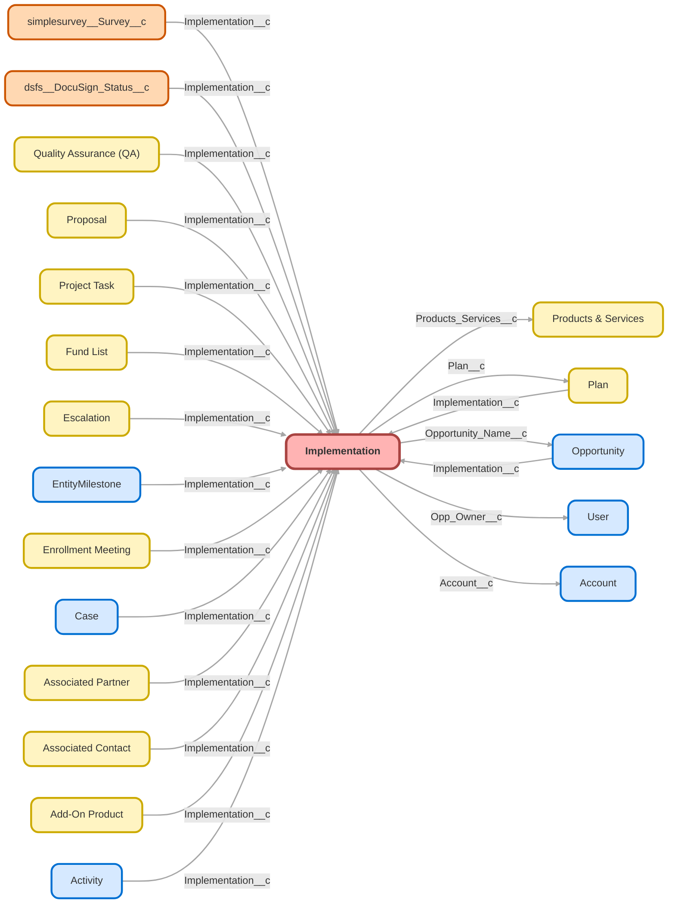

---
hide:
  - path
---

<!-- This file is auto-generated. if you do not want it to be overwritten, set TRUE in the line below -->
<!-- DO_NOT_OVERWRITE_DOC=FALSE -->

## Schema

<!-- Object description -->

## Fields

| Name      | Label | Type | Description |
| :-------- | :---- | :--: | :---------- | 
| Account__c | Account | Lookup | Account Associated with Implementation |
| Account_Application_Sent_to_Custodian__c | Account Application Sent to Custodian | Date | Date account application is sent to custodian. |
| ACH_Application__c | ACH Application | Checkbox | Check when ACH Application is complete |
| Activated_in_PRKS__c | Activated in PRKS | Date | Stamped when Activate in PRKS project task is marked complete on imp. |
| Actual_Plan_Release_Date__c | Actual Plan Release Date | Date | Date the client actively resumes the Implementation after placing it on hold |
| Add_2_Employees__c | Add 2 Employees | Checkbox | Show client how to add 2 or more employees to the plan |
| Adoption_Agreement__c | Adoption Agreement | Checkbox | Is Adoption Agreement signed? |
| Advisor_Fees_Paid_from_ESA__c | Advisor Fees Paid from ESA | Picklist | Will advisor fees be paid from ERISA Spend Account? |
| Agreement_for_Services__c | Agreement for Services | Checkbox | undefined |
| Agreement_Received__c | Agreement Received | Date | undefined |
| Assets_Expected__c | Assets Expected | Date | Date assets are expected to be received. |
| Assets_Received__c | Assets Received | Date | undefined |
| Assist_with_Payroll_Submission__c | Assist with Payroll Submission | Checkbox | If client is ready to fund, allow then to walk through a first funding (client shares screen) |
| Assisted_Connection_Message__c | Assisted Connection Message | Text | undefined |
| Assisted_Connection_Status__c | Assisted Connection Status | Picklist | undefined |
| At_Risk__c | At Risk | Checkbox | If it has been 14 days since the census call and the client hasn't completed census or if it has been 14 days since the funding call was completed but the Imp isn't completed, the Imp is "At Risk" |
| Auto_Enroll_Escalation_Type__c | Auto-Enroll Escalation Type | Picklist | What Type of Escalation does the auto-enrollment provision have? |
| Auto_Enrollment__c | Auto-Enrollment | Picklist | Will the plan be utilizing Auto-Enrollment, and if so what type? |
| Auto_Enrollment_Deferral_Escalation_Rate__c | Auto-Enrollment Deferral/Escalation Rate | Picklist | undefined |
| Auto_Pay_Provider_is_Finch__c | Auto Pay Provider is Finch | Picklist | undefined |
| Basis_Roth_Start_Date_Info__c | Basis & Roth Start Date Info | Picklist | Required only if plan has ROTH |
| Billing_City__c | Billing City | Text | undefined |
| Billing_State__c | Billing State | Text | undefined |
| Billing_Street__c | Billing Street | Text | undefined |
| Billing_Subscription_Start_Date__c | Billing Subscription Start Date | Date | The later of "Ubiquity Plan Effective Date" or "Activated in PRKS" (stamped when project task is completed) |
| Billing_Zip_Code__c | Billing Zip Code | Text | undefined |
| Blackout_End_Date__c | Blackout End Date | Date | undefined |
| Blackout_Extension_Date__c | Blackout Extension Date | Date | Date of most recent Blackout Extension |
| Blackout_Extension_Reason__c | Blackout Extension Reason | MultiselectPicklist | Reason(s) the blackout has been extended |
| Blackout_Extension_Reason_Detail__c | Blackout Extension Reason Detail | TextArea | Details/Other Reason the Blackout was Extended |
| Blackout_Notice_to_Client__c | Blackout Notice to Client | Date | Blackout notice emailed to client to distribute to participants |
| Blackout_Notice_URL__c | Blackout Notice URL | Url | undefined |
| Blackout_Start_Date__c | Blackout Start Date | Date | undefined |
| Bonding__c | Bonding | Checkbox | Remind client that a bond is needed to protect plan assets and to find a sign up link on the implementation overview page |
| Brand__c | Brand | Picklist | Used to drive Branding on client facing status site. |
| Brokerage_Accounts_PCRA__c | Brokerage Accounts | Picklist | Will plan allow for brokerage accounts? |
| Business_Entity__c | Business Entity | Picklist | Entered on Account |
| Business_Entity_PRKS__c | Business Entity PRKS | Text | Business Entity listed on Account record. If this needs to be updated, change it on the Account. |
| Business_Unit__c | Business Unit | Picklist | undefined |
| Calendly_Census_Review__c | Calendly Census Review | Date | Date of Census Review Call Past = had call Today = call is today Future = call scheduled for future date |
| Calendly_Document_Review__c | Calendly Document Review | Date | Date of Document Review Call Past = had call Today = call is today Future = call scheduled for future date |
| Calendly_Intro_Plan_Design__c | Calendly Intro/Plan Design | Date | Date of Intro/Plan Design Call Past = had call Today = call is today Future = call scheduled for future date |
| Calendly_Payroll_Review__c | Calendly Payroll Review | Date | Date of Payroll Review Call Past = had call Today = call is today Future = call scheduled for future date |
| Census_and_Eligibility_Uploaded__c | Census and Eligibility Uploaded | Date | Date which plan census and eligibility is uploaded. |
| Census_and_Payroll_Instructions_Sent__c | Census and Payroll Instructions Sent | Date | Instructions for uploading census and 1st payroll sent to client |
| Census_Call__c | Census Call | Checkbox | Has Census Call been completed? |
| Census_Call_Complete__c | Census Call Complete | Checkbox | undefined |
| Census_Call_Date_Time__c | Census Call Date/Time | DateTime | Date and time the Census Call is scheduled? |
| Census_Call_Method__c | Census Call Method | Picklist | Call technology for census call |
| Census_Complete__c | Census Complete % | Percent | Calculated to determine if census complete. |
| Census_Instructions_Sent__c | Census Instructions Sent | Date | Date census instructions were sent |
| Census_Process_Overview__c | Census Process Overview | Checkbox | Discuss census and demo adding employee  - mention welcome emails 30 days prior to plan entry |
| Census_Self_Service__c | Self-Service | Checkbox | Check for client to pilot Self-Service Videos |
| Census_Tutorial_Complete__c | Census Tutorial Complete | Checkbox | Checked when client completes self-service census tutorial on plan overview page. |
| Chat_Test__c | Chat Test | Checkbox | For testing imp chat button |
| Client_Aware_to_Start_Deducting_Payroll__c | Client Aware to Start Deducting Payroll | Checkbox | undefined |
| Complete_without_funding__c | Complete without funding | Checkbox | sets off automation to complete imp without funding - end of approval process |
| Confirm_Success_of_Payroll_Submission__c | Confirm Success of Payroll Submission | Checkbox | Check payroll submission on Paradigm to ensure accuracy |
| Connected_Partner__c | Connected Partner | Text | Partner with shared SLAs - Set on Account |
| Conv_Billing_Subscription_Start_Date__c | Conv Billing Subscription Start Date | Date | If Liquidation Date is between 1st and 15th of the Month, Billing Start is 1st of that month If Liquidation Date is between 16th and end of month, Billing Start is 1st of the following month |
| Conversion_Assets__c | Conversion Assets | Currency | Total amount of conversion assets. |
| Conversion_Assets_Posted__c | Conversion Assets Posted | Date | Date Conversion Assets are Posted. |
| Conversion_Assets_Settled__c | Conversion Assets Settled | Date | Date conversion assets settled to participant accounts |
| Conversion_Records_Received__c | Conversion Records Received | Date | Conversion records received - pending review to ensure complete data received |
| Conversion_Type__c | Conversion Type | Picklist | What type of plan will the prospect be converting from? This effects how the plan is implemented. |
| Copy_Advisor__c | Copy Advisor | Checkbox | undefined |
| Copy_TPA__c | Copy TPA | Checkbox | undefined |
| Count_of_Employees_Census__c | Count of Employees (Census) | Number | Count of Employees (Census) from PRKS upload |
| Credential_Connection_Status__c | Credential Connection Status | Picklist | undefined |
| Credentialed_Advisor__c | Credentialed Advisor | Checkbox | undefined |
| CST_Client_Support_Team__c | CST (Client Support Team) | Picklist | CST associated with this Implementations |
| Custodial_Account_Number_Received__c | Custodial Account Number Received | Date | Date when Custodial account ID is received back from the Custodian. |
| Custodial_Account_Setup__c | Custodial Account Setup | Checkbox | Check when custodial account application is complete and Custodial account ID is populated (07C for Matrix) |
| Custodial_Agreement__c | Custodial Agreement | Checkbox | Has Custodial Agreement been Signed? |
| Custodian__c | Custodian | Picklist | undefined |
| Custodian_Account_ID__c | Custodian Account ID | TextArea | undefined |
| Custom_Fund_List_Completed__c | Custom Fund List Completed | Checkbox | undefined |
| Dashboard_Overview_Tutorial_Complete__c | Dashboard Overview Tutorial Complete | Checkbox | Checked from Overview page when client completes dashboard overview tutorial video. |
| Days_Since_Outbound_Activity__c | Days Since Outbound Activity | Number | Days since last case outbound activity date |
| Days_to_End_of_Plan_Hold__c | Days to End of Plan Hold | Number | Number of days until end of plan hold.   Used to trigger reminder to Implementation Owner. |
| Deferral_Change_Frequency__c | Deferral Change Frequency | Picklist | How often can employees change their deferrals in the plan? |
| Deferral_Loan_Push_Method__c | Deferral / Loan Push Method | Picklist | Method used to input requested deferral $/% and/or loan payments into client/provider payroll system |
| Demo_Adding_an_Employee__c | Demo Adding an Employee | Checkbox | undefined |
| Design_Provisions__c | Design & Provisions | Checkbox | Discuss selected plan provisions and product and ensure client understands |
| Desired_Plan_Start_Date__c | Desired Plan Start Date | Date | What date does the plan wish to start? |
| Discretionary_Match__c | Discretionary Match | Picklist | undefined |
| Discretionary_Match_Formula_Notes__c | Discretionary Match Formula/Notes | TextArea | undefined |
| Discretionary_Match_Vesting_Schedule__c | Discretionary Match Vesting Schedule | Picklist | What is the vesting schedule for Discretionary Match Contributions? |
| Discuss_Census__c | Discuss Ongoing Census Duties | Checkbox | Remind client to add termination dates for departed employees |
| Discuss_Kotapay__c | Discuss Kotapay | Checkbox | undefined |
| Discussed_Integration__c | Discussed Integration | Checkbox | If client will use integration, explain how census will be handled through direct communication with the PR provider |
| Doc_Regen_Reason_s__c | Doc Regen Reason(s) | Picklist | Reason(s) documents were regenerated |
| Document_Correction__c | Document Correction | Date | undefined |
| Document_Pre_Approval_Completed__c | Document Pre Approval Completed | Checkbox | Copied from Opportunity at time of Sale.   Conversion Plans only. |
| EE_Pretax_Benefit_Status__c | EE Pretax Benefit Status | Picklist | undefined |
| EE_Roth_Benefit_Status__c | EE Roth Benefit Status | Picklist | undefined |
| EIN__c | EIN | Text | EIN External ID from Account |
| Eligibility_Age__c | Eligibility Age | Picklist | What is the age participants are eligible for the plan? |
| Eligible_for_Testing__c | Eligible for Testing | Checkbox | undefined |
| Email_Recipients__c | Email Recipients | LongTextArea | undefined |
| Employee_Monthly_Fees__c | Employee Monthly Fees | Currency | Amount employees will pay monthly. |
| Employer_Identification_Number__c | Employer Identification Number (EIN) | TextArea | undefined |
| Employer_Identification_Number_New__c | Employer Identification Number | Text | undefined |
| Escalated__c | Escalated | Checkbox | undefined |
| Escalated_Notes__c | Escalated Notes | LongTextArea | undefined |
| Escalated1__c | Escalated | Checkbox | Flags Implementation as Escalated |
| Estimated_Plan_Release_Date__c | Estimated Plan Release Date | Date | When a plan is placed "On Hold", enter the date the client expects to start it back up |
| Expected_1st_Payroll__c | Expected 1st Payroll | Date | Expected date of 1st payroll submission |
| Fidelity_Bond_Application__c | Fidelity Bond Application | Checkbox | Check when Fidelity Bond Application is received. Auto Check for Simply. |
| Fidelity_Bond_Discussed__c | Fidelity Bond Discussed | Date | Date Fidelity bond email was sent to client |
| Fidelity_Bond_Received__c | Fidelity Bond Received | Date | Date Fidelity Bond was received from the client. |
| Final_Handoff_to_CST__c | Final Handoff to CST | Date | Final email from Payroll (K)oncierge to Client Support after Implementation is Complete |
| Final_Reporting_Received__c | Final Reporting Received | Date | All Required data received to post the conversion |
| Final_Reporting_Uploaded__c | Final Reporting Uploaded | Checkbox | undefined |
| Finch_Credential_Status__c | Finch Credential Status | Text | undefined |
| Finch_Disabled__c | Finch Disabled | Checkbox | Use this box to mark a plan that is no longer using Finch |
| Finch_Implementation__c | Finch Implementation | Checkbox | undefined |
| Finch_Opt_Out__c | Finch Opt Out | Picklist | undefined |
| Finch_Payroll_Provider__c | Finch Payroll Provider | Text | undefined |
| Finch_T_C__c | Finch T&C | Date | undefined |
| First_Enrollment_Meeting__c | First Enrollment Meeting | Date | Populated when enrollment meeting is conducted. |
| Fiscal_Yr_End_MMDD__c | Fiscal Yr End (MMDD) | Text | MMDD Format |
| Following_Year_Amendment__c | Following Year Amendment | Checkbox | Indicates if plan provisions will change as of the following year |
| Following_Year_Amendment_Notes__c | Following Year Amendment Notes | LongTextArea | Additional details regarding following year amendment |
| Fund_List__c | Fund List | Picklist | undefined |
| Funding_Account_Confirmed__c | Funding Account Confirmed | Date | Date funding account information in Paradigm was verified as complete |
| Funding_Call__c | Funding Call | Checkbox | Has Funding Call been completed |
| Funding_Call_Complete__c | Funding Call Complete | Checkbox | undefined |
| Funding_Call_Date_Time__c | Funding Call Date/Time | DateTime | Date and time the Funding Call is scheduled |
| Funding_Call_Method__c | Funding Call Method | Picklist | Call technology for funding call |
| Funding_Payroll__c | Funding & Payroll | Checkbox | Verify Provider/Schedule + Note. (Ask if they want/need integration/EPS) |
| GIACT_results__c | GIACT results | Picklist | Confirm if GIACT review resulted in Pass or Fail |
| Grandfather_Date__c | Grandfather Date | Date | Employees hired before this date are grandfathered into the plan. |
| Hardship_Distrobutions__c | Hardship Distributions | Picklist | Are hardship distributions allowed on this plan? |
| Imp_Owner_Intro_Call_Link__c | Imp Owner Intro Call Link | Text | undefined |
| Imp_Owner_Name__c | Imp Owner Name | Text | undefined |
| Implementation_Age__c | Implementation Age | Number | undefined |
| Implementation_Completion_Date__c | Implementation Completion Date | Date | undefined |
| Implementation_Dashboard__c | Implementation Dashboard | Text | Hyperlink to Implementation Dashboard |
| Implementation_Dashboard_Link__c | Implementation Dashboard Link | Text | Link to Implementations Client dashboard |
| Implementation_ID_18_Char__c | Implementation ID (18 Char) | Text | undefined |
| Implementation_Notes__c | Implementation Notes | LongTextArea | undefined |
| Implementation_QA_Check__c | Implementation QA Check | Date | Date Implementations completes QA check of Implementation steps up through Census Uploaded |
| Implementation_Stage__c | Implementation Stage | Picklist | Various Stages of the Implementation process |
| Implementation_Started__c | Implementation Started | Checkbox | Used for Data analytics to track all Imps Started |
| Implementation_Status__c | Implementation Status | Picklist | Implementation lets stakeholders quickly know the status of the implementation. |
| Implementation_Steps__c | Implementation Steps | Picklist | Client facing imps steps for email and webpage |
| In_Blackout__c | In Blackout | Checkbox | Hidden field - checkbox formula used to trigger "Implementation Scheduled In Blackout flow |
| Initial_Deferral_Rate__c | Initial Deferral Rate | Picklist | Initial deferral rate for auto enroll |
| Interested_After_Aborting_Finch_Cred__c | Interested After Aborting Finch Cred | Picklist | undefined |
| Intro_Call_Complete__c | Intro Call Complete | Checkbox | undefined |
| Intro_Call_First_Scheduled__c | Intro Call First Scheduled | DateTime | undefined |
| Intro_Call_Method__c | Intro Call Method | Picklist | Call technology for intro call |
| Intro_to_K_oncierge__c | Intro to (K)oncierge | Date | Intro from Implementation to Payroll (K)oncierge on Conversion Plans |
| Intro_to_Koncierge_CST__c | Intro to (K)oncierge & CST | Date | Date Implementations sends the Into emails to Payroll (K)oncierge and Client Support team.  Sent after Census is Uploaded. |
| Introductory_Call__c | Introductory Call | Checkbox | Has Introductory Call been completed |
| Introductory_Call_Date_Time__c | Introductory Call Date/Time | DateTime | Date and time the Introductory Call is scheduled |
| Koncierge_Initial_Call__c | (K)oncierge Initial Call | Date | Date of initial call with payroll (K)oncierge |
| Koncierge_Initial_Call_Scheduled__c | (K)oncierge Initial Call Scheduled | Date | Date initial Payroll (K)oncierge call is scheduled for |
| Koncierge_QA_Check__c | (K)oncierge QA Check | Date | QA check by Payroll (K)oncierge after Census upload to end of Implementation |
| Koncierge_Survey_Calendly_Email__c | (K)oncierge Survey Calendly Email | Date | Date Payroll (K)oncierge sent welcome email with survey & calendly links |
| Koncierge_Training_Call__c | (K)oncierge Training Call | Date | Call with client to upload 1st payroll |
| Koncierge_Training_Call_Scheduled__c | (K)oncierge Training Call Scheduled | Date | Date the Payroll (K)oncierge Training Call is scheduled to take place |
| Kotapay_Client_Signed__c | Kotapay Client Signed | Date | Client signed – awaiting UBQT Countersign |
| Kotapay_Complete__c | Kotapay Complete | Date | All parties signed and doc saved |
| Kotapay_Doc_Created__c | Kotapay Doc Created | Date | Document created and sent to client for signature |
| Kotapay_Survey_Completed__c | Kotapay Survey Completed | Date | Date client submitted a Kotapay Survey.   May be a partial/incomplete survey - review survey status to verify. |
| Kotapay_UBQT_Signed__c | Kotapay UBQT Signed | Date | UBQT Countersign complete and sent to Kotapay |
| Last_Case_Activity_Date__c | Last Case Activity Date | Date | Date of last activity on a Case related to this Implementation |
| Last_Case_Inbound_Activity__c | Last Case Inbound Activity | Date | Date of last activity inbound to UBQT team on a case related to this Plan |
| Last_Case_Modified_Date__c | Last Case Modified Date | Date | Latest date any case linked to the implementation was modified - Any data point in the case is changed. |
| Last_Case_Outbound_Activity__c | Last Case Outbound Activity | Date | Date of last outbound activity on a case related to this Plan |
| Liquidation_Date__c | Liquidation Date | Date | Date of assets liquidation - for SoloK Conversions, enter Assets Received date. |
| Liquidation_Date_Confirmed__c | Liquidation Date Confirmed | Date | Date Provider confirmed liquidation date |
| Live_Enrollment_Meeting__c | Live Enrollment Meeting? | Picklist | Does the client want a live enrollment meeting? |
| Loan_Amortization_Schedules__c | Loan Amortization Schedules | Picklist | Loan schedules from prior provider (if applicable) check when it's been verified not needed OR received |
| Loan_Benefit_Status__c | Loan Benefit Status | Picklist | undefined |
| Loan_Policy__c | Loan Policy | Checkbox | Has Loan Policy been signed? |
| Loans__c | Loans | Picklist | Does the prospect want to allow loans on the 401(k) plan? |
| LOI_link_in_Box__c | LOI link in Box | Url | Enter box link for LOI |
| LOI_Required__c | LOI Required | Picklist | Verify if LOI is required for following year plan amendment |
| Marked_As_Dead__c | Marked As Dead | Date | Date Plan is Marked as Dead in Paradigm |
| Matrix_07C_Account__c | Matrix 07C Account # | Text | Matrix 07C Account Number |
| Matrix_Countersign_Date__c | Matrix Countersign Date | Date | Date Matrix countersigns an Agreement |
| Maximum_Deferral_Rate__c | Maximum Deferral Rate | Picklist | Maximum auto enrollment deferral rate |
| Month_Custodial_Acct_Num_Received__c | Month Custodial Acct Num Received | Date | Hidden field to get first day of the month the Custodial Account Number was received |
| No_Start_Date__c | No-Start Date | Date | Date Plan No-Starts. |
| No_Start_Notes__c | No-Start Notes | LongTextArea | Notes related to No-Start |
| No_Start_Reason__c | No-Start Reason | Picklist | Reason Plan is marked as a No-Start |
| Number_of_Employees__c | Number of Employees | Number | undefined |
| Number_of_Employees_From_Account__c | Number of Employees | Number | Make updates on account record. |
| Oauth_Connection_Status__c | Oauth Connection Status | Picklist | undefined |
| Offered_Finch__c | Offered Finch | Checkbox | undefined |
| One_Time_Send__c | One Time Send | Checkbox | undefined |
| OPD_PRR_Completed__c | OPD/PRR Completed | Date | Date client has answered all questions to complete the plan Document |
| OPD_PRR_Requested__c | OPD/PRR Requested | Date | Date Ubiquity sends the PRR email to the client |
| OPD_PRR_Scheduled__c | OPD/PRR Scheduled | Date | Date OPD or PRR is first scheduled |
| Opp_Owner__c | Opp Owner | Lookup | undefined |
| Opportunity_Name__c | Opportunity | Lookup | Opportunity associated with Implementation |
| Opportunity_Notes__c | Opportunity Notes | LongTextArea | Notes from Opportunity page |
| Opportunity_Owner__c | Opportunity Owner | Text | Who sold this plan? |
| Outstanding_Items__c | Outstanding Items | Text | Looks for critical outstanding items during initial phases of implementation |
| Paradigm_Company_ID__c | Paradigm Company ID | Text | Paradigm Company ID |
| Paradigm_Company_Link__c | Paradigm Company Link | Text | Copying Paradigm Company URL from Plan record |
| Paradigm_Payroll__c | Paradigm Payroll | Text | undefined |
| Paradigm_Plan_ID__c | Paradigm Plan ID | Text | Enter Paradigm Plan ID to auto fill Paradigm Plan URL link on both Implementation and Plan |
| Paradigm_Plan_Link__c | Paradigm Plan Link | Text | Complete Paradigm Plan ID field and this will auto update |
| Participant_Fees_Paid_from_ESA__c | Participant Fees Paid from ESA | Picklist | Will participant fees be paid from ERISA Spend Account? |
| Participant_Statements_By_Source__c | Participant Statements By Source | Checkbox | Statements received from prior provider |
| Partner__c | Partner | Text | Clients with shared SLAs will appear here. |
| Payment_Information__c | Payment Information | Checkbox | undefined |
| Payroll_Contribution_Method__c | Payroll Contribution Method | Picklist | What type of contribution method will be used to submit payroll? |
| Payroll_Instructions_Sent__c | Payroll Instructions Sent | Date | Date payroll instructions were sent |
| Payroll_Integration__c | Payroll Integration | Picklist | Will customer be using Payroll integration for this plan? |
| Payroll_Method_to_UBQT__c | Payroll Submission Method | Picklist | Method used to submit 401(k) contributions into Paradigm |
| Payroll_Provider_Deprecated__c | Payroll Provider- Deprecated | Picklist | Does the Client have a Payroll Provider? If yes, the Associated Contact & Partner must be added |
| Payroll_Schedule__c | Payroll Schedule | Picklist | How often does company submit payroll? |
| Payroll_Schedule_Confirmed__c | Payroll Schedule Confirmed | Date | Date payroll schedule info in Paradigm was verified as complete |
| Payroll_System_Integration__c | Payroll System Integration | Checkbox | Intro Call checklist item for Finch integrations |
| Payroll_Tutorial_Complete__c | Payroll Tutorial Complete | Checkbox | Client has completed Payroll Tutorial video |
| Plan__c | Plan | Lookup | Plan that is created from this Implementation. |
| Plan_Eligibilty__c | Plan Eligibility | Picklist | When is participant eligible to enter the plan. |
| Plan_Entry_Frequency__c | Plan Entry Frequency | Picklist | Once Participants meet service eligibility, how frequently can they enter the plan. |
| Plan_Hold_Date__c | Plan Hold Date | Date | Date the Implementation is put On Hold |
| Plan_Hold_Days__c | Plan Hold Days | Number | Number of Days a plan is on hold |
| Plan_Hold_Notes__c | Plan Hold Notes | TextArea | "Other" hold reasons or details related to the Plan Hold |
| Plan_Hold_Reason__c | Plan Hold Reason | Picklist | Reason Implementation was put on hold |
| Plan_Hold_Release_Reminder__c | Plan Hold Release Reminder | Checkbox | Confirms if reminder case was created 14 days prior to expected end of plan hold period |
| Plan_Manager_Access_Form__c | Plan Manager Access Form | Checkbox | Form provided to client to add additional plan managers |
| Plan_Number__c | Plan Number | Text | Three Digit Plan number assigned by the government based on number of 401(k) plans the company has had. |
| Plan_Number_Verified__c | Plan Number Verified | Date | undefined |
| Plan_on_Hold__c | Plan on Hold | Checkbox | undefined |
| Plan_Saved_Date__c | Plan Saved Date | Date | Date plan is saved after it had been stalled. |
| Plan_Setup_Tutorial_Complete__c | Plan Setup Tutorial Complete | Checkbox | Client has completed the Plan Setup tutorial video. |
| Plan_Sponsor_Tour_Completed__c | Plan Sponsor Tour Completed | Date | Date Plan Sponsor Tour is conducted. |
| Plan_Sponsor_Tour_Requested__c | Plan Sponsor Tour Requested | Date | Date Plan Sponsor Tour is requested |
| Plan_Sponsor_Tour_Scheduled__c | Plan Sponsor Tour Scheduled | Date | Date Plan Sponsor Tour is Scheduled |
| Plan_Stall_Age_Days__c | Plan Stall Age (Days) | Number | undefined |
| Plan_Stall_Date__c | Plan Stall Date | Date | Date Plan is identified as being stalled. |
| Plan_Stall_Notes__c | Plan Stall Notes | LongTextArea | undefined |
| Plan_Stalled__c | Plan Stalled | Checkbox | undefined |
| Plan_Stalled_Reason__c | Plan Stalled Reason | Picklist | Reason for plan stall |
| Plan_Type__c | Plan Type | Picklist | undefined |
| Post_OPD_PRR_Docs_Sent__c | Post OPD/PRR Docs Sent | Date | Adoption Agreement, Loan Policy, Custodial Agreement |
| Previous_401_k_Provider__c | Previous 401(k) Provider | TextArea | undefined |
| Previous_Plan_Effective_Date__c | Previous Plan Effective Date | Date | Only for Conversions. Date previous 401(k) was started. |
| Prior_Blackout_Dates__c | Prior Blackout Dates | TextArea | List all prior Blackout Dates if they were updated/changed |
| Prior_Plan_Documents_Received__c | Prior Plan Documents Received | Date | The date at which all necessary prior documents have been received and confirmed. |
| Prior_Year_5500_Received__c | Prior Year 5500 Received | Date | Date prior year 5500 Received for Conversion Plans. |
| Prior_Year_5500_Reconciliation_Completed__c | Prior Year 5500 Reconciliation Completed | Date | Date 5500 Reconciliation is completed for Conversion Plans. |
| Prior_Year_5500_Required__c | Prior Year 5500 Required? | Picklist | Confirm if prior year 5500 form and reconciliation is required. |
| Prior_Year_Statement_Received__c | Prior Year Statement Received | Checkbox | undefined |
| Prior_Year_Statements_Upload_Link__c | Prior Year Statements Upload Link | Url | undefined |
| Prior_Year_Testing__c | Prior Year Testing | Picklist | Prior Year Testing report from prior provider |
| Product_Type__c | Product Type | Text | Pulls Product Type from associated Opportunity |
| Products_Services__c | Payroll Provider | Lookup | Lookup to Products & Services where Type = Payroll Provider |
| Profit_Sharing__c | Profit Sharing | Picklist | undefined |
| Profit_Sharing_Notes__c | Profit Sharing Notes | TextArea | undefined |
| Profit_Sharing_Vesting_Schedule__c | Profit Sharing & Match Vesting Schedule | Picklist | When are employer Profit Sharing and Discretionary Matching contributions vested to participants? |
| Progress_Tracker__c | Progress Tracker | Text | Green = On Track to next KPI Date  Yellow = At Risk for next KPI Date  Red = Behind next KPI Date  Rainbow = All Critical Dates Done! |
| Progress_Tracker_Calc__c | Progress Tracker Calc | Text | undefined |
| Progress_Tracker_Report__c | Progress Tracker Report | Picklist | On Track = ahead of upcoming critical KPI Date At Risk = close to missing upcoming critical KPI Date Behind = missed current critical KPI Date KPIs Complete = Implementation is Complete |
| Provisions_Accepted__c | Provisions Accepted | Checkbox | Has client accepted all provisions on overview page. |
| PRR__c | PRR | Checkbox | Has PRR been signed? |
| QA_Check_Complete__c | QA Check Complete | Date | Date QA Check is Complete |
| QACA_Safe_Harbor_Vesting_Schedule__c | QACA Safe Harbor Vesting Schedule | Picklist | Vesting Schedule on Safe Harbor contributions in QACA Auto-Enroll |
| Qualified_for_Finch__c | Qualified for Finch | Checkbox | undefined |
| Quarterly_Fees__c | Quarterly Fees | Currency | Quarterly Fees Plan will be paying |
| Read_Enrollment_Meeting_Script__c | Read Enrollment Meeting Script | Checkbox | Refer client to enrollment material on the Implementation Overview page. If custom/reserve(k), offer live enrollment meeting and how to schedule instructions |
| Ready_to_Fund_Today__c | Ready to Fund Today? | Checkbox | Verify withholdings have occurred from last paycheck |
| Reason_for_Disabling_Finch__c | Reason for Disabling Finch | Text | undefined |
| Received_Signed_Document_Correction__c | Received Signed Document Correction | Date | undefined |
| Remind_Client_About_Support_Options__c | Remind Client About Support Options | Checkbox | undefined |
| Request_Conversion_Documentation__c | Request Conversion Documentation | Checkbox | Recite conversion documents outstanding for this client and inquire whether we can communicate with the provider directly |
| Response_Date__c | Response Date | Date | Date 'Unresponsive' box was unchecked |
| Review_and_Sign_Custodial_Application__c | Review and Sign Custodial Application | Checkbox | undefined |
| Review_and_Sign_Plan_Docs_Joinder__c | Review and Sign Plan Docs/Joinder | Checkbox | undefined |
| Review_Plan_Collateral_Document__c | Review Plan Collateral Document | Checkbox | undefined |
| Roth__c | Roth | Picklist | Will the plan have Roth? |
| Safe_Harbor__c | Safe Harbor | Picklist | undefined |
| Safe_Harbor_Effective_Date__c | Safe Harbor Effective Date | Date | Date at which Safe Harbor first becomes effective for plan. |
| Safe_Harbor_Match_Determination_Period__c | Safe Harbor Match Determination Period | Picklist | For plans with Safe Harbor Match, confirm how often the matching formula can be determined |
| Schedule_3rd_Call__c | Schedule 3rd Call To Submit Payroll | Checkbox | Ask when the intended payroll funding date is, and schedule call within 3 days of that |
| Schedule_Next_Call__c | Schedule Next Call (30 Mins) | Checkbox | If Schwab, schedule out 15+ business days |
| Schwab_App_Client_Signed__c | Schwab App Client Signed | Date | Date client signed the Schwab App |
| Schwab_App_to_Client__c | Schwab App to Client | Date | Date Schwab application was sent to the client to sign |
| Schwab_Fee_Disclosure_Initiated__c | Schwab Fee Disclosure Initiated | Date | Date Schwab Fee Disclosure is initiated. |
| Service_Option__c | Service Option | Picklist | undefined |
| Signed_Adoption_Agreement__c | Signed Adoption Agreement | Checkbox | Signed Adoption agreement from prior provider |
| Simply_Credentialed_Advisor__c | Simply Credentialed Advisor | Picklist | Used for input form Paradigm as to whether  Simply advisor is credentialed or not |
| Single_Bank_and_Payroll_Schedule__c | Single Bank and Payroll Schedule | Picklist | undefined |
| SPD_Uploaded__c | SPD Uploaded | Date | Date TPA uploaded SPD in Paradigm |
| Sponsor_to_Pay_Participant_Fees__c | Participant Fee Payment | Picklist | Who will be responsible for paying the participant fee? |
| Suggested_Blackout_Date__c | Suggested Blackout Date | Date | undefined |
| Suggested_Liquidation_Date__c | Suggested Liquidation Date | Date | undefined |
| Suppress_All_Emails__c | Suppress All Emails | Checkbox | undefined |
| Suppress_Census_Call_Email__c | Suppress Census Call Email | Checkbox | Check this box to suppress the Census Call Email |
| Suppress_Funding_Call_Email__c | Suppress Funding Call Email | Checkbox | Check this box to suppress the Funding Call Email |
| Suppress_Intro_Call_Email__c | Suppress Intro Call Email | Checkbox | Check this box to suppress the Intro Call Email |
| System_Issue_Notes__c | Notes/Status | LongTextArea | Details on system issue status slowing down the Implementation process |
| System_Issue_s__c | System Issue(s) | MultiselectPicklist | Identify Paradigm system issues that slow down the Implementation Process |
| SystemIssueTracking__c | SystemIssueTracking | Text | Tracks values entered in System Issue(s) field for History/Tracking |
| Team_Member__c | Team Member | Picklist | Implementations team members |
| Term_letter_to_Prior_provider__c | Term Letter to Prior Provider | Date | Client confirmed Term letter sent to Prior provider |
| Testing_Method__c | Testing Method | Picklist | Defaults to "Current Year" - change to "Prior Year" manually if needed |
| Time_to_1st_Payroll_KPI__c | Time to 1st Payroll KPI | Number | Running total of days from Census & Payroll Instructions to 1st Payroll.   Stops Counting once 1st Payroll Date is verified. |
| Time_to_1st_Payroll_KPI_Met__c | Time to 1st Payroll KPI Met | Number | Flag field hidden from layout to determine if 1st Payroll KPI is met/missed.   0=Missed 1=Met |
| Time_to_1st_Payroll_KPI_Missed__c | Time to 1st Payroll KPI Missed | Date | Calc field for data studio to mark the date the KPI was missed |
| Time_To_Account_Conv_KPI__c | Time To Account Conv KPI | Number | Days from OPD/PRR Complete to Custodial Account Number |
| Time_To_Account_Conv_KPI_Met__c | Time To Account Conv KPI Met | Number | Flag field hidden from layout to determine if Account Conv KPI is met/missed. 0=Missed 1=Met |
| Time_To_Account_Conv_KPI_Missed__c | Time To Account Conv KPI Missed | Date | Calc field for data studio to mark the date the KPI was missed |
| Time_to_Account_Number_KPI__c | Time to Account Number KPI | Number | Running total of days from Agreement Received to Custodial Account Number Received.   Stops counting once Custodial Account Number Received Date is entered. |
| Time_to_Account_Number_KPI_Missed__c | Time to Account Number KPI Missed | Date | Calc field for data studio to mark the date the KPI was missed |
| Time_To_Account_Number_KPI_SLA_Met__c | Time To Account Number KPI SLA Met | Number | Flag field hidden from layout to determine if Time To Account Number KPI is met/missed.   0=Missed 1=Met |
| Time_to_Assets_Reporting_KPI__c | Time to Assets & Reporting KPI | Number | Days from Blackout Start Date to Final Reporting Received |
| Time_To_Assets_Reporting_KPI_Met__c | Time To Assets & Reporting KPI Met | Number | Flag field hidden from layout to determine if Assets & Reporting KPI is met/missed. 0=Missed 1=Met |
| Time_To_Assets_Reporting_KPI_Missed__c | Time To Assets & Reporting KPI Missed | Date | Calc field for data studio to mark the date the KPI was missed |
| Time_To_Census_Conv_KPI__c | Time To Census Conv KPI | Number | Days from Term Letter Sent to Client to Census Uploaded |
| Time_to_Census_Conv_KPI_Met__c | Time to Census Conv KPI Met | Number | Flag field hidden from layout to determine if Census Conv KPI is met/missed. 0=Missed 1=Met |
| Time_to_Census_Conv_KPI_Missed__c | Time to Census Conv KPI Missed | Date | Calc field for data studio to mark the date the KPI was missed |
| Time_to_Census_KPI__c | Time to Census KPI | Number | Running total of days from Census and Payroll Instructions Sent to Census & Eligibility Uploaded.   Stops counting once Census and Eligibility Uploaded date is entered. |
| Time_to_Census_KPI_Missed__c | Time to Census KPI Missed | Date | Calc field for data studio to mark the date the KPI was missed |
| Time_To_Census_KPI_SLA_Met__c | Time To Census KPI SLA Met | Number | Flag field hidden from layout to determine if Time To Census KPI is met/missed.   0=Missed 1=Met |
| Time_to_Complete_Docs__c | Time to Complete Docs KPI | Number | Running total of days from Agreement Received and UBQT Plan Documents Signed.   Stops counting after Ubiquity Plan Documents Signed date is entered. |
| Time_To_Complete_Docs_KPI_Met__c | Time To Complete Docs KPI Met | Number | Flag field hidden from layout to determine if Time Complete Docs KPI is met/missed.   0=Missed 1=Met |
| Time_to_Complete_Docs_KPI_Missed__c | Time to Complete Docs KPI Missed | Date | Calc field for data studio to mark the date the KPI was missed |
| Time_To_Complete_Docs_Stamp__c | Time To Complete Docs Stamp | Number | Hidden field - value from Time to Complete Docs formula field stamped here.   This will be used in Progress Tracker formula in place of KPI Formula field as all KPI formula fields referenced in Progress Tracker formula exceed 3,900 character limit |
| Time_to_Conversion_Assets_KPI__c | Time to Conversion Assets KPI | Number | Days from Final Reporting Received to Conversion Assets Posted |
| Time_to_Conversion_Assets_KPI_Met__c | Time to Conversion Assets KPI Met | Number | Flag field hidden from layout to determine if Conversion Assets KPI is met/missed. 0=Missed 1=Met |
| Time_to_Conversion_Assets_KPI_Missed__c | Time to Conversion Assets KPI Missed | Date | Calc field for data studio to mark the date the KPI was missed |
| Time_to_Fund__c | Time to Fund | Number | Time from when Docs are received to the plan being funded |
| Time_To_Intro_Sched_Conv__c | Time To Intro Sched Conv | Number | Time from "Intro to PK" to "Client Scheduled Initial Call" |
| Time_To_Intro_Sched_New__c | Time To Intro Sched New | Number | Time from "Intro to PK" to "Client Scheduled Initial Call" |
| Time_to_Payroll_Conv_KPI__c | Time to Payroll Conv KPI | Number | Days from Blackout Start Date to 1st Payroll Date |
| Time_to_Payroll_Conv_KPI_Met__c | Time to Payroll Conv KPI Met | Number | Flag field hidden from layout to determine if Payroll Conv KPI is met/missed. 0=Missed 1=Met |
| Time_to_Payroll_Conv_KPI_Missed__c | Time to Payroll Conv KPI Missed | Date | Calc field for data studio to mark the date the KPI was missed |
| Time_to_Payroll_PK_Conv__c | Time to Payroll PK Conv | Number | Time from Intro to PK to 1st Payroll Uploaded |
| Time_to_Payroll_PKon_New__c | Time to Payroll PKon New | Number | Time from Intro to PK to 1st Payroll Uploaded |
| Time_To_Plan_Review_KPI__c | Time To Plan Review KPI | Number | Target = 21 Days - Days from Agreement Received to OPD/PRR Complete |
| Time_To_Plan_Review_KPI_Met__c | Time To Plan Review KPI Met | Number | Flag field hidden from layout to determine if Time to Plan Review KPI is met/missed. 0=Missed 1=Met |
| Time_To_Plan_Review_KPI_Missed__c | Time To Plan Review KPI Missed | Date | Calc field for data studio to mark the date the KPI was missed |
| Timezone__c | Timezone | Text | Timezone Account is in |
| Tour_Website__c | Tour Website | Checkbox | Provide a tour of the sponsor website basics and the plan implementation overview page |
| TPA_Documents_Uploaded__c | TPA Documents Uploaded | Date | undefined |
| Transfer_Letter_Confirmed__c | Transfer Letter Confirmed | Checkbox | undefined |
| Transfer_Letter_sent_to_client__c | Transfer Letter sent to client | Date | Transfer letter to start the transfer process was sent to client |
| Transfer_Letter_URL__c | Transfer Letter URL | Url | undefined |
| Ubiquity_Admin_Fees_Paid_by_ESA__c | Ubiquity Admin Fees Paid by ESA | Picklist | Will Ubiquity admin fees be paid from ERISA Spend Account? |
| Ubiquity_Plan_Documents_Signed__c | Ubiquity Plan Documents Signed | Date | Date all Ubiquity Plan documents are signed (Adoption Agreement, Custodial Agreement, Asset Manager Agreement and Loan Policy) |
| Ubiquity_Plan_Effective_Date__c | Ubiquity Plan Effective Date | Date | Date plan becomes effective. Restatement date if plan is conversion. |
| Unresponsive__c | Unresponsive | Checkbox | Additional criteria to add to Progress Tracker value.   Helps teams ID Imps at risk/behind due to expected reasons vs those that aren't communicating with Ubiquity. |
| Unresponsive_Date__c | Unresponsive Date | Date | Date Implementation was set to Unresponsive |
| Update_2_Employee_s_Data__c | Update 2 Employee's Data | Checkbox | Census Call checklist item for Finch integrations |
| Update_Salesforce_Paradigm__c | Update Salesforce & Paradigm | Picklist | undefined |
| Update_Verify_Plan_Provisions__c | Update & Verify Plan Provisions | Picklist | undefined |
| Verified_EIN__c | Verified EIN | Checkbox | Check box after verifying EIN is correct with client |
| Verify_2_Employees_Appear_in_Paradigm__c | Verify 2 Employees Appear in Paradigm | Checkbox | Look at the plan on Paradigm to make sure employees are added correctly and provide feedback |
| Verify_Census__c | Verify Census | Checkbox | Verbally confirm that all employees have been added to the census and show client how to review participant elections |
| Verify_Contacts__c | Verify Contacts | Checkbox | Verify Advisor, TPA, internal contacts + Note |
| Verify_Document_Signatures__c | Verify Document Signatures | Checkbox | Verify signature on adoption agreement, loan policy, trust agreement, custodial app, ACH app are in place |
| Verify_Plan_Setup_is_Complete__c | Verify Plan Setup is Complete | Checkbox | undefined |
| Verify_TPA_Documents_to_Upload__c | Verify TPA Documents to Upload | Checkbox | If SPD not yet uploaded, remind TPA on the call to upload ASAP - mention condition to employee enrollment |
| View_Plan_in_Paradigm__c | View Plan in Paradigm | Text | undefined |
| Why_Unresponsive_Client_Action_Needed__c | Why Unresponsive + Client Action Needed | LongTextArea | Confirm what caused client to become unresponsive in Implementation and specific steps client needs to take to become active/responsive again. |
| X1st_Bill_Date__c | 1st Bill Date | Date | Date of first invoice |
| X1st_Payroll_Date__c | 1st Payroll Date | Date | Date first payroll is successfully submitted |
| X1st_Payroll_Processed__c | 1st Payroll Processed | Date | 1st Payroll Status = Processed in Paradigm |
| X2_Most_Recent_5500s__c | 2 Most Recent 5500s | Picklist | 2 most recent 5500s received from prior provider |
| X3_38__c | 3(38) | Picklist | undefined |
| X30_Day_Blackout_Notice_Confirmed__c | 30 Day Blackout Notice Confirmed | Checkbox | undefined |
| X6_Month_Sale__c | Sales Team Owned Stall | Checkbox | Shows whether or not a sale is 9 months or less from today |

## Validation Rules

| Rule      | Active | Description | Formula |
| :-------- | :---- | :---------- | :------ |
| Actual_Plan_Release_Date | No ⚠️ | Requires Actual Plan Release Date when plan is taken off of hold | AND(NOT( ISPICKVAL( Implementation_Status__c , "On Hold")) ,Plan_Hold_Date__c > DATE(1900,01,01) ,ISBLANK(Actual_Plan_Release_Date__c)) |
| Blackout_Update_Dates | Yes | If any one of the three blackout update fields has a value, all three need a value. | ( NOT(ISBLANK(  Blackout_Extension_Reason_Detail__c ))  NOT(ISBLANK( Prior_Blackout_Dates__c   ))  NOT(ISBLANK( Blackout_Extension_Date__c )) )  &&  ( ISBLANK(  Blackout_Extension_Reason_Detail__c )  ISBLANK( Prior_Blackout_Dates__c   )  ISBLANK( Blackout_Extension_Date__c ) ) |
| Blank_Custodian_Account_ID | Yes | Custodian Account ID is left blank | (ISPICKVAL(  Implementation_Stage__c , "Plan Sponsor Tour Completed")) && ( ISBLANK(Custodian_Account_ID__c ) = TRUE) |
| Blank_Ubiquity_Effective_Date | No ⚠️ | Ubiquity Effective Date is left blank but Ubiquity Plan documents have been signed | NOT(ISBLANK( Ubiquity_Plan_Documents_Signed__c)) && ISBLANK(Ubiquity_Plan_Effective_Date__c) |
| Census_Instructions_Sent | No ⚠️ | Requires Census Instructions or Census&Payroll Instructions Sent date to enter date for Census/Eligibility Uploaded. | ( ISBLANK( Census_and_Eligibility_Uploaded__c   ) = FALSE)  &&  ( ISBLANK( Census_Instructions_Sent__c   ) = TRUE) && ( ISBLANK( Census_and_Payroll_Instructions_Sent__c ) = TRUE) && NOT( ISPICKVAL( Service_Option__c , "Simply Retirement")) && RecordType.Name != "Single(k) Plus Plan" |
| Census_Payroll_Instructions_Sent | No ⚠️ | Requires Census and Payroll Instructions Sent date to enter dates for Census/Eligibility Uploaded or 1st Payroll. | ( ( ISBLANK(   Census_and_Eligibility_Uploaded__c   ) = FALSE)    ( ISBLANK(  X1st_Payroll_Date__c  ) = FALSE) )  &&  ( ISBLANK(  Census_and_Payroll_Instructions_Sent__c  ) = TRUE) && NOT(ISPICKVAL( Plan_Type__c , "Conversion Plan")) && RecordType.Name != "Single(k) Plus Plan" |
| Client_Support | Yes |  | ISCHANGED( OwnerId ) &&  OwnerId = "00G1G000001N3PA" |
| Conversion_Liquidation_Date | Yes | Requires liquidation date when assets received is entered | NOT(ISBLANK( Assets_Received__c )) &&  BEGINS(RecordTypeId, "01237000000AYcX")   && ISBLANK( Liquidation_Date__c ) &&  $User.Email != "tmoyer@myubiquity.com" |
| Conversion_Plan_Assets | No ⚠️ | Implementation cannot be completed until Conversion Assets have been received | (ISPICKVAL(  Implementation_Status__c , "Completed"))  && (ISPICKVAL( Plan_Type__c , "Conversion Plan"))  && (ISBLANK( Assets_Received__c ) = TRUE ) |
| Conversion_Plan_Type | Yes | Implementation cannot be completed until Conversion Type has been recorded | (ISPICKVAL(  Implementation_Status__c , "Completed"))  &&  BEGINS(RecordTypeId, "01237000000AYcX")   && ISBLANK(TEXT(Conversion_Type__c)) &&  $User.Email != "tmoyer@myubiquity.com" |
| Conversion_Prior_5500 | No ⚠️ | Prior year 5500 must be received/reconciled/noted as N/A before completing Implementation | (ISPICKVAL(  Implementation_Status__c , "Completed"))  && (Implementation_Completion_Date__c > DATE(2019,9,18)) && (ISPICKVAL( Plan_Type__c , "Conversion Plan"))  && (ISPICKVAL( Prior_Year_5500_Required__c , "Yes")) && ((ISBLANK( Prior_Year_5500_Reconciliation_Completed__c ) = TRUE )  (ISBLANK( Prior_Year_5500_Received__c ) = TRUE )) |
| Custodial_Account_Number_Received | No ⚠️ | Requires Custodial Account Number Received Date field if Census & Eligibility Date field is complete | ((ISBLANK( Matrix_07C_Account__c ) = TRUE) &&   ISPICKVAL(Custodian__c, "MG Trust Company, LLC.") &&   (ISBLANK( Custodial_Account_Number_Received__c ) = FALSE))     ((ISBLANK( Custodian_Account_ID__c ) = TRUE) &&   (ISBLANK( Custodial_Account_Number_Received__c ) = FALSE)) |
| Custodian_Population | Yes | Insures population of plan Custodian | (ISPICKVAL( Implementation_Status__c, "Completed"))  &&  ( ISPICKVAL( Custodian__c , "")) |
| Date_is_today_or_prior_date | Yes | Applies to fields where future dates should not be allowed/entered | OR( Account_Application_Sent_to_Custodian__c >TODAY(), Agreement_Received__c >TODAY(), Assets_Received__c >TODAY(), Census_and_Eligibility_Uploaded__c >TODAY(), Conversion_Assets_Posted__c >TODAY(), Conversion_Records_Received__c >TODAY(), Custodial_Account_Number_Received__c >TODAY(), Final_Reporting_Received__c >TODAY(), Implementation_Completion_Date__c >TODAY(), OPD_PRR_Completed__c >TODAY(), OPD_PRR_Requested__c >TODAY(), Plan_Sponsor_Tour_Completed__c >TODAY(), Plan_Sponsor_Tour_Requested__c >TODAY(), Post_OPD_PRR_Docs_Sent__c >TODAY(), Schwab_Fee_Disclosure_Initiated__c >TODAY(), Ubiquity_Plan_Documents_Signed__c >TODAY(), Prior_Plan_Documents_Received__c >TODAY()) |
| Docs_Signed_before_Account_Received | No ⚠️ | Requires Ubiquity Plan Documents Signed date before Custodial Account # Received | ( ISBLANK(  Custodial_Account_Number_Received__c  ) = FALSE)  &&  ( ISBLANK(  Ubiquity_Plan_Documents_Signed__c  ) = TRUE) |
| Document_Correction | Yes |  | ISPICKVAL( Implementation_Status__c, "Completed" ) && ISCHANGED(Implementation_Status__c) && NOT(ISBLANK(Document_Correction__c )) && ISBLANK(  Received_Signed_Document_Correction__c  ) |
| EIN_Required | No ⚠️ |  | Employer_Identification_Number__c = "" && NOT(ISBLANK(Census_and_Eligibility_Uploaded__c)) |
| Finch_Submission_Complete | Yes |  | Finch_Implementation__c = TRUE && ISCHANGED(Implementation_Status__c)  && ISPICKVAL(Implementation_Status__c, "Completed") && (Plan__r.Most_Recent_Payroll_Contribution_Total__c < 1  ISNULL(Plan__r.Most_Recent_Payroll_Contribution_Total__c)) |
| First_Payroll_Date_Not_Completed | Yes | Implementation Completion date cannot be entered unless 1st Payroll date has been entered OR it has been approved by a manager | ISBLANK(  Implementation_Completion_Date__c )=FALSE  && ISBLANK( X1st_Payroll_Date__c ) &&  Complete_without_funding__c  = FALSE |
| Following_Year_Amendment_LOI | Yes | Verify if Following Year Amendment will require LOI | Following_Year_Amendment__c = TRUE  && ISBLANK(TEXT( LOI_Required__c )) |
| Following_Year_Amendment_LOI_Box_Link | Yes | Verify if Following Year Amendment box link is included | ISBLANK ( LOI_link_in_Box__c )  && ISPICKVAL( LOI_Required__c , "YES") |
| Fund_List_Population | Yes | Insures Plan Fund List is populated | (ISPICKVAL( Implementation_Status__c, "Completed"))  &&  ( ISPICKVAL(  Fund_List__c , "")) |
| Funding_Account_Payroll_Schedule | No ⚠️ | Requires Funding Account Confirmed & Payroll Schedule Confirmed before entering date for Kotapay Doc Created | ( ( ISBLANK( Funding_Account_Confirmed__c ) = TRUE)   ( ISBLANK( Payroll_Schedule_Confirmed__c ) = TRUE)  ) &&  ( ISBLANK( Kotapay_Doc_Created__c ) = FALSE) &&  RecordType.Name != "Single(k) Plus Plan" |
| Implementation_Completion_Date_missing | Yes | Implementation Completion Date required before Implementation can be marked Completed | (ISPICKVAL(  Implementation_Status__c , "Completed"))  && (ISBLANK(   Implementation_Completion_Date__c  ) = TRUE ) &&  $User.Email != "jimholte@myubiquity.com" |
| Implementation_Payroll_Schedule | Yes | Payroll Schedule required to prevent premature Past Due payroll cases due to missing buffer days automated by the payroll schedule option | NOT(ISBLANK( Payroll_Schedule_Confirmed__c )) && (ISBLANK( TEXT( Payroll_Schedule__c   )) = TRUE ) |
| In_Progress_Checker | No ⚠️ | "In Progress" is no longer used for implementations - This throws an error if any automation attempts to do do. | ISPICKVAL( Implementation_Status__c , "In Progress") |
| Kotapay_Fields | No ⚠️ | Requires all Kotapay fields before an Imp is Completed by any team. | ( NOT( Id = 'a2R1G000001IbWbUAK') && NOT( Id = 'a2R1G000001RYqXUAW') && NOT( Id = 'a2R1G000001RYh1UAG') && NOT( Id = 'a2R37000000TgFpEAK') && NOT( Id = 'a2R37000000uRKbEAM') && NOT( Id = 'a2R1G000001M2NTUA0') && NOT( Id = 'a2R1G000001RZ90UAG') && NOT( Id = 'a2R37000001E3VbEAK') && NOT( Id = 'a2R1G000001M2OHUA0') )   &&  ( ISCHANGED( X1st_Payroll_Processed__c )  && (  ISNULL( Kotapay_Client_Signed__c )   ISNULL( Kotapay_Complete__c )   ISNULL( Kotapay_Doc_Created__c )   ISNULL( Kotapay_UBQT_Signed__c ) ) ) |
| Matrix_07C_Account_Number | No ⚠️ | Implementation cannot be completed until Matrix 07C Account number is entered | (NOT(ISBLANK( Custodial_Account_Number_Received__c ))) &&  ISPICKVAL( Custodian__c , "MG Trust Company, LLC.")  && ISBLANK(  Matrix_07C_Account__c  )    (ISPICKVAL( Plan_Type__c, "New Plan") && ISBLANK(Intro_to_Koncierge_CST__c )  && ISPICKVAL( Custodian__c , "MG Trust Company, LLC.")  && ISBLANK(  Matrix_07C_Account__c  ))    (ISPICKVAL( Plan_Type__c, "Conversion Plan") && ISBLANK(   Intro_to_Koncierge_CST__c )  && ISPICKVAL( Custodian__c , "MG Trust Company, LLC.")  && ISBLANK(  Matrix_07C_Account__c  )) |
| Most_Recent_5500s | Yes | 2 Most Recent 5500s must be verified before Conversion Implementation = Completed | (ISPICKVAL(  Implementation_Status__c , "Completed"))  &&  ISPICKVAL( Plan_Type__c , "Conversion Plan" ) &&  ISCHANGED( Implementation_Status__c ) &&  ISBLANK(Text( X2_Most_Recent_5500s__c )) |
| No_Start_Date | Yes | Ensures that if an imp is set to "no start," the date is completed (button should be used) | ISPICKVAL(Implementation_Status__c,"No Start")  &&  ISNULL(No_Start_Date__c)  &&  ISCHANGED(Implementation_Status__c) |
| Payroll_Instructions_Sent | No ⚠️ | Requires Payroll Instructions Sent date to enter date for 1st Payroll. | ( ISBLANK(    X1st_Payroll_Date__c    ) = FALSE)  &&  ( ISBLANK(    Payroll_Instructions_Sent__c    ) = TRUE) && ( ISBLANK( Census_and_Payroll_Instructions_Sent__c ) = TRUE) |
| Payroll_Integration_Required | No ⚠️ |  | NOT(ISBLANK(Census_and_Eligibility_Uploaded__c)) && ISBLANK(TEXT(Payroll_Integration__c)) && Census_and_Eligibility_Uploaded__c > DATE(2022,03,15) |
| Plan_Eligibility | Yes | Insures plan provisions are populated. | (ISPICKVAL( Implementation_Status__c, "Completed"))  &&  ISBLANK(TEXT((Plan_Eligibilty__c))) &&  $User.Email != "tmoyer@myubiquity.com" |
| Plan_Hold_Estimated_Release_Date | Yes | Requires Estimated Release Date when a plan is put on hold | NOT(ISBLANK(Plan_Hold_Date__c)) && ISBLANK( Estimated_Plan_Release_Date__c ) |
| Plan_Hold_Reason | Yes | Requires Plan Hold Reason when a plan is put on hold | NOT(ISBLANK(Plan_Hold_Date__c)) && ISBLANK(TEXT(Plan_Hold_Reason__c)) |
| Plan_Saved_Date | Yes | If status = Plan saved, require a Saved Date value | AND(ISPICKVAL( Implementation_Status__c , "Plan Saved"),  ISBLANK( Plan_Saved_Date__c)) |
| Plan_Stall_Reason_Must_Be_Populated | Yes | Populate Plan Stall Reason when Plan Stall Date is entered | ISBLANK(Plan_Stall_Date__c) = FALSE &&  ISPICKVAL(Plan_Stalled_Reason__c, "") |
| Plan_Stalled | Yes | Insures Plan stall date is populated when Implementations Status is marked as Plan Stalled. | ISPICKVAL(Implementation_Status__c , "Plan Stalled")  && (ISBLANK( Plan_Stall_Date__c )=TRUE) |
| Populate_Payroll_Schedule | No ⚠️ | Insures population of plan payroll schedule. | (ISPICKVAL( Implementation_Status__c, "Completed"))  &&  ISPICKVAL ( Payroll_Schedule__c , " ") |
| Populate_Plan_Entry_Frequency | Yes | Insures population of Plan Entry Frequency | (ISPICKVAL( Implementation_Status__c, "Completed"))  &&  ( ISPICKVAL(  Plan_Entry_Frequency__c , "")) && NOT(ISPICKVAL(Service_Option__c, "Single(k) Plus")) |
| Populate_Roth | No ⚠️ | Insures population of whether plan will include Roth Contributions | (ISPICKVAL( Implementation_Status__c, "Completed"))  &&  ( ISPICKVAL(   Roth__c  , "")) |
| Populate_Vesting_Scedule | Yes | Insures population of Vesting Schedule | ( ISPICKVAL( Implementation_Status__c, "Completed"))  &&  ( ISPICKVAL( Profit_Sharing_Vesting_Schedule__c , "")) && NOT(ISPICKVAL( Profit_Sharing__c , "No")) && NOT(ISPICKVAL(Service_Option__c, "Single(k) Plus")) &&  $User.Email != "tmoyer@myubiquity.com" |
| Prevent_Imp_Creation_on_Upsert | Yes | Prevents new Imp records from being created during Upsert. Add the alias of every new user trained to do Upserts. | AND( ISNEW(), $User.Alias = "sbula" ) |
| Prior_Plan_Doc_Checkbox | Yes | Prior Plan Doc checkboxes required before Prior Plan Documents | ISPICKVAL( Plan_Type__c, "Conversion Plan")  &&  ISCHANGED(Prior_Plan_Documents_Received__c)  &&  NOT( ISBLANK( Prior_Plan_Documents_Received__c ))   && (   Signed_Adoption_Agreement__c   = FALSE    Participant_Statements_By_Source__c    = FALSE ) |
| Prior_Year_5500_Reqd | Yes | Ensures the team verifies YES/NO to whether a prior year 5500 form and reconciliation is required | (ISPICKVAL(  Implementation_Status__c , "Completed"))  && (ISPICKVAL(   Plan_Type__c , "Conversion Plan")) && (Implementation_Completion_Date__c > DATE(2019,9,18)) && ( ISBLANK(TEXT( Prior_Year_5500_Required__c ))) |
| Roth_Basis_Loan_Verified_Before_Posting | Yes | Roth Basis and Loan Amortization must be verified Yes or N/A before conversion assets posted date can be completed | ISPICKVAL( Plan_Type__c, "Conversion Plan")  &&  ISCHANGED( Conversion_Assets_Posted__c )  && (  ISBLANK(Text( Basis_Roth_Start_Date_Info__c ))   ISBLANK(Text( Loan_Amortization_Schedules__c )) ) |
| Safe_Harbor_Match_Determination_Period | No ⚠️ | Requires Safe Harbor Match Determination Period value when Safe Harbor Match is selected and Imp is marked "Complete" | (ISPICKVAL(  Implementation_Status__c , "Completed"))  && ( (ISPICKVAL ( ( Safe_Harbor__c ), "Basic Match (100% of 1st 3%+50% of next 2%)"))  (ISPICKVAL ( ( Safe_Harbor__c ), "4%"))  (ISPICKVAL ( ( Safe_Harbor__c ), "5%"))  (ISPICKVAL ( ( Safe_Harbor__c ), "6%"))  (ISPICKVAL ( ( Safe_Harbor__c ), "Auto-Enroll Basic Match (100% up to 1%, 50% up to 6%)"))) && (ISPICKVAL ( Safe_Harbor_Match_Determination_Period__c , "")) |
| Safe_Harbor_Not_Populated | Yes |  | ISPICKVAL( Implementation_Status__c, "Completed") &&  ISPICKVAL( Safe_Harbor__c, "") && NOT(ISPICKVAL(Service_Option__c, "Single(k) Plus")) |
| Schwab_Account_Validation | Yes | Makes sure appropriate steps are taken to establish Schwab account | (ISPICKVAL( Implementation_Status__c, "Completed"))  && (  ISPICKVAL( Custodian__c , "Schwab & Co., Inc.")) && ( ISBLANK( Account_Application_Sent_to_Custodian__c ) = TRUE) |
| Suggested_Liquidation_Date_Required | Yes | Suggested Liquidation Date is required before Transfer Letter is sent to the client | ((ISNULL(Suggested_Liquidation_Date__c) && NOT(ISNULL(Transfer_Letter_sent_to_client__c)) && Transfer_Letter_sent_to_client__c > DATE(2021,06,27))   (ISNULL(Suggested_Blackout_Date__c) && NOT(ISNULL(Transfer_Letter_sent_to_client__c)) && Transfer_Letter_sent_to_client__c > DATE(2021,06,27))) &&  NOT(ISPICKVAL(Conversion_Type__c, "Solo 401(k) Plan")) |
| Transfer_Letter_To_Client | Yes | Requires Transfer Letter to Client before Liquidation Date Confirmed | ( ISBLANK( Liquidation_Date_Confirmed__c ) = FALSE)  &&  ( ISBLANK( Transfer_Letter_sent_to_client__c ) = TRUE) |
| Unresponsive_Notes | Yes | Requires "Unresponsive Notes" field be completed if "Unresponsive" box is checked | AND(ISCHANGED(Unresponsive__c ) , Unresponsive__c = TRUE, ISBLANK( Why_Unresponsive_Client_Action_Needed__c )) |
| Update_and_Verify_Plan_Provisions | Yes |  | NOT(ISPICKVAL(Business_Unit__c , "Simply Retirement" )) && Connected_Partner__c != "Sallus" && ISPICKVAL( Implementation_Stage__c, "Funding") && ISCHANGED(Implementation_Stage__c) && NOT(ISPICKVAL( Update_Verify_Plan_Provisions__c , "Yes")) && NOT(ISPICKVAL( Service_Option__c, "Single(k) Plus")) |
| Update_Salesforce_and_Paradigm | Yes |  | NOT(ISPICKVAL(Business_Unit__c , "Simply Retirement" )) && Connected_Partner__c != "Sallus" && ISPICKVAL( Implementation_Stage__c, "Funding") && ISCHANGED(Implementation_Stage__c) && NOT(ISPICKVAL(Update_Salesforce_Paradigm__c, "Yes")) &&  NOT(ISPICKVAL(PRIORVALUE(Implementation_Stage__c), "Census")) && NOT(ISPICKVAL( Service_Option__c, "Single(k) Plus")) |

## Related Flows

| Object | Name      | Type | Description |
| :----  | :-------- | :--: | :---------- | 
| 💻 | [Add_On_to_Plan](../flows/Add_On_to_Plan.md) [🕒](../flows/Add_On_to_Plan-history.md) |  Screen Flow | Creates an Add-On Opportunity for an existing plan and assigns to Payroll team |
| 💻 | [Assign_Imp_to_Junction](../flows/Assign_Imp_to_Junction.md) [🕒](../flows/Assign_Imp_to_Junction-history.md) |  Auto Launched Flow | Maps Implementation record to any relevant Associated Contact Junction upon creation |
| 💻 | [Assign_Imp_to_Partner](../flows/Assign_Imp_to_Partner.md) [🕒](../flows/Assign_Imp_to_Partner-history.md) |  Auto Launched Flow | Maps Implementation record to any relevant Associated Partner Junction upon creation |
| 💻 | [Assign_Plan_to_Junction](../flows/Assign_Plan_to_Junction.md) [🕒](../flows/Assign_Plan_to_Junction-history.md) |  Auto Launched Flow | Updated "is opp null" decision element for single(k) - was erroring when opp is null.  Maps Plan record to any relevant Associated Contact Junction upon creation |
| 💻 | [Assign_Plan_to_Partner](../flows/Assign_Plan_to_Partner.md) [🕒](../flows/Assign_Plan_to_Partner-history.md) |  Auto Launched Flow | Added "opp present" check to avoid error if opp is missing  Maps Plan record to any relevant Associated Junction upon creation |
| 💻 | [Case_Button_Create_Jira_Case](../flows/Case_Button_Create_Jira_Case.md) [🕒](../flows/Case_Button_Create_Jira_Case-history.md) |  Screen Flow | Updated to move "Check Groups" action and approval logic into subflow so it can be called from apex. |
| 💻 | [Case_Button_New_Close_Case](../flows/Case_Button_New_Close_Case.md) [🕒](../flows/Case_Button_New_Close_Case-history.md) |  Screen Flow | Updated to show unresolved child case and calc info |
| 💻 | [Case_Split](../flows/Case_Split.md) [🕒](../flows/Case_Split-history.md) |  Screen Flow | Splits selected details and assets of current case into a new case |
| 💻 | [Clone_Parent_Details](../flows/Clone_Parent_Details.md) [🕒](../flows/Clone_Parent_Details-history.md) |  Screen Flow | Related List button that clones parent details when creating a child case |
| 💻 | [Close_Case](../flows/Close_Case.md) [🕒](../flows/Close_Case-history.md) |  Screen Flow | Modified case close screen to add "subject" as an editable field for CO cases  Surfaces required fields before closing case, depending on case type and user requirements. Added checkbox to allow users to close other peoples' cases. |
| 💻 | [Close_Create_Follow_Up_Event](../flows/Close_Create_Follow_Up_Event.md) [🕒](../flows/Close_Create_Follow_Up_Event-history.md) |  Screen Flow | Closes event while cloning details for follow-up |
| 💻 | [Contact_Process_Send_Reach_Out_Case](../flows/Contact_Process_Send_Reach_Out_Case.md) [🕒](../flows/Contact_Process_Send_Reach_Out_Case-history.md) |  Auto Launched Flow | Sends email to Imps if contact has received final reminder email for their current stage. |
| 💻 | [DocuSign_Related_Record_Mapping](../flows/DocuSign_Related_Record_Mapping.md) [🕒](../flows/DocuSign_Related_Record_Mapping-history.md) |  Auto Launched Flow | Links records related to the Document, based on recipient information. |
| 💻 | [Docusign_Process_Map_After_Signing](../flows/Docusign_Process_Map_After_Signing.md) [🕒](../flows/Docusign_Process_Map_After_Signing-history.md) |  Auto Launched Flow | To be used as a precautionary flow if docusign record is created after the would-be associated records. ***TEST VERSION*** |
| 💻 | [Escalation_Button_De_Escalate_Account](../flows/Escalation_Button_De_Escalate_Account.md) [🕒](../flows/Escalation_Button_De_Escalate_Account-history.md) |  Screen Flow | <!-- --> |
| 💻 | [Escalation_Button_Escalate_Account](../flows/Escalation_Button_Escalate_Account.md) [🕒](../flows/Escalation_Button_Escalate_Account-history.md) |  Screen Flow | Updated routing.  - If created by someone outside of CE, owner and manager are Meli - If created by anyone in CE besides Meli, owner is their team lead and manager is Meli |
| 💻 | [Event_Process_Call_Scheduled](../flows/Event_Process_Call_Scheduled.md) [🕒](../flows/Event_Process_Call_Scheduled-history.md) |  Auto Launched Flow | <!-- --> |
| 💻 | [Implementation_Button_Create_Add_On_Opp](../flows/Implementation_Button_Create_Add_On_Opp.md) [🕒](../flows/Implementation_Button_Create_Add_On_Opp-history.md) |  Screen Flow | This step no longer triggers the Implementation  After Update  Create Add-On Opp flow, it creates the Opp and AC again and updates the Payroll Provider on the created Opp. It also sends the initial EPS email- 7/8/24 JI  Added step at the end to update the initiating Imp.Payroll_Integration field to "Yes". Removed create Opp and AC elements, this button now triggers Implementation  After Update  Create Add-On Opp |
| 💻 | [Implementation_Button_No_Start](../flows/Implementation_Button_No_Start.md) [🕒](../flows/Implementation_Button_No_Start-history.md) |  Screen Flow | <!-- --> |
| 💻 | [Implementation_Button_Plan_On_Hold](../flows/Implementation_Button_Plan_On_Hold.md) [🕒](../flows/Implementation_Button_Plan_On_Hold-history.md) |  Screen Flow | <!-- --> |
| 💻 | [Implementation_Button_Plan_Stalled](../flows/Implementation_Button_Plan_Stalled.md) [🕒](../flows/Implementation_Button_Plan_Stalled-history.md) |  Screen Flow | <!-- --> |
| 💻 | [Implementation_ONETIME_Update_Active_Imps_List](../flows/Implementation_ONETIME_Update_Active_Imps_List.md) [🕒](../flows/Implementation_ONETIME_Update_Active_Imps_List-history.md) |  Auto Launched Flow | <!-- --> |
| 💻 | [Implementation_Scheduled_In_Blackout](../flows/Implementation_Scheduled_In_Blackout.md) [🕒](../flows/Implementation_Scheduled_In_Blackout-history.md) |  Scheduled | Scans Implementations once daily and sets stage = "In Blackout" if TODAY is between blackout start/end dates & Assets Received, Reporting Received, & Assets Posted are all blank. |
| 💻 | [Implementation_Update_Task_Ownership](../flows/Implementation_Update_Task_Ownership.md) [🕒](../flows/Implementation_Update_Task_Ownership-history.md) |  Auto Launched Flow | When CST owns Implementation, reassign open tasks when appropriate.   Adds reassignment of "Set Implementation Completion Date" |
| 💻 | [Message_Test_Pre_Chat_Form](../flows/Message_Test_Pre_Chat_Form.md) [🕒](../flows/Message_Test_Pre_Chat_Form-history.md) |  Routing Flow | <!-- --> |
| 💻 | [Messaging_Route_Route_SMS_to_CO](../flows/Messaging_Route_Route_SMS_to_CO.md) [🕒](../flows/Messaging_Route_Route_SMS_to_CO-history.md) |  Routing Flow | <!-- --> |
| 💻 | [Messaging_Route_Route_to_CO_Queue](../flows/Messaging_Route_Route_to_CO_Queue.md) [🕒](../flows/Messaging_Route_Route_to_CO_Queue-history.md) |  Routing Flow | Adding "Company" and "What can we help you?" variables for Pre-Chat Form Capture |
| 💻 | [Monthly_Metrics_Autolaunched_Create_Monthly_Metric_Records](../flows/Monthly_Metrics_Autolaunched_Create_Monthly_Metric_Records.md) [🕒](../flows/Monthly_Metrics_Autolaunched_Create_Monthly_Metric_Records-history.md) |  Auto Launched Flow | <!-- --> |
| 💻 | [Opportunity_Process_Send_Welcome_Email](../flows/Opportunity_Process_Send_Welcome_Email.md) [🕒](../flows/Opportunity_Process_Send_Welcome_Email-history.md) |  Auto Launched Flow | Deleted Pause Element (as of 15:00 pm 11/21/23) |
| 💻 | [Opportunity_Screen_Approval_Helper](../flows/Opportunity_Screen_Approval_Helper.md) [🕒](../flows/Opportunity_Screen_Approval_Helper-history.md) |  Screen Flow | <!-- --> |
| 💻 | [Payroll_Integration_Button_Create_Payroll_Opp_and_Add_On](../flows/Payroll_Integration_Button_Create_Payroll_Opp_and_Add_On.md) [🕒](../flows/Payroll_Integration_Button_Create_Payroll_Opp_and_Add_On-history.md) |  Screen Flow | <!-- --> |
| 💻 | [Plan_Button_Create_Add_On_Opp](../flows/Plan_Button_Create_Add_On_Opp.md) [🕒](../flows/Plan_Button_Create_Add_On_Opp-history.md) |  Screen Flow | <!-- --> |
| 💻 | [Project_Task_Button_Process_Complete_Tasks](../flows/Project_Task_Button_Process_Complete_Tasks.md) [🕒](../flows/Project_Task_Button_Process_Complete_Tasks-history.md) |  Auto Launched Flow | <!-- --> |
| 💻 | [Project_Task_Creation_Implementations](../flows/Project_Task_Creation_Implementations.md) [🕒](../flows/Project_Task_Creation_Implementations-history.md) |  Auto Launched Flow | Modified task loop to wipe "actual completion date" for the task variable each pass - was auto completing tasks when there was a "not needed" in the loop (variable wasn't getting reset). |
| 💻 | [Project_Task_Edit_Implementations](../flows/Project_Task_Edit_Implementations.md) [🕒](../flows/Project_Task_Edit_Implementations-history.md) |  Auto Launched Flow | Adds update to Implementation Completion Date task #16.   "Owned By Queue" Decision = YES results in task owner/assigned changed to Running User instead of changing to Imp Owner.   Imp Owner remains Client Support and any CST can update tasks.   SF can't change project task owner/assigned (user fields 005) to Queue owner (00G) |
| 💻 | [Project_Task_Process_Complete_Tasks](../flows/Project_Task_Process_Complete_Tasks.md) [🕒](../flows/Project_Task_Process_Complete_Tasks-history.md) |  Auto Launched Flow | <!-- --> |
| 💻 | [Project_Task_Process_Send_Email_Alert](../flows/Project_Task_Process_Send_Email_Alert.md) [🕒](../flows/Project_Task_Process_Send_Email_Alert-history.md) |  Auto Launched Flow | Flow built to trigger auto email when Project Task is created or updated. |
| 💻 | [Sponsor_Trustee_Junction](../flows/Sponsor_Trustee_Junction.md) [🕒](../flows/Sponsor_Trustee_Junction-history.md) |  Auto Launched Flow | Create Associated Contacts when a Sponsor &/or Trustee is added to an Account with an active Plan |
| 💻 | [Update_Email_Recipients](../flows/Update_Email_Recipients.md) [🕒](../flows/Update_Email_Recipients-history.md) |  Auto Launched Flow | Updates text field with list of associated contacts and their email addresses. |
| Account | [Account_After_Trigger_Update_Imp_and_Plan_EIN](../flows/Account_After_Trigger_Update_Imp_and_Plan_EIN.md) [🕒](../flows/Account_After_Trigger_Update_Imp_and_Plan_EIN-history.md) |  Record After Save | When Account is updated and EIN changes, update Plan and Imp EIN. |
| Associated_Contact__c | [Associated_Contact_After_Trigger_Update_Useable_Emails](../flows/Associated_Contact_After_Trigger_Update_Useable_Emails.md) [🕒](../flows/Associated_Contact_After_Trigger_Update_Useable_Emails-history.md) |  Record After Save | <!-- --> |
| Associated_Contact__c | [Associated_Contact_After_Update_Master_Flow](../flows/Associated_Contact_After_Update_Master_Flow.md) [🕒](../flows/Associated_Contact_After_Update_Master_Flow-history.md) |  Record After Save | <!-- --> |
| Associated_Contact__c | [Associated_Contact_Before_Trigger](../flows/Associated_Contact_Before_Trigger.md) [🕒](../flows/Associated_Contact_Before_Trigger-history.md) |  Record Before Save | This flow replaces the first node in the PB "Populate Stage on AC". When the AC is created/updated and the Imp is attached, populate the Imp Stage on the AC record. The second node of the original PB was added to an after save flow. |
| Associated_Contact__c | [Associated_Contact_ONETIME_Update_Useable_Emails](../flows/Associated_Contact_ONETIME_Update_Useable_Emails.md) [🕒](../flows/Associated_Contact_ONETIME_Update_Useable_Emails-history.md) |  Record After Save | <!-- --> |
| Associated_Contact__c | [Associated_Contact_ONETIME_Update_Useable_Emails1](../flows/Associated_Contact_ONETIME_Update_Useable_Emails1.md) [🕒](../flows/Associated_Contact_ONETIME_Update_Useable_Emails1-history.md) |  Record After Save | <!-- --> |
| Associated_Contact__c | [Junction_Update_Lifecycle_Stage](../flows/Junction_Update_Lifecycle_Stage.md) [🕒](../flows/Junction_Update_Lifecycle_Stage-history.md) |  Workflow | <!-- --> |
| Case | [Case_After_Trigger_Create_New_Case_from_Response_to_Old_Case](../flows/Case_After_Trigger_Create_New_Case_from_Response_to_Old_Case.md) [🕒](../flows/Case_After_Trigger_Create_New_Case_from_Response_to_Old_Case-history.md) |  Record After Save | <!-- --> |
| Case | [Case_Before_Trigger_Update_Account_Plan_Based_on_Imp_Plan](../flows/Case_Before_Trigger_Update_Account_Plan_Based_on_Imp_Plan.md) [🕒](../flows/Case_Before_Trigger_Update_Account_Plan_Based_on_Imp_Plan-history.md) |  Record Before Save | <!-- --> |
| Case | [Implementations_Assigned_Status_Update](../flows/Implementations_Assigned_Status_Update.md) [🕒](../flows/Implementations_Assigned_Status_Update-history.md) |  Workflow | Changes status of case for Implementations from New to Assigned when case changed from Queue to User |
| Case | [Support_Case_Sentiment_To_Plan](../flows/Support_Case_Sentiment_To_Plan.md) [🕒](../flows/Support_Case_Sentiment_To_Plan-history.md) |  Workflow | Copies Case Sentiment to Plan on Creation and Wipes Case Sentiment on Reopen |
| Case | [Update_Account_on_Case_from_Plan_Object](../flows/Update_Account_on_Case_from_Plan_Object.md) [🕒](../flows/Update_Account_on_Case_from_Plan_Object-history.md) |  Workflow | Updates "Account" when Plan is entered & Updates Account & Plan when Imp is entered |
| Enrollment_Meeting__c | [Enrollment_Copy_Plan_Provisions](../flows/Enrollment_Copy_Plan_Provisions.md) [🕒](../flows/Enrollment_Copy_Plan_Provisions-history.md) |  Workflow | Copies plan provisions from Plan or Implementations to get most current data stamped at time of meeting |
| Enrollment_Meeting__c | [Enrollment_Notify_Mich](../flows/Enrollment_Notify_Mich.md) [🕒](../flows/Enrollment_Notify_Mich-history.md) |  Workflow | Notifies Mich and Enroll Team of new enrollment meeting object |
| Event | [Event_After_Trigger_Update_Call_Date_Time](../flows/Event_After_Trigger_Update_Call_Date_Time.md) [🕒](../flows/Event_After_Trigger_Update_Call_Date_Time-history.md) |  Record After Save | <!-- --> |
| Event | [Implementations_Calendly_Event_Assignment](../flows/Implementations_Calendly_Event_Assignment.md) [🕒](../flows/Implementations_Calendly_Event_Assignment-history.md) |  Workflow | Assigns Calendly Event to owner of Implementation and Sets Calendly Call Dates in Implementation |
| Fund_List__c | [Fund_List_Custom_List_Confirmation](../flows/Fund_List_Custom_List_Confirmation.md) [🕒](../flows/Fund_List_Custom_List_Confirmation-history.md) |  Workflow | Update fields on Opp for validation when Custom List is created |
| Implementation__c | [Account_Before_Trigger_Update_Brand](../flows/Account_Before_Trigger_Update_Brand.md) [🕒](../flows/Account_Before_Trigger_Update_Brand-history.md) |  Record Before Save | <!-- --> |
| Implementation__c | [Case_After_Trigger_Create_3_16_Case](../flows/Case_After_Trigger_Create_3_16_Case.md) [🕒](../flows/Case_After_Trigger_Create_3_16_Case-history.md) |  Record After Save | Updated to add compliance queue  When Census and Eligibility Uploaded date is entered on Reserve(k) or Sallus Imp, create a case for Compliance |
| Implementation__c | [Implementation_After_Save_Update_Task_Ownership](../flows/Implementation_After_Save_Update_Task_Ownership.md) [🕒](../flows/Implementation_After_Save_Update_Task_Ownership-history.md) |  Record After Save | If the owner of an implementation is changed, updates incomplete and eligible tasks to new owner. |
| Implementation__c | [Implementation_After_Trigger_Create_Plan](../flows/Implementation_After_Trigger_Create_Plan.md) [🕒](../flows/Implementation_After_Trigger_Create_Plan-history.md) |  Record After Save | Creates Plan from Imp for 401(k), Single(k) Plus, and Upgrades |
| Implementation__c | [Implementation_After_Trigger_Holds_Stalls_and_Unresponsive](../flows/Implementation_After_Trigger_Holds_Stalls_and_Unresponsive.md) [🕒](../flows/Implementation_After_Trigger_Holds_Stalls_and_Unresponsive-history.md) |  Record After Save | Migrated from the Implementations  Stage Updates 6/22 process using multiple criteria. This flow handles what happens when an imp is stalled, on hold, unresponsive, or comes back from one of those statuses |
| Implementation__c | [Implementation_After_Trigger_Imp_Complete_Update_Related_Records](../flows/Implementation_After_Trigger_Imp_Complete_Update_Related_Records.md) [🕒](../flows/Implementation_After_Trigger_Imp_Complete_Update_Related_Records-history.md) |  Record After Save | Migrated from Imp  Stage Updates 6/22. This flow updates related records when imps are marked complete. |
| Implementation__c | [Implementation_After_Trigger_Notices_to_A_F](../flows/Implementation_After_Trigger_Notices_to_A_F.md) [🕒](../flows/Implementation_After_Trigger_Notices_to_A_F-history.md) |  Record After Save | <!-- --> |
| Implementation__c | [Implementation_After_Trigger_Plan_Provisions_Accepted_Alert](../flows/Implementation_After_Trigger_Plan_Provisions_Accepted_Alert.md) [🕒](../flows/Implementation_After_Trigger_Plan_Provisions_Accepted_Alert-history.md) |  Record After Save | <!-- --> |
| Implementation__c | [Implementation_After_Trigger_Send_Client_Emails](../flows/Implementation_After_Trigger_Send_Client_Emails.md) [🕒](../flows/Implementation_After_Trigger_Send_Client_Emails-history.md) |  Record After Save | Update SImply Welcome Email to Self Service Email. Changed introductory call conditions from "Intro_Call_Complete__c" to "Introductory_Call__c" to better mesh with changes to Implementation  After Trigger  Update Imp Call Steps with new validations |
| Implementation__c | [Implementation_After_Trigger_Send_Pre_Call_Emails](../flows/Implementation_After_Trigger_Send_Pre_Call_Emails.md) [🕒](../flows/Implementation_After_Trigger_Send_Pre_Call_Emails-history.md) |  Scheduled | Updated Finch API name(s) |
| Implementation__c | [Implementation_After_Trigger_Single_k_Alert](../flows/Implementation_After_Trigger_Single_k_Alert.md) [🕒](../flows/Implementation_After_Trigger_Single_k_Alert-history.md) |  Record After Save | <!-- --> |
| Implementation__c | [Implementation_After_Trigger_Update_Docs_Signed_for_PRKS](../flows/Implementation_After_Trigger_Update_Docs_Signed_for_PRKS.md) [🕒](../flows/Implementation_After_Trigger_Update_Docs_Signed_for_PRKS-history.md) |  Record After Save | Flow that updates Docs Signed for PRKS checkbox on account so PRKS knows when to start working on Project Tasks |
| Implementation__c | [Implementation_After_Trigger_Update_FPS_Agreement_Signed](../flows/Implementation_After_Trigger_Update_FPS_Agreement_Signed.md) [🕒](../flows/Implementation_After_Trigger_Update_FPS_Agreement_Signed-history.md) |  Record After Save | When entry formula = TRUE, update FPS Agreement Date on related plan. |
| Implementation__c | [Implementation_After_Trigger_Update_Imp_Call_Steps](../flows/Implementation_After_Trigger_Update_Imp_Call_Steps.md) [🕒](../flows/Implementation_After_Trigger_Update_Imp_Call_Steps-history.md) |  Record After Save | Added support for self service plans to move from intro -> census.  Plans will progress when self service intro fields are completed AND documents are signed. |
| Implementation__c | [Implementation_After_Trigger_Update_Proposal_Upon_Completion](../flows/Implementation_After_Trigger_Update_Proposal_Upon_Completion.md) [🕒](../flows/Implementation_After_Trigger_Update_Proposal_Upon_Completion-history.md) |  Record After Save | Changed effective date update to only fire after imp is completed |
| Implementation__c | [Implementation_After_Trigger_Update_Useable_Emails](../flows/Implementation_After_Trigger_Update_Useable_Emails.md) [🕒](../flows/Implementation_After_Trigger_Update_Useable_Emails-history.md) |  Record After Save | <!-- --> |
| Implementation__c | [Implementation_After_Update_Create_Add_On_Product](../flows/Implementation_After_Update_Create_Add_On_Product.md) [🕒](../flows/Implementation_After_Update_Create_Add_On_Product-history.md) |  Record After Save | <!-- --> |
| Implementation__c | [Implementation_After_Update_Creation_Point_Project_Tasks](../flows/Implementation_After_Update_Creation_Point_Project_Tasks.md) [🕒](../flows/Implementation_After_Update_Creation_Point_Project_Tasks-history.md) |  Record After Save | Swapped NOW() with flow interview's current time in start date assignment |
| Implementation__c | [Implementation_After_Update_Delete_Project_Tasks](../flows/Implementation_After_Update_Delete_Project_Tasks.md) [🕒](../flows/Implementation_After_Update_Delete_Project_Tasks-history.md) |  Record After Save | Changed to mark tasks as "not needed" rather than deleting them - in case a plan comes out of "no start" |
| Implementation__c | [Implementation_After_Update_Update_PDGM_Plan_Id_on_Plan](../flows/Implementation_After_Update_Update_PDGM_Plan_Id_on_Plan.md) [🕒](../flows/Implementation_After_Update_Update_PDGM_Plan_Id_on_Plan-history.md) |  Record After Save | <!-- --> |
| Implementation__c | [Implementation_Before_Trigger_Auto_Escalation_Updates](../flows/Implementation_Before_Trigger_Auto_Escalation_Updates.md) [🕒](../flows/Implementation_Before_Trigger_Auto_Escalation_Updates-history.md) |  Record Before Save | 3/2/23 Modified initialRate formula to allow for double digit (10%) initial rate |
| Implementation__c | [Implementation_Before_Trigger_Mirror_Stage_and_Step](../flows/Implementation_Before_Trigger_Mirror_Stage_and_Step.md) [🕒](../flows/Implementation_Before_Trigger_Mirror_Stage_and_Step-history.md) |  Record Before Save | <!-- --> |
| Implementation__c | [Implementation_Before_Trigger_Set_Default_DFC](../flows/Implementation_Before_Trigger_Set_Default_DFC.md) [🕒](../flows/Implementation_Before_Trigger_Set_Default_DFC-history.md) |  Record Before Save | If Deferral Change Frequency is null, set it to Per Pay Period. |
| Implementation__c | [Implementation_Before_Trigger_Update_Brand](../flows/Implementation_Before_Trigger_Update_Brand.md) [🕒](../flows/Implementation_Before_Trigger_Update_Brand-history.md) |  Record Before Save | <!-- --> |
| Implementation__c | [Implementation_Before_Trigger_Update_Census](../flows/Implementation_Before_Trigger_Update_Census.md) [🕒](../flows/Implementation_Before_Trigger_Update_Census-history.md) |  Record Before Save | When Count of Employees changes, check Census Eligibility Percentage, if greater or equal to 1, stamp Census and Eligibility Uploaded. Added check for Schwab in kotapay decision 12-1-22 |
| Implementation__c | [Implementation_Before_Trigger_Update_Credentialed_Advisor](../flows/Implementation_Before_Trigger_Update_Credentialed_Advisor.md) [🕒](../flows/Implementation_Before_Trigger_Update_Credentialed_Advisor-history.md) |  Record Before Save | If the Simply Credential Advisor is changed to "Green", change the Credentialed Advisor field to "TRUE". |
| Implementation__c | [Implementation_Before_Trigger_Update_Custodian_Agreement_Field](../flows/Implementation_Before_Trigger_Update_Custodian_Agreement_Field.md) [🕒](../flows/Implementation_Before_Trigger_Update_Custodian_Agreement_Field-history.md) |  Record Before Save | When Custodian Account ID STARTS WITH 07c, change Custodian Agreement to True. |
| Implementation__c | [Implementation_Before_Trigger_Update_Fees](../flows/Implementation_Before_Trigger_Update_Fees.md) [🕒](../flows/Implementation_Before_Trigger_Update_Fees-history.md) |  Record Before Save | Updated so employee fee for Sallus is 4.5 (from 9) |
| Implementation__c | [Implementation_Before_Trigger_Update_Fidelity_Bond_Application](../flows/Implementation_Before_Trigger_Update_Fidelity_Bond_Application.md) [🕒](../flows/Implementation_Before_Trigger_Update_Fidelity_Bond_Application-history.md) |  Record Before Save | When an Imp's Business Unit = Simply Retirement, set Fidelity Bond Application to True. |
| Implementation__c | [Implementation_Create_Plan](../flows/Implementation_Create_Plan.md) [🕒](../flows/Implementation_Create_Plan-history.md) |  Workflow | Creates Plan object on Creation of Implementation - One Team Update - |
| Implementation__c | [Implementation_Map_Custom_Fund_List](../flows/Implementation_Map_Custom_Fund_List.md) [🕒](../flows/Implementation_Map_Custom_Fund_List-history.md) |  Workflow | If applicable, attach Imp to Custom Fund List Object |
| Implementation__c | [Implementation_ONETIME_Create_Project_Tasks](../flows/Implementation_ONETIME_Create_Project_Tasks.md) [🕒](../flows/Implementation_ONETIME_Create_Project_Tasks-history.md) |  Scheduled | <!-- --> |
| Implementation__c | [Implementation_ONE_TIME_Follow_Up_Correction](../flows/Implementation_ONE_TIME_Follow_Up_Correction.md) [🕒](../flows/Implementation_ONE_TIME_Follow_Up_Correction-history.md) |  Scheduled | <!-- --> |
| Implementation__c | [Implementation_ONE_TIME_Ownership_Transfer](../flows/Implementation_ONE_TIME_Ownership_Transfer.md) [🕒](../flows/Implementation_ONE_TIME_Ownership_Transfer-history.md) |  Scheduled | <!-- --> |
| Implementation__c | [Implementation_ONE_TIME_Send_Welcome_Email](../flows/Implementation_ONE_TIME_Send_Welcome_Email.md) [🕒](../flows/Implementation_ONE_TIME_Send_Welcome_Email-history.md) |  Scheduled | <!-- --> |
| Implementation__c | [Implementation_On_Creation_Send_Advisor_Onboarding_Welcome_Email](../flows/Implementation_On_Creation_Send_Advisor_Onboarding_Welcome_Email.md) [🕒](../flows/Implementation_On_Creation_Send_Advisor_Onboarding_Welcome_Email-history.md) |  Record After Save | Gave "Stop" variable a default value of false - was null and breaking decision in contact loop |
| Implementation__c | [Implementation_Plan_Hold_14_Day_Reminder](../flows/Implementation_Plan_Hold_14_Day_Reminder.md) [🕒](../flows/Implementation_Plan_Hold_14_Day_Reminder-history.md) |  Scheduled | Triggers checkbox/process to create Implementations case when a plan that is "On Hold" is within 14 days of the Expected Plan Hold Release date. |
| Implementation__c | [Implementation_Reassign_Tasks](../flows/Implementation_Reassign_Tasks.md) [🕒](../flows/Implementation_Reassign_Tasks-history.md) |  Workflow | When Owner is Changed, Reassign Open Project Tasks |
| Implementation__c | [Implementation_Trigger_Owner_Nearing_Max_Cap](../flows/Implementation_Trigger_Owner_Nearing_Max_Cap.md) [🕒](../flows/Implementation_Trigger_Owner_Nearing_Max_Cap-history.md) |  Record After Save | <!-- --> |
| Implementation__c | [Implementation_Update_Update_Active_Imps_List](../flows/Implementation_Update_Update_Active_Imps_List.md) [🕒](../flows/Implementation_Update_Update_Active_Imps_List-history.md) |  Record After Save | <!-- --> |
| Implementation__c | [Implementations_CST_Change](../flows/Implementations_CST_Change.md) [🕒](../flows/Implementations_CST_Change-history.md) |  Workflow | Updates Plan if CST changes |
| Implementation__c | [Implementations_Create_Tasks](../flows/Implementations_Create_Tasks.md) [🕒](../flows/Implementations_Create_Tasks-history.md) |  Workflow | Create Project Tasks when Imp is created. |
| Implementation__c | [Implementations_Paradigm_URLs_to_Plan](../flows/Implementations_Paradigm_URLs_to_Plan.md) [🕒](../flows/Implementations_Paradigm_URLs_to_Plan-history.md) |  Workflow | Pushes Paradigm URL Links from Implementation to Plan |
| Implementation__c | [Implementations_Progress](../flows/Implementations_Progress.md) [🕒](../flows/Implementations_Progress-history.md) |  Workflow | Updates Progress Tracker Calc Field |
| Implementation__c | [Implementations_Progress_Tracker_Report](../flows/Implementations_Progress_Tracker_Report.md) [🕒](../flows/Implementations_Progress_Tracker_Report-history.md) |  Scheduled | Modified to only update the triggering/runtime record  Updates Progress Tracker Report fields when they don't match the Progress Tracker Calc Field |
| Implementation__c | [Implementations_Record_Type_Changes](../flows/Implementations_Record_Type_Changes.md) [🕒](../flows/Implementations_Record_Type_Changes-history.md) |  Workflow | If Imp Changes Plan Type, Align Record Type Assignment |
| Implementation__c | [Implementations_Simply_Automations](../flows/Implementations_Simply_Automations.md) [🕒](../flows/Implementations_Simply_Automations-history.md) |  Workflow | Automation Processes for Simply Retirement |
| Implementation__c | [Implementations_Stage_Date_Recorded](../flows/Implementations_Stage_Date_Recorded.md) [🕒](../flows/Implementations_Stage_Date_Recorded-history.md) |  Workflow | When Implementation Stage is updated, record the date on Associated Contact |
| Implementation__c | [Implementations_Stage_Updates_Workflow_3](../flows/Implementations_Stage_Updates_Workflow_3.md) [🕒](../flows/Implementations_Stage_Updates_Workflow_3-history.md) |  Workflow | added step for complete wo funding. Removed node to create CST Handoff case per Cristina 6/7/23. Removed node to create conversion assets received compliance case, 7/6/23 |
| Implementation__c | [Junction_Imp_to_Junction_Object](../flows/Junction_Imp_to_Junction_Object.md) [🕒](../flows/Junction_Imp_to_Junction_Object-history.md) |  Workflow | Move Implementation Record to Junction Object |
| Implementation__c | [New_Implementations](../flows/New_Implementations.md) [🕒](../flows/New_Implementations-history.md) |  Workflow | Sets Implementation on the Opportunity and confirms appropriate Record Type |
| Opportunity | [Sales_Opportunity_Won_Next_Steps](../flows/Sales_Opportunity_Won_Next_Steps.md) [🕒](../flows/Sales_Opportunity_Won_Next_Steps-history.md) |  Record After Save | Added validation for partnership opportunities with an associated objective.  Prevents closure with an incomplete objective |
| Plan__c | [Box_Account_Folder_Template](../flows/Box_Account_Folder_Template.md) [🕒](../flows/Box_Account_Folder_Template-history.md) |  Record After Save | Creates a folder in Box for this Account with the specified Template Folder |
| Plan__c | [Junction_Plan_to_Junction_Object](../flows/Junction_Plan_to_Junction_Object.md) [🕒](../flows/Junction_Plan_to_Junction_Object-history.md) |  Workflow | Move Plan Record to Junction Object |
| Plan__c | [Plan_After_Save_Create_or_Remove_Box_Folder](../flows/Plan_After_Save_Create_or_Remove_Box_Folder.md) [🕒](../flows/Plan_After_Save_Create_or_Remove_Box_Folder-history.md) |  Record After Save | Creates box folder for new plan creation.  Removes current box folder if an account gets a second plan at least a month after the first. |
| Plan__c | [Plan_After_Save_Master_Flow](../flows/Plan_After_Save_Master_Flow.md) [🕒](../flows/Plan_After_Save_Master_Flow-history.md) |  Record After Save | After save flow that always runs.  What it does: - Updates any and all associated contacts + associated partners with the plan, imp, opp, and transition Ids if applicable.  No overwrites. |
| Plan__c | [Plan_After_Trigger_Close_Imp](../flows/Plan_After_Trigger_Close_Imp.md) [🕒](../flows/Plan_After_Trigger_Close_Imp-history.md) |  Record After Save | If Payroll Submitted, Close Imp.  If Imp fails to close from missing data, alert imp owner.  Added check so plans are eligible for completion with EITHER a funding call OR self service |
| Plan__c | [Plan_Write_Plan_Id_Back_to_Imp](../flows/Plan_Write_Plan_Id_Back_to_Imp.md) [🕒](../flows/Plan_Write_Plan_Id_Back_to_Imp-history.md) |  Workflow | Writes Plan Id onto Imp object for case creation purposes |
| Project_Task__c | [Project_Task_After_Trigger_Create_Case_for_Billing](../flows/Project_Task_After_Trigger_Create_Case_for_Billing.md) [🕒](../flows/Project_Task_After_Trigger_Create_Case_for_Billing-history.md) |  Record After Save | <!-- --> |
| Project_Task__c | [Project_Task_Before_Trigger_Box_Folder_Auto_Complete](../flows/Project_Task_Before_Trigger_Box_Folder_Auto_Complete.md) [🕒](../flows/Project_Task_Before_Trigger_Box_Folder_Auto_Complete-history.md) |  Record After Save | This flow is used to complete the Create Client Folder project task in the interim between shutting off Automation Team's code and using the flow from BI while we ensure that the new flow works correctly. Once the flow is deemed to be working, we will remove the project task all together and turn off this flow |
| Project_Task__c | [Project_Task_Process_Move_Project_Forward](../flows/Project_Task_Process_Move_Project_Forward.md) [🕒](../flows/Project_Task_Process_Move_Project_Forward-history.md) |  Record After Save | Added path for imps tasks to not be reassigned to Nasrin on activation |
| Project_Task__c | [Project_Tasks_After_Trigger_Delete_Duplicates](../flows/Project_Tasks_After_Trigger_Delete_Duplicates.md) [🕒](../flows/Project_Tasks_After_Trigger_Delete_Duplicates-history.md) |  Record After Save | <!-- --> |
| Project_Task__c | [Project_Tasks_After_Trigger_Update_Imp_Steps](../flows/Project_Tasks_After_Trigger_Update_Imp_Steps.md) [🕒](../flows/Project_Tasks_After_Trigger_Update_Imp_Steps-history.md) |  Record After Save | <!-- --> |
| Quality_Assurance_QA__c | [QA_Before_Save_Set_Name](../flows/QA_Before_Save_Set_Name.md) [🕒](../flows/QA_Before_Save_Set_Name-history.md) |  Record Before Save | Added CE naming convention.  Put things into a loop to account for different standards and when parts are missing. |
| Task | [Support_Case_Last_Activity_Task](../flows/Support_Case_Last_Activity_Task.md) [🕒](../flows/Support_Case_Last_Activity_Task-history.md) |  Workflow | When a task is closed on a case, stamp the Last Activity Date on the Case or Implementation |
| Task | [Task_Before_Update_Account_Link](../flows/Task_Before_Update_Account_Link.md) [🕒](../flows/Task_Before_Update_Account_Link-history.md) |  Record Before Save | Updated to mirror standard field first, and removed unnecessary decision conditions |
| Task | [Task_Before_Update_Activity_Type_Email](../flows/Task_Before_Update_Activity_Type_Email.md) [🕒](../flows/Task_Before_Update_Activity_Type_Email-history.md) |  Record After Save | If Task includes Email in the subject, change the activity type to Email. |
| Task | [Task_Trigger_Update_Imp_Outbound_Activity](../flows/Task_Trigger_Update_Imp_Outbound_Activity.md) [🕒](../flows/Task_Trigger_Update_Imp_Outbound_Activity-history.md) |  Record After Save | <!-- --> |
| dsfs__DocuSign_Recipient_Status__c | [DocuSign_Recipient_After_Trigger_Associate_Key_Records](../flows/DocuSign_Recipient_After_Trigger_Associate_Key_Records.md) [🕒](../flows/DocuSign_Recipient_After_Trigger_Associate_Key_Records-history.md) |  Record After Save | Updated to add error handling to lead conversions + opp closure.  Emails owner of errored record + BI to resolve. |
| dsfs__DocuSign_Status__c | [DocuSign_Close_Simply_Opp](../flows/DocuSign_Close_Simply_Opp.md) [🕒](../flows/DocuSign_Close_Simply_Opp-history.md) |  Workflow | Close Opp/Update Imp when A4S/AA is Signed if Service Option equals Simply |
| dsfs__DocuSign_Status__c | [Docusign_Status_After_Trigger_Update_Document_Signature_Confirmation](../flows/Docusign_Status_After_Trigger_Update_Document_Signature_Confirmation.md) [🕒](../flows/Docusign_Status_After_Trigger_Update_Document_Signature_Confirmation-history.md) |  Record After Save | Added Onedigital Morley doc |
| simplesurvey__Survey__c | [Implementations_Kotapay_Survey](../flows/Implementations_Kotapay_Survey.md) [🕒](../flows/Implementations_Kotapay_Survey-history.md) |  Workflow | Updates Implementation Date Field "Kotapay Survey Complete" |

## Related Apex Classes

| Apex Class | Type |
| :----      | :--: | 
| [EscalationControllerTest](../apex/EscalationControllerTest.md) | Test |
| [ProposalTriggerTest](../apex/ProposalTriggerTest.md) | Test |
| [StampDateTest](../apex/StampDateTest.md) | Test |
| [StampImpTest](../apex/StampImpTest.md) | Test |
| [StampDate](../apex/StampDate.md) | Class |
| [StampImp](../apex/StampImp.md) | Class |

## Related Lightning Pages

| Lightning Page | Type |
| :----      | :--: | 
| [Default_Contact_Layout](../pages/Default_Contact_Layout.md) |  Record Page |
| [Dynamic_Account_Page](../pages/Dynamic_Account_Page.md) |  Record Page |
| [Dynamic_Case_Page](../pages/Dynamic_Case_Page.md) |  Record Page |
| [Dynamic_Imp_Record_Page](../pages/Dynamic_Imp_Record_Page.md) |  Record Page |
| [Dynamic_Opp_Page](../pages/Dynamic_Opp_Page.md) |  Record Page |
| [Dynamic_Plan_Page](../pages/Dynamic_Plan_Page.md) |  Record Page |
| [Dynamic_QA](../pages/Dynamic_QA.md) |  Record Page |
| [Escalation_Record_Page](../pages/Escalation_Record_Page.md) |  Record Page |
| [Implementation_Conversion](../pages/Implementation_Conversion.md) |  Record Page |
| [Implementation_Default_Record_Layout](../pages/Implementation_Default_Record_Layout.md) |  Record Page |
| [Implementation_Record_Page](../pages/Implementation_Record_Page.md) |  Record Page |
| [Implementation_Record_Page1](../pages/Implementation_Record_Page1.md) |  Record Page |
| [Imps_QA](../pages/Imps_QA.md) |  Record Page |
| [OPD_Page1](../pages/OPD_Page1.md) |  Record Page |
| [RM_Home_Page](../pages/RM_Home_Page.md) |  Home Page |

## Related Profiles

| Profile | User License |
| :----      | :--: | 
| [Admin](../profiles/Admin.md) |  Salesforce |
| [Analytics Cloud Integration User](../profiles/Analytics%20Cloud%20Integration%20User.md) |  Analytics  Cloud  Integration  User |
| [Analytics Cloud Security User](../profiles/Analytics%20Cloud%20Security%20User.md) |  Analytics  Cloud  Integration  User |
| [Anypoint Integration](../profiles/Anypoint%20Integration.md) |  Identity |
| [B2BMA Integration User](../profiles/B2BMA%20Integration%20User.md) |  B2 B M A  Integration  User |
| [Billing User](../profiles/Billing%20User.md) |  Salesforce |
| [Bot Profile](../profiles/Bot%20Profile.md) |  Salesforce |
| [Business Development](../profiles/Business%20Development.md) |  Salesforce |
| [Call Center](../profiles/Call%20Center.md) |  Salesforce |
| [Chatter External User](../profiles/Chatter%20External%20User.md) |  Chatter  External |
| [Chatter Free User](../profiles/Chatter%20Free%20User.md) |  Chatter  Free |
| [Chatter Moderator User](../profiles/Chatter%20Moderator%20User.md) |  Chatter  Free |
| [Client Onboarding - Admin](../profiles/Client%20Onboarding%20-%20Admin.md) |  Salesforce |
| [Client Onboarding - RM](../profiles/Client%20Onboarding%20-%20RM.md) |  Salesforce |
| [Client Servicing Team](../profiles/Client%20Servicing%20Team.md) |  Salesforce |
| [Compliance Manager](../profiles/Compliance%20Manager.md) |  Salesforce |
| [ContractManager](../profiles/ContractManager.md) |  Salesforce |
| [Director of Operations](../profiles/Director%20of%20Operations.md) |  Salesforce |
| [Director of Sales](../profiles/Director%20of%20Sales.md) |  Salesforce |
| [Distributions](../profiles/Distributions.md) |  Salesforce |
| [Einstein Agent User](../profiles/Einstein%20Agent%20User.md) |  Einstein  Agent |
| [ESW_Agentforce_MIAW_1748035300267 Profile](../profiles/ESW_Agentforce_MIAW_1748035300267%20Profile.md) |  Guest  User  License |
| [ESW_Agentforce_MIAW_1748385215843 Profile](../profiles/ESW_Agentforce_MIAW_1748385215843%20Profile.md) |  Guest  User  License |
| [ESW_CE_Chat_1692890394498 Profile](../profiles/ESW_CE_Chat_1692890394498%20Profile.md) |  Guest  User  License |
| [ESW_CE_Chat_Moe_1693182845676 Profile](../profiles/ESW_CE_Chat_Moe_1693182845676%20Profile.md) |  Guest  User  License |
| [ESW_Login_Help_1697133738638 Profile](../profiles/ESW_Login_Help_1697133738638%20Profile.md) |  Guest  User  License |
| [ESW_Login_Help_Simply_1700075140889 Profile](../profiles/ESW_Login_Help_Simply_1700075140889%20Profile.md) |  Guest  User  License |
| [ESW_Omni_Messaging_1694183770479 Profile](../profiles/ESW_Omni_Messaging_1694183770479%20Profile.md) |  Guest  User  License |
| [ESW_Omni_Messaging_CO_1696448547822 Profile](../profiles/ESW_Omni_Messaging_CO_1696448547822%20Profile.md) |  Guest  User  License |
| [ESW_Omni_Messaging_Sallus_1700075448386 Profile](../profiles/ESW_Omni_Messaging_Sallus_1700075448386%20Profile.md) |  Guest  User  License |
| [ESW_Omni_Messaging_Simply_1700076370188 Profile](../profiles/ESW_Omni_Messaging_Simply_1700076370188%20Profile.md) |  Guest  User  License |
| [ESW_QA_Login_1699666348585 Profile](../profiles/ESW_QA_Login_1699666348585%20Profile.md) |  Guest  User  License |
| [ESW_QA_Messaging_1699974036493 Profile](../profiles/ESW_QA_Messaging_1699974036493%20Profile.md) |  Guest  User  License |
| [ESW_Sales_Chat_1697460991337 Profile](../profiles/ESW_Sales_Chat_1697460991337%20Profile.md) |  Guest  User  License |
| [ESW_Sallus_Login_Chat_1700072925200 Profile](../profiles/ESW_Sallus_Login_Chat_1700072925200%20Profile.md) |  Guest  User  License |
| [External Apps Login User](../profiles/External%20Apps%20Login%20User.md) |  External  Apps  Login |
| [Finance Manager Lightning](../profiles/Finance%20Manager%20Lightning.md) |  Salesforce |
| [Guest License User](../profiles/Guest%20License%20User.md) |  Guest  User  License |
| [Help Center Profile](../profiles/Help%20Center%20Profile.md) |  Guest  User  License |
| [Identity User](../profiles/Identity%20User.md) |  Identity |
| [Incoming_SMS Profile](../profiles/Incoming_SMS%20Profile.md) |  Guest  User  License |
| [IT](../profiles/IT.md) |  Salesforce |
| [Leadership Lightning](../profiles/Leadership%20Lightning.md) |  Salesforce |
| [Leadership](../profiles/Leadership.md) |  Salesforce |
| [Learning %26 Development](../profiles/Learning%20%2526%20Development.md) |  Salesforce |
| [Lightning Client Onboarding](../profiles/Lightning%20Client%20Onboarding.md) |  Salesforce |
| [Lightning Compliance](../profiles/Lightning%20Compliance.md) |  Salesforce |
| [Lightning Saver User](../profiles/Lightning%20Saver%20User.md) |  Salesforce |
| [Lightning Service Manager](../profiles/Lightning%20Service%20Manager.md) |  Salesforce |
| [Lightning Service User](../profiles/Lightning%20Service%20User.md) |  Salesforce |
| [Marketing Team](../profiles/Marketing%20Team.md) |  Salesforce |
| [MarketingProfile](../profiles/MarketingProfile.md) |  Salesforce |
| [Master Administrator](../profiles/Master%20Administrator.md) |  Salesforce |
| [Minimum Access - API Only Integrations](../profiles/Minimum%20Access%20-%20API%20Only%20Integrations.md) |  Salesforce  Integration |
| [Minimum Access - Salesforce](../profiles/Minimum%20Access%20-%20Salesforce.md) |  Salesforce |
| [myubiquity Profile](../profiles/myubiquity%20Profile.md) |  Guest  User  License |
| [Operations VP](../profiles/Operations%20VP.md) |  Salesforce |
| [Operations](../profiles/Operations.md) |  Salesforce |
| [Paradigm Help Center Profile](../profiles/Paradigm%20Help%20Center%20Profile.md) |  Guest  User  License |
| [Payroll Koncierge](../profiles/Payroll%20Koncierge.md) |  Salesforce |
| [Payroll Team](../profiles/Payroll%20Team.md) |  Salesforce |
| [People %26 Culture](../profiles/People%20%2526%20Culture.md) |  Salesforce |
| [Pre-chat Site Profile](../profiles/Pre-chat%20Site%20Profile.md) |  Guest  User  License |
| [Product Innovation Leadership](../profiles/Product%20Innovation%20Leadership.md) |  Salesforce |
| [Product Innovation User](../profiles/Product%20Innovation%20User.md) |  Salesforce |
| [PSM Team](../profiles/PSM%20Team.md) |  Salesforce |
| [R%26W](../profiles/R%2526W.md) |  Salesforce |
| [Read Only](../profiles/Read%20Only.md) |  Salesforce |
| [Sales Administrator](../profiles/Sales%20Administrator.md) |  Salesforce |
| [Sales Coordinator](../profiles/Sales%20Coordinator.md) |  Salesforce |
| [Sales Insights Integration User](../profiles/Sales%20Insights%20Integration%20User.md) |  Sales  Insights  Integration  User |
| [Sales Team - Limited](../profiles/Sales%20Team%20-%20Limited.md) |  Salesforce |
| [Sales Team](../profiles/Sales%20Team.md) |  Salesforce |
| [Salesforce API Only System Integrations](../profiles/Salesforce%20API%20Only%20System%20Integrations.md) |  Salesforce  Integration |
| [SalesforceIQ Integration User](../profiles/SalesforceIQ%20Integration%20User.md) |  Salesforce I Q  Integration  User |
| [Saver Manager](../profiles/Saver%20Manager.md) |  Salesforce |
| [Simple Survey Profile](../profiles/Simple%20Survey%20Profile.md) |  Guest  User  License |
| [Simply Help Center Profile](../profiles/Simply%20Help%20Center%20Profile.md) |  Guest  User  License |
| [SolutionManager](../profiles/SolutionManager.md) |  Salesforce |
| [Standard](../profiles/Standard.md) |  Salesforce |
| [StandardAul](../profiles/StandardAul.md) |  Salesforce  Platform |
| [Super System Administrator](../profiles/Super%20System%20Administrator.md) |  Salesforce |
| [Sys Dev Admin](../profiles/Sys%20Dev%20Admin.md) |  Salesforce |
| [Transitions Team](../profiles/Transitions%20Team.md) |  Salesforce |
| [Ubiquity Help Center Profile](../profiles/Ubiquity%20Help%20Center%20Profile.md) |  Guest  User  License |
| [Zoom Webhooks Profile](../profiles/Zoom%20Webhooks%20Profile.md) |  Guest  User  License |

## Related Permission Sets

| Permission Set | User License |
| :----      | :--: | 
| [Administrator](../permissionsets/Administrator.md) | None |
| [Attachments_and_Notes_Migrator](../permissionsets/Attachments_and_Notes_Migrator.md) | None |
| [Automation_Team_Imp_Project_Tasks](../permissionsets/Automation_Team_Imp_Project_Tasks.md) | None |
| [Call_Center_Client_Onboarding](../permissionsets/Call_Center_Client_Onboarding.md) | None |
| [Data_Loader](../permissionsets/Data_Loader.md) | None |
| [Developer](../permissionsets/Developer.md) | None |
| [MagicMover](../permissionsets/MagicMover.md) | None |
| [Manager](../permissionsets/Manager.md) | None |
| [Master](../permissionsets/Master.md) | None |
| [Modify_All](../permissionsets/Modify_All.md) | None |
| [Power_User](../permissionsets/Power_User.md) | None |
| [Project_Task_Manager](../permissionsets/Project_Task_Manager.md) | None |
| [Purchase_Api](../permissionsets/Purchase_Api.md) | None |
| [QA_Access_Dynamic](../permissionsets/QA_Access_Dynamic.md) | None |
| [QA_Access](../permissionsets/QA_Access.md) | None |
| [QA_Manage_Designs](../permissionsets/QA_Manage_Designs.md) | None |
| [sfdcInternalInt__sfdc_a360_sfcrm_data_extract](../permissionsets/sfdcInternalInt__sfdc_a360_sfcrm_data_extract.md) | None |
| [sfdcInternalInt__sfdc_articlerecommendations](../permissionsets/sfdcInternalInt__sfdc_articlerecommendations.md) | None |
| [sfdcInternalInt__sfdc_einsteinagent](../permissionsets/sfdcInternalInt__sfdc_einsteinagent.md) | None |
| [sfdcInternalInt__sfdc_replyrecommendations](../permissionsets/sfdcInternalInt__sfdc_replyrecommendations.md) | None |
| [sfdcInternalInt__sfdc_slack](../permissionsets/sfdcInternalInt__sfdc_slack.md) | None |
| [Simply_Retirement_Min_Access](../permissionsets/Simply_Retirement_Min_Access.md) | None |
| [View_All](../permissionsets/View_All.md) | None |
| [View_QA_Records](../permissionsets/View_QA_Records.md) | None |

_Documentation generated with [sfdx-hardis](https://sfdx-hardis.cloudity.com), by [Cloudity](https://www.cloudity.com/) & [friends](https://github.com/hardisgroupcom/sfdx-hardis/graphs/contributors)_
