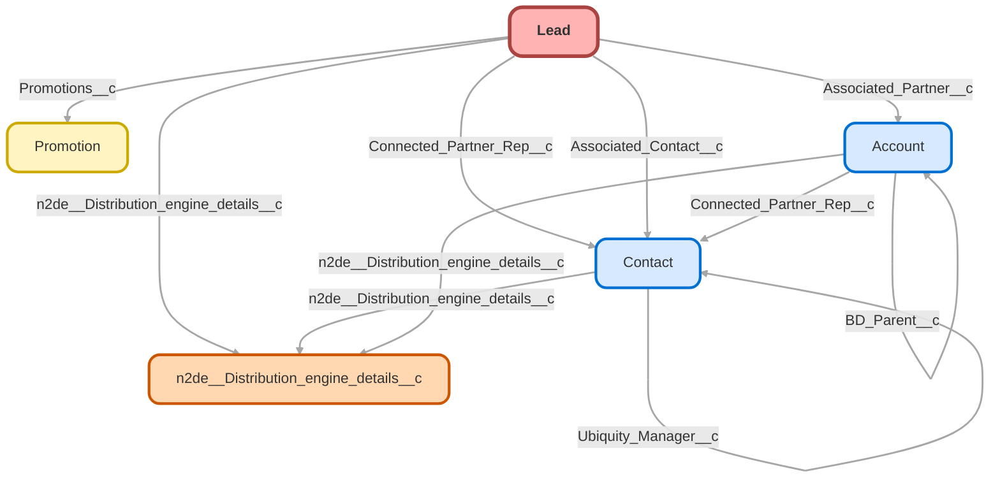

---
hide:
  - path
---

<!-- This file is auto-generated. if you do not want it to be overwritten, set TRUE in the line below -->
<!-- DO_NOT_OVERWRITE_DOC=FALSE -->

## Schema

<!-- Object description -->

## Fields

| Name      | Label | Type | Description |
| :-------- | :---- | :--: | :---------- | 
| ActionCadenceAssigneeId |  | Lookup | undefined |
| ActionCadenceId |  | Lookup | undefined |
| ActionCadenceState |  |  | undefined |
| Active_of_Employees_in_Relationship__c | Active # of Employees in Relationship | Number | undefined |
| ActiveTrackerCount |  |  | undefined |
| Add_to_f9list_id__c | Add to f9list id | Text | Used to sync contacts to Five9 |
| Additional_Financial_Professional_Emails__c | Additional Financial Professional Emails | TextArea | undefined |
| Additional_Financial_Professional_Names__c | Additional Financial Professional Names | TextArea | undefined |
| Additional_Financial_Professional_NPNs__c | Additional Financial Professional NPNs | TextArea | undefined |
| Address |  |  | undefined |
| Advisor_Broker_Dealer__c | Advisor Broker Dealer | Text | undefined |
| Advisor_Name__c | Advisor Name | Text | undefined |
| Advisor_NPN__c | Advisor NPN | Text | undefined |
| Advisor_Phone__c | Advisor Phone | Phone | undefined |
| Advisor_s_Last_Activity__c | Advisor's Last Activity | Date | undefined |
| Advisor_State__c | Advisor State | Picklist | undefined |
| Advisory_Firm__c | Advisory Firm | Text | undefined |
| affectlayer__AffectLayer_Notes__c | AffectLayer | Text | undefined |
| AI_Single_k_Auto_Invest__c | AI Single(k) Auto-Invest | Checkbox | undefined |
| All_Traffic_Sources__c | All Traffic Sources | LongTextArea | undefined |
| AnnualRevenue |  |  | undefined |
| Assigned_User__c | Assigned User | Text | undefined |
| Associated_Contact__c | Associated Contact | Lookup | Contact that is associated with the lead. (i.e. Advisor, Lead Referrer, etc). This field will be used to link advisors and people who refer leads to Ubiquity. |
| Associated_Contact_City__c | Associated Contact City | Text | Associated Contact City |
| Associated_Contact_CRD__c | Associated Contact CRD | Text | Associated Contact CRD Number |
| Associated_Contact_Email__c | Associated Contact Email | Text | Email of Associated Contact |
| Associated_Contact_Phone__c | Associated Contact Phone | Text | undefined |
| Associated_Contact_Role__c | Associated Contact Role | Picklist | What role does this Contact play on the Lead? |
| Associated_Contact_Stage_Flag__c | Associated Contact Stage Flag | Text | undefined |
| Associated_Contact_State__c | Associated Contact State | Text | Associated Contact State |
| Associated_Contact_Zip_Code__c | Associated Contact Zip Code | Text | Associated Contact Zip Code |
| Associated_Partner__c | Associated Partner | Lookup | Populate the associated partner's account. Most often used for Advisors or someone else who will be involved in the purchase decision. |
| Associated_Partner_Id__c | Associated Partner Id | Text | We can't directly populate the Associated Partner lookup field on the web to lead forms. This field stores the value, then a flow copies it into the lookup field when the lead is created. |
| Associated_Partner_Role__c | Associated Partner Role | Picklist | What role does this Partner play for this Lead? |
| Authority__c | Authority | Picklist | Indicate whether the lead contact has authority to purchase products from Ubiquity |
| Auto_Enroll_Contribution_Increase__c | Auto-Enroll Contribution Increase | Picklist | undefined |
| Auto_Enrollment__c | Auto-Enrollment | Picklist | Will the plan be utilizing Auto-Enrollment, and if so what type? |
| Auto_Enrollment_Deferral_Escalation_Rate__c | Auto-Enrollment Deferral/Escalation Rate | Picklist | undefined |
| Best_Contact_Time_Message__c | Best Contact Time Message | TextArea | Best time to contact the lead. |
| Broker_CRD__c | Broker CRD | Text | undefined |
| Budget__c | Budget | Picklist | Indicate whether lead has potential budget to purchase product |
| Business_Industry__c | Business_Industry | Picklist | undefined |
| Business_Start_Date__c | Business Start Date | Date | When did the company start? |
| Business_Unit__c | Business Unit | Picklist | Used to distinguish Business Units within Salesforce |
| CalendlyCreated__c | CalendlyCreated | Checkbox | undefined |
| Called_Sales_For_Safe_Harbor__c | Called Sales For Safe Harbor? | Picklist | undefined |
| campaign_code__c | Campaign code | Text | undefined |
| CampaignId |  | Lookup | undefined |
| Can_accept_HTML__c | Can accept HTML | Checkbox | undefined |
| Channel__c | Channel | Picklist | undefined |
| CloudingoAgent__AR__c | Address Type | Text | undefined |
| CloudingoAgent__ARDI__c | Residential Delivery Indicator | Text | undefined |
| CloudingoAgent__AS__c | Address Status | Number | undefined |
| CloudingoAgent__ATZ__c | Address Timezone | Text | undefined |
| CloudingoAgent__AV__c | Address Vacancy | Text | undefined |
| CloudingoAgent__LES__c | Lead Email Status | Number | undefined |
| Company |  |  | undefined |
| Company_FEIN__c | Company FEIN | Text | undefined |
| Company_Size__c | Company Size | Picklist | The size of the company based of the number of employees. |
| Connected_Partner__c | Connected Partner | Picklist | Partner with shared SLAs |
| Connected_Partner_Rep__c | Connected Partner Rep | Lookup | undefined |
| Contribution_Type__c | Contribution Type | Text | undefined |
| CRD_Number__c | CRD Number | Text | Central Registration Depository Number for advisor. |
| Create_Opp__c | Create Opp | Checkbox | undefined |
| Created_Week__c | Created Week | Number | undefined |
| Credentialed_Advisor__c | Credentialed Advisor | Checkbox | undefined |
| Current_401_k_provider__c | Current 401(k) provider | Text | undefined |
| Current_Payroll_Provider__c | Current Payroll Provider | Text | undefined |
| Current_Plan__c | Current Plan | Picklist | Does prospect have a current retirement plan in place for the business? |
| delete_from_f9list_id__c | delete_from_f9list_id | Text | Used to de-sync from Five9 |
| Description |  |  | undefined |
| Desired_Plan_Start_Date__c | Desired Plan Start Date | Date | When does the client want their plan to start? |
| Device__c | Device | Text | undefined |
| Discretionary_Match_Formula_Notes__c | Discretionary Match Formula/Notes | TextArea | Potential formula discussed with decision maker |
| Domain__c | Domain | Text | Determines similar domains |
| DoNotCall |  |  | undefined |
| DoNotCallCustom_StageDefault__c | DoNotCallCustom-StageDefault | Checkbox | Custom lead field that is checked if the standard Lead field DoNotCall is checked. |
| DOZISF__ZoomInfo_Company_ID__c | ZoomInfo Company ID | Text | undefined |
| DOZISF__ZoomInfo_Enrich_Status__c | ZoomInfo Enrich Status | Picklist | undefined |
| DOZISF__ZoomInfo_First_Updated__c | ZoomInfo First Updated | DateTime | Date and time when the record was first created or updated by ZoomInfo |
| DOZISF__ZoomInfo_Id__c | ZoomInfo Contact ID | Text | undefined |
| DOZISF__ZoomInfo_InboxAI_ID__c | ZoomInfo InboxAI ID | Text | undefined |
| DOZISF__ZoomInfo_Last_Updated__c | ZoomInfo Last Updated | DateTime | Date and time when the record was last created or updated by ZoomInfo |
| DOZISF__ZoomInfo_Non_Matched_Reason__c | ZoomInfo Non-Matched Reason | Text | undefined |
| Eligible_for_Contact_Merge__c | Eligible for Contact Merge | Checkbox | undefined |
| Email |  |  | undefined |
| Employee_Default_Contribution_Rate__c | Employee Default Contribution Rate | Picklist | undefined |
| Estimated_Pay__c | Estimated Pay | Number | undefined |
| et4ae5__HasOptedOutOfMobile__c | Mobile Opt Out | Checkbox | undefined |
| et4ae5__Mobile_Country_Code__c | Mobile Country Code | Picklist | undefined |
| EvergageEngagement__c | Evergage Engagement | Percent | Engagement score based on activity |
| EvergageEngagementTrend__c | Evergage Eng. Trend | Percent | Engagement trend based on activity |
| EvergageFilters__c | Evergage Filters | LongTextArea | Evergage matching filters |
| EvergageFirstActivity__c | Evergage First Visit | DateTime | First activity with application |
| EvergageLastActivity__c | Evergage Last Visit | DateTime | Last activity with application |
| EvergageLink__c | Evergage Link | Url | Link to the Evergage page |
| Facebook_Campaign__c | Facebook Campaign | Text | undefined |
| Fax |  |  | undefined |
| Firm_CRD__c | Firm CRD | Text | undefined |
| Firm_Type__c | Firm Type | Picklist | undefined |
| FirstCallDateTime |  |  | undefined |
| FirstEmailDateTime |  |  | undefined |
| Fund_List__c | Fund List | Text | undefined |
| GA_Client_ID_Formula__c | GA Client ID (Formula) | Text | undefined |
| gaconnector_Browser__c | Browser | Text | undefined |
| gaconnector_City__c | City | Text | undefined |
| gaconnector_Country__c | Country | Text | undefined |
| gaconnector_First_Click_Campaign__c | First Click Campaign | Text | undefined |
| gaconnector_First_Click_Channel__c | First Click Channel | Text | undefined |
| gaconnector_First_Click_Content__c | First Click Content | Text | undefined |
| gaconnector_First_Click_Landing_Page__c | First Click Landing Page | Text | undefined |
| gaconnector_First_Click_Medium__c | First Click Medium | Text | undefined |
| gaconnector_First_Click_Referrer__c | First Click Referrer | Text | undefined |
| gaconnector_First_Click_Source__c | First Click Source | Text | undefined |
| gaconnector_First_Click_Term__c | First Click Term | Text | undefined |
| gaconnector_GCLID__c | GCLID | Text | undefined |
| gaconnector_Google_Analytics_Client_ID__c | Google Analytics Client ID | Text | undefined |
| gaconnector_Google_Analytics_Link__c | Google Analytics Link | Text | undefined |
| gaconnector_IP_Address__c | IP Address | Text | undefined |
| gaconnector_Last_Click_Campaign__c | Last Click Campaign | Text | undefined |
| gaconnector_Last_Click_Channel__c | Last Click Channel | Text | undefined |
| gaconnector_Last_Click_Content__c | Last Click Content | Text | undefined |
| gaconnector_Last_Click_Landing_Page__c | Last Click Landing Page | Text | undefined |
| gaconnector_Last_Click_Medium__c | Last Click Medium | Text | undefined |
| gaconnector_Last_Click_Referrer__c | Last Click Referrer | Text | undefined |
| gaconnector_Last_Click_Source__c | Last Click Source | Text | undefined |
| gaconnector_Last_Click_Term__c | Last Click Term | Text | undefined |
| gaconnector_Latitude_from_IP__c | Latitude | Text | undefined |
| gaconnector_Location_approx__c | Location (approx.) | Text | undefined |
| gaconnector_Longitude__c | Longitude | Text | undefined |
| gaconnector_Number_of_Website_Visits__c | Number of Website Visits | Text | undefined |
| gaconnector_Operating_System__c | Operating System | Text | undefined |
| gaconnector_Pages_visited__c | Pages visited | LongTextArea | undefined |
| gaconnector_Time_Spent_on_Website__c | Time Spent on Website | Number | undefined |
| gaconnector_Time_Spent_on_Website_formul__c | Time Spent on Website | Text | undefined |
| gaconnector_Time_Zone__c | Time Zone | Text | undefined |
| GCLID__c | GCLID- Deprecated | Text | undefined |
| GenderIdentity |  | Picklist | undefined |
| HasOptedOutOfEmail |  |  | undefined |
| HasOptedOutOfFax |  |  | undefined |
| How_did_you_hear_about_Ubiquity__c | How did you hear about Ubiquity? | Picklist | Confirm how prospects heard about Ubiquity |
| IndividualId |  | Lookup | undefined |
| Industry |  | Picklist | undefined |
| Interested_in_CE_credits__c | Interested in CE credits | Checkbox | undefined |
| Intuit_Attempting_Initial_Contact__c | Intuit_Attempting_Initial_Contact | Checkbox | For Intuit or Costco plans, put a check in this pox so that the appropriate Opportunity Stage is defaulted. |
| Intuit_Client_ID__c | Intuit Client ID | Text | undefined |
| Intuit_Feature__c | Intuit Feature | Text | undefined |
| Intuit_Partner__c | Intuit Partner | Text | undefined |
| Intuit_Product__c | Intuit Product | Text | undefined |
| Intuit_Source__c | Intuit Source | Text | undefined |
| IqScore |  |  | undefined |
| Is_As_k_Advocate__c | Is As(k) Advocate | Checkbox | undefined |
| IsConvertedOnCreate__c | Converted When Created | Checkbox | To signal that this is auto converted, and also to specifically block the NPN nightmare flow. |
| Jigsaw |  |  | undefined |
| Last_Click_Source_Medium__c | Last Click Source/Medium | Text | undefined |
| LastTransferDate |  |  | undefined |
| Lead_Age__c | Lead Age | Number | undefined |
| Lead_Close_Date__c | Lead Close Date | Date | The date the lead is marked as Qualified, Unqualified or Unable to Qualify and moved out of the open pipeline. |
| Lead_Created__c | Lead Created | Date | Date Lead was Created to be passed to Opportunity |
| Lead_Grade__c | Lead Grade | Text | undefined |
| Lead_Notes__c | Lead Notes | LongTextArea | Enter Your Notes Here |
| Lead_Number__c | Lead Number | AutoNumber | undefined |
| Lead_Origin__c | Lead Origin | Picklist | How was this Lead generated? Ubiquity Generated is anything that comes from the website, or partners and goes through the standard distribution. Rep Generated is anything that the RPC Team generates themselves and goes right to that rep. |
| Lead_Rank__c | Lead Rank | Picklist | undefined |
| Lead_Type__c | Lead Type | Picklist | undefined |
| LeadID__c | LeadID | Text | undefined |
| Leads__c | Leads | Number | undefined |
| leadScoring__Campaign_Score__c | Campaign Score | Number | Sum of all the lead scoring rules from campaign member lead scoring rules |
| leadScoring__Lead_Priority__c | Lead Priority | Text | undefined |
| leadScoring__Lead_Score__c | Lead Score | Number | undefined |
| leadScoring__Total_Lead_Score__c | Total Lead Score | Number | Sum of Campaign Score and Lead Score |
| LeadSource |  | Picklist | undefined |
| LeadSourceDetail__c | Lead Source Detail | Picklist | undefined |
| lep360learning__creation_date__c | 360Learning creation date | Date | undefined |
| lep360learning__user_deletion_date__c | 360Learning user deletion date | Date | undefined |
| lep360learning__User_id__c | 360Learning User id | Text | undefined |
| lep360learning__X360Learning_user_deletion_date__c | deprecated | Date | undefined |
| LID__LinkedIn_Company_Id__c | LinkedIn Company Id | Text | LinkedIn Id of the company |
| LID__LinkedIn_Member_Token__c | LinkedIn Member Token | Text | LinkedIn Id of the member/lead |
| LinkedIn__c | LinkedIn | Url | undefined |
| Marketing_Source__c | Marketing Source | Picklist | This is the Marketing Source that is determined by Pardot |
| maxAutoDeferralPercentage__c | maxAutoDeferralPercentage | Number | undefined |
| MC_Removal__c | MC Removal | Checkbox | Check the box to delete from Marketing Cloud |
| Method_of_First_Contact__c | Method of First Contact | Picklist | Note the method the customer first reached out or was introduced to Ubiquity. This is not Lead Source |
| minimumAutoDeferralPercentage__c | minimumAutoDeferralPercentage | Number | undefined |
| MobilePhone |  |  | undefined |
| Morningstar_Enabled__c | Morningstar Enabled | Checkbox | undefined |
| MSCLKID__c | MSCLKID | Text | Used for Microsoft Bing Ad tracking |
| Multiple_Business__c | Multiple Business | Picklist | undefined |
| n2de__Action__c | Distribution action | Picklist | undefined |
| n2de__DE_Status__c | DE Classifier Status | Text | undefined |
| n2de__DE_Territory__c | DE Territory (Deprecated) | Text | Deprecated, use Distribution_engine_details__c.Territory__c instead |
| n2de__Distribution_count__c | Distribution count | Number | The number of times this record has been assigned via Distribution Engine |
| n2de__Distribution_engine_details__c | Distribution Engine details | Lookup | undefined |
| n2de__Is_archived__c | Is archived | Checkbox | undefined |
| n2de__Is_distributed__c | Is distributed | Checkbox | undefined |
| n2de__Is_reassigned__c | Is auto reassigned | Checkbox | undefined |
| n2de__Is_rejected__c | Is rejected | Checkbox | undefined |
| n2de__Is_trigger_enabled__c | Trigger enabled | Checkbox | undefined |
| n2de__Is_triggered__c | Is triggered | Checkbox | undefined |
| n2de__Last_archive_date__c | Last archive date | DateTime | undefined |
| n2de__Last_distributed__c | Last distributed | DateTime | undefined |
| n2de__Last_reassigned__c | Last reassigned | DateTime | undefined |
| n2de__Last_rejected__c | Last rejected | DateTime | Date & time that the DE assignment of this lead was last rejected |
| n2de__Source_queue__c | Source queue | Text | undefined |
| n2de__Time_to_action_mins__c | Time to action (mins) | Number | undefined |
| NAICS_Code__c | NAICS Code | Text | NAICS Code used to designate industry. |
| NAICS_Description__c | NAICS Description | Text | Description used for 6 digit NAICS code |
| Name |  |  | undefined |
| Need__c | Need | MultiselectPicklist | Primary Reason for looking into product |
| NewConvorSinglek__c | New/Conv or Single(k) | Picklist | undefined |
| No_Contact__c | No Contact | Checkbox | undefined |
| Number_of_Completed_Activities__c | # of Completed Activities | Number | undefined |
| NumberOfEmployees |  |  | undefined |
| Objections__c | Objections | Picklist | undefined |
| Opt_In__c | Opt In | Checkbox | Client has opted into Marketing campaigns |
| Opt_Out_Reason__c | Opt Out Reason | Text | undefined |
| Other_LeadSourceDetail__c | Other Lead Source Detail | Text | If LeadSourceDetail not provided in pick list, then write in the LeadSourceDetail |
| Owner_Calendly_15__c | Owner Calendly 15 | Text | Lead Owners 15 minute Calendly appointment link |
| Owner_Calendly_30__c | Owner Calendly 30 | Text | undefined |
| Owner_Full_Name__c | Owner Full Name | Text | undefined |
| OwnerId |  | Lookup | undefined |
| Parent_Broker_Dealer__c | Parent Broker Dealer | Text | undefined |
| Participant_Fee_Payment__c | Participant Fee Payment | Picklist | Who will be responsible for paying the participant fee? |
| Partner__c | Partner | Text | Partner with Shared SLA logo |
| Partner_Type__c | Partner Type | Picklist | This field is completed based upon whether partner selected from quote page dropdown is an Advisor or a Partner and is used for lead assignment rules. It is not mapped to an Account field at conversion. |
| PartnerAccountId |  | Lookup | undefined |
| Paycor_Client_ID__c | Paycor Client ID | Text | undefined |
| PaycorEmail__c | PaycorEmail | Html | Test field for storing HTML email body for debugging purposes. |
| Payroll_Provider__c | Payroll Provider | Picklist | If Payroll Providers are in dropdown they integrate with Ubiquity. |
| Payroll_Referral_Info__c | Payroll Referral info | TextArea | undefined |
| Phone |  |  | undefined |
| Plan_Eligibility__c | Plan Eligibility | Picklist | undefined |
| Plan_ID__c | Plan ID | Text | undefined |
| Plan_Purchase_ID__c | Plan Purchase ID | Text | undefined |
| Plan_Type__c | Plan Type | Picklist | undefined |
| Post_Costco_Opt_In__c | Post Costco Opt In | Checkbox | If Costco is lead source and this box is True and after 5/10/2014, then OK to email or call.  If False, then DO NOT CALL OR EMAIL. |
| Product_Type__c | Product Type | Picklist | undefined |
| Product_Type_Recommendation__c | Product Type Recommendation | Picklist | Product Type recommended by the Recommendation engine. |
| Promotions__c | Promotion | Lookup | undefined |
| Pronouns |  | Picklist | undefined |
| Proposal_Type__c | Proposal Type | Text | Used for reporting back to Principal for Simply |
| Quarter_Created__c | Quarter Created | Text | Used for Year over year reporting |
| Rating |  | Picklist | undefined |
| Recommendation_Engine_Results__c | Recommendation Engine Results | LongTextArea | Full results from the recommendation engine. |
| Referral_Info_Last_Name__c | Referral Info (Last Name) | TextArea | undefined |
| Referral_program__c | How did you hear about referral program? | Picklist | How did the referrer learn about Ubiquity's Referral Program? |
| ReferralInfo__c | Referral Info | TextArea | undefined |
| Referrer_s_Email__c | Referrer's Email | Email | Email address of referrer |
| Robin_Assign__c | Robin Assign | Number | undefined |
| Robin_Calc__c | Robin Calc | Number | undefined |
| Robin_Lead__c | Robin Lead | Text | undefined |
| Role__c | Role | Picklist | undefined |
| Round_Robin_ID__c | Round_Robin_ID | Number | undefined |
| Safe_Harbor__c | Safe Harbor | Picklist | Indicate prospects Safe Harbor Preference |
| Safe_Harbor_CF__c | Safe Harbor CF | Picklist | Safe Harbor descriptions used for client facing communication |
| ScheduledResumeDateTime |  |  | undefined |
| Secondary_Email__c | Secondary Email | Email | undefined |
| Secondary_Phone_Number__c | Secondary Phone Number | Phone | undefined |
| Self_Purchase__c | Self-Purchase | Checkbox | Checked is prospect enters self-purchase processes. |
| Service_Option__c | Service Option | Picklist | undefined |
| Service_Option_Recommendation__c | Service Option Recommendation | Picklist | Service Option recommended to prospect by Recommendation Engine. |
| sfleadcaphfprod__External_Lead_ID__c | External Lead ID | Text | undefined |
| simplesurvey__Survey_Last_Requested_On__c | Survey Last Requested On | DateTime | undefined |
| Split_Opp__c | Split Opp | Checkbox | undefined |
| Stage_Flag__c | Stage Flag | Picklist | undefined |
| Status |  | Picklist | undefined |
| Subscription_Snooze__c | Subscription Snooze | Checkbox | undefined |
| TAM__c | TAM | Number | Total Addressable Market |
| Territory__c | Territory | Picklist | undefined |
| Time_to_Action_SLA_Met__c | Time to Action SLA Met | Checkbox | For Sales Teams the Time to Action SLA is 4 Hours or 240 minutes |
| Timeframe__c | Timeframe | Picklist | undefined |
| TimeframeQuotes__c | TimeframeQuotes | Picklist | undefined |
| Title |  |  | undefined |
| Unqualified_Reason__c | Unqualified Reason | Picklist | The reason why the Lead is Unqualified. |
| Website |  |  | undefined |
| Working_Lead__c | Working Lead | Number | undefined |
| X3_38__c | 3(38) | Picklist | 3(38) Fiduciary used on plan |
| yearlyAutoDeferralPercentageIncrease__c | yearlyAutoDeferralPercentageIncrease | Number | undefined |
| Zenefits_Integrated_Payroll_Provider__c | Zenefits Integrated Payroll Provider | Checkbox | To Qualify a Zenefits Lead that does not come directly from Zenefits please make sure their payroll provider integrates |
| zoom_app__IsCreatedByZoomApp__c | IsCreatedByZoomApp | Checkbox | undefined |

## Validation Rules

| Rule      | Active | Description | Formula |
| :-------- | :---- | :---------- | :------ |
| Advisor_Lead_Associated_Partners | Yes | Makes sure Associated Partner is completed for Advisor leads | ISPICKVAL( LeadSource , "Advisor") && NOT(ISPICKVAL( Lead_Type__c, "Advisor")) && ( ISBLANK(  Associated_Partner__c  ) =  TRUE) &&  Eligible_for_Contact_Merge__c = FALSE &&  NOT(ISPICKVAL(Status,"Unable to Qualify")) |
| Connected_Partner_Rep | No ⚠️ | Connected Partner Rep is required for Schwab Leads | ISPICKVAL(Connected_Partner__c, "Schwab") && ISBLANK(Connected_Partner_Rep__c) |
| Express_k_only_available_for_JPM | No ⚠️ |  | ISPICKVAL(Service_Option__c, "Express(k)") &&  NOT(ISPICKVAL( Connected_Partner__c, "JPM")) &&  ISPICKVAL(Status, "Qualified") && Eligible_for_Contact_Merge__c = FALSE |
| JMP_Assoc_Contact_and_Assoc_Partner | No ⚠️ | Assoc Contact & Assoc Partner required for JPM leads to be converted | AND(  ISPICKVAL( Status , "Qualified"),  ISPICKVAL( LeadSourceDetail__c , "JPM"), (OR(  ISBLANK( Associated_Contact__c ),   ISBLANK( Associated_Partner__c ))))&& Eligible_for_Contact_Merge__c = FALSE |
| LID__Check_CompanyId_Value | Yes | Throws an exception message if the company id contains non-numerics | AND( 	(LID__LinkedIn_Company_Id__c <> NULL), 	NOT(ISNUMBER(LID__LinkedIn_Company_Id__c)) ) |
| Number_of_Employees_Required | Yes |  | AND(ISNULL(NumberOfEmployees),  ISPICKVAL(Status,"Qualified"), NOT(ISPICKVAL( Lead_Type__c, "Advisor")), NOT(ISPICKVAL( Lead_Type__c, "TPA"))) && RecordType.Name != "Business Development" && Eligible_for_Contact_Merge__c = FALSE |
| Validate_Business_Industry | Yes |  | ISPICKVAL( Status , "Qualified" ) && ISPICKVAL( Product_Type__c , "401(k)" )  &&  (ISPICKVAL(Business_Industry__c, "Not Yet Known")   ISPICKVAL(Business_Industry__c, "")) &&  Owner:User.LastName <> "Claxton,Parks" &&  NOT(ISPICKVAL( Business_Unit__c, "Simply Retirement")) && NOT(ISPICKVAL( LeadSourceDetail__c , "Sallus")) && NOT(ISPICKVAL(LeadSource,"MML")) |
| Validate_Email_OnConvert | No ⚠️ |  | ISPICKVAL(Status,"Qualified") && ISBLANK( Email) && $UserRole.Name = "Outside_Sales_Consultant" |
| Validate_How_Did_You_Hear_About_Ubiquity | No ⚠️ | Makes sure 401(k) leads are not converted before "How Did You Hear About Ubiquity" is known | IsConverted=True &&  ISPICKVAL( Product_Type__c , "401(k)" )  &&  ISPICKVAL(  How_did_you_hear_about_Ubiquity__c  , "" ) &&  Owner:User.LastName <> "Claxton,Parks" &&  RecordType.Name <> "Business Development" && Eligible_for_Contact_Merge__c = FALSE && NOT(ISPICKVAL( LeadSourceDetail__c, "Sallus")) |
| Validate_Method_of_First_Contact | No ⚠️ |  | ISPICKVAL(Status,"Qualified") && ISPICKVAL( Method_of_First_Contact__c, "" ) && Owner:User.LastName <> "Garcia" &&  RecordType.Name <> "Business Development" && Eligible_for_Contact_Merge__c = FALSE |
| Validate_Need | No ⚠️ |  | IsConverted=True  &&  ISPICKVAL( Product_Type__c , "401(k)" )  &&   ISBLANK(Need__c)=TRUE  &&  Owner:User.LastName <> "Garcia,Parks" |
| Validate_Number_of_Employees | No ⚠️ |  | ISPICKVAL(Status,"Qualified") &&  ISBLANK (NumberOfEmployees)  && Owner:User.LastName <> "Garcia" |
| Validate_Phone_OnConvert | No ⚠️ |  | ISPICKVAL(Status,"Qualified") && ISBLANK(Phone) && $UserRole.Name = "Outside_Sales_Consultant" |
| Validate_Plan_Type | Yes | Makes sure 401(k) leads are not converted before Plan Type is known | ISPICKVAL( Status , "Qualified" ) &&  ISPICKVAL( Product_Type__c , "401(k)" )  &&  ISPICKVAL( Plan_Type__c , "" ) &&  Owner:User.LastName <> "Claxton,Parks" &&  ISPICKVAL(  Lead_Type__c, "Employer") |
| Validate_Qualified_Status_IsConverted | No ⚠️ |  | ISPICKVAL(Status,"Qualified") && IsConverted = FALSE |
| Validate_State_on_Convert | Yes |  | ISPICKVAL ( Status , "Qualified" )  &&   ISPICKVAL( Product_Type__c , "401(k)" )  &&    ISBLANK( State )  &&   Owner:User.LastName <> "Claxton,Parks" && NOT(ISPICKVAL(Lead_Type__c, "TPA")) |
| Validate_Title_OnConvert | No ⚠️ |  | ISPICKVAL(Status,"Qualified") && ISBLANK(Title) && $UserRole.Name = "Outside_Sales_Consultant" |
| Validate_Unqualified_Reason | No ⚠️ |  | ISPICKVAL(Status,"Unqualified") && ISPICKVAL(Unqualified_Reason__c,"") |

## Related Flows

| Object | Name      | Type | Description |
| :----  | :-------- | :--: | :---------- | 
| 💻 | [Account_Partner_Association_Process_Assign_Territory](../flows/Account_Partner_Association_Process_Assign_Territory.md) [🕒](../flows/Account_Partner_Association_Process_Assign_Territory-history.md) |  Auto Launched Flow | <!-- --> |
| 💻 | [Cadence_Autolaunched_Flow_Update_Lead_Path](../flows/Cadence_Autolaunched_Flow_Update_Lead_Path.md) [🕒](../flows/Cadence_Autolaunched_Flow_Update_Lead_Path-history.md) |  Action Cadence Autolaunched Flow | Updates the lead record's Status field to Contacted. |
| 💻 | [Cadence_Automation_Flow_Lead_Status_Unable_to_Qualify](../flows/Cadence_Automation_Flow_Lead_Status_Unable_to_Qualify.md) [🕒](../flows/Cadence_Automation_Flow_Lead_Status_Unable_to_Qualify-history.md) |  Action Cadence Autolaunched Flow | <!-- --> |
| 💻 | [Contact_Button_Create_Lead](../flows/Contact_Button_Create_Lead.md) [🕒](../flows/Contact_Button_Create_Lead-history.md) |  Screen Flow | Defaults Referral info for Advisor Leads. Added criteria to allow sales coordinator use the button. |
| 💻 | [Contact_Process_Assign_Territory](../flows/Contact_Process_Assign_Territory.md) [🕒](../flows/Contact_Process_Assign_Territory-history.md) |  Auto Launched Flow | When Contact or Account are Updated, Evaluate Territory Assignment |
| 💻 | [Contact_Update_Credential_Status_on_Leads](../flows/Contact_Update_Credential_Status_on_Leads.md) [🕒](../flows/Contact_Update_Credential_Status_on_Leads-history.md) |  Auto Launched Flow | When Credential Status changes on Advisor Contact, update any unconverted Leads to reflect the status change. |
| 💻 | [CreateEvent](../flows/CreateEvent.md) [🕒](../flows/CreateEvent-history.md) |  Auto Launched Flow | Updated to act as a general "catch all" for partners.  If partner utm fields are found on calendlyaction, look for partner with a code that matches utm_source.  Creates event for new "invitee.created" calendlyactions.  Connects to lead or contact if found.  If no person found, creates new lead. |
| 💻 | [Create_Junction_After_Conversion](../flows/Create_Junction_After_Conversion.md) [🕒](../flows/Create_Junction_After_Conversion-history.md) |  Auto Launched Flow | Updated to use ac and ap roles from lead on new ac and ap records (rather than defaulting to "referrer" generic values)  Creates Associated Contact Junction if needed when Lead is Converted |
| 💻 | [Create_Partner_After_Conversion](../flows/Create_Partner_After_Conversion.md) [🕒](../flows/Create_Partner_After_Conversion-history.md) |  Auto Launched Flow | Creates Associated Partner Junction if needed when Lead is Converted |
| 💻 | [DocuSign_Recipient_Process_Associate_Key_Records](../flows/DocuSign_Recipient_Process_Associate_Key_Records.md) [🕒](../flows/DocuSign_Recipient_Process_Associate_Key_Records-history.md) |  Auto Launched Flow | <!-- --> |
| 💻 | [DocuSign_Related_Record_Mapping](../flows/DocuSign_Related_Record_Mapping.md) [🕒](../flows/DocuSign_Related_Record_Mapping-history.md) |  Auto Launched Flow | Links records related to the Document, based on recipient information. |
| 💻 | [Docusign_Button_Find_A4S](../flows/Docusign_Button_Find_A4S.md) [🕒](../flows/Docusign_Button_Find_A4S-history.md) |  Screen Flow | <!-- --> |
| 💻 | [Docusign_Process_Map_After_Signing](../flows/Docusign_Process_Map_After_Signing.md) [🕒](../flows/Docusign_Process_Map_After_Signing-history.md) |  Auto Launched Flow | To be used as a precautionary flow if docusign record is created after the would-be associated records. ***TEST VERSION*** |
| 💻 | [JBSystemFlow_Lead](../flows/JBSystemFlow_Lead.md) [🕒](../flows/JBSystemFlow_Lead-history.md) |  Auto Launched Flow | <!-- --> |
| 💻 | [Lead_Button_Phone_Lead_Quick_Create](../flows/Lead_Button_Phone_Lead_Quick_Create.md) [🕒](../flows/Lead_Button_Phone_Lead_Quick_Create-history.md) |  Screen Flow | Create Phone Lead with defaulted fields.  9-18-23 JI: Updated screen to show custom submission button instead of "Next". |
| 💻 | [Lead_Button_Quick_Lead_Create](../flows/Lead_Button_Quick_Lead_Create.md) [🕒](../flows/Lead_Button_Quick_Lead_Create-history.md) |  Screen Flow | Created to combine multiple "Create Lead" buttons into one.  Originally only for "Phone Lead" and "Schwab Lead", but can be expanded.  Looks at user's permissions to determine a list of lead "types" to choose from.  If only one type is found, bypass choice step.  The lead type determines its defaults and what fields display on the dynamic form. |
| 💻 | [Lead_Button_Schwab_Lead_Quick_Create](../flows/Lead_Button_Schwab_Lead_Quick_Create.md) [🕒](../flows/Lead_Button_Schwab_Lead_Quick_Create-history.md) |  Screen Flow | <!-- --> |
| 💻 | [Lead_Button_Unqualify_Lead](../flows/Lead_Button_Unqualify_Lead.md) [🕒](../flows/Lead_Button_Unqualify_Lead-history.md) |  Screen Flow | Shortcut for users to easily mark leads as unqualified. Added condition to populate ids collection. |
| 💻 | [Map_Advisor_Based_on_NPN](../flows/Map_Advisor_Based_on_NPN.md) [🕒](../flows/Map_Advisor_Based_on_NPN-history.md) |  Auto Launched Flow | When a new Simply Lead is created, assess whether to Convert Advisor, or Link Advisor to Employer Lead. Removed NPN Without Advisor email alert from Employer Lead path. |
| 💻 | [Nano_Banc_Single_k_Flow](../flows/Nano_Banc_Single_k_Flow.md) [🕒](../flows/Nano_Banc_Single_k_Flow-history.md) |  Auto Launched Flow | <!-- --> |
| 💻 | [Proposal_Autolaunched_Assign_Lead_Values_From_Proposal](../flows/Proposal_Autolaunched_Assign_Lead_Values_From_Proposal.md) [🕒](../flows/Proposal_Autolaunched_Assign_Lead_Values_From_Proposal-history.md) |  Auto Launched Flow | Added support for principal advisors, TPAs, and employers. |
| 💻 | [Proposal_Autolaunched_Create_leads_from_proposal](../flows/Proposal_Autolaunched_Create_leads_from_proposal.md) [🕒](../flows/Proposal_Autolaunched_Create_leads_from_proposal-history.md) |  Auto Launched Flow | Adding AC and AP roles |
| 💻 | [Proposal_Button_Generate_Simply_Lead](../flows/Proposal_Button_Generate_Simply_Lead.md) [🕒](../flows/Proposal_Button_Generate_Simply_Lead-history.md) |  Screen Flow | Adding Min and Max Auto Deferral Perecentage. Moe 04.09.25 |
| 💻 | [QA_Button_Create_QA](../flows/QA_Button_Create_QA.md) [🕒](../flows/QA_Button_Create_QA-history.md) |  Auto Launched Flow | Switched "Floating QA" check from "recordId is null" to being the default outcome Used from multiple objects of origin to create a QA record |
| 💻 | [RewardJet_401_k_Flow](../flows/RewardJet_401_k_Flow.md) [🕒](../flows/RewardJet_401_k_Flow-history.md) |  Auto Launched Flow | <!-- --> |
| 💻 | [RewardJet_Single_k_Flow](../flows/RewardJet_Single_k_Flow.md) [🕒](../flows/RewardJet_Single_k_Flow-history.md) |  Auto Launched Flow | <!-- --> |
| 💻 | [Send_Better_Email_Testflow](../flows/Send_Better_Email_Testflow.md) [🕒](../flows/Send_Better_Email_Testflow-history.md) |  Screen Flow | A series of 5 examples for testing and demonstrating Send Better Email Action Component |
| 💻 | [Update_Email_Phone](../flows/Update_Email_Phone.md) [🕒](../flows/Update_Email_Phone-history.md) |  Auto Launched Flow | Updates Email & Phone on Task depending on the record type of the associated client. |
| 💻 | [Update_Email_Phone_on_Event](../flows/Update_Email_Phone_on_Event.md) [🕒](../flows/Update_Email_Phone_on_Event-history.md) |  Auto Launched Flow | <!-- --> |
| 💻 | [Update_Partner_Client_Status](../flows/Update_Partner_Client_Status.md) [🕒](../flows/Update_Partner_Client_Status-history.md) |  Auto Launched Flow | Update Partner Client Status on Contact if all Plans are Inactive |
| 💻 | [Update_Partner_Status](../flows/Update_Partner_Status.md) [🕒](../flows/Update_Partner_Status-history.md) |  Auto Launched Flow | Update Partner Status on Contact if all Associated Leads are older than 1 year. |
| ActivityMetric | [Activity_Metric_After_Save_Update_Lead_to_Working](../flows/Activity_Metric_After_Save_Update_Lead_to_Working.md) [🕒](../flows/Activity_Metric_After_Save_Update_Lead_to_Working-history.md) |  Record After Save | When an activity metric record is created and newly attached to a lead record, update that lead to "working" if currently "open" or "assigned" |
| EmailMessage | [Email_After_Trigger_Create_Task_for_Diana](../flows/Email_After_Trigger_Create_Task_for_Diana.md) [🕒](../flows/Email_After_Trigger_Create_Task_for_Diana-history.md) |  Record After Save | <!-- --> |
| Lead | [Contact_Update_Partner_Status](../flows/Contact_Update_Partner_Status.md) [🕒](../flows/Contact_Update_Partner_Status-history.md) |  Workflow | Update Partner Status if all Leads are over 1 year old |
| Lead | [JBSystem_Lead_Process](../flows/JBSystem_Lead_Process.md) [🕒](../flows/JBSystem_Lead_Process-history.md) |  Workflow | <!-- --> |
| Lead | [Lead_After_Create_or_Update_Master_Flow](../flows/Lead_After_Create_or_Update_Master_Flow.md) [🕒](../flows/Lead_After_Create_or_Update_Master_Flow-history.md) |  Record After Save | Updated for new lead source/partner build.  Trimmed off "direct referrer" stamp so that this will only run ONCE for newly converted leads. |
| Lead | [Lead_After_Trigger](../flows/Lead_After_Trigger.md) [🕒](../flows/Lead_After_Trigger-history.md) |  Record After Save | <!-- --> |
| Lead | [Lead_After_Trigger_Email_Paycor_Referrer](../flows/Lead_After_Trigger_Email_Paycor_Referrer.md) [🕒](../flows/Lead_After_Trigger_Email_Paycor_Referrer-history.md) |  Record After Save | Changed start conditions to be CONTAINS mylo or paycor - not equal |
| Lead | [Lead_After_Update_De_Sync_from_Five9](../flows/Lead_After_Update_De_Sync_from_Five9.md) [🕒](../flows/Lead_After_Update_De_Sync_from_Five9-history.md) |  Record Before Save | <!-- --> |
| Lead | [Lead_Assign_Territory_1](../flows/Lead_Assign_Territory_1.md) [🕒](../flows/Lead_Assign_Territory_1-history.md) |  Record Before Save | Migrated from the Lead  Assign Territory process using Advisor-Sourced Lead criteria. Assign Lead Territory Upon Creation |
| Lead | [Lead_Before_Create_or_Update_Assign_Plan_Type](../flows/Lead_Before_Create_or_Update_Assign_Plan_Type.md) [🕒](../flows/Lead_Before_Create_or_Update_Assign_Plan_Type-history.md) |  Record Before Save | This Flow was converted from Sales  Lead Plan Type Updates Process Builder. It assigns default number of employees for Single(k) Plans and assigns Conversion vs New Plan Types on Lead Create and Update. |
| Lead | [Lead_Before_Insert_Sync_to_Five9](../flows/Lead_Before_Insert_Sync_to_Five9.md) [🕒](../flows/Lead_Before_Insert_Sync_to_Five9-history.md) |  Record Before Save | <!-- --> |
| Lead | [Lead_Before_Save_Sync_Employee_Count](../flows/Lead_Before_Save_Sync_Employee_Count.md) [🕒](../flows/Lead_Before_Save_Sync_Employee_Count-history.md) |  Record Before Save | Created for simply proposals.  Syncs employee count from proposal to lead at the moment of conversion. |
| Lead | [Lead_Before_Trigger_Don_t_Sync_to_MC](../flows/Lead_Before_Trigger_Don_t_Sync_to_MC.md) [🕒](../flows/Lead_Before_Trigger_Don_t_Sync_to_MC-history.md) |  Record Before Save | If a lead is created without an email, don't sync to MC. If an email is entered later, sync to MC. If a lead converts, remove sync to MC |
| Lead | [Lead_Before_Trigger_Update_Google_Leads](../flows/Lead_Before_Trigger_Update_Google_Leads.md) [🕒](../flows/Lead_Before_Trigger_Update_Google_Leads-history.md) |  Record Before Save | Updated flow to only overwrite Organic or blank LS |
| Lead | [Lead_Before_Trigger_Update_LSD_for_Bing_Ads](../flows/Lead_Before_Trigger_Update_LSD_for_Bing_Ads.md) [🕒](../flows/Lead_Before_Trigger_Update_LSD_for_Bing_Ads-history.md) |  Record After Save | When MSCLID has a value, set the Lead Source to "direct" and Lead Source Detail to "Microsoft Bing Ads". |
| Lead | [Lead_Before_Update_Assigned_Status_on_Distribution](../flows/Lead_Before_Update_Assigned_Status_on_Distribution.md) [🕒](../flows/Lead_Before_Update_Assigned_Status_on_Distribution-history.md) |  Record Before Save | Sets lead status to "assigned" from "open" when distributed by DE.  Replacing DE post assignment field updates because they sometimes overwrite other statuses |
| Lead | [Lead_Before_Update_Master_Flow](../flows/Lead_Before_Update_Master_Flow.md) [🕒](../flows/Lead_Before_Update_Master_Flow-history.md) |  Record Before Save | Added logic from PB Sales  Lead Closed Date Field |
| Lead | [Lead_Connected_Partner_Update_1](../flows/Lead_Connected_Partner_Update_1.md) [🕒](../flows/Lead_Connected_Partner_Update_1-history.md) |  Record Before Save | Migrated from the Lead  Connected Partner Update process using multiple criteria. Sets connected partner based on lead source.  Updated to simplify and fix Sallus issue (now looks at lead source, not LSD) |
| Lead | [Lead_Creation_1st_Response](../flows/Lead_Creation_1st_Response.md) [🕒](../flows/Lead_Creation_1st_Response-history.md) |  Workflow | Used to auto reply to leads when created - Excluding SingleK which is through Pardot/Marketing |
| Lead | [Lead_Default_Values_for_Partnerships](../flows/Lead_Default_Values_for_Partnerships.md) [🕒](../flows/Lead_Default_Values_for_Partnerships-history.md) |  Record Before Save | Updated for leafhouse build to apply leafhouse LSD  Migrated from the Lead  Default Values for Partnerships process using multiple criteria. Sets default values to Partnership Leads |
| Lead | [Lead_Default_Values_for_Simply_Retirement](../flows/Lead_Default_Values_for_Simply_Retirement.md) [🕒](../flows/Lead_Default_Values_for_Simply_Retirement-history.md) |  Workflow | Sets default values to Partnership Leads |
| Lead | [Lead_Map_Defaults_Upon_Conversion](../flows/Lead_Map_Defaults_Upon_Conversion.md) [🕒](../flows/Lead_Map_Defaults_Upon_Conversion-history.md) |  Workflow | Map Account and Contact Field Defaults Based on conditional Lead data |
| Lead | [Lead_Map_Defaults_Upon_Conversion_1](../flows/Lead_Map_Defaults_Upon_Conversion_1.md) [🕒](../flows/Lead_Map_Defaults_Upon_Conversion_1-history.md) |  Record After Save | Added fix for 0 employees simply sales.  Syncs employee count from lead to account.  Migrated from the Lead  Map Defaults Upon Conversion process using multiple criteria. Map Account and Contact Opportunity Field Defaults Based on conditional Lead data. |
| Lead | [Lead_NPN_Assignment](../flows/Lead_NPN_Assignment.md) [🕒](../flows/Lead_NPN_Assignment-history.md) |  Workflow | Find relevant advisor to either assign to employer lead, or update with new advisor lead info |
| Lead | [Lead_NPN_Assignment_1](../flows/Lead_NPN_Assignment_1.md) [🕒](../flows/Lead_NPN_Assignment_1-history.md) |  Record After Save | Specifically excluded leads with "Converted When Created" checked.  For new automations supporting advisor form.  Migrated from the Lead  NPN Assignment process using multiple criteria. Find relevant advisor to either assign to employer lead, or update with new advisor lead info |
| Lead | [Lead_Simply_Lead_Created_1](../flows/Lead_Simply_Lead_Created_1.md) [🕒](../flows/Lead_Simply_Lead_Created_1-history.md) |  Record After Save | Adjusted to compensate for if the new lead has been deleted/converted by DE |
| Lead | [Lead_Update_Lead_Source_Detail_Update](../flows/Lead_Update_Lead_Source_Detail_Update.md) [🕒](../flows/Lead_Update_Lead_Source_Detail_Update-history.md) |  Record Before Save | <!-- --> |
| Lead | [Lead_Update_Partner_Status_on_Contact](../flows/Lead_Update_Partner_Status_on_Contact.md) [🕒](../flows/Lead_Update_Partner_Status_on_Contact-history.md) |  Workflow | Updates Partner Status Field Based on "Latest Lead Referred Date" |
| Lead | [Lead_Update_Partner_Status_on_Contact_1](../flows/Lead_Update_Partner_Status_on_Contact_1.md) [🕒](../flows/Lead_Update_Partner_Status_on_Contact_1-history.md) |  Record After Save | Migrated from the Lead  Update Partner Status on Contact process using multiple criteria. Updates Partner Status Field Based on "Latest Lead Referred Date" |
| Lead | [Plan_Type_Updates](../flows/Plan_Type_Updates.md) [🕒](../flows/Plan_Type_Updates-history.md) |  Workflow | Updates Plan Type on Leads to "Conversion Plan" or "New Plan" |
| Lead | [Sales_Lead_Assignment_Automation](../flows/Sales_Lead_Assignment_Automation.md) [🕒](../flows/Sales_Lead_Assignment_Automation-history.md) |  Record After Save | Rolled Google PPC flow into this. Updated the decision element to check the new GCLID field instead of the deprecated field. |
| Partner_Partner_Association__c | [Account_Partner_Association_After_Trigger_Assign_Territory](../flows/Account_Partner_Association_After_Trigger_Assign_Territory.md) [🕒](../flows/Account_Partner_Association_After_Trigger_Assign_Territory-history.md) |  Record After Save | <!-- --> |
| Proposal__c | [Proposal_After_Save_Related_People](../flows/Proposal_After_Save_Related_People.md) [🕒](../flows/Proposal_After_Save_Related_People-history.md) |  Record After Save | Updated to fix ubiquity employer subflow call |
| Proposal__c | [Proposal_After_Trigger](../flows/Proposal_After_Trigger.md) [🕒](../flows/Proposal_After_Trigger-history.md) |  Record After Save | Removed advisor lead creation for Sallus (covered by their api connection, leads created directly), adjusted formatted state formula to return null instead of 'Other' when it can't find a match.  Handles proposals before distribution via DE.  Creates partner lead(s), connects contacts to proposal, assigns it to staging user/queue.  After assignment from DE this also sends alert and creates reach out task |
| Proposal__c | [Proposal_After_Update_Add_Update_Purchase_Contacts](../flows/Proposal_After_Update_Add_Update_Purchase_Contacts.md) [🕒](../flows/Proposal_After_Update_Add_Update_Purchase_Contacts-history.md) |  Record After Save | <!-- --> |
| Proposal__c | [Proposal_Trigger_Build_Sallus_Lead_when_Submitted_for_Purchase](../flows/Proposal_Trigger_Build_Sallus_Lead_when_Submitted_for_Purchase.md) [🕒](../flows/Proposal_Trigger_Build_Sallus_Lead_when_Submitted_for_Purchase-history.md) |  Record After Save | Revamped from old design.  Creates employer lead for simply or sallus proposals once employer information is added to the proposal. |
| Proposal__c | [Proposal_Trigger_Quick_Quote_Handler](../flows/Proposal_Trigger_Quick_Quote_Handler.md) [🕒](../flows/Proposal_Trigger_Quick_Quote_Handler-history.md) |  Record After Save | Added DC |
| Task | [Sales_Email_RPC_when_Upgrade_is_Created_from_Plan](../flows/Sales_Email_RPC_when_Upgrade_is_Created_from_Plan.md) [🕒](../flows/Sales_Email_RPC_when_Upgrade_is_Created_from_Plan-history.md) |  Workflow | Email Upgrade Opportunity Owner Upon Creation |
| Task | [Sales_Update_Lead_Status_when_Activity_is_Created](../flows/Sales_Update_Lead_Status_when_Activity_is_Created.md) [🕒](../flows/Sales_Update_Lead_Status_when_Activity_is_Created-history.md) |  Workflow | When Task is created, Mark Lead as "Working" if in an earlier stage. |
| Task | [Task_Before_Save_Add_Phone_Email](../flows/Task_Before_Save_Add_Phone_Email.md) [🕒](../flows/Task_Before_Save_Add_Phone_Email-history.md) |  Record Before Save | <!-- --> |
| Task | [Task_Trigger_Lead_Status_to_Working](../flows/Task_Trigger_Lead_Status_to_Working.md) [🕒](../flows/Task_Trigger_Lead_Status_to_Working-history.md) |  Record After Save | When Task is Completed, update Lead Status to Working |
| dsfs__DocuSign_Recipient_Status__c | [DocuSign_Recipient_After_Trigger_Associate_Key_Records](../flows/DocuSign_Recipient_After_Trigger_Associate_Key_Records.md) [🕒](../flows/DocuSign_Recipient_After_Trigger_Associate_Key_Records-history.md) |  Record After Save | Updated to add error handling to lead conversions + opp closure.  Emails owner of errored record + BI to resolve. |
| dsfs__DocuSign_Status__c | [Docusign_Process_Convert_Lead_after_Signing](../flows/Docusign_Process_Convert_Lead_after_Signing.md) [🕒](../flows/Docusign_Process_Convert_Lead_after_Signing-history.md) |  Record After Save | <!-- --> |

## Related Apex Classes

| Apex Class | Type |
| :----      | :--: | 
| [AutoConvertLeads](../apex/AutoConvertLeads.md) | Invocable |
| [AutoConvertLeadsNoOpp](../apex/AutoConvertLeadsNoOpp.md) | Invocable |
| [CheckConversionReadiness](../apex/CheckConversionReadiness.md) | Lightning Controller |
| [CheckConversionReadiness_TEST](../apex/CheckConversionReadiness_TEST.md) | Test |
| [DataFactory](../apex/DataFactory.md) | Test |
| [LogEntryEventBuilder](../apex/LogEntryEventBuilder.md) | Class |
| [LogEntryEventBuilder_Tests](../apex/LogEntryEventBuilder_Tests.md) | Test |
| [LogEntryHandler](../apex/LogEntryHandler.md) | Class |
| [Logger](../apex/Logger.md) | Invocable |
| [LoggerMockDataCreator](../apex/LoggerMockDataCreator.md) | Test |
| [Logger_Tests](../apex/Logger_Tests.md) | Test |
| [ModularAutoConvertLead](../apex/ModularAutoConvertLead.md) | Invocable |
| [ModularAutoConvertLead_TEST](../apex/ModularAutoConvertLead_TEST.md) | Test |
| [PaycorEmailHandlerNew](../apex/PaycorEmailHandlerNew.md) | Class |
| [ProposalTriggerTest](../apex/ProposalTriggerTest.md) | Test |
| [SendBetterEmail](../apex/SendBetterEmail.md) | Invocable |
| [SendBetterEmailRequest](../apex/SendBetterEmailRequest.md) | Lightning Controller |
| [SendBetterEmailTest](../apex/SendBetterEmailTest.md) | Test |
| [SendBetterEmailUtil](../apex/SendBetterEmailUtil.md) | Class |
| [StampDateTest](../apex/StampDateTest.md) | Test |
| [TestAutoConvertLeads](../apex/TestAutoConvertLeads.md) | Test |
| [TestAutoConvertLeadsNoOpp](../apex/TestAutoConvertLeadsNoOpp.md) | Test |

## Related Lightning Pages

| Lightning Page | Type |
| :----      | :--: | 
| [CO_Messaging_Session1](../pages/CO_Messaging_Session1.md) |  Record Page |
| [Campaign_Record_Page_BizDev](../pages/Campaign_Record_Page_BizDev.md) |  Record Page |
| [Campaign_Record_Page_BizDev1](../pages/Campaign_Record_Page_BizDev1.md) |  Record Page |
| [Default_Contact_Layout](../pages/Default_Contact_Layout.md) |  Record Page |
| [Default_Lead_Layout](../pages/Default_Lead_Layout.md) |  Record Page |
| [Default_Opportunity_Layout](../pages/Default_Opportunity_Layout.md) |  Record Page |
| [Dynamic_Imp_Record_Page](../pages/Dynamic_Imp_Record_Page.md) |  Record Page |
| [Dynamic_Lead_Page](../pages/Dynamic_Lead_Page.md) |  Record Page |
| [Dynamic_Opp_Page](../pages/Dynamic_Opp_Page.md) |  Record Page |
| [Dynamic_Plan_Page](../pages/Dynamic_Plan_Page.md) |  Record Page |
| [Forecast_Channel_Record_Page](../pages/Forecast_Channel_Record_Page.md) |  Record Page |
| [Jason](../pages/Jason.md) |  App Page |
| [Messaging_Session](../pages/Messaging_Session.md) |  Record Page |
| [OPD_Page1](../pages/OPD_Page1.md) |  Record Page |
| [Partner_Proposal](../pages/Partner_Proposal.md) |  Record Page |
| [Sales_Home](../pages/Sales_Home.md) |  Home Page |
| [Sales_Lightning_Account_Record](../pages/Sales_Lightning_Account_Record.md) |  Record Page |
| [Sales_UtilityBar](../pages/Sales_UtilityBar.md) |  Utility Bar |

## Related Profiles

| Profile | User License |
| :----      | :--: | 
| [Admin](../profiles/Admin.md) |  Salesforce |
| [Analytics Cloud Integration User](../profiles/Analytics%20Cloud%20Integration%20User.md) |  Analytics  Cloud  Integration  User |
| [Analytics Cloud Security User](../profiles/Analytics%20Cloud%20Security%20User.md) |  Analytics  Cloud  Integration  User |
| [Anypoint Integration](../profiles/Anypoint%20Integration.md) |  Identity |
| [B2BMA Integration User](../profiles/B2BMA%20Integration%20User.md) |  B2 B M A  Integration  User |
| [Billing User](../profiles/Billing%20User.md) |  Salesforce |
| [Bot Profile](../profiles/Bot%20Profile.md) |  Salesforce |
| [Business Development](../profiles/Business%20Development.md) |  Salesforce |
| [Call Center](../profiles/Call%20Center.md) |  Salesforce |
| [Chatter External User](../profiles/Chatter%20External%20User.md) |  Chatter  External |
| [Chatter Free User](../profiles/Chatter%20Free%20User.md) |  Chatter  Free |
| [Chatter Moderator User](../profiles/Chatter%20Moderator%20User.md) |  Chatter  Free |
| [Client Onboarding - Admin](../profiles/Client%20Onboarding%20-%20Admin.md) |  Salesforce |
| [Client Onboarding - RM](../profiles/Client%20Onboarding%20-%20RM.md) |  Salesforce |
| [Client Servicing Team](../profiles/Client%20Servicing%20Team.md) |  Salesforce |
| [Compliance Manager](../profiles/Compliance%20Manager.md) |  Salesforce |
| [ContractManager](../profiles/ContractManager.md) |  Salesforce |
| [Director of Operations](../profiles/Director%20of%20Operations.md) |  Salesforce |
| [Director of Sales](../profiles/Director%20of%20Sales.md) |  Salesforce |
| [Distributions](../profiles/Distributions.md) |  Salesforce |
| [Einstein Agent User](../profiles/Einstein%20Agent%20User.md) |  Einstein  Agent |
| [ESW_Agentforce_MIAW_1748035300267 Profile](../profiles/ESW_Agentforce_MIAW_1748035300267%20Profile.md) |  Guest  User  License |
| [ESW_Agentforce_MIAW_1748385215843 Profile](../profiles/ESW_Agentforce_MIAW_1748385215843%20Profile.md) |  Guest  User  License |
| [ESW_CE_Chat_1692890394498 Profile](../profiles/ESW_CE_Chat_1692890394498%20Profile.md) |  Guest  User  License |
| [ESW_CE_Chat_Moe_1693182845676 Profile](../profiles/ESW_CE_Chat_Moe_1693182845676%20Profile.md) |  Guest  User  License |
| [ESW_Login_Help_1697133738638 Profile](../profiles/ESW_Login_Help_1697133738638%20Profile.md) |  Guest  User  License |
| [ESW_Login_Help_Simply_1700075140889 Profile](../profiles/ESW_Login_Help_Simply_1700075140889%20Profile.md) |  Guest  User  License |
| [ESW_Omni_Messaging_1694183770479 Profile](../profiles/ESW_Omni_Messaging_1694183770479%20Profile.md) |  Guest  User  License |
| [ESW_Omni_Messaging_CO_1696448547822 Profile](../profiles/ESW_Omni_Messaging_CO_1696448547822%20Profile.md) |  Guest  User  License |
| [ESW_Omni_Messaging_Sallus_1700075448386 Profile](../profiles/ESW_Omni_Messaging_Sallus_1700075448386%20Profile.md) |  Guest  User  License |
| [ESW_Omni_Messaging_Simply_1700076370188 Profile](../profiles/ESW_Omni_Messaging_Simply_1700076370188%20Profile.md) |  Guest  User  License |
| [ESW_QA_Login_1699666348585 Profile](../profiles/ESW_QA_Login_1699666348585%20Profile.md) |  Guest  User  License |
| [ESW_QA_Messaging_1699974036493 Profile](../profiles/ESW_QA_Messaging_1699974036493%20Profile.md) |  Guest  User  License |
| [ESW_Sales_Chat_1697460991337 Profile](../profiles/ESW_Sales_Chat_1697460991337%20Profile.md) |  Guest  User  License |
| [ESW_Sallus_Login_Chat_1700072925200 Profile](../profiles/ESW_Sallus_Login_Chat_1700072925200%20Profile.md) |  Guest  User  License |
| [External Apps Login User](../profiles/External%20Apps%20Login%20User.md) |  External  Apps  Login |
| [Finance Manager Lightning](../profiles/Finance%20Manager%20Lightning.md) |  Salesforce |
| [Guest License User](../profiles/Guest%20License%20User.md) |  Guest  User  License |
| [Help Center Profile](../profiles/Help%20Center%20Profile.md) |  Guest  User  License |
| [Identity User](../profiles/Identity%20User.md) |  Identity |
| [Incoming_SMS Profile](../profiles/Incoming_SMS%20Profile.md) |  Guest  User  License |
| [IT](../profiles/IT.md) |  Salesforce |
| [Leadership Lightning](../profiles/Leadership%20Lightning.md) |  Salesforce |
| [Leadership](../profiles/Leadership.md) |  Salesforce |
| [Learning %26 Development](../profiles/Learning%20%2526%20Development.md) |  Salesforce |
| [Lightning Client Onboarding](../profiles/Lightning%20Client%20Onboarding.md) |  Salesforce |
| [Lightning Compliance](../profiles/Lightning%20Compliance.md) |  Salesforce |
| [Lightning Saver User](../profiles/Lightning%20Saver%20User.md) |  Salesforce |
| [Lightning Service Manager](../profiles/Lightning%20Service%20Manager.md) |  Salesforce |
| [Lightning Service User](../profiles/Lightning%20Service%20User.md) |  Salesforce |
| [Marketing Team](../profiles/Marketing%20Team.md) |  Salesforce |
| [MarketingProfile](../profiles/MarketingProfile.md) |  Salesforce |
| [Master Administrator](../profiles/Master%20Administrator.md) |  Salesforce |
| [Minimum Access - API Only Integrations](../profiles/Minimum%20Access%20-%20API%20Only%20Integrations.md) |  Salesforce  Integration |
| [Minimum Access - Salesforce](../profiles/Minimum%20Access%20-%20Salesforce.md) |  Salesforce |
| [myubiquity Profile](../profiles/myubiquity%20Profile.md) |  Guest  User  License |
| [Operations VP](../profiles/Operations%20VP.md) |  Salesforce |
| [Operations](../profiles/Operations.md) |  Salesforce |
| [Paradigm Help Center Profile](../profiles/Paradigm%20Help%20Center%20Profile.md) |  Guest  User  License |
| [Payroll Koncierge](../profiles/Payroll%20Koncierge.md) |  Salesforce |
| [Payroll Team](../profiles/Payroll%20Team.md) |  Salesforce |
| [People %26 Culture](../profiles/People%20%2526%20Culture.md) |  Salesforce |
| [Pre-chat Site Profile](../profiles/Pre-chat%20Site%20Profile.md) |  Guest  User  License |
| [Product Innovation Leadership](../profiles/Product%20Innovation%20Leadership.md) |  Salesforce |
| [Product Innovation User](../profiles/Product%20Innovation%20User.md) |  Salesforce |
| [PSM Team](../profiles/PSM%20Team.md) |  Salesforce |
| [R%26W](../profiles/R%2526W.md) |  Salesforce |
| [Read Only](../profiles/Read%20Only.md) |  Salesforce |
| [Sales Administrator](../profiles/Sales%20Administrator.md) |  Salesforce |
| [Sales Coordinator](../profiles/Sales%20Coordinator.md) |  Salesforce |
| [Sales Insights Integration User](../profiles/Sales%20Insights%20Integration%20User.md) |  Sales  Insights  Integration  User |
| [Sales Team - Limited](../profiles/Sales%20Team%20-%20Limited.md) |  Salesforce |
| [Sales Team](../profiles/Sales%20Team.md) |  Salesforce |
| [Salesforce API Only System Integrations](../profiles/Salesforce%20API%20Only%20System%20Integrations.md) |  Salesforce  Integration |
| [SalesforceIQ Integration User](../profiles/SalesforceIQ%20Integration%20User.md) |  Salesforce I Q  Integration  User |
| [Saver Manager](../profiles/Saver%20Manager.md) |  Salesforce |
| [Simple Survey Profile](../profiles/Simple%20Survey%20Profile.md) |  Guest  User  License |
| [Simply Help Center Profile](../profiles/Simply%20Help%20Center%20Profile.md) |  Guest  User  License |
| [SolutionManager](../profiles/SolutionManager.md) |  Salesforce |
| [Standard](../profiles/Standard.md) |  Salesforce |
| [StandardAul](../profiles/StandardAul.md) |  Salesforce  Platform |
| [Super System Administrator](../profiles/Super%20System%20Administrator.md) |  Salesforce |
| [Sys Dev Admin](../profiles/Sys%20Dev%20Admin.md) |  Salesforce |
| [Transitions Team](../profiles/Transitions%20Team.md) |  Salesforce |
| [Ubiquity Help Center Profile](../profiles/Ubiquity%20Help%20Center%20Profile.md) |  Guest  User  License |
| [Zoom Webhooks Profile](../profiles/Zoom%20Webhooks%20Profile.md) |  Guest  User  License |

## Related Permission Sets

| Permission Set | User License |
| :----      | :--: | 
| [Administrator](../permissionsets/Administrator.md) | None |
| [Attachments_and_Notes_Migrator](../permissionsets/Attachments_and_Notes_Migrator.md) | None |
| [Automation_Team_Imp_Project_Tasks](../permissionsets/Automation_Team_Imp_Project_Tasks.md) | None |
| [Call_Center_Client_Onboarding](../permissionsets/Call_Center_Client_Onboarding.md) | None |
| [Create_Schwab_Lead](../permissionsets/Create_Schwab_Lead.md) | None |
| [Data_Loader](../permissionsets/Data_Loader.md) | None |
| [DataServicesPS_Editable](../permissionsets/DataServicesPS_Editable.md) | None |
| [Developer](../permissionsets/Developer.md) | None |
| [ExactTarget_Integration_Admin](../permissionsets/ExactTarget_Integration_Admin.md) | None |
| [ExactTarget_Integration_Editable](../permissionsets/ExactTarget_Integration_Editable.md) | None |
| [Forecast_Management](../permissionsets/Forecast_Management.md) | None |
| [Lead_Cleanup](../permissionsets/Lead_Cleanup.md) | None |
| [MagicMover](../permissionsets/MagicMover.md) | None |
| [Manager](../permissionsets/Manager.md) | None |
| [Marketing_Cloud_System_User](../permissionsets/Marketing_Cloud_System_User.md) | None |
| [Master](../permissionsets/Master.md) | None |
| [Modify_All](../permissionsets/Modify_All.md) | None |
| [Omni_Messaging](../permissionsets/Omni_Messaging.md) | None |
| [Pardot_API_Developer](../permissionsets/Pardot_API_Developer.md) | None |
| [Power_User](../permissionsets/Power_User.md) | None |
| [Purchase_Api](../permissionsets/Purchase_Api.md) | None |
| [Salesforce_Lead_Capture](../permissionsets/Salesforce_Lead_Capture.md) | None |
| [sfdc_chatbot_service_permset](../permissionsets/sfdc_chatbot_service_permset.md) | None |
| [sfdcInternalInt__sfdc_a360_sfcrm_data_extract](../permissionsets/sfdcInternalInt__sfdc_a360_sfcrm_data_extract.md) | None |
| [sfdcInternalInt__sfdc_a360](../permissionsets/sfdcInternalInt__sfdc_a360.md) | None |
| [sfdcInternalInt__sfdc_activityplatform](../permissionsets/sfdcInternalInt__sfdc_activityplatform.md) | None |
| [sfdcInternalInt__sfdc_articlerecommendations](../permissionsets/sfdcInternalInt__sfdc_articlerecommendations.md) | None |
| [sfdcInternalInt__sfdc_einsteinagent](../permissionsets/sfdcInternalInt__sfdc_einsteinagent.md) | None |
| [sfdcInternalInt__sfdc_replyrecommendations](../permissionsets/sfdcInternalInt__sfdc_replyrecommendations.md) | None |
| [sfdcInternalInt__sfdc_slack](../permissionsets/sfdcInternalInt__sfdc_slack.md) | None |
| [Simply_Retirement_Min_Access](../permissionsets/Simply_Retirement_Min_Access.md) | None |
| [Standard_User](../permissionsets/Standard_User.md) | None |
| [Ubiquity_Service_Agent_Permissions](../permissionsets/Ubiquity_Service_Agent_Permissions.md) | None |
| [View_All](../permissionsets/View_All.md) | None |
| [Zoom_Admin_Webinar](../permissionsets/Zoom_Admin_Webinar.md) | None |
| [Zoom_User_Webinar](../permissionsets/Zoom_User_Webinar.md) | None |

_Documentation generated with [sfdx-hardis](https://sfdx-hardis.cloudity.com), by [Cloudity](https://www.cloudity.com/) & [friends](https://github.com/hardisgroupcom/sfdx-hardis/graphs/contributors)_
