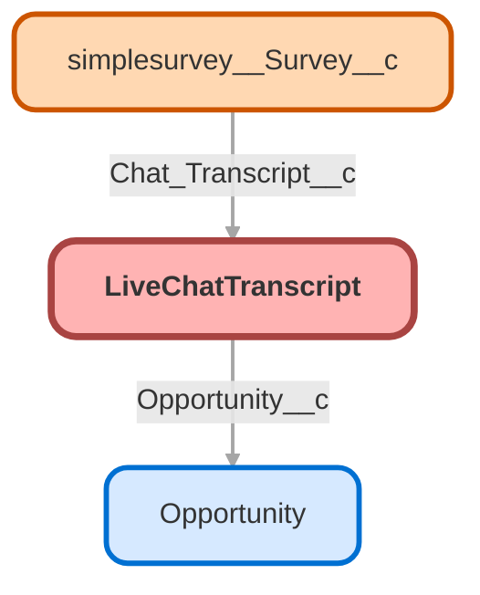

---
hide:
  - path
---

<!-- This file is auto-generated. if you do not want it to be overwritten, set TRUE in the line below -->
<!-- DO_NOT_OVERWRITE_DOC=FALSE -->

## Schema

<!-- Object description -->

## Fields

| Name      | Label | Type | Description |
| :-------- | :---- | :--: | :---------- | 
| Abandoned |  |  | undefined |
| Account__c | Account # | Number | Visitor requested info on plan account # during chatbot session |
| AccountId |  | Lookup | undefined |
| Add_to_Census__c | Add to Census | Number | Visitor requested info on adding an employee to the census during chatbot session |
| Amort_Sched__c | Amort Sched | Number | Visitor requested info on amortization schedule during chatbot session |
| Annual_contribution_timing__c | Annual contribution timing | Number | Chat subtopic flag field |
| Annual_Payroll__c | Annual Payroll | Number | Visitor requested info on submitting an annual payroll during chatbot session |
| Auto_Rebalance__c | Auto-Rebalance | Number | Visitor selected info on auto rebalances during chatbot session |
| AverageResponseTimeOperator |  |  | undefined |
| AverageResponseTimeVisitor |  |  | undefined |
| Bank_Info__c | Bank Info | Number | Visitor requested info on updating funding bank info during chat session |
| Body |  |  | undefined |
| Browser |  |  | undefined |
| BrowserLanguage |  |  | undefined |
| Calculate_Employer_Contribution__c | Calculate Employer Contribution | Number | Chat subtopic flag field |
| CaseId |  | Lookup | undefined |
| Catch_Up_Contributions__c | Catch Up Contributions | Number | Chat subtopic flag field |
| Change_Contribution_Amount__c | Change Contribution Amount | Number | Chat subtopic flag field |
| Change_contribution_during_enrollment__c | Change contribution during enrollment | Number | Chat subtopic flag field |
| Change_Payments__c | Change Payments | Number | Visitor asked for info on changing loan payment schedule during chatbot session |
| Change_Rebalance__c | Change/Rebalance | Number | Visitor requested info to change/rebalance investments during chatbot session |
| Chat_Count__c | Chat Count | Number | undefined |
| Chat_Duration_Minutes__c | Chat Duration - Minutes | Number | undefined |
| Chat_Request_Time__c | Chat Request Time | Time | undefined |
| Chat_Request_Time_Text__c | Chat Request Time Text | Text | undefined |
| Chat_Week_Number__c | Chat Week Number | Number | undefined |
| ChatBot_Session__c | ChatBot Session | Number | 1 = ChatBot started the chat |
| Chatbot_Success__c | ChatBot full deflection | Number | 1 = Client reached end of a path for a final answer and selected "Yes, that's all I needed" |
| ChatBot_Unanswered__c | ChatBot Unanswered | Number | 1 = Client reached end of chatbot path and selected "No, I need additional help" |
| ChatDuration |  |  | undefined |
| ChatTimeText__c | ChatTimeText | Text | Request Time as Text.   March - November = (RequestTime - 0.29166666)     November to March = (RequestTime - 0.333333) |
| ContactId |  | Lookup | undefined |
| Contribution_Limit__c | Contribution Limit | Number | Chat subtopic flag field |
| Date_of_Term__c | Date of Term | Number | Visitor requested info on adding DOT during chatbot session |
| Day_of_Week__c | Day of Week | Text | Day of Week the chat was requested |
| EE_ER_Info__c | Update EE|ER Info | Number | Visitor requested info on updating EE or ER info during chatbot session |
| Employed__c | Employed | Number | Visitor selected "Yes I am still employed" during chatbot session |
| Employee_Info__c | Employee Info | Number | Visitor requested info on updating employee emails during chatbot session |
| Employer_Contribution_Amount__c | Employer Contribution Amount | Number | Chat subtopic flag field |
| EndedBy |  |  | undefined |
| EndTime |  |  | undefined |
| Enroll_Email__c | Enroll Email | Number | Visitor requested info on sending enrollment email during chatbot session |
| Future_Investments__c | Future Investments | Number | Visitor requested info to change future investments during chatbot session |
| Hardship__c | Hardship | Number | Visitor selected Hardship withdrawal option during chatbot session |
| Immediate_Transfer__c | Immediate Transfer | Number | Client requested "Transfer To Agent" as their only action in ChatBot |
| Interest_tax_form__c | Interest tax form | Number | Chat subtopic flag field |
| Investment_Options__c | Investment Options | Number | Visitor selected option to review Investment Options during chatbot session |
| IpAddress |  |  | undefined |
| LeadId |  | Lookup | undefined |
| LiveChatButtonId |  | Lookup | undefined |
| LiveChatDeploymentId |  | Lookup | undefined |
| LiveChatVisitorId |  | Lookup | undefined |
| Loan_Support__c | Loan Support | Number | Client selected Loan Support as main topic during chatbot session |
| Loan_Terms__c | Loan Terms | Number | Visitor asked for info on loan terms during chatbot session |
| Loans_allowed__c | Loans allowed? | Number | Visitor asked if Loans are allowed during chatbot session |
| Location |  |  | undefined |
| Manage_Contributions__c | Manage Contributions | Number | Flags ChatBot main topic of Manage Contributions |
| Manage_Investments__c | Manage Investments | Number | Visitor selected "Manage Investments" main topic during chatbot session |
| Max_Loan__c | Max Loan | Number | Visitor requested info on maximum loan during chatbot session |
| MaxResponseTimeOperator |  |  | undefined |
| MaxResponseTimeVisitor |  |  | undefined |
| Missed__c | Missed | Checkbox | If chat was missed - used for reporting |
| Money_in_or_out__c | Money in or out | Number | Chat visitor selected main topic of Move money in or out of my account |
| Move_In__c | Move $ In | Number | Visitor selected "Move money into my account" during chatbot session |
| Move_In_Out__c | Move $ In|Out | Number | Visitor requested main topic of move money in or out during chatbot session |
| Move_money_to_new_investments__c | $ to New Investments | Number | Visitor selected option to move $ to new investments during chatbot session |
| Move_Out__c | Move $ Out | Number | Visitor selected "Move money out of my account" during chatbot session. |
| Name_Birth_Hire__c | Name|Birth|Hire | Number | Visitor requested info on updating name, DOB or DOH during chatbot session |
| Neg_Adjust__c | Neg Adjust | Number | Visitor requested info on negative payroll adjustment during chatbot session |
| No_Verified_Endpoint__c | No Verified Endpoint | Number | 1 = Visitor ended chat before selecting Submit Ticket, Transfer to Agent, Yes, that's all I need, or No, I need additional help |
| Not_Employed__c | Not Employed | Number | Visitor selected, "No I'm not employed" during chatbot session |
| OperatorMessageCount |  |  | undefined |
| Opportunity__c | Opportunity | Lookup | undefined |
| Outside_Biz_Hours__c | Outside Biz Hours | Number | 1 = Chat Request was initiated outside of Ubiquity Business Hours |
| Over_59_1_2_Cash__c | Over 59 1/2 Cash | Number | Visitor employed over 59 1/2 requested cash withdrawal details during chatbot session |
| OwnerId |  | Lookup | undefined |
| Paradigm_Chat_Start_URL__c | Paradigm Chat Start URL | Url | URL Client started the chat from in Paradigm |
| Paradigm_Contact_Email__c | Paradigm Contact Email | Email | Contact email passed in from Paradigm when chat starts |
| Paradigm_Display_Name__c | Paradigm Display Name | Text | Display Name passed over from Paradigm when chat starts |
| Paradigm_First_Name__c | Paradigm First Name | Text | First Name passed in from Paradigm when chat starts |
| Paradigm_Last_Name__c | Paradigm Last Name | Text | Last name passed through from Paradigm when chat starts |
| Paradigm_Phone_Number__c | Paradigm Phone Number | Phone | Phone number passed over from Paradigm when chat starts |
| Paradigm_Plan_Name__c | Paradigm Plan Name | Text | Plan client is logged in to when chat is initiated from behind Paradigm login. |
| Paradigm_Saver__c | Paradigm Saver | Text | True/False to verify if client is flagged as a Saver in Paradigm |
| Paradigm_Sponsor__c | Paradigm Sponsor? | Text | True/False to verify if client is flagged as a Plan Sponsor in Paradigm |
| Pay_Cont_Support__c | Pay|Cont Support | Number | Visitor selected Payroll/Contribution support as main topic during chatbot session |
| Payroll_Frequency__c | Payroll Frequency | Number | Visitor requested info on changing payroll frequency during chatbot session |
| Platform |  |  | undefined |
| Pos_Adjust__c | Pos Adjust | Number | Visitor requested info on positive payroll adjustment during chatbot session |
| Pre_Chat_Company__c | Pre-Chat Company | Text | Company entered in pre-chat form |
| Pre_Chat_Email_Address__c | Pre-Chat Email Address | Email | Email address from Pre-Chat form |
| Pre_Chat_First_Name__c | Pre-Chat First Name | Text | First Name from Pre-Chat form |
| Pre_Chat_Last_Name__c | Pre-Chat Last Name | Text | Last Name from Pre-Chat form |
| Pre_Chat_Question__c | Pre-Chat Question | LongTextArea | Pre-Chat question asked by employee or employer |
| Pre_Chat_Role__c | Pre-Chat Role | Text | Role that was selected in Pre-Chat Form |
| Pre_Tax_ROTH_Combo__c | Pre-Tax + ROTH Combo | Number | Chat subtopic flag field |
| Recall_a_payroll__c | Recall a payroll | Number | Chat subtopic flag field |
| ReferrerUri |  |  | undefined |
| Request_Week__c | Request Week | Number | undefined |
| RequestTime |  |  | undefined |
| RMD__c | RMD | Number | Visitor requested RMD info during chatbot session |
| Rollover_Out__c | Rollover Out | Number | Visitor requested info to roll funds out of the plan during chatbot session |
| ROTH_and_Pre_Tax_difference__c | ROTH and Pre-Tax difference | Number | Chat subtopic flag field |
| ROTH_Contributions__c | ROTH Contributions | Number | Chat subtopic flag field |
| Save_Continue_Missing__c | Save|Continue Missing | Number | Visitor selected Save and Continue button missing during chatbot session |
| ScreenResolution |  |  | undefined |
| SkillId |  | Lookup | undefined |
| Spon_TTEE_Update__c | Spon|TTEE Update | Number | Visitor requested info on updating Sponsor or Trustee during chatbot session |
| StartTime |  |  | undefined |
| Status |  |  | undefined |
| Submit_a_Ticket__c | Submit a Ticket | Number | 1 = Client requested instructions to submit a ticket during Chatbot session |
| SupervisorTranscriptBody |  |  | undefined |
| Tax_Forms__c | Tax Forms | Number | Chat subtopic flag field |
| Transfer_Successful__c | Transfer Successful | Number | 1 = Client requested transfer from Bot to Live Agent and it was transferred Successfully |
| Transfer_to_Agent__c | Transfer to Agent | Number | 1 = Chat resulted in request to transfer to agent. |
| Transfer_Unsuccessful__c | Transfer Unsuccessful | Number | 1 = Client requested transfer from the ChatBot to Live Agent but no agents were available |
| Under_50_contribution_limit__c | Under 50 contribution limit | Number | Chat subtopic flag field |
| Update_Comp__c | Update Comp | Number | Visitor requested info on updating compensation during chatbot session |
| Update_Hours__c | Update Hours | Number | Visitor requested info on updating hours worked during chatbot session |
| Update_SSN__c | Update SSN | Number | Visitor requested info on updating SSN during chatbot session |
| UserAgent |  |  | undefined |
| VisitorMessageCount |  |  | undefined |
| VisitorNetwork |  |  | undefined |
| WaitTime |  |  | undefined |
| Website_Problem__c | Website Problem | Number | Auto flag chats where client selects Report a Website Problem |
| What_is_1099R__c | What is 1099R | Number | Chat subtopic flag field |
| Withdrawal_Status__c | Withdrawal Status | Number | Visitor selected "Check my withdrawal status" during chatbot session |
| X1099R_after_withdrawal__c | 1099R after withdrawal | Number | Chat subtopic flag field |
| X1099R_missing_in_mail__c | 1099R missing in mail | Number | Chat subtopic flag field |
| X50_and_over_contribution_limit__c | 50 and over contribution limit | Number | Chat subtopic flag field |
| X5500__c | 5500 Prior Year | Number | undefined |
| X5500_6_Digit_Code__c | 5500 6 Digit Code | Number | undefined |
| X5500_8955__c | 5500 8955 | Number | undefined |
| X5500_Bond_Info__c | 5500 Bond Info | Number | undefined |
| X5500_Deadline__c | 5500 Deadline? | Number | undefined |
| X5500_Extension__c | 5500 Extension | Number | undefined |
| X5500_FAQ__c | 5500 FAQ | Number | undefined |
| X5500_Filing_Complete__c | 5500 Filing Complete? | Number | undefined |
| X5500_Filing_Required__c | 5500 Filing Required | Number | undefined |
| X5500_Financial_Info__c | 5500 Financial Info | Number | undefined |
| X5500_Form__c | 5500 Form | Number | undefined |
| X5500_How_to_File__c | 5500 How to File | Number | undefined |
| X5500_Late_Filing__c | 5500 Late Filing | Number | undefined |
| X5500_Number_Address__c | 5500 Number Address | Number | undefined |
| X5500_Recipient_Biz_Code__c | 5500 Recipient Biz Code | Number | undefined |
| X5500_Signed_Copy__c | 5500 Signed Copy | Number | undefined |
| X5500_Signing_Credentials__c | 5500 Signing Credentials | Number | undefined |
| X5500_What_is_it__c | 5500 What is it | Number | undefined |
| X5500_When_do_I_get_it__c | 5500 When do I get it | Number | undefined |
| X59_Cash__c | < 59 1/2 Cash | Number | Employed under 59 1/2 requested cash withdrawal info during chatbot session |

## Related Flows

| Object | Name      | Type | Description |
| :----  | :-------- | :--: | :---------- | 
| LiveChatTranscript | [Chat_ChatBot_Analytics](../flows/Chat_ChatBot_Analytics.md) [🕒](../flows/Chat_ChatBot_Analytics-history.md) |  Workflow | Flags fields in chat transcript to track chatbot analytics |
| LiveChatTranscript | [Chat_ChatBot_Topics](../flows/Chat_ChatBot_Topics.md) [🕒](../flows/Chat_ChatBot_Topics-history.md) |  Workflow | Flags chat transcripts with various transcript path flags |
| LiveChatTranscript | [Chat_Chat_TimeStamp](../flows/Chat_Chat_TimeStamp.md) [🕒](../flows/Chat_Chat_TimeStamp-history.md) |  Workflow | Stamps Request HHMM and ChatTimeText - converting from GMT while accounting for DST |
| LiveChatTranscript | [Chat_Missed_Flag](../flows/Chat_Missed_Flag.md) [🕒](../flows/Chat_Missed_Flag-history.md) |  Workflow | Checked "Missed" checkbox on object for reporting purposes |

## Related Lightning Pages

| Lightning Page | Type |
| :----      | :--: | 
| [Chat_Transcript_Record_Page](../pages/Chat_Transcript_Record_Page.md) |  Record Page |
| [Chat_Transcript_Record_Page1](../pages/Chat_Transcript_Record_Page1.md) |  Record Page |
| [Sales_Lightning_Account_Record](../pages/Sales_Lightning_Account_Record.md) |  Record Page |

## Related Profiles

| Profile | User License |
| :----      | :--: | 
| [Admin](../profiles/Admin.md) |  Salesforce |
| [Analytics Cloud Integration User](../profiles/Analytics%20Cloud%20Integration%20User.md) |  Analytics  Cloud  Integration  User |
| [Analytics Cloud Security User](../profiles/Analytics%20Cloud%20Security%20User.md) |  Analytics  Cloud  Integration  User |
| [Anypoint Integration](../profiles/Anypoint%20Integration.md) |  Identity |
| [B2BMA Integration User](../profiles/B2BMA%20Integration%20User.md) |  B2 B M A  Integration  User |
| [Billing User](../profiles/Billing%20User.md) |  Salesforce |
| [Bot Profile](../profiles/Bot%20Profile.md) |  Salesforce |
| [Business Development](../profiles/Business%20Development.md) |  Salesforce |
| [Call Center](../profiles/Call%20Center.md) |  Salesforce |
| [Chatter External User](../profiles/Chatter%20External%20User.md) |  Chatter  External |
| [Chatter Free User](../profiles/Chatter%20Free%20User.md) |  Chatter  Free |
| [Chatter Moderator User](../profiles/Chatter%20Moderator%20User.md) |  Chatter  Free |
| [Client Onboarding - Admin](../profiles/Client%20Onboarding%20-%20Admin.md) |  Salesforce |
| [Client Onboarding - RM](../profiles/Client%20Onboarding%20-%20RM.md) |  Salesforce |
| [Client Servicing Team](../profiles/Client%20Servicing%20Team.md) |  Salesforce |
| [Compliance Manager](../profiles/Compliance%20Manager.md) |  Salesforce |
| [ContractManager](../profiles/ContractManager.md) |  Salesforce |
| [Director of Operations](../profiles/Director%20of%20Operations.md) |  Salesforce |
| [Director of Sales](../profiles/Director%20of%20Sales.md) |  Salesforce |
| [Distributions](../profiles/Distributions.md) |  Salesforce |
| [Einstein Agent User](../profiles/Einstein%20Agent%20User.md) |  Einstein  Agent |
| [ESW_Agentforce_MIAW_1748035300267 Profile](../profiles/ESW_Agentforce_MIAW_1748035300267%20Profile.md) |  Guest  User  License |
| [ESW_Agentforce_MIAW_1748385215843 Profile](../profiles/ESW_Agentforce_MIAW_1748385215843%20Profile.md) |  Guest  User  License |
| [ESW_CE_Chat_1692890394498 Profile](../profiles/ESW_CE_Chat_1692890394498%20Profile.md) |  Guest  User  License |
| [ESW_CE_Chat_Moe_1693182845676 Profile](../profiles/ESW_CE_Chat_Moe_1693182845676%20Profile.md) |  Guest  User  License |
| [ESW_Login_Help_1697133738638 Profile](../profiles/ESW_Login_Help_1697133738638%20Profile.md) |  Guest  User  License |
| [ESW_Login_Help_Simply_1700075140889 Profile](../profiles/ESW_Login_Help_Simply_1700075140889%20Profile.md) |  Guest  User  License |
| [ESW_Omni_Messaging_1694183770479 Profile](../profiles/ESW_Omni_Messaging_1694183770479%20Profile.md) |  Guest  User  License |
| [ESW_Omni_Messaging_CO_1696448547822 Profile](../profiles/ESW_Omni_Messaging_CO_1696448547822%20Profile.md) |  Guest  User  License |
| [ESW_Omni_Messaging_Sallus_1700075448386 Profile](../profiles/ESW_Omni_Messaging_Sallus_1700075448386%20Profile.md) |  Guest  User  License |
| [ESW_Omni_Messaging_Simply_1700076370188 Profile](../profiles/ESW_Omni_Messaging_Simply_1700076370188%20Profile.md) |  Guest  User  License |
| [ESW_QA_Login_1699666348585 Profile](../profiles/ESW_QA_Login_1699666348585%20Profile.md) |  Guest  User  License |
| [ESW_QA_Messaging_1699974036493 Profile](../profiles/ESW_QA_Messaging_1699974036493%20Profile.md) |  Guest  User  License |
| [ESW_Sales_Chat_1697460991337 Profile](../profiles/ESW_Sales_Chat_1697460991337%20Profile.md) |  Guest  User  License |
| [ESW_Sallus_Login_Chat_1700072925200 Profile](../profiles/ESW_Sallus_Login_Chat_1700072925200%20Profile.md) |  Guest  User  License |
| [External Apps Login User](../profiles/External%20Apps%20Login%20User.md) |  External  Apps  Login |
| [Finance Manager Lightning](../profiles/Finance%20Manager%20Lightning.md) |  Salesforce |
| [Guest License User](../profiles/Guest%20License%20User.md) |  Guest  User  License |
| [Help Center Profile](../profiles/Help%20Center%20Profile.md) |  Guest  User  License |
| [Identity User](../profiles/Identity%20User.md) |  Identity |
| [Incoming_SMS Profile](../profiles/Incoming_SMS%20Profile.md) |  Guest  User  License |
| [IT](../profiles/IT.md) |  Salesforce |
| [Leadership Lightning](../profiles/Leadership%20Lightning.md) |  Salesforce |
| [Leadership](../profiles/Leadership.md) |  Salesforce |
| [Learning %26 Development](../profiles/Learning%20%2526%20Development.md) |  Salesforce |
| [Lightning Client Onboarding](../profiles/Lightning%20Client%20Onboarding.md) |  Salesforce |
| [Lightning Compliance](../profiles/Lightning%20Compliance.md) |  Salesforce |
| [Lightning Saver User](../profiles/Lightning%20Saver%20User.md) |  Salesforce |
| [Lightning Service Manager](../profiles/Lightning%20Service%20Manager.md) |  Salesforce |
| [Lightning Service User](../profiles/Lightning%20Service%20User.md) |  Salesforce |
| [Marketing Team](../profiles/Marketing%20Team.md) |  Salesforce |
| [MarketingProfile](../profiles/MarketingProfile.md) |  Salesforce |
| [Master Administrator](../profiles/Master%20Administrator.md) |  Salesforce |
| [Minimum Access - API Only Integrations](../profiles/Minimum%20Access%20-%20API%20Only%20Integrations.md) |  Salesforce  Integration |
| [Minimum Access - Salesforce](../profiles/Minimum%20Access%20-%20Salesforce.md) |  Salesforce |
| [myubiquity Profile](../profiles/myubiquity%20Profile.md) |  Guest  User  License |
| [Operations VP](../profiles/Operations%20VP.md) |  Salesforce |
| [Operations](../profiles/Operations.md) |  Salesforce |
| [Paradigm Help Center Profile](../profiles/Paradigm%20Help%20Center%20Profile.md) |  Guest  User  License |
| [Payroll Koncierge](../profiles/Payroll%20Koncierge.md) |  Salesforce |
| [Payroll Team](../profiles/Payroll%20Team.md) |  Salesforce |
| [People %26 Culture](../profiles/People%20%2526%20Culture.md) |  Salesforce |
| [Pre-chat Site Profile](../profiles/Pre-chat%20Site%20Profile.md) |  Guest  User  License |
| [Product Innovation Leadership](../profiles/Product%20Innovation%20Leadership.md) |  Salesforce |
| [Product Innovation User](../profiles/Product%20Innovation%20User.md) |  Salesforce |
| [PSM Team](../profiles/PSM%20Team.md) |  Salesforce |
| [R%26W](../profiles/R%2526W.md) |  Salesforce |
| [Read Only](../profiles/Read%20Only.md) |  Salesforce |
| [Sales Administrator](../profiles/Sales%20Administrator.md) |  Salesforce |
| [Sales Coordinator](../profiles/Sales%20Coordinator.md) |  Salesforce |
| [Sales Insights Integration User](../profiles/Sales%20Insights%20Integration%20User.md) |  Sales  Insights  Integration  User |
| [Sales Team - Limited](../profiles/Sales%20Team%20-%20Limited.md) |  Salesforce |
| [Sales Team](../profiles/Sales%20Team.md) |  Salesforce |
| [Salesforce API Only System Integrations](../profiles/Salesforce%20API%20Only%20System%20Integrations.md) |  Salesforce  Integration |
| [SalesforceIQ Integration User](../profiles/SalesforceIQ%20Integration%20User.md) |  Salesforce I Q  Integration  User |
| [Saver Manager](../profiles/Saver%20Manager.md) |  Salesforce |
| [Simple Survey Profile](../profiles/Simple%20Survey%20Profile.md) |  Guest  User  License |
| [Simply Help Center Profile](../profiles/Simply%20Help%20Center%20Profile.md) |  Guest  User  License |
| [SolutionManager](../profiles/SolutionManager.md) |  Salesforce |
| [Standard](../profiles/Standard.md) |  Salesforce |
| [StandardAul](../profiles/StandardAul.md) |  Salesforce  Platform |
| [Super System Administrator](../profiles/Super%20System%20Administrator.md) |  Salesforce |
| [Sys Dev Admin](../profiles/Sys%20Dev%20Admin.md) |  Salesforce |
| [Transitions Team](../profiles/Transitions%20Team.md) |  Salesforce |
| [Ubiquity Help Center Profile](../profiles/Ubiquity%20Help%20Center%20Profile.md) |  Guest  User  License |
| [Zoom Webhooks Profile](../profiles/Zoom%20Webhooks%20Profile.md) |  Guest  User  License |

## Related Permission Sets

| Permission Set | User License |
| :----      | :--: | 
| [Attachments_and_Notes_Migrator](../permissionsets/Attachments_and_Notes_Migrator.md) | None |
| [Data_Loader](../permissionsets/Data_Loader.md) | None |
| [Developer](../permissionsets/Developer.md) | None |
| [MagicMover](../permissionsets/MagicMover.md) | None |
| [Manager](../permissionsets/Manager.md) | None |
| [Master](../permissionsets/Master.md) | None |
| [Modify_All](../permissionsets/Modify_All.md) | None |
| [sfdc_chatbot_service_permset](../permissionsets/sfdc_chatbot_service_permset.md) | None |
| [sfdcInternalInt__sfdc_a360_sfcrm_data_extract](../permissionsets/sfdcInternalInt__sfdc_a360_sfcrm_data_extract.md) | None |
| [sfdcInternalInt__sfdc_articlerecommendations](../permissionsets/sfdcInternalInt__sfdc_articlerecommendations.md) | None |
| [sfdcInternalInt__sfdc_einsteinagent](../permissionsets/sfdcInternalInt__sfdc_einsteinagent.md) | None |
| [sfdcInternalInt__sfdc_replyrecommendations](../permissionsets/sfdcInternalInt__sfdc_replyrecommendations.md) | None |
| [sfdcInternalInt__sfdc_slack](../permissionsets/sfdcInternalInt__sfdc_slack.md) | None |
| [View_All](../permissionsets/View_All.md) | None |

_Documentation generated with [sfdx-hardis](https://sfdx-hardis.cloudity.com), by [Cloudity](https://www.cloudity.com/) & [friends](https://github.com/hardisgroupcom/sfdx-hardis/graphs/contributors)_
