---
hide:
  - path
---

<!-- This file is auto-generated. if you do not want it to be overwritten, set TRUE in the line below -->
<!-- DO_NOT_OVERWRITE_DOC=FALSE -->

## Schema

```mermaid
graph TD
LogEntryEvent__e["Log Entry Event"]:::mainObject
click LogEntryEvent__e "/objects/LogEntryEvent__e/"


classDef object fill:#D6E9FF,stroke:#0070D2,stroke-width:3px,rx:12px,ry:12px,shadow:drop,color:#333;
classDef customObject fill:#FFF4C2,stroke:#CCAA00,stroke-width:3px,rx:12px,ry:12px,shadow:drop,color:#333;
classDef customObjectManaged fill:#FFD8B2,stroke:#CC5500,stroke-width:3px,rx:12px,ry:12px,shadow:drop,color:#333;
classDef mainObject fill:#FFB3B3,stroke:#A94442,stroke-width:4px,rx:14px,ry:14px,shadow:drop,color:#333,font-weight:bold;

```

<!-- Object description -->

## Fields

| Name      | Label | Type | Description |
| :-------- | :---- | :--: | :---------- | 
| ApiVersion__c | DEPRECATED: API Version | Text | undefined |
| AsyncContextChildJobId__c | Async Context Child Job ID | Text | undefined |
| AsyncContextParentJobId__c | Async Context Parent Job ID | Text | undefined |
| AsyncContextTriggerId__c | Async Context Trigger ID | Text | undefined |
| AsyncContextType__c | Async Context Type | Text | undefined |
| BrowserAddress__c | Browser Address | LongTextArea | undefined |
| BrowserFormFactor__c | Browser Form Factor | Text | undefined |
| BrowserLanguage__c | Browser Language | Text | undefined |
| BrowserScreenResolution__c | Browser Screen Resolution | Text | undefined |
| BrowserUrl__c | DEPRECATED: Browser URL | Text | undefined |
| BrowserUserAgent__c | Browser User Agent | Text | undefined |
| BrowserWindowResolution__c | Browser Window Resolution | Text | undefined |
| ComponentType__c | Component Type | Text | undefined |
| DatabaseResultCollectionSize__c | Database Result Collection Size | Number | The number of items contained in the collection of database results |
| DatabaseResultCollectionType__c | Database Result Collection Type | Text | undefined |
| DatabaseResultJson__c | Database Result JSON | LongTextArea | undefined |
| DatabaseResultType__c | Database Result Type | Text | undefined |
| EntryScenario__c | Entry Scenario | Text | undefined |
| EpochTimestamp__c | Epoch Timestamp | Number | Timestamp in milliseconds elapsed since 1 January 1970 of the log event |
| ExceptionLocation__c | Exception Location | Text | undefined |
| ExceptionMessage__c | Exception Message | LongTextArea | undefined |
| ExceptionSourceActionName__c | Exception Source Action Name | Text | undefined |
| ExceptionSourceApiName__c | Exception Source API Name | Text | undefined |
| ExceptionSourceMetadataType__c | Exception Source Type | Text | undefined |
| ExceptionStackTrace__c | Exception Stack Trace | LongTextArea | undefined |
| ExceptionType__c | Exception Type | Text | undefined |
| HttpRequestBody__c | HTTP Request Body | LongTextArea | undefined |
| HttpRequestBodyMasked__c | HTTP Request Body Masked | Checkbox | undefined |
| HttpRequestCompressed__c | HTTP Request Compressed | Checkbox | undefined |
| HttpRequestEndpoint__c | DEPRECATED: HTTP Request Endpoint | Text | undefined |
| HttpRequestEndpointAddress__c | HTTP Request Endpoint Address | LongTextArea | undefined |
| HttpRequestHeaderKeys__c | HTTP Request Header Keys | LongTextArea | undefined |
| HttpRequestHeaders__c | HTTP Request Headers | LongTextArea | undefined |
| HttpRequestMethod__c | HTTP Request Method | Text | undefined |
| HttpResponseBody__c | HTTP Response Body | LongTextArea | undefined |
| HttpResponseBodyMasked__c | HTTP Response Body Masked | Checkbox | undefined |
| HttpResponseHeaderKeys__c | HTTP Response Header Keys | LongTextArea | undefined |
| HttpResponseHeaders__c | HTTP Response Headers | LongTextArea | undefined |
| HttpResponseStatus__c | HTTP Response Status | Text | undefined |
| HttpResponseStatusCode__c | HTTP Response Status Code | Number | undefined |
| ImpersonatedById__c | Impersonated By ID | Text | undefined |
| LimitsAggregateQueriesMax__c | Aggregate Queries Max | Number | undefined |
| LimitsAggregateQueriesUsed__c | Aggregate Queries Used | Number | undefined |
| LimitsAggregateQueryMax__c | Limits AggregateQueryMax_ | Number | undefined |
| LimitsAsyncCallsMax__c | Async Calls Max | Number | undefined |
| LimitsAsyncCallsUsed__c | Async Calls Used | Number | undefined |
| LimitsCalloutsMax__c | Callouts Max | Number | undefined |
| LimitsCalloutsUsed__c | Callouts Used | Number | undefined |
| LimitsCpuTimeMax__c | CPU Time Max | Number | undefined |
| LimitsCpuTimeUsed__c | CPU Time Used | Number | undefined |
| LimitsDmlRowsMax__c | DML Rows Max | Number | undefined |
| LimitsDmlRowsUsed__c | DML Rows Used | Number | undefined |
| LimitsDmlStatementsMax__c | DML Statements Max | Number | undefined |
| LimitsDmlStatementsUsed__c | DML Statements Used | Number | undefined |
| LimitsEmailInvocationsMax__c | Email Invocations Max | Number | undefined |
| LimitsEmailInvocationsUsed__c | Email Invocations Used | Number | undefined |
| LimitsFutureCallsMax__c | Future Calls Max | Number | undefined |
| LimitsFutureCallsUsed__c | Future Calls Used | Number | undefined |
| LimitsHeapSizeMax__c | Heap Size Max | Number | undefined |
| LimitsHeapSizeUsed__c | Heap Size Used | Number | undefined |
| LimitsMobilePushApexCallsMax__c | Mobile Push Apex Calls Max | Number | undefined |
| LimitsMobilePushApexCallsUsed__c | Mobile Push Apex Calls Used | Number | undefined |
| LimitsPublishImmediateDmlStatementsMax__c | Publish Immediate Statements DML Max | Number | undefined |
| LimitsPublishImmediateDmlStatementsUsed__c | Publish Immediate Statements DML Used | Number | undefined |
| LimitsQueueableJobsMax__c | Queueable Jobs Max | Number | undefined |
| LimitsQueueableJobsUsed__c | Queueable Jobs Used | Number | undefined |
| LimitsSoqlQueriesMax__c | SOQL Queries Max | Number | undefined |
| LimitsSoqlQueriesUsed__c | SOQL Queries Used | Number | undefined |
| LimitsSoqlQueryLocatorRowsMax__c | SOQL Query Locator Rows Max | Number | undefined |
| LimitsSoqlQueryLocatorRowsUsed__c | SOQL Query Locator Rows Used | Number | undefined |
| LimitsSoqlQueryRowsMax__c | SOQL Query Rows Max | Number | undefined |
| LimitsSoqlQueryRowsUsed__c | SOQL Query Rows Used | Number | undefined |
| LimitsSoslSearchesMax__c | SOSL Searches Max | Number | undefined |
| LimitsSoslSearchesUsed__c | SOSL Searches Used | Number | undefined |
| Locale__c | Locale | Text | undefined |
| LoggedByFederationIdentifier__c | User Federation Identifier | LongTextArea | undefined |
| LoggedById__c | Logged By ID | Text | undefined |
| LoggedByUsername__c | Username | Text | undefined |
| LoggerVersionNumber__c | Logger Version Number | Text | undefined |
| LoggingLevel__c | Logging Level | Text | undefined |
| LoggingLevelOrdinal__c | Logging Level Ordinal | Number | undefined |
| LoginApplication__c | Login Application | Text | undefined |
| LoginBrowser__c | Login Browser | Text | undefined |
| LoginDomain__c | DEPRECATED: Login Domain | Text | undefined |
| LoginHistoryId__c | Login History ID | Text | undefined |
| LoginPlatform__c | Login Platform | Text | undefined |
| LoginType__c | Login Type | Text | undefined |
| LogoutUrl__c | Logout URL | Text | undefined |
| Message__c | Message | LongTextArea | undefined |
| MessageMasked__c | Message Masked | Checkbox | undefined |
| MessageTruncated__c | Message Truncated | Checkbox | undefined |
| NetworkId__c | Network ID | Text | undefined |
| NetworkLoginUrl__c | Site Login URL | Text | undefined |
| NetworkLogoutUrl__c | Site Logout URL | Text | undefined |
| NetworkName__c | Site Name | Text | The name of the user's Community site (based on NetworkId). |
| NetworkSelfRegistrationUrl__c | Site Self Registration URL | Text | undefined |
| NetworkUrlPathPrefix__c | Site URL Path Prefix | Text | The UrlPathPrefix is a unique string at the end of the URL for this community. For example, in the community URL CommunitiesSubdomainName.force.com/customers, customers is the UrlPathPrefix. |
| OrganizationApiVersion__c | Organization API Version | Text | undefined |
| OrganizationDomainUrl__c | Organization Domain URL | Text | The value returned from System.URL.getOrgDomainUrl() |
| OrganizationEnvironmentType__c | Organization Environment Type | Text | undefined |
| OrganizationId__c | Organization ID | Text | undefined |
| OrganizationInstanceName__c | Organization Instance Name | Text | undefined |
| OrganizationName__c | Organization Name | Text | undefined |
| OrganizationNamespacePrefix__c | Organization Namespace Prefix | Text | undefined |
| OrganizationType__c | Organization Type | Text | undefined |
| OriginLocation__c | Origin Location | Text | undefined |
| OriginSourceActionName__c | Origin Source Action Name | Text | undefined |
| OriginSourceApiName__c | Origin Source API Name | Text | undefined |
| OriginSourceId__c | Origin Source ID | Text | undefined |
| OriginSourceMetadataType__c | Origin Source Metadata Type | Text | undefined |
| OriginType__c | Origin Type | Text | undefined |
| ParentLogTransactionId__c | Parent Log Transaction ID | Text | undefined |
| ParentSessionId__c | Parent Session ID | Text | undefined |
| ProfileId__c | Profile ID | Text | undefined |
| ProfileName__c | Profile Name | Text | undefined |
| RecordCollectionSize__c | Related Record Collection Size | Number | The number of items contained in the collection of database results |
| RecordCollectionType__c | Related Record Collection Type | Text | undefined |
| RecordId__c | Related Record ID | Text | The ID of the record associated with a particular log entry. This is used for addRecordDebugEntry & addRecordExceptionEntry methods |
| RecordJson__c | Related Record JSON | LongTextArea | undefined |
| RecordJsonMasked__c | Record JSON Masked | Checkbox | undefined |
| RecordSObjectClassification__c | Related Record SObject Classification | Text | undefined |
| RecordSObjectType__c | Related Record SObject Type | Text | undefined |
| RecordSObjectTypeNamespace__c | Related Record Object Namespace | Text | undefined |
| RequestId__c | Request ID | Text | undefined |
| RestRequestBody__c | REST Request Body | LongTextArea | undefined |
| RestRequestBodyMasked__c | REST Request Body Masked | Checkbox | undefined |
| RestRequestHeaderKeys__c | REST Request Header Keys | LongTextArea | undefined |
| RestRequestHeaders__c | REST Request Headers | LongTextArea | undefined |
| RestRequestMethod__c | REST Request Method | Text | undefined |
| RestRequestParameters__c | REST Request Parameters | LongTextArea | undefined |
| RestRequestRemoteAddress__c | REST Request Remote Address | Text | undefined |
| RestRequestResourcePath__c | REST Request Resource Path | Text | undefined |
| RestRequestUri__c | REST Request URI | Text | undefined |
| RestResponseBody__c | REST Response Body | LongTextArea | undefined |
| RestResponseBodyMasked__c | REST Response Body Masked | Checkbox | undefined |
| RestResponseHeaderKeys__c | REST Response Header Keys | LongTextArea | undefined |
| RestResponseHeaders__c | REST Response Headers | LongTextArea | undefined |
| RestResponseStatusCode__c | REST Response Status Code | Number | undefined |
| Scenario__c | DEPRECATED: Scenario | Text | undefined |
| SessionId__c | SessionId | Text | undefined |
| SessionSecurityLevel__c | Session Security Level | Text | undefined |
| SessionType__c | Session Type | Text | undefined |
| SourceIp__c | Source IP | Text | undefined |
| StackTrace__c | Stack Trace | LongTextArea | undefined |
| SystemMode__c | System Mode | Text | undefined |
| Tags__c | Tags | LongTextArea | undefined |
| ThemeDisplayed__c | Theme Displayed | Text | undefined |
| Timestamp__c | Timestamp | DateTime | undefined |
| TimestampString__c | Timestamp String | Text | This field is used to circumvent a platform limitation - platform event datetimes are not accurately transferred to Apex triggers. This field stores a string version of the timestamp, which is then converted back to a datetime in Apex triggers. |
| TimeZoneId__c | Time Zone ID | Text | undefined |
| TimeZoneName__c | Time Zone Name | Text | undefined |
| Topics__c | DEPRECATED: Topics | LongTextArea | undefined |
| TransactionEntryNumber__c | Entry # | Number | The sequential number of this log entry within the transaction |
| TransactionId__c | Transaction ID | Text | undefined |
| TransactionScenario__c | Transaction Scenario | Text | undefined |
| TriggerIsExecuting__c | Trigger Is Executing | Checkbox | undefined |
| TriggerOperationType__c | Trigger Operation Type | Text | undefined |
| TriggerSObjectType__c | Trigger SObject Type | Text | undefined |
| UserLicenseDefinitionKey__c | User License Definition Key | Text | https://developer.salesforce.com/docs/atlas.en-us.object_reference.meta/object_reference/sforce_api_objects_userlicense.htm |
| UserLicenseId__c | User License ID | Text | undefined |
| UserLicenseName__c | User License Name | Text | undefined |
| UserLoggingLevel__c | User Logging Level | Text | undefined |
| UserLoggingLevelOrdinal__c | User Logging Level Ordinal | Number | undefined |
| UserRoleId__c | User Role ID | Text | undefined |
| UserRoleName__c | User Role Name | Text | undefined |
| UserType__c | User Type | Text | undefined |

## Related Apex Classes

| Apex Class | Type |
| :----      | :--: | 
| [CallableLogger](../apex/CallableLogger.md) | Class |
| [CallableLogger_Tests](../apex/CallableLogger_Tests.md) | Test |
| [ComponentLogger](../apex/ComponentLogger.md) | Lightning Controller |
| [ComponentLogger_Tests](../apex/ComponentLogger_Tests.md) | Test |
| [FlowCollectionLogEntry_Tests](../apex/FlowCollectionLogEntry_Tests.md) | Test |
| [FlowLogEntry_Tests](../apex/FlowLogEntry_Tests.md) | Test |
| [FlowLogger](../apex/FlowLogger.md) | Class |
| [FlowLogger_Tests](../apex/FlowLogger_Tests.md) | Test |
| [FlowRecordLogEntry_Tests](../apex/FlowRecordLogEntry_Tests.md) | Test |
| [LogEntryEventBuilder](../apex/LogEntryEventBuilder.md) | Class |
| [LogEntryEventBuilder_Tests](../apex/LogEntryEventBuilder_Tests.md) | Test |
| [LogEntryEventHandler](../apex/LogEntryEventHandler.md) | Class |
| [LogEntryEventHandler_Tests](../apex/LogEntryEventHandler_Tests.md) | Test |
| [LogEntryEventStreamController](../apex/LogEntryEventStreamController.md) | Lightning Controller |
| [Logger](../apex/Logger.md) | Invocable |
| [LoggerBatchableContext_Tests](../apex/LoggerBatchableContext_Tests.md) | Test |
| [LoggerDataStore_Tests](../apex/LoggerDataStore_Tests.md) | Test |
| [LoggerFieldMapper](../apex/LoggerFieldMapper.md) | Class |
| [LoggerFieldMapper_Tests](../apex/LoggerFieldMapper_Tests.md) | Test |
| [LoggerMockDataStore](../apex/LoggerMockDataStore.md) | Test |
| [LoggerParameter](../apex/LoggerParameter.md) | Class |
| [LoggerSObjectHandler](../apex/LoggerSObjectHandler.md) | Class |
| [LoggerSObjectHandler_Tests](../apex/LoggerSObjectHandler_Tests.md) | Test |
| [LoggerTestConfigurator](../apex/LoggerTestConfigurator.md) | Test |
| [Logger_Tests](../apex/Logger_Tests.md) | Test |
| [LogEntryEvent](../apex/LogEntryEvent.md) | Class |

## Related Profiles

| Profile | User License |
| :----      | :--: | 
| [Admin](../profiles/Admin.md) |  Salesforce |
| [Analytics Cloud Integration User](../profiles/Analytics%20Cloud%20Integration%20User.md) |  Analytics  Cloud  Integration  User |
| [Analytics Cloud Security User](../profiles/Analytics%20Cloud%20Security%20User.md) |  Analytics  Cloud  Integration  User |
| [Anypoint Integration](../profiles/Anypoint%20Integration.md) |  Identity |
| [B2BMA Integration User](../profiles/B2BMA%20Integration%20User.md) |  B2 B M A  Integration  User |
| [Billing User](../profiles/Billing%20User.md) |  Salesforce |
| [Bot Profile](../profiles/Bot%20Profile.md) |  Salesforce |
| [Business Development](../profiles/Business%20Development.md) |  Salesforce |
| [Call Center](../profiles/Call%20Center.md) |  Salesforce |
| [Chatter External User](../profiles/Chatter%20External%20User.md) |  Chatter  External |
| [Chatter Free User](../profiles/Chatter%20Free%20User.md) |  Chatter  Free |
| [Chatter Moderator User](../profiles/Chatter%20Moderator%20User.md) |  Chatter  Free |
| [Client Onboarding - Admin](../profiles/Client%20Onboarding%20-%20Admin.md) |  Salesforce |
| [Client Onboarding - RM](../profiles/Client%20Onboarding%20-%20RM.md) |  Salesforce |
| [Client Servicing Team](../profiles/Client%20Servicing%20Team.md) |  Salesforce |
| [Compliance Manager](../profiles/Compliance%20Manager.md) |  Salesforce |
| [ContractManager](../profiles/ContractManager.md) |  Salesforce |
| [Director of Operations](../profiles/Director%20of%20Operations.md) |  Salesforce |
| [Director of Sales](../profiles/Director%20of%20Sales.md) |  Salesforce |
| [Distributions](../profiles/Distributions.md) |  Salesforce |
| [Einstein Agent User](../profiles/Einstein%20Agent%20User.md) |  Einstein  Agent |
| [ESW_Agentforce_MIAW_1748035300267 Profile](../profiles/ESW_Agentforce_MIAW_1748035300267%20Profile.md) |  Guest  User  License |
| [ESW_Agentforce_MIAW_1748385215843 Profile](../profiles/ESW_Agentforce_MIAW_1748385215843%20Profile.md) |  Guest  User  License |
| [ESW_CE_Chat_1692890394498 Profile](../profiles/ESW_CE_Chat_1692890394498%20Profile.md) |  Guest  User  License |
| [ESW_CE_Chat_Moe_1693182845676 Profile](../profiles/ESW_CE_Chat_Moe_1693182845676%20Profile.md) |  Guest  User  License |
| [ESW_Login_Help_1697133738638 Profile](../profiles/ESW_Login_Help_1697133738638%20Profile.md) |  Guest  User  License |
| [ESW_Login_Help_Simply_1700075140889 Profile](../profiles/ESW_Login_Help_Simply_1700075140889%20Profile.md) |  Guest  User  License |
| [ESW_Omni_Messaging_1694183770479 Profile](../profiles/ESW_Omni_Messaging_1694183770479%20Profile.md) |  Guest  User  License |
| [ESW_Omni_Messaging_CO_1696448547822 Profile](../profiles/ESW_Omni_Messaging_CO_1696448547822%20Profile.md) |  Guest  User  License |
| [ESW_Omni_Messaging_Sallus_1700075448386 Profile](../profiles/ESW_Omni_Messaging_Sallus_1700075448386%20Profile.md) |  Guest  User  License |
| [ESW_Omni_Messaging_Simply_1700076370188 Profile](../profiles/ESW_Omni_Messaging_Simply_1700076370188%20Profile.md) |  Guest  User  License |
| [ESW_QA_Login_1699666348585 Profile](../profiles/ESW_QA_Login_1699666348585%20Profile.md) |  Guest  User  License |
| [ESW_QA_Messaging_1699974036493 Profile](../profiles/ESW_QA_Messaging_1699974036493%20Profile.md) |  Guest  User  License |
| [ESW_Sales_Chat_1697460991337 Profile](../profiles/ESW_Sales_Chat_1697460991337%20Profile.md) |  Guest  User  License |
| [ESW_Sallus_Login_Chat_1700072925200 Profile](../profiles/ESW_Sallus_Login_Chat_1700072925200%20Profile.md) |  Guest  User  License |
| [External Apps Login User](../profiles/External%20Apps%20Login%20User.md) |  External  Apps  Login |
| [Finance Manager Lightning](../profiles/Finance%20Manager%20Lightning.md) |  Salesforce |
| [Guest License User](../profiles/Guest%20License%20User.md) |  Guest  User  License |
| [Help Center Profile](../profiles/Help%20Center%20Profile.md) |  Guest  User  License |
| [Identity User](../profiles/Identity%20User.md) |  Identity |
| [Incoming_SMS Profile](../profiles/Incoming_SMS%20Profile.md) |  Guest  User  License |
| [IT](../profiles/IT.md) |  Salesforce |
| [Leadership Lightning](../profiles/Leadership%20Lightning.md) |  Salesforce |
| [Leadership](../profiles/Leadership.md) |  Salesforce |
| [Learning %26 Development](../profiles/Learning%20%2526%20Development.md) |  Salesforce |
| [Lightning Client Onboarding](../profiles/Lightning%20Client%20Onboarding.md) |  Salesforce |
| [Lightning Compliance](../profiles/Lightning%20Compliance.md) |  Salesforce |
| [Lightning Saver User](../profiles/Lightning%20Saver%20User.md) |  Salesforce |
| [Lightning Service Manager](../profiles/Lightning%20Service%20Manager.md) |  Salesforce |
| [Lightning Service User](../profiles/Lightning%20Service%20User.md) |  Salesforce |
| [Marketing Team](../profiles/Marketing%20Team.md) |  Salesforce |
| [MarketingProfile](../profiles/MarketingProfile.md) |  Salesforce |
| [Master Administrator](../profiles/Master%20Administrator.md) |  Salesforce |
| [Minimum Access - API Only Integrations](../profiles/Minimum%20Access%20-%20API%20Only%20Integrations.md) |  Salesforce  Integration |
| [Minimum Access - Salesforce](../profiles/Minimum%20Access%20-%20Salesforce.md) |  Salesforce |
| [myubiquity Profile](../profiles/myubiquity%20Profile.md) |  Guest  User  License |
| [Operations VP](../profiles/Operations%20VP.md) |  Salesforce |
| [Operations](../profiles/Operations.md) |  Salesforce |
| [Paradigm Help Center Profile](../profiles/Paradigm%20Help%20Center%20Profile.md) |  Guest  User  License |
| [Payroll Koncierge](../profiles/Payroll%20Koncierge.md) |  Salesforce |
| [Payroll Team](../profiles/Payroll%20Team.md) |  Salesforce |
| [People %26 Culture](../profiles/People%20%2526%20Culture.md) |  Salesforce |
| [Pre-chat Site Profile](../profiles/Pre-chat%20Site%20Profile.md) |  Guest  User  License |
| [Product Innovation Leadership](../profiles/Product%20Innovation%20Leadership.md) |  Salesforce |
| [Product Innovation User](../profiles/Product%20Innovation%20User.md) |  Salesforce |
| [PSM Team](../profiles/PSM%20Team.md) |  Salesforce |
| [R%26W](../profiles/R%2526W.md) |  Salesforce |
| [Read Only](../profiles/Read%20Only.md) |  Salesforce |
| [Sales Administrator](../profiles/Sales%20Administrator.md) |  Salesforce |
| [Sales Coordinator](../profiles/Sales%20Coordinator.md) |  Salesforce |
| [Sales Insights Integration User](../profiles/Sales%20Insights%20Integration%20User.md) |  Sales  Insights  Integration  User |
| [Sales Team - Limited](../profiles/Sales%20Team%20-%20Limited.md) |  Salesforce |
| [Sales Team](../profiles/Sales%20Team.md) |  Salesforce |
| [Salesforce API Only System Integrations](../profiles/Salesforce%20API%20Only%20System%20Integrations.md) |  Salesforce  Integration |
| [SalesforceIQ Integration User](../profiles/SalesforceIQ%20Integration%20User.md) |  Salesforce I Q  Integration  User |
| [Saver Manager](../profiles/Saver%20Manager.md) |  Salesforce |
| [Simple Survey Profile](../profiles/Simple%20Survey%20Profile.md) |  Guest  User  License |
| [Simply Help Center Profile](../profiles/Simply%20Help%20Center%20Profile.md) |  Guest  User  License |
| [SolutionManager](../profiles/SolutionManager.md) |  Salesforce |
| [Standard](../profiles/Standard.md) |  Salesforce |
| [StandardAul](../profiles/StandardAul.md) |  Salesforce  Platform |
| [Super System Administrator](../profiles/Super%20System%20Administrator.md) |  Salesforce |
| [Sys Dev Admin](../profiles/Sys%20Dev%20Admin.md) |  Salesforce |
| [Transitions Team](../profiles/Transitions%20Team.md) |  Salesforce |
| [Ubiquity Help Center Profile](../profiles/Ubiquity%20Help%20Center%20Profile.md) |  Guest  User  License |
| [Zoom Webhooks Profile](../profiles/Zoom%20Webhooks%20Profile.md) |  Guest  User  License |

## Related Permission Sets

| Permission Set | User License |
| :----      | :--: | 
| [Attachments_and_Notes_Migrator](../permissionsets/Attachments_and_Notes_Migrator.md) | None |
| [Data_Loader](../permissionsets/Data_Loader.md) | None |
| [Developer](../permissionsets/Developer.md) | None |
| [LoggerAdmin](../permissionsets/LoggerAdmin.md) | None |
| [LoggerEndUser](../permissionsets/LoggerEndUser.md) | None |
| [LoggerLogCreator](../permissionsets/LoggerLogCreator.md) | None |
| [LoggerLogViewer](../permissionsets/LoggerLogViewer.md) | None |
| [MagicMover](../permissionsets/MagicMover.md) | None |
| [Manager](../permissionsets/Manager.md) | None |
| [Master](../permissionsets/Master.md) | None |
| [Modify_All](../permissionsets/Modify_All.md) | None |
| [sfdcInternalInt__sfdc_a360_sfcrm_data_extract](../permissionsets/sfdcInternalInt__sfdc_a360_sfcrm_data_extract.md) | None |
| [sfdcInternalInt__sfdc_slack](../permissionsets/sfdcInternalInt__sfdc_slack.md) | None |
| [View_All](../permissionsets/View_All.md) | None |

_Documentation generated with [sfdx-hardis](https://sfdx-hardis.cloudity.com), by [Cloudity](https://www.cloudity.com/) & [friends](https://github.com/hardisgroupcom/sfdx-hardis/graphs/contributors)_
