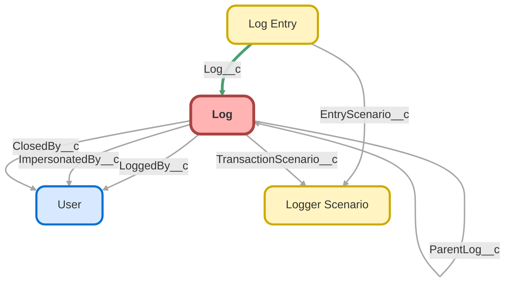

---
hide:
  - path
---

<!-- This file is auto-generated. if you do not want it to be overwritten, set TRUE in the line below -->
<!-- DO_NOT_OVERWRITE_DOC=FALSE -->

## Schema

<!-- Object description -->

## Fields

| Name      | Label | Type | Description |
| :-------- | :---- | :--: | :---------- | 
| ApiReleaseNumber__c | DEPRECATED: API Release Number | Text | The release number for the org's instance - determined by making a callout to status.salesforce.com |
| ApiReleaseVersion__c | DEPRECATED: API Release Version | Text | The release version for the org's instance - determined by making a callout to status.salesforce.com |
| ApiVersion__c | DEPRECATED: API Version | Picklist | The Salesforce release (API version) of the environment |
| AsyncContextChildJobId__c | Async Context Child Job ID | Text | undefined |
| AsyncContextParentJobId__c | Async Context Parent Job ID | Text | undefined |
| AsyncContextTriggerId__c | Async Context Trigger ID | Text | undefined |
| AsyncContextType__c | Async Context Type | Picklist | undefined |
| ClosedBy__c | Closed By | Lookup | undefined |
| ClosedDate__c | Closed Date | DateTime | undefined |
| Comments__c | Comments | LongTextArea | undefined |
| EndTime__c | End Time | Summary | undefined |
| HasComments__c | Has Comments | Checkbox | undefined |
| HasLoggedByFederationIdentifier__c | Has User Federation Identifier | Checkbox | undefined |
| HasOrganizationLimits__c | Has Organization Limits | Checkbox | undefined |
| ImpersonatedBy__c | Impersonated By | Lookup | undefined |
| ImpersonatedByUsernameLink__c | Impersonated By Username | Text | undefined |
| IsClosed__c | Is Closed | Checkbox | undefined |
| IsResolved__c | Is Resolved | Checkbox | undefined |
| Issue__c | Issue | Picklist | undefined |
| Locale__c | Locale | Text | undefined |
| LogEntriesSummary__c | Summary | Text | undefined |
| LoggedBy__c | Logged By | Lookup | undefined |
| LoggedByFederationIdentifier__c | User Federation Identifier | LongTextArea | undefined |
| LoggedByUsername__c | Username | Text | undefined |
| LoggedByUsernameLink__c | Username | Text | undefined |
| LoggedByUsernameText__c | Username | Text | undefined |
| LoggerVersionNumber__c | Logger Version Number | Text | undefined |
| LoginApplication__c | Login Application | Text | undefined |
| LoginBrowser__c | Login Browser | Text | undefined |
| LoginDomain__c | DEPRECATED: Login Domain | Url | undefined |
| LoginHistoryId__c | Login History ID | Text | undefined |
| LoginPlatform__c | Login Platform | Text | undefined |
| LoginType__c | Login Type | Picklist | undefined |
| LogoutUrl__c | Logout URL | Url | undefined |
| LogPurgeAction__c | Log Purge Action | Picklist | undefined |
| LogRetentionDate__c | Log Retention Date | Date | The date that this log can be automatically deleted by the batch job LogBatchPurger.  It defaults to 2 weeks after creation (configurable in Logger Settings), but the date can be set manually or via automation if certain logs need to be kept longer/indefinitely. |
| MaxLogEntryLoggingLevelOrdinal__c | Max Log Entry Logging Level Ordinal | Summary | The highest logging level ordinal of any related log entries |
| NetworkId__c | Site Network ID | Text | The Network ID of the Community user's site. Set with Network.getNetworkId() |
| NetworkLoginUrl__c | Site Login URL | Url | undefined |
| NetworkLogoutUrl__c | Site Logout URL | Url | undefined |
| NetworkName__c | Site Name | Text | The name of the user's Community site (based on NetworkId). |
| NetworkSelfRegistrationUrl__c | Site Self Registration URL | Url | undefined |
| NetworkUrlPathPrefix__c | Site URL Path Prefix | Text | The UrlPathPrefix is a unique string at the end of the URL for this community. For example, in the community URL CommunitiesSubdomainName.force.com/customers, customers is the UrlPathPrefix. |
| OrganizationApiVersion__c | Organization API Version | Picklist | The Salesforce release (API version) of the environment |
| OrganizationDomainUrl__c | Organization Domain URL | Url | The value returned from System.URL.getOrgDomainUrl() |
| OrganizationEnvironmentType__c | Environment Type | Picklist | undefined |
| OrganizationId__c | Organization ID | Text | undefined |
| OrganizationInstanceName__c | Instance Name | Text | undefined |
| OrganizationInstanceReleaseCycle__c | DEPRECATED: Instance Release Cycle | Picklist | undefined |
| OrganizationLimits__c | Organization Limits | LongTextArea | undefined |
| OrganizationLocation__c | Organization Location | Picklist | undefined |
| OrganizationName__c | Organization Name | Text | undefined |
| OrganizationNamespacePrefix__c | Organization Namespace Prefix | Text | undefined |
| OrganizationReleaseNumber__c | Organization Release Number | Text | The release number for the org's instance - determined by making a callout to status.salesforce.com |
| OrganizationReleaseVersion__c | Organization Release Version | Text | The release version for the org's instance - determined by making a callout to status.salesforce.com |
| OrganizationType__c | Organization Type | Picklist | undefined |
| ParentLog__c | Parent Log | Lookup | The log from the original transaction that initiated a child log - for example, batch jobs have start, execute and finish methods. All 3 are considered separate transactions. By using the parent log, logs from all 3 transactions can be linked together. |
| ParentLogLink__c | Parent Log | Text | undefined |
| ParentLogTransactionId__c | Parent Log Transaction ID | Text | undefined |
| ParentSessionId__c | Parent Session ID | Text | undefined |
| Priority__c | Priority | Picklist | undefined |
| ProfileId__c | Profile ID | Text | undefined |
| ProfileLink__c | Profile | Text | undefined |
| ProfileName__c | Profile Name | Text | undefined |
| RequestId__c | Request ID | Text | undefined |
| Scenario__c | DEPRECATED: Scenario | Text | undefined |
| SessionId__c | Session ID | Text | undefined |
| SessionSecurityLevel__c | Session Security Level | Picklist | undefined |
| SessionType__c | Session Type | Picklist | undefined |
| SourceIp__c | Source IP | Text | undefined |
| StartTime__c | Start Time | Summary | undefined |
| Status__c | Status | Picklist | undefined |
| SystemMode__c | System Mode | Picklist | undefined |
| SystemModeSummary__c | System Mode | Text | undefined |
| ThemeDisplayed__c | Theme Displayed | Picklist | undefined |
| TimeZoneId__c | Time Zone ID | Text | undefined |
| TimeZoneName__c | Time Zone Name | Text | undefined |
| TotalDEBUGLogEntries__c | Total DEBUG Entries | Summary | The total number of log entries with logging level == 'DEBUG' |
| TotalERRORLogEntries__c | Total ERROR Entries | Summary | The total number of log entries with logging level == 'ERROR' |
| TotalFINELogEntries__c | Total FINE Entries | Summary | The total number of log entries with logging level == 'FINE' |
| TotalFINERLogEntries__c | Total FINER Entries | Summary | The total number of log entries with logging level == 'FINER' |
| TotalFINESTLogEntries__c | Total FINEST Entries | Summary | The total number of log entries with logging level == 'FINEST' |
| TotalINFOLogEntries__c | Total INFO Entries | Summary | The total number of log entries with logging level == 'INFO' |
| TotalLimitsCpuTimeUsed__c | Total CPU | Summary | undefined |
| TotalLogEntries__c | Total Entries | Number | undefined |
| TotalWARNLogEntries__c | Total WARN Entries | Summary | The total number of log entries with logging level == 'WARN' |
| TransactionId__c | Transaction ID | Text | undefined |
| TransactionScenario__c | Transaction Scenario | Lookup | undefined |
| TransactionScenarioLink__c | Transaction Scenario | Text | undefined |
| TransactionScenarioName__c | Transaction Scenario Name | Text | undefined |
| TransactionScenarioText__c | Transaction Scenario | Text | undefined |
| UserLicenseDefinitionKey__c | User License Definition Key | Picklist | https://developer.salesforce.com/docs/atlas.en-us.object_reference.meta/object_reference/sforce_api_objects_userlicense.htm |
| UserLicenseId__c | User License ID | Text | undefined |
| UserLicenseName__c | User License Name | Picklist | undefined |
| UserLoggingLevel__c | User Logging Level | Picklist | undefined |
| UserLoggingLevelOrdinal__c | User Logging Level Ordinal | Number | undefined |
| UserRoleId__c | User Role ID | Text | undefined |
| UserRoleLink__c | User Role | Text | undefined |
| UserRoleName__c | User Role Name | Text | undefined |
| UserType__c | User Type | Picklist | undefined |
| WasLoggedByCurrentUser__c | Logged By Current User | Checkbox | undefined |

## Related Apex Classes

| Apex Class | Type |
| :----      | :--: | 
| [LogBatchPurgeController](../apex/LogBatchPurgeController.md) | Lightning Controller |
| [LogBatchPurgeController_Tests](../apex/LogBatchPurgeController_Tests.md) | Test |
| [LogBatchPurgeScheduler_Tests](../apex/LogBatchPurgeScheduler_Tests.md) | Test |
| [LogBatchPurger](../apex/LogBatchPurger.md) | Batch |
| [LogBatchPurger_Tests](../apex/LogBatchPurger_Tests.md) | Test |
| [LogEntryEventBuilder](../apex/LogEntryEventBuilder.md) | Class |
| [LogEntryEventBuilder_Tests](../apex/LogEntryEventBuilder_Tests.md) | Test |
| [LogEntryEventHandler](../apex/LogEntryEventHandler.md) | Class |
| [LogEntryEventHandler_Tests](../apex/LogEntryEventHandler_Tests.md) | Test |
| [LogEntryHandler_Tests](../apex/LogEntryHandler_Tests.md) | Test |
| [LogEntryTagHandler](../apex/LogEntryTagHandler.md) | Class |
| [LogEntryTagHandler_Tests](../apex/LogEntryTagHandler_Tests.md) | Test |
| [LogHandler](../apex/LogHandler.md) | Class |
| [LogHandler_Tests](../apex/LogHandler_Tests.md) | Test |
| [LogManagementDataSelector](../apex/LogManagementDataSelector.md) | Class |
| [LogManagementDataSelector_Tests](../apex/LogManagementDataSelector_Tests.md) | Test |
| [LogMassDeleteExtension](../apex/LogMassDeleteExtension.md) | Visualforce Controller |
| [LogMassDeleteExtension_Tests](../apex/LogMassDeleteExtension_Tests.md) | Test |
| [LogViewerController](../apex/LogViewerController.md) | Lightning Controller |
| [LogViewerController_Tests](../apex/LogViewerController_Tests.md) | Test |
| [Logger](../apex/Logger.md) | Invocable |
| [LoggerDataStore_Tests](../apex/LoggerDataStore_Tests.md) | Test |
| [LoggerFieldMapper](../apex/LoggerFieldMapper.md) | Class |
| [LoggerFieldMapper_Tests](../apex/LoggerFieldMapper_Tests.md) | Test |
| [LoggerParameter](../apex/LoggerParameter.md) | Class |
| [LoggerPlugin_Tests](../apex/LoggerPlugin_Tests.md) | Test |
| [LoggerTagHandler](../apex/LoggerTagHandler.md) | Class |
| [LoggerTestConfigurator](../apex/LoggerTestConfigurator.md) | Test |
| [Logger_Tests](../apex/Logger_Tests.md) | Test |
| [RelatedLogEntriesController](../apex/RelatedLogEntriesController.md) | Lightning Controller |
| [RelatedLogEntriesController_Tests](../apex/RelatedLogEntriesController_Tests.md) | Test |
| [Log](../apex/Log.md) | Class |

## Related Lightning Pages

| Lightning Page | Type |
| :----      | :--: | 
| [LogEntryRecordPage](../pages/LogEntryRecordPage.md) |  Record Page |
| [LogRecordPage](../pages/LogRecordPage.md) |  Record Page |
| [LoggerScenarioRecordPage](../pages/LoggerScenarioRecordPage.md) |  Record Page |

## Related Profiles

| Profile | User License |
| :----      | :--: | 
| [Admin](../profiles/Admin.md) |  Salesforce |
| [Analytics Cloud Integration User](../profiles/Analytics%20Cloud%20Integration%20User.md) |  Analytics  Cloud  Integration  User |
| [Analytics Cloud Security User](../profiles/Analytics%20Cloud%20Security%20User.md) |  Analytics  Cloud  Integration  User |
| [Anypoint Integration](../profiles/Anypoint%20Integration.md) |  Identity |
| [B2BMA Integration User](../profiles/B2BMA%20Integration%20User.md) |  B2 B M A  Integration  User |
| [Billing User](../profiles/Billing%20User.md) |  Salesforce |
| [Bot Profile](../profiles/Bot%20Profile.md) |  Salesforce |
| [Business Development](../profiles/Business%20Development.md) |  Salesforce |
| [Call Center](../profiles/Call%20Center.md) |  Salesforce |
| [Chatter External User](../profiles/Chatter%20External%20User.md) |  Chatter  External |
| [Chatter Free User](../profiles/Chatter%20Free%20User.md) |  Chatter  Free |
| [Chatter Moderator User](../profiles/Chatter%20Moderator%20User.md) |  Chatter  Free |
| [Client Onboarding - Admin](../profiles/Client%20Onboarding%20-%20Admin.md) |  Salesforce |
| [Client Onboarding - RM](../profiles/Client%20Onboarding%20-%20RM.md) |  Salesforce |
| [Client Servicing Team](../profiles/Client%20Servicing%20Team.md) |  Salesforce |
| [Compliance Manager](../profiles/Compliance%20Manager.md) |  Salesforce |
| [ContractManager](../profiles/ContractManager.md) |  Salesforce |
| [Director of Operations](../profiles/Director%20of%20Operations.md) |  Salesforce |
| [Director of Sales](../profiles/Director%20of%20Sales.md) |  Salesforce |
| [Distributions](../profiles/Distributions.md) |  Salesforce |
| [Einstein Agent User](../profiles/Einstein%20Agent%20User.md) |  Einstein  Agent |
| [ESW_Agentforce_MIAW_1748035300267 Profile](../profiles/ESW_Agentforce_MIAW_1748035300267%20Profile.md) |  Guest  User  License |
| [ESW_Agentforce_MIAW_1748385215843 Profile](../profiles/ESW_Agentforce_MIAW_1748385215843%20Profile.md) |  Guest  User  License |
| [ESW_CE_Chat_1692890394498 Profile](../profiles/ESW_CE_Chat_1692890394498%20Profile.md) |  Guest  User  License |
| [ESW_CE_Chat_Moe_1693182845676 Profile](../profiles/ESW_CE_Chat_Moe_1693182845676%20Profile.md) |  Guest  User  License |
| [ESW_Login_Help_1697133738638 Profile](../profiles/ESW_Login_Help_1697133738638%20Profile.md) |  Guest  User  License |
| [ESW_Login_Help_Simply_1700075140889 Profile](../profiles/ESW_Login_Help_Simply_1700075140889%20Profile.md) |  Guest  User  License |
| [ESW_Omni_Messaging_1694183770479 Profile](../profiles/ESW_Omni_Messaging_1694183770479%20Profile.md) |  Guest  User  License |
| [ESW_Omni_Messaging_CO_1696448547822 Profile](../profiles/ESW_Omni_Messaging_CO_1696448547822%20Profile.md) |  Guest  User  License |
| [ESW_Omni_Messaging_Sallus_1700075448386 Profile](../profiles/ESW_Omni_Messaging_Sallus_1700075448386%20Profile.md) |  Guest  User  License |
| [ESW_Omni_Messaging_Simply_1700076370188 Profile](../profiles/ESW_Omni_Messaging_Simply_1700076370188%20Profile.md) |  Guest  User  License |
| [ESW_QA_Login_1699666348585 Profile](../profiles/ESW_QA_Login_1699666348585%20Profile.md) |  Guest  User  License |
| [ESW_QA_Messaging_1699974036493 Profile](../profiles/ESW_QA_Messaging_1699974036493%20Profile.md) |  Guest  User  License |
| [ESW_Sales_Chat_1697460991337 Profile](../profiles/ESW_Sales_Chat_1697460991337%20Profile.md) |  Guest  User  License |
| [ESW_Sallus_Login_Chat_1700072925200 Profile](../profiles/ESW_Sallus_Login_Chat_1700072925200%20Profile.md) |  Guest  User  License |
| [External Apps Login User](../profiles/External%20Apps%20Login%20User.md) |  External  Apps  Login |
| [Finance Manager Lightning](../profiles/Finance%20Manager%20Lightning.md) |  Salesforce |
| [Guest License User](../profiles/Guest%20License%20User.md) |  Guest  User  License |
| [Help Center Profile](../profiles/Help%20Center%20Profile.md) |  Guest  User  License |
| [Identity User](../profiles/Identity%20User.md) |  Identity |
| [Incoming_SMS Profile](../profiles/Incoming_SMS%20Profile.md) |  Guest  User  License |
| [IT](../profiles/IT.md) |  Salesforce |
| [Leadership Lightning](../profiles/Leadership%20Lightning.md) |  Salesforce |
| [Leadership](../profiles/Leadership.md) |  Salesforce |
| [Learning %26 Development](../profiles/Learning%20%2526%20Development.md) |  Salesforce |
| [Lightning Client Onboarding](../profiles/Lightning%20Client%20Onboarding.md) |  Salesforce |
| [Lightning Compliance](../profiles/Lightning%20Compliance.md) |  Salesforce |
| [Lightning Saver User](../profiles/Lightning%20Saver%20User.md) |  Salesforce |
| [Lightning Service Manager](../profiles/Lightning%20Service%20Manager.md) |  Salesforce |
| [Lightning Service User](../profiles/Lightning%20Service%20User.md) |  Salesforce |
| [Marketing Team](../profiles/Marketing%20Team.md) |  Salesforce |
| [MarketingProfile](../profiles/MarketingProfile.md) |  Salesforce |
| [Master Administrator](../profiles/Master%20Administrator.md) |  Salesforce |
| [Minimum Access - API Only Integrations](../profiles/Minimum%20Access%20-%20API%20Only%20Integrations.md) |  Salesforce  Integration |
| [Minimum Access - Salesforce](../profiles/Minimum%20Access%20-%20Salesforce.md) |  Salesforce |
| [myubiquity Profile](../profiles/myubiquity%20Profile.md) |  Guest  User  License |
| [Operations VP](../profiles/Operations%20VP.md) |  Salesforce |
| [Operations](../profiles/Operations.md) |  Salesforce |
| [Paradigm Help Center Profile](../profiles/Paradigm%20Help%20Center%20Profile.md) |  Guest  User  License |
| [Payroll Koncierge](../profiles/Payroll%20Koncierge.md) |  Salesforce |
| [Payroll Team](../profiles/Payroll%20Team.md) |  Salesforce |
| [People %26 Culture](../profiles/People%20%2526%20Culture.md) |  Salesforce |
| [Pre-chat Site Profile](../profiles/Pre-chat%20Site%20Profile.md) |  Guest  User  License |
| [Product Innovation Leadership](../profiles/Product%20Innovation%20Leadership.md) |  Salesforce |
| [Product Innovation User](../profiles/Product%20Innovation%20User.md) |  Salesforce |
| [PSM Team](../profiles/PSM%20Team.md) |  Salesforce |
| [R%26W](../profiles/R%2526W.md) |  Salesforce |
| [Read Only](../profiles/Read%20Only.md) |  Salesforce |
| [Sales Administrator](../profiles/Sales%20Administrator.md) |  Salesforce |
| [Sales Coordinator](../profiles/Sales%20Coordinator.md) |  Salesforce |
| [Sales Insights Integration User](../profiles/Sales%20Insights%20Integration%20User.md) |  Sales  Insights  Integration  User |
| [Sales Team - Limited](../profiles/Sales%20Team%20-%20Limited.md) |  Salesforce |
| [Sales Team](../profiles/Sales%20Team.md) |  Salesforce |
| [Salesforce API Only System Integrations](../profiles/Salesforce%20API%20Only%20System%20Integrations.md) |  Salesforce  Integration |
| [SalesforceIQ Integration User](../profiles/SalesforceIQ%20Integration%20User.md) |  Salesforce I Q  Integration  User |
| [Saver Manager](../profiles/Saver%20Manager.md) |  Salesforce |
| [Simple Survey Profile](../profiles/Simple%20Survey%20Profile.md) |  Guest  User  License |
| [Simply Help Center Profile](../profiles/Simply%20Help%20Center%20Profile.md) |  Guest  User  License |
| [SolutionManager](../profiles/SolutionManager.md) |  Salesforce |
| [Standard](../profiles/Standard.md) |  Salesforce |
| [StandardAul](../profiles/StandardAul.md) |  Salesforce  Platform |
| [Super System Administrator](../profiles/Super%20System%20Administrator.md) |  Salesforce |
| [Sys Dev Admin](../profiles/Sys%20Dev%20Admin.md) |  Salesforce |
| [Transitions Team](../profiles/Transitions%20Team.md) |  Salesforce |
| [Ubiquity Help Center Profile](../profiles/Ubiquity%20Help%20Center%20Profile.md) |  Guest  User  License |
| [Zoom Webhooks Profile](../profiles/Zoom%20Webhooks%20Profile.md) |  Guest  User  License |

## Related Permission Sets

| Permission Set | User License |
| :----      | :--: | 
| [Attachments_and_Notes_Migrator](../permissionsets/Attachments_and_Notes_Migrator.md) | None |
| [Automation_Team_Imp_Project_Tasks](../permissionsets/Automation_Team_Imp_Project_Tasks.md) | None |
| [Data_Loader](../permissionsets/Data_Loader.md) | None |
| [Developer](../permissionsets/Developer.md) | None |
| [LoggerAdmin](../permissionsets/LoggerAdmin.md) | None |
| [LoggerEndUser](../permissionsets/LoggerEndUser.md) | None |
| [LoggerLogViewer](../permissionsets/LoggerLogViewer.md) | None |
| [MagicMover](../permissionsets/MagicMover.md) | None |
| [Manager](../permissionsets/Manager.md) | None |
| [Master](../permissionsets/Master.md) | None |
| [Modify_All](../permissionsets/Modify_All.md) | None |
| [sfdcInternalInt__sfdc_a360_sfcrm_data_extract](../permissionsets/sfdcInternalInt__sfdc_a360_sfcrm_data_extract.md) | None |
| [sfdcInternalInt__sfdc_articlerecommendations](../permissionsets/sfdcInternalInt__sfdc_articlerecommendations.md) | None |
| [sfdcInternalInt__sfdc_einsteinagent](../permissionsets/sfdcInternalInt__sfdc_einsteinagent.md) | None |
| [sfdcInternalInt__sfdc_replyrecommendations](../permissionsets/sfdcInternalInt__sfdc_replyrecommendations.md) | None |
| [sfdcInternalInt__sfdc_slack](../permissionsets/sfdcInternalInt__sfdc_slack.md) | None |
| [View_All](../permissionsets/View_All.md) | None |
| [Zoom_Admin_Webinar](../permissionsets/Zoom_Admin_Webinar.md) | None |
| [Zoom_User_Webinar](../permissionsets/Zoom_User_Webinar.md) | None |

_Documentation generated with [sfdx-hardis](https://sfdx-hardis.cloudity.com), by [Cloudity](https://www.cloudity.com/) & [friends](https://github.com/hardisgroupcom/sfdx-hardis/graphs/contributors)_
