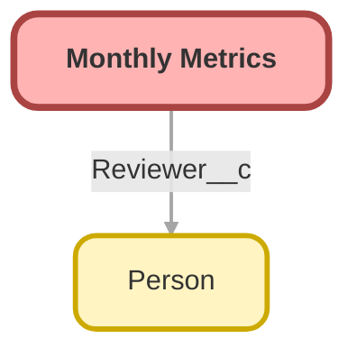

---
hide:
  - path
---

<!-- This file is auto-generated. if you do not want it to be overwritten, set TRUE in the line below -->
<!-- DO_NOT_OVERWRITE_DOC=FALSE -->

## Schema

<!-- Object description -->

## Fields

| Name      | Label | Type | Description |
| :-------- | :---- | :--: | :---------- | 
| Abandoned_Plans__c | Abandoned Plans | Number | Total abandoned plans that completed last month |
| Active_Not_Yet_Funded_Plans__c | Active Not Yet Funded Plans | Number | undefined |
| Advisor_Count__c | Advisor Count | Number | Total number of advisors as of 1st of the month |
| BBB_Review_Score__c | BBB Review Score | Number | BBB Review score as of the 1st of the month |
| Builder_Plans__c | Builder Plans | Number | undefined |
| Cases_Opened__c | Cases Opened | Number | Total number of cases opened last month |
| Cases_Resolved__c | Cases Resolved | Number | Total number of cases resolved last month |
| Completed_Onboardings__c | Completed Onboardings | Number | Total number of implementation records marked complete last month |
| Completed_SK_Onboardings__c | Completed SK+ Onboardings | Number | Number of SK+ plans that completed onboarding last month |
| Contract_Terms_401k__c | 401(k) Contract Terms | Number | All contract terms, excluding Single(k), that completed last month. |
| CSAT_for_the_Period__c | CSAT for the Period | Number | Overall client satisfaction for the past month |
| Current_Open_CE_Cases__c | Current Open CE Cases | Number | Total number of open CE cases as of the 1st of the month |
| Current_Plan_Count__c | Current Plan Count | Number | Total number of plans as of the first of the month that have signed their A4S and have not no-started or transitioned. |
| Custom_k_Plans__c | Custom(k) Plans | Number | undefined |
| Decons__c | Decons | Number | Total deconversions that completed last month |
| Express_k_Plans__c | Express(k) Plans | Number | Total active Express(k) plans as of the first of the month |
| First_Day_of_Month__c | First Day of Month | Date | undefined |
| Franchise_Plans__c | Franchise Plans | Number | undefined |
| Full_Service_Imps_in_Progress__c | Full Service Imps in Progress | Number | Total number of in-progress full service implementations as of the 1st of the month |
| Full_Service_No_Starts__c | Full Service No Starts | Number | undefined |
| Google_Review_Score__c | Google Review Score | Number | Google Review Score as of the 1st of the month |
| Last_Day_of_Month__c | Last Day of Month | Date | undefined |
| Megaroth_Plans__c | Mega Roth Plans | Number | undefined |
| MML_Plans__c | MML Plans | Number | undefined |
| Month__c | Month | Picklist | undefined |
| New_Advisors_Added__c | New Advisors Added | Number | Number of new advisor contacts added last month |
| New_Partnerships_Launched__c | New Partnerships Launched | Number | Number of BD Opportunities that closed with contract last month |
| New_Plan_Sales__c | New Plan Sales | Number | Total number of new plan sales last month |
| No_Starts_Last_Month__c | No Starts Last Month | Number | undefined |
| Partner_Plans__c | Partner Plans | Number | undefined |
| Reserve_k_Plans__c | Reserve(k) Plans | Number | undefined |
| Review_Date__c | Review Date | Date | Date this record was reviewed for accuracy |
| Reviewer__c | Reviewer | Lookup | Person that reviewed this record for accuracy |
| RKO_Plans__c | RKO Plans | Number | undefined |
| Saver_k_Plans__c | Saver(k) Plans | Number | Total active Saver(k) Plans as of the 1st of the month |
| Simply_Bundled_Plans__c | Simply Bundled Plans | Number | Total active Bundled Plans as of the 1st of the month |
| Simply_Unbundled_Plans__c | Simply Unbundled Plans | Number | Total active unbundled Plans as of the 1st of the month |
| Single_k_Contact_Terms__c | Single(k) Contact Terms | Number | Number of SK contract terms last month |
| Single_k_Plans__c | Single(k) Plans | Number | undefined |
| SK_Abandoned_Plans__c | SK+ Abandoned Plans | Number | undefined |
| SK_Decons__c | SK+ Decons | Number | undefined |
| SK_Imps_in_Progress__c | SK+ Imps in Progress | Number | Number of SK+ plans in the onboarding process |
| SK_No_Starts__c | SK+ No Starts | Number | undefined |
| SK_Term_Merger__c | SK+ Term Merger | Number | undefined |
| SK_Transitions_Pending__c | SK Transitions Pending | Number | Number of SK plans currently transitioning |
| SKPlus_Plans__c | SK+ Plans | Number | undefined |
| SKplus_Terms__c | SK+ Terms | Number | undefined |
| Starter_Plans__c | Starter Plans | Number | undefined |
| Term_Mergers__c | Term Mergers | Number | Total number of Term Mergers that completed last month |
| Terms__c | Terms | Number | undefined |
| Total_401_k_Plans__c | Total # of 401(k) Plans | Number | undefined |
| Total_401_k_Sales__c | Total 401(k) Sales | Number | Number of 401(k) sales that closed last month |
| Total_of_PEP_Plans__c | Total # of PEP Plans | Number | undefined |
| Total_PEP_Sales__c | Total PEP Sales | Number | Total number of PEP sales that closed last month |
| Total_Plan_Billable_Headcount__c | Total Plan Billable Headcount | Number | Total number of all employees on all plans with over $100. |
| Total_Single_k_Plans__c | Total # of Single(k) Plans | Number | undefined |
| Total_Single_k_Sales__c | Total Single(k) Sales | Number | Total SK plan sales that closed last month |
| Total_Transitions_Completed_Last_Month__c | Total Transitions Completed Last Month | Number | undefined |
| Transitions_Pending__c | Transitions Pending | Number | Number of open transition records as of the 1st of the month |
| TrustPilot_Review_Score__c | TrustPilot Review Score | Number | Score from TrustPilot as of the 1st of the month |

## Related Flows

| Object | Name      | Type | Description |
| :----  | :-------- | :--: | :---------- | 
| 💻 | [Monthly_Metrics_Autolaunched_Create_Monthly_Metric_Records](../flows/Monthly_Metrics_Autolaunched_Create_Monthly_Metric_Records.md) [🕒](../flows/Monthly_Metrics_Autolaunched_Create_Monthly_Metric_Records-history.md) |  Auto Launched Flow | <!-- --> |

## Related Lightning Pages

| Lightning Page | Type |
| :----      | :--: | 
| [Monthly_Metrics_Record_Page](../pages/Monthly_Metrics_Record_Page.md) |  Record Page |

## Related Profiles

| Profile | User License |
| :----      | :--: | 
| [Admin](../profiles/Admin.md) |  Salesforce |
| [Analytics Cloud Integration User](../profiles/Analytics%20Cloud%20Integration%20User.md) |  Analytics  Cloud  Integration  User |
| [Analytics Cloud Security User](../profiles/Analytics%20Cloud%20Security%20User.md) |  Analytics  Cloud  Integration  User |
| [Anypoint Integration](../profiles/Anypoint%20Integration.md) |  Identity |
| [B2BMA Integration User](../profiles/B2BMA%20Integration%20User.md) |  B2 B M A  Integration  User |
| [Billing User](../profiles/Billing%20User.md) |  Salesforce |
| [Bot Profile](../profiles/Bot%20Profile.md) |  Salesforce |
| [Business Development](../profiles/Business%20Development.md) |  Salesforce |
| [Call Center](../profiles/Call%20Center.md) |  Salesforce |
| [Chatter External User](../profiles/Chatter%20External%20User.md) |  Chatter  External |
| [Chatter Free User](../profiles/Chatter%20Free%20User.md) |  Chatter  Free |
| [Chatter Moderator User](../profiles/Chatter%20Moderator%20User.md) |  Chatter  Free |
| [Client Onboarding - Admin](../profiles/Client%20Onboarding%20-%20Admin.md) |  Salesforce |
| [Client Onboarding - RM](../profiles/Client%20Onboarding%20-%20RM.md) |  Salesforce |
| [Client Servicing Team](../profiles/Client%20Servicing%20Team.md) |  Salesforce |
| [Compliance Manager](../profiles/Compliance%20Manager.md) |  Salesforce |
| [ContractManager](../profiles/ContractManager.md) |  Salesforce |
| [Director of Operations](../profiles/Director%20of%20Operations.md) |  Salesforce |
| [Director of Sales](../profiles/Director%20of%20Sales.md) |  Salesforce |
| [Distributions](../profiles/Distributions.md) |  Salesforce |
| [Einstein Agent User](../profiles/Einstein%20Agent%20User.md) |  Einstein  Agent |
| [ESW_Agentforce_MIAW_1748035300267 Profile](../profiles/ESW_Agentforce_MIAW_1748035300267%20Profile.md) |  Guest  User  License |
| [ESW_Agentforce_MIAW_1748385215843 Profile](../profiles/ESW_Agentforce_MIAW_1748385215843%20Profile.md) |  Guest  User  License |
| [ESW_CE_Chat_1692890394498 Profile](../profiles/ESW_CE_Chat_1692890394498%20Profile.md) |  Guest  User  License |
| [ESW_CE_Chat_Moe_1693182845676 Profile](../profiles/ESW_CE_Chat_Moe_1693182845676%20Profile.md) |  Guest  User  License |
| [ESW_Login_Help_1697133738638 Profile](../profiles/ESW_Login_Help_1697133738638%20Profile.md) |  Guest  User  License |
| [ESW_Login_Help_Simply_1700075140889 Profile](../profiles/ESW_Login_Help_Simply_1700075140889%20Profile.md) |  Guest  User  License |
| [ESW_Omni_Messaging_1694183770479 Profile](../profiles/ESW_Omni_Messaging_1694183770479%20Profile.md) |  Guest  User  License |
| [ESW_Omni_Messaging_CO_1696448547822 Profile](../profiles/ESW_Omni_Messaging_CO_1696448547822%20Profile.md) |  Guest  User  License |
| [ESW_Omni_Messaging_Sallus_1700075448386 Profile](../profiles/ESW_Omni_Messaging_Sallus_1700075448386%20Profile.md) |  Guest  User  License |
| [ESW_Omni_Messaging_Simply_1700076370188 Profile](../profiles/ESW_Omni_Messaging_Simply_1700076370188%20Profile.md) |  Guest  User  License |
| [ESW_QA_Login_1699666348585 Profile](../profiles/ESW_QA_Login_1699666348585%20Profile.md) |  Guest  User  License |
| [ESW_QA_Messaging_1699974036493 Profile](../profiles/ESW_QA_Messaging_1699974036493%20Profile.md) |  Guest  User  License |
| [ESW_Sales_Chat_1697460991337 Profile](../profiles/ESW_Sales_Chat_1697460991337%20Profile.md) |  Guest  User  License |
| [ESW_Sallus_Login_Chat_1700072925200 Profile](../profiles/ESW_Sallus_Login_Chat_1700072925200%20Profile.md) |  Guest  User  License |
| [External Apps Login User](../profiles/External%20Apps%20Login%20User.md) |  External  Apps  Login |
| [Finance Manager Lightning](../profiles/Finance%20Manager%20Lightning.md) |  Salesforce |
| [Guest License User](../profiles/Guest%20License%20User.md) |  Guest  User  License |
| [Help Center Profile](../profiles/Help%20Center%20Profile.md) |  Guest  User  License |
| [Identity User](../profiles/Identity%20User.md) |  Identity |
| [Incoming_SMS Profile](../profiles/Incoming_SMS%20Profile.md) |  Guest  User  License |
| [IT](../profiles/IT.md) |  Salesforce |
| [Leadership Lightning](../profiles/Leadership%20Lightning.md) |  Salesforce |
| [Leadership](../profiles/Leadership.md) |  Salesforce |
| [Learning %26 Development](../profiles/Learning%20%2526%20Development.md) |  Salesforce |
| [Lightning Client Onboarding](../profiles/Lightning%20Client%20Onboarding.md) |  Salesforce |
| [Lightning Compliance](../profiles/Lightning%20Compliance.md) |  Salesforce |
| [Lightning Saver User](../profiles/Lightning%20Saver%20User.md) |  Salesforce |
| [Lightning Service Manager](../profiles/Lightning%20Service%20Manager.md) |  Salesforce |
| [Lightning Service User](../profiles/Lightning%20Service%20User.md) |  Salesforce |
| [Marketing Team](../profiles/Marketing%20Team.md) |  Salesforce |
| [MarketingProfile](../profiles/MarketingProfile.md) |  Salesforce |
| [Master Administrator](../profiles/Master%20Administrator.md) |  Salesforce |
| [Minimum Access - API Only Integrations](../profiles/Minimum%20Access%20-%20API%20Only%20Integrations.md) |  Salesforce  Integration |
| [Minimum Access - Salesforce](../profiles/Minimum%20Access%20-%20Salesforce.md) |  Salesforce |
| [myubiquity Profile](../profiles/myubiquity%20Profile.md) |  Guest  User  License |
| [Operations VP](../profiles/Operations%20VP.md) |  Salesforce |
| [Operations](../profiles/Operations.md) |  Salesforce |
| [Paradigm Help Center Profile](../profiles/Paradigm%20Help%20Center%20Profile.md) |  Guest  User  License |
| [Payroll Koncierge](../profiles/Payroll%20Koncierge.md) |  Salesforce |
| [Payroll Team](../profiles/Payroll%20Team.md) |  Salesforce |
| [People %26 Culture](../profiles/People%20%2526%20Culture.md) |  Salesforce |
| [Pre-chat Site Profile](../profiles/Pre-chat%20Site%20Profile.md) |  Guest  User  License |
| [Product Innovation Leadership](../profiles/Product%20Innovation%20Leadership.md) |  Salesforce |
| [Product Innovation User](../profiles/Product%20Innovation%20User.md) |  Salesforce |
| [PSM Team](../profiles/PSM%20Team.md) |  Salesforce |
| [R%26W](../profiles/R%2526W.md) |  Salesforce |
| [Read Only](../profiles/Read%20Only.md) |  Salesforce |
| [Sales Administrator](../profiles/Sales%20Administrator.md) |  Salesforce |
| [Sales Coordinator](../profiles/Sales%20Coordinator.md) |  Salesforce |
| [Sales Insights Integration User](../profiles/Sales%20Insights%20Integration%20User.md) |  Sales  Insights  Integration  User |
| [Sales Team - Limited](../profiles/Sales%20Team%20-%20Limited.md) |  Salesforce |
| [Sales Team](../profiles/Sales%20Team.md) |  Salesforce |
| [Salesforce API Only System Integrations](../profiles/Salesforce%20API%20Only%20System%20Integrations.md) |  Salesforce  Integration |
| [SalesforceIQ Integration User](../profiles/SalesforceIQ%20Integration%20User.md) |  Salesforce I Q  Integration  User |
| [Saver Manager](../profiles/Saver%20Manager.md) |  Salesforce |
| [Simple Survey Profile](../profiles/Simple%20Survey%20Profile.md) |  Guest  User  License |
| [Simply Help Center Profile](../profiles/Simply%20Help%20Center%20Profile.md) |  Guest  User  License |
| [SolutionManager](../profiles/SolutionManager.md) |  Salesforce |
| [Standard](../profiles/Standard.md) |  Salesforce |
| [StandardAul](../profiles/StandardAul.md) |  Salesforce  Platform |
| [Super System Administrator](../profiles/Super%20System%20Administrator.md) |  Salesforce |
| [Sys Dev Admin](../profiles/Sys%20Dev%20Admin.md) |  Salesforce |
| [Transitions Team](../profiles/Transitions%20Team.md) |  Salesforce |
| [Ubiquity Help Center Profile](../profiles/Ubiquity%20Help%20Center%20Profile.md) |  Guest  User  License |
| [Zoom Webhooks Profile](../profiles/Zoom%20Webhooks%20Profile.md) |  Guest  User  License |

## Related Permission Sets

| Permission Set | User License |
| :----      | :--: | 
| [Attachments_and_Notes_Migrator](../permissionsets/Attachments_and_Notes_Migrator.md) | None |
| [Data_Loader](../permissionsets/Data_Loader.md) | None |
| [Developer](../permissionsets/Developer.md) | None |
| [MagicMover](../permissionsets/MagicMover.md) | None |
| [Manager](../permissionsets/Manager.md) | None |
| [Master](../permissionsets/Master.md) | None |
| [Modify_All](../permissionsets/Modify_All.md) | None |
| [Monthly_Metrics](../permissionsets/Monthly_Metrics.md) | None |
| [sfdcInternalInt__sfdc_a360_sfcrm_data_extract](../permissionsets/sfdcInternalInt__sfdc_a360_sfcrm_data_extract.md) | None |
| [sfdcInternalInt__sfdc_slack](../permissionsets/sfdcInternalInt__sfdc_slack.md) | None |
| [View_All](../permissionsets/View_All.md) | None |

_Documentation generated with [sfdx-hardis](https://sfdx-hardis.cloudity.com), by [Cloudity](https://www.cloudity.com/) & [friends](https://github.com/hardisgroupcom/sfdx-hardis/graphs/contributors)_
