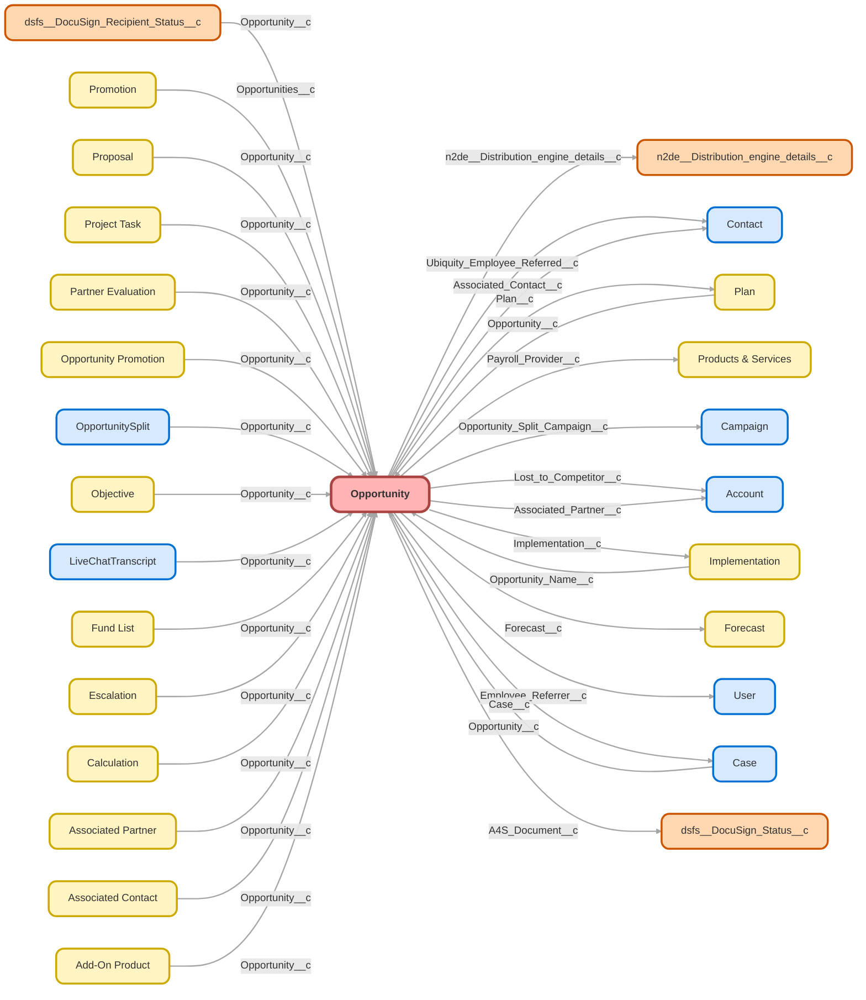

---
hide:
  - path
---

<!-- This file is auto-generated. if you do not want it to be overwritten, set TRUE in the line below -->
<!-- DO_NOT_OVERWRITE_DOC=FALSE -->

## Schema

<!-- Object description -->

## Fields

| Name      | Label | Type | Description |
| :-------- | :---- | :--: | :---------- | 
| A4S_Document__c | A4S Document | Lookup | undefined |
| A4S_Link__c | A4S Link | Text | This is the link to send to Clients to access the buy process. |
| A4S_Needs_Review__c | A4S Needs Review | Checkbox | undefined |
| AccountId |  | Lookup | undefined |
| Actual_Hours_Worked__c | Actual Hours Worked | Number | Actual hours worked by Ubiquity teams to complete the task. |
| Additional_Financial_Professional_Emails__c | Additional Financial Professional Emails | TextArea | undefined |
| Additional_Financial_Professional_Names__c | Additional Financial Professional Names | TextArea | undefined |
| Advisor_Fees_Paid_from_ESA__c | Advisor Fees Paid from ESA | Picklist | Will advisor fees be paid from ERISA Spend Account? |
| Advisor_Linked__c | Advisor Linked | Checkbox | undefined |
| affectlayer__AffectLayer_Notes__c | AffectLayer | Text | undefined |
| Agreement_for_Services_A4S__c | Agreement for Services (A4S) | Checkbox | Can only be checked by Billing if A4S been approved? |
| All_Traffic_Sources__c | All Traffic Sources | LongTextArea | undefined |
| Amount |  |  | undefined |
| Amount_Before_Discount__c | Amount Before Discount | Currency | Total amount prior to Discount application |
| Ancillary_Bill_Discount__c | Ancillary Bill Discount | Currency | Dollar amount of ancillary bill discount |
| Ancillary_Billing_Category__c | Category | Picklist | Reason for the ancillary bill |
| Ancillary_Discount_Reason__c | Ancillary Discount Reason | Picklist | Reason for Ancillary Billing Discount |
| Ancillary_Services_Included__c | Ancillary Services Included | Checkbox | undefined |
| Annual_Leads__c | Annual Leads | Number | Estimated number of Annual Leads delivered by relationship |
| Approval_Status__c | Approval Status | Picklist | Used to show approval status. |
| AS_k_Paid__c | AS(k) Paid | Checkbox | Billing will check off this field once the payment was sent to the referral source |
| Associated_Contact__c | Associated Contact | Lookup | Contact that is associated with the opp. (i.e. Advisor, Lead Referrer, etc). This field will be used to link advisors and people who refer leads to Ubiquity. |
| Associated_Contact_Role__c | Associated Contact Role | Picklist | What role does this Contact play on the Opportunity? |
| Associated_Partner__c | Asssociated Partner | Lookup | Populate the associated partner's account. Most often used for Advisors or someone else who will be involved in the purchase decision. |
| Asssociated_Partner_Role__c | Associated Partner Role | Picklist | What role does this Partner play for this Opportunity? |
| Authority__c | Authority | Picklist | undefined |
| Authorization_Form_Received__c | Authorization Form Received | Date | undefined |
| Auto_Enroll_Contribution_Increase__c | Auto-Enroll Contribution Increase | Picklist | undefined |
| Auto_Enroll_Escalation_Type__c | Auto Enroll Escalation Type | Picklist | undefined |
| Auto_Enrollment_Deferral_Escalation_Rate__c | Auto-Enrollment Deferral/Escalation Rate | Picklist | undefined |
| Auto_EnrollmentDeferral_Escalation_Rate__c | Auto-Enrollment Deferral/Escalation GLOB | Picklist | Deferral rate participant will be given for auto-enrollment. Flat rates do not auto-escalate. |
| AutoEnrollment__c | Auto-Enrollment | Picklist | Will the plan be utilizing Auto-Enrollment, and if so what type? |
| Billing_City__c | Billing City | Text | undefined |
| Billing_State__c | Billing State | Text | undefined |
| Billing_Street__c | Billing Street | Text | undefined |
| Billing_Zip_Code__c | Billing Zip Code | Text | undefined |
| Brokerage_Accounts_PCRA__c | Brokerage Accounts (PCRA) | Picklist | Will plan allow for brokerage accounts? |
| Budget__c | Budget | Picklist | undefined |
| Business_Unit__c | Business Unit | Picklist | undefined |
| Campaign_Code__c | Campaign Code | Text | undefined |
| CampaignId |  | Lookup | undefined |
| Case__c | Case # | Lookup | # of the case your team was working that led top the creation of this opportunity. |
| Case_Status__c | Case Status | Text | undefined |
| Channel__c | Channel | Text | This populated from The Account Page |
| Close_Date_Month_Day__c | Close Date (Month, Day) | Date | undefined |
| Closed_Lost_Reason__c | Closed Lost Reason | Picklist | undefined |
| Closed_Lost_Write_In_Detail__c | Closed Lost Write In Detail | Text | undefined |
| CloseDate |  |  | undefined |
| Commissionable_Amount__c | Commissionable Amount | Currency | undefined |
| Commissionable_Amount_Editable__c | Commissionable Amount | Currency | undefined |
| Compliance_Approved__c | Compliance Approved | Checkbox | Has Compliance Approved the Upgrade? |
| Connected_Partner__c | Connected Partner | Text | Partner with Shared SLA. If edit needed please do so on account. |
| Connected_Partner_Rep__c | Connected Partner Rep | Text | undefined |
| ContractId |  | Lookup | undefined |
| Conversion_Assets__c | Conversion Assets | Currency | Amount of incoming Conversion Assets |
| Conversion_Type__c | Conversion Type | Picklist | What type of plan will the prospect be converting from? This effects how the plan is implemented. |
| Created_Date__c | Created Date (Month, Day) | Date | Returns Month and Date Created for Year over Year Comparisons |
| Created_from_Lead__c | Created from Lead | Checkbox | undefined |
| CRG_Owner__c | CRG Owner | Text | undefined |
| Current_Payroll_Provider__c | Current Payroll Provider | Text | undefined |
| Custodian__c | Custodian | Picklist | undefined |
| Custodian_Other__c | Custodian (Other) | Text | Write-in field for other Custodians |
| Custom_Fund_List_Included__c | Custom Fund List Included | Checkbox | undefined |
| DeconTermReason__c | Decon / Term Reason | Picklist | undefined |
| DefaultStagefromLeadDoNotCallCustom__c | DefaultStagefromLeadDoNotCallCustom | Checkbox | This field mapped to Lead field DoNotCallCustom-StageDefault and used in workflow rules to set Stage |
| Deferral_Change_Frequency__c | Deferral Change Frequency | Picklist | How often can employees change their deferrals in the plan? |
| Delinquent_Payer_Termination__c | Delinquent Payer Termination | Picklist | This field needs to appear on a report that compliance runs annually.   The default answer would be No unless Yes is selected by Accounting folks. If yes, is selected, the client didn’t pay their final term/decon fees and no final filings will be prepared. |
| Description |  |  | undefined |
| Desired_Plan_Start_Date__c | Desired Plan Start Date | Date | When does the client want their plan to start? |
| Discount__c | Discount | Currency | Discount as a flat dollar amount from total |
| Discount_Notes__c | Discount Notes | TextArea | Any pertinent notes on discount being given. |
| Discount_Percentage__c | Discount Percentage | Percent | Enter Discount as a Percentage of total fee |
| Discretionary_Match__c | Discretionary Match | Picklist | Is the Decision Maker considering a Discretionary Match |
| Discretionary_Match_Notes__c | Discretionary Match Formula/Notes | Text | Potential formula discussed with decision maker |
| Discretionary_Match_Vesting_Schedule__c | Discretionary Match Vesting Schedule | Picklist | When are Discretionary Matching contributions vested to participants? |
| Distribution__c | Distribution | Picklist | 1 = No ability to distribute 401(k) 5 = Wholesaling force and/or moderate digital distribution infrastructure in place. Some proven experience selling small-businesses 10 = Intensive wholesaling force. Comprehensive digital distribution. Proven ability |
| Document_Pre_Approval_Completed__c | Document Pre-Approval Completed | Checkbox | undefined |
| EIN__c | EIN | Text | Used for Validation Rules |
| Eligibility_Age__c | Eligibility Age | Picklist | What is the age participants are eligible for the plan? |
| Employee_Default_Contribution_Rate__c | Employee Default Contribution Rate | Picklist | undefined |
| Employee_Referral_Paid__c | Employee Referral Paid | Checkbox | undefined |
| Employee_Referrer__c | Employee Referrer | Lookup | undefined |
| Enhanced_Payroll_Services_Type__c | Enhanced Payroll Services Type | Picklist | Level of EPS Services purchased |
| Escalated__c | Escalated | Checkbox | undefined |
| Estimated_Hours_Needed__c | Estimated Hours Needed | Number | Estimated number of hours needed to complete the project. |
| ExpectedRevenue |  |  | undefined |
| External_ID__c | NetSuite Id | Text | Used by the Jitterbit integration and holds the NetSuite Id for the corresponding NS Opportunity |
| Final_5500_Complete__c | Final 5500 Complete | Checkbox | Has Compliance completed the final 5500 for this plan? |
| Forecast__c | Forecast | Lookup | What forecast does this opportunity fall into? |
| Fund_List__c | Fund List | Picklist | undefined |
| Funding__c | Funding | Picklist | 1 = 401(k) severely underfunded. Little to no budget for small business 401(k). 5 = Budget available; argument need be made. 10 = Rich, allocated budget for small-business sales, marketing, operations, and integrations. |
| GA_Client_ID_Formula__c | GA Client ID (Formula) | Text | undefined |
| gaconnector_Browser__c | Browser | Text | undefined |
| gaconnector_City__c | City | Text | undefined |
| gaconnector_Country__c | Country | Text | undefined |
| gaconnector_Device__c | Device | Text | undefined |
| gaconnector_First_Click_Campaign__c | First Click Campaign | Text | undefined |
| gaconnector_First_Click_Channel__c | First Click Channel | Text | undefined |
| gaconnector_First_Click_Content__c | First Click Content | Text | undefined |
| gaconnector_First_Click_Landing_Page__c | First Click Landing Page | Text | undefined |
| gaconnector_First_Click_Medium__c | First Click Medium | Text | undefined |
| gaconnector_First_Click_Referrer__c | First Click Referrer | Text | undefined |
| gaconnector_First_Click_Source__c | First Click Source | Text | undefined |
| gaconnector_First_Click_Term__c | First Click Term | Text | undefined |
| gaconnector_Google_Analytics_Client_ID__c | Google Analytics Client ID | Text | undefined |
| gaconnector_Google_Analytics_Link__c | Google Analytics Link | Text | undefined |
| gaconnector_IP_Address__c | IP Address | Text | undefined |
| gaconnector_Last_Click_Campaign__c | Last Click Campaign | Text | undefined |
| gaconnector_Last_Click_Channel__c | Last Click Channel | Text | undefined |
| gaconnector_Last_Click_Content__c | Last Click Content | Text | undefined |
| gaconnector_Last_Click_Landing_Page__c | Last Click Landing Page | Text | undefined |
| gaconnector_Last_Click_Medium__c | Last Click Medium | Text | undefined |
| gaconnector_Last_Click_Referrer__c | Last Click Referrer | Text | undefined |
| gaconnector_Last_Click_Source__c | Last Click Source | Text | undefined |
| gaconnector_Last_Click_Term__c | Last Click Term | Text | undefined |
| gaconnector_Latitude_from_IP__c | Latitude | Text | undefined |
| gaconnector_Location_approx__c | Location (approx.) | Text | undefined |
| gaconnector_Longitude__c | Longitude | Text | undefined |
| gaconnector_Number_of_Website_Visits__c | Number of Website Visits | Text | undefined |
| gaconnector_Operating_System__c | Operating System | Text | undefined |
| gaconnector_Pages_visited__c | Pages visited | LongTextArea | undefined |
| gaconnector_Time_Spent_on_Website__c | Time Spent on Website | Number | undefined |
| gaconnector_Time_Spent_on_Website_formul__c | Time Spent on Website | Text | undefined |
| gaconnector_Time_Zone__c | Time Zone | Text | undefined |
| gaconngaconnector_GCLIDector_GCLID__c | GCLID | Text | undefined |
| GCLID_Deprecated__c | GCLID- Deprecated | Text | Do Not Use |
| Hardships__c | Hardships | Picklist | Will hardships be allowed on the plan? |
| Hours_Discounted__c | Hours Discounted | Number | Effective # of hours discounted - auto-calculated based on Amount before/after discount and hourly rate |
| How_did_you_hear_about_Ubiquity__c | How did you hear about Ubiquity? | Picklist | Confirm how prospects heard about Ubiquity |
| Implementation__c | Implementation | Lookup | Used for automation mapping contacts to implementation. |
| Implementation_1st_Payroll_Date__c | Implementation- 1st Payroll Date | Date | undefined |
| Implementation_Status__c | Implementation Status | Text | undefined |
| Initial_Deferral_Rate__c | Initial Deferral Rate | Picklist | undefined |
| Instructions_Sent__c | Instructions Sent | Date | undefined |
| Integration_Type__c | Integration Type | Picklist | undefined |
| Introduction_Email_Sent__c | Introduction Email Sent | Date | undefined |
| Intuit_Attempting_Initial_Contact__c | Intuit_Attempting_Initial_Contact | Checkbox | For Intuit Plans, a check in the box will default to the appropriate Opportunity stage. |
| IPP_Score__c | IPP Score | Number | Score 0-10 scale. 10 being the best scenario for Ubiquity, and 1 being the worst. |
| IqScore |  |  | undefined |
| IsExcludedFromTerritory2Filter |  |  | undefined |
| IsPrivate |  |  | undefined |
| Last_Click_Source_Medium__c | Last Click Source/Medium | Text | undefined |
| Lead_Created_Date__c | Lead Created Date | Date | Date original Lead was created |
| Lead_ID__c | Lead ID | Text | Lead ID mapped from originating Lead for purpose of tracking through MC. |
| Lead_to_Close_Time__c | Lead to Close Time | Number | Difference between close date and lead created date. |
| Lead_Type__c | Lead Type | Picklist | undefined |
| LeadSource |  | Picklist | undefined |
| LeadSourceDetail__c | Lead Source Detail | Picklist | undefined |
| LID__Is_Influenced__c | Is_Influenced | Checkbox | Opportunity was influenced by activities on LinkedIn Sales Navigator |
| LID__LinkedIn_Company_Id__c | LinkedIn Company Id | Text | LinkedIn Id of the company |
| Liquidation_date__c | Liquidation date | Date | undefined |
| Loans__c | Loans | Picklist | Does the prospect want to allow loans on the 401(k) plan? |
| Login_Credentials_Received__c | Login Credentials Received | Date | undefined |
| Login_Credentials_Requested__c | Login Credentials Requested | Date | undefined |
| LOI_Signed__c | LOI Signed | Checkbox | undefined |
| Lost_to_Competitor__c | Lost to Competitor | Lookup | Please enter the Competitor who won this opportunity. If you cannot find competitor please reach out to Product. |
| Maximum_Deferral_Rate__c | Maximum Deferral Rate | Picklist | undefined |
| Method_of_First_Contact__c | Method of First Contact | Picklist | Note the method the customer first reached out or was introduced to Ubiquity. This is not Lead Source. |
| n2de__DE_Status__c | DE Classifier Status | Text | undefined |
| n2de__DE_Territory__c | DE Territory (Deprecated) | Text | Deprecated, use Distribution_engine_details__c.Territory__c instead |
| n2de__Distribution_count__c | Distribution count | Number | The number of times this record has been assigned via Distribution Engine |
| n2de__Distribution_engine_details__c | Distribution Engine details | Lookup | undefined |
| n2de__Is_distributed__c | Is distributed to user | Checkbox | undefined |
| n2de__Is_reassigned__c | Is auto reassigned | Checkbox | undefined |
| n2de__Is_rejected__c | Is rejected | Checkbox | undefined |
| n2de__Is_trigger_enabled__c | Trigger enabled | Checkbox | undefined |
| n2de__Is_triggered__c | Is triggered | Checkbox | undefined |
| n2de__Last_distributed__c | Date last distributed to user | DateTime | undefined |
| n2de__Last_reassigned__c | Date last auto reassigned | DateTime | undefined |
| n2de__Last_rejected__c | Last rejected | DateTime | Date & time that the DE assignment of this opportunity was last rejected |
| n2de__Time_to_action_mins__c | Time to action (mins) | Number | undefined |
| Name |  |  | undefined |
| NetSuite_Sync_Error__c | NetSuite Sync Error | Text | Used by the Jitterbit integration and holds any sync errors encountered during the integration with NetSuite |
| New_Plan_Provisions__c | New Plan Provisions | LongTextArea | Outline of new plan provisions, used for Upgrade Opportunities |
| Next_Step_Activity__c | Next Step/Activity | LongTextArea | Outline the next step for the partnership to move forward |
| NextStep |  |  | undefined |
| No_Response__c | No Response? | Percent | Indicates if the Opportunity Stage is set to No Response |
| Notification_date__c | Notification date | Date | undefined |
| Number_of_Activities_Completed__c | Number of Activities Completed | Number | Adds Events and Tasks together for total completed activities |
| Number_of_Employees__c | Number of Employees | Number | Used for fee calculations |
| Number_of_Events_Completed__c | Number of Events Completed | Number | Number of events completed for a given Opportunity |
| Number_of_Tasks_Completed__c | Number of Tasks Completed | Number | Number of tasks completed for a given Opportunity |
| Objections__c | Objections | Picklist | undefined |
| Offer_495__c | Offer? | Checkbox | undefined |
| OPD_Complete__c | OPD Complete | Checkbox | undefined |
| Opportunies_Costco_Member_ID__c | Opportunies Costco Member ID | Text | undefined |
| Opportunities__c | Opportunities | Number | undefined |
| Opportunity_Confidence__c | Opportunity Confidence | Text | Visualization of confidence in Opportunities. Populates based on "Opportunity Win Confidence" metric. |
| Opportunity_ID_18_Char__c | Opportunity ID (18 Char) | Text | undefined |
| Opportunity_Notes__c | Opportunity Notes | LongTextArea | undefined |
| Opportunity_Origin__c | Opportunity Origin | Picklist | How was this Opportunity generated? Ubiquity Generated is anything that comes from the website, or partners and goes through the standard distribution. Rep Generated is anything that the RPC Team generates themselves and goes right to that rep. |
| Opportunity_Split_Campaign__c | Opportunity Split Campaign | Lookup | undefined |
| Opportunity_Win_Confidence__c | Opportunity Win Confidence | Percent | How confident are you in winning this partnership? This is a subjective measurement that will be used to gauge the health of the BD pipeline. Please use numbers between 0-100 only. |
| Other_LeadSourceDetail__c | Other Lead Source Detail | Text | This is where you write in the Lead Source Detail if it is not provided inn the Pick List |
| Owner_Full_Name__c | Owner Full Name | Text | undefined |
| OwnerId |  | Lookup | undefined |
| OwnerIDTest__c | OwnerIDTest | Text | undefined |
| Participant_Fees_Paid_from_ESA__c | Participant Fees Paid from ESA | Picklist | Will participant fees be paid from ERISA Spend Account? |
| Partner__c | Partner | Text | Partner with Shared SLA Logo |
| PartnerAccountId |  | Lookup | undefined |
| Payment_Information__c | Payment Information | Checkbox | Has accurate payment information been collected? |
| Payroll_Integration__c | Payroll Integration | Picklist | Does customer wish to have their Payroll provider integrated for this opportunity? |
| Payroll_Provider__c | Payroll Provider | Lookup | Lookup to products and services |
| Payroll_Reconciliation_Frequency__c | Payroll Reconciliation Frequency | Picklist | Payroll Reconciliation frequency |
| PCRA__c | PCRA | Checkbox | undefined |
| Pipeline_Amount__c | Pipeline Amount | Currency | Used to estimate potential BD pipeline. |
| Plan__c | Plan | Lookup | Plan that is eventually created from this Opportunity |
| Plan_Eligibility__c | Plan Eligibility | Picklist | When is participant eligible to enter the plan |
| Plan_Entry_Frequency__c | Plan Entry Frequency | Picklist | Once Participants meet service eligibility, how frequently can they enter the plan. |
| Plan_Number__c | Plan Number | Text | How many plans have existed for this company? Format 002 |
| Plan_Status__c | Plan Status | Text | undefined |
| Plan_Type__c | Plan Type | Picklist | undefined |
| Plan_Upgrade__c | Plan Upgrade | Checkbox | undefined |
| Potential_Participants__c | Potential Participants | Number | Potential Participants to be added to the Plan |
| Previous_Plan_Effective_Date__c | Previous Plan Effective Date | Date | undefined |
| Previous_Safe_Harbor__c | Previous Safe Harbor | Picklist | undefined |
| Previous_Service_Option__c | Previous Service Option | Picklist | undefined |
| Pricebook2Id |  | Lookup | undefined |
| Pricing_Tiers__c | Pricing Tiers | Text | Formula determines the plans pricing tier based on the number of employees indicated on the account. |
| Probability |  |  | undefined |
| Product_Effective_Date__c | Product Effective Date | Date | Date the client would like the Add-On Product to start |
| Product_Effective_Month__c | Product Effective Month | Picklist | Please select month product will become effective. |
| Product_Fit__c | Product Fit | Picklist | Does the current product/service offering for UBTY R+S and/or Paradigm align with what the prospect is looking for? 1 = No alignment with current offerings. 10 = Completely aligned with current offerings. |
| Product_Type__c | Product Type | Picklist | undefined |
| Profit_Sharing__c | Profit Sharing | Picklist | undefined |
| Profit_Sharing_Match_Vesting_Schedule__c | Profit Sharing & Match Vesting Schedule | Picklist | When are Employer Profit Sharing & Discretionary matching contributions vested to participants? |
| Projected_Plan_Sales__c | Projected Plan Sales | Number | Projected number of plan sales in the first 12 months from partnership launch date. |
| Promotion_Code__c | Promotion Code | Text | Promotion codes for sales |
| QACA_Safe_Harbor_Vesting_Schedule__c | QACA Safe Harbor Vesting Schedule | Picklist | Vesting Schedule on Safe Harbor contributions in QACA Auto-Enroll |
| Qualifying_Call_Completed__c | Qualifying Call Completed | Date | undefined |
| Qualifying_Call_Scheduled__c | Qualifying Call Scheduled | Date | undefined |
| Quarter_Closed__c | Quarter Closed | Text | Calculates Quarter Close Date occurs in for reporting purposes |
| Quarter_Created__c | Quarter Created | Text | Used for Year over year comparisons off Created Date |
| Rate__c | Rate | Currency | Hourly $ Rate client will be billed at - Typically $195 |
| Referral_Info__c | Referral Info | TextArea | Populate name of person/rep providing referral. If automatically sent from Partner put "Auto". If they come to us directly and found is through Partner's marketing put "Direct". |
| Referral_Partner__c | Referral Partner | Picklist | Referring Partner for Partner Referral Add-Ons |
| Referral_Structure__c | Referral Structure | Picklist | Referral structure for association partners |
| Referral_Type__c | Referral Type | Text | undefined |
| Referrer_s_Email__c | Referrer's Email | Email | Email of referring rep. |
| Report_Am__c | Report Amount | Currency | Enter the old revenue amount to be consistent with previous reporting to Costco, Insperity, etc.,. |
| Reset_Products__c | Reset Products | Checkbox | Manually triggers add/edit product automation |
| Restatement_Date__c | Restatement Date | Date | Date plan is restated from Ubiquity side. |
| Retainer_Amount__c | Retainer Amount | Currency | Used for Ancillary Billing Opportunities. This is retainer amount to be billed to client before any discounts. |
| Revenue_Opportunity__c | Revenue Opportunity | Picklist | 1 > $10,000 2 > $25,000 3 > $50,000 4 > $75,000 5 > $100,000 6 > $250,000 7 > $500,000 8 > $750,000 9 > $1,000,000 10 > $1,500,000 |
| Revenue_Type__c | Revenue Type | Picklist | Type of revenue brought in by Add-On Product |
| Roth__c | Roth Contributions | Picklist | undefined |
| Safe_Harbor__c | Safe Harbor | Picklist | undefined |
| Safe_Harbor_Match_Determination_Period__c | Safe Harbor Match Determination Period | Picklist | For plans with Safe Harbor Match, confirm how often the matching formula can be determined |
| Self_Purchase__c | Self-Purchase | Checkbox | Checked is prospect enters self-purchase processes. |
| Service_Option__c | Service Option | Picklist | undefined |
| Split_Opp__c | Split Opp | Checkbox | undefined |
| Sponsor_to_Pay_Participant_Fees__c | Participant Fee Payment | Picklist | Who will be responsible for paying the participant fee? |
| StageName |  | Picklist | undefined |
| SyncedQuoteId |  | Lookup | undefined |
| TAM__c | TAM | Number | Total Addressable Market |
| Target_Launch_Date__c | Target Launch Date | Date | Targeted launch date for partnership. First date at which plan could be sold through partnership. |
| Target_Products__c | Target Products | MultiselectPicklist | undefined |
| Territory2Id |  | Lookup | undefined |
| test__c | test | Checkbox | undefined |
| Time_Created_Opp__c | Time Created Opp | DateTime | undefined |
| Time_to_Close__c | Time to Close | Number | undefined |
| Time_to_Close_Opp__c | Time to Close Opp | Number | undefined |
| Timeframe__c | Timeframe | Picklist | undefined |
| Timing_to_Decision__c | Timing to Decision | Picklist | 2 < 2+ years 4 < 1.5 - 2 years 6 < 1 - 1.5 years 8 < 1 year 10  < six months |
| Total_Opportunity_Amount__c | Total Opportunity Amount | Currency | Estimated Value of Business Development Opportunity |
| TotalOpportunityQuantity |  |  | undefined |
| TPA_Account__c | TPA Account | Text | undefined |
| Trial_End_Date__c | Trial End Date | Date | undefined |
| Trial_Start_Date__c | Trial Start Date | Date | undefined |
| Type |  | Picklist | undefined |
| Ubiquity_Admin_Fees_Paid_by_ESA__c | Ubiquity Admin Fees Paid by ESA | Picklist | Will Ubiquity admin fees be paid from ERISA Spend Account? |
| Ubiquity_Employee_Referred__c | Ubiquity Employee Referred | Lookup | undefined |
| Ubiquity_Plan_Effective_Date__c | Ubiquity Plan Effective Date | Date | undefined |
| Upgrade_Effective_Date__c | Upgrade Effective Date | Date | Effective Date of the Upgrade |
| Won_Opportunity__c | Won Opportunity | Number | undefined |
| Working_Opportunity__c | Working Opportunity | Number | undefined |
| X1_Funding_Account__c | 1 Funding Account - Deprecated | Checkbox | undefined |
| X3_38__c | 3(38) | Picklist | 3(38) Fiduciary used on plan |
| Zenefits_Integrated_Payroll_Provider__c | Zenefits Integrated Payroll Provider | Checkbox | undefined |

## Validation Rules

| Rule      | Active | Description | Formula |
| :-------- | :---- | :---------- | :------ |
| A4S_Complete | Yes | Validates that A4S Signature has  been completed before a Opportunity can be closed. | NOT(ISPICKVAL(  Type , "Ancillary Billing Hourly Rate")) && NOT(ISPICKVAL(  Type , "Ancillary Billing Flat Fee")) && NOT(ISPICKVAL( Type , "Upgrade")) && NOT(ISPICKVAL(  Service_Option__c , "Fund Lineup Change")) && NOT(ISPICKVAL(   Service_Option__c , "CensiblyYours - Prior 3(38)")) && NOT(ISPICKVAL(   Service_Option__c , "CensiblyYours - No Prior 3(38)")) && ISPICKVAL( StageName , "Closed Won")  &&  ISPICKVAL( Product_Type__c , "401(k)") &&  Agreement_for_Services_A4S__c  = False  &&  CloseDate  >  DATE(2017,1,9) |
| Ancill_Bill_Missing_Actual_Hours | Yes | If an hourly Ancillary Billing case is Resolved without Actual Hours being entered in Opportunity | CONTAINS(TEXT(Case__r.Case_Type__c ), "Ancillary Billing") &&  ISNULL( Actual_Hours_Worked__c ) &&  CONTAINS(RecordTypeId, "01237000000RiRo")   &&  ISPICKVAL( Case__r.Status , "Resolved") |
| Ancillary_Billing_Opportunity | Yes | To create and ancillary billing opportunity on a case, the case must have a plan attached to it. | AND(  RecordTypeId = "01237000000RiRo" &&  ISBLANK( Case__r.Plan__c ) ) |
| BD_Opp_Lost_to_Competitor | Yes | Enforces population of competitor who wins BD opp over Ubiquity | ISPICKVAL( Closed_Lost_Reason__c, "Lost to Competitor") && ISBLANK(Lost_to_Competitor__c)=TRUE |
| Biz_Dev_Target_Products | Yes | Require "Target Products" before opportunity enters "closed with contract" stage | ISBLANK(Target_Products__c) && ISPICKVAL(StageName, "Closed with Contract") |
| Business_Industry_Validation | No ⚠️ | Insures that Business/ Industry is adequately populated before close | ISPICKVAL( StageName , "Closed Won")  &&  ISPICKVAL(Account.Business_Industry__c, "Not Yet Known,")  &&  CloseDate > DATE(2017,1,9) && Owner.UserRole.Name = "Retirement Plan Consultant" |
| Close_Date | No ⚠️ | Close Date cannot equal less than Create Date | CloseDate  <   DATEVALUE( CreatedDate ) |
| Close_Date_must_be_Today_Upon_Closure | Yes |  | CloseDate != TODAY() && ISCHANGED(StageName) && ISPICKVAL(StageName,"Closed Won") && RecordType.Name != "Ancillary Billing Flat Fee" && RecordType.Name != "Ancillary Billing Hourly Estimate" &&  $User.Username != "billing@myubiquity.com" &&  $User.Username != "tmoyer@myubiquity.com" |
| Close_Date_Pushed_Out | No ⚠️ | Close Date cannot be moved to more than 60 days in the future. | OR( ISPICKVAL (StageName, "Needs Analysis/Value Proposition"), ISPICKVAL (StageName,"Proposal/Price Quote"), ISPICKVAL (StageName,"Negotiation/Review"), ISPICKVAL (StageName,"Pending Decision")) && (PRIORVALUE( CloseDate ) <  CloseDate ) &&  ABS (PRIORVALUE( CloseDate )- CloseDate ) > 60 |
| Closed_Lost_Opp_Over_1_Year_Old | Yes | Does not allow for an Opportunity over 365 days old to be reopened. A new Opportunity must be created at that point. | PRIORVALUE(StageName) =  "Closed Lost"  && ABS(TODAY()-DATEVALUE(CreatedDate)) > 365 |
| Compliance_Must_Approve_Upgrades | No ⚠️ |  | ISPICKVAL( Product_Type__c , "Upgrade" ) &&  Compliance_Approved__c = False && ISPICKVAL( StageName , "Closed Won") |
| Conversion_Type_Validation | Yes | Makes sure the Sales guys notate the Conversion Type when selling a Conversion Plan. | ISPICKVAL(StageName, "Closed Won")  &&   ISPICKVAL( Product_Type__c  , "401(k)" )  && ISPICKVAL(  Plan_Type__c   , "Conversion Plan" ) && ISPICKVAL(  Conversion_Type__c  , "") &&  CloseDate > DATE(2017,1,9) && NOT(ISPICKVAL(Service_Option__c, "Custom(k) MML")) |
| Custodian_Validation | Yes | Custodian field must be populated to close the opportunity. | NOT(ISPICKVAL ( Type, "Ancillary Billing Hourly Rate")) && NOT(ISPICKVAL(  Type , "Ancillary Billing Flat Fee")) && ISPICKVAL(StageName, "Closed Won")  &&  ISPICKVAL( Product_Type__c , "401(k)" )  &&  ISPICKVAL(  Custodian__c  , "")  &&  CloseDate > DATE(2017,1,9) |
| Custom_Fund_List_Included | Yes | Validates that a Custom Fund List has been completed if Fund List = Custom before an Opportunity can be closed. | RecordType.Name = "401(k)" && ISPICKVAL(Fund_List__c, "Custom List") && Custom_Fund_List_Included__c = FALSE && ISPICKVAL( StageName , "Closed Won") &&  $User.UserRoleId <> "00E1G000000p2kN" |
| Desired_Plan_Start_Date | Yes | Makes sure RPC's are populating a desired plan start date. | NOT(ISPICKVAL( Type , "Ancillary Billing Hourly Rate")) && NOT(ISPICKVAL(  Type , "Ancillary Billing Flat Fee")) &&  ISPICKVAL(StageName, "Closed Won")  &&  RecordTypeId  <> "01237000000RiPn" && RecordTypeId  <> "01237000000Xsu6" && ISPICKVAL( Product_Type__c , "401(k)" )  &&  ( ISBLANK(Desired_Plan_Start_Date__c)  =  TRUE ) &&  CloseDate > DATE(2017,1,9) |
| EIN_Validation | No ⚠️ | EIN must be populated to Close this opportunity. | ISPICKVAL( StageName , "Closed Won")  &&  ISBLANK(  Account.Employer_Identification_Number_EIN__c )=TRUE && NOT(ISNULL( AccountId )) |
| Employee_Referral | Yes | Used to make sure employee contact is added to opp to track employee referrals | ISPICKVAL(LeadSourceDetail__c, 'Ubiquity Employee') && IsWon = TRUE && ISBLANK(Ubiquity_Employee_Referred__c) |
| Fund_List_Validation | No ⚠️ | Makes sure Fund List is populated by close. | ISPICKVAL(StageName, "Closed Won")   &&   ISPICKVAL( Product_Type__c  , "401(k)" )  && ISPICKVAL(  Fund_List__c  , "") &&  CloseDate > DATE(2017,1,9) |
| JPM_ESA_Fields | Yes | Requires ESA Field Section be completed on JPM Plans | ISPICKVAL(StageName, "Closed Won")  && NOT(ISPICKVAL(  Type , "Ancillary Billing Flat Fee")) &&  NOT(ISPICKVAL(   Type , "Ancillary Billing Hourly Rate"))  &&  ISPICKVAL( LeadSourceDetail__c  , "JPM" )  &&  ISPICKVAL(  Product_Type__c   , "401(k)")  && ( ISBLANK(TEXT( Advisor_Fees_Paid_from_ESA__c ))  ISBLANK(TEXT( Ubiquity_Admin_Fees_Paid_by_ESA__c ))  ISBLANK(TEXT( Participant_Fees_Paid_from_ESA__c )) ) && CloseDate > DATE(2017,1,9) |
| LID__Check_CompanyId_Value | Yes | Throws an exception message if the company id contains non-numerics | AND( 	(LID__LinkedIn_Company_Id__c <> NULL), 	NOT(ISNUMBER(LID__LinkedIn_Company_Id__c)) ) |
| New_Plan_Provisions_Required | Yes | Must enter New Plan Provisions before moving Upgrade Opp to Verbal Commitment | ISBLANK( New_Plan_Provisions__c ) && ISCHANGED( StageName ) && ISPICKVAL(StageName, "Verbal Commitment") && ISPICKVAL(Type, "Upgrade") |
| No_New_Opportunity_Notes | Yes | No new Opportunity notes can be added once a Sale has been closed out; the notes must be added in the Implementation. | ISPICKVAL( StageName , "Closed Won")  &&  ISPICKVAL( Product_Type__c , "401(k)" ) && CloseDate  >  DATE(2017,1,9)  &&  Agreement_for_Services_A4S__c  = True &&  Payment_Information__c = True && ISCHANGED(Opportunity_Notes__c ) |
| OPD_Required | Yes | Requires OPD Completion for Ubiquity Plans | ( ISPICKVAL(Service_Option__c, "Saver(k)")   ISPICKVAL(Service_Option__c, "Custom(k)")  ISPICKVAL(Service_Option__c, "Reserve(k)") ) && OPD_Complete__c = false && ISPICKVAL(StageName, "Closed Won") && NOT(ISPICKVAL(Product_Type__c, "Upgrade")) && NOT(ISPICKVAL(Type, "Ancillary Billing Flat Fee")) && NOT(ISPICKVAL(Type, "Ancillary Billing Hourly Rate")) && NOT(ISPICKVAL( Plan_Type__c, "Conversion Plan")) && NOT( CONTAINS(OwnerId, "00537000001tb5H")) && NOT($User.Id = "0051G0000084JEc") |
| Opp_Needs_Acc_to_Close | Yes |  | ISNULL(AccountId )  &&   ISPICKVAL(StageName,"Closed Won") |
| Plan_is_Required_for_Add_On | No ⚠️ |  | AND(ISPICKVAL(Product_Type__c, "Add-On Product") && ISNULL(Plan__c) && ISPICKVAL(StageName, "Closed Won")) |
| Plan_Required_on_Plan_Amendment_Opp | Yes | Plan record has to be linked in order to Amend | ISBLANK( Plan__c )  && ISCHANGED(StageName) && ISPICKVAL(StageName,"Closed Won") &&  RecordType.Name = "Plan Amendment Opportunity" |
| Products_Required_to_Close | No ⚠️ |  | AND(   ISCHANGED(StageName),   HasOpportunityLineItem = FALSE ) |
| QACA_EACA_Match | Yes |  | ISPICKVAL(StageName, "Closed Won")  &&  ISCHANGED(StageName)  &&  ((CONTAINS(TEXT(AutoEnrollment__c),"QACA") && CONTAINS(TEXT( Safe_Harbor__c ),"EACA"))  (CONTAINS(TEXT(AutoEnrollment__c),"EACA") && CONTAINS(TEXT( Safe_Harbor__c ),"QACA")))  &&  NOT(CONTAINS(TEXT(Service_Option__c),"Simply")) |
| Roth_Validation | Yes | Roth field must be populated to close the opportunity. | ISPICKVAL(StageName, "Closed Won")  &&  ISPICKVAL( Product_Type__c , "401(k)" )  && NOT(ISPICKVAL( Account.Connected_Partner__c , "Simply Retirement")) &&  ISPICKVAL( Roth__c  , "")  &&  CloseDate > DATE(2017,1,9) && ISCHANGED(StageName) |
| Safe_Harbor_Service_Option_Auto_Enroll | Yes | Restricts Safe Harbor option based on Service Option + Auto-Enroll Values.   ExpressK and CustomK with QACA must use Safe Harbor options containing QACA or NEC. | ( ISPICKVAL( Service_Option__c , "Express(k)")    ISPICKVAL( Service_Option__c , "Custom(k)")  ) &&  ISPICKVAL( AutoEnrollment__c , "QACA")  && NOT( CONTAINS (TEXT( Safe_Harbor__c ), "NEC"))  && NOT( CONTAINS (TEXT( Safe_Harbor__c ), "QACA")) |
| Safe_Harbor_Validation | Yes | Safe Harbor field must be populated to close the opportunity. | ISPICKVAL(StageName, "Closed Won")  && NOT(ISPICKVAL(  Type , "Ancillary Billing Flat Fee")) &&  ISPICKVAL( Product_Type__c , "401(k)" )  &&  ISPICKVAL(  Safe_Harbor__c  , "")  && NOT(ISPICKVAL(   Type , "Ancillary Billing Hourly Rate"))  &&  CloseDate > DATE(2017,1,9) && ISCHANGED(StageName) |
| Sales_A4S_Block | Yes | Blocks Sales Profile from checking A4S Received Box on "401K" and "SingleK" Opp Record Types | (  BEGINS( $Profile.Id , "00e37000000kyMz")    BEGINS( $Profile.Id , "00e1G0000011hij") ) && (  BEGINS( RecordTypeId , "012000000000myo")    BEGINS( RecordTypeId , "012000000000mxg")  ) &&  ISCHANGED( Agreement_for_Services_A4S__c ) |
| Service_Option_for_AddOn_Opportunity | No ⚠️ | If the Opportunity is an Add-On Opportunity, you must choose a Service Option. | ISPICKVAL(Product_Type__c, "Add-On Product") && ISPICKVAL(Service_Option__c, "") |
| Service_Option_Validation | Yes | Makes sure Service Option is populated by close. | ISPICKVAL(StageName, "Closed Won")   &&   (ISPICKVAL( Product_Type__c  , "401(k)" )  ISPICKVAL( Product_Type__c  , "Add-On Product" ) ) && ISPICKVAL( Service_Option__c , "") &&  CloseDate > DATE(2017,1,9) |
| Simply_Pre_Set_Options | No ⚠️ | Verifies pre-set options remain when closing a Simply Retirement Opp | ISPICKVAL(StageName, "Closed Won")  &&  ISPICKVAL(  Service_Option__c  , "Simply Retirement" )  && ( NOT(ISPICKVAL( AutoEnrollment__c , "EACA"))  NOT(ISPICKVAL( Roth__c , "Yes"))  NOT(ISPICKVAL( Profit_Sharing__c  , "Pro Rata"))  NOT(ISPICKVAL( Profit_Sharing_Match_Vesting_Schedule__c  , "Immediate"))  NOT(ISPICKVAL(  Brokerage_Accounts_PCRA__c  , "No"))  NOT(ISPICKVAL( Loans__c  , "Yes"))  NOT(ISPICKVAL( Hardships__c , "No"))  NOT(ISPICKVAL( Eligibility_Age__c   , "21"))  NOT(ISPICKVAL( Plan_Entry_Frequency__c   , "Immediate"))  NOT(ISPICKVAL( Deferral_Change_Frequency__c , "Per Pay Period")) ) |
| Simply_Retire_SH_Disc_Match | Yes | Simply Retirement requires Safe Harbor Match OR Discretionary Match, but not both. | ISPICKVAL(StageName, "Closed Won")  &&  ISPICKVAL(  Service_Option__c  , "Simply Retirement" )  &&  NOT(CONTAINS(RecordType.DeveloperName, "Ancillary")) && ( (  (ISPICKVAL(  Safe_Harbor__c , "None")  ISPICKVAL(  Safe_Harbor__c , "")  ) &&  NOT(ISPICKVAL( Discretionary_Match__c , "Yes"))  )    ( NOT(ISPICKVAL(  Safe_Harbor__c , "None")) && NOT(ISPICKVAL(  Safe_Harbor__c , "")) &&  NOT(ISPICKVAL( Discretionary_Match__c , "No")) ) ) |
| Update_Lead_Source | No ⚠️ |  | ISPICKVAL( StageName ,"Closed Won")&& ISPICKVAL( LeadSource , " <> Direct, Accounting, Benefit Broker, Financial Institution, PEO, TPA, As(k), Retail, Advisor, Payroll")&& $User.Id <> "00500000006yBQC" |
| Update_LeadSourceDetail | No ⚠️ |  | ISPICKVAL( StageName , "Closed Won")&&  ISPICKVAL( LeadSourceDetail__c , "")&& $User.Id <> "00500000006yBQC" |
| Update_Method_of_First_Contact | No ⚠️ |  | ISPICKVAL( StageName ,"Closed Won")&& ISPICKVAL(  Product_Type__c ,"410(k)")&& ISPICKVAL( Method_of_First_Contact__c ,"")&&  CloseDate > DATE(2017,1,9) |
| Upgrade_Effective_Date | Yes | Makes sure RPC's are populating a desired plan start date. | ISPICKVAL(  Product_Type__c  , "Upgrade") && ISPICKVAL(StageName, "Closed Won")  &&  (ISBLANK( Upgrade_Effective_Date__c )  =  TRUE ) &&  CloseDate  >  DATE(2022,01,01) |
| Upgrade_LOI_Missing | No ⚠️ | LOI must be signed before closing an upgrade opportunity. | RecordTypeId = "01237000000Xsu6AAC" &&  LOI_Signed__c = False && ISPICKVAL( StageName , "Closed Won") |
| Upgrade_Plan_button_Required | No ⚠️ |  | (ISPICKVAL(Product_Type__c, "Upgrade")   RecordTypeId = "01237000000Xsu6AAC") &&  Plan_Upgrade__c = False |
| Validate_Amount_OnClose | No ⚠️ |  | IsClosed=True && ISBLANK(Amount) |
| Validate_Lost_Reason | Yes | Please populate a reason the Opportunity was Closed Lost. | (ISPICKVAL(StageName,"Closed Lost")  ISPICKVAL(StageName,"Lost")) &&  ISPICKVAL(Closed_Lost_Reason__c,"") &&  CloseDate > DATE(2017,1,9) |
| Zip_Code_Validation | Yes | Zip Code must contain at least 5 numbers. | ISPICKVAL( StageName , "Closed Won")  &&  LEN( Account.BillingPostalCode) < 5 &&  CloseDate > DATE(2017,1,9) && NOT(ISPICKVAL( Business_Unit__c, "Simply Retirement")) &&  NOT(ISPICKVAL(Product_Type__c, "PEP")) &&  NOT(ISNULL(AccountId )) && NOT( Campaign_Code__c = "Single(k) Long") && NOT( Campaign_Code__c = "Single(k) Short") && NOT( Campaign_Code__c = "Single(k) Plus Long") && NOT( Campaign_Code__c = "Single(k) Plus Short") && NOT( ISPICKVAL(Service_Option__c, "Custom(k) MML")) |

## Related Flows

| Object | Name      | Type | Description |
| :----  | :-------- | :--: | :---------- | 
| 💻 | [Add_On_to_Plan](../flows/Add_On_to_Plan.md) [🕒](../flows/Add_On_to_Plan-history.md) |  Screen Flow | Creates an Add-On Opportunity for an existing plan and assigns to Payroll team |
| 💻 | [Assign_Imp_to_Junction](../flows/Assign_Imp_to_Junction.md) [🕒](../flows/Assign_Imp_to_Junction-history.md) |  Auto Launched Flow | Maps Implementation record to any relevant Associated Contact Junction upon creation |
| 💻 | [Assign_Imp_to_Partner](../flows/Assign_Imp_to_Partner.md) [🕒](../flows/Assign_Imp_to_Partner-history.md) |  Auto Launched Flow | Maps Implementation record to any relevant Associated Partner Junction upon creation |
| 💻 | [Assign_Plan_to_Junction](../flows/Assign_Plan_to_Junction.md) [🕒](../flows/Assign_Plan_to_Junction-history.md) |  Auto Launched Flow | Updated "is opp null" decision element for single(k) - was erroring when opp is null.  Maps Plan record to any relevant Associated Contact Junction upon creation |
| 💻 | [Assign_Plan_to_Partner](../flows/Assign_Plan_to_Partner.md) [🕒](../flows/Assign_Plan_to_Partner-history.md) |  Auto Launched Flow | Added "opp present" check to avoid error if opp is missing  Maps Plan record to any relevant Associated Junction upon creation |
| 💻 | [Case_Tab_Email_List_Sourcing_Request](../flows/Case_Tab_Email_List_Sourcing_Request.md) [🕒](../flows/Case_Tab_Email_List_Sourcing_Request-history.md) |  Screen Flow | Creates a case for Marketing and BI when user submits Email List Sourcing Request |
| 💻 | [Contact_Uncredentialed_Advisor_Upon_Purchase](../flows/Contact_Uncredentialed_Advisor_Upon_Purchase.md) [🕒](../flows/Contact_Uncredentialed_Advisor_Upon_Purchase-history.md) |  Auto Launched Flow | Verifies Advisor's credential status upon Simply plan sold |
| 💻 | [Create_Follow_Up_Task_if_Opp_is_not_Closed](../flows/Create_Follow_Up_Task_if_Opp_is_not_Closed.md) [🕒](../flows/Create_Follow_Up_Task_if_Opp_is_not_Closed-history.md) |  Auto Launched Flow | Create Follow-Up Task if Opp is not Closed |
| 💻 | [Create_Junction_After_Conversion](../flows/Create_Junction_After_Conversion.md) [🕒](../flows/Create_Junction_After_Conversion-history.md) |  Auto Launched Flow | Updated to use ac and ap roles from lead on new ac and ap records (rather than defaulting to "referrer" generic values)  Creates Associated Contact Junction if needed when Lead is Converted |
| 💻 | [Create_Partner_After_Conversion](../flows/Create_Partner_After_Conversion.md) [🕒](../flows/Create_Partner_After_Conversion-history.md) |  Auto Launched Flow | Creates Associated Partner Junction if needed when Lead is Converted |
| 💻 | [Create_Upgrade_from_Plan](../flows/Create_Upgrade_from_Plan.md) [🕒](../flows/Create_Upgrade_from_Plan-history.md) |  Screen Flow | Updated to replace sales director userId fallback w/ search for user with that role, THEN svp strategy.  Finally it will just assign to running user rather than throwing an error.  Creates an Upgrade Opportunity for an existing plan, and assigns to most relevant RPC. |
| 💻 | [DocuSign_Process_Upgrade_Signed](../flows/DocuSign_Process_Upgrade_Signed.md) [🕒](../flows/DocuSign_Process_Upgrade_Signed-history.md) |  Auto Launched Flow | Sends Compliance a link to the signed document and relevant Opportunity when DocuSign Status updated to "Completed" |
| 💻 | [DocuSign_Recipient_Process_Associate_Key_Records](../flows/DocuSign_Recipient_Process_Associate_Key_Records.md) [🕒](../flows/DocuSign_Recipient_Process_Associate_Key_Records-history.md) |  Auto Launched Flow | <!-- --> |
| 💻 | [DocuSign_Related_Record_Mapping](../flows/DocuSign_Related_Record_Mapping.md) [🕒](../flows/DocuSign_Related_Record_Mapping-history.md) |  Auto Launched Flow | Links records related to the Document, based on recipient information. |
| 💻 | [Docusign_Button_Find_A4S](../flows/Docusign_Button_Find_A4S.md) [🕒](../flows/Docusign_Button_Find_A4S-history.md) |  Screen Flow | <!-- --> |
| 💻 | [Docusign_Process_Map_After_Signing](../flows/Docusign_Process_Map_After_Signing.md) [🕒](../flows/Docusign_Process_Map_After_Signing-history.md) |  Auto Launched Flow | To be used as a precautionary flow if docusign record is created after the would-be associated records. ***TEST VERSION*** |
| 💻 | [Escalation_Button_De_Escalate_Account](../flows/Escalation_Button_De_Escalate_Account.md) [🕒](../flows/Escalation_Button_De_Escalate_Account-history.md) |  Screen Flow | <!-- --> |
| 💻 | [Escalation_Button_Escalate_Account](../flows/Escalation_Button_Escalate_Account.md) [🕒](../flows/Escalation_Button_Escalate_Account-history.md) |  Screen Flow | Updated routing.  - If created by someone outside of CE, owner and manager are Meli - If created by anyone in CE besides Meli, owner is their team lead and manager is Meli |
| 💻 | [Forecast_Autolaunched_Calculate_Actuals](../flows/Forecast_Autolaunched_Calculate_Actuals.md) [🕒](../flows/Forecast_Autolaunched_Calculate_Actuals-history.md) |  Auto Launched Flow | Takes input opp collection or grabs all won opps attached to it (the forecast).  Assigns totals for actual plan sales and actual revenue, then outputs the forecast with its updated values + a "needs update" variable to whatever called it can manage the update in bulk.  Redesigned Sept 2024 |
| 💻 | [Implementation_Button_Create_Add_On_Opp](../flows/Implementation_Button_Create_Add_On_Opp.md) [🕒](../flows/Implementation_Button_Create_Add_On_Opp-history.md) |  Screen Flow | This step no longer triggers the Implementation  After Update  Create Add-On Opp flow, it creates the Opp and AC again and updates the Payroll Provider on the created Opp. It also sends the initial EPS email- 7/8/24 JI  Added step at the end to update the initiating Imp.Payroll_Integration field to "Yes". Removed create Opp and AC elements, this button now triggers Implementation  After Update  Create Add-On Opp |
| 💻 | [Monthly_Metrics_Autolaunched_Create_Monthly_Metric_Records](../flows/Monthly_Metrics_Autolaunched_Create_Monthly_Metric_Records.md) [🕒](../flows/Monthly_Metrics_Autolaunched_Create_Monthly_Metric_Records-history.md) |  Auto Launched Flow | <!-- --> |
| 💻 | [Nano_Banc_Single_k_Flow](../flows/Nano_Banc_Single_k_Flow.md) [🕒](../flows/Nano_Banc_Single_k_Flow-history.md) |  Auto Launched Flow | <!-- --> |
| 💻 | [Opportunity_Apply_Discount_when_Flat_Amount_is_Entered](../flows/Opportunity_Apply_Discount_when_Flat_Amount_is_Entered.md) [🕒](../flows/Opportunity_Apply_Discount_when_Flat_Amount_is_Entered-history.md) |  Auto Launched Flow | <!-- --> |
| 💻 | [Opportunity_Autolaunched_Calculate_Commission](../flows/Opportunity_Autolaunched_Calculate_Commission.md) [🕒](../flows/Opportunity_Autolaunched_Calculate_Commission-history.md) |  Auto Launched Flow | Calculates commission on opportunity by totaling commission from opp products.  Subtracts pricebook's partner fee from commission IF fee isn't being overridden by product-level fee. |
| 💻 | [Opportunity_Autolaunched_Pricebook_Check](../flows/Opportunity_Autolaunched_Pricebook_Check.md) [🕒](../flows/Opportunity_Autolaunched_Pricebook_Check-history.md) |  Auto Launched Flow | Added null checks for lead source + lead source detail |
| 💻 | [Opportunity_Autolaunched_Product_Check](../flows/Opportunity_Autolaunched_Product_Check.md) [🕒](../flows/Opportunity_Autolaunched_Product_Check-history.md) |  Auto Launched Flow | <!-- --> |
| 💻 | [Opportunity_Button_50_50_Split_Action](../flows/Opportunity_Button_50_50_Split_Action.md) [🕒](../flows/Opportunity_Button_50_50_Split_Action-history.md) |  Screen Flow | <!-- --> |
| 💻 | [Opportunity_Button_Create_OPD](../flows/Opportunity_Button_Create_OPD.md) [🕒](../flows/Opportunity_Button_Create_OPD-history.md) |  Screen Flow | <!-- --> |
| 💻 | [Opportunity_Button_New_OPD_Flow](../flows/Opportunity_Button_New_OPD_Flow.md) [🕒](../flows/Opportunity_Button_New_OPD_Flow-history.md) |  Screen Flow | <!-- --> |
| 💻 | [Opportunity_Closure_Validation](../flows/Opportunity_Closure_Validation.md) [🕒](../flows/Opportunity_Closure_Validation-history.md) |  Screen Flow | <!-- --> |
| 💻 | [Opportunity_Process_Count_Reserve_k_Amendments](../flows/Opportunity_Process_Count_Reserve_k_Amendments.md) [🕒](../flows/Opportunity_Process_Count_Reserve_k_Amendments-history.md) |  Auto Launched Flow | <!-- --> |
| 💻 | [Opportunity_Process_Create_Upgrade_Products](../flows/Opportunity_Process_Create_Upgrade_Products.md) [🕒](../flows/Opportunity_Process_Create_Upgrade_Products-history.md) |  Auto Launched Flow | Changed "Service Option" in get elements to account for Simply products |
| 💻 | [Opportunity_Process_Send_Welcome_Email](../flows/Opportunity_Process_Send_Welcome_Email.md) [🕒](../flows/Opportunity_Process_Send_Welcome_Email-history.md) |  Auto Launched Flow | Deleted Pause Element (as of 15:00 pm 11/21/23) |
| 💻 | [Opportunity_Rec_Strategy_Get_Recommendations](../flows/Opportunity_Rec_Strategy_Get_Recommendations.md) [🕒](../flows/Opportunity_Rec_Strategy_Get_Recommendations-history.md) |  Recommendation Strategy | Fetches recommendations for opportunity page.  Begins by grabbing all recommendations, then filters + adds to output if criteria is met. |
| 💻 | [Opportunity_Screen_Approval_Helper](../flows/Opportunity_Screen_Approval_Helper.md) [🕒](../flows/Opportunity_Screen_Approval_Helper-history.md) |  Screen Flow | <!-- --> |
| 💻 | [Opportunity_Screen_Create_Partner_Objective](../flows/Opportunity_Screen_Create_Partner_Objective.md) [🕒](../flows/Opportunity_Screen_Create_Partner_Objective-history.md) |  Screen Flow | Updated to support related list button |
| 💻 | [Payroll_Integration_Button_Create_Payroll_Opp_and_Add_On](../flows/Payroll_Integration_Button_Create_Payroll_Opp_and_Add_On.md) [🕒](../flows/Payroll_Integration_Button_Create_Payroll_Opp_and_Add_On-history.md) |  Screen Flow | <!-- --> |
| 💻 | [Plan_Button_Create_Add_On_Opp](../flows/Plan_Button_Create_Add_On_Opp.md) [🕒](../flows/Plan_Button_Create_Add_On_Opp-history.md) |  Screen Flow | <!-- --> |
| 💻 | [Plan_Button_Create_Payroll_Integration_Opp](../flows/Plan_Button_Create_Payroll_Integration_Opp.md) [🕒](../flows/Plan_Button_Create_Payroll_Integration_Opp-history.md) |  Screen Flow | <!-- --> |
| 💻 | [Plan_Button_Downgrade_Plan](../flows/Plan_Button_Downgrade_Plan.md) [🕒](../flows/Plan_Button_Downgrade_Plan-history.md) |  Screen Flow | <!-- --> |
| 💻 | [Plan_Link_Custom_Fund_List](../flows/Plan_Link_Custom_Fund_List.md) [🕒](../flows/Plan_Link_Custom_Fund_List-history.md) |  Auto Launched Flow | When Plan is created with a Custom Fund List designation, populate the lookup values on the Fund List record originally attached to the Opportunity |
| 💻 | [Project_Task_Button_Process_Complete_Tasks](../flows/Project_Task_Button_Process_Complete_Tasks.md) [🕒](../flows/Project_Task_Button_Process_Complete_Tasks-history.md) |  Auto Launched Flow | <!-- --> |
| 💻 | [Project_Task_Creation_Implementations](../flows/Project_Task_Creation_Implementations.md) [🕒](../flows/Project_Task_Creation_Implementations-history.md) |  Auto Launched Flow | Modified task loop to wipe "actual completion date" for the task variable each pass - was auto completing tasks when there was a "not needed" in the loop (variable wasn't getting reset). |
| 💻 | [RewardJet_401_k_Flow](../flows/RewardJet_401_k_Flow.md) [🕒](../flows/RewardJet_401_k_Flow-history.md) |  Auto Launched Flow | <!-- --> |
| 💻 | [RewardJet_Single_k_Flow](../flows/RewardJet_Single_k_Flow.md) [🕒](../flows/RewardJet_Single_k_Flow-history.md) |  Auto Launched Flow | <!-- --> |
| 💻 | [Sponsor_Trustee_Junction](../flows/Sponsor_Trustee_Junction.md) [🕒](../flows/Sponsor_Trustee_Junction-history.md) |  Auto Launched Flow | Create Associated Contacts when a Sponsor &/or Trustee is added to an Account with an active Plan |
| 💻 | [Update_Opportunity_Line_Items](../flows/Update_Opportunity_Line_Items.md) [🕒](../flows/Update_Opportunity_Line_Items-history.md) |  Auto Launched Flow | When Opportunity is created or edited, add or edit the associated products. |
| Associated_Contact__c | [Associated_Contact_After_Update_Master_Flow](../flows/Associated_Contact_After_Update_Master_Flow.md) [🕒](../flows/Associated_Contact_After_Update_Master_Flow-history.md) |  Record After Save | <!-- --> |
| Associated_Contact__c | [Implementations_Welcome_Email](../flows/Implementations_Welcome_Email.md) [🕒](../flows/Implementations_Welcome_Email-history.md) |  Workflow | Send welcome email when opportunity is marked closed won |
| Associated_Contact__c | [Junction_Update_Lifecycle_Stage](../flows/Junction_Update_Lifecycle_Stage.md) [🕒](../flows/Junction_Update_Lifecycle_Stage-history.md) |  Workflow | <!-- --> |
| Calculation__c | [Calculation_Sales_Calc_Request](../flows/Calculation_Sales_Calc_Request.md) [🕒](../flows/Calculation_Sales_Calc_Request-history.md) |  Workflow | Automations for sales creating a Calc request for Compliance |
| Case | [Compliance_ForceDist_Status_Changes](../flows/Compliance_ForceDist_Status_Changes.md) [🕒](../flows/Compliance_ForceDist_Status_Changes-history.md) |  Workflow | Updates statuses of ForceDist Cases |
| Case | [Support_Test_AncillBill_Opp_Update](../flows/Support_Test_AncillBill_Opp_Update.md) [🕒](../flows/Support_Test_AncillBill_Opp_Update-history.md) |  Workflow | Update Ancill Bill Opp Stage to "Billing Complete" or "Closed Won" |
| Forecast__c | [Forecast_ONE_TIME_SCHEDULED_Sync_Actual_Numbers](../flows/Forecast_ONE_TIME_SCHEDULED_Sync_Actual_Numbers.md) [🕒](../flows/Forecast_ONE_TIME_SCHEDULED_Sync_Actual_Numbers-history.md) |  Scheduled | <!-- --> |
| Forecast__c | [Forecast_ONE_TIME_SCHEDULED_Sync_Actual_Numbers2](../flows/Forecast_ONE_TIME_SCHEDULED_Sync_Actual_Numbers2.md) [🕒](../flows/Forecast_ONE_TIME_SCHEDULED_Sync_Actual_Numbers2-history.md) |  Scheduled | <!-- --> |
| Forecast__c | [Forecast_Scheduled_ONE_TIME_Sync_Actual_Numbers3](../flows/Forecast_Scheduled_ONE_TIME_Sync_Actual_Numbers3.md) [🕒](../flows/Forecast_Scheduled_ONE_TIME_Sync_Actual_Numbers3-history.md) |  Scheduled | :^( |
| Forecast__c | [Forecast_Scheduled_Sync_Actual_Numbers](../flows/Forecast_Scheduled_Sync_Actual_Numbers.md) [🕒](../flows/Forecast_Scheduled_Sync_Actual_Numbers-history.md) |  Scheduled | Grabs won opps attached to forecast, loops through and removes them if they don't belong.  Forecast is recalculated with correct opps.  If there are any bad opps, they're reset at the end.  Redesigned Sept 2024 |
| Fund_List__c | [Fund_List_Custom_List_Confirmation](../flows/Fund_List_Custom_List_Confirmation.md) [🕒](../flows/Fund_List_Custom_List_Confirmation-history.md) |  Workflow | Update fields on Opp for validation when Custom List is created |
| Implementation__c | [Implementation_After_Update_Create_Add_On_Product](../flows/Implementation_After_Update_Create_Add_On_Product.md) [🕒](../flows/Implementation_After_Update_Create_Add_On_Product-history.md) |  Record After Save | <!-- --> |
| Implementation__c | [Implementation_Create_Plan](../flows/Implementation_Create_Plan.md) [🕒](../flows/Implementation_Create_Plan-history.md) |  Workflow | Creates Plan object on Creation of Implementation - One Team Update - |
| Implementation__c | [Junction_Imp_to_Junction_Object](../flows/Junction_Imp_to_Junction_Object.md) [🕒](../flows/Junction_Imp_to_Junction_Object-history.md) |  Workflow | Move Implementation Record to Junction Object |
| Implementation__c | [New_Implementations](../flows/New_Implementations.md) [🕒](../flows/New_Implementations-history.md) |  Workflow | Sets Implementation on the Opportunity and confirms appropriate Record Type |
| Lead | [Lead_After_Create_or_Update_Master_Flow](../flows/Lead_After_Create_or_Update_Master_Flow.md) [🕒](../flows/Lead_After_Create_or_Update_Master_Flow-history.md) |  Record After Save | Updated for new lead source/partner build.  Trimmed off "direct referrer" stamp so that this will only run ONCE for newly converted leads. |
| Lead | [Lead_Map_Defaults_Upon_Conversion](../flows/Lead_Map_Defaults_Upon_Conversion.md) [🕒](../flows/Lead_Map_Defaults_Upon_Conversion-history.md) |  Workflow | Map Account and Contact Field Defaults Based on conditional Lead data |
| Lead | [Lead_Map_Defaults_Upon_Conversion_1](../flows/Lead_Map_Defaults_Upon_Conversion_1.md) [🕒](../flows/Lead_Map_Defaults_Upon_Conversion_1-history.md) |  Record After Save | Added fix for 0 employees simply sales.  Syncs employee count from lead to account.  Migrated from the Lead  Map Defaults Upon Conversion process using multiple criteria. Map Account and Contact Opportunity Field Defaults Based on conditional Lead data. |
| Opportunity | [DocuSign_Update_Opp_when_Billing_Rejected](../flows/DocuSign_Update_Opp_when_Billing_Rejected.md) [🕒](../flows/DocuSign_Update_Opp_when_Billing_Rejected-history.md) |  Workflow | Resubmits A4S for Approval once Opp is revised |
| Opportunity | [Email_Accounting_if_Referral_Opp_is_Closed_Won](../flows/Email_Accounting_if_Referral_Opp_is_Closed_Won.md) [🕒](../flows/Email_Accounting_if_Referral_Opp_is_Closed_Won-history.md) |  Record After Save | If referral Opportunity is Closed Won, notify Accounting |
| Opportunity | [Express_k_Plan_Provisions](../flows/Express_k_Plan_Provisions.md) [🕒](../flows/Express_k_Plan_Provisions-history.md) |  Workflow | Populates set Plan Provisions on Opportunity |
| Opportunity | [Opportunity_After_Close_Unused_Tasks](../flows/Opportunity_After_Close_Unused_Tasks.md) [🕒](../flows/Opportunity_After_Close_Unused_Tasks-history.md) |  Record After Save | <!-- --> |
| Opportunity | [Opportunity_After_Save_Advisor_Onboarding_Flow](../flows/Opportunity_After_Save_Advisor_Onboarding_Flow.md) [🕒](../flows/Opportunity_After_Save_Advisor_Onboarding_Flow-history.md) |  Record After Save | <!-- --> |
| Opportunity | [Opportunity_After_Save_Calculations](../flows/Opportunity_After_Save_Calculations.md) [🕒](../flows/Opportunity_After_Save_Calculations-history.md) |  Record After Save | Runs calculations that have to be done after save.  Primarily for commission  Added run for when commissionable is blank |
| Opportunity | [Opportunity_After_Save_Product_Trigger](../flows/Opportunity_After_Save_Product_Trigger.md) [🕒](../flows/Opportunity_After_Save_Product_Trigger-history.md) |  Record After Save | Added promo check |
| Opportunity | [Opportunity_After_Trigger](../flows/Opportunity_After_Trigger.md) [🕒](../flows/Opportunity_After_Trigger-history.md) |  Record After Save | Submits won plan sales and "Verbal Commitment" upgrades for approval.  Retrieves specific PSM approver for advisor territory if sale is LS "Partner Referral" LSD "Advisor". |
| Opportunity | [Opportunity_After_Trigger_Add_Edit_Products](../flows/Opportunity_After_Trigger_Add_Edit_Products.md) [🕒](../flows/Opportunity_After_Trigger_Add_Edit_Products-history.md) |  Record After Save | Updated so that the reset box is properly toggled "off" when used to trigger flow |
| Opportunity | [Opportunity_After_Trigger_Ancillary_Billing_Master](../flows/Opportunity_After_Trigger_Ancillary_Billing_Master.md) [🕒](../flows/Opportunity_After_Trigger_Ancillary_Billing_Master-history.md) |  Record After Save | Flow replaces 3 PBs that deal with ancillary billing opps being created or edited. |
| Opportunity | [Opportunity_After_Trigger_Create_AC_and_AP](../flows/Opportunity_After_Trigger_Create_AC_and_AP.md) [🕒](../flows/Opportunity_After_Trigger_Create_AC_and_AP-history.md) |  Record After Save | Updated so generated AP is always primary, with role "referring partner"  Creates AC and AP Junctions from Opp Values |
| Opportunity | [Opportunity_After_Trigger_Create_Task_for_Upgrade_and_Add_On_Product](../flows/Opportunity_After_Trigger_Create_Task_for_Upgrade_and_Add_On_Product.md) [🕒](../flows/Opportunity_After_Trigger_Create_Task_for_Upgrade_and_Add_On_Product-history.md) |  Record After Save | Added SVP - Strategy as notif recipient  Creates tasks for Upgrade and Add-On Products. |
| Opportunity | [Opportunity_After_Trigger_Email_Paycor_Referrer](../flows/Opportunity_After_Trigger_Email_Paycor_Referrer.md) [🕒](../flows/Opportunity_After_Trigger_Email_Paycor_Referrer-history.md) |  Record After Save | <!-- --> |
| Opportunity | [Opportunity_After_Trigger_Send_Payroll_Integration_Emails](../flows/Opportunity_After_Trigger_Send_Payroll_Integration_Emails.md) [🕒](../flows/Opportunity_After_Trigger_Send_Payroll_Integration_Emails-history.md) |  Record After Save | <!-- --> |
| Opportunity | [Opportunity_After_Trigger_Send_Sallus_Advisor_Alert](../flows/Opportunity_After_Trigger_Send_Sallus_Advisor_Alert.md) [🕒](../flows/Opportunity_After_Trigger_Send_Sallus_Advisor_Alert-history.md) |  Record After Save | <!-- --> |
| Opportunity | [Opportunity_After_Trigger_Update_3_16_on_Account](../flows/Opportunity_After_Trigger_Update_3_16_on_Account.md) [🕒](../flows/Opportunity_After_Trigger_Update_3_16_on_Account-history.md) |  Record After Save | Updated to avoid flipping connected partner back and forth, noticed for simply accounts.  If product type = PEP or service option = Reserve(k), check the 3(16) box on the account. Also update Connected Partner from Lead Source |
| Opportunity | [Opportunity_After_Trigger_Update_Forecast](../flows/Opportunity_After_Trigger_Update_Forecast.md) [🕒](../flows/Opportunity_After_Trigger_Update_Forecast-history.md) |  Record After Save | If an opp is newly closed won, or the forecast is changed on a closed won opp, this recalculates and updates actual values for any affected forecasts.  Redesigned Sept 2024 |
| Opportunity | [Opportunity_After_Trigger_Update_OPD_when_Opp_Updates](../flows/Opportunity_After_Trigger_Update_OPD_when_Opp_Updates.md) [🕒](../flows/Opportunity_After_Trigger_Update_OPD_when_Opp_Updates-history.md) |  Record After Save | <!-- --> |
| Opportunity | [Opportunity_After_Trigger_Update_Proposal_Status](../flows/Opportunity_After_Trigger_Update_Proposal_Status.md) [🕒](../flows/Opportunity_After_Trigger_Update_Proposal_Status-history.md) |  Record After Save | Updates proposal status after Opportunity is Closed Won |
| Opportunity | [Opportunity_After_Update_Complex_Email_Alerts](../flows/Opportunity_After_Update_Complex_Email_Alerts.md) [🕒](../flows/Opportunity_After_Update_Complex_Email_Alerts-history.md) |  Record After Save | correcting typo in new principal address |
| Opportunity | [Opportunity_After_Update_Create_Add_On_Product](../flows/Opportunity_After_Update_Create_Add_On_Product.md) [🕒](../flows/Opportunity_After_Update_Create_Add_On_Product-history.md) |  Record After Save | When opp is marked closed/won, create related add-on product record. |
| Opportunity | [Opportunity_After_Update_Create_Project_Tasks](../flows/Opportunity_After_Update_Create_Project_Tasks.md) [🕒](../flows/Opportunity_After_Update_Create_Project_Tasks-history.md) |  Record After Save | <!-- --> |
| Opportunity | [Opportunity_After_Update_DocuSign_Complete_for_Ancillary_Billing](../flows/Opportunity_After_Update_DocuSign_Complete_for_Ancillary_Billing.md) [🕒](../flows/Opportunity_After_Update_DocuSign_Complete_for_Ancillary_Billing-history.md) |  Record After Save | When an Ancillary Billing opp's stage is set to DocuSign Complete, send the appropriate email alert. |
| Opportunity | [Opportunity_Before_Create_Add_Employee_Referrer](../flows/Opportunity_Before_Create_Add_Employee_Referrer.md) [🕒](../flows/Opportunity_Before_Create_Add_Employee_Referrer-history.md) |  Record Before Save | <!-- --> |
| Opportunity | [Opportunity_Before_Delete_Update_Forecast](../flows/Opportunity_Before_Delete_Update_Forecast.md) [🕒](../flows/Opportunity_Before_Delete_Update_Forecast-history.md) |  Record Before Delete | <!-- --> |
| Opportunity | [Opportunity_Before_Save_Calculate_Commission](../flows/Opportunity_Before_Save_Calculate_Commission.md) [🕒](../flows/Opportunity_Before_Save_Calculate_Commission-history.md) |  Record Before Save | Fixed null commission amount to properly mirror null amount |
| Opportunity | [Opportunity_Before_Save_Update_Forecast](../flows/Opportunity_Before_Save_Update_Forecast.md) [🕒](../flows/Opportunity_Before_Save_Update_Forecast-history.md) |  Record Before Save | Assigns or corrects forecast on opportunity.  Needs close date, amount over 0, lead source, and lead source detail.  If any of these are changed or the forecast is null, flow runs.  Will try to match opp with channel with its lead source.  If multiple are found, will further filter using lead source detail.  If multiple are found still, or no matches are found in the first place, reverts to "Unforecasted".  Except for expansion products, which always go to expansion channel.  Expansion products are upgrades, plan amendments, and add-on products (product type field).  Redesigned Sept 2024 |
| Opportunity | [Opportunity_Before_Trigger_Add_AC_AP_Simply_and_Sallus_defaults](../flows/Opportunity_Before_Trigger_Add_AC_AP_Simply_and_Sallus_defaults.md) [🕒](../flows/Opportunity_Before_Trigger_Add_AC_AP_Simply_and_Sallus_defaults-history.md) |  Record Before Save | Fixed bug where Roth was being set to "true" not "yes"  Update/Add Associated Contact and Associated Partner, map default fields for Simply, Sallus, Express(k), Saver(k) w/ Safe Harbor, and Saver(k) w/o Safe Harbor |
| Opportunity | [Opportunity_Before_Trigger_Ancillary_Billing_Hour_or_Discount_Updated](../flows/Opportunity_Before_Trigger_Ancillary_Billing_Hour_or_Discount_Updated.md) [🕒](../flows/Opportunity_Before_Trigger_Ancillary_Billing_Hour_or_Discount_Updated-history.md) |  Record Before Save | Added path that adds account to opp from case if it's missing  When an Ancillary Billing opp's hours or discount fields are updated, update the amount field. |
| Opportunity | [Opportunity_Before_Update_Add_On_Product_Stage_Updates](../flows/Opportunity_Before_Update_Add_On_Product_Stage_Updates.md) [🕒](../flows/Opportunity_Before_Update_Add_On_Product_Stage_Updates-history.md) |  Record Before Save | Optimization, updated with entry gate and reduced soql queries from 5 to 1 |
| Opportunity | [Opportunity_Scheduled_7_days_to_close](../flows/Opportunity_Scheduled_7_days_to_close.md) [🕒](../flows/Opportunity_Scheduled_7_days_to_close-history.md) |  Scheduled | Added check for primary AC along with authorized buyer.  Fixed contact link showing up when no contact found. |
| Opportunity | [Opportunity_Scheduled_Expired_Close_Date_Notice](../flows/Opportunity_Scheduled_Expired_Close_Date_Notice.md) [🕒](../flows/Opportunity_Scheduled_Expired_Close_Date_Notice-history.md) |  Scheduled | Notify Opp Owner if close date is expired. |
| Opportunity | [Opportunity_Scheduled_Opp_Still_Open](../flows/Opportunity_Scheduled_Opp_Still_Open.md) [🕒](../flows/Opportunity_Scheduled_Opp_Still_Open-history.md) |  Scheduled | <!-- --> |
| Opportunity | [Opportunity_Trigger_After_Send_Email_Alerts](../flows/Opportunity_Trigger_After_Send_Email_Alerts.md) [🕒](../flows/Opportunity_Trigger_After_Send_Email_Alerts-history.md) |  Record After Save | For closed won opps.  Alerts A&F if an upgrade or product change is sold, and alerts partnership support if there's an ubiquity advisor sale. |
| Opportunity | [Past_Due_Close_Dates](../flows/Past_Due_Close_Dates.md) [🕒](../flows/Past_Due_Close_Dates-history.md) |  Workflow | Alerts Opportunity Owners and updates records |
| Opportunity | [Sales_Add_401_k_Products](../flows/Sales_Add_401_k_Products.md) [🕒](../flows/Sales_Add_401_k_Products-history.md) |  Workflow | Adds Products to 401(k) Opporunities |
| Opportunity | [Sales_Assign_Upgrade_Owner](../flows/Sales_Assign_Upgrade_Owner.md) [🕒](../flows/Sales_Assign_Upgrade_Owner-history.md) |  Workflow | Update Upgrade Opportunity Owner Upon Creation |
| Opportunity | [Sales_Closure_Approval_Process_Automation](../flows/Sales_Closure_Approval_Process_Automation.md) [🕒](../flows/Sales_Closure_Approval_Process_Automation-history.md) |  Workflow | Used to Automatically enter Opp into Approval Process |
| Opportunity | [Sales_Opportunity_Won_Next_Steps](../flows/Sales_Opportunity_Won_Next_Steps.md) [🕒](../flows/Sales_Opportunity_Won_Next_Steps-history.md) |  Record After Save | Added validation for partnership opportunities with an associated objective.  Prevents closure with an incomplete objective |
| Opportunity | [Sales_Simply_Default_Fields](../flows/Sales_Simply_Default_Fields.md) [🕒](../flows/Sales_Simply_Default_Fields-history.md) |  Workflow | Default Fields on Simply and Sallus Opportunities |
| OpportunitySplit | [Opportunity_Split_Map_Opportunity_to_Split](../flows/Opportunity_Split_Map_Opportunity_to_Split.md) [🕒](../flows/Opportunity_Split_Map_Opportunity_to_Split-history.md) |  Workflow | Map Opportunity ID to Split upon creation to allow for formulas to run |
| Plan__c | [Junction_Plan_to_Junction_Object](../flows/Junction_Plan_to_Junction_Object.md) [🕒](../flows/Junction_Plan_to_Junction_Object-history.md) |  Workflow | Move Plan Record to Junction Object |
| Project_Task__c | [Project_Task_Process_Move_Project_Forward](../flows/Project_Task_Process_Move_Project_Forward.md) [🕒](../flows/Project_Task_Process_Move_Project_Forward-history.md) |  Record After Save | Added path for imps tasks to not be reassigned to Nasrin on activation |
| Proposal__c | [Proposal_After_Trigger_Paradigm_Purchase_Api](../flows/Proposal_After_Trigger_Paradigm_Purchase_Api.md) [🕒](../flows/Proposal_After_Trigger_Paradigm_Purchase_Api-history.md) |  Record Before Save | Removed Auto_Enrollment_Deferral_Escalation_Rate__c references |
| Proposal__c | [Proposal_After_Trigger_Update_Opp_to_Match_OPD](../flows/Proposal_After_Trigger_Update_Opp_to_Match_OPD.md) [🕒](../flows/Proposal_After_Trigger_Update_Opp_to_Match_OPD-history.md) |  Record After Save | <!-- --> |
| Proposal__c | [Proposal_After_Update_Check_for_OPD_Completion](../flows/Proposal_After_Update_Check_for_OPD_Completion.md) [🕒](../flows/Proposal_After_Update_Check_for_OPD_Completion-history.md) |  Record After Save | <!-- --> |
| Transition__c | [Transition_After_Trigger_Create_Case_for_Payroll](../flows/Transition_After_Trigger_Create_Case_for_Payroll.md) [🕒](../flows/Transition_After_Trigger_Create_Case_for_Payroll-history.md) |  Record After Save | When a Termination or Deconversion Transition record is created, create case for Payroll team if there is an EPS or DI Add-On/Opp. Checks to see if there is an open or closed/won opp, then checks to see if there is an add-on record. If there is no add-on or if the add-on isn't terminated, create the case. |
| Transition__c | [Transition_After_Update_Scheduled_Create_Last_Payroll_Case](../flows/Transition_After_Update_Scheduled_Create_Last_Payroll_Case.md) [🕒](../flows/Transition_After_Update_Scheduled_Create_Last_Payroll_Case-history.md) |  Record After Save | <!-- --> |
| dsfs__DocuSign_Recipient_Status__c | [DocuSign_Recipient_After_Trigger_Associate_Key_Records](../flows/DocuSign_Recipient_After_Trigger_Associate_Key_Records.md) [🕒](../flows/DocuSign_Recipient_After_Trigger_Associate_Key_Records-history.md) |  Record After Save | Updated to add error handling to lead conversions + opp closure.  Emails owner of errored record + BI to resolve. |
| dsfs__DocuSign_Status__c | [DocuSign_Update_Opp_when_Billing_Approved](../flows/DocuSign_Update_Opp_when_Billing_Approved.md) [🕒](../flows/DocuSign_Update_Opp_when_Billing_Approved-history.md) |  Workflow | Close Opp after DocuSign records marked as Completed |
| dsfs__DocuSign_Status__c | [DocuSign_Upgrade_LOI_Signed](../flows/DocuSign_Upgrade_LOI_Signed.md) [🕒](../flows/DocuSign_Upgrade_LOI_Signed-history.md) |  Workflow | Notify Compliance and Close Opp when Upgrade LOI is Signed |
| dsfs__DocuSign_Status__c | [Docusign_Status_After_Trigger_Ancillary_Billing_Opportunity_Updates](../flows/Docusign_Status_After_Trigger_Ancillary_Billing_Opportunity_Updates.md) [🕒](../flows/Docusign_Status_After_Trigger_Ancillary_Billing_Opportunity_Updates-history.md) |  Record After Save | <!-- --> |
| dsfs__DocuSign_Status__c | [Docusign_Status_After_Trigger_Update_Opp_when_A4S_is_Signed](../flows/Docusign_Status_After_Trigger_Update_Opp_when_A4S_is_Signed.md) [🕒](../flows/Docusign_Status_After_Trigger_Update_Opp_when_A4S_is_Signed-history.md) |  Record After Save | Replaces process builder "Docusign  Update Opp when Billing Approved". Sends email straight to Opp owner instead of having billing approve.   Updated to flip opp status to "pending signature" when a "sent" docusign is received.  Removed upgrade LOI stuff since I can't find any documents that would meet that criteria in the system (all time) |

## Related Apex Classes

| Apex Class | Type |
| :----      | :--: | 
| [AutoConvertLeads](../apex/AutoConvertLeads.md) | Invocable |
| [AutoConvertLeadsNoOpp](../apex/AutoConvertLeadsNoOpp.md) | Invocable |
| [DataFactory](../apex/DataFactory.md) | Test |
| [EscalationControllerTest](../apex/EscalationControllerTest.md) | Test |
| [ModularAutoConvertLead](../apex/ModularAutoConvertLead.md) | Invocable |
| [ModularAutoConvertLead_TEST](../apex/ModularAutoConvertLead_TEST.md) | Test |
| [ParadigmCalloutControllerTest](../apex/ParadigmCalloutControllerTest.md) | Test |
| [ProposalPayload](../apex/ProposalPayload.md) | Class |
| [ProposalTriggerHandler](../apex/ProposalTriggerHandler.md) | Trigger Handler |
| [ProposalTriggerTest](../apex/ProposalTriggerTest.md) | Test |
| [PurchaseAPIController](../apex/PurchaseAPIController.md) | Lightning Controller |
| [PurchaseAPIHandler](../apex/PurchaseAPIHandler.md) | Class |
| [SimplyCallout](../apex/SimplyCallout.md) | Callout |
| [SimplyCalloutBatch](../apex/SimplyCalloutBatch.md) | Batch |
| [SimplyCalloutBatchService](../apex/SimplyCalloutBatchService.md) | Callout |
| [SimplyCalloutBatchTest](../apex/SimplyCalloutBatchTest.md) | Test |
| [StampDateTest](../apex/StampDateTest.md) | Test |
| [StampImpTest](../apex/StampImpTest.md) | Test |
| [StampDate](../apex/StampDate.md) | Class |

## Related Lightning Pages

| Lightning Page | Type |
| :----      | :--: | 
| [Add_On_Product_Record_Page1](../pages/Add_On_Product_Record_Page1.md) |  Record Page |
| [Alt_Opportunity_Layout](../pages/Alt_Opportunity_Layout.md) |  Record Page |
| [Default_Account_Layout](../pages/Default_Account_Layout.md) |  Record Page |
| [Default_Opportunity_Layout](../pages/Default_Opportunity_Layout.md) |  Record Page |
| [Dynamic_Account_Page](../pages/Dynamic_Account_Page.md) |  Record Page |
| [Dynamic_Case_Page](../pages/Dynamic_Case_Page.md) |  Record Page |
| [Dynamic_Imp_Record_Page](../pages/Dynamic_Imp_Record_Page.md) |  Record Page |
| [Dynamic_Opp_Page](../pages/Dynamic_Opp_Page.md) |  Record Page |
| [Dynamic_Plan_Page](../pages/Dynamic_Plan_Page.md) |  Record Page |
| [Escalation_Record_Page](../pages/Escalation_Record_Page.md) |  Record Page |
| [Jason](../pages/Jason.md) |  App Page |
| [OPD_Page1](../pages/OPD_Page1.md) |  Record Page |
| [Partner_Proposal](../pages/Partner_Proposal.md) |  Record Page |
| [Payroll_Integration](../pages/Payroll_Integration.md) |  Record Page |
| [Plan_Record_Page](../pages/Plan_Record_Page.md) |  Record Page |
| [Sales_Home](../pages/Sales_Home.md) |  Home Page |
| [Sales_Lightning_Account_Record](../pages/Sales_Lightning_Account_Record.md) |  Record Page |

## Related Profiles

| Profile | User License |
| :----      | :--: | 
| [Admin](../profiles/Admin.md) |  Salesforce |
| [Analytics Cloud Integration User](../profiles/Analytics%20Cloud%20Integration%20User.md) |  Analytics  Cloud  Integration  User |
| [Analytics Cloud Security User](../profiles/Analytics%20Cloud%20Security%20User.md) |  Analytics  Cloud  Integration  User |
| [Anypoint Integration](../profiles/Anypoint%20Integration.md) |  Identity |
| [B2BMA Integration User](../profiles/B2BMA%20Integration%20User.md) |  B2 B M A  Integration  User |
| [Billing User](../profiles/Billing%20User.md) |  Salesforce |
| [Bot Profile](../profiles/Bot%20Profile.md) |  Salesforce |
| [Business Development](../profiles/Business%20Development.md) |  Salesforce |
| [Call Center](../profiles/Call%20Center.md) |  Salesforce |
| [Chatter External User](../profiles/Chatter%20External%20User.md) |  Chatter  External |
| [Chatter Free User](../profiles/Chatter%20Free%20User.md) |  Chatter  Free |
| [Chatter Moderator User](../profiles/Chatter%20Moderator%20User.md) |  Chatter  Free |
| [Client Onboarding - Admin](../profiles/Client%20Onboarding%20-%20Admin.md) |  Salesforce |
| [Client Onboarding - RM](../profiles/Client%20Onboarding%20-%20RM.md) |  Salesforce |
| [Client Servicing Team](../profiles/Client%20Servicing%20Team.md) |  Salesforce |
| [Compliance Manager](../profiles/Compliance%20Manager.md) |  Salesforce |
| [ContractManager](../profiles/ContractManager.md) |  Salesforce |
| [Director of Operations](../profiles/Director%20of%20Operations.md) |  Salesforce |
| [Director of Sales](../profiles/Director%20of%20Sales.md) |  Salesforce |
| [Distributions](../profiles/Distributions.md) |  Salesforce |
| [Einstein Agent User](../profiles/Einstein%20Agent%20User.md) |  Einstein  Agent |
| [ESW_Agentforce_MIAW_1748035300267 Profile](../profiles/ESW_Agentforce_MIAW_1748035300267%20Profile.md) |  Guest  User  License |
| [ESW_Agentforce_MIAW_1748385215843 Profile](../profiles/ESW_Agentforce_MIAW_1748385215843%20Profile.md) |  Guest  User  License |
| [ESW_CE_Chat_1692890394498 Profile](../profiles/ESW_CE_Chat_1692890394498%20Profile.md) |  Guest  User  License |
| [ESW_CE_Chat_Moe_1693182845676 Profile](../profiles/ESW_CE_Chat_Moe_1693182845676%20Profile.md) |  Guest  User  License |
| [ESW_Login_Help_1697133738638 Profile](../profiles/ESW_Login_Help_1697133738638%20Profile.md) |  Guest  User  License |
| [ESW_Login_Help_Simply_1700075140889 Profile](../profiles/ESW_Login_Help_Simply_1700075140889%20Profile.md) |  Guest  User  License |
| [ESW_Omni_Messaging_1694183770479 Profile](../profiles/ESW_Omni_Messaging_1694183770479%20Profile.md) |  Guest  User  License |
| [ESW_Omni_Messaging_CO_1696448547822 Profile](../profiles/ESW_Omni_Messaging_CO_1696448547822%20Profile.md) |  Guest  User  License |
| [ESW_Omni_Messaging_Sallus_1700075448386 Profile](../profiles/ESW_Omni_Messaging_Sallus_1700075448386%20Profile.md) |  Guest  User  License |
| [ESW_Omni_Messaging_Simply_1700076370188 Profile](../profiles/ESW_Omni_Messaging_Simply_1700076370188%20Profile.md) |  Guest  User  License |
| [ESW_QA_Login_1699666348585 Profile](../profiles/ESW_QA_Login_1699666348585%20Profile.md) |  Guest  User  License |
| [ESW_QA_Messaging_1699974036493 Profile](../profiles/ESW_QA_Messaging_1699974036493%20Profile.md) |  Guest  User  License |
| [ESW_Sales_Chat_1697460991337 Profile](../profiles/ESW_Sales_Chat_1697460991337%20Profile.md) |  Guest  User  License |
| [ESW_Sallus_Login_Chat_1700072925200 Profile](../profiles/ESW_Sallus_Login_Chat_1700072925200%20Profile.md) |  Guest  User  License |
| [External Apps Login User](../profiles/External%20Apps%20Login%20User.md) |  External  Apps  Login |
| [Finance Manager Lightning](../profiles/Finance%20Manager%20Lightning.md) |  Salesforce |
| [Guest License User](../profiles/Guest%20License%20User.md) |  Guest  User  License |
| [Help Center Profile](../profiles/Help%20Center%20Profile.md) |  Guest  User  License |
| [Identity User](../profiles/Identity%20User.md) |  Identity |
| [Incoming_SMS Profile](../profiles/Incoming_SMS%20Profile.md) |  Guest  User  License |
| [IT](../profiles/IT.md) |  Salesforce |
| [Leadership Lightning](../profiles/Leadership%20Lightning.md) |  Salesforce |
| [Leadership](../profiles/Leadership.md) |  Salesforce |
| [Learning %26 Development](../profiles/Learning%20%2526%20Development.md) |  Salesforce |
| [Lightning Client Onboarding](../profiles/Lightning%20Client%20Onboarding.md) |  Salesforce |
| [Lightning Compliance](../profiles/Lightning%20Compliance.md) |  Salesforce |
| [Lightning Saver User](../profiles/Lightning%20Saver%20User.md) |  Salesforce |
| [Lightning Service Manager](../profiles/Lightning%20Service%20Manager.md) |  Salesforce |
| [Lightning Service User](../profiles/Lightning%20Service%20User.md) |  Salesforce |
| [Marketing Team](../profiles/Marketing%20Team.md) |  Salesforce |
| [MarketingProfile](../profiles/MarketingProfile.md) |  Salesforce |
| [Master Administrator](../profiles/Master%20Administrator.md) |  Salesforce |
| [Minimum Access - API Only Integrations](../profiles/Minimum%20Access%20-%20API%20Only%20Integrations.md) |  Salesforce  Integration |
| [Minimum Access - Salesforce](../profiles/Minimum%20Access%20-%20Salesforce.md) |  Salesforce |
| [myubiquity Profile](../profiles/myubiquity%20Profile.md) |  Guest  User  License |
| [Operations VP](../profiles/Operations%20VP.md) |  Salesforce |
| [Operations](../profiles/Operations.md) |  Salesforce |
| [Paradigm Help Center Profile](../profiles/Paradigm%20Help%20Center%20Profile.md) |  Guest  User  License |
| [Payroll Koncierge](../profiles/Payroll%20Koncierge.md) |  Salesforce |
| [Payroll Team](../profiles/Payroll%20Team.md) |  Salesforce |
| [People %26 Culture](../profiles/People%20%2526%20Culture.md) |  Salesforce |
| [Pre-chat Site Profile](../profiles/Pre-chat%20Site%20Profile.md) |  Guest  User  License |
| [Product Innovation Leadership](../profiles/Product%20Innovation%20Leadership.md) |  Salesforce |
| [Product Innovation User](../profiles/Product%20Innovation%20User.md) |  Salesforce |
| [PSM Team](../profiles/PSM%20Team.md) |  Salesforce |
| [R%26W](../profiles/R%2526W.md) |  Salesforce |
| [Read Only](../profiles/Read%20Only.md) |  Salesforce |
| [Sales Administrator](../profiles/Sales%20Administrator.md) |  Salesforce |
| [Sales Coordinator](../profiles/Sales%20Coordinator.md) |  Salesforce |
| [Sales Insights Integration User](../profiles/Sales%20Insights%20Integration%20User.md) |  Sales  Insights  Integration  User |
| [Sales Team - Limited](../profiles/Sales%20Team%20-%20Limited.md) |  Salesforce |
| [Sales Team](../profiles/Sales%20Team.md) |  Salesforce |
| [Salesforce API Only System Integrations](../profiles/Salesforce%20API%20Only%20System%20Integrations.md) |  Salesforce  Integration |
| [SalesforceIQ Integration User](../profiles/SalesforceIQ%20Integration%20User.md) |  Salesforce I Q  Integration  User |
| [Saver Manager](../profiles/Saver%20Manager.md) |  Salesforce |
| [Simple Survey Profile](../profiles/Simple%20Survey%20Profile.md) |  Guest  User  License |
| [Simply Help Center Profile](../profiles/Simply%20Help%20Center%20Profile.md) |  Guest  User  License |
| [SolutionManager](../profiles/SolutionManager.md) |  Salesforce |
| [Standard](../profiles/Standard.md) |  Salesforce |
| [StandardAul](../profiles/StandardAul.md) |  Salesforce  Platform |
| [Super System Administrator](../profiles/Super%20System%20Administrator.md) |  Salesforce |
| [Sys Dev Admin](../profiles/Sys%20Dev%20Admin.md) |  Salesforce |
| [Transitions Team](../profiles/Transitions%20Team.md) |  Salesforce |
| [Ubiquity Help Center Profile](../profiles/Ubiquity%20Help%20Center%20Profile.md) |  Guest  User  License |
| [Zoom Webhooks Profile](../profiles/Zoom%20Webhooks%20Profile.md) |  Guest  User  License |

## Related Permission Sets

| Permission Set | User License |
| :----      | :--: | 
| [Administrator](../permissionsets/Administrator.md) | None |
| [Attachments_and_Notes_Migrator](../permissionsets/Attachments_and_Notes_Migrator.md) | None |
| [Automation_Team_Imp_Project_Tasks](../permissionsets/Automation_Team_Imp_Project_Tasks.md) | None |
| [Call_Center_Client_Onboarding](../permissionsets/Call_Center_Client_Onboarding.md) | None |
| [Data_Loader](../permissionsets/Data_Loader.md) | None |
| [Developer](../permissionsets/Developer.md) | None |
| [Ephibian_API_Access](../permissionsets/Ephibian_API_Access.md) | None |
| [MagicMover](../permissionsets/MagicMover.md) | None |
| [Manager](../permissionsets/Manager.md) | None |
| [Master](../permissionsets/Master.md) | None |
| [Modify_All](../permissionsets/Modify_All.md) | None |
| [Omni_Messaging](../permissionsets/Omni_Messaging.md) | None |
| [Project_Task_Manager](../permissionsets/Project_Task_Manager.md) | None |
| [Purchase_Api](../permissionsets/Purchase_Api.md) | None |
| [Sales_Coordinator](../permissionsets/Sales_Coordinator.md) | None |
| [sfdc_chatbot_service_permset](../permissionsets/sfdc_chatbot_service_permset.md) | None |
| [sfdcInternalInt__sfdc_a360_sfcrm_data_extract](../permissionsets/sfdcInternalInt__sfdc_a360_sfcrm_data_extract.md) | None |
| [sfdcInternalInt__sfdc_a360](../permissionsets/sfdcInternalInt__sfdc_a360.md) | None |
| [sfdcInternalInt__sfdc_articlerecommendations](../permissionsets/sfdcInternalInt__sfdc_articlerecommendations.md) | None |
| [sfdcInternalInt__sfdc_einsteinagent](../permissionsets/sfdcInternalInt__sfdc_einsteinagent.md) | None |
| [sfdcInternalInt__sfdc_replyrecommendations](../permissionsets/sfdcInternalInt__sfdc_replyrecommendations.md) | None |
| [sfdcInternalInt__sfdc_slack](../permissionsets/sfdcInternalInt__sfdc_slack.md) | None |
| [Simply_Retirement_Min_Access](../permissionsets/Simply_Retirement_Min_Access.md) | None |
| [Standard_User](../permissionsets/Standard_User.md) | None |
| [View_All](../permissionsets/View_All.md) | None |

_Documentation generated with [sfdx-hardis](https://sfdx-hardis.cloudity.com), by [Cloudity](https://www.cloudity.com/) & [friends](https://github.com/hardisgroupcom/sfdx-hardis/graphs/contributors)_
