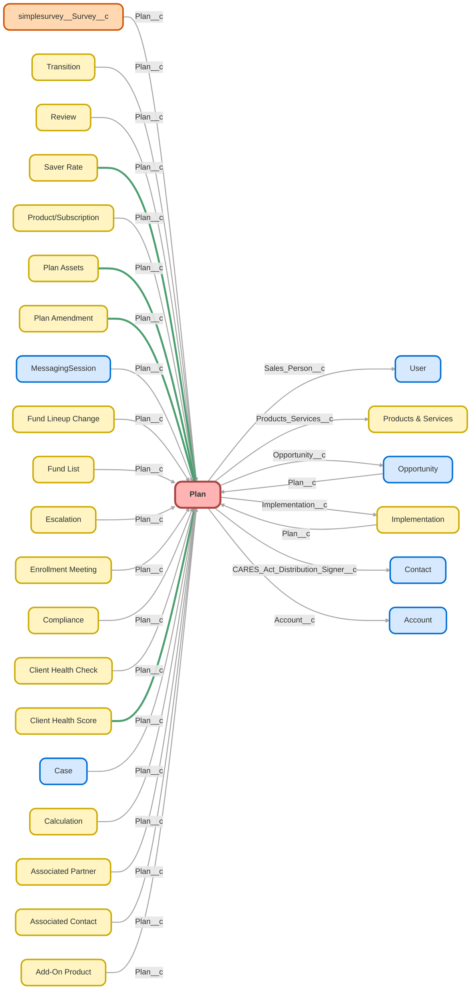

---
hide:
  - path
---

<!-- This file is auto-generated. if you do not want it to be overwritten, set TRUE in the line below -->
<!-- DO_NOT_OVERWRITE_DOC=FALSE -->

## Schema

<!-- Object description -->

## Fields

| Name      | Label | Type | Description |
| :-------- | :---- | :--: | :---------- | 
| Abandon_Plan_Review__c | Abandoned Plan Review | Picklist | At Risk = No payroll report or distributions processed in 9-12 months.    Potentially Abandoned = No payroll report or distributions processed in 12+ months. |
| Account__c | Account | Lookup | Account Plan is associated with. |
| Account_Id__c | Account Id | Text | undefined |
| Active_Employees__c | Active Employees | Number | Total Employees on Census - Terminated Employees.   Confirms how many employees on census are currently employed. |
| Advisor_Fees_Paid_from_ESA__c | Advisor Fees Paid from ESA | Picklist | Will advisor fees be paid from ERISA Spend Account? |
| Amendments_This_Year__c | Amendments This Year | Number | undefined |
| Amount_Due_On_Invoices__c | Amount Due on Invoices | Currency | undefined |
| Annual_Contributions__c | Annual Contributions | Currency | Annual contributions made in the last Calendar year. Will be blank for new plans. |
| Annual_Recurring_Revenue__c | Annual Recurring Revenue | Currency | ARR is the yearly revenue from active subscriptions and/or recurring fees.  Monthly revenue field x12. |
| Associated_Partners__c | Associated Partners | Text | undefined |
| Auto_Enroll__c | Auto-Enroll | Checkbox | Used for data mapping from FT Williams. Does plan have AE? |
| Auto_Enroll_Escalation_Type__c | Auto-Enroll Escalation Type | Picklist | What Type of Escalation does the auto-enrollment provision have? |
| Auto_Enrollment__c | Auto-Enrollment | Picklist | What are the Auto-Enrollment settings for the plan? |
| Auto_Enrollment_Deferral_Escalation_Rate__c | Auto-Enrollment Deferral/Escalation Rate | Picklist | undefined |
| Auto_Enrollment_Plan__c | Auto-Enrollment Plan | Checkbox | undefined |
| Auto_Escalate__c | Auto Escalate | Checkbox | Used for data mapping from FT Williams. Does plan have AE with auto escalate? |
| Billable_Headcount__c | Billable Headcount (Deprecated) | Number | Deprecated 3/5/25- Eligible Employees + Terminated w Balance |
| Billing_City__c | Billing City | Text | undefined |
| Billing_HM_Score__c | Billing HM Score (Deprecated) | Number | Current Billing Status = 1 Behind Billing Status = -1 |
| Billing_State__c | Billing State | Text | undefined |
| Billing_Status__c | Billing Status | Picklist | Indicates status of invoices. |
| Billing_Street__c | Billing Street | Text | undefined |
| Billing_Zip_Code__c | Billing Zip Code | Text | undefined |
| Bond_Amount__c | Bond Amount | Currency | Bond Amount Held for the Plan. Usually entered by Compliance. |
| Bond_Asset_Ratio__c | Bond/Asset Ratio | Percent | Fidelity Bond Amount ratio to Plan Assets |
| Bond_Auto_Renew__c | Bond Auto Renew | Checkbox | Fidelity Bond is auto-renewed.   No set expiration date. |
| Bond_Expiration_Date__c | Bond Expiration Date | Date | Date fidelity bond expires.   Leave blank and check "Bond Auto Renew" if there is no expiration and the bond auto renews |
| Bond_Information_Added_to_Paradigm__c | Bond Information Added to Paradigm | Picklist | Has Bond information been added tp Paradigm? |
| Bond_Purchase_Date__c | Bond Purchase Date | Date | Date of Fidelity Bond purchase. |
| Brokerage_Accounts_PCRA__c | Brokerage Accounts (PCRA) | Picklist | Will plan allow for brokerage accounts? |
| Business_Industry__c | Business/Industry | Text | Business/Industry from Account |
| Business_Start_Date__c | Business Start Date | Date | Business Start Date pulled from Account |
| Business_Unit__c | Business Unit | Picklist | undefined |
| CARES_Act_Amendment__c | CARES Act Amendment | Date | Date client signed CARES Act Amendment to add it to their plan |
| CARES_Act_Declined__c | CARES Act Declined | Checkbox | Client does not want to adopt CARES Act |
| CARES_Act_Distribution_Signer__c | CARES Act Distribution Signer | Lookup | Sponsor/Trustee authorized to DocuSign/Esign CARES Act Distribution Forms for this plan |
| Client_Health__c | Client Health | Text | Client Health Score Expressed Visually |
| Client_Health_Information__c | Client Health Information | LongTextArea | Automated process indicates positive and negative metrics that are affecting the clients health. |
| Client_Health_Metric_Score__c | Client Health Metric Score (Deprecated) | Number | Health score based on 7 different plan metrics and behaviors with separate weighting. |
| Client_Health_Score__c | Client Health Score | Number | Client Health Score Calculated by Process Builder |
| Complaint_Type__c | Complaint Type | Text | undefined |
| Complete_without_funding__c | Complete without funding | Checkbox | undefined |
| Completed_Self_Service_Onboarding__c | Completed Self-Service Onboarding | Checkbox | undefined |
| Connected_Partner__c | Connected Partner | Text | Partner with shared SLAs - Set on Account |
| Conversion_Assets_Posted__c | Conversion Assets Posted | Date | undefined |
| Conversion_Assets_Recieived__c | Conversion Assets Recieived | Date | undefined |
| Conversion_Type__c | Conversion Type | Picklist | What type of conversion plan was this? |
| CSAT_HM_Score__c | CSAT HM Score (Deprecated) | Number | CSAT Saver weighted 20% & CSAT Sponsor/Trustee weighted at 80% |
| CST_Client_Support_Team__c | CST (Client Support Team) | Picklist | CST associated with this Plan |
| Current_Annual_Participant_Fees__c | Current Annual Participant Fees | Currency | How much are Participant Fees Annual? Based on last plan billable headcount. |
| Custodian__c | Custodian | Picklist | undefined |
| Custodian_Account_ID__c | Custodian Account ID | Text | undefined |
| Date_Most_Recent_Saver_CSAT__c | Date Most Recent Saver CSAT | Date | Date of the most recent Saver CSAT |
| Date_Most_Recent_Saver_NPS__c | Date Most Recent Saver NPS | Date | Date of the Most Recent Saver NPS |
| Date_Most_Recent_Saver_Review__c | Date Most Recent Saver Review | Date | Date of the Most Recent Saver Review |
| Date_Most_Recent_Sponsor_Trustee_CSAT__c | Date Most Recent Sponsor/Trustee CSAT | Date | Date of the Most Recent Sponsor/Trustee CSAT |
| Date_Most_Recent_Sponsor_Trustee_NPS__c | Date Most Recent Sponsor/Trustee NPS | Date | Date of the Most Recent Sponsor/Trustee NPS |
| Date_Most_Recent_Sponsor_Trustee_Review__c | Date Most Recent Sponsor/Trustee Review | Date | Date of the Most Recent Sponsor/Trustee Review |
| Date_of_Most_Recent_Referral__c | Date of Most Recent Referral | Date | Date most recent referral was given by Plan |
| Days_Behind_on_Payroll__c | Days Behind on Payroll | Number | Looks at the most recent payroll date and payroll frequency and compares to today. Slight buffer built into each frequency. |
| Days_Past_Due_on_Invoice__c | Days Past Due on Invoice | Picklist | Number of days past due on invoice(s) |
| Days_since_Last_Activity__c | Days since Last Activity | Number | Number of days since Sponsor or Trustee had activity on a Case linked to this Plan |
| Deferral_Change_Frequency__c | Deferral Change Frequency | Picklist | undefined |
| Discretionary_Match__c | Discretionary Match | Picklist | undefined |
| Discretionary_Match_Formula_Notes__c | Discretionary Match Formula/Notes | TextArea | Potential formula discussed with decision maker |
| EIN__c | EIN | Text | undefined |
| Eligibility_Age__c | Eligibility Age | Picklist | What is the age participants are eligible for the plan? |
| Eligible_Balance_Rate_Formula__c | Eligible Balance Rate Calc | Number | Used to calc eligible balance rate and push to visible/tracking field |
| Eligible_Employees__c | Eligible Employees | Number | The number of employees that are eligible to participate in the plan |
| Eligible_Employees_w_Balance__c | Eligible Employees w Balance | Number | Eligible Employees with a balance - could be Employee and/or Employer contributions |
| Employer_Identification_Number_EIN__c | Employer Identification Number (EIN) | Text | undefined |
| End_of_Submitted_Pay_Period__c | End of Submitted Pay Period | Date | undefined |
| Escalated__c | Escalated | Checkbox | undefined |
| Fidelity_Bond_Link__c | Fidelity Bond Link | Url | Updated by automation team |
| Finch_Credential_Status__c | Finch Credential Status | Text | undefined |
| Finch_Implementation__c | Finch Implementation | Checkbox | If the Plan's Implementation record is marked as a Finch Implementation, this box is checked. |
| FPS_Agreement_Signed__c | FPS Agreement Signed | Date | Date FPS Agree is complete - for plans with FPS in the Implementation docs, it's the Docs Complete date.   For Plans that didn't have it in the implementation docs, it is the date of the DocuSign sent to get the FPS signed. |
| Fund_List__c | Fund List | Picklist | undefined |
| Hardships__c | Hardships | Picklist | Are Hardship withdrawals allowed in the plan? |
| Has_Exceptions__c | Has Exceptions | Checkbox | undefined |
| HM_Billing_Score__c | HM Billing Score | Number | undefined |
| HM_CSAT_Score__c | HM CSAT Score | Number | undefined |
| HM_NPS_Score__c | HM NPS Score | Number | undefined |
| HM_Payroll_Score__c | HM Payroll Score | Number | undefined |
| HM_Review_Score__c | HM Review Score | Number | undefined |
| Implementation__c | Implementation | Lookup | Implementation that set Plan up |
| Implementation_Status__c | Implementation Status | Text | undefined |
| Industry_NAICS__c | Industry (NAICS) | Text | undefined |
| Initial_Deferral_Rate__c | Initial Deferral Rate | Picklist | Initial deferral rate for auto enroll |
| Invoice_Amount_Past_Due__c | Invoice Amount Past-Due | Currency | Total Amount that is Past-Due |
| Kotapay_Client_Signed__c | Kotapay Client Signed | Date | Client signed – awaiting UBQT Countersign |
| Kotapay_Complete__c | Kotapay Complete | Date | All parties signed and doc saved |
| Kotapay_Contract_Declined__c | Kotapay Contract Declined | Checkbox | Client Declined to Sign Kotapay Agreement |
| Kotapay_Deactivated__c | Kotapay Deactivated | Date | undefined |
| Kotapay_Doc_Created__c | Kotapay Doc Created | Date | Document created and sent to client for signature |
| Kotapay_UBQT_Signed__c | Kotapay UBQT Signed | Date | UBQT Countersign complete and sent to Kotapay |
| Last_Case_Activity_Date__c | Last Case Activity Date | Date | Date of last Case Activity from a Sponsor or Trustee |
| Last_Case_Inbound_Activity__c | Last Case Inbound Activity | Date | Date of last activity inbound to UBQT team on a case related to this Plan |
| Last_Case_Outbound_Activity__c | Last Case Outbound Activity | Date | Date of last outbound activity on a case related to this Plan |
| Last_Health_Check_Date__c | Last Health Check Date | Date | Most Recent Date a client health check was performed |
| Last_Metric_Update__c | Last Metric Update | Date | Date Metrics for Employee/Balance rates were updated |
| Lead_Source__c | Lead Source | Picklist | Lead source from Opportunity |
| LeadSourceDetail__c | Lead Source Detail | Picklist | Dependent LeadSourceDetail field for corresponding Lead Source |
| Legacy_Service_Type__c | Legacy Service Type | Picklist | Legacy service types |
| Loans__c | Loans | Picklist | Does the plan allow loans? |
| Matrix_07C_Account__c | Matrix 07C Account # | Text | Matrix 07C Account Number |
| Maximum_Deferral_Rate__c | Maximum Deferral Rate | Picklist | Maximum auto enrollment deferral rate |
| Mega_Roth_Plan__c | Mega Roth Plan | Checkbox | undefined |
| Min_Auto_Deferral_Percentage__c | Min Auto Deferral Percentage | Percent | The minimum or starting automatic enrollment percentage |
| Monthly_Admin_Fee__c | Monthly Admin Fee | Currency | The subscription amount that the client pays monthly for administration. Add-on recurring fees are not included (New Comp, PCRA, etc) |
| Monthly_Brokerage_Account_Fee__c | Monthly Brokerage Account Fee | Currency | Amount client pays monthly for brokerage accounts |
| Monthly_New_Comp_Fee__c | Monthly New Comp Fee | Currency | Amount client pays for for New Comp monthly. |
| Monthly_Recurring_Revenue_MRR__c | Monthly Recurring Revenue(MRR) | Currency | Admin+New Comp Fee + Brokerage Fees + Participant Fees |
| Most_Recent_1099R__c | Most Recent 1099R | Date | Date of most recent distribution from the plan.   If blank and Abandoned Review has a value, the latest 1099R is either over 12 months ago OR the plan hasn't had a 1099R |
| Most_Recent_Case_Sentiment_S_T__c | Most Recent Case Sentiment (S/T) | Number | Most Recent Case Sentiment from a Sponsor/Trustee case |
| Most_Recent_Case_Sentiment_Saver__c | Most Recent Case Sentiment (Saver) | Number | Most Recent Case Sentiment from a Saver case |
| Most_Recent_CSAT_Score_Saver__c | Most Recent CSAT Score (Saver) | Number | Most Recent CSAT Score given by a Saver |
| Most_Recent_CSAT_Score_Sponsor_Trustee__c | Most Recent CSAT Score (Sponsor/Trustee) | Number | 1-5 CSAT score from most recent Resolution CSAT Survey from a Sponsor Trustee or Partner |
| Most_Recent_NPS_Score_Saver__c | Most Recent NPS Score (Saver) | Number | Most Recent NPS Score from a Saver |
| Most_Recent_NPS_Score_Sponsor_Trustee__c | Most Recent NPS Score (Sponsor/Trustee) | Number | Most Recent NPS Score from a Sponsor/Trustee |
| Most_Recent_Pay_Period_Submitted__c | Most Recent Pay Period Submitted | Text | Date Range of most recent pay period submitted. |
| Most_Recent_Payroll__c | Most Recent Payroll | Date | Date client last submitted a payroll to Ubiquity.   Copied from Payroll section of the plan record. |
| Most_Recent_Payroll_Compensation_Total__c | Most Recent Payroll Compensation Total | Currency | Most recent amount of compensation on payroll. |
| Most_Recent_Payroll_Contribution_Total__c | Most Recent Payroll Contribution Total | Currency | Amount of most recent payroll contribution. |
| Most_Recent_Payroll_Submitted__c | Most Recent Payroll Submitted | Date | Date of most recent payroll submission by client. |
| Most_Recent_Review_Saver__c | Most Recent Review (Saver) - Deprecated | Number | Most recent review given by a saver. |
| Most_Recent_Review_Sponsor_Trustee__c | Deprecated- Recent Review (Spnsr/Trus)- | Number | Most Recent Review given by a sponsor/trustee. |
| NAICS_Code__c | NAICS Code | Text | undefined |
| Non_ACH_Fee_Start__c | Non-ACH Fee Start | Date | Date fees started to be charged for not using ACH to fund the plan.   If blank, review waiver fields to verify if/when waiver expires. |
| Non_ACH_Fee_Waived_Indefinitely__c | Non-ACH Fee Waived Indefinitely | Checkbox | Confirms that clients not using ACH to fund plan have had the non-ACH fee waived indefinitely |
| Non_ACH_Fee_Waiver_Expiration__c | Non-ACH Fee Waiver Expiration | Date | Date the fee waiver for clients not using ACH to fund the plan expires |
| NPS_HM_Score__c | NPS HM Score (Deprecated) | Number | Used to get weighted average of NPS scores for Health Metric. |
| Number_of_Brokerage_Accounts__c | Number of Brokerage Accounts | Number | Number of Brokerage Accounts plan is using and paying for. |
| Number_of_Employees__c | Number of Employees | Number | Removed from layout 8.4.2020 - see case 570202.    We aren't tracking active + terminated but instead just Active.   Active EE is already on Plan and feeds to Account |
| Offset_Days__c | Offset Days | Number | Number of Days in payroll offset. |
| Opportunity__c | Opportunity | Lookup | Opportunity that created the Plan |
| Original_Plan_Effective_Date__c | Original Plan Effective Date | Date | First Plan Effective date, if it is a Conversion Plan with a prior plan effective date |
| Paradigm_Company_ID__c | Paradigm Company ID | Text | Company ID for Paradigm |
| Paradigm_Company_Link__c | Paradigm Company Link | Url | Click this to go to Company in Paradigm |
| Paradigm_Plan_ID__c | Paradigm Plan ID | Text | Plan ID for Paradigm |
| Paradigm_Plan_Link__c | Paradigm Plan Link | Url | Updated automatically from Implementation Object |
| Participant_Fee__c | Participant Fee | Currency | Amount charged to participants with plan balance over $100 |
| Participant_Fee_Payment__c | Participant Fee Payment | Picklist | Who will be responsible for paying the participant fee? |
| Participant_Fees_Paid_from_ESA__c | Participant Fees Paid from ESA | Picklist | Will participant fees be paid from ERISA Spend Account? |
| Partner__c | Partner | Text | Clients with shared SLAs will appear here. |
| Payroll_Escalation_Tier__c | Payroll Escalation Tier | Picklist | undefined |
| Payroll_Frequency_Days__c | Payroll Frequency Days | Number | Used for reporting and formulas |
| Payroll_HM_Score__c | Payroll HM Score (Deprecated) | Number | Current Payroll Status = 1  Not Contributing Payroll Status = 0 Behind or Never Contributed Payroll Status = -1 |
| Payroll_Integration__c | Payroll Integration | Picklist | Will customer be using Payroll integration for this plan? |
| Payroll_Provider__c | Payroll Provider | Text | undefined |
| Payroll_Schedule__c | Payroll Schedule | Picklist | undefined |
| Payroll_Submission_Method__c | Payroll Submission Method | Picklist | What method was used to submit the most recent payroll. |
| Payroll_Submission_Status__c | Payroll Submission Status | Picklist | Used to track if client is actively submitting their payroll. |
| Payroll_Submission_Type__c | Payroll Submission Type | Picklist | How does the client submit their Payrolls? |
| Plan_Age__c | Plan Age | Number | Today's date minus the plan sold date divided by 365 |
| Plan_Amended__c | Plan Amended | Checkbox | To be checked if Plan provisions are amended at any point. I.E. Fund Lineup Change. |
| Plan_Amendment_Date__c | Plan Amendment Date | Date | Date the Plan is Amended. If Plan has had multiple Amendments use most recent date. |
| Plan_Assets__c | Plan Assets | Currency | Assets in Plan |
| Plan_Billable_Headcount__c | Plan Billable Headcount | Number | Updated from the monthly Plan Asset record. Count of all Employees with over $100. |
| Plan_Eligibility__c | Plan Eligibility | Picklist | undefined |
| Plan_Entry_Frequency__c | Plan Entry Frequency | Picklist | undefined |
| Plan_Exceptions__c | Plan Exceptions | LongTextArea | Use this field to note any exceptions to the plan/plan provisions |
| Plan_ID_18_Char__c | Plan ID (18 Char) | Text | undefined |
| Plan_Notes__c | Plan Notes | LongTextArea | undefined |
| Plan_Number__c | Plan Number | Text | Three Digit Plan number assigned by the government based on number of 401(k) plans the company has had. |
| Plan_Sold_Date__c | Plan Sold Date | Date | This is the date that this plan was first sold and the client signed an A4S with Ubiquity/TOK. |
| Plan_Transition_Date__c | Plan Transition Date | Date | Date on which plan became inactive due to termination or deconversion. |
| Plan_Type1__c | Plan Type | Picklist | Plan type (new, conversion, upgrade) |
| Plan_Upgrade_Date__c | Plan Upgrade Date | Date | Date that Plan is Upgraded. If Plan has been Upgraded multiple times, use date of most recent Upgrade. |
| Plan_Upgraded__c | Plan Upgraded | Checkbox | Box to be checked if plan upgrade is successfully completed. |
| Plans__c | Plans | Number | Plan Object Power of One formula |
| Potential_New_Savers__c | Potential New Savers | Number | Number of potential new savers (Eligible - Eligible with Balance) |
| Potential_Participants__c | Potential Participants | Number | Potential Participants in the Plan |
| Previous_Plan_Effective_Date__c | Previous Plan Effective Date | Date | Date which previous plan was effective from |
| Priority_Service__c | Priority Service- Deprecated | Checkbox | undefined |
| Priority_Service_End_Date__c | Priority Service End Date | Date | undefined |
| Priority_Service_Formula__c | Priority Service | Checkbox | undefined |
| Product_Type1__c | Product Type | Picklist | Product type |
| Products_Services__c | Payroll Provider | Lookup | undefined |
| Profit_Sharing__c | Profit Sharing | Picklist | undefined |
| Profit_Sharing_Plan__c | Profit Sharing Plan | Checkbox | Used for Provision Mapping with FT Williams. Does plan have profit sharing? |
| QACA_Safe_Harbor_Vesting_Schedule__c | QACA Safe Harbor Vesting Schedule | Picklist | undefined |
| QBOAD_Declined__c | QBOAD Declined | Checkbox | QBOAD Resolution/Amendment declined by plan |
| QBOAD_Resolution__c | QBOAD Resolution | Date | Date QBOAD Resolution was completed |
| QBOAD_Signer__c | QBOAD Signer | Text | Name of authorized QBOAD Signer |
| Recent_Client_Health_Check_Type__c | Last Health Check Type | Picklist | Type of most recent client health check |
| Referral_HM_Score__c | Referral HM Score (Deprecated) | Number | Used for referral health metric score |
| Review_HM_Score__c | Review HM Score (Deprecated) | Number | Health metric review score. Saver review 20% weighting, sponsor/trustee review 80% weighting. |
| RKS_ID__c | RKS ID | Text | ID for RKS (Record-Keeping System) |
| Roth__c | Roth | Picklist | Does Plan Have Roth Provision? |
| Safe_Harbor__c | Safe Harbor | Picklist | 401(k) Safe Harbor Formula |
| Safe_Harbor_1__c | Safe Harbor 1 | Checkbox | Used for data mapping from FT Williams. Does plan have SH? |
| Safe_Harbor_Match_Determination_Period__c | Safe Harbor Match Determination Period | Picklist | For plans with Safe Harbor Match, confirm how often the matching formula can be determined |
| Safe_Harbor_Plan__c | Safe Harbor Plan | Checkbox | undefined |
| Sales_Person__c | Sales Person | Lookup | Sales person who originally sold the opportunity that created this plan. |
| Saver_Balance_Rate_Tracking__c | Eligible Balance Rate | Percent | Eligible Employees w Balance / Eligible Employees |
| Secondary_Payroll_Schedule__c | Secondary Payroll Schedule | Picklist | For clients with more than one payroll schedule |
| Sentiment_HM_Score__c | Sentiment HM Score (Deprecated) | Number | Case Sentiment Health Metric Score |
| Service_Option__c | Service Option | Picklist | Service Option Selected for the Plan |
| Site_Tour_Given__c | Site Tour Given | Date | Date which a CST gave a site tour. |
| Status__c | Status | Picklist | Is the plan active or inactive (Deconverted or Terminated) |
| Terminated_Employees__c | Terminated Employees | Number | Terminated employees on census |
| Terminated_w_Balance__c | Terminated w Balance | Number | Terminated employees who have a balance in Employee and/or Employer sources |
| Testing_Method__c | Testing Method | Picklist | undefined |
| Ubiquity_Admin_Fees_Paid_by_ESA__c | Ubiquity Admin Fees Paid by ESA | Picklist | Will Ubiquity admin fees be paid from ERISA Spend Account? |
| Ubiquity_Plan_Effective_Date__c | Ubiquity Plan Effective Date | Date | Date plan is first effective with Ubiquity |
| Updated_Today__c | Updated Today - Delete | Checkbox | One time use field |
| Vesting_Schedule__c | Vesting Schedule | Picklist | undefined |
| X1st_Payroll_Submission__c | 1st Payroll Submission | Date | Date that the 1st payroll is submitted. |
| X3_38__c | 3(38) | Picklist | undefined |
| X5500_EZ_Required__c | Form 5500 EZ Required | Checkbox | To be checked when Single(k) assets are greater than $250k and IRS requires 5500 EZ. |

## Validation Rules

| Rule      | Active | Description | Formula |
| :-------- | :---- | :---------- | :------ |
| Do_Not_Edit_Unidentified_Plan_Name | Yes | Used to prevent editing the unidentified/multiple plans plan name | Id = "a2o1G000000oQW5" &&  ISCHANGED(Name) |
| Non_ACH_Fee_Waivers | Yes | Non-ACH plans cannot have both the Indefinite Waiver checkbox AND the Wavier Expiration field selected at the same time.   It's either waived indefinitely OR there's an expiration date to the fee | Non_ACH_Fee_Waived_Indefinitely__c = TRUE &&  NOT(ISNULL(Non_ACH_Fee_Waiver_Expiration__c )) |
| Prevent_Plan_Creation_on_Upsert | No ⚠️ | Prevents new Plan records from being created during Upsert. Add the alias of every new user trained in Upserts. | AND( ISNEW(), $User.Alias = "sbula" ) |
| Service_Option | No ⚠️ | Active Plan or Transition Pending must have a service option | ISBLANK(TEXT( Service_Option__c ))  && (ISPICKVAL( Status__c , "Active")  ISPICKVAL( Status__c , "Transition Pending")) |

## Related Flows

| Object | Name      | Type | Description |
| :----  | :-------- | :--: | :---------- | 
| 💻 | [Account_Anniversary_Validation_Flow](../flows/Account_Anniversary_Validation_Flow.md) [🕒](../flows/Account_Anniversary_Validation_Flow-history.md) |  Auto Launched Flow | Stamps Plan Sold Date onto Account to calculate Anniversary formulas |
| 💻 | [Add_On_to_Plan](../flows/Add_On_to_Plan.md) [🕒](../flows/Add_On_to_Plan-history.md) |  Screen Flow | Creates an Add-On Opportunity for an existing plan and assigns to Payroll team |
| 💻 | [Assign_Imp_to_Junction](../flows/Assign_Imp_to_Junction.md) [🕒](../flows/Assign_Imp_to_Junction-history.md) |  Auto Launched Flow | Maps Implementation record to any relevant Associated Contact Junction upon creation |
| 💻 | [Assign_Plan_to_Junction](../flows/Assign_Plan_to_Junction.md) [🕒](../flows/Assign_Plan_to_Junction-history.md) |  Auto Launched Flow | Updated "is opp null" decision element for single(k) - was erroring when opp is null.  Maps Plan record to any relevant Associated Contact Junction upon creation |
| 💻 | [Assign_Plan_to_Partner](../flows/Assign_Plan_to_Partner.md) [🕒](../flows/Assign_Plan_to_Partner-history.md) |  Auto Launched Flow | Added "opp present" check to avoid error if opp is missing  Maps Plan record to any relevant Associated Junction upon creation |
| 💻 | [Assign_Transition_to_Junction](../flows/Assign_Transition_to_Junction.md) [🕒](../flows/Assign_Transition_to_Junction-history.md) |  Auto Launched Flow | Maps Transition record to any relevant Associated Contact Junction upon creation |
| 💻 | [Assign_Transition_to_Partner](../flows/Assign_Transition_to_Partner.md) [🕒](../flows/Assign_Transition_to_Partner-history.md) |  Auto Launched Flow | Maps Transition record to any relevant Associated Partner Junction upon creation |
| 💻 | [BI_Scheduled_Launch_Monthly_Flow](../flows/BI_Scheduled_Launch_Monthly_Flow.md) [🕒](../flows/BI_Scheduled_Launch_Monthly_Flow-history.md) |  Scheduled | Updated to replace hardcoded compliance userId with compliance queue.  Falls back to compliance userId if queue isn't found  This flow runs daily to check if is the first of the month, if yes, launch subflow to create a BI case to delete spam records and a BI case to perform monthly data sync. (Monthly data sync article in screensteps.)  Expanded flow to create compliance cases based on cadence in case #01144416 |
| 💻 | [Case_Button_Create_Jira_Case](../flows/Case_Button_Create_Jira_Case.md) [🕒](../flows/Case_Button_Create_Jira_Case-history.md) |  Screen Flow | Updated to move "Check Groups" action and approval logic into subflow so it can be called from apex. |
| 💻 | [Case_Button_New_Close_Case](../flows/Case_Button_New_Close_Case.md) [🕒](../flows/Case_Button_New_Close_Case-history.md) |  Screen Flow | Updated to show unresolved child case and calc info |
| 💻 | [Case_Scheduled_Create_Case_for_Data_Source_Doc_Update](../flows/Case_Scheduled_Create_Case_for_Data_Source_Doc_Update.md) [🕒](../flows/Case_Scheduled_Create_Case_for_Data_Source_Doc_Update-history.md) |  Scheduled | Every monday, create a case for BI to update data source doc. |
| 💻 | [Case_Scheduled_Create_Monthly_Spam_and_Data_Sync_Cases](../flows/Case_Scheduled_Create_Monthly_Spam_and_Data_Sync_Cases.md) [🕒](../flows/Case_Scheduled_Create_Monthly_Spam_and_Data_Sync_Cases-history.md) |  Auto Launched Flow | Updated to remove entitlements |
| 💻 | [Case_Scheduled_Create_Weekly_3_16_Compliance_Case](../flows/Case_Scheduled_Create_Weekly_3_16_Compliance_Case.md) [🕒](../flows/Case_Scheduled_Create_Weekly_3_16_Compliance_Case-history.md) |  Scheduled | Updated to create cases for compliance queue, not shared user  Creates case every monday based on criteria in case #01144416 |
| 💻 | [Case_Split](../flows/Case_Split.md) [🕒](../flows/Case_Split-history.md) |  Screen Flow | Splits selected details and assets of current case into a new case |
| 💻 | [Case_Tab_Email_List_Sourcing_Request](../flows/Case_Tab_Email_List_Sourcing_Request.md) [🕒](../flows/Case_Tab_Email_List_Sourcing_Request-history.md) |  Screen Flow | Creates a case for Marketing and BI when user submits Email List Sourcing Request |
| 💻 | [Case_Tab_L_D_Request](../flows/Case_Tab_L_D_Request.md) [🕒](../flows/Case_Tab_L_D_Request-history.md) |  Screen Flow | <!-- --> |
| 💻 | [Case_Tab_Marketing_Request](../flows/Case_Tab_Marketing_Request.md) [🕒](../flows/Case_Tab_Marketing_Request-history.md) |  Screen Flow | Updated to run in system context to fix access issues popping up for certain profiles. |
| 💻 | [Clone_Parent_Details](../flows/Clone_Parent_Details.md) [🕒](../flows/Clone_Parent_Details-history.md) |  Screen Flow | Related List button that clones parent details when creating a child case |
| 💻 | [Close_Case](../flows/Close_Case.md) [🕒](../flows/Close_Case-history.md) |  Screen Flow | Modified case close screen to add "subject" as an editable field for CO cases  Surfaces required fields before closing case, depending on case type and user requirements. Added checkbox to allow users to close other peoples' cases. |
| 💻 | [Create_Upgrade_from_Plan](../flows/Create_Upgrade_from_Plan.md) [🕒](../flows/Create_Upgrade_from_Plan-history.md) |  Screen Flow | Updated to replace sales director userId fallback w/ search for user with that role, THEN svp strategy.  Finally it will just assign to running user rather than throwing an error.  Creates an Upgrade Opportunity for an existing plan, and assigns to most relevant RPC. |
| 💻 | [Docusign_Autolaunched_Send_Transition_Docusign](../flows/Docusign_Autolaunched_Send_Transition_Docusign.md) [🕒](../flows/Docusign_Autolaunched_Send_Transition_Docusign-history.md) |  Auto Launched Flow | <!-- --> |
| 💻 | [Escalation_Button_De_Escalate_Account](../flows/Escalation_Button_De_Escalate_Account.md) [🕒](../flows/Escalation_Button_De_Escalate_Account-history.md) |  Screen Flow | <!-- --> |
| 💻 | [Escalation_Button_Escalate_Account](../flows/Escalation_Button_Escalate_Account.md) [🕒](../flows/Escalation_Button_Escalate_Account-history.md) |  Screen Flow | Updated routing.  - If created by someone outside of CE, owner and manager are Meli - If created by anyone in CE besides Meli, owner is their team lead and manager is Meli |
| 💻 | [Implementation_Button_Create_Add_On_Opp](../flows/Implementation_Button_Create_Add_On_Opp.md) [🕒](../flows/Implementation_Button_Create_Add_On_Opp-history.md) |  Screen Flow | This step no longer triggers the Implementation  After Update  Create Add-On Opp flow, it creates the Opp and AC again and updates the Payroll Provider on the created Opp. It also sends the initial EPS email- 7/8/24 JI  Added step at the end to update the initiating Imp.Payroll_Integration field to "Yes". Removed create Opp and AC elements, this button now triggers Implementation  After Update  Create Add-On Opp |
| 💻 | [Messaging_Route_Route_SMS_to_CO](../flows/Messaging_Route_Route_SMS_to_CO.md) [🕒](../flows/Messaging_Route_Route_SMS_to_CO-history.md) |  Routing Flow | <!-- --> |
| 💻 | [Monthly_Metrics_Autolaunched_Create_Monthly_Metric_Records](../flows/Monthly_Metrics_Autolaunched_Create_Monthly_Metric_Records.md) [🕒](../flows/Monthly_Metrics_Autolaunched_Create_Monthly_Metric_Records-history.md) |  Auto Launched Flow | <!-- --> |
| 💻 | [Opportunity_Process_Count_Reserve_k_Amendments](../flows/Opportunity_Process_Count_Reserve_k_Amendments.md) [🕒](../flows/Opportunity_Process_Count_Reserve_k_Amendments-history.md) |  Auto Launched Flow | <!-- --> |
| 💻 | [Opportunity_Screen_Approval_Helper](../flows/Opportunity_Screen_Approval_Helper.md) [🕒](../flows/Opportunity_Screen_Approval_Helper-history.md) |  Screen Flow | <!-- --> |
| 💻 | [Payroll_Integration_Button_Create_Payroll_Opp_and_Add_On](../flows/Payroll_Integration_Button_Create_Payroll_Opp_and_Add_On.md) [🕒](../flows/Payroll_Integration_Button_Create_Payroll_Opp_and_Add_On-history.md) |  Screen Flow | <!-- --> |
| 💻 | [Plan_Button_Contract_Termination](../flows/Plan_Button_Contract_Termination.md) [🕒](../flows/Plan_Button_Contract_Termination-history.md) |  Screen Flow | Button on the plan page to terminate a plan when it has $0 in assets |
| 💻 | [Plan_Button_Create_Payroll_Integration_Opp](../flows/Plan_Button_Create_Payroll_Integration_Opp.md) [🕒](../flows/Plan_Button_Create_Payroll_Integration_Opp-history.md) |  Screen Flow | <!-- --> |
| 💻 | [Plan_Button_Downgrade_Plan](../flows/Plan_Button_Downgrade_Plan.md) [🕒](../flows/Plan_Button_Downgrade_Plan-history.md) |  Screen Flow | <!-- --> |
| 💻 | [Plan_Button_Transition_Plan](../flows/Plan_Button_Transition_Plan.md) [🕒](../flows/Plan_Button_Transition_Plan-history.md) |  Screen Flow | <!-- --> |
| 💻 | [Plan_Link_Custom_Fund_List](../flows/Plan_Link_Custom_Fund_List.md) [🕒](../flows/Plan_Link_Custom_Fund_List-history.md) |  Auto Launched Flow | When Plan is created with a Custom Fund List designation, populate the lookup values on the Fund List record originally attached to the Opportunity |
| 💻 | [Plan_Scheduled_Send_Bond_Expiry_Email](../flows/Plan_Scheduled_Send_Bond_Expiry_Email.md) [🕒](../flows/Plan_Scheduled_Send_Bond_Expiry_Email-history.md) |  Scheduled | Updated to replace compliance shared user with queue |
| 💻 | [Project_Task_Process_Send_Email_Alert](../flows/Project_Task_Process_Send_Email_Alert.md) [🕒](../flows/Project_Task_Process_Send_Email_Alert-history.md) |  Auto Launched Flow | Flow built to trigger auto email when Project Task is created or updated. |
| 💻 | [System_Enhancement_Form](../flows/System_Enhancement_Form.md) [🕒](../flows/System_Enhancement_Form-history.md) |  Screen Flow | Updated to run in system context with sharing.  Getting issues with random profiles not having access to this record type.  Making submitter field dynamic, providing redirect to case, and confirmation message that it was submitted |
| 💻 | [Update_Partner_Client_Status](../flows/Update_Partner_Client_Status.md) [🕒](../flows/Update_Partner_Client_Status-history.md) |  Auto Launched Flow | Update Partner Client Status on Contact if all Plans are Inactive |
| Account | [Account_After_Trigger_Update_Imp_and_Plan_EIN](../flows/Account_After_Trigger_Update_Imp_and_Plan_EIN.md) [🕒](../flows/Account_After_Trigger_Update_Imp_and_Plan_EIN-history.md) |  Record After Save | When Account is updated and EIN changes, update Plan and Imp EIN. |
| Add_On_Products__c | [Add_On_After_Trigger_Payroll_Master](../flows/Add_On_After_Trigger_Payroll_Master.md) [🕒](../flows/Add_On_After_Trigger_Payroll_Master-history.md) |  Record After Save | <!-- --> |
| Add_On_Products__c | [Add_On_After_Trigger_Send_Payroll_Integration_Email](../flows/Add_On_After_Trigger_Send_Payroll_Integration_Email.md) [🕒](../flows/Add_On_After_Trigger_Send_Payroll_Integration_Email-history.md) |  Record After Save | <!-- --> |
| Add_On_Products__c | [Add_On_Scheduled_Send_Auto_Emails](../flows/Add_On_Scheduled_Send_Auto_Emails.md) [🕒](../flows/Add_On_Scheduled_Send_Auto_Emails-history.md) |  Scheduled | This flow runs daily and checks the difference between the current date and the last time the add-on stage was changed, then sends the corresponding auto-email |
| Associated_Contact__c | [Associated_Contact_After_Update_Master_Flow](../flows/Associated_Contact_After_Update_Master_Flow.md) [🕒](../flows/Associated_Contact_After_Update_Master_Flow-history.md) |  Record After Save | <!-- --> |
| Associated_Contact__c | [Junction_Update_Lifecycle_Stage](../flows/Junction_Update_Lifecycle_Stage.md) [🕒](../flows/Junction_Update_Lifecycle_Stage-history.md) |  Workflow | <!-- --> |
| Calculation__c | [Calculation_After_Trigger_Create_Cases_for_Compliance_and_Increment_Counters](../flows/Calculation_After_Trigger_Create_Cases_for_Compliance_and_Increment_Counters.md) [🕒](../flows/Calculation_After_Trigger_Create_Cases_for_Compliance_and_Increment_Counters-history.md) |  Record After Save | Updated to get rid of child case |
| Calculation__c | [Calculation_Sales_Calc_Request](../flows/Calculation_Sales_Calc_Request.md) [🕒](../flows/Calculation_Sales_Calc_Request-history.md) |  Workflow | Automations for sales creating a Calc request for Compliance |
| Calculation__c | [Compliance_Calculation_Case_Counter](../flows/Compliance_Calculation_Case_Counter.md) [🕒](../flows/Compliance_Calculation_Case_Counter-history.md) |  Workflow | Increases/Decreases Case Counter based on Calc object status |
| Case | [Case_After_Trigger_Create_New_Case_from_Response_to_Old_Case](../flows/Case_After_Trigger_Create_New_Case_from_Response_to_Old_Case.md) [🕒](../flows/Case_After_Trigger_Create_New_Case_from_Response_to_Old_Case-history.md) |  Record After Save | <!-- --> |
| Case | [Case_Before_Trigger_Add_Acct_and_Plan_to_Internal_Team_Cases](../flows/Case_Before_Trigger_Add_Acct_and_Plan_to_Internal_Team_Cases.md) [🕒](../flows/Case_Before_Trigger_Add_Acct_and_Plan_to_Internal_Team_Cases-history.md) |  Record Before Save | <!-- --> |
| Case | [Case_Before_Trigger_Update_Account_Based_on_Contact](../flows/Case_Before_Trigger_Update_Account_Based_on_Contact.md) [🕒](../flows/Case_Before_Trigger_Update_Account_Based_on_Contact-history.md) |  Record Before Save | Updated to "on create" only for performance reasons  When the contact on a case is changed and the account in null, update the account field with the new contact's account. |
| Case | [Case_Before_Trigger_Update_Account_Plan_Based_on_Imp_Plan](../flows/Case_Before_Trigger_Update_Account_Plan_Based_on_Imp_Plan.md) [🕒](../flows/Case_Before_Trigger_Update_Account_Plan_Based_on_Imp_Plan-history.md) |  Record Before Save | <!-- --> |
| Case | [Case_Before_Update_Master_Flow](../flows/Case_Before_Update_Master_Flow.md) [🕒](../flows/Case_Before_Update_Master_Flow-history.md) |  Record Before Save | Updated to remove case team new check and assignment.  Split into other flow to change run order |
| Case | [Case_Company_Name_Address_Update](../flows/Case_Company_Name_Address_Update.md) [🕒](../flows/Case_Company_Name_Address_Update-history.md) |  Workflow | Creates 3 child cases for Address Update Cases |
| Case | [Case_Entitlement_Selecion](../flows/Case_Entitlement_Selecion.md) [🕒](../flows/Case_Entitlement_Selecion-history.md) |  Workflow | Add cases to Entitlement Process Names for specific Entitlement Processes.  Also defaults BizIntel Acct/Plan values. |
| Case | [Case_New_Case_Created_Upon_Resolve](../flows/Case_New_Case_Created_Upon_Resolve.md) [🕒](../flows/Case_New_Case_Created_Upon_Resolve-history.md) |  Workflow | When Case is resolved, create follow up case for team related to the process |
| Case | [Compliance_Auto_Reply_on_Case_Creation](../flows/Compliance_Auto_Reply_on_Case_Creation.md) [🕒](../flows/Compliance_Auto_Reply_on_Case_Creation-history.md) |  Workflow | Auto Reply When Case is Created |
| Case | [Compliance_ForceDist_Final_Distributions](../flows/Compliance_ForceDist_Final_Distributions.md) [🕒](../flows/Compliance_ForceDist_Final_Distributions-history.md) |  Workflow | Sets case for Final Force Out Distributions 30 days after Certified Notice Case is completed |
| Case | [Compliance_ForceDist_Notice_Case](../flows/Compliance_ForceDist_Notice_Case.md) [🕒](../flows/Compliance_ForceDist_Notice_Case-history.md) |  Workflow | Creates Send Cert Notice Case when Plan Amendment and/or Locate Cases are Done |
| Case | [Compliance_ForceDist_Status_Changes](../flows/Compliance_ForceDist_Status_Changes.md) [🕒](../flows/Compliance_ForceDist_Status_Changes-history.md) |  Workflow | Updates statuses of ForceDist Cases |
| Case | [Implementations_Assigned_Status_Update](../flows/Implementations_Assigned_Status_Update.md) [🕒](../flows/Implementations_Assigned_Status_Update-history.md) |  Workflow | Changes status of case for Implementations from New to Assigned when case changed from Queue to User |
| Case | [Support_Abandoned_Plan_Notice_to_Billing_Transitions](../flows/Support_Abandoned_Plan_Notice_to_Billing_Transitions.md) [🕒](../flows/Support_Abandoned_Plan_Notice_to_Billing_Transitions-history.md) |  Workflow | Creates cases for billing and transitions when abandoned plan review case = Potentially Abandoned |
| Case | [Support_Case_Sentiment_To_Plan](../flows/Support_Case_Sentiment_To_Plan.md) [🕒](../flows/Support_Case_Sentiment_To_Plan-history.md) |  Workflow | Copies Case Sentiment to Plan on Creation and Wipes Case Sentiment on Reopen |
| Case | [Support_Priority_Changes](../flows/Support_Priority_Changes.md) [🕒](../flows/Support_Priority_Changes-history.md) |  Workflow | Makes priority changes to certain cases that meet criteria ( i.e. sets all Schwab cases to High Priority) |
| Case | [Transitions_Blackout_Today_Case](../flows/Transitions_Blackout_Today_Case.md) [🕒](../flows/Transitions_Blackout_Today_Case-history.md) |  Workflow | Updates case created for Billing when a plan has a Blackout Date = Today |
| Case | [Transitions_Liquidation_Today_Case](../flows/Transitions_Liquidation_Today_Case.md) [🕒](../flows/Transitions_Liquidation_Today_Case-history.md) |  Workflow | Updates case created for billing when Abandoned or Termination Transition has Liquidation Date = Today |
| Case | [Update_Account_on_Case_from_Plan_Object](../flows/Update_Account_on_Case_from_Plan_Object.md) [🕒](../flows/Update_Account_on_Case_from_Plan_Object-history.md) |  Workflow | Updates "Account" when Plan is entered & Updates Account & Plan when Imp is entered |
| Client_Health_Check__c | [Support_Client_Health_Check_to_Plan](../flows/Support_Client_Health_Check_to_Plan.md) [🕒](../flows/Support_Client_Health_Check_to_Plan-history.md) |  Workflow | Copies latest health check data to Plan |
| Compliance__c | [Compliance_After_Trigger_Create_Refund_Case_for_Distro_and](../flows/Compliance_After_Trigger_Create_Refund_Case_for_Distro_and.md) [🕒](../flows/Compliance_After_Trigger_Create_Refund_Case_for_Distro_and-history.md) |  Record After Save | If Correction Method Chosen = "Refund", create case for Distributions, and if there is a dollar value greater than $0 in Attributable Match also create a case for Ops. |
| EmailMessage | [Email_Message_After_Trigger_Update_Case_Activity_Dates](../flows/Email_Message_After_Trigger_Update_Case_Activity_Dates.md) [🕒](../flows/Email_Message_After_Trigger_Update_Case_Activity_Dates-history.md) |  Record After Save | Sets values for last inbound, last outbound, and last activity date when an email is sent or received on a case.  Also creates new case if email is received on a case that's been closed for 30+ days. |
| Enrollment_Meeting__c | [Enrollment_Create_Saver_Rate_Object](../flows/Enrollment_Create_Saver_Rate_Object.md) [🕒](../flows/Enrollment_Create_Saver_Rate_Object-history.md) |  Workflow | Creates Saver rate object when meeting is Completed OR when Enrollment Kit is delivered |
| Enrollment_Meeting__c | [Enrollment_Notify_Mich](../flows/Enrollment_Notify_Mich.md) [🕒](../flows/Enrollment_Notify_Mich-history.md) |  Workflow | Notifies Mich and Enroll Team of new enrollment meeting object |
| Enrollment_Meeting__c | [Enrollment_Record](../flows/Enrollment_Record.md) [🕒](../flows/Enrollment_Record-history.md) |  Record After Save | When Enrollment meeting is created, stamp record with Advisor Contact lookup |
| Fee_Waiver__c | [Fee_Waiver_After_Update_Approval_Rejection_Steps](../flows/Fee_Waiver_After_Update_Approval_Rejection_Steps.md) [🕒](../flows/Fee_Waiver_After_Update_Approval_Rejection_Steps-history.md) |  Record After Save | <!-- --> |
| Implementation__c | [Case_After_Trigger_Create_3_16_Case](../flows/Case_After_Trigger_Create_3_16_Case.md) [🕒](../flows/Case_After_Trigger_Create_3_16_Case-history.md) |  Record After Save | Updated to add compliance queue  When Census and Eligibility Uploaded date is entered on Reserve(k) or Sallus Imp, create a case for Compliance |
| Implementation__c | [Implementation_After_Trigger_Create_Plan](../flows/Implementation_After_Trigger_Create_Plan.md) [🕒](../flows/Implementation_After_Trigger_Create_Plan-history.md) |  Record After Save | Creates Plan from Imp for 401(k), Single(k) Plus, and Upgrades |
| Implementation__c | [Implementation_After_Trigger_Holds_Stalls_and_Unresponsive](../flows/Implementation_After_Trigger_Holds_Stalls_and_Unresponsive.md) [🕒](../flows/Implementation_After_Trigger_Holds_Stalls_and_Unresponsive-history.md) |  Record After Save | Migrated from the Implementations  Stage Updates 6/22 process using multiple criteria. This flow handles what happens when an imp is stalled, on hold, unresponsive, or comes back from one of those statuses |
| Implementation__c | [Implementation_After_Trigger_Notices_to_A_F](../flows/Implementation_After_Trigger_Notices_to_A_F.md) [🕒](../flows/Implementation_After_Trigger_Notices_to_A_F-history.md) |  Record After Save | <!-- --> |
| Implementation__c | [Implementation_After_Trigger_Single_k_Alert](../flows/Implementation_After_Trigger_Single_k_Alert.md) [🕒](../flows/Implementation_After_Trigger_Single_k_Alert-history.md) |  Record After Save | <!-- --> |
| Implementation__c | [Implementation_After_Update_Update_PDGM_Plan_Id_on_Plan](../flows/Implementation_After_Update_Update_PDGM_Plan_Id_on_Plan.md) [🕒](../flows/Implementation_After_Update_Update_PDGM_Plan_Id_on_Plan-history.md) |  Record After Save | <!-- --> |
| Implementation__c | [Implementation_Create_Plan](../flows/Implementation_Create_Plan.md) [🕒](../flows/Implementation_Create_Plan-history.md) |  Workflow | Creates Plan object on Creation of Implementation - One Team Update - |
| Implementation__c | [Implementation_Map_Custom_Fund_List](../flows/Implementation_Map_Custom_Fund_List.md) [🕒](../flows/Implementation_Map_Custom_Fund_List-history.md) |  Workflow | If applicable, attach Imp to Custom Fund List Object |
| Implementation__c | [Implementation_Plan_Hold_14_Day_Reminder](../flows/Implementation_Plan_Hold_14_Day_Reminder.md) [🕒](../flows/Implementation_Plan_Hold_14_Day_Reminder-history.md) |  Scheduled | Triggers checkbox/process to create Implementations case when a plan that is "On Hold" is within 14 days of the Expected Plan Hold Release date. |
| Implementation__c | [Implementation_Update_Update_Active_Imps_List](../flows/Implementation_Update_Update_Active_Imps_List.md) [🕒](../flows/Implementation_Update_Update_Active_Imps_List-history.md) |  Record After Save | <!-- --> |
| Implementation__c | [Implementations_CST_Change](../flows/Implementations_CST_Change.md) [🕒](../flows/Implementations_CST_Change-history.md) |  Workflow | Updates Plan if CST changes |
| Implementation__c | [Implementations_Paradigm_URLs_to_Plan](../flows/Implementations_Paradigm_URLs_to_Plan.md) [🕒](../flows/Implementations_Paradigm_URLs_to_Plan-history.md) |  Workflow | Pushes Paradigm URL Links from Implementation to Plan |
| Implementation__c | [Implementations_Stage_Updates_Workflow_3](../flows/Implementations_Stage_Updates_Workflow_3.md) [🕒](../flows/Implementations_Stage_Updates_Workflow_3-history.md) |  Workflow | added step for complete wo funding. Removed node to create CST Handoff case per Cristina 6/7/23. Removed node to create conversion assets received compliance case, 7/6/23 |
| Implementation__c | [Junction_Imp_to_Junction_Object](../flows/Junction_Imp_to_Junction_Object.md) [🕒](../flows/Junction_Imp_to_Junction_Object-history.md) |  Workflow | Move Implementation Record to Junction Object |
| Opportunity | [Opportunity_After_Trigger_Ancillary_Billing_Master](../flows/Opportunity_After_Trigger_Ancillary_Billing_Master.md) [🕒](../flows/Opportunity_After_Trigger_Ancillary_Billing_Master-history.md) |  Record After Save | Flow replaces 3 PBs that deal with ancillary billing opps being created or edited. |
| Opportunity | [Opportunity_After_Trigger_Send_Payroll_Integration_Emails](../flows/Opportunity_After_Trigger_Send_Payroll_Integration_Emails.md) [🕒](../flows/Opportunity_After_Trigger_Send_Payroll_Integration_Emails-history.md) |  Record After Save | <!-- --> |
| Opportunity | [Sales_Opportunity_Won_Next_Steps](../flows/Sales_Opportunity_Won_Next_Steps.md) [🕒](../flows/Sales_Opportunity_Won_Next_Steps-history.md) |  Record After Save | Added validation for partnership opportunities with an associated objective.  Prevents closure with an incomplete objective |
| Plan_Amendment__c | [Plan_Amendment_After_Insert_Create_Case_for_Compliance](../flows/Plan_Amendment_After_Insert_Create_Case_for_Compliance.md) [🕒](../flows/Plan_Amendment_After_Insert_Create_Case_for_Compliance-history.md) |  Record After Save | <!-- --> |
| Plan_Assets__c | [Plan_Asset_After_Create_Update_Related_Plan_Billable_Headcount](../flows/Plan_Asset_After_Create_Update_Related_Plan_Billable_Headcount.md) [🕒](../flows/Plan_Asset_After_Create_Update_Related_Plan_Billable_Headcount-history.md) |  Record After Save | When the Plan Asset record is created, stamp the Plan Billable Headcount field on the related plan. |
| Plan__c | [Box_Account_Folder_Template](../flows/Box_Account_Folder_Template.md) [🕒](../flows/Box_Account_Folder_Template-history.md) |  Record After Save | Creates a folder in Box for this Account with the specified Template Folder |
| Plan__c | [Junction_Plan_to_Junction_Object](../flows/Junction_Plan_to_Junction_Object.md) [🕒](../flows/Junction_Plan_to_Junction_Object-history.md) |  Workflow | Move Plan Record to Junction Object |
| Plan__c | [Payroll_Submission_Type](../flows/Payroll_Submission_Type.md) [🕒](../flows/Payroll_Submission_Type-history.md) |  Workflow | Populates field on Account object when Plan object field is populated |
| Plan__c | [Plan_Add_Fund_List_to_Plan](../flows/Plan_Add_Fund_List_to_Plan.md) [🕒](../flows/Plan_Add_Fund_List_to_Plan-history.md) |  Workflow | Populate Lookup Fields on Custom Fund List upon Plan creation |
| Plan__c | [Plan_After_Save_Create_or_Remove_Box_Folder](../flows/Plan_After_Save_Create_or_Remove_Box_Folder.md) [🕒](../flows/Plan_After_Save_Create_or_Remove_Box_Folder-history.md) |  Record After Save | Creates box folder for new plan creation.  Removes current box folder if an account gets a second plan at least a month after the first. |
| Plan__c | [Plan_After_Save_Master_Flow](../flows/Plan_After_Save_Master_Flow.md) [🕒](../flows/Plan_After_Save_Master_Flow-history.md) |  Record After Save | After save flow that always runs.  What it does: - Updates any and all associated contacts + associated partners with the plan, imp, opp, and transition Ids if applicable.  No overwrites. |
| Plan__c | [Plan_After_Save_Set_Client_Health_Info](../flows/Plan_After_Save_Set_Client_Health_Info.md) [🕒](../flows/Plan_After_Save_Set_Client_Health_Info-history.md) |  Record After Save | <!-- --> |
| Plan__c | [Plan_After_Trigger_Close_Imp](../flows/Plan_After_Trigger_Close_Imp.md) [🕒](../flows/Plan_After_Trigger_Close_Imp-history.md) |  Record After Save | If Payroll Submitted, Close Imp.  If Imp fails to close from missing data, alert imp owner.  Added check so plans are eligible for completion with EITHER a funding call OR self service |
| Plan__c | [Plan_After_Update_Plan_Exceptions_Box](../flows/Plan_After_Update_Plan_Exceptions_Box.md) [🕒](../flows/Plan_After_Update_Plan_Exceptions_Box-history.md) |  Record Before Save | <!-- --> |
| Plan__c | [Plan_After_Update_Update_Priority_Service_on_Acct](../flows/Plan_After_Update_Update_Priority_Service_on_Acct.md) [🕒](../flows/Plan_After_Update_Update_Priority_Service_on_Acct-history.md) |  Record After Save | <!-- --> |
| Plan__c | [Plan_Before_Save_Master_Flow](../flows/Plan_Before_Save_Master_Flow.md) [🕒](../flows/Plan_Before_Save_Master_Flow-history.md) |  Record Before Save | For calculating field values on every save  Created for "Associated Partners" field |
| Plan__c | [Plan_CST_Change](../flows/Plan_CST_Change.md) [🕒](../flows/Plan_CST_Change-history.md) |  Workflow | Updates account when CST changes on the plan |
| Plan__c | [Plan_Connected_Partner](../flows/Plan_Connected_Partner.md) [🕒](../flows/Plan_Connected_Partner-history.md) |  Workflow | Updates Connected Partner on Account when plan custodian is changed |
| Plan__c | [Plan_Map_Sold_Date_Onto_Account](../flows/Plan_Map_Sold_Date_Onto_Account.md) [🕒](../flows/Plan_Map_Sold_Date_Onto_Account-history.md) |  Workflow | For Anniversary Email Merge Fields - Map Plan Sold Date Onto Account If Plan Is Active |
| Plan__c | [Plan_Payroll_Submissions](../flows/Plan_Payroll_Submissions.md) [🕒](../flows/Plan_Payroll_Submissions-history.md) |  Workflow | Process that Updates Plan Payroll submission status and alerts CE when action is needed |
| Plan__c | [Plan_Scheduled_Create_Monthly_Health_Score](../flows/Plan_Scheduled_Create_Monthly_Health_Score.md) [🕒](../flows/Plan_Scheduled_Create_Monthly_Health_Score-history.md) |  Scheduled | One time run~ |
| Plan__c | [Plan_Update_Partner_Client_Status](../flows/Plan_Update_Partner_Client_Status.md) [🕒](../flows/Plan_Update_Partner_Client_Status-history.md) |  Workflow | When Plan is Activated, Mark Financial Advisor Partner Client Status |
| Plan__c | [Plan_Write_Plan_Id_Back_to_Imp](../flows/Plan_Write_Plan_Id_Back_to_Imp.md) [🕒](../flows/Plan_Write_Plan_Id_Back_to_Imp-history.md) |  Workflow | Writes Plan Id onto Imp object for case creation purposes |
| Plan__c | [Servicing_Payroll_Submissions](../flows/Servicing_Payroll_Submissions.md) [🕒](../flows/Servicing_Payroll_Submissions-history.md) |  Record After Save | Migrated from the Servicing  Payroll Submissions process using multiple criteria. Process that Updates Plan Payroll submission status and alerts CE when action is needed |
| Plan__c | [Support_100_Client_Review](../flows/Support_100_Client_Review.md) [🕒](../flows/Support_100_Client_Review-history.md) |  Workflow | Creates a case when billable headcount on a plan changes from under 100 to over 100 |
| Plan__c | [Support_Abandoned_Plan_Review](../flows/Support_Abandoned_Plan_Review.md) [🕒](../flows/Support_Abandoned_Plan_Review-history.md) |  Workflow | Creates At Risk Abandoned Plan Review case when Payroll & 1099 are 9+ months old |
| Plan__c | [Support_Client_Health_Image_Creation](../flows/Support_Client_Health_Image_Creation.md) [🕒](../flows/Support_Client_Health_Image_Creation-history.md) |  Workflow | Used to Generate client health scores |
| Plan__c | [Support_Client_Health_Score_Object](../flows/Support_Client_Health_Score_Object.md) [🕒](../flows/Support_Client_Health_Score_Object-history.md) |  Workflow | Creates client health score object whenever score changes |
| Project_Task__c | [Project_Task_After_Trigger_Create_Case_for_Billing](../flows/Project_Task_After_Trigger_Create_Case_for_Billing.md) [🕒](../flows/Project_Task_After_Trigger_Create_Case_for_Billing-history.md) |  Record After Save | <!-- --> |
| Reviews__c | [Review_After_Save_Stamp_Plan_w_Score](../flows/Review_After_Save_Stamp_Plan_w_Score.md) [🕒](../flows/Review_After_Save_Stamp_Plan_w_Score-history.md) |  Record After Save | Once a review has a plan, reviewer type, and rating, check plan to see if this is the most recent review of this type.  If so, update w new values |
| Reviews__c | [Review_Most_Recent_Review_to_Plan](../flows/Review_Most_Recent_Review_to_Plan.md) [🕒](../flows/Review_Most_Recent_Review_to_Plan-history.md) |  Workflow | Used to move the most recent Saver and Sponsor Reviews to the Plan for CHM |
| Saver_Rate__c | [Saver_Rate_After_Trigger_Update_Plan_Assets_on_Plan](../flows/Saver_Rate_After_Trigger_Update_Plan_Assets_on_Plan.md) [🕒](../flows/Saver_Rate_After_Trigger_Update_Plan_Assets_on_Plan-history.md) |  Record After Save | When a Saver Rate record is created, if Plan Assets != NULL, update related Plan's Plan Asset field. |
| Saver_Rate__c | [Support_Saver_Rates](../flows/Support_Saver_Rates.md) [🕒](../flows/Support_Saver_Rates-history.md) |  Workflow | Copies saver rate object details to Plan and Account |
| Transition__c | [Transition_After_Trigger_Create_Case_for_Payroll](../flows/Transition_After_Trigger_Create_Case_for_Payroll.md) [🕒](../flows/Transition_After_Trigger_Create_Case_for_Payroll-history.md) |  Record After Save | When a Termination or Deconversion Transition record is created, create case for Payroll team if there is an EPS or DI Add-On/Opp. Checks to see if there is an open or closed/won opp, then checks to see if there is an add-on record. If there is no add-on or if the add-on isn't terminated, create the case. |
| Transition__c | [Transition_After_Trigger_Create_Single_k_Case_for_Product_Change](../flows/Transition_After_Trigger_Create_Single_k_Case_for_Product_Change.md) [🕒](../flows/Transition_After_Trigger_Create_Single_k_Case_for_Product_Change-history.md) |  Record After Save | <!-- --> |
| Transition__c | [Transition_After_Trigger_Launch_Junction_To_Contact_Partner_Flows](../flows/Transition_After_Trigger_Launch_Junction_To_Contact_Partner_Flows.md) [🕒](../flows/Transition_After_Trigger_Launch_Junction_To_Contact_Partner_Flows-history.md) |  Record After Save | Flow replaces PB that calls two subflows |
| Transition__c | [Transition_After_Trigger_Update_Plan_w_Transition_Info](../flows/Transition_After_Trigger_Update_Plan_w_Transition_Info.md) [🕒](../flows/Transition_After_Trigger_Update_Plan_w_Transition_Info-history.md) |  Record After Save | Added case creation for billing in the case of one not already existing  When a Transition Status is set to "Complete", update the plan with the Transition Complete Date and set Status to "Inactive". Note: If the formula for Transition Complete Date is null (no value in Liquidation Date or Final Valuation Date), it will be set to null on the Plan. There isn't anything that requires a value in that field on the Transition record. |
| Transition__c | [Transition_After_Update_Save_Attempts_Exhausted](../flows/Transition_After_Update_Save_Attempts_Exhausted.md) [🕒](../flows/Transition_After_Update_Save_Attempts_Exhausted-history.md) |  Record After Save | <!-- --> |
| Transition__c | [Transition_After_Update_Scheduled_Create_Last_Payroll_Case](../flows/Transition_After_Update_Scheduled_Create_Last_Payroll_Case.md) [🕒](../flows/Transition_After_Update_Scheduled_Create_Last_Payroll_Case-history.md) |  Record After Save | <!-- --> |
| Transition__c | [Transition_Before_Trigger_Auto_Fill_Fields_on_Creation](../flows/Transition_Before_Trigger_Auto_Fill_Fields_on_Creation.md) [🕒](../flows/Transition_Before_Trigger_Auto_Fill_Fields_on_Creation-history.md) |  Record Before Save | When Transition is created, check Custodian and Custodian Account Id/Matrix 07C on Plan, and fill in Transition custodian info. |
| Transition__c | [Transition_Scheduled_Update_Statuses_and_Create_Cases](../flows/Transition_Scheduled_Update_Statuses_and_Create_Cases.md) [🕒](../flows/Transition_Scheduled_Update_Statuses_and_Create_Cases-history.md) |  Scheduled | <!-- --> |
| Transition__c | [Transitions_After_Trigger_Automated_Cases_and_Emails](../flows/Transitions_After_Trigger_Automated_Cases_and_Emails.md) [🕒](../flows/Transitions_After_Trigger_Automated_Cases_and_Emails-history.md) |  Record After Save | Replaced compliance shared user with new compliance queue |
| Transition__c | [Transitions_After_Update_Send_Decon_Email](../flows/Transitions_After_Update_Send_Decon_Email.md) [🕒](../flows/Transitions_After_Update_Send_Decon_Email-history.md) |  Record After Save | <!-- --> |
| Transition__c | [Transitions_Final_5500_Termination_Process](../flows/Transitions_Final_5500_Termination_Process.md) [🕒](../flows/Transitions_Final_5500_Termination_Process-history.md) |  Workflow | <!-- --> |
| Transition__c | [Transitions_Final_5500_Termination_Process_1](../flows/Transitions_Final_5500_Termination_Process_1.md) [🕒](../flows/Transitions_Final_5500_Termination_Process_1-history.md) |  Record After Save | Migrated from the Transitions  Final 5500 Termination Process process using Final Census & Last Payroll criteria. |
| Transition__c | [Transitions_Final_5500_Termination_Process_2](../flows/Transitions_Final_5500_Termination_Process_2.md) [🕒](../flows/Transitions_Final_5500_Termination_Process_2-history.md) |  Record After Save | Migrated from the Transitions  Final 5500 Termination Process process using Final 5500 Plan Year End criteria. |
| Transition__c | [Transitions_Master_Workflow](../flows/Transitions_Master_Workflow.md) [🕒](../flows/Transitions_Master_Workflow-history.md) |  Workflow | Steps to take when Transitions are created, saved and completed. Changed Inquiry Date node to Notification Date |
| dsfs__DocuSign_Recipient_Status__c | [DocuSign_Recipient_After_Trigger_Associate_Key_Records](../flows/DocuSign_Recipient_After_Trigger_Associate_Key_Records.md) [🕒](../flows/DocuSign_Recipient_After_Trigger_Associate_Key_Records-history.md) |  Record After Save | Updated to add error handling to lead conversions + opp closure.  Emails owner of errored record + BI to resolve. |
| dsfs__DocuSign_Status__c | [Compliance_ForceDist_Cases_After_Docusign](../flows/Compliance_ForceDist_Cases_After_Docusign.md) [🕒](../flows/Compliance_ForceDist_Cases_After_Docusign-history.md) |  Workflow | Creates appropriate cases when Force Out Distribution Docusigns are complete |
| simplesurvey__Survey__c | [Most_Recent_CSAT_Population](../flows/Most_Recent_CSAT_Population.md) [🕒](../flows/Most_Recent_CSAT_Population-history.md) |  Workflow | Used to Populate most recent Survey Score Score on Plan |
| simplesurvey__Survey__c | [Simple_Survey_After_Save_Low_CSAT_Auto_Reply](../flows/Simple_Survey_After_Save_Low_CSAT_Auto_Reply.md) [🕒](../flows/Simple_Survey_After_Save_Low_CSAT_Auto_Reply-history.md) |  Record After Save | Updated email template used for 5 star reply |
| simplesurvey__Survey__c | [Survey_After_Save_Push_Score_to_Plan](../flows/Survey_After_Save_Push_Score_to_Plan.md) [🕒](../flows/Survey_After_Save_Push_Score_to_Plan-history.md) |  Record After Save | Pushes CSAT and NPS scores to plan if they're more recent than what's currently on plan. |
| simplesurvey__Survey__c | [Survey_Case_Plan_into_Survey](../flows/Survey_Case_Plan_into_Survey.md) [🕒](../flows/Survey_Case_Plan_into_Survey-history.md) |  Workflow | For Surveys from Cases, copy Plan linked to Case into Survey |
| simplesurvey__Survey__c | [Survey_Force_Dist_Request](../flows/Survey_Force_Dist_Request.md) [🕒](../flows/Survey_Force_Dist_Request-history.md) |  Workflow | Creates Case for Distribution team when new Force Dist Survey is completed |
| simplesurvey__Survey__c | [Survey_Most_Recent_Surveyy_Score_Population_Creation](../flows/Survey_Most_Recent_Surveyy_Score_Population_Creation.md) [🕒](../flows/Survey_Most_Recent_Surveyy_Score_Population_Creation-history.md) |  Workflow | Populates Survey Scores on Plan on Creation |

## Related Apex Classes

| Apex Class | Type |
| :----      | :--: | 
| [HM_Helpers](../apex/HM_Helpers.md) | Class |
| [HM_ScoreCalc](../apex/HM_ScoreCalc.md) | Class |
| [HM_Tests](../apex/HM_Tests.md) | Test |
| [PlanTriggerController](../apex/PlanTriggerController.md) | Class |
| [PlanTriggerControllerTest](../apex/PlanTriggerControllerTest.md) | Test |
| [PlanTriggerHandler](../apex/PlanTriggerHandler.md) | Trigger Handler |
| [ProposalTriggerTest](../apex/ProposalTriggerTest.md) | Test |
| [SpecialInstructionsController](../apex/SpecialInstructionsController.md) | Lightning Controller |
| [SpecialInstructionsControllerTest](../apex/SpecialInstructionsControllerTest.md) | Test |
| [StampDateTest](../apex/StampDateTest.md) | Test |
| [UpdateAccountFieldsFromPlanBatch](../apex/UpdateAccountFieldsFromPlanBatch.md) | Batch |
| [UpdateAccountFieldsFromPlanBatchTest](../apex/UpdateAccountFieldsFromPlanBatchTest.md) | Test |
| [PlanTrigger](../apex/PlanTrigger.md) | Trigger Handler |

## Related Lightning Pages

| Lightning Page | Type |
| :----      | :--: | 
| [CE_Page_2025](../pages/CE_Page_2025.md) |  Record Page |
| [Call_Center_Page](../pages/Call_Center_Page.md) |  Record Page |
| [Compliance_Case_Page](../pages/Compliance_Case_Page.md) |  Record Page |
| [Console_Case_Layout](../pages/Console_Case_Layout.md) |  Record Page |
| [Default_Contact_Layout](../pages/Default_Contact_Layout.md) |  Record Page |
| [Default_Opportunity_Layout](../pages/Default_Opportunity_Layout.md) |  Record Page |
| [Dynamic_Account_Page](../pages/Dynamic_Account_Page.md) |  Record Page |
| [Dynamic_Case_Page](../pages/Dynamic_Case_Page.md) |  Record Page |
| [Dynamic_Imp_Record_Page](../pages/Dynamic_Imp_Record_Page.md) |  Record Page |
| [Dynamic_Lead_Page](../pages/Dynamic_Lead_Page.md) |  Record Page |
| [Dynamic_Opp_Page](../pages/Dynamic_Opp_Page.md) |  Record Page |
| [Dynamic_Plan_Page](../pages/Dynamic_Plan_Page.md) |  Record Page |
| [Dynamic_Transitions_Lighting_Page](../pages/Dynamic_Transitions_Lighting_Page.md) |  Record Page |
| [Escalation_Record_Page](../pages/Escalation_Record_Page.md) |  Record Page |
| [Forecast_Plan_Record_Page](../pages/Forecast_Plan_Record_Page.md) |  Record Page |
| [Imp_Case_Layout](../pages/Imp_Case_Layout.md) |  Record Page |
| [New_3_Region_CE_Case_Page](../pages/New_3_Region_CE_Case_Page.md) |  Record Page |
| [OPD_Page1](../pages/OPD_Page1.md) |  Record Page |
| [Partner_Proposal](../pages/Partner_Proposal.md) |  Record Page |
| [Payroll_Integration](../pages/Payroll_Integration.md) |  Record Page |
| [Payroll_Team_Page](../pages/Payroll_Team_Page.md) |  Record Page |
| [Plan_Amendment_Record_Page](../pages/Plan_Amendment_Record_Page.md) |  Record Page |
| [Plan_Record_Page](../pages/Plan_Record_Page.md) |  Record Page |

## Related Profiles

| Profile | User License |
| :----      | :--: | 
| [Admin](../profiles/Admin.md) |  Salesforce |
| [Analytics Cloud Integration User](../profiles/Analytics%20Cloud%20Integration%20User.md) |  Analytics  Cloud  Integration  User |
| [Analytics Cloud Security User](../profiles/Analytics%20Cloud%20Security%20User.md) |  Analytics  Cloud  Integration  User |
| [Anypoint Integration](../profiles/Anypoint%20Integration.md) |  Identity |
| [B2BMA Integration User](../profiles/B2BMA%20Integration%20User.md) |  B2 B M A  Integration  User |
| [Billing User](../profiles/Billing%20User.md) |  Salesforce |
| [Bot Profile](../profiles/Bot%20Profile.md) |  Salesforce |
| [Business Development](../profiles/Business%20Development.md) |  Salesforce |
| [Call Center](../profiles/Call%20Center.md) |  Salesforce |
| [Chatter External User](../profiles/Chatter%20External%20User.md) |  Chatter  External |
| [Chatter Free User](../profiles/Chatter%20Free%20User.md) |  Chatter  Free |
| [Chatter Moderator User](../profiles/Chatter%20Moderator%20User.md) |  Chatter  Free |
| [Client Onboarding - Admin](../profiles/Client%20Onboarding%20-%20Admin.md) |  Salesforce |
| [Client Onboarding - RM](../profiles/Client%20Onboarding%20-%20RM.md) |  Salesforce |
| [Client Servicing Team](../profiles/Client%20Servicing%20Team.md) |  Salesforce |
| [Compliance Manager](../profiles/Compliance%20Manager.md) |  Salesforce |
| [ContractManager](../profiles/ContractManager.md) |  Salesforce |
| [Director of Operations](../profiles/Director%20of%20Operations.md) |  Salesforce |
| [Director of Sales](../profiles/Director%20of%20Sales.md) |  Salesforce |
| [Distributions](../profiles/Distributions.md) |  Salesforce |
| [Einstein Agent User](../profiles/Einstein%20Agent%20User.md) |  Einstein  Agent |
| [ESW_Agentforce_MIAW_1748035300267 Profile](../profiles/ESW_Agentforce_MIAW_1748035300267%20Profile.md) |  Guest  User  License |
| [ESW_Agentforce_MIAW_1748385215843 Profile](../profiles/ESW_Agentforce_MIAW_1748385215843%20Profile.md) |  Guest  User  License |
| [ESW_CE_Chat_1692890394498 Profile](../profiles/ESW_CE_Chat_1692890394498%20Profile.md) |  Guest  User  License |
| [ESW_CE_Chat_Moe_1693182845676 Profile](../profiles/ESW_CE_Chat_Moe_1693182845676%20Profile.md) |  Guest  User  License |
| [ESW_Login_Help_1697133738638 Profile](../profiles/ESW_Login_Help_1697133738638%20Profile.md) |  Guest  User  License |
| [ESW_Login_Help_Simply_1700075140889 Profile](../profiles/ESW_Login_Help_Simply_1700075140889%20Profile.md) |  Guest  User  License |
| [ESW_Omni_Messaging_1694183770479 Profile](../profiles/ESW_Omni_Messaging_1694183770479%20Profile.md) |  Guest  User  License |
| [ESW_Omni_Messaging_CO_1696448547822 Profile](../profiles/ESW_Omni_Messaging_CO_1696448547822%20Profile.md) |  Guest  User  License |
| [ESW_Omni_Messaging_Sallus_1700075448386 Profile](../profiles/ESW_Omni_Messaging_Sallus_1700075448386%20Profile.md) |  Guest  User  License |
| [ESW_Omni_Messaging_Simply_1700076370188 Profile](../profiles/ESW_Omni_Messaging_Simply_1700076370188%20Profile.md) |  Guest  User  License |
| [ESW_QA_Login_1699666348585 Profile](../profiles/ESW_QA_Login_1699666348585%20Profile.md) |  Guest  User  License |
| [ESW_QA_Messaging_1699974036493 Profile](../profiles/ESW_QA_Messaging_1699974036493%20Profile.md) |  Guest  User  License |
| [ESW_Sales_Chat_1697460991337 Profile](../profiles/ESW_Sales_Chat_1697460991337%20Profile.md) |  Guest  User  License |
| [ESW_Sallus_Login_Chat_1700072925200 Profile](../profiles/ESW_Sallus_Login_Chat_1700072925200%20Profile.md) |  Guest  User  License |
| [External Apps Login User](../profiles/External%20Apps%20Login%20User.md) |  External  Apps  Login |
| [Finance Manager Lightning](../profiles/Finance%20Manager%20Lightning.md) |  Salesforce |
| [Guest License User](../profiles/Guest%20License%20User.md) |  Guest  User  License |
| [Help Center Profile](../profiles/Help%20Center%20Profile.md) |  Guest  User  License |
| [Identity User](../profiles/Identity%20User.md) |  Identity |
| [Incoming_SMS Profile](../profiles/Incoming_SMS%20Profile.md) |  Guest  User  License |
| [IT](../profiles/IT.md) |  Salesforce |
| [Leadership Lightning](../profiles/Leadership%20Lightning.md) |  Salesforce |
| [Leadership](../profiles/Leadership.md) |  Salesforce |
| [Learning %26 Development](../profiles/Learning%20%2526%20Development.md) |  Salesforce |
| [Lightning Client Onboarding](../profiles/Lightning%20Client%20Onboarding.md) |  Salesforce |
| [Lightning Compliance](../profiles/Lightning%20Compliance.md) |  Salesforce |
| [Lightning Saver User](../profiles/Lightning%20Saver%20User.md) |  Salesforce |
| [Lightning Service Manager](../profiles/Lightning%20Service%20Manager.md) |  Salesforce |
| [Lightning Service User](../profiles/Lightning%20Service%20User.md) |  Salesforce |
| [Marketing Team](../profiles/Marketing%20Team.md) |  Salesforce |
| [MarketingProfile](../profiles/MarketingProfile.md) |  Salesforce |
| [Master Administrator](../profiles/Master%20Administrator.md) |  Salesforce |
| [Minimum Access - API Only Integrations](../profiles/Minimum%20Access%20-%20API%20Only%20Integrations.md) |  Salesforce  Integration |
| [Minimum Access - Salesforce](../profiles/Minimum%20Access%20-%20Salesforce.md) |  Salesforce |
| [myubiquity Profile](../profiles/myubiquity%20Profile.md) |  Guest  User  License |
| [Operations VP](../profiles/Operations%20VP.md) |  Salesforce |
| [Operations](../profiles/Operations.md) |  Salesforce |
| [Paradigm Help Center Profile](../profiles/Paradigm%20Help%20Center%20Profile.md) |  Guest  User  License |
| [Payroll Koncierge](../profiles/Payroll%20Koncierge.md) |  Salesforce |
| [Payroll Team](../profiles/Payroll%20Team.md) |  Salesforce |
| [People %26 Culture](../profiles/People%20%2526%20Culture.md) |  Salesforce |
| [Pre-chat Site Profile](../profiles/Pre-chat%20Site%20Profile.md) |  Guest  User  License |
| [Product Innovation Leadership](../profiles/Product%20Innovation%20Leadership.md) |  Salesforce |
| [Product Innovation User](../profiles/Product%20Innovation%20User.md) |  Salesforce |
| [PSM Team](../profiles/PSM%20Team.md) |  Salesforce |
| [R%26W](../profiles/R%2526W.md) |  Salesforce |
| [Read Only](../profiles/Read%20Only.md) |  Salesforce |
| [Sales Administrator](../profiles/Sales%20Administrator.md) |  Salesforce |
| [Sales Coordinator](../profiles/Sales%20Coordinator.md) |  Salesforce |
| [Sales Insights Integration User](../profiles/Sales%20Insights%20Integration%20User.md) |  Sales  Insights  Integration  User |
| [Sales Team - Limited](../profiles/Sales%20Team%20-%20Limited.md) |  Salesforce |
| [Sales Team](../profiles/Sales%20Team.md) |  Salesforce |
| [Salesforce API Only System Integrations](../profiles/Salesforce%20API%20Only%20System%20Integrations.md) |  Salesforce  Integration |
| [SalesforceIQ Integration User](../profiles/SalesforceIQ%20Integration%20User.md) |  Salesforce I Q  Integration  User |
| [Saver Manager](../profiles/Saver%20Manager.md) |  Salesforce |
| [Simple Survey Profile](../profiles/Simple%20Survey%20Profile.md) |  Guest  User  License |
| [Simply Help Center Profile](../profiles/Simply%20Help%20Center%20Profile.md) |  Guest  User  License |
| [SolutionManager](../profiles/SolutionManager.md) |  Salesforce |
| [Standard](../profiles/Standard.md) |  Salesforce |
| [StandardAul](../profiles/StandardAul.md) |  Salesforce  Platform |
| [Super System Administrator](../profiles/Super%20System%20Administrator.md) |  Salesforce |
| [Sys Dev Admin](../profiles/Sys%20Dev%20Admin.md) |  Salesforce |
| [Transitions Team](../profiles/Transitions%20Team.md) |  Salesforce |
| [Ubiquity Help Center Profile](../profiles/Ubiquity%20Help%20Center%20Profile.md) |  Guest  User  License |
| [Zoom Webhooks Profile](../profiles/Zoom%20Webhooks%20Profile.md) |  Guest  User  License |

## Related Permission Sets

| Permission Set | User License |
| :----      | :--: | 
| [Administrator](../permissionsets/Administrator.md) | None |
| [Attachments_and_Notes_Migrator](../permissionsets/Attachments_and_Notes_Migrator.md) | None |
| [Automation_Team_Imp_Project_Tasks](../permissionsets/Automation_Team_Imp_Project_Tasks.md) | None |
| [Call_Center_Client_Onboarding](../permissionsets/Call_Center_Client_Onboarding.md) | None |
| [Compliance_Edit](../permissionsets/Compliance_Edit.md) | None |
| [Data_Loader](../permissionsets/Data_Loader.md) | None |
| [Developer](../permissionsets/Developer.md) | None |
| [Ephibian_API_Access](../permissionsets/Ephibian_API_Access.md) | None |
| [Forecast_Management](../permissionsets/Forecast_Management.md) | None |
| [MagicMover](../permissionsets/MagicMover.md) | None |
| [Manager](../permissionsets/Manager.md) | None |
| [Master](../permissionsets/Master.md) | None |
| [Modify_All](../permissionsets/Modify_All.md) | None |
| [Plan_Exceptions](../permissionsets/Plan_Exceptions.md) | None |
| [Purchase_Api](../permissionsets/Purchase_Api.md) | None |
| [sfdcInternalInt__sfdc_a360_sfcrm_data_extract](../permissionsets/sfdcInternalInt__sfdc_a360_sfcrm_data_extract.md) | None |
| [sfdcInternalInt__sfdc_articlerecommendations](../permissionsets/sfdcInternalInt__sfdc_articlerecommendations.md) | None |
| [sfdcInternalInt__sfdc_einsteinagent](../permissionsets/sfdcInternalInt__sfdc_einsteinagent.md) | None |
| [sfdcInternalInt__sfdc_replyrecommendations](../permissionsets/sfdcInternalInt__sfdc_replyrecommendations.md) | None |
| [sfdcInternalInt__sfdc_slack](../permissionsets/sfdcInternalInt__sfdc_slack.md) | None |
| [Simply_Retirement_Min_Access](../permissionsets/Simply_Retirement_Min_Access.md) | None |
| [Standard_User](../permissionsets/Standard_User.md) | None |
| [Transitions_Admin_Updated_2024](../permissionsets/Transitions_Admin_Updated_2024.md) | None |
| [Ubiquity_Service_Agent_Permissions](../permissionsets/Ubiquity_Service_Agent_Permissions.md) | None |
| [View_All](../permissionsets/View_All.md) | None |
| [Zoom_Admin_Webinar](../permissionsets/Zoom_Admin_Webinar.md) | None |
| [Zoom_User_Webinar](../permissionsets/Zoom_User_Webinar.md) | None |

_Documentation generated with [sfdx-hardis](https://sfdx-hardis.cloudity.com), by [Cloudity](https://www.cloudity.com/) & [friends](https://github.com/hardisgroupcom/sfdx-hardis/graphs/contributors)_
