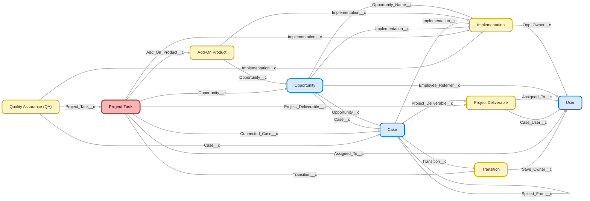

---
hide:
  - path
---

<!-- This file is auto-generated. if you do not want it to be overwritten, set TRUE in the line below -->
<!-- DO_NOT_OVERWRITE_DOC=FALSE -->

## Schema

<!-- Object description -->

## Fields

| Name      | Label | Type | Description |
| :-------- | :---- | :--: | :---------- | 
| Actual_Completion_Date__c | Actual Completion Date | DateTime | When work on the task was completed |
| Actual_Start_Date__c | Actual Start Date | DateTime | When work started on the task |
| Add_On_Product__c | Add-On Product | Lookup | undefined |
| Add_On_Product_Status__c | Add-On Product Status | Text | undefined |
| Age__c | Age | Number | undefined |
| Assigned_To__c | Assigned To | Lookup | undefined |
| Case_Upon_Creation__c | Case Upon Creation | Checkbox | undefined |
| Closed_via_Button__c | Closed via Button | Checkbox | undefined |
| Completed__c | Completed | Checkbox | Used to show and give count on completed project tasks. |
| Completion_Order__c | Completion Order | Number | undefined |
| Connected_Case__c | Connected Case | Lookup | undefined |
| Creation_Point__c | Creation Point | Text | undefined |
| Days_to_Complete__c | Days to Complete | Number | Business days remaining for SLA attainment |
| Declined_Reason__c | Declined Reason | Picklist | undefined |
| Docs_Signed_for_PRKS__c | Docs Signed for PRKS | Checkbox | Check to see if docs are signed for PRKS team to begin tasks |
| Eligible_for_Reassignment__c | Eligible for Reassignment | Checkbox | undefined |
| Expected_Completion_Date__c | Expected Completion Date | DateTime | Based on template timelines for each Implementation |
| Expected_Start_Date__c | Expected Start Date | DateTime | Based on template timelines for each Implementation |
| Imp_Flag__c | Imp Flag | Text | Report version of Progress Tracker to use on Implementation Project Tasks List Views |
| Implementation__c | Implementation | Lookup | undefined |
| Implementation_Dashboard_Link__c | Implementation Dashboard Link | Text | Link to Implementation Dashboard from related Imp record. |
| Implementation_Id__c | Implementation Id | Text | undefined |
| Implementation_Stage__c | Implementation Status | Text | undefined |
| Included_in_Non_Linear_Group__c | Included in Non-Linear Group | Text | undefined |
| KPI_Milestone__c | KPI Milestone | Picklist | undefined |
| Liquidation_Date__c | Liquidation Date | Date | undefined |
| Non_Linear_Progression_Group__c | Non-Linear Progression Group | Text | undefined |
| Notes__c | Notes | LongTextArea | undefined |
| Opportunity__c | Opportunity | Lookup | undefined |
| Opportunity_Stage__c | Opportunity Stage | Text | undefined |
| Order_Number__c | Order Number | Number | Used to automate task changes |
| Paradigm_Company_URL__c | Paradigm Company URL | Text | Copy of Paradigm Company Link from Implementation |
| Picklist_Population_on_Completion__c | Picklist Population on Completion | Checkbox | undefined |
| Project_Deliverable__c | Project Deliverable | Lookup | undefined |
| Project_Task_ID_18_Char__c | Project Task ID (18 Char) | Text | undefined |
| QA_Status__c | QA Status | Picklist | undefined |
| Responsible_Party__c | Responsible Party | Picklist | Used to report on time each party took on tasks during Implementation |
| Service_Plan_Type__c | Service/Plan Type | Text | Service Option & Plan Type from Implementation |
| Skill__c | Skill | Text | undefined |
| SLA_Completion__c | SLA Completion | Checkbox | Checks time to complete of project task vs SLA for project task deliverable. |
| Status__c | Status | Picklist | undefined |
| Team_Member__c | Team Member | Picklist | undefined |
| Time_To_Complete__c | Time To Complete | Number | Measured in Days |
| Time_to_Complete_1__c | Time to Complete 1 | Number | Calculates difference between dates excluding weekends. |
| Transition__c | Transition | Lookup | undefined |
| Work_Breakdown_Structure__c | Work Breakdown Structure | Text | undefined |

## Validation Rules

| Rule      | Active | Description | Formula |
| :-------- | :---- | :---------- | :------ |
| Completion_Date_Needed | Yes |  | ISNULL( Actual_Completion_Date__c ) && (ISPICKVAL( Status__c, "Not Needed")  ISPICKVAL( Status__c, "Declined")  ISPICKVAL( Status__c, "Completed")) |
| Completion_Status_Needed | No ⚠️ |  | (NOT(ISNULL( Actual_Completion_Date__c ) ) && ISPICKVAL( Status__c, "Ready"))  (NOT(ISNULL( Actual_Completion_Date__c ) ) && ISPICKVAL( Status__c, "In Progress")) |

## Related Flows

| Object | Name      | Type | Description |
| :----  | :-------- | :--: | :---------- | 
| 💻 | [Case_Process_Complete_Connected_Tasks](../flows/Case_Process_Complete_Connected_Tasks.md) [🕒](../flows/Case_Process_Complete_Connected_Tasks-history.md) |  Auto Launched Flow | <!-- --> |
| 💻 | [Implementation_Update_Task_Ownership](../flows/Implementation_Update_Task_Ownership.md) [🕒](../flows/Implementation_Update_Task_Ownership-history.md) |  Auto Launched Flow | When CST owns Implementation, reassign open tasks when appropriate.   Adds reassignment of "Set Implementation Completion Date" |
| 💻 | [Project_Task_Button_Complete_Tasks](../flows/Project_Task_Button_Complete_Tasks.md) [🕒](../flows/Project_Task_Button_Complete_Tasks-history.md) |  Screen Flow | <!-- --> |
| 💻 | [Project_Task_Button_Process_Complete_Tasks](../flows/Project_Task_Button_Process_Complete_Tasks.md) [🕒](../flows/Project_Task_Button_Process_Complete_Tasks-history.md) |  Auto Launched Flow | <!-- --> |
| 💻 | [Project_Task_Button_Start_Tasks](../flows/Project_Task_Button_Start_Tasks.md) [🕒](../flows/Project_Task_Button_Start_Tasks-history.md) |  Screen Flow | <!-- --> |
| 💻 | [Project_Task_Completion](../flows/Project_Task_Completion.md) [🕒](../flows/Project_Task_Completion-history.md) |  Screen Flow | Marks selected tasks as Completed from the List View |
| 💻 | [Project_Task_Creation_Implementations](../flows/Project_Task_Creation_Implementations.md) [🕒](../flows/Project_Task_Creation_Implementations-history.md) |  Auto Launched Flow | Modified task loop to wipe "actual completion date" for the task variable each pass - was auto completing tasks when there was a "not needed" in the loop (variable wasn't getting reset). |
| 💻 | [Project_Task_Edit_Implementations](../flows/Project_Task_Edit_Implementations.md) [🕒](../flows/Project_Task_Edit_Implementations-history.md) |  Auto Launched Flow | Adds update to Implementation Completion Date task #16.   "Owned By Queue" Decision = YES results in task owner/assigned changed to Running User instead of changing to Imp Owner.   Imp Owner remains Client Support and any CST can update tasks.   SF can't change project task owner/assigned (user fields 005) to Queue owner (00G) |
| 💻 | [Project_Task_Process_Complete_Tasks](../flows/Project_Task_Process_Complete_Tasks.md) [🕒](../flows/Project_Task_Process_Complete_Tasks-history.md) |  Auto Launched Flow | <!-- --> |
| 💻 | [Project_Task_Process_Send_Email_Alert](../flows/Project_Task_Process_Send_Email_Alert.md) [🕒](../flows/Project_Task_Process_Send_Email_Alert-history.md) |  Auto Launched Flow | Flow built to trigger auto email when Project Task is created or updated. |
| 💻 | [QA_Button_Create_QA](../flows/QA_Button_Create_QA.md) [🕒](../flows/QA_Button_Create_QA-history.md) |  Auto Launched Flow | Switched "Floating QA" check from "recordId is null" to being the default outcome Used from multiple objects of origin to create a QA record |
| 💻 | [QA_Screen_Better_Create_QA](../flows/QA_Screen_Better_Create_QA.md) [🕒](../flows/QA_Screen_Better_Create_QA-history.md) |  Screen Flow | <!-- --> |
| 💻 | [Task_Declined](../flows/Task_Declined.md) [🕒](../flows/Task_Declined-history.md) |  Auto Launched Flow | Marks Project Task as "Declined" |
| 💻 | [Task_Not_Needed](../flows/Task_Not_Needed.md) [🕒](../flows/Task_Not_Needed-history.md) |  Auto Launched Flow | Marks Project Task as "Not Needed" |
| Add_On_Products__c | [Add_On_Product_After_Close_Unused_Tasks](../flows/Add_On_Product_After_Close_Unused_Tasks.md) [🕒](../flows/Add_On_Product_After_Close_Unused_Tasks-history.md) |  Record After Save | <!-- --> |
| Add_On_Products__c | [Add_On_Product_After_Update_Create_Project_Tasks](../flows/Add_On_Product_After_Update_Create_Project_Tasks.md) [🕒](../flows/Add_On_Product_After_Update_Create_Project_Tasks-history.md) |  Record After Save | 10/7/22- Removed lookup to Opportunity |
| Add_On_Products__c | [Add_On_Product_After_Update_Creation_Point_Project_Tasks](../flows/Add_On_Product_After_Update_Creation_Point_Project_Tasks.md) [🕒](../flows/Add_On_Product_After_Update_Creation_Point_Project_Tasks-history.md) |  Record After Save | Used to build Source Mapping Task when Survey is Received. Removed check for duplicate emails because it wasn't preventing other duplications. 10/7/22- Removed lookup to Opportunity. |
| Implementation__c | [Implementation_After_Trigger_Send_Client_Emails](../flows/Implementation_After_Trigger_Send_Client_Emails.md) [🕒](../flows/Implementation_After_Trigger_Send_Client_Emails-history.md) |  Record After Save | Update SImply Welcome Email to Self Service Email. Changed introductory call conditions from "Intro_Call_Complete__c" to "Introductory_Call__c" to better mesh with changes to Implementation  After Trigger  Update Imp Call Steps with new validations |
| Implementation__c | [Implementation_After_Trigger_Send_Pre_Call_Emails](../flows/Implementation_After_Trigger_Send_Pre_Call_Emails.md) [🕒](../flows/Implementation_After_Trigger_Send_Pre_Call_Emails-history.md) |  Scheduled | Updated Finch API name(s) |
| Implementation__c | [Implementation_After_Trigger_Update_Imp_Call_Steps](../flows/Implementation_After_Trigger_Update_Imp_Call_Steps.md) [🕒](../flows/Implementation_After_Trigger_Update_Imp_Call_Steps-history.md) |  Record After Save | Added support for self service plans to move from intro -> census.  Plans will progress when self service intro fields are completed AND documents are signed. |
| Implementation__c | [Implementation_After_Update_Creation_Point_Project_Tasks](../flows/Implementation_After_Update_Creation_Point_Project_Tasks.md) [🕒](../flows/Implementation_After_Update_Creation_Point_Project_Tasks-history.md) |  Record After Save | Swapped NOW() with flow interview's current time in start date assignment |
| Implementation__c | [Implementation_After_Update_Delete_Project_Tasks](../flows/Implementation_After_Update_Delete_Project_Tasks.md) [🕒](../flows/Implementation_After_Update_Delete_Project_Tasks-history.md) |  Record After Save | Changed to mark tasks as "not needed" rather than deleting them - in case a plan comes out of "no start" |
| Implementation__c | [Implementation_ONETIME_Create_Project_Tasks](../flows/Implementation_ONETIME_Create_Project_Tasks.md) [🕒](../flows/Implementation_ONETIME_Create_Project_Tasks-history.md) |  Scheduled | <!-- --> |
| Implementation__c | [Implementation_ONE_TIME_Follow_Up_Correction](../flows/Implementation_ONE_TIME_Follow_Up_Correction.md) [🕒](../flows/Implementation_ONE_TIME_Follow_Up_Correction-history.md) |  Scheduled | <!-- --> |
| Implementation__c | [Implementation_ONE_TIME_Ownership_Transfer](../flows/Implementation_ONE_TIME_Ownership_Transfer.md) [🕒](../flows/Implementation_ONE_TIME_Ownership_Transfer-history.md) |  Scheduled | <!-- --> |
| Implementation__c | [Implementation_ONE_TIME_Send_Welcome_Email](../flows/Implementation_ONE_TIME_Send_Welcome_Email.md) [🕒](../flows/Implementation_ONE_TIME_Send_Welcome_Email-history.md) |  Scheduled | <!-- --> |
| Opportunity | [Opportunity_After_Close_Unused_Tasks](../flows/Opportunity_After_Close_Unused_Tasks.md) [🕒](../flows/Opportunity_After_Close_Unused_Tasks-history.md) |  Record After Save | <!-- --> |
| Opportunity | [Opportunity_After_Update_Create_Project_Tasks](../flows/Opportunity_After_Update_Create_Project_Tasks.md) [🕒](../flows/Opportunity_After_Update_Create_Project_Tasks-history.md) |  Record After Save | <!-- --> |
| Plan__c | [Box_Account_Folder_Template](../flows/Box_Account_Folder_Template.md) [🕒](../flows/Box_Account_Folder_Template-history.md) |  Record After Save | Creates a folder in Box for this Account with the specified Template Folder |
| Plan__c | [Plan_After_Save_Create_or_Remove_Box_Folder](../flows/Plan_After_Save_Create_or_Remove_Box_Folder.md) [🕒](../flows/Plan_After_Save_Create_or_Remove_Box_Folder-history.md) |  Record After Save | Creates box folder for new plan creation.  Removes current box folder if an account gets a second plan at least a month after the first. |
| Plan__c | [Plan_After_Trigger_Close_Imp](../flows/Plan_After_Trigger_Close_Imp.md) [🕒](../flows/Plan_After_Trigger_Close_Imp-history.md) |  Record After Save | If Payroll Submitted, Close Imp.  If Imp fails to close from missing data, alert imp owner.  Added check so plans are eligible for completion with EITHER a funding call OR self service |
| Project_Task__c | [Implementations_Completed_Task_Status](../flows/Implementations_Completed_Task_Status.md) [🕒](../flows/Implementations_Completed_Task_Status-history.md) |  Workflow | Sets Status = Completed when complete date is manually entered directly on the task |
| Project_Task__c | [Project_Task_After_Trigger_Create_Case_for_Billing](../flows/Project_Task_After_Trigger_Create_Case_for_Billing.md) [🕒](../flows/Project_Task_After_Trigger_Create_Case_for_Billing-history.md) |  Record After Save | <!-- --> |
| Project_Task__c | [Project_Task_Before_Trigger_Box_Folder_Auto_Complete](../flows/Project_Task_Before_Trigger_Box_Folder_Auto_Complete.md) [🕒](../flows/Project_Task_Before_Trigger_Box_Folder_Auto_Complete-history.md) |  Record After Save | This flow is used to complete the Create Client Folder project task in the interim between shutting off Automation Team's code and using the flow from BI while we ensure that the new flow works correctly. Once the flow is deemed to be working, we will remove the project task all together and turn off this flow |
| Project_Task__c | [Project_Task_Before_Trigger_Mark_Duplicate_Tasks_Not_Needed](../flows/Project_Task_Before_Trigger_Mark_Duplicate_Tasks_Not_Needed.md) [🕒](../flows/Project_Task_Before_Trigger_Mark_Duplicate_Tasks_Not_Needed-history.md) |  Record Before Save | <!-- --> |
| Project_Task__c | [Project_Task_Before_Trigger_Update_Ownership](../flows/Project_Task_Before_Trigger_Update_Ownership.md) [🕒](../flows/Project_Task_Before_Trigger_Update_Ownership-history.md) |  Record Before Save | <!-- --> |
| Project_Task__c | [Project_Task_Before_Update_Set_Completion_Date_Upon_Completion](../flows/Project_Task_Before_Update_Set_Completion_Date_Upon_Completion.md) [🕒](../flows/Project_Task_Before_Update_Set_Completion_Date_Upon_Completion-history.md) |  Record Before Save | <!-- --> |
| Project_Task__c | [Project_Task_Creation_Generate_Case](../flows/Project_Task_Creation_Generate_Case.md) [🕒](../flows/Project_Task_Creation_Generate_Case-history.md) |  Record After Save | When a Project Task is created, evaluate where a Case should be generated, and assign to user or queue. |
| Project_Task__c | [Project_Task_Process_Move_Project_Forward](../flows/Project_Task_Process_Move_Project_Forward.md) [🕒](../flows/Project_Task_Process_Move_Project_Forward-history.md) |  Record After Save | Added path for imps tasks to not be reassigned to Nasrin on activation |
| Project_Task__c | [Project_Tasks_After_Trigger_Delete_Duplicates](../flows/Project_Tasks_After_Trigger_Delete_Duplicates.md) [🕒](../flows/Project_Tasks_After_Trigger_Delete_Duplicates-history.md) |  Record After Save | <!-- --> |
| Project_Task__c | [Project_Tasks_After_Trigger_Update_Imp_Steps](../flows/Project_Tasks_After_Trigger_Update_Imp_Steps.md) [🕒](../flows/Project_Tasks_After_Trigger_Update_Imp_Steps-history.md) |  Record After Save | <!-- --> |
| Quality_Assurance_QA__c | [Sync_QA_Status](../flows/Sync_QA_Status.md) [🕒](../flows/Sync_QA_Status-history.md) |  Record After Save | Removed renaming and migrated it to before save  Syncs a QA's completion status with record being reviewed |
| Transition__c | [Transition_After_Update_Create_Project_Tasks](../flows/Transition_After_Update_Create_Project_Tasks.md) [🕒](../flows/Transition_After_Update_Create_Project_Tasks-history.md) |  Record After Save | <!-- --> |
| dsfs__DocuSign_Status__c | [DocuSign_Close_Simply_Opp](../flows/DocuSign_Close_Simply_Opp.md) [🕒](../flows/DocuSign_Close_Simply_Opp-history.md) |  Workflow | Close Opp/Update Imp when A4S/AA is Signed if Service Option equals Simply |

## Related Apex Classes

| Apex Class | Type |
| :----      | :--: | 
| [StampDateTest](../apex/StampDateTest.md) | Test |
| [StampImpTest](../apex/StampImpTest.md) | Test |
| [StampDate](../apex/StampDate.md) | Class |
| [StampImp](../apex/StampImp.md) | Class |

## Related Lightning Pages

| Lightning Page | Type |
| :----      | :--: | 
| [Dynamic_QA](../pages/Dynamic_QA.md) |  Record Page |
| [Implementations](../pages/Implementations.md) |  Home Page |
| [Imps_QA](../pages/Imps_QA.md) |  Record Page |
| [New_Imp_Home_Page](../pages/New_Imp_Home_Page.md) |  Home Page |
| [Payroll_Integration](../pages/Payroll_Integration.md) |  Record Page |
| [Project_Task_Layout](../pages/Project_Task_Layout.md) |  Record Page |

## Related Profiles

| Profile | User License |
| :----      | :--: | 
| [Admin](../profiles/Admin.md) |  Salesforce |
| [Analytics Cloud Integration User](../profiles/Analytics%20Cloud%20Integration%20User.md) |  Analytics  Cloud  Integration  User |
| [Analytics Cloud Security User](../profiles/Analytics%20Cloud%20Security%20User.md) |  Analytics  Cloud  Integration  User |
| [Anypoint Integration](../profiles/Anypoint%20Integration.md) |  Identity |
| [B2BMA Integration User](../profiles/B2BMA%20Integration%20User.md) |  B2 B M A  Integration  User |
| [Billing User](../profiles/Billing%20User.md) |  Salesforce |
| [Bot Profile](../profiles/Bot%20Profile.md) |  Salesforce |
| [Business Development](../profiles/Business%20Development.md) |  Salesforce |
| [Call Center](../profiles/Call%20Center.md) |  Salesforce |
| [Chatter External User](../profiles/Chatter%20External%20User.md) |  Chatter  External |
| [Chatter Free User](../profiles/Chatter%20Free%20User.md) |  Chatter  Free |
| [Chatter Moderator User](../profiles/Chatter%20Moderator%20User.md) |  Chatter  Free |
| [Client Onboarding - Admin](../profiles/Client%20Onboarding%20-%20Admin.md) |  Salesforce |
| [Client Onboarding - RM](../profiles/Client%20Onboarding%20-%20RM.md) |  Salesforce |
| [Client Servicing Team](../profiles/Client%20Servicing%20Team.md) |  Salesforce |
| [Compliance Manager](../profiles/Compliance%20Manager.md) |  Salesforce |
| [ContractManager](../profiles/ContractManager.md) |  Salesforce |
| [Director of Operations](../profiles/Director%20of%20Operations.md) |  Salesforce |
| [Director of Sales](../profiles/Director%20of%20Sales.md) |  Salesforce |
| [Distributions](../profiles/Distributions.md) |  Salesforce |
| [Einstein Agent User](../profiles/Einstein%20Agent%20User.md) |  Einstein  Agent |
| [ESW_Agentforce_MIAW_1748035300267 Profile](../profiles/ESW_Agentforce_MIAW_1748035300267%20Profile.md) |  Guest  User  License |
| [ESW_Agentforce_MIAW_1748385215843 Profile](../profiles/ESW_Agentforce_MIAW_1748385215843%20Profile.md) |  Guest  User  License |
| [ESW_CE_Chat_1692890394498 Profile](../profiles/ESW_CE_Chat_1692890394498%20Profile.md) |  Guest  User  License |
| [ESW_CE_Chat_Moe_1693182845676 Profile](../profiles/ESW_CE_Chat_Moe_1693182845676%20Profile.md) |  Guest  User  License |
| [ESW_Login_Help_1697133738638 Profile](../profiles/ESW_Login_Help_1697133738638%20Profile.md) |  Guest  User  License |
| [ESW_Login_Help_Simply_1700075140889 Profile](../profiles/ESW_Login_Help_Simply_1700075140889%20Profile.md) |  Guest  User  License |
| [ESW_Omni_Messaging_1694183770479 Profile](../profiles/ESW_Omni_Messaging_1694183770479%20Profile.md) |  Guest  User  License |
| [ESW_Omni_Messaging_CO_1696448547822 Profile](../profiles/ESW_Omni_Messaging_CO_1696448547822%20Profile.md) |  Guest  User  License |
| [ESW_Omni_Messaging_Sallus_1700075448386 Profile](../profiles/ESW_Omni_Messaging_Sallus_1700075448386%20Profile.md) |  Guest  User  License |
| [ESW_Omni_Messaging_Simply_1700076370188 Profile](../profiles/ESW_Omni_Messaging_Simply_1700076370188%20Profile.md) |  Guest  User  License |
| [ESW_QA_Login_1699666348585 Profile](../profiles/ESW_QA_Login_1699666348585%20Profile.md) |  Guest  User  License |
| [ESW_QA_Messaging_1699974036493 Profile](../profiles/ESW_QA_Messaging_1699974036493%20Profile.md) |  Guest  User  License |
| [ESW_Sales_Chat_1697460991337 Profile](../profiles/ESW_Sales_Chat_1697460991337%20Profile.md) |  Guest  User  License |
| [ESW_Sallus_Login_Chat_1700072925200 Profile](../profiles/ESW_Sallus_Login_Chat_1700072925200%20Profile.md) |  Guest  User  License |
| [External Apps Login User](../profiles/External%20Apps%20Login%20User.md) |  External  Apps  Login |
| [Finance Manager Lightning](../profiles/Finance%20Manager%20Lightning.md) |  Salesforce |
| [Guest License User](../profiles/Guest%20License%20User.md) |  Guest  User  License |
| [Help Center Profile](../profiles/Help%20Center%20Profile.md) |  Guest  User  License |
| [Identity User](../profiles/Identity%20User.md) |  Identity |
| [Incoming_SMS Profile](../profiles/Incoming_SMS%20Profile.md) |  Guest  User  License |
| [IT](../profiles/IT.md) |  Salesforce |
| [Leadership Lightning](../profiles/Leadership%20Lightning.md) |  Salesforce |
| [Leadership](../profiles/Leadership.md) |  Salesforce |
| [Learning %26 Development](../profiles/Learning%20%2526%20Development.md) |  Salesforce |
| [Lightning Client Onboarding](../profiles/Lightning%20Client%20Onboarding.md) |  Salesforce |
| [Lightning Compliance](../profiles/Lightning%20Compliance.md) |  Salesforce |
| [Lightning Saver User](../profiles/Lightning%20Saver%20User.md) |  Salesforce |
| [Lightning Service Manager](../profiles/Lightning%20Service%20Manager.md) |  Salesforce |
| [Lightning Service User](../profiles/Lightning%20Service%20User.md) |  Salesforce |
| [Marketing Team](../profiles/Marketing%20Team.md) |  Salesforce |
| [MarketingProfile](../profiles/MarketingProfile.md) |  Salesforce |
| [Master Administrator](../profiles/Master%20Administrator.md) |  Salesforce |
| [Minimum Access - API Only Integrations](../profiles/Minimum%20Access%20-%20API%20Only%20Integrations.md) |  Salesforce  Integration |
| [Minimum Access - Salesforce](../profiles/Minimum%20Access%20-%20Salesforce.md) |  Salesforce |
| [myubiquity Profile](../profiles/myubiquity%20Profile.md) |  Guest  User  License |
| [Operations VP](../profiles/Operations%20VP.md) |  Salesforce |
| [Operations](../profiles/Operations.md) |  Salesforce |
| [Paradigm Help Center Profile](../profiles/Paradigm%20Help%20Center%20Profile.md) |  Guest  User  License |
| [Payroll Koncierge](../profiles/Payroll%20Koncierge.md) |  Salesforce |
| [Payroll Team](../profiles/Payroll%20Team.md) |  Salesforce |
| [People %26 Culture](../profiles/People%20%2526%20Culture.md) |  Salesforce |
| [Pre-chat Site Profile](../profiles/Pre-chat%20Site%20Profile.md) |  Guest  User  License |
| [Product Innovation Leadership](../profiles/Product%20Innovation%20Leadership.md) |  Salesforce |
| [Product Innovation User](../profiles/Product%20Innovation%20User.md) |  Salesforce |
| [PSM Team](../profiles/PSM%20Team.md) |  Salesforce |
| [R%26W](../profiles/R%2526W.md) |  Salesforce |
| [Read Only](../profiles/Read%20Only.md) |  Salesforce |
| [Sales Administrator](../profiles/Sales%20Administrator.md) |  Salesforce |
| [Sales Coordinator](../profiles/Sales%20Coordinator.md) |  Salesforce |
| [Sales Insights Integration User](../profiles/Sales%20Insights%20Integration%20User.md) |  Sales  Insights  Integration  User |
| [Sales Team - Limited](../profiles/Sales%20Team%20-%20Limited.md) |  Salesforce |
| [Sales Team](../profiles/Sales%20Team.md) |  Salesforce |
| [Salesforce API Only System Integrations](../profiles/Salesforce%20API%20Only%20System%20Integrations.md) |  Salesforce  Integration |
| [SalesforceIQ Integration User](../profiles/SalesforceIQ%20Integration%20User.md) |  Salesforce I Q  Integration  User |
| [Saver Manager](../profiles/Saver%20Manager.md) |  Salesforce |
| [Simple Survey Profile](../profiles/Simple%20Survey%20Profile.md) |  Guest  User  License |
| [Simply Help Center Profile](../profiles/Simply%20Help%20Center%20Profile.md) |  Guest  User  License |
| [SolutionManager](../profiles/SolutionManager.md) |  Salesforce |
| [Standard](../profiles/Standard.md) |  Salesforce |
| [StandardAul](../profiles/StandardAul.md) |  Salesforce  Platform |
| [Super System Administrator](../profiles/Super%20System%20Administrator.md) |  Salesforce |
| [Sys Dev Admin](../profiles/Sys%20Dev%20Admin.md) |  Salesforce |
| [Transitions Team](../profiles/Transitions%20Team.md) |  Salesforce |
| [Ubiquity Help Center Profile](../profiles/Ubiquity%20Help%20Center%20Profile.md) |  Guest  User  License |
| [Zoom Webhooks Profile](../profiles/Zoom%20Webhooks%20Profile.md) |  Guest  User  License |

## Related Permission Sets

| Permission Set | User License |
| :----      | :--: | 
| [Administrator](../permissionsets/Administrator.md) | None |
| [Attachments_and_Notes_Migrator](../permissionsets/Attachments_and_Notes_Migrator.md) | None |
| [Automation_Team_Imp_Project_Tasks](../permissionsets/Automation_Team_Imp_Project_Tasks.md) | None |
| [Data_Loader](../permissionsets/Data_Loader.md) | None |
| [Developer](../permissionsets/Developer.md) | None |
| [MagicMover](../permissionsets/MagicMover.md) | None |
| [Manager](../permissionsets/Manager.md) | None |
| [Master](../permissionsets/Master.md) | None |
| [Modify_All](../permissionsets/Modify_All.md) | None |
| [Power_User](../permissionsets/Power_User.md) | None |
| [Project_Task_Manager](../permissionsets/Project_Task_Manager.md) | None |
| [QA_Access_Dynamic](../permissionsets/QA_Access_Dynamic.md) | None |
| [QA_Access](../permissionsets/QA_Access.md) | None |
| [QA_Manage_Designs](../permissionsets/QA_Manage_Designs.md) | None |
| [sfdcInternalInt__sfdc_a360_sfcrm_data_extract](../permissionsets/sfdcInternalInt__sfdc_a360_sfcrm_data_extract.md) | None |
| [sfdcInternalInt__sfdc_articlerecommendations](../permissionsets/sfdcInternalInt__sfdc_articlerecommendations.md) | None |
| [sfdcInternalInt__sfdc_einsteinagent](../permissionsets/sfdcInternalInt__sfdc_einsteinagent.md) | None |
| [sfdcInternalInt__sfdc_replyrecommendations](../permissionsets/sfdcInternalInt__sfdc_replyrecommendations.md) | None |
| [sfdcInternalInt__sfdc_slack](../permissionsets/sfdcInternalInt__sfdc_slack.md) | None |
| [Standard_User](../permissionsets/Standard_User.md) | None |
| [View_All](../permissionsets/View_All.md) | None |
| [View_QA_Records](../permissionsets/View_QA_Records.md) | None |

_Documentation generated with [sfdx-hardis](https://sfdx-hardis.cloudity.com), by [Cloudity](https://www.cloudity.com/) & [friends](https://github.com/hardisgroupcom/sfdx-hardis/graphs/contributors)_
