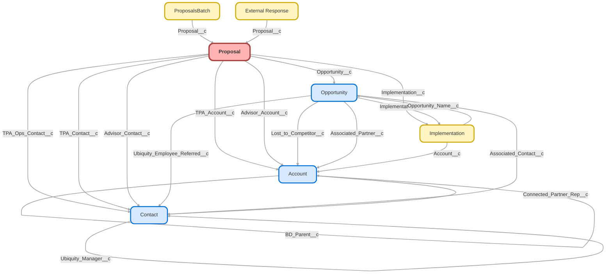

---
hide:
  - path
---

<!-- This file is auto-generated. if you do not want it to be overwritten, set TRUE in the line below -->
<!-- DO_NOT_OVERWRITE_DOC=FALSE -->

## Schema

<!-- Object description -->

## Fields

| Name      | Label | Type | Description |
| :-------- | :---- | :--: | :---------- | 
| Access_Code__c | Access Code | TextArea | Used to pass access code from partner to unlock certain provisions |
| Additional_Financial_Professional_Emails__c | Additional Financial Professional Emails | TextArea | undefined |
| Additional_Financial_Professional_Names__c | Additional Financial Professional Names | TextArea | undefined |
| Additional_Financial_Professional_NPNs__c | Additional Financial Professional NPNs | TextArea | undefined |
| Advisor_Account__c | Advisor Account | Lookup | undefined |
| Advisor_Broker_Dealer__c | Advisor Broker Dealer | Text | undefined |
| Advisor_Comp_Collection_Type__c | Advisor Comp Collection Type | Text | undefined |
| Advisor_Compensation_Amount__c | Advisor Compensation Amount | Text | undefined |
| Advisor_Compensation_Mode__c | Advisor Compensation Mode | Text | undefined |
| Advisor_Contact__c | Advisor Contact | Lookup | undefined |
| Advisor_Contact_Id__c | Advisor Contact Id | Text | undefined |
| Advisor_CRD__c | Advisor CRD | Text | undefined |
| Advisor_Email__c | Advisor Email | Text | undefined |
| Advisor_Included__c | Advisor Included | Text | undefined |
| Advisor_NPN__c | Advisor NPN | Text | undefined |
| Advisor_Zip_Code__c | Advisor Zip Code | Text | undefined |
| Annual_Base_Fee__c | Annual Base Fee | Text | undefined |
| Annual_Per_Head_Fee__c | Annual Per Head Fee | Text | undefined |
| Any_Current_Legal_Proceedings__c | Any Current Legal Proceedings | Picklist | Does the company have any current legal proceedings? |
| Auto_Deferral_Type__c | Auto Deferral Type | Text | undefined |
| Auto_Enrollment__c | Auto-Enrollment | Picklist | undefined |
| Auto_Enrollment_Deferral_Escalation_Rate__c | Auto-Enrollment Deferral/Escalation Rate | Picklist | undefined |
| Basis_Point_Compensation_Amount__c | Basis Point Compensation Amount | Number | Created for jotform advisor proposal form.  Stamped directly from form |
| Brokerage_Accounts_PCRA__c | Brokerage Accounts (PCRA) | Picklist | undefined |
| Client_Company_Name__c | Client Company Name | Text | undefined |
| Client_Dashboard_Link__c | Client Dashboard Link | Text | undefined |
| Close_Date__c | Close Date | Date | undefined |
| Company_Contact_First_Name__c | Company Contact First Name | Text | undefined |
| Company_Contact_Last_Name__c | Company Contact Last Name | Text | undefined |
| Company_EIN__c | Company EIN | Text | undefined |
| Company_Email__c | Company Email | Email | undefined |
| Company_State__c | Company State | Text | undefined |
| Company_Zip_Code__c | Company Zip Code | Text | undefined |
| Company_Zip_Postal_Code__c | Company Zip/Postal Code | Number | undefined |
| Compensation_Type__c | Compensation Type | Picklist | Created for jotform advisor proposal form.  Related to the basis point/flat fee compensation amount fields |
| Contact_Job_Title__c | Contact Job Title | Text | undefined |
| Contact_Phone_Number__c | Contact Phone Number | Phone | undefined |
| Controlled_Affiliated_Group_Company_Name__c | Controlled/Affiliated Group Company Name | Text | Name of company from controlled or affiliated service group |
| Conversion_Needed__c | Conversion Needed | Checkbox | undefined |
| Credentialed_Advisor__c | Credentialed Advisor | Checkbox | undefined |
| Current_401_k_provider__c | Current 401(k) provider | Text | undefined |
| Current_Plan__c | Current Plan | Text | undefined |
| Current_Recent_SIMPLE_Plan__c | Current/Recent SIMPLE Plan | Picklist | Do you currently have or have had at any point in this calendar year, a SIMPLE plan? |
| Current_Sponsor_of_Other_Plans__c | Current Sponsor of Other Plans | Picklist | Do you currently sponsor any additional retirement plans (i.e., 403(b), cash balance, defined benefit)? |
| Custodian__c | Custodian | Picklist | undefined |
| Deferral_Change_Frequency__c | Deferral Change Frequency | Picklist | undefined |
| Discretionary_Match__c | Discretionary Match | Picklist | undefined |
| Discretionary_Match_Formula__c | Discretionary Match Formula | Picklist | What % Discretionary match will the employer be utilizing? |
| Discretionary_Match_Formula_Notes__c | Discretionary Match Formula/Notes | Text | undefined |
| Eligibility_Age__c | Eligibility Age | Picklist | undefined |
| Employee_Loan_Availability__c | Employee Loan Availability | Picklist | undefined |
| Employee_Match__c | Employee Match | Text | undefined |
| Employer_Contribution__c | Employer Contribution | Text | undefined |
| Employer_Contribution_Formula__c | Employer Contribution Formula | Text | undefined |
| Employer_Contribution_Type__c | Employer Contribution Type | Text | undefined |
| Errors__c | Errors | LongTextArea | Populated with errors from Paradigm via Purchase API |
| Estimated_Annual_Payroll__c | Estimated Annual Payroll | Currency | undefined |
| External_Response__c | External Response | LongTextArea | undefined |
| Financial_Professional_Email__c | Financial Professional Email | Email | undefined |
| Financial_Professional_Fees__c | Financial Professional Fees | Text | undefined |
| Financial_Professional_First_Name__c | Financial Professional First Name | Text | undefined |
| Financial_Professional_Last_Name__c | Financial Professional Last Name | Text | undefined |
| Financial_Professional_Phone__c | Financial Professional Phone | Phone | undefined |
| Financial_Professional_Role__c | Financial Professional Role | Picklist | This field has a corresponding field on Contact that is updated via flow. If you add/remove a value here, do the same for the Contact field. |
| Financial_Professional_State__c | Financial Professional State | Text | undefined |
| Financial_Professional_Zip_Code__c | Financial Professional Zip Code | Number | undefined |
| Firm_Name__c | Firm Name | Text | undefined |
| Flat_Fee_Compensation_Amount__c | Flat Fee Compensation Amount | Number | Created for jotform advisor proposal form.  Stamped directly from form |
| Force_Queue__c | Force Queue | Checkbox | undefined |
| Fund_List__c | Fund List | Picklist | undefined |
| Government_Entity__c | Government Entity? | Picklist | Is the company a government entity? |
| Grandfather_Date__c | Grandfather Date | Date | undefined |
| Hardships__c | Hardships | Picklist | undefined |
| IMO_Agent_Email__c | IMO Agent Email | Email | undefined |
| IMO_Agent_First_Name__c | IMO Agent First Name | Text | undefined |
| IMO_Agent_Last_Name__c | IMO Agent Last Name | Text | undefined |
| IMO_Agent_Phone__c | IMO Agent Phone | Phone | undefined |
| IMO_Agent_State__c | IMO Agent State | Text | undefined |
| IMO_CRD__c | IMO CRD | Text | undefined |
| IMO_Firm_Name__c | IMO Firm Name | Text | undefined |
| Implementation__c | Implementation | Lookup | undefined |
| Implementation_Status__c | Implementation Status | Text | undefined |
| Implementation_Step__c | Implementation Step | Text | Implementation Steps |
| Include_Company_in_UBQT_Plan__c | Include Company in UBQT Plan | Picklist | Will this company be included in the plan? Ubiquity is not responsible for combined testing. |
| Insurance_Agency_NPN__c | Insurance Agency NPN | Number | undefined |
| Introductory_Fee__c | Introductory Fee | Number | undefined |
| isCalloutTriggered__c | isCalloutTriggered | Checkbox | undefined |
| Lead_Source__c | Lead Source | Picklist | undefined |
| Lead_Source_Detail__c | Lead Source Detail | Picklist | undefined |
| Legal_Proceeding_Explanation__c | Legal Proceeding Explanation | LongTextArea | Explain the nature of the legal proceeding(s) |
| Loans__c | Loans | Picklist | undefined |
| Longer_than_12_Months_with_Zero_Assets__c | Longer than 12 Months with Zero Assets | Picklist | Has it been longer than 12 months since the plan has had zero assets? |
| Manual_Callout__c | Manual Callout | Checkbox | undefined |
| Master_Advisor_Account__c | Master Advisor Account | Text | undefined |
| Max_Auto_Deferral_Percentage__c | Max Auto Deferral Percentage | Number | undefined |
| Min_Auto_Deferral_Percentage__c | Min Auto Deferral Percentage | Number | undefined |
| MML_Form_Values__c | MML Form Values | Html | Will be used to track entered values from the Jotform for MML Plans |
| Number_of_Employees__c | Number of Employees | Number | undefined |
| Number_of_HCE_s__c | Number of HCE's | Number | Number of Highly Compensated Employees |
| Number_of_non_HCE_s__c | Number of non-HCE's | Number | Number of non-Highly Compensated Employees |
| Number_of_Non_Owner_Employees__c | Number of Non-Owner Employees | Number | undefined |
| Older_Than_3_Years__c | Older Than 3 Years | Checkbox | undefined |
| OPD_Notes__c | OPD Notes | LongTextArea | Copied from the Opp Notes field |
| OPD_Status__c | OPD Status | Picklist | undefined |
| Opportunity__c | Opportunity | Lookup | undefined |
| Original_Effective_Date__c | Original Effective Date | Date | Original Effective Date for Conversion Plans |
| Ownership_Override__c | Ownership Override | Checkbox | Used to Override assignment automation. |
| Paradigm_Purchase_Link__c | Paradigm Purchase Link | Text | undefined |
| Part_of_Controlled_or_Affiliated_Group__c | Part of Controlled or Affiliated Group | Picklist | Is your plan a part of a controlled or affiliated service group? |
| Participant_Fee_Payment__c | Participant Fee Payment | Picklist | undefined |
| Payroll_Provider__c | Payroll Provider | Text | Will be used to capture Payroll Provider info from Jotform |
| Pending_Alert__c | Pending Alert | Checkbox | undefined |
| Permissible_Withdrawal_Days__c | Permissible Withdrawal Days | Text | undefined |
| Plan_Effective_Date__c | Plan Effective Date | Date | undefined |
| Plan_Eligibility__c | Plan Eligibility | Picklist | undefined |
| Plan_Entry_Frequency__c | Plan Entry Frequency | Picklist | undefined |
| Plan_ID__c | Plan ID | Text | undefined |
| Plan_ID_First_Synced__c | Plan ID First Synced | Date | undefined |
| Plan_Name__c | Plan Name | TextArea | Original Plan name for conversion plans |
| Plan_Number__c | Plan Number | Text | How many plans have existed for this company? Format 002 |
| Plan_Type__c | Plan Type | Picklist | undefined |
| Portfolio_Code__c | Portfolio Code | Text | undefined |
| Previous_Plan_Effective_Date__c | Previous Plan Effective Date | Date | undefined |
| Previously_Sponsored_401_k_Plan__c | Previously Sponsored 401(k) Plan | Picklist | Have you previously sponsored a 401(k) plan? |
| Pricing_Origin__c | Pricing Origin | Checkbox | For simply proposals.  If checked, indicates that the proposal originated as a "Pricing" proposal, not full plan proposal.  Should remain checked on pricing proposals that have converted to "Provisions". |
| Primary_Advisor_18_Char_Id__c | Primary Advisor (18 Char Id) | Text | 18 character id for the contact listed as the Advisor Contact |
| Primary_TPA_18_Char_Id__c | Primary TPA (18 Char Id) | Text | 18 character id for the contact listed as the TPA Contact |
| Principal_Account_Id__c | Principal Account Id | Text | undefined |
| Principal_Advisor_Id__c | Principal Advisor Id | Text | undefined |
| Principal_Client_Id__c | Principal Client Id | Text | undefined |
| Principal_Id__c | Principal Id | Text | undefined |
| Principal_Opportunity_Closed_Lost_Reason__c | Principal Opportunity Closed Lost Reason | Picklist | undefined |
| Principal_Opportunity_Id__c | Principal Opportunity Id | Text | undefined |
| Principal_Opportunity_Stage__c | Principal Opportunity Stage | Picklist | undefined |
| Principal_TPA_Id__c | Principal TPA Id | Text | undefined |
| Prior_Year_Profit_Sharing_Contribution__c | Prior Year Profit Sharing Contribution | Picklist | Will the client fund a prior year profit sharing contribution |
| Product_Code__c | Product Code | Text | Used for PurchaseAPI |
| Product_Type__c | Product Type | Picklist | undefined |
| Profit_Sharing__c | Profit Sharing | Picklist | undefined |
| Profit_Sharing_Match_Vesting_Schedule__c | Profit Sharing & Match Vesting Schedule | Picklist | undefined |
| Profit_Sharing_Plan_Effective_Date__c | Profit Sharing Plan Effective Date | Date | Prior Year Profit Sharing Plan Effective Date |
| Promo_Code__c | Promo Code | Text | Promo Code for sending to Paradigm through API |
| Proposal_Id_18_Char__c | Proposal Id (18 Char) | Text | undefined |
| Proposal_Notes__c | Proposal Notes | LongTextArea | Add notes here. |
| Provisions__c | Provisions | Checkbox | For simply proposals.  Received through API, this indicates if a proposal is in the pricing/quote stage(false) or the provisions stage(true). |
| Publicly_Traded__c | Publicly Traded? | Picklist | Is the company a publicly traded company? |
| QACA_Safe_Harbor_Vesting_Schedule__c | QACA Safe Harbor Vesting Schedule | Picklist | undefined |
| Queued__c | Queued | Checkbox | undefined |
| Referrer_Email__c | Referrer Email | Text | undefined |
| Referrer_Phone__c | Referrer Phone | Text | undefined |
| Referrer_Type__c | Referrer Type | Picklist | undefined |
| Region__c | Region | Text | undefined |
| Representative_Number__c | Representative Number | Text | undefined |
| Restatement_Date__c | Restatement Date | Date | Date plan is restated from Ubiquity side. |
| Roth_Contributions__c | Roth Contributions | Picklist | undefined |
| Safe_Harbor__c | Safe Harbor | Picklist | undefined |
| Safe_Harbor_Match_Determination_Period__c | Safe Harbor Match Determination Period | Picklist | undefined |
| Sallus_ID__c | Sallus ID | Text | undefined |
| Scheduled_Run__c | Scheduled Run | DateTime | undefined |
| Secondary_Advisor_Info__c | Secondary Advisor Info | LongTextArea | undefined |
| Service_Option__c | Service Option | Picklist | undefined |
| Split_Opp__c | Split Opp | Checkbox | undefined |
| SRP_Education__c | SRP Education | Checkbox | Sent from shift, indicates if a proposal from leafhouse/srp opted for education |
| Stage_Flag__c | Stage Flag | Picklist | undefined |
| Status__c | Status | Picklist | undefined |
| Tax_Exempt__c | Tax-Exempt | Checkbox | undefined |
| Time_to_Fund__c | Time to Fund | Number | Time to Fund from Implementation Object |
| TPA_Account__c | TPA Account | Lookup | undefined |
| TPA_Annual_Per_Participant_Cost__c | TPA Annual Per Participant Cost | Text | undefined |
| TPA_Contact__c | TPA Contact | Lookup | undefined |
| TPA_Contact_Id__c | TPA Contact Id | Text | undefined |
| TPA_EIN__c | TPA EIN | Text | undefined |
| TPA_Firm_Name__c | TPA Firm Name | Text | undefined |
| TPA_Included__c | TPA Included | Text | undefined |
| TPA_Ops_Contact__c | TPA Ops Contact | Lookup | undefined |
| TPA_Ops_Email__c | TPA Ops Email | Text | undefined |
| TPA_Ops_First_Name__c | TPA Ops First Name | Text | undefined |
| TPA_Ops_Last_Name__c | TPA Ops Last Name | Text | undefined |
| TPA_Ops_Phone__c | TPA Ops Phone | Text | undefined |
| TPA_Sales_Email__c | TPA Sales Email | Text | undefined |
| TPA_Sales_First_Name__c | TPA Sales First Name | Text | undefined |
| TPA_Sales_Last_Name__c | TPA Sales Last Name | Text | undefined |
| TPA_Setup_Fee__c | TPA Setup Fee | Text | undefined |
| Type_of_Current_Legal_Proceedings__c | Type of Current Legal Proceedings | Picklist | Indicate which of the following and provide explanation |
| X3_21__c | 3(21) | Checkbox | undefined |
| X3_38__c | 3(38) | Picklist | undefined |
| Yearly_Auto_Deferral_Percentage_Increase__c | Yearly Auto Deferral Percentage Increase | Number | undefined |

## Validation Rules

| Rule      | Active | Description | Formula |
| :-------- | :---- | :---------- | :------ |
| Lock_Quick_Quotes | Yes |  | ISPICKVAL(PRIORVALUE( Stage_Flag__c ),"Quick Quote") &&  RecordTypeId = "0121G000000RlheQAC" && (ISCHANGED(Stage_Flag__c)  ISCHANGED(Status__c)) |
| QACA_EACA_Match | Yes |  | ISNEW() && NOT(ISBLANK(Opportunity__c)) && NOT(Opportunity__r.IsClosed) && ((CONTAINS(TEXT(Opportunity__r.AutoEnrollment__c),"QACA") && NOT(CONTAINS(TEXT(Opportunity__r.Safe_Harbor__c),"QACA")))  (NOT(CONTAINS(TEXT(Opportunity__r.AutoEnrollment__c),"QACA")) && CONTAINS(TEXT(Opportunity__r.Safe_Harbor__c),"QACA"))) |

## Related Flows

| Object | Name      | Type | Description |
| :----  | :-------- | :--: | :---------- | 
| 💻 | [Contact_Uncredentialed_Advisor_Upon_Purchase](../flows/Contact_Uncredentialed_Advisor_Upon_Purchase.md) [🕒](../flows/Contact_Uncredentialed_Advisor_Upon_Purchase-history.md) |  Auto Launched Flow | Verifies Advisor's credential status upon Simply plan sold |
| 💻 | [Create_Junction_After_Conversion](../flows/Create_Junction_After_Conversion.md) [🕒](../flows/Create_Junction_After_Conversion-history.md) |  Auto Launched Flow | Updated to use ac and ap roles from lead on new ac and ap records (rather than defaulting to "referrer" generic values)  Creates Associated Contact Junction if needed when Lead is Converted |
| 💻 | [DocuSign_Recipient_Process_Associate_Key_Records](../flows/DocuSign_Recipient_Process_Associate_Key_Records.md) [🕒](../flows/DocuSign_Recipient_Process_Associate_Key_Records-history.md) |  Auto Launched Flow | <!-- --> |
| 💻 | [Lead_Process_Assign_TPA_Ownership](../flows/Lead_Process_Assign_TPA_Ownership.md) [🕒](../flows/Lead_Process_Assign_TPA_Ownership-history.md) |  Auto Launched Flow | <!-- --> |
| 💻 | [Opportunity_Button_Create_OPD](../flows/Opportunity_Button_Create_OPD.md) [🕒](../flows/Opportunity_Button_Create_OPD-history.md) |  Screen Flow | <!-- --> |
| 💻 | [Opportunity_Button_New_OPD_Flow](../flows/Opportunity_Button_New_OPD_Flow.md) [🕒](../flows/Opportunity_Button_New_OPD_Flow-history.md) |  Screen Flow | <!-- --> |
| 💻 | [Opportunity_Process_Send_Welcome_Email](../flows/Opportunity_Process_Send_Welcome_Email.md) [🕒](../flows/Opportunity_Process_Send_Welcome_Email-history.md) |  Auto Launched Flow | Deleted Pause Element (as of 15:00 pm 11/21/23) |
| 💻 | [Opportunity_Screen_Approval_Helper](../flows/Opportunity_Screen_Approval_Helper.md) [🕒](../flows/Opportunity_Screen_Approval_Helper-history.md) |  Screen Flow | <!-- --> |
| 💻 | [Proposal_Autolaunched_Assign_Lead_Values_From_Proposal](../flows/Proposal_Autolaunched_Assign_Lead_Values_From_Proposal.md) [🕒](../flows/Proposal_Autolaunched_Assign_Lead_Values_From_Proposal-history.md) |  Auto Launched Flow | Added support for principal advisors, TPAs, and employers. |
| 💻 | [Proposal_Autolaunched_Create_leads_from_proposal](../flows/Proposal_Autolaunched_Create_leads_from_proposal.md) [🕒](../flows/Proposal_Autolaunched_Create_leads_from_proposal-history.md) |  Auto Launched Flow | Adding AC and AP roles |
| 💻 | [Proposal_Button_Generate_Simply_Lead](../flows/Proposal_Button_Generate_Simply_Lead.md) [🕒](../flows/Proposal_Button_Generate_Simply_Lead-history.md) |  Screen Flow | Adding Min and Max Auto Deferral Perecentage. Moe 04.09.25 |
| 💻 | [Proposal_Button_Mark_Proposal_Expired](../flows/Proposal_Button_Mark_Proposal_Expired.md) [🕒](../flows/Proposal_Button_Mark_Proposal_Expired-history.md) |  Screen Flow | Record page button to mark a proposal as expired by setting stage flag and status to "Expired Save/Share" and appending the notes with "Manually marked expired on {Today's Date} |
| 💻 | [Proposal_Button_Send_Plan_to_Paradigm](../flows/Proposal_Button_Send_Plan_to_Paradigm.md) [🕒](../flows/Proposal_Button_Send_Plan_to_Paradigm-history.md) |  Screen Flow | Adding Status = Submitted for Purchase after successful callout. Adding Success and Error Logs |
| 💻 | [Proposal_Delayed_Assignment](../flows/Proposal_Delayed_Assignment.md) [🕒](../flows/Proposal_Delayed_Assignment-history.md) |  Auto Launched Flow | Originally designed to account for when Sallus proposals come in with an advisor lead.  Waits 5 minutes for the lead to auto convert, matches it to proposal. |
| 💻 | [Proposal_Scheduled_Expire_Simply_Proposals](../flows/Proposal_Scheduled_Expire_Simply_Proposals.md) [🕒](../flows/Proposal_Scheduled_Expire_Simply_Proposals-history.md) |  Scheduled | Changed "entry" get for simply proposals so any that were modified in the last two months are excluded |
| 💻 | [Proposal_Scheduled_Grab_ZIP_From_Account](../flows/Proposal_Scheduled_Grab_ZIP_From_Account.md) [🕒](../flows/Proposal_Scheduled_Grab_ZIP_From_Account-history.md) |  Scheduled | <!-- --> |
| 💻 | [Proposal_Scheduled_Sync_Marketing_Proposals](../flows/Proposal_Scheduled_Sync_Marketing_Proposals.md) [🕒](../flows/Proposal_Scheduled_Sync_Marketing_Proposals-history.md) |  Scheduled | new run, no other changes |
| 💻 | [PurchaseAPI_Helper_Add_Sources](../flows/PurchaseAPI_Helper_Add_Sources.md) [🕒](../flows/PurchaseAPI_Helper_Add_Sources-history.md) |  Auto Launched Flow | Adding Eligibility Age check for sources Adding effectiveDate logic for Prior Year Profit Sharing Contribution |
| 💻 | [Purchase_API_Get_Purchase_Link](../flows/Purchase_API_Get_Purchase_Link.md) [🕒](../flows/Purchase_API_Get_Purchase_Link-history.md) |  Auto Launched Flow | Adding Restatement Date for OPD and Proposal Name in payload - Moe 04.18.2025 |
| 💻 | [Purchase_API_Make_Firm_AP_and_Advisor_API_callout](../flows/Purchase_API_Make_Firm_AP_and_Advisor_API_callout.md) [🕒](../flows/Purchase_API_Make_Firm_AP_and_Advisor_API_callout-history.md) |  Auto Launched Flow | <!-- --> |
| Account | [Account_After_Trigger_Master_Flow](../flows/Account_After_Trigger_Master_Flow.md) [🕒](../flows/Account_After_Trigger_Master_Flow-history.md) |  Record After Save | <!-- --> |
| External_Response__c | [External_Response_After_Creation_Check_Queued_Status](../flows/External_Response_After_Creation_Check_Queued_Status.md) [🕒](../flows/External_Response_After_Creation_Check_Queued_Status-history.md) |  Record After Save | <!-- --> |
| Implementation__c | [Implementation_After_Trigger_Update_Proposal_Upon_Completion](../flows/Implementation_After_Trigger_Update_Proposal_Upon_Completion.md) [🕒](../flows/Implementation_After_Trigger_Update_Proposal_Upon_Completion-history.md) |  Record After Save | Changed effective date update to only fire after imp is completed |
| Implementation__c | [Implementation_Before_Trigger_Update_Fees](../flows/Implementation_Before_Trigger_Update_Fees.md) [🕒](../flows/Implementation_Before_Trigger_Update_Fees-history.md) |  Record Before Save | Updated so employee fee for Sallus is 4.5 (from 9) |
| Lead | [Lead_Before_Save_Sync_Employee_Count](../flows/Lead_Before_Save_Sync_Employee_Count.md) [🕒](../flows/Lead_Before_Save_Sync_Employee_Count-history.md) |  Record Before Save | Created for simply proposals.  Syncs employee count from proposal to lead at the moment of conversion. |
| Lead | [Lead_Default_Values_for_Partnerships](../flows/Lead_Default_Values_for_Partnerships.md) [🕒](../flows/Lead_Default_Values_for_Partnerships-history.md) |  Record Before Save | Updated for leafhouse build to apply leafhouse LSD  Migrated from the Lead  Default Values for Partnerships process using multiple criteria. Sets default values to Partnership Leads |
| Lead | [Lead_Update_Lead_Source_Detail_Update](../flows/Lead_Update_Lead_Source_Detail_Update.md) [🕒](../flows/Lead_Update_Lead_Source_Detail_Update-history.md) |  Record Before Save | <!-- --> |
| Opportunity | [Opportunity_After_Trigger_Update_OPD_when_Opp_Updates](../flows/Opportunity_After_Trigger_Update_OPD_when_Opp_Updates.md) [🕒](../flows/Opportunity_After_Trigger_Update_OPD_when_Opp_Updates-history.md) |  Record After Save | <!-- --> |
| Opportunity | [Opportunity_After_Trigger_Update_Proposal_Status](../flows/Opportunity_After_Trigger_Update_Proposal_Status.md) [🕒](../flows/Opportunity_After_Trigger_Update_Proposal_Status-history.md) |  Record After Save | Updates proposal status after Opportunity is Closed Won |
| Opportunity | [Opportunity_After_Update_Complex_Email_Alerts](../flows/Opportunity_After_Update_Complex_Email_Alerts.md) [🕒](../flows/Opportunity_After_Update_Complex_Email_Alerts-history.md) |  Record After Save | correcting typo in new principal address |
| Opportunity_Promotion__c | [Opportunity_Promotion_After_Delete_Remove_Code_From_Proposal](../flows/Opportunity_Promotion_After_Delete_Remove_Code_From_Proposal.md) [🕒](../flows/Opportunity_Promotion_After_Delete_Remove_Code_From_Proposal-history.md) |  Record Before Delete | Removes this promotion's promo code (if present) from any proposals related to opportunity |
| Opportunity_Promotion__c | [Opportunity_Promotion_After_Insert_Promo_Code_To_Proposals](../flows/Opportunity_Promotion_After_Insert_Promo_Code_To_Proposals.md) [🕒](../flows/Opportunity_Promotion_After_Insert_Promo_Code_To_Proposals-history.md) |  Record After Save | Stamps promo code from new opp promotion to proposal records related to opp |
| Proposal__c | [Proposal_After_Insert_Force_Simply_Sync](../flows/Proposal_After_Insert_Force_Simply_Sync.md) [🕒](../flows/Proposal_After_Insert_Force_Simply_Sync-history.md) |  Record After Save | All new simply proposals should sync to their salesforce.  This helps trigger the process on insert. |
| Proposal__c | [Proposal_After_Save_Assignment_Task_Alert](../flows/Proposal_After_Save_Assignment_Task_Alert.md) [🕒](../flows/Proposal_After_Save_Assignment_Task_Alert-history.md) |  Record After Save | <!-- --> |
| Proposal__c | [Proposal_After_Save_Create_Principal_Adv_n_TPA](../flows/Proposal_After_Save_Create_Principal_Adv_n_TPA.md) [🕒](../flows/Proposal_After_Save_Create_Principal_Adv_n_TPA-history.md) |  Record After Save | Creates Advisor and/or TPA for Simply Proposals once their information is added to the proposal and there isn't already a contact present. |
| Proposal__c | [Proposal_After_Save_Marketing_Proposal_Sync](../flows/Proposal_After_Save_Marketing_Proposal_Sync.md) [🕒](../flows/Proposal_After_Save_Marketing_Proposal_Sync-history.md) |  Record After Save | <!-- --> |
| Proposal__c | [Proposal_After_Save_Related_People](../flows/Proposal_After_Save_Related_People.md) [🕒](../flows/Proposal_After_Save_Related_People-history.md) |  Record After Save | Updated to fix ubiquity employer subflow call |
| Proposal__c | [Proposal_After_Save_Send_Update_Alert](../flows/Proposal_After_Save_Send_Update_Alert.md) [🕒](../flows/Proposal_After_Save_Send_Update_Alert-history.md) |  Record After Save | Added specific email alert for when pricing proposals convert to full proposals  Pulled that alert from employer lead creation flow |
| Proposal__c | [Proposal_After_Trigger](../flows/Proposal_After_Trigger.md) [🕒](../flows/Proposal_After_Trigger-history.md) |  Record After Save | Removed advisor lead creation for Sallus (covered by their api connection, leads created directly), adjusted formatted state formula to return null instead of 'Other' when it can't find a match.  Handles proposals before distribution via DE.  Creates partner lead(s), connects contacts to proposal, assigns it to staging user/queue.  After assignment from DE this also sends alert and creates reach out task |
| Proposal__c | [Proposal_After_Trigger_Match_Fin_Prof_Role_to_Advisor_Contact](../flows/Proposal_After_Trigger_Match_Fin_Prof_Role_to_Advisor_Contact.md) [🕒](../flows/Proposal_After_Trigger_Match_Fin_Prof_Role_to_Advisor_Contact-history.md) |  Record After Save | When a proposal is created or edited, update the advisor contact record with the financial professional role from the proposal. |
| Proposal__c | [Proposal_After_Trigger_Paradigm_Purchase_Api](../flows/Proposal_After_Trigger_Paradigm_Purchase_Api.md) [🕒](../flows/Proposal_After_Trigger_Paradigm_Purchase_Api-history.md) |  Record Before Save | Removed Auto_Enrollment_Deferral_Escalation_Rate__c references |
| Proposal__c | [Proposal_After_Trigger_Send_Purchase_Link_to_Partners](../flows/Proposal_After_Trigger_Send_Purchase_Link_to_Partners.md) [🕒](../flows/Proposal_After_Trigger_Send_Purchase_Link_to_Partners-history.md) |  Record After Save | Changing "Send Email Address" to dontrespond@ Adding Anne-Marie to email recipient list |
| Proposal__c | [Proposal_After_Trigger_Update_Opp_to_Match_OPD](../flows/Proposal_After_Trigger_Update_Opp_to_Match_OPD.md) [🕒](../flows/Proposal_After_Trigger_Update_Opp_to_Match_OPD-history.md) |  Record After Save | <!-- --> |
| Proposal__c | [Proposal_After_Update_Add_Update_Purchase_Contacts](../flows/Proposal_After_Update_Add_Update_Purchase_Contacts.md) [🕒](../flows/Proposal_After_Update_Add_Update_Purchase_Contacts-history.md) |  Record After Save | <!-- --> |
| Proposal__c | [Proposal_After_Update_Check_for_OPD_Completion](../flows/Proposal_After_Update_Check_for_OPD_Completion.md) [🕒](../flows/Proposal_After_Update_Check_for_OPD_Completion-history.md) |  Record After Save | <!-- --> |
| Proposal__c | [Proposal_After_Update_RPC_OOO](../flows/Proposal_After_Update_RPC_OOO.md) [🕒](../flows/Proposal_After_Update_RPC_OOO-history.md) |  Record After Save | Assigns new partner proposals to backup RPC - updated for Robby summer OOO |
| Proposal__c | [Proposal_Before_Save_Find_Advisor](../flows/Proposal_Before_Save_Find_Advisor.md) [🕒](../flows/Proposal_Before_Save_Find_Advisor-history.md) |  Record Before Save | Fixed whoopsie doopsie removal of internal form support |
| Proposal__c | [Proposal_Before_Save_Grab_Promo_Codes](../flows/Proposal_Before_Save_Grab_Promo_Codes.md) [🕒](../flows/Proposal_Before_Save_Grab_Promo_Codes-history.md) |  Record Before Save | Retrieves promo codes from the attached opportunity's opportunity promotions.  Only runs once when an opportunity is newly attached AND there's no existing promo code. |
| Proposal__c | [Proposal_Before_Save_Placeholder_NPN](../flows/Proposal_Before_Save_Placeholder_NPN.md) [🕒](../flows/Proposal_Before_Save_Placeholder_NPN-history.md) |  Record Before Save | Created for leafhouse.  Hard locks NPN and CRD to values requested by Principal for sync. |
| Proposal__c | [Proposal_Before_Save_Pricing_Status_for_Simply](../flows/Proposal_Before_Save_Pricing_Status_for_Simply.md) [🕒](../flows/Proposal_Before_Save_Pricing_Status_for_Simply-history.md) |  Record Before Save | Added "Pricing Origin" field to values set  Gives new simply proposals w/o "provisions" flag the status "pricing" |
| Proposal__c | [Proposal_Before_Save_Set_Owner_for_PartnerProps](../flows/Proposal_Before_Save_Set_Owner_for_PartnerProps.md) [🕒](../flows/Proposal_Before_Save_Set_Owner_for_PartnerProps-history.md) |  Record Before Save | Sets default owner and recordtype for proposals created from partner API |
| Proposal__c | [Proposal_Before_Trigger_Incoming_Proposal_Match](../flows/Proposal_Before_Trigger_Incoming_Proposal_Match.md) [🕒](../flows/Proposal_Before_Trigger_Incoming_Proposal_Match-history.md) |  Record Before Save | <!-- --> |
| Proposal__c | [Proposal_Before_Trigger_Sync_Zip_Code](../flows/Proposal_Before_Trigger_Sync_Zip_Code.md) [🕒](../flows/Proposal_Before_Trigger_Sync_Zip_Code-history.md) |  Record Before Save | Added step to scrub extra characters from TPA ein (namely dashes, but will work for anything that isn't a number)  Syncs zip Code and EIN from account to props on prop update/creation |
| Proposal__c | [Proposal_Before_Update_Principal_Stage_and_Status](../flows/Proposal_Before_Update_Principal_Stage_and_Status.md) [🕒](../flows/Proposal_Before_Update_Principal_Stage_and_Status-history.md) |  Record Before Save | <!-- --> |
| Proposal__c | [Proposal_Before_Update_Service_Option_Validation](../flows/Proposal_Before_Update_Service_Option_Validation.md) [🕒](../flows/Proposal_Before_Update_Service_Option_Validation-history.md) |  Record Before Save | Updated plan effective date placeholder value to be 1 month in the future from proposal creation |
| Proposal__c | [Proposal_Scheduled_Simply_Proposal_Closed_Lost](../flows/Proposal_Scheduled_Simply_Proposal_Closed_Lost.md) [🕒](../flows/Proposal_Scheduled_Simply_Proposal_Closed_Lost-history.md) |  Scheduled | Fixed entry conditions and eligibility decision |
| Proposal__c | [Proposal_Status_Workflow](../flows/Proposal_Status_Workflow.md) [🕒](../flows/Proposal_Status_Workflow-history.md) |  Workflow | added QQ status |
| Proposal__c | [Proposal_Trigger_Build_Sallus_Lead_when_Submitted_for_Purchase](../flows/Proposal_Trigger_Build_Sallus_Lead_when_Submitted_for_Purchase.md) [🕒](../flows/Proposal_Trigger_Build_Sallus_Lead_when_Submitted_for_Purchase-history.md) |  Record After Save | Revamped from old design.  Creates employer lead for simply or sallus proposals once employer information is added to the proposal. |
| Proposal__c | [Proposal_Trigger_Connect_to_Referrer](../flows/Proposal_Trigger_Connect_to_Referrer.md) [🕒](../flows/Proposal_Trigger_Connect_to_Referrer-history.md) |  Record After Save | Excluded expired proposals |
| Proposal__c | [Proposal_Trigger_Quick_Quote_Handler](../flows/Proposal_Trigger_Quick_Quote_Handler.md) [🕒](../flows/Proposal_Trigger_Quick_Quote_Handler-history.md) |  Record After Save | Added DC |
| Proposal__c | [Proposal_Update_Reassign_Ownership](../flows/Proposal_Update_Reassign_Ownership.md) [🕒](../flows/Proposal_Update_Reassign_Ownership-history.md) |  Record After Save | Updated to replace "Lead  Process  Assign TPA Ownership" - now updates account owner to proposal owner IF no advisor is present and the proposal owner is an RPC  Sets TPA owner as proposal owner when attached to one. |
| Proposal__c | [Purchase_API_Callout_Trigger](../flows/Purchase_API_Callout_Trigger.md) [🕒](../flows/Purchase_API_Callout_Trigger-history.md) |  Record After Save | Changing sender email to dontrepond@ and adding logging |
| dsfs__DocuSign_Recipient_Status__c | [DocuSign_Recipient_After_Trigger_Associate_Key_Records](../flows/DocuSign_Recipient_After_Trigger_Associate_Key_Records.md) [🕒](../flows/DocuSign_Recipient_After_Trigger_Associate_Key_Records-history.md) |  Record After Save | Updated to add error handling to lead conversions + opp closure.  Emails owner of errored record + BI to resolve. |

## Related Apex Classes

| Apex Class | Type |
| :----      | :--: | 
| [DataFactory](../apex/DataFactory.md) | Test |
| [ParadigmAuthController](../apex/ParadigmAuthController.md) | Lightning Controller |
| [ParadigmAuthControllerTest](../apex/ParadigmAuthControllerTest.md) | Test |
| [ParadigmCalloutController](../apex/ParadigmCalloutController.md) | Lightning Controller |
| [ParadigmCalloutControllerTest](../apex/ParadigmCalloutControllerTest.md) | Test |
| [ProposalTriggerHandler](../apex/ProposalTriggerHandler.md) | Trigger Handler |
| [ProposalTriggerTest](../apex/ProposalTriggerTest.md) | Test |
| [PurchaseAPIController](../apex/PurchaseAPIController.md) | Lightning Controller |
| [SimplyCallout](../apex/SimplyCallout.md) | Callout |
| [SimplyCalloutBatch](../apex/SimplyCalloutBatch.md) | Batch |
| [SimplyCalloutBatchService](../apex/SimplyCalloutBatchService.md) | Callout |
| [SimplyCalloutBatchTest](../apex/SimplyCalloutBatchTest.md) | Test |
| [ProposalTrigger](../apex/ProposalTrigger.md) | Trigger Handler |

## Related Lightning Pages

| Lightning Page | Type |
| :----      | :--: | 
| [OPD_Page1](../pages/OPD_Page1.md) |  Record Page |
| [Partner_Proposal](../pages/Partner_Proposal.md) |  Record Page |

## Related Profiles

| Profile | User License |
| :----      | :--: | 
| [Admin](../profiles/Admin.md) |  Salesforce |
| [Analytics Cloud Integration User](../profiles/Analytics%20Cloud%20Integration%20User.md) |  Analytics  Cloud  Integration  User |
| [Analytics Cloud Security User](../profiles/Analytics%20Cloud%20Security%20User.md) |  Analytics  Cloud  Integration  User |
| [Anypoint Integration](../profiles/Anypoint%20Integration.md) |  Identity |
| [B2BMA Integration User](../profiles/B2BMA%20Integration%20User.md) |  B2 B M A  Integration  User |
| [Billing User](../profiles/Billing%20User.md) |  Salesforce |
| [Bot Profile](../profiles/Bot%20Profile.md) |  Salesforce |
| [Business Development](../profiles/Business%20Development.md) |  Salesforce |
| [Call Center](../profiles/Call%20Center.md) |  Salesforce |
| [Chatter External User](../profiles/Chatter%20External%20User.md) |  Chatter  External |
| [Chatter Free User](../profiles/Chatter%20Free%20User.md) |  Chatter  Free |
| [Chatter Moderator User](../profiles/Chatter%20Moderator%20User.md) |  Chatter  Free |
| [Client Onboarding - Admin](../profiles/Client%20Onboarding%20-%20Admin.md) |  Salesforce |
| [Client Onboarding - RM](../profiles/Client%20Onboarding%20-%20RM.md) |  Salesforce |
| [Client Servicing Team](../profiles/Client%20Servicing%20Team.md) |  Salesforce |
| [Compliance Manager](../profiles/Compliance%20Manager.md) |  Salesforce |
| [ContractManager](../profiles/ContractManager.md) |  Salesforce |
| [Director of Operations](../profiles/Director%20of%20Operations.md) |  Salesforce |
| [Director of Sales](../profiles/Director%20of%20Sales.md) |  Salesforce |
| [Distributions](../profiles/Distributions.md) |  Salesforce |
| [Einstein Agent User](../profiles/Einstein%20Agent%20User.md) |  Einstein  Agent |
| [ESW_Agentforce_MIAW_1748035300267 Profile](../profiles/ESW_Agentforce_MIAW_1748035300267%20Profile.md) |  Guest  User  License |
| [ESW_Agentforce_MIAW_1748385215843 Profile](../profiles/ESW_Agentforce_MIAW_1748385215843%20Profile.md) |  Guest  User  License |
| [ESW_CE_Chat_1692890394498 Profile](../profiles/ESW_CE_Chat_1692890394498%20Profile.md) |  Guest  User  License |
| [ESW_CE_Chat_Moe_1693182845676 Profile](../profiles/ESW_CE_Chat_Moe_1693182845676%20Profile.md) |  Guest  User  License |
| [ESW_Login_Help_1697133738638 Profile](../profiles/ESW_Login_Help_1697133738638%20Profile.md) |  Guest  User  License |
| [ESW_Login_Help_Simply_1700075140889 Profile](../profiles/ESW_Login_Help_Simply_1700075140889%20Profile.md) |  Guest  User  License |
| [ESW_Omni_Messaging_1694183770479 Profile](../profiles/ESW_Omni_Messaging_1694183770479%20Profile.md) |  Guest  User  License |
| [ESW_Omni_Messaging_CO_1696448547822 Profile](../profiles/ESW_Omni_Messaging_CO_1696448547822%20Profile.md) |  Guest  User  License |
| [ESW_Omni_Messaging_Sallus_1700075448386 Profile](../profiles/ESW_Omni_Messaging_Sallus_1700075448386%20Profile.md) |  Guest  User  License |
| [ESW_Omni_Messaging_Simply_1700076370188 Profile](../profiles/ESW_Omni_Messaging_Simply_1700076370188%20Profile.md) |  Guest  User  License |
| [ESW_QA_Login_1699666348585 Profile](../profiles/ESW_QA_Login_1699666348585%20Profile.md) |  Guest  User  License |
| [ESW_QA_Messaging_1699974036493 Profile](../profiles/ESW_QA_Messaging_1699974036493%20Profile.md) |  Guest  User  License |
| [ESW_Sales_Chat_1697460991337 Profile](../profiles/ESW_Sales_Chat_1697460991337%20Profile.md) |  Guest  User  License |
| [ESW_Sallus_Login_Chat_1700072925200 Profile](../profiles/ESW_Sallus_Login_Chat_1700072925200%20Profile.md) |  Guest  User  License |
| [External Apps Login User](../profiles/External%20Apps%20Login%20User.md) |  External  Apps  Login |
| [Finance Manager Lightning](../profiles/Finance%20Manager%20Lightning.md) |  Salesforce |
| [Guest License User](../profiles/Guest%20License%20User.md) |  Guest  User  License |
| [Help Center Profile](../profiles/Help%20Center%20Profile.md) |  Guest  User  License |
| [Identity User](../profiles/Identity%20User.md) |  Identity |
| [Incoming_SMS Profile](../profiles/Incoming_SMS%20Profile.md) |  Guest  User  License |
| [IT](../profiles/IT.md) |  Salesforce |
| [Leadership Lightning](../profiles/Leadership%20Lightning.md) |  Salesforce |
| [Leadership](../profiles/Leadership.md) |  Salesforce |
| [Learning %26 Development](../profiles/Learning%20%2526%20Development.md) |  Salesforce |
| [Lightning Client Onboarding](../profiles/Lightning%20Client%20Onboarding.md) |  Salesforce |
| [Lightning Compliance](../profiles/Lightning%20Compliance.md) |  Salesforce |
| [Lightning Saver User](../profiles/Lightning%20Saver%20User.md) |  Salesforce |
| [Lightning Service Manager](../profiles/Lightning%20Service%20Manager.md) |  Salesforce |
| [Lightning Service User](../profiles/Lightning%20Service%20User.md) |  Salesforce |
| [Marketing Team](../profiles/Marketing%20Team.md) |  Salesforce |
| [MarketingProfile](../profiles/MarketingProfile.md) |  Salesforce |
| [Master Administrator](../profiles/Master%20Administrator.md) |  Salesforce |
| [Minimum Access - API Only Integrations](../profiles/Minimum%20Access%20-%20API%20Only%20Integrations.md) |  Salesforce  Integration |
| [Minimum Access - Salesforce](../profiles/Minimum%20Access%20-%20Salesforce.md) |  Salesforce |
| [myubiquity Profile](../profiles/myubiquity%20Profile.md) |  Guest  User  License |
| [Operations VP](../profiles/Operations%20VP.md) |  Salesforce |
| [Operations](../profiles/Operations.md) |  Salesforce |
| [Paradigm Help Center Profile](../profiles/Paradigm%20Help%20Center%20Profile.md) |  Guest  User  License |
| [Payroll Koncierge](../profiles/Payroll%20Koncierge.md) |  Salesforce |
| [Payroll Team](../profiles/Payroll%20Team.md) |  Salesforce |
| [People %26 Culture](../profiles/People%20%2526%20Culture.md) |  Salesforce |
| [Pre-chat Site Profile](../profiles/Pre-chat%20Site%20Profile.md) |  Guest  User  License |
| [Product Innovation Leadership](../profiles/Product%20Innovation%20Leadership.md) |  Salesforce |
| [Product Innovation User](../profiles/Product%20Innovation%20User.md) |  Salesforce |
| [PSM Team](../profiles/PSM%20Team.md) |  Salesforce |
| [R%26W](../profiles/R%2526W.md) |  Salesforce |
| [Read Only](../profiles/Read%20Only.md) |  Salesforce |
| [Sales Administrator](../profiles/Sales%20Administrator.md) |  Salesforce |
| [Sales Coordinator](../profiles/Sales%20Coordinator.md) |  Salesforce |
| [Sales Insights Integration User](../profiles/Sales%20Insights%20Integration%20User.md) |  Sales  Insights  Integration  User |
| [Sales Team - Limited](../profiles/Sales%20Team%20-%20Limited.md) |  Salesforce |
| [Sales Team](../profiles/Sales%20Team.md) |  Salesforce |
| [Salesforce API Only System Integrations](../profiles/Salesforce%20API%20Only%20System%20Integrations.md) |  Salesforce  Integration |
| [SalesforceIQ Integration User](../profiles/SalesforceIQ%20Integration%20User.md) |  Salesforce I Q  Integration  User |
| [Saver Manager](../profiles/Saver%20Manager.md) |  Salesforce |
| [Simple Survey Profile](../profiles/Simple%20Survey%20Profile.md) |  Guest  User  License |
| [Simply Help Center Profile](../profiles/Simply%20Help%20Center%20Profile.md) |  Guest  User  License |
| [SolutionManager](../profiles/SolutionManager.md) |  Salesforce |
| [Standard](../profiles/Standard.md) |  Salesforce |
| [StandardAul](../profiles/StandardAul.md) |  Salesforce  Platform |
| [Super System Administrator](../profiles/Super%20System%20Administrator.md) |  Salesforce |
| [Sys Dev Admin](../profiles/Sys%20Dev%20Admin.md) |  Salesforce |
| [Transitions Team](../profiles/Transitions%20Team.md) |  Salesforce |
| [Ubiquity Help Center Profile](../profiles/Ubiquity%20Help%20Center%20Profile.md) |  Guest  User  License |
| [Zoom Webhooks Profile](../profiles/Zoom%20Webhooks%20Profile.md) |  Guest  User  License |

## Related Permission Sets

| Permission Set | User License |
| :----      | :--: | 
| [Administrator](../permissionsets/Administrator.md) | None |
| [Attachments_and_Notes_Migrator](../permissionsets/Attachments_and_Notes_Migrator.md) | None |
| [Data_Loader](../permissionsets/Data_Loader.md) | None |
| [Developer](../permissionsets/Developer.md) | None |
| [Ephibian_API_Access](../permissionsets/Ephibian_API_Access.md) | None |
| [MagicMover](../permissionsets/MagicMover.md) | None |
| [Manager](../permissionsets/Manager.md) | None |
| [Master](../permissionsets/Master.md) | None |
| [Modify_All](../permissionsets/Modify_All.md) | None |
| [Purchase_Api](../permissionsets/Purchase_Api.md) | None |
| [sfdcInternalInt__sfdc_a360_sfcrm_data_extract](../permissionsets/sfdcInternalInt__sfdc_a360_sfcrm_data_extract.md) | None |
| [sfdcInternalInt__sfdc_articlerecommendations](../permissionsets/sfdcInternalInt__sfdc_articlerecommendations.md) | None |
| [sfdcInternalInt__sfdc_einsteinagent](../permissionsets/sfdcInternalInt__sfdc_einsteinagent.md) | None |
| [sfdcInternalInt__sfdc_replyrecommendations](../permissionsets/sfdcInternalInt__sfdc_replyrecommendations.md) | None |
| [sfdcInternalInt__sfdc_slack](../permissionsets/sfdcInternalInt__sfdc_slack.md) | None |
| [Simply_Retirement_Min_Access](../permissionsets/Simply_Retirement_Min_Access.md) | None |
| [Standard_User](../permissionsets/Standard_User.md) | None |
| [View_All](../permissionsets/View_All.md) | None |

_Documentation generated with [sfdx-hardis](https://sfdx-hardis.cloudity.com), by [Cloudity](https://www.cloudity.com/) & [friends](https://github.com/hardisgroupcom/sfdx-hardis/graphs/contributors)_
